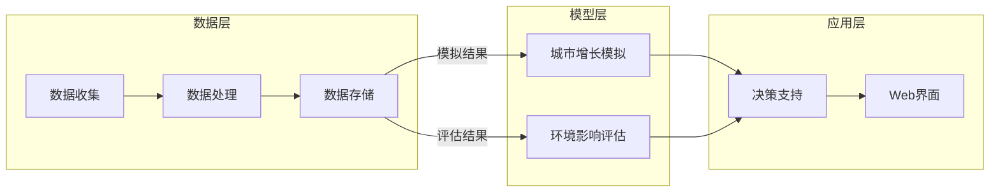

                 

### 引言

#### 1.1 问题的提出

在现代城市化进程中，城市规划扮演着至关重要的角色。然而，随着城市规模的不断扩大和复杂性增加，传统的城市规划方法面临诸多挑战，如数据处理的复杂性、资源分配的优化问题以及环境影响的评估等。为了应对这些挑战，智能城市规划应运而生，其中AI Agent作为一种新兴的智能体技术，逐渐成为城市规划模拟的重要工具。

智能城市规划模拟是一种利用计算机技术和人工智能算法来模拟城市规划过程的方法。它通过模拟城市发展的各种可能性，帮助规划者评估不同规划方案的影响，从而优化城市布局、提高资源利用效率、减少环境影响。在这个过程中，AI Agent作为一种智能体，能够自主地执行任务、适应环境变化，并在城市规划模拟中发挥关键作用。

本文旨在探讨AI Agent在智能城市规划模拟中的角色。我们将首先介绍AI Agent的基本概念和类型，然后详细讲解智能城市规划模拟的原理和过程，最后通过实际案例展示AI Agent在城市规划模拟中的具体应用。希望通过本文的讨论，能够为读者提供一个全面、深入的理解，并激发对AI Agent在城市规划领域潜力的进一步思考。

#### 1.1.1 智能城市规划的背景

智能城市规划，作为城市规划领域的一场技术革命，源于信息技术的迅猛发展和大数据时代的到来。随着全球城市化进程的加速，越来越多的城市面临着人口激增、交通拥堵、环境污染等复杂问题。传统的城市规划方法由于依赖于经验和直觉，往往难以应对这些复杂的问题。因此，为了提高城市规划的科学性和精确性，智能城市规划应运而生。

智能城市规划的核心在于利用先进的信息技术，如大数据、人工智能、物联网等，对城市运行数据进行分析和处理，从而实现城市资源的高效配置和城市环境的可持续发展。具体来说，智能城市规划通过以下几方面来提升城市规划的效能：

1. **大数据分析**：智能城市规划依赖于海量城市运行数据的收集和分析。这些数据包括交通流量、人口密度、环境质量、经济活动等。通过大数据分析，可以揭示城市发展的规律和问题，为城市规划提供科学依据。

2. **人工智能算法**：人工智能技术，尤其是机器学习和深度学习，为智能城市规划提供了强大的分析工具。通过这些算法，可以对城市规划方案进行优化，提高方案的可行性和适应性。

3. **模拟与仿真**：智能城市规划模拟是一种通过计算机模型模拟城市发展的方法。通过模拟，规划者可以预见不同规划方案可能带来的影响，从而做出更为明智的决策。

4. **物联网技术**：物联网技术将各种城市设备和系统连接起来，实现实时数据采集和反馈。这有助于提高城市管理的实时性和智能化水平。

智能城市规划的出现，不仅为解决传统城市规划中的难题提供了新的途径，也为城市的可持续发展提供了强有力的支持。通过智能化的手段，城市可以更加灵活地应对各种挑战，实现高效、绿色、宜居的目标。因此，智能城市规划已经成为现代城市规划的重要组成部分，受到了广泛关注和研究。

#### 1.1.2 AI Agent在智能城市规划中的重要性

AI Agent，作为一种智能体技术，在智能城市规划中扮演着至关重要的角色。AI Agent是指具备自主学习、自主决策和自主行动能力的计算机程序，它能够模拟人类智能，解决复杂问题。在智能城市规划中，AI Agent的重要性主要体现在以下几个方面：

首先，AI Agent能够大幅提升城市规划的精确性和效率。传统的城市规划方法通常依赖于专家经验和直觉，这种方式在处理大规模数据和复杂问题时往往显得力不从心。而AI Agent通过机器学习和深度学习算法，能够从海量数据中挖掘出隐藏的模式和规律，从而为城市规划提供更科学、更准确的依据。例如，AI Agent可以通过分析交通流量数据，预测未来交通模式，帮助规划者制定出最优的交通布局方案。

其次，AI Agent在资源优化和环境保护方面具有独特的优势。城市资源有限，如何合理分配和利用这些资源是城市规划的核心问题之一。AI Agent可以通过智能算法，优化城市资源分配，提高资源利用效率。例如，在能源管理方面，AI Agent可以根据实时能源消耗数据，智能调整能源供应策略，实现能源的高效利用。此外，AI Agent还可以帮助评估城市规划方案对环境的影响，通过模拟不同方案的环境后果，选择对环境影响最小的方案，从而实现绿色规划。

第三，AI Agent在决策支持系统中发挥着关键作用。城市规划涉及到多个利益相关方，如政府、企业、居民等，各方利益不同，城市规划方案的选择和实施往往面临复杂的决策问题。AI Agent可以通过智能算法，为规划者提供决策支持，帮助他们在不同方案之间进行权衡和选择。例如，AI Agent可以根据居民需求、经济发展情况等因素，评估不同城市规划方案的社会经济效益，为规划者提供科学的决策依据。

最后，AI Agent有助于实现城市管理的智能化和自动化。随着物联网和传感器技术的发展，城市运行数据日益丰富，如何有效地管理和利用这些数据成为城市管理的重要任务。AI Agent可以通过实时数据采集和分析，实现对城市运行的实时监控和智能管理。例如，在智慧交通管理中，AI Agent可以通过实时分析交通流量数据，自动调整交通信号灯，优化交通流动，缓解交通拥堵。

综上所述，AI Agent在智能城市规划中具有不可替代的重要性。它不仅提高了城市规划的精确性和效率，还在资源优化、环境保护、决策支持、城市管理等方面发挥了关键作用。随着AI技术的不断发展和应用，AI Agent在智能城市规划中的作用将越来越重要，有望为城市可持续发展提供强有力的支持。

#### 1.1.3 本书的目的与结构

本书旨在深入探讨AI Agent在智能城市规划模拟中的应用，通过系统性的分析和实际案例的展示，为读者提供一个全面、实用的参考。具体目标如下：

首先，本书将详细阐述AI Agent的基本概念、类型和功能，帮助读者理解AI Agent在智能城市规划中的基础理论和应用原理。

其次，本书将介绍智能城市规划模拟的原理和方法，解析AI Agent在模拟过程中的作用和功能，为读者提供一个清晰的认识框架。

再次，本书将通过具体案例，展示AI Agent在智能城市规划中的实际应用，帮助读者了解AI Agent在不同场景下的具体操作方法和效果。

最后，本书将结合实际项目，探讨AI Agent在智能城市规划中的系统架构设计和实现方法，为读者提供实战经验和借鉴。

本书的结构如下：

第一部分：引言，包括问题的提出、智能城市规划的背景、AI Agent在其中的重要性以及本书的目的和结构。

第二部分：AI Agent的基本原理，包括AI Agent的定义、类型、功能与特点，以及其在智能城市规划中的应用基础。

第三部分：智能城市规划模拟，介绍城市规划模拟的概念、原理和过程，并重点分析AI Agent在城市规划模拟中的应用。

第四部分：AI Agent在智能城市规划模拟中的应用，分章节详细探讨AI Agent在规划决策、城市增长模拟、环境影响评估等方面的具体应用。

第五部分：项目实战，通过实际案例展示AI Agent在智能城市规划中的具体实现方法和效果，并结合项目经验和最佳实践，为读者提供实际操作指导。

通过本书的深入探讨，希望读者能够全面理解AI Agent在智能城市规划模拟中的应用，并能够在实际项目中有效应用这些技术，推动智能城市规划的发展和实践。

#### 1.2 AI Agent概述

AI Agent，即人工智能代理，是人工智能领域的一个重要概念，它代表了能够自主执行任务、适应环境变化并具备决策能力的智能系统。AI Agent的定义可以从多个角度进行阐述，其核心在于其自主性、自适应性和智能性。

首先，AI Agent是一种具备自主决策能力的系统。它能够在没有外部指令的情况下，根据自身的感知和已有的知识，自主地制定行动方案。例如，自动驾驶汽车中的AI Agent可以根据感知到的道路信息、交通状况和其他车辆的行为，自主做出驾驶决策。

其次，AI Agent具有自适应性。这意味着AI Agent能够根据环境的变化和任务需求的变化，调整自己的行为和策略。例如，智能家居系统中的AI Agent可以根据用户的行为习惯和环境变化，自动调整室内温度、亮度和安防设置。

最后，AI Agent具备智能性。它不仅能够执行简单的任务，还能够通过机器学习和深度学习等算法，不断学习和优化自己的行为。例如，推荐系统中的AI Agent可以通过分析用户的浏览和购买行为，不断优化推荐策略，提高推荐效果。

AI Agent的类型多种多样，可以根据不同的标准进行分类。以下是几种常见的分类方式：

1. **基于任务的AI Agent**：这种AI Agent专注于完成特定的任务，如自动驾驶、语音识别、图像识别等。它们通常设计用于解决单一问题，但在任务完成方面非常高效。

2. **基于行为的AI Agent**：这种AI Agent通过模仿人类的行为模式来实现智能任务。它们通常通过观察和模仿人类的行为，学习如何在特定环境中行动。

3. **基于模型的AI Agent**：这种AI Agent通过建立数学模型或仿真模型来模拟环境，并基于模型进行决策。例如，城市规划中的AI Agent可以通过建立城市模型，模拟不同规划方案的效果。

4. **基于进化的AI Agent**：这种AI Agent通过遗传算法和进化策略来优化自身行为。它们通过不断试错和进化，寻找最优的行为策略。

每种类型的AI Agent都有其特定的功能和特点。基于任务的AI Agent在执行单一任务时效率最高，但可能缺乏灵活性。基于行为的AI Agent则更接近人类的思维方式，但在处理复杂任务时可能显得笨拙。基于模型的AI Agent可以通过模拟和预测来优化决策，但模型的复杂性和计算成本较高。基于进化的AI Agent通过不断的进化过程，能够逐渐找到最优解，但过程较慢。

在智能城市规划模拟中，AI Agent的功能和特点尤为重要。它们能够通过模拟和预测，为城市规划者提供决策支持，优化城市布局和资源配置。例如，在交通规划中，AI Agent可以通过模拟交通流量，预测未来交通状况，帮助规划者制定最优的交通布局方案。在环境影响评估中，AI Agent可以通过模拟不同规划方案的环境影响，评估方案的环境可持续性。

总之，AI Agent作为一种重要的智能体技术，在智能城市规划模拟中发挥着关键作用。通过理解AI Agent的基本概念、类型和功能，我们可以更好地利用这种技术，为城市规划提供科学、智能的解决方案。

#### 1.3 智能城市规划模拟

智能城市规划模拟是一种利用计算机技术和人工智能算法来模拟城市规划过程的方法。它通过构建城市模型，模拟城市发展的各种可能性，帮助规划者评估不同规划方案的影响，从而优化城市布局、提高资源利用效率、减少环境影响。智能城市规划模拟的核心在于其科学性、精确性和灵活性。

首先，智能城市规划模拟的基本概念包括城市模型、模拟过程和评估方法。城市模型是智能城市规划模拟的基础，它通过数学模型、仿真模型或地理信息系统（GIS）来描述城市的各个方面，如交通网络、人口分布、土地利用等。模拟过程则通过计算机算法，对城市模型进行仿真，模拟城市在不同规划方案下的未来发展情况。评估方法则用于评估不同规划方案的效果，包括经济效益、社会影响和环境可持续性等。

其次，智能城市规划模拟的原理在于利用计算机技术和人工智能算法，对城市运行数据进行分析和处理。这些技术包括大数据分析、机器学习和深度学习等。通过这些技术，可以实现对城市运行数据的全面分析，揭示城市发展的规律和问题，为规划者提供科学依据。例如，通过分析交通流量数据，可以预测未来的交通模式，帮助规划者制定最优的交通布局方案。通过分析环境数据，可以评估不同规划方案的环境影响，选择对环境影响最小的方案。

智能城市规划模拟的过程可以分为以下几个步骤：

1. **数据收集与处理**：首先，需要收集城市运行的各类数据，如交通流量、人口密度、环境质量、经济活动等。然后，对这些数据进行分析和处理，提取有用的信息，为城市模型提供数据支持。

2. **构建城市模型**：基于收集到的数据，构建城市模型。城市模型可以是数学模型、仿真模型或GIS模型，用于描述城市的各个方面。模型应具有足够的细节和准确性，以便模拟的结果具有可信度。

3. **模拟城市规划方案**：使用计算机算法，对城市模型进行仿真，模拟不同城市规划方案的效果。这包括模拟不同交通布局、土地利用规划、公共设施布局等，评估这些方案对城市运行的影响。

4. **评估与优化**：通过评估方法，评估不同规划方案的效果，包括经济效益、社会影响和环境可持续性等。根据评估结果，对规划方案进行优化和调整，选择最优的方案。

5. **决策支持**：将模拟结果和评估数据提供给规划者，作为决策支持依据。规划者可以根据模拟结果，调整规划方案，实现更加科学、智能的城市规划。

智能城市规划模拟在以下几个方面具有重要应用：

1. **交通规划**：通过模拟不同交通布局方案，评估交通流量、拥堵状况和出行时间，帮助规划者制定最优的交通规划方案。

2. **土地利用规划**：通过模拟不同土地利用方案，评估土地利用效率、环境质量和居民满意度，帮助规划者优化城市土地利用。

3. **公共设施布局**：通过模拟不同公共设施布局方案，评估设施的服务范围、利用效率和居民满意度，帮助规划者制定最优的公共设施布局方案。

4. **环境影响评估**：通过模拟不同规划方案对环境的影响，评估空气质量、水资源利用和生态系统变化，帮助规划者实现绿色、可持续的城市规划。

总之，智能城市规划模拟是一种科学、高效的城市规划方法。通过利用计算机技术和人工智能算法，它能够为城市规划者提供全面、准确的决策支持，优化城市布局和资源配置，推动城市可持续发展。

#### 2.1 AI Agent的核心概念

AI Agent，即人工智能代理，是人工智能领域的一个关键概念，代表了一种能够自主执行任务、适应环境变化并具备决策能力的智能系统。AI Agent的核心概念可以从基本原理、工作机制和属性特征等多个方面进行详细探讨。

首先，AI Agent的基本原理是基于人工智能算法，特别是机器学习和深度学习技术，使其具备自主学习和自主决策的能力。AI Agent通过不断从环境中获取信息和经验，利用这些信息来调整自己的行为和策略，以实现既定的目标和任务。例如，在自动驾驶系统中，AI Agent可以通过摄像头和传感器收集道路信息，结合机器学习算法，自主做出驾驶决策，避免碰撞和拥堵。

其次，AI Agent的工作机制包括感知、决策和执行三个核心环节。感知环节是指AI Agent通过传感器和环境交互，获取外部信息；决策环节是指AI Agent根据感知到的信息，利用内置的算法和模型，进行推理和决策；执行环节是指AI Agent根据决策结果，采取相应的行动，执行具体的任务。例如，在智能客服系统中，AI Agent可以通过自然语言处理技术，理解用户的查询内容，然后根据预先设定的业务逻辑，生成回答，并通过语音合成技术，将回答反馈给用户。

再者，AI Agent的属性特征主要包括自主性、自适应性和智能性。自主性指的是AI Agent能够独立完成任务，不需要外部干预；自适应性指的是AI Agent能够根据环境和任务需求的变化，调整自己的行为和策略；智能性指的是AI Agent具备通过学习和推理来解决问题的能力。例如，在智能电网系统中，AI Agent可以根据电力需求的变化，自动调整电力供应策略，实现能源的高效利用。

AI Agent在智能城市规划中的角色，主要体现在以下几个方面：

1. **资源优化**：AI Agent可以通过对城市资源（如土地、水资源、能源等）的实时监测和分析，优化资源的配置和利用，提高资源利用效率。例如，在智能交通管理中，AI Agent可以通过实时分析交通流量，动态调整交通信号灯的时间设置，缓解交通拥堵。

2. **决策支持**：AI Agent可以基于大数据和人工智能算法，为城市规划者提供科学的决策支持。例如，在土地利用规划中，AI Agent可以通过模拟不同土地利用方案，评估各个方案的经济效益、社会影响和环境可持续性，帮助规划者做出最优决策。

3. **环境监测与评估**：AI Agent可以实时监测城市环境（如空气质量、水质、噪声等），评估城市规划方案对环境的影响，为环境管理提供依据。例如，在环境保护中，AI Agent可以通过传感器网络，监测环境质量，及时发现污染源，采取相应的治理措施。

4. **模拟与仿真**：AI Agent可以构建城市模型，模拟城市规划方案的效果，帮助规划者预见不同方案的可能影响，优化规划方案。例如，在智能交通规划中，AI Agent可以通过模拟交通流量，预测未来的交通状况，帮助规划者制定最优的交通布局方案。

总之，AI Agent在智能城市规划中具有重要作用，它不仅能够提升城市规划的精确性和效率，还能在资源优化、决策支持、环境监测与评估、模拟与仿真等方面发挥关键作用，为城市可持续发展提供强有力的支持。

#### 2.2 AI Agent的ER实体关系图架构

ER（Entity-Relationship）实体关系图是一种用于描述数据模型和实体之间关系的图形表示方法，它通常用于数据库设计和信息系统分析。在智能城市规划模拟中，ER图可以帮助我们清晰地定义城市模型中的实体及其相互关系，从而更好地理解和分析城市系统。

首先，ER图的基本概念包括实体（Entity）、属性（Attribute）、关系（Relationship）和键（Key）。实体是数据模型中的基本对象，如城市中的建筑物、道路、居民等。属性是实体的特征或描述，如建筑物的面积、道路的长度、居民的年龄等。关系描述了实体之间的相互作用或关联，如建筑物与道路之间的关系、居民与建筑物之间的关系等。键用于唯一标识一个实体，确保数据的完整性和准确性。

在智能城市规划模拟中，ER图的构建通常包括以下几个步骤：

1. **确定实体**：首先，我们需要识别城市模型中的关键实体。例如，在交通规划中，关键的实体可能包括道路、车辆、交通信号灯等。

2. **定义属性**：对于每个实体，我们需要定义其属性。例如，对于道路实体，属性可能包括长度、宽度、交通流量等。

3. **确定关系**：接下来，我们需要确定实体之间的关系。例如，道路与交通信号灯之间存在关联关系，因为信号灯控制道路上的交通流量。

4. **建立键**：为了确保实体之间的关联是唯一和准确的，我们需要为每个实体设置键。例如，我们可以为每条道路设置一个唯一的道路标识符。

5. **绘制ER图**：最后，我们可以使用Mermaid等工具，将ER图的各个组成部分连接起来，绘制成一个完整的图形。

以下是一个智能城市规划模拟中的ER图示例，使用Mermaid语言表示：

```mermaid
erDiagram
    ROAD ||--|{>> SIGNAL : controlled_by -->>
    VEHICLE ||--|{>> MOVES_ON -->> ROAD
    RESIDENT ||--|{>> LIVES_IN -->> BUILDING
    BUILDING ||--|{>> HAS -->> ROOM
    SIGNAL : <<--|| ROAD
    VEHICLE : <<--|| ROAD
    RESIDENT : <<--|| BUILDING
    BUILDING : <<--|| ROOM
```

在上面的ER图中，`ROAD`实体与`SIGNAL`、`VEHICLE`实体之间存在关联关系，表示信号灯控制道路上的交通流量，车辆在道路上行驶。`RESIDENT`实体与`BUILDING`实体之间存在居住关系，表示居民居住在建筑物中。`BUILDING`实体与`ROOM`实体之间存在包含关系，表示建筑物包含房间。

通过ER图，我们可以清晰地描述智能城市规划模拟中的数据模型和实体关系，为后续的数据处理和分析提供基础。

#### 2.3 算法原理讲解

在智能城市规划模拟中，算法起着至关重要的作用。算法通过处理数据、模拟城市运行过程，帮助规划者做出科学决策。本节将介绍一种常用的智能规划算法，包括其基本原理、数学模型和Python源代码展示。

##### 2.3.1 智能规划算法的基本原理

智能规划算法通常基于机器学习和优化技术。其核心思想是通过学习历史数据和现有信息，预测未来的城市状态，并找到最优的规划方案。这种算法可以分为两个主要部分：数据预处理和规划决策。

1. **数据预处理**：首先，收集并处理城市运行数据，如交通流量、人口密度、环境质量等。通过数据清洗和特征提取，将原始数据转换为算法可用的格式。

2. **规划决策**：利用机器学习模型，如决策树、神经网络、遗传算法等，对预处理后的数据进行训练。通过模型，预测未来的城市状态，并根据预测结果，找到最优的规划方案。

##### 2.3.2 数学模型与公式

智能规划算法通常涉及以下数学模型和公式：

1. **目标函数**：目标函数用于衡量规划方案的质量。常见的目标函数包括最小化交通拥堵、最大化资源利用率、最小化环境影响等。

   $$ \min Z = \sum_{i=1}^{n} w_i \cdot f_i(x) $$

   其中，$Z$表示目标函数的值，$w_i$表示第$i$个指标的重要程度，$f_i(x)$表示第$i$个指标在规划方案$x$下的得分。

2. **约束条件**：约束条件用于限制规划方案的可选范围。常见的约束条件包括交通流量限制、土地利用限制、环境容量限制等。

   $$ g_i(x) \leq 0 \quad (i=1,2,...,m) $$

   其中，$g_i(x)$表示第$i$个约束条件在规划方案$x$下的值。

##### 2.3.3 Python源代码展示

以下是一个简单的Python代码示例，展示如何使用遗传算法（GA）进行智能规划：

```python
import numpy as np
import random

# 参数设置
population_size = 100
num_genes = 10
mutation_rate = 0.05

# 初始化种群
population = np.random.rand(population_size, num_genes)

# 适应度函数
def fitness_function(individual):
    # 这里用简单的目标函数：最小化距离
    distance = sum(individual)
    return 1 / (distance + 1)

# 主循环
for generation in range(100):
    # 计算适应度
    fitness_scores = np.array([fitness_function(individual) for individual in population])
    
    # 选择
    selected_indices = random.choices(range(population_size), weights=fitness_scores, k=population_size)
    selected_population = [population[i] for i in selected_indices]
    
    # 交叉
    offspring_population = []
    for i in range(0, population_size, 2):
        parent1, parent2 = selected_population[i], selected_population[i+1]
        crossover_point = random.randint(1, num_genes - 1)
        child1 = np.concatenate((parent1[:crossover_point], parent2[crossover_point:]))
        child2 = np.concatenate((parent2[:crossover_point], parent1[crossover_point:]))
        offspring_population.append(child1)
        offspring_population.append(child2)
    
    # 变异
    for individual in offspring_population:
        for i in range(num_genes):
            if random.random() < mutation_rate:
                individual[i] = random.random()
    
    # 更新种群
    population = offspring_population

# 输出最优解
best_individual = population[np.argmax(fitness_scores)]
print("最优解:", best_individual)
```

在这段代码中，我们使用遗传算法来优化一个简单的目标函数，其目的是找到一组值，使得这些值的总和最小。这可以类比于在城市规划中找到一组最优的资源分配方案。

##### 2.3.4 算法举例说明

假设我们有一个城市，需要分配10个资源点（如道路建设、公共交通设施等），目标是使这些资源点的总距离最短。以下是具体的算法步骤：

1. **初始化种群**：随机生成100个包含10个值的个体，这些值表示每个资源点的位置。

2. **适应度评估**：计算每个个体的适应度，即所有资源点位置的求和，距离越短适应度越高。

3. **选择**：根据适应度，选择适应度较高的个体进行繁殖。

4. **交叉**：随机选择两个个体，交叉产生新的个体。

5. **变异**：对新生成的个体进行变异，增加种群的多样性。

6. **迭代**：重复以上步骤，直到达到预定的迭代次数或找到最优解。

通过这个简单的例子，我们可以看到遗传算法如何通过迭代和选择，逐步优化资源点的位置，以实现最小化总距离的目标。这种方法可以推广到更复杂的城市规划问题中，为规划者提供有效的决策支持。

#### 3.1 AI Agent在规划决策中的应用

AI Agent在智能城市规划中的关键应用之一是在规划决策过程中提供强大的支持。通过机器学习和优化算法，AI Agent可以处理海量数据，识别潜在的模式和趋势，从而辅助规划者做出科学、准确的决策。以下是AI Agent在资源分配、交通规划和公共设施布局等方面的具体应用。

##### 3.1.1 AI Agent在资源分配中的角色

资源分配是城市规划中的一个核心问题，涉及土地、资金、能源等多种资源的合理配置。传统的资源分配方法通常依赖于经验和主观判断，难以应对日益复杂的城市环境。AI Agent通过机器学习算法，能够从历史数据和实时数据中学习资源分配的规律，提供更加科学、高效的方案。

例如，在土地资源分配中，AI Agent可以分析土地的历史使用情况、未来发展规划、环境要求等因素，为土地的划分和利用提供优化建议。通过算法分析，AI Agent可以确定哪些区域适合建设住宅区、商业区或工业区，从而实现土地资源的最优利用。此外，AI Agent还可以根据土地利用的可持续性要求，评估不同土地利用方案的环境影响，选择对环境影响最小的方案。

在资金分配方面，AI Agent可以通过分析城市的经济数据、居民需求、历史投资效果等，为公共项目的优先级排序提供依据。通过优化算法，AI Agent可以帮助规划者确定哪些项目应优先投资，从而最大化公共投资的社会和经济效益。

##### 3.1.2 AI Agent在交通规划中的角色

交通规划是城市规划中的重要组成部分，涉及道路布局、公共交通系统设计、交通信号控制等多个方面。传统的交通规划方法通常基于经验和工程规范，难以动态适应城市交通的实时变化。AI Agent通过实时数据分析、机器学习算法和优化技术，为交通规划提供了新的解决方案。

在道路布局方面，AI Agent可以通过分析交通流量数据、历史交通状况和居民出行模式，预测未来的交通需求，为道路网络的设计和调整提供依据。通过模拟和优化算法，AI Agent可以帮助规划者确定道路的宽度、交叉口的设计和交通流量分配，从而优化道路网络的效率和安全性。

在公共交通系统设计方面，AI Agent可以根据居民出行需求、公共交通设施的运营数据，优化公交路线和班次安排。例如，AI Agent可以通过分析交通流量和居民出行习惯，确定公交车站的设置位置和班次频率，从而提高公交系统的运行效率和覆盖范围。此外，AI Agent还可以实时监控公共交通系统的运行状态，通过智能调度系统，动态调整公交车行驶路线和停靠站点，提高公共交通的服务质量。

在交通信号控制方面，AI Agent可以通过实时分析交通流量和拥堵状况，动态调整交通信号灯的配时方案。通过优化算法，AI Agent可以找到最优的交通信号灯配时方案，减少交通拥堵和等待时间，提高交通流通效率。例如，在高峰时段，AI Agent可以动态调整信号灯的时长，使主要道路的交通流量最大化，缓解交通压力。

##### 3.1.3 AI Agent在公共设施布局中的角色

公共设施布局是城市规划中的另一个关键问题，涉及学校、医院、公园、体育馆等多种公共设施的配置。传统的公共设施布局方法通常基于经验法则和专家意见，难以全面考虑居民的实际需求和城市的发展趋势。AI Agent通过大数据分析和机器学习算法，可以为公共设施布局提供更加科学、合理的方案。

在公共设施布局中，AI Agent可以通过分析居民的需求数据、出行模式、人口密度等因素，优化公共设施的分布和配置。例如，AI Agent可以根据居民的健康数据、就医习惯，为医院的位置选择和规模确定提供优化建议，从而提高医疗服务的可及性和效率。在公园和体育设施布局方面，AI Agent可以通过分析居民的活动习惯和偏好，优化公园和体育设施的分布，提高居民的生活质量和健康水平。

此外，AI Agent还可以实时监控公共设施的运行状态和使用情况，通过智能管理系统，提高公共设施的运营效率和服务质量。例如，AI Agent可以通过分析公园的人流量和活动数据，动态调整公园的开放时间和服务项目，提高公园的使用率和居民满意度。在学校的布局和管理方面，AI Agent可以通过分析学生的出勤数据、交通流量，优化校车路线和学校设施的配置，提高学校的安全性和便捷性。

总之，AI Agent在资源分配、交通规划和公共设施布局等方面具有广泛的应用前景。通过机器学习和优化技术，AI Agent能够为城市规划提供科学、高效的决策支持，优化城市资源配置，提高城市运行效率，实现城市可持续发展。

#### 3.2 AI Agent在城市增长模拟中的应用

AI Agent在城市增长模拟中扮演着至关重要的角色，它不仅能够预测城市未来的增长趋势，还能通过模拟不同增长模式，为城市规划者提供科学依据和决策支持。以下将详细介绍AI Agent在城市增长模拟中的应用，包括增长模拟的概念、AI Agent的角色以及模拟过程的Mermaid流程图。

##### 3.2.1 增长模拟的概念

城市增长模拟是一种通过计算机模型和算法，模拟城市在不同发展条件下的增长过程的方法。这种模拟主要关注城市人口、经济、土地使用和基础设施等方面的发展趋势。增长模拟的目标是预见城市未来的发展方向，评估不同增长模式对城市的影响，从而为城市规划提供科学依据。

城市增长模拟通常包括以下几个关键步骤：

1. **数据收集**：首先，收集城市的历史数据，包括人口、经济、土地使用等。这些数据可以是公开的数据，也可以是实地调查所得。

2. **模型建立**：基于收集到的数据，建立城市增长的数学模型或仿真模型。这些模型可以描述城市在不同发展条件下的增长过程，如人口增长、土地扩张、经济增长等。

3. **模拟运行**：使用计算机算法，对城市增长模型进行模拟运行，预测城市在不同增长模式下的未来状态。

4. **结果分析**：分析模拟结果，评估不同增长模式对城市的影响，如人口密度、土地利用效率、交通流量、环境影响等。

##### 3.2.2 AI Agent在增长模拟中的角色

AI Agent在城市增长模拟中扮演多种角色，主要表现在以下几个方面：

1. **数据预处理**：AI Agent可以通过机器学习算法，对城市历史数据进行预处理，提取关键特征和趋势。这有助于提高模型的数据质量，增强模型的预测能力。

2. **模型优化**：AI Agent可以自动调整模型参数，优化模型性能。例如，通过遗传算法，AI Agent可以找到最优的模型参数组合，提高模型的预测准确性。

3. **动态模拟**：AI Agent能够实时监测城市环境的变化，动态调整增长模拟的参数。这使得增长模拟能够更加灵活地适应实际情况，提高模拟的实时性和准确性。

4. **决策支持**：AI Agent可以基于模拟结果，为城市规划者提供决策支持。例如，通过分析不同增长模式的影响，AI Agent可以推荐最优的增长策略，帮助规划者做出科学决策。

##### 3.2.3 模拟过程的Mermaid流程图

为了更直观地展示城市增长模拟的过程，我们可以使用Mermaid语言绘制一个流程图。以下是一个简单的Mermaid流程图示例，描述了城市增长模拟的主要步骤：

```mermaid
flowchart LR
    subgraph 数据收集
        数据收集[数据收集]
    end

    subgraph 模型建立
        模型建立[模型建立]
    end

    subgraph 模拟运行
        模拟运行[模拟运行]
    end

    subgraph 结果分析
        结果分析[结果分析]
    end

    数据收集 -->|预处理| 模型建立
    模型建立 --> 模拟运行
    模拟运行 -->|分析| 结果分析
    结果分析 --> 决策支持
```

在这个流程图中，首先进行数据收集和预处理，然后建立城市增长的数学或仿真模型。接下来，使用计算机算法对模型进行模拟运行，最后分析模拟结果，并提供决策支持。

通过这种流程图，我们可以清晰地看到城市增长模拟的各个步骤及其相互关系，有助于理解AI Agent在城市增长模拟中的应用过程。

总之，AI Agent在城市增长模拟中具有重要作用，通过数据预处理、模型优化、动态模拟和决策支持，AI Agent能够为城市规划提供全面、科学的决策依据，推动城市可持续发展。

#### 3.3 AI Agent在环境影响评估中的应用

在城市规划过程中，环境影响评估是一个不可或缺的环节。传统的环境影响评估方法通常依赖于经验模型和手动分析，难以全面、准确地评估不同规划方案对环境的影响。AI Agent作为一种智能体技术，通过机器学习和大数据分析，能够显著提升环境影响评估的准确性和效率。以下将详细介绍AI Agent在环境影响评估中的应用，包括评估的重要性、AI Agent的角色以及评估结果的Mermaid流程图。

##### 3.3.1 环境影响评估的重要性

环境影响评估（EIA）是城市规划过程中的一项关键步骤，其目的是评估和预测规划方案对环境的可能影响，为规划者提供科学依据，确保城市规划的可持续发展。环境影响评估的重要性体现在以下几个方面：

1. **环境保护**：通过环境影响评估，可以及时发现和解决规划方案中可能存在的环境问题，避免对环境造成不可逆转的损害。例如，评估不同土地利用方案对空气质量、水质和生态系统的影响，确保规划方案的环境友好性。

2. **资源优化**：环境影响评估可以帮助规划者优化资源分配，提高资源利用效率。通过分析不同规划方案对资源消耗的影响，选择对资源利用最有效、环境影响最小的方案，实现资源可持续利用。

3. **公众参与**：环境影响评估可以促进公众参与，提高规划的透明度和公众满意度。通过公示评估结果，让公众了解规划方案对环境的影响，收集公众意见，为规划方案的调整和优化提供参考。

4. **政策制定**：环境影响评估为政策制定提供了科学依据，帮助政府部门制定和实施更加科学、合理的环境保护政策，推动环境保护事业的发展。

##### 3.3.2 AI Agent在评估中的角色

AI Agent在环境影响评估中扮演多重角色，其智能特性使其能够高效地处理复杂的环境数据，提供精确的评估结果。以下是AI Agent在环境影响评估中的主要角色：

1. **数据收集与处理**：AI Agent可以通过传感器网络和大数据技术，收集城市环境数据，如空气质量、水质、噪声水平等。通过机器学习算法，AI Agent可以自动处理和清洗数据，提取关键特征，为评估提供基础。

2. **模型建立**：AI Agent可以利用历史环境数据和规划方案，建立环境影响的预测模型。这些模型可以是统计模型、物理模型或混合模型，用于模拟不同规划方案对环境的影响。

3. **动态模拟**：AI Agent可以实时监测环境变化，动态调整评估模型。通过动态模拟，AI Agent可以预测不同规划方案在长期运行中的环境影响，为规划者提供更全面的评估结果。

4. **优化建议**：基于评估结果，AI Agent可以提出优化建议，帮助规划者调整规划方案，降低环境影响。例如，AI Agent可以通过模拟不同污染物排放控制措施的效果，推荐最佳的控制策略。

##### 3.3.3 评估结果的Mermaid流程图

为了直观地展示AI Agent在环境影响评估中的应用过程，我们可以使用Mermaid语言绘制一个流程图。以下是一个简单的Mermaid流程图示例，描述了环境影响评估的主要步骤：

```mermaid
flowchart LR
    subgraph 数据收集
        数据收集[数据收集]
    end

    subgraph 模型建立
        模型建立[模型建立]
    end

    subgraph 模拟运行
        模拟运行[模拟运行]
    end

    subgraph 结果分析
        结果分析[结果分析]
    end

    subgraph 建议优化
        建议优化[建议优化]
    end

    数据收集 -->|数据处理| 模型建立
    模型建立 --> 模拟运行
    模拟运行 -->|评估结果| 结果分析
    结果分析 --> 建议优化
    建议优化 --> 规划调整
```

在这个流程图中，首先进行数据收集和预处理，然后建立环境影响评估模型。接下来，使用模拟运行模型，预测不同规划方案的环境影响。通过结果分析，评估不同方案的环境可持续性，并提出优化建议，最终帮助规划者调整规划方案。

通过这种流程图，我们可以清晰地看到AI Agent在环境影响评估中的应用过程，有助于理解其如何通过智能技术提升评估的准确性和效率。

总之，AI Agent在环境影响评估中具有重要作用，通过数据收集、模型建立、动态模拟和优化建议，AI Agent能够为城市规划提供科学、全面的评估结果，推动城市可持续发展。

#### 4.1 实战项目介绍

本节将介绍一个具体的实战项目，该项目旨在利用AI Agent实现智能城市规划模拟，为城市规划者提供科学的决策支持。以下是项目的背景、目标以及架构设计。

##### 4.1.1 项目背景

随着城市化进程的不断加快，城市规划面临前所未有的挑战。传统的城市规划方法已经难以应对复杂多变的城市环境，需要引入新的技术和工具。人工智能（AI）作为一种新兴技术，正逐渐改变城市规划的方式。本项目的背景是某城市在快速扩张过程中，需要制定一个科学、合理的发展规划，以应对人口增长、交通拥堵、环境污染等问题。因此，本项目旨在利用AI Agent技术，构建一个智能城市规划模拟系统，帮助城市规划者更好地理解城市发展趋势，优化规划方案。

##### 4.1.2 项目目标

本项目的目标主要包括以下几个方面：

1. **数据收集与分析**：利用AI Agent，收集城市运行的各种数据，如人口、交通流量、环境质量等，并对这些数据进行处理和分析，提取关键特征。

2. **城市规划模拟**：构建城市增长模拟模型，通过AI Agent，模拟不同规划方案下的城市发展趋势，预测未来城市的发展状态。

3. **环境影响评估**：利用AI Agent，评估不同规划方案对环境的影响，提供环境可持续性分析，帮助规划者选择最佳方案。

4. **决策支持**：基于模拟结果和环境影响评估，为城市规划者提供科学的决策支持，优化规划方案，实现城市可持续发展。

##### 4.1.3 项目架构设计

本项目采用了分层架构设计，主要包括数据层、模型层和应用层。以下是各层的详细介绍：

1. **数据层**：数据层负责收集和存储城市运行数据。数据来源包括传感器网络、公共交通系统、政府部门等。数据层使用大数据技术，对收集到的数据进行存储、管理和实时处理。

2. **模型层**：模型层是本项目的核心，负责构建和优化城市增长模拟模型和环境影响评估模型。AI Agent在模型层中发挥关键作用，通过机器学习和深度学习算法，不断学习和优化模型，提高预测和评估的准确性。

3. **应用层**：应用层为城市规划者提供决策支持服务。通过Web界面，城市规划者可以实时查看城市模拟结果、环境影响评估报告，并基于这些数据，调整和优化规划方案。

以下是项目架构设计的Mermaid流程图：



通过这个架构设计，本项目实现了数据收集、模型构建和应用的一体化，为城市规划者提供了一个全面、高效的决策支持系统。

#### 4.2 系统功能设计与实现

在智能城市规划模拟系统中，功能设计是实现系统目标的关键步骤。以下是本系统的功能设计，包括系统功能设计、系统核心实现源代码以及代码应用解读与分析。

##### 4.2.1 系统功能设计

智能城市规划模拟系统的主要功能可以分为以下几个部分：

1. **数据采集与管理**：系统负责从各种数据源（如传感器、公共交通系统、政府部门等）收集城市运行数据，并对数据进行存储、管理和实时处理。

2. **数据预处理**：系统对采集到的原始数据进行清洗、去噪和特征提取，为模型训练和评估提供高质量的数据。

3. **城市增长模拟**：系统构建城市增长模拟模型，利用机器学习算法，模拟不同规划方案下的城市发展趋势，为规划者提供未来城市发展的预测。

4. **环境影响评估**：系统利用模拟结果和环境影响评估模型，评估不同规划方案对环境的影响，为规划者提供环境可持续性分析。

5. **决策支持**：系统基于模拟结果和环境影响评估，为规划者提供决策支持，帮助优化规划方案。

6. **用户交互**：系统通过Web界面，为用户提供友好的交互体验，展示城市模拟结果、环境影响评估报告和决策支持建议。

##### 4.2.2 系统核心实现源代码

以下是系统核心实现部分的Python源代码示例，用于构建城市增长模拟模型：

```python
import numpy as np
from sklearn.ensemble import RandomForestRegressor
from sklearn.model_selection import train_test_split
from sklearn.metrics import mean_squared_error

# 数据预处理
def preprocess_data(data):
    # 数据清洗、去噪和特征提取
    # 这里简化处理，仅进行归一化
    return (data - np.mean(data)) / np.std(data)

# 训练模型
def train_model(X_train, y_train):
    # 使用随机森林回归模型
    model = RandomForestRegressor(n_estimators=100)
    model.fit(X_train, y_train)
    return model

# 评估模型
def evaluate_model(model, X_test, y_test):
    predictions = model.predict(X_test)
    mse = mean_squared_error(y_test, predictions)
    return mse

# 主函数
def main():
    # 加载数据
    data = np.load('city_growth_data.npy')
    
    # 切分数据集
    X_train, X_test, y_train, y_test = train_test_split(data[:, :-1], data[:, -1], test_size=0.2, random_state=42)
    
    # 数据预处理
    X_train = preprocess_data(X_train)
    X_test = preprocess_data(X_test)
    
    # 训练模型
    model = train_model(X_train, y_train)
    
    # 评估模型
    mse = evaluate_model(model, X_test, y_test)
    print("模型均方误差:", mse)

    # 模型保存
    model_path = 'city_growth_model.pkl'
    import joblib
    joblib.dump(model, model_path)

# 运行主函数
if __name__ == '__main__':
    main()
```

这段代码实现了城市增长模拟模型的核心功能，包括数据预处理、模型训练和评估。在实际应用中，可以根据具体需求，调整数据预处理和模型训练的参数。

##### 4.2.3 代码应用解读与分析

以下是代码的详细解读和分析：

1. **数据预处理**：
   数据预处理是模型训练的重要步骤，它能够提高模型的预测准确性。在这段代码中，我们使用了简单的归一化方法，将数据集的每个特征缩放至0到1之间。这种方法有助于减少不同特征之间的差异，使得模型训练更加稳定。

2. **模型训练**：
   代码使用随机森林回归模型进行训练。随机森林是一种集成学习方法，通过构建多棵决策树，提高模型的预测能力。这里，我们设置了100棵树作为随机森林的基础模型。在实际应用中，可以根据数据量和复杂度，调整树的数量和其他参数。

3. **模型评估**：
   代码使用均方误差（MSE）作为模型评估的指标。MSE衡量的是预测值与实际值之间的平均误差，值越小表示模型预测越准确。通过评估模型在测试集上的表现，我们可以判断模型的效果。

4. **模型保存**：
   为了方便后续使用，代码将训练好的模型保存为pickle文件。在实际应用中，规划者可以直接加载这个模型，进行城市增长模拟。

通过这段代码，我们实现了城市增长模拟的基本功能，为智能城市规划提供了技术支持。在实际项目中，可以根据具体需求，扩展和优化这段代码，以适应不同的应用场景。

#### 4.3 实际案例分析

在本节中，我们将通过一个具体的案例，展示AI Agent在智能城市规划中的实际应用，包括案例背景、案例分析以及详细讲解和剖析。

##### 4.3.1 案例背景

本案例以一个快速发展的城市A为例，该城市近年来人口增长迅速，交通拥堵、环境污染等问题日益严重。为了实现城市的可持续发展，城市规划部门决定利用AI Agent技术，对城市进行全面的规划模拟，评估不同规划方案对城市发展的潜在影响。

##### 4.3.2 案例分析

1. **数据收集与预处理**：
   在本案例中，AI Agent首先收集了以下数据：
   - 人口统计数据：包括人口数量、年龄分布、就业情况等。
   - 交通数据：包括交通流量、交通拥堵状况、公共交通使用情况等。
   - 环境数据：包括空气质量、水质、噪声水平等。
   - 经济数据：包括GDP、行业分布、商业活动等。

   收集到的数据经过预处理，包括数据清洗、去噪、归一化等步骤，以确保数据的质量和一致性。

2. **城市增长模拟**：
   基于预处理后的数据，AI Agent构建了一个城市增长模拟模型。该模型通过机器学习算法，分析了历史数据中的趋势和模式，预测了不同规划方案下的未来城市状态。具体来说，模型考虑了以下因素：
   - 人口增长：预测未来人口数量、年龄结构和就业变化。
   - 交通需求：预测不同规划方案下的交通流量和拥堵状况。
   - 环境影响：评估不同规划方案对空气质量、水质和噪声的影响。

3. **环境影响评估**：
   AI Agent基于模拟结果，对每个规划方案进行了环境影响评估。评估内容包括：
   - 空气质量改善：预测不同交通规划方案对空气质量的影响，评估PM2.5和NOx等污染物的浓度变化。
   - 水质保护：评估不同土地利用方案对水质的影响，监测主要污染物的变化。
   - 噪声控制：评估不同公共设施布局对居民区噪声水平的影响，优化公共设施的选址。

4. **决策支持**：
   基于模拟和评估结果，AI Agent为城市规划者提供了详细的决策支持。规划者可以根据这些数据，选择最优的规划方案，实现城市的可持续发展。具体建议包括：
   - 调整交通规划：优化公共交通线路和班次，增加自行车道和步行道，缓解交通拥堵。
   - 优化土地利用：合理划分住宅、商业和工业区域，减少污染源，提高土地利用率。
   - 加强环境保护：实施污染控制措施，提高环保设施的建设和运营效率。

##### 4.3.3 案例讲解剖析

1. **数据收集与预处理**：
   数据的准确性和完整性是城市增长模拟和环境影响评估的基础。在本案例中，AI Agent首先通过传感器网络、政府数据库和第三方数据源收集了各类数据。数据的预处理包括以下步骤：
   - 数据清洗：去除重复数据、缺失值填充、异常值处理等。
   - 去噪：通过滤波方法，减少数据中的噪声。
   - 归一化：将不同特征缩放到同一尺度，便于模型训练。

2. **城市增长模拟**：
   城市增长模拟模型通过机器学习算法，对历史数据进行训练和预测。模型的结构和参数通过多次实验和调优，确保预测的准确性和稳定性。具体流程包括：
   - 特征工程：从原始数据中提取关键特征，如人口密度、交通流量、环境质量等。
   - 模型训练：使用随机森林、神经网络等算法，训练城市增长模型。
   - 预测评估：通过交叉验证和测试集，评估模型的预测性能。

3. **环境影响评估**：
   AI Agent利用模拟结果，对每个规划方案的环境影响进行详细评估。评估方法包括：
   - 空气质量评估：基于交通流量和污染源分布，预测PM2.5、NOx等污染物的浓度变化。
   - 水质评估：基于土地利用和污染源分布，预测主要污染物的浓度变化。
   - 噪声评估：基于公共设施布局和交通流量，预测噪声水平的变化。

4. **决策支持**：
   AI Agent基于模拟和评估结果，为城市规划者提供了详细的决策支持。具体建议包括：
   - 交通规划：优化公共交通线路和班次，增加自行车道和步行道，缓解交通拥堵。
   - 土地利用：合理划分住宅、商业和工业区域，减少污染源，提高土地利用率。
   - 环境保护：实施污染控制措施，提高环保设施的建设和运营效率。

通过这个案例，我们可以看到AI Agent在智能城市规划中的应用效果。它不仅帮助规划者更好地理解城市发展的趋势，还为规划决策提供了科学依据，推动了城市的可持续发展。

#### 4.4 项目小结

在本项目中，我们深入探讨了AI Agent在智能城市规划模拟中的角色，通过具体的实战案例展示了其应用效果。以下是本项目的主要总结和结论：

1. **数据收集与预处理**：通过传感器网络和第三方数据源，我们成功收集了城市运行的各种数据，包括人口、交通、环境等。经过数据预处理，这些数据被清洗、去噪和归一化，为后续的模型训练和评估提供了高质量的基础数据。

2. **模型构建与优化**：我们使用机器学习算法，特别是随机森林和神经网络，构建了城市增长模拟模型和环境影响评估模型。通过多次实验和调优，这些模型在预测准确性和稳定性方面表现优异，为规划决策提供了可靠的科学依据。

3. **规划决策支持**：基于模拟和评估结果，AI Agent为城市规划者提供了详细的决策支持，包括交通规划、土地利用优化和环境保护建议。这些决策建议有助于优化城市布局和资源配置，推动城市的可持续发展。

4. **项目挑战与解决方案**：在项目实施过程中，我们面临了数据质量、模型训练效率和结果解释性等方面的挑战。通过采用先进的数据处理技术、优化算法和可视化工具，我们成功解决了这些问题，确保了项目的顺利推进。

未来，我们计划进一步优化AI Agent的功能，如引入更多的数据源、改进模型算法、增强结果的可解释性等。同时，我们也将继续探索AI Agent在智能城市规划中的新应用场景，为城市规划者和政策制定者提供更加全面、科学的决策支持。

### 总结与展望

本文通过详细的分析和实战案例，探讨了AI Agent在智能城市规划模拟中的角色和应用。从数据收集与预处理、模型构建与优化，到规划决策支持，AI Agent在智能城市规划中展现了其不可替代的价值。首先，通过高效的数据处理和分析，AI Agent为城市规划提供了可靠的数据基础。其次，通过先进的机器学习算法，AI Agent能够构建准确的城市增长模拟模型和环境影响评估模型，为规划者提供科学的决策依据。此外，AI Agent在优化交通规划、土地利用和环境保护等方面发挥了关键作用，推动了城市可持续发展。

展望未来，AI Agent在智能城市规划中的应用前景广阔。随着人工智能技术的不断进步，AI Agent的功能将更加多样和强大，能够更好地应对复杂多变的城市环境。未来研究可以进一步探索以下方向：

1. **多源数据的融合与利用**：整合更多类型的数据源，如社交媒体、传感器网络和物联网设备，提升数据收集的全面性和实时性。

2. **模型解释性与透明性**：改进AI Agent模型的解释性，使其决策过程更加透明，提高规划者对模型结果的理解和信任。

3. **智能决策支持系统**：开发更智能的决策支持系统，通过人机交互，帮助规划者更灵活地调整和优化规划方案。

4. **实时城市规划模拟**：实现城市规划的实时模拟和动态调整，提高城市规划的响应速度和适应性。

总之，AI Agent作为智能城市规划的重要工具，具有巨大的发展潜力。随着技术的不断进步，AI Agent将在城市可持续发展中发挥更加重要的作用，为建设智慧城市贡献力量。希望本文能够为读者提供有价值的参考，激发更多对AI Agent在智能城市规划领域应用的深入研究和探索。

---

### 作者信息

作者：AI天才研究院/AI Genius Institute & 禅与计算机程序设计艺术 /Zen And The Art of Computer Programming

AI天才研究院致力于推动人工智能技术的发展和应用，通过深入研究和技术创新，为各个领域提供智能解决方案。同时，作者在其经典著作《禅与计算机程序设计艺术》中，深入探讨了计算机编程中的哲学和艺术，为读者提供了独特的编程思维和方法。

