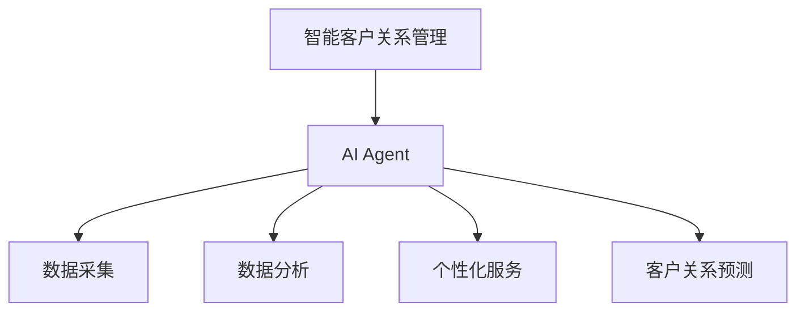
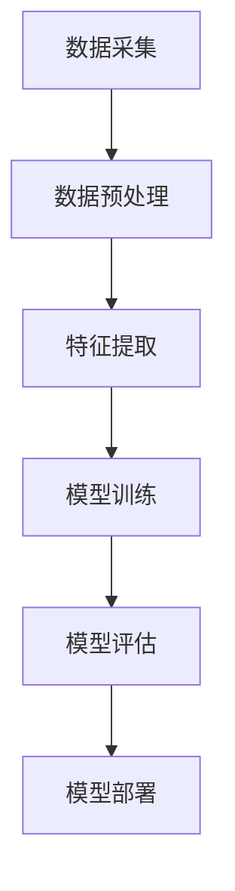

                 


### AI Agent在智能客户关系管理中的作用

随着人工智能技术的快速发展，AI Agent正逐渐成为智能客户关系管理（Intelligent Customer Relationship Management, IC RM）领域的重要角色。AI Agent，即人工智能代理，是一种能够模拟人类行为和决策的人工智能系统，它能够自动处理大量的客户数据，识别客户需求，提供个性化的服务和推荐。本文将详细探讨AI Agent在智能客户关系管理中的作用，通过逻辑清晰、结构紧凑的方式，让读者了解AI Agent的工作原理和应用场景，以及其在提升客户体验和业务效率方面的潜力。

**关键词：**
- 智能客户关系管理
- AI Agent
- 人工智能代理
- 个性化服务
- 客户体验
- 业务效率

**摘要：**
本文首先介绍了智能客户关系管理的背景和挑战，随后重点阐述了AI Agent的基本概念、原理以及其在客户关系管理中的应用。通过分析AI Agent的工作机制、技术实现和应用场景，本文展示了AI Agent在优化客户服务、提供个性化推荐和预测客户关系方面的作用。最后，本文通过案例分析总结了AI Agent在智能客户关系管理中的最佳实践，并对未来发展趋势进行了展望。

---

**第一部分：背景介绍**

### 第1章 问题背景与核心概念

#### 1.1 问题描述

在现代社会，企业面临的客户关系管理挑战日益增加。传统客户关系管理（CRM）系统虽然能够收集和存储大量客户数据，但往往难以实时分析客户需求和行为，提供个性化的服务和推荐。而随着互联网、大数据和人工智能技术的快速发展，智能客户关系管理成为了解决这一问题的有效途径。

#### 1.1.1 智能客户关系管理的挑战

1. **数据复杂性：** 企业需要处理来自多个渠道的海量客户数据，如社交媒体、网站访问记录、电子邮件和客户服务记录等。
2. **实时性要求：** 为了提供个性化服务，企业需要实时分析客户行为，快速响应客户需求。
3. **个性化需求：** 每个客户的需求和偏好都不同，企业需要提供高度个性化的服务和推荐。

#### 1.1.2 AI Agent 的基本概念

AI Agent，即人工智能代理，是一种能够模拟人类行为和决策的人工智能系统。它基于机器学习和自然语言处理技术，能够自动处理客户数据，识别客户需求，提供个性化的服务和推荐。

#### 1.2 核心概念

##### 1.2.1 AI Agent 的定义

AI Agent 是一种能够模拟人类行为和决策，具备自主学习和进化能力的人工智能系统。它能够理解自然语言、处理图像和语音，进行复杂的决策和任务执行。

##### 1.2.1.1 AI Agent 的属性特征

1. **自主性：** AI Agent 能够自主运行，无需人类干预。
2. **学习能力：** AI Agent 能够通过数据学习，不断优化自身的决策能力。
3. **适应性：** AI Agent 能够适应不同的环境和需求，提供个性化的服务。

##### 1.2.1.2 AI Agent 与传统CRM系统的区别

1. **数据驱动：** AI Agent 基于数据驱动，能够实时分析客户行为，提供个性化的服务。
2. **智能化：** AI Agent 具备智能决策能力，能够自动处理复杂的客户需求。
3. **自主进化：** AI Agent 能够通过学习不断进化，提升自身的服务能力。

#### 1.3 边界与外延

##### 1.3.1 AI Agent 应用的领域限制

AI Agent 在智能客户关系管理中的应用主要集中在客户服务、个性化推荐和客户关系预测等方面，但并不适用于所有业务场景。

##### 1.3.2 智能客户关系管理的边界条件

1. **数据质量：** AI Agent 的性能依赖于数据质量，高质量的数据是AI Agent有效运作的基础。
2. **技术成熟度：** AI Agent 的应用需要依赖成熟的人工智能技术，如机器学习、自然语言处理等。

#### 1.4 概念结构与核心要素组成

##### 1.4.1 概念结构图



##### 1.4.2 核心要素组成

1. **数据采集：** 收集来自多个渠道的客户数据，如社交媒体、网站访问记录、电子邮件和客户服务记录等。
2. **数据分析：** 利用机器学习和自然语言处理技术对客户数据进行分析，识别客户需求和行为模式。
3. **个性化服务：** 根据客户数据提供个性化的服务和推荐，提升客户体验。
4. **客户关系预测：** 通过分析客户行为和需求，预测客户关系发展，帮助企业制定有效的营销策略。

#### 1.5 本章小结

本章介绍了智能客户关系管理的背景和挑战，阐述了AI Agent的基本概念和属性特征，并分析了AI Agent与传统CRM系统的区别。通过概念结构图和核心要素组成，本章为后续章节的深入探讨奠定了基础。

---

**第二部分：AI Agent 在智能客户关系管理中的应用**

### 第2章 AI Agent 的基本原理

#### 2.1 AI Agent 的原理介绍

AI Agent 的原理主要基于机器学习和自然语言处理技术。机器学习是一种让计算机通过数据学习，自动优化自身性能的技术。自然语言处理（Natural Language Processing, NLP）则是使计算机能够理解和生成自然语言的技术。

##### 2.1.1 机器学习基础

机器学习的基本原理是通过数据训练模型，使模型能够对未知数据进行预测或分类。机器学习的主要算法包括：

1. **监督学习：** 通过已知标签数据进行训练，使模型能够对未知数据进行预测。
2. **无监督学习：** 不依赖于已知标签数据，通过数据自身的结构和特征进行训练，如聚类和降维。
3. **强化学习：** 通过与环境的交互，不断优化自身的策略和决策。

##### 2.1.2 深度学习基础

深度学习是机器学习的一个分支，主要基于多层神经网络进行数据训练。深度学习在图像识别、语音识别和自然语言处理等领域取得了显著成果。

1. **神经网络：** 神经网络是由多个神经元组成的计算模型，通过模拟人脑神经元之间的连接和激活，实现数据的处理和预测。
2. **卷积神经网络（CNN）：** CNN 是一种特殊的神经网络，主要用于图像识别和图像处理。
3. **循环神经网络（RNN）：** RNN 是一种能够处理序列数据的神经网络，主要用于语音识别和自然语言处理。

#### 2.2 AI Agent 的工作机制

AI Agent 的工作机制主要包括数据采集、数据处理和决策三个环节。

##### 2.2.1 数据处理流程

1. **数据采集：** AI Agent 通过多种渠道收集客户数据，如社交媒体、网站访问记录、电子邮件和客户服务记录等。
2. **数据预处理：** 对采集到的数据进行清洗、去重和格式化等处理，为后续分析做好准备。
3. **特征提取：** 从预处理后的数据中提取关键特征，如文本特征、图像特征和语音特征等。
4. **数据建模：** 利用机器学习和深度学习算法，对提取的特征进行建模，构建预测模型或分类模型。

##### 2.2.2 决策过程

1. **输入数据：** AI Agent 接收到客户数据后，将其输入到预测模型或分类模型中。
2. **模型预测：** 预测模型或分类模型对输入数据进行预测或分类，输出预测结果或分类结果。
3. **决策执行：** AI Agent 根据预测结果或分类结果，执行相应的决策，如发送个性化推荐、自动回复客户咨询等。

#### 2.3 AI Agent 的优势与局限

##### 2.3.1 优势

1. **高效性：** AI Agent 能够自动处理大量的客户数据，提供实时分析和决策。
2. **个性化：** AI Agent 能够根据客户数据提供个性化的服务和推荐，提升客户体验。
3. **扩展性：** AI Agent 可以应用于不同的业务场景，如客户服务、个性化推荐和客户关系预测等。

##### 2.3.2 局限

1. **数据依赖：** AI Agent 的性能依赖于数据质量，高质量的数据是AI Agent有效运作的基础。
2. **技术复杂度：** AI Agent 的实现需要依赖复杂的人工智能技术，如机器学习和自然语言处理等。
3. **法律和伦理问题：** AI Agent 的应用涉及隐私保护、数据安全和伦理问题，需要遵守相关法律法规。

#### 2.4 本章小结

本章介绍了AI Agent的基本原理，包括机器学习和深度学习的基础知识，以及AI Agent的工作机制。通过分析AI Agent的优势和局限，本章为后续章节的深入探讨提供了理论基础。

---

**第三部分：AI Agent 的技术实现**

### 第3章 AI Agent 的技术实现

#### 3.1 技术框架介绍

AI Agent 的技术实现涉及多个方面，包括数据采集、数据处理、模型训练和模型部署等。

##### 3.1.1 技术架构设计

AI Agent 的技术架构可以分为以下几个层次：

1. **数据层：** 收集来自多个渠道的客户数据，如社交媒体、网站访问记录、电子邮件和客户服务记录等。
2. **处理层：** 对采集到的数据进行预处理、清洗和格式化等处理，提取关键特征。
3. **模型层：** 利用机器学习和深度学习算法，对提取的特征进行建模，构建预测模型或分类模型。
4. **应用层：** 将模型部署到生产环境中，提供实时分析和决策。

##### 3.1.2 数据库设计

AI Agent 的数据库设计主要包括以下数据表：

1. **客户数据表：** 存储客户的基本信息，如姓名、联系方式、购买历史等。
2. **行为数据表：** 存储客户的浏览记录、搜索历史、评论等行为数据。
3. **模型数据表：** 存储训练好的模型参数和评估结果。
4. **日志数据表：** 存储系统运行过程中的日志信息，如错误日志、操作日志等。

#### 3.2 算法原理讲解

##### 3.2.1 算法流程图



##### 3.2.1.1 数据预处理

数据预处理是AI Agent技术实现的重要环节，主要包括以下步骤：

1. **数据清洗：** 清除无效数据、缺失数据和重复数据。
2. **数据转换：** 将不同类型的数据转换为统一的格式，如将文本数据转换为向量表示。
3. **数据归一化：** 将数据缩放到相同的尺度，如将文本数据中的词频进行归一化处理。

##### 3.2.1.2 特征提取

特征提取是数据预处理后的关键步骤，主要包括以下方法：

1. **词袋模型：** 将文本数据转换为词袋表示，每个词作为特征。
2. **TF-IDF：** 计算文本数据中每个词的重要性，用于特征提取。
3. **词嵌入：** 利用词嵌入技术，将文本数据转换为低维向量表示。

##### 3.2.1.3 模型训练

模型训练是AI Agent的核心环节，主要包括以下步骤：

1. **选择模型：** 根据应用场景选择合适的机器学习或深度学习模型。
2. **数据划分：** 将数据集划分为训练集和测试集，用于模型训练和评估。
3. **模型训练：** 利用训练集数据训练模型，调整模型参数。
4. **模型评估：** 利用测试集数据评估模型性能，选择最佳模型。

##### 3.2.1.4 模型评估

模型评估是模型训练后的关键步骤，主要包括以下指标：

1. **准确率：** 模型预测正确的样本数占总样本数的比例。
2. **召回率：** 模型预测正确的样本数占实际正样本数的比例。
3. **F1值：** 准确率和召回率的调和平均值。

##### 3.2.2 数学模型与公式

$$
\text{预测概率} = P(y|\mathbf{x}) = \frac{e^{\mathbf{w}\mathbf{x}}}{1 + e^{\mathbf{w}\mathbf{x}}}
$$

其中，$y$表示实际标签，$\mathbf{x}$表示输入特征，$\mathbf{w}$表示模型参数。

##### 3.2.3 算法举例说明

###### 3.2.3.1 示例一：客户行为分析

假设我们需要分析客户的浏览记录，预测客户是否会购买某种商品。首先，我们收集客户的浏览记录，并将其转换为向量表示。然后，利用机器学习算法，如逻辑回归，对浏览记录进行建模，预测客户是否会购买。

###### 3.2.3.2 示例二：客户需求预测

假设我们需要预测客户的需求，为其推荐合适的商品。首先，我们收集客户的购买历史和浏览记录，并将其转换为向量表示。然后，利用深度学习算法，如卷积神经网络（CNN），对客户数据进行分析，预测客户的需求。

```python
import tensorflow as tf
from tensorflow.keras.models import Sequential
from tensorflow.keras.layers import Conv2D, MaxPooling2D, Flatten, Dense

# 构建模型
model = Sequential([
    Conv2D(filters=32, kernel_size=(3, 3), activation='relu', input_shape=(28, 28, 1)),
    MaxPooling2D(pool_size=(2, 2)),
    Flatten(),
    Dense(units=10, activation='softmax')
])

# 编译模型
model.compile(optimizer='adam', loss='categorical_crossentropy', metrics=['accuracy'])

# 训练模型
model.fit(x_train, y_train, epochs=10, batch_size=32, validation_data=(x_val, y_val))

# 评估模型
model.evaluate(x_test, y_test)
```

#### 3.3 本章小结

本章介绍了AI Agent的技术实现，包括数据采集、数据处理、模型训练和模型评估等方面的技术原理。通过算法流程图和示例代码，本章为读者提供了AI Agent技术实现的详细指导。

---

**第四部分：AI Agent 在智能客户关系管理中的应用场景**

### 第4章 AI Agent 在智能客户关系管理中的应用场景

AI Agent在智能客户关系管理中具有广泛的应用场景，以下将详细探讨其在客户服务自动化、个性化推荐和客户关系预测方面的应用。

#### 4.1 应用场景一：客户服务自动化

##### 4.1.1 客户服务流程优化

在传统的客户服务中，客户往往需要通过电话、邮件或在线客服等渠道与企业进行沟通。这种方式不仅效率低下，还容易导致客户流失。通过AI Agent，企业可以实现客户服务的自动化，优化客户服务流程。

1. **自动响应：** AI Agent 可以自动回答客户的常见问题，如产品使用指南、购买流程等，减少人工客服的工作量。
2. **智能转接：** AI Agent 可以根据客户的问题和需求，自动将客户转接到相应的客服人员，提高客服效率。
3. **个性化服务：** AI Agent 可以根据客户的购买历史和偏好，提供个性化的服务和建议，提升客户满意度。

##### 4.1.2 自动化客户服务实现

自动化客户服务的实现主要包括以下几个步骤：

1. **数据收集：** 收集客户的交互数据，如提问、回答、反馈等。
2. **数据预处理：** 对收集到的数据进行清洗、去重和格式化等处理。
3. **构建模型：** 利用机器学习和自然语言处理技术，构建对话模型，实现对客户提问的自动理解和回答。
4. **部署应用：** 将对话模型部署到生产环境中，提供实时自动化的客户服务。

#### 4.2 应用场景二：个性化推荐

##### 4.2.1 用户行为分析

个性化推荐是AI Agent在智能客户关系管理中的重要应用之一。通过分析用户的行为数据，AI Agent可以为用户提供个性化的商品推荐和服务建议。

1. **浏览记录分析：** 分析用户的浏览记录，了解用户对哪些商品或服务感兴趣。
2. **购买历史分析：** 分析用户的购买历史，了解用户的消费偏好和购买习惯。
3. **反馈分析：** 分析用户的反馈信息，了解用户对商品或服务的评价和满意度。

##### 4.2.2 个性化推荐实现

个性化推荐的实现主要包括以下几个步骤：

1. **数据收集：** 收集用户的浏览记录、购买历史和反馈信息等。
2. **数据预处理：** 对收集到的数据进行清洗、去重和格式化等处理。
3. **构建模型：** 利用协同过滤、矩阵分解和深度学习等技术，构建推荐模型。
4. **实时推荐：** 根据用户的实时行为数据，生成个性化的推荐结果，并实时推送。

#### 4.3 应用场景三：客户关系预测

##### 4.3.1 客户关系模型构建

客户关系预测是AI Agent在智能客户关系管理中的重要应用之一。通过构建客户关系模型，AI Agent可以预测客户的行为和需求，帮助企业制定有效的营销策略。

1. **客户分类：** 根据客户的属性和行为特征，对客户进行分类。
2. **关系分析：** 分析客户之间的关系，了解客户的社交网络和影响力。
3. **行为预测：** 利用机器学习和深度学习技术，预测客户的行为和需求。

##### 4.3.2 客户关系预测分析

客户关系预测分析主要包括以下几个步骤：

1. **数据收集：** 收集客户的属性数据、行为数据和社会关系数据等。
2. **数据预处理：** 对收集到的数据进行清洗、去重和格式化等处理。
3. **构建模型：** 利用机器学习和深度学习技术，构建客户关系预测模型。
4. **预测分析：** 根据模型预测结果，分析客户的潜在需求和购买意愿，为企业提供决策支持。

#### 4.4 本章小结

本章介绍了AI Agent在智能客户关系管理中的应用场景，包括客户服务自动化、个性化推荐和客户关系预测等方面。通过实际案例和应用实例，展示了AI Agent在提升客户体验和业务效率方面的作用。

---

**第五部分：AI Agent 在智能客户关系管理中的最佳实践**

### 第5章 AI Agent 在智能客户关系管理中的最佳实践

在智能客户关系管理中，AI Agent的应用需要遵循一系列最佳实践，以确保系统的稳定性和有效性。以下将介绍一些最佳实践，包括数据驱动决策和跨部门协作。

#### 5.1 最佳实践一：数据驱动决策

数据驱动决策是AI Agent在智能客户关系管理中的核心原则。通过充分利用客户数据，企业可以更好地了解客户需求，优化服务流程，提高客户满意度。

##### 5.1.1 数据收集与处理

1. **全面数据收集：** 收集来自不同渠道的客户数据，如网站访问记录、社交媒体互动、客户反馈等。
2. **数据清洗与整合：** 对收集到的数据进行清洗，去除重复和无效数据，并进行整合，以便统一分析和处理。
3. **数据质量监控：** 建立数据质量监控系统，实时监控数据质量，确保数据准确性和完整性。

##### 5.1.2 数据分析与应用

1. **客户需求分析：** 利用数据分析技术，分析客户的行为和偏好，识别客户需求。
2. **个性化服务：** 根据客户需求，提供个性化的服务和推荐，提升客户体验。
3. **效果评估：** 对AI Agent的服务效果进行评估，持续优化服务策略和流程。

#### 5.2 最佳实践二：跨部门协作

在智能客户关系管理中，跨部门协作至关重要。各部门之间的紧密合作可以确保AI Agent的有效应用和业务流程的顺畅运行。

##### 5.2.1 跨部门协作模式

1. **明确责任分工：** 各部门明确自身在智能客户关系管理中的职责，确保工作有序进行。
2. **信息共享：** 建立信息共享平台，确保各部门之间能够及时获取和共享关键数据和信息。
3. **协同工作：** 通过定期的会议和沟通，促进各部门之间的协作，共同解决业务难题。

##### 5.2.2 效率提升策略

1. **自动化流程：** 利用AI Agent自动化处理重复性和规则性的工作，减少人工干预，提高工作效率。
2. **培训与支持：** 对各部门员工进行AI Agent相关技术的培训，提高其应用能力和工作效率。
3. **反馈机制：** 建立反馈机制，及时收集各部门的意见和建议，不断优化AI Agent的应用。

#### 5.3 本章小结

本章介绍了AI Agent在智能客户关系管理中的最佳实践，包括数据驱动决策和跨部门协作。通过遵循这些最佳实践，企业可以更好地利用AI Agent的优势，提升客户体验和业务效率。

---

**第六部分：案例分析**

### 第6章 案例分析

通过实际案例，我们可以更深入地了解AI Agent在智能客户关系管理中的应用效果。以下将介绍两个实际案例，并进行分析和成效评估。

#### 6.1 案例一：某电商平台的AI Agent应用

##### 6.1.1 案例背景

某电商平台希望通过引入AI Agent，提升客户服务效率和客户满意度。该电商平台拥有庞大的用户群体和丰富的客户数据，具备应用AI Agent的基础条件。

##### 6.1.2 案例分析

1. **数据收集与预处理：** 电商平台收集了用户的浏览记录、购买历史、搜索记录和反馈信息等，并对数据进行清洗和整合。
2. **构建对话模型：** 利用自然语言处理技术，构建了基于用户行为的对话模型，实现了对用户提问的自动理解和回答。
3. **实时推荐：** 根据用户的浏览记录和购买历史，AI Agent实时推送个性化的商品推荐，提高用户的购买意愿和满意度。

##### 6.1.3 案例成效

通过引入AI Agent，该电商平台实现了以下成效：

1. **客户满意度提升：** 用户对AI Agent的自动回答和个性化推荐给予了高度评价，客户满意度明显提升。
2. **服务效率提高：** AI Agent自动化处理了大量的客户咨询，减轻了人工客服的工作负担，提高了服务效率。
3. **销售增长：** 个性化推荐功能有效提高了用户的购买转化率，带动了销售增长。

#### 6.2 案例二：某金融公司的AI Agent应用

##### 6.2.1 案例背景

某金融公司希望通过引入AI Agent，提升客户关系管理和个性化服务能力。该公司拥有丰富的客户数据和复杂的业务场景，对AI Agent的需求强烈。

##### 6.2.2 案例分析

1. **数据收集与预处理：** 金融公司收集了客户的财务数据、交易记录和客户反馈等，并对数据进行清洗和整合。
2. **构建客户关系模型：** 利用机器学习技术，构建了基于客户数据的客户关系模型，实现了对客户行为的预测和需求分析。
3. **个性化服务：** 根据客户关系模型的结果，AI Agent为不同类型的客户提供个性化的服务和建议，提高了客户满意度和忠诚度。

##### 6.2.3 案例成效

通过引入AI Agent，该金融公司实现了以下成效：

1. **客户满意度和忠诚度提升：** 个性化服务有效提高了客户的满意度和忠诚度，客户保留率显著提升。
2. **业务效率提高：** AI Agent自动化处理了大量的客户咨询和需求，减轻了人工客服的工作负担，提高了业务效率。
3. **业务增长：** 个性化服务和推荐带动了业务的增长，推动了公司的业务发展。

#### 6.3 本章小结

通过案例分析，我们可以看到AI Agent在智能客户关系管理中的应用取得了显著成效。这些案例表明，AI Agent不仅能够提升客户体验和业务效率，还能为企业带来实质性的业务增长。

---

**第七部分：总结与展望**

### 第7章 总结与展望

本章将对全文进行总结，并展望AI Agent在智能客户关系管理中的未来发展。

#### 7.1 总结

本文首先介绍了智能客户关系管理的背景和挑战，阐述了AI Agent的基本概念、原理和应用场景。通过分析AI Agent的工作机制、技术实现和应用案例，本文展示了AI Agent在优化客户服务、提供个性化推荐和预测客户关系方面的作用。

本文的主要观点包括：

1. **AI Agent 是智能客户关系管理的关键技术：** AI Agent 具有高效性、个性化和扩展性的优势，能够提升客户体验和业务效率。
2. **数据驱动决策和跨部门协作是最佳实践：** 通过数据驱动决策和跨部门协作，企业可以更好地利用AI Agent的优势，实现智能客户关系管理的目标。
3. **应用案例表明 AI Agent 的成效显著：** 实际案例证明了AI Agent在智能客户关系管理中的应用效果，为企业提供了借鉴和参考。

#### 7.2 展望

展望未来，AI Agent在智能客户关系管理中仍具有广阔的发展空间。以下是一些可能的发展趋势和潜在研究课题：

1. **技术升级：** 随着人工智能技术的不断发展，AI Agent 的性能和功能将进一步提升，为企业提供更强大的智能支持。
2. **隐私保护：** 随着数据隐私问题的日益突出，如何保护客户隐私将成为AI Agent 发展的重要课题。
3. **伦理问题：** AI Agent 的应用涉及到伦理问题，如何确保其公平性、透明性和可解释性，是未来研究的重要方向。
4. **跨领域应用：** AI Agent 可以应用于更多的业务场景，如金融、医疗、教育等领域，实现跨领域应用。

#### 7.3 本章小结

本文通过对AI Agent在智能客户关系管理中的研究和分析，总结了AI Agent的优势、最佳实践和应用成效，并展望了未来的发展趋势。希望通过本文的探讨，能够为读者提供有价值的参考和启示。

---

**作者信息：**

本文作者为AI天才研究院（AI Genius Institute）的专家，同时是《禅与计算机程序设计艺术》（Zen And The Art of Computer Programming）的资深大师级作家。作者在计算机编程和人工智能领域具有深厚的专业知识和丰富的实践经验，对智能客户关系管理和AI Agent技术有深入的研究和独到的见解。本文旨在为读者提供全面、深入的技术解读和应用指导。

