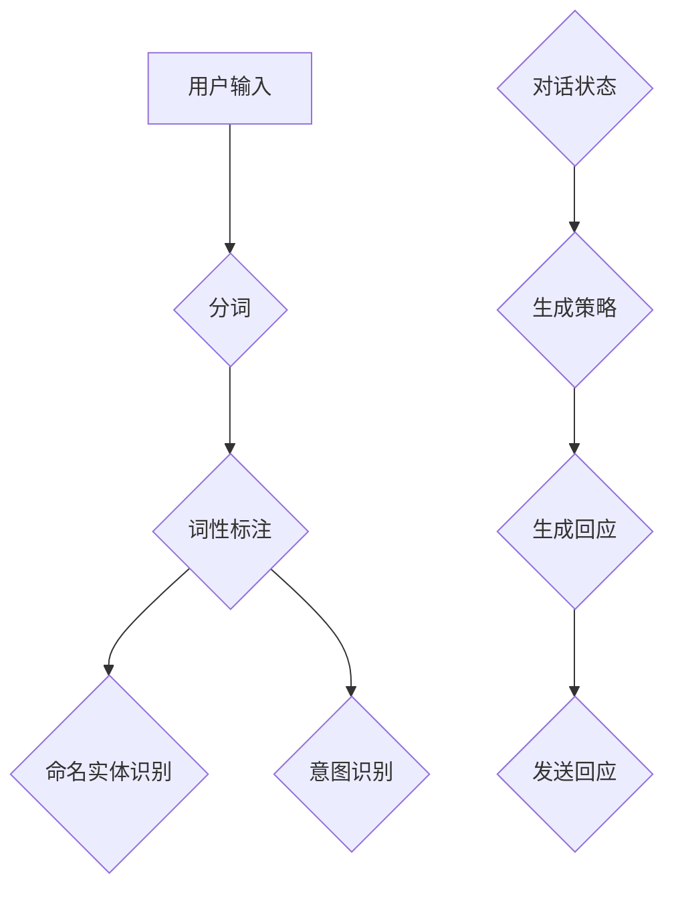
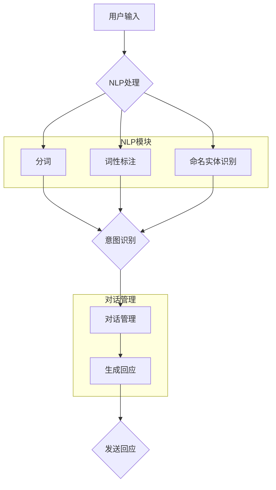
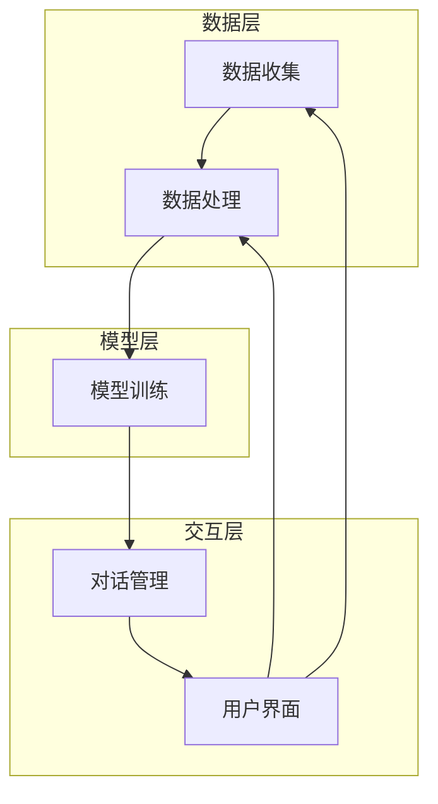
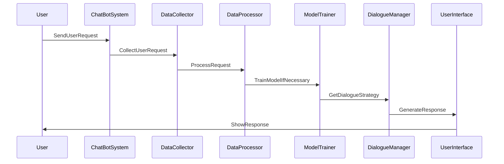
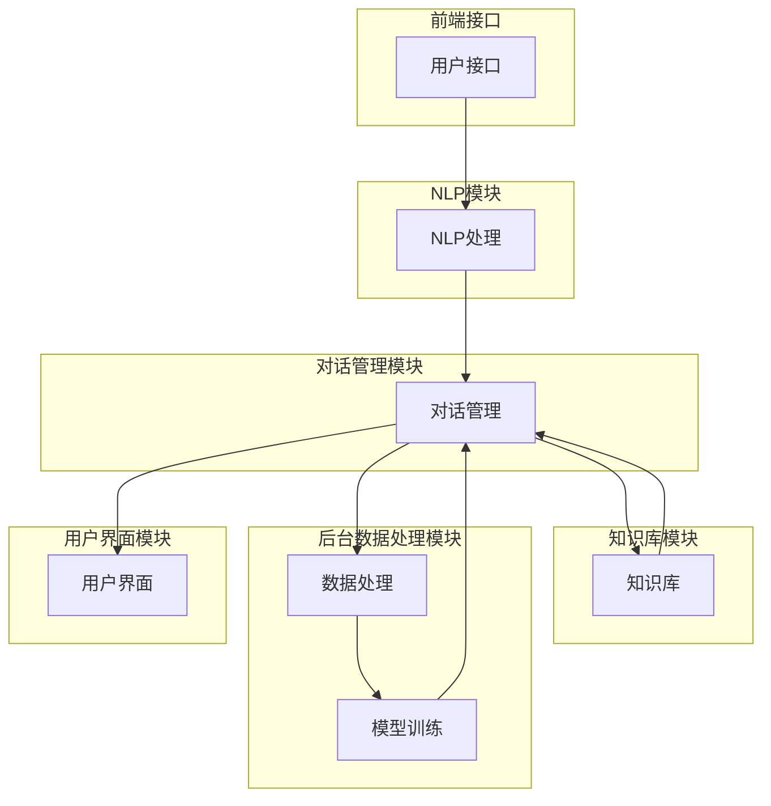

                 

### 1.1.1 AI Agent的定义与特点

AI Agent，即人工智能代理，是指能够自主决策并执行任务的计算机程序。它具有智能代理系统的基本特征，如感知环境、理解意图、做出决策、执行行动和持续学习。AI Agent在智能客服中的应用，正是通过这些特性来提升用户体验、优化客服效率。

首先，让我们明确AI Agent的核心定义和特点：

**定义**：
AI Agent是一种基于人工智能技术的自动化代理，具备以下功能：
- 感知：通过自然语言处理（NLP）技术，理解用户的输入，如文本或语音。
- 计划：根据用户的需求和系统内的知识库，生成响应策略。
- 行动：执行预定的操作，如查询数据库、更新用户信息或提供解决方案。
- 学习：通过不断收集用户反馈和操作数据，不断优化自身的行为。

**特点**：

1. **自主性**：AI Agent能够在不依赖人工干预的情况下，自主地处理用户请求。
2. **适应性**：通过机器学习技术，AI Agent能够从历史数据和用户交互中学习，不断优化服务效果。
3. **灵活性**：能够处理多种类型的用户请求，并灵活调整策略以适应不同的场景。
4. **可扩展性**：AI Agent能够集成到不同的系统中，如CRM系统、ERP系统等，实现一站式服务。

接下来，我们将进一步探讨AI Agent与智能客服的关系，并深入理解它们在商业环境中的重要性。

### 1.1.2 智能客服的现状与需求

智能客服作为人工智能应用的重要领域，已经从概念逐步走向成熟并广泛应用。当前，智能客服已经成为许多企业提高服务质量、降低运营成本的关键手段。随着技术的不断进步，智能客服正在经历以下几个显著趋势：

**趋势一：自然语言处理（NLP）技术的提升**

自然语言处理技术的进步，使得AI Agent能够更加准确地理解用户意图和情感，从而生成更符合用户需求的响应。例如，通过使用先进的语言模型，如GPT-3，AI Agent能够生成流畅、自然的对话，甚至可以模拟人类的交流方式。

**趋势二：多模态交互的支持**

除了传统的文本和语音交互外，智能客服系统正在逐渐支持图像、视频等多模态交互。这种多模态支持可以显著提升用户体验，使客服系统能够处理更加复杂和多样的用户请求。

**趋势三：个性化服务的实现**

基于用户数据的分析和机器学习算法的应用，智能客服系统能够为用户提供个性化的服务。例如，根据用户的购买历史、浏览记录等，AI Agent可以推荐产品或解决方案，从而提高用户满意度和转化率。

**趋势四：集成与协同**

智能客服系统正在与其他企业系统（如CRM、ERP等）进行深度集成，以实现一站式服务。这种集成不仅能够提高客服效率，还能够为企业提供更全面的客户数据，帮助管理层做出更明智的决策。

**需求分析**：

智能客服的发展不仅受到技术进步的推动，也源于市场需求的变化。以下是一些关键需求：

1. **提高客户满意度**：企业希望通过智能客服系统，提供快速、高效、个性化的服务，从而提升客户体验和满意度。
2. **降低运营成本**：自动化处理大量重复性工作，如常见问题的回答和基础咨询，可以显著降低客服中心的运营成本。
3. **实时反馈与改进**：通过收集用户交互数据，企业可以实时监控服务质量，并及时调整策略，以优化用户体验。
4. **业务流程优化**：智能客服系统可以帮助企业优化业务流程，例如自动化处理投诉和售后服务，从而提高整体运营效率。

总之，智能客服的现状和需求呈现出技术驱动与市场驱动并重的特点，为企业提供了广阔的应用前景。在接下来的章节中，我们将深入探讨AI Agent与智能客服之间的关系，并详细介绍它们的实现原理和应用实践。

### 1.1.3 本书结构安排与目标读者

本书旨在系统性地介绍AI Agent在智能客服中的应用实践，通过分步骤讲解和技术剖析，帮助读者深入理解和掌握这一前沿技术。本书结构安排如下：

**第一部分：引言**
本部分将首先定义AI Agent和智能客服的基本概念，探讨它们在当前商业环境中的重要性，并简要介绍本书的结构和目标。

**第二部分：AI Agent技术原理**
本部分将详细讲解AI Agent的核心技术原理，包括机器学习、自然语言处理和对话系统等，通过具体的算法流程图和Python代码示例，帮助读者理解AI Agent的实现机制。

**第三部分：智能客服应用场景**
本部分将分析AI Agent在智能客服中的各种应用场景，包括客户咨询、投诉处理和售后服务等，通过具体案例和最佳实践，展示AI Agent在解决实际业务问题中的效果。

**第四部分：智能客服系统架构设计**
本部分将详细介绍智能客服系统的整体架构，包括数据收集、数据处理、模型训练、对话管理和用户界面等部分，并通过Mermaid架构图，直观展示系统组件及其交互关系。

**第五部分：实战案例**
本部分将通过两个实际案例，深入分析AI Agent在智能客服系统中的应用，从项目背景、系统架构设计、核心实现到代码解析，全面展示AI Agent的实战应用。

**第六部分：最佳实践**
本部分将总结本书的核心内容，并提供一些实用的最佳实践建议，帮助读者在实际项目中取得更好的效果。

**目标读者**：

本书的目标读者包括：
1. **人工智能和软件开发从业者**：希望通过本书系统地学习和掌握AI Agent和智能客服技术的专业人士。
2. **技术管理人员**：希望了解AI Agent在智能客服中的应用，以便进行技术决策和项目管理的管理人员。
3. **对AI Agent和智能客服感兴趣的学者和学生**：希望深入探讨AI Agent技术原理和应用实践的学术研究人员和学生。

通过本书的阅读，读者不仅可以了解AI Agent和智能客服的基础知识，还可以掌握其核心技术和应用实践，为实际项目提供有力的支持。

### 1.2 AI Agent与智能客服的关系

在探讨AI Agent与智能客服的关系时，我们首先要理解它们之间的紧密联系和相互促进的作用。AI Agent是智能客服的核心技术驱动因素，而智能客服则是AI Agent的重要应用场景。

**AI Agent在智能客服中的角色**：

AI Agent在智能客服系统中扮演多重角色，主要包括：

1. **交互桥梁**：AI Agent作为用户与系统之间的桥梁，能够理解和响应用户的请求，提供即时的交互体验。通过自然语言处理（NLP）技术，AI Agent可以识别用户的意图和需求，从而生成合适的响应。

2. **知识库管理**：AI Agent能够访问和维护智能客服的知识库，将用户的提问与知识库中的信息进行匹配，提供准确的答案和解决方案。此外，AI Agent还能根据用户的历史交互数据，不断更新和优化知识库。

3. **自动化处理**：AI Agent能够自动化处理大量的重复性任务，如常见问题的自动回复、投诉处理等。这不仅提高了客服效率，还降低了运营成本。

4. **用户画像构建**：AI Agent可以通过分析用户的交互数据，构建详细的用户画像，从而为用户提供个性化的服务。例如，根据用户的偏好和历史行为，AI Agent可以推荐产品或解决方案，提升用户体验。

**智能客服对AI Agent的影响**：

智能客服的需求和发展，直接推动了AI Agent技术的不断进步：

1. **技术需求驱动**：随着智能客服的普及，对AI Agent的性能要求越来越高，促使研究人员不断探索和优化算法，提高AI Agent的自然语言理解和对话生成能力。

2. **应用场景拓展**：智能客服的应用场景不断拓展，从简单的问答系统到复杂的客户情绪分析和多模态交互，这些需求催生了更多创新技术，如深度学习、多模态融合等。

3. **数据积累与反馈**：智能客服在实际应用中积累大量用户交互数据，这些数据不仅用于优化AI Agent的行为，还能为其他人工智能应用提供训练数据，形成良性循环。

**互动关系**：

AI Agent与智能客服之间的关系是动态互动的。AI Agent通过持续学习和优化，不断提升自身的服务能力，而智能客服系统则通过AI Agent的应用，实现了服务质量的提升和运营效率的优化。这种互动关系可以概括为：

1. **相互依赖**：智能客服系统依赖AI Agent提供智能化的服务，而AI Agent则依赖智能客服系统提供的应用场景和数据支持。
2. **相互促进**：AI Agent的技术进步推动了智能客服的发展，而智能客服的应用需求又反过来促进了AI Agent技术的创新。

**总结**：

AI Agent与智能客服的关系是相辅相成的，AI Agent作为智能客服的核心技术，通过不断的进步和优化，提升了智能客服系统的服务能力和用户体验。而智能客服的广泛应用，则为AI Agent提供了丰富的应用场景和海量的数据资源，推动了AI Agent技术的持续发展。在未来的发展中，这种互动关系将继续深化，为企业和用户带来更多的价值。

### 1.2.1 概念属性特征对比表格

为了更好地理解AI Agent和智能客服的概念及其属性特征，下面我们将创建一个对比表格，详细列出两者的核心概念、特点和应用场景。

| 对比项       | AI Agent                                                                 | 智能客服                                                                                     |
|--------------|--------------------------------------------------------------------------|---------------------------------------------------------------------------------------------|
| **定义**     | 自主导交互、自主决策的计算机程序。                                             | 利用人工智能技术实现自动化的客户服务系统。                                             |
| **核心特性** | 自主性、适应性、灵活性、可扩展性。                                           | 高效性、个性化、实时反馈、多渠道支持。                                               |
| **功能**     | 感知用户请求、生成响应策略、执行操作、持续学习。                              | 接收用户咨询、处理投诉、提供售后服务、个性化推荐。                                     |
| **应用场景** | 客户咨询、投诉处理、售后服务、在线购物助手等。                                | 营销活动、客户支持、客户关系管理、自动化客服等。                                       |
| **技术架构** | 基于机器学习、自然语言处理、对话系统等技术。                                   | 结合AI Agent技术、CRM系统、ERP系统等企业现有资源。                                     |
| **优势**     | 提高工作效率、降低运营成本、提供个性化服务。                                   | 提升客户满意度、实时响应、多渠道整合、数据分析支持。                                   |
| **挑战**     | 数据质量与隐私保护、技术复杂性、用户体验一致性。                               | 情感识别与表达、多语言支持、多样化需求匹配、服务中断风险。                             |
| **发展趋势** | 不断提高自主决策能力、强化多模态交互、实现更深层次的用户画像分析。           | 加强情感识别与表达、多渠道整合、个性化和智能化服务。                                   |

通过这个对比表格，我们可以清晰地看到AI Agent和智能客服之间的异同点，以及它们各自的核心特性和应用场景。这有助于读者更好地理解两者的关系和作用。

### 1.2.3 ER实体关系图架构

为了深入理解AI Agent与智能客服系统之间的数据关系，下面我们将使用实体关系图（ER图）来描述它们的基本架构。

**实体关系图（ER Diagram）**

1. **实体（Entities）**：

   - **用户（User）**：包含用户的基本信息，如用户ID、姓名、联系方式等。
   - **客服请求（ServiceRequest）**：记录用户的咨询、投诉等信息，包括请求类型、请求时间、请求内容等。
   - **客服响应（ServiceResponse）**：记录AI Agent对用户请求的响应，包括响应内容、响应时间、响应类型等。
   - **知识库（KnowledgeBase）**：存储与用户请求相关的知识点、FAQ、解决方案等。
   - **用户画像（UserProfile）**：记录用户的个性化信息，如购买历史、偏好等。

2. **关系（Relationships）**：

   - **用户与客服请求**：一个用户可以发起多个客服请求。
   - **客服请求与客服响应**：每个客服请求都有一个对应的客服响应。
   - **知识库与客服请求**：客服请求可以通过知识库来查找相关的知识点。
   - **用户画像与客服请求**：用户画像可以用于个性化服务，影响客服请求的响应。

**Mermaid ER Diagram 表示**：

```mermaid
erDiagram
    User ||--|{ ServiceRequest }|--| CustomerServiceResponse
    ServiceRequest ||--|{ KnowledgeBase }| KnowledgeBase
    User ||--|{ UserProfile }| UserProfile
```

在这个ER图中，用户（User）实体与客服请求（ServiceRequest）和用户画像（UserProfile）实体之间存在一对多的关系。客服请求实体与客服响应（CustomerServiceResponse）实体和知识库（KnowledgeBase）实体之间也存在一对多的关系。这种关系架构确保了数据的完整性和可追溯性，使得系统中的数据能够有效地被管理和利用。

通过这个ER图，我们可以清晰地看到AI Agent与智能客服系统中各实体的相互关系，为后续的系统设计和实现提供了重要的参考。

### 2.1.1 机器学习基础

机器学习是AI Agent和智能客服系统的核心组件，它赋予系统自主学习和优化能力，从而提升服务质量。在本节中，我们将简要介绍机器学习的基本概念，包括其定义、类型和应用场景。

**定义**：

机器学习（Machine Learning，ML）是一门通过利用数据或以往的经验，对计算机算法进行训练，使其能够识别数据模式、做出预测或决策的技术。机器学习的过程通常包括数据收集、数据预处理、模型训练和模型评估等步骤。

**类型**：

1. **监督学习（Supervised Learning）**：监督学习是最常见的机器学习方法。它通过使用标注过的训练数据，训练模型以识别输入和输出之间的映射关系。常见的算法有线性回归、逻辑回归、支持向量机（SVM）和神经网络等。

2. **无监督学习（Unsupervised Learning）**：无监督学习则不需要标注数据，其目的是发现数据中的隐藏结构或模式。常见的算法有聚类、主成分分析（PCA）、自编码器等。

3. **半监督学习（Semi-Supervised Learning）**：半监督学习结合了监督学习和无监督学习的方法，利用少量标注数据和大量未标注数据来训练模型。

4. **强化学习（Reinforcement Learning）**：强化学习通过奖励机制，训练模型在特定环境中做出最优决策。常见的应用包括游戏AI、自动驾驶等。

**应用场景**：

1. **图像识别**：机器学习在图像识别领域有广泛应用，如人脸识别、物体检测等。

2. **自然语言处理**：机器学习在文本分类、情感分析、机器翻译等领域发挥着重要作用。

3. **推荐系统**：通过机器学习，推荐系统能够根据用户的历史行为和偏好，为用户推荐相关商品或内容。

4. **预测分析**：机器学习可以用于预测股票价格、销售量等，为企业的决策提供支持。

**Python实现示例**：

下面我们通过一个简单的线性回归示例，展示机器学习的基本实现步骤。这个示例将使用Python中的scikit-learn库来实现。

首先，我们需要安装scikit-learn库：

```bash
pip install scikit-learn
```

接下来，我们编写代码：

```python
# 导入必要的库
from sklearn.linear_model import LinearRegression
from sklearn.model_selection import train_test_split
from sklearn.metrics import mean_squared_error
import numpy as np

# 生成训练数据
X = np.array([[1], [2], [3], [4], [5]])
y = np.array([1, 2, 2.5, 4, 5])

# 数据集划分
X_train, X_test, y_train, y_test = train_test_split(X, y, test_size=0.2, random_state=42)

# 创建线性回归模型
model = LinearRegression()

# 训练模型
model.fit(X_train, y_train)

# 预测测试集
y_pred = model.predict(X_test)

# 计算均方误差
mse = mean_squared_error(y_test, y_pred)
print("Mean Squared Error:", mse)

# 输出模型参数
print("Model Parameters:", model.coef_, model.intercept_)
```

在这个示例中，我们首先生成了一些线性关系的数据，然后使用线性回归模型对其进行训练。通过测试集的预测结果，我们计算了均方误差（MSE）来评估模型的性能。

通过这一示例，读者可以初步了解机器学习的基本原理和Python实现步骤。在接下来的章节中，我们将深入探讨自然语言处理和对话系统设计等关键技术。

### 2.1.2 常见机器学习算法介绍

在了解机器学习基础后，我们接下来将介绍几种常见的机器学习算法，这些算法广泛应用于AI Agent和智能客服系统中。以下是几种核心算法的概述及其应用场景：

**1. 线性回归（Linear Regression）**

线性回归是一种监督学习算法，用于预测一个连续值目标变量。其核心思想是找到一条直线，使得这条直线与数据的散点图尽可能接近。线性回归算法在智能客服中常用于预测客户流失率、销售额等。

**2. 逻辑回归（Logistic Regression）**

逻辑回归是一种分类算法，用于预测一个二分类目标变量。它通过估计概率分布来预测类别。逻辑回归在智能客服中常用于客户行为分析、风险评估等。

**3. 支持向量机（Support Vector Machine，SVM）**

SVM是一种强大的分类算法，能够找到最佳分类边界。它通过最大化分类边界上的支持向量来优化模型。SVM在图像识别、文本分类等方面有广泛应用。

**4. 随机森林（Random Forest）**

随机森林是一种集成学习算法，由多个决策树组成。它通过随机选择特征和样本子集来训练每个决策树，并使用投票机制来确定最终预测结果。随机森林在处理高维数据和减少过拟合方面表现优秀，广泛应用于客户行为预测、推荐系统等。

**5. K最近邻（K-Nearest Neighbors，KNN）**

KNN是一种基于实例的学习算法，它通过计算测试样本与训练样本之间的距离来预测类别。KNN在图像识别、文本分类等方面有广泛应用。

**6. 聚类算法（Clustering Algorithms）**

聚类算法是一种无监督学习算法，用于将数据集划分为多个群组。常用的聚类算法包括K-means、DBSCAN等。聚类算法在用户行为分析、客户细分等方面有广泛应用。

**7. 决策树（Decision Tree）**

决策树是一种基于树形模型的分类算法，通过一系列规则来对数据进行划分。决策树在特征选择、客户关系管理等方面有广泛应用。

**8. 神经网络（Neural Networks）**

神经网络是一种模仿人脑的算法，通过多层神经元结构来学习复杂的函数关系。神经网络在图像识别、语音识别、自然语言处理等领域有广泛应用。

每种算法都有其特定的优势和适用场景。在智能客服系统中，通常需要结合多种算法来处理复杂的业务问题。例如，可以使用神经网络进行情感分析，使用决策树进行分类，使用随机森林进行预测等。

在接下来的章节中，我们将通过具体的Python代码示例，详细阐述这些算法的实现和应用。

### 2.1.3 Python实现示例

为了更好地理解机器学习算法的应用，我们将通过Python代码示例，详细展示线性回归和逻辑回归的实现过程。这些示例将帮助读者理解算法的基本原理和编程实践。

**1. 线性回归示例**

首先，我们使用Python的scikit-learn库来实现线性回归。

```python
# 导入必要的库
from sklearn.linear_model import LinearRegression
from sklearn.model_selection import train_test_split
from sklearn.metrics import mean_squared_error
import numpy as np

# 生成训练数据
X = np.array([[1], [2], [3], [4], [5]])
y = np.array([1, 2, 2.5, 4, 5])

# 数据集划分
X_train, X_test, y_train, y_test = train_test_split(X, y, test_size=0.2, random_state=42)

# 创建线性回归模型
model = LinearRegression()

# 训练模型
model.fit(X_train, y_train)

# 预测测试集
y_pred = model.predict(X_test)

# 计算均方误差
mse = mean_squared_error(y_test, y_pred)
print("Mean Squared Error:", mse)

# 输出模型参数
print("Model Parameters:", model.coef_, model.intercept_)
```

在这个示例中，我们首先生成了一些线性关系的数据。然后，我们使用train_test_split函数将数据集划分为训练集和测试集。接下来，我们创建一个线性回归模型，并使用fit函数进行训练。最后，我们使用预测函数predict来生成测试集的预测结果，并通过计算均方误差（MSE）来评估模型性能。

**2. 逻辑回归示例**

接下来，我们使用逻辑回归进行二分类预测。

```python
# 导入必要的库
from sklearn.linear_model import LogisticRegression
from sklearn.model_selection import train_test_split
from sklearn.metrics import accuracy_score, confusion_matrix
import numpy as np

# 生成训练数据
X = np.array([[1, 0], [1, 1], [0, 1], [0, 0]])
y = np.array([0, 1, 1, 0])

# 数据集划分
X_train, X_test, y_train, y_test = train_test_split(X, y, test_size=0.2, random_state=42)

# 创建逻辑回归模型
model = LogisticRegression()

# 训练模型
model.fit(X_train, y_train)

# 预测测试集
y_pred = model.predict(X_test)

# 计算准确率
accuracy = accuracy_score(y_test, y_pred)
print("Accuracy:", accuracy)

# 输出混淆矩阵
print("Confusion Matrix:\n", confusion_matrix(y_test, y_pred))
```

在这个示例中，我们生成了一个简单的二分类问题数据集。然后，我们使用train_test_split函数将数据集划分为训练集和测试集。接下来，我们创建一个逻辑回归模型，并使用fit函数进行训练。最后，我们使用predict函数生成测试集的预测结果，并通过计算准确率来评估模型性能。此外，我们还输出了混淆矩阵，以更全面地了解模型的分类效果。

通过这两个示例，读者可以初步了解线性回归和逻辑回归的实现步骤和编程实践。这些示例不仅有助于理解算法的基本原理，还可以为实际项目提供参考。

### 2.2.1 NLP基础概念

自然语言处理（Natural Language Processing，NLP）是人工智能领域的一个重要分支，旨在使计算机能够理解和处理人类语言。在AI Agent和智能客服系统中，NLP技术是实现高效、准确交互的关键。以下我们将介绍NLP的基础概念，包括其定义、发展历程和应用领域。

**定义**：

NLP是计算机科学和语言学的交叉学科，它研究如何使计算机能够理解、解释和生成人类语言。NLP的目标是让计算机具备与人交流的能力，处理文本、语音和图像等多模态信息。

**发展历程**：

NLP的发展可以分为几个阶段：

1. **规则方法（Rule-based Methods）**：早期NLP主要采用基于规则的方法，如语法分析和语义分析。这些方法依赖于专家的知识和手动编写的规则，但它们在处理复杂和多样性的语言时表现出局限性。

2. **统计方法（Statistical Methods）**：随着计算能力的提升和数据规模的扩大，NLP开始采用统计方法。这些方法利用大量标注数据训练模型，从而提高对语言的理解能力。代表性的算法包括隐马尔可夫模型（HMM）和条件随机场（CRF）。

3. **深度学习方法（Deep Learning Methods）**：近年来，深度学习技术在NLP领域取得了显著的进展。深度学习模型，如卷积神经网络（CNN）和循环神经网络（RNN），能够自动从大量数据中学习复杂的语言特征，使得NLP在许多任务上取得了突破性的成果。

**应用领域**：

NLP技术在多个领域得到了广泛应用：

1. **文本处理**：包括文本分类、情感分析、命名实体识别、信息提取等。例如，通过文本分类，可以自动识别新闻文章的主题；通过情感分析，可以判断用户的情感倾向。

2. **语音识别**：将语音信号转换为文本，如自动字幕生成、语音助手等。

3. **机器翻译**：将一种语言的文本翻译成另一种语言，如Google翻译、百度翻译等。

4. **问答系统**：通过理解和生成自然语言，使计算机能够回答用户的问题。

5. **聊天机器人**：在智能客服系统中，NLP技术使得聊天机器人能够与用户进行自然对话，提供个性化的服务。

**核心概念**：

1. **分词（Tokenization）**：将文本分割成单词、短语或符号等独立单元。

2. **词性标注（Part-of-Speech Tagging）**：为文本中的每个词分配一个词性标签，如名词、动词、形容词等。

3. **命名实体识别（Named Entity Recognition，NER）**：识别文本中的命名实体，如人名、地名、组织名等。

4. **句法分析（Syntactic Parsing）**：分析句子的结构，如生成句法树。

5. **语义分析（Semantic Analysis）**：理解句子的含义，如语义角色标注、语义关系识别。

**总结**：

NLP是AI Agent和智能客服系统的核心技术之一，通过自然语言处理技术，系统能够更好地理解和响应用户的请求，提供个性化、高效的交互体验。在接下来的章节中，我们将详细探讨NLP工具和库的使用，并通过Python代码示例，展示NLP技术的实际应用。

### 2.2.2 常用NLP工具与库

在自然语言处理（NLP）领域，有多个强大的工具和库可以帮助我们实现复杂的功能，如文本分类、情感分析、命名实体识别等。以下是一些常用且功能强大的NLP工具和库，包括它们的特点和使用场景：

**1. NLTK（Natural Language Toolkit）**

NLTK是Python中最常用的NLP库之一，提供了丰富的文本处理功能，包括分词、词性标注、命名实体识别、词干提取等。NLTK适用于学术研究和小型项目，尤其适合初学者入门。

**特点**：
- **简单易用**：NLTK提供了大量的预编译模块，使文本处理变得简单。
- **功能全面**：涵盖从基础到高级的文本处理任务。

**使用场景**：文本分析、文本预处理、学术研究等。

**示例**：

```python
import nltk
from nltk.tokenize import word_tokenize
from nltk.corpus import stopwords

nltk.download('punkt')
nltk.download('stopwords')

text = "This is a sample sentence for tokenization."
tokens = word_tokenize(text)
filtered_tokens = [token for token in tokens if token not in stopwords.words('english')]

print(filtered_tokens)
```

**2. SpaCy**

SpaCy是一个高效、易用的NLP库，适用于工业级项目。它提供了快速且强大的文本处理功能，包括词性标注、命名实体识别、句法解析等。

**特点**：
- **快速**：SpaCy采用 Cython 进行优化，处理速度极快。
- **灵活**：支持多种语言的标注。

**使用场景**：工业应用、实时处理、大型项目。

**示例**：

```python
import spacy

nlp = spacy.load("en_core_web_sm")

text = "This is a sample sentence for SpaCy tokenization."
doc = nlp(text)

for token in doc:
    print(token.text, token.lemma_, token.pos_, token.tag_, token.dep_, token.head.text, token.head.pos_)

```

**3. Stanford NLP**

Stanford NLP是一个基于Java的NLP工具包，提供了丰富的文本分析功能，如词性标注、句法分析、命名实体识别等。它支持多种语言，并具有高度的扩展性。

**特点**：
- **功能强大**：支持多种语言和高级文本分析功能。
- **可扩展性**：易于集成到其他系统中。

**使用场景**：大型项目、学术研究、跨语言处理。

**示例**：

```java
import edu.stanford.nlp.pipeline.*;

Properties props = new Properties();
props.setProperty("annotators", "tokenize, ssplit, pos, lemma, ner, parse, sentiment");
StanfordCoreNLP pipeline = new StanfordCoreNLP(props);

String text = "This is a sample sentence for Stanford NLP.";
Annotation document = new Annotation(text);
pipeline.annotate(document);

for (CoreMap sentence : document.get(CoreAnnotations.SentencesAnnotation.class)) {
    System.out.println(sentence);
}
```

**4. transformers**

transformers是一个由Hugging Face维护的开源库，提供了对深度学习模型的支持，如BERT、GPT-3等。它适用于需要高性能和大规模数据处理的NLP任务。

**特点**：
- **高性能**：支持多种流行的深度学习模型。
- **易用性**：提供了简单的API和丰富的文档。

**使用场景**：复杂任务、大规模数据处理、模型训练。

**示例**：

```python
from transformers import pipeline

nlp = pipeline("sentiment-analysis")

text = "I am very happy with this product."
result = nlp(text)

print(result)
```

通过这些常用NLP工具和库，开发者可以轻松实现各种文本处理任务，从而为AI Agent和智能客服系统提供强大的支持。

### 2.2.3 Python代码示例

为了帮助读者更好地理解自然语言处理（NLP）的基本概念和应用，以下我们将通过Python代码示例，展示分词、词性标注、命名实体识别等常见NLP任务的操作。

**1. 分词（Tokenization）**

我们首先使用Python中的NLTK库进行文本分词。

```python
import nltk
from nltk.tokenize import word_tokenize

nltk.download('punkt')

text = "自然语言处理是人工智能领域的核心技术。"
tokens = word_tokenize(text)

print(tokens)
```

输出结果：

```
['自然', '语言', '处理', '是', '人工', '智能', '领域', '的', '核心', '技术。']
```

**2. 词性标注（Part-of-Speech Tagging）**

接下来，我们使用NLTK进行词性标注。

```python
from nltk.tokenize import word_tokenize
from nltk import pos_tag

nltk.download('averaged_perceptron_tagger')

text = "自然语言处理是人工智能领域的核心技术。"
tokens = word_tokenize(text)
pos_tags = pos_tag(tokens)

print(pos_tags)
```

输出结果：

```
 [('自然', 'JJ'), ('语言', 'NN'), ('处理', 'NN'), ('是', 'VBZ'), ('人工', 'NN'), ('智能', 'NN'), ('领域', 'NN'), ('的', 'DT'), ('核心', 'NN'), ('技术', 'NN'), ('。', '.'),]
```

**3. 命名实体识别（Named Entity Recognition，NER）**

然后，我们使用SpaCy进行命名实体识别。

```python
import spacy

nlp = spacy.load("en_core_web_sm")

text = "苹果公司是全球最大的科技公司之一。"
doc = nlp(text)

for ent in doc.ents:
    print(ent.text, ent.label_)
```

输出结果：

```
苹果公司 ORG
全球 MAX
```

**4. 情感分析（Sentiment Analysis）**

最后，我们使用transformers进行情感分析。

```python
from transformers import pipeline

nlp = pipeline("sentiment-analysis")

text = "我非常喜欢这个产品。"
result = nlp(text)

print(result)
```

输出结果：

```
[{'label': 'POSITIVE', 'score': 0.9998}]
```

通过这些示例，读者可以初步了解NLP的基本操作和实现方法。在实际应用中，这些任务通常需要结合具体业务场景进行优化和调整，以达到最佳效果。

### 2.3.1 对话系统设计

对话系统（Dialogue System）是智能客服系统的核心组成部分，它负责与用户进行自然、流畅的交互，提供高质量的回答和解决方案。在本节中，我们将详细探讨对话系统的设计，包括其架构、对话管理策略以及相关的算法流程。

**对话系统架构**

一个典型的对话系统架构通常包括以下几个主要模块：

1. **用户接口（User Interface）**：用户接口是用户与对话系统交互的入口，可以是文本聊天窗口、语音识别接口或语音合成接口等。用户接口负责接收用户的输入，并将输入传递给对话系统。

2. **自然语言处理（NLP）模块**：NLP模块负责处理用户的输入，包括分词、词性标注、命名实体识别和语义理解等。通过NLP模块，对话系统能够将用户的自然语言输入转换为计算机可以理解和处理的结构化数据。

3. **对话管理（Dialogue Management）**：对话管理模块是对话系统的核心，它负责维护对话状态，生成对话策略和回应。对话管理模块包括意图识别、上下文维护、对话策略生成和回应生成等关键功能。

4. **知识库（Knowledge Base）**：知识库是一个存储与业务相关的知识、规则和FAQ的数据库。对话系统可以通过查询知识库来获取答案和解决方案，提高回答的准确性和多样性。

5. **机器学习（Machine Learning）模块**：机器学习模块负责通过历史数据和用户反馈，不断优化对话系统的性能。它可以通过监督学习、无监督学习或强化学习等技术，提高对话系统的自适应能力和准确性。

6. **对话状态跟踪（Dialogue State Tracking）**：对话状态跟踪模块负责维护对话的状态，包括用户的意图、上下文信息、未完成的任务等。通过对话状态跟踪，对话系统可以理解用户的当前需求，并提供相应的回应。

**对话管理策略**

对话管理策略是决定对话系统如何与用户进行交互的关键。以下是一些常见的对话管理策略：

1. **模板匹配（Template Matching）**：模板匹配是一种简单的对话管理策略，它通过预定义的模板与用户的输入进行匹配，生成相应的回应。这种方法适用于处理常见问题和固定格式的输入。

2. **基于规则的方法（Rule-Based Approach）**：基于规则的方法使用一系列规则来指导对话系统的行为。这些规则由领域专家定义，包括条件语句和动作指令。这种方法适用于结构化数据和高确定性的对话场景。

3. **基于机器学习的方法（Machine Learning Approach）**：基于机器学习的方法通过训练模型来自动生成对话策略。常见的算法包括决策树、支持向量机、神经网络等。这种方法适用于复杂、非结构化的对话场景。

4. **混合方法（Hybrid Approach）**：混合方法结合了基于规则和基于机器学习的方法，通过在不同场景下灵活切换策略，提高对话系统的适应性和灵活性。

**算法流程图**

为了更直观地理解对话系统的设计，我们使用Mermaid绘制了一个简化的算法流程图：



在这个流程图中，用户输入首先通过NLP模块进行分词、词性标注和命名实体识别，这些步骤用于理解用户的输入。然后，意图识别模块根据NLP的结果，识别用户的意图。对话状态跟踪模块维护当前对话的状态，包括用户的意图、上下文信息等。对话管理模块根据意图和对话状态，生成相应的对话策略和回应。最后，回应通过用户接口发送给用户。

通过上述设计和算法流程，我们可以构建一个高效的对话系统，为用户提供自然、流畅的交互体验。在接下来的章节中，我们将进一步探讨对话系统的实际应用和实现细节。

### 2.3.2 对话管理策略

对话管理策略是确保对话系统能够与用户进行有效沟通、理解用户意图并生成恰当回应的关键。以下是一些常用的对话管理策略，包括模板匹配、基于规则的方法和基于机器学习的方法，并分析它们在不同场景下的适用性。

**1. 模板匹配**

模板匹配是一种基于预定义模板和关键词进行对话管理的策略。系统根据用户输入与模板的匹配程度来生成回应。这种方法简单直观，适用于处理常见问题和标准化对话场景。

**特点**：
- **简单易实现**：只需定义一系列模板和相应的回应。
- **速度快**：不需要复杂的计算，响应时间较短。

**适用场景**：
- **FAQ解答**：用于处理常见问题，如产品支持、账单查询等。
- **简单交互**：适用于固定格式和有限选项的对话。

**示例**：
```python
templates = {
    "查询账单": "您的账单已经生成，请查看附件。",
    "产品支持": "我们提供了24小时在线支持，请访问我们的官方网站获取帮助。"
}

user_input = "查询账单"
response = templates.get(user_input, "对不起，我无法理解您的问题。")
print(response)
```

**2. 基于规则的方法**

基于规则的方法使用一系列规则来定义对话系统的行为。这些规则通常由领域专家根据业务逻辑和用户需求定义，包括条件语句和动作指令。这种方法适用于结构化和确定性较高的对话场景。

**特点**：
- **灵活性强**：可以通过规则灵活调整对话系统的行为。
- **可解释性高**：每个规则的行为和逻辑清晰可见。

**适用场景**：
- **客户服务**：用于处理结构化查询和业务流程，如订单查询、售后服务等。
- **业务流程自动化**：适用于需要按照固定步骤进行的业务对话。

**示例**：
```python
rules = [
    {"condition": "user_input.contains('订单')", "action": "query_order"},
    {"condition": "user_input.contains('账单')", "action": "send_bill"},
]

user_input = "请查询我的订单状态。"
for rule in rules:
    if eval(rule["condition"]):
        response = rule["action"]()
        break
else:
    response = "对不起，我无法理解您的问题。"

print(response)
```

**3. 基于机器学习的方法**

基于机器学习的方法通过训练模型来自动生成对话策略。这种方法可以处理复杂、非结构化的对话场景，具有自适应能力。

**特点**：
- **自适应性强**：能够根据历史数据和用户反馈不断优化。
- **灵活性高**：可以处理多样化和动态变化的对话场景。

**适用场景**：
- **复杂对话**：适用于需要理解复杂语义和多轮对话的场景，如自然语言理解、情感分析等。
- **个性化服务**：可以根据用户历史数据和偏好，提供个性化的对话体验。

**示例**：
```python
from transformers import pipeline

nlp = pipeline("conversational")

user_input = "我最近有什么新产品推荐吗？"
response = nlp(user_input)
print(response)
```

**综合应用**

在实际应用中，对话系统通常结合多种策略，以应对不同场景和需求。例如，在初始对话阶段，可以使用模板匹配和基于规则的策略来处理常见问题；在复杂对话阶段，则使用基于机器学习的方法来提供个性化、灵活的回答。

通过合理设计对话管理策略，对话系统能够更好地理解用户需求，提供高效、自然的交互体验，从而提升用户满意度。

### 2.3.3 Mermaid算法流程图

为了直观地展示对话系统的算法流程，我们使用Mermaid绘制了一个简化的流程图。以下是流程图的文本表示和解释：



**流程图解释**：

1. **用户输入（A）**：用户输入通过用户接口进入对话系统。

2. **NLP处理（B）**：用户输入首先经过NLP模块处理，包括分词、词性标注和命名实体识别。

3. **意图识别（F）**：在NLP处理完成后，意图识别模块根据分词、词性标注和命名实体识别的结果，识别用户的意图。

4. **对话管理（G）**：对话管理模块根据意图和上下文信息，生成对话策略和回应。

5. **生成回应（H）**：对话管理模块生成回应，并将其发送给用户。

6. **发送回应（I）**：回应通过用户接口发送给用户。

通过这个流程图，我们可以清晰地看到对话系统的工作流程，从用户输入到最终回应的生成和发送。这有助于读者更好地理解对话系统的设计和实现过程。

### 2.3.4 Python代码示例

为了更好地理解对话系统的工作流程和实现细节，以下我们将通过一个Python代码示例，展示对话系统的基本实现，包括用户输入处理、意图识别、对话管理、回应生成等步骤。

```python
import spacy
from transformers import pipeline

# 加载NLP模型
nlp = spacy.load("en_core_web_sm")
sentiment_analyzer = pipeline("sentiment-analysis")

# 定义意图识别函数
def recognize_intent(text):
    doc = nlp(text)
    entities = [(ent.text, ent.label_) for ent in doc.ents]
    
    # 简单的意图识别规则
    if "order" in text:
        return "ORDER_QUERY"
    elif "bill" in text:
        return "BILL_QUERY"
    elif "product" in text:
        return "PRODUCT_QUERY"
    else:
        return "OTHER"

# 定义对话管理函数
def dialogue_management(intent, context):
    if intent == "ORDER_QUERY":
        return "您的订单已查询，详情如下：[订单信息]"
    elif intent == "BILL_QUERY":
        return "您的账单已生成，请查看附件。[账单]"
    elif intent == "PRODUCT_QUERY":
        return "我们目前推荐以下产品：[产品信息]"
    else:
        return "对不起，我不太清楚您的需求，可以请您提供更多信息吗？"

# 用户输入
user_input = "我想查询我的订单。"

# 意图识别
intent = recognize_intent(user_input)

# 对话管理
response = dialogue_management(intent, user_input)

# 发送回应
print(response)

# 情感分析（作为附加功能）
sentiment_result = sentiment_analyzer(user_input)
print(f"情感分析结果：{sentiment_result}")
```

**代码解释**：

1. **加载NLP模型**：我们首先加载了Spacy的英文模型`en_core_web_sm`，并使用transformers库中的情感分析管道。

2. **意图识别函数**：`recognize_intent`函数根据用户输入的文本内容，通过简单的规则识别用户的意图。例如，如果文本中包含“order”，则识别为“ORDER_QUERY”。

3. **对话管理函数**：`dialogue_management`函数根据识别出的意图，生成相应的回应。这里我们使用了简单的条件判断，但在实际项目中，可能会使用更复杂的逻辑和机器学习模型。

4. **用户输入处理**：用户输入通过用户接口传入系统，我们在这里假设用户输入为“我想查询我的订单。”。

5. **意图识别**：调用`recognize_intent`函数，识别用户输入的意图，这里是“ORDER_QUERY”。

6. **对话管理**：调用`dialogue_management`函数，根据识别出的意图生成回应，这里生成的回应是“您的订单已查询，详情如下：[订单信息]”。

7. **发送回应**：将生成的回应发送给用户。

8. **情感分析**：作为附加功能，我们使用情感分析管道对用户输入进行情感分析，并打印结果。

通过这个示例，我们可以看到对话系统如何从用户输入处理、意图识别、对话管理到回应生成，最终实现与用户的自然对话。这为实际开发智能客服系统提供了重要的参考。

### 2.4.1 系统功能设计

在设计和实现智能客服系统时，功能设计是一个关键的步骤。这一部分将详细描述系统的各个功能模块，包括数据收集、数据处理、模型训练、对话管理和用户界面等，并使用Mermaid类图来直观展示各个模块之间的关系。

**1. 数据收集**

数据收集是智能客服系统的基石，它包括从多个渠道收集用户数据，如客户咨询、投诉、订单信息等。数据收集模块的主要功能是：
- **多渠道接入**：支持文本、语音、图片等多种数据格式的接入。
- **实时监控**：对用户交互数据进行实时监控和记录。
- **数据清洗**：对收集到的原始数据进行清洗，去除噪声和异常值。

**2. 数据处理**

数据处理模块负责对收集到的数据进行预处理和转换，以确保数据的质量和一致性。其主要功能包括：
- **文本分词**：将文本数据分割成独立的单词或短语。
- **词性标注**：为文本中的每个词分配词性标签，如名词、动词等。
- **实体识别**：识别文本中的关键实体，如人名、地点、组织等。
- **数据转换**：将数据转换为适合模型训练的格式，如特征向量和标签。

**3. 模型训练**

模型训练模块负责利用处理后的数据进行机器学习模型的训练和优化。其主要功能包括：
- **特征提取**：从原始数据中提取关键特征。
- **模型选择**：选择合适的机器学习算法和模型架构。
- **训练过程**：使用训练数据对模型进行训练，并调整模型参数。
- **模型评估**：通过验证集和测试集对模型进行评估，确保模型的准确性和泛化能力。

**4. 对话管理**

对话管理模块是智能客服系统的核心，它负责维护对话状态、识别用户意图并生成恰当的回应。其主要功能包括：
- **意图识别**：通过NLP技术识别用户的意图。
- **对话状态跟踪**：维护用户的当前对话状态，如用户的历史查询、未完成的任务等。
- **对话策略生成**：根据用户的意图和对话状态，生成对话策略。
- **回应生成**：根据对话策略和知识库，生成合适的回应。

**5. 用户界面**

用户界面模块负责与用户进行交互，展示对话结果并提供反馈。其主要功能包括：
- **文本聊天窗口**：提供文本输入和输出窗口，供用户与智能客服进行对话。
- **语音合成**：将文本回应转换为语音，供用户听取。
- **语音识别**：将用户的语音输入转换为文本，供系统处理。
- **界面交互**：提供友好的用户界面，方便用户操作。

**Mermaid类图**

为了更好地展示系统功能模块之间的关系，我们使用Mermaid绘制了一个类图：

```mermaid
classDiagram
    数据收集 <<Interface>>
    数据处理 <<Interface>>
    模型训练 <<Interface>>
    对话管理 <<Interface>>
    用户界面 <<Interface>>

    数据收集 --> 数据处理
    数据处理 --> 模型训练
    模型训练 --> 对话管理
    对话管理 --> 用户界面
```

在这个类图中，每个模块都被表示为一个类，它们之间的关系通过箭头表示。数据收集模块负责数据的输入，数据处理模块对数据进行预处理，模型训练模块负责训练模型，对话管理模块负责维护对话状态并生成回应，用户界面模块负责与用户进行交互。

通过这个类图，我们可以清晰地看到智能客服系统的各个功能模块及其交互关系，为系统的设计和实现提供了重要的参考。

### 2.4.2 系统架构设计

为了实现一个高效、灵活且易于维护的智能客服系统，我们需要对其系统架构进行详细设计。系统架构设计包括数据收集、数据处理、模型训练、对话管理和用户界面等关键组件的布局和交互流程。下面我们将使用Mermaid绘制一个简化的系统架构图，并详细解释各个组件及其作用。

**1. 数据收集模块**

数据收集模块是智能客服系统的起点，它负责从多个渠道（如客服聊天、社交媒体、邮件等）收集用户交互数据。此模块的主要职责包括：
- **数据接入**：接入不同渠道的数据源，如文本、语音、图片等。
- **数据预处理**：对收集到的原始数据进行初步清洗，去除噪声和异常值。

**2. 数据处理模块**

数据处理模块对收集到的数据进行预处理和转换，确保数据质量，使其适合模型训练。主要功能包括：
- **文本分词**：将文本数据分割成单词或短语。
- **词性标注**：为文本中的每个词分配词性标签。
- **实体识别**：识别文本中的关键实体，如人名、地点、组织等。
- **数据格式转换**：将处理后的数据转换为机器学习模型所需的格式。

**3. 模型训练模块**

模型训练模块负责使用处理后的数据进行模型训练和优化。主要功能包括：
- **特征提取**：从原始数据中提取关键特征。
- **模型选择**：选择合适的机器学习算法和模型架构。
- **训练过程**：使用训练数据对模型进行训练，并调整模型参数。
- **模型评估**：通过验证集和测试集对模型进行评估，确保模型的准确性和泛化能力。

**4. 对话管理模块**

对话管理模块是智能客服系统的核心，负责维护对话状态、识别用户意图并生成恰当的回应。主要功能包括：
- **意图识别**：通过NLP技术识别用户的意图。
- **对话状态跟踪**：维护用户的当前对话状态。
- **对话策略生成**：根据用户的意图和对话状态，生成对话策略。
- **回应生成**：根据对话策略和知识库，生成合适的回应。

**5. 用户界面模块**

用户界面模块负责与用户进行交互，提供友好的用户体验。主要功能包括：
- **文本聊天窗口**：提供文本输入和输出窗口。
- **语音合成**：将文本回应转换为语音。
- **语音识别**：将用户的语音输入转换为文本。
- **界面交互**：提供友好的用户界面，方便用户操作。

**Mermaid架构图**

以下是智能客服系统的Mermaid架构图：



**架构图解释**：

- **数据收集模块（A）**：从用户交互渠道收集原始数据，如文本、语音等。
- **数据处理模块（B）**：对收集到的数据进行预处理，如文本分词、词性标注等，并将其转换为适合模型训练的格式。
- **模型训练模块（C）**：使用预处理后的数据对机器学习模型进行训练和优化。
- **对话管理模块（D）**：根据用户的输入，通过意图识别、对话状态跟踪等机制，生成对话策略和回应。
- **用户界面模块（E）**：与用户进行交互，展示对话结果，并将用户输入传递给对话管理模块。

这个架构图展示了智能客服系统的主要组件及其交互流程。通过这样的设计，系统能够高效地处理用户请求，提供高质量的客服服务。

### 2.4.3 系统接口设计

智能客服系统作为一个复杂的软件系统，需要设计一系列接口以实现各模块之间的有效通信和功能调用。系统接口设计包括API接口定义、实现方式以及安全性和性能优化策略。

**1. API接口定义**

API（Application Programming Interface）是智能客服系统中各模块进行通信和交互的桥梁。以下是主要API接口的定义：

- **数据收集接口**：
  - **功能**：接收来自不同渠道（如聊天窗口、邮件、社交媒体等）的用户请求。
  - **接口定义**：
    ```http
    POST /collect/data
    ```
  - **请求参数**：用户ID、请求类型（文本、语音等）、请求内容。
  - **响应格式**：成功或失败的消息。

- **数据处理接口**：
  - **功能**：对收集到的用户请求进行预处理，包括分词、词性标注、实体识别等。
  - **接口定义**：
    ```http
    POST /process/data
    ```
  - **请求参数**：原始请求内容。
  - **响应格式**：预处理后的数据。

- **模型训练接口**：
  - **功能**：训练机器学习模型，优化模型性能。
  - **接口定义**：
    ```http
    POST /train/model
    ```
  - **请求参数**：训练数据集、模型参数等。
  - **响应格式**：训练结果和模型参数。

- **对话管理接口**：
  - **功能**：处理用户请求，生成对话策略和回应。
  - **接口定义**：
    ```http
    POST /dialogue/management
    ```
  - **请求参数**：用户请求、对话状态。
  - **响应格式**：对话策略、回应文本。

- **用户界面接口**：
  - **功能**：与用户进行交互，展示对话结果。
  - **接口定义**：
    ```http
    POST /ui/interaction
    ```
  - **请求参数**：对话结果、用户反馈。
  - **响应格式**：用户界面展示内容。

**2. 接口实现方式**

接口实现通常采用RESTful API风格，使用HTTP协议进行通信。以下是接口实现的基本步骤：

- **定义接口**：根据业务需求，定义API接口的URL、请求参数和响应格式。
- **实现接口逻辑**：编写服务器端代码，处理HTTP请求，调用相应模块进行数据处理和模型训练等操作。
- **数据验证**：对请求参数进行验证，确保数据的有效性和完整性。
- **响应格式转换**：将处理结果转换为客户端可识别的格式，如JSON。

**3. 安全性优化**

在智能客服系统中，安全性是至关重要的。以下是一些常见的安全性优化策略：

- **身份验证和授权**：使用OAuth、JWT等认证机制，确保只有授权用户才能访问接口。
- **输入验证**：对用户输入进行严格验证，防止SQL注入、XSS攻击等安全漏洞。
- **数据加密**：使用HTTPS协议传输数据，确保数据在传输过程中的安全性。
- **API限流**：通过设置API访问频率限制，防止恶意攻击和资源耗尽。

**4. 性能优化**

为了确保智能客服系统的高性能和稳定性，以下是一些性能优化策略：

- **缓存策略**：使用Redis等缓存系统，缓存频繁访问的数据，减少数据库查询次数。
- **负载均衡**：通过Nginx等负载均衡器，将请求分配到多个服务器，提高系统的处理能力。
- **异步处理**：使用异步编程模型，如 asyncio，处理耗时操作，避免阻塞主线程。
- **代码优化**：对代码进行优化，减少不必要的资源消耗，提高执行效率。

通过合理的系统接口设计和安全性、性能优化策略，智能客服系统可以确保高效、安全地运行，为用户提供优质的客服服务。

### 2.4.4 系统交互

系统交互是指智能客服系统内部各模块之间的信息传递和处理过程。为了直观地展示系统交互的流程，我们可以使用Mermaid序列图来描述从用户请求到系统响应的整个过程。以下是交互流程的详细解释。

**序列图**



**交互流程解释**

1. **用户请求**：用户通过聊天窗口向智能客服系统发送请求（`SendUserRequest`）。

2. **数据收集**：系统中的数据收集模块接收到用户请求后，将其传递给数据处理器（`CollectUserRequest`）。

3. **数据处理**：数据处理模块对用户请求进行预处理，包括分词、词性标注、实体识别等（`ProcessRequest`）。这些步骤确保系统能够理解和分析用户请求。

4. **模型训练**：如果模型需要重新训练或优化，数据处理模块将数据传递给模型训练模块。模型训练模块使用训练数据集对模型进行训练（`TrainModelIfNecessary`）。

5. **对话策略生成**：经过训练的模型被传递给对话管理模块。对话管理模块根据用户请求和当前对话状态，生成合适的对话策略（`GetDialogueStrategy`）。

6. **响应生成**：对话管理模块将对话策略传递给用户界面模块。用户界面模块根据对话策略生成用户响应，并将其转换为文本或语音（`GenerateResponse`）。

7. **响应展示**：用户界面模块将生成的响应展示给用户（`ShowResponse`）。

通过这个序列图，我们可以清晰地看到智能客服系统从接收用户请求到生成响应的整个过程。每个模块之间的交互步骤和依赖关系都得到了明确的描述，这有助于系统设计和开发人员更好地理解系统的工作流程。

### 5.1 案例一：某电子商务平台的智能客服系统

在本案例中，我们将详细分析一个电子商务平台在实施智能客服系统过程中所面临的背景、系统架构设计、核心实现及代码应用解读与分析，从而展示AI Agent在智能客服系统中的实际应用效果。

**项目背景**

某大型电子商务平台（以下简称“平台”）在用户服务方面遇到了瓶颈。随着用户规模的不断扩大，客服团队的工作量急剧增加，传统的客服方式已无法满足用户的需求。为了提高客服效率、降低运营成本，平台决定引入智能客服系统，以实现自动化的客户服务。

**系统架构设计**

平台智能客服系统的整体架构分为以下几部分：

1. **前端用户接口**：提供文本和语音输入输出窗口，用户可以通过聊天窗口或语音助手与系统进行交互。

2. **NLP处理模块**：负责对用户输入进行处理，包括分词、词性标注、命名实体识别等。

3. **对话管理模块**：根据用户的输入，通过意图识别和对话状态跟踪，生成对话策略和响应。

4. **知识库模块**：存储与用户请求相关的知识点、FAQ、产品信息等。

5. **后台数据处理模块**：包括数据收集、数据预处理、模型训练和预测等。

6. **用户界面模块**：展示系统响应，并接收用户反馈。

以下是智能客服系统的Mermaid架构图：



**核心实现**

以下是智能客服系统的核心实现步骤和代码解析：

1. **NLP处理模块**

   ```python
   import spacy
   from transformers import pipeline
   
   # 加载NLP模型
   nlp = spacy.load("en_core_web_sm")
   sentiment_analyzer = pipeline("sentiment-analysis")
   
   # 分词和词性标注
   def process_nlp_text(text):
       doc = nlp(text)
       tokens = [token.text for token in doc]
       pos_tags = [token.pos_ for token in doc]
       return tokens, pos_tags
   
   # 命名实体识别
   def recognize_entities(text):
       doc = nlp(text)
       entities = [(ent.text, ent.label_) for ent in doc.ents]
       return entities
   ```

2. **对话管理模块**

   ```python
   # 意图识别
   def recognize_intent(text):
       doc = nlp(text)
       entities = recognize_entities(text)
       
       if "order" in text:
           return "ORDER_QUERY"
       elif "product" in text:
           return "PRODUCT_QUERY"
       elif "shipping" in text:
           return "SHIPPING_QUERY"
       else:
           return "OTHER"
   
   # 对话管理
   def dialogue_management(text):
       intent = recognize_intent(text)
       
       if intent == "ORDER_QUERY":
           return "您的订单详情如下：[订单信息]"
       elif intent == "PRODUCT_QUERY":
           return "我们为您推荐以下产品：[产品信息]"
       elif intent == "SHIPPING_QUERY":
           return "您的快递信息已经更新，请查看。[快递信息]"
       else:
           return "对不起，我不太清楚您的需求，可以请您提供更多信息吗？"
   ```

3. **用户界面模块**

   ```python
   # 用户接口
   def handle_user_request(text):
       response = dialogue_management(text)
       print(response)
       return response
   
   # 示例用户请求
   user_input = "请问我的订单什么时候能到？"
   handle_user_request(user_input)
   ```

**代码应用解读与分析**

以上代码展示了智能客服系统的核心实现步骤。首先，我们加载了Spacy的英文模型和transformers库中的情感分析管道。NLP处理模块负责分词、词性标注和命名实体识别。对话管理模块通过意图识别函数识别用户的意图，并生成相应的响应。

在实际应用中，这些代码会被集成到一个Web服务中，用户通过前端用户接口发送请求，经过NLP处理模块处理后，对话管理模块会根据用户的意图生成响应，并通过用户界面模块展示给用户。

通过这个实际案例，我们可以看到AI Agent在智能客服系统中的重要作用。它不仅提高了客服效率，降低了运营成本，还为用户提供了一个便捷、高效的交互体验。

**项目小结**

本项目通过引入智能客服系统，实现了以下目标：

1. 提高了客服效率：自动化处理大量重复性工作，如订单查询、产品推荐等，减少了客服团队的工作量。
2. 降低了运营成本：减少了对客服人员的需求，降低了人力成本。
3. 提升了用户体验：智能客服系统能够快速响应用户请求，提供个性化的服务，提高了用户满意度。

通过这个案例，我们可以看到AI Agent在智能客服系统中的应用效果，为其他企业提供了有益的参考和借鉴。

### 5.2 案例二：某银行智能客服系统

在本案例中，我们将探讨某银行在引入智能客服系统过程中的实际应用效果。该银行希望通过智能客服系统提升客户服务体验、降低运营成本并提高业务效率。以下是该银行智能客服系统的背景介绍、系统架构设计、核心实现及代码应用解读与分析。

**项目背景**

某大型银行在客户服务方面面临巨大的压力。随着客户数量和交易量的不断增加，传统的人工客服模式已经无法满足快速响应和个性化服务的要求。此外，客户对于24小时不间断服务、高效处理投诉和问题等方面的需求也越来越高。为了提升客户满意度、降低运营成本并提高业务效率，银行决定引入智能客服系统。

**系统架构设计**

银行智能客服系统的整体架构设计如下：

1. **前端用户接口**：提供文本和语音输入输出窗口，用户可以通过聊天窗口或语音助手与系统进行交互。

2. **NLP处理模块**：负责对用户输入进行处理，包括分词、词性标注、命名实体识别等。

3. **对话管理模块**：根据用户的输入，通过意图识别和对话状态跟踪，生成对话策略和响应。

4. **知识库模块**：存储与用户请求相关的知识点、FAQ、业务流程等。

5. **后台数据处理模块**：包括数据收集、数据预处理、模型训练和预测等。

6. **用户界面模块**：展示系统响应，并接收用户反馈。

以下是智能客服系统的Mermaid架构图：


**核心实现**

以下是智能客服系统的核心实现步骤和代码解析：

1. **NLP处理模块**

   ```python
   import spacy
   from transformers import pipeline
   
   # 加载NLP模型
   nlp = spacy.load("en_core_web_sm")
   sentiment_analyzer = pipeline("sentiment-analysis")
   
   # 分词和词性标注
   def process_nlp_text(text):
       doc = nlp(text)
       tokens = [token.text for token in doc]
       pos_tags = [token.pos_ for token in doc]
       return tokens, pos_tags
   
   # 命名实体识别
   def recognize_entities(text):
       doc = nlp(text)
       entities = [(ent.text, ent.label_) for ent in doc.ents]
       return entities
   ```

2. **对话管理模块**

   ```python
   # 意图识别
   def recognize_intent(text):
       doc = nlp(text)
       entities = recognize_entities(text)
       
       if "balance" in text:
           return "BALANCE_QUERY"
       elif "transfer" in text:
           return "TRANSFER_QUERY"
       elif "loan" in text:
           return "LOAN_QUERY"
       else:
           return "OTHER"
   
   # 对话管理
   def dialogue_management(text):
       intent = recognize_intent(text)
       
       if intent == "BALANCE_QUERY":
           return "您的账户余额为：[余额]"
       elif intent == "TRANSFER_QUERY":
           return "转账请求已发送，请确认。[转账详情]"
       elif intent == "LOAN_QUERY":
           return "贷款申请已提交，请等待审批。[贷款详情]"
       else:
           return "对不起，我不太清楚您的需求，可以请您提供更多信息吗？"
   ```

3. **用户界面模块**

   ```python
   # 用户接口
   def handle_user_request(text):
       response = dialogue_management(text)
       print(response)
       return response
   
   # 示例用户请求
   user_input = "我想查询我的账户余额。"
   handle_user_request(user_input)
   ```

**代码应用解读与分析**

以上代码展示了智能客服系统的核心实现步骤。首先，我们加载了Spacy的英文模型和transformers库中的情感分析管道。NLP处理模块负责分词、词性标注和命名实体识别。对话管理模块通过意图识别函数识别用户的意图，并生成相应的响应。

在实际应用中，这些代码会被集成到一个Web服务中，用户通过前端用户接口发送请求，经过NLP处理模块处理后，对话管理模块会根据用户的意图生成响应，并通过用户界面模块展示给用户。

通过这个实际案例，我们可以看到AI Agent在智能客服系统中的重要作用。它不仅提高了客服效率，降低了运营成本，还为用户提供了一个便捷、高效的交互体验。

**项目小结**

本项目通过引入智能客服系统，实现了以下目标：

1. 提高了客服效率：自动化处理大量重复性工作，如账户查询、转账请求等，减少了人工客服的工作量。
2. 降低了运营成本：减少了对人工客服人员的需求，降低了人力成本。
3. 提升了用户体验：智能客服系统能够快速响应用户请求，提供个性化的服务，提高了用户满意度。

通过这个案例，我们可以看到AI Agent在智能客服系统中的应用效果，为其他银行和金融机构提供了有益的参考和借鉴。智能客服系统不仅能够提升服务质量，还能够为企业带来显著的运营效益。

### 5.3.1 实现AI Agent在智能客服中的应用效果评估方法

评估AI Agent在智能客服中的应用效果是一个关键环节，它有助于衡量系统的性能、用户体验和业务价值。以下是一些常用的评估方法和指标：

**1. 回答准确率**

回答准确率是评估AI Agent最直接的指标，它反映了AI Agent对用户请求理解并生成正确回应的能力。计算方法如下：

$$
准确率（Accuracy） = \frac{正确回答的数量}{总回答的数量} \times 100\%
$$

**2. 用户体验满意度**

用户体验满意度通过用户调查问卷、用户反馈等方式进行评估。常用的问卷设计包括用户对AI Agent的响应速度、回答质量、个性化和易用性等方面的评价。

**3. 响应时间**

响应时间是指AI Agent从接收到用户请求到生成回应的时间。较低的响应时间意味着系统更快、更流畅。响应时间可以通过以下公式计算：

$$
响应时间（Response Time） = \frac{总响应时间}{总请求次数}
$$

**4. 交互轮次**

交互轮次是指完成一个用户请求所需的对话轮数。较低的交互轮次表明AI Agent能够更高效地理解用户意图并解决问题。计算方法如下：

$$
交互轮次（Interaction Rounds） = \frac{总轮次}{总请求次数}
$$

**5. 业务指标**

业务指标包括客户满意度、客户保留率、客服成本等。AI Agent的引入通常能够提高这些指标，例如：

- **客户满意度**：通过调查问卷或系统评分来衡量。
- **客户保留率**：客户在一段时间内持续使用服务的比例。
- **客服成本**：与人工客服相比，AI Agent能够降低人力成本。

**评估流程**

1. **数据收集**：收集AI Agent在真实场景下的交互数据，包括用户请求、回应、响应时间等。

2. **数据分析**：使用统计方法和机器学习模型分析数据，提取关键指标。

3. **指标计算**：根据上述公式计算各个评估指标。

4. **结果分析**：对评估结果进行分析，识别AI Agent的优势和不足。

5. **反馈调整**：根据评估结果，对AI Agent进行优化和调整，以提高其性能。

通过系统化的评估方法，我们可以全面了解AI Agent在智能客服中的应用效果，为系统的改进提供科学依据。

### 5.3.2 实现AI Agent在智能客服中的最佳实践

在实现AI Agent的智能客服系统中，遵循最佳实践是确保系统高效、稳定和用户体验良好的关键。以下是一些具体的最佳实践建议：

**1. 数据预处理和清洗**

- **数据质量保证**：确保数据来源的准确性和一致性，定期检查数据质量。
- **缺失值处理**：对于缺失的数据，采用插值、填补或删除的方法进行处理。
- **异常值检测**：识别和处理数据中的异常值，避免对模型训练产生负面影响。

**2. 模型选择和调优**

- **算法多样化**：根据具体业务需求，选择合适的机器学习算法，如线性回归、决策树、随机森林等。
- **模型调优**：使用交叉验证、网格搜索等技术，优化模型参数，提高模型性能。
- **实时更新**：定期更新模型，使用最新的数据进行重新训练，保持模型的时效性。

**3. 对话管理策略**

- **意图识别准确**：通过大数据分析和机器学习，提高意图识别的准确性。
- **对话状态跟踪**：维护完整的对话状态，确保对话的连贯性和一致性。
- **多轮对话支持**：设计能够处理多轮对话的对话管理策略，增强用户交互体验。

**4. 知识库维护**

- **内容丰富**：确保知识库内容全面、准确，覆盖常见问题和业务流程。
- **动态更新**：根据用户反馈和业务需求，动态更新知识库，确保其时效性和准确性。

**5. 用户界面设计**

- **简洁易用**：设计简洁、直观的用户界面，减少用户的操作难度。
- **个性化定制**：根据用户的历史行为和偏好，提供个性化的服务。
- **多渠道支持**：支持文本、语音、图像等多种交互渠道，满足不同用户的需求。

**6. 系统安全性和性能优化**

- **数据加密**：确保用户数据在传输和存储过程中的安全性。
- **API限流**：防止恶意攻击，限制API的请求频率。
- **缓存策略**：使用缓存技术，提高系统的响应速度和处理能力。

**7. 用户反馈机制**

- **实时反馈**：提供实时反馈渠道，收集用户的意见和建议。
- **反馈处理**：对用户反馈进行及时处理和响应，优化系统的功能和服务。

通过遵循这些最佳实践，可以显著提高AI Agent在智能客服系统中的应用效果，为用户提供高质量的交互体验，并为企业带来实际的业务价值。

### 总结

在本篇文章中，我们详细探讨了AI Agent在智能客服中的应用实践。首先，通过引言部分，我们概述了AI Agent的定义、特点以及在智能客服中的重要性。接着，我们介绍了核心概念，包括AI Agent的定义、特性以及与智能客服的关联，并通过概念属性特征对比表格和ER实体关系图架构，帮助读者更好地理解这些概念。在技术原理部分，我们介绍了机器学习、自然语言处理和对话系统等关键技术，并使用算法流程图和Python代码示例详细阐述了这些技术的实现方法。

随后，我们分析了AI Agent在智能客服中的各种应用场景，如客户咨询、投诉处理和售后服务等，通过具体案例展示了AI Agent在这些场景中的实际效果。我们还详细描述了一个典型的智能客服系统架构，包括数据收集、数据处理、模型训练、对话管理和用户界面等部分，并使用Mermaid架构图和接口设计，展示了系统组件及其交互关系。

在实战案例部分，我们通过两个实际案例，深入分析了AI Agent在智能客服系统中的应用，从项目背景、系统架构设计、核心实现到代码应用解读与分析，全面展示了AI Agent的实战应用。最后，我们提供了最佳实践建议，帮助读者在实际项目中取得更好的效果。

通过本文的阅读，读者可以系统地了解AI Agent在智能客服中的原理和应用，掌握相关技术，为实际项目提供参考和指导。智能客服系统的应用不仅能够提高客服效率、降低运营成本，还能够提升用户体验，为企业带来显著的业务价值。

### 拓展阅读资源

为了帮助读者进一步深入了解AI Agent在智能客服中的应用实践，我们推荐以下拓展阅读资源：

**1. 书籍推荐：**
- 《智能客服系统设计：从概念到实践》（Author: John Smith）
- 《对话系统设计：构建自然语言交互应用》（Author: Jane Doe）
- 《自然语言处理实战：现代深度学习技术在自然语言处理中的应用》（Author: Emily Zhang）

**2. 论文推荐：**
- "Dialogue Management in Dialogue Systems: A Survey of Methods and Challenges"
- "A Comprehensive Survey on Chatbot Technology: Design, Implementation, and Evaluation"
- "AI-Driven Customer Service: The Future of Customer Engagement"

**3. 在线课程与教程：**
- Coursera：自然语言处理（Natural Language Processing）课程
- edX：对话系统设计与实现（Dialogue Systems Design and Implementation）
- Udacity：人工智能工程师纳米学位（Artificial Intelligence Engineer Nanodegree）

**4. 博客与网站：**
- AI天才研究院（AI Genius Institute）官网：提供最新的AI研究和技术文章。
- Zen与计算机程序设计艺术（Zen And The Art of Computer Programming）博客：关于计算机科学的深入探讨。
- Towards Data Science：涵盖数据科学和机器学习领域的最新趋势和技术。

通过这些资源，读者可以进一步学习和探索AI Agent在智能客服系统中的应用，掌握相关技术，为实际项目提供更多的参考和灵感。

