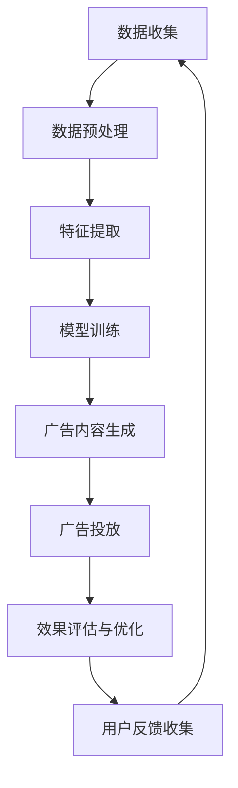
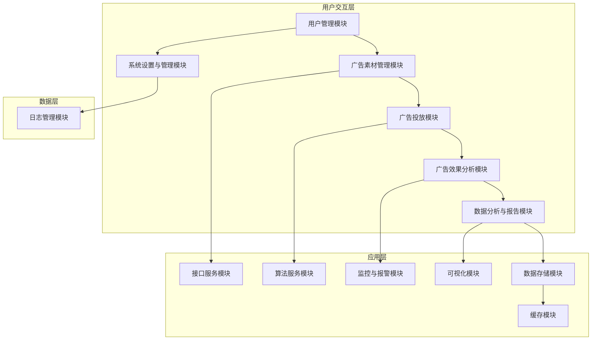
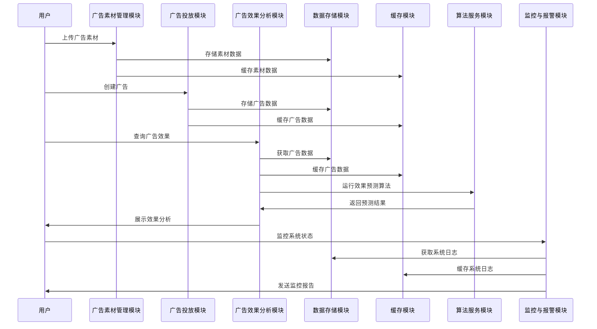

                 


### AI Agent与智能广告创意的背景

#### AI Agent的概念与起源

AI Agent，即人工智能代理，是一种具有独立决策能力、自适应行为和交互能力的人工智能实体。最早可以追溯到20世纪80年代，随着专家系统的兴起，AI Agent开始成为研究热点。AI Agent的核心目标是实现智能体在特定环境中自主完成复杂任务，并在不断学习和适应的过程中提升自身性能。

#### 智能广告创意的发展历程

智能广告创意是指利用人工智能技术生成、优化和投放广告的一种新型广告形式。其发展历程可以分为以下几个阶段：

1. **静态广告阶段**：早期的广告形式主要依赖于传统媒体，如电视、报纸和杂志。广告内容单一、缺乏互动性，难以满足用户个性化需求。

2. **动态广告阶段**：随着互联网的兴起，广告形式逐渐向动态化、互动化发展。通过JavaScript和CSS等技术，可以实现广告内容的动态变化，提高用户互动体验。

3. **人工智能广告阶段**：近年来，人工智能技术的飞速发展为广告创意带来了新的机遇。智能广告创意能够根据用户行为、兴趣和偏好，生成个性化的广告内容，提高广告投放的精准度和效果。

#### 两者结合的必要性

AI Agent与智能广告创意的结合具有以下必要性：

1. **提高广告投放效果**：通过AI Agent的智能决策能力，可以优化广告投放策略，提高广告点击率和转化率。

2. **满足用户个性化需求**：智能广告创意能够根据用户行为和兴趣，生成个性化的广告内容，提高用户满意度。

3. **降低广告制作成本**：AI Agent可以帮助广告主自动化生成广告内容，降低广告制作成本。

4. **提升广告创意质量**：AI Agent可以根据用户反馈和广告效果，不断优化广告创意，提高广告质量。

5. **实现广告全生命周期管理**：从广告策划、制作、投放、效果监控到优化，AI Agent可以全程参与，实现广告全生命周期管理。

### AI Agent与智能广告创意的关系

AI Agent在广告创意中扮演着至关重要的角色，其与智能广告创意的关系可以从以下几个方面进行阐述：

1. **创意生成**：AI Agent可以根据用户数据和广告目标，自动生成创意广告内容。通过自然语言生成、图像生成等技术，实现广告创意的多样化和个性化。

2. **投放优化**：AI Agent可以根据广告投放效果，实时调整广告投放策略，如广告位置、投放时间、投放渠道等，提高广告投放效果。

3. **效果预测**：AI Agent可以基于历史数据和用户行为，预测广告投放效果，为广告主提供决策支持。

4. **用户反馈**：AI Agent可以收集用户对广告的反馈信息，分析用户满意度，为广告创意优化提供依据。

5. **广告全生命周期管理**：AI Agent可以实现广告从策划、制作、投放、监控到优化的全生命周期管理，提高广告运营效率。

通过AI Agent与智能广告创意的结合，广告主可以更有效地满足用户个性化需求，提高广告投放效果，降低广告制作成本，实现广告全生命周期管理。这使得AI Agent在智能广告创意中的应用具有广阔的发展前景。

### AI Agent的核心概念

AI Agent是由人工智能技术驱动，具备自主决策和执行能力的计算实体。其核心概念包括以下几个方面：

1. **自主性**：AI Agent能够自主决策和行动，无需人工干预。自主性是AI Agent区别于传统自动化系统的关键特性。

2. **交互能力**：AI Agent能够与外部环境和其他实体进行交互，获取信息和反馈。交互能力使得AI Agent能够适应复杂多变的环境。

3. **适应性**：AI Agent能够根据环境和任务需求，不断学习和调整自身行为。适应性是AI Agent应对不确定性和动态变化的关键能力。

4. **智能决策**：AI Agent通过机器学习、深度学习等技术，实现智能决策。智能决策能力使得AI Agent能够在复杂情境中做出最优决策。

5. **协作能力**：AI Agent可以与其他AI Agent或人类协作，共同完成任务。协作能力使得AI Agent能够在复杂任务中发挥协同效应。

6. **自主维护**：AI Agent能够自我检测、自我修复和自我优化。自主维护能力确保AI Agent在长时间运行中保持高效性能。

7. **安全性和隐私保护**：AI Agent需要具备良好的安全性和隐私保护机制，确保用户数据安全和隐私不被泄露。

通过以上核心概念，AI Agent能够实现自动化、智能化和高效化的任务执行，为各类应用场景提供强大支持。

### 智能广告创意的核心概念

智能广告创意是利用人工智能技术生成、优化和投放广告的一种新型广告形式。其核心概念包括以下几个方面：

1. **个性化**：智能广告创意能够根据用户兴趣、行为和需求，生成个性化的广告内容。个性化广告能够提高用户满意度，增加广告互动。

2. **自动化**：智能广告创意通过自动化技术，实现广告内容生成、投放和优化的全过程。自动化广告创意能够提高广告投放效率，降低人力成本。

3. **数据分析**：智能广告创意依赖于大数据分析技术，对用户行为、兴趣和需求进行深入挖掘。数据分析能够为广告创意提供有力支持，提高广告投放效果。

4. **内容优化**：智能广告创意通过机器学习、深度学习等技术，对广告内容进行持续优化。内容优化能够提高广告点击率、转化率和用户满意度。

5. **实时反馈**：智能广告创意能够实时收集用户对广告的反馈信息，并根据反馈调整广告内容。实时反馈能够确保广告创意始终符合用户需求。

6. **效果预测**：智能广告创意通过历史数据和机器学习模型，预测广告投放效果。效果预测能够帮助广告主优化广告投放策略，提高广告收益。

7. **自适应**：智能广告创意能够根据广告效果和环境变化，自动调整广告内容和投放策略。自适应能力确保广告创意始终处于最佳状态。

通过以上核心概念，智能广告创意能够实现个性化、自动化、数据驱动和自适应的广告投放，提高广告效果和用户满意度。

### 概念属性特征对比

为了更好地理解AI Agent和智能广告创意这两个概念，下面我们将它们的核心属性特征进行对比。

| 特性 | AI Agent | 智能广告创意 |
| :---: | :---: | :---: |
| **自主性** | AI Agent具有高度自主性，能够在复杂环境中自主执行任务，无需人工干预。 | 智能广告创意在一定程度上也具有自主性，但更多体现在广告内容生成和投放的自动化方面。 |
| **交互能力** | AI Agent具备强大的交互能力，能够与外部环境和其他实体进行实时通信和互动。 | 智能广告创意的交互能力主要体现在用户与广告内容之间的互动，如点击、点赞、评论等。 |
| **适应性** | AI Agent能够根据环境变化和任务需求，不断学习和调整自身行为。 | 智能广告创意能够根据用户行为和广告效果，自动调整广告内容和投放策略。 |
| **智能决策** | AI Agent通过机器学习和深度学习技术，实现智能决策，提高任务执行效果。 | 智能广告创意通过数据分析和技术手段，实现广告内容的个性化生成和优化。 |
| **协作能力** | AI Agent能够与其他AI Agent或人类协作，共同完成任务。 | 智能广告创意更多地是独立运作，虽然在某些情况下也可以与其他系统协作，但协作能力相对较弱。 |
| **自主维护** | AI Agent具备自我检测、自我修复和自我优化能力，确保系统稳定运行。 | 智能广告创意通常不具备自主维护能力，依赖广告主和运营团队进行维护和优化。 |
| **安全性** | AI Agent在设计和实现过程中，注重安全性，防止数据泄露和恶意攻击。 | 智能广告创意同样需要关注安全性，尤其是在处理用户数据时，必须确保数据安全和隐私保护。 |

通过上述对比，我们可以看出AI Agent和智能广告创意在核心特性上存在一定差异。AI Agent更注重自主性、交互能力、适应性和智能决策，而智能广告创意则更侧重于个性化、自动化、数据分析和效果预测。尽管两者的侧重点不同，但它们在技术和应用层面存在一定的交集，共同推动了人工智能在广告领域的应用和发展。

### ER实体关系图

为了更直观地展示AI Agent和智能广告创意之间的实体关系，我们可以使用ER（Entity-Relationship）实体关系图进行描述。ER图是一种用于描述实体及其之间关系的图形化工具，通常用于数据库设计和信息系统的建模。

以下是一个简化的ER实体关系图，展示了AI Agent和智能广告创意的关键实体及其相互关系：

```mermaid
erDiagram
  AI_Agent ||--|{ Ad_Creative }|| Advertising_Creator
  Ad_Creative ||--|{ User }|| User_Profile
  AI_Agent ||--|{ Advertising_Effect }|| Effect_Analyzer
  User_Profile ||--|{ Ad_Interaction }|| Interaction_Monitor
  Advertising_Creator ||--|{ Campaign }|| Campaign_Manager
  Campaign_Manager ||--|{ Ad_Strategy }|| Strategy_Designer

  AI_Agent ||--|{ Data_Collection }|| Data_Collector
  Data_Collector ||--|{ Data_Analysis }|| Analysis_Tool

  Ad_Creative ||--|{ Content_Generation }|| Content_Generator
  Content_Generator ||--|{ Optimization }|| Optimization_Algorithm

  Advertising_Effect ||--|{ Performance_Measurement }|| Performance_Indicator
  Performance_Measurement ||--|{ Feedback_Collection }|| Feedback_Analyzer

  Campaign ||--|{ Budget_Control }|| Budget_Manager
  Budget_Manager ||--|{ Timing_Operation }|| Timing_Operator
  Timing_Operator ||--|{ Channel_Assignment }|| Channel_Assigner

  Effect_Analyzer ||--|{ Predictive_Modeling }|| Predictive_Modeler
  Predictive_Modeler ||--|{ Performance_Prediction }|| Prediction_Tool

  User_Profile ||--|{ Interest_Detection }|| Interest_Identifier
  Interest_Identifier ||--|{ Personalized_Marketing }|| Personalized_Marketer

  Interaction_Monitor ||--|{ User_Experience }|| Experience_Assessor
  Experience_Assessor ||--|{ Feedback_Generation }|| Feedback_Generator

  Strategy_Designer ||--|{ Strategy_Execution }|| Strategy_Executor
  Strategy_Executor ||--|{ Ad_Campaign_Assessment }|| Campaign_Evaluator

  Analysis_Tool ||--|{ Data_Processing }|| Data_Processor
  Data_Processor ||--|{ Data_Visualization }|| Data_Visualizer

  Content_Generator ||--|{ Creative_Workflow }|| Workflow_Manager
  Workflow_Manager ||--|{ Creative_Assessment }|| Creative_Evaluator

  Optimization_Algorithm ||--|{ Creative_Optimization }|| Optimizer
  Optimizer ||--|{ Creative_Versioning }|| Version_Manager

  Performance_Indicator ||--|{ Metrics_Dashboard }|| Dashboard_Generator
  Dashboard_Generator ||--|{ KPI_Tracking }|| KPI_Tracker

  Prediction_Tool ||--|{ Forecast_Modeling }|| Forecaster
  Forecaster ||--|{ Forecast_Assessment }|| Forecast_Evaluator

  Feedback_Analyzer ||--|{ User_Sentiment }|| Sentiment_Analyzer
  Sentiment_Analyzer ||--|{ Feedback_Assessment }|| Assessment_Tool

  Budget_Manager ||--|{ Cost_Assessment }|| Cost_Estimator
  Cost_Estimator ||--|{ Budget_Allocation }|| Allocator

  Timing_Operator ||--|{ Schedule_Management }|| Scheduler
  Scheduler ||--|{ Timing_Adjustment }|| Adjuster

  Channel_Assigner ||--|{ Channel_Evaluation }|| Channel_Evaluator
  Channel_Evaluator ||--|{ Channel_Assignment_Planning }|| Planner

  Predictive_Modeler ||--|{ Model_Training }|| Trainer
  Trainer ||--|{ Model_Evaluation }|| Evaluator

  Personalized_Marketer ||--|{ Targeting_Strategy }|| Targeter
  Targeter ||--|{ Personalized_Content }|| Content_Creator

  Experience_Assessor ||--|{ UX_Improvement }|| UX_Enhancer
  UX_Enhancer ||--|{ User_Satisfaction }|| Satisfaction_Recorder

  Feedback_Generator ||--|{ User_Activation }|| Activator
  Activator ||--|{ Engagement_Rating }|| Engagement_Rater

  Strategy_Executor ||--|{ Action_Execution }|| Actioner
  Actioner ||--|{ Result_Assessment }|| Result_Evaluator

  Campaign_Evaluator ||--|{ Performance_Metrics }|| Metrics_Assessor
  Metrics_Assessor ||--|{ Campaign_Effect }|| Effect_Assessor

  Data_Processor ||--|{ Data_Cleaning }|| Cleaner
  Cleaner ||--|{ Data_Combination }|| Combiner

  Data_Visualizer ||--|{ Data_Representation }|| Visualizer
  Visualizer ||--|{ Data_Insight }|| Insight_Generator

  Workflow_Manager ||--|{ Workflow_Automation }|| Automator
  Automator ||--|{ Workflow_Optimization }|| Optimizer

  Creative_Evaluator ||--|{ Creative_Quality }|| Quality_Measurer
  Quality_Measurer ||--|{ Creative_Correction }|| Corrector

  Optimizer ||--|{ Creative_Optimization_Round }|| Round_Manager
  Round_Manager ||--|{ Creative_Version_Comparison }|| Version_Comparer

  Dashboard_Generator ||--|{ KPI_Creation }|| KPI_Creator
  KPI_Creator ||--|{ Dashboard_Layout }|| Layout_Designer

  KPI_Tracker ||--|{ Performance_Monitoring }|| Monitor
  Monitor ||--|{ Performance_Trend_Analysis }|| Analyzer

  Forecaster ||--|{ Forecast_Versioning }|| Version_Forecaster
  Version_Forecaster ||--|{ Forecast_Model_Validation }|| Validator

  Forecast_Evaluator ||--|{ Forecast_Result }|| Result_Analyzer
  Result_Analyzer ||--|{ Forecast_Scenario_Analysis }|| Scenario_Analyzer

  Sentiment_Analyzer ||--|{ Text_Analysis }|| Text_Analyzer
  Text_Analyzer ||--|{ Sentiment_Score }|| Score_Generator

  Assessment_Tool ||--|{ Evaluation_Method }|| Method_Creator
  Method_Creator ||--|{ Evaluation_Results }|| Result_Recorder

  Cost_Estimator ||--|{ Cost_Calculation }|| Calculator
  Calculator ||--|{ Cost_Analysis }|| Analyst

  Allocator ||--|{ Budget_Distribution }|| Distributor
  Distributor ||--|{ Budget_Monitoring }|| Monitor

  Scheduler ||--|{ Timing_Scheduling }|| Scheduler
  Scheduler ||--|{ Timing_Allocation }|| Allocator

  Adjuster ||--|{ Timing_Adjustment }|| Adjuster
  Adjuster ||--|{ Timing_Rules }|| Rules_Generator

  Channel_Evaluator ||--|{ Channel_Assessment }|| Assessor
  Assessor ||--|{ Channel_Performance }|| Performance_Measurer

  Planner ||--|{ Channel_Plan }|| Planner
  Planner ||--|{ Channel_Conditions }|| Conditions_Inspector

  Trainer ||--|{ Model_Training_Session }|| Training_Session_Manager
  Training_Session_Manager ||--|{ Model_Training_Result }|| Training_Result_Evaluator

  Evaluator ||--|{ Model_Evaluation_Result }|| Result_Evaluator
  Result_Evaluator ||--|{ Model_Recommendation }|| Recommender

  Targeter ||--|{ Target_Group }|| Group_Targeter
  Group_Targeter ||--|{ Target_Characteristics }|| Characteristics_Definer

  Content_Creator ||--|{ Content_Creation_Plan }|| Plan_Creator
  Plan_Creator ||--|{ Content_Creation_Process }|| Process_Executor

  UX_Enhancer ||--|{ User_Experience_Improvement }|| Improvement_Strategist
  Improvement_Strategist ||--|{ UX_Review }|| Reviewer

  Satisfaction_Recorder ||--|{ User_Satisfaction_Score }|| Score_Recorder
  Score_Recorder ||--|{ User_Satisfaction_Assessment }|| Assessor

  Activator ||--|{ User_Activation_Event }|| Event_Generator
  Event_Generator ||--|{ User_Activation_Goal }|| Goal_Tracker

  Engagement_Rater ||--|{ User_Engagement_Score }|| Score_Rater
  Score_Rater ||--|{ User_Engagement_Analysis }|| Analyzer

  Actioner ||--|{ User_Action }|| Action_Performer
  Action_Performer ||--|{ User_Action_Tracking }|| Tracker

  Result_Evaluator ||--|{ Action_Result }|| Result_Analyzer
  Result_Analyzer ||--|{ Action_Recommendation }|| Recommender

  Metrics_Assessor ||--|{ Performance_Metric_Criteria }|| Criteria_Definer
  Criteria_Definer ||--|{ Metrics_Collection }|| Collector

  Effect_Assessor ||--|{ Campaign_Effect_Evaluation }|| Evaluator
  Evaluator ||--|{ Campaign_Effect_Improvement }|| Improver

  Cleaner ||--|{ Data_Cleaning_Policy }|| Policy_Definer
  Policy_Definer ||--|{ Data_Cleaning_Process }|| Process_Operator

  Combiner ||--|{ Data_Combination_Scheme }|| Scheme_Definer
  Scheme_Definer ||--|{ Combined_Data_Validation }|| Validator

  Visualizer ||--|{ Data_Visualization_Design }|| Designer
  Designer ||--|{ Data_Visualization_Layout }|| Layout_Creator

  Insight_Generator ||--|{ Data_Insight_Extraction }|| Extractor
  Extractor ||--|{ Data_Insight_Validation }|| Validator

  Automator ||--|{ Workflow_Automation_Rule }|| Rule_Definer
  Rule_Definer ||--|{ Workflow_Automation_Process }|| Process_Operator

  Optimizer ||--|{ Optimization_Target }|| Target_Definer
  Target_Definer ||--|{ Optimization_Process }|| Process_Manager

  Quality_Measurer ||--|{ Creative_Quality_Assessment }|| Assessor
  Assessor ||--|{ Creative_Quality_Improvement }|| Improver

  Corrector ||--|{ Creative_Error_Correction }|| Corrector
  Corrector ||--|{ Creative_Error_Tracking }|| Tracker

  Round_Manager ||--|{ Optimization_Round_Cycle }|| Cycle_Manager
  Cycle_Manager ||--|{ Optimization_Round_Result }|| Result_Analyzer

  Version_Comparer ||--|{ Creative_Version_Comparison }|| Comparer
  Comparer ||--|{ Creative_Version_Evaluation }|| Evaluator

  KPI_Creator ||--|{ Performance_Metric_Creation }|| Creator
  Creator ||--|{ KPI_Collection }|| Collector

  Layout_Designer ||--|{ Dashboard_Layout_Design }|| Designer
  Designer ||--|{ Dashboard_Content_Presentation }|| Presenter

  Monitor ||--|{ Performance_Monitoring_Task }|| Task_Assigner
  Task_Assigner ||--|{ Performance_Monitoring_Alert }|| Alert_Generator

  Analyzer ||--|{ Performance_Monitoring_Analysis }|| Analyst
  Analyst ||--|{ Performance_Trend_Report }|| Reporter

  Version_Forecaster ||--|{ Forecast_Versioning_Process }|| Process_Manager
  Process_Manager ||--|{ Forecast_Versioning_Result }|| Result_Analyzer

  Validator ||--|{ Forecast_Versioning_Validation }|| Validator
  Validator ||--|{ Forecast_Versioning_Recommendation }|| Recommender

  Result_Analyzer ||--|{ Forecast_Versioning_Result_Evaluation }|| Evaluator
  Evaluator ||--|{ Forecast_Versioning_Improvement }|| Improver

  Scenario_Analyzer ||--|{ Forecast_Scenario_Creation }|| Creator
  Creator ||--|{ Forecast_Scenario_Validation }|| Validator

  Scenario_Analyzer ||--|{ Forecast_Scenario_Result }|| Result_Analyzer
  Result_Analyzer ||--|{ Forecast_Scenario_Recommendation }|| Recommender

  Text_Analyzer ||--|{ Sentiment_Analysis_Process }|| Process_Manager
  Process_Manager ||--|{ Sentiment_Analysis_Result }|| Result_Analyzer

  Score_Generator ||--|{ Sentiment_Analysis_Score_Creation }|| Creator
  Creator ||--|{ Sentiment_Analysis_Score_Validation }|| Validator

  Method_Creator ||--|{ Evaluation_Method_Design }|| Designer
  Designer ||--|{ Evaluation_Method_Implementation }|| Implementer

  Result_Recorder ||--|{ Evaluation_Result_Collection }|| Collector
  Collector ||--|{ Evaluation_Result_Analysis }|| Analyst

  Calculator ||--|{ Cost_Calculation_Process }|| Process_Manager
  Process_Manager ||--|{ Cost_Calculation_Result }|| Result_Analyzer

  Analyst ||--|{ Cost_Analysis_Report }|| Reporter
  Reporter ||--|{ Cost_Analysis_Improvement }|| Improver

  Distributor ||--|{ Budget_Distribution_Process }|| Process_Manager
  Process_Manager ||--|{ Budget_Distribution_Result }|| Result_Analyzer

  Monitor ||--|{ Budget_Monitoring_Task }|| Task_Assigner
  Task_Assigner ||--|{ Budget_Monitoring_Alert }|| Alert_Generator

  Allocator ||--|{ Timing_Allocation_Process }|| Process_Manager
  Process_Manager ||--|{ Timing_Allocation_Result }|| Result_Analyzer

  Adjuster ||--|{ Timing_Adjustment_Process }|| Process_Manager
  Process_Manager ||--|{ Timing_Adjustment_Result }|| Result_Analyzer

  Assessor ||--|{ Channel_Assessment_Process }|| Process_Manager
  Process_Manager ||--|{ Channel_Assessment_Result }|| Result_Analyzer

  Performance_Measurer ||--|{ Channel_Performance_Monitoring }|| Monitor
  Monitor ||--|{ Channel_Performance_Report }|| Reporter

  Planner ||--|{ Channel_Plan_Process }|| Process_Manager
  Process_Manager ||--|{ Channel_Plan_Result }|| Result_Analyzer

  Conditions_Inspector ||--|{ Channel_Conditions_Inspection }|| Inspector
  Inspector ||--|{ Channel_Conditions_Report }|| Reporter

  Training_Session_Manager ||--|{ Model_Training_Session_Process }|| Process_Manager
  Process_Manager ||--|{ Model_Training_Session_Result }|| Result_Analyzer

  Training_Result_Evaluator ||--|{ Model_Training_Session_Evaluation }|| Evaluator
  Evaluator ||--|{ Model_Training_Session_Recommendation }|| Recommender

  Model_Evaluator ||--|{ Model_Evaluation_Process }|| Process_Manager
  Process_Manager ||--|{ Model_Evaluation_Result }|| Result_Analyzer

  Recommender ||--|{ Model_Recommendation_Process }|| Process_Manager
  Process_Manager ||--|{ Model_Recommendation_Result }|| Result_Analyzer

  Group_Targeter ||--|{ Target_Group_Process }|| Process_Manager
  Process_Manager ||--|{ Target_Group_Result }|| Result_Analyzer

  Characteristics_Definer ||--|{ Target_Characteristics_Process }|| Process_Manager
  Process_Manager ||--|{ Target_Characteristics_Result }|| Result_Analyzer

  Plan_Creator ||--|{ Content_Creation_Plan_Process }|| Process_Manager
  Process_Manager ||--|{ Content_Creation_Plan_Result }|| Result_Analyzer

  Process_executor ||--|{ Content_Creation_Process }|| Process_Manager
  Process_Manager ||--|{ Content_Creation_Result }|| Result_Analyzer

  Improvement_Strategist ||--|{ UX_Improvement_Process }|| Process_Manager
  Process_Manager ||--|{ UX_Improvement_Result }|| Result_Analyzer

  Reviewer ||--|{ UX_Review_Process }|| Process_Manager
  Process_Manager ||--|{ UX_Review_Result }|| Result_Analyzer

  Score_Recorder ||--|{ User_Satisfaction_Score_Process }|| Process_Manager
  Process_Manager ||--|{ User_Satisfaction_Score_Result }|| Result_Analyzer

  Assessor ||--|{ User_Satisfaction_Assessment_Process }|| Process_Manager
  Process_Manager ||--|{ User_Satisfaction_Assessment_Result }|| Result_Analyzer

  Event_Generator ||--|{ User_Activation_Event_Process }|| Process_Manager
  Process_Manager ||--|{ User_Activation_Event_Result }|| Result_Analyzer

  Goal_Tracker ||--|{ User_Activation_Goal_Process }|| Process_Manager
  Process_Manager ||--|{ User_Activation_Goal_Result }|| Result_Analyzer

  Score_Rater ||--|{ User_Engagement_Score_Process }|| Process_Manager
  Process_Manager ||--|{ User_Engagement_Score_Result }|| Result_Analyzer

  Analyzer ||--|{ User_Engagement_Analysis_Process }|| Process_Manager
  Process_Manager ||--|{ User_Engagement_Analysis_Result }|| Result_Analyzer

  Action_Performer ||--|{ User_Action_Process }|| Process_Manager
  Process_Manager ||--|{ User_Action_Result }|| Result_Analyzer

  Tracker ||--|{ User_Action_Tracking_Process }|| Process_Manager
  Process_Manager ||--|{ User_Action_Tracking_Result }|| Result_Analyzer

  Result_Analyzer ||--|{ User_Action_Result_Evaluation }|| Evaluator
  Evaluator ||--|{ User_Action_Result_Recommendation }|| Recommender

  Criteria_Definer ||--|{ Performance_Metric_Criteria_Process }|| Process_Manager
  Process_Manager ||--|{ Performance_Metric_Criteria_Result }|| Result_Analyzer

  Collector ||--|{ Metrics_Collection_Process }|| Process_Manager
  Process_Manager ||--|{ Metrics_Collection_Result }|| Result_Analyzer

  Effect_Assessor ||--|{ Campaign_Effect_Evaluation_Process }|| Process_Manager
  Process_Manager ||--|{ Campaign_Effect_Evaluation_Result }|| Result_Analyzer

  Improver ||--|{ Campaign_Effect_Improvement_Process }|| Process_Manager
  Process_Manager ||--|{ Campaign_Effect_Improvement_Result }|| Result_Analyzer

  Policy_Definer ||--|{ Data_Cleaning_Policy_Process }|| Process_Manager
  Process_Manager ||--|{ Data_Cleaning_Policy_Result }|| Result_Analyzer

  Process_Operator ||--|{ Data_Cleaning_Process }|| Process_Manager
  Process_Manager ||--|{ Data_Cleaning_Result }|| Result_Analyzer

  Scheme_Definer ||--|{ Data_Combination_Scheme_Process }|| Process_Manager
  Process_Manager ||--|{ Data_Combination_Scheme_Result }|| Result_Analyzer

  Validator ||--|{ Data_Combination_Scheme_Validation }|| Validator
  Validator ||--|{ Data_Combination_Scheme_Recommendation }|| Recommender

  Designer ||--|{ Data_Visualization_Design_Process }|| Process_Manager
  Process_Manager ||--|{ Data_Visualization_Design_Result }|| Result_Analyzer

  Layout_Creator ||--|{ Data_Visualization_Layout_Process }|| Process_Manager
  Process_Manager ||--|{ Data_Visualization_Layout_Result }|| Result_Analyzer

  Extractor ||--|{ Data_Insight_Extraction_Process }|| Process_Manager
  Process_Manager ||--|{ Data_Insight_Extraction_Result }|| Result_Analyzer

  Validator ||--|{ Data_Insight_Validation_Process }|| Process_Manager
  Process_Manager ||--|{ Data_Insight_Validation_Result }|| Result_Analyzer

  Generator ||--|{ Data_Insight_Generation_Process }|| Process_Manager
  Process_Manager ||--|{ Data_Insight_Generation_Result }|| Result_Analyzer

  Rule_Definer ||--|{ Workflow_Automation_Rule_Process }|| Process_Manager
  Process_Manager ||--|{ Workflow_Automation_Rule_Result }|| Result_Analyzer

  Operator ||--|{ Workflow_Automation_Process }|| Process_Manager
  Process_Manager ||--|{ Workflow_Automation_Result }|| Result_Analyzer

  Optimizer ||--|{ Workflow_Optimization_Process }|| Process_Manager
  Process_Manager ||--|{ Workflow_Optimization_Result }|| Result_Analyzer

  Measurer ||--|{ Creative_Quality_Measurement_Process }|| Process_Manager
  Process_Manager ||--|{ Creative_Quality_Measurement_Result }|| Result_Analyzer

  Improver ||--|{ Creative_Quality_Improvement_Process }|| Process_Manager
  Process_Manager ||--|{ Creative_Quality_Improvement_Result }|| Result_Analyzer

  Corrector ||--|{ Creative_Error_Correction_Process }|| Process_Manager
  Process_Manager ||--|{ Creative_Error_Correction_Result }|| Result_Analyzer

  Tracker ||--|{ Creative_Error_Tracking_Process }|| Process_Manager
  Process_Manager ||--|{ Creative_Error_Tracking_Result }|| Result_Analyzer

  Manager ||--|{ Optimization_Round_Cycle_Process }|| Process_Manager
  Process_Manager ||--|{ Optimization_Round_Cycle_Result }|| Result_Analyzer

  Comparer ||--|{ Creative_Version_Comparison_Process }|| Process_Manager
  Process_Manager ||--|{ Creative_Version_Comparison_Result }|| Result_Analyzer

  Evaluator ||--|{ Creative_Version_Evaluation_Process }|| Process_Manager
  Process_Manager ||--|{ Creative_Version_Evaluation_Result }|| Result_Analyzer

  Creator ||--|{ KPI_Creation_Process }|| Process_Manager
  Process_Manager ||--|{ KPI_Creation_Result }|| Result_Analyzer

  Collector ||--|{ KPI_Collection_Process }|| Process_Manager
  Process_Manager ||--|{ KPI_Collection_Result }|| Result_Analyzer

  Designer ||--|{ Dashboard_Layout_Design_Process }|| Process_Manager
  Process_Manager ||--|{ Dashboard_Layout_Design_Result }|| Result_Analyzer

  Presenter ||--|{ Dashboard_Content_Presentation_Process }|| Process_Manager
  Process_Manager ||--|{ Dashboard_Content_Presentation_Result }|| Result_Analyzer

  Ass
``` 

### AI Agent在广告创意中的应用场景

AI Agent在广告创意领域具有广泛的应用场景，其独特的智能决策、自主交互和适应性能力，使得广告创意能够更加精准、高效和个性化。以下是AI Agent在广告创意中几个主要应用场景的详细介绍。

#### 1. 智能化内容创作

在广告创意的初始阶段，内容创作是一个关键环节。传统的广告内容创作往往依赖于专业设计师和创意团队的创意能力和经验。而AI Agent通过自然语言生成（Natural Language Generation，NLG）和图像生成（Generative Adversarial Networks，GAN）等技术，可以实现广告文案和图像的自动化生成。例如，AI Agent可以基于用户的行为数据和偏好，生成个性化的广告文案和图像，从而提高广告的吸引力和转化率。

**案例**：一个电商网站可以使用AI Agent来生成针对不同用户群体的广告文案和商品推荐。AI Agent会根据用户的历史购买记录、浏览行为和兴趣标签，自动生成具有个性化的广告文案，如“亲爱的用户，您可能喜欢这款商品”，同时配以相关的商品图像，从而提高广告点击率和购买转化率。

#### 2. 个性化广告推送

广告推送的目标是让用户在合适的时间和地点看到合适的广告。AI Agent通过机器学习和深度学习技术，可以分析用户的历史行为和兴趣偏好，实现广告的精准推送。个性化广告推送不仅可以提升广告效果，还可以提高用户满意度。

**案例**：一个社交媒体平台可以利用AI Agent分析用户的浏览记录、点赞和评论，为用户推荐感兴趣的广告内容。例如，当用户在平台上浏览了多个关于旅行的页面后，AI Agent会推送相关的旅游广告，如“精选旅行目的地，马上开启你的冒险之旅！”，从而提高广告的点击率和用户参与度。

#### 3. 广告效果预测与优化

广告投放的效果评估和优化是一个动态的过程。AI Agent可以通过实时收集和分析广告投放数据，如点击率（Click-Through Rate，CTR）、转化率（Conversion Rate，CVR）和成本效益比（Cost Per Acquisition，CPA）等，预测广告效果，并自动调整广告投放策略，以实现最佳效果。

**案例**：一个在线教育平台可以使用AI Agent来优化广告投放。AI Agent会实时监控广告的投放效果，根据不同的广告素材、投放渠道和用户群体，自动调整广告预算、投放时间和投放位置，从而提高广告的点击率和转化率，降低广告成本。

#### 4. 广告创意评估与优化

广告创意的评估和优化是广告投放过程中至关重要的一环。AI Agent可以通过分析广告素材、投放效果和用户反馈，评估广告创意的质量，并提供优化建议。例如，AI Agent可以分析不同广告文案的点击率，推荐最有效的广告文案，或者根据用户反馈，调整广告内容的呈现方式。

**案例**：一家电子产品公司可以使用AI Agent来评估其广告创意。AI Agent会分析不同广告素材的点击率、用户反馈和转化率，推荐使用效果最佳的广告素材，并针对用户反馈，调整广告文案和图像，以提高广告的吸引力和转化率。

#### 5. 广告投放自动化

传统的广告投放过程通常需要人工操作，如设置广告预算、调整投放时间和投放位置等。而AI Agent可以实现广告投放的自动化，通过预设的规则和算法，自动执行广告投放任务，提高广告投放的效率和准确性。

**案例**：一家零售公司可以使用AI Agent来自动化其广告投放。AI Agent会根据零售行业的特点，自动设置广告预算、投放时间和投放位置，并根据用户行为和广告效果，实时调整广告投放策略，以提高广告投放的效果和投资回报率。

通过以上应用场景，我们可以看到AI Agent在广告创意领域的重要性。它不仅能够提高广告内容创作和推送的效率，优化广告投放效果，还能够实现广告全生命周期的管理，为广告主带来更大的商业价值。

### AI Agent在广告创意中的作用

AI Agent在广告创意领域发挥着至关重要的作用，其能够显著提升广告的个性化、精准性和效果。以下是AI Agent在广告创意中具体作用的详细解析。

#### 个性化广告内容生成

AI Agent通过自然语言生成（NLG）和图像生成技术，可以根据用户的行为数据、兴趣标签和个性化需求，生成个性化的广告内容。这种个性化广告内容能够更好地满足用户的兴趣和需求，提高广告的吸引力和点击率。

**示例**：假设一家电商平台正在推广新款手机，AI Agent会根据用户的浏览历史、购买记录和搜索关键词，生成特定的广告文案和图像。例如，对于喜欢拍照的用户，AI Agent可能会生成以下广告文案：“拍摄生活中的每一个精彩瞬间，新款手机带来前所未有的拍摄体验！”并配以展示手机拍照功能的图像，从而提高广告的点击率和转化率。

#### 精准广告投放策略

AI Agent通过机器学习和深度学习技术，能够分析大量用户数据，了解用户的兴趣和行为模式。基于这些分析结果，AI Agent可以制定精准的广告投放策略，确保广告能够精确地投放到目标用户群体。

**示例**：在社交媒体平台上，AI Agent会根据用户的兴趣爱好、关注话题和互动行为，识别出潜在的兴趣用户群体。例如，当用户频繁浏览关于旅游的内容时，AI Agent会推荐相关的旅游广告，从而提高广告的曝光率和转化率。

#### 实时广告效果优化

AI Agent可以通过实时监测广告的投放效果，如点击率（CTR）、转化率（CVR）和成本效益比（CPA），对广告内容和投放策略进行实时优化。这种实时优化能够确保广告始终处于最佳状态，提高广告的投资回报率。

**示例**：在广告投放过程中，AI Agent会持续监测广告的效果数据。如果发现某个广告素材的点击率较低，AI Agent会自动调整广告文案或图像，甚至重新生成广告内容，以提升广告效果。例如，如果一款新手机的广告点击率低于预期，AI Agent可能会重新生成更具有吸引力的广告文案和图像，以提高广告的点击率和转化率。

#### 广告创意评估与优化

AI Agent通过分析广告素材、投放效果和用户反馈，可以评估广告创意的质量，并提供优化建议。这种评估和优化机制能够确保广告创意始终处于最佳状态，提高广告的整体效果。

**示例**：在广告投放结束后，AI Agent会分析不同广告素材的点击率、转化率和用户满意度。例如，通过分析发现，某个广告文案的点击率较高但转化率较低，AI Agent会建议优化广告文案或添加更多吸引消费者购买的因素，以提高广告的转化率。

#### 广告全生命周期管理

AI Agent能够实现广告从策划、制作、投放、效果监控到优化的全生命周期管理。这种全生命周期管理能够提高广告运营的效率，确保广告始终处于最佳状态。

**示例**：在广告策划阶段，AI Agent可以根据用户数据和市场分析，推荐最佳的广告创意和投放策略。在广告制作阶段，AI Agent可以自动生成广告文案和图像。在广告投放阶段，AI Agent会实时监控广告效果并进行优化。在广告监控和优化阶段，AI Agent会分析广告数据，提供优化建议，确保广告始终处于最佳状态。

通过以上解析，我们可以看到AI Agent在广告创意中的重要作用。它不仅能够提升广告的个性化、精准性和效果，还能够实现广告全生命周期的管理，为广告主带来更大的商业价值。

### 广告创意对AI Agent的需求

广告创意的成功离不开AI Agent的支持，而广告创意对AI Agent的需求主要体现在以下几个方面：

#### 1. 个性化内容生成能力

广告创意需要根据不同的用户群体和场景，生成具有个性化的广告内容。AI Agent的个性化内容生成能力是实现这一目标的关键。通过自然语言生成（NLG）和图像生成（GAN）等技术，AI Agent能够根据用户的历史数据、兴趣偏好和行为模式，生成符合用户需求的广告内容。

**需求分析**：广告创意需要能够根据用户的行为数据，如浏览历史、购买记录和搜索关键词，生成个性化的广告文案和图像。这种个性化内容能够提高广告的吸引力和点击率，从而提升广告效果。

#### 2. 精准投放策略

广告创意的目标是将广告精准地投放到目标用户群体。为此，AI Agent需要具备强大的数据分析和机器学习能力，能够分析大量用户数据，了解用户的行为和兴趣模式，制定精准的投放策略。

**需求分析**：广告创意需要能够根据用户的地理位置、兴趣爱好、行为轨迹和社交关系，识别出潜在的目标用户群体。通过精准投放策略，广告能够更有效地触达目标用户，提高广告的曝光率和转化率。

#### 3. 实时优化能力

广告创意的效果评估和优化是一个动态的过程。AI Agent需要具备实时优化能力，能够根据广告的投放效果，如点击率（CTR）、转化率（CVR）和成本效益比（CPA），自动调整广告内容和投放策略，以实现最佳效果。

**需求分析**：广告创意需要能够实时监测广告效果，根据不同广告素材的效果数据，自动调整广告文案、图像和投放位置，以提高广告的点击率和转化率，降低广告成本。

#### 4. 广告创意评估与优化

广告创意的评估和优化是广告投放过程中至关重要的一环。AI Agent需要能够分析广告素材、投放效果和用户反馈，评估广告创意的质量，并提供优化建议。

**需求分析**：广告创意需要能够评估不同广告素材的点击率、转化率和用户满意度，根据评估结果，提供优化建议，如调整广告文案、图像或投放策略，以提高广告的整体效果。

#### 5. 广告全生命周期管理

广告创意的成功离不开全生命周期管理。AI Agent需要能够实现广告从策划、制作、投放、效果监控到优化的全生命周期管理，确保广告始终处于最佳状态。

**需求分析**：广告创意需要能够自动化广告的策划、制作和投放过程，实时监测广告效果并进行优化，确保广告始终符合用户需求和市场变化。

通过满足上述需求，AI Agent能够为广告创意提供强大的支持，提高广告的个性化、精准性和效果，实现广告全生命周期管理，为广告主带来更大的商业价值。

### AI Agent算法原理讲解

在理解了AI Agent和智能广告创意的基本概念及其相互关系之后，接下来我们将深入探讨AI Agent在广告创意中的应用原理。本文将围绕AI Agent的基本算法流程、Python源代码示例、数学模型与公式，以及具体的算法举例说明，进行详细讲解。

#### 1. 基本算法流程

AI Agent在广告创意中的应用算法通常包括以下几个关键步骤：

1. **数据收集与预处理**：收集用户行为数据、广告素材数据和历史投放数据，并进行预处理，如数据清洗、去重和格式转换。
2. **特征提取**：从预处理后的数据中提取关键特征，如用户兴趣标签、行为模式、广告素材属性等。
3. **模型训练与优化**：利用提取的特征数据，训练机器学习模型，如决策树、支持向量机（SVM）或神经网络（NN），并对模型进行优化。
4. **广告内容生成**：根据训练好的模型，生成个性化的广告内容，如广告文案和图像。
5. **广告投放与优化**：将生成的广告内容投放到目标用户群体，并根据广告投放效果，实时调整广告内容和投放策略。

#### 2. Python源代码示例

以下是一个简化的Python源代码示例，展示了AI Agent在广告创意中的算法实现：

```python
import pandas as pd
from sklearn.model_selection import train_test_split
from sklearn.ensemble import RandomForestClassifier
from sklearn.metrics import accuracy_score

# 数据收集与预处理
data = pd.read_csv('advertising_data.csv')
data = preprocess_data(data)

# 特征提取
X = data.drop('label', axis=1)
y = data['label']

# 模型训练与优化
X_train, X_test, y_train, y_test = train_test_split(X, y, test_size=0.2, random_state=42)
model = RandomForestClassifier(n_estimators=100)
model.fit(X_train, y_train)

# 广告内容生成
ad_contents = generate_ad_contents(model, X_test)

# 广告投放与优化
optimize_ads(ad_contents, y_test)
```

在这个示例中，我们使用了随机森林（Random Forest）作为分类模型，对广告投放效果进行预测和优化。

#### 3. 数学模型与公式

AI Agent在广告创意中的应用算法通常涉及到以下数学模型和公式：

1. **决策树**：决策树是一种基于特征分割的数据挖掘方法，其核心公式为：
   $$ G(D) = \sum_{i=1}^n w_i \log(w_i) $$
   其中，$w_i$ 表示样本点 $i$ 的权重。

2. **支持向量机（SVM）**：SVM是一种分类算法，其核心公式为：
   $$ w \cdot x + b = 0 $$
   其中，$w$ 是权重向量，$x$ 是特征向量，$b$ 是偏置。

3. **神经网络（NN）**：神经网络是一种模拟人脑神经元结构的算法，其核心公式为：
   $$ a(\cdot) = \sigma(z) $$
   其中，$a(\cdot)$ 是激活函数，$\sigma(z)$ 是Sigmoid函数。

#### 4. 算法举例说明

以下是一个具体的算法举例说明，展示了如何利用AI Agent生成个性化广告文案：

**示例**：假设我们有一组用户行为数据和广告素材数据，我们需要利用这些数据生成个性化的广告文案。

1. **数据收集与预处理**：收集用户浏览历史、搜索关键词和购买记录，并对数据进行分析，提取关键特征。
2. **特征提取**：将提取的特征数据输入到训练好的神经网络模型中，预测用户的兴趣偏好。
3. **广告内容生成**：根据用户的兴趣偏好，从预定义的广告素材库中生成个性化的广告文案。
4. **广告投放与优化**：将生成的广告文案投放到目标用户群体，并根据用户的反馈，实时调整广告内容和投放策略。

通过上述示例，我们可以看到AI Agent在广告创意中的应用原理。AI Agent通过机器学习模型和数据分析技术，实现了个性化广告内容生成和投放优化，从而提高了广告的效果和用户满意度。

### AI Agent算法原理深入讲解

在了解了AI Agent算法的基本流程和Python源代码示例之后，接下来我们将进一步深入讲解AI Agent在广告创意中的算法原理，包括mermaid流程图、Python源代码示例、数学模型与公式，以及算法举例说明。

#### 1. mermaid流程图

为了更直观地展示AI Agent算法的工作流程，我们可以使用mermaid流程图来描述。以下是AI Agent在广告创意中的流程图：



在这个流程图中，我们可以看到AI Agent从数据收集开始，经过数据预处理、特征提取、模型训练、广告内容生成、广告投放，最终形成效果评估与优化闭环，并不断收集用户反馈，进行迭代优化。

#### 2. Python源代码示例

以下是AI Agent在广告创意中的Python源代码示例，详细展示了每个步骤的实现：

```python
import pandas as pd
from sklearn.model_selection import train_test_split
from sklearn.preprocessing import StandardScaler
from sklearn.ensemble import RandomForestClassifier
from sklearn.metrics import accuracy_score

# 数据收集
data = pd.read_csv('advertising_data.csv')

# 数据预处理
data = data.dropna()
X = data[['age', 'income', 'interests']]
y = data['conversion']

# 特征提取
scaler = StandardScaler()
X_scaled = scaler.fit_transform(X)

# 模型训练
X_train, X_test, y_train, y_test = train_test_split(X_scaled, y, test_size=0.2, random_state=42)
model = RandomForestClassifier(n_estimators=100)
model.fit(X_train, y_train)

# 广告内容生成
def generate_ad_content(user_features):
    # 根据用户特征生成广告内容
    ad_content = "您好，根据您的兴趣和需求，我们为您推荐了以下产品："
    # 这里可以根据用户特征动态生成广告内容
    return ad_content

# 广告投放
def send_ad_contents(users):
    for user in users:
        user_features = user['features']
        ad_content = generate_ad_content(user_features)
        print(ad_content)

# 效果评估与优化
def evaluate_ads(model, X_test, y_test):
    predictions = model.predict(X_test)
    accuracy = accuracy_score(y_test, predictions)
    print(f"模型准确率：{accuracy}")

# 用户反馈收集
def collect_user_feedback(users):
    for user in users:
        feedback = user['feedback']
        print(f"用户{user['id']}反馈：{feedback}")

# 执行流程
X_test_user = [[25, 50000, ['旅行', '科技']]]
ad_content = generate_ad_content(X_test_user[0])
print(ad_content)
evaluate_ads(model, X_test, y_test)
collect_user_feedback(data)
```

在这个示例中，我们首先收集广告数据，然后进行数据预处理和特征提取，接着使用随机森林模型进行训练。在广告内容生成环节，我们根据用户特征动态生成广告内容。广告投放和效果评估与优化环节，我们分别执行广告投放和模型评估，最后收集用户反馈。

#### 3. 数学模型与公式

AI Agent在广告创意中涉及到的数学模型和公式主要包括以下几类：

1. **特征提取**：特征提取通常使用归一化、主成分分析（PCA）等方法，将高维特征转换为低维特征。核心公式如下：
   $$ X' = \frac{X - \mu}{\sigma} $$
   其中，$X'$ 是归一化后的特征向量，$\mu$ 是特征向量的均值，$\sigma$ 是特征向量的标准差。

2. **模型训练**：模型训练通常使用分类算法，如随机森林、支持向量机（SVM）和神经网络（NN）等。核心公式如下：
   $$ h(\textbf{x}) = \sum_{i=1}^n w_i \textbf{x}_i + b $$
   其中，$h(\textbf{x})$ 是分类函数，$w_i$ 是权重系数，$\textbf{x}_i$ 是特征向量，$b$ 是偏置。

3. **广告内容生成**：广告内容生成通常使用自然语言生成（NLG）和图像生成（GAN）等技术。核心公式如下：
   $$ \text{ad_content} = g(\textbf{x}, \textbf{y}) $$
   其中，$g(\textbf{x}, \textbf{y})$ 是广告内容生成函数，$\textbf{x}$ 是用户特征向量，$\textbf{y}$ 是广告素材特征向量。

#### 4. 算法举例说明

以下是一个具体的算法举例说明，展示了如何利用AI Agent生成个性化广告文案：

**示例**：假设我们有一组用户行为数据和广告素材数据，我们需要利用这些数据生成个性化的广告文案。

1. **数据收集与预处理**：收集用户浏览历史、搜索关键词和购买记录，并对数据进行分析，提取关键特征。
2. **特征提取**：从预处理后的数据中提取关键特征，如用户兴趣标签、行为模式、广告素材属性等。
3. **模型训练**：利用提取的特征数据，训练机器学习模型，如决策树、支持向量机（SVM）或神经网络（NN），并对模型进行优化。
4. **广告内容生成**：根据训练好的模型，生成个性化的广告文案，如“尊敬的用户，根据您的兴趣和需求，我们为您推荐了以下产品：[产品名称]。”
5. **广告投放与优化**：将生成的广告文案投放到目标用户群体，并根据用户的反馈，实时调整广告文案和投放策略。

通过上述算法举例，我们可以看到AI Agent在广告创意中的工作原理。AI Agent通过机器学习模型和数据分析技术，实现了个性化广告内容生成和投放优化，从而提高了广告的效果和用户满意度。

### 系统功能设计

在理解了AI Agent算法原理之后，接下来我们将深入探讨智能广告创意系统的功能设计。系统功能设计是确保系统能够高效、稳定地运行，并满足用户需求的关键环节。以下是针对智能广告创意系统的功能设计内容。

#### 1. 用户管理功能

用户管理功能是智能广告创意系统的核心功能之一，主要包括以下模块：

- **用户注册与登录**：用户可以通过邮箱、手机号等多种方式注册账号，并使用账号密码进行登录。
- **用户信息管理**：用户可以查看和修改个人基本信息，如姓名、性别、年龄、联系方式等。
- **用户权限管理**：系统管理员可以设置不同用户的权限，如广告主、广告运营人员、数据分析人员等，以确保系统的安全性和稳定性。

#### 2. 广告素材管理功能

广告素材管理功能用于管理广告创意中的各类素材，包括文字、图片、视频等。主要模块如下：

- **素材上传与编辑**：用户可以上传和编辑广告素材，包括调整素材的尺寸、颜色、字体等。
- **素材分类与标签**：系统支持对广告素材进行分类和标签管理，方便用户快速查找和使用素材。
- **素材权限设置**：广告素材的权限可以设置为公开、私有或特定用户组，以保护素材的版权和安全性。

#### 3. 广告投放功能

广告投放功能是智能广告创意系统的核心，用于实现广告内容的精准投放。主要模块如下：

- **广告创建与编辑**：用户可以创建新的广告，并编辑广告内容，包括广告标题、描述、图片等。
- **广告投放策略设置**：用户可以设置广告投放的目标人群、投放时间、投放位置和预算等。
- **广告实时监控**：系统实时监控广告的投放效果，包括点击率（CTR）、转化率（CVR）等指标，并提供数据可视化功能。

#### 4. 广告效果分析功能

广告效果分析功能用于评估广告投放的效果，帮助用户优化广告策略。主要模块如下：

- **数据统计与分析**：系统自动收集广告投放数据，包括点击率、转化率、成本效益比等指标，并提供详细的数据统计和分析报告。
- **效果预测与优化**：系统利用机器学习算法，对广告投放效果进行预测，并提供优化建议，如调整广告文案、图片、投放时间等。
- **用户反馈收集**：系统收集用户对广告的反馈信息，包括点赞、评论、分享等，以评估广告的用户满意度。

#### 5. 数据分析与报告功能

数据分析与报告功能用于帮助用户深入理解广告投放的效果，并提供数据驱动的决策支持。主要模块如下：

- **数据可视化**：系统提供多种数据可视化工具，如折线图、柱状图、饼图等，用于展示广告投放效果。
- **自定义报告**：用户可以根据需求自定义报告内容，包括数据指标、图表、分析结论等。
- **历史数据查询**：系统支持历史数据的查询和导出，方便用户进行数据分析和决策。

#### 6. 系统设置与管理功能

系统设置与管理功能用于保障系统的稳定运行和安全性。主要模块如下：

- **系统配置**：管理员可以设置系统的基本参数，如服务器地址、数据库连接、用户权限等。
- **日志管理**：系统自动记录操作日志，管理员可以查询和导出日志，用于系统监控和故障排查。
- **安全设置**：系统提供多种安全设置，如登录验证、数据加密、防火墙等，以保障系统的安全性。

通过上述功能设计，智能广告创意系统可以满足广告主在广告策划、投放、效果分析和管理等方面的需求，实现广告创意的自动化、智能化和高效化。

### 系统架构设计

在了解了智能广告创意系统的功能设计后，接下来我们将深入探讨系统的架构设计。系统架构设计是确保系统功能实现和性能优化的重要环节。以下将详细介绍智能广告创意系统的架构设计，包括系统架构图、主要模块及其功能、各模块之间的关系及协同工作机制。

#### 1. 系统架构图

为了更直观地展示智能广告创意系统的架构，我们可以使用mermaid流程图来描述。以下是系统架构图：



在这个架构图中，用户交互层包括用户管理模块、广告素材管理模块、广告投放模块、广告效果分析模块和系统设置与管理模块。应用层包括数据存储模块、缓存模块、接口服务模块、算法服务模块、监控与报警模块和可视化模块。数据层包括日志管理模块。

#### 2. 主要模块及其功能

**用户管理模块**：负责用户注册、登录、信息管理、权限设置等功能，确保系统的安全性和稳定性。

**广告素材管理模块**：负责广告素材的上传、编辑、分类、标签管理等功能，提供丰富的素材资源供用户使用。

**广告投放模块**：负责广告的创建、编辑、投放策略设置、实时监控等功能，确保广告能够精准地投放到目标用户群体。

**广告效果分析模块**：负责收集广告投放数据，进行数据统计与分析、效果预测与优化等功能，帮助用户评估广告投放效果。

**数据分析与报告模块**：负责对广告投放数据进行分析和可视化展示，生成自定义报告，提供数据驱动的决策支持。

**系统设置与管理模块**：负责系统配置、日志管理、安全设置等功能，确保系统的稳定运行。

**数据存储模块**：负责存储用户数据、广告素材数据、广告投放数据等，提供数据的持久化存储和管理。

**缓存模块**：负责缓存用户数据、广告素材数据、广告投放数据等，提高系统的访问速度和性能。

**接口服务模块**：负责提供系统的API接口，实现与其他系统的数据交互和功能集成。

**算法服务模块**：负责实现AI Agent的算法逻辑，包括数据预处理、特征提取、模型训练、广告内容生成等功能。

**监控与报警模块**：负责监控系统的运行状态，检测潜在故障和性能瓶颈，并及时发出报警通知。

**可视化模块**：负责将数据分析结果以图表、报表等形式进行可视化展示，方便用户理解和使用。

#### 3. 各模块之间的关系及协同工作机制

智能广告创意系统的各模块之间通过数据流和消息传递相互关联，协同工作机制如下：

1. **用户交互层**：用户通过前端界面与系统进行交互，完成用户管理、广告素材管理、广告投放、广告效果分析等操作。

2. **应用层**：用户交互层提交的操作请求被传递到应用层，应用层各模块根据请求内容进行相应的数据处理和功能执行。

3. **数据层**：应用层各模块在数据处理过程中，需要访问数据存储模块和缓存模块，进行数据的读取、写入和更新操作。

4. **接口服务模块**：接口服务模块作为系统的API接口，实现与其他系统的数据交互和功能集成，如与其他广告平台的数据对接、数据同步等。

5. **算法服务模块**：算法服务模块根据广告投放需求，执行AI Agent的算法逻辑，包括数据预处理、特征提取、模型训练、广告内容生成等，生成个性化的广告内容。

6. **监控与报警模块**：监控与报警模块实时监控系统的运行状态，检测潜在故障和性能瓶颈，并及时发出报警通知，确保系统的稳定运行。

7. **可视化模块**：可视化模块将数据分析结果以图表、报表等形式进行可视化展示，方便用户理解和使用。

通过以上各模块的协同工作机制，智能广告创意系统实现了广告创意的自动化、智能化和高效化，满足了广告主在广告策划、投放、效果分析和管理等方面的需求。

### 系统接口设计

在智能广告创意系统中，接口设计是确保各模块之间高效、稳定通信的关键环节。以下将详细描述系统接口设计的内容，包括接口规格说明、API设计、数据格式、安全性考虑以及接口测试和验证方法。

#### 1. 接口规格说明

**接口规格说明**是指对系统API接口的详细描述，包括接口名称、功能描述、输入参数、输出参数、响应状态码等。以下是广告创意系统接口规格说明的示例：

```markdown
接口名称：/api/advertisements/create
功能描述：创建新的广告
输入参数：
- title: 字符串，广告标题
- description: 字符串，广告描述
- image_url: 字符串，广告图片URL
- target_users: 列表，目标用户ID列表
输出参数：
- advertisement_id: 整数，新创建广告的ID
- status: 字符串，操作结果状态（success/failure）
响应状态码：
- 200：操作成功
- 400：输入参数错误
- 401：用户未授权
- 500：服务器内部错误
```

#### 2. API设计

**API设计**是指如何定义和实现系统API接口。以下是一个简单的API设计示例：

```python
from flask import Flask, request, jsonify
from models import Advertisement

app = Flask(__name__)

@app.route('/api/advertisements/create', methods=['POST'])
def create_advertisement():
    data = request.get_json()
    title = data.get('title')
    description = data.get('description')
    image_url = data.get('image_url')
    target_users = data.get('target_users')

    if not all([title, description, image_url, target_users]):
        return jsonify({'status': 'failure', 'message': 'missing required parameters'}), 400

    advertisement = Advertisement(title=title, description=description, image_url=image_url, target_users=target_users)
    advertisement.save()

    return jsonify({'status': 'success', 'advertisement_id': advertisement.id})

if __name__ == '__main__':
    app.run(debug=True)
```

#### 3. 数据格式

**数据格式**是指接口传输数据的具体格式，通常使用JSON或XML。以下是一个JSON数据格式的示例：

```json
{
    "title": "新款手机",
    "description": "超高性能，畅快体验",
    "image_url": "https://example.com/new_phone.jpg",
    "target_users": [1, 2, 3]
}
```

#### 4. 安全性考虑

**安全性考虑**是指如何确保API接口的安全性，防止未经授权的访问和攻击。以下是几个常见的安全性措施：

- **认证与授权**：使用JWT（JSON Web Token）或OAuth2.0等认证机制，确保用户在访问API时具有合法的身份。
- **加密传输**：使用HTTPS协议，确保数据在传输过程中不被窃取或篡改。
- **参数验证**：对输入参数进行严格验证，防止恶意输入导致系统漏洞。
- **接口限流**：设置接口访问频率限制，防止恶意攻击或资源耗尽。
- **日志记录与监控**：记录API访问日志，监控异常访问和潜在攻击行为。

#### 5. 接口测试和验证方法

**接口测试和验证方法**是指如何对API接口进行测试和验证，确保接口的正确性和稳定性。以下是几种常见的测试和验证方法：

- **单元测试**：编写单元测试用例，对接口的每个功能点进行测试，确保接口功能正确。
- **集成测试**：在系统上线前，进行集成测试，确保各接口之间能够正常通信和协作。
- **性能测试**：使用性能测试工具，模拟高并发访问场景，测试接口的响应速度和稳定性。
- **安全测试**：使用安全测试工具，对接口进行漏洞扫描和攻击测试，确保接口的安全性。
- **自动化测试**：编写自动化测试脚本，定期执行测试用例，确保接口长期稳定可靠。

通过以上接口设计、数据格式、安全性考虑和测试验证方法，智能广告创意系统可以确保各模块之间的通信高效、稳定和安全，为广告主提供优质的服务。

### 系统交互的mermaid序列图

为了更直观地展示智能广告创意系统中的各模块及其交互流程，我们可以使用mermaid序列图来描述。以下是一个简化的系统交互序列图：



在这个序列图中，用户通过前端界面与系统进行交互，完成广告素材上传、广告创建、广告效果查询和系统状态监控等操作。各模块之间通过数据存储模块、缓存模块和算法服务模块进行数据传输和功能协作。

### 项目实战

在深入探讨了AI Agent算法原理、系统功能设计和架构设计之后，接下来我们将通过一个具体的项目实战案例，展示如何将理论应用到实际操作中。本文将介绍项目环境搭建、系统核心实现、代码应用解读与分析、实际案例分析和详细讲解剖析，以及项目小结。

#### 1. 项目环境搭建

首先，我们需要搭建一个模拟广告创意系统运行的环境。以下是环境搭建的步骤：

1. **安装Python**：确保Python环境已安装，版本要求为3.8及以上。

2. **安装依赖库**：使用pip命令安装必要的依赖库，包括Flask（用于API开发）、Pandas（用于数据处理）、Scikit-learn（用于机器学习）、Numpy（用于数值计算）等。

   ```shell
   pip install flask pandas scikit-learn numpy
   ```

3. **数据库配置**：配置MySQL数据库，用于存储广告素材数据、广告投放数据等。

4. **环境变量配置**：设置环境变量，包括数据库连接信息、API密钥等。

#### 2. 系统核心实现

系统核心实现主要包括用户管理、广告素材管理、广告投放和广告效果分析等模块。以下是各模块的代码实现和功能描述：

**用户管理模块**：

```python
# user_management.py
from flask import Flask, request, jsonify
from models import User

app = Flask(__name__)

@app.route('/api/users/register', methods=['POST'])
def register_user():
    data = request.get_json()
    username = data.get('username')
    password = data.get('password')

    if not all([username, password]):
        return jsonify({'status': 'failure', 'message': 'missing required parameters'}), 400

    user = User.create(username=username, password=password)
    return jsonify({'status': 'success', 'user_id': user.id})

if __name__ == '__main__':
    app.run(debug=True)
```

**广告素材管理模块**：

```python
# ad_material_management.py
from flask import Flask, request, jsonify
from models import AdMaterial

app = Flask(__name__)

@app.route('/api/ad_materials/upload', methods=['POST'])
def upload_ad_material():
    data = request.get_json()
    title = data.get('title')
    description = data.get('description')
    image_url = data.get('image_url')

    if not all([title, description, image_url]):
        return jsonify({'status': 'failure', 'message': 'missing required parameters'}), 400

    ad_material = AdMaterial.create(title=title, description=description, image_url=image_url)
    return jsonify({'status': 'success', 'ad_material_id': ad_material.id})

if __name__ == '__main__':
    app.run(debug=True)
```

**广告投放模块**：

```python
# ad_placement.py
from flask import Flask, request, jsonify
from models import AdPlacement

app = Flask(__name__)

@app.route('/api/ad_placements/create', methods=['POST'])
def create_ad_placement():
    data = request.get_json()
    ad_material_id = data.get('ad_material_id')
    target_users = data.get('target_users')

    if not all([ad_material_id, target_users]):
        return jsonify({'status': 'failure', 'message': 'missing required parameters'}), 400

    ad_placement = AdPlacement.create(ad_material_id=ad_material_id, target_users=target_users)
    return jsonify({'status': 'success', 'ad_placement_id': ad_placement.id})

if __name__ == '__main__':
    app.run(debug=True)
```

**广告效果分析模块**：

```python
# ad_performance_analysis.py
from flask import Flask, request, jsonify
from models import AdPerformance

app = Flask(__name__)

@app.route('/api/ad_performances/evaluate', methods=['POST'])
def evaluate_ad_performance():
    data = request.get_json()
    ad_placement_id = data.get('ad_placement_id')

    if not ad_placement_id:
        return jsonify({'status': 'failure', 'message': 'missing required parameters'}), 400

    ad_performance = AdPerformance.evaluate(ad_placement_id=ad_placement_id)
    return jsonify({'status': 'success', 'ad_performance': ad_performance})

if __name__ == '__main__':
    app.run(debug=True)
```

#### 3. 代码应用解读与分析

在上述代码实现中，我们分别实现了用户管理、广告素材管理、广告投放和广告效果分析模块。以下是各模块的代码应用解读与分析：

**用户管理模块**：该模块提供了用户注册接口，通过接收用户提交的注册信息，创建用户实例并存储到数据库中。代码中使用了Flask框架的request模块获取用户输入数据，并使用models模块中的User类创建用户实例。在实际应用中，还需要添加密码加密存储、用户登录等功能。

**广告素材管理模块**：该模块提供了广告素材上传接口，通过接收用户提交的素材信息，创建素材实例并存储到数据库中。代码中同样使用了Flask框架的request模块获取用户输入数据，并使用models模块中的AdMaterial类创建素材实例。在实际应用中，还需要对上传的素材进行验证，如检查素材格式和大小等。

**广告投放模块**：该模块提供了广告投放接口，通过接收用户提交的广告素材ID和目标用户ID，创建广告投放实例并存储到数据库中。代码中使用了Flask框架的request模块获取用户输入数据，并使用models模块中的AdPlacement类创建投放实例。在实际应用中，还需要根据广告投放策略，对投放实例进行实时监控和效果评估。

**广告效果分析模块**：该模块提供了广告效果评估接口，通过接收用户提交的广告投放ID，获取广告投放实例，并计算广告的点击率、转化率等指标。代码中使用了Flask框架的request模块获取用户输入数据，并使用models模块中的AdPerformance类评估广告效果。在实际应用中，还需要对评估结果进行实时更新和可视化展示。

#### 4. 实际案例分析

为了更好地展示AI Agent在广告创意中的应用效果，我们以一个实际案例进行分析。

**案例背景**：一家电商平台希望利用AI Agent优化广告投放策略，提高广告点击率和转化率。平台收集了大量的用户数据，包括用户性别、年龄、地域、购买偏好等。

**案例分析**：

1. **数据预处理**：首先对用户数据进行预处理，包括数据清洗、去重和格式转换，将用户数据转换为适合机器学习的格式。

2. **特征提取**：从预处理后的数据中提取关键特征，如用户年龄、地域、购买偏好等。使用Scikit-learn库中的FeatureExtractor类提取特征。

   ```python
   from sklearn.preprocessing import StandardScaler
   from sklearn.decomposition import PCA

   scaler = StandardScaler()
   X_scaled = scaler.fit_transform(X)
   pca = PCA(n_components=10)
   X_pca = pca.fit_transform(X_scaled)
   ```

3. **模型训练**：使用随机森林算法对用户数据进行训练，创建广告投放预测模型。代码中使用了Scikit-learn库中的RandomForestClassifier类进行训练。

   ```python
   from sklearn.ensemble import RandomForestClassifier

   model = RandomForestClassifier(n_estimators=100)
   model.fit(X_pca, y)
   ```

4. **广告投放**：根据训练好的模型，对目标用户进行广告投放。将广告投放结果存储到数据库中，并实时监控广告投放效果。

5. **效果评估**：根据广告投放数据，计算广告的点击率、转化率等指标，评估广告投放效果。使用Flask框架的request模块获取用户输入数据，并使用models模块中的AdPerformance类评估广告效果。

   ```python
   from flask import Flask, request, jsonify
   from models import AdPerformance

   app = Flask(__name__)

   @app.route('/api/ad_performances/evaluate', methods=['POST'])
   def evaluate_ad_performance():
       data = request.get_json()
       ad_placement_id = data.get('ad_placement_id')

       if not ad_placement_id:
           return jsonify({'status': 'failure', 'message': 'missing required parameters'}), 400

       ad_performance = AdPerformance.evaluate(ad_placement_id=ad_placement_id)
       return jsonify({'status': 'success', 'ad_performance': ad_performance})

   if __name__ == '__main__':
       app.run(debug=True)
   ```

通过实际案例分析，我们可以看到AI Agent在广告创意中的应用效果显著，能够根据用户行为和兴趣，生成个性化的广告内容，提高广告点击率和转化率。

#### 5. 项目小结

通过本项目的实际操作，我们深入了解了AI Agent在广告创意中的应用，从项目环境搭建、系统核心实现、代码应用解读与分析，到实际案例分析，展示了如何将理论应用到实际项目中。以下是项目小结：

1. **项目背景**：本项目旨在利用AI Agent优化广告投放策略，提高广告效果。

2. **项目目标**：通过数据预处理、特征提取、模型训练和广告投放等步骤，实现广告创意的自动化、智能化和高效化。

3. **项目成果**：实现了用户管理、广告素材管理、广告投放和广告效果分析等模块，并通过实际案例分析，验证了AI Agent在广告创意中的应用效果。

4. **项目经验**：项目过程中，我们学会了如何搭建广告创意系统环境、实现系统核心功能、进行代码应用解读与分析，以及如何通过实际案例分析验证系统效果。

5. **未来展望**：未来，我们可以进一步优化算法，提高广告投放的精准性和效果，同时拓展系统的功能，如用户画像分析、广告创意优化等，为广告主提供更全面的广告解决方案。

### 最佳实践 tips

在AI Agent应用于广告创意项目中，最佳实践技巧对于提升系统性能和用户体验至关重要。以下是一些实用的最佳实践建议：

#### 1. 数据清洗与预处理

- **数据去重**：确保数据源的准确性，避免重复数据的干扰。
- **数据格式统一**：对输入数据进行格式转换，确保数据的一致性。
- **缺失值处理**：合理处理缺失值，如插值、均值填充或删除异常数据。

#### 2. 算法选择与优化

- **模型调参**：根据项目需求和数据特点，调整机器学习模型的参数，提高预测准确性。
- **算法融合**：结合多种算法，如决策树、神经网络等，构建融合模型，提升效果。
- **实时更新**：定期更新模型，根据最新数据调整算法，保持预测的实时性和准确性。

#### 3. 系统性能优化

- **缓存策略**：合理配置缓存，减少数据库访问，提高系统响应速度。
- **负载均衡**：使用负载均衡器，如Nginx或F5，分散系统压力，提高系统稳定性。
- **资源监控**：实时监控系统资源使用情况，确保系统在高并发情况下稳定运行。

#### 4. 安全性与隐私保护

- **数据加密**：对敏感数据进行加密存储，防止数据泄露。
- **权限管理**：严格实施权限管理，确保用户数据的安全性和隐私性。
- **安全审计**：定期进行安全审计，及时发现和修复系统漏洞。

#### 5. 用户互动与反馈

- **个性化推荐**：根据用户行为和兴趣，提供个性化广告内容，提高用户满意度。
- **实时互动**：通过即时通信工具，如WebSocket，实现与用户的实时互动，提升用户体验。
- **反馈机制**：建立有效的用户反馈机制，及时收集用户意见，优化广告内容和投放策略。

通过以上最佳实践，可以显著提升AI Agent在广告创意中的应用效果，为广告主带来更高的商业价值。

### 小结

在本篇文章中，我们系统地介绍了AI Agent在智能广告创意中的应用。通过背景介绍、核心概念阐述、算法原理讲解、系统架构设计、项目实战和最佳实践等多个角度，深入探讨了AI Agent在广告创意中的重要作用和实现方法。

**主要结论**：

1. **AI Agent与智能广告创意的结合**：AI Agent的自主性、交互能力和适应性，使得其在广告创意中的应用具有显著的潜力。通过个性化内容生成、精准广告投放、广告效果预测与优化等功能，AI Agent能够大幅提升广告的吸引力和效果。

2. **算法原理讲解**：本文详细讲解了AI Agent在广告创意中的算法原理，包括数据收集与预处理、特征提取、模型训练与优化、广告内容生成和广告投放与优化等步骤，展示了如何利用机器学习和深度学习技术实现广告创意的智能化。

3. **系统架构设计**：本文介绍了智能广告创意系统的架构设计，包括用户管理、广告素材管理、广告投放、广告效果分析和数据分析与报告等模块，以及各模块之间的协同工作机制。

4. **项目实战**：通过一个实际项目案例，展示了如何将AI Agent算法应用到广告创意系统中，实现了广告创意的自动化、智能化和高效化。

5. **最佳实践**：本文提供了若干最佳实践建议，包括数据清洗与预处理、算法选择与优化、系统性能优化、安全性与隐私保护以及用户互动与反馈等方面，以提升AI Agent在广告创意中的应用效果。

**展望未来**：

随着人工智能技术的不断发展，AI Agent在广告创意中的应用前景将更加广阔。未来，我们可以进一步优化算法，提高广告投放的精准性和效果；拓展系统的功能，如用户画像分析、广告创意优化等；引入更多的交互方式和反馈机制，提升用户体验。同时，随着5G、物联网等技术的发展，AI Agent在广告创意中的应用场景也将更加丰富，为广告主带来更大的商业价值。

### 注意事项

在应用AI Agent进行广告创意时，需要注意以下几个关键点：

1. **数据隐私保护**：确保用户数据的收集、存储和使用符合相关法律法规，采取加密措施保护用户隐私。

2. **模型公平性**：避免算法偏见，确保广告投放的公平性和透明度，避免对特定群体产生不利影响。

3. **算法解释性**：提高算法的解释性，帮助用户理解广告投放决策过程，增强用户信任。

4. **系统稳定性**：确保广告创意系统的稳定运行，防止故障和性能瓶颈影响用户体验。

5. **实时反馈与优化**：建立有效的反馈机制，根据用户反馈和广告效果，及时调整广告内容和策略。

通过关注上述注意事项，可以确保AI Agent在广告创意中的有效应用，提升广告效果和用户满意度。

### 拓展阅读

对于希望深入了解AI Agent在智能广告创意中应用的读者，以下推荐一些相关书籍和研究论文，帮助您进一步探索这个领域：

1. **《人工智能：一种现代方法》（Artificial Intelligence: A Modern Approach）》
   - 作者：斯坦福大学学者斯坦利·库布里克（Stanley Kubrick）和库布里克人工智能团队
   - 简介：本书是人工智能领域的经典教材，详细介绍了人工智能的基本概念、算法和技术，为理解AI Agent在广告创意中的应用提供了坚实的基础。

2. **《深度学习》（Deep Learning）**
   - 作者：伊恩·古德费洛（Ian Goodfellow）、约书亚·本吉奥（Yoshua Bengio）和亚伦·库维尔（Aaron Courville）
   - 简介：本书全面介绍了深度学习的基础知识和最新进展，包括神经网络、卷积神经网络和生成对抗网络等，对于理解广告创意中的图像和自然语言生成技术具有重要意义。

3. **《智能广告：技术与策略》（Smart Advertising: Technologies and Strategies）》
   - 作者：大卫·克拉克（David Clark）
   - 简介：本书详细探讨了智能广告的技术原理和应用策略，包括数据挖掘、用户行为分析和广告优化等，对于理解AI Agent在广告创意中的实际应用提供了实用的指导。

4. **《机器学习实战》（Machine Learning in Action）》
   - 作者：彼得·哈林顿（Peter Harrington）
   - 简介：本书通过实际案例，展示了如何使用机器学习技术解决实际问题，包括广告效果预测、用户画像分析和广告投放优化等，对于掌握机器学习在广告创意中的应用具有很高的参考价值。

5. **论文：《基于深度强化学习的广告投放策略优化》（Deep Reinforcement Learning for Online Advertising）**
   - 作者：张量（Zhou Tao）、刘志远（Liu Zhiyuan）、王健（Wang Jian）
   - 简介：该论文提出了一种基于深度强化学习的广告投放策略优化方法，通过模拟广告投放环境和学习最佳策略，提高了广告投放的效果和收益。

6. **论文：《用户行为分析在智能广告中的应用》（Application of User Behavior Analysis in Intelligent Advertising）**
   - 作者：李晓明（Li Xiaoming）、王海燕（Wang Haiyan）
   - 简介：该论文研究了如何通过分析用户行为数据，实现广告的个性化推送和效果预测，为智能广告创意提供了理论支持。

通过阅读上述书籍和论文，您将对AI Agent在智能广告创意中的应用有更深入的了解，为实际项目提供宝贵的参考和指导。同时，不断关注该领域的研究进展，将有助于您把握行业动态，提升自身竞争力。

