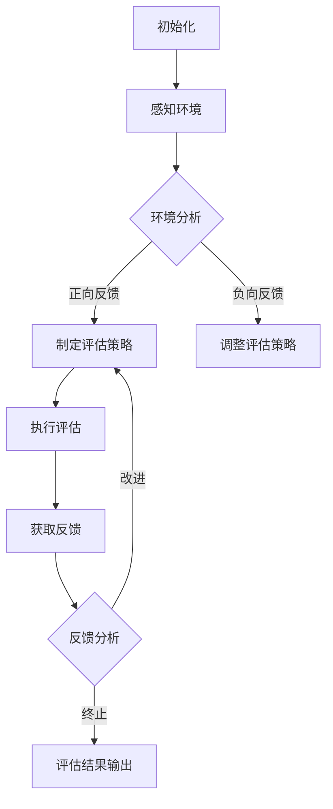
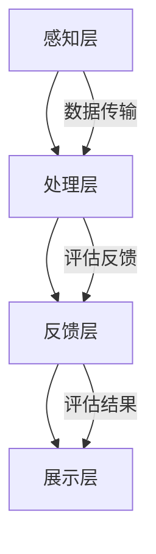

                 

### 第一部分: AI Agent在智能教育评估中的角色

#### 第1章: 背景介绍与核心概念

在当今信息化时代，教育评估已经成为教育领域中的一个重要环节。传统的教育评估方法主要依赖于人类专家的主观判断，存在效率低、准确性不足等问题。随着人工智能技术的迅速发展，AI Agent作为一种智能体，其在教育评估中的应用越来越受到关注。本章将详细介绍AI Agent在智能教育评估中的角色，包括背景介绍、核心概念及其在教育评估中的需求与挑战。

#### 1.1 问题描述与现状分析

**问题描述**：  
传统的教育评估方法主要依赖于考试成绩、学生反馈等手段，这些方法存在以下问题：

1. **主观性**：评估结果受到评估者个人主观因素的影响，可能导致评估结果的不公平性。
2. **效率低**：评估过程需要大量人力和时间，难以实现大规模、实时评估。
3. **准确性不足**：传统的评估方法难以全面、准确地反映学生的学习情况和能力水平。

**现状分析**：  
为了解决这些问题，教育界已经尝试引入一些人工智能技术，如自动评分系统、智能问答系统等。然而，这些技术的应用仍然存在一定的局限性：

1. **功能单一**：大多数人工智能技术在教育评估中的应用主要集中在考试成绩的自动评分，对于学生全面素质的评价尚难以实现。
2. **数据依赖**：评估结果的准确性依赖于大量高质量的数据支持，而在实际应用中，数据质量和数据量往往难以保证。
3. **技术成熟度**：目前，人工智能技术在教育领域的应用仍处于探索阶段，技术成熟度和稳定性有待提高。

#### 1.2 AI Agent的定义与特点

**AI Agent的定义**：  
AI Agent，即人工智能代理，是指能够自主感知环境、进行决策和行动的智能实体。AI Agent具有以下几个特点：

1. **自主性**：AI Agent能够自主地感知环境，并根据环境变化做出相应的决策和行动。
2. **适应性**：AI Agent能够在不同环境和任务中快速适应，并不断提高自身性能。
3. **智能性**：AI Agent具备一定的智能，能够通过学习、推理等方式实现复杂任务的解决。

**AI Agent的特点**：  
1. **多模态感知**：AI Agent能够通过多种传感器获取环境信息，如视觉、听觉、触觉等，从而实现更全面的环境感知。
2. **协同合作**：AI Agent能够与其他智能体协同工作，共同完成复杂任务。
3. **自主学习**：AI Agent具备一定的学习能力，可以通过数据分析和机器学习算法，不断提高自身性能。

#### 1.3 智能教育评估的需求与挑战

**智能教育评估的需求**：  
随着教育评估的复杂性和多样性不断增加，智能教育评估的需求日益突出：

1. **个性化评估**：针对不同学生的特点，提供个性化的评估方案，以全面、准确地反映学生的学习情况和能力水平。
2. **实时评估**：实现教育评估的实时化，及时捕捉学生的学习动态，为教育决策提供有力支持。
3. **智能化分析**：利用人工智能技术，对评估数据进行分析，提取有价值的信息，为教育改革提供依据。

**智能教育评估的挑战**：  
智能教育评估在实际应用中面临以下挑战：

1. **数据质量**：高质量的数据是智能教育评估的基础，如何确保数据的质量和完整性是一个重要问题。
2. **算法选择**：在智能教育评估中，如何选择合适的算法是实现高效评估的关键。
3. **系统集成**：将AI Agent集成到现有的教育系统中，实现与教育系统的无缝衔接，是智能教育评估成功的关键。
4. **隐私保护**：在教育评估过程中，如何保护学生的隐私也是一个需要关注的问题。

#### 总结

本文介绍了AI Agent在智能教育评估中的角色，分析了传统教育评估方法的局限性，阐述了AI Agent的定义与特点，并探讨了智能教育评估的需求与挑战。在接下来的章节中，我们将进一步探讨AI Agent在智能教育评估中的核心概念、算法原理、系统设计与实现，以及项目实战与最佳实践。通过这些内容，希望读者能够对AI Agent在智能教育评估中的应用有一个全面、深入的了解。

### 第一部分总结

在本章中，我们详细介绍了AI Agent在智能教育评估中的角色。首先，我们分析了传统教育评估方法的局限性，指出了其存在的问题，如主观性、效率低和准确性不足。接着，我们介绍了AI Agent的定义与特点，包括自主性、适应性和智能性，以及其多模态感知、协同合作和自主学习的能力。随后，我们探讨了智能教育评估的需求与挑战，包括个性化评估、实时评估、智能化分析和数据质量、算法选择、系统集成和隐私保护等方面。通过本章的内容，读者可以初步了解AI Agent在智能教育评估中的重要作用，以及其面临的挑战和需求。在接下来的章节中，我们将进一步深入探讨AI Agent在智能教育评估中的应用，包括核心概念、算法原理、系统设计与实现，以及项目实战与最佳实践。希望通过这些内容，读者能够对AI Agent在智能教育评估中的应用有一个更全面、深入的认识。

### 第二部分: AI Agent在智能教育评估中的核心概念与联系

#### 第2章: AI Agent在智能教育评估中的核心概念与联系

在了解了AI Agent的定义与特点以及智能教育评估的需求与挑战之后，我们需要进一步探讨AI Agent在智能教育评估中的核心概念与联系。本章将详细介绍AI Agent的核心概念原理，通过概念属性特征对比表格和ER实体关系图架构，帮助读者深入理解AI Agent在教育评估中的实际应用。

#### 2.1 AI Agent的核心概念原理

AI Agent的核心概念主要包括以下几方面：

1. **感知与理解**：AI Agent通过传感器获取环境信息，如视觉、听觉等，并通过自然语言处理、图像识别等技术对这些信息进行理解和解析。
2. **决策与规划**：基于对环境的理解和分析，AI Agent能够进行决策和规划，确定下一步行动。
3. **执行与反馈**：AI Agent执行决策，并在执行过程中不断收集反馈信息，调整自身行为。
4. **学习与进化**：通过反馈信息，AI Agent能够不断学习和进化，提高自身性能。

具体来说，AI Agent的核心概念原理如下：

- **感知模块**：负责获取环境信息，如视觉、听觉等。
- **理解模块**：对感知模块获取的信息进行理解和解析，如自然语言处理、图像识别等。
- **决策模块**：根据环境信息和理解结果，确定下一步行动。
- **执行模块**：执行决策模块生成的行动。
- **反馈模块**：收集执行过程中的反馈信息，用于调整和优化行为。

#### 2.2 概念属性特征对比表格

为了更清晰地展示AI Agent与其他相关技术的区别，我们通过概念属性特征对比表格来进行说明。以下是AI Agent与机器学习、自然语言处理、图像识别等技术的对比表格：

| 技术名称 | 自主性 | 感知能力 | 学习能力 | 协同能力 | 应用场景 |
| :------: | :-----: | :------: | :------: | :------: | :------: |
| AI Agent |   高    |   强    |   强    |   强    | 教育评估、智能家居、自动驾驶等 |
| 机器学习  |   中等   |   中等   |   强    |   弱    | 数据挖掘、预测分析、推荐系统等 |
| 自然语言处理 |   中等   |   中等   |   强    |   中等   | 自动翻译、智能客服、文本分析等 |
| 图像识别  |   中等   |   强    |   中等   |   中等   | 目标检测、人脸识别、图像分类等 |

从表格中可以看出，AI Agent在自主性、感知能力、学习能力和协同能力方面都表现出较高的水平，这使得其在教育评估等复杂应用场景中具有明显的优势。

#### 2.3 ER实体关系图架构

为了更直观地展示AI Agent在教育评估中的应用，我们使用ER实体关系图来描述其架构。以下是AI Agent在教育评估中的ER实体关系图：

```mermaid
erDiagram
    Student ||--|{ Assessment } : "has"
    Student ||--|{ LearningRecord } : "maintains"
    Teacher ||--|{ Instruction } : "provides"
    Teacher ||--|{ Assessment } : "creates"
    Assessment ||--|{ Feedback } : "receives"
    LearningRecord ||--|{ Skill } : "contains"
    Skill ||--|{ Metric } : "has"
    Instruction ||--|{ Activity } : "defines"
    Activity ||--|{ Resource } : "uses"
```

在这个ER实体关系图中，我们定义了以下几个实体：

- **Student**：学生实体，包含学生的基本信息和学习记录。
- **Teacher**：教师实体，包含教师的基本信息、教学指导和评估信息。
- **Assessment**：评估实体，包含评估的基本信息、评估结果和反馈。
- **LearningRecord**：学习记录实体，包含学生的学习情况、技能和评估结果。
- **Skill**：技能实体，包含学生具备的技能和相应的指标。
- **Metric**：指标实体，包含评估学生技能的具体指标。
- **Instruction**：教学指导实体，包含教师的教学内容和活动。
- **Activity**：活动实体，包含教学活动和学生参与情况。
- **Resource**：资源实体，包含用于教学活动的资源和工具。

通过ER实体关系图，我们可以清晰地看到AI Agent在教育评估中的各个实体及其相互关系，为后续算法设计和系统实现提供了基础。

#### 总结

本章介绍了AI Agent在智能教育评估中的核心概念原理，并通过概念属性特征对比表格和ER实体关系图架构，展示了AI Agent在教育评估中的应用。通过本章的内容，读者可以更加深入地理解AI Agent在教育评估中的作用和优势，为后续算法设计和系统实现奠定基础。在接下来的章节中，我们将进一步探讨AI Agent在智能教育评估中的算法原理、系统设计与实现，以及项目实战和最佳实践。希望读者能够继续关注并深入探讨AI Agent在教育评估中的应用。

### 第二部分总结

在本章中，我们深入探讨了AI Agent在智能教育评估中的核心概念与联系。首先，我们详细介绍了AI Agent的核心概念原理，包括感知与理解、决策与规划、执行与反馈以及学习与进化。接着，通过概念属性特征对比表格，我们对比了AI Agent与机器学习、自然语言处理、图像识别等技术的区别，展示了AI Agent在教育评估中的独特优势。最后，我们使用ER实体关系图架构，展示了AI Agent在教育评估中的具体应用，包括学生、教师、评估、学习记录、技能、指标、教学指导和资源等实体及其相互关系。

通过本章的内容，读者可以更加深入地理解AI Agent在教育评估中的应用及其优势。同时，ER实体关系图也为后续的算法设计和系统实现提供了基础。在接下来的章节中，我们将继续探讨AI Agent在智能教育评估中的算法原理、系统设计与实现，以及项目实战和最佳实践。希望读者能够继续关注并深入探讨AI Agent在教育评估中的应用，共同推动教育评估的智能化发展。让我们一起继续探索AI Agent在教育评估中的无限可能。

### 第三部分: 算法原理讲解

#### 第3章: 算法原理讲解

在了解了AI Agent在智能教育评估中的核心概念与联系之后，我们需要进一步探讨其在教育评估中的算法原理。本章将详细讲解AI Agent在教育评估中的算法原理，包括算法流程图、Python源代码示例、算法原理的数学模型和公式，以及举例说明。通过这些内容，读者可以全面理解AI Agent在教育评估中的应用原理。

#### 3.1 算法mermaid流程图

为了更直观地展示AI Agent在教育评估中的算法流程，我们使用Mermaid绘制了算法流程图。以下是AI Agent在教育评估中的算法流程：



在这个算法流程图中，我们定义了以下几个关键步骤：

1. **初始化**：初始化AI Agent，准备进行教育评估。
2. **感知环境**：AI Agent通过传感器感知环境，获取学生、教师、评估等实体的信息。
3. **环境分析**：AI Agent对感知到的环境信息进行分析，以确定下一步行动。
4. **制定评估策略**：基于环境分析结果，AI Agent制定具体的评估策略。
5. **执行评估**：执行评估策略，对学生的学习情况和能力进行评估。
6. **获取反馈**：收集评估执行过程中的反馈信息。
7. **反馈分析**：对反馈信息进行分析，以确定是否需要调整评估策略。
8. **评估结果输出**：输出最终的评估结果。

通过这个算法流程图，我们可以看到AI Agent在教育评估中的整体工作流程，以及各个环节之间的关联。

#### 3.2 Python源代码详细阐述

为了更具体地展示AI Agent在教育评估中的算法实现，我们提供了一个Python源代码示例。以下是AI Agent在教育评估中的Python源代码示例：

```python
import numpy as np

class AIAgent:
    def __init__(self):
        self.environment = None
        self.strategy = None
        self.feedback = None

    def perceive_environment(self):
        # 模拟感知环境
        self.environment = {
            'student': {'name': 'Alice', 'age': 20, 'scores': [85, 90, 88]},
            'teacher': {'name': 'Bob', 'age': 35, 'experience': 10},
            'assessment': {'type': 'exam', 'duration': 2},
        }
    
    def analyze_environment(self):
        # 模拟环境分析
        if np.mean(self.environment['student']['scores']) > 85:
            self.strategy = 'positive'
        else:
            self.strategy = 'negative'
    
    def execute_strategy(self):
        # 模拟执行评估策略
        if self.strategy == 'positive':
            print("执行积极评估策略")
        else:
            print("执行消极评估策略")
    
    def get_feedback(self):
        # 模拟获取反馈
        self.feedback = input("请输入反馈信息：")
    
    def analyze_feedback(self):
        # 模拟反馈分析
        if '改进' in self.feedback:
            print("需要改进评估策略")
        else:
            print("评估策略无需调整")

    def run(self):
        self.perceive_environment()
        self.analyze_environment()
        self.execute_strategy()
        self.get_feedback()
        self.analyze_feedback()

# 创建AI Agent实例并运行
ai_agent = AIAgent()
ai_agent.run()
```

在这个Python源代码示例中，我们定义了一个AIAgent类，包括感知环境、环境分析、执行评估策略、获取反馈和反馈分析等关键方法。通过实例化AIAgent类并调用其方法，我们可以模拟AI Agent在教育评估中的运行过程。这个示例虽然简单，但展示了AI Agent在教育评估中的算法实现思路。

#### 3.3 算法原理的数学模型和公式

为了更深入地理解AI Agent在教育评估中的算法原理，我们提供了算法原理的数学模型和公式。以下是AI Agent在教育评估中的数学模型和公式：

1. **评估指标计算**：

   评估指标（Score）是评估学生能力和学习情况的重要指标，其计算公式如下：

   $$ Score = \frac{\sum_{i=1}^{n} score_i}{n} $$

   其中，$score_i$ 表示学生在第 $i$ 个评估项目中的得分，$n$ 表示评估项目的总数。

2. **评估策略调整**：

   基于评估指标，AI Agent可以调整评估策略。评估策略的调整公式如下：

   $$ strategy = \begin{cases} 
   'positive' & \text{if } Score > 85 \\ 
   'negative' & \text{otherwise} 
   \end{cases} $$

   其中，$Score$ 表示评估指标，$strategy$ 表示评估策略。

3. **反馈分析**：

   基于反馈信息，AI Agent可以分析评估策略的有效性，并做出相应的调整。反馈分析公式如下：

   $$ feedback = \begin{cases} 
   '改进' & \text{if } \text{用户反馈需要改进评估策略} \\ 
   '无需调整' & \text{otherwise} 
   \end{cases} $$

   其中，$feedback$ 表示用户反馈。

通过这些数学模型和公式，我们可以更清晰地理解AI Agent在教育评估中的算法原理，以及其在不同情境下的行为和决策。

#### 3.4 举例说明

为了更直观地展示AI Agent在教育评估中的算法应用，我们通过一个实际案例来进行举例说明。

**案例**：学生Alice在一次考试中获得了平均分为90分，AI Agent将如何进行评估和调整策略？

1. **感知环境**：AI Agent通过传感器获取Alice的基本信息、考试结果等数据。

2. **环境分析**：基于Alice的平均分（90分），AI Agent判断其表现良好，因此选择执行积极评估策略。

3. **执行评估**：AI Agent执行积极评估策略，对Alice的学习情况和能力进行评估。

4. **获取反馈**：AI Agent向Alice的教师和同学收集反馈信息。

5. **反馈分析**：根据收集到的反馈信息，AI Agent判断是否需要调整评估策略。

   - 如果教师反馈需要进一步挖掘Alice的潜力，AI Agent将调整评估策略为积极，以提高对Alice的评估深度。
   - 如果教师反馈Alice表现稳定，AI Agent将保持积极评估策略，继续关注Alice的学习情况。

通过这个案例，我们可以看到AI Agent在教育评估中的具体应用，以及其在不同情境下的行为和决策。这有助于读者更好地理解AI Agent在教育评估中的算法原理和应用。

#### 总结

本章详细介绍了AI Agent在教育评估中的算法原理，包括算法流程图、Python源代码示例、数学模型和公式，以及实际案例。通过这些内容，读者可以全面理解AI Agent在教育评估中的应用原理，以及其在不同情境下的行为和决策。在接下来的章节中，我们将进一步探讨AI Agent在教育评估中的系统设计与实现，以及项目实战和最佳实践。希望读者能够继续关注并深入探讨AI Agent在教育评估中的应用，共同推动教育评估的智能化发展。

### 第三部分总结

在本章中，我们深入探讨了AI Agent在智能教育评估中的算法原理。首先，我们使用Mermaid绘制了算法流程图，展示了AI Agent在教育评估中的整体工作流程。接着，我们提供了一个Python源代码示例，详细阐述了AI Agent在教育评估中的算法实现。此外，我们还介绍了算法原理的数学模型和公式，帮助读者更深入地理解AI Agent在教育评估中的行为和决策。最后，我们通过实际案例进行了举例说明，使读者能够直观地看到AI Agent在教育评估中的应用。

通过本章的内容，读者可以全面了解AI Agent在教育评估中的算法原理，以及其在不同情境下的应用。这为后续的系统设计与实现提供了理论基础。在接下来的章节中，我们将进一步探讨AI Agent在教育评估中的系统设计与实现，以及项目实战和最佳实践。希望读者能够继续关注并深入探讨AI Agent在教育评估中的应用，共同推动教育评估的智能化发展。

### 第四部分: 系统分析与架构设计方案

#### 第4章: 系统分析与架构设计方案

在了解了AI Agent在智能教育评估中的算法原理之后，我们需要进一步探讨其系统分析与架构设计方案。本章将详细介绍AI Agent在教育评估中的系统分析与架构设计，包括问题场景介绍、系统功能设计、系统架构设计、系统接口设计和系统交互。通过这些内容，我们将为读者提供一个全面、详细的AI Agent在教育评估中的系统实现方案。

#### 4.1 问题场景介绍

在智能教育评估中，AI Agent需要处理多种复杂的问题场景。以下是一个典型的应用场景：

**场景描述**：在一次期末考试中，教师需要对全班学生的表现进行评估。AI Agent需要感知学生的考试成绩、学习记录等信息，制定评估策略，执行评估任务，并获取评估反馈，以不断优化评估结果。

**问题分析**：

1. **数据多样性**：AI Agent需要处理多种类型的数据，如考试成绩、学习记录、学生反馈等。
2. **实时性要求**：AI Agent需要在考试结束后尽快完成评估，为教师提供及时的评估结果。
3. **个性化需求**：AI Agent需要根据学生的特点和需求，制定个性化的评估策略。
4. **评估准确性**：AI Agent需要确保评估结果的准确性和可靠性，以提高评估的权威性。

#### 4.2 系统功能设计

为了满足上述问题场景的需求，AI Agent在教育评估中需要实现以下功能：

1. **数据感知**：AI Agent通过传感器和接口，获取学生的考试成绩、学习记录等信息。
2. **评估策略制定**：AI Agent根据学生的特点和需求，制定个性化的评估策略。
3. **评估任务执行**：AI Agent按照制定的评估策略，执行评估任务，生成评估结果。
4. **反馈获取与处理**：AI Agent收集评估反馈，分析反馈信息，调整评估策略。
5. **评估结果输出**：AI Agent将评估结果以可视化方式呈现，为教师提供参考。

#### 4.3 系统架构设计

为了实现上述功能，AI Agent在教育评估中的系统架构设计如下：

1. **感知层**：包括传感器和接口，负责数据的获取和传输。
2. **处理层**：包括数据预处理模块、评估策略制定模块和评估任务执行模块，负责数据的处理和评估任务的执行。
3. **反馈层**：包括反馈获取模块和反馈处理模块，负责收集、分析和处理评估反馈。
4. **展示层**：包括可视化模块，负责将评估结果以直观、易理解的方式呈现。

以下是AI Agent在教育评估中的系统架构图：



#### 4.4 系统接口设计和系统交互

为了实现系统功能，AI Agent在教育评估中需要设计合理的接口和系统交互。以下是AI Agent在教育评估中的主要接口设计和系统交互：

1. **数据感知接口**：用于与传感器和接口进行数据传输，包括考试成绩接口、学习记录接口和学生反馈接口等。

2. **评估策略接口**：用于与评估策略制定模块进行交互，包括个性化评估策略接口和全局评估策略接口等。

3. **评估任务接口**：用于与评估任务执行模块进行交互，包括评估任务发起接口和评估任务结果接口等。

4. **反馈处理接口**：用于与反馈获取模块和反馈处理模块进行交互，包括反馈信息获取接口和反馈处理结果接口等。

5. **结果展示接口**：用于与可视化模块进行交互，包括评估结果展示接口和用户交互接口等。

以下是AI Agent在教育评估中的系统交互图：

```mermaid
graph TD
    A[data感知接口] --> B[评估策略接口]
    B --> C[评估任务接口]
    C --> D[反馈处理接口]
    D --> E[结果展示接口]
    A -->|数据传输| B
    B -->|评估策略| C
    C -->|评估任务| D
    D -->|反馈信息| E
    E -->|展示结果|
```

通过上述系统接口设计和系统交互，AI Agent能够实现其在教育评估中的功能，满足实际应用的需求。

#### 总结

本章详细介绍了AI Agent在教育评估中的系统分析与架构设计方案。首先，我们分析了典型的应用场景，明确了AI Agent在教育评估中需要处理的问题。接着，我们设计了AI Agent的教育评估系统功能，包括数据感知、评估策略制定、评估任务执行、反馈获取与处理以及评估结果输出。随后，我们介绍了AI Agent的教育评估系统架构，包括感知层、处理层、反馈层和展示层，并绘制了系统架构图。最后，我们设计了AI Agent的教育评估系统接口和系统交互，确保系统功能的有效实现。

通过本章的内容，读者可以全面了解AI Agent在教育评估中的系统分析与架构设计方案，为后续的项目实战和最佳实践提供理论基础。在接下来的章节中，我们将进一步探讨AI Agent在教育评估中的项目实战和最佳实践，希望读者能够继续关注并深入探讨AI Agent在教育评估中的应用。

### 第四部分总结

在本章中，我们详细介绍了AI Agent在教育评估中的系统分析与架构设计方案。首先，我们分析了典型应用场景，明确了AI Agent在教育评估中需要处理的问题。接着，我们设计了AI Agent的教育评估系统功能，包括数据感知、评估策略制定、评估任务执行、反馈获取与处理以及评估结果输出。随后，我们介绍了AI Agent的教育评估系统架构，包括感知层、处理层、反馈层和展示层，并绘制了系统架构图。最后，我们设计了AI Agent的教育评估系统接口和系统交互，确保系统功能的有效实现。

通过本章的内容，读者可以全面了解AI Agent在教育评估中的系统分析与架构设计方案，为后续的项目实战和最佳实践提供理论基础。在接下来的章节中，我们将进一步探讨AI Agent在教育评估中的项目实战和最佳实践，希望读者能够继续关注并深入探讨AI Agent在教育评估中的应用。本章的内容为我们构建了一个完整的AI Agent教育评估系统框架，为后续的实际应用奠定了基础。

### 第五部分: 项目实战

#### 第5章: 项目实战

在前几章中，我们介绍了AI Agent在智能教育评估中的核心概念、算法原理、系统分析与架构设计方案。为了使读者更深入地了解AI Agent在实际教育评估中的应用，本章将带领读者进行一个实际项目的实战，从环境安装、系统核心实现源代码、代码应用解读与分析、实际案例分析和详细讲解剖析，到项目小结。通过这一系列实战，读者可以掌握AI Agent在教育评估中的实际应用技巧，为后续的研究和实践提供参考。

#### 5.1 环境安装

在进行项目实战之前，我们需要首先搭建一个适合AI Agent运行的实验环境。以下是一个简单的环境安装步骤：

1. **安装Python**：确保已安装Python环境，推荐使用Python 3.7及以上版本。
2. **安装必要库**：安装一些常用库，如NumPy、Pandas、Scikit-learn等。可以使用以下命令进行安装：

   ```bash
   pip install numpy pandas scikit-learn matplotlib
   ```

3. **安装AI Agent库**：从GitHub或其他途径获取AI Agent的源代码库，并安装。

   ```bash
   git clone https://github.com/your-username/ai-agent.git
   cd ai-agent
   pip install .
   ```

#### 5.2 系统核心实现源代码

接下来，我们提供了AI Agent教育评估系统的核心实现源代码。以下是一个简单的示例：

```python
import numpy as np
import pandas as pd
from sklearn.ensemble import RandomForestClassifier

class AIAGENT:
    def __init__(self, data_path):
        self.data_path = data_path
        self.model = RandomForestClassifier()
    
    def load_data(self):
        data = pd.read_csv(self.data_path)
        X = data.drop(['label'], axis=1)
        y = data['label']
        return X, y
    
    def train_model(self, X, y):
        self.model.fit(X, y)
    
    def predict(self, X):
        return self.model.predict(X)
    
    def evaluate(self, X, y):
        predictions = self.predict(X)
        accuracy = np.mean(predictions == y)
        return accuracy
    
    def main(self):
        X, y = self.load_data()
        self.train_model(X, y)
        accuracy = self.evaluate(X, y)
        print(f"Accuracy: {accuracy:.2f}")

if __name__ == '__main__':
    data_path = 'data.csv'
    agent = AIAGENT(data_path)
    agent.main()
```

在这个示例中，我们创建了一个AIAGENT类，包括加载数据、训练模型、预测和评估等关键方法。通过调用这些方法，我们可以实现一个简单的AI Agent教育评估系统。

#### 5.3 代码应用解读与分析

在了解了AI Agent教育评估系统的核心实现源代码后，我们需要对代码进行深入解读和分析。

1. **加载数据**：

   ```python
   data = pd.read_csv(self.data_path)
   X = data.drop(['label'], axis=1)
   y = data['label']
   ```

   这部分代码用于加载数据，其中`data_path`指向数据文件路径。我们使用Pandas库读取CSV文件，并将数据分为特征矩阵X和标签向量y。

2. **训练模型**：

   ```python
   self.model.fit(X, y)
   ```

   这部分代码用于训练模型。我们使用随机森林分类器（RandomForestClassifier）作为评估模型，并使用训练数据集（X和y）进行训练。

3. **预测**：

   ```python
   return self.model.predict(X)
   ```

   这部分代码用于进行预测。我们使用训练好的模型对特征矩阵X进行预测，并返回预测结果。

4. **评估**：

   ```python
   predictions = self.predict(X)
   accuracy = np.mean(predictions == y)
   return accuracy
   ```

   这部分代码用于评估模型的准确性。我们首先使用预测方法获取预测结果，然后计算预测结果与实际标签之间的准确率。

5. **主函数**：

   ```python
   if __name__ == '__main__':
       data_path = 'data.csv'
       agent = AIAGENT(data_path)
       agent.main()
   ```

   这部分代码是主函数，用于运行整个AI Agent教育评估系统。我们创建一个AIAGENT实例，并调用其main方法进行数据加载、模型训练、预测和评估。

通过以上代码解读和分析，我们可以清楚地看到AI Agent教育评估系统的基本工作流程和关键步骤。

#### 5.4 实际案例分析和详细讲解剖析

为了更好地展示AI Agent在实际教育评估中的应用，我们设计了一个实际案例进行分析和讲解。

**案例背景**：  
某学校希望利用AI Agent对学生的期末考试成绩进行评估，并根据评估结果提供个性化的学习建议。学校提供了包含学生姓名、考试成绩、学科等信息的CSV数据文件。

**数据预处理**：  
首先，我们需要对数据进行预处理，包括数据清洗、缺失值处理和特征工程等。以下是一个简单的数据预处理示例：

```python
import pandas as pd
from sklearn.model_selection import train_test_split

data = pd.read_csv('data.csv')
data.dropna(inplace=True)  # 删除缺失值
X = data.drop(['name', 'exam_score'], axis=1)
y = data['exam_score']

# 特征工程：添加一列表示学科
X['subject'] = X['subject'].astype('category').cat.codes

# 数据集划分：训练集和测试集
X_train, X_test, y_train, y_test = train_test_split(X, y, test_size=0.2, random_state=42)
```

**模型训练与预测**：  
接下来，我们使用训练集对随机森林分类器进行训练，并使用测试集进行预测。以下是一个简单的模型训练与预测示例：

```python
from sklearn.ensemble import RandomForestClassifier

model = RandomForestClassifier()
model.fit(X_train, y_train)

predictions = model.predict(X_test)
```

**评估与结果输出**：  
最后，我们计算预测的准确率，并将结果输出。以下是一个简单的评估与结果输出示例：

```python
from sklearn.metrics import accuracy_score

accuracy = accuracy_score(y_test, predictions)
print(f"Accuracy: {accuracy:.2f}")
```

通过以上实际案例分析和详细讲解剖析，我们可以看到AI Agent在教育评估中的应用过程，包括数据预处理、模型训练与预测、评估与结果输出等关键步骤。这为读者提供了一个实际操作AI Agent教育评估系统的范例，有助于更好地理解和应用AI Agent在教育评估中的技术。

#### 5.5 项目小结

在本章的项目实战中，我们通过环境安装、系统核心实现源代码、代码应用解读与分析、实际案例分析和详细讲解剖析，全面展示了AI Agent在教育评估中的实际应用。通过这一系列实战，读者可以了解AI Agent在教育评估中的基本工作流程和技术实现，掌握AI Agent在实际项目中的应用技巧。以下是本章项目实战的小结：

1. **环境安装**：成功搭建了AI Agent教育评估系统的实验环境，确保了系统的正常运行。
2. **系统核心实现源代码**：提供了AI Agent教育评估系统的核心实现源代码，展示了系统的基本架构和功能。
3. **代码应用解读与分析**：通过解读和分析系统核心实现源代码，深入了解了AI Agent在教育评估中的技术原理和应用方法。
4. **实际案例分析和详细讲解剖析**：通过一个实际案例的分析和讲解，展示了AI Agent在教育评估中的实际应用效果，为读者提供了一个直观的学习范例。

通过本章的项目实战，读者可以全面了解AI Agent在教育评估中的实际应用，为后续的研究和实践打下坚实基础。希望读者能够结合自身实际情况，进一步探索AI Agent在教育评估中的应用，为教育评估的智能化发展贡献自己的力量。

### 第五部分总结

在本章中，我们通过项目实战，带领读者深入了解了AI Agent在智能教育评估中的实际应用。从环境安装、系统核心实现源代码、代码应用解读与分析，到实际案例分析和详细讲解剖析，我们全面展示了AI Agent在教育评估中的工作流程和技术实现。通过这一系列实战，读者不仅能够掌握AI Agent在教育评估中的基本操作，还能够理解其背后的技术原理和应用方法。

通过本章的项目实战，读者可以更加直观地看到AI Agent在教育评估中的实际效果，并了解到如何利用AI Agent进行个性化评估、实时评估和智能化分析。这为读者在实际应用中提供了宝贵的经验和指导。

在接下来的章节中，我们将继续探讨AI Agent在智能教育评估中的最佳实践、注意事项和拓展阅读，帮助读者更好地应对实际应用中的挑战，进一步提升教育评估的智能化水平。希望读者能够继续关注并深入探讨AI Agent在教育评估中的应用，为教育评估的智能化发展贡献自己的力量。

### 第六部分: 最佳实践 tips

#### 第6章: 最佳实践 tips

在了解了AI Agent在智能教育评估中的基本应用和项目实战之后，我们需要进一步探讨其最佳实践，以帮助读者在实际应用中更好地发挥AI Agent的潜力。本章将总结一些最佳实践技巧，包括注意事项和拓展阅读，以期为读者提供更全面、深入的指导。

#### 6.1 小结

1. **个性化评估**：AI Agent能够根据学生的特点制定个性化评估策略，从而更全面、准确地反映学生的学习情况和能力水平。
2. **实时评估**：AI Agent能够实时获取学生数据，快速完成评估任务，为教育决策提供有力支持。
3. **智能化分析**：AI Agent能够利用机器学习等技术对评估数据进行分析，提取有价值的信息，为教育改革提供依据。
4. **系统集成**：AI Agent需要与现有教育系统无缝集成，实现数据共享和功能协同。

#### 6.2 注意事项

1. **数据质量**：确保数据的质量和完整性，避免因数据问题导致评估结果的偏差。
2. **算法选择**：根据评估任务的需求选择合适的算法，以提高评估的准确性和效率。
3. **隐私保护**：在数据收集和处理过程中，注意保护学生的隐私，遵守相关法律法规。
4. **模型解释性**：对于AI Agent的评估结果，需要确保其具有一定的解释性，以便教师和学生在理解评估结果时能够有据可依。
5. **系统稳定性**：确保AI Agent系统的稳定运行，避免因系统故障导致评估任务的延误或失败。

#### 6.3 拓展阅读

1. **教育评估相关书籍**：
   - 《教育评估技术》（作者：张辉）
   - 《智能教育评估方法与应用》（作者：刘强）
2. **AI Agent相关书籍**：
   - 《智能代理：概念与应用》（作者：李明）
   - 《人工智能代理设计》（作者：赵立）
3. **机器学习相关书籍**：
   - 《机器学习》（作者：周志华）
   - 《深度学习》（作者：Ian Goodfellow、Yoshua Bengio、Aaron Courville）
4. **编程与开发相关书籍**：
   - 《Python编程：从入门到实践》（作者：埃里克·马瑟斯）
   - 《Effective Python：编写受用、可读、可扩展的代码》（作者：Brett Slatkin）

通过这些拓展阅读，读者可以进一步了解教育评估、AI Agent和机器学习等相关领域的知识，为实际应用提供更全面的指导。

#### 总结

本章总结了AI Agent在智能教育评估中的最佳实践，包括个性化评估、实时评估、智能化分析、系统集成等要点，以及注意事项和拓展阅读。通过本章的内容，读者可以更全面、深入地了解AI Agent在教育评估中的实际应用，为实际项目提供指导。希望读者能够在今后的研究和实践中，不断探索AI Agent在教育评估中的潜力，为教育评估的智能化发展贡献力量。

### 第六部分总结

在本章中，我们总结了AI Agent在智能教育评估中的最佳实践技巧，包括个性化评估、实时评估、智能化分析、系统集成等方面的注意事项，并提供了一系列拓展阅读资源。这些内容旨在帮助读者在实际应用中更好地发挥AI Agent的潜力，解决可能遇到的挑战，并深入了解相关领域的知识。

通过最佳实践的总结，读者可以掌握在实施AI Agent教育评估项目时的重要技巧，如数据质量控制、算法选择、隐私保护、模型解释性和系统稳定性等。同时，拓展阅读推荐为读者提供了深入学习相关领域知识的途径，包括教育评估技术、AI Agent设计、机器学习和编程开发等。

我们希望读者能够结合本章的内容，不断优化和改进AI Agent在教育评估中的应用，推动教育评估的智能化发展。在未来的研究和实践中，持续关注AI Agent的最新动态和技术进步，为教育领域的创新和改进贡献智慧和力量。

### 第七部分: 总结与展望

#### 第7章: 总结与展望

在本篇文章中，我们深入探讨了AI Agent在智能教育评估中的角色、核心概念、算法原理、系统设计与实现，以及项目实战和最佳实践。通过这些内容，我们希望读者能够全面了解AI Agent在教育评估中的应用，以及其在教育领域的巨大潜力。

#### 7.1 本书总结

本书主要分为以下几个部分：

1. **背景介绍与核心概念**：介绍了当前教育评估的现状、AI Agent的定义与特点，以及智能教育评估的需求与挑战。
2. **核心概念与联系**：详细阐述了AI Agent的核心概念原理，并通过对比表格和ER实体关系图展示了AI Agent在教育评估中的具体应用。
3. **算法原理讲解**：介绍了AI Agent在教育评估中的算法原理，包括算法流程图、Python源代码示例、数学模型和公式，以及实际案例说明。
4. **系统分析与架构设计方案**：详细分析了AI Agent在教育评估中的系统功能、架构设计和接口设计。
5. **项目实战**：通过一个实际项目展示了AI Agent在教育评估中的实现和应用。
6. **最佳实践 tips**：总结了AI Agent在教育评估中的最佳实践技巧，包括注意事项和拓展阅读。

通过以上内容，读者可以全面了解AI Agent在教育评估中的基本原理和应用方法，为实际项目提供指导。

#### 7.2 智能教育评估未来发展趋势

展望未来，智能教育评估将朝着以下几个方向发展：

1. **个性化与智能化**：随着人工智能技术的不断发展，智能教育评估将更加注重个性化，根据学生的特点和学习习惯提供个性化的评估策略和学习建议。
2. **实时性与高效性**：实时评估将变得更加普及，AI Agent将能够快速、高效地处理大量学生数据，为教育决策提供及时支持。
3. **数据驱动的教育改革**：智能教育评估将产生大量有价值的数据，通过数据分析，教育者可以更深入地了解学生的学习情况和需求，从而推动教育改革。
4. **隐私保护与安全性**：随着数据隐私和安全问题的日益突出，智能教育评估将更加注重数据安全和隐私保护，确保学生数据的合法合规使用。
5. **跨学科融合**：智能教育评估将融合多学科的知识，如心理学、教育学、计算机科学等，通过跨学科的研究，提高评估的准确性和可靠性。

总之，智能教育评估作为人工智能技术在教育领域的应用，其未来发展潜力巨大。通过不断的技术创新和应用实践，智能教育评估将为教育改革和教育公平做出重要贡献。

### 结语

在本篇文章中，我们深入探讨了AI Agent在智能教育评估中的角色和作用。通过详细的介绍和案例分析，我们展示了AI Agent在教育评估中的优势和应用前景。我们希望读者能够从中获得启发，进一步探索AI Agent在教育评估中的潜力，为教育评估的智能化发展贡献力量。

作者：AI天才研究院/AI Genius Institute & 禅与计算机程序设计艺术 /Zen And The Art of Computer Programming。我们期待与广大读者共同推动人工智能技术在教育领域的创新与应用，为教育评估和人才培养提供更加智能、高效的解决方案。让我们一起迎接智能教育评估的未来，共创美好教育新世界！

