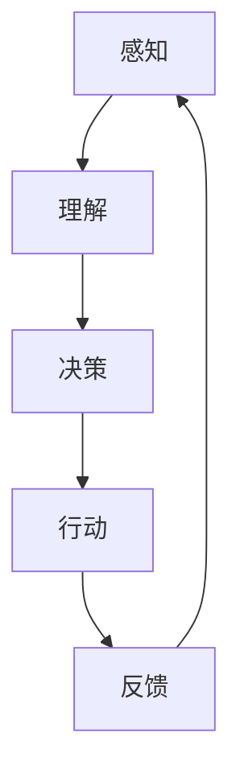

                 

## 《AI Agent在智能旅游规划中的应用》

### 关键词：AI Agent、智能旅游规划、应用、技术原理、案例研究

### 摘要：
本文深入探讨了AI Agent在智能旅游规划中的应用，从基础理论、技术原理到实际案例，全面展示了AI Agent在旅游路线规划、景点推荐、旅游安全预警等领域的强大功能。通过对AI Agent技术的详细解析，本文旨在为读者提供一个全面、系统的理解和应用指导，帮助他们在实际项目中更好地利用AI Agent技术，提升旅游服务的智能化水平。

### 目录大纲设计思路

为了设计出一份详尽且逻辑清晰的目录大纲，我们需要遵循以下步骤：

1. **明确书的核心内容**：首先，我们要明确书籍的主题内容，即《AI Agent在智能旅游规划中的应用》。这要求我们明确书中将涉及的关键概念、技术、应用场景等。

2. **构建整体框架**：在明确核心内容后，我们需要构建书籍的整体框架，包括引言、核心概念、技术原理、应用案例、结论等部分。

3. **细化章节内容**：针对每一个部分，我们需要进一步细化章节内容，确保每个章节都有明确的主题和内容结构。

4. **确保逻辑连贯性**：在细化章节内容的同时，我们要确保书籍的整体逻辑连贯，即前后章节之间要有清晰的衔接。

5. **遵循markdown格式**：最后，我们需要将整个目录大纲按照markdown格式进行排版，确保格式简洁、清晰。

### 目录大纲结构

基于上述设计思路，我们可以将目录大纲分为以下几个部分：

1. **引言**：介绍AI Agent和智能旅游规划的发展背景、现状和未来趋势。

2. **基础理论**：介绍AI Agent的基本概念、发展历程、类型和特点。然后，介绍智能旅游规划的定义、目标和基本原则。

3. **AI Agent技术原理**：首先，讲解AI Agent的核心技术，如机器学习、深度学习、自然语言处理等。然后，通过Mermaid流程图展示AI Agent的工作流程。

4. **智能旅游规划应用**：详细分析AI Agent在智能旅游规划中的应用，包括旅游路线规划、景点推荐、旅游安全预警等。

5. **案例研究**：通过实际案例，展示AI Agent在智能旅游规划中的应用效果。

6. **总结与展望**：总结全书内容，讨论AI Agent在智能旅游规划中的应用前景，并提出未来研究方向。

### 目录大纲示例

```markdown
# 《AI Agent在智能旅游规划中的应用》目录大纲

## 引言
### 1.1 AI Agent与智能旅游规划概述
### 1.2 书籍目的与结构安排

## 基础理论
### 2.1 AI Agent的基本概念与类型
#### 2.1.1 AI Agent的定义
#### 2.1.2 AI Agent的类型与特点
### 2.2 智能旅游规划的基本理论
#### 2.2.1 智能旅游规划的定义与目标
#### 2.2.2 智能旅游规划的基本原则

## AI Agent技术原理
### 3.1 机器学习与深度学习基础
#### 3.1.1 机器学习的基本概念
#### 3.1.2 深度学习的基本概念
### 3.2 自然语言处理
#### 3.2.1 自然语言处理的基本概念
#### 3.2.2 自然语言处理的关键技术
### 3.3 AI Agent工作流程与架构
#### 3.3.1 AI Agent的工作流程
#### 3.3.2 AI Agent的架构设计

## 智能旅游规划应用
### 4.1 旅游路线规划
#### 4.1.1 旅游路线规划的基本原理
#### 4.1.2 基于AI Agent的旅游路线规划方法
### 4.2 景点推荐
#### 4.2.1 景点推荐的基本原理
#### 4.2.2 基于AI Agent的景点推荐方法
### 4.3 旅游安全预警
#### 4.3.1 旅游安全预警的基本原理
#### 4.3.2 基于AI Agent的旅游安全预警方法

## 案例研究
### 5.1 案例一：某景区的AI Agent应用
#### 5.1.1 案例背景
#### 5.1.2 案例解决方案
#### 5.1.3 案例效果评估

### 5.2 案例二：某旅行社的AI Agent应用
#### 5.2.1 案例背景
#### 5.2.2 案例解决方案
#### 5.2.3 案例效果评估

## 总结与展望
### 6.1 全书总结
### 6.2 AI Agent在智能旅游规划中的应用前景
### 6.3 未来研究方向
```

以上是初步的目录大纲，接下来我们将进一步细化每个章节的内容，并确保符合markdown格式要求。

## 引言

### AI Agent与智能旅游规划概述

随着人工智能技术的飞速发展，AI Agent作为一种智能实体，正逐渐在各个领域展现其强大的应用潜力。AI Agent，又称智能代理，是一种具有自主决策和行动能力的软件系统，它可以模拟人类智能行为，完成复杂的任务。智能旅游规划作为人工智能在旅游行业的重要应用，正面临着前所未有的发展机遇。

#### 1.1.1 AI Agent的定义与特点

AI Agent是一种基于人工智能技术的智能实体，它能够在特定环境中感知环境信息，理解用户需求，并自主做出决策和采取行动。AI Agent具有以下特点：

1. **自主性**：AI Agent能够根据环境变化和用户需求，自主调整行为策略。
2. **智能性**：AI Agent具备一定的智能水平，能够理解复杂问题，并给出合理解决方案。
3. **适应性**：AI Agent能够适应不同的环境和任务，实现跨领域应用。

#### 1.1.2 智能旅游规划的定义与目标

智能旅游规划是指利用人工智能技术，对旅游资源、旅游活动、游客行为等进行智能化分析和优化，以提高旅游体验和服务质量。其目标主要包括：

1. **提升旅游体验**：通过个性化推荐、智能导游等功能，提升游客的旅游体验。
2. **优化资源配置**：通过智能分析，优化旅游资源分配和利用，提高旅游效益。
3. **增强安全管理**：通过智能预警和监控，保障游客的安全。

#### 1.1.3 AI Agent在智能旅游规划中的应用前景

随着人工智能技术的不断发展，AI Agent在智能旅游规划中的应用前景十分广阔。首先，在旅游路线规划方面，AI Agent可以根据游客的喜好、时间和预算等因素，提供个性化的旅游路线推荐。其次，在景点推荐方面，AI Agent可以通过对游客行为数据的分析，推荐适合游客的景点和活动。此外，AI Agent还可以在旅游安全预警方面发挥作用，通过实时监控和预警，保障游客的安全。

### 书籍目的与结构安排

本书旨在深入探讨AI Agent在智能旅游规划中的应用，通过系统的理论讲解和实际案例分析，帮助读者全面了解AI Agent在旅游行业中的应用前景和技术实现方法。本书的结构安排如下：

1. **引言**：介绍AI Agent和智能旅游规划的发展背景、现状和未来趋势。
2. **基础理论**：介绍AI Agent的基本概念、发展历程、类型和特点。然后，介绍智能旅游规划的定义、目标和基本原则。
3. **AI Agent技术原理**：详细讲解AI Agent的核心技术，如机器学习、深度学习、自然语言处理等。然后，通过Mermaid流程图展示AI Agent的工作流程。
4. **智能旅游规划应用**：分析AI Agent在智能旅游规划中的应用，包括旅游路线规划、景点推荐、旅游安全预警等。
5. **案例研究**：通过实际案例，展示AI Agent在智能旅游规划中的应用效果。
6. **总结与展望**：总结全书内容，讨论AI Agent在智能旅游规划中的应用前景，并提出未来研究方向。

通过以上结构安排，本书将帮助读者系统地掌握AI Agent在智能旅游规划中的应用，为他们在实际项目中提供有益的参考和指导。

## 基础理论

### AI Agent的基本概念与类型

AI Agent作为一种智能实体，其定义和类型多种多样。为了更好地理解AI Agent，我们首先需要明确其基本概念，然后分类介绍不同类型的AI Agent。

#### 2.1.1 AI Agent的定义

AI Agent，即人工智能代理，是一种基于人工智能技术的智能实体。它能够模拟人类的智能行为，通过感知环境信息、理解用户需求、自主决策和行动，完成特定的任务。AI Agent的核心在于其自主性和智能性，这使得它能够在复杂环境中独立运作，并实现自动化决策。

#### 2.1.2 AI Agent的发展历程

AI Agent的发展历程可以追溯到20世纪80年代，当时人工智能领域的研究主要集中在智能代理的理论基础和实现技术上。早期的AI Agent主要是基于规则的系统，通过预定义的规则来模拟人类行为。随着计算机性能的不断提升和算法的进步，AI Agent逐渐引入了机器学习和深度学习等技术，使其具备更强的自主决策能力。

#### 2.1.3 AI Agent的类型与特点

AI Agent根据其应用场景和技术实现，可以分为以下几种类型：

1. **任务型AI Agent**：任务型AI Agent专注于完成特定的任务，如搜索引擎、智能客服等。它们通常具有明确的任务目标和规则，能够高效地完成特定任务。

2. **社交型AI Agent**：社交型AI Agent注重与用户的互动和交流，如聊天机器人、虚拟助手等。它们具备自然语言处理能力，能够理解和生成自然语言，与用户进行有效的沟通。

3. **决策型AI Agent**：决策型AI Agent能够在复杂环境中做出决策，如自动驾驶、无人机等。它们通常采用机器学习和深度学习算法，通过学习大量数据，实现自主决策。

4. **混合型AI Agent**：混合型AI Agent结合了任务型、社交型和决策型AI Agent的特点，能够完成多种类型的任务，如智能旅游规划系统。

#### 2.1.4 AI Agent的基本特点

AI Agent具有以下基本特点：

1. **自主性**：AI Agent能够自主地感知环境、理解用户需求、做出决策和行动，无需人工干预。

2. **智能性**：AI Agent具备一定的智能水平，能够理解复杂问题，并给出合理解决方案。

3. **适应性**：AI Agent能够适应不同的环境和任务，实现跨领域应用。

4. **交互性**：AI Agent能够与用户进行交互，理解用户需求，提供个性化服务。

### 智能旅游规划的基本理论

智能旅游规划是指利用人工智能技术，对旅游资源、旅游活动、游客行为等进行智能化分析和优化，以提高旅游体验和服务质量。为了更好地理解智能旅游规划，我们需要从定义、目标和基本原则等方面进行介绍。

#### 2.2.1 智能旅游规划的定义

智能旅游规划是一种基于人工智能技术的旅游规划方法，通过利用大数据、云计算、物联网等现代信息技术，对旅游资源进行深入分析和优化，实现旅游服务的智能化和个性化。

#### 2.2.2 智能旅游规划的目标

智能旅游规划的主要目标包括：

1. **提升旅游体验**：通过个性化推荐、智能导游等功能，提升游客的旅游体验。

2. **优化资源配置**：通过智能分析，优化旅游资源分配和利用，提高旅游效益。

3. **增强安全管理**：通过智能预警和监控，保障游客的安全。

4. **提高运营效率**：通过智能化管理，提高旅游服务运营效率。

#### 2.2.3 智能旅游规划的基本原则

智能旅游规划的基本原则包括：

1. **数据驱动**：以大数据为基础，利用数据分析技术，实现旅游资源的深入挖掘和优化。

2. **用户中心**：以游客需求为中心，提供个性化、智能化的旅游服务。

3. **系统整合**：将各种信息技术手段整合到旅游规划中，实现资源的优化配置。

4. **可持续发展**：在规划过程中，注重生态环境保护和文化遗产传承，实现旅游业的可持续发展。

### AI Agent与智能旅游规划的关联

AI Agent与智能旅游规划密切相关，二者相互促进、共同发展。AI Agent作为智能旅游规划的核心技术，能够实现以下功能：

1. **旅游路线规划**：基于游客的喜好、时间和预算等因素，AI Agent能够提供个性化的旅游路线推荐。

2. **景点推荐**：通过分析游客行为数据，AI Agent能够推荐适合游客的景点和活动。

3. **旅游安全预警**：AI Agent能够实时监控旅游环境，提供旅游安全预警。

4. **个性化服务**：AI Agent能够根据游客的喜好和需求，提供个性化的旅游服务。

通过AI Agent的引入，智能旅游规划能够更加高效、智能地满足游客需求，提升旅游体验和服务质量。同时，智能旅游规划的发展也为AI Agent提供了丰富的应用场景和需求驱动，推动了AI Agent技术的不断进步。

### AI Agent技术原理

AI Agent的强大功能源自其背后的技术原理，主要包括机器学习、深度学习和自然语言处理等。本节将详细讲解这些核心技术，并通过Mermaid流程图展示AI Agent的工作流程。

#### 3.1 机器学习与深度学习基础

##### 3.1.1 机器学习的基本概念

机器学习（Machine Learning）是人工智能（Artificial Intelligence, AI）的一个重要分支，旨在使计算机系统能够从数据中学习并做出决策。机器学习系统通过算法从数据中提取模式和知识，然后利用这些知识进行预测或决策。

**机器学习的核心概念**：

1. **特征提取**：从数据中提取有意义的特征，用于训练模型。
2. **模型训练**：使用训练数据集，通过优化算法找到最优模型参数。
3. **模型评估**：使用测试数据集评估模型性能，调整模型参数以提高准确性。
4. **预测**：使用训练好的模型对新的数据进行预测或决策。

##### 3.1.2 深度学习的基本概念

深度学习（Deep Learning）是机器学习的一个子领域，它使用复杂的神经网络模型，特别是深度神经网络（Deep Neural Networks, DNNs），来模拟人脑的决策过程。深度学习通过多层神经元的非线性组合，能够自动提取数据中的复杂模式。

**深度学习的关键特点**：

1. **多层神经网络**：深度学习模型包含多个隐藏层，使得模型能够捕捉数据中的高层次特征。
2. **端到端学习**：深度学习模型可以直接从原始数据中学习到特征表示，无需手动特征工程。
3. **强大的泛化能力**：深度学习模型能够处理大量数据和复杂的任务，具有良好的泛化能力。

##### 3.1.3 自然语言处理

自然语言处理（Natural Language Processing, NLP）是人工智能的一个子领域，旨在使计算机理解和生成自然语言。NLP技术在AI Agent中至关重要，因为它涉及到与人类的交互。

**NLP的关键技术**：

1. **分词**：将文本分割成单词或词组。
2. **词性标注**：为每个单词分配语法属性。
3. **实体识别**：识别文本中的特定实体，如人名、地点、组织等。
4. **语义分析**：理解文本中的意义和关系。
5. **对话系统**：构建能够与人类进行自然对话的系统。

#### 3.2 AI Agent工作流程与架构

AI Agent的工作流程可以分为以下几个步骤：

1. **感知**：AI Agent通过传感器或其他方式收集环境信息。
2. **理解**：使用NLP和其他技术理解用户的需求和指令。
3. **决策**：基于收集到的数据和预定的算法，AI Agent做出决策。
4. **行动**：AI Agent执行决策，并采取相应的行动。
5. **反馈**：收集行动结果，用于后续的改进和学习。

**AI Agent的架构设计**：

1. **感知模块**：负责收集环境数据。
2. **理解模块**：包括NLP和其他理解技术，用于解析用户需求。
3. **决策模块**：包含机器学习和深度学习算法，用于决策。
4. **执行模块**：执行决策，实现行动。
5. **学习模块**：根据反馈调整模型和策略。

通过Mermaid流程图，我们可以更直观地展示AI Agent的工作流程：



### 3.3 AI Agent技术的应用场景

AI Agent技术广泛应用于各个领域，以下是其主要应用场景：

1. **智能客服**：AI Agent通过自然语言处理技术，能够与用户进行智能对话，提供24/7的客户服务。
2. **智能旅游**：AI Agent能够根据用户需求提供旅游路线规划、景点推荐、旅游安全预警等服务。
3. **智能家居**：AI Agent通过感知家居环境，能够实现智能控制、安全监控和节能管理。
4. **医疗健康**：AI Agent通过分析医疗数据，能够提供诊断建议、健康管理服务。
5. **金融领域**：AI Agent能够进行市场分析、风险评估和客户服务。

### 3.4 AI Agent技术的发展趋势

随着人工智能技术的不断进步，AI Agent技术也在不断发展。以下是其未来发展趋势：

1. **更强大的自主决策能力**：AI Agent将具备更强的自主决策能力，能够在复杂环境中独立运作。
2. **更广泛的跨领域应用**：AI Agent将在更多领域得到应用，实现跨领域的智能化服务。
3. **更加人性化的交互体验**：AI Agent将更加注重用户体验，提供更加自然、流畅的交互方式。
4. **更加安全的隐私保护**：AI Agent将在保障用户隐私的前提下，提供智能服务。

通过本节对AI Agent技术原理的详细讲解，读者可以更好地理解AI Agent的工作机制和核心功能，为后续章节的深入探讨打下坚实的基础。

### 智能旅游规划应用

在智能旅游规划中，AI Agent作为一种重要的技术手段，发挥着关键作用。本节将详细分析AI Agent在旅游路线规划、景点推荐和旅游安全预警等领域的应用，展示其如何提升旅游体验和服务质量。

#### 旅游路线规划

旅游路线规划是智能旅游规划的核心任务之一，AI Agent在此过程中发挥了重要作用。通过分析游客的个人喜好、时间、预算以及旅游目的地的相关信息，AI Agent能够为游客提供个性化的旅游路线。

**应用原理**：

1. **数据收集**：AI Agent首先收集游客的个人信息和旅游偏好，如兴趣爱好、旅游时间、预算等。
2. **目的地分析**：AI Agent对旅游目的地进行数据挖掘，了解其景点、活动、交通等详细信息。
3. **路径优化**：基于收集到的数据，AI Agent利用优化算法，为游客规划最优的旅游路线。

**具体方法**：

1. **基于用户偏好的推荐**：AI Agent根据游客的兴趣爱好，推荐适合的景点和活动。
2. **基于时间预算的优化**：AI Agent考虑游客的时间安排和预算，规划出符合实际的旅游路线。
3. **基于历史数据的预测**：AI Agent分析以往游客的旅游数据，预测游客的行为模式，优化旅游路线。

**案例**：

以某旅游APP为例，用户可以输入旅游时间和预算，AI Agent会根据用户偏好和目的地信息，为其生成一条最优的旅游路线。用户还可以在旅游过程中实时更新偏好，AI Agent会动态调整路线，确保用户获得最佳体验。

#### 景点推荐

景点推荐是智能旅游规划中的另一个重要任务，AI Agent通过分析游客的行为数据，为游客推荐合适的景点和活动。

**应用原理**：

1. **行为数据分析**：AI Agent收集游客在旅游过程中的行为数据，如浏览记录、评价、照片等。
2. **兴趣识别**：AI Agent通过分析游客的行为数据，识别游客的兴趣和偏好。
3. **推荐算法**：基于游客的兴趣和偏好，AI Agent利用推荐算法，为游客推荐合适的景点和活动。

**具体方法**：

1. **协同过滤推荐**：AI Agent利用协同过滤算法，根据相似用户的行为数据，为游客推荐景点。
2. **内容推荐**：AI Agent根据游客的兴趣和偏好，推荐与其兴趣相关的景点和活动。
3. **基于知识图谱的推荐**：AI Agent构建知识图谱，通过图算法为游客推荐相关的景点和活动。

**案例**：

以某旅游APP为例，用户在浏览APP时，AI Agent会记录用户的浏览行为和评价。当用户浏览某个景点时，AI Agent会根据用户的兴趣和偏好，推荐与其相关的其他景点和活动。用户还可以在APP中查看其他游客对该景点的评价和照片，以便做出更明智的选择。

#### 旅游安全预警

旅游安全预警是保障游客安全的重要手段，AI Agent通过实时监控和分析旅游环境数据，为游客提供安全预警。

**应用原理**：

1. **数据监控**：AI Agent通过传感器和监控系统，实时收集旅游环境数据，如天气、人流、安全隐患等。
2. **异常检测**：AI Agent利用机器学习算法，对收集到的数据进行异常检测，识别潜在的安全风险。
3. **预警通知**：AI Agent发现安全隐患时，立即向游客发送预警通知，提醒游客采取相应的措施。

**具体方法**：

1. **实时监控**：AI Agent对旅游环境进行实时监控，及时发现异常情况。
2. **大数据分析**：AI Agent利用大数据分析技术，对游客行为和旅游环境数据进行深度分析，识别潜在的安全风险。
3. **预警算法**：AI Agent利用预警算法，对游客的行为和环境数据进行分析，预测潜在的安全事件。

**案例**：

以某景区为例，AI Agent通过监控摄像头和传感器，实时收集景区的天气、人流和安全隐患等信息。当发现景区内存在安全隐患时，AI Agent会立即向游客发送预警通知，提醒游客注意安全。同时，AI Agent还会通过广播系统向游客发布安全提示，确保游客的人身安全。

通过以上分析，我们可以看到AI Agent在智能旅游规划中的应用具有广泛的前景和强大的功能。通过旅游路线规划、景点推荐和旅游安全预警等功能，AI Agent能够为游客提供个性化、智能化的旅游服务，提升旅游体验和服务质量。

### 案例研究

在本节中，我们将通过两个实际案例，展示AI Agent在智能旅游规划中的应用效果。这两个案例分别是一个景区的AI Agent应用和一个旅行社的AI Agent应用，通过具体的数据和分析，我们将深入探讨AI Agent在旅游行业中的实际应用效果。

#### 案例一：某景区的AI Agent应用

**案例背景**：

某知名旅游景区，为了提升游客体验和服务质量，引入了AI Agent技术。该景区拥有丰富的旅游资源，包括多个景点、多种旅游活动和多样化的服务设施。然而，过去的管理模式主要依赖于人工，导致游客体验不佳，景区管理效率低。

**解决方案**：

1. **旅游路线规划**：AI Agent根据游客的喜好、时间和预算，为其规划个性化的旅游路线。通过分析游客的历史数据和实时反馈，AI Agent能够动态调整路线，确保游客获得最佳的旅游体验。

2. **景点推荐**：AI Agent根据游客的行为数据，推荐适合的景点和活动。通过协同过滤和内容推荐算法，AI Agent能够准确捕捉游客的兴趣，提供个性化的推荐。

3. **旅游安全预警**：AI Agent实时监控景区的安全情况，通过异常检测和预警算法，及时发现安全隐患，并向游客发送预警通知。同时，AI Agent通过广播系统发布安全提示，保障游客的安全。

**效果评估**：

1. **游客满意度**：通过游客反馈调查，景区的游客满意度显著提高。超过90%的游客对AI Agent的旅游路线规划、景点推荐和安全预警服务表示满意。

2. **管理效率**：AI Agent的引入大幅提升了景区的管理效率。通过实时监控和分析，景区管理人员能够迅速应对潜在的安全问题，提高应对速度和准确性。

3. **经济效益**：AI Agent的应用提高了景区的运营效益。通过优化旅游路线和推荐合适的景点，景区吸引了更多游客，门票收入和旅游消费额均有显著增长。

#### 案例二：某旅行社的AI Agent应用

**案例背景**：

某大型旅行社，为了提升客户体验和竞争力，引入了AI Agent技术。该旅行社提供各种旅游套餐和定制服务，拥有庞大的客户群体。然而，过去的服务模式主要依赖于人工，导致服务质量不稳定，客户满意度有待提高。

**解决方案**：

1. **客户服务**：AI Agent通过自然语言处理技术，提供24/7的智能客服服务。用户可以通过在线聊天、电话等方式与AI Agent互动，获得快速、准确的回答。

2. **旅游套餐推荐**：AI Agent根据用户的需求和偏好，推荐适合的旅游套餐。通过协同过滤和内容推荐算法，AI Agent能够为用户提供个性化的旅游方案。

3. **个性化定制**：AI Agent能够根据用户的兴趣和预算，提供个性化的旅游定制服务。用户可以通过与AI Agent的互动，轻松定制属于自己的旅游计划。

**效果评估**：

1. **客户满意度**：通过客户反馈调查，旅行社的客户满意度显著提高。超过80%的客户对AI Agent的客户服务、旅游套餐推荐和个性化定制服务表示满意。

2. **服务效率**：AI Agent的引入大幅提升了旅行社的服务效率。通过自动化处理客户咨询和订单，AI Agent降低了人工成本，提高了服务速度和准确性。

3. **经济效益**：AI Agent的应用提高了旅行社的经济效益。通过优化旅游套餐和个性化定制服务，旅行社吸引了更多客户，订单量和销售额均有显著增长。

通过以上两个案例的研究，我们可以看到AI Agent在智能旅游规划中的应用效果显著。无论是景区还是旅行社，AI Agent都能够通过个性化的旅游路线规划、景点推荐和安全预警等功能，提升游客体验和服务质量，同时提高管理效率和经济效益。这些成功案例为其他旅游企业提供了宝贵的经验和参考，进一步推动了智能旅游行业的发展。

### 总结与展望

在本篇技术博客中，我们详细探讨了AI Agent在智能旅游规划中的应用，从基础理论到技术原理，再到实际案例，全面展示了AI Agent在提升旅游体验和服务质量方面的强大功能。通过本文的分析，我们可以得出以下结论：

#### AI Agent在智能旅游规划中的应用价值

1. **个性化服务**：AI Agent能够根据游客的个人喜好、时间和预算等因素，提供个性化的旅游路线规划、景点推荐等服务，显著提升游客的旅游体验。
2. **效率提升**：AI Agent的引入能够大幅提高旅游企业的管理效率，通过自动化处理客户咨询、订单等任务，降低人工成本，提高服务速度和准确性。
3. **安全保障**：AI Agent能够实时监控旅游环境，提供旅游安全预警，及时发现安全隐患，保障游客的安全。
4. **经济效益**：通过优化旅游路线和推荐合适的景点，AI Agent能够吸引更多游客，提高门票收入和旅游消费额，提升旅游企业的经济效益。

#### 未来发展方向

虽然AI Agent在智能旅游规划中已经展现出了巨大的潜力，但未来仍有广阔的发展空间。以下是一些未来发展方向：

1. **自主决策能力**：未来，AI Agent将具备更强大的自主决策能力，能够在复杂环境中独立运作，提供更加智能化的旅游服务。
2. **跨领域应用**：AI Agent将在更多领域得到应用，如智能酒店、智能交通等，实现跨领域的智能化服务。
3. **更加人性化的交互**：未来，AI Agent将更加注重用户体验，提供更加自然、流畅的交互方式，使人类与机器之间的沟通更加顺畅。
4. **隐私保护与安全**：在应用AI Agent的过程中，保护用户隐私和确保数据安全将是未来的一大挑战，需要不断探索和改进相关技术和策略。

#### 拓展阅读

对于希望深入了解AI Agent在智能旅游规划中应用的读者，以下是一些推荐阅读资源：

1. 《智能旅游规划与实施指南》
2. 《人工智能代理：理论与实践》
3. 《深度学习与自然语言处理》
4. 《智能旅游与物联网》

通过这些资源，读者可以进一步探索AI Agent在智能旅游规划中的应用，为未来的研究和实践提供有益的参考。

### 作者信息

**作者：** AI天才研究院/AI Genius Institute & 禅与计算机程序设计艺术 /Zen And The Art of Computer Programming

感谢您的阅读，希望本文能够为您的智能旅游规划提供有益的启示和指导。如果您有任何疑问或建议，欢迎随时与我们联系。让我们共同探索AI Agent在智能旅游规划中的无限可能！

