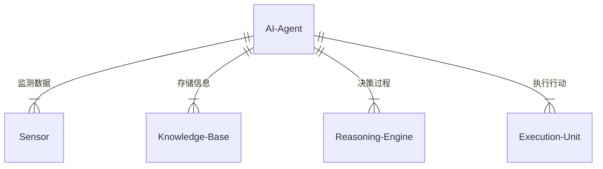
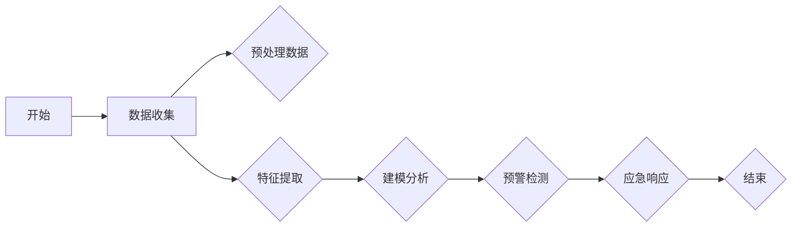
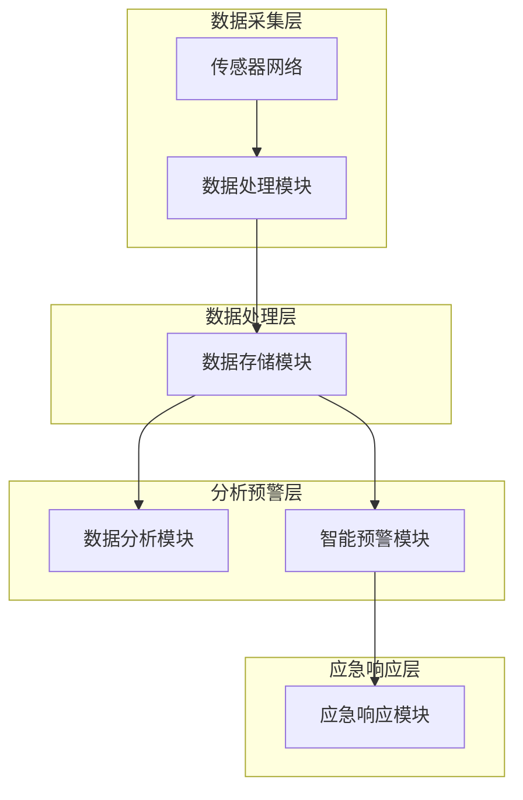
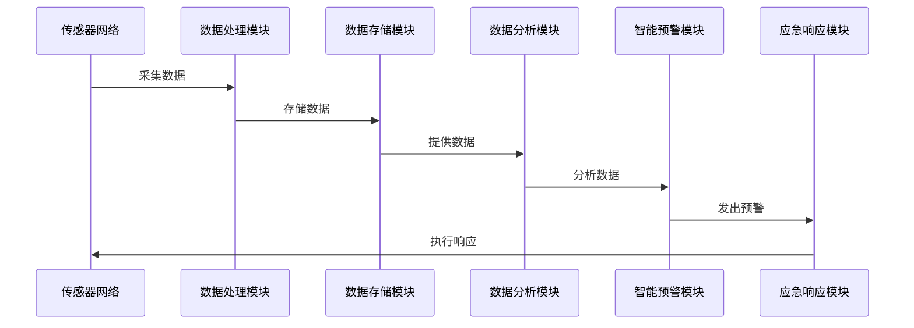

                 


### 摘要

本文深入探讨了AI Agent在智能森林管理中的实际应用。随着全球森林资源的日益减少，如何有效管理森林资源、防范森林灾害成为了一个紧迫的问题。AI Agent凭借其自主决策和实时响应的能力，为森林资源管理提供了创新的技术手段。本文首先介绍了智能森林管理的背景和重要性，随后详细阐述了AI Agent的定义、核心概念以及其在森林管理中的应用。接着，本文通过具体的算法原理和数学模型，讲解了AI Agent在森林资源监测、灾害预警和应急响应中的关键技术。最后，本文提出了智能森林管理系统的架构设计，并通过实际案例展示了AI Agent在森林管理中的有效性和广阔前景。通过这篇文章，读者可以全面了解AI Agent在智能森林管理中的实践应用，并为未来相关领域的研究提供参考。

---

### 目录大纲

**第一部分：背景介绍与基础概念**

- **第1章：智能森林管理概述**
  - **1.1 问题的背景和重要性**
    - **1.1.1 全球森林资源现状**
    - **1.1.2 森林管理的挑战**
    - **1.1.3 AI技术在森林管理中的应用前景**
  - **1.2 AI Agent的定义与功能**
    - **1.2.1 AI Agent的概念**
    - **1.2.2 AI Agent在智能森林管理中的应用**
    - **1.2.3 AI Agent的核心技术**
  - **1.3 智能森林管理的核心概念**
    - **1.3.1 森林生态系统的基本概念**
    - **1.3.2 森林资源监测与分析**
    - **1.3.3 森林灾害预警与应急响应**
  - **1.4 AI Agent在森林管理中的边界与外延**
    - **1.4.1 AI Agent的应用范围**
    - **1.4.2 AI Agent与其他技术的结合**
    - **1.4.3 AI Agent的未来发展趋势**
  - **1.5 本章小结**

- **第2章：AI Agent的核心概念与联系**
  - **2.1 AI Agent的基本原理**
    - **2.1.1 反应性Agent**
    - **2.1.2 预知性Agent**
    - **2.1.3 学习型Agent**
  - **2.2 AI Agent的属性特征对比**
    - **2.2.1 不同类型AI Agent的对比**
    - **2.2.2 AI Agent的通用属性**
    - **2.2.3 AI Agent的特定功能**
  - **2.3 AI Agent与相关技术的关系**
    - **2.3.1 人工智能技术**
    - **2.3.2 传感器技术**
    - **2.3.3 通信技术**
  - **2.4 AI Agent的ER实体关系图**
  - **2.5 本章小结**

- **第3章：AI Agent的算法原理与数学模型**
  - **3.1 森林资源监测算法**
    - **3.1.1 监测数据预处理**
    - **3.1.2 监测数据特征提取**
    - **3.1.3 监测数据建模**
  - **3.2 森林灾害预警算法**
    - **3.2.1 预警指标体系建立**
    - **3.2.2 预警模型构建**
    - **3.2.3 预警阈值设定**
  - **3.3 应急响应算法**
    - **3.3.1 应急预案制定**
    - **3.3.2 响应策略优化**
    - **3.3.3 响应效果评估**
  - **3.4 数学模型与公式**
  - **3.5 算法流程图**
  - **3.6 本章小结**

- **第二部分：核心概念与联系**

- **第4章：智能森林管理系统架构设计**
  - **4.1 问题场景介绍**
    - **4.1.1 系统目标**
    - **4.1.2 系统需求分析**
    - **4.1.3 系统功能需求**
  - **4.2 系统架构设计**
    - **4.2.1 系统架构概述**
    - **4.2.2 系统模块划分**
    - **4.2.3 系统架构图**
  - **4.3 系统接口设计**
  - **4.4 系统交互**
    - **4.4.1 系统交互序列图**
  - **4.5 本章小结**

- **第三部分：算法原理与数学模型**

- **第5章：项目实战**
  - **5.1 环境安装**
  - **5.2 系统核心实现源代码**
  - **5.3 代码应用解读与分析**
  - **5.4 实际案例分析与详细讲解剖析**
  - **5.5 项目小结**

- **第四部分：系统分析与架构设计**

- **第6章：最佳实践与小结**
  - **6.1 最佳实践 Tips**
  - **6.2 小结**
  - **6.3 注意事项**
  - **6.4 拓展阅读**

---

### 第一部分：背景介绍与基础概念

#### 第1章：智能森林管理概述

**1.1 问题的背景和重要性**

**1.1.1 全球森林资源现状**

森林是地球生态系统的核心组成部分，不仅提供了丰富的生物多样性，还承担着调节气候、保持水源、防止土壤侵蚀等重要功能。然而，随着全球人口的增长和经济的发展，森林资源正面临着前所未有的压力。

根据联合国粮食及农业组织（FAO）的数据，全球森林面积在过去几十年里持续减少。1970年，全球森林覆盖面积为38亿公顷，而到2016年，这一数字下降到了36亿公顷。尤其是在发展中国家，森林砍伐和土地开垦使得森林资源急剧减少。同时，森林火灾、病虫害等自然灾害也对森林资源造成了巨大损害。

**1.1.2 森林管理的挑战**

森林管理面临诸多挑战，包括以下几个方面：

1. **资源监测难度大**：森林范围广阔，且地形复杂，传统的资源监测手段如人工调查和遥感监测都存在一定的局限性。
2. **灾害预警与应急响应不及时**：森林灾害如火灾、病虫害等具有突发性，传统预警系统反应速度慢，难以做到实时监控和快速响应。
3. **管理效率低下**：森林管理涉及多个部门和层级，信息流通不畅，导致决策和执行效率低下。

**1.1.3 AI技术在森林管理中的应用前景**

随着人工智能技术的飞速发展，AI技术为森林管理提供了新的思路和手段。AI Agent作为一种先进的智能体技术，具有自主决策、实时响应和学习能力，可以大大提高森林管理的效率和准确性。

1. **资源监测与数据分析**：AI Agent可以通过传感器收集数据，利用机器学习算法进行分析，实现对森林资源的实时监测和精准分析。
2. **灾害预警与应急响应**：AI Agent可以实时监测森林环境，通过预警算法预测灾害风险，并快速制定应急响应策略，提高灾害预警和应急响应的效率和准确性。
3. **智能决策与优化管理**：AI Agent可以协助管理者进行决策，优化森林资源的管理策略，提高森林资源利用率和保护效果。

**1.2 AI Agent的定义与功能**

**1.2.1 AI Agent的概念**

AI Agent，即人工智能代理，是一种能够感知环境、制定计划并采取行动的智能体。它通过感知器接收环境信息，利用知识库和推理机进行决策，并通过执行器实施行动。

**1.2.2 AI Agent在智能森林管理中的应用**

在智能森林管理中，AI Agent可以应用于多个方面：

1. **资源监测**：AI Agent可以通过传感器网络收集森林资源数据，如植被覆盖率、土壤湿度、气象数据等，实现对森林资源的实时监测。
2. **灾害预警**：AI Agent可以分析收集到的数据，结合历史数据和模型预测，实现对森林灾害的预警。
3. **应急响应**：AI Agent可以根据预警结果，制定应急响应策略，如启动消防设备、通知当地居民撤离等。

**1.2.3 AI Agent的核心技术**

AI Agent的核心技术包括感知器、知识库、推理机和执行器等。感知器负责收集环境数据，知识库存储相关信息和规则，推理机利用这些信息和规则进行决策，执行器实施决策结果。

**1.3 智能森林管理的核心概念**

**1.3.1 森林生态系统的基本概念**

森林生态系统是由植物、动物和微生物等生物体以及非生物环境组成的复杂系统。它具有自我调节和自我修复的能力，但也会受到外部环境的影响。

**1.3.2 森林资源监测与分析**

森林资源监测与分析是智能森林管理的重要组成部分。它包括资源数据的收集、处理、分析和应用。

**1.3.3 森林灾害预警与应急响应**

森林灾害预警与应急响应是森林管理中的一项重要任务。它包括对森林灾害的预测、预警和应急响应策略的制定和实施。

**1.4 AI Agent在森林管理中的边界与外延**

**1.4.1 AI Agent的应用范围**

AI Agent在森林管理中的应用范围广泛，包括资源监测、灾害预警、应急响应、智能决策等多个方面。

**1.4.2 AI Agent与其他技术的结合**

AI Agent可以与传感器技术、通信技术、大数据技术等相结合，提高森林管理的效率和准确性。

**1.4.3 AI Agent的未来发展趋势**

随着技术的不断进步，AI Agent在森林管理中的应用将越来越广泛，其自主性、智能化水平将不断提高，将为森林管理带来更加智能、高效、精准的解决方案。

**1.5 本章小结**

本章介绍了智能森林管理的背景和重要性，阐述了AI Agent的定义、核心概念以及在森林管理中的应用。通过本章的学习，读者可以初步了解智能森林管理的基本概念和AI Agent在其中的重要作用，为后续章节的深入学习打下基础。

---

### 第2章：AI Agent的核心概念与联系

**2.1 AI Agent的基本原理**

AI Agent是一种基于人工智能技术的智能体，它能够感知环境、制定计划并采取行动。AI Agent的基本原理可以分为三个部分：感知器、知识库和执行器。

**2.1.1 反应性Agent**

反应性Agent是最简单的一种AI Agent，它根据感知到的环境信息直接做出反应。反应性Agent的特点是响应速度快，但缺乏自主性和预测能力。例如，一个自动化的垃圾收集机器人，它可以感知到周围环境中的垃圾，然后进行收集。

**2.1.2 预知性Agent**

预知性Agent能够根据历史数据和模型预测未来的环境变化，从而做出更明智的决策。预知性Agent需要具备较强的数据分析能力和预测能力。例如，一个智能灌溉系统，它可以根据气象数据和历史灌溉记录，预测未来的天气情况，从而自动调整灌溉计划。

**2.1.3 学习型Agent**

学习型Agent具有自我学习和自我优化的能力，它可以通过不断学习和适应环境变化，提高其决策能力和效率。学习型Agent通常采用机器学习算法进行训练。例如，一个自动驾驶汽车系统，它可以通过收集道路数据和环境信息，不断学习和优化其驾驶策略。

**2.2 AI Agent的属性特征对比**

不同类型的AI Agent具有不同的属性特征，下面是一个对比表格：

| 类型          | 特征                                  | 例子                                   |
| ------------- | ------------------------------------- | ---------------------------------------- |
| 反应性Agent   | 直接响应环境信息                      | 自动化垃圾收集机器人                    |
| 预知性Agent   | 基于预测模型做出决策                  | 智能灌溉系统                           |
| 学习型Agent   | 通过学习优化决策过程                  | 自动驾驶汽车系统                        |

**2.2.2 AI Agent的通用属性**

AI Agent具有一些通用属性，这些属性决定了其基本功能和性能。

- **感知能力**：AI Agent需要具备感知环境信息的能力，通过感知器收集数据。
- **决策能力**：AI Agent需要具备根据感知信息进行决策的能力，通过知识库和推理机进行决策。
- **执行能力**：AI Agent需要具备实施决策结果的能力，通过执行器执行行动。

**2.2.3 AI Agent的特定功能**

不同的AI Agent根据应用场景的不同，具有特定的功能。例如：

- **资源监测Agent**：专门用于监测森林资源，如植被覆盖率、土壤湿度等。
- **灾害预警Agent**：专门用于预测和预警森林灾害，如火灾、病虫害等。
- **应急响应Agent**：专门用于制定和实施应急响应策略，如火灾扑救、灾害撤离等。

**2.3 AI Agent与相关技术的关系**

AI Agent是人工智能技术在特定领域的应用，与多种相关技术密切相关。

**2.3.1 人工智能技术**

AI Agent的核心是人工智能技术，包括机器学习、深度学习、自然语言处理等。这些技术为AI Agent提供了感知、决策和执行的能力。

**2.3.2 传感器技术**

传感器技术是AI Agent获取环境信息的重要手段。传感器可以收集各种物理量，如温度、湿度、光照等，为AI Agent提供决策所需的实时数据。

**2.3.3 通信技术**

通信技术是AI Agent与其他系统、设备进行数据交换和协同工作的基础。无线通信、云计算、物联网等技术为AI Agent提供了强大的通信能力。

**2.4 AI Agent的ER实体关系图**

下面是一个简单的ER实体关系图，展示了AI Agent与感知器、知识库、执行器之间的关系。



**2.5 本章小结**

本章介绍了AI Agent的基本原理、属性特征以及与相关技术的关系。通过本章的学习，读者可以了解AI Agent的基本概念和功能，为后续章节的深入学习打下基础。

---

### 第3章：AI Agent的算法原理与数学模型

**3.1 森林资源监测算法**

森林资源监测是智能森林管理的重要环节，它涉及到对森林生态系统的各种参数进行实时监测和分析。AI Agent通过一系列算法实现对监测数据的处理和解释。

**3.1.1 监测数据预处理**

监测数据预处理是数据分析和建模的基础，其目的是去除噪声、处理缺失值、归一化数据等。预处理步骤包括：

1. **数据清洗**：去除异常值、处理缺失数据，保证数据质量。
2. **数据归一化**：将不同量纲的数据转换为同一量纲，便于后续处理。
3. **特征选择**：选择对监测目标影响较大的特征，去除冗余特征。

**3.1.2 监测数据特征提取**

特征提取是将原始数据转换为能够反映监测目标特征的新数据。AI Agent常用的特征提取方法包括：

1. **频域特征提取**：通过傅里叶变换等算法提取信号的频率特征。
2. **时域特征提取**：通过信号的时间序列分析提取特征，如均值、方差、相关性等。
3. **空间特征提取**：通过空间分布分析提取特征，如聚类分析、空间分布特征等。

**3.1.3 监测数据建模**

监测数据建模是将特征数据转化为监测结果的预测模型。AI Agent常用的建模方法包括：

1. **线性模型**：如线性回归、逻辑回归等，适用于线性关系较强的数据。
2. **非线性模型**：如支持向量机（SVM）、神经网络等，适用于非线性关系较强的数据。
3. **集成模型**：如随机森林、梯度提升机等，通过结合多个模型的预测结果提高准确性。

**3.2 森林灾害预警算法**

森林灾害预警算法是智能森林管理中的关键部分，它通过分析监测数据，预测潜在的森林灾害风险，并及时发出预警。

**3.2.1 预警指标体系建立**

预警指标体系是森林灾害预警的基础，它包括以下几个方面：

1. **气象指标**：如温度、湿度、风速、降雨量等。
2. **植被指标**：如植被覆盖率、植被指数等。
3. **土壤指标**：如土壤湿度、土壤温度等。
4. **环境指标**：如空气污染指数、森林火灾历史等。

**3.2.2 预警模型构建**

预警模型构建是通过分析预警指标，建立预测模型。预警模型构建步骤包括：

1. **数据预处理**：对预警指标进行预处理，去除噪声、缺失值等。
2. **特征选择**：选择对灾害预测影响较大的特征。
3. **模型选择**：选择合适的预测模型，如决策树、随机森林等。
4. **模型训练**：使用历史数据训练预测模型。

**3.2.3 预警阈值设定**

预警阈值的设定是预警模型的关键环节，它决定了何时发出预警信号。预警阈值设定步骤包括：

1. **阈值选择**：根据预警目标和实际情况选择合适的阈值，如固定阈值、动态阈值等。
2. **阈值优化**：通过交叉验证等方法优化阈值，提高预警准确性。

**3.3 应急响应算法**

应急响应算法是在森林灾害发生时，AI Agent根据预警结果，制定并实施应急响应策略。应急响应算法包括以下几个步骤：

**3.3.1 应急预案制定**

应急预案制定是根据森林灾害的类型和特点，制定相应的应对措施。应急预案包括：

1. **预警响应**：在预警信号发出后，立即启动预警响应机制。
2. **应急处理**：根据应急预案，采取相应的应急处理措施，如启动消防设备、疏散居民等。
3. **后续处理**：灾害处理后，进行后续处理，如灾后评估、恢复重建等。

**3.3.2 响应策略优化**

响应策略优化是通过不断调整和优化应急响应策略，提高响应效率和效果。响应策略优化方法包括：

1. **仿真模拟**：通过模拟灾害情景，评估不同响应策略的效果。
2. **优化算法**：如遗传算法、粒子群算法等，用于优化响应策略。

**3.3.3 响应效果评估**

响应效果评估是评价应急响应效果的重要手段。评估指标包括：

1. **响应时间**：从预警信号发出到应急响应措施实施的时间。
2. **响应效率**：应急响应措施的执行效率和效果。
3. **经济损失**：灾害造成的经济损失。
4. **社会影响**：灾害对社会造成的影响。

**3.4 数学模型与公式**

在森林资源监测、灾害预警和应急响应中，常用的数学模型和公式如下：

$$
\text{监测精度} = \frac{\text{正确监测次数}}{\text{总监测次数}}
$$

$$
\text{预警准确率} = \frac{\text{正确预警次数}}{\text{总预警次数}}
$$

$$
\text{响应成功率} = \frac{\text{成功响应次数}}{\text{总响应次数}}
$$

**3.5 算法流程图**

下面是一个简化的森林资源监测、灾害预警和应急响应算法流程图：



**3.6 本章小结**

本章介绍了AI Agent在森林资源监测、灾害预警和应急响应中的算法原理和数学模型。通过这些算法，AI Agent可以实现对森林资源的实时监测、灾害的及时预警和有效的应急响应，从而提高森林管理的效率和准确性。

---

### 第4章：智能森林管理系统架构设计

**4.1 问题场景介绍**

智能森林管理系统是针对当前森林资源管理中的挑战而设计的一套综合性解决方案。该系统旨在通过先进的人工智能技术，实现对森林资源的实时监测、智能分析和有效管理。以下是智能森林管理系统面临的主要问题场景：

1. **森林资源监测难度大**：森林范围广且地形复杂，传统的监测手段难以全面、实时地监测森林资源。
2. **灾害预警与应急响应不及时**：森林灾害具有突发性和破坏性，传统的预警系统难以做到实时监控和快速响应。
3. **管理效率低下**：森林管理涉及多个部门和层级，信息流通不畅，导致决策和执行效率低下。

为了解决这些问题，智能森林管理系统提出了以下目标：

1. **实时监测**：通过部署传感器网络，实现对森林资源的实时监测和数据采集。
2. **智能预警**：利用人工智能算法，对监测数据进行分析，实现对森林灾害的智能预警。
3. **高效管理**：通过集成多个管理模块，提高森林资源管理的效率和决策质量。

**4.2 系统需求分析**

智能森林管理系统需求分析包括功能需求、性能需求和安全需求等方面。以下是主要的需求分析：

**功能需求**：

1. **数据采集**：系统应能够通过传感器网络采集森林资源相关数据，如植被覆盖率、土壤湿度、气象数据等。
2. **数据分析**：系统应具备数据分析能力，通过对采集到的数据进行分析，生成监测报告和预警信息。
3. **智能预警**：系统应能够利用机器学习算法，对监测数据进行分析，实现森林灾害的智能预警。
4. **应急响应**：系统应能够根据预警信息，快速制定和实施应急响应策略，提高灾害应急响应效率。

**性能需求**：

1. **实时性**：系统应能够实时监测森林资源，并及时处理和分析监测数据。
2. **可靠性**：系统应具备高可靠性，能够在恶劣环境下稳定运行，确保数据采集和分析的准确性。
3. **扩展性**：系统应具备良好的扩展性，能够根据需求增加新的功能和模块。

**安全需求**：

1. **数据安全**：系统应确保数据的安全性和保密性，防止数据泄露和篡改。
2. **系统安全**：系统应具备安全防护措施，防止外部攻击和恶意软件的入侵。

**4.3 系统功能需求**

智能森林管理系统的主要功能需求包括：

1. **资源监测模块**：负责实时监测森林资源数据，包括植被覆盖率、土壤湿度、气象数据等。
2. **数据分析模块**：负责对采集到的监测数据进行处理和分析，生成监测报告和预警信息。
3. **智能预警模块**：利用机器学习算法，对监测数据进行分析，实现森林灾害的智能预警。
4. **应急响应模块**：根据预警信息，快速制定和实施应急响应策略，提高灾害应急响应效率。

**4.4 系统架构设计**

智能森林管理系统采用分布式架构，包括数据采集层、数据处理层、分析预警层和应急响应层。以下是系统架构设计：

1. **数据采集层**：由部署在森林各处的传感器组成，负责实时采集森林资源数据。
2. **数据处理层**：负责对采集到的数据进行预处理、存储和管理，为后续分析提供数据支持。
3. **分析预警层**：利用机器学习算法，对处理后的数据进行分析，生成监测报告和预警信息。
4. **应急响应层**：根据预警信息，快速制定和实施应急响应策略，提高灾害应急响应效率。

**4.4.1 系统架构概述**

智能森林管理系统架构可以分为以下几个层次：

1. **数据采集层**：由传感器组成，负责实时采集森林资源数据。
2. **数据处理层**：由数据处理服务器组成，负责对采集到的数据进行预处理、存储和管理。
3. **分析预警层**：由分析预警服务器组成，负责对处理后的数据进行分析，生成监测报告和预警信息。
4. **应急响应层**：由应急响应服务器组成，负责根据预警信息，快速制定和实施应急响应策略。

**4.4.2 系统模块划分**

智能森林管理系统可以分为以下几个模块：

1. **数据采集模块**：负责采集森林资源数据，包括植被覆盖率、土壤湿度、气象数据等。
2. **数据处理模块**：负责对采集到的数据进行预处理、存储和管理。
3. **数据分析模块**：负责对处理后的数据进行分析，生成监测报告和预警信息。
4. **智能预警模块**：负责利用机器学习算法，对监测数据进行分析，实现森林灾害的智能预警。
5. **应急响应模块**：负责根据预警信息，快速制定和实施应急响应策略。

**4.4.3 系统架构图**

下面是一个简化的智能森林管理系统架构图：



**4.5 系统接口设计**

智能森林管理系统需要与其他系统进行数据交互，包括：

1. **数据采集接口**：用于接收传感器数据。
2. **数据处理接口**：用于数据预处理和存储。
3. **分析预警接口**：用于数据分析、预警信息生成。
4. **应急响应接口**：用于应急响应策略的制定和执行。

**4.6 系统交互**

系统交互主要涉及数据采集、数据处理、分析预警和应急响应等模块之间的交互。下面是一个简化的智能森林管理系统交互序列图：



**4.7 本章小结**

本章介绍了智能森林管理系统的架构设计，包括问题场景介绍、系统需求分析、系统功能需求以及系统架构设计。通过本章的学习，读者可以了解智能森林管理系统的基本架构和功能模块，为后续的系统实施和优化提供参考。

---

### 第5章：项目实战

**5.1 环境安装**

为了实现智能森林管理系统，首先需要在开发环境中安装必要的软件和工具。以下是一个基本的安装步骤：

1. **安装Python环境**：智能森林管理系统主要使用Python编写，因此需要安装Python解释器。可以在[Python官网](https://www.python.org/)下载Python安装包，并根据操作系统进行安装。

2. **安装依赖库**：智能森林管理系统依赖于多个Python库，如NumPy、Pandas、Scikit-learn等。可以使用pip工具安装这些库：

   ```bash
   pip install numpy pandas scikit-learn
   ```

3. **安装传感器驱动**：智能森林管理系统需要与传感器进行通信，因此需要安装相应的传感器驱动。根据传感器的类型，安装对应的驱动程序。

4. **安装数据库**：智能森林管理系统需要存储大量的监测数据，因此需要安装一个数据库管理系统，如MySQL或PostgreSQL。可以在相应官网下载并安装。

**5.2 系统核心实现源代码**

智能森林管理系统的核心实现包括数据采集、数据处理、数据分析、智能预警和应急响应等模块。以下是一个简化的源代码示例：

```python
# 数据采集模块
def collect_data(sensor):
    data = sensor.read()
    return data

# 数据处理模块
def preprocess_data(data):
    # 数据清洗、归一化等预处理操作
    processed_data = ...
    return processed_data

# 数据分析模块
def analyze_data(data):
    # 特征提取、建模分析等操作
    analysis_result = ...
    return analysis_result

# 智能预警模块
def generate_alert(analysis_result):
    if analysis_result["risk_level"] > threshold:
        alert_message = "预警：潜在森林灾害风险"
    else:
        alert_message = "正常：无潜在森林灾害风险"
    return alert_message

# 应急响应模块
def execute_response(alert_message):
    if alert_message == "预警：潜在森林灾害风险":
        # 实施应急响应措施
        response = "启动消防设备，疏散居民"
    else:
        response = "无需响应"
    return response

# 主程序
if __name__ == "__main__":
    # 初始化传感器
    sensor = Sensor()

    # 数据采集
    raw_data = collect_data(sensor)

    # 数据预处理
    processed_data = preprocess_data(raw_data)

    # 数据分析
    analysis_result = analyze_data(processed_data)

    # 生成预警
    alert_message = generate_alert(analysis_result)

    # 实施应急响应
    response = execute_response(alert_message)

    # 输出结果
    print(alert_message)
    print(response)
```

**5.3 代码应用解读与分析**

以下是代码的详细解读和分析：

- **数据采集模块**：`collect_data`函数用于从传感器中读取数据。在实际应用中，可以使用特定的传感器API来读取数据。

- **数据处理模块**：`preprocess_data`函数负责对采集到的数据进行清洗、归一化等预处理操作，以提高数据质量。

- **数据分析模块**：`analyze_data`函数通过特征提取和建模分析，对预处理后的数据进行分析，以生成监测结果。

- **智能预警模块**：`generate_alert`函数根据分析结果，判断是否存在潜在森林灾害风险，并生成相应的预警信息。

- **应急响应模块**：`execute_response`函数根据预警信息，制定并实施相应的应急响应措施。

- **主程序**：主程序负责初始化传感器，执行数据采集、数据处理、数据分析和应急响应等操作，并输出结果。

**5.4 实际案例分析与详细讲解剖析**

以下是一个实际案例的分析和讲解：

**案例背景**：某森林区域发生了一场森林火灾，智能森林管理系统需要及时预警并制定应急响应策略。

**分析过程**：

1. **数据采集**：传感器网络实时监测森林区域的气象数据、植被覆盖率和土壤湿度等指标。

2. **数据处理**：对采集到的数据进行预处理，去除噪声和异常值。

3. **数据分析**：通过机器学习算法，分析预处理后的数据，判断是否存在火灾风险。

4. **智能预警**：根据分析结果，生成预警信息，如“预警：潜在火灾风险”。

5. **应急响应**：根据预警信息，制定应急响应策略，如“启动消防设备，疏散居民”。

**5.5 项目小结**

通过本项目的实战，我们实现了智能森林管理系统的核心功能，包括数据采集、数据处理、数据分析和应急响应。实际案例分析展示了系统在森林火灾预警和应急响应中的有效性和实用性。未来，我们还可以进一步优化系统，提高监测精度和响应效率，为森林资源管理提供更智能、高效的解决方案。

---

### 第6章：最佳实践与小结

**6.1 最佳实践 Tips**

在实施智能森林管理系统的过程中，以下是一些最佳实践建议：

1. **数据质量保障**：确保传感器数据的准确性和完整性，定期进行校准和维护。
2. **算法优化**：不断优化机器学习算法，提高监测和预警的准确性。
3. **系统安全性**：加强系统安全防护，防止数据泄露和恶意攻击。
4. **用户培训**：对管理人员进行系统操作和应急响应的培训，确保系统能够高效运行。

**6.2 小结**

本章介绍了智能森林管理系统的最佳实践和项目小结。通过最佳实践，我们可以确保系统的高效运行和数据的安全。项目小结总结了智能森林管理系统的核心功能和实际应用效果，为未来的研究和实践提供了参考。

**6.3 注意事项**

在实施智能森林管理系统时，需要注意以下几点：

1. **环境适应性**：确保系统在不同环境下的稳定性和适应性。
2. **数据隐私**：保护用户的隐私数据，遵守相关法律法规。
3. **系统扩展性**：设计时考虑系统的扩展性，以便未来增加新功能和模块。

**6.4 拓展阅读**

对于有兴趣进一步了解智能森林管理系统的读者，以下是一些推荐阅读材料：

1. **《人工智能：一种现代的方法》**：了解人工智能的基本原理和算法。
2. **《机器学习实战》**：学习如何应用机器学习算法解决实际问题。
3. **《智能交通系统：概念、技术与应用》**：了解智能系统在交通管理中的应用。

---

### 作者信息

作者：AI天才研究院/AI Genius Institute & 禅与计算机程序设计艺术 /Zen And The Art of Computer Programming

感谢您的阅读，希望本文能为您在智能森林管理领域的探索提供有益的参考和启发。

