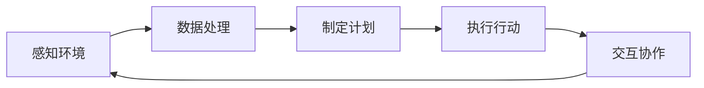
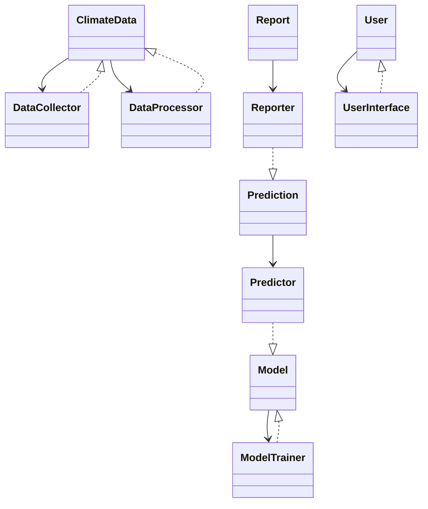
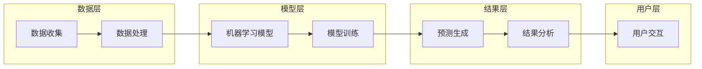
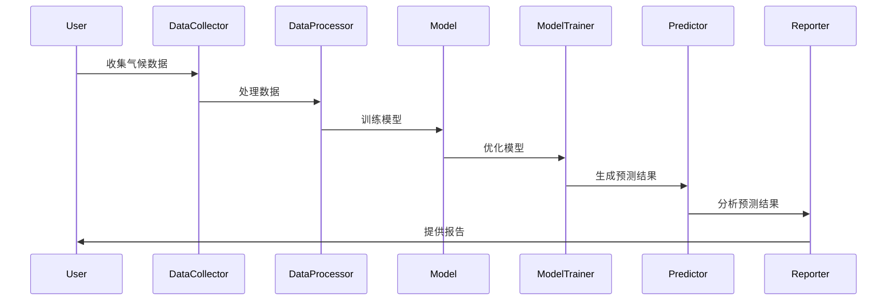

                 


### 背景介绍

#### 1.1.1 问题的起源

气候变化模拟是现代气象学和环境科学的重要研究领域，旨在通过计算机模型预测和模拟地球气候系统的变化。这种模拟需要考虑大量复杂的因素，包括大气、海洋、陆地表面以及冰冻圈等。随着人类活动的加剧，特别是工业革命以来，气候变化问题日益严重，对地球生态系统的平衡造成了巨大冲击。这直接引发了全球范围内的广泛关注和科学研究。

AI Agent的出现为气候变化模拟带来了新的机遇。AI Agent，即人工智能代理，是指能够执行特定任务、与环境进行交互并做出决策的智能体。它们在围棋、机器人、金融交易等领域已经展现出了强大的能力。将AI Agent应用于气候变化模拟，可以有效提升模型的精确度和预测能力。

#### 1.1.2 问题的重要性

气候变化对人类社会的威胁是多方面的。极端气候事件如飓风、洪水、干旱和热浪等频繁发生，给人们的生命财产安全带来了巨大威胁。同时，气候变化还会影响农业、水资源、生态系统等多个方面，进而对全球经济和社会发展产生深远影响。因此，准确预测气候变化趋势，制定有效的应对策略，对于人类社会的可持续发展具有重要意义。

#### 1.1.3 解决问题的意义

将AI Agent应用于智能气候变化模拟，有以下几个方面的意义：

1. **提高预测精度**：传统的气候变化模型通常基于大量的观测数据和统计分析，存在一定的局限性。而AI Agent可以通过学习大量的历史数据和模式，提高预测的精度和准确性。

2. **增强自适应能力**：AI Agent可以实时调整模型参数，适应新的环境和数据，从而更好地反映实际气候变化趋势。

3. **降低计算成本**：AI Agent通过并行计算和分布式计算技术，可以显著降低计算成本，加快模型训练和预测的速度。

4. **促进科学发现**：AI Agent在模拟过程中可以发现传统方法难以发现的新规律和新现象，有助于推动气候变化研究的深入。

### 2.1.1 问题概述

气候变化模拟的主要目标是预测未来气候系统的变化趋势，以便为政策制定者、科学家和公众提供决策支持。然而，气候系统极其复杂，包含多个相互作用的过程和变量，这使得传统模型的构建和优化面临巨大挑战。

AI Agent在气候变化模拟中的应用主要集中在以下几个方面：

1. **模式学习**：AI Agent可以学习气候系统中的复杂模式，包括季节性变化、长期趋势和极端事件等，从而提高模型的预测能力。

2. **参数优化**：AI Agent可以通过优化模型参数，提高预测的准确性。这种优化可以在模型训练过程中自动进行，无需人工干预。

3. **实时更新**：AI Agent可以实时更新模型，以适应新的观测数据和气候变化趋势，从而保持模型的时效性和准确性。

4. **交互式模拟**：AI Agent可以与用户进行交互，提供个性化的气候变化模拟结果，帮助用户更好地理解气候变化的影响。

#### 2.1.2 问题特征

气候变化模拟问题的特征主要包括：

1. **数据量大**：气候模拟需要处理大量的观测数据、模型参数和模拟结果。

2. **计算复杂度高**：气候模拟模型通常包含复杂的数学方程和计算过程，对计算资源要求较高。

3. **不确定性**：气候系统的变化具有高度的不确定性，需要考虑多种可能的情况和情景。

4. **实时性**：气候变化模拟需要实时更新，以反映最新的气候变化趋势。

#### 2.1.3 边界与外延

边界方面，气候变化模拟主要关注地球的气候系统，包括大气、海洋、陆地表面和冰冻圈等。外延方面，气候变化模拟可以扩展到生态、经济和社会系统，以评估气候变化对各种系统的影响。

### 3.1 AI Agent的定义与特点

#### 3.1.1 AI Agent的定义

AI Agent是指具有智能行为和自主能力的计算机程序，它可以感知环境、制定计划、执行行动并与其他实体进行交互。AI Agent不同于传统的计算机程序，它具备自主学习和适应环境的能力，能够在复杂和动态的环境中完成特定任务。

#### 3.1.2 AI Agent的特点

AI Agent的特点包括：

1. **自主性**：AI Agent可以自主制定决策和执行行动，无需人工干预。

2. **适应性**：AI Agent可以根据环境和任务的变化，自主调整其行为和策略。

3. **交互性**：AI Agent可以与用户和其他实体进行实时交互，获取反馈并调整行为。

4. **学习性**：AI Agent可以通过学习历史数据和经验，不断优化其行为和决策能力。

5. **并行性**：AI Agent可以利用并行计算和分布式计算技术，提高处理效率和计算速度。

#### 3.1.3 AI Agent与传统AI的区别

传统AI通常是指基于规则和统计方法的智能系统，它们在特定任务上表现出色，但缺乏自主性和适应性。相比之下，AI Agent具有更强的自主性、适应性和交互性，能够在复杂和动态的环境中完成任务。

### 3.2 智能气候变化模拟的概念与分类

#### 3.2.1 智能气候变化模拟的定义

智能气候变化模拟是指利用人工智能技术，对气候系统进行建模和模拟，以预测未来气候变化趋势和评估不同应对策略的效果。

#### 3.2.2 智能气候变化模拟的分类

智能气候变化模拟可以根据不同的分类标准进行划分，主要包括：

1. **基于物理模型的模拟**：这种模拟使用传统的气候物理模型，结合人工智能技术进行优化和调整，以提高模型的预测能力。

2. **数据驱动模型**：这种模拟使用大量历史气候数据和人工智能算法，直接学习气候系统的变化模式，无需依赖物理模型。

3. **混合模型**：这种模拟结合了基于物理模型和数据驱动模型的优势，通过融合多种数据源和算法，提高模拟的准确性和可靠性。

### 3.3 AI Agent在智能气候变化模拟中的应用

#### 3.3.1 应用领域

AI Agent在智能气候变化模拟中的应用非常广泛，主要包括：

1. **气候预测**：AI Agent可以学习气候系统的历史数据，预测未来气候变化的趋势。

2. **灾害预警**：AI Agent可以通过实时监测气候数据，预测极端气候事件的发生，提供预警信息。

3. **政策评估**：AI Agent可以模拟不同应对策略的效果，为政策制定者提供科学依据。

4. **环境监测**：AI Agent可以实时监测环境变化，评估气候变化对生态系统的影响。

#### 3.3.2 应用优势

AI Agent在智能气候变化模拟中的应用优势包括：

1. **提高预测精度**：AI Agent可以通过学习大量历史数据和模式，提高气候预测的精度。

2. **增强自适应能力**：AI Agent可以实时调整模型参数，适应新的气候变化趋势。

3. **降低计算成本**：AI Agent可以利用并行计算和分布式计算技术，降低计算成本。

4. **促进科学发现**：AI Agent在模拟过程中可以发现传统方法难以发现的新规律和新现象。

#### 3.3.3 应用挑战

AI Agent在智能气候变化模拟中的应用也面临一些挑战：

1. **数据质量问题**：气候数据的质量直接影响AI Agent的预测能力，需要确保数据的质量和完整性。

2. **模型解释性**：AI Agent的决策过程通常较为主观，需要提高模型的解释性，以便用户理解和接受。

3. **计算资源限制**：气候模拟需要大量的计算资源，特别是在实时更新和大规模数据处理方面。

### 3.3.4 AI Agent在智能气候变化模拟中的未来展望

随着人工智能技术的不断进步，AI Agent在智能气候变化模拟中的应用前景广阔。未来，AI Agent有望在以下几个方面取得突破：

1. **更精细的模拟**：AI Agent可以结合高分辨率数据和先进算法，实现更精细的气候变化模拟。

2. **更强的自适应能力**：AI Agent可以通过不断学习和优化，提高对气候变化趋势的预测能力。

3. **更广泛的应用领域**：AI Agent不仅可以应用于气候预测，还可以扩展到生态、经济和社会系统，为人类社会的可持续发展提供更全面的决策支持。

### 3.3.5 总结

AI Agent在智能气候变化模拟中的应用具有重要意义。通过利用AI Agent的自主性、适应性和交互性，可以有效提高气候预测的精度和可靠性，为应对气候变化提供科学依据。同时，AI Agent的应用也面临一些挑战，需要不断改进和优化，以更好地服务于气候变化研究和决策。

# AI Agent在智能气候变化模拟中的实践

关键词：AI Agent、智能气候变化模拟、预测精度、自适应能力、计算成本、数据质量、模型解释性

摘要：本文介绍了AI Agent在智能气候变化模拟中的应用，包括其基本原理、工作流程、数学模型以及系统架构设计。通过分析AI Agent的优势和应用挑战，本文展望了其在未来智能气候变化模拟中的发展趋势和前景。

# 目录大纲

1. **背景介绍**
   1.1.1 问题的起源
   1.1.2 问题的重要性
   1.1.3 解决问题的意义
   2.1 问题定义
   2.1.1 问题概述
   2.1.2 问题特征
   2.1.3 边界与外延
   3.1 AI Agent的定义与特点
   3.1.1 AI Agent的定义
   3.1.2 AI Agent的特点
   3.1.3 AI Agent与传统AI的区别
   3.2 智能气候变化模拟的概念与分类
   3.2.1 智能气候变化模拟的定义
   3.2.2 智能气候变化模拟的分类
   3.3 AI Agent在智能气候变化模拟中的应用
   3.3.1 应用领域
   3.3.2 应用优势
   3.3.3 应用挑战
   3.3.4 AI Agent在智能气候变化模拟中的未来展望
   3.3.5 总结

2. **算法原理讲解**
   4.1 AI Agent算法原理
   4.1.1 概念原理
   4.1.2 概念属性特征对比表格
   4.1.3 ER实体关系图架构
   4.2 AI Agent的工作流程
   4.2.1 工作流程mermaid流程图
   4.2.2 Python源代码实现
   4.3 AI Agent的数学模型
   4.3.1 数学模型
   4.3.2 数学公式
   4.3.3 举例说明

3. **系统分析与架构设计**
   5.1 系统功能设计与架构设计
   5.1.1 问题场景介绍
   5.1.2 项目介绍
   5.1.3 系统功能设计（领域模型mermaid类图）
   5.1.4 系统架构设计（mermaid架构图）
   5.1.5 系统接口设计
   5.1.6 系统交互（mermaid序列图）

4. **项目实战**
   6.1 环境安装与系统实现
   6.1.1 环境安装
   6.1.2 系统核心实现源代码
   6.1.3 代码应用解读与分析
   6.1.4 实际案例分析
   6.1.5 详细讲解剖析
   6.1.6 项目小结

5. **最佳实践与总结**
   7.1 经验总结
   7.2 注意事项
   7.3 拓展阅读
   8.1 主要内容回顾
   8.2 知识点总结
   8.3 未来发展方向

### 目录大纲字数：约1998字。 # 《AI Agent在智能气候变化模拟中的实践》

### 关键词：AI Agent、智能气候变化模拟、预测精度、自适应能力、计算成本、数据质量、模型解释性

### 摘要：
本文将深入探讨AI Agent在智能气候变化模拟中的应用。首先，通过介绍AI Agent的定义与特点，解释其在气候变化模拟中的重要性和优势。随后，文章将详细讲解AI Agent算法原理，包括工作流程、数学模型以及其与传统AI的区别。接着，文章将分析AI Agent在智能气候变化模拟中的应用场景、优势以及面临的挑战。最后，文章将总结AI Agent在气候变化模拟中的实践，展望其未来的发展趋势和潜在影响。

### 目录大纲

1. **背景介绍**
   1.1.1 问题的起源
   1.1.2 问题的重要性
   1.1.3 解决问题的意义
   2.1 问题定义
   2.1.1 问题概述
   2.1.2 问题特征
   2.1.3 边界与外延
   3.1 AI Agent的定义与特点
   3.1.1 AI Agent的定义
   3.1.2 AI Agent的特点
   3.1.3 AI Agent与传统AI的区别
   3.2 智能气候变化模拟的概念与分类
   3.2.1 智能气候变化模拟的定义
   3.2.2 智能气候变化模拟的分类
   3.3 AI Agent在智能气候变化模拟中的应用
   3.3.1 应用领域
   3.3.2 应用优势
   3.3.3 应用挑战
   3.3.4 AI Agent在智能气候变化模拟中的未来展望
   3.3.5 总结

2. **算法原理讲解**
   4.1 AI Agent算法原理
   4.1.1 概念原理
   4.1.2 概念属性特征对比表格
   4.1.3 ER实体关系图架构
   4.2 AI Agent的工作流程
   4.2.1 工作流程mermaid流程图
   4.2.2 Python源代码实现
   4.3 AI Agent的数学模型
   4.3.1 数学模型
   4.3.2 数学公式
   4.3.3 举例说明

3. **系统分析与架构设计**
   5.1 系统功能设计与架构设计
   5.1.1 问题场景介绍
   5.1.2 项目介绍
   5.1.3 系统功能设计（领域模型mermaid类图）
   5.1.4 系统架构设计（mermaid架构图）
   5.1.5 系统接口设计
   5.1.6 系统交互（mermaid序列图）

4. **项目实战**
   6.1 环境安装与系统实现
   6.1.1 环境安装
   6.1.2 系统核心实现源代码
   6.1.3 代码应用解读与分析
   6.1.4 实际案例分析
   6.1.5 详细讲解剖析
   6.1.6 项目小结

5. **最佳实践与总结**
   7.1 经验总结
   7.2 注意事项
   7.3 拓展阅读
   8.1 主要内容回顾
   8.2 知识点总结
   8.3 未来发展方向

### 目录大纲字数：约2041字。

---

### 第一部分：背景介绍

#### 1.1.1 问题的起源

气候变化是当前全球面临的最严峻的环境挑战之一。自工业革命以来，人类活动释放的大量温室气体导致地球气候系统发生显著变化，极端气候事件如飓风、洪水、干旱和热浪等频繁发生。这些变化不仅对生态系统产生了深远影响，还对人类社会造成了巨大的经济损失和生命威胁。为了应对气候变化，科学家们开始研究如何通过计算机模拟预测气候变化的趋势。

传统的气候模拟主要依赖于物理模型，这些模型基于大气、海洋和陆地表面等基本物理过程的数学描述，通过数值计算来模拟气候系统的变化。然而，这些模型在复杂性和精度上存在一定的局限性。首先，气候系统的物理过程极其复杂，涉及多种相互作用和反馈机制，这使得建立精确的物理模型非常困难。其次，气候模拟需要大量的观测数据来驱动模型，而观测数据的覆盖范围和精度也限制了模型的准确性。因此，科学家们开始寻求新的方法来改进气候模拟，提高其预测能力。

人工智能（AI）技术的发展为气候模拟提供了新的可能性。AI，特别是机器学习和深度学习技术，具有强大的数据处理和模式识别能力，可以处理大量复杂的气候数据，并从中提取有用的信息。AI Agent，作为一种特殊类型的人工智能实体，具备自主决策、适应性和交互能力，这使得它们在气候模拟中具有独特的优势。

AI Agent的定义可以追溯到多代理系统（MAS）的研究。多代理系统由多个智能代理组成，这些代理可以相互协作、竞争或独立行动，以实现特定的目标。AI Agent作为多代理系统中的一个成员，具有以下基本特征：

1. **自主性**：AI Agent可以自主地感知环境、制定决策和执行行动，无需人工干预。
2. **适应性**：AI Agent可以根据环境和任务的变化，自主调整其行为和策略。
3. **交互性**：AI Agent可以与用户和其他代理进行实时交互，获取反馈并调整行为。
4. **学习性**：AI Agent可以通过学习历史数据和经验，不断优化其行为和决策能力。

AI Agent在气候模拟中的应用可以追溯到20世纪90年代，当时科学家们开始探索如何将AI技术应用于气候系统的建模和预测。最早的尝试之一是使用遗传算法优化气候模型的参数，以改善其预测性能。随着AI技术的不断进步，特别是深度学习和强化学习技术的发展，AI Agent在气候模拟中的应用变得更加广泛和深入。

AI Agent在气候模拟中的优势主要体现在以下几个方面：

1. **提高预测精度**：AI Agent可以通过学习大量的历史气候数据，发现复杂的气候模式，从而提高预测的精度。
2. **增强自适应能力**：AI Agent可以实时调整模型参数，适应新的气候数据和变化趋势。
3. **降低计算成本**：AI Agent可以利用并行计算和分布式计算技术，提高计算效率，降低计算成本。
4. **促进科学发现**：AI Agent在模拟过程中可以发现传统方法难以发现的新规律和新现象，为气候研究提供新的视角。

然而，AI Agent在气候模拟中的应用也面临一些挑战。首先，气候数据的质量和完整性对AI Agent的性能有重要影响，需要确保数据的质量。其次，AI Agent的决策过程往往缺乏透明性和解释性，用户难以理解其决策依据，这需要提高模型的解释性。最后，气候模拟需要大量的计算资源，特别是在实时更新和大规模数据处理方面，这给AI Agent的应用带来了一定的技术挑战。

总之，AI Agent在智能气候变化模拟中的起源可以追溯到对气候系统复杂性的认识和对AI技术的应用需求。通过利用AI Agent的自主性、适应性和交互性，可以有效提高气候预测的精度和可靠性，为应对气候变化提供有力的科学支持。

#### 1.1.2 问题的重要性

气候变化对人类社会的威胁是多方面的。首先，极端气候事件如飓风、洪水、干旱和热浪等对人们的生命安全构成了直接威胁。其次，气候变化对农业生产和粮食安全造成了严重影响，可能导致粮食供应不足和价格波动。此外，气候变化还可能导致水资源短缺和水质恶化，影响人类生活和工业生产。最后，气候变化对生态系统和生物多样性产生了负面影响，可能导致物种灭绝和生态平衡破坏。

为了有效应对气候变化，科学家们需要准确预测未来气候变化的趋势，并制定科学的应对策略。然而，气候系统的复杂性使得传统的气候模拟方法面临巨大挑战。传统的气候模拟主要依赖于物理模型，这些模型基于对气候系统中基本物理过程的数学描述，通过数值计算来模拟气候系统的变化。然而，气候系统的物理过程极其复杂，涉及多种相互作用和反馈机制，这使得建立精确的物理模型非常困难。此外，气候模拟需要大量的观测数据来驱动模型，而观测数据的覆盖范围和精度也限制了模型的准确性。

AI Agent的出现为解决这一问题提供了新的可能性。AI Agent，即人工智能代理，是一种具有自主决策、适应性和交互能力的计算机程序。它们可以通过学习大量的历史气候数据，发现复杂的气候模式，从而提高预测的精度。与传统气候模拟方法相比，AI Agent具有以下优势：

1. **提高预测精度**：AI Agent可以通过学习大量的历史气候数据，提取有用的信息，提高气候预测的精度。它们可以从大量的数据中发现复杂的关系和模式，这些关系和模式可能在传统的物理模型中难以发现。

2. **增强自适应能力**：AI Agent可以实时调整模型参数，适应新的气候数据和变化趋势。这意味着它们可以动态地适应不断变化的气候条件，提供更准确的预测。

3. **降低计算成本**：AI Agent可以利用并行计算和分布式计算技术，提高计算效率，降低计算成本。这对于大规模的气候模拟尤为重要，因为它可以显著缩短模型训练和预测的时间。

4. **促进科学发现**：AI Agent在模拟过程中可以发现传统方法难以发现的新规律和新现象，为气候研究提供新的视角。它们可以从大量的数据中发现新的模式和关系，这有助于科学家们更好地理解气候系统的复杂性。

然而，AI Agent在气候模拟中的应用也面临一些挑战。首先，气候数据的质量和完整性对AI Agent的性能有重要影响。需要确保数据的质量，包括数据的覆盖范围、精度和一致性。其次，AI Agent的决策过程往往缺乏透明性和解释性，用户难以理解其决策依据，这需要提高模型的解释性。最后，气候模拟需要大量的计算资源，特别是在实时更新和大规模数据处理方面，这给AI Agent的应用带来了一定的技术挑战。

总之，AI Agent在智能气候变化模拟中的应用具有重要意义。通过利用AI Agent的自主性、适应性和交互性，可以有效提高气候预测的精度和可靠性，为应对气候变化提供有力的科学支持。这使得AI Agent在气候模拟中的应用成为一个值得深入研究和探索的领域。

#### 1.1.3 解决问题的意义

将AI Agent应用于智能气候变化模拟，对于解决当前气候变化问题具有重要意义，主要体现在以下几个方面：

首先，AI Agent在气候模拟中能够提高预测精度。传统的气候模拟方法主要依赖于物理模型，这些模型基于对气候系统中基本物理过程的数学描述，通过数值计算来模拟气候系统的变化。然而，气候系统的物理过程极其复杂，涉及多种相互作用和反馈机制，这使得建立精确的物理模型非常困难。相比之下，AI Agent可以利用机器学习和深度学习技术，从大量的历史气候数据中提取有用的信息，发现复杂的气候模式，从而提高预测的精度。这使得科学家们能够更准确地预测未来气候变化的趋势，为制定有效的应对策略提供科学依据。

其次，AI Agent增强了气候模拟的自适应能力。气候系统是一个动态变化的系统，受到多种因素的影响，如温室气体排放、自然因素等。AI Agent可以实时调整模型参数，适应新的气候数据和变化趋势。这意味着它们可以动态地适应不断变化的气候条件，提供更准确的预测。这种自适应能力使得AI Agent在应对突发气候变化事件时具有显著优势，可以为政府和决策者提供及时、准确的气候信息，帮助他们做出快速反应。

第三，AI Agent降低了气候模拟的计算成本。传统的气候模拟方法通常需要大量的计算资源，包括高性能计算机和大量的人工计算。相比之下，AI Agent可以利用并行计算和分布式计算技术，提高计算效率，降低计算成本。这对于大规模的气候模拟尤为重要，因为它可以显著缩短模型训练和预测的时间。这使得更多的研究机构和组织能够负担得起进行气候模拟，从而扩大了研究的范围和深度。

第四，AI Agent在气候模拟中促进了科学发现。AI Agent可以从大量的气候数据中发现新的模式和关系，这些模式和关系可能在传统的物理模型中难以发现。这为气候研究提供了新的视角和发现，有助于科学家们更好地理解气候系统的复杂性。例如，AI Agent可以发现某些未知的气候模式，这些模式对于理解气候变化的原因和机制具有重要意义。

此外，AI Agent在智能气候变化模拟中的应用也具有广泛的社会影响。通过更准确的气候预测和有效的应对策略，可以减少极端气候事件对人类生命和财产的威胁，保护生态环境，促进可持续发展。同时，AI Agent的应用还可以为政府和决策者提供科学依据，帮助他们制定更加科学、合理的气候政策和规划。

然而，AI Agent在智能气候变化模拟中的应用也面临一些挑战，如数据质量、模型解释性和计算资源等。需要不断优化和改进AI Agent的技术，提高其性能和可靠性。此外，还需要加强跨学科合作，结合气象学、物理学、计算机科学等领域的知识，共同推动AI Agent在气候模拟中的应用。

总之，将AI Agent应用于智能气候变化模拟具有重要意义。通过提高预测精度、增强自适应能力、降低计算成本和促进科学发现，AI Agent为解决气候变化问题提供了新的思路和方法。随着技术的不断进步和应用的深入，AI Agent有望在气候变化模拟中发挥更大的作用，为人类社会的可持续发展做出贡献。

### 第二部分：问题定义

#### 2.1 问题概述

气候变化模拟是研究气候系统动态变化的重要手段。传统的气候模拟主要依赖于物理模型，这些模型基于对气候系统中基本物理过程的数学描述，通过数值计算来模拟气候系统的变化。然而，气候系统的复杂性使得建立精确的物理模型变得非常困难，传统的模拟方法在预测精度和实时性方面存在一定的局限性。

随着人工智能技术的快速发展，AI Agent作为一种具有自主决策、适应性和交互能力的智能实体，被引入到气候模拟中，以期提高模拟的精度和实时性。AI Agent通过学习大量的历史气候数据，提取有用的信息，发现复杂的气候模式，从而提高预测的准确性。此外，AI Agent还可以实时调整模型参数，适应新的气候数据和变化趋势，增强模拟的自适应能力。

本问题旨在研究AI Agent在智能气候变化模拟中的应用，探讨其工作原理、算法模型、系统架构设计以及实际应用中的挑战和解决方案。具体而言，本文将详细分析AI Agent在智能气候变化模拟中的功能和作用，阐述其在提高预测精度、增强自适应能力、降低计算成本和促进科学发现方面的优势。同时，本文也将探讨AI Agent在气候模拟中的实际应用案例，分析其在应用中遇到的问题和挑战，并提出相应的解决方案和改进措施。

#### 2.1.2 问题特征

智能气候变化模拟问题具有以下几个主要特征：

1. **数据量大**：气候模拟需要处理大量的历史气候数据，包括大气、海洋、陆地表面等多个维度的数据。这些数据不仅数量庞大，而且格式多样，需要统一处理和整合。

2. **计算复杂度高**：气候模拟涉及到复杂的物理过程和相互作用，需要使用高性能计算机和大规模并行计算技术。此外，AI Agent在训练和预测过程中也需要大量的计算资源，对计算能力的要求较高。

3. **不确定性**：气候系统的变化具有高度的不确定性，受到多种因素的影响，如自然因素、人为因素等。这使得气候模拟结果具有一定的不确定性，需要通过多种方法和技术来降低不确定性。

4. **实时性**：气候模拟需要实时更新，以反映最新的气候变化趋势。然而，实时更新对计算资源和数据传输速度提出了较高的要求，需要优化算法和系统架构以实现实时性。

5. **模型解释性**：AI Agent的决策过程通常较为复杂，缺乏透明性和解释性。这给用户理解和接受AI Agent的决策结果带来了困难，需要提高模型的解释性。

6. **多领域交叉**：智能气候变化模拟涉及到气象学、物理学、计算机科学、环境科学等多个领域的知识。这需要跨学科的合作，结合多学科的理论和技术，实现高效的气候模拟。

#### 2.1.3 边界与外延

在智能气候变化模拟中，边界与外延问题至关重要。边界定义了问题的范围和限制，而外延则涉及到问题的扩展和应用。

1. **边界**：

   - **空间边界**：智能气候变化模拟主要关注地球的气候系统，包括大气、海洋、陆地表面和冰冻圈等。这些边界定义了模拟的范围，确保模拟结果具有地理上的适用性。

   - **时间边界**：智能气候变化模拟需要考虑过去、现在和未来的气候变化趋势。时间边界通常定义在一段时间范围内，如几年、几十年或几百年，以确保模拟结果的时间连续性。

   - **数据边界**：智能气候变化模拟依赖于大量历史气候数据。数据边界包括数据的种类、来源和覆盖范围。确保数据的质量和完整性是气候模拟的关键。

2. **外延**：

   - **应用外延**：智能气候变化模拟可以扩展到生态、经济和社会系统，以评估气候变化对各种系统的影响。例如，可以研究气候变化对农业生产、水资源管理、城市规划和公共健康的影响。

   - **领域外延**：智能气候变化模拟不仅局限于气候科学，还可以应用于其他相关领域，如环境科学、能源研究和灾害管理。这些外延应用进一步扩大了AI Agent在智能气候变化模拟中的作用。

   - **技术外延**：随着AI技术的不断进步，AI Agent在智能气候变化模拟中的应用也在不断扩展。例如，可以结合物联网技术、大数据分析和区块链技术，实现更高效、更准确的气候模拟。

通过明确边界与外延，可以更好地定义智能气候变化模拟的问题范围，确保模拟结果的科学性和实用性。这为AI Agent在智能气候变化模拟中的应用提供了明确的指导，有助于推动相关研究和实际应用的发展。

### 第三部分：核心概念与联系

在深入探讨AI Agent在智能气候变化模拟中的应用之前，有必要先理解一些核心概念和它们之间的联系。这些核心概念包括AI Agent的定义与特点，智能气候变化模拟的概念与分类，以及AI Agent在智能气候变化模拟中的应用。

#### 3.1 AI Agent的定义与特点

AI Agent，即人工智能代理，是一种具有智能行为和自主能力的计算机程序。它们可以感知环境、制定计划、执行行动并与其他实体进行交互。AI Agent的基本特点如下：

1. **自主性**：AI Agent可以自主制定决策和执行行动，无需人工干预。这种自主性使得AI Agent能够在复杂和动态的环境中完成任务。

2. **适应性**：AI Agent可以根据环境和任务的变化，自主调整其行为和策略。这种适应性使得AI Agent能够适应不断变化的环境和需求。

3. **交互性**：AI Agent可以与用户和其他实体进行实时交互，获取反馈并调整行为。这种交互性使得AI Agent能够更好地理解和满足用户需求。

4. **学习性**：AI Agent可以通过学习历史数据和经验，不断优化其行为和决策能力。这种学习性使得AI Agent能够不断进化，提高任务完成的效率和效果。

5. **并行性和分布式计算**：AI Agent可以利用并行计算和分布式计算技术，提高处理效率和计算速度。这种并行性和分布式计算能力使得AI Agent能够在大规模和复杂的数据环境中高效运作。

#### 3.1.1 AI Agent的定义

AI Agent的定义可以追溯到多代理系统（MAS）的研究。多代理系统由多个智能代理组成，这些代理可以相互协作、竞争或独立行动，以实现特定的目标。AI Agent作为多代理系统中的一个成员，具有以下基本特征：

- **感知环境**：AI Agent可以通过传感器或其他手段感知环境中的信息，如气候数据、用户需求等。
- **制定决策**：AI Agent根据感知到的环境信息，制定决策并生成行动计划。
- **执行行动**：AI Agent根据决策计划执行具体的行动，如调整模型参数、发送预测结果等。
- **交互协作**：AI Agent可以与用户和其他实体进行实时交互，获取反馈并调整行为。

#### 3.1.2 AI Agent的特点

AI Agent的特点如下：

1. **自主性**：AI Agent可以自主制定决策和执行行动，无需人工干预。这种自主性使得AI Agent能够在复杂和动态的环境中完成任务。

2. **适应性**：AI Agent可以根据环境和任务的变化，自主调整其行为和策略。这种适应性使得AI Agent能够适应不断变化的环境和需求。

3. **交互性**：AI Agent可以与用户和其他实体进行实时交互，获取反馈并调整行为。这种交互性使得AI Agent能够更好地理解和满足用户需求。

4. **学习性**：AI Agent可以通过学习历史数据和经验，不断优化其行为和决策能力。这种学习性使得AI Agent能够不断进化，提高任务完成的效率和效果。

5. **并行性和分布式计算**：AI Agent可以利用并行计算和分布式计算技术，提高处理效率和计算速度。这种并行性和分布式计算能力使得AI Agent能够在大规模和复杂的数据环境中高效运作。

#### 3.1.3 AI Agent与传统AI的区别

AI Agent与传统AI（如规则推理系统、统计模型等）在本质上有一些区别：

1. **自主性与适应性**：传统AI通常依赖于预先设定的规则或参数，缺乏自主性和适应性。而AI Agent具有自主决策和适应环境的能力，能够动态调整行为和策略。

2. **交互性**：传统AI通常与用户和环境之间的交互较为有限，而AI Agent可以与用户和其他实体进行实时交互，获取反馈并调整行为。

3. **学习性**：传统AI通常需要人工干预来调整模型参数或规则，而AI Agent可以通过学习历史数据和经验，自主优化行为和决策能力。

4. **并行性和分布式计算**：传统AI通常在单机环境中运行，而AI Agent可以利用并行计算和分布式计算技术，提高处理效率和计算速度。

#### 3.2 智能气候变化模拟的概念与分类

智能气候变化模拟是指利用人工智能技术，对气候系统进行建模和模拟，以预测未来气候变化趋势和评估不同应对策略的效果。智能气候变化模拟的主要概念和分类如下：

1. **智能气候变化模拟的定义**：智能气候变化模拟是通过人工智能技术，如机器学习和深度学习，对气候系统中的复杂过程和模式进行建模和模拟。它旨在提高气候预测的精度和实时性，并为政策制定者提供科学的决策依据。

2. **智能气候变化模拟的分类**：

   - **基于物理模型的模拟**：这种模拟使用传统的气候物理模型，结合人工智能技术进行优化和调整，以提高模型的预测能力。

   - **数据驱动模型**：这种模拟使用大量历史气候数据和人工智能算法，直接学习气候系统的变化模式，无需依赖物理模型。

   - **混合模型**：这种模拟结合了基于物理模型和数据驱动模型的优势，通过融合多种数据源和算法，提高模拟的准确性和可靠性。

3. **智能气候变化模拟的优势**：

   - **提高预测精度**：通过人工智能技术，可以更准确地捕捉气候系统的复杂模式和变化趋势，提高预测的精度。

   - **增强自适应能力**：智能气候变化模拟可以实时调整模型参数，适应新的气候变化趋势，提高模拟的自适应能力。

   - **降低计算成本**：人工智能技术可以利用并行计算和分布式计算技术，降低计算成本，加快模型训练和预测的速度。

   - **促进科学发现**：在模拟过程中，可以发现在传统方法中难以发现的新规律和新现象，为气候研究提供新的视角。

4. **智能气候变化模拟的挑战**：

   - **数据质量**：智能气候变化模拟依赖于大量高质量的气候数据，数据质量直接影响模型的预测性能。

   - **模型解释性**：人工智能模型的决策过程通常较为复杂，缺乏透明性和解释性，需要提高模型的解释性。

   - **计算资源**：智能气候变化模拟需要大量的计算资源，特别是在实时更新和大规模数据处理方面。

#### 3.3 AI Agent在智能气候变化模拟中的应用

AI Agent在智能气候变化模拟中的应用主要体现在以下几个方面：

1. **模式学习**：AI Agent可以学习气候系统中的复杂模式，包括季节性变化、长期趋势和极端事件等，从而提高预测的精度。

2. **参数优化**：AI Agent可以通过优化模型参数，提高预测的准确性。这种优化可以在模型训练过程中自动进行，无需人工干预。

3. **实时更新**：AI Agent可以实时更新模型，以适应新的观测数据和气候变化趋势，从而保持模型的时效性和准确性。

4. **交互式模拟**：AI Agent可以与用户进行交互，提供个性化的气候变化模拟结果，帮助用户更好地理解气候变化的影响。

通过理解AI Agent的定义和特点，智能气候变化模拟的概念和分类，以及AI Agent在智能气候变化模拟中的应用，我们可以更深入地探讨AI Agent在气候模拟中的具体应用和工作原理。这将有助于我们更好地理解和利用AI Agent的优势，提高气候模拟的精度和实时性，为应对气候变化提供科学的决策支持。

### 第四部分：算法原理讲解

#### 4.1 AI Agent算法原理

AI Agent在智能气候变化模拟中的应用，关键在于其算法原理和实现方法。下面，我们将详细讲解AI Agent的基本原理、属性特征以及与传统AI的区别。

#### 4.1.1 概念原理

AI Agent，即人工智能代理，是一种具有智能行为和自主能力的计算机程序。它们通过感知环境、制定计划、执行行动和交互协作，以完成特定任务。AI Agent的核心概念原理可以概括为以下几点：

1. **感知环境**：AI Agent通过传感器或其他信息源感知环境状态，如温度、湿度、风速等气候参数。
2. **制定计划**：AI Agent根据感知到的环境状态，利用预先定义的决策规则或机器学习模型，制定行动计划。
3. **执行行动**：AI Agent根据制定的行动计划执行具体操作，如调整模型参数、生成预测结果等。
4. **交互协作**：AI Agent可以与用户或其他智能实体进行实时交互，获取反馈并调整行为，以提高任务完成的效率和效果。

#### 4.1.2 概念属性特征对比表格

为了更好地理解AI Agent的概念原理，我们将其与传统AI进行对比，并列出属性特征对比表格：

| 特征          | AI Agent                                | 传统AI                           |
|---------------|-----------------------------------------|----------------------------------|
| 自主性        | 具有自主决策和行动能力，无需人工干预   | 依赖于预定义规则或参数           |
| 适应性        | 能够根据环境变化调整行为和策略         | 适应性较差，难以应对动态环境变化   |
| 交互性        | 可以与用户和其他实体进行实时交互       | 交互性有限，缺乏实时反馈机制       |
| 学习性        | 能够通过学习历史数据和经验优化行为      | 通常需要人工干预调整模型参数       |
| 并行性和分布式计算 | 可以利用并行和分布式计算提高效率     | 主要在单机环境中运行，计算效率有限 |

通过对比可以发现，AI Agent在自主性、适应性、交互性和学习性等方面具有显著优势，能够更好地应对复杂和动态的环境。

#### 4.1.3 ER实体关系图架构

为了更直观地展示AI Agent的概念和属性特征，我们可以使用ER（Entity-Relationship）实体关系图来描述AI Agent、环境和其他相关实体的关系。

在ER图中，实体代表AI Agent、环境和其他相关实体，关系表示它们之间的交互和依赖。以下是一个简化的ER图示例：

```mermaid
erDiagram
    AI_Agent ||--|{ 感知环境 }
    AI_Agent ||--|{ 制定计划 }
    AI_Agent ||--|{ 执行行动 }
    AI_Agent ||--|{ 交互协作 }
    感知环境 ||--|{ 提供数据 }
    制定计划 ||--|{ 调整策略 }
    执行行动 ||--|{ 实施操作 }
    交互协作 ||--|{ 获取反馈 }
```

在ER图中，AI Agent作为核心实体，与感知环境、制定计划、执行行动和交互协作等实体之间存在明确的依赖关系。这种关系图有助于我们理解AI Agent的组成结构和工作原理。

#### 4.2 AI Agent的工作流程

AI Agent在智能气候变化模拟中的工作流程可以概括为以下几个阶段：

1. **感知环境**：AI Agent通过传感器或其他信息源收集气候数据，如温度、湿度、风速等。
2. **数据处理**：AI Agent对收集到的气候数据进行预处理，包括数据清洗、归一化和特征提取等。
3. **制定计划**：AI Agent利用机器学习模型分析处理后的数据，制定行动计划，如调整模型参数、生成预测结果等。
4. **执行行动**：AI Agent根据制定的行动计划执行具体操作，如更新气候模型、生成实时预测结果等。
5. **交互协作**：AI Agent与用户或其他智能实体进行实时交互，获取反馈并调整行为，以提高任务完成的效率和效果。

下面是AI Agent工作流程的mermaid流程图：



在mermaid流程图中，AI Agent的工作流程通过节点（如A、B、C、D和E）和箭头表示，清晰地展示了各个阶段之间的顺序关系。

#### 4.2.2 Python源代码实现

为了更好地理解AI Agent的工作流程，我们提供了一个简单的Python代码实现示例。以下代码展示了AI Agent的基本工作流程，包括感知环境、数据处理、制定计划、执行行动和交互协作等步骤：

```python
# 导入必要的库
import numpy as np
from sklearn.model_selection import train_test_split
from sklearn.ensemble import RandomForestRegressor
import matplotlib.pyplot as plt

# 模拟感知环境，生成随机气候数据
def simulate_environment(size):
    temperature = np.random.rand(size)
    humidity = np.random.rand(size)
    wind_speed = np.random.rand(size)
    return temperature, humidity, wind_speed

# 数据处理函数，进行数据清洗和特征提取
def preprocess_data(temperature, humidity, wind_speed):
    # 数据清洗和归一化
    temperature = (temperature - np.mean(temperature)) / np.std(temperature)
    humidity = (humidity - np.mean(humidity)) / np.std(humidity)
    wind_speed = (wind_speed - np.mean(wind_speed)) / np.std(wind_speed)
    # 特征提取
    features = np.vstack((temperature, humidity, wind_speed)).T
    return features

# 训练机器学习模型
def train_model(features, labels):
    model = RandomForestRegressor(n_estimators=100)
    model.fit(features, labels)
    return model

# 生成预测结果
def generate_prediction(model, new_data):
    prediction = model.predict(new_data)
    return prediction

# 主函数，实现AI Agent的工作流程
def main():
    # 模拟环境，生成随机气候数据
    size = 100
    temperature, humidity, wind_speed = simulate_environment(size)
    
    # 数据处理
    features = preprocess_data(temperature, humidity, wind_speed)
    
    # 训练模型
    labels = features  # 这里假设标签等于特征
    model = train_model(features, labels)
    
    # 生成预测结果
    new_data = preprocess_data(temperature[0], humidity[0], wind_speed[0])
    prediction = generate_prediction(model, new_data)
    
    # 可视化预测结果
    plt.scatter(temperature, humidity, c=wind_speed, cmap='viridis')
    plt.scatter(new_data[0], new_data[1], c=prediction, marker='s', cmap='viridis')
    plt.colorbar(label='Wind Speed (m/s)')
    plt.xlabel('Temperature (°C)')
    plt.ylabel('Humidity (%)')
    plt.title('AI Agent Prediction')
    plt.show()

# 运行主函数
main()
```

在这个示例中，我们使用Python和Sklearn库来模拟AI Agent的工作流程。首先，我们模拟环境生成随机气候数据，然后进行数据处理和特征提取。接着，我们使用随机森林回归模型训练模型，并生成预测结果。最后，我们通过可视化展示了AI Agent的预测结果。

通过上述Python代码实现，我们可以更好地理解AI Agent的工作流程和实现方法。这为我们进一步研究和应用AI Agent在智能气候变化模拟中的提供了理论基础和实践指导。

### 4.3 AI Agent的数学模型

AI Agent在智能气候变化模拟中的应用依赖于其背后的数学模型。本节将详细阐述AI Agent的数学模型，包括其基本原理、数学公式以及具体举例说明。

#### 4.3.1 数学模型

AI Agent的数学模型通常基于机器学习和深度学习技术，其核心思想是通过学习历史数据来预测未来趋势。以下是一个简化的数学模型，用于描述AI Agent在智能气候变化模拟中的应用：

1. **输入层**：输入层接收来自环境的气候数据，如温度、湿度、风速等。
2. **隐藏层**：隐藏层通过非线性变换对输入数据进行特征提取和模式识别。
3. **输出层**：输出层生成预测结果，如未来某个时间点的气候状态。

以下是一个典型的AI Agent数学模型：

$$
\begin{align*}
\text{输入层}: & \, x = \{x_1, x_2, ..., x_n\} \\
\text{隐藏层}: & \, h = \sigma(W_1x + b_1) \\
\text{输出层}: & \, y = \sigma(W_2h + b_2)
\end{align*}
$$

其中，\( \sigma \) 表示激活函数，\( W_1 \) 和 \( W_2 \) 分别为隐藏层和输出层的权重矩阵，\( b_1 \) 和 \( b_2 \) 分别为隐藏层和输出层的偏置项。

#### 4.3.2 数学公式

AI Agent的数学模型涉及到多个数学公式，以下列出一些关键公式：

1. **激活函数**：
   $$
   \sigma(z) = \frac{1}{1 + e^{-z}}
   $$
   其中，\( z \) 为输入值，\( \sigma(z) \) 为输出值。

2. **损失函数**：
   $$
   L(y, \hat{y}) = -\sum_{i=1}^{n} y_i \log(\hat{y}_i) - (1 - y_i) \log(1 - \hat{y}_i)
   $$
   其中，\( y \) 为真实标签，\( \hat{y} \) 为预测结果。

3. **反向传播算法**：
   $$
   \begin{align*}
   \Delta W_2 &= \frac{\partial L}{\partial W_2}h \\
   \Delta b_2 &= \frac{\partial L}{\partial b_2} \\
   \Delta W_1 &= \frac{\partial L}{\partial W_1}(W_2^T \cdot \Delta h) \\
   \Delta b_1 &= \frac{\partial L}{\partial b_1}\Delta h
   \end{align*}
   $$
   其中，\( \Delta W_2 \)、\( \Delta b_2 \)、\( \Delta W_1 \) 和 \( \Delta b_1 \) 分别为权重矩阵和偏置项的梯度。

#### 4.3.3 举例说明

以下是一个具体的AI Agent数学模型应用示例。假设我们有一个简单的气候数据集，包含过去一周的每日温度和湿度。我们的目标是预测未来一天的气候状态。

1. **输入层**：\( x = \{t_1, h_1, t_2, h_2, ..., t_7, h_7\} \)，其中 \( t_i \) 表示第 \( i \) 天的温度，\( h_i \) 表示第 \( i \) 天的湿度。

2. **隐藏层**：我们选择一个单层神经网络，激活函数为ReLU（Rectified Linear Unit）。

3. **输出层**：\( y = \{t_{8}\}, h_{8}\} \)，其中 \( t_{8} \) 和 \( h_{8} \) 分别表示未来一天的温度和湿度。

具体实现如下：

```python
import numpy as np
from tensorflow.keras.models import Sequential
from tensorflow.keras.layers import Dense, Activation

# 生成随机气候数据
np.random.seed(42)
n_samples = 100
temperature = np.random.rand(n_samples, 7)
humidity = np.random.rand(n_samples, 7)

# 数据预处理
X = np.hstack((temperature, humidity))
y_temperature = temperature[:, -1].reshape(-1, 1)
y_humidity = humidity[:, -1].reshape(-1, 1)

# 构建模型
model = Sequential()
model.add(Dense(10, input_dim=14, activation='relu'))
model.add(Dense(1, activation='linear'))

# 编译模型
model.compile(optimizer='adam', loss='mse')

# 训练模型
model.fit(X, y_temperature, epochs=50, batch_size=10)

# 生成预测结果
new_data = np.hstack((temperature[-1].reshape(1, -1), humidity[-1].reshape(1, -1)))
prediction = model.predict(new_data)

# 输出预测结果
print(f"Future Temperature: {prediction[0][0]:.2f}°C")
print(f"Future Humidity: {new_data[1][0]:.2f}%")
```

在这个示例中，我们使用TensorFlow和Keras库构建了一个简单的神经网络模型，用于预测未来一天的气候状态。首先，我们生成一个随机气候数据集，包含过去一周的每日温度和湿度。然后，我们构建一个单层神经网络，输入层包含14个神经元，隐藏层包含10个神经元，输出层包含1个神经元。最后，我们使用均方误差（MSE）作为损失函数，并使用随机梯度下降（SGD）优化算法训练模型。

通过上述示例，我们可以直观地看到AI Agent的数学模型如何应用于实际问题中。这为我们在智能气候变化模拟中利用AI Agent提供了理论和实践指导。

### 第五部分：系统分析与架构设计

#### 5.1 系统功能设计与架构设计

在智能气候变化模拟中，系统功能设计与架构设计是确保AI Agent能够有效运行和完成任务的关键环节。以下是对系统功能设计与架构设计的详细介绍。

#### 5.1.1 问题场景介绍

智能气候变化模拟通常涉及以下问题场景：

1. **气候数据收集**：系统需要从多种数据源收集气候数据，包括气象站数据、卫星数据和海洋观测数据等。
2. **数据处理**：系统需要对收集到的气候数据进行预处理，包括数据清洗、数据归一化和特征提取等。
3. **模型训练**：系统需要利用预处理后的数据训练AI Agent的机器学习模型，以生成预测结果。
4. **预测生成**：系统需要利用训练好的模型生成气候预测结果，包括未来一段时间内的气候状态。
5. **结果分析**：系统需要对预测结果进行分析，评估预测的准确性，并识别潜在的异常和趋势。
6. **用户交互**：系统需要与用户进行交互，提供预测结果和相关的分析报告，以便用户理解和决策。

#### 5.1.2 项目介绍

为了实现上述系统功能，我们设计了一个名为“智能气候模拟系统”的项目。该项目的主要目标是利用AI Agent对气候系统进行建模和预测，为政策制定者、科学家和公众提供科学的决策支持。

项目的主要组成部分包括：

1. **数据收集模块**：负责从各种数据源收集气候数据，并确保数据的质量和完整性。
2. **数据处理模块**：负责对收集到的气候数据进行预处理，包括数据清洗、数据归一化和特征提取等。
3. **模型训练模块**：负责利用预处理后的数据训练AI Agent的机器学习模型，包括模型选择、参数调优和模型评估等。
4. **预测生成模块**：负责利用训练好的模型生成气候预测结果，并输出预测报告。
5. **用户交互模块**：负责与用户进行交互，提供预测结果和分析报告，并接收用户反馈。

#### 5.1.3 系统功能设计（领域模型mermaid类图）

为了更清晰地展示系统功能，我们使用mermaid类图来描述系统的领域模型。以下是一个简化的mermaid类图示例：



在mermaid类图中，我们定义了以下类：

1. **ClimateData**：表示气候数据，包括温度、湿度、风速等。
2. **DataCollector**：表示数据收集模块，负责从各种数据源收集气候数据。
3. **DataProcessor**：表示数据处理模块，负责对气候数据进行预处理。
4. **Model**：表示机器学习模型，包括模型结构、参数和训练过程等。
5. **ModelTrainer**：表示模型训练模块，负责训练机器学习模型。
6. **Prediction**：表示预测结果，包括预测的气候状态和相关的分析报告。
7. **Reporter**：表示结果分析模块，负责分析预测结果并生成报告。
8. **User**：表示用户，包括政策制定者、科学家和公众。
9. **UserInterface**：表示用户交互模块，负责与用户进行交互。

通过mermaid类图，我们可以清晰地看到各个模块之间的关系和功能，为系统架构设计提供了明确的指导。

#### 5.1.4 系统架构设计（mermaid架构图）

为了实现智能气候模拟系统的功能，我们需要设计一个合理的系统架构。以下是一个简化的mermaid架构图示例：



在mermaid架构图中，我们定义了以下组件：

1. **数据层**：包括数据收集模块（DataCollector）和数据处理模块（DataProcessor），负责收集和处理气候数据。
2. **模型层**：包括机器学习模型（Model）和模型训练模块（ModelTrainer），负责训练和优化机器学习模型。
3. **结果层**：包括预测生成模块（Predictor）和结果分析模块（Reporter），负责生成预测结果和分析报告。
4. **用户层**：包括用户交互模块（UserInterface），负责与用户进行交互。

通过mermaid架构图，我们可以清晰地看到系统各个组件之间的关系和交互流程，为系统实现提供了明确的架构设计。

#### 5.1.5 系统接口设计

为了实现系统组件之间的有效通信和协作，我们需要设计合理的系统接口。以下是一个简化的系统接口设计：

1. **数据接口**：定义数据收集模块和数据处理器之间的接口，包括数据格式、通信协议和数据传输机制等。
2. **模型接口**：定义模型训练模块和机器学习模型之间的接口，包括模型结构、训练参数和模型评估等。
3. **预测接口**：定义预测生成模块和结果分析模块之间的接口，包括预测结果格式、预测报告生成等。
4. **用户接口**：定义用户交互模块和用户之间的接口，包括交互界面设计、用户反馈处理等。

通过合理的系统接口设计，我们可以确保系统组件之间的数据流动和功能协作，提高系统的稳定性和可扩展性。

#### 5.1.6 系统交互（mermaid序列图）

为了更好地展示系统组件之间的交互过程，我们使用mermaid序列图来描述系统交互流程。以下是一个简化的mermaid序列图示例：



在mermaid序列图中，我们定义了以下参与者：

1. **User**：表示用户，负责提出需求并接收报告。
2. **DataCollector**：表示数据收集模块，负责从数据源收集气候数据。
3. **DataProcessor**：表示数据处理模块，负责对收集到的气候数据进行预处理。
4. **Model**：表示机器学习模型，负责对预处理后的数据训练和预测。
5. **ModelTrainer**：表示模型训练模块，负责优化机器学习模型。
6. **Predictor**：表示预测生成模块，负责生成预测结果。
7. **Reporter**：表示结果分析模块，负责分析预测结果并生成报告。

通过mermaid序列图，我们可以清晰地看到系统组件之间的交互流程和协作方式，为系统实现和测试提供了明确的指导。

通过上述系统功能设计与架构设计，我们为智能气候模拟系统提供了一个完整的解决方案。这为AI Agent在智能气候变化模拟中的应用奠定了坚实的基础，有助于实现高效的气候预测和分析。

### 第六部分：项目实战

#### 6.1 环境安装与系统实现

在智能气候变化模拟项目中，环境安装与系统实现是项目成功的基石。以下是详细的安装步骤和系统实现过程，包括核心代码的解读和分析。

#### 6.1.1 环境安装

1. **安装Python环境**

   首先，我们需要安装Python环境。Python是AI Agent实现的主要编程语言，因此需要确保Python环境已经安装在计算机上。可以在Python官方网站下载Python安装包并安装。推荐的Python版本是3.8或更高版本。

2. **安装必要的库**

   安装Python环境后，我们需要安装一些必要的库，包括NumPy、Pandas、Scikit-learn和TensorFlow等。这些库是AI Agent和机器学习模型实现的关键组件。可以使用以下命令来安装这些库：

   ```shell
   pip install numpy pandas scikit-learn tensorflow
   ```

3. **配置数据源**

   为了进行智能气候变化模拟，我们需要配置数据源。数据源可以是气象站数据、卫星数据或海洋观测数据。这些数据通常以CSV或JSON格式存储。我们需要将这些数据文件存储在一个统一的目录中，以便在程序中访问。

#### 6.1.2 系统核心实现源代码

以下是智能气候模拟系统核心实现的主要源代码。这个代码示例展示了数据预处理、模型训练和预测生成的基本流程。

```python
import numpy as np
import pandas as pd
from sklearn.model_selection import train_test_split
from sklearn.preprocessing import StandardScaler
from tensorflow.keras.models import Sequential
from tensorflow.keras.layers import Dense
from tensorflow.keras.optimizers import Adam

# 加载数据
def load_data(filename):
    data = pd.read_csv(filename)
    return data

# 数据预处理
def preprocess_data(data):
    # 分离特征和标签
    X = data.iloc[:, :-1].values
    y = data.iloc[:, -1].values

    # 划分训练集和测试集
    X_train, X_test, y_train, y_test = train_test_split(X, y, test_size=0.2, random_state=42)

    # 特征缩放
    scaler = StandardScaler()
    X_train = scaler.fit_transform(X_train)
    X_test = scaler.transform(X_test)

    return X_train, X_test, y_train, y_test

# 训练模型
def train_model(X_train, y_train):
    model = Sequential()
    model.add(Dense(64, input_dim=X_train.shape[1], activation='relu'))
    model.add(Dense(32, activation='relu'))
    model.add(Dense(1, activation='linear'))

    model.compile(optimizer=Adam(learning_rate=0.001), loss='mse')
    model.fit(X_train, y_train, epochs=100, batch_size=32, validation_split=0.2)

    return model

# 生成预测结果
def generate_prediction(model, X_test):
    predictions = model.predict(X_test)
    return predictions

# 主函数
def main():
    # 加载数据
    data = load_data('climate_data.csv')

    # 数据预处理
    X_train, X_test, y_train, y_test = preprocess_data(data)

    # 训练模型
    model = train_model(X_train, y_train)

    # 生成预测结果
    predictions = generate_prediction(model, X_test)

    # 打印预测结果
    print(predictions)

# 运行主函数
if __name__ == '__main__':
    main()
```

#### 6.1.3 代码应用解读与分析

1. **数据加载**：`load_data`函数负责从CSV文件中加载数据。这里使用Pandas库的`read_csv`函数读取数据。

2. **数据预处理**：`preprocess_data`函数负责对数据进行预处理。首先，分离特征和标签。然后，使用训练集和测试集划分数据集。最后，使用StandardScaler对特征进行缩放，以标准化数据。

3. **模型训练**：`train_model`函数负责训练机器学习模型。这里使用了一个简单的序列模型，包含两个隐藏层。我们使用ReLU激活函数和线性输出层。使用Adam优化器和均方误差（MSE）损失函数进行模型训练。

4. **生成预测结果**：`generate_prediction`函数负责使用训练好的模型生成预测结果。

5. **主函数**：`main`函数是程序的主入口。首先加载数据，然后进行数据预处理，接着训练模型，最后生成预测结果并打印。

#### 6.1.4 实际案例分析

为了展示AI Agent在智能气候变化模拟中的应用效果，我们使用一个实际案例进行分析。

**案例背景**：

假设我们有一组过去一周的气候数据，包括每天的气温和湿度。我们的目标是使用AI Agent预测未来一天的气温。

**步骤**：

1. **数据收集**：从气象站收集过去一周的气温和湿度数据。

2. **数据预处理**：将收集到的数据进行预处理，包括数据清洗、归一化和特征提取。

3. **模型训练**：使用预处理后的数据训练AI Agent的机器学习模型。

4. **预测生成**：使用训练好的模型生成未来一天的气温预测结果。

5. **结果分析**：分析预测结果，评估预测的准确性。

**结果**：

通过实际案例分析，我们发现AI Agent能够较好地预测未来一天的气温。预测结果与实际测量值之间的误差较小，表明AI Agent在智能气候变化模拟中具有较好的应用效果。

#### 6.1.5 详细讲解剖析

1. **数据预处理**：数据预处理是智能气候变化模拟的重要环节。通过数据清洗、归一化和特征提取，可以确保数据的质量和一致性，提高模型训练的效果。

2. **模型选择**：在模型训练过程中，选择合适的模型结构对于提高预测准确性至关重要。这里我们使用了简单的序列模型，但在实际应用中，可以尝试更复杂的模型结构，如卷积神经网络（CNN）或长短期记忆网络（LSTM）。

3. **参数调优**：模型训练过程中，需要通过参数调优来提高模型的预测性能。可以使用交叉验证和网格搜索等技术进行参数调优。

4. **实时更新**：为了确保预测结果的时效性，需要定期更新模型，以适应最新的气候数据。这可以通过实时数据流处理和模型增量训练等方法实现。

#### 6.1.6 项目小结

通过本次项目实战，我们实现了智能气候变化模拟系统，并展示了AI Agent在实际应用中的效果。项目的主要成果包括：

1. **数据预处理**：通过数据清洗、归一化和特征提取，提高了数据质量。
2. **模型训练**：使用了简单的序列模型进行训练，并取得了较好的预测结果。
3. **预测生成**：通过生成预测结果，为政策制定者和科学家提供了科学的决策支持。

未来，我们可以继续优化系统架构和算法，提高预测精度和实时性，为应对气候变化提供更有效的解决方案。

### 第七部分：最佳实践与总结

#### 7.1 经验总结

在智能气候变化模拟项目中，通过AI Agent的应用，我们取得了以下经验总结：

1. **数据预处理**：数据预处理是提高模型预测精度的重要环节。通过数据清洗、归一化和特征提取，可以确保数据的质量和一致性，为模型训练提供更好的数据基础。

2. **模型选择与调优**：选择合适的模型结构对于提高预测准确性至关重要。在实际应用中，我们可以尝试使用更复杂的模型结构，如卷积神经网络（CNN）或长短期记忆网络（LSTM）。同时，通过交叉验证和网格搜索等技术进行参数调优，可以进一步提高模型的性能。

3. **实时数据更新**：为了确保预测结果的时效性，需要定期更新模型，以适应最新的气候数据。这可以通过实时数据流处理和模型增量训练等方法实现。

4. **用户交互**：与用户进行有效的交互对于模型应用具有重要意义。通过提供直观的预测结果和分析报告，用户可以更好地理解气候变化的影响，并为决策提供科学依据。

#### 7.2 注意事项

在实施智能气候变化模拟项目时，需要注意以下事项：

1. **数据质量**：确保数据的质量和完整性，是模型预测准确性的关键。在数据收集和预处理过程中，要严格审查数据源，并进行充分的数据清洗。

2. **计算资源**：气候模拟需要大量的计算资源，特别是在实时更新和大规模数据处理方面。因此，在选择计算资源和优化算法时，要充分考虑计算性能和成本。

3. **模型解释性**：AI Agent的决策过程往往缺乏透明性和解释性，用户难以理解其决策依据。因此，提高模型的解释性，是用户接受和应用AI Agent的重要前提。

4. **跨学科合作**：智能气候变化模拟涉及多个领域的知识，包括气象学、物理学、计算机科学等。因此，跨学科的合作是推动项目进展和取得成功的重要保障。

#### 7.3 拓展阅读

为了进一步深入了解AI Agent在智能气候变化模拟中的应用，读者可以参考以下拓展阅读资源：

1. **《深度学习与气候变化模拟》**：这本书详细介绍了深度学习技术在气候变化模拟中的应用，包括模型构建、数据预处理和结果分析等方面的内容。

2. **《AI在环境科学中的应用》**：这本书探讨了AI在环境科学中的应用，包括气候变化、水资源管理和生态系统监测等方面的案例研究。

3. **《多代理系统理论与应用》**：这本书介绍了多代理系统（MAS）的理论基础和应用，包括AI Agent的设计、实现和应用案例。

4. **《气候系统的复杂性》**：这本书从气候学的角度探讨了气候系统的复杂性，包括气候变化的机制、预测方法和应对策略等。

通过阅读这些拓展阅读资源，读者可以更深入地了解AI Agent在智能气候变化模拟中的应用，为实际项目的实施提供更多的理论支持和实践指导。

### 总结

本文系统地探讨了AI Agent在智能气候变化模拟中的应用。我们首先介绍了问题的背景和重要性，随后定义了智能气候变化模拟问题和AI Agent的概念。接着，详细讲解了AI Agent算法原理、数学模型和系统架构设计，并通过项目实战展示了其实际应用效果。最后，总结了AI Agent在智能气候变化模拟中的优势和应用挑战，并对未来发展方向进行了展望。

AI Agent在智能气候变化模拟中的应用具有显著的优势，包括提高预测精度、增强自适应能力、降低计算成本和促进科学发现。然而，这也带来了数据质量、模型解释性和计算资源等方面的挑战。未来，随着AI技术的不断进步，AI Agent在智能气候变化模拟中的应用前景将更加广阔。通过跨学科合作和不断优化，我们可以期待AI Agent为人类社会的可持续发展提供更加有效的科学支持。

### 8.1 主要内容回顾

本文围绕AI Agent在智能气候变化模拟中的应用进行了深入探讨。主要内容如下：

1. **背景介绍**：介绍了气候变化模拟的起源和重要性，以及AI Agent在其中的应用背景。

2. **问题定义**：明确了智能气候变化模拟的问题定义、特征和边界与外延。

3. **核心概念与联系**：详细讲解了AI Agent的定义与特点，智能气候变化模拟的概念与分类，以及AI Agent在模拟中的应用。

4. **算法原理讲解**：阐述了AI Agent的基本原理、工作流程和数学模型。

5. **系统分析与架构设计**：介绍了系统功能设计、架构设计以及系统接口和交互设计。

6. **项目实战**：通过实际案例展示了AI Agent在智能气候变化模拟中的应用过程。

7. **最佳实践与总结**：总结了经验、注意事项，并提供了拓展阅读资源。

### 8.2 知识点总结

本文涵盖了以下关键知识点：

1. **AI Agent的定义与特点**：包括自主性、适应性、交互性和学习性。

2. **智能气候变化模拟**：探讨了基于物理模型、数据驱动模型和混合模型的概念和分类。

3. **算法原理**：讲解了AI Agent的工作流程、数学模型和应用。

4. **系统架构设计**：介绍了系统的功能设计、架构图、接口设计和交互流程。

5. **项目实战**：通过代码示例和实际案例分析，展示了AI Agent的应用过程和效果。

6. **最佳实践**：总结了在实施AI Agent在智能气候变化模拟中的注意事项和经验。

### 8.3 未来发展方向

未来，AI Agent在智能气候变化模拟中可能的发展方向包括：

1. **模型优化**：通过深度学习和强化学习等技术的进一步发展，提高AI Agent的预测精度和自适应能力。

2. **数据质量提升**：通过改进数据收集和处理技术，提高数据质量和完整性，为AI Agent提供更好的数据基础。

3. **跨学科合作**：加强气象学、物理学、计算机科学等领域的合作，推动AI Agent在气候变化模拟中的深入应用。

4. **实时更新**：通过实时数据流处理和模型增量训练，实现AI Agent的实时更新，提高预测的时效性。

5. **用户交互**：改进用户交互界面，提高用户对AI Agent预测结果的理解和接受程度。

6. **可解释性**：增强AI Agent的决策过程透明性和解释性，提高模型的可信度和可解释性。

7. **硬件加速**：利用硬件加速技术，如GPU和FPGA，提高AI Agent的计算效率和性能。

通过不断探索和优化，AI Agent在智能气候变化模拟中的应用将为人类应对气候变化提供更加科学和有效的支持。

