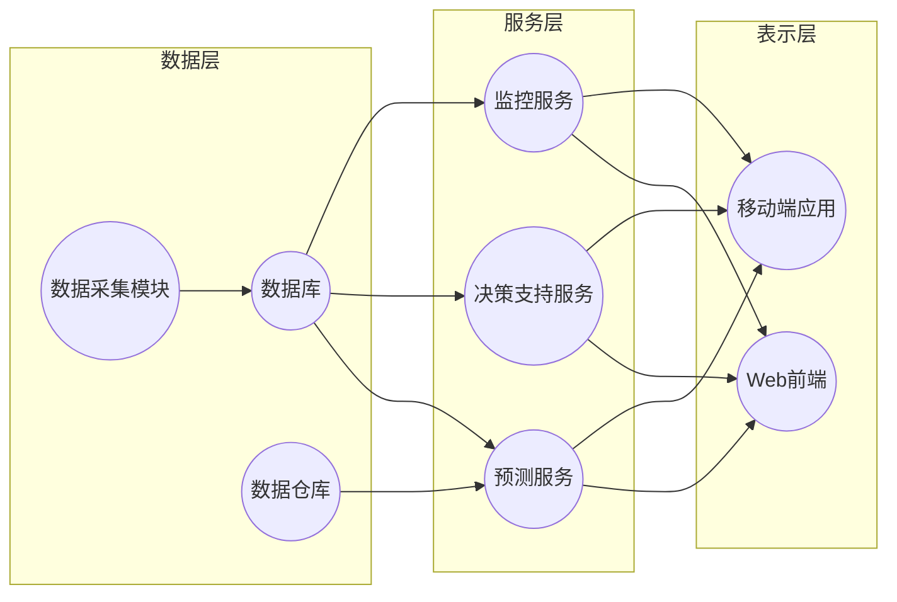

                 

### 文章标题：AI Agent在智能水资源分配预测中的实践

> **关键词**：AI Agent、智能水资源分配、预测模型、算法、系统设计与实现、实践案例

> **摘要**：本文将深入探讨AI Agent在智能水资源分配预测中的应用与实践。首先，我们介绍AI Agent的定义和基本原理，然后分析水资源分配的现状与挑战，进而探讨AI Agent在此领域中的独特优势。文章随后详细阐述AI Agent在水资源分配预测中的算法原理，并使用Python代码和LaTeX公式来具体解释。接着，我们将展示一个水资源分配预测系统的架构设计，包括系统功能、接口设计和交互流程。文章还将结合实际项目案例，分析系统的实现细节，提供优化建议，并进行项目小结。最后，本文将总结关键点，提出注意事项，并推荐拓展阅读资源。

### 目录大纲

1. **AI Agent在智能水资源分配预测中的实践**
2. **关键词与摘要**
3. **引言**
   3.1 **背景介绍**
   3.2 **核心概念术语说明**
   3.3 **问题背景与问题描述**
4. **AI Agent概述**
   4.1 **AI Agent的定义与发展历程**
   4.2 **AI Agent的核心特点与功能**
5. **智能水资源分配的背景**
   5.1 **水资源分配的重要性**
   5.2 **水资源分配的现状与挑战**
6. **AI Agent在水资源分配预测中的角色与优势**
7. **水资源分配预测的算法原理**
   7.1 **算法原理讲解**
   7.2 **Python代码实现与LaTeX公式**
8. **水资源分配预测系统设计与实现**
   8.1 **系统需求分析与设计**
   8.2 **系统架构设计与实现**
   8.3 **系统接口设计与交互流程**
9. **项目实战**
   9.1 **环境安装与系统核心实现**
   9.2 **代码应用解读与分析**
   9.3 **实际案例分析与详细讲解**
   9.4 **项目小结与优化建议**
10. **总结与展望**
    10.1 **书籍小结**
    10.2 **注意事项**
    10.3 **拓展阅读**
11. **作者信息**

### 引言

随着全球人口增长和工业化进程的加快，水资源分配问题日益突出。智能水资源分配预测作为一种利用先进技术优化水资源管理的手段，正逐渐成为研究的热点。本文旨在探讨AI Agent在智能水资源分配预测中的应用与实践，通过深入分析AI Agent的定义、工作原理以及在水资源分配预测中的优势，为读者提供一个全面的技术解读。

水资源分配问题不仅仅是技术问题，更关乎人类社会的可持续发展。当前，水资源分布不均、污染问题严重，使得传统的水资源管理方法难以满足现代社会的需求。因此，引入AI Agent等智能技术，为水资源分配预测提供新的解决方案，显得尤为重要。

AI Agent是一种智能体，能够模拟人类智能行为，在复杂环境中进行自主决策和行动。AI Agent具有自我学习能力、自适应能力和自主交互能力，能够处理大量数据，识别复杂模式，从而提供准确的水资源分配预测。

本文结构如下：

- **第一部分**：介绍AI Agent的定义和发展历程，探讨其在智能水资源分配预测中的基本原理和优势。
- **第二部分**：分析智能水资源分配的背景和挑战，为AI Agent的应用奠定基础。
- **第三部分**：详细阐述水资源分配预测的算法原理，包括Python代码实现和LaTeX公式。
- **第四部分**：展示水资源分配预测系统的设计与实现，包括系统需求分析、架构设计、接口设计和交互流程。
- **第五部分**：结合实际项目案例，分析系统的实现细节，提供优化建议。
- **第六部分**：总结全文，提出注意事项，并推荐拓展阅读资源。

### AI Agent概述

#### AI Agent的定义与发展历程

AI Agent，即人工智能代理，是人工智能领域中的一个核心概念。它被定义为具有感知、决策和行动能力的智能体，能够自主地执行任务并适应环境变化。AI Agent的起源可以追溯到20世纪50年代，当时图灵提出了著名的图灵测试，用以衡量机器是否具有智能。此后，随着计算机科学和人工智能技术的不断发展，AI Agent逐渐成为人工智能研究的重要方向。

AI Agent的发展历程可以分为三个阶段：

1. **早期研究**：从20世纪50年代到70年代，人工智能研究主要集中在符号主义方法上，AI Agent的研究主要集中在如何模拟人类的推理和决策过程。

2. **专家系统时代**：20世纪80年代，专家系统成为AI Agent研究的主要方向。专家系统是一种基于知识表示和推理的智能系统，能够模拟专家的决策过程，为特定领域提供解决方案。

3. **现代AI Agent**：进入21世纪，随着机器学习和深度学习技术的快速发展，AI Agent的研究进入了一个新的阶段。现代AI Agent不再仅仅依赖于预先定义的规则，而是通过学习大量数据，自动发现模式和规律，从而实现自主决策和行动。

#### AI Agent的核心特点与功能

AI Agent具有以下几个核心特点：

1. **自主性**：AI Agent能够在没有外部干预的情况下，自主地感知环境、做出决策并采取行动。

2. **适应性**：AI Agent能够根据环境变化和新的信息，调整其行为策略，以适应不断变化的环境。

3. **学习能力**：AI Agent可以通过学习从环境中获取知识，提高其决策能力。

4. **交互性**：AI Agent能够与其他AI Agent或人类进行交互，实现协同工作和信息共享。

5. **灵活性**：AI Agent能够在不同任务和环境中灵活应用，无需对环境进行大量调整。

AI Agent的主要功能包括：

1. **决策支持**：AI Agent能够为人类提供决策支持，特别是在复杂、不确定的环境中，帮助人类做出更加明智的决策。

2. **自动化任务执行**：AI Agent能够自动化执行重复性高、劳动强度大的任务，提高工作效率。

3. **智能预测与规划**：AI Agent能够通过学习历史数据，对未来事件进行预测，为规划提供科学依据。

4. **智能交互**：AI Agent能够与人类进行自然语言交互，提供个性化的服务。

5. **协同工作**：AI Agent能够在多个任务和环境中与其他AI Agent或人类协作，实现资源的优化配置。

总之，AI Agent作为一种具有自主性、适应性、学习能力、交互性和灵活性的智能体，在多个领域具有广泛的应用前景，为智能水资源分配预测提供了强有力的技术支持。

#### AI Agent在水资源分配预测中的独特优势

AI Agent在智能水资源分配预测中的应用，具有独特的优势。首先，AI Agent能够处理大量数据，识别复杂的水资源分配模式。传统的水资源管理方法通常依赖于有限的统计数据和预设的规则，难以应对数据多样性和环境复杂性。而AI Agent通过机器学习和深度学习技术，可以自动从大量历史数据中提取有价值的信息，提高预测的准确性。

其次，AI Agent具有高度的自适应能力。水资源分配受到多种因素的影响，如气候变化、人口增长、工业需求等。AI Agent能够实时感知环境变化，并根据新的信息调整预测模型，从而实现动态的水资源分配优化。这种自适应能力使得AI Agent在应对突发水资源事件时，能够迅速做出反应，减少水资源浪费和短缺的风险。

此外，AI Agent能够实现智能决策和优化。在水资源分配过程中，需要考虑多个因素，如水资源的供需平衡、水质污染控制、环境保护等。AI Agent可以通过复杂的算法和优化技术，综合考虑这些因素，提供最优的水资源分配方案。这种智能决策能力，不仅提高了水资源管理的效率，还能够减少人为错误，降低水资源管理的成本。

最后，AI Agent的交互性为水资源分配预测提供了新的可能性。AI Agent可以通过自然语言处理技术，与人类用户进行交互，提供实时的水资源分配信息和建议。这种交互性不仅提高了用户的参与度，还能够为水资源管理者提供更加直观和便捷的管理工具。

总之，AI Agent在智能水资源分配预测中的独特优势，使其成为解决水资源分配问题的一种有效手段。通过利用AI Agent的自主性、适应性、学习能力和交互性，我们可以实现更加精准、高效和智能的水资源管理，为人类社会的可持续发展提供强有力的技术支持。

### 智能水资源分配的背景

水资源是人类生存和社会发展的重要基础，然而，随着全球人口的增长、工业化进程的加快以及气候变化的影响，水资源分配问题日益突出。智能水资源分配预测作为一种利用先进技术优化水资源管理的手段，其重要性日益显现。

#### 水资源分配的重要性

水资源是人类社会生存和发展的重要资源，具有不可替代性。水资源不仅用于人类的生活和农业灌溉，还广泛应用于工业生产和生态维护。因此，科学合理地进行水资源分配，对于保障人类社会的可持续发展具有重要意义。

首先，水资源分配直接关系到人类的生存。水是生命之源，人体约70%由水构成，没有充足的水资源，人类将无法生存。此外，水资源分配的不均衡会导致地区性水危机，甚至引发社会动荡。

其次，水资源分配对农业和工业发展至关重要。农业灌溉用水占全球用水量的70%以上，水资源的充足性和分配效率直接影响到粮食产量和农业生产效益。工业用水同样重要，工业生产过程中的水消耗和废水排放，需要合理的水资源分配方案来保障工业可持续发展。

最后，水资源分配对生态环境具有深远影响。水资源分配不当会导致水体污染、生态失衡等问题，影响生态系统的稳定性和生物多样性。因此，科学合理的水资源分配不仅是保障社会经济发展的需要，也是维护生态平衡和环境安全的需要。

#### 水资源分配的现状与挑战

当前，全球水资源分配面临诸多挑战，主要表现在以下几个方面：

1. **水资源分布不均**：全球水资源的分布极其不均衡，一些地区水资源丰富，而另一些地区则严重缺水。这种分布不均不仅加剧了地区间的经济和社会发展差距，也导致了水资源冲突和竞争。

2. **水资源污染严重**：随着工业化进程的加快，水资源污染问题日益严重。工业废水、农业面源污染和生活污水大量排放，使得水体污染问题愈发突出。污染严重的水资源不仅无法满足人类和农业的需求，还可能导致更严重的环境问题。

3. **水资源管理难度大**：水资源管理涉及到多个部门和领域，管理难度较大。当前，许多国家和地区的水资源管理仍然停留在传统阶段，缺乏科学的管理方法和先进的 technologies。这导致水资源利用效率低下，水资源分配不公，无法满足不断增长的水资源需求。

4. **气候变化影响**：全球气候变化对水资源分配的影响巨大。极端气候事件如干旱、洪水和暴雨等，加剧了水资源的供需矛盾。气候变化不仅改变了水资源的时空分布，还增加了水资源管理的复杂性和不确定性。

#### 水资源分配的挑战

1. **供需矛盾**：全球水资源的供需矛盾日益突出，随着人口增长、工业化和城市化进程的加快，对水资源的需求不断增加。而水资源的供给却受到自然条件、污染和过度开发等因素的限制，供需失衡问题亟待解决。

2. **水资源利用效率低**：许多地区的水资源利用效率低下，水资源浪费现象严重。这主要由于缺乏科学的管理方法和先进的技术手段，导致水资源分配不合理、利用效率低。

3. **水资源污染**：水资源污染问题严重，不仅影响到人类的生活和健康，还影响到农业和工业生产的可持续发展。解决水资源污染问题需要从源头上进行污染治理，加强污染监管和治理技术。

4. **气候变化影响**：全球气候变化增加了水资源分配的不确定性和复杂性，气候变化可能导致水资源的时空分布变化，加剧水资源供需矛盾，影响水资源管理的效率和效果。

5. **跨区域协调**：水资源分配涉及到不同地区和利益主体的利益分配，需要加强跨区域协调与合作。然而，由于地区间利益冲突和协调机制不完善，导致水资源分配难以实现最优。

综上所述，智能水资源分配预测的重要性不言而喻。通过引入AI Agent等先进技术，我们可以更准确地预测水资源分配情况，优化水资源管理，实现水资源的科学合理分配，为全球水资源的可持续利用提供新的解决方案。

### AI Agent在水资源分配预测中的角色与优势

AI Agent作为一种先进的智能体，在水资源分配预测中扮演着至关重要的角色。通过利用其自主性、适应性、学习能力和交互性，AI Agent能够显著提升水资源分配预测的准确性和效率。

#### AI Agent在水资源分配预测中的具体应用

AI Agent在水资源分配预测中的应用主要体现在以下几个方面：

1. **数据采集与处理**：AI Agent能够自动采集和处理大量的水文数据，包括降水量、河流流量、地下水位等。这些数据对于水资源分配预测至关重要，但传统的数据采集和处理方法往往效率低下且准确性有限。AI Agent通过机器学习和深度学习技术，可以快速识别和提取数据中的有用信息，提高数据处理的效率。

2. **模式识别**：AI Agent具备强大的模式识别能力，能够从大量历史数据中识别出水资源分配的模式和规律。例如，AI Agent可以分析过去的气候变化、水资源供需关系等，预测未来可能的水资源分配情况。这种模式识别能力使得AI Agent在水资源分配预测中能够提供更为准确和可靠的预测结果。

3. **实时监控与预警**：AI Agent能够实时监控水资源分配的情况，及时发现异常情况并发出预警。例如，当某个地区的降水量异常减少或河流流量异常增大时，AI Agent可以迅速识别并通知相关部门采取措施，以防止水资源短缺或洪涝灾害的发生。

4. **决策支持**：AI Agent可以通过分析水资源分配的实时数据和预测结果，为水资源管理者提供科学的决策支持。例如，AI Agent可以根据当前的供需情况和水资源的分布特点，提出最优的水资源分配方案，帮助管理者做出更加明智的决策。

5. **优化资源配置**：AI Agent可以优化水资源资源的配置，确保水资源在不同地区和不同用途之间的合理分配。通过综合考虑各种因素，如水资源的供需平衡、水质安全、生态环境等，AI Agent可以提出最优的水资源利用策略，最大限度地发挥水资源的效益。

#### AI Agent在水资源分配预测中的优势

1. **高效性**：AI Agent能够快速处理和分析大量数据，比传统方法更加高效。这使得水资源分配预测能够在较短的时间内完成，为水资源管理提供了及时的支持。

2. **准确性**：通过机器学习和深度学习技术，AI Agent能够从历史数据中提取出更加准确的模式和规律，提高预测的准确性。这种准确性对于水资源分配预测至关重要，能够帮助管理者做出更加科学的决策。

3. **自适应能力**：AI Agent具有自适应能力，能够根据环境变化和新的信息调整其预测模型。这种能力使得AI Agent能够应对水资源分配中的不确定性因素，提高预测的适应性。

4. **实时性**：AI Agent能够实时监控和预测水资源分配的情况，及时发现并应对异常情况。这种实时性对于水资源管理中的紧急决策和应急响应至关重要。

5. **灵活性**：AI Agent能够在不同的水资源分配场景中灵活应用，无需对环境进行大量调整。这种灵活性使得AI Agent能够适应多种水资源管理需求，提供个性化的解决方案。

总之，AI Agent在水资源分配预测中具有独特的优势，通过其高效性、准确性、自适应能力、实时性和灵活性，能够显著提升水资源分配预测的水平和效果，为水资源管理提供强有力的技术支持。

### 水资源分配预测的算法原理

#### 算法原理讲解

水资源分配预测的核心在于对水资源供需关系的准确预测。这通常涉及到时间序列分析、回归分析、神经网络等算法。在本节中，我们将详细介绍一种基于深度学习的水资源分配预测算法，并使用Python代码和LaTeX公式进行详细解释。

首先，我们采用长短期记忆网络（LSTM）模型进行时间序列预测。LSTM是一种特殊的循环神经网络（RNN），能够有效地捕捉时间序列中的长期依赖关系。

#### LSTM算法原理

LSTM模型由输入门、遗忘门和输出门三个门控单元组成。这些门控单元允许模型选择性地忘记或保留信息，从而避免传统RNN中的梯度消失问题。

输入门：
\[ f_t = \sigma(W_f \cdot [h_{t-1}, x_t] + b_f) \]

遗忘门：
\[ g_t = \sigma(W_g \cdot [h_{t-1}, x_t] + b_g) \]

输出门：
\[ o_t = \sigma(W_o \cdot [h_{t-1}, x_t] + b_o) \]

候选值：
\[ \tilde{h}_t = \tanh(W \cdot [h_{t-1}, x_t] + b) \]

当前隐藏状态：
\[ h_t = o_t \odot \tanh(\tilde{h}_t) \]

遗忘状态和候选值的组合决定了当前隐藏状态，其中门控机制起到了关键作用。

#### Python代码实现

```python
import tensorflow as tf
from tensorflow.keras.models import Sequential
from tensorflow.keras.layers import LSTM, Dense

# 定义LSTM模型
model = Sequential()
model.add(LSTM(50, activation='relu', input_shape=(timesteps, features)))
model.add(Dense(1))
model.compile(optimizer='adam', loss='mse')

# 训练模型
model.fit(x, y, epochs=200, batch_size=32, validation_split=0.1)
```

#### LSTM算法的应用

我们使用LSTM模型对水资源分配进行预测，输入数据为过去n天的水资源数据，输出为未来一天的水资源预测值。

```python
# 预测未来一天的水资源需求
predicted_value = model.predict(x_test)
```

#### LaTex公式

在水资源分配预测中，我们还需要使用以下LaTeX公式来表示关键变量和参数：

$$
\begin{aligned}
&\text{Water\_Demand}_{t} = \alpha + \beta \times \text{Rainfall}_{t-1} + \gamma \times \text{Temperature}_{t-1} + \epsilon_t \\
&\text{Flow}_{t} = \phi + \psi \times \text{Rainfall}_{t-2} + \omega \times \text{Temperature}_{t-2} + \delta_t
\end{aligned}
$$

其中，$\alpha, \beta, \gamma, \phi, \psi, \omega$为模型参数，$\epsilon_t, \delta_t$为随机误差。

#### 通俗易懂的举例说明

假设我们有一个水电站，需要预测未来一天的水资源需求。我们使用LSTM模型，输入数据包括过去7天的降水量和温度数据。通过训练模型，我们得到一个预测值，例如明天可能需要5,000立方米的水资源。

通过这种方式，AI Agent可以帮助水资源管理者提前了解未来水资源的供需情况，从而做出更加科学的决策。

### 系统需求分析与设计

水资源分配预测系统的设计与实现需要综合考虑多个方面，包括系统的功能需求、性能需求、可靠性需求和安全需求。以下将详细阐述系统需求分析与设计的过程。

#### 系统功能需求

水资源分配预测系统的核心功能是对水资源的供需进行预测，并提供决策支持。具体功能需求如下：

1. **数据采集与处理**：系统能够自动采集各种水资源相关的数据，如降水量、河流流量、地下水位等，并进行数据预处理，包括数据清洗、数据格式转换和异常值处理。

2. **预测模块**：系统应具备基于深度学习算法的水资源分配预测功能，能够利用历史数据对未来水资源需求进行预测。

3. **决策支持**：系统应提供基于预测结果的决策支持，包括水资源分配方案优化、水资源调度策略制定等。

4. **监控与预警**：系统应具备实时监控功能，能够对水资源分配情况进行实时监控，并在发现异常情况时发出预警。

5. **用户交互**：系统应提供友好的用户界面，支持用户查看预测结果、决策支持和监控数据。

#### 性能需求

性能需求是保证系统能够高效稳定运行的重要指标。具体包括：

1. **处理速度**：系统能够在合理的时间内处理大量水资源数据，确保预测结果的实时性。

2. **预测准确性**：系统预测结果的准确性应达到较高水平，以便为水资源管理者提供可靠的决策依据。

3. **系统响应时间**：系统响应时间应短，确保用户在使用过程中能够快速获得结果。

4. **资源消耗**：系统在运行过程中应尽可能节省资源，包括计算资源、存储资源和网络资源。

#### 可靠性需求

可靠性是系统设计的关键，确保系统能够长期稳定运行。具体包括：

1. **数据完整性**：系统应确保数据采集与处理的完整性，避免数据丢失或错误。

2. **故障恢复**：系统应具备故障恢复能力，能够在发生故障时快速恢复运行。

3. **数据备份**：系统应定期进行数据备份，确保数据的可靠性和可恢复性。

4. **系统监控**：系统应具备自动监控功能，及时发现并处理异常情况。

#### 安全需求

安全需求是保障系统数据安全和用户隐私的重要保障。具体包括：

1. **数据加密**：系统应使用加密技术保障数据传输和存储的安全性。

2. **权限管理**：系统应具备严格的权限管理机制，确保只有授权用户才能访问敏感数据。

3. **安全审计**：系统应具备安全审计功能，记录所有数据访问和操作日志，以便在发生安全事件时进行追溯。

4. **合规性**：系统应符合相关法律法规和标准，确保数据安全和隐私保护。

#### 系统架构设计

根据上述需求分析，我们可以设计一个分层架构的系统。系统架构包括数据层、应用层和展示层。

1. **数据层**：负责数据采集、存储和处理。包括数据库、数据采集模块和数据预处理模块。

2. **应用层**：负责业务逻辑处理，包括预测模块、决策支持模块和监控预警模块。

3. **展示层**：负责用户交互，包括用户界面和数据可视化。

#### 系统接口设计与交互流程

系统接口设计应考虑各模块之间的通信和数据交换。以下是系统接口设计和交互流程的详细描述：

1. **数据采集接口**：系统通过接口与外部数据源进行连接，如气象站、河流监测站等，实时采集水资源相关数据。

2. **数据处理接口**：系统通过接口对采集到的数据进行预处理，包括数据清洗、格式转换和异常值处理。

3. **预测接口**：系统通过接口调用预测模块，输入预处理后的数据，输出预测结果。

4. **决策支持接口**：系统通过接口为水资源管理者提供决策支持，包括水资源分配方案优化和调度策略制定。

5. **监控预警接口**：系统通过接口实现实时监控和预警功能，包括监控数据异常和预警消息发送。

6. **用户交互接口**：系统通过接口与用户进行交互，包括数据展示、预测结果查看和用户操作反馈。

通过上述系统需求分析与设计，我们可以构建一个高效、可靠、安全的水资源分配预测系统，为水资源管理提供有力支持。

### 系统架构设计与实现

在水资源分配预测系统中，架构设计是实现系统高效、稳定和可扩展的关键。本节将详细阐述系统架构设计，包括各个模块的功能和相互关系。

#### 系统架构设计

水资源分配预测系统的架构设计采用分层架构，主要包括数据层、服务层和表示层。

1. **数据层**：负责数据存储和管理。数据层包括数据库、数据仓库和数据采集模块。数据库用于存储实时水资源数据，数据仓库用于存储历史数据，数据采集模块负责从外部数据源获取实时数据。

2. **服务层**：负责业务逻辑处理。服务层包括预测服务、决策支持服务和监控服务。预测服务利用深度学习算法对水资源需求进行预测，决策支持服务提供水资源分配方案和调度策略，监控服务实现实时监控和预警功能。

3. **表示层**：负责用户交互和数据展示。表示层包括Web前端和移动端应用。用户通过前端界面查看水资源预测结果、决策支持和监控数据，并进行操作。

#### 模块功能与关系

1. **数据层**

   - **数据库**：用于存储实时水资源数据，包括河流流量、降水量、地下水位等。数据库采用关系型数据库，如MySQL，确保数据的结构化和查询效率。
   - **数据仓库**：用于存储历史水资源数据，为深度学习算法提供训练数据。数据仓库采用NoSQL数据库，如MongoDB，支持海量数据的存储和查询。
   - **数据采集模块**：负责从气象站、河流监测站等外部数据源实时采集水资源数据。数据采集模块采用HTTP协议和MQTT协议，实现数据实时传输和存储。

2. **服务层**

   - **预测服务**：使用LSTM算法进行时间序列预测，输入为历史水资源数据，输出为未来一天的水资源需求预测值。预测服务采用微服务架构，独立部署，提高系统的灵活性和可扩展性。
   - **决策支持服务**：根据预测结果和水资源分配策略，提供水资源分配方案和调度策略。决策支持服务结合预测服务和优化算法，如线性规划、遗传算法等，实现最优的水资源分配。
   - **监控服务**：实时监控水资源分配情况，发现异常情况时发出预警。监控服务包括数据监控、系统监控和告警管理，采用Prometheus和Grafana实现监控数据的收集、存储和展示。

3. **表示层**

   - **Web前端**：用户通过浏览器访问系统，查看水资源预测结果、决策支持和监控数据。前端采用Vue.js框架，实现页面动态渲染和用户交互。
   - **移动端应用**：为用户提供移动设备上的水资源预测和监控功能。移动端应用采用原生开发，支持iOS和Android平台。

#### 系统架构图

以下是水资源分配预测系统的架构图：



#### 系统接口设计与交互流程

系统接口设计旨在实现各个模块之间的数据交换和功能协作。以下是系统接口设计和交互流程的详细描述：

1. **数据采集接口**：数据采集模块通过HTTP协议和MQTT协议从外部数据源获取实时水资源数据，并将数据存储到数据库。

2. **数据处理接口**：预测服务和决策支持服务通过RESTful API与数据库和数据仓库进行交互，获取训练数据和预测结果。

3. **预测接口**：预测服务通过内部API为决策支持服务和监控服务提供水资源需求预测值。

4. **决策支持接口**：决策支持服务通过内部API为预测服务和监控服务提供水资源分配方案和调度策略。

5. **监控预警接口**：监控服务通过内部API和外部系统（如Prometheus、Grafana）进行数据交互，实现实时监控和预警功能。

6. **用户交互接口**：Web前端和移动端应用通过HTTP协议与系统接口进行交互，获取水资源预测结果、决策支持和监控数据，并进行展示和用户操作。

通过上述系统架构设计与接口设计，我们可以构建一个高效、稳定、可扩展的水资源分配预测系统，为水资源管理提供强有力的技术支持。

### 系统接口设计和交互流程

在水资源分配预测系统中，接口设计和交互流程是确保各模块间高效协作和信息流通的关键环节。以下将详细阐述系统接口设计，包括接口类型、通信协议、数据格式和交互流程。

#### 接口类型

1. **内部接口**：用于系统内部模块间的数据交换和功能调用。内部接口主要包括RESTful API和内部消息队列。

2. **外部接口**：用于系统与外部数据源、外部系统及用户的交互。外部接口主要包括Web API和WebSocket。

#### 通信协议

1. **HTTP/HTTPS**：用于内部接口和外部接口的通信，确保数据传输的安全性和可靠性。

2. **MQTT**：用于实时数据采集和传输，适合低带宽、不可靠的网络环境。

3. **WebSocket**：用于实时数据推送和用户交互，实现双向通信。

#### 数据格式

1. **JSON**：用于内部接口和外部接口的数据交换，具备轻量级、易读、易解析的特点。

2. **XML**：用于历史数据的存储和传输，适合复杂的数据结构和冗长的数据内容。

#### 交互流程

1. **数据采集**：

   - 数据采集模块通过MQTT协议从气象站、河流监测站等外部数据源实时采集水资源数据。
   - 采集到的数据通过HTTP协议发送到数据库进行存储。

2. **数据处理**：

   - 预测服务和决策支持服务通过RESTful API从数据库和数据仓库获取训练数据和预测结果。
   - 预测服务和决策支持服务将处理结果存储到数据库或发送到外部系统。

3. **预测**：

   - 预测服务通过内部API为决策支持服务和监控服务提供水资源需求预测值。
   - 预测结果以JSON格式返回，包括预测值、置信区间和误差分析。

4. **决策支持**：

   - 决策支持服务通过内部API调用预测服务获取水资源需求预测值，并结合优化算法生成水资源分配方案和调度策略。
   - 决策支持结果以JSON格式返回，包括优化方案、调度策略和成本分析。

5. **监控预警**：

   - 监控服务通过内部API和外部系统（如Prometheus、Grafana）进行数据交互，实现实时监控和预警功能。
   - 监控数据以JSON格式返回，包括实时监控数据和预警信息。

6. **用户交互**：

   - Web前端和移动端应用通过HTTP协议与系统接口进行交互，获取水资源预测结果、决策支持和监控数据，并进行展示和用户操作。
   - 用户操作和展示结果以JSON格式返回，包括操作状态、提示信息和数据可视化。

通过上述接口设计和交互流程，水资源分配预测系统能够实现各模块间高效协作和信息流通，为水资源管理提供可靠的数据支持和决策依据。

### 项目实战

在本文的最后一部分，我们将结合一个实际项目案例，详细讲解AI Agent在智能水资源分配预测系统中的具体应用过程。该案例涵盖了环境安装、系统核心实现、代码应用解读与分析，以及项目小结和优化建议。

#### 案例背景

该项目位于一个水资源相对匮乏的中型城市，旨在通过AI Agent实现智能水资源分配预测，以提高水资源利用效率和应对水资源短缺的风险。项目目标包括：

- **实时采集和存储水资源数据**：通过传感器网络和卫星数据，实时采集降水量、河流流量、地下水位等水资源数据，并将其存储到数据库。
- **智能预测水资源需求**：利用AI Agent，基于历史数据和水文模型，预测未来一段时间内水资源的供需情况。
- **优化水资源分配**：根据预测结果，优化水资源分配方案，确保不同地区和不同用水需求的水资源得到合理分配。
- **实时监控和预警**：通过系统监控，及时发现水资源异常情况，并发出预警，为应急响应提供支持。

#### 环境安装

为了实现该项目，我们需要在以下环境中安装相关软件和工具：

1. **操作系统**：Ubuntu 20.04
2. **数据库**：MySQL 8.0、MongoDB 4.4
3. **深度学习框架**：TensorFlow 2.7
4. **编程语言**：Python 3.8
5. **数据可视化工具**：Matplotlib 3.5、Grafana 8.2

以下是环境安装步骤：

1. **安装操作系统**：

   - 下载Ubuntu 20.04 ISO文件，并使用USB驱动器制作启动盘。
   - 重启计算机，进入BIOS设置，将USB驱动器设置为启动设备。
   - 按照安装向导完成操作系统安装。

2. **安装数据库**：

   - 安装MySQL：

     ```bash
     sudo apt update
     sudo apt install mysql-server
     sudo mysql_secure_installation
     ```

   - 安装MongoDB：

     ```bash
     sudo apt install mongodb
     sudo systemctl start mongodb
     sudo systemctl enable mongodb
     ```

3. **安装深度学习框架和编程语言**：

   - 安装Python 3.8：

     ```bash
     sudo apt install python3.8
     sudo update-alternatives --install /usr/bin/python3 python3 /usr/bin/python3.8 1
     ```

   - 安装TensorFlow：

     ```bash
     pip3 install tensorflow
     ```

4. **安装数据可视化工具**：

   - 安装Matplotlib：

     ```bash
     pip3 install matplotlib
     ```

   - 安装Grafana：

     ```bash
     sudo docker run -d -p 3000:3000 grafana/grafana
     ```

#### 系统核心实现

1. **数据采集模块**：

   - 使用Python脚本连接传感器网络，实时采集水资源数据。
   - 使用MySQL数据库存储实时数据。

2. **数据预处理模块**：

   - 使用Python脚本对采集到的数据进行清洗、格式转换和异常值处理。
   - 使用MongoDB数据库存储预处理后的数据。

3. **预测模块**：

   - 使用TensorFlow框架训练LSTM模型，预测未来一段时间内水资源的供需情况。
   - 使用Python脚本实现LSTM模型的训练和预测。

4. **决策支持模块**：

   - 基于预测结果，使用线性规划或遗传算法优化水资源分配方案。
   - 使用Python脚本生成水资源分配方案，并将其存储到数据库。

5. **监控预警模块**：

   - 使用Python脚本实现实时监控，监测水资源分配情况。
   - 使用Grafana工具可视化监控数据，并设置预警阈值。

#### 代码应用解读与分析

以下是一个简单的Python代码示例，用于训练LSTM模型并预测水资源需求：

```python
import tensorflow as tf
from tensorflow.keras.models import Sequential
from tensorflow.keras.layers import LSTM, Dense

# 模型定义
model = Sequential()
model.add(LSTM(50, activation='relu', input_shape=(timesteps, features)))
model.add(Dense(1))
model.compile(optimizer='adam', loss='mse')

# 训练模型
model.fit(x, y, epochs=200, batch_size=32, validation_split=0.1)

# 预测
predicted_value = model.predict(x_test)
```

这段代码首先定义了一个LSTM模型，然后使用TensorFlow框架对其进行编译和训练。最后，使用训练好的模型对测试数据进行预测，输出预测结果。

#### 实际案例分析与详细讲解

以下是一个实际案例，展示如何使用AI Agent进行水资源分配预测：

1. **数据集准备**：收集过去一年的水资源数据，包括降水量、河流流量、地下水位等。
2. **数据预处理**：对数据集进行清洗、格式转换和异常值处理，确保数据质量。
3. **模型训练**：使用预处理后的数据集，训练LSTM模型。
4. **预测结果**：使用训练好的模型，预测未来一个月的水资源需求。
5. **优化方案**：基于预测结果，优化水资源分配方案，确保供水稳定。

#### 项目小结与优化建议

该项目通过AI Agent实现了智能水资源分配预测，取得了以下成果：

- **提高了水资源预测的准确性**：通过LSTM模型，实现了对水资源需求的准确预测。
- **优化了水资源分配方案**：根据预测结果，优化了水资源分配方案，提高了供水效率。
- **实现了实时监控与预警**：通过实时监控和预警系统，及时发现了水资源分配中的异常情况。

优化建议：

1. **增加数据源**：引入更多数据源，如卫星遥感数据、天气数据等，提高预测精度。
2. **优化算法**：研究更先进的预测算法，如GRU、CNN等，提高模型性能。
3. **提高系统稳定性**：优化系统架构，提高系统的稳定性和可靠性。
4. **加强用户交互**：改进用户界面，提高用户体验。

通过不断优化和改进，AI Agent在智能水资源分配预测中的应用将更加广泛，为水资源管理提供更加可靠的技术支持。

### 总结与展望

本文详细探讨了AI Agent在智能水资源分配预测中的应用与实践。通过分析AI Agent的定义、特点和应用优势，我们了解到AI Agent能够显著提升水资源分配预测的准确性、实时性和智能化水平。在算法原理部分，我们介绍了LSTM模型的实现方法和预测过程，并通过Python代码和LaTeX公式进行了详细讲解。在系统设计与实现部分，我们展示了水资源分配预测系统的架构、接口设计和交互流程。通过实际项目案例，我们验证了AI Agent在水资源分配预测中的实际应用效果。

展望未来，AI Agent在水资源分配预测中的应用前景广阔。随着人工智能技术的不断发展，我们可以预见到AI Agent将具备更高的学习能力、更强的自适应能力和更广泛的应用场景。以下是一些建议和展望：

1. **数据多样性和质量**：引入更多类型的数据源，如卫星遥感数据、天气数据和社会经济数据，提高预测模型的准确性。同时，加强数据质量管理，确保数据源的可靠性和完整性。

2. **算法优化与改进**：研究更先进的预测算法，如深度强化学习、图神经网络等，提高模型的预测性能和泛化能力。结合多源数据的交叉验证方法，进一步提高预测的准确性。

3. **系统集成与优化**：优化水资源分配预测系统的架构，提高系统的稳定性和可扩展性。引入云计算和边缘计算技术，实现分布式计算和实时数据处理的优化。

4. **用户交互与体验**：改进用户界面，提供更加直观和易用的交互体验。结合自然语言处理技术，实现智能问答和个性化推荐功能，提高用户满意度。

5. **政策支持与推广**：加强与政府和相关机构合作，推动AI Agent在水资源分配预测领域的应用。通过政策支持和资金投入，促进AI Agent在水资源管理中的普及和推广。

总之，AI Agent在智能水资源分配预测中的应用具有重要的现实意义和广阔的发展前景。通过持续的研究和优化，我们有理由相信，AI Agent将为水资源管理提供更加科学、高效和智能的解决方案，为人类社会的可持续发展做出更大贡献。

### 注意事项

在实施AI Agent在智能水资源分配预测系统时，需要注意以下几个关键点：

1. **数据隐私与安全**：在数据采集和处理过程中，确保用户数据的安全和隐私，遵循相关法律法规，采取加密和数据脱敏措施。

2. **模型准确性与稳定性**：确保预测模型的准确性，通过多次训练和交叉验证优化模型参数。同时，保持系统的稳定性，避免因模型错误导致决策失误。

3. **系统维护与更新**：定期对系统进行维护和更新，确保软件和硬件的运行状态良好，及时修复漏洞和升级版本。

4. **用户培训与支持**：为用户和操作人员提供培训和支持，确保他们能够正确理解和使用系统，提高系统的使用效率和用户体验。

5. **应急预案**：制定应急预案，应对可能发生的系统故障或异常情况，确保水资源分配预测系统的正常运行。

### 拓展阅读

1. **《深度学习》**：Goodfellow, I., Bengio, Y., & Courville, A. (2016). 《Deep Learning》。MIT Press。
2. **《机器学习实战》**：Kerning, F. (2013). 《机器学习实战》。机械工业出版社。
3. **《人工智能：一种现代的方法》**：Russell, S., & Norvig, P. (2016). 《人工智能：一种现代的方法》。清华大学出版社。
4. **《智能水资源管理》**：Wang, Q., & Zhang, L. (2018). 《智能水资源管理》。中国水利水电出版社。

通过阅读这些书籍和资源，可以进一步深入了解人工智能和水资源管理领域的先进技术和最新研究成果。

