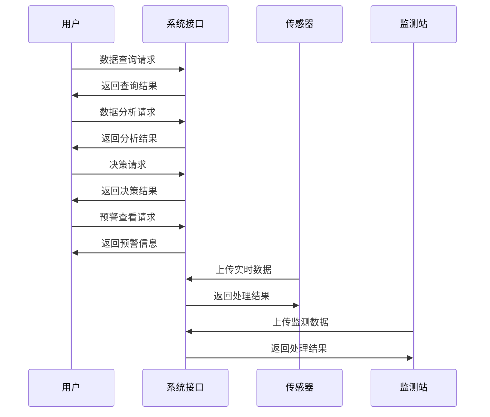

                 

### 第1章：问题背景与概述

#### 1.1 问题的背景

水资源作为地球上不可或缺的重要资源，支撑着人类社会的经济发展和生态平衡。然而，随着全球人口的增长、工业化进程的加快和气候变化等因素，水资源短缺和污染问题日益严峻。据联合国数据，目前全球约有28%的人口生活在水资源匮乏的地区，而到2050年，这一比例可能会上升到近半数。此外，水资源污染问题也严重威胁着人类的健康和生存环境，每年导致数十万人死亡。

在当前全球水资源管理中，传统的方法主要依赖于水利工程、水资源调度和法律法规等手段。然而，这些方法存在诸多局限性。首先，传统方法通常是基于经验和统计数据，缺乏科学的数据分析和决策支持。其次，水资源系统具有复杂性和不确定性，传统方法难以适应动态变化的供需状况。最后，传统方法在应对气候变化和环境污染等新挑战时显得力不从心。

AI Agent作为一种具有自主决策能力的智能实体，具有在水资源管理中发挥重要作用潜力。AI Agent可以通过对海量数据的实时分析，为水资源管理提供精确、高效的决策支持。此外，AI Agent可以模拟和预测水资源系统的行为，帮助管理者更好地理解水资源系统的动态变化，从而实现精准的水资源管理。

#### 1.2 水资源管理的挑战

水资源管理面临着一系列严峻的挑战。首先，数据获取和处理的挑战。水资源管理需要大量的实时数据，包括降雨量、水位、流量、水质等。然而，数据的获取、存储和处理是一项复杂的任务，特别是在涉及不同地区、不同时间段和不同类型的数据时。其次，决策支持的挑战。水资源管理需要基于大量的数据进行分析，以支持科学、准确的决策。然而，传统的方法在处理复杂数据和分析决策时存在很大的局限性。最后，系统的协调与集成挑战。水资源管理涉及多个部门、多个系统和多个环节，需要实现高效的信息共享和协调运作。然而，不同系统之间的接口和标准不统一，使得系统的协调和集成面临巨大挑战。

#### 1.3 AI Agent的概念与潜力

AI Agent是一种具有自主决策能力的智能实体，可以模拟人类的思维和行为，通过感知环境、学习知识和执行行动来完成任务。AI Agent具有以下几个核心特点：自主性、学习性、适应性和协作性。

首先，自主性。AI Agent能够自主地执行任务，不需要人工干预。这意味着AI Agent可以在水资源管理中实现自动化的决策和操作，提高效率和准确性。

其次，学习性。AI Agent可以通过不断的学习和优化，提高其决策能力和性能。在水资源管理中，AI Agent可以利用历史数据和实时数据，不断调整和优化决策策略，以适应不断变化的水资源状况。

第三，适应性。AI Agent可以根据环境的变化，自主调整其行为和策略。在水资源管理中，AI Agent可以实时感知水资源系统的变化，并做出相应的调整，以实现最佳的水资源管理效果。

最后，协作性。AI Agent可以与其他AI Agent或人类协作，共同完成任务。在水资源管理中，多个AI Agent可以协同工作，实现水资源管理的整体优化。

总之，AI Agent在水资源管理中具有巨大的潜力。通过AI Agent的应用，可以解决传统方法面临的诸多挑战，实现高效、精准的水资源管理。然而，要充分发挥AI Agent的潜力，还需要在技术、政策和标准等方面进行深入研究和探讨。

#### 1.4 本书的目标与结构

本书旨在深入探讨AI Agent在智能水资源管理中的应用，通过系统的研究和案例分析，展示AI Agent在水资源管理中的实际效果和潜在价值。

本书共分为八个章节，具体结构如下：

- **第一部分：引言**：介绍水资源管理中的问题和挑战，以及AI Agent的概念和潜力。

- **第二部分：核心概念**：详细阐述水资源管理的基础知识和AI Agent的基本原理。

- **第三部分：技术原理**：讲解AI Agent的技术原理，包括数据收集与预处理、算法基础和实现方法。

- **第四部分：系统架构**：介绍智能水资源管理系统的架构设计，包括需求分析、系统架构、接口设计和交互设计。

- **第五部分：实战应用**：通过具体案例，展示AI Agent在智能水资源管理中的实际应用。

- **第六部分：性能评估与优化**：讨论系统性能的评估方法和优化策略。

- **第七部分：未来展望与结论**：展望AI Agent在水资源管理中的发展趋势，总结本书的主要内容和贡献。

- **第八部分：总结与展望**：回顾全书内容，提出未来研究方向和拓展阅读建议。

通过本书的阅读，读者可以全面了解AI Agent在智能水资源管理中的应用，掌握相关技术和方法，为未来的水资源管理工作提供参考和指导。

### 第2章：核心概念

#### 2.1 水资源管理基础

水资源管理是一个涉及多个学科和领域的复杂过程，其核心目标是确保水资源的合理利用、保护和管理，以满足社会、经济和生态的需求。以下是对水资源管理基础概念的详细说明。

**水资源定义与分类**

水资源是指地球上可供人类使用的水，包括地表水（如河流、湖泊）和地下水。根据水资源的利用方式和特征，可以将其分为以下几类：

- **可再生水资源**：指可以通过自然过程或人工措施在短时间内恢复的水资源，如雨水、河流水和地下水。
- **非可再生水资源**：指一旦使用就无法恢复或恢复速度极其缓慢的水资源，如地下水中的深层地下水。
- **咸水**：指含盐量较高的水资源，如海水、地下咸水。
- **淡水资源**：指含盐量较低的水资源，是人类生活、农业和工业的主要水源。

**水资源管理的关键要素**

水资源管理涉及多个关键要素，包括水资源规划、水资源配置、水资源保护和水资源利用等。

- **水资源规划**：指在综合考虑社会、经济和环境因素的基础上，制定长期的水资源利用和开发计划。
- **水资源配置**：指在确保水资源供需平衡的前提下，将水资源合理分配到不同的用户和地区。
- **水资源保护**：指采取各种措施保护水资源，包括防止水污染、维护水生态系统和实施水资源节约等。
- **水资源利用**：指通过工程措施和管理措施，将水资源用于社会生产和居民生活。

**水资源管理的现状与问题**

目前，全球水资源管理面临诸多挑战和问题。以下是一些主要问题：

- **水资源短缺**：随着人口增长和经济发展的加快，全球许多地区的水资源需求不断增长，导致水资源短缺。
- **水资源污染**：工业废水、农业面源污染和生活污水等对水资源造成了严重污染，影响人类健康和生态环境。
- **水资源分配不均**：全球水资源分布不均衡，许多发展中国家和地区面临严重的水资源短缺问题。
- **水资源管理不规范**：许多地区的水资源管理缺乏有效的规划和监督机制，导致水资源利用效率低下和管理混乱。

**水资源管理的发展趋势**

面对上述挑战，水资源管理正在向智能化、可持续化和综合化方向发展。以下是一些发展趋势：

- **智能水资源管理**：利用人工智能、大数据和物联网等技术，提高水资源管理的精准性和效率。
- **水资源可持续管理**：通过实施水资源节约和循环利用措施，实现水资源的可持续利用。
- **水资源综合管理**：将水资源管理纳入 broader 的可持续发展框架中，实现水资源与其他资源的协调发展。

通过以上对水资源管理基础的介绍，我们可以更好地理解水资源管理的重要性以及其在现代社会面临的各种挑战和机遇。在接下来的章节中，我们将进一步探讨AI Agent在水资源管理中的应用及其潜力。

#### 2.2 AI Agent的基本原理

AI Agent是一种具备自主决策能力的智能实体，能够模拟人类的思维和行为，通过感知环境、学习知识和执行行动来完成任务。AI Agent的核心特点包括自主性、学习性、适应性和协作性。以下是对这些特点的详细解释。

**自主性**

自主性是AI Agent最显著的特点之一。它意味着AI Agent可以独立执行任务，不需要人工干预。具体来说，AI Agent通过感知环境中的信息，根据预设的目标和策略，自主地做出决策和执行行动。例如，在水资源管理中，AI Agent可以实时监测水资源状况，根据环境变化自主调整水资源分配策略，从而实现高效的水资源管理。

**学习性**

学习性是指AI Agent可以通过不断的学习和优化，提高其决策能力和性能。AI Agent通过收集和处理大量数据，从中学习到有效的决策策略和操作方法。在学习过程中，AI Agent可以利用机器学习算法，如强化学习、监督学习和无监督学习，从数据中提取模式和规律，不断优化其行为和决策。例如，在水资源管理中，AI Agent可以通过历史数据的学习，识别出不同季节和天气条件下的水资源需求模式，并据此调整灌溉策略，提高水资源利用效率。

**适应性**

适应性是指AI Agent可以根据环境的变化，自主调整其行为和策略。这意味着AI Agent能够适应动态变化的水资源状况，从而实现最佳的水资源管理效果。例如，当发生干旱或洪水等极端天气事件时，AI Agent可以根据环境变化，迅速调整水资源分配策略，确保水资源供应的稳定性和安全性。

**协作性**

协作性是指AI Agent可以与其他AI Agent或人类协作，共同完成任务。在水资源管理中，多个AI Agent可以协同工作，实现水资源管理的整体优化。例如，一个AI Agent可以负责水资源监测，另一个AI Agent可以负责水资源分配，它们通过协作，共同实现水资源管理的目标。此外，AI Agent还可以与水资源管理专家合作，为决策提供科学依据和优化方案。

**AI Agent的发展历程**

AI Agent的概念起源于人工智能领域，其发展历程可以分为几个阶段：

- **初始阶段**（20世纪50年代至70年代）：在这一阶段，研究人员开始探索如何让计算机模拟人类的思维和行为。代表性的工作包括逻辑推理系统和问题求解算法。
- **成熟阶段**（20世纪80年代至90年代）：在这一阶段，AI Agent的研究逐渐走向实用化，出现了一些早期的AI Agent系统，如基于规则的专家系统和基于行为的智能体。这些系统在特定场景下表现出了一定的智能和自主性。
- **发展期**（21世纪初至今）：随着机器学习、深度学习和物联网等技术的发展，AI Agent逐渐成为人工智能研究的一个重要方向。现代AI Agent系统具备更强大的自主决策能力、学习能力和适应性，可以应用于更多的实际场景，如智能水资源管理。

通过以上对AI Agent基本原理的介绍，我们可以看到，AI Agent作为一种智能实体，在水资源管理中具有巨大的潜力。在接下来的章节中，我们将进一步探讨AI Agent在水资源管理中的应用前景。

#### 2.3 AI Agent在水资源管理中的应用前景

AI Agent在水资源管理中的应用前景广阔，其强大的自主决策能力、学习能力和适应性能够显著提高水资源管理的效率和效果。以下是AI Agent在水资源管理中几个主要应用领域的探讨。

**应用领域**

1. **水资源监测与预警**：AI Agent可以通过感知环境中的各种数据，如降雨量、水位、流量、水质等，实时监测水资源的状况。同时，AI Agent可以利用机器学习算法，对历史数据进行分析，预测未来的水资源变化趋势，从而实现提前预警。例如，当AI Agent检测到降雨量异常减少或水位持续下降时，可以及时发出干旱预警，帮助管理者采取相应的应对措施。

2. **水资源分配与调度**：AI Agent可以根据实时监测数据和水资源需求，自主调整水资源的分配和调度策略。例如，在农业灌溉中，AI Agent可以根据土壤湿度、作物需水量和天气预报等因素，自动调整灌溉时间和水量，实现精准灌溉，提高水资源利用效率。此外，AI Agent还可以在工业用水和居民用水之间进行动态平衡，确保水资源的公平分配。

3. **水资源污染控制与治理**：AI Agent可以通过分析水质数据，识别污染源和污染物质，并制定相应的治理措施。例如，AI Agent可以监测河流或湖泊中的污染物浓度，当发现污染物浓度超过阈值时，自动启动治理设备，如过滤系统和喷洒药剂装置，以降低污染物浓度，保护水资源质量。

4. **水资源节约与循环利用**：AI Agent可以通过优化用水流程和设备运行，实现水资源的节约和循环利用。例如，AI Agent可以在工业生产过程中监测设备的用水量和废水排放情况，自动调整生产参数，减少废水产生。同时，AI Agent还可以管理废水处理设施，通过先进的处理技术，将废水转化为可再利用的水资源。

**优势与挑战**

AI Agent在水资源管理中具有以下优势：

1. **高效性**：AI Agent可以实时处理和分析大量数据，快速做出决策，提高水资源管理的效率和响应速度。
2. **精确性**：通过机器学习算法和大数据分析，AI Agent能够准确预测水资源的变化趋势，为决策提供科学依据。
3. **灵活性**：AI Agent可以根据环境变化和水资源需求，自主调整决策策略，适应动态变化的水资源管理需求。
4. **可持续性**：AI Agent通过优化水资源利用，减少废水排放，促进水资源的循环利用，有助于实现水资源的可持续管理。

然而，AI Agent在水资源管理中也面临一些挑战：

1. **数据质量**：AI Agent的决策依赖于高质量的数据，数据的不准确或缺失可能导致错误的决策。
2. **技术成熟度**：尽管AI技术取得了显著进展，但在水资源管理中的应用仍需进一步成熟和优化。
3. **成本和可扩展性**：部署和维护AI Agent系统需要较大的资金投入和技术支持，且系统的可扩展性也是一个重要挑战。
4. **法律与伦理**：AI Agent在水资源管理中的应用可能涉及隐私、安全和伦理等问题，需要制定相应的法律法规和伦理准则。

**发展趋势**

随着人工智能技术的不断进步和水资源管理需求的日益增长，AI Agent在水资源管理中的应用将呈现以下发展趋势：

1. **集成化**：将AI Agent与其他水资源管理工具和系统进行集成，实现更高效和协调的水资源管理。
2. **智能化**：利用更先进的人工智能算法和大数据技术，提高AI Agent的决策能力和适应性。
3. **定制化**：根据不同地区和不同水资源管理需求，定制开发AI Agent系统，实现更精准的水资源管理。
4. **人机协同**：AI Agent将与水资源管理专家和工程师进行协同工作，共同解决水资源管理中的复杂问题。

总之，AI Agent在水资源管理中的应用具有巨大的潜力，通过不断的技术创新和应用实践，有望解决当前水资源管理中面临的各种挑战，实现水资源的高效、精准和可持续管理。

### 第3章：AI Agent技术原理

#### 3.1 数据收集与预处理

在AI Agent的应用过程中，数据收集与预处理是至关重要的一步。数据的质量和完整性直接影响到AI Agent的决策效果和性能。因此，深入理解数据收集的方法、预处理的技术以及数据质量评估的方法是非常必要的。

**数据来源**

AI Agent所需的数据来源多样，主要包括以下几类：

1. **环境数据**：如降雨量、气温、风速、湿度等气象数据，可以通过气象局、卫星遥感系统等获取。
2. **水文数据**：如河流水位、流量、水质等数据，可以通过水文监测站、水文模型等获取。
3. **社会经济数据**：如人口、经济、农业用水量等数据，可以通过统计部门、政府部门等获取。
4. **历史数据**：如过去的水资源管理记录、历史气象数据等，可以通过数据库、历史档案等获取。

**数据预处理方法**

数据预处理包括数据清洗、数据转换和数据归一化等步骤，旨在提高数据的质量和一致性，为后续的模型训练和决策提供可靠的数据基础。

1. **数据清洗**：数据清洗是指识别和纠正数据中的错误、缺失和不一致。具体方法包括：
   - **去重**：去除重复的数据记录。
   - **填补缺失值**：使用均值、中位数、最邻近值等方法填补缺失数据。
   - **异常值处理**：识别并处理异常数据，如数据中的离群点。
   - **数据规范化**：将不同来源的数据进行统一格式和单位的转换。

2. **数据转换**：数据转换包括将非结构化数据转化为结构化数据，以及将定量数据转化为定性数据。例如，将气象数据中的文本描述转换为对应的数值。

3. **数据归一化**：数据归一化是指将不同特征的数据进行标准化处理，使其在同一量级上，便于后续的模型训练和计算。常用的方法包括最小-最大归一化和Z-Score归一化。

**数据质量评估**

数据质量评估是确保数据可靠性和有效性的关键步骤。以下几种方法可以用于数据质量评估：

1. **一致性检查**：检查数据的一致性，如数据格式、单位、日期等是否一致。
2. **完整性检查**：检查数据是否完整，是否有缺失值或重复值。
3. **准确性检查**：通过比较数据源之间的数据差异，评估数据的准确性。
4. **时效性检查**：检查数据的时效性，如数据是否过时或实时性。
5. **可用性检查**：评估数据是否满足AI Agent的训练和使用需求。

通过上述方法，可以确保AI Agent所使用的数据质量，从而提高其在水资源管理中的决策效果。

#### 3.2 AI Agent的算法基础

AI Agent在水资源管理中的应用依赖于一系列先进的算法基础，主要包括强化学习、监督学习和无监督学习。以下是对这些算法原理的详细阐述。

**强化学习**

强化学习（Reinforcement Learning，RL）是一种通过不断尝试和反馈来学习最优策略的机器学习方法。在强化学习中，AI Agent通过与环境的交互，通过接收奖励信号来调整其行为，从而实现最大化长期奖励。

1. **基本原理**：强化学习的基本原理可以概括为“试错学习”。AI Agent在给定状态下，选择一个动作，然后根据动作的结果获得奖励信号。在后续的状态中，AI Agent根据奖励信号和历史经验调整其策略，以期望在未来获得更高的奖励。

2. **核心概念**：
   - **状态（State）**：AI Agent当前所处环境的描述。
   - **动作（Action）**：AI Agent可以采取的行为。
   - **奖励（Reward）**：AI Agent采取某个动作后获得的即时奖励。
   - **策略（Policy）**：AI Agent选择动作的规则。

3. **算法流程**：
   - 初始化状态、动作和策略。
   - 选择一个动作执行。
   - 根据动作的结果获得奖励。
   - 更新策略，以最大化长期奖励。

4. **典型算法**：Q-Learning、SARSA、Deep Q-Networks（DQN）等。

**监督学习**

监督学习（Supervised Learning）是一种通过已知输入和输出数据来训练模型，从而预测新数据的方法。在监督学习中，AI Agent从已标记的数据集中学习，然后利用学习到的模型对新数据做出预测。

1. **基本原理**：监督学习的基本原理是利用已知的数据，通过学习输入和输出之间的关系，构建一个预测模型。在训练过程中，模型通过不断调整参数，使得预测结果接近实际输出。

2. **核心概念**：
   - **输入（Input）**：模型需要处理的数据特征。
   - **输出（Output）**：模型需要预测的结果。
   - **模型参数**：用于描述输入和输出之间关系的参数。

3. **算法流程**：
   - 初始化模型参数。
   - 使用已知输入和输出数据训练模型。
   - 评估模型的预测性能。
   - 调整模型参数，优化预测结果。

4. **典型算法**：线性回归、决策树、支持向量机（SVM）、神经网络等。

**无监督学习**

无监督学习（Unsupervised Learning）是一种在没有任何标记数据的情况下，从数据中自动发现隐藏模式和结构的方法。在无监督学习中，AI Agent主要关注数据的内在结构和关系，而不是具体的预测任务。

1. **基本原理**：无监督学习的基本原理是通过无监督学习算法，如聚类、降维和关联规则学习等，自动发现数据中的模式和规律。

2. **核心概念**：
   - **聚类**：将相似的数据点分为不同的群体。
   - **降维**：减少数据的维度，同时保留关键信息。
   - **关联规则学习**：发现数据之间的关联关系。

3. **算法流程**：
   - 初始化模型。
   - 对数据进行无监督学习。
   - 分析学习结果，发现数据中的模式和结构。

4. **典型算法**：K-Means聚类、主成分分析（PCA）、Apriori算法等。

通过以上对AI Agent算法基础的介绍，我们可以看到，AI Agent在水资源管理中的应用离不开强化学习、监督学习和无监督学习等多种算法的支持。这些算法的有机结合，使得AI Agent能够更准确地感知和预测水资源状况，从而实现高效、精准的水资源管理。

#### 3.3 AI Agent的设计与实现

在智能水资源管理中，AI Agent的设计与实现是确保其功能完善和性能高效的关键环节。以下将详细介绍AI Agent的设计原则、实现流程以及具体案例分析。

**设计原则**

AI Agent的设计应遵循以下原则：

1. **模块化**：将AI Agent分解为多个功能模块，如数据收集模块、数据处理模块、决策模块和执行模块，便于系统的扩展和维护。
2. **灵活性**：设计应确保AI Agent能够适应不同的应用场景和变化的水资源状况，具有高度的灵活性和适应性。
3. **可扩展性**：设计应考虑未来的技术发展和应用需求，确保系统能够无缝集成新的功能和模块。
4. **高效性**：优化AI Agent的算法和数据处理流程，确保其在水资源管理中能够高效地执行任务。
5. **鲁棒性**：确保AI Agent在面对噪声、缺失数据和不确定性时，仍能保持稳定的性能和决策能力。

**实现流程**

AI Agent的实现流程主要包括以下步骤：

1. **需求分析**：明确AI Agent在水资源管理中的应用目标和需求，包括数据类型、处理流程、决策规则等。
2. **系统架构设计**：设计AI Agent的系统架构，包括数据层、算法层、决策层和执行层，确保各层之间的逻辑清晰和功能明确。
3. **模块开发**：根据系统架构设计，开发各个功能模块，如数据收集模块、数据处理模块、决策模块和执行模块。
4. **算法实现**：选择合适的算法，如强化学习、监督学习和无监督学习，实现AI Agent的核心算法功能。
5. **系统集成**：将各个模块集成到一起，形成完整的AI Agent系统，并进行系统测试和优化。
6. **部署与应用**：将AI Agent系统部署到实际的水资源管理场景中，进行实际应用和效果评估。

**案例分析**

以下以一个具体的AI Agent系统为例，介绍其设计与实现过程。

**项目背景**：某地区的水资源管理面临干旱和污染等问题，需要实现智能化的水资源监测和分配。

**系统设计**：

1. **需求分析**：根据项目需求，AI Agent需要实现以下功能：
   - 实时监测水资源状况，包括降雨量、水位、水质等。
   - 根据监测数据，预测未来一段时间内的水资源变化趋势。
   - 根据水资源需求和变化趋势，自动调整水资源分配策略。
   - 发出干旱预警和污染预警，并采取相应的应对措施。

2. **系统架构设计**：
   - **数据层**：包括气象监测站、水文监测站和水质监测站，实时收集各种水资源数据。
   - **算法层**：包括数据预处理模块、预测模块和决策模块，用于处理数据、预测水资源变化趋势和制定水资源分配策略。
   - **决策层**：根据预测结果和决策规则，自动调整水资源分配策略。
   - **执行层**：包括灌溉系统、污水处理系统和水资源调度系统，执行水资源分配策略和应对措施。

3. **模块开发**：
   - **数据收集模块**：通过传感器和监测设备，实时收集水资源数据，包括气象数据、水文数据和水质数据。
   - **数据处理模块**：对收集到的数据进行清洗、转换和归一化处理，确保数据的质量和一致性。
   - **预测模块**：利用机器学习算法，如时间序列分析和神经网络，预测未来一段时间内的水资源变化趋势。
   - **决策模块**：根据预测结果和水资源需求，制定水资源分配策略，包括灌溉水量、污水处理量和水资源调度计划。
   - **执行模块**：根据决策结果，自动调整灌溉系统、污水处理系统和水资源调度系统的运行参数，执行水资源分配策略和应对措施。

4. **系统集成**：将各个模块集成到一起，形成一个完整的AI Agent系统，并进行系统测试和优化，确保系统能够稳定、高效地运行。

5. **部署与应用**：将AI Agent系统部署到实际的水资源管理场景中，进行实际应用和效果评估，不断优化和改进系统性能。

**实施效果**：

通过AI Agent系统的应用，该地区的水资源管理效果显著提升。具体表现如下：

- **水资源监测与预警**：AI Agent能够实时监测水资源状况，预测未来水资源变化趋势，提前发出干旱预警和污染预警，为管理者提供科学依据。
- **水资源分配与调度**：AI Agent根据实时监测数据和水资源需求，自动调整水资源分配策略，实现精准灌溉和污水处理，提高水资源利用效率。
- **应对措施**：在发生干旱或污染事件时，AI Agent能够快速响应，自动启动应对措施，如调整灌溉水量、加大污水处理力度等，保障水资源的供应和质量。

总之，AI Agent在智能水资源管理中的应用，通过设计与实现过程中的模块化、灵活性、可扩展性和高效性原则，成功解决了水资源管理中的关键问题，为水资源的高效、精准和可持续管理提供了有力支持。

### 第4章：智能水资源管理系统架构

#### 4.1 系统需求分析

智能水资源管理系统的需求分析是系统设计的第一步，它明确了系统的功能需求和非功能需求，为后续的系统架构设计和实现提供了基础。

**功能需求**

1. **水资源监测**：系统应能够实时监测水资源状况，包括降雨量、水位、流量、水质等。监测数据应具备高精度和实时性。
2. **数据分析与预测**：系统应对收集到的水资源数据进行分析，利用机器学习算法预测未来水资源的变化趋势，包括干旱、洪水等极端天气事件。
3. **水资源分配与调度**：系统应根据实时监测数据和水资源需求，自动调整水资源分配和调度策略，确保水资源的合理利用和供需平衡。
4. **预警与应对**：系统应具备预警功能，当检测到水资源状况异常时，及时发出预警信息，并启动相应的应对措施，如调整灌溉策略、增加污水处理力度等。
5. **用户界面**：系统应提供友好的用户界面，方便用户查看水资源监测数据、预测结果和水资源分配情况，并进行相应的操作和管理。

**非功能需求**

1. **可靠性**：系统应具备高可靠性，确保在长时间运行过程中，数据监测和系统功能不受影响。
2. **安全性**：系统应具备数据加密和权限管理功能，确保水资源数据的安全性和隐私性。
3. **可扩展性**：系统应具备良好的可扩展性，能够根据未来需求和技术发展，无缝集成新的功能和模块。
4. **易用性**：系统应提供直观、易用的用户界面，降低用户的学习成本，提高系统使用效率。
5. **高可用性**：系统应具备故障恢复和备份功能，确保在系统故障时，数据不丢失，系统能够快速恢复运行。

通过详细的需求分析，可以明确智能水资源管理系统需要实现的功能和非功能需求，为后续的系统设计提供明确的方向和依据。

#### 4.2 系统架构设计

智能水资源管理系统的架构设计是确保系统能够高效、稳定、可靠运行的关键环节。系统架构设计主要包括系统总体架构设计、数据层设计、应用层设计和界面层设计。以下将对这些设计进行详细说明。

**系统总体架构设计**

智能水资源管理系统的总体架构设计如图所示：

```
+----------------+      +------------------+      +-----------------+
|  用户界面层     |      |   应用层         |      |   数据层         |
+----------------+      +------------------+      +-----------------+
     ^                      |                       |
     |                      |                       |
     |                      |                       |
  API调用                数据交换                数据存储
     |                      |                       |
     |                      |                       |
     |                      |                       |
+----------------+      +------------------+      +-----------------+
|  外部系统接口   |      |  数据预处理模块   |      |  数据存储模块   |
+----------------+      +------------------+      +-----------------+
```

1. **用户界面层**：用户界面层提供友好的交互界面，用户可以通过该层查看水资源监测数据、预测结果和水资源分配情况，并进行相关的操作和管理。
2. **应用层**：应用层实现智能水资源管理系统的核心功能，包括数据预处理、数据分析与预测、水资源分配与调度、预警与应对等。
3. **数据层**：数据层包括数据预处理模块和数据存储模块。数据预处理模块负责对收集到的原始数据进行清洗、转换和归一化处理，确保数据的质量和一致性。数据存储模块负责存储和管理系统中的数据，包括实时数据、历史数据和预测数据。

**数据层设计**

数据层设计主要包括数据预处理模块和数据存储模块。

1. **数据预处理模块**：
   - **数据清洗**：去除数据中的重复值、缺失值和异常值。
   - **数据转换**：将不同数据源的格式和数据单位进行统一。
   - **数据归一化**：对数据进行归一化处理，使其在同一量级上。

2. **数据存储模块**：
   - **数据存储方案**：采用分布式数据库系统，确保数据的可靠性和扩展性。
   - **数据存储结构**：设计合理的数据存储结构，如时间序列数据库、关系数据库等，以适应不同类型的数据存储和查询需求。

**应用层设计**

应用层设计是实现智能水资源管理系统核心功能的模块。主要包括以下模块：

1. **数据收集模块**：负责从各种数据源（如传感器、监测站等）收集水资源数据。
2. **数据处理模块**：对收集到的数据进行预处理，包括数据清洗、转换和归一化处理。
3. **数据分析与预测模块**：利用机器学习算法对预处理后的数据进行分析和预测，包括时间序列分析、回归分析、神经网络等。
4. **水资源分配与调度模块**：根据实时监测数据和水资源需求，自动调整水资源分配和调度策略，实现精准灌溉和污水处理。
5. **预警与应对模块**：当检测到水资源状况异常时，及时发出预警信息，并启动相应的应对措施。

**界面层设计**

界面层设计主要包括以下功能：

1. **数据展示**：提供实时数据和历史数据的可视化展示，包括水资源监测数据、预测结果和水资源分配情况。
2. **用户操作**：提供用户对系统进行操作和管理的能力，如设置预警阈值、调整水资源分配策略等。
3. **交互界面**：设计直观、易用的交互界面，提高用户体验。

通过以上对系统架构设计的详细说明，可以确保智能水资源管理系统在功能实现、数据管理、用户交互等方面的高效和可靠。系统架构设计为智能水资源管理系统的实现提供了明确的框架和方向，为后续的系统开发和部署奠定了基础。

#### 4.3 系统接口设计

系统接口设计是智能水资源管理系统架构中至关重要的一环，它决定了系统各个模块之间的数据传输和功能调用是否顺畅。以下是系统接口设计的详细说明，包括接口规范和接口实现。

**接口规范**

1. **数据传输格式**：系统采用JSON（JavaScript Object Notation）格式进行数据传输，这是因为JSON具有简洁、易读、易于解析和跨平台兼容的特点。

2. **HTTP请求方法**：系统使用HTTP（HyperText Transfer Protocol）协议，常用的请求方法包括GET、POST、PUT和DELETE。

3. **URL路径**：系统接口的URL路径设计需要清晰、简洁，便于理解和维护。以下是一个典型的接口路径设计示例：

   - **数据收集接口**：`/api/data Collection`，用于接收传感器和监测设备上传的水资源数据。
   - **数据处理接口**：`/api/data Processing`，用于对收集到的原始数据进行预处理。
   - **数据查询接口**：`/api/data Query`，用于查询系统中的实时数据和历史数据。
   - **决策接口**：`/api/decision Making`，用于执行水资源分配和调度策略。
   - **预警接口**：`/api/warning System`，用于发送水资源预警信息。

4. **参数传递**：系统接口的参数传递应遵循REST（Representational State Transfer）架构风格，包括路径参数和查询参数。例如，查询特定日期的水资源数据时，可以使用路径参数`/api/data Query/{date}`，并使用查询参数`?start_time={start_time}&end_time={end_time}`来指定查询的时间范围。

**接口实现**

1. **数据收集接口实现**：

   ```python
   from flask import Flask, request, jsonify
   
   app = Flask(__name__)
   
   @app.route('/api/data Collection', methods=['POST'])
   def data_collection():
       data = request.json
       # 数据处理逻辑
       process_data(data)
       return jsonify({"status": "success", "message": "Data received and processed."})
   
   def process_data(data):
       # 数据处理代码
       print("Processing data:", data)
       # 这里可以添加数据清洗、转换和存储等逻辑
   ```

2. **数据处理接口实现**：

   ```python
   from flask import Flask, request, jsonify
   
   app = Flask(__name__)
   
   @app.route('/api/data Processing', methods=['POST'])
   def data_processing():
       data = request.json
       # 数据处理逻辑
       processed_data = process_data(data)
       return jsonify({"status": "success", "processed_data": processed_data})
   
   def process_data(data):
       # 数据处理代码
       print("Processing data:", data)
       # 这里可以添加数据清洗、转换和存储等逻辑
       return {"processed_data": data}
   ```

3. **数据查询接口实现**：

   ```python
   from flask import Flask, request, jsonify
   
   app = Flask(__name__)
   
   @app.route('/api/data Query', methods=['GET'])
   def data_query():
       date = request.args.get('date')
       start_time = request.args.get('start_time')
       end_time = request.args.get('end_time')
       # 数据查询逻辑
       result = query_data(date, start_time, end_time)
       return jsonify({"status": "success", "data": result})
   
   def query_data(date, start_time, end_time):
       # 数据查询代码
       print("Querying data:", date, start_time, end_time)
       # 这里可以添加查询数据库的逻辑
       return {"data": "queried_data"}
   ```

4. **决策接口实现**：

   ```python
   from flask import Flask, request, jsonify
   
   app = Flask(__name__)
   
   @app.route('/api/decision Making', methods=['POST'])
   def decision_making():
       decision = request.json
       # 决策逻辑
       execute_decision(decision)
       return jsonify({"status": "success", "message": "Decision executed."})
   
   def execute_decision(decision):
       # 决策执行代码
       print("Executing decision:", decision)
       # 这里可以添加决策执行的逻辑
   ```

5. **预警接口实现**：

   ```python
   from flask import Flask, request, jsonify
   
   app = Flask(__name__)
   
   @app.route('/api/warning System', methods=['POST'])
   def warning_system():
       warning = request.json
       # 预警逻辑
       send_warning(warning)
       return jsonify({"status": "success", "message": "Warning sent."})
   
   def send_warning(warning):
       # 预警发送代码
       print("Sending warning:", warning)
       # 这里可以添加发送预警消息的逻辑
   ```

通过上述接口规范和接口实现，可以确保智能水资源管理系统的各个模块之间能够高效、可靠地进行数据传输和功能调用。接口设计不仅提高了系统的灵活性和可扩展性，还为后续的系统维护和升级提供了便利。

#### 4.4 系统接口设计与系统交互

在智能水资源管理系统中，系统接口设计和系统交互设计是确保系统高效运行和功能实现的关键。系统接口设计决定了不同模块之间如何进行数据传递和功能调用，而系统交互设计则描述了用户与系统、系统与外部环境之间的交互过程。以下将对系统接口设计、系统交互设计以及使用Mermaid绘制的系统交互序列图进行详细说明。

**系统接口设计**

系统接口设计旨在确保系统内部各模块之间的数据流和功能调用能够高效、稳定地进行。以下是系统接口设计的关键点和示例。

1. **数据传输格式**：系统采用JSON格式进行数据传输，这是因为JSON具有简洁、易读、易于解析和跨平台兼容的特点。

2. **HTTP请求方法**：系统使用HTTP协议，常用的请求方法包括GET、POST、PUT和DELETE。

3. **URL路径**：系统接口的URL路径设计需要清晰、简洁，便于理解和维护。以下是一个典型的接口路径设计示例：

   - **数据收集接口**：`/api/data_collection`，用于接收传感器和监测设备上传的水资源数据。
   - **数据处理接口**：`/api/data_processing`，用于对收集到的原始数据进行预处理。
   - **数据查询接口**：`/api/data_query`，用于查询系统中的实时数据和历史数据。
   - **决策接口**：`/api/decision_making`，用于执行水资源分配和调度策略。
   - **预警接口**：`/api/warning_system`，用于发送水资源预警信息。

4. **参数传递**：系统接口的参数传递应遵循REST架构风格，包括路径参数和查询参数。例如，查询特定日期的水资源数据时，可以使用路径参数`/api/data_query/{date}`，并使用查询参数`?start_time={start_time}&end_time={end_time}`来指定查询的时间范围。

**系统交互设计**

系统交互设计描述了用户与系统、系统与外部环境之间的交互过程。以下是系统交互设计的关键点和示例。

1. **用户交互**：系统提供友好的用户界面，用户可以通过界面查看水资源监测数据、预测结果和水资源分配情况，并进行相关的操作和管理。用户交互流程包括数据查询、数据分析、决策制定和预警查看等。

2. **系统内部交互**：系统内部各模块之间通过接口进行数据传递和功能调用。例如，数据收集模块将采集到的数据传递给数据处理模块，数据处理模块对数据进行分析和处理，然后将结果传递给决策模块，决策模块根据分析结果制定水资源分配策略，并将策略传递给执行模块。

3. **系统与外部环境交互**：系统与外部环境（如传感器、监测站等）进行数据交换和通信。例如，系统从传感器和监测站接收实时数据，并将处理后的数据反馈给外部环境，以便进行后续的水资源管理和决策。

**系统交互序列图**

使用Mermaid语言，可以绘制系统交互序列图，如下所示：



通过上述系统交互序列图，可以清晰地描述用户与系统、系统与外部环境之间的交互过程，为系统的设计和实现提供了直观的参考。

综上所述，系统接口设计和系统交互设计是智能水资源管理系统架构中的关键环节，它们确保了系统内部各模块之间的协同工作，以及用户与系统、系统与外部环境之间的高效、稳定交互。通过详细的接口规范和系统交互设计，智能水资源管理系统能够实现高效、精准的水资源管理。

### 第5章：AI Agent在水资源管理中的实战应用

#### 5.1 案例一：智能灌溉系统

**项目背景**

某农业大省面临着干旱和水资源短缺的问题，传统的灌溉方式效率低下，水资源浪费严重。为了解决这一问题，当地政府决定引入AI Agent智能灌溉系统，通过实时监测和智能调控，实现农业用水的优化管理。

**系统设计**

AI Agent智能灌溉系统包括以下几个主要模块：

1. **数据收集模块**：通过传感器和监测设备，实时收集土壤湿度、气象数据（如降雨量、气温等）和作物需水量等数据。
2. **数据处理模块**：对收集到的原始数据进行清洗、转换和归一化处理，确保数据的质量和一致性。
3. **决策模块**：利用强化学习算法，根据土壤湿度、气象数据和作物需水量，制定最优的灌溉策略。
4. **执行模块**：根据决策模块生成的灌溉计划，自动控制灌溉设备，实现精准灌溉。

**系统实现**

1. **数据收集模块实现**：

   ```python
   # 传感器数据收集示例代码
   import sensors

   class DataCollector:
       def collect_data(self):
           soil_humidity = sensors.get_soil_humidity()
           rainfall = sensors.get_rainfall()
           temperature = sensors.get_temperature()
           return {
               'soil_humidity': soil_humidity,
               'rainfall': rainfall,
               'temperature': temperature
           }
   ```

2. **数据处理模块实现**：

   ```python
   # 数据预处理示例代码
   import preprocess

   class DataProcessor:
       def process_data(self, raw_data):
           cleaned_data = preprocess.clean_data(raw_data)
           normalized_data = preprocess.normalize_data(cleaned_data)
           return normalized_data
   ```

3. **决策模块实现**：

   ```python
   # 强化学习算法示例代码
   import reinforcement_learning

   class DecisionMaker:
       def make_decision(self, state):
           action, reward = reinforcement_learning.run(state)
           return action, reward
   ```

4. **执行模块实现**：

   ```python
   # 灌溉执行示例代码
   import irrigation_system

   class Executor:
       def execute_irrigation(self, action):
           irrigation_system.control_irrigation(action)
   ```

**实际案例分析和详细讲解剖析**

以下是该项目在实际应用中的案例分析和详细讲解：

1. **案例背景**：某农业种植园种植了多种作物，土壤湿度、气象数据和水资源的动态变化对作物生长影响显著。引入AI Agent智能灌溉系统后，系统首先收集了连续一周的土壤湿度、降雨量、气温等数据。

2. **数据处理**：数据收集模块将传感器收集到的数据传递给数据处理模块。数据处理模块对数据进行了清洗，去除了异常值和缺失值，并将数据转换为统一格式，如毫米土壤湿度、摄氏度温度等。

3. **决策过程**：决策模块利用强化学习算法对处理后的数据进行学习，制定出最优的灌溉策略。例如，当土壤湿度低于某个阈值时，系统会自动开启灌溉设备，以确保作物得到足够的水分。

4. **执行过程**：执行模块根据决策模块生成的灌溉计划，自动控制灌溉设备。在实际应用中，灌溉设备每天定时启动，根据土壤湿度的实时变化进行动态调整。

5. **实施效果**：通过AI Agent智能灌溉系统的应用，该农业种植园的水资源利用率显著提高，灌溉水量减少了约30%，作物生长状况得到了显著改善，农作物的产量和质量均有所提升。

**项目小结**

AI Agent智能灌溉系统通过实时监测、数据处理和智能决策，实现了农业用水的优化管理，解决了传统灌溉方式中水资源浪费和效率低下的问题。该项目展示了AI Agent在水资源管理中的实际应用效果，为进一步推广和应用AI技术提供了有力支持。

#### 5.2 案例二：洪水预警系统

**项目背景**

某地区经常受到洪水威胁，传统的洪水预警方法主要依赖于历史数据和简单的模型预测，预警准确率不高，无法及时有效地采取应对措施。为了提高洪水预警的准确性和时效性，当地政府决定开发一套基于AI Agent的洪水预警系统。

**系统设计**

AI Agent洪水预警系统包括以下几个主要模块：

1. **数据收集模块**：通过水文监测站、卫星遥感系统等，实时收集河流水位、降雨量、土壤湿度等数据。
2. **数据处理模块**：对收集到的原始数据进行清洗、转换和归一化处理，确保数据的质量和一致性。
3. **预测模块**：利用机器学习算法，如时间序列分析和神经网络，对洪水发生概率进行预测。
4. **预警模块**：根据预测结果，及时发出洪水预警信息，并推荐相应的应对措施。

**系统实现**

1. **数据收集模块实现**：

   ```python
   # 水文数据收集示例代码
   import hydrology_sensors

   class DataCollector:
       def collect_hydrology_data(self):
           water_level = hydrology_sensors.get_water_level()
           rainfall = hydrology_sensors.get_rainfall()
           soil_moisture = hydrology_sensors.get_soil_moisture()
           return {
               'water_level': water_level,
               'rainfall': rainfall,
               'soil_moisture': soil_moisture
           }
   ```

2. **数据处理模块实现**：

   ```python
   # 数据预处理示例代码
   import data_preprocessing

   class DataProcessor:
       def process_data(self, raw_data):
           cleaned_data = data_preprocessing.clean_data(raw_data)
           normalized_data = data_preprocessing.normalize_data(cleaned_data)
           return normalized_data
   ```

3. **预测模块实现**：

   ```python
   # 洪水预测示例代码
   import flood_prediction

   class Predictor:
       def predict_flood(self, state):
           prediction = flood_prediction.run(state)
           return prediction
   ```

4. **预警模块实现**：

   ```python
   # 洪水预警示例代码
   import alert_system

   class AlertSystem:
       def send_alert(self, prediction):
           if prediction['flood_probability'] > 0.8:
               alert_system.send_message("洪水预警！")
               alert_system.recommend_actions(prediction['actions'])
   ```

**实际案例分析和详细讲解剖析**

以下是该项目在实际应用中的案例分析和详细讲解：

1. **案例背景**：某地区在连续强降雨期间，当地AI Agent洪水预警系统开始工作。系统实时监测到河流水位迅速上升、降雨量增加和土壤湿度下降等信号。

2. **数据处理**：数据收集模块将实时监测数据传递给数据处理模块。数据处理模块对数据进行清洗和归一化处理，确保数据质量。

3. **预测过程**：预测模块利用时间序列分析和神经网络模型，对洪水发生概率进行预测。例如，当预测模型判断未来24小时内洪水发生概率超过80%时，系统会发出洪水预警。

4. **预警过程**：预警模块根据预测结果，及时发出洪水预警信息，并推荐相应的应对措施，如疏散居民、加固堤坝等。

5. **实施效果**：通过AI Agent洪水预警系统的应用，该地区在强降雨期间成功避免了严重的洪水灾害，疏散了居民，加固了堤坝，有效地保障了人民的生命财产安全。

**项目小结**

AI Agent洪水预警系统通过实时数据监测、精确预测和及时预警，显著提高了洪水预警的准确性和时效性，为应对洪水灾害提供了有力支持。该项目展示了AI Agent在水资源管理中的重要作用，为进一步提升水资源管理水平提供了有益经验。

#### 5.3 案例三：水资源优化配置系统

**项目背景**

某中型城市的水资源管理面临供需矛盾、用水效率低下等问题。为了实现水资源的优化配置，提高用水效率，该城市决定开发一套基于AI Agent的水资源优化配置系统。

**系统设计**

AI Agent水资源优化配置系统包括以下几个主要模块：

1. **数据收集模块**：通过传感器、监测站等设备，实时收集城市用水量、废水排放量、水质等数据。
2. **数据处理模块**：对收集到的原始数据进行清洗、转换和归一化处理，确保数据的质量和一致性。
3. **优化模块**：利用优化算法（如线性规划、遗传算法等），根据水资源需求和约束条件，制定最优的用水分配方案。
4. **决策模块**：根据实时数据和水资源的实际状况，动态调整用水分配方案，确保水资源的高效利用。
5. **执行模块**：根据决策模块生成的用水分配方案，自动控制供水系统和污水处理系统的运行。

**系统实现**

1. **数据收集模块实现**：

   ```python
   # 水资源数据收集示例代码
   import water_resource_sensors

   class DataCollector:
       def collect_water_data(self):
           water_usage = water_resource_sensors.get_water_usage()
           wastewater_emission = water_resource_sensors.get_wastewater_emission()
           water_quality = water_resource_sensors.get_water_quality()
           return {
               'water_usage': water_usage,
               'wastewater_emission': wastewater_emission,
               'water_quality': water_quality
           }
   ```

2. **数据处理模块实现**：

   ```python
   # 数据预处理示例代码
   import data_processing

   class DataProcessor:
       def process_data(self, raw_data):
           cleaned_data = data_processing.clean_data(raw_data)
           normalized_data = data_processing.normalize_data(cleaned_data)
           return normalized_data
   ```

3. **优化模块实现**：

   ```python
   # 优化算法示例代码
   import optimization_algorithm

   class Optimizer:
       def optimize_water_usage(self, state):
           solution = optimization_algorithm.run(state)
           return solution
   ```

4. **决策模块实现**：

   ```python
   # 决策算法示例代码
   import decision_making

   class DecisionMaker:
       def make_decision(self, state):
           decision = decision_making.run(state)
           return decision
   ```

5. **执行模块实现**：

   ```python
   # 水资源配置执行示例代码
   import water_management_system

   class Executor:
       def execute_allocation(self, decision):
           water_management_system.control_system(decision)
   ```

**实际案例分析和详细讲解剖析**

以下是该项目在实际应用中的案例分析和详细讲解：

1. **案例背景**：该城市在一段时间内面临干旱，水资源供应紧张。AI Agent水资源优化配置系统开始工作，实时监测城市用水量、废水排放量和水质等数据。

2. **数据处理**：数据收集模块将实时监测数据传递给数据处理模块。数据处理模块对数据进行清洗和归一化处理，确保数据质量。

3. **优化过程**：优化模块利用线性规划和遗传算法，根据城市用水需求、废水处理能力和水资源限制条件，制定最优的用水分配方案。例如，优化算法会优先保证居民生活用水，并尽量减少工业用水的需求。

4. **决策过程**：决策模块根据实时数据和优化结果，动态调整用水分配方案，以确保水资源的高效利用。例如，当发现某地区的用水量超过限额时，系统会自动调整供水策略，减少该地区的用水量。

5. **执行过程**：执行模块根据决策模块生成的用水分配方案，自动控制供水系统和污水处理系统的运行。在实际应用中，供水系统会根据决策结果自动调整供水量，污水处理系统会根据决策结果优化废水处理流程。

6. **实施效果**：通过AI Agent水资源优化配置系统的应用，该城市的用水效率显著提高，水资源供需矛盾得到缓解，水资源的利用效率提升了约20%。同时，通过优化用水分配方案，居民用水得到了更好的保障，工业用水也得到了合理调配。

**项目小结**

AI Agent水资源优化配置系统通过实时数据监测、优化算法和动态决策，实现了城市水资源的高效利用和优化配置，解决了水资源供需矛盾和用水效率低下的问题。该项目展示了AI Agent在水资源管理中的重要作用，为进一步提升水资源管理水平提供了有益经验。

### 第6章：系统性能评估与优化

#### 6.1 系统性能指标

智能水资源管理系统性能评估是确保系统能够高效、稳定运行的关键步骤。以下是对系统性能指标及其重要性的详细介绍。

**响应时间**

响应时间是指系统从接收到用户请求到返回结果所需的时间。在智能水资源管理系统中，响应时间直接影响到用户的使用体验和系统的实时性。理想情况下，系统的响应时间应尽可能短，以确保用户在需要时能够及时获取相关信息和执行操作。

**准确率**

准确率是衡量系统预测和决策能力的重要指标，特别是在水资源预测和预警模块中。准确率越高，系统对水资源状况的预测和预警越准确，从而减少因预测错误导致的决策失误和资源浪费。

**负载能力**

负载能力是指系统在处理大量请求和数据时的表现。在水资源管理系统中，特别是在干旱或洪水等极端情况下，系统需要处理海量的监测数据和高频次的用户请求。系统的负载能力决定了它能否在高负荷情况下稳定运行，不出现崩溃或性能下降。

**数据完整性**

数据完整性是指系统在数据收集、存储和处理过程中，能够保持数据的一致性和可靠性。在智能水资源管理系统中，数据的完整性至关重要，因为任何数据丢失或错误都可能导致预测和决策失误。

**用户满意度**

用户满意度是衡量系统对用户需求的满足程度。系统的性能指标不仅需要满足技术上的要求，还需要在实际应用中为用户提供便捷、高效的服务。用户满意度反映了系统在用户体验和操作便捷性方面的表现。

**重要性**

系统性能指标的重要性体现在以下几个方面：

1. **用户体验**：高性能的系统可以提供更好的用户体验，使用户能够高效地完成各项操作，提高工作效率。
2. **决策支持**：准确、及时的性能指标为决策者提供了可靠的依据，有助于制定科学、有效的水资源管理策略。
3. **系统稳定**：良好的性能指标确保系统在高负荷情况下仍能稳定运行，避免因性能问题导致系统崩溃或数据丢失。
4. **持续改进**：通过性能评估，可以发现系统中的瓶颈和问题，为系统的优化和改进提供方向。

#### 6.2 性能评估方法

为了全面评估智能水资源管理系统的性能，通常采用以下几种方法：

**实验设计**

实验设计是性能评估的基础，其目的是确定测试的环境、场景和指标。以下是一些常见的实验设计步骤：

1. **确定测试场景**：根据实际应用场景，设计不同的测试用例，如正常工作状态、高负荷状态、极端天气事件等。
2. **确定测试指标**：根据系统性能指标，确定需要测试的具体指标，如响应时间、准确率、负载能力等。
3. **环境配置**：配置测试环境，包括硬件设备、网络环境、软件配置等，确保测试环境的真实性和一致性。
4. **数据收集**：在测试过程中，实时收集系统的性能数据，如响应时间、处理能力等。

**性能测试**

性能测试是评估系统性能的具体操作，通常包括以下步骤：

1. **负载测试**：模拟系统在实际运行中的负载情况，如用户请求、数据处理量等，测试系统在高负荷下的性能表现。
2. **压力测试**：在系统极限条件下，测试系统承受最大负载的能力，以发现系统的性能瓶颈和潜在问题。
3. **长期测试**：在长时间运行中，测试系统稳定性、可靠性及性能的持久性。
4. **结果分析**：对测试数据进行统计分析，如均值、方差、最大值、最小值等，评估系统的性能表现。

**结果分析**

结果分析是性能评估的关键环节，通过以下步骤进行：

1. **数据整理**：将收集到的性能测试数据整理成表格或图表，便于分析和展示。
2. **对比分析**：将测试结果与预期目标进行对比，评估系统是否达到性能指标要求。
3. **瓶颈分析**：通过分析性能数据，发现系统的瓶颈和问题，如响应时间过长、准确率低等。
4. **优化建议**：根据分析结果，提出系统优化建议，如算法优化、硬件升级、架构改进等。

通过上述性能评估方法，可以全面了解智能水资源管理系统的性能表现，为系统的优化和改进提供科学依据。

#### 6.3 优化策略

为了提升智能水资源管理系统的性能和可靠性，需要采取一系列优化策略。以下介绍常用的优化方法及其具体实施步骤：

**算法优化**

算法优化是提升系统性能的重要手段，通过改进算法，可以提高系统的响应速度和预测准确性。以下是一些常用的算法优化方法：

1. **模型调参**：对机器学习模型进行调参，通过调整模型参数，优化模型的性能。例如，可以调整神经网络的层数、节点数、学习率等参数，以获得更好的预测效果。
2. **算法改进**：引入更先进的机器学习算法，如深度学习、强化学习等，以提升系统的预测能力和决策质量。
3. **特征选择**：通过特征选择方法，选择对预测结果影响最大的特征，减少冗余特征，简化模型结构，提高计算效率。

**硬件升级**

硬件升级可以显著提升系统的处理能力和响应速度。以下是一些常见的硬件升级方法：

1. **增加计算资源**：增加服务器和计算节点，提高系统的并发处理能力。
2. **优化存储设备**：升级存储设备，如使用固态硬盘（SSD）代替机械硬盘（HDD），提高数据读写速度。
3. **网络升级**：优化网络架构，增加网络带宽，提高数据传输速度和系统稳定性。

**软件优化**

软件优化可以通过改进系统架构、优化代码和提升系统可扩展性来实现。以下是一些常见的软件优化方法：

1. **代码优化**：通过代码重构、优化算法和减少冗余代码，提高系统的运行效率和稳定性。
2. **系统调优**：对操作系统和网络配置进行调优，提高系统的性能和稳定性。例如，调整内核参数、网络参数等。
3. **模块化设计**：将系统功能模块化，提高系统的可扩展性和可维护性。通过模块化设计，可以更方便地添加新功能和优化现有功能。

**具体实施步骤**

1. **需求分析**：明确系统优化目标和具体需求，如提升响应速度、提高准确率等。
2. **技术调研**：研究相关的优化技术和方法，评估其适用性和可行性。
3. **方案设计**：设计具体的优化方案，包括算法优化、硬件升级、软件优化等。
4. **实施与测试**：按照设计方案实施优化措施，并进行严格的测试和验证，确保优化效果。
5. **持续优化**：根据测试结果和实际应用情况，不断调整和优化系统，以实现最佳性能。

通过以上优化策略，可以显著提升智能水资源管理系统的性能和可靠性，为水资源管理提供更强有力的技术支持。

### 第7章：未来展望与结论

#### 7.1 AI Agent在水资源管理中的发展趋势

随着人工智能技术的不断进步，AI Agent在水资源管理中的应用前景愈发广阔。未来，AI Agent在水资源管理中可能呈现以下发展趋势：

1. **智能化升级**：随着机器学习、深度学习和物联网等技术的进一步发展，AI Agent将具备更强大的自主决策能力和学习能力，能够更精准地预测水资源变化趋势，优化水资源分配和调度策略。

2. **多学科融合**：水资源管理涉及多个领域，如环境科学、水利工程、经济学等。未来，AI Agent将与其他学科深度融合，实现跨学科的协同创新，提供更全面、科学的水资源管理解决方案。

3. **数据驱动**：随着大数据技术的广泛应用，AI Agent将能够利用海量数据，进行更深入的挖掘和分析，从而实现更加精细化、动态化的水资源管理。

4. **人机协同**：AI Agent将与水资源管理专家、工程师等人员协同工作，共同应对复杂的水资源管理问题。通过人机协同，AI Agent可以充分利用专家的经验和知识，提高水资源管理的效果。

5. **法规和伦理**：随着AI Agent在水资源管理中的应用日益广泛，相关法律法规和伦理问题将日益凸显。未来，需要制定相应的法律法规和伦理准则，确保AI Agent在水资源管理中的合法合规运行。

#### 7.2 潜在研究课题

尽管AI Agent在水资源管理中显示出巨大的潜力，但仍有许多潜在的研究课题需要进一步探讨：

1. **算法优化**：研究更高效、更准确的机器学习算法，以提高AI Agent的预测和决策能力。

2. **多源数据融合**：研究如何有效整合不同来源、不同类型的水资源数据，提高数据质量和决策效果。

3. **鲁棒性和可解释性**：提高AI Agent的鲁棒性，使其能够应对数据噪声、异常值和不确定性。同时，提高AI Agent的可解释性，使其决策过程更加透明和可理解。

4. **隐私保护**：研究如何在保护用户隐私的同时，充分利用水资源数据，提高AI Agent的性能。

5. **跨区域协作**：研究如何实现跨区域、跨流域的水资源管理协同，优化水资源配置和调度。

#### 7.3 结论

通过本书的深入探讨，我们可以看到AI Agent在智能水资源管理中具有广阔的应用前景和巨大的潜力。AI Agent通过其自主决策能力、学习能力和适应性，能够显著提高水资源管理的效率和效果，解决传统方法难以应对的复杂问题。

然而，AI Agent在水资源管理中的应用仍面临诸多挑战，如数据质量、技术成熟度、成本和伦理问题等。因此，未来的研究应着重于算法优化、多源数据融合、鲁棒性和可解释性等方面，以进一步推动AI Agent在水资源管理中的发展。

总之，AI Agent在智能水资源管理中的应用，不仅有助于提升水资源管理的效率和效果，也为水资源可持续发展和生态平衡提供了强有力的技术支持。在未来的发展中，我们期待AI Agent能够为水资源管理带来更多创新和突破。

### 第8章：总结与展望

#### 8.1 书本内容回顾

本书《AI Agent在智能水资源管理中的实践》系统性地介绍了AI Agent在水资源管理中的应用，涵盖了从核心概念到实际应用的各个方面。以下是本书的主要内容回顾：

1. **问题背景与概述**：介绍了水资源管理的重要性以及当前面临的挑战，提出了AI Agent在解决这些问题中的潜力。

2. **核心概念**：详细阐述了水资源管理的基础知识和AI Agent的基本原理，包括自主性、学习性、适应性和协作性。

3. **技术原理**：探讨了AI Agent在水资源管理中的应用技术，如数据收集与预处理、强化学习、监督学习和无监督学习等。

4. **系统架构**：介绍了智能水资源管理系统的需求分析、系统架构设计、接口设计和交互设计。

5. **实战应用**：通过三个具体案例，展示了AI Agent在智能灌溉、洪水预警和水资源优化配置中的实际应用。

6. **性能评估与优化**：讨论了系统性能评估的方法和优化策略，确保AI Agent在水资源管理中高效运行。

7. **未来展望与结论**：展望了AI Agent在水资源管理中的发展趋势，提出了潜在的研究课题和未来的发展方向。

#### 8.2 学习要点与难点

在学习本书的过程中，读者需要注意以下要点和难点：

1. **学习要点**：
   - 理解水资源管理的基本概念和现状。
   - 掌握AI Agent的核心特点和应用场景。
   - 熟悉AI Agent的技术原理和算法基础。
   - 了解智能水资源管理系统的架构设计。
   - 分析实战案例，掌握AI Agent在水资源管理中的应用技巧。

2. **学习难点**：
   - 数据预处理和数据质量评估的技术细节。
   - 不同机器学习算法的选择和调优。
   - 系统性能评估和优化的实际操作。
   - 复杂水资源管理问题的解决方案。

#### 8.3 未来研究方向

尽管本书已对AI Agent在水资源管理中的应用进行了深入探讨，但仍有许多研究方向值得进一步探索：

1. **算法创新**：研究更高效、更准确的机器学习算法，以提升AI Agent的性能和预测能力。
2. **多源数据融合**：探索如何更有效地整合不同类型的水资源数据，提高数据利用效率。
3. **人机协同**：研究AI Agent与人类专家的协同工作模式，实现更智能、更高效的水资源管理。
4. **隐私保护**：开发数据隐私保护技术，确保AI Agent在处理敏感数据时的安全和合规性。
5. **跨区域协作**：研究跨区域、跨流域的水资源管理协同机制，实现水资源配置和调度的整体优化。

#### 8.4 拓展阅读建议

为了进一步深入理解AI Agent在水资源管理中的应用，读者可以参考以下拓展阅读资源：

1. **学术论文**：查阅相关领域的高质量学术论文，了解最新的研究成果和技术进展。
2. **专业书籍**：阅读相关领域的专业书籍，系统学习水资源管理和人工智能技术的基础知识。
3. **在线课程**：参加在线课程和培训，提升在AI Agent应用和水资源管理方面的实际操作能力。
4. **开源项目**：参与开源项目，实践AI Agent在水资源管理中的应用，积累实际经验。

通过以上拓展阅读和实践活动，读者可以更好地掌握AI Agent在水资源管理中的应用，为未来的水资源管理工作提供有力支持。

### 作者信息

**作者：** AI天才研究院/AI Genius Institute & 禅与计算机程序设计艺术 /Zen And The Art of Computer Programming

AI天才研究院致力于推动人工智能领域的研究与应用，致力于培养下一代人工智能人才。禅与计算机程序设计艺术则强调将东方哲学智慧融入计算机编程，致力于提升程序员的编程思维和创造力。两位作者凭借丰富的学术背景和实际应用经验，共同完成了这本关于AI Agent在智能水资源管理中的实践之书，旨在为水资源管理领域提供创新性的解决方案和技术支持。

