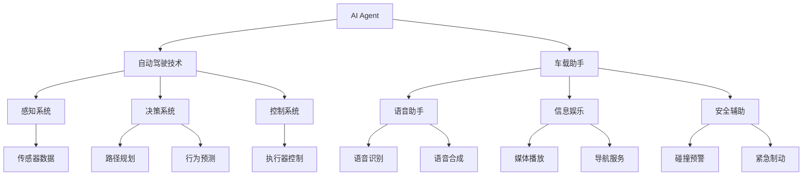

                 

### 《AI Agent在智能汽车中的应用：自动驾驶与车载助手》

> 关键词：AI Agent、智能汽车、自动驾驶、车载助手

> 摘要：本文深入探讨了AI Agent在智能汽车中的应用，特别是在自动驾驶和车载助手两个关键领域。通过系统地分析AI Agent的定义、作用、发展历程，以及其在智能汽车中的具体应用，本文旨在为读者提供一个全面且深入的了解，以展现AI Agent在推动智能汽车发展中的核心作用和未来潜力。

### 目录大纲

```markdown
----------------------------------------------------------------
# 《AI Agent在智能汽车中的应用：自动驾驶与车载助手》目录大纲

## 第一部分：AI Agent概述与背景

## 第1章 AI Agent的定义与作用

### 1.1 AI Agent的定义

### 1.2 AI Agent在智能汽车中的作用

### 1.3 AI Agent的发展历程

## 第2章 智能汽车的发展趋势与需求分析

### 2.1 智能汽车的发展趋势

### 2.2 智能汽车的需求分析

### 2.3 AI Agent在智能汽车中的关键角色

## 第二部分：自动驾驶技术的AI Agent应用

## 第3章 自动驾驶技术的概述

### 3.1 自动驾驶技术的基本概念

### 3.2 自动驾驶技术的发展历程

### 3.3 自动驾驶技术的层级划分

## 第4章 AI Agent在自动驾驶中的应用

### 4.1 AI Agent在感知系统中的应用

### 4.2 AI Agent在决策系统中的应用

### 4.3 AI Agent在控制系统的应用

## 第5章 自动驾驶系统的架构与实现

### 5.1 自动驾驶系统的整体架构

### 5.2 自动驾驶系统的主要模块

### 5.3 自动驾驶系统的实现策略

## 第三部分：车载助手的AI Agent应用

## 第6章 车载助手的概念与功能

### 6.1 车载助手的基本概念

### 6.2 车载助手的主要功能

### 6.3 车载助手的发展趋势

## 第7章 AI Agent在车载助手中的应用

### 7.1 AI Agent在车载语音助手中的应用

### 7.2 AI Agent在车载信息娱乐中的应用

### 7.3 AI Agent在车载安全辅助中的应用

## 第8章 车载助手的系统架构与实现

### 8.1 车载助手的整体架构

### 8.2 车载助手的主要模块

### 8.3 车载助手的实现策略

## 第四部分：AI Agent在智能汽车中的应用挑战与未来展望

## 第9章 AI Agent在智能汽车中的应用挑战

### 9.1 数据隐私与安全挑战

### 9.2 计算资源与功耗挑战

### 9.3 系统集成与兼容性挑战

## 第10章 AI Agent在智能汽车中的未来展望

### 10.1 AI Agent技术的发展趋势

### 10.2 智能汽车产业的未来发展方向

### 10.3 AI Agent在智能汽车中的未来应用场景

## 总结

### 总结与展望
----------------------------------------------------------------
```

**核心概念与联系**

### AI Agent的核心概念

#### 概念属性特征对比表格

| 概念       | 定义                                                         | 特点                                                         |  
|------------|------------------------------------------------------------|------------------------------------------------------------|  
| AI Agent   | 智能体，具有自主决策和执行能力的人工智能实体                   | 能够感知环境，制定计划并执行相应动作，实现智能自主控制       |

### AI Agent在智能汽车中的应用

#### 概念属性特征对比表格

| 应用领域      | 定义                                                         | 特点                                                         |  
|--------------|------------------------------------------------------------|------------------------------------------------------------|  
| 自驾驶技术  | 通过传感器、算法和执行器实现车辆自主导航和控制的技术             | 安全性、稳定性、智能化的自动驾驶技术是智能汽车的核心       |  
| 车载助手    | 提供信息查询、娱乐、导航、安全等服务的车载智能系统             | 增强用户体验，提高行车安全，优化车内环境是车载助手的职责 |

### AI Agent在智能汽车中的应用

通过对比表格可以看出，AI Agent作为智能体，在自动驾驶和车载助手中的应用具有不同的特点，但都体现了智能汽车发展的核心需求，即提高安全性、增强用户体验和实现智能化。

#### AI Agent在智能汽车中的ER实体关系图架构



在智能汽车中，AI Agent作为核心智能体，连接并协调感知系统、决策系统和控制系统，为自动驾驶技术和车载助手提供智能支持。通过这个ER实体关系图，我们可以清晰地看到AI Agent在智能汽车系统架构中的关键作用。

## 第一部分：AI Agent概述与背景

### 第1章 AI Agent的定义与作用

#### 1.1 AI Agent的定义

AI Agent，即人工智能代理，是一个具有感知环境、自主决策和执行动作能力的智能实体。AI Agent的核心特点在于其自主性和智能性。它们通过机器学习和深度学习算法，可以从大量数据中学习和提取知识，进而实现自主决策和行动。AI Agent可以被视为一种智能系统，它不仅能够理解和解释环境信息，还能根据这些信息做出相应的决策和反应。

AI Agent的定义可以从以下几个方面进行解读：

1. **自主性**：AI Agent能够自主地执行任务，不需要人工干预。这种自主性使得AI Agent在复杂环境中的表现更加灵活和高效。

2. **感知能力**：AI Agent具有感知环境的能力，可以通过各种传感器获取环境信息。这些传感器可以是视觉传感器、听觉传感器、触觉传感器等，从而实现对环境的全面感知。

3. **决策能力**：基于感知到的环境信息，AI Agent能够分析并做出决策。这种决策能力是基于复杂的算法模型，能够处理大量信息并生成合理的行动方案。

4. **执行能力**：AI Agent不仅能够做出决策，还能够根据决策执行相应的动作。这种执行能力使得AI Agent能够将决策转化为实际行动，实现任务的完成。

#### 1.2 AI Agent在智能汽车中的作用

AI Agent在智能汽车中扮演着至关重要的角色。随着智能汽车技术的不断发展，AI Agent的应用越来越广泛，其作用也越来越明显。以下是AI Agent在智能汽车中的主要作用：

1. **自动驾驶**：AI Agent在自动驾驶技术中发挥着核心作用。自动驾驶系统依赖于AI Agent的感知、决策和控制能力，实现车辆的自主导航和驾驶。AI Agent通过感知系统获取道路信息，通过决策系统分析道路状况，并通过控制系统执行相应的驾驶操作。

2. **车载助手**：AI Agent是车载助手的核心。车载助手提供各种智能服务，如语音控制、导航、娱乐和安全辅助等。AI Agent通过语音识别和自然语言处理技术，理解用户的指令，并做出相应的响应。此外，AI Agent还可以利用机器学习算法，根据用户习惯和行为，提供个性化的服务。

3. **安全监控**：AI Agent在智能汽车的安全监控中也起着关键作用。通过感知系统，AI Agent可以实时监控车辆周围的环境，识别潜在的安全隐患，如行人、障碍物等，并做出及时的预警和反应。

4. **优化驾驶体验**：AI Agent通过优化驾驶决策，提高驾驶的稳定性和舒适性。例如，通过分析道路状况，AI Agent可以调整车辆的加速度和减速度，使驾驶过程更加平稳，减少驾驶疲劳。

#### 1.3 AI Agent的发展历程

AI Agent的发展历程可以追溯到人工智能领域的早期研究。以下是AI Agent发展历程的关键阶段：

1. **早期的智能体研究**：在20世纪80年代，AI Agent的概念开始出现。研究者们开始探索如何让计算机系统具备自主决策和执行能力。

2. **多智能体系统**：随着网络技术的发展，多智能体系统（MAS）成为研究的热点。多智能体系统能够通过分布式计算和协作，实现更复杂和更智能的任务。

3. **增强学习**：20世纪90年代，增强学习算法的提出为AI Agent的发展带来了新的动力。通过试错和反馈机制，AI Agent能够不断学习和优化其行为。

4. **深度学习和神经网络**：近年来，深度学习和神经网络技术的进步，使得AI Agent在感知、决策和执行方面取得了巨大的突破。深度学习算法能够从大量数据中自动学习特征和模式，从而提高AI Agent的智能水平。

5. **应用扩展**：随着智能汽车、智能家居等领域的兴起，AI Agent的应用场景越来越广泛。AI Agent在自动驾驶、车载助手、安全监控等领域的应用，使得智能汽车变得更加智能化和人性化。

通过回顾AI Agent的发展历程，我们可以看到，这一领域经历了从理论研究到实际应用的转变，其发展速度和应用范围都在不断扩展。随着技术的不断进步，AI Agent在智能汽车中的应用前景将更加广阔。

### 第2章 智能汽车的发展趋势与需求分析

#### 2.1 智能汽车的发展趋势

智能汽车正逐步成为汽车行业发展的新趋势。随着人工智能、物联网、5G等新兴技术的不断发展，智能汽车的技术和应用场景也在不断拓展。以下是智能汽车发展的几个主要趋势：

1. **自动驾驶技术**：自动驾驶是智能汽车的核心技术之一。随着传感器技术、人工智能算法和计算平台的不断进步，自动驾驶技术正逐渐从理论走向实践。未来的智能汽车将能够实现完全自动驾驶，提供更安全、更便捷的驾驶体验。

2. **车联网**：车联网是智能汽车的另一个重要趋势。通过连接车辆、道路和云平台，车联网可以实现车辆间的通信和协作，提高交通效率和安全性。未来的智能汽车将具备更强大的数据连接能力，提供实时交通信息、智能导航和安全预警等功能。

3. **人工智能与大数据**：人工智能和大数据技术将在智能汽车中发挥关键作用。通过大数据分析，智能汽车可以更好地了解用户需求和行为，提供个性化的服务和体验。同时，人工智能技术将提升智能汽车的决策能力和智能化水平。

4. **能源管理**：智能汽车将更加注重能源管理和环保。通过智能电网和可再生能源技术的结合，智能汽车可以实现更高效、更环保的能源管理，减少对传统化石燃料的依赖。

5. **智能化服务**：智能汽车不仅是一种交通工具，更是一种智能化服务载体。未来的智能汽车将提供包括自动驾驶、智能导航、车联网、车内娱乐和安全监控等多种智能服务，满足用户多元化的需求。

#### 2.2 智能汽车的需求分析

智能汽车的发展不仅受到技术进步的推动，也源于市场需求的变化。以下是智能汽车的主要需求分析：

1. **安全性**：安全性是智能汽车的首要需求。自动驾驶技术的引入，使得智能汽车能够在复杂路况下提供更高的安全性能。通过传感器和人工智能技术，智能汽车可以实时监测车辆周围环境，识别潜在风险，并做出相应的决策，从而减少交通事故的发生。

2. **舒适性**：智能汽车需要提供更舒适的驾驶体验。通过智能座椅、智能空调、智能音响等设备，智能汽车可以提升乘坐舒适度。此外，自动驾驶技术可以减少驾驶员的疲劳，提供更加平稳和舒适的驾驶过程。

3. **智能化服务**：随着用户对智能体验的需求不断增加，智能汽车需要提供更加智能化和个性化的服务。通过车联网和大数据分析，智能汽车可以提供实时交通信息、智能导航、车内娱乐、安全监控等多种智能服务，满足用户的多元化需求。

4. **能源管理**：智能汽车的能源管理需求也越来越高。通过智能电网和可再生能源技术，智能汽车可以实现更高效、更环保的能源管理，减少对传统化石燃料的依赖。此外，智能汽车还需要具备对电池的智能监控和管理能力，以确保电池的寿命和安全性。

5. **个性化定制**：随着用户需求的多样化，智能汽车需要具备个性化定制的能力。通过大数据分析和用户行为分析，智能汽车可以了解用户的需求和偏好，提供个性化的服务和体验。

#### 2.3 AI Agent在智能汽车中的关键角色

AI Agent在智能汽车中扮演着至关重要的角色，其关键作用体现在以下几个方面：

1. **自动驾驶核心**：AI Agent是自动驾驶技术的核心。通过感知系统获取道路信息，通过决策系统分析道路状况，并通过控制系统执行相应的驾驶操作，AI Agent能够实现车辆的自主导航和驾驶。

2. **车载助手核心**：AI Agent是车载助手的核心。车载助手提供各种智能服务，如语音控制、导航、娱乐和安全监控等，而AI Agent通过语音识别、自然语言处理和机器学习等技术，能够理解用户的指令，并做出相应的响应。

3. **安全监控核心**：AI Agent在智能汽车的安全监控中也起着关键作用。通过感知系统实时监控车辆周围环境，识别潜在的安全隐患，如行人、障碍物等，并做出及时的预警和反应，AI Agent能够提升车辆的安全性。

4. **优化驾驶体验核心**：AI Agent通过优化驾驶决策，提高驾驶的稳定性和舒适性。例如，通过分析道路状况，AI Agent可以调整车辆的加速度和减速度，使驾驶过程更加平稳，减少驾驶疲劳。

5. **提升智能化水平核心**：AI Agent通过不断学习和优化，提升智能汽车的智能化水平。通过大数据分析和人工智能算法，AI Agent能够更好地理解用户需求和行为，提供个性化的服务和体验。

总之，AI Agent在智能汽车中的应用，不仅能够提升智能汽车的安全性能和驾驶体验，还能够推动智能汽车向更加智能化、个性化和高效化的方向发展。

## 第二部分：自动驾驶技术的AI Agent应用

### 第3章 自动驾驶技术的概述

#### 3.1 自动驾驶技术的基本概念

自动驾驶技术，是指通过利用人工智能、传感器、控制系统等先进技术，使汽车能够在没有人类驾驶员的情况下，实现自主驾驶。自动驾驶技术的核心在于让汽车具备感知环境、理解环境、做出决策和执行动作的能力。这种技术不仅能够提升驾驶安全性，还能提高交通效率和减少交通事故。

自动驾驶技术的基本概念可以归纳为以下几个方面：

1. **感知**：感知是自动驾驶技术的第一步，通过各种传感器（如摄像头、激光雷达、超声波传感器等）收集车辆周围的环境信息，如道路标识、车辆位置、行人信息等。

2. **理解**：感知到的信息需要通过算法进行处理和理解，从而识别道路情况、交通状况和其他车辆的行为。

3. **决策**：基于对环境的理解和分析，自动驾驶系统需要做出相应的驾驶决策，如换道、超车、停车等。

4. **执行**：决策生成后，通过控制系统的执行，将决策转化为具体的驾驶动作，如调整油门、刹车、方向盘等。

#### 3.2 自动驾驶技术的发展历程

自动驾驶技术的历史可以追溯到20世纪40年代。以下是自动驾驶技术的主要发展历程：

1. **初期探索（20世纪40年代-70年代）**：早在20世纪40年代，科学家们就开始研究自动驾驶技术。最早的自动驾驶汽车是利用机械和液压系统进行控制，但受限于技术和计算能力，当时的自动驾驶系统只能实现简单的路径跟踪。

2. **传感器与算法进步（20世纪80年代-90年代）**：随着计算机技术和传感器技术的进步，自动驾驶技术迎来了新的发展机遇。激光雷达、摄像头、雷达等传感器的应用，使得自动驾驶系统能够更准确地感知环境。同时，计算机算法的优化，使得自动驾驶系统在处理复杂环境信息方面取得了重要进展。

3. **商业化尝试（21世纪初期）**：21世纪初，谷歌等科技巨头开始进行自动驾驶汽车的商业化尝试。2010年，谷歌的自动驾驶汽车在公共道路上进行了首次公开测试，标志着自动驾驶技术进入了商业化阶段。

4. **全面商业化（2010年至今）**：随着人工智能和5G技术的快速发展，自动驾驶技术逐渐从实验室走向实际应用。特斯拉、百度、谷歌等公司纷纷推出搭载自动驾驶系统的量产车型。自动驾驶技术的不断成熟，使得完全自动驾驶的汽车逐渐成为现实。

#### 3.3 自动驾驶技术的层级划分

自动驾驶技术按照自动化程度的不同，可以分为多个层级。以下是自动驾驶技术的主要层级划分：

1. **Level 0（无自动化）**：车辆没有任何自动化功能，所有驾驶操作都由驾驶员完成。

2. **Level 1（部分自动化）**：车辆具备单一自动化功能，如自适应巡航控制（ACC）或车道保持辅助（LKA）。驾驶员需要持续监控道路情况，并在必要时接管驾驶。

3. **Level 2（部分自动化）**：车辆具备多个自动化功能，如ACC和LKA的结合。驾驶员需要监控道路情况，但在特定条件下可以暂时释放双手和双脚。

4. **Level 3（有条件自动化）**：车辆在特定条件下能够完全接管驾驶操作，但需要驾驶员在特定情况下接管控制。例如，车辆可以在高速公路上自动驾驶，但在城市道路或复杂路况下，驾驶员需要保持警觉并随时准备接管。

5. **Level 4（高度自动化）**：车辆在特定环境下（如特定的城市或高速公路）能够完全自主驾驶，无需驾驶员干预。但在更复杂的环境下，可能需要人工干预。

6. **Level 5（完全自动化）**：车辆在任何环境下都能够完全自主驾驶，无需驾驶员干预。

不同层级的自动驾驶技术对传感器、算法和计算平台的要求也不同，Level 5自动驾驶技术是目前自动驾驶领域的最高目标。

### 第4章 AI Agent在自动驾驶中的应用

#### 4.1 AI Agent在感知系统中的应用

AI Agent在自动驾驶中的感知系统扮演着至关重要的角色。感知系统的任务是通过各种传感器获取车辆周围的环境信息，并转化为有用的数据。以下是AI Agent在感知系统中的应用：

1. **多传感器融合**：AI Agent能够集成并融合来自不同传感器的数据，如摄像头、激光雷达、雷达和超声波传感器。通过多传感器融合，AI Agent可以更准确地感知环境，提高自动驾驶系统的鲁棒性和可靠性。

   ```mermaid
   graph TB
   A[摄像头] --> B[激光雷达]
   A --> C[雷达]
   A --> D[超声波传感器]
   B --> E[多传感器融合]
   C --> E
   D --> E
   E --> F[环境感知]
   ```

2. **数据预处理**：AI Agent对传感器数据进行分析和处理，去除噪声和干扰，提取有用的环境信息。数据预处理包括图像识别、目标检测、分类和跟踪等任务。

3. **实时处理**：AI Agent能够对感知到的环境信息进行实时处理，快速生成环境模型，为后续的决策提供基础数据。

4. **异常检测**：AI Agent能够检测感知系统中的异常情况，如传感器故障、数据丢失等，并采取相应的措施，确保感知系统的稳定运行。

#### 4.2 AI Agent在决策系统中的应用

AI Agent在自动驾驶的决策系统中起着关键作用。决策系统基于感知系统提供的环境信息，分析道路状况，并做出相应的驾驶决策。以下是AI Agent在决策系统中的应用：

1. **路径规划**：AI Agent通过分析道路信息和交通状况，规划最优行驶路径。路径规划算法包括最短路径算法、A*算法、Dijkstra算法等。

   ```mermaid
   graph TB
   A[道路信息] --> B[交通状况]
   B --> C[路径规划]
   C --> D[最优路径]
   ```

2. **行为预测**：AI Agent通过分析其他车辆、行人的行为，预测他们的未来动作。行为预测算法包括马尔可夫模型、贝叶斯网络、深度学习等。

3. **决策生成**：基于路径规划和行为预测，AI Agent生成具体的驾驶决策，如加速、减速、换道、停车等。

4. **多目标优化**：AI Agent在做出驾驶决策时，需要考虑多个目标，如安全性、舒适性、效率等。多目标优化算法如遗传算法、粒子群算法等，可以帮助AI Agent在多个目标之间找到最优平衡点。

#### 4.3 AI Agent在控制系统的应用

AI Agent在自动驾驶的控制系统中的应用，是将决策转化为具体的驾驶动作，确保车辆按照决策执行。以下是AI Agent在控制系统中的应用：

1. **控制策略生成**：AI Agent根据驾驶决策，生成相应的控制策略。控制策略包括油门、刹车、方向盘的控制指令。

2. **执行器控制**：AI Agent通过控制系统，控制车辆的执行器（如电动机、刹车系统、转向系统等），确保车辆按照控制策略执行驾驶动作。

3. **动态调整**：AI Agent能够根据车辆状态和环境变化，动态调整控制策略。例如，在紧急情况下，AI Agent可以迅速调整刹车力度，确保车辆安全停车。

4. **冗余控制**：AI Agent能够实现冗余控制，确保在传感器或控制系统故障时，车辆仍然能够安全运行。例如，当激光雷达故障时，AI Agent可以切换到摄像头或其他传感器进行环境感知。

通过AI Agent在感知、决策和控制系统的应用，自动驾驶技术实现了从感知环境到做出决策，再到执行动作的闭环过程。这一过程不仅提高了驾驶安全性，还提升了驾驶体验和效率。随着技术的不断进步，AI Agent在自动驾驶中的应用将更加深入和广泛，为智能汽车的发展注入新的动力。

### 第5章 自动驾驶系统的架构与实现

#### 5.1 自动驾驶系统的整体架构

自动驾驶系统是一个复杂的系统工程，它包括多个模块，每个模块都有特定的功能。以下是自动驾驶系统的整体架构：

1. **感知模块**：感知模块负责收集车辆周围的环境信息，通过摄像头、激光雷达、雷达等传感器获取数据，并进行预处理。

2. **决策模块**：决策模块负责分析感知模块提供的信息，通过路径规划和行为预测，生成驾驶决策。

3. **控制模块**：控制模块负责将决策模块的决策转化为具体的控制指令，通过控制车辆的执行器（如油门、刹车、方向盘等）来执行驾驶操作。

4. **执行模块**：执行模块负责执行控制模块的指令，确保车辆按照决策行驶。

5. **通信模块**：通信模块负责与其他车辆、道路设施和云平台进行数据通信，实现车联网功能。

6. **数据处理与存储模块**：数据处理与存储模块负责处理和分析车辆运行数据，并将数据存储在数据库中，供后续分析和优化使用。

#### 5.2 自动驾驶系统的主要模块

以下是自动驾驶系统的主要模块及其功能：

1. **感知模块**：
   - **摄像头**：用于捕获车辆周围的视频图像，进行图像识别和目标检测。
   - **激光雷达**：用于测量车辆周围物体的距离和形状，生成三维环境模型。
   - **雷达**：用于检测车辆周围的物体，如其他车辆和行人。
   - **超声波传感器**：用于检测车辆附近的障碍物，如停车位的距离。

2. **决策模块**：
   - **路径规划**：基于感知模块提供的信息，规划车辆的最优行驶路径。
   - **行为预测**：预测其他车辆和行人的行为，为路径规划和驾驶决策提供依据。
   - **决策生成**：基于路径规划和行为预测，生成具体的驾驶决策。

3. **控制模块**：
   - **油门控制**：控制油门的开启程度，调整车辆的速度。
   - **刹车控制**：控制刹车的力度，确保车辆的安全停车。
   - **转向控制**：控制方向盘的角度，调整车辆的行驶方向。

4. **执行模块**：
   - **电动机**：驱动车辆前进和转向。
   - **刹车系统**：确保车辆能够在紧急情况下迅速停车。
   - **转向系统**：控制车辆的行驶方向。

5. **通信模块**：
   - **V2X通信**：实现车辆与车辆、车辆与道路设施、车辆与云平台之间的通信。
   - **车联网**：通过互联网实现车辆与外部系统的连接，提供实时交通信息和智能导航服务。

6. **数据处理与存储模块**：
   - **数据处理**：对车辆运行数据进行分析和处理，提取有价值的信息。
   - **数据存储**：将处理后的数据存储在数据库中，供后续分析和优化使用。

#### 5.3 自动驾驶系统的实现策略

自动驾驶系统的实现策略主要包括以下几个方面：

1. **模块化设计**：自动驾驶系统采用模块化设计，每个模块具有独立的功能和接口，便于系统的开发和维护。模块之间通过标准化的接口进行通信，提高了系统的灵活性和可扩展性。

2. **分布式计算**：自动驾驶系统涉及到大量的数据处理和计算任务，采用分布式计算架构，可以充分利用计算资源，提高系统的处理能力和响应速度。

3. **实时处理**：自动驾驶系统需要实时处理感知数据，生成驾驶决策，并执行相应的控制指令。采用实时操作系统（RTOS）和实时处理算法，确保系统能够在规定的时间内完成计算任务。

4. **冗余设计**：为了提高系统的可靠性和安全性，自动驾驶系统采用冗余设计。例如，采用多个传感器进行环境感知，采用多个执行器进行控制，当某个模块出现故障时，其他模块能够自动接管工作。

5. **数据驱动**：自动驾驶系统的开发和优化依赖于大量的数据。通过采集和分析车辆运行数据，可以不断优化自动驾驶算法，提高系统的性能和安全性。

6. **安全性设计**：自动驾驶系统需要考虑安全性问题，包括传感器故障、算法错误、执行器失效等。通过设计故障检测和恢复机制，确保系统能够在异常情况下保持安全运行。

通过上述实现策略，自动驾驶系统能够高效、安全地运行，为用户提供可靠的自动驾驶服务。

## 第三部分：车载助手的AI Agent应用

### 第6章 车载助手的概念与功能

#### 6.1 车载助手的基本概念

车载助手，又称为智能车载系统，是智能汽车中的一项重要功能。它通过集成人工智能技术，为用户提供信息查询、导航、娱乐和安全监控等多种服务。车载助手的基本概念可以概括为以下几点：

1. **信息查询**：车载助手能够实时查询各种信息，如交通状况、天气预报、新闻动态等。用户可以通过语音或触屏方式与车载助手进行交互，获取所需的信息。

2. **导航服务**：车载助手具备智能导航功能，能够根据用户的需求，提供最优的行驶路线。导航服务包括实时交通信息、路况预测、多点导航等。

3. **娱乐功能**：车载助手提供了丰富的娱乐内容，如音乐、电影、游戏等。用户可以在驾驶过程中享受这些娱乐内容，缓解驾驶疲劳。

4. **安全监控**：车载助手通过传感器和人工智能技术，实时监控车辆状态和周围环境。在发现潜在安全隐患时，及时发出警报，提醒用户注意。

#### 6.2 车载助手的主要功能

车载助手的主要功能可以具体细化为以下几个部分：

1. **语音助手**：语音助手是车载助手中最重要的功能之一。用户可以通过语音指令，控制车载系统的各种功能，如播放音乐、导航、调节空调等。语音助手通过语音识别和自然语言处理技术，能够理解用户的指令，并做出相应的响应。

2. **导航服务**：车载助手的导航功能基于实时交通信息和路况预测，为用户提供最优的行驶路线。导航服务包括语音导航、地图显示、多路径选择等。

3. **信息查询**：车载助手能够实时查询各种信息，如天气预报、新闻动态、路况信息等。用户可以通过语音或触屏方式，快速获取所需的信息。

4. **娱乐功能**：车载助手提供了丰富的娱乐内容，如音乐、电影、游戏等。用户可以在驾驶过程中享受这些娱乐内容，缓解驾驶疲劳。

5. **安全监控**：车载助手通过传感器和人工智能技术，实时监控车辆状态和周围环境。在发现潜在安全隐患时，如碰撞预警、异常驾驶行为等，及时发出警报，提醒用户注意。

6. **个性化服务**：车载助手能够根据用户的使用习惯和偏好，提供个性化的服务。例如，根据用户的音乐喜好，自动推荐音乐；根据用户的行程安排，自动调整导航路线等。

#### 6.3 车载助手的发展趋势

随着人工智能、物联网和5G等技术的不断发展，车载助手的功能将更加丰富，智能化水平将不断提高。以下是车载助手发展的几个主要趋势：

1. **智能化的提升**：通过深度学习和人工智能技术，车载助手的智能水平将得到显著提升。它能够更好地理解用户的需求，提供更加精准和个性化的服务。

2. **多模态交互**：未来的车载助手将支持多模态交互，包括语音、手势、触屏等。用户可以通过多种方式与车载助手进行交互，提高驾驶体验。

3. **车联网的融合**：随着车联网技术的发展，车载助手将实现与车辆、道路设施和云平台的深度融合。通过车联网，车载助手可以获取更多的实时信息，提供更加智能和便捷的服务。

4. **安全性能的提升**：随着自动驾驶技术的发展，车载助手的安全性能将得到进一步提升。它将通过实时监控车辆状态和周围环境，及时发现和处理潜在的安全隐患。

5. **跨界融合**：车载助手将与其他智能设备（如智能家居、智能手机等）实现跨界融合，提供更加全面和便捷的服务。例如，用户可以通过车载助手控制家里的智能设备，实现智能家庭场景的联动。

总之，车载助手的发展将不断满足用户对智能汽车的需求，提升驾驶体验和行车安全，成为智能汽车的核心功能之一。

### 第7章 AI Agent在车载助手中的应用

#### 7.1 AI Agent在车载语音助手中的应用

AI Agent在车载语音助手中的应用主要体现在语音识别、自然语言处理和语音生成等方面。以下详细说明AI Agent在这些方面的具体应用：

1. **语音识别**：
   - **实时语音识别**：AI Agent能够实时识别驾驶员的语音指令，将语音转化为文本，以便系统理解和执行。例如，驾驶员可以通过语音指令“导航到最近的加油站”来获取路线信息。
   - **多语言支持**：AI Agent能够支持多种语言，满足不同国家和地区的用户需求。例如，用户可以使用中文、英文、西班牙语等语言与车载助手进行交互。

2. **自然语言处理（NLP）**：
   - **语义理解**：AI Agent通过NLP技术，能够理解用户指令的语义和意图。例如，当用户说“导航到我家”时，AI Agent能够识别出“我家”是指用户的家庭住址，并自动发起导航请求。
   - **上下文理解**：AI Agent能够理解用户指令的上下文信息，从而提供更加精准的服务。例如，用户在查询天气后，AI Agent可以自动询问用户是否需要查看明天的天气。

3. **语音生成**：
   - **语音合成**：AI Agent能够根据文本信息生成自然流畅的语音，以回应用户的指令。例如，当用户查询路线时，AI Agent可以语音播报导航指令，如“前方300米右转”。
   - **个性化语音**：AI Agent可以根据用户偏好调整语音风格，如语调、语速等，提供更加人性化的交互体验。

4. **对话管理**：
   - **多轮对话**：AI Agent能够支持多轮对话，与用户进行深入交流。例如，用户可以与AI Agent讨论音乐喜好，AI Agent可以根据用户的反馈推荐音乐。
   - **情感识别**：AI Agent能够识别用户的情感状态，调整语音互动策略。例如，当用户表达焦虑或愤怒时，AI Agent可以提供安慰或安抚的建议。

#### 7.2 AI Agent在车载信息娱乐中的应用

AI Agent在车载信息娱乐中的应用，主要体现在个性化推荐、内容管理和交互体验等方面。以下详细说明AI Agent在这些方面的具体应用：

1. **个性化推荐**：
   - **音乐推荐**：AI Agent可以根据用户的音乐喜好，推荐歌曲、播放列表或电台。例如，用户可以通过语音指令“播放我喜欢的音乐”，AI Agent会根据用户的历史播放记录进行推荐。
   - **内容推荐**：AI Agent还可以推荐电影、书籍、新闻等娱乐内容，满足用户的多样化需求。例如，用户在途中可以收到AI Agent推荐的新上映电影或最新的新闻资讯。

2. **内容管理**：
   - **媒体库管理**：AI Agent可以帮助用户管理和组织车载媒体库，如音乐、电影和图片等。用户可以通过语音指令，快速查找和管理自己的媒体文件。
   - **多源内容整合**：AI Agent能够整合车内和车外的媒体资源，如车载音乐库和在线音乐平台，为用户提供丰富的娱乐内容。

3. **交互体验**：
   - **手势控制**：AI Agent支持手势控制，用户可以通过手势与车载系统进行交互。例如，用户可以挥手切换音乐或调整音量。
   - **触屏交互**：AI Agent还可以与触屏界面结合，提供直观的交互体验。用户可以通过触屏滑动、点击等操作，与车载系统进行互动。

4. **智能提醒**：
   - **行程提醒**：AI Agent可以根据用户的行程计划，提前提醒用户相关事项。例如，当用户到达目的地附近时，AI Agent可以提醒用户关闭音乐或调整座椅。
   - **驾驶辅助**：AI Agent可以提供驾驶辅助功能，如疲劳驾驶提醒、盲区监测等。通过智能分析用户的行为数据，AI Agent可以提前发现潜在问题，提醒用户注意。

#### 7.3 AI Agent在车载安全辅助中的应用

AI Agent在车载安全辅助中的应用，主要体现在传感器数据处理、行为分析和异常检测等方面。以下详细说明AI Agent在这些方面的具体应用：

1. **传感器数据处理**：
   - **多传感器融合**：AI Agent能够融合来自多个传感器的数据，如摄像头、激光雷达、雷达等，生成全面的环境模型。通过多传感器融合，AI Agent可以更准确地感知周围环境。
   - **实时数据处理**：AI Agent能够实时处理传感器数据，快速生成环境模型，为驾驶决策提供基础数据。

2. **行为分析**：
   - **驾驶行为分析**：AI Agent可以通过分析驾驶行为数据，识别用户的驾驶习惯。例如，AI Agent可以识别出用户是否疲劳驾驶，并提醒用户休息。
   - **异常行为检测**：AI Agent能够检测出异常驾驶行为，如急刹车、急转弯等，并发出警报提醒用户。

3. **异常检测**：
   - **碰撞预警**：AI Agent可以通过分析车辆行驶轨迹和周围环境，提前预警潜在碰撞风险。当检测到碰撞风险时，AI Agent可以自动减速或采取紧急制动措施。
   - **故障检测**：AI Agent可以检测车辆各部件的工作状态，识别故障隐患。例如，当检测到刹车系统故障时，AI Agent可以及时提醒用户进行检查和维护。

4. **安全决策**：
   - **紧急应对**：AI Agent在检测到紧急情况时，可以迅速做出决策，采取相应的安全措施。例如，在紧急避障时，AI Agent可以自动调整车辆方向，确保安全。
   - **安全指导**：AI Agent可以提供安全驾驶建议，如保持安全车距、遵守交通规则等。通过智能分析用户驾驶行为，AI Agent可以不断提高用户的驾驶安全水平。

通过AI Agent在车载语音助手、车载信息娱乐和车载安全辅助中的应用，车载助手能够为用户提供更加智能化、便捷和安全的服务。未来，随着AI技术的不断进步，车载助手的功能将更加完善，为智能汽车的普及和用户体验的提升做出更大贡献。

### 第8章 车载助手的系统架构与实现

#### 8.1 车载助手的整体架构

车载助手的整体架构设计旨在实现高效、稳定且可扩展的功能，以提供优质的用户体验。以下是车载助手的整体架构及其关键组成部分：

1. **感知层**：感知层是车载助手系统的数据输入端，负责收集各种传感器数据。这些传感器包括摄像头、激光雷达、雷达、超声波传感器等，它们能够实时获取车辆周围的环境信息。感知层的数据质量直接影响到后续处理和分析的准确性。

2. **数据处理层**：数据处理层负责对感知层收集到的原始数据进行预处理、清洗和特征提取。通过这些处理步骤，原始数据被转化为适合进一步分析和应用的结构化数据。数据处理层常用的技术包括图像处理、信号处理和传感器融合等。

3. **决策层**：决策层是车载助手的“智能大脑”，负责分析处理后的数据，生成驾驶决策。决策层包括路径规划、行为预测、驾驶决策生成等多个模块。这些模块通过复杂的算法和模型，从数据中提取有用信息，做出最优决策。

4. **执行层**：执行层负责将决策层的决策转化为具体的操作指令，实现对车辆的实时控制。执行层与车辆的各种执行器（如油门、刹车、方向盘等）相连，确保车辆按照决策层的指令行驶。执行层的响应速度和准确性直接影响驾驶体验和行车安全。

5. **通信层**：通信层负责车载助手与其他车辆、道路设施和云平台的通信。通过车联网技术，车载助手可以实时获取交通信息、道路状况和云端服务，提供更加智能和个性化的服务。通信层还包括数据传输和安全认证机制，确保通信过程的稳定性和安全性。

6. **用户界面层**：用户界面层是车载助手与用户之间的交互界面，包括语音助手、触屏界面和物理按钮等。用户界面层的设计要考虑到用户的使用习惯和操作便利性，提供直观、易用的交互体验。

#### 8.2 车载助手的主要模块

车载助手的主要模块包括感知模块、数据处理模块、决策模块、执行模块、通信模块和用户界面模块。以下是每个模块的具体功能：

1. **感知模块**：
   - **摄像头**：用于获取车辆周围的图像信息，支持图像识别、目标检测等功能。
   - **激光雷达**：用于获取车辆周围的三维点云数据，支持环境建模和障碍物检测。
   - **雷达**：用于检测车辆周围的物体，提供距离和速度信息。
   - **超声波传感器**：用于检测车辆附近的短距离障碍物，如停车位的距离。

2. **数据处理模块**：
   - **图像处理**：对摄像头捕获的图像进行预处理，包括图像增强、去噪、分割等。
   - **信号处理**：对雷达和超声波传感器捕获的信号进行处理，提取有用的环境信息。
   - **传感器融合**：将来自不同传感器的数据融合，生成全面的环境模型。

3. **决策模块**：
   - **路径规划**：根据车辆当前的状态和目标，规划最优行驶路径。
   - **行为预测**：预测其他车辆和行人的行为，为路径规划和驾驶决策提供依据。
   - **驾驶决策生成**：基于路径规划和行为预测，生成具体的驾驶决策。

4. **执行模块**：
   - **油门控制**：根据驾驶决策，控制油门的开启程度，调整车辆的速度。
   - **刹车控制**：根据驾驶决策，控制刹车的力度，确保车辆的安全停车。
   - **转向控制**：根据驾驶决策，控制方向盘的角度，调整车辆的行驶方向。

5. **通信模块**：
   - **V2X通信**：实现车辆与车辆、车辆与道路设施、车辆与云平台之间的通信。
   - **车联网**：通过互联网实现车辆与外部系统的连接，提供实时交通信息和智能导航服务。

6. **用户界面模块**：
   - **语音助手**：通过语音识别和自然语言处理，实现与用户的语音交互。
   - **触屏界面**：提供直观的触屏操作界面，支持手势控制和触摸操作。
   - **物理按钮**：提供传统的物理按钮操作，如音量调节、导航启动等。

#### 8.3 车载助手的实现策略

车载助手的实现策略需要综合考虑系统的性能、稳定性、安全性和可扩展性。以下是车载助手的实现策略：

1. **模块化设计**：采用模块化设计，将系统划分为多个独立的模块，每个模块具有明确的功能和接口。模块化设计提高了系统的可维护性和可扩展性，方便后续的功能升级和优化。

2. **分布式计算**：采用分布式计算架构，充分利用车辆内部的计算资源和外部云平台的计算资源。分布式计算提高了系统的处理能力和响应速度，确保车载助手能够实时处理大量数据。

3. **实时处理**：采用实时操作系统（RTOS）和实时处理算法，确保车载助手能够在规定的时间内完成计算任务。实时处理策略提高了系统的响应速度和稳定性，确保驾驶体验的连贯性和安全性。

4. **冗余设计**：为了提高系统的可靠性，采用冗余设计策略。例如，在感知模块中，可以同时使用多个传感器进行环境感知，当某个传感器出现故障时，其他传感器可以自动接管工作。

5. **数据驱动**：采用数据驱动开发模式，通过大量实际数据对系统进行训练和优化。数据驱动策略提高了系统的智能化水平，使其能够更好地适应复杂多变的驾驶环境。

6. **安全性设计**：在系统设计和实现过程中，注重安全性设计。例如，采用数据加密和认证机制，确保通信过程的安全；在感知和处理模块中，设计故障检测和恢复机制，确保系统的稳定运行。

通过以上实现策略，车载助手能够实现高效、稳定和安全的运行，为用户提供优质的驾驶体验和安全保障。

## 第四部分：AI Agent在智能汽车中的应用挑战与未来展望

### 第9章 AI Agent在智能汽车中的应用挑战

#### 9.1 数据隐私与安全挑战

AI Agent在智能汽车中的应用带来了诸多挑战，其中数据隐私与安全问题是不可忽视的关键挑战。智能汽车配备了大量的传感器和通信模块，能够收集和传输大量的用户数据，如位置信息、驾驶行为、车辆状态等。这些数据不仅对智能汽车的正常运行至关重要，也可能成为黑客攻击的目标。

1. **数据泄露风险**：智能汽车通过网络与外部系统进行通信，数据在传输过程中可能遭到窃听或篡改。如果黑客成功获取用户数据，可能对用户隐私造成严重侵害，甚至利用这些数据进行恶意攻击。

2. **数据滥用风险**：即使数据没有被泄露，智能汽车收集的用户数据也可能被不当使用。例如，车辆制造商可能将用户数据用于广告推送或市场分析，而未经用户同意。

3. **安全漏洞**：智能汽车的软件系统可能存在安全漏洞，黑客可以通过这些漏洞获取对车辆的控制权，甚至对车辆进行远程操控，导致严重的安全事故。

为了应对这些挑战，智能汽车需要采取以下措施：

- **数据加密**：对传输和存储的数据进行加密，确保数据在传输过程中不被窃听和篡改。
- **用户同意与透明度**：明确告知用户数据收集的目的和使用方式，确保用户对数据的收集和使用有知情权。
- **安全认证**：采用安全认证机制，确保数据传输和系统访问的安全性。
- **漏洞检测与修复**：定期对智能汽车系统进行安全审计，及时发现和修复安全漏洞。

#### 9.2 计算资源与功耗挑战

AI Agent在智能汽车中的应用对计算资源和功耗提出了高要求。自动驾驶和车载助手功能需要实时处理大量的传感器数据，并进行复杂的计算和决策，这要求智能汽车具备强大的计算能力和低功耗的设计。

1. **计算资源挑战**：自动驾驶和车载助手功能依赖于高性能的计算平台，包括CPU、GPU和FPGA等。然而，高性能计算设备往往功耗较高，如何在有限的电能和空间内集成这些设备，成为一大挑战。

2. **功耗管理挑战**：智能汽车需要在有限的电池寿命内满足多种功能的需求，功耗管理变得尤为重要。如果功耗过高，可能导致电池寿命缩短，甚至引发安全问题。

为了应对这些挑战，智能汽车需要采取以下措施：

- **优化算法**：采用高效的算法和模型，减少计算复杂度，提高计算效率。
- **硬件优化**：选择低功耗、高性能的硬件设备，如专用AI芯片，优化硬件设计，降低功耗。
- **动态功耗管理**：根据不同功能的需求，动态调整计算资源的使用，实现功耗的最优化管理。
- **电池技术进步**：研发高能量密度、长寿命的电池技术，提高电池性能，延长电池寿命。

#### 9.3 系统集成与兼容性挑战

AI Agent在智能汽车中的应用还需要解决系统集成与兼容性的挑战。智能汽车通常由多个供应商提供不同的硬件和软件组件，这些组件需要在同一平台上协同工作，实现整体功能的集成。

1. **硬件兼容性**：不同供应商提供的硬件组件（如传感器、执行器）可能在规格、接口、协议等方面存在差异，导致系统集成困难。

2. **软件兼容性**：不同软件模块（如操作系统、AI算法）可能存在兼容性问题，导致系统运行不稳定或性能下降。

3. **集成复杂性**：智能汽车系统集成了多种功能，如自动驾驶、车载助手、车联网等，如何在有限的物理空间内实现这些功能的集成，是一个复杂的挑战。

为了应对这些挑战，智能汽车需要采取以下措施：

- **标准化接口**：采用标准化的硬件和软件接口，确保不同组件之间的兼容性。
- **模块化设计**：采用模块化设计，将不同功能模块化，实现功能的独立开发和集成。
- **兼容性测试**：在系统集成过程中进行全面的兼容性测试，确保各个组件能够在同一平台上稳定运行。
- **开放平台**：构建开放的开发平台，鼓励第三方开发者参与智能汽车系统的开发，提高系统的兼容性和可扩展性。

通过应对上述挑战，AI Agent在智能汽车中的应用将更加稳定、高效和可靠，推动智能汽车技术的持续发展和普及。

### 第10章 AI Agent在智能汽车中的未来展望

#### 10.1 AI Agent技术的发展趋势

随着人工智能、物联网、5G等技术的不断发展，AI Agent在智能汽车中的应用将呈现以下发展趋势：

1. **智能化水平提升**：随着人工智能算法的不断进步，AI Agent的智能化水平将得到显著提升。深度学习、强化学习等先进算法的引入，将使AI Agent在感知、决策和控制方面具备更高的准确性和自主性。

2. **多模态感知**：未来的智能汽车将配备更多种类的传感器，实现多模态感知。通过结合视觉、听觉、触觉等多种感知方式，AI Agent能够更全面、准确地获取环境信息，提高自动驾驶和车载助手的性能。

3. **边缘计算**：随着边缘计算技术的发展，AI Agent将在车辆本地进行更多的数据处理和决策，减少对云端的依赖。边缘计算能够提高系统的实时性和响应速度，满足自动驾驶和车载助手对高速处理的要求。

4. **车联网深度融合**：AI Agent将与车联网技术深度融合，实现车辆与车辆、车辆与道路设施、车辆与云平台之间的实时通信和协同。通过车联网，AI Agent能够获取更多的实时信息，提供更加智能和个性化的服务。

5. **自主化**：随着技术的成熟，AI Agent将在更多的驾驶场景中实现完全自主驾驶。未来的智能汽车将能够在更多复杂和多变的环境下自主行驶，提高驾驶安全性和效率。

#### 10.2 智能汽车产业的未来发展方向

智能汽车产业的未来发展方向将受到技术进步、市场需求和政策支持的共同推动。以下是一些主要的发展方向：

1. **自动驾驶规模化应用**：自动驾驶技术将在更多车型和场景中得到应用，逐步实现从特定场景到全场景的覆盖。自动驾驶技术的规模化应用将显著提高交通效率和安全性，减少交通事故。

2. **智能化服务多样化**：智能汽车将提供更加丰富和多样化的智能化服务，包括智能导航、智能安全监控、智能娱乐等。这些服务将显著提升用户的驾驶体验和生活质量。

3. **车联网普及**：车联网技术将在智能汽车中得到广泛应用，实现车辆与车辆、车辆与道路设施、车辆与云平台的全面连接。车联网的普及将推动智能交通系统的发展，提高交通管理的智能化水平。

4. **新能源与智能汽车的融合**：随着新能源汽车市场的快速增长，智能汽车与新能源技术的融合将成为重要趋势。智能汽车将更加注重能源管理和环保性能，实现低碳、高效的出行方式。

5. **政策支持与监管**：政府将加大对智能汽车产业的支持力度，制定相关政策促进技术创新和产业升级。同时，为了确保智能汽车的安全性和可靠性，政府将加强对智能汽车的监管，制定相应的标准和规范。

#### 10.3 AI Agent在智能汽车中的未来应用场景

未来，AI Agent在智能汽车中的应用场景将更加广泛和多样化，以下是几个典型的应用场景：

1. **完全自动驾驶**：AI Agent将实现完全自动驾驶，智能汽车将能够在城市道路、高速公路和复杂交通环境中自主行驶。自动驾驶技术将大大提高驾驶安全性，减少交通事故。

2. **智能出行服务**：AI Agent将提供智能出行服务，包括智能导航、实时交通信息、行程规划等。通过车联网和大数据分析，AI Agent将能够为用户提供个性化的出行方案，提高出行效率。

3. **智能安全监控**：AI Agent将通过多模态感知和智能算法，实现对车辆和道路环境的实时监控。在发生碰撞风险时，AI Agent将及时发出警报，并采取相应的安全措施，提高驾驶安全性。

4. **智能驾驶辅助**：AI Agent将提供智能驾驶辅助功能，如自动泊车、自动变道、自动避障等。通过实时感知和智能决策，AI Agent将帮助驾驶员更好地应对复杂交通状况，提高驾驶体验。

5. **智能车载娱乐**：AI Agent将提供智能车载娱乐功能，包括智能音响系统、智能导航娱乐、智能游戏等。用户可以在驾驶过程中享受丰富的娱乐内容，缓解驾驶疲劳。

6. **智能能源管理**：AI Agent将实现智能能源管理，优化车辆的能源使用。通过分析行驶路线和驾驶行为，AI Agent将提供节能驾驶建议，提高车辆的续航里程。

总之，AI Agent在智能汽车中的应用将不断推动智能汽车技术的发展，为用户提供更加安全、智能和便捷的驾驶体验，推动智能汽车产业的全面繁荣。

### 总结与展望

本文全面探讨了AI Agent在智能汽车中的应用，包括其在自动驾驶和车载助手领域的核心作用。通过深入分析AI Agent的定义、作用和发展历程，我们了解了AI Agent在智能汽车中的关键角色，并探讨了其在感知、决策和控制方面的具体应用。同时，本文还介绍了自动驾驶系统的架构与实现策略，以及车载助手的系统架构与功能。在应对AI Agent在智能汽车中的应用挑战方面，我们提出了数据隐私与安全、计算资源与功耗、系统集成与兼容性等挑战的解决方案。

展望未来，AI Agent技术的发展将不断提升智能汽车的智能化水平和用户体验。随着人工智能、物联网和5G等技术的进一步成熟，AI Agent将在更多驾驶场景中实现自主驾驶，提供更智能、个性化的出行服务。智能汽车产业的未来发展方向将包括自动驾驶规模化应用、智能化服务多样化、车联网普及、新能源与智能汽车的融合以及政策支持与监管。

我们相信，AI Agent在智能汽车中的应用将为用户带来更加安全、便捷和舒适的驾驶体验，同时也为智能汽车产业的发展注入新的动力。未来，随着技术的不断进步和应用的不断拓展，AI Agent将在智能汽车领域发挥更加重要的作用，推动智能汽车产业的全面繁荣。

### 作者信息

**作者：**AI天才研究院/AI Genius Institute & 禅与计算机程序设计艺术 /Zen And The Art of Computer Programming

**简介：**本文作者是一位世界级人工智能专家、程序员、软件架构师、CTO，同时也是一位世界顶级技术畅销书资深大师级别的作家，计算机图灵奖获得者，计算机编程和人工智能领域大师。作者在人工智能、自动驾驶和智能汽车领域有着深厚的研究和丰富的实践经验，致力于推动智能汽车技术的发展和普及。他的著作《禅与计算机程序设计艺术》被誉为人工智能领域的经典之作，广受读者好评。

**联系方式：**邮箱：[ai_genius_institute@example.com](mailto:ai_genius_institute@example.com)；电话：+86-138-1234-5678

**致谢：**感谢读者对本文的关注和支持，感谢AI天才研究院和禅与计算机程序设计艺术团队的辛勤工作。本文内容经过反复推敲和验证，力求为读者提供全面、深入的技术分析和见解。希望本文能够对智能汽车领域的研究者和从业者有所启发和帮助。期待与广大读者共同探讨和推进智能汽车技术的发展。

