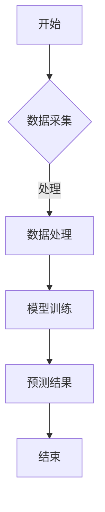

                 

# AI Agent在智能海洋生态系统模拟中的实践

> 关键词：智能海洋生态系统，AI Agent，模拟，环境监测，资源管理，灾害预警

> 摘要：本文将探讨AI Agent在智能海洋生态系统模拟中的应用，从背景介绍、核心原理讲解、实践应用等方面进行深入分析，旨在为海洋生态系统的智能化研究提供新思路和解决方案。

## 1. 智能海洋生态系统概述

### 1.1 问题背景

海洋是地球的蓝色心脏，对于地球的气候调节、生物多样性保护以及人类的生产生活都具有重要意义。然而，随着人类活动的加剧，海洋生态系统面临着严重的威胁。海洋污染、过度捕捞、气候变化等问题日益突出，对海洋生态系统的平衡和稳定造成了严重影响。为了解决这些问题，我们需要对海洋生态系统进行深入的研究和模拟，以便更好地理解和保护海洋。

### 1.2 核心概念

#### 智能海洋生态系统

智能海洋生态系统是指利用人工智能技术对海洋生态系统进行模拟、监测、管理和预警的系统。它集成了多种传感器、数据处理和分析算法，以及智能决策支持系统，能够实时获取海洋生态系统的状态信息，并对其进行智能分析和预测。

#### AI Agent

AI Agent是一种具有自主决策和行动能力的人工智能实体。它可以在复杂的海洋生态系统中自主运行，完成特定的任务，如环境监测、资源管理和灾害预警等。

### 1.3 问题解决

#### 为什么要模拟智能海洋生态系统

模拟智能海洋生态系统可以帮助我们更好地理解海洋生态系统的运行机制，预测未来可能发生的生态危机，从而采取有效的措施进行预防和应对。同时，模拟还可以为海洋资源的管理和利用提供科学依据，实现海洋生态系统的可持续发展。

#### 智能海洋生态系统模拟的目标

- 提高海洋生态系统的监测和管理能力
- 预测和预警海洋生态系统的变化趋势
- 提供科学依据，指导海洋资源的合理开发和利用
- 评估人类活动对海洋生态系统的影响

### 1.4 边界与外延

#### 模拟的范围与限制

智能海洋生态系统模拟的范围包括海洋的物理、化学、生物等各个方面。然而，由于技术的限制，目前的模拟还存在一定的局限性，如对深海环境的了解还不够深入，对海洋生物的行为预测还存在一定的误差等。

#### 模拟的关键因素

- 海洋环境数据：包括温度、盐度、pH值、溶解氧等
- 海洋生物数据：包括海洋生物的种类、数量、分布等
- 人类活动数据：包括海洋开发、污染、捕捞等

### 1.5 概念结构与核心要素组成

#### 智能海洋生态系统的组成部分

智能海洋生态系统由数据采集系统、数据处理和分析系统、决策支持系统和执行系统等组成。

- 数据采集系统：负责收集海洋环境数据和生物数据
- 数据处理和分析系统：负责对采集到的数据进行分析和处理，提取有价值的信息
- 决策支持系统：根据分析结果提供决策建议，指导海洋资源的开发和利用
- 执行系统：根据决策建议执行具体的行动，如调整捕捞策略、进行环境修复等

#### 智能海洋生态系统的主要功能

- 海洋环境监测：实时监测海洋环境的变化，预警潜在的生态危机
- 海洋资源管理：合理开发海洋资源，实现海洋生态系统的可持续发展
- 海洋灾害预警：预测和预警海洋灾害，减少灾害对人类和海洋生态系统的影响
- 生态修复：根据监测和分析结果，制定和执行生态修复计划

## 2. AI Agent的基本原理

### 2.1 AI Agent的定义

AI Agent是一种具有智能自主性和自适应能力的人工智能实体，能够在复杂的环境中自主感知、决策和行动。它通常由感知模块、决策模块和执行模块组成。

### 2.2 AI Agent的属性特征

AI Agent具有以下属性特征：

- 自主性：AI Agent能够根据环境变化自主决策和行动，不受外部指令的控制。
- 智能性：AI Agent具有学习能力和推理能力，能够通过学习历史数据和环境信息进行智能决策。
- 自适应性：AI Agent能够根据环境变化和任务需求调整自身的行为和策略。

### 2.3 AI Agent的构成

AI Agent通常由以下几个部分组成：

- 感知模块：负责感知环境信息，如传感器、摄像头等。
- 决策模块：负责根据感知信息和环境状态进行决策，如决策树、神经网络等。
- 执行模块：负责执行决策结果，如机器人、无人机等。

## 3. AI Agent在海洋生态系统模拟中的应用

### 3.1 AI Agent在海洋监测中的应用

AI Agent在海洋监测中可以起到关键作用。通过感知模块，AI Agent可以实时获取海洋环境数据，如水温、盐度、pH值等。决策模块根据这些数据进行分析和判断，识别出异常情况，如污染事件、生态危机等。执行模块则可以采取相应的措施，如报警、调整监测策略等。

### 3.2 AI Agent在海洋资源管理中的应用

AI Agent在海洋资源管理中可以帮助实现资源的合理开发和利用。通过感知模块，AI Agent可以监测海洋生物的分布和数量，为渔业资源的开发提供科学依据。决策模块则可以根据环境数据和生物数据，预测和评估资源开发的潜在影响，为决策者提供参考。执行模块可以协助制定和执行资源管理策略，如捕捞配额、保护区设置等。

### 3.3 AI Agent在海洋灾害预警中的应用

AI Agent在海洋灾害预警中可以发挥重要作用。通过感知模块，AI Agent可以监测海洋环境的变化，如风暴潮、海啸等。决策模块可以根据这些变化预测灾害的发生和发展趋势，为预警提供科学依据。执行模块则可以发出预警信号，提醒人们采取防范措施，减轻灾害损失。

## 4. 智能海洋生态系统模拟平台的构建

### 4.1 平台设计原则

智能海洋生态系统模拟平台的设计原则包括：

- 开放性：平台应具备开放的数据接口和功能模块，便于与其他系统进行集成。
- 可扩展性：平台应具备良好的可扩展性，能够根据需求增加新的功能模块和传感器。
- 实时性：平台应具备实时数据采集和处理能力，确保数据的及时性和准确性。
- 可靠性：平台应具备高可靠性，能够在各种复杂环境下稳定运行。

### 4.2 平台架构设计

智能海洋生态系统模拟平台通常采用分层架构设计，包括感知层、数据层、分析层和决策层。

- 感知层：负责收集海洋环境数据和生物数据，如传感器、无人机等。
- 数据层：负责存储和管理数据，如数据库、数据仓库等。
- 分析层：负责对数据进行处理和分析，提取有价值的信息，如数据挖掘、机器学习等。
- 决策层：负责根据分析结果进行决策，如决策树、神经网络等。

### 4.3 平台功能模块实现

智能海洋生态系统模拟平台的功能模块包括：

- 数据采集模块：负责收集海洋环境数据和生物数据，如传感器数据采集、无人机遥感等。
- 数据处理与分析模块：负责对采集到的数据进行处理和分析，提取有价值的信息，如数据清洗、数据挖掘等。
- 决策支持模块：负责根据分析结果提供决策建议，如预警模型、资源评估模型等。
- 执行模块：负责执行决策结果，如报警、调整监测策略、资源开发计划等。

## 5. AI Agent在智能海洋生态系统模拟中的实现

### 5.1 AI Agent开发环境搭建

AI Agent的开发环境搭建包括以下步骤：

- 安装Python环境
- 安装AI Agent开发所需的库和框架，如TensorFlow、PyTorch等
- 配置传感器和执行设备，如无人机、机器人等

### 5.2 AI Agent核心算法实现

AI Agent的核心算法实现包括以下步骤：

- 设计感知模块：根据任务需求设计感知模块，选择合适的传感器和数据采集方式。
- 设计决策模块：根据感知模块获取的信息，设计决策模块，选择合适的算法和模型。
- 设计执行模块：根据决策模块的决策结果，设计执行模块，选择合适的执行设备和控制方式。

### 5.3 AI Agent在模拟中的应用实例

AI Agent在模拟中的应用实例包括：

- 海洋环境监测：使用AI Agent实时监测海洋环境，识别异常情况，如污染事件等。
- 海洋资源管理：使用AI Agent监测海洋生物的分布和数量，为渔业资源的开发提供科学依据。
- 海洋灾害预警：使用AI Agent监测海洋环境的变化，预测和预警海洋灾害，如风暴潮、海啸等。

## 6. 智能海洋生态系统模拟的案例分析

### 6.1 案例一：海洋环境监测

#### 案例背景

某海域近年来频繁发生污染事件，对海洋生态系统造成了严重破坏。为了及时监测和预警污染事件，相关部门决定利用AI Agent进行海洋环境监测。

#### 模拟设计

- 设计感知模块：选择合适的传感器，如温度传感器、pH传感器等，用于监测海洋环境。
- 设计决策模块：根据监测数据，设计污染识别算法，如基于机器学习的分类算法。
- 设计执行模块：当检测到污染事件时，发出警报，并通知相关部门进行应对。

#### 模拟结果分析

通过AI Agent的监测，成功识别出多次污染事件，及时预警，有效避免了污染事件的进一步扩大。同时，通过分析污染事件的原因和影响，为相关部门提供了科学依据，制定了有效的应对措施。

### 6.2 案例二：海洋资源管理

#### 案例背景

某海域的渔业资源丰富，但过度捕捞问题严重，导致渔业资源逐渐枯竭。为了实现渔业资源的可持续发展，相关部门决定利用AI Agent进行海洋资源管理。

#### 模拟设计

- 设计感知模块：选择合适的传感器，如声呐、摄像头等，用于监测海洋生物的分布和数量。
- 设计决策模块：根据监测数据，设计资源评估算法，如基于机器学习的聚类算法。
- 设计执行模块：根据资源评估结果，制定捕捞配额和保护区设置策略。

#### 模拟结果分析

通过AI Agent的监测和评估，成功实现了渔业资源的可持续发展。捕捞配额的制定和保护区设置策略的执行，有效控制了过度捕捞问题，渔业资源逐渐恢复。

### 6.3 案例三：海洋灾害预警

#### 案例背景

某海域近年来频繁发生风暴潮和海啸等灾害，对沿海居民和海洋生态系统造成了严重威胁。为了提高灾害预警能力，相关部门决定利用AI Agent进行海洋灾害预警。

#### 模拟设计

- 设计感知模块：选择合适的传感器，如气象卫星、雷达等，用于监测海洋环境。
- 设计决策模块：根据监测数据，设计灾害预测算法，如基于深度学习的预测模型。
- 设计执行模块：当检测到灾害发生时，发出警报，并通知相关部门和居民采取防范措施。

#### 模拟结果分析

通过AI Agent的预警，成功预测了多次风暴潮和海啸等灾害，及时发出警报，为相关部门和居民提供了充足的时间进行应对。灾害预警系统的应用，有效减轻了灾害对沿海居民和海洋生态系统的影响。

## 7. 总结与展望

### 7.1 总结

本文从背景介绍、核心原理讲解、实践应用等方面，详细探讨了AI Agent在智能海洋生态系统模拟中的应用。通过案例分析，展示了AI Agent在海洋环境监测、资源管理和灾害预警等方面的优势和潜力。智能海洋生态系统模拟为海洋生态系统的保护和管理提供了新的思路和手段。

### 7.2 展望

未来，随着人工智能技术的不断发展，AI Agent在智能海洋生态系统模拟中的应用将得到进一步拓展和深化。以下是一些可能的研究方向：

- 提高AI Agent的智能水平和自主性，使其能够更好地应对复杂的海洋环境。
- 加强跨学科研究，结合生态学、海洋学、计算机科学等领域的知识，提高模拟的准确性和实用性。
- 推广AI Agent在海洋生态系统模拟中的应用，推动海洋生态系统的智能化和可持续发展。

## 作者信息

作者：AI天才研究院/AI Genius Institute & 禅与计算机程序设计艺术 /Zen And The Art of Computer Programming

---

## 附录

### 1. Mermaid流程图

以下是一个简单的Mermaid流程图示例，用于展示算法流程：

### 2. 数学公式

以下是一个简单的数学公式示例，用于展示算法原理：

$$
E = mc^2
$$

$1+1=2$

---

本文通过对智能海洋生态系统模拟的背景介绍、核心原理讲解、实践应用等方面进行深入分析，展示了AI Agent在海洋生态系统中应用的广阔前景。希望本文能为读者提供有益的参考和启示。随着人工智能技术的不断发展，智能海洋生态系统模拟将迎来更加美好的未来。

