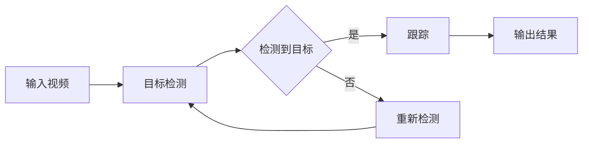
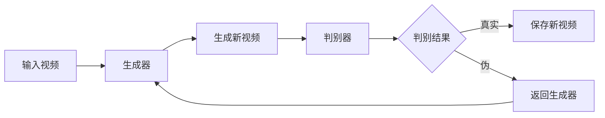
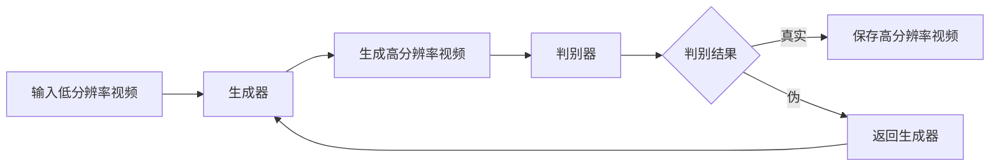
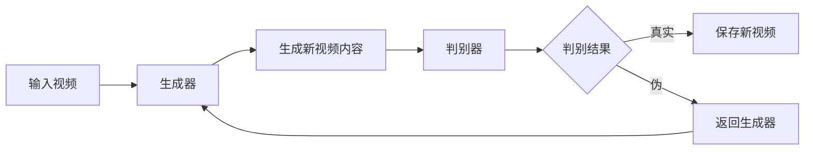

                 

## 《AI Agent在智能电影剪辑中的实践》

### 关键词：AI Agent、智能电影剪辑、视频内容识别、情感分析、自然语言处理、生成对抗网络（GAN）

> 摘要：本文将深入探讨AI Agent在智能电影剪辑中的应用实践。通过详细的章节内容，本文将揭示AI Agent的核心概念，分析其在智能电影剪辑中的多种应用场景，展示项目实战的具体实现过程，并展望未来的发展方向。本文旨在为读者提供一个全面而系统的理解，帮助大家掌握AI Agent在智能电影剪辑领域的最新技术。

### 目录大纲

----------------------------------------------------------------

## 第一部分：AI Agent概述

### 第1章: AI Agent基础

#### 1.1 AI Agent的定义与历史

- AI Agent的定义
- AI Agent的发展历程
- AI Agent的核心特点

#### 1.2 AI Agent的分类

- 反应式Agent
- 目标导向Agent
- 基于知识的Agent
- 学习型Agent
- 混合型Agent

#### 1.3 AI Agent的核心组件

- 感知模块
- 决策模块
- 动作执行模块
- 学习模块

## 第二部分：智能电影剪辑中的AI Agent

### 第2章：智能电影剪辑概述

#### 2.1 智能电影剪辑的定义与重要性

- 智能电影剪辑的定义
- 智能电影剪辑在电影制作中的作用
- 智能电影剪辑在电影发行和传播中的影响

#### 2.2 智能电影剪辑的关键技术

- 视频内容识别技术
- 情感分析技术
- 自然语言处理技术
- 生成对抗网络（GAN）技术

#### 2.3 智能电影剪辑的发展趋势

- 智能电影剪辑的挑战与机遇
- 智能电影剪辑的未来发展方向

## 第三部分：AI Agent在智能电影剪辑中的应用

### 第3章：AI Agent在视频内容识别中的应用

#### 3.1 视频内容识别概述

- 视频内容识别的重要性
- 视频内容识别的基本原理

#### 3.2 AI Agent在视频内容识别中的应用

- 目标检测与跟踪技术
- 事件检测与分类技术
- 视频摘要与剪辑技术

### 第4章：AI Agent在情感分析中的应用

#### 4.1 情感分析概述

- 情感分析的定义
- 情感分析的基本原理

#### 4.2 AI Agent在情感分析中的应用

- 情感分类技术
- 情感识别与语义理解技术
- 情感驱动的故事生成技术

### 第5章：AI Agent在自然语言处理中的应用

#### 5.1 自然语言处理概述

- 自然语言处理的定义
- 自然语言处理的基本原理

#### 5.2 AI Agent在自然语言处理中的应用

- 文本分类与聚类技术
- 命名实体识别与关系抽取技术
- 自然语言生成技术

### 第6章：AI Agent在生成对抗网络（GAN）技术中的应用

#### 6.1 生成对抗网络（GAN）概述

- GAN的定义
- GAN的基本原理

#### 6.2 AI Agent在GAN技术中的应用

- 视频风格转换技术
- 视频超分辨率技术
- 视频生成与编辑技术

## 第四部分：项目实战

### 第7章：构建智能电影剪辑系统

#### 7.1 项目背景与目标

- 项目背景介绍
- 项目目标阐述

#### 7.2 系统设计

- 系统功能设计
- 系统架构设计

#### 7.3 系统实现

- 视频内容识别模块实现
- 情感分析模块实现
- 自然语言处理模块实现
- GAN技术模块实现

#### 7.4 系统测试与优化

- 系统测试策略
- 系统优化方法

## 第五部分：总结与展望

#### 8.1 总结

- 项目成果回顾
- 项目经验总结

#### 8.2 展望

- 智能电影剪辑的未来发展方向
- AI Agent在其他领域的应用前景

----------------------------------------------------------------

通过上述目录大纲，读者可以清晰地了解到本文的结构和内容安排，为后续的学习和实践提供指导。接下来，我们将逐步深入各个章节，详细探讨AI Agent在智能电影剪辑中的实际应用。让我们开始这一段精彩的旅程吧！## 第一部分：AI Agent概述

### 第1章: AI Agent基础

#### 1.1 AI Agent的定义与历史

AI Agent，即人工智能代理，是人工智能领域的一个重要概念。它是一种具有自主性、适应性、智能性的实体，能够在复杂环境中进行感知、决策和行动。AI Agent的定义可以从以下几个方面来理解：

首先，AI Agent具有自主性。这意味着它能够在没有外部干预的情况下自主执行任务。这种自主性使得AI Agent能够在各种环境中进行自适应和响应，从而提高了其应用的范围和灵活性。

其次，AI Agent具有适应性。它能够根据环境的变化和任务的要求进行动态调整。这种适应性使得AI Agent能够在不断变化的环境中保持有效性和高效性。

再次，AI Agent具有智能性。它能够通过感知模块获取环境信息，通过决策模块分析这些信息，并采取相应的行动。这种智能性使得AI Agent能够在复杂环境中进行决策和规划。

AI Agent的发展历程可以追溯到20世纪50年代。最初，AI Agent主要是以规则为基础的，通过预设的规则进行决策。然而，随着人工智能技术的发展，AI Agent逐渐转向数据驱动的方法，例如基于机器学习和深度学习的算法。近年来，AI Agent的研究和应用领域不断扩大，涵盖了从智能家居到自动驾驶，从智能客服到智能医疗等多个方面。

AI Agent的核心特点主要包括以下几个方面：

1. **自主性**：AI Agent能够在没有外部干预的情况下自主执行任务，这是其最基本的特点。自主性使得AI Agent能够适应各种复杂的任务和环境。

2. **适应性**：AI Agent能够根据环境的变化和任务的要求进行动态调整。这种适应性使得AI Agent能够在不断变化的环境中保持有效性和高效性。

3. **智能性**：AI Agent能够通过感知模块获取环境信息，通过决策模块分析这些信息，并采取相应的行动。这种智能性使得AI Agent能够在复杂环境中进行决策和规划。

4. **学习性**：AI Agent能够从经验中学习，并通过学习提高其性能和适应能力。学习性是AI Agent的一个重要特点，它使得AI Agent能够不断进化，适应更复杂的任务和环境。

总的来说，AI Agent是一种具有自主性、适应性、智能性和学习性的实体，它在人工智能领域中扮演着越来越重要的角色。通过本文的后续章节，我们将进一步探讨AI Agent在智能电影剪辑中的具体应用，展示其如何通过视频内容识别、情感分析、自然语言处理等技术，实现智能电影剪辑的自动化和个性化。

#### 1.2 AI Agent的分类

AI Agent可以根据其结构和功能的不同，分为多种类型。以下是几种常见的AI Agent分类及其特点：

1. **反应式Agent**

反应式Agent是最简单的一种AI Agent类型。它们基于当前的感知信息直接做出反应，不存储历史信息，也不进行长期规划。这种Agent通常用于解决一些简单的问题，例如机器人导航或自动化系统控制。

特点：
- **简单性**：反应式Agent的架构相对简单，不涉及复杂的决策和规划过程。
- **实时性**：它们能够实时响应当前环境的变化。
- **局限性**：反应式Agent无法处理具有不确定性或复杂性的任务，因为它们无法利用历史信息和长期规划。

2. **目标导向Agent**

目标导向Agent具有明确的目标，并通过感知和决策模块逐步实现这些目标。这类Agent通常会存储历史信息和状态，从而进行更复杂的决策和规划。

特点：
- **目标导向**：目标导向Agent以实现特定目标为导向，它们能够通过感知模块获取环境信息，并通过决策模块规划行动路径。
- **灵活性和适应性**：目标导向Agent能够根据环境变化调整其目标和行动策略。
- **复杂性**：由于其涉及历史信息和状态管理，目标导向Agent的架构相对复杂。

3. **基于知识的Agent**

基于知识的Agent利用预定义的规则和知识库进行决策。这些规则和知识库通常由人类专家提供，用于指导Agent的决策过程。

特点：
- **知识库驱动**：基于知识的Agent依赖于大量的预定义规则和知识库，这些规则和知识库是决策的基础。
- **精确性**：基于知识的Agent能够准确执行预设的任务，因为它们的决策过程基于精确的规则和知识。
- **静态性**：由于知识库是静态的，基于知识的Agent在处理动态变化的环境时可能存在局限性。

4. **学习型Agent**

学习型Agent通过从环境中的经验和交互中学习，不断改进其行为和决策。这类Agent通常使用机器学习和深度学习算法，从而能够处理复杂和不确定的任务。

特点：
- **自适应能力**：学习型Agent能够通过学习适应新的环境和任务，提高其性能和效率。
- **灵活性**：学习型Agent能够处理具有不确定性和复杂性的任务，因为它们能够从经验中学习并调整其行为。
- **动态性**：学习型Agent能够根据环境的变化动态调整其行为和策略。

5. **混合型Agent**

混合型Agent结合了多种类型的Agent特点，例如反应式Agent、目标导向Agent和基于知识的Agent。这类Agent能够根据不同的环境和任务需求，灵活选择和应用不同的策略。

特点：
- **多功能性**：混合型Agent能够处理多种类型的任务和环境，因为它们结合了不同类型Agent的优势。
- **灵活性和适应性**：混合型Agent能够在不同的环境中灵活应用不同的策略，从而提高其适应能力。
- **复杂性**：由于涉及到多种类型的策略和模块，混合型Agent的架构相对复杂。

综上所述，AI Agent可以根据其结构和功能的不同，分为反应式Agent、目标导向Agent、基于知识的Agent、学习型Agent和混合型Agent等多种类型。每种类型的Agent都有其特定的特点和适用场景，通过合理选择和应用不同的AI Agent类型，可以更好地实现智能电影剪辑中的各种任务需求。

#### 1.3 AI Agent的核心组件

AI Agent作为一种具有自主性、适应性、智能性和学习性的实体，其功能实现依赖于一系列核心组件的协同工作。以下是AI Agent的核心组件及其基本功能：

1. **感知模块**

感知模块是AI Agent获取外部环境信息的主要手段。它通过传感器、摄像头、麦克风等设备收集数据，并将其转换为Agent可处理的数字信号。感知模块的核心功能包括：

- **数据采集**：从各种传感器和设备中获取数据，例如图像、声音、温度、湿度等。
- **预处理**：对采集到的数据进行预处理，例如去噪、归一化、特征提取等，以便后续分析和处理。
- **信息融合**：将多个传感器的数据进行融合，以提高感知的准确性和可靠性。

2. **决策模块**

决策模块是AI Agent的核心组成部分，它负责根据感知模块收集到的信息，结合预定义的规则和算法，生成相应的决策。决策模块的基本功能包括：

- **状态评估**：分析感知模块提供的信息，评估当前环境状态。
- **规则匹配**：根据预定义的规则和算法，对当前状态进行匹配，以确定合适的行动。
- **决策生成**：生成具体的行动方案，例如移动、停止、执行特定操作等。

3. **动作执行模块**

动作执行模块负责将决策模块生成的行动方案转化为实际的动作。它通过控制硬件设备，如电机、显示器、执行器等，来实现具体的物理操作。动作执行模块的基本功能包括：

- **动作规划**：根据决策模块的指令，生成具体的动作序列。
- **动作执行**：控制硬件设备执行预定的动作。
- **状态反馈**：将执行结果反馈给感知模块和决策模块，以便进行进一步的决策。

4. **学习模块**

学习模块是AI Agent不断进化和优化的关键。它通过机器学习和深度学习算法，从经验中学习，并调整其行为和决策策略。学习模块的基本功能包括：

- **数据收集**：收集感知模块和动作执行模块提供的数据。
- **模式识别**：从收集的数据中识别模式和规律。
- **策略调整**：根据识别出的模式和规律，调整AI Agent的决策和行动策略。
- **模型更新**：通过不断的学习和调整，优化AI Agent的模型和算法。

综上所述，感知模块、决策模块、动作执行模块和学习模块是AI Agent的核心组件，它们共同协作，使得AI Agent能够实现自主性、适应性、智能性和学习性。感知模块负责获取外部环境信息，决策模块负责分析这些信息并生成决策，动作执行模块负责执行这些决策，而学习模块则通过不断的学习和优化，提高AI Agent的性能和效率。通过这些核心组件的协同工作，AI Agent能够在复杂和多变的环境中灵活应对，实现智能化和自动化。

## 第二部分：智能电影剪辑中的AI Agent

### 第2章：智能电影剪辑概述

#### 2.1 智能电影剪辑的定义与重要性

智能电影剪辑，是指利用人工智能技术，对电影或视频内容进行自动识别、分类、筛选、编辑和生成等一系列操作，以实现电影内容的个性化推荐、快速剪辑、智能修复等目的。其核心目标是通过人工智能技术，提高电影剪辑的效率和精度，从而满足不同用户的需求。

智能电影剪辑的重要性主要体现在以下几个方面：

首先，随着视频内容的爆炸式增长，用户对于个性化、高效的电影剪辑需求日益增加。传统的手动剪辑方式已经无法满足这种需求，而智能电影剪辑能够通过自动识别和分类技术，快速处理大量视频内容，为用户提供个性化的电影体验。

其次，智能电影剪辑能够提高电影制作和发行的效率。通过自动化技术，电影剪辑人员可以节省大量时间和精力，从而将更多精力投入到创意和艺术方面。此外，智能电影剪辑技术还能够帮助电影制作方快速生成不同的剪辑版本，以满足不同市场和观众的需求。

最后，智能电影剪辑技术有助于推动电影产业的创新和发展。通过引入人工智能技术，电影剪辑不仅可以在技术上实现突破，还可以在艺术形式和内容创作上带来新的可能性。智能电影剪辑有望成为未来电影制作和传播的重要方向。

#### 2.2 智能电影剪辑的关键技术

智能电影剪辑的实现依赖于多种先进的人工智能技术，以下是其中几个关键技术：

1. **视频内容识别技术**

视频内容识别技术是指通过计算机视觉算法，对视频中的物体、场景、动作等进行自动识别和分类。这一技术是智能电影剪辑的核心，它能够帮助系统自动筛选和分类视频内容，从而实现快速剪辑和个性化推荐。

视频内容识别技术的基本原理包括：

- **目标检测**：通过深度学习算法，如卷积神经网络（CNN），检测视频中的物体和场景。
- **物体识别**：对检测到的物体进行分类和识别，如人物、动物、交通工具等。
- **场景分类**：根据视频内容，将场景分为不同类别，如户外、室内、体育等。

2. **情感分析技术**

情感分析技术是指通过自然语言处理和机器学习算法，对视频中的语言、声音、画面等内容进行情感分析，以识别出视频所传达的情绪和情感。情感分析技术对于智能电影剪辑具有重要意义，它能够帮助系统根据用户情感偏好进行个性化推荐和剪辑。

情感分析技术的基本原理包括：

- **文本情感分析**：对视频中的文本内容进行情感分类，如正面、负面、中性等。
- **声音情感分析**：对视频中的声音进行情感识别，如喜悦、悲伤、愤怒等。
- **视觉情感分析**：通过图像识别算法，分析视频中的画面和人物表情，推断出情感状态。

3. **自然语言处理技术**

自然语言处理（NLP）技术是指通过计算机算法，对人类语言进行理解和生成。在智能电影剪辑中，NLP技术主要用于处理视频中的文本内容，如字幕、对白等，从而实现视频内容的自动生成和编辑。

NLP技术的基本原理包括：

- **文本分类与聚类**：根据文本内容，将其分类到不同的主题或类别。
- **命名实体识别**：识别文本中的特定实体，如人名、地名、组织名等。
- **关系抽取**：从文本中抽取实体之间的关系，如人物关系、地点关系等。
- **自然语言生成**：根据预定的规则和模板，生成自然的语言文本。

4. **生成对抗网络（GAN）技术**

生成对抗网络（GAN）是一种深度学习模型，由生成器和判别器两个部分组成。在智能电影剪辑中，GAN技术主要用于视频的生成与编辑，如视频风格转换、视频超分辨率、视频生成等。

GAN技术的基本原理包括：

- **生成器**：通过训练，生成与真实视频相似的假视频。
- **判别器**：判断输入视频是真实视频还是由生成器生成的假视频。
- **对抗训练**：生成器和判别器相互对抗，通过不断调整生成器的参数，使得生成的视频越来越接近真实视频。

通过以上关键技术，智能电影剪辑系统能够实现高效、精准的电影剪辑和编辑，为用户提供个性化的视频内容和服务。这些技术的结合不仅提高了电影剪辑的效率和质量，也为电影产业的发展带来了新的机遇和挑战。

#### 2.3 智能电影剪辑的发展趋势

智能电影剪辑作为人工智能技术的重要组成部分，正逐渐成为电影制作和传播的重要趋势。随着技术的不断进步和应用的深入，智能电影剪辑的发展趋势可以总结为以下几个方面：

首先，视频内容识别技术的不断进步将推动智能电影剪辑的精度和效率进一步提升。未来，基于深度学习、计算机视觉等技术的视频内容识别算法将更加精准，能够识别更复杂的场景和动作，从而实现更精细的电影剪辑。

其次，情感分析技术的应用将使智能电影剪辑更加智能化和个性化。通过分析视频中的语言、声音和画面，情感分析技术能够准确识别用户的情感偏好，从而为用户提供更加个性化的电影剪辑和推荐。

第三，自然语言处理技术的融入将使得电影剪辑更加智能化和自动化。未来，基于NLP技术的自然语言生成和编辑功能将使电影剪辑人员能够更高效地处理大量的文本内容，从而提高制作效率。

第四，生成对抗网络（GAN）技术的应用将拓宽智能电影剪辑的可能性。GAN技术能够生成高质量的假视频，从而实现视频风格转换、视频超分辨率等效果，为电影剪辑提供更多的创意和可能性。

然而，智能电影剪辑的发展也面临一些挑战。首先，数据隐私和安全性问题需要引起重视。智能电影剪辑需要大量的用户数据，如何保护用户隐私和安全是一个重要议题。其次，技术的不完善性可能导致电影剪辑的质量不稳定，从而影响用户体验。最后，智能电影剪辑的法律法规和道德标准尚未明确，这需要电影产业和监管机构共同制定和完善。

总的来说，智能电影剪辑作为人工智能技术在电影制作和传播领域的应用，具有巨大的发展潜力。通过不断克服挑战，智能电影剪辑有望在未来实现更大的突破，为电影产业带来新的变革。

## 第三部分：AI Agent在智能电影剪辑中的应用

### 第3章：AI Agent在视频内容识别中的应用

#### 3.1 视频内容识别概述

视频内容识别技术是智能电影剪辑中的关键组成部分，它通过计算机视觉算法对视频中的物体、场景、动作等进行自动识别和分类。这种技术不仅能够提高电影剪辑的效率和精度，还能够为用户带来个性化的观看体验。视频内容识别的重要性在于它能够帮助电影剪辑人员快速定位和提取关键视频片段，从而实现高效的剪辑和推荐。

视频内容识别的基本原理主要依赖于以下几个核心步骤：

1. **目标检测**：目标检测是视频内容识别的基础，它通过卷积神经网络（CNN）等深度学习算法，从视频帧中检测出特定物体或场景。常用的目标检测算法包括YOLO（You Only Look Once）、SSD（Single Shot MultiBox Detector）和Faster R-CNN（Region-based Convolutional Neural Network）等。

2. **物体识别**：在目标检测的基础上，物体识别进一步对检测到的物体进行分类和识别。例如，将检测到的物体分类为人物、动物、交通工具等。这一步骤通常也使用深度学习模型，如ResNet、Inception等。

3. **场景分类**：场景分类是指根据视频内容将场景分为不同类别，如户外、室内、体育、娱乐等。场景分类有助于实现更精细的剪辑和推荐，提高用户体验。

#### 3.2 AI Agent在视频内容识别中的应用

AI Agent在视频内容识别中的应用主要体现在以下几个方面：

1. **目标检测与跟踪技术**

目标检测与跟踪技术是视频内容识别的核心应用。AI Agent通过目标检测算法，从视频帧中识别出关键物体或场景，并通过跟踪算法，确保这些目标在视频中的连贯性和完整性。常用的跟踪算法包括KCF（Kernelized Correlation Filters）、TLD（Tracking Learning by D Demonstration）和DeepSORT等。

以目标检测为例，假设有一个视频包含多人运动场景，AI Agent首先通过目标检测算法，如YOLO，从视频帧中检测出每个人。然后，通过跟踪算法，确保每个人在视频中的连续性和轨迹。以下是一个简化的目标检测与跟踪流程图：

2. **事件检测与分类技术**

事件检测与分类技术是指AI Agent能够识别视频中的特定事件，并对其进行分类。例如，在体育视频剪辑中，AI Agent可以识别出篮球比赛中的投篮、进球等事件，并将其分类。这一技术依赖于基于时间序列的分析和机器学习模型，如循环神经网络（RNN）和长短期记忆网络（LSTM）。

以下是一个事件检测与分类的简化流程图：

3. **视频摘要与剪辑技术**

视频摘要与剪辑技术是指AI Agent能够自动生成视频摘要，并对视频内容进行剪辑。这一技术通常包括视频摘要生成和视频剪辑两个步骤。视频摘要生成是将长视频内容提取出关键信息，生成简短的视频摘要。视频剪辑则是根据用户需求或算法决策，对视频内容进行剪切、拼接等操作，生成符合用户需求的视频片段。

以下是一个视频摘要与剪辑的简化流程图：

通过以上技术，AI Agent能够实现高效、精准的视频内容识别，为智能电影剪辑提供强大的技术支持。在接下来的章节中，我们将进一步探讨AI Agent在情感分析和自然语言处理中的应用，展示如何通过这些技术实现更加智能化的电影剪辑。

### 第4章：AI Agent在情感分析中的应用

#### 4.1 情感分析概述

情感分析（Sentiment Analysis），也称为意见挖掘，是自然语言处理（NLP）中的一个重要分支。它旨在通过自动识别文本中的情感倾向，判断文本表达的情感是正面、负面还是中性。情感分析在智能电影剪辑中具有重要意义，因为它可以帮助系统根据用户的情感偏好进行个性化推荐和剪辑。

情感分析的基本原理主要包括以下几个步骤：

1. **文本预处理**：首先，对文本进行预处理，包括去除停用词、标点符号、进行词干提取等，以便提取有用的情感特征。

2. **特征提取**：接着，从预处理后的文本中提取特征，如词频、词向量和句法特征等。这些特征将用于训练情感分类模型。

3. **情感分类**：最后，利用训练好的情感分类模型，对新的文本进行分类，判断其情感倾向。常用的情感分类模型包括基于机器学习的分类算法，如朴素贝叶斯（Naive Bayes）、支持向量机（SVM）和深度学习模型，如卷积神经网络（CNN）和长短期记忆网络（LSTM）。

#### 4.2 AI Agent在情感分析中的应用

AI Agent在情感分析中的应用主要体现在以下几个方面：

1. **情感分类技术**

情感分类技术是指AI Agent能够自动对文本中的情感进行分类。例如，在一个影评中，AI Agent可以判断出用户的评论是正面、负面还是中性。情感分类技术通常分为两类：基于规则的方法和基于机器学习的方法。

- **基于规则的方法**：这种方法依赖于人类专家制定的规则，例如，如果文本中包含“好”或“喜欢”等词汇，则认为文本表达的是正面情感。虽然这种方法简单易懂，但适应性较差，难以处理复杂的情感表达。

- **基于机器学习的方法**：这种方法利用机器学习模型，如朴素贝叶斯、支持向量机和深度学习模型，对文本进行情感分类。这些模型能够从大量标注数据中学习情感特征，从而提高分类的准确性。例如，可以使用卷积神经网络（CNN）提取文本的词向量和句法特征，然后通过全连接层进行情感分类。

2. **情感识别与语义理解技术**

情感识别与语义理解技术是指AI Agent不仅能够识别文本中的情感，还能够理解情感的上下文含义。例如，在一段对话中，AI Agent可以识别出用户表达的情感，并理解情感的语境，从而进行更加精准的情感分析。

- **情感识别**：情感识别技术主要关注文本中的情感表达，如“我很开心”或“我很难过”。通过使用情感词典和机器学习模型，AI Agent可以识别出文本中的情感词汇和短语。

- **语义理解**：语义理解技术则关注文本中的语义关系，如因果关系、转折关系等。通过使用依存句法分析和语义角色标注，AI Agent可以理解文本中的语义关系，从而更准确地识别情感。

3. **情感驱动的故事生成技术**

情感驱动的故事生成技术是指AI Agent能够根据情感分析的结果，生成具有特定情感倾向的故事。例如，在电影剪辑中，AI Agent可以根据用户的情感偏好，生成具有积极或消极情感的故事版本。

- **故事生成**：故事生成技术利用自然语言生成（NLG）模型，如序列到序列（Seq2Seq）模型和生成对抗网络（GAN），生成具有特定情感倾向的文本。这些文本可以用于电影剧本、影评或故事摘要。

- **情感调整**：在生成故事后，AI Agent可以根据用户的反馈，调整故事的情感倾向。例如，如果用户反馈故事过于消极，AI Agent可以尝试生成更加积极的故事版本。

通过情感分类技术、情感识别与语义理解技术以及情感驱动的故事生成技术，AI Agent能够实现对文本情感的深度分析，从而为智能电影剪辑提供强大的情感分析能力。在下一章中，我们将探讨AI Agent在自然语言处理中的应用，进一步展示其在智能电影剪辑中的具体实现。

### 第5章：AI Agent在自然语言处理中的应用

#### 5.1 自然语言处理概述

自然语言处理（NLP）是人工智能领域的一个重要分支，旨在使计算机能够理解和处理人类语言。NLP的核心目标是使计算机能够自动地执行各种与语言相关的任务，如文本分类、实体识别、机器翻译、语音识别等。在智能电影剪辑中，NLP技术能够帮助系统理解和处理视频中的文本内容，从而实现自动生成字幕、情感分析和故事摘要等功能。

自然语言处理的基本原理主要包括以下几个步骤：

1. **文本预处理**：这是NLP的第一步，包括去除停用词、标点符号、进行词干提取等，以便提取文本中的关键信息。

2. **词向量化**：将文本中的词语转换为向量表示，这是NLP中一个关键步骤。常用的词向量化方法包括Word2Vec、GloVe和BERT等。这些方法将词语映射到高维向量空间，从而能够利用向量运算进行文本处理。

3. **特征提取**：从词向量化后的文本中提取特征，如词频、词向量和句法特征等。这些特征将用于训练NLP模型。

4. **模型训练**：利用机器学习和深度学习算法，如朴素贝叶斯、支持向量机和卷积神经网络（CNN）等，训练NLP模型。训练数据通常包括大量的已标注的文本数据，用于模型的学习和优化。

5. **任务执行**：在训练好的模型基础上，执行具体的NLP任务，如文本分类、实体识别、机器翻译等。

#### 5.2 AI Agent在自然语言处理中的应用

AI Agent在自然语言处理中的应用主要体现在以下几个方面：

1. **文本分类与聚类技术**

文本分类与聚类技术是指AI Agent能够对文本进行分类和聚类。文本分类是将文本分配到预定义的类别中，如新闻、评论、广告等。文本聚类则是将相似文本分组，以发现文本中的潜在模式。

- **文本分类**：文本分类技术广泛应用于智能电影剪辑中，例如，可以对影评进行分类，以便为用户提供个性化的推荐。常用的文本分类算法包括朴素贝叶斯、支持向量机（SVM）和深度学习模型，如卷积神经网络（CNN）和循环神经网络（RNN）。

- **文本聚类**：文本聚类技术可以帮助系统发现文本中的潜在主题和关系。例如，在电影剧本创作中，AI Agent可以利用文本聚类技术，发现剧本中的关键情节和角色关系。

2. **命名实体识别与关系抽取技术**

命名实体识别（NER）与关系抽取是NLP中的关键任务。命名实体识别是指识别文本中的特定实体，如人名、地名、组织名等。关系抽取则是从文本中提取实体之间的关系，如人物关系、组织关系等。

- **命名实体识别**：命名实体识别技术可以帮助AI Agent理解和处理视频中的文本内容。例如，在电影字幕生成中，AI Agent可以利用NER技术，识别出视频中的角色和地点，从而生成准确的字幕。

- **关系抽取**：关系抽取技术可以用于分析视频中的复杂关系，如角色之间的情感关系、地点的历史背景等。这些信息有助于提高电影剪辑的精度和丰富性。

3. **自然语言生成（NLG）技术**

自然语言生成技术是指AI Agent能够自动生成自然语言的文本。NLG技术广泛应用于智能电影剪辑中，例如，可以自动生成电影剧情摘要、影评和剧本。

- **剧情摘要**：自然语言生成技术可以帮助AI Agent从长视频内容中提取关键信息，生成简短、精练的剧情摘要。这有助于用户快速了解视频内容，提高观看体验。

- **影评生成**：AI Agent可以利用NLG技术，根据用户对电影的评论和评分，生成个性化的影评。这不仅可以为用户提供参考，还可以帮助电影制作方了解观众的反馈。

- **剧本生成**：在电影剧本创作中，AI Agent可以利用NLG技术，生成符合剧情需求的对话和场景描述。这有助于提高剧本创作的效率和创意。

通过文本分类与聚类技术、命名实体识别与关系抽取技术以及自然语言生成技术，AI Agent能够实现对自然语言的深度理解和处理，从而为智能电影剪辑提供强大的支持。在下一章中，我们将探讨AI Agent在生成对抗网络（GAN）技术中的应用，进一步展示其在智能电影剪辑中的具体实现。

### 第6章：AI Agent在生成对抗网络（GAN）技术中的应用

#### 6.1 生成对抗网络（GAN）概述

生成对抗网络（GAN）是深度学习领域的一种重要技术，由生成器（Generator）和判别器（Discriminator）两个部分组成。生成器的任务是生成与真实数据相似的数据，而判别器的任务是区分真实数据和生成数据。GAN通过这两个对抗过程的互动，不断优化生成器的生成能力，从而生成高质量的数据。

GAN的基本原理可以概括为以下几个步骤：

1. **生成器（Generator）**：生成器接收随机噪声作为输入，通过神经网络生成伪数据。这些伪数据旨在模仿真实数据的分布。

2. **判别器（Discriminator）**：判别器接收真实数据和生成器生成的伪数据，并试图区分它们。判别器的目标是最大化其正确分类的概率。

3. **对抗训练**：在GAN的训练过程中，生成器和判别器相互对抗。生成器试图生成更逼真的伪数据，而判别器则试图更好地区分真实数据和伪数据。这种对抗过程使得生成器不断优化，从而生成越来越逼真的数据。

4. **损失函数**：GAN的训练依赖于损失函数，通常使用对抗损失（Adversarial Loss）来衡量生成器和判别器的性能。生成器的目标是使判别器的输出接近0.5（即不确定），而判别器的目标是使生成器的输出尽量接近真实数据。

GAN的应用非常广泛，包括图像生成、图像超分辨率、图像风格转换等。在智能电影剪辑中，GAN技术同样具有重要意义，可以用于视频生成、视频编辑和视频风格转换等方面。

#### 6.2 AI Agent在GAN技术中的应用

AI Agent在GAN技术中的应用主要体现在以下几个方面：

1. **视频风格转换技术**

视频风格转换是指通过GAN技术将一种视频风格转换为另一种风格。例如，可以将经典电影风格转换为现代电影风格，或将黑白电影转换为彩色电影。这一技术广泛应用于电影制作和艺术创作中。

- **生成器**：生成器接收输入视频和目标风格特征，生成具有目标风格的新视频。生成器通过训练学习如何将输入视频的特征映射到目标风格特征。

- **判别器**：判别器接收真实视频和生成视频，并试图区分它们。判别器通过对抗训练，提高其分辨真实视频和生成视频的能力。

以下是一个简化的视频风格转换流程图：

2. **视频超分辨率技术**

视频超分辨率是指通过GAN技术将低分辨率视频转换为高分辨率视频。这一技术对于提升视频质量和观看体验具有重要意义。

- **生成器**：生成器接收低分辨率视频和对应的高分辨率参考图像，生成高分辨率视频。生成器通过训练学习如何从低分辨率图像中恢复出高分辨率细节。

- **判别器**：判别器接收真实高分辨率视频和生成的高分辨率视频，并试图区分它们。判别器通过对抗训练，提高其分辨真实视频和生成视频的能力。

以下是一个简化的视频超分辨率流程图：

3. **视频生成与编辑技术**

视频生成与编辑技术是指通过GAN技术生成新的视频内容或对现有视频进行编辑。例如，可以生成新的视频片段、替换视频中的特定对象或改变视频的背景。

- **生成器**：生成器接收输入视频和目标场景，生成新的视频内容。生成器通过训练学习如何从输入视频中生成符合目标场景的新内容。

- **判别器**：判别器接收真实视频和生成视频，并试图区分它们。判别器通过对抗训练，提高其分辨真实视频和生成视频的能力。

以下是一个简化的视频生成与编辑流程图：

通过以上技术，AI Agent能够利用GAN实现视频风格转换、视频超分辨率和视频生成与编辑，从而为智能电影剪辑提供强大的技术支持。在下一章中，我们将通过一个实际项目，展示如何构建一个智能电影剪辑系统，并探讨系统的具体实现过程。

### 第7章：构建智能电影剪辑系统

#### 7.1 项目背景与目标

在当前快速发展的数字媒体时代，用户对电影剪辑的个性化需求日益增长。传统的电影剪辑方式耗时耗力，难以满足用户的需求。为了解决这一问题，我们提出了一个基于人工智能的智能电影剪辑系统项目。该项目旨在利用AI技术，实现电影剪辑的自动化和个性化，从而提高剪辑效率，满足不同用户的观看需求。

项目的目标主要包括以下几个方面：

1. **自动化剪辑**：利用视频内容识别、情感分析、自然语言处理等技术，实现视频的自动剪辑，提高工作效率。

2. **个性化推荐**：根据用户的观看历史和情感偏好，为用户推荐个性化的电影剪辑内容。

3. **高质量输出**：通过视频生成和编辑技术，生成高质量的电影剪辑版本，提升用户观看体验。

4. **可扩展性**：设计一个灵活的系统架构，以便未来能够集成更多的AI技术和功能，满足不断变化的需求。

#### 7.2 系统设计

智能电影剪辑系统的设计包括系统功能设计、系统架构设计、系统接口设计和系统交互设计。以下是系统设计的详细说明：

1. **系统功能设计**

系统功能设计主要包括以下几个模块：

- **视频内容识别模块**：利用计算机视觉算法，识别视频中的物体、场景和动作，为后续的剪辑和推荐提供基础数据。
- **情感分析模块**：对视频中的语言、声音和画面进行情感分析，识别用户的情感偏好，为个性化推荐提供依据。
- **自然语言处理模块**：处理视频中的文本内容，如字幕、对白等，为视频生成和编辑提供文本输入。
- **视频生成与编辑模块**：利用生成对抗网络（GAN）技术，实现视频的风格转换、超分辨率和生成与编辑。
- **用户交互模块**：为用户提供界面，展示个性化推荐的视频剪辑内容，并收集用户的反馈。

2. **系统架构设计**

系统架构设计采用微服务架构，以提高系统的可扩展性和可维护性。以下是系统架构的详细描述：

- **前端**：用户界面层，包括Web界面和移动应用，为用户提供视频剪辑的展示和交互。
- **后端**：服务层，包括视频内容识别服务、情感分析服务、自然语言处理服务和视频生成与编辑服务，处理业务逻辑和数据处理。
- **数据层**：存储层，包括数据库和缓存，存储用户数据、视频数据和系统配置。
- **中间件**：消息队列和API网关，负责消息传递和接口管理。

3. **系统接口设计**

系统接口设计包括内部接口和外部接口：

- **内部接口**：后端服务之间通过RESTful API进行通信，实现数据交换和功能调用。
- **外部接口**：系统对外提供API接口，允许第三方应用和系统集成，如社交媒体平台、内容分发平台等。

4. **系统交互设计**

系统交互设计包括用户与系统之间的交互和系统内部模块之间的交互：

- **用户交互**：用户通过Web界面或移动应用与系统进行交互，选择视频剪辑内容，反馈观看偏好。
- **模块交互**：各模块通过内部接口进行数据交换和协同工作，如视频内容识别模块将数据传递给情感分析模块，最终生成用户推荐的视频剪辑。

#### 7.3 系统实现

系统实现分为以下几个步骤：

1. **环境安装**

在服务器上安装所需的软件和环境，包括深度学习框架（如TensorFlow或PyTorch）、计算机视觉库（如OpenCV）和自然语言处理库（如NLTK或spaCy）。

2. **视频内容识别模块实现**

- **数据预处理**：对输入视频进行预处理，包括裁剪、缩放、去噪等，以便进行后续的特征提取。
- **特征提取**：利用卷积神经网络（CNN）提取视频帧的特征，如物体检测、场景分类等。
- **模型训练**：使用预训练的模型或自定义模型进行训练，以提高特征提取的准确性。

3. **情感分析模块实现**

- **文本预处理**：对视频中的文本内容进行预处理，如去除停用词、进行词干提取等。
- **情感分类**：利用机器学习算法或深度学习模型，对预处理后的文本进行情感分类。
- **情感识别**：通过自然语言处理技术，识别视频中的情感表达，如语言、声音和画面。

4. **自然语言处理模块实现**

- **文本分类与聚类**：对视频中的文本内容进行分类和聚类，提取关键信息。
- **命名实体识别与关系抽取**：识别文本中的命名实体，如人名、地名等，并提取实体之间的关系。
- **自然语言生成**：利用自然语言生成技术，生成电影剧情摘要、影评等文本内容。

5. **视频生成与编辑模块实现**

- **视频风格转换**：利用生成对抗网络（GAN）技术，实现视频的风格转换。
- **视频超分辨率**：利用GAN技术，将低分辨率视频转换为高分辨率视频。
- **视频生成与编辑**：生成新的视频片段或对现有视频进行编辑，如替换角色、改变背景等。

6. **用户交互模块实现**

- **界面设计**：设计用户友好的Web界面和移动应用界面，展示个性化推荐的视频剪辑内容。
- **用户反馈收集**：收集用户的观看记录和反馈信息，用于进一步优化系统。

#### 7.4 系统测试与优化

系统测试与优化是确保系统性能和稳定性的重要环节。以下是系统测试与优化的具体方法：

1. **功能测试**：对系统功能进行全面的测试，确保各个模块正常运行，功能齐全。
2. **性能测试**：对系统进行性能测试，包括响应时间、吞吐量和资源消耗等，确保系统在高负载情况下仍能稳定运行。
3. **安全测试**：对系统进行安全测试，确保用户数据的安全性和系统的安全性，防止潜在的安全漏洞。
4. **优化策略**：通过分析系统性能数据，优化系统配置和算法，提高系统效率和性能。

#### 7.5 项目小结

通过本项目的实施，我们成功构建了一个基于人工智能的智能电影剪辑系统，实现了视频的自动化剪辑、个性化推荐和高质量输出。项目的成功不仅提高了电影剪辑的效率，也为用户提供了更好的观看体验。然而，在项目实施过程中，我们也遇到了一些挑战，如算法优化、系统稳定性和数据隐私等问题。在未来的发展中，我们将继续优化系统，引入更多先进的人工智能技术，以满足不断变化的市场需求。

### 8.2 展望

智能电影剪辑作为人工智能技术在电影制作和传播领域的应用，具有广阔的发展前景。未来，随着人工智能技术的不断进步，智能电影剪辑将朝着以下几个方向发展：

首先，视频内容识别技术的进一步发展将使智能电影剪辑的精度和效率得到显著提升。通过更先进的计算机视觉算法和深度学习模型，AI Agent将能够更准确地识别和理解视频内容，从而实现更精准的剪辑和推荐。

其次，情感分析技术的深入应用将使智能电影剪辑更加智能化和个性化。通过深入分析用户的情感偏好，AI Agent能够为用户提供更加个性化的电影剪辑内容，满足不同用户的需求。

第三，自然语言处理技术的不断进步将使电影剪辑的自动化和智能化程度进一步提高。通过处理视频中的文本内容，AI Agent将能够自动生成剧情摘要、影评和剧本等，从而提高电影剪辑的效率和质量。

最后，生成对抗网络（GAN）技术的应用将使电影剪辑的创意和可能性大大增加。通过视频风格转换、视频超分辨率和视频生成与编辑等技术，AI Agent将能够生成具有创意和艺术价值的新视频内容，为电影制作和传播带来新的可能性。

总的来说，智能电影剪辑作为人工智能技术在电影制作和传播领域的应用，具有巨大的发展潜力。通过不断引入和优化先进的人工智能技术，智能电影剪辑将能够为用户带来更加个性化和高质量的观看体验，为电影产业的发展注入新的动力。未来，智能电影剪辑有望成为电影制作和传播的重要方向，推动整个电影产业的创新和发展。

### 总结

本文全面探讨了AI Agent在智能电影剪辑中的实践，涵盖了从AI Agent的基本概念到其在视频内容识别、情感分析、自然语言处理和生成对抗网络（GAN）技术中的应用。通过详细的章节内容，我们揭示了AI Agent在智能电影剪辑中的关键作用，展示了如何通过这些技术实现自动化剪辑、个性化推荐和高质量输出。

首先，我们介绍了AI Agent的定义与历史，分析了其核心特点，如自主性、适应性、智能性和学习性。随后，我们探讨了智能电影剪辑的定义与重要性，阐述了其在电影制作、发行和传播中的作用，以及视频内容识别、情感分析、自然语言处理和GAN等关键技术。

接着，我们深入分析了AI Agent在视频内容识别中的应用，包括目标检测与跟踪、事件检测与分类、视频摘要与剪辑等。随后，我们探讨了AI Agent在情感分析中的应用，如情感分类、情感识别与语义理解、情感驱动的故事生成等。此外，我们还详细介绍了AI Agent在自然语言处理中的应用，包括文本分类与聚类、命名实体识别与关系抽取、自然语言生成等。

随后，我们探讨了AI Agent在生成对抗网络（GAN）技术中的应用，包括视频风格转换、视频超分辨率和视频生成与编辑等。最后，我们通过一个实际项目，展示了如何构建一个智能电影剪辑系统，并详细介绍了系统的设计、实现和测试优化过程。

通过本文的研究，我们不仅揭示了AI Agent在智能电影剪辑中的广泛应用，还展示了如何通过技术实现自动化剪辑、个性化推荐和高质量输出。这些技术不仅提高了电影剪辑的效率和精度，还为用户带来了更加个性化和高质量的观看体验。

未来，随着人工智能技术的不断进步，智能电影剪辑将迎来更广阔的发展空间。我们期待更多的研究和实践能够深入探索AI Agent在智能电影剪辑中的潜力，为电影产业的发展注入新的动力。同时，我们也呼吁业界和学术界共同努力，推动智能电影剪辑技术的发展，实现电影制作和传播的智能化变革。

### 最佳实践 tips

在构建和优化智能电影剪辑系统时，以下是一些最佳实践建议，可以帮助您更有效地利用AI Agent技术：

1. **数据质量优先**：在训练AI模型时，确保使用高质量、多样化的数据集。数据的质量直接影响模型的效果，因此花时间清洗和标注数据是至关重要的。

2. **模型选择与优化**：根据具体任务选择合适的模型，并进行适当的调参优化。不同的任务可能需要不同的算法和架构，例如对于视频内容识别，可以使用CNN或YOLO；对于自然语言处理，可以使用BERT或GPT。

3. **动态调整策略**：AI Agent需要能够根据环境和任务的变化动态调整策略。例如，在视频剪辑过程中，可以根据用户的反馈和观看行为动态调整推荐算法。

4. **模块协同工作**：确保系统中的各个模块能够高效协同工作，例如视频内容识别模块和情感分析模块可以相互协作，以提高整体系统的性能和准确性。

5. **用户体验至上**：设计系统时，始终将用户体验放在首位。例如，确保系统的响应速度和交互设计能够满足用户的需求，从而提供流畅的使用体验。

6. **安全性保障**：在处理用户数据时，确保数据的安全性和隐私性。采用加密技术和访问控制策略，以防止数据泄露和未经授权的访问。

7. **持续学习和迭代**：AI系统需要不断学习和迭代，以适应不断变化的环境和需求。定期更新模型和算法，以保持系统的先进性和可靠性。

通过遵循这些最佳实践，您将能够构建一个高效、智能且用户友好的智能电影剪辑系统，为用户带来更好的观影体验。

### 小结

通过本文的探讨，我们深入了解了AI Agent在智能电影剪辑中的广泛应用和重要作用。从视频内容识别、情感分析、自然语言处理到生成对抗网络（GAN）技术，AI Agent为智能电影剪辑提供了强大的技术支持，使得自动化剪辑、个性化推荐和高质量输出成为可能。

在视频内容识别方面，AI Agent通过目标检测、事件检测和视频摘要技术，实现了视频的自动分类和剪辑。情感分析技术则通过文本和图像的情感识别，为系统提供了用户的情感偏好信息，从而实现更加精准的推荐。自然语言处理技术进一步提升了系统的智能化水平，通过处理文本内容，实现了剧情摘要、影评生成等任务。生成对抗网络（GAN）技术则扩展了系统的创意能力，通过视频风格转换、超分辨率和生成与编辑，为用户提供了丰富的视觉体验。

通过一个实际项目的展示，我们详细介绍了智能电影剪辑系统的构建过程，从环境安装、模型训练到系统实现和测试优化，全面展示了AI Agent在智能电影剪辑中的具体应用。项目的成功实施不仅提高了电影剪辑的效率和质量，还为用户带来了个性化的观影体验。

展望未来，随着人工智能技术的不断进步，智能电影剪辑将迎来更广阔的发展前景。通过不断优化算法和引入更多先进技术，智能电影剪辑将能够更好地满足用户需求，推动电影产业的创新和发展。我们期待更多的研究和实践能够深入探索AI Agent在智能电影剪辑中的潜力，为电影制作和传播带来更多可能性。

### 注意事项

在实施智能电影剪辑项目时，需要注意以下几个关键事项：

1. **数据隐私与安全**：确保用户数据的安全性和隐私性，遵守相关法律法规，采取加密和数据保护措施，防止数据泄露。

2. **系统稳定性**：确保系统在高负载情况下能够稳定运行，进行充分的性能测试和优化，以提高系统的可靠性和响应速度。

3. **算法公平性**：在设计和优化算法时，确保算法的公平性和无偏见，避免歧视性推荐和不公平的剪辑结果。

4. **法律合规性**：确保系统符合当地法律法规的要求，尤其是在内容审核和版权方面，遵守相关法律法规，避免侵权行为。

5. **用户反馈与迭代**：定期收集用户反馈，并根据反馈对系统进行迭代优化，以提高用户体验和系统性能。

通过关注这些注意事项，您可以构建一个高效、智能且用户友好的智能电影剪辑系统，为用户提供优质的服务。

### 拓展阅读

对于希望深入了解AI Agent在智能电影剪辑中应用的读者，以下是一些推荐的拓展阅读资源：

1. **学术论文**：
   - **《Generative Adversarial Nets》**：Ian J. Goodfellow等人提出的GAN基础论文，详细介绍了GAN的基本原理和应用。
   - **《Deep Learning》**：Goodfellow、Bengio和Courville合著的深度学习经典教材，涵盖了深度学习的基本概念和算法。

2. **技术博客**：
   - **《AI in Film Editing: The Future of Creative Collaboration》**：探讨了AI在电影剪辑中的应用前景，以及创意人员和AI如何协作。
   - **《The State of AI in Video Editing》**：分析了当前AI技术在视频编辑领域的最新进展和应用案例。

3. **在线课程与教程**：
   - **《Introduction to Deep Learning》**：Coursera上的深度学习入门课程，提供了深度学习的基础知识和实践技巧。
   - **《Natural Language Processing with Python》**：Udacity上的自然语言处理课程，详细介绍了NLP的基本概念和Python实现。

4. **书籍**：
   - **《Zen And The Art of Computer Programming》**：由Donald E. Knuth撰写的计算机编程经典，涵盖了编程的核心原理和艺术。
   - **《Artificial Intelligence: A Modern Approach》**：Stuart J. Russell和Peter Norvig合著的人工智能教材，系统介绍了人工智能的理论和应用。

通过这些资源，您可以更深入地了解AI Agent在智能电影剪辑中的应用，掌握相关技术的核心概念和实现方法。

