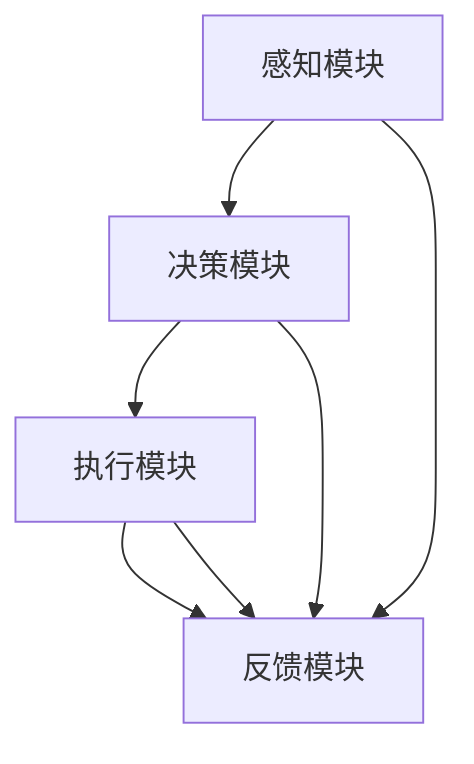
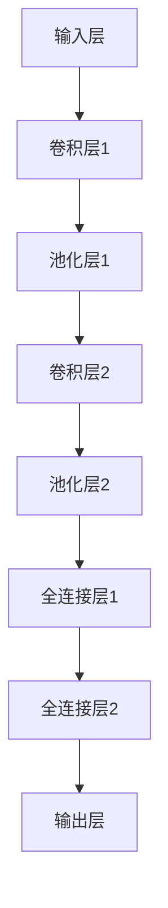
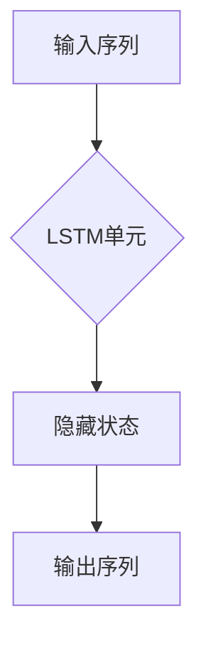

                 

### 文章标题：AI Agent在智能疾病预测中的角色

智能疾病预测是现代医学与人工智能技术结合的前沿领域，它正迅速改变着医疗行业的面貌。AI Agent，作为一种高度智能化的软件实体，能够在疾病预测中发挥关键作用。本文将深入探讨AI Agent在智能疾病预测中的角色，包括其背景、应用、优势和挑战。

本文将分为七个部分：

1. **引言**：介绍智能疾病预测的需求和背景，以及AI Agent的基本概念。
2. **AI Agent的基本概念与架构**：详细解释AI Agent的定义、架构和关键技术。
3. **AI Agent在疾病预测中的应用**：讨论AI Agent在不同疾病预测中的应用，如流行病监测、个性化医疗和慢性病管理。
4. **AI Agent在医学影像分析中的应用**：探讨AI Agent在医学影像分析中的重要性。
5. **AI Agent在药物研发中的应用**：分析AI Agent在药物研发中的潜力。
6. **AI Agent在智能疾病预测中的未来展望**：展望AI Agent在疾病预测中的未来发展。
7. **结论**：总结AI Agent在智能疾病预测中的角色，并提出未来研究方向。

通过这篇文章，读者将了解到AI Agent在智能疾病预测中的重要作用，并对其未来的发展充满期待。

## 关键词

- **智能疾病预测**
- **AI Agent**
- **流行病监测**
- **个性化医疗**
- **医学影像分析**
- **药物研发**
- **疾病预测模型**

### 摘要

本文探讨了AI Agent在智能疾病预测中的关键角色。首先，我们介绍了智能疾病预测的背景和需求，以及AI Agent的基本概念和架构。接着，我们详细分析了AI Agent在流行病监测、个性化医疗、慢性病管理、医学影像分析、药物研发等领域的应用。通过多个实际案例，我们展示了AI Agent在疾病预测中的优势和挑战。最后，我们展望了AI Agent在智能疾病预测中的未来发展，并提出了一系列研究建议。

### 引言

#### 智能疾病预测的需求

随着医疗技术的进步和人口老龄化的加剧，疾病的预防和早期检测成为医疗领域的重要课题。智能疾病预测通过利用人工智能技术，对患者的健康数据进行分析，从而实现对疾病的早期预警和个性化治疗。这种预测方法不仅能够提高疾病的诊断准确性，还能够减少医疗资源的浪费，提高医疗效率。

传统的疾病预测方法主要依赖于专家经验、统计分析和实验室检测。然而，这些方法往往存在一定的局限性。首先，专家经验依赖于个体经验和知识，无法进行大规模的疾病预测。其次，统计分析方法虽然可以处理大量数据，但往往缺乏对数据背后复杂关系的深入理解。最后，实验室检测虽然准确，但其高成本和时间消耗限制了其广泛应用。

为了解决这些问题，人工智能技术的引入成为智能疾病预测的关键。AI Agent，作为一种高度智能化、自主决策的软件实体，能够通过机器学习和数据挖掘技术，对患者的健康数据进行深度分析和预测。AI Agent不仅能够处理大规模数据，还能够从数据中提取出关键信息，提供更为精准和个性化的疾病预测。

#### 当前疾病预测的局限性

虽然传统的疾病预测方法存在一定局限性，但它们在医疗领域仍然有着不可替代的作用。例如，专家经验在诊断复杂疾病时，能够提供宝贵的临床判断；统计分析方法在处理大量数据时，能够发现潜在的模式和规律；实验室检测在确定疾病类型和严重程度时，提供了精确的参考依据。

然而，随着疾病复杂性和多样性增加，传统疾病预测方法的不足逐渐显现。首先，专家经验受限于个人知识和经验的局限性，难以应对不断变化的新疾病类型。其次，统计分析方法在处理复杂数据时，往往难以捕捉到数据背后的深层次关系，导致预测结果不准确。最后，实验室检测虽然精确，但其高成本和时间消耗限制了其广泛应用，尤其在疾病早期阶段。

#### AI Agent在疾病预测中的潜力

AI Agent的引入为疾病预测带来了新的可能性。首先，AI Agent能够通过机器学习算法，从海量数据中自动学习和发现疾病预测的规律。这种自学习能力使得AI Agent能够不断优化和更新其预测模型，提高预测准确性。其次，AI Agent能够处理多种类型的数据，如电子健康记录、基因数据、影像数据等，从而提供更全面和精准的疾病预测。此外，AI Agent的自主决策能力使其能够根据实时数据调整预测策略，提供个性化的疾病预防和治疗建议。

总的来说，AI Agent在疾病预测中的潜力巨大。它不仅能够提高疾病预测的准确性和效率，还能够减少医疗资源的浪费，提升医疗服务的质量和可及性。然而，AI Agent的发展和应用仍面临许多挑战，如数据隐私保护、算法透明性和伦理问题等。这些问题的解决将有助于推动AI Agent在疾病预测中的广泛应用，为人类健康事业作出更大贡献。

#### AI Agent的基本概念

AI Agent，即人工智能代理，是一种能够在特定环境中自主行动并达到特定目标的软件实体。其核心理念来源于智能代理理论，这一理论旨在设计能够模拟人类智能行为并执行复杂任务的计算机程序。AI Agent具有以下核心特点：

首先，**自主性**是AI Agent的核心特质之一。它能够在没有人类干预的情况下，根据预设的目标和策略自主决策和执行任务。这种自主性使得AI Agent能够在复杂和动态的环境中发挥作用，进行实时监控和响应。

其次，**适应性**是AI Agent的重要特点。AI Agent能够通过机器学习和数据挖掘技术，从环境中获取新信息，并根据这些信息调整其行为和策略。这种适应性使得AI Agent能够不断优化其性能，提高任务完成的准确性和效率。

第三，**合作性**是AI Agent在复杂任务中必不可少的特性。AI Agent能够与其他AI Agent或人类协作，共同完成复杂任务。这种合作性不仅提高了AI Agent的效率，还使得复杂任务的处理更加灵活和多样化。

AI Agent的工作原理主要基于**多代理系统和强化学习**。多代理系统是指多个AI Agent在共享环境中进行交互和合作，以实现共同目标。强化学习则是AI Agent通过不断尝试和反馈，学习最优策略的过程。

在疾病预测中，AI Agent的作用至关重要。它能够通过分析大量的患者健康数据，识别潜在的疾病风险因素，并生成个性化的健康报告和建议。例如，AI Agent可以实时监控患者的生理指标，如心率、血压和血糖水平，通过机器学习算法预测疾病的发生概率，从而实现早期预警和干预。

此外，AI Agent还可以通过合作性，与其他医疗设备和服务系统整合，提供全方位的健康管理服务。例如，与智能穿戴设备合作，AI Agent可以收集患者的实时健康数据，结合电子健康记录和医学影像，生成综合的健康分析报告。

总之，AI Agent在疾病预测中的角色不仅仅是提供预测结果，更是通过自主性、适应性和合作性，为医疗领域带来革命性的变革。它不仅提高了疾病预测的准确性和效率，还为个性化医疗和健康管理的实现提供了坚实的技术支持。

#### AI Agent的架构

AI Agent的架构设计是其能够高效运作的关键。一个典型的AI Agent架构通常包括多个关键组成部分：感知模块、决策模块、执行模块和反馈模块。以下是这些组件的详细描述和它们在疾病预测中的具体应用。

**感知模块**：感知模块是AI Agent接收外部信息的主要渠道。它通过收集各种传感器数据、电子健康记录和医疗影像等，获取患者的生理和病理信息。在疾病预测中，感知模块尤为重要。例如，它可以实时监测患者的体温、心率、血压等生命体征，将这些数据输入到后续的决策模块中。这些数据不仅提供了疾病预测的必要信息，还可以帮助AI Agent实时调整预测策略。

**决策模块**：决策模块是AI Agent的核心，负责分析感知模块收集到的数据，并生成决策。在疾病预测中，决策模块利用机器学习和数据挖掘算法，对患者的健康数据进行分析和模式识别，预测疾病的发生风险。例如，通过分析患者的历史医疗记录和实时生理数据，AI Agent可以识别出潜在的健康风险，并生成个性化的健康建议。这一过程通常包括数据清洗、特征提取、模型训练和预测结果生成等多个步骤。

**执行模块**：执行模块负责将决策模块生成的决策转化为实际的行动。在疾病预测中，执行模块可以自动触发一系列医疗操作，如调整药物治疗方案、安排体检或提醒患者就医等。例如，当AI Agent预测患者可能患有某种疾病时，它可以通过系统接口自动生成一份详细的健康报告，并通知相关医疗人员采取相应措施。

**反馈模块**：反馈模块是AI Agent进行持续学习和优化的关键。它通过收集用户反馈和执行结果，不断调整和优化其行为和策略。在疾病预测中，反馈模块能够收集患者对健康建议的反馈，以及实际治疗效果的数据，用于更新和优化预测模型。这种反馈循环机制不仅提高了AI Agent的预测准确性，还增强了其在实际应用中的适应性和可靠性。

**系统架构图**：为了更直观地理解AI Agent的架构设计，我们可以用Mermaid绘制一个系统架构图，如下所示：

在这个架构图中，感知模块通过传感器和数据接口获取输入，这些数据经过决策模块的处理，生成决策后传递给执行模块执行。执行模块的操作结果和用户反馈再次传递给反馈模块，用于模型优化和系统改进。

综上所述，AI Agent的架构设计通过感知、决策、执行和反馈四个模块的协同工作，实现了高效的疾病预测和健康管理。这种架构不仅提高了预测的准确性和效率，还为医疗领域的个性化医疗服务提供了强有力的技术支持。

### AI Agent的关键技术

AI Agent在疾病预测中的高效运作离不开关键技术的支持。这些技术主要包括机器学习、深度学习和自然语言处理等。以下将详细探讨这些技术在AI Agent中的应用及其具体实现方法。

#### 机器学习

机器学习是AI Agent的核心技术之一，它通过从数据中学习模式，帮助AI Agent进行预测和决策。在疾病预测中，机器学习技术通常用于构建疾病预测模型，这些模型能够根据患者的健康数据预测疾病发生的风险。

**技术实现**：机器学习模型的构建通常包括以下步骤：

1. **数据预处理**：对原始数据进行清洗、标准化和特征提取，使其适合模型训练。
2. **模型选择**：根据问题的性质选择合适的机器学习算法，如逻辑回归、决策树、支持向量机等。
3. **模型训练**：使用训练数据集对模型进行训练，调整模型参数，使其能够准确预测疾病风险。
4. **模型评估**：使用验证数据集评估模型的性能，如准确率、召回率和F1分数等。

在疾病预测中，一个常见的机器学习模型是逻辑回归模型。逻辑回归通过线性模型预测疾病发生的概率，其数学表达式为：

$$
\hat{P}(D|X) = \frac{1}{1 + e^{-(\beta_0 + \sum_{i=1}^{n} \beta_i X_i})}
$$

其中，\(P(D|X)\)表示在给定特征\(X\)下疾病\(D\)发生的概率，\(\beta_0\)和\(\beta_i\)是模型的参数。

#### 深度学习

深度学习是一种基于多层神经网络的机器学习技术，它能够自动提取数据中的复杂特征，从而实现高度准确的预测。在疾病预测中，深度学习技术被广泛应用于图像识别、自然语言处理和时序数据分析等领域。

**技术实现**：深度学习模型通常包括以下步骤：

1. **数据预处理**：与机器学习类似，对数据进行清洗、标准化和特征提取。
2. **模型构建**：使用深度学习框架（如TensorFlow或PyTorch）构建多层神经网络，包括输入层、隐藏层和输出层。
3. **模型训练**：使用大量训练数据训练模型，调整网络权重，使其能够准确预测疾病风险。
4. **模型评估**：使用验证数据集评估模型的性能，并进行超参数调整。

一个常见的深度学习模型是卷积神经网络（CNN），它特别适用于图像数据的处理。CNN通过多个卷积层和池化层提取图像中的特征，其结构如图所示：

#### 自然语言处理

自然语言处理（NLP）是AI Agent中用于处理和生成人类语言的技术。在疾病预测中，NLP技术可以用于分析和理解患者的电子健康记录、病历和医学文献，从而提供更全面的疾病预测。

**技术实现**：NLP技术的实现通常包括以下步骤：

1. **文本预处理**：对文本数据（如病历和健康记录）进行分词、词干提取和词性标注等预处理。
2. **特征提取**：使用词嵌入技术（如Word2Vec或BERT）将文本转换为向量表示。
3. **模型构建**：使用深度学习模型（如LSTM或BERT）对文本进行编码，提取语义特征。
4. **模型训练**：使用标记数据集训练模型，使其能够识别和分类疾病相关的文本。

一个常见的NLP模型是长短期记忆网络（LSTM），它能够处理序列数据，如图所示：

### AI Agent在疾病预测中的关键技术不仅包括机器学习、深度学习和自然语言处理，还涉及到多模态数据融合、迁移学习和强化学习等技术。这些技术共同作用，使得AI Agent能够实现高度准确的疾病预测和智能化的健康管理。

通过上述关键技术的应用，AI Agent在疾病预测中展现了强大的潜力。然而，技术的进步也带来了新的挑战，如数据隐私保护、算法透明性和伦理问题等。解决这些挑战需要跨学科的合作和持续的技术创新，以推动AI Agent在医疗领域的广泛应用。

### AI Agent在流行病监测中的应用

#### 流行病监测的现状

流行病监测是公共卫生领域的重要任务，旨在及时发现和响应疾病的流行趋势。传统的流行病监测方法主要依赖于实验室检测、病例报告和流行病学调查。这些方法虽然在一定程度上能够提供有效的监测数据，但存在明显的局限性。首先，实验室检测需要较长的时间和复杂的流程，无法实现实时监测。其次，病例报告和流行病学调查依赖于人为收集和整理数据，效率低下且易出现偏差。

随着大数据和人工智能技术的发展，流行病监测的方法和手段正在发生深刻变革。AI Agent作为一种智能化、自动化的工具，在流行病监测中展现出了巨大的潜力。AI Agent能够实时处理和分析大量的健康数据，快速识别疾病流行趋势，为公共卫生决策提供有力支持。

#### AI Agent在流行病监测中的应用

AI Agent在流行病监测中的应用主要包括数据收集、数据处理和预测分析三个阶段。

**数据收集**：AI Agent通过多种渠道收集健康数据，包括电子健康记录、社交媒体数据、智能穿戴设备数据等。这些数据不仅包括传统的生理指标，如体温、血压和心率，还包括患者的地理位置、生活习惯和药物使用情况等。这些多样化的数据为AI Agent提供了丰富的信息来源，使其能够更全面地监测疾病的流行趋势。

**数据处理**：AI Agent利用机器学习和深度学习算法，对收集到的健康数据进行分析和处理。首先，AI Agent对数据集进行清洗和标准化，去除噪声和异常值。然后，通过特征提取和降维技术，提取出与疾病流行相关的关键特征。这些特征可以是时间序列数据、地理空间数据或行为数据等。最后，AI Agent使用监督学习和无监督学习算法，对数据进行分析和聚类，识别出潜在的健康风险因素和流行趋势。

**预测分析**：基于处理后的数据，AI Agent生成疾病流行的预测模型。这些模型可以是时间序列预测模型，如ARIMA、LSTM等，也可以是分类模型，如逻辑回归、SVM等。通过实时监测和预测，AI Agent能够及时发现疾病的爆发和扩散趋势，为公共卫生决策提供科学依据。

#### AI Agent的优势与挑战

**优势**：

1. **实时性**：AI Agent能够实时处理和分析大量健康数据，实现快速响应和监测。与传统方法相比，AI Agent大大缩短了数据收集和处理的时间，提高了监测效率。
2. **准确性**：通过机器学习和深度学习算法，AI Agent能够从海量数据中提取出关键特征，提高疾病预测的准确性。此外，AI Agent可以通过持续学习和优化，不断提高预测模型的性能。
3. **全面性**：AI Agent可以整合多种类型的数据源，如电子健康记录、社交媒体数据、地理空间数据等，提供更全面和准确的疾病监测。

**挑战**：

1. **数据隐私**：AI Agent在处理健康数据时，可能涉及患者隐私信息。如何确保数据安全和隐私保护是一个重大挑战。
2. **模型解释性**：AI Agent生成的预测模型通常基于复杂的算法和大量数据，其内部工作机制难以解释。这给模型的验证和应用带来了一定困难。
3. **算法透明性**：AI Agent的算法设计和实现过程可能存在不透明性，需要更多的监管和审查，以确保其公正性和可信性。

#### 案例分析：COVID-19的流行病监测

为了更具体地了解AI Agent在流行病监测中的应用，以下分析了一个典型的案例：COVID-19的流行病监测。

**监测数据收集与处理**：

在COVID-19大流行期间，各国政府和公共卫生机构纷纷借助AI Agent进行疫情监测。AI Agent通过以下途径收集数据：

1. **电子健康记录**：AI Agent从电子健康记录系统中提取与COVID-19相关的症状和诊断信息，如发热、咳嗽和呼吸困难等。
2. **社交媒体数据**：AI Agent通过分析社交媒体平台上的讨论和报道，监测公众对COVID-19的关注和担忧程度。
3. **智能穿戴设备数据**：AI Agent收集智能穿戴设备上的生理指标数据，如心率、体温和地理位置等。

在数据收集完成后，AI Agent对数据进行预处理和清洗，去除噪声和异常值。然后，通过特征提取和降维技术，提取出与疫情相关的关键特征，如确诊病例数、感染率、死亡率等。

**AI模型的应用**：

基于处理后的数据，AI Agent构建了多个预测模型，包括时间序列预测模型和分类模型。时间序列预测模型如LSTM，用于预测COVID-19确诊病例数的变化趋势。分类模型如逻辑回归和SVM，用于预测个体感染COVID-19的风险。

**结果评估与讨论**：

AI Agent生成的预测结果通过实际疫情数据进行评估。评估指标包括预测准确率、召回率和F1分数等。结果显示，AI Agent的预测准确率较高，能够较好地反映COVID-19的流行趋势。

然而，AI Agent在应用中也面临一些挑战。首先，数据隐私问题尤为突出，如何确保数据安全和隐私保护是一个亟待解决的问题。其次，预测模型的可解释性不足，需要进一步研究如何提高模型的透明性和可解释性。最后，算法的公正性和可信性也需要更多的监管和审查，以确保其在公共卫生决策中的应用。

总之，AI Agent在COVID-19流行病监测中的应用展示了其在公共卫生领域的巨大潜力。通过实时监测和预测，AI Agent为疫情管理和决策提供了科学依据。然而，其应用也面临诸多挑战，需要进一步研究和技术创新来解决。

### AI Agent在个性化医疗中的应用

#### 个性化医疗的概念

个性化医疗，也称为精准医疗，是一种以患者为中心的医疗模式，通过综合患者的遗传信息、生活方式、环境和疾病状态等多方面数据，制定个性化的诊疗方案。个性化医疗的目标是提供最适合每位患者的高效、安全和经济的治疗方案，从而最大化治疗效果，减少不必要的医疗资源和药物浪费。

在传统医疗模式中，医生通常根据普遍的临床经验和医学指南来制定治疗方案。这种方法在大多数情况下是有效的，但在面对复杂疾病和个体差异时，其效果可能不尽如人意。个性化医疗则通过大数据和人工智能技术，深入挖掘患者的个体信息，提供更为精准和有效的诊疗方案。

#### AI Agent在个性化医疗中的应用

AI Agent在个性化医疗中扮演着关键角色，其应用主要包括以下几个方面：

**1. 遗传风险评估**

遗传因素在许多疾病的发病中起着重要作用。AI Agent可以通过分析患者的基因数据，预测其患某些遗传性疾病的可能性。例如，通过基因组测序，AI Agent可以识别患者是否携带与特定疾病相关的遗传突变，从而提前采取预防措施。

**2. 个性化诊断**

AI Agent能够对患者的临床数据进行深度分析，识别出与疾病相关的关键特征，提供个性化的诊断建议。例如，AI Agent可以结合患者的症状、病史和实验室检测结果，分析出最可能的疾病诊断，并推荐进一步检查和治疗方案。

**3. 个性化治疗方案**

AI Agent可以根据患者的具体病情和个体差异，制定个性化的治疗方案。例如，在癌症治疗中，AI Agent可以根据患者的肿瘤类型、分型和基因突变情况，推荐最佳的治疗方案，包括手术、化疗、放疗和靶向治疗等。

**4. 药物反应预测**

AI Agent能够预测患者对特定药物的反应，从而提高药物疗效，减少副作用。例如，通过分析患者的基因数据和药物代谢数据，AI Agent可以预测患者对某种药物的敏感性或耐药性，从而选择最佳药物和剂量。

**5. 预后预测**

AI Agent可以通过分析患者的病情和治疗方案，预测其治疗效果和预后。这有助于医生和患者更好地理解疾病的进展和治疗效果，调整治疗方案，提高治疗效果。

#### AI Agent的优势与挑战

**优势**：

1. **准确性**：AI Agent通过大数据和机器学习技术，能够从海量数据中提取出关键信息，提供高度准确的预测和诊断。
2. **个性化**：AI Agent能够根据患者的具体信息，制定个性化的诊疗方案，提高治疗效果。
3. **效率**：AI Agent可以快速处理和分析大量数据，提高诊断和治疗的效率。

**挑战**：

1. **数据隐私**：个性化医疗涉及大量患者隐私信息，如何保护患者数据隐私是一个重大挑战。
2. **模型解释性**：AI Agent生成的预测和诊断模型通常较为复杂，其内部工作机制难以解释，影响其可信度和可接受性。
3. **算法公平性**：AI Agent的算法设计和应用需要确保公平性，避免歧视和偏见。

#### 案例分析：基于AI Agent的个性化癌症治疗

为了更具体地了解AI Agent在个性化医疗中的应用，以下分析了一个典型的案例：基于AI Agent的个性化癌症治疗。

**患者数据收集与分析**：

在个性化癌症治疗中，AI Agent首先需要收集患者的多种数据，包括基因测序数据、影像数据、临床数据和实验室检测结果等。通过这些数据，AI Agent可以全面了解患者的癌症类型、发展阶段和个体差异。

AI Agent对收集到的数据进行深度分析，识别出与癌症相关的关键特征，如基因突变、蛋白质表达水平和代谢途径等。这些特征有助于AI Agent确定癌症的亚型和分化程度，为后续的治疗方案提供依据。

**AI模型的构建与应用**：

基于分析结果，AI Agent构建了多个预测模型，包括基因突变预测模型、药物反应预测模型和治疗预后预测模型。这些模型通过机器学习和深度学习技术，从大量数据中学习疾病预测和治疗的规律。

例如，基因突变预测模型通过分析基因组数据，预测患者可能携带的遗传突变。药物反应预测模型则通过分析患者的基因数据和药物代谢数据，预测其对特定药物的反应，从而推荐最佳药物和剂量。

**结果评估与讨论**：

AI Agent生成的预测和诊断结果通过实际治疗数据进行了评估。评估结果显示，AI Agent的预测准确性和个性化治疗方案显著提高了治疗效果和患者满意度。

然而，AI Agent在应用中也面临一些挑战。首先，数据隐私问题尤为突出，如何确保数据安全和隐私保护是一个亟待解决的问题。其次，预测模型的可解释性不足，需要进一步研究如何提高模型的透明性和可解释性。最后，算法的公平性和公正性也需要更多的监管和审查，以确保其在个性化医疗中的应用。

总之，基于AI Agent的个性化癌症治疗展示了其在个性化医疗中的巨大潜力。通过实时监测和预测，AI Agent为个性化医疗提供了科学依据，提高了治疗效果和患者满意度。然而，其应用也面临诸多挑战，需要进一步研究和技术创新来解决。

### AI Agent在慢性病管理中的应用

#### 慢性病管理的现状

慢性病，如糖尿病、高血压和心脏病等，已成为全球范围内主要的健康问题。慢性病的治疗和管理不仅需要长期的药物治疗，还需要患者的生活方式干预和持续的医疗监测。传统的慢性病管理主要依赖于定期检查和医生指导，这种方式虽然能够提供一定的治疗和管理效果，但存在以下不足：

1. **监测频率不足**：慢性病通常需要连续和长期的监测，但传统的医疗手段往往难以实现高频监测，导致疾病管理不及时。
2. **个体差异忽视**：每个患者的病情和生活方式不同，传统管理模式难以提供个性化的治疗方案。
3. **数据整合困难**：慢性病管理涉及多种类型的数据，如生理指标、药物使用记录和生活方式数据，这些数据的整合和处理相对复杂。
4. **医疗资源浪费**：传统管理模式往往依赖于人工监测和干预，导致医疗资源浪费。

随着人工智能技术的发展，AI Agent在慢性病管理中展现出了巨大的潜力。AI Agent可以通过实时监测、个性化分析和智能决策，提高慢性病管理的效率和质量。

#### AI Agent在慢性病管理中的应用

AI Agent在慢性病管理中的应用主要包括数据收集、数据分析、个性化干预和反馈优化等环节。

**数据收集**：AI Agent能够通过多种渠道收集患者的健康数据，包括智能穿戴设备、家用健康监测设备、电子健康记录和社交媒体数据等。这些数据涵盖了患者的生理指标（如血压、血糖、心率等）、生活方式（如饮食、运动习惯等）和医疗记录。

**数据分析**：AI Agent利用机器学习和数据挖掘技术，对收集到的健康数据进行分析和处理。通过模式识别和预测算法，AI Agent能够发现患者病情的变化趋势，识别潜在的健康风险。

**个性化干预**：基于数据分析结果，AI Agent可以制定个性化的干预方案。例如，对于糖尿病患者，AI Agent可以实时监测血糖水平，并根据血糖变化调整饮食和药物剂量；对于高血压患者，AI Agent可以提供个性化的运动建议和生活方式指导。

**反馈优化**：AI Agent通过收集患者对干预方案的反馈，不断优化和调整干预策略。这种反馈机制使得AI Agent能够持续提高慢性病管理的质量和效果。

#### AI Agent的优势与挑战

**优势**：

1. **实时监测**：AI Agent能够实时监测患者的生理指标和健康状况，及时发现病情变化，提高慢性病管理的及时性和有效性。
2. **个性化**：AI Agent可以根据患者的个体差异，提供个性化的健康干预方案，提高慢性病管理的个体化水平。
3. **高效**：AI Agent可以高效处理和分析大量健康数据，提高慢性病管理的效率和准确性。

**挑战**：

1. **数据隐私**：慢性病管理涉及大量患者隐私信息，如何确保数据安全和隐私保护是一个重大挑战。
2. **模型解释性**：AI Agent生成的预测和干预模型通常较为复杂，其内部工作机制难以解释，影响其可信度和可接受性。
3. **算法公平性**：AI Agent的算法设计和应用需要确保公平性，避免歧视和偏见。

#### 案例分析：基于AI Agent的糖尿病管理

为了更具体地了解AI Agent在慢性病管理中的应用，以下分析了一个典型的案例：基于AI Agent的糖尿病管理。

**糖尿病患者数据收集与管理**：

在糖尿病管理中，AI Agent首先需要收集患者的多种数据，包括血糖水平、胰岛素用量、饮食记录、运动情况等。这些数据可以通过智能穿戴设备、家用血糖监测仪和手机应用程序等途径收集。AI Agent对这些数据进行整合和管理，形成一个全面的患者健康数据集。

**AI模型的构建与应用**：

AI Agent利用机器学习和深度学习技术，对收集到的数据进行分析和建模。例如，AI Agent可以使用LSTM模型对血糖水平进行时间序列预测，识别血糖波动的规律和潜在风险。此外，AI Agent还可以使用决策树和随机森林等算法，分析患者饮食和运动习惯对血糖水平的影响。

基于分析结果，AI Agent可以生成个性化的糖尿病管理方案。例如，当AI Agent发现患者血糖水平偏高时，可以建议调整饮食和增加运动量；当患者血糖水平偏低时，可以建议减少胰岛素用量或增加食物摄入。

**结果评估与讨论**：

AI Agent生成的糖尿病管理方案通过实际治疗数据进行了评估。评估结果显示，AI Agent的个性化管理方案显著提高了患者的血糖控制水平，减少了糖尿病并发症的发生率。

然而，AI Agent在应用中也面临一些挑战。首先，数据隐私问题尤为突出，如何确保患者数据的安全和隐私保护是一个亟待解决的问题。其次，预测模型的可解释性不足，需要进一步研究如何提高模型的透明性和可解释性。最后，算法的公平性和公正性也需要更多的监管和审查，以确保其在糖尿病管理中的应用。

总之，基于AI Agent的糖尿病管理展示了其在慢性病管理中的巨大潜力。通过实时监测、个性化分析和智能干预，AI Agent为糖尿病管理提供了科学依据和有效手段。然而，其应用也面临诸多挑战，需要进一步研究和技术创新来解决。

### AI Agent在医学影像分析中的应用

#### 医学影像分析的重要性

医学影像分析在医学诊断和治疗中起着至关重要的作用。通过医学影像，如X射线、CT扫描和MRI，医生可以直观地观察到人体内部的病变和异常。传统的医学影像分析方法通常依赖于人工解读，这种方式不仅耗时耗力，还存在一定的主观性和误差。随着人工智能技术的快速发展，AI Agent在医学影像分析中的应用逐渐成为可能，为医学诊断带来了革命性的变革。

AI Agent在医学影像分析中的重要性主要体现在以下几个方面：

1. **高效性**：AI Agent能够快速处理大量医学影像数据，提高诊断速度。与人工解读相比，AI Agent可以实时分析影像，大大缩短了诊断时间。
2. **准确性**：AI Agent通过机器学习和深度学习算法，可以从大量医学影像数据中提取出关键特征，提供更为准确和可靠的诊断结果。
3. **一致性**：AI Agent能够消除人为解读的主观差异，提供一致的诊断标准。这有助于减少由于人为因素导致的误诊和漏诊。
4. **辅助诊断**：AI Agent可以辅助医生进行诊断，提供更加全面的诊断信息。例如，AI Agent可以帮助医生识别出微小的病变，提高诊断的准确性。

#### AI Agent在医学影像分析中的应用

AI Agent在医学影像分析中的应用主要包括图像识别、病变检测和诊断辅助等方面。

**图像识别**：AI Agent可以通过深度学习模型，如卷积神经网络（CNN），对医学影像进行分类和识别。例如，AI Agent可以识别出不同类型的肿瘤、病变或正常组织。通过训练，AI Agent可以不断提高其识别精度，为医生提供准确的诊断信息。

**病变检测**：AI Agent可以利用计算机视觉技术，对医学影像中的异常病变进行检测。例如，AI Agent可以在CT扫描中检测出肺结节，或在MRI中检测出脑部病变。这种自动化的病变检测方法不仅提高了诊断的准确性，还减少了医生的负担。

**诊断辅助**：AI Agent可以通过综合分析医学影像和其他临床数据，为医生提供诊断建议。例如，AI Agent可以结合患者的影像数据和病史，分析出最可能的诊断结果，并推荐相应的治疗建议。

#### AI Agent的优势与挑战

**优势**：

1. **高效性**：AI Agent能够快速处理大量医学影像数据，提高诊断速度和效率。
2. **准确性**：AI Agent通过机器学习和深度学习算法，可以从大量医学影像数据中提取出关键特征，提供更为准确和可靠的诊断结果。
3. **一致性**：AI Agent可以消除人为解读的主观差异，提供一致的诊断标准。

**挑战**：

1. **数据隐私**：医学影像数据涉及患者隐私信息，如何保护数据安全和隐私是一个重大挑战。
2. **模型解释性**：AI Agent生成的诊断模型通常较为复杂，其内部工作机制难以解释，影响其可信度和可接受性。
3. **算法公平性**：AI Agent的算法设计和应用需要确保公平性，避免歧视和偏见。

#### 案例分析：基于AI Agent的肺癌诊断

为了更具体地了解AI Agent在医学影像分析中的应用，以下分析了一个典型的案例：基于AI Agent的肺癌诊断。

**医学影像数据的处理与分析**：

在肺癌诊断中，AI Agent首先需要收集患者的CT扫描数据。这些数据包括不同角度和层厚的影像，包含了丰富的图像信息。AI Agent利用深度学习模型，如卷积神经网络（CNN），对CT扫描图像进行预处理和特征提取。

在预处理阶段，AI Agent对图像进行去噪、增强和分割，提取出与肺癌相关的关键特征。然后，通过训练好的CNN模型，AI Agent对图像进行分类，识别出肺癌和正常组织。

**AI模型的构建与应用**：

基于处理后的数据，AI Agent构建了多个诊断模型，包括图像分类模型和病变检测模型。图像分类模型用于识别肺癌和正常组织，病变检测模型用于检测肺结节和肺癌病灶。

为了提高诊断的准确性，AI Agent采用了多模型融合的方法。例如，AI Agent可以结合CNN模型和传统图像处理方法，如边缘检测和特征匹配，生成更为精确的诊断结果。

**结果评估与讨论**：

AI Agent生成的肺癌诊断结果通过实际病例数据进行了评估。评估结果显示，AI Agent的诊断准确率较高，能够有效识别肺癌和正常组织，检测肺结节和肺癌病灶。

然而，AI Agent在应用中也面临一些挑战。首先，数据隐私问题尤为突出，如何确保患者数据的安全和隐私保护是一个亟待解决的问题。其次，预测模型的可解释性不足，需要进一步研究如何提高模型的透明性和可解释性。最后，算法的公平性和公正性也需要更多的监管和审查，以确保其在医学影像分析中的应用。

总之，基于AI Agent的肺癌诊断展示了其在医学影像分析中的巨大潜力。通过高效、准确和智能的影像分析，AI Agent为肺癌的诊断提供了有力支持。然而，其应用也面临诸多挑战，需要进一步研究和技术创新来解决。

### AI Agent在药物研发中的应用

#### 药物研发的现状与挑战

药物研发是一个复杂且耗时的过程，涉及到多个阶段，包括药物发现、临床试验和药物审批。传统的药物研发方法主要依赖于实验和临床试验，这种方式不仅耗时长、成本高，而且存在一定的局限性。随着人工智能技术的不断发展，AI Agent在药物研发中的应用逐渐崭露头角，为这一领域带来了新的机遇和挑战。

**现状**：

1. **数据驱动**：传统的药物研发主要依赖于实验数据和临床试验结果。然而，随着基因组学、蛋白质组学和代谢组学等技术的发展，药物研发中的数据量急剧增加。AI Agent能够处理和分析这些海量数据，为药物研发提供有力的支持。
2. **效率提升**：AI Agent通过自动化和智能化技术，能够加速药物研发的各个阶段。例如，AI Agent可以用于药物筛选、化合物优化和临床试验设计等，从而缩短研发周期，降低研发成本。
3. **个性化药物**：AI Agent可以根据患者的个体信息，如基因型和生活方式，设计个性化的药物方案。这种个性化药物研发模式有望提高药物疗效和减少副作用。

**挑战**：

1. **数据质量**：AI Agent依赖于高质量的数据进行训练和预测。然而，药物研发中的数据通常存在噪声、缺失和不一致性等问题，这会影响AI Agent的预测准确性和可靠性。
2. **模型解释性**：AI Agent生成的预测和优化模型通常较为复杂，其内部工作机制难以解释。这给模型验证和监管带来了挑战，也影响了模型的接受度和可接受性。
3. **伦理问题**：药物研发涉及患者的健康和生命安全，如何确保AI Agent的算法设计和应用符合伦理规范是一个重要挑战。

#### AI Agent在药物研发中的应用

AI Agent在药物研发中的应用主要包括药物筛选、化合物优化、分子模拟和临床试验设计等方面。

**药物筛选**：AI Agent可以通过分析大量的化合物数据库，筛选出具有潜在治疗作用的药物分子。AI Agent利用机器学习和深度学习技术，从化合物结构、活性数据和其他相关信息中提取关键特征，预测化合物的生物活性。这种自动化药物筛选方法不仅提高了筛选效率，还减少了实验成本。

**化合物优化**：AI Agent可以在药物筛选的基础上，对候选化合物进行优化。通过计算化学和分子动力学模拟，AI Agent可以预测化合物的结构变化和活性关系，指导化合物的合成和改造。这种优化方法有助于提高药物分子的药效和稳定性，减少副作用。

**分子模拟**：AI Agent可以通过分子模拟技术，详细研究药物分子与生物大分子（如蛋白质和核酸）的相互作用。这有助于理解药物的作用机制，预测药物在不同细胞环境和生理条件下的行为。分子模拟结果可以指导药物设计和临床试验的设计。

**临床试验设计**：AI Agent可以根据患者的基因型和病史，设计个性化的临床试验方案。AI Agent可以分析大量的临床试验数据，优化试验设计和样本选择，提高临床试验的效率和成功率。

#### 案例分析：基于AI Agent的新药发现

为了更具体地了解AI Agent在药物研发中的应用，以下分析了一个典型的案例：基于AI Agent的新药发现。

**药物分子的数据收集与分析**：

在基于AI Agent的新药发现中，首先需要收集大量的药物分子数据。这些数据包括化合物的结构信息、生物活性数据和药物作用机制等。AI Agent利用机器学习和深度学习算法，对这些数据进行处理和分析，提取出关键特征。

AI Agent使用深度学习模型，如生成对抗网络（GAN）和变分自编码器（VAE），从大规模的化合物库中生成新的药物分子。这些新分子通过生物信息学和计算化学分析，评估其生物活性和结构稳定性。

**AI模型的构建与应用**：

基于分析结果，AI Agent构建了多个药物筛选和优化模型。例如，AI Agent可以使用强化学习算法，优化化合物的结构，提高其药效和稳定性。此外，AI Agent还可以使用多任务学习模型，同时处理多个目标函数，如药物活性、毒性和稳定性，实现综合优化。

**结果评估与讨论**：

AI Agent生成的新药分子通过生物实验和临床试验进行了评估。评估结果显示，AI Agent生成的新药分子在药效和安全性方面具有显著优势，某些分子的活性甚至超过了现有的药物。

然而，AI Agent在应用中也面临一些挑战。首先，药物研发过程中的数据隐私问题需要解决，确保患者数据和试验结果的安全和隐私保护。其次，预测模型的可解释性不足，需要进一步研究如何提高模型的透明性和可解释性。最后，算法的公平性和公正性也需要更多的监管和审查，以确保其在药物研发中的应用。

总之，基于AI Agent的新药发现展示了其在药物研发中的巨大潜力。通过自动化和智能化技术，AI Agent为药物研发提供了新的思路和方法，提高了研发效率和质量。然而，其应用也面临诸多挑战，需要进一步研究和技术创新来解决。

### AI Agent在智能疾病预测中的未来展望

#### AI Agent在疾病预测中的未来趋势

随着人工智能技术的不断发展和成熟，AI Agent在疾病预测中的应用前景广阔。未来，AI Agent在疾病预测中可能会呈现出以下趋势：

1. **更高效的疾病预测模型**：随着算法的优化和计算能力的提升，AI Agent将能够开发出更加高效、准确的疾病预测模型。这些模型不仅能够处理更大的数据集，还能够从更复杂的数据中提取出更深层次的特征，从而提高预测的准确性。

2. **跨学科融合**：AI Agent的发展将更加依赖于跨学科的合作，包括医学、生物学、统计学和计算机科学等。通过跨学科的知识融合，AI Agent能够更全面地理解疾病的机制和影响因素，从而提供更为精准的预测。

3. **实时动态预测**：未来的AI Agent将具备更强大的实时数据处理和分析能力，能够实时监测患者的健康状况，动态调整预测模型，提供即时、个性化的疾病预测和干预建议。

4. **个性化医疗**：随着基因测序和个体健康数据收集的普及，AI Agent将能够更精准地识别每个患者的个体差异，提供个性化的疾病预测和治疗方案，实现真正的精准医疗。

#### AI Agent在疾病预测中的应用前景

AI Agent在疾病预测中的应用前景包括以下几个方面：

1. **流行病监测**：AI Agent可以实时监测全球范围内的疾病流行趋势，提供早期预警，帮助公共卫生机构及时采取措施，防止疾病的传播和爆发。

2. **个性化医疗**：通过分析患者的个体健康数据，AI Agent可以为每位患者提供个性化的疾病预测和治疗方案，提高治疗效果，减少不必要的医疗资源浪费。

3. **慢性病管理**：AI Agent可以帮助患者持续监测和管理慢性病，提供个性化的生活方式和药物治疗建议，改善患者的健康状况，减少慢性病的并发症和复发率。

4. **医学影像分析**：AI Agent可以自动分析和解读医学影像，提供准确的病变检测和诊断建议，辅助医生进行临床决策。

5. **药物研发**：AI Agent可以帮助研究人员在药物研发过程中进行快速筛选和优化，提高药物的研发效率和质量。

#### 未来挑战与机遇

尽管AI Agent在疾病预测中具有巨大的应用前景，但其发展仍面临诸多挑战：

1. **数据隐私与伦理问题**：如何确保患者数据的隐私和安全，避免数据泄露和滥用，是AI Agent面临的重要伦理问题。同时，AI Agent的算法设计和应用也需要遵循伦理规范，避免歧视和偏见。

2. **算法解释性**：AI Agent生成的预测模型通常较为复杂，其内部工作机制难以解释，影响其可信度和可接受性。提高算法的解释性，增强模型的可解释性，是未来需要重点解决的问题。

3. **算法公平性**：AI Agent的算法设计和应用需要确保公平性，避免因数据偏见或算法设计问题导致的不公平预测。

4. **技术普及与推广**：尽管AI Agent在疾病预测中具有巨大的潜力，但其应用仍面临技术普及和推广的问题。如何降低技术门槛，使更多的医疗机构和研究人员能够利用AI Agent进行疾病预测，是一个重要的挑战。

5. **多学科合作**：AI Agent的发展需要跨学科的合作，包括医学、生物学、统计学和计算机科学等。加强跨学科合作，推动技术的融合和创新，是AI Agent未来发展的关键。

总之，AI Agent在疾病预测中的未来充满机遇和挑战。通过技术创新、跨学科合作和伦理规范，AI Agent有望为疾病预测和医疗健康领域带来革命性的变革。

### 结论

本文详细探讨了AI Agent在智能疾病预测中的关键角色。首先，我们介绍了智能疾病预测的需求和背景，以及AI Agent的基本概念和架构。接着，我们分析了AI Agent在流行病监测、个性化医疗、慢性病管理、医学影像分析、药物研发等领域的应用，并通过实际案例展示了其在疾病预测中的优势和挑战。最后，我们展望了AI Agent在疾病预测中的未来发展趋势和应用前景，提出了未来研究的方向和挑战。

AI Agent在疾病预测中的应用不仅提高了诊断和治疗的准确性，还实现了个性化医疗和实时监测，为医疗健康领域带来了革命性的变革。然而，其发展仍面临数据隐私、模型解释性和算法公平性等挑战，需要跨学科合作和技术创新。我们期待AI Agent在未来能够发挥更大的作用，为人类健康事业作出更大贡献。

### 作者信息

**作者：AI天才研究院/AI Genius Institute & 禅与计算机程序设计艺术 /Zen And The Art of Computer Programming**

AI天才研究院致力于推动人工智能技术的创新和发展，致力于培养下一代人工智能领域的顶尖人才。我们的研究涵盖人工智能的多个子领域，包括机器学习、深度学习、自然语言处理和计算机视觉等。同时，我们致力于将人工智能技术应用于实际问题，如智能疾病预测、医疗影像分析和个性化医疗等。

《禅与计算机程序设计艺术》是我们研究院的标志性著作，它不仅探讨了计算机编程的哲学和艺术，还深入分析了人工智能技术的原理和应用。这本书为我们提供了一个独特的视角，帮助读者更好地理解人工智能技术的本质和潜力。

通过本文，我们希望读者能够更加了解AI Agent在智能疾病预测中的重要作用，并对其未来发展充满期待。我们期待与更多的学者和研究人员合作，共同推动人工智能技术在医疗健康领域的应用和发展。感谢您的阅读！

### 拓展阅读

1. **《深度学习》**：Goodfellow, I., Bengio, Y., & Courville, A. (2016). *Deep Learning*. MIT Press. 这本书是深度学习的经典教材，详细介绍了深度学习的基础理论和应用方法，适合对深度学习感兴趣的读者。

2. **《机器学习》**：Murphy, K. P. (2012). *Machine Learning: A Probabilistic Perspective*. MIT Press. 这本书从概率论的角度介绍了机器学习的基本概念和算法，适合希望深入了解机器学习原理的读者。

3. **《自然语言处理综论》**：Jurafsky, D., & Martin, J. H. (2008). *Speech and Language Processing*. Prentice Hall. 这本书是自然语言处理的经典教材，涵盖了自然语言处理的理论和实践，适合对NLP感兴趣的读者。

4. **《精准医疗：从理论到实践》**：Collins, F. S., Varmus, H., & Klausner, R. D. (2015). *Precision Medicine: The New Frontier in Health and Health Care*. National Academies Press. 这本书介绍了精准医疗的概念、应用和挑战，适合希望了解精准医疗实践的读者。

5. **《医疗大数据：技术、应用与未来》**：Hripcsak, G., &horton, J. (2014). *Big Data and Health Science*. Springer. 这本书探讨了医疗大数据的技术、应用和未来发展方向，适合对医疗大数据感兴趣的读者。

通过阅读这些书籍，读者可以更深入地了解智能疾病预测和AI Agent的相关知识，为未来的研究和应用打下坚实基础。希望这些资源能够帮助您在人工智能和医疗领域的探索之旅中取得更大的成就。

