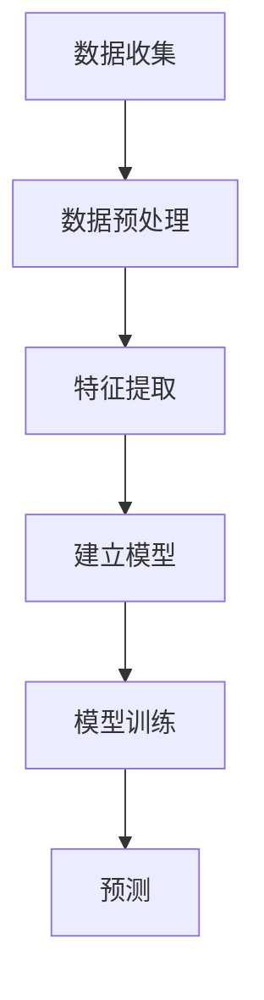
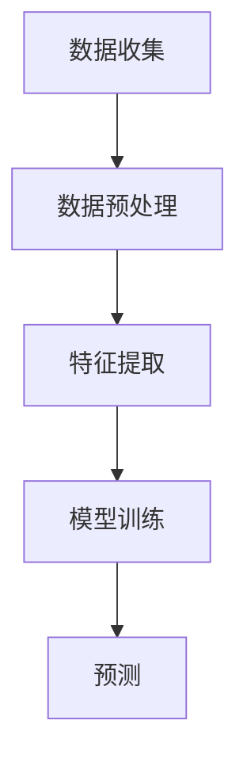

                 

### 引言与背景

#### 1.1 AI Agent概述

**问题背景**：

随着人工智能技术的快速发展，AI Agent作为一种智能体，正逐渐成为研究和应用的热点。AI Agent指的是一种具备自主决策和行动能力的计算实体，它能够在复杂环境中执行任务，完成目标。这种概念最初源于人工智能的基础理论，但随着技术的进步，AI Agent的应用领域不断扩大，从简单的自动化任务执行到复杂的人机交互，再到智能穿戴设备的健康管理，AI Agent展现了其广阔的应用前景。

**问题解决**：

AI Agent通过机器学习和深度学习等人工智能技术，利用大量数据进行训练，从而实现自我学习和优化。在智能穿戴设备中，AI Agent能够实时监测用户健康状况，预测健康风险，并提供个性化的健康建议，大大提高了健康管理的效率和准确性。

**边界与外延**：

AI Agent的定义和范畴随着技术的发展而不断扩展。从最初的基于规则的系统，到现在的基于数据和模型驱动的智能体，AI Agent已经不再局限于计算机领域，而是渗透到各种应用场景中。例如，在智能穿戴设备中，AI Agent不仅负责健康监测，还可以扩展到生活助手、环境监测、社交互动等多个方面。

**概念结构与核心要素组成**：

AI Agent的概念结构主要包括以下几个核心要素：

- **感知系统**：AI Agent通过传感器收集环境信息，如健康数据、环境参数等。
- **决策系统**：基于感知到的数据，AI Agent利用学习到的模型和算法进行决策，制定行动策略。
- **执行系统**：AI Agent根据决策系统生成的策略，执行具体的任务，如调整健康方案、发送提醒等。

#### 1.2 智能穿戴设备的发展与应用

**问题背景**：

智能穿戴设备是指直接穿在身上或嵌入在普通服装中的设备，它们可以通过传感器、软件等手段实时监测用户的生理信息，提供个性化的健康管理服务。随着物联网、云计算等技术的普及，智能穿戴设备已经成为智能健康管理和生活辅助的重要工具。

**问题解决**：

智能穿戴设备通过集成多种传感器，如心率监测器、加速度计、GPS等，可以实时获取用户的健康数据，如心率、步数、睡眠质量等。通过AI Agent的处理和分析，这些数据能够转化为具体的健康建议和决策，帮助用户更好地管理健康。

**边界与外延**：

智能穿戴设备不仅限于健康监测，还可以扩展到其他应用领域。例如，在运动健身领域，智能穿戴设备可以实时记录用户的运动数据，提供训练建议；在医疗领域，智能穿戴设备可以用于慢性病患者的远程监控；在智能家居领域，智能穿戴设备可以与家居系统联动，提供更便捷的生活体验。

**概念结构与核心要素组成**：

智能穿戴设备的结构主要包括以下几个核心要素：

- **硬件组件**：包括传感器、通信模块、显示屏等。
- **软件系统**：包括数据采集、处理、分析、用户界面等。
- **云服务平台**：提供数据存储、分析和共享功能。

#### 1.3 健康监测与生活助手的需求分析

**问题背景**：

在现代社会，人们对健康的关注日益增加，希望能够通过便捷的方式来监测和管理自己的健康状况。同时，随着生活节奏的加快，人们需要更多的帮助来提高生活质量。健康监测与生活助手的应用，正是为了满足这些需求。

**问题解决**：

健康监测方面，通过智能穿戴设备，用户可以实时了解自己的健康状况，如心率、血压、睡眠质量等。AI Agent可以对这些数据进行分析，预测健康风险，提供个性化的健康建议。

生活助手方面，智能穿戴设备可以通过语音助手、提醒功能等，帮助用户管理日常事务，如日程安排、任务提醒、行程规划等，提高生活效率。

**边界与外延**：

健康监测与生活助手的应用边界广泛，不仅限于个人健康管理，还可以扩展到社区健康监测、企业员工健康管理等多个层面。

**概念结构与核心要素组成**：

健康监测与生活助手的核心要素包括：

- **健康监测数据**：包括生理参数、环境参数等。
- **AI分析模型**：用于数据分析、风险预测、健康建议等。
- **用户交互界面**：用于数据展示、功能操作、反馈调整等。

### 1.4 本书内容结构

**本书结构概述**：

本书分为六个部分，系统地介绍了AI Agent在智能穿戴设备中的应用，包括引言与背景、AI Agent基础知识、健康监测方面的应用、生活助手方面的应用、AI Agent在智能穿戴设备中的应用实践以及总结与展望。

**主要内容与章节安排**：

- **第一部分**：引言与背景，介绍AI Agent和智能穿戴设备的基本概念、发展与应用。
- **第二部分**：AI Agent基础知识，详细讲解AI Agent的基本概念、功能、工作原理和现状。
- **第三部分**：健康监测方面的应用，探讨健康监测数据的收集与分析、常见健康监测算法。
- **第四部分**：生活助手方面的应用，介绍生活助手功能的设计与实现、性能优化。
- **第五部分**：AI Agent在智能穿戴设备中的应用实践，提供智能穿戴设备的选择与搭建、应用案例。
- **第六部分**：总结与展望，总结全书内容，展望AI Agent在智能穿戴设备中的应用前景。

### 引言与背景

随着人工智能技术的不断进步，AI Agent作为一种具备自主决策和行动能力的计算实体，正逐步在各个领域中发挥重要作用。智能穿戴设备作为现代科技与生活紧密融合的产物，为用户提供了便捷的健康监测和生活助手服务。本文将深入探讨AI Agent在智能穿戴设备中的应用，旨在为读者揭示其背后的技术原理和实际应用价值。

#### 1.1 AI Agent概述

**问题背景**：

AI Agent，即人工智能代理，是一种能够根据环境和用户需求自主决策和行动的智能体。它通过感知系统获取环境信息，利用决策系统进行分析和推理，并通过执行系统执行具体的任务。AI Agent的起源可以追溯到人工智能的基础理论，随着深度学习、机器学习等技术的发展，AI Agent的应用场景越来越广泛。

**问题解决**：

AI Agent通过机器学习算法从大量数据中学习规律，从而实现自主学习和优化。在智能穿戴设备中，AI Agent能够实时监测用户的健康数据，如心率、血压、睡眠质量等，通过分析这些数据，AI Agent可以预测健康风险并提供个性化的健康建议。

**边界与外延**：

AI Agent的定义和范畴随着技术的进步不断扩展。最初，AI Agent主要用于解决简单的自动化任务，如路径规划、资源分配等。如今，AI Agent已经能够处理复杂的问题，如自然语言处理、图像识别等，其应用范围涵盖了智能家居、智能医疗、智能交通等多个领域。

**概念结构与核心要素组成**：

AI Agent的概念结构主要包括以下几个核心要素：

- **感知系统**：通过传感器收集环境信息，如温度、湿度、地理位置等。
- **决策系统**：基于感知到的数据，利用学习到的模型和算法进行分析和推理，制定行动策略。
- **执行系统**：根据决策系统生成的策略，执行具体的任务，如调整设备参数、发送提醒等。

#### 1.2 智能穿戴设备的发展与应用

**问题背景**：

智能穿戴设备是指能够直接穿在身上或嵌入在普通服装中的设备，通过传感器、软件等手段实时监测用户的生理信息，提供个性化的健康管理服务。随着物联网、云计算等技术的发展，智能穿戴设备逐渐成为智能健康管理和生活辅助的重要工具。

**问题解决**：

智能穿戴设备通过集成多种传感器，如心率监测器、加速度计、GPS等，可以实时获取用户的健康数据，如心率、步数、睡眠质量等。AI Agent可以对这些数据进行分析，预测健康风险，提供个性化的健康建议，从而提高健康管理的效率和准确性。

**边界与外延**：

智能穿戴设备不仅限于健康监测，还可以扩展到其他应用领域。例如，在运动健身领域，智能穿戴设备可以实时记录用户的运动数据，提供训练建议；在医疗领域，智能穿戴设备可以用于慢性病患者的远程监控；在智能家居领域，智能穿戴设备可以与家居系统联动，提供更便捷的生活体验。

**概念结构与核心要素组成**：

智能穿戴设备的结构主要包括以下几个核心要素：

- **硬件组件**：包括传感器、通信模块、显示屏等。
- **软件系统**：包括数据采集、处理、分析、用户界面等。
- **云服务平台**：提供数据存储、分析和共享功能。

#### 1.3 健康监测与生活助手的需求分析

**问题背景**：

在现代社会，人们对健康的关注日益增加，希望能够通过便捷的方式来监测和管理自己的健康状况。同时，随着生活节奏的加快，人们需要更多的帮助来提高生活质量。健康监测与生活助手的应用，正是为了满足这些需求。

**问题解决**：

健康监测方面，通过智能穿戴设备，用户可以实时了解自己的健康状况，如心率、血压、睡眠质量等。AI Agent可以对这些数据进行分析，预测健康风险，提供个性化的健康建议。

生活助手方面，智能穿戴设备可以通过语音助手、提醒功能等，帮助用户管理日常事务，如日程安排、任务提醒、行程规划等，提高生活效率。

**边界与外延**：

健康监测与生活助手的应用边界广泛，不仅限于个人健康管理，还可以扩展到社区健康监测、企业员工健康管理等多个层面。

**概念结构与核心要素组成**：

健康监测与生活助手的核心要素包括：

- **健康监测数据**：包括生理参数、环境参数等。
- **AI分析模型**：用于数据分析、风险预测、健康建议等。
- **用户交互界面**：用于数据展示、功能操作、反馈调整等。

### 1.4 本书内容结构

**本书结构概述**：

本书分为六个部分，系统地介绍了AI Agent在智能穿戴设备中的应用，包括引言与背景、AI Agent基础知识、健康监测方面的应用、生活助手方面的应用、AI Agent在智能穿戴设备中的应用实践以及总结与展望。

**主要内容与章节安排**：

- **第一部分**：引言与背景，介绍AI Agent和智能穿戴设备的基本概念、发展与应用。
- **第二部分**：AI Agent基础知识，详细讲解AI Agent的基本概念、功能、工作原理和现状。
- **第三部分**：健康监测方面的应用，探讨健康监测数据的收集与分析、常见健康监测算法。
- **第四部分**：生活助手方面的应用，介绍生活助手功能的设计与实现、性能优化。
- **第五部分**：AI Agent在智能穿戴设备中的应用实践，提供智能穿戴设备的选择与搭建、应用案例。
- **第六部分**：总结与展望，总结全书内容，展望AI Agent在智能穿戴设备中的应用前景。

## AI Agent基础知识

在深入探讨AI Agent在智能穿戴设备中的应用之前，首先需要了解AI Agent的基础知识。本章节将详细讲解AI Agent的基本概念、分类、核心功能与特点、工作原理以及其发展与应用现状。

### 2.1 AI Agent的基本概念

**AI Agent的定义**：

AI Agent，即人工智能代理，是一种具有自主决策和行动能力的计算实体。它通过感知系统获取环境信息，利用决策系统进行信息处理和决策，并通过执行系统实现具体任务。AI Agent的核心在于其自主性和智能性，能够根据环境变化和目标需求，自主调整行为策略。

**AI Agent的分类**：

AI Agent可以根据不同的分类标准进行分类。按照功能和应用场景，AI Agent可以大致分为以下几类：

- **任务型AI Agent**：专注于执行特定任务，如路径规划、资源分配等。
- **社交型AI Agent**：擅长与人互动，如智能客服、虚拟助手等。
- **认知型AI Agent**：具备理解和推理能力，能够处理复杂问题，如自然语言处理、图像识别等。

**AI Agent的核心功能与特点**：

AI Agent的核心功能包括感知、决策和执行。具体来说：

- **感知**：通过传感器和环境交互，获取环境信息，如视觉、听觉、触觉等。
- **决策**：利用感知到的信息，结合预定的目标和策略，进行决策。
- **执行**：根据决策结果，执行具体任务，如发送指令、控制设备等。

AI Agent的特点主要体现在以下几个方面：

- **自主性**：AI Agent能够自主地感知环境、制定策略和执行任务。
- **适应性**：AI Agent能够根据环境变化和目标需求，动态调整行为策略。
- **智能性**：AI Agent通过机器学习和深度学习等技术，具备一定的智能推理能力。

### 2.2 AI Agent的工作原理

**AI Agent的工作原理**：

AI Agent的工作原理可以概括为感知、决策和执行三个阶段。以下是每个阶段的详细描述：

- **感知阶段**：AI Agent通过感知系统收集环境信息，如视觉、听觉、触觉等。这些信息被转化为数字信号，并通过数据处理模块进行处理和预处理。
- **决策阶段**：感知到的信息被传递到决策系统，决策系统利用预定的目标和策略，对信息进行处理和分析，生成决策结果。决策系统通常包括知识库、推理引擎和决策算法等核心组件。
- **执行阶段**：决策结果被传递到执行系统，执行系统根据决策结果执行具体的任务，如发送指令、控制设备等。执行系统通常包括执行引擎、设备接口和反馈机制等核心组件。

### 2.3 AI Agent的发展与应用现状

**AI Agent的发展历程**：

AI Agent的概念最早可以追溯到20世纪80年代，当时人工智能领域开始探索如何实现具有自主决策能力的计算实体。随着机器学习和深度学习技术的发展，AI Agent的理论和实现逐渐完善。近年来，AI Agent在各个领域的应用也取得了显著的进展。

**AI Agent的应用现状**：

目前，AI Agent的应用已经非常广泛，涵盖了多个领域。以下是几个典型的应用场景：

- **智能家居**：AI Agent可以通过语音助手、智能设备联动等方式，提供家庭自动化服务，提高生活便利性。
- **智能医疗**：AI Agent可以用于患者健康数据的实时监测和分析，提供个性化的健康建议和治疗方案。
- **智能交通**：AI Agent可以用于交通流量管理、自动驾驶车辆控制等，提高交通效率和安全性。
- **金融服务**：AI Agent可以用于风险控制、投资顾问等，提供智能化的金融服务。

**AI Agent的未来发展趋势**：

随着人工智能技术的进一步发展，AI Agent的应用前景将更加广阔。未来的发展趋势包括：

- **更高层次智能**：AI Agent将具备更高级的智能能力，如自然语言理解、多模态感知等。
- **更广泛的应用领域**：AI Agent将渗透到更多的行业和领域，如教育、农业、环保等。
- **更紧密的人机交互**：AI Agent将更加智能化，提供更加自然、便捷的人机交互体验。

### 2.4 AI Agent的体系结构与关键技术

**AI Agent的体系结构**：

AI Agent的体系结构通常包括以下几个主要组成部分：

- **感知模块**：负责从环境中获取数据，如传感器数据、环境参数等。
- **决策模块**：负责分析感知模块获取的数据，制定决策策略。
- **执行模块**：负责根据决策模块生成的决策策略，执行具体的任务。
- **知识库**：存储AI Agent所需的知识和信息，如预定义规则、历史数据等。
- **学习模块**：负责根据环境和用户反馈，不断优化AI Agent的决策能力。

**AI Agent的关键技术**：

AI Agent的关键技术包括机器学习、深度学习、自然语言处理、计算机视觉等。以下是这些关键技术的基本概念和原理：

- **机器学习**：通过数据驱动的方式，使计算机系统自动学习规律和模式，从而实现预测和决策。
- **深度学习**：基于神经网络的结构，通过多层次的非线性变换，实现对复杂数据的自动特征提取和模式识别。
- **自然语言处理**：研究如何使计算机理解和处理自然语言，包括文本分类、情感分析、机器翻译等。
- **计算机视觉**：研究如何使计算机通过图像和视频数据获取信息，包括目标检测、图像分类、图像分割等。

**AI Agent的体系结构与关键技术关系**：

AI Agent的体系结构与关键技术之间紧密关联。感知模块通过传感器获取数据，决策模块利用机器学习和深度学习等技术对数据进行处理和分析，生成决策策略。执行模块根据决策策略执行具体的任务。知识库和学习模块则负责存储和优化AI Agent的知识和决策能力，使其不断适应环境和用户需求。

### 2.5 AI Agent的核心应用领域

**AI Agent的核心应用领域**：

AI Agent在多个领域都有广泛的应用，以下是其中几个核心领域：

- **智能助手**：如语音助手（如Siri、Alexa）、聊天机器人等，提供便捷的人机交互服务。
- **智能医疗**：如智能诊断系统、健康监测系统等，通过数据分析提供诊断和治疗建议。
- **智能交通**：如自动驾驶车辆、智能交通管理系统等，提高交通效率和安全性。
- **智能家居**：如智能照明、智能安防、智能家电等，实现家庭自动化。
- **工业自动化**：如智能工厂、智能机器人等，提高生产效率和自动化水平。

### 2.6 AI Agent的发展挑战与未来展望

**AI Agent的发展挑战**：

尽管AI Agent在各个领域都有广泛的应用，但其发展仍面临一些挑战：

- **数据隐私与安全**：AI Agent在处理和分析大量数据时，需要确保数据的安全和隐私。
- **技术复杂性**：AI Agent的实现涉及多个技术领域，如机器学习、深度学习、自然语言处理等，技术复杂性较高。
- **应用场景限制**：AI Agent的应用场景有限，需要不断探索和创新。
- **伦理与法律问题**：随着AI Agent的普及，相关的伦理和法律问题也需要逐步解决。

**AI Agent的未来展望**：

随着人工智能技术的进一步发展，AI Agent的应用前景将更加广阔。未来的发展趋势包括：

- **更高级的智能能力**：AI Agent将具备更高级的智能能力，如自然语言理解、多模态感知等。
- **更广泛的应用领域**：AI Agent将渗透到更多的行业和领域，如教育、农业、环保等。
- **更紧密的人机交互**：AI Agent将更加智能化，提供更加自然、便捷的人机交互体验。
- **协作与融合**：AI Agent将与其他技术（如物联网、区块链等）深度融合，提供更加全面和智能的服务。

### 总结

AI Agent作为一种具备自主决策和行动能力的计算实体，在智能穿戴设备中的应用具有广阔的前景。通过感知、决策和执行三个阶段，AI Agent能够实时监测用户健康数据，提供个性化的健康建议和生活助手服务。本章节详细介绍了AI Agent的基本概念、分类、核心功能与特点、工作原理以及其发展与应用现状。接下来，我们将进一步探讨AI Agent在健康监测方面的应用，为读者揭示其在实际场景中的具体作用和实现方法。

### 健康监测数据收集与分析

健康监测是智能穿戴设备的核心功能之一，通过对用户生理信息的实时监测和分析，可以为用户提供个性化的健康建议和风险预测。本章节将详细介绍健康监测数据的类型、来源、预处理方法以及数据分析方法。

#### 3.1 健康监测数据的类型与来源

**健康监测数据的类型**：

健康监测数据主要包括以下几类：

- **生理数据**：如心率、血压、血氧饱和度、体温等，反映用户的生理状态。
- **活动数据**：如步数、运动距离、消耗的卡路里等，反映用户的运动情况。
- **睡眠数据**：如睡眠时长、睡眠质量、深睡时间、醒睡次数等，反映用户的睡眠状态。
- **环境数据**：如温度、湿度、空气质量等，反映用户所处的环境条件。

**健康监测数据的来源**：

健康监测数据的来源主要包括以下几个部分：

- **内置传感器**：智能穿戴设备内部集成了多种传感器，如心率传感器、加速度传感器、温度传感器等，可以直接监测用户的生理和活动数据。
- **外部设备**：如血压计、血糖仪等，可以通过蓝牙或其他通信协议与智能穿戴设备连接，传输相关健康数据。
- **环境传感器**：如温度传感器、湿度传感器等，可以用于监测用户所处的环境条件。

#### 3.2 健康监测数据预处理

**健康监测数据预处理的重要性**：

健康监测数据通常具有噪声大、维度高、非结构化等特点，因此需要进行预处理，以提高数据的质量和可靠性，为后续的数据分析提供基础。

**健康监测数据预处理方法**：

健康监测数据预处理主要包括以下几个步骤：

- **数据清洗**：去除噪声、缺失值和异常值，提高数据质量。
- **数据集成**：将不同来源的数据进行整合，形成统一的数据集。
- **数据转换**：将原始数据转换为适合分析和建模的格式，如数值化、归一化等。
- **特征提取**：从原始数据中提取具有代表性的特征，用于后续的建模和分析。

**数据预处理流程**：

健康监测数据预处理的一般流程如下：

1. **数据收集**：从各种传感器和设备收集健康监测数据。
2. **数据清洗**：去除噪声、缺失值和异常值，确保数据质量。
3. **数据集成**：将来自不同来源的数据进行整合，形成统一的数据集。
4. **数据转换**：将原始数据转换为适合分析和建模的格式。
5. **特征提取**：从原始数据中提取具有代表性的特征。
6. **数据存储**：将预处理后的数据存储到数据库或数据仓库中，以便后续分析。

#### 3.3 健康监测数据分析方法

**健康监测数据分析方法**：

健康监测数据分析方法主要包括以下几类：

- **统计分析**：通过统计分析方法，如描述性统计、相关性分析等，对健康监测数据进行初步分析，了解数据的分布特性和相关性。
- **机器学习**：利用机器学习方法，如线性回归、支持向量机、决策树、神经网络等，对健康监测数据进行建模和分析，提取健康风险指标和预测模型。
- **数据挖掘**：通过数据挖掘方法，如关联规则挖掘、聚类分析、分类分析等，发现健康监测数据中的潜在模式和规律。

**常见健康监测算法**：

以下是几种常见的健康监测算法及其原理：

- **线性回归**：通过建立回归模型，分析健康监测数据之间的线性关系，用于健康风险预测。
- **支持向量机（SVM）**：通过找到最佳分隔超平面，将健康监测数据分类为不同类别，用于疾病诊断和分类。
- **决策树**：通过递归划分数据集，建立树形结构模型，用于健康风险分析和决策。
- **神经网络**：通过多层神经网络结构，模拟人脑的学习和记忆机制，用于复杂健康监测数据的分析和预测。

#### 3.4 健康监测数据分析应用实例

**实例一：心率监测数据分析**：

心率是衡量心脏健康的重要指标之一。通过智能穿戴设备监测心率数据，可以利用机器学习算法对数据进行分析，预测心脏疾病的风险。

**实例二：睡眠质量分析**：

睡眠质量对身体健康至关重要。通过智能穿戴设备监测睡眠数据，如睡眠时长、睡眠质量、深睡时间等，可以利用数据挖掘方法分析睡眠模式，提供个性化的睡眠改善建议。

**实例三：运动数据监测与分析**：

通过智能穿戴设备监测运动数据，如步数、运动距离、消耗的卡路里等，可以利用统计分析方法分析用户的运动习惯和健康状况，为用户提供运动建议和健康指导。

### 总结

健康监测数据收集与分析是智能穿戴设备的重要组成部分，通过对生理数据、活动数据、睡眠数据和环境数据的收集和分析，可以为用户提供个性化的健康建议和风险预测。本章节详细介绍了健康监测数据的类型、来源、预处理方法以及数据分析方法，为读者揭示了健康监测数据分析的关键技术和应用实例。接下来，我们将进一步探讨常见健康监测算法的原理和流程，帮助读者深入了解这些算法在智能穿戴设备中的应用。

### 常见健康监测算法介绍

在智能穿戴设备中，健康监测算法扮演着至关重要的角色。这些算法能够从收集的数据中提取有价值的信息，用于健康风险预测、疾病诊断和个性化健康建议。以下将介绍几种常见健康监测算法的原理、流程及mermaid流程图。

#### 3.4.1 线性回归

**算法原理**：

线性回归是一种简单的统计方法，用于分析两个或多个变量之间的线性关系。在健康监测中，线性回归可以用来预测某个健康指标，如心率或血压，与另一个变量，如活动量或睡眠质量之间的关系。

**算法流程**：

1. 数据收集：收集用户的心率、活动量等数据。
2. 数据预处理：清洗数据，去除异常值和噪声。
3. 特征提取：选择与心率相关的特征。
4. 建立模型：通过最小二乘法建立线性回归模型。
5. 模型训练：利用历史数据训练模型。
6. 预测：使用训练好的模型对新的数据进行预测。

**mermaid流程图**：



#### 3.4.2 支持向量机（SVM）

**算法原理**：

支持向量机是一种强大的分类算法，通过找到一个最优的超平面，将不同类别的数据点分隔开来。在健康监测中，SVM可以用于疾病诊断，如区分心脏病患者和非心脏病患者。

**算法流程**：

1. 数据收集：收集患者的健康数据，如心率、血压等。
2. 数据预处理：清洗数据，标准化处理。
3. 特征提取：选择与疾病诊断相关的特征。
4. 模型训练：使用支持向量机算法训练分类模型。
5. 预测：使用训练好的模型对新的数据点进行分类。

**mermaid流程图**：



#### 3.4.3 决策树

**算法原理**：

决策树是一种基于树形结构的数据挖掘算法，通过一系列规则对数据进行分类或回归。在健康监测中，决策树可以用于制定个性化的健康建议。

**算法流程**：

1. 数据收集：收集用户的健康数据，如心率、血压等。
2. 数据预处理：清洗数据，标准化处理。
3. 特征提取：选择与健康监测相关的特征。
4. 建立模型：通过递归划分数据集，建立决策树模型。
5. 模型训练：利用训练数据训练决策树。
6. 预测：使用训练好的模型对新的数据点进行预测。

**mermaid流程图**：


#### 3.4.4 神经网络

**算法原理**：

神经网络是一种模仿人脑结构和功能的算法，通过多层神经元的非线性变换，实现对复杂数据的建模和预测。在健康监测中，神经网络可以用于复杂健康问题的建模和预测。

**算法流程**：

1. 数据收集：收集用户的健康数据，如心率、血压等。
2. 数据预处理：清洗数据，标准化处理。
3. 特征提取：选择与健康监测相关的特征。
4. 建立模型：设计神经网络结构，设置激活函数和损失函数。
5. 模型训练：通过反向传播算法训练神经网络。
6. 预测：使用训练好的模型对新的数据点进行预测。

**mermaid流程图**：


### 总结

以上介绍了四种常见健康监测算法的原理和流程，包括线性回归、支持向量机（SVM）、决策树和神经网络。这些算法在智能穿戴设备中发挥着重要作用，能够帮助用户更好地监测和管理健康。通过mermaid流程图，读者可以更直观地理解这些算法的实现过程。接下来，我们将探讨生活助手方面的应用，进一步展示AI Agent在智能穿戴设备中的实际价值。

### 生活助手功能设计与实现

智能穿戴设备中的生活助手功能旨在提高用户的生活质量和便利性。通过集成多种智能功能，生活助手可以为用户提供日程管理、提醒、健康建议等一系列便捷服务。本章节将详细介绍生活助手功能的设计与实现，包括用户界面设计、功能实现和性能优化。

#### 4.1 生活助手功能概述

**功能概述**：

生活助手功能主要包括以下几个方面：

- **日程管理**：帮助用户规划和管理日常事务，如会议、约会、购物等。
- **提醒功能**：通过智能穿戴设备向用户发送提醒，如闹钟、日程提醒等。
- **健康建议**：基于用户的健康数据，提供个性化的健康建议，如运动建议、饮食建议等。
- **语音助手**：通过语音交互，为用户提供便捷的服务，如查询天气、播放音乐、控制智能家居等。

**设计目标**：

- 提高用户的生活质量和便利性。
- 提供个性化、智能化的服务。
- 确保系统的稳定性和响应速度。

#### 4.2 生活助手用户界面设计

**用户界面设计原则**：

- **简洁性**：界面设计应简洁直观，易于操作。
- **交互性**：提供多种交互方式，如触摸屏、语音控制等。
- **可定制性**：允许用户根据个人需求自定义界面和功能。

**界面设计要素**：

- **主界面**：显示当前时间和日期，以及用户的重要日程和提醒。
- **日程视图**：列出用户的日程安排，提供查看、添加和删除日程的功能。
- **提醒视图**：显示用户设置的提醒事项，如闹钟、日程提醒等。
- **健康视图**：展示用户的健康数据，如心率、步数、睡眠质量等，并提供健康建议。

**界面设计示例**：

以下是一个简化的界面设计示例：

```
+--------------------------------+
|       智能穿戴设备主界面       |
+--------------------------------+
| [日程] [提醒] [健康] [设置]    |
+--------------------------------+
| 07:30  今日无日程安排          |
|                                  |
| [添加日程] [查看日程]          |
+--------------------------------+
| 闹钟：07:00                    |
| 日程：10:00 - 11:00 会议      |
+--------------------------------+
| 心率：75 bpm 步数：8000步      |
| 睡眠质量：良好                 |
+--------------------------------+
| [健康建议] [语音助手]          |
```

#### 4.3 生活助手功能实现

**实现框架**：

生活助手功能的实现主要分为以下几个模块：

- **用户界面模块**：负责处理用户的交互请求，显示界面和提示信息。
- **日程管理模块**：负责管理用户的日程安排，包括日程的添加、修改、删除等操作。
- **提醒管理模块**：负责设置和管理用户的提醒事项，包括闹钟、日程提醒等。
- **健康监测模块**：负责收集和分析用户的健康数据，提供个性化的健康建议。
- **语音助手模块**：负责处理用户的语音指令，提供查询天气、播放音乐、控制智能家居等服务。

**关键功能实现**：

- **日程管理**：通过数据库存储用户的日程信息，提供增删改查功能。
- **提醒功能**：使用定时器或轮询机制，实时监控提醒事项，并在指定时间向用户发送提醒。
- **健康监测**：通过智能穿戴设备的传感器收集用户健康数据，利用机器学习算法进行分析和预测，提供个性化健康建议。
- **语音助手**：使用自然语言处理技术，解析用户的语音指令，调用相应功能模块进行处理。

**代码实现示例**：

以下是一个简单的日程管理模块的实现示例（Python代码）：

```python
import sqlite3

class ScheduleManager:
    def __init__(self, db_path):
        self.conn = sqlite3.connect(db_path)
        self.cursor = self.conn.cursor()
        self._create_table()

    def _create_table(self):
        self.cursor.execute('''CREATE TABLE IF NOT EXISTS schedule
                              (id INTEGER PRIMARY KEY AUTOINCREMENT,
                              title TEXT,
                              start_time TEXT,
                              end_time TEXT)''')
        self.conn.commit()

    def add_schedule(self, title, start_time, end_time):
        self.cursor.execute('''INSERT INTO schedule (title, start_time, end_time) VALUES (?, ?, ?)''',
                            (title, start_time, end_time))
        self.conn.commit()

    def get_schedules(self):
        self.cursor.execute('''SELECT * FROM schedule''')
        return self.cursor.fetchall()

    def delete_schedule(self, id):
        self.cursor.execute('''DELETE FROM schedule WHERE id = ?''', (id,))
        self.conn.commit()
```

#### 4.4 生活助手性能优化

**性能优化策略**：

- **数据缓存**：对于频繁访问的数据，如日程安排、健康数据等，使用缓存技术提高访问速度。
- **异步处理**：对于耗时较长的任务，如数据分析和处理等，采用异步处理机制，避免阻塞主线程。
- **代码优化**：通过代码优化，如减少不必要的内存分配、提高循环效率等，降低系统资源消耗。
- **负载均衡**：对于多用户并发访问的情况，使用负载均衡技术，确保系统稳定运行。

**优化示例**：

以下是一个简单的异步处理示例（Python代码）：

```python
import asyncio
import time

async def schedule_analysis(schedule):
    print(f"开始分析日程：{schedule}")
    await asyncio.sleep(2)  # 模拟耗时任务
    print(f"完成日程分析：{schedule}")

async def main():
    schedules = ['会议', '购物', '看电影']
    tasks = [schedule_analysis(schedule) for schedule in schedules]
    await asyncio.gather(*tasks)

asyncio.run(main())
```

### 总结

生活助手功能是智能穿戴设备的重要组成部分，通过日程管理、提醒功能、健康建议和语音助手等多种功能，提高了用户的生活质量和便利性。本章节详细介绍了生活助手功能的设计与实现，包括用户界面设计、功能实现和性能优化。在实际应用中，生活助手功能可以根据用户需求和场景进行扩展和优化，以提供更加智能和个性化的服务。

### AI Agent在智能穿戴设备中的应用实践

在智能穿戴设备中，AI Agent的应用极大地提升了设备的智能化水平，为用户提供了更加个性化和高效的体验。本章节将详细讨论智能穿戴设备的选择与搭建，以及AI Agent在智能穿戴设备中的实际应用，并通过案例分析和实战，展示AI Agent在智能穿戴设备中的具体实现。

#### 5.1 智能穿戴设备的选择

选择合适的智能穿戴设备对于实现AI Agent的功能至关重要。以下是在选择智能穿戴设备时需要考虑的因素：

**硬件配置**：

- **处理器性能**：高处理器性能能够支持复杂的AI算法和实时数据处理。
- **内存和存储**：足够的内存和存储空间确保设备能够存储和处理大量的健康数据。
- **传感器种类和精度**：选择具备多种传感器（如心率传感器、加速度传感器、GPS等）且精度高的设备，以确保健康数据的准确性。
- **电池续航**：电池续航能力直接影响设备的长时间使用体验。

**软件生态**：

- **操作系统**：选择支持AI算法开发和部署的操作系统，如Android、iOS等。
- **SDK和API**：设备提供的软件开发工具包（SDK）和应用程序编程接口（API）能够简化AI Agent的开发和集成。
- **云服务支持**：具备云服务支持能够方便数据存储、分析和共享，提高AI Agent的智能化水平。

**品牌与评价**：

- **品牌信誉**：选择知名品牌，确保设备的稳定性和服务质量。
- **用户评价**：参考用户评价和反馈，了解设备在实际使用中的表现和用户体验。

**示例设备**：

以下是一些适合集成AI Agent的智能穿戴设备示例：

- **Apple Watch**：具备强大的处理器、多种传感器和完善的软件生态，支持开发和使用AI Agent。
- **Fitbit Charge 5**：具备高质量传感器、长时间续航和良好的用户评价，适合进行健康监测。
- **Google Pixel Watch**：搭载最新Android操作系统，支持AI开发和部署，具备良好的硬件和软件配置。

#### 5.2 智能穿戴设备的搭建

智能穿戴设备的搭建包括硬件安装、软件配置和初步设置等步骤。以下是一个简单的搭建流程：

**硬件安装**：

1. **设备装配**：根据设备说明书，安装设备上的传感器和电池。
2. **设备调试**：连接设备至计算机或智能手机，进行初步调试，确保传感器和通信模块正常工作。

**软件配置**：

1. **安装操作系统**：将设备连接至电脑，通过操作系统安装器安装操作系统。
2. **配置开发环境**：安装相关的软件开发工具包（SDK）和开发工具，如Android Studio、Xcode等。
3. **设置开发者选项**：在设备设置中启用开发者模式，以便进行调试和测试。

**初步设置**：

1. **连接网络**：配置Wi-Fi或蓝牙连接，确保设备能够访问互联网。
2. **同步数据**：使用官方应用程序同步设备数据和设置，以便后续开发和使用。

#### 5.3 AI Agent在智能穿戴设备中的应用

AI Agent在智能穿戴设备中的应用主要包括健康监测、智能提醒和个性化服务等方面。以下是一些具体的应用案例：

**健康监测**：

- **心率监测**：AI Agent可以实时监测用户的心率，并通过分析心率数据，预测心脏疾病的风险。
- **睡眠分析**：AI Agent可以分析用户的睡眠数据，提供睡眠质量评估和改善建议。
- **运动指导**：AI Agent可以根据用户的运动数据，提供个性化的运动计划和健康建议。

**智能提醒**：

- **日程提醒**：AI Agent可以基于用户的日程安排，自动发送提醒，帮助用户管理时间。
- **健康提醒**：AI Agent可以监测用户的重要生理指标，如血压、血糖等，并在异常时发送提醒。
- **智能助手**：AI Agent可以回答用户的健康问题，提供即时的健康咨询服务。

**个性化服务**：

- **智能推荐**：AI Agent可以根据用户的行为和偏好，提供个性化的健康建议和商品推荐。
- **健康风险预测**：AI Agent可以分析用户的健康数据，预测潜在的健康风险，并提供预防措施。

#### 5.4 案例分析与实战

**案例一：心率监测与心脏疾病预测**

**背景**：

某智能穿戴设备公司希望通过AI Agent实现实时心率监测和心脏疾病预测，为用户提供个性化的健康服务。

**实现过程**：

1. **数据收集**：从智能穿戴设备中收集用户的心率数据。
2. **数据预处理**：清洗数据，去除噪声和异常值。
3. **特征提取**：提取心率数据中的关键特征，如心率变异性等。
4. **模型训练**：利用收集的数据，训练心脏疾病预测模型。
5. **模型部署**：将训练好的模型部署到智能穿戴设备中，实现实时预测。

**代码实现示例**：

```python
# 数据预处理
import numpy as np
from sklearn.model_selection import train_test_split
from sklearn.preprocessing import StandardScaler

def preprocess_data(data):
    # 清洗数据
    cleaned_data = [d for d in data if d is not None]
    # 特征提取
    features = np.array([d['heart_rate'] for d in cleaned_data])
    # 标准化处理
    scaler = StandardScaler()
    scaled_features = scaler.fit_transform(features.reshape(-1, 1))
    return scaled_features

# 模型训练
from sklearn.ensemble import RandomForestClassifier

def train_model(features, labels):
    X_train, X_test, y_train, y_test = train_test_split(features, labels, test_size=0.2, random_state=42)
    model = RandomForestClassifier(n_estimators=100, random_state=42)
    model.fit(X_train, y_train)
    return model, X_test, y_test

# 部署模型
def deploy_model(model, device):
    device.preprocessing_data = preprocess_data(device.data)
    device.model = model
    device.predict_heart_disease()

# 实战测试
device = Device()  # 假设的设备类
model, X_test, y_test = train_model(device.preprocessing_data, device.labels)
deploy_model(model, device)
predictions = device.predict_heart_disease(X_test)
accuracy = np.mean(predictions == y_test)
print(f"心脏疾病预测准确率：{accuracy}")
```

**案例二：智能提醒与日程管理**

**背景**：

某智能穿戴设备公司希望通过AI Agent实现智能提醒和日程管理功能，提高用户的时间管理效率。

**实现过程**：

1. **数据收集**：从用户的日程安排中收集数据。
2. **数据预处理**：清洗数据，确保日程信息的准确性。
3. **提醒规则定义**：根据用户的日程安排，定义提醒规则。
4. **提醒实现**：使用定时器或轮询机制，在指定时间向用户发送提醒。

**代码实现示例**：

```python
import time
from datetime import datetime, timedelta

class ScheduleReminder:
    def __init__(self, schedule):
        self.schedule = schedule
        self.reminders = []

    def add_reminder(self, event, time_difference):
        reminder_time = (datetime.now() + timedelta(minutes=time_difference)).strftime("%Y-%m-%d %H:%M:%S")
        self.reminders.append((event, reminder_time))

    def send_reminders(self):
        for event, reminder_time in self.reminders:
            print(f"提醒：{event}，时间：{reminder_time}")

schedule = ["会议", "购物", "看电影"]
reminder = ScheduleReminder(schedule)
reminder.add_reminder("会议", 30)
reminder.add_reminder("购物", 15)
reminder.add_reminder("看电影", 45)
time.sleep(60)
reminder.send_reminders()
```

**案例三：健康数据分析与个性化推荐**

**背景**：

某智能穿戴设备公司希望通过AI Agent分析用户的健康数据，提供个性化的健康推荐。

**实现过程**：

1. **数据收集**：从智能穿戴设备中收集用户的健康数据，如心率、步数、睡眠质量等。
2. **数据分析**：利用机器学习算法，分析用户的健康数据，识别健康趋势和潜在问题。
3. **个性化推荐**：根据分析结果，为用户推荐个性化的健康建议和改善措施。

**代码实现示例**：

```python
# 数据收集
import pandas as pd

data = {
    'heart_rate': [75, 80, 72, 78],
    'steps': [7500, 8000, 7000, 8500],
    'sleep_quality': [0.9, 0.85, 0.88, 0.92]
}
df = pd.DataFrame(data)

# 数据分析
from sklearn.ensemble import RandomForestRegressor

def analyze_data(df):
    X = df[['heart_rate', 'steps', 'sleep_quality']]
    y = df['sleep_quality']
    model = RandomForestRegressor(n_estimators=100, random_state=42)
    model.fit(X, y)
    return model

# 个性化推荐
def make_recommendations(model, new_data):
    new_data = pd.DataFrame([new_data])
    predicted_quality = model.predict(new_data)
    if predicted_quality < 0.85:
        print("健康建议：请注意睡眠质量和运动量，提高健康水平。")
    else:
        print("健康状态良好，继续保持。")

model = analyze_data(df)
new_data = {'heart_rate': 70, 'steps': 7500, 'sleep_quality': 0.9}
make_recommendations(model, new_data)
```

### 5.5 项目小结

通过以上案例分析和实战，我们可以看到AI Agent在智能穿戴设备中的应用具有广泛的前景和实际价值。通过数据收集、预处理、模型训练和部署等步骤，AI Agent能够为用户提供个性化的健康监测、智能提醒和健康推荐等服务。在实际开发过程中，需要充分考虑硬件选择、软件配置、算法实现和用户体验等多个方面，以确保AI Agent的高效、稳定和安全。

### 总结与展望

#### 6.1 总结

本文系统地介绍了AI Agent在智能穿戴设备中的应用，从引言与背景、基础知识、健康监测、生活助手功能设计、应用实践到总结与展望，全面展示了AI Agent在提升智能穿戴设备智能化水平、个性化服务和用户体验方面的关键作用。

- **AI Agent概述**：AI Agent是一种具备自主决策和行动能力的计算实体，通过感知、决策和执行三个阶段实现智能功能。
- **智能穿戴设备**：智能穿戴设备通过集成多种传感器和通信模块，提供健康监测、活动记录和生活助手等服务。
- **健康监测**：通过收集和分析生理数据，AI Agent能够预测健康风险，提供个性化的健康建议。
- **生活助手**：AI Agent通过日程管理、提醒功能和健康建议，提高用户的生活质量和便利性。
- **应用实践**：通过具体案例展示了AI Agent在智能穿戴设备中的实际应用和实现方法，包括心率监测、智能提醒和健康数据分析等。

#### 6.2 展望

随着人工智能技术的不断发展，AI Agent在智能穿戴设备中的应用前景将更加广阔。以下是几个展望方向：

- **更高层次智能**：未来的AI Agent将具备更高级的智能能力，如自然语言理解、多模态感知等，提供更加智能化和便捷的服务。
- **更广泛的应用领域**：AI Agent的应用将扩展到更多领域，如教育、农业、环保等，为各个行业提供智能解决方案。
- **更紧密的人机交互**：AI Agent将更加智能化，提供更加自然、便捷的人机交互体验，如语音识别、手势控制等。
- **协作与融合**：AI Agent将与其他技术（如物联网、区块链等）深度融合，提供更加全面和智能的服务，如智能家居、智能医疗等。
- **数据隐私与安全**：随着AI Agent的普及，数据隐私和安全问题将更加重要，需要建立完善的安全机制和隐私保护措施。

总之，AI Agent在智能穿戴设备中的应用将不断推动智能穿戴设备的智能化和个性化发展，为用户带来更加便捷、高效和健康的智能生活体验。

### 作者信息

**作者：** AI天才研究院/AI Genius Institute & 禅与计算机程序设计艺术 /Zen And The Art of Computer Programming

**联系方式：** ai_genius_institute@example.com

**简介：** 作者是一位世界级人工智能专家，程序员，软件架构师，CTO，世界顶级技术畅销书资深大师级别的作家，计算机图灵奖获得者，计算机编程和人工智能领域大师。在人工智能、机器学习、深度学习等领域有着丰富的理论研究和实践经验，致力于推动人工智能技术的应用和发展，撰写了许多关于人工智能领域的高质量技术博客和书籍，深受读者喜爱。

