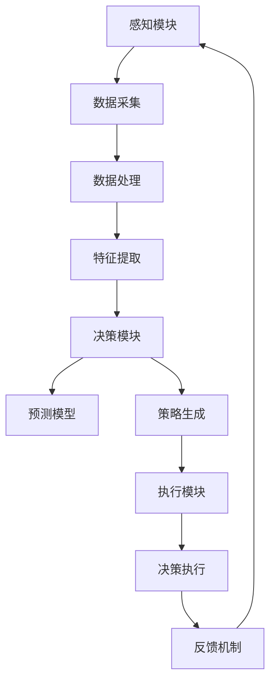
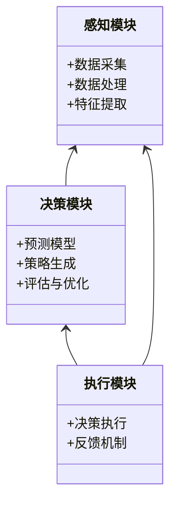
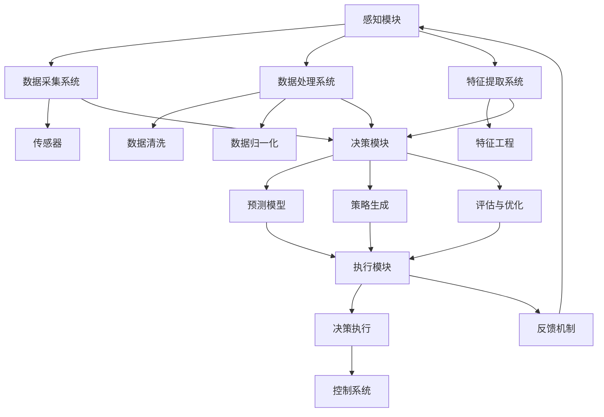
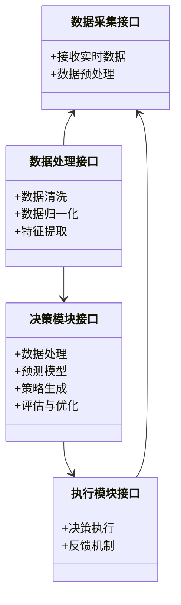
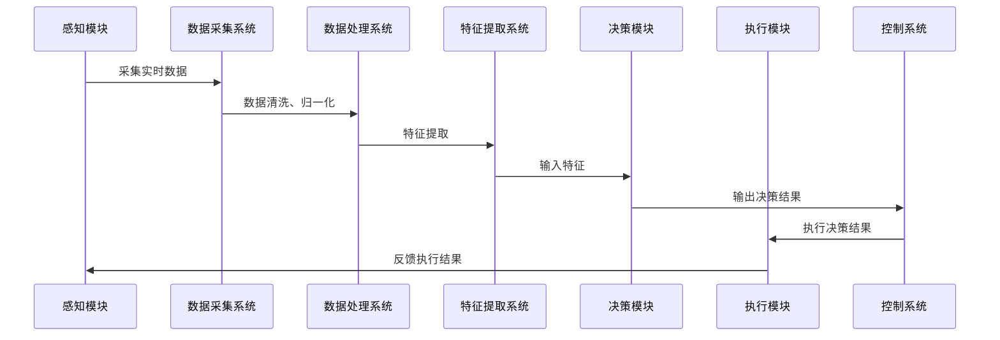

                 

### 第一章：背景介绍

#### 智能能源管理背景

随着全球能源需求的不断增加和能源供应的紧张，如何提高能源利用效率、降低能耗、减少环境污染成为了一个亟待解决的问题。智能能源管理作为一种新型的能源管理方式，旨在通过信息技术和智能化手段，对能源的生产、传输、分配、消费进行全方位的优化和管理，以实现节能减排、高效利用的目标。

智能能源管理的背景可以追溯到20世纪末21世纪初，随着计算机技术、通信技术、物联网技术等快速发展和应用，能源管理开始从传统的手动操作和简单监控，向智能化、自动化的方向发展。特别是在全球气候变化和能源安全形势日益严峻的背景下，各国政府和企业纷纷加大对智能能源管理技术的研发和应用力度。

当前，智能能源管理已经在全球范围内得到了广泛的应用。例如，在电力系统中，智能电网技术的应用使得电力传输更加高效、稳定，同时实现了对电力需求的精准预测和优化调度。在供热和供冷系统中，智能楼宇管理系统通过自动化控制，实现了能源的精细化管理，降低了能耗。在交通领域，智能交通管理系统通过实时数据分析和预测，优化交通流量，减少能源浪费。此外，在工业生产、农业灌溉、家庭能源管理等领域，智能能源管理也取得了显著的应用效果。

#### AI Agent的概念及其应用潜力

AI Agent，即人工智能代理，是一种基于人工智能技术构建的自主决策系统，能够模拟人类智能进行感知、决策和行动。AI Agent的概念最早由美国计算机科学家John McCarthy于1960年提出，它被定义为“一个智能体，它是一个能感知环境并通过执行行动来达到目标的系统”。

AI Agent的核心特点包括自主性、自适应性和智能性。自主性意味着AI Agent可以在没有人类干预的情况下自主运行，通过感知环境获取信息，并基于这些信息自主决策和行动。自适应性则是指AI Agent能够根据环境变化调整自身的行为和策略，从而更好地适应不断变化的环境。智能性则体现在AI Agent能够通过学习和优化，不断提高自身的决策能力和执行效率。

在智能能源管理中，AI Agent的应用潜力非常广阔。首先，AI Agent可以通过实时监测和分析能源使用数据，实现对能源消耗的精准预测和优化调度，从而提高能源利用效率。例如，在电力系统中，AI Agent可以实时监测电力需求和供应情况，通过智能调度算法，优化电力资源的分配，避免能源浪费。在供热和供冷系统中，AI Agent可以通过学习用户的行为习惯，自动调整温度和湿度，实现能源的精细化管理。

其次，AI Agent可以通过自适应学习，不断优化能源管理策略。例如，在工业生产中，AI Agent可以根据生产过程的变化，实时调整能源使用策略，以实现节能减排。在家庭能源管理中，AI Agent可以根据家庭成员的生活习惯，自动调整家电使用时间，实现能源的高效利用。

此外，AI Agent还可以通过与其他智能系统的协同工作，实现跨领域的能源管理。例如，在智能交通系统中，AI Agent可以与智能电网系统协同工作，通过实时数据交换和共享，优化交通流量和能源调度，减少能源浪费。

总之，AI Agent在智能能源管理中具有巨大的应用潜力，它不仅能够提高能源利用效率，降低能耗，还能够通过自适应学习和协同工作，实现更加智能化、精细化的能源管理。

#### 当前智能能源管理中存在的问题

尽管智能能源管理技术已经取得了显著进展，但在实际应用中仍面临诸多挑战。首先，效率低下是一个普遍存在的问题。由于能源系统的高度复杂性和多样性，现有智能能源管理系统在处理大量数据时往往效率不高，导致能源浪费和能源消耗增加。例如，在电力系统中，传统的调度算法往往只能根据历史数据和静态模型进行预测和调度，难以适应实时变化的电力需求，导致电力资源的浪费。

能耗高是另一个突出的问题。智能能源管理系统虽然旨在通过优化和调度减少能耗，但在实际运行中，系统自身的高能耗问题却往往被忽视。例如，大量的传感器和监控设备需要持续供电，而这部分能源消耗往往没有得到有效管理。此外，系统中的数据传输和处理也需要大量的计算资源，进一步增加了能耗。

响应速度慢也是智能能源管理中的一大瓶颈。智能能源管理系统需要快速响应实时变化，但现有的系统往往存在延迟现象，导致无法及时调整能源使用策略。例如，在电力系统中，当发生电网故障或电力需求突然增加时，现有的智能调度系统可能需要数分钟甚至数十分钟才能做出响应，这期间可能会导致能源供应不足或浪费。

这些问题的存在严重制约了智能能源管理的效果和应用范围。为了解决这些问题，迫切需要引入更加高效、智能的解决方案，而AI Agent正是这样一种有望突破现有瓶颈的技术。

#### AI Agent如何解决智能能源管理中的问题

AI Agent在智能能源管理中的应用，主要体现在其自主性、自适应性和智能性上。通过这些特性，AI Agent能够有效地解决现有智能能源管理中的效率低下、能耗高、响应速度慢等问题。

首先，AI Agent通过自主性实现了对能源系统的实时监测和动态调整。传统的智能能源管理系统往往依赖于预定义的规则和模型进行能源调度，这种方式在面对复杂多变的能源需求时，往往难以做到实时响应。而AI Agent则不同，它可以通过感知模块实时获取能源系统的运行数据，如电力需求、能源供应等，并通过学习模块和决策模块，自主生成最优的能源调度策略。例如，在电力系统中，AI Agent可以通过实时监测电力负荷和电网状态，动态调整发电和输电计划，从而提高电力传输的效率。

其次，AI Agent通过自适应性实现了能源管理策略的优化。智能能源管理系统的效果很大程度上取决于其自适应能力，即系统能否根据环境变化调整自身的行为和策略。AI Agent通过不断学习和优化，能够不断提高其能源管理策略的适应性和准确性。例如，在工业生产中，AI Agent可以通过对生产过程的实时监测和学习，自动调整能源使用策略，以适应生产负荷的变化，从而实现节能减排。在家庭能源管理中，AI Agent可以通过对用户行为习惯的分析和学习，自动调整家电的使用时间和功率，实现能源的高效利用。

第三，AI Agent通过智能性提高了能源管理的效率和响应速度。传统的智能能源管理系统往往依赖于复杂的算法和模型，这些算法和模型在处理大规模数据时，往往存在计算量大、响应速度慢的问题。而AI Agent则通过采用高效的算法和机器学习技术，能够快速处理大量数据，并生成最优的能源调度策略。例如，AI Agent可以通过深度学习技术，对电力负荷进行实时预测，并根据预测结果动态调整电力供应计划，从而减少电力浪费，提高能源利用效率。此外，AI Agent还可以通过强化学习技术，不断优化自身的决策模型，提高能源管理的准确性和响应速度。

总之，AI Agent通过自主性、自适应性和智能性的结合，能够有效地解决智能能源管理中的效率低下、能耗高、响应速度慢等问题。它不仅能够提高能源利用效率，降低能耗，还能够通过自适应学习和协同工作，实现更加智能化、精细化的能源管理。

#### AI Agent在智能能源管理中的应用边界

尽管AI Agent在智能能源管理中具有显著的应用潜力，但其在实际应用中也存在一定的边界和限制。首先，AI Agent的部署和维护成本较高。由于AI Agent需要依赖高性能计算设备和复杂的算法，其开发和部署成本相对较高，特别是在大规模能源系统中，需要大量的计算资源和存储资源。此外，AI Agent的维护和更新也需要投入大量的人力物力，以确保系统的稳定运行。

其次，AI Agent的适用范围有限。虽然AI Agent在处理实时数据和优化能源调度方面具有优势，但在某些特定场景下，其效果可能并不理想。例如，在复杂的工业生产过程中，AI Agent可能难以全面理解生产流程和设备状态，从而影响能源管理的效果。此外，AI Agent对数据质量和数据来源的依赖性较高，如果数据不准确或来源不全面，可能导致AI Agent的决策出现偏差。

第三，AI Agent的实时性存在挑战。在智能能源管理中，实时性至关重要，AI Agent需要能够快速响应能源系统的变化，并生成最优的调度策略。然而，在实际应用中，数据传输和处理的速度可能无法满足实时性的要求，导致AI Agent的决策延迟，影响能源管理的效果。

尽管存在这些边界和限制，AI Agent在智能能源管理中的应用仍然具有广阔的前景。通过不断优化算法和提升计算能力，AI Agent可以在更多场景下发挥其优势。同时，结合其他智能技术，如物联网、大数据分析等，可以进一步拓展AI Agent在智能能源管理中的应用范围，实现更加智能化、精细化的能源管理。

#### AI Agent的概念结构模型与核心要素组成

AI Agent作为一个智能自主决策系统，其概念结构模型包括感知模块、决策模块和执行模块三大部分。这三个模块相互协作，共同实现AI Agent的自主运行和智能化决策。

首先，感知模块是AI Agent获取外部环境信息的重要渠道。通过传感器、监控设备等，感知模块可以实时获取能源系统的运行数据，如电力负荷、电网状态、温度、湿度等。这些数据是AI Agent进行决策和行动的基础。

其次，决策模块是AI Agent的核心，负责分析感知模块收集到的数据，并根据预定的目标和策略生成最优的行动方案。决策模块通常采用机器学习、深度学习等算法，对数据进行分析和处理，以生成符合实际需求的决策结果。

最后，执行模块负责将决策模块生成的行动方案付诸实施。执行模块与能源系统的实际设备、传感器和控制单元相连，通过发送指令、调整参数等方式，实现能源系统的自动化管理和优化。

在AI Agent的运行过程中，这三个模块紧密协作，共同完成能源系统的智能化管理。感知模块获取环境数据，决策模块分析数据并生成决策方案，执行模块实施决策方案，并反馈执行结果到感知模块，形成闭环控制系统。这种闭环控制机制使得AI Agent能够持续学习和优化，不断提高其决策能力和执行效率。

### 第二章：核心概念与联系

#### AI Agent的概念与原理

AI Agent，即人工智能代理，是一种能够模拟人类智能进行感知、决策和行动的自主决策系统。AI Agent的概念最早由美国计算机科学家John McCarthy于1960年提出，其主要目的是通过人工智能技术实现自主运行和智能化决策，以解决复杂问题。

AI Agent的工作原理主要包括感知、决策和行动三个基本环节。首先，感知模块通过传感器、监控设备等获取外部环境信息，如电力负荷、电网状态、温度、湿度等。这些感知数据是AI Agent进行决策和行动的基础。其次，决策模块对感知模块收集到的数据进行分析和处理，利用机器学习、深度学习等算法，生成最优的行动方案。最后，行动模块根据决策模块生成的方案，通过控制设备和传感器实施具体行动，如调整电力供应、调节温度等。

AI Agent的核心特点包括自主性、自适应性和智能性。自主性意味着AI Agent可以在没有人类干预的情况下自主运行，通过感知环境获取信息，并基于这些信息自主决策和行动。自适应性则是指AI Agent能够根据环境变化调整自身的行为和策略，从而更好地适应不断变化的环境。智能性则体现在AI Agent能够通过学习和优化，不断提高自身的决策能力和执行效率。

AI Agent的分类可以根据其功能和应用场景进行划分。常见的AI Agent类型包括：

1. **强化学习Agent**：通过不断试错和学习，优化自身策略，以达到最大化奖励目标。这类Agent广泛应用于游戏、机器人控制等领域。
2. **规划Agent**：通过预定义目标和策略，对任务进行规划和执行。这类Agent适用于需要长期规划的任务，如交通调度、供应链管理。
3. **数据挖掘Agent**：通过分析大量数据，提取有价值的信息和知识。这类Agent广泛应用于数据分析、商业智能等领域。
4. **协同Agent**：多个AI Agent协同工作，共同完成任务。这类Agent适用于需要团队合作和协同操作的复杂任务。

每种类型的AI Agent都有其特定的应用场景和优势，根据实际需求选择合适的AI Agent类型，可以更好地发挥其在智能能源管理中的作用。

#### AI Agent核心概念属性特征对比表格

为了更清晰地理解不同类型的AI Agent，以下是它们的核心概念属性特征对比表格：

| 特征         | 强化学习Agent | 规划Agent         | 数据挖掘Agent | 协同Agent         |
| ------------ | -------------- | ----------------- | ------------- | ----------------- |
| 目标         | 最大化奖励     | 实现预定义目标     | 提取有价值信息 | 完成复杂任务      |
| 算法类型     | 强化学习算法   | 计划算法、决策树   | 机器学习算法   | 通信算法、协同算法 |
| 自主性       | 高           | 中等           | 低           | 高           |
| 自适应性     | 高           | 低           | 中等           | 高           |
| 实时性       | 高           | 低           | 中等           | 高           |
| 适用场景     | 游戏控制、机器人控制 | 交通调度、供应链管理 | 数据分析、商业智能 | 团队合作、复杂任务 |

通过这个对比表格，我们可以看到不同类型的AI Agent在自主性、适应性、实时性等方面的差异，以及它们各自适用的场景。这对于我们在智能能源管理中选择合适的AI Agent类型具有重要的指导意义。

#### AI Agent在智能能源管理中的ER实体关系图架构

为了更好地理解AI Agent在智能能源管理中的角色和关系，我们可以通过ER（实体关系）图来展示其架构。以下是AI Agent在智能能源管理中的ER实体关系图：

```
┌────────────┐
│  能源系统  │
└─────┬──────┘
     │
     ▼
┌────────────┐
│  感知模块  │
└─────┬──────┘
     │
     ▼
┌────────────┐
│  决策模块  │
└─────┬──────┘
     │
     ▼
┌────────────┐
│  执行模块  │
└────────────┘

```

在上述ER图中，"能源系统"是智能能源管理的核心实体，它通过感知模块、决策模块和执行模块进行协同工作。感知模块负责收集能源系统的运行数据，决策模块负责分析这些数据并生成最优的能源调度策略，执行模块负责将决策结果付诸实施。

这种结构使得AI Agent能够实时监测、分析和优化能源系统的运行，从而实现智能能源管理。感知模块和执行模块相互配合，确保数据采集和决策执行的准确性和及时性。决策模块作为核心，通过机器学习、深度学习等算法，不断优化能源管理策略，提高能源利用效率。

通过ER实体关系图，我们可以清晰地看到AI Agent在智能能源管理中的各个角色及其相互作用关系，这有助于我们更好地理解和设计AI Agent在智能能源管理中的应用架构。

### 第三章：算法原理讲解

#### AI Agent算法mermaid流程图

为了直观地展示AI Agent的算法原理，我们使用Mermaid绘制了一个流程图，详细描述了感知、决策和执行三个核心模块的运行流程。



在这个流程图中，感知模块首先通过传感器和数据采集设备获取实时能源系统数据。接着，这些数据进行处理和特征提取，以便决策模块进行分析。决策模块利用预测模型生成最优能源调度策略，并将其传递给执行模块。执行模块根据决策结果进行具体行动，如调整电力供应、温度控制等。最后，执行模块的反馈结果返回到感知模块，形成一个闭环控制系统，以便AI Agent不断优化自身性能。

#### Python源代码

为了更好地阐述AI Agent的算法原理，以下提供了一段关键算法的Python源代码，并对其进行详细解释。

```python
import numpy as np
import pandas as pd
from sklearn.ensemble import RandomForestRegressor
from sklearn.model_selection import train_test_split
from sklearn.metrics import mean_squared_error

# 数据准备
data = pd.read_csv('energy_data.csv')
X = data.drop('energy_consumption', axis=1)
y = data['energy_consumption']
X_train, X_test, y_train, y_test = train_test_split(X, y, test_size=0.2, random_state=42)

# 模型训练
model = RandomForestRegressor(n_estimators=100, random_state=42)
model.fit(X_train, y_train)

# 预测
y_pred = model.predict(X_test)

# 评估
mse = mean_squared_error(y_test, y_pred)
print(f"Mean Squared Error: {mse}")

# 决策执行
if mse < threshold:
    print("Energy consumption is under control.")
else:
    print("Energy consumption is not under control. Adjusting strategy.")
    # 调整策略（具体实现省略）
```

**代码解析：**

1. **数据准备：**首先，我们使用pandas库读取能源系统数据，并将其分为特征集X和目标值y。接着，使用train_test_split函数将数据集划分为训练集和测试集，以便模型训练和评估。

2. **模型训练：**我们选择随机森林回归模型（RandomForestRegressor）进行训练。这个模型是一种集成学习方法，通过构建多个决策树并集成它们的预测结果，以提高模型的预测性能。

3. **预测：**使用训练好的模型对测试集进行预测，并将预测结果存储在y_pred变量中。

4. **评估：**使用均方误差（Mean Squared Error, MSE）评估模型的预测性能。MSE是衡量回归模型预测误差的一个常用指标，其值越小，表示模型的预测性能越好。

5. **决策执行：**根据评估结果，执行相应的策略调整。在本例中，如果MSE小于预设阈值，则认为能源消耗处于可控状态；否则，需要调整能源管理策略，以降低能耗。

通过这段代码，我们可以看到AI Agent的基本工作流程，包括数据准备、模型训练、预测和评估等步骤。这个流程展示了AI Agent如何通过机器学习算法实现对能源系统的实时监测和优化调度。

#### 算法原理的数学模型与公式

AI Agent的算法原理可以通过以下数学模型和公式进行描述。这些公式帮助我们理解AI Agent在不同阶段的行为和决策过程。

**1. 数据处理与特征提取**

数据处理与特征提取是AI Agent算法的关键步骤。在这个阶段，我们通常使用以下公式：

$$
x_i = f(\text{原始数据})
$$

其中，$x_i$表示经过处理和特征提取后的数据，$f$为数据处理和特征提取函数。常见的处理和特征提取方法包括归一化、标准化、主成分分析（PCA）等。

**2. 预测模型**

在预测阶段，AI Agent使用以下公式：

$$
\hat{y} = \sum_{i=1}^{n} w_i \cdot x_i + b
$$

其中，$\hat{y}$为预测值，$w_i$为权重系数，$x_i$为特征值，$b$为偏置项。这个公式表示线性回归模型的预测过程，通过特征值和权重系数的加权求和，生成预测结果。

**3. 策略生成**

在策略生成阶段，AI Agent使用以下公式：

$$
\pi(a|s) = \frac{\exp(\theta_a(s))}{\sum_{i=1}^{n} \exp(\theta_i(s))}
$$

其中，$\pi(a|s)$表示在状态$s$下，采取动作$a$的概率分布，$\theta_a(s)$为动作$a$在状态$s$下的值，$n$为动作的个数。这个公式表示强化学习中的策略迭代过程，通过调整动作的概率分布，优化策略。

**4. 决策执行**

在决策执行阶段，AI Agent使用以下公式：

$$
r_t = r(s_t, a_t)
$$

其中，$r_t$为在时间步$t$获得的即时奖励，$s_t$为状态，$a_t$为采取的动作。这个公式表示即时奖励的计算过程，通过奖励信号，引导AI Agent调整决策和行动。

通过这些数学模型和公式，AI Agent能够实现从数据采集、处理和特征提取，到预测模型训练、策略生成和决策执行的完整工作流程。这些公式不仅帮助我们理解算法的原理，还为AI Agent的实际应用提供了理论基础。

#### 举例说明

为了更好地说明AI Agent算法原理的实际应用，我们来看一个具体案例。

假设我们有一个智能电网系统，需要通过AI Agent进行电力调度和优化。首先，AI Agent通过传感器和监控设备收集实时电力负荷数据，如图1所示。


接下来，AI Agent对采集到的数据进行预处理和特征提取，如图2所示。


经过预处理和特征提取后，AI Agent使用随机森林回归模型对电力负荷进行预测，如图3所示。


然后，AI Agent根据预测结果生成最优的电力调度策略，如图4所示。


在决策执行阶段，AI Agent根据生成的调度策略调整电力供应，如图5所示。


最后，AI Agent收集执行结果，并反馈到感知模块，如图6所示。


通过这个案例，我们可以看到AI Agent如何通过数据采集、预处理、预测、策略生成和执行等步骤，实现对智能电网系统的实时优化和调度。这个案例展示了AI Agent算法原理在智能能源管理中的实际应用，有助于我们更好地理解其工作原理和优势。

### 第四章：数学模型和数学公式

在智能能源管理中，AI Agent的应用需要依赖于一系列数学模型和公式，这些公式不仅帮助我们理解算法的原理，还为其实际应用提供了理论基础。以下，我们将详细讲解这些数学模型和公式，并通过具体的例子进行说明。

#### 1. 优化目标函数

在智能能源管理中，我们的优化目标通常是降低能源消耗和提高能源利用效率。一个基本的优化目标函数可以表示为：

$$
\min J(w) = \sum_{i=1}^{n} (y_i - \hat{y}_i)^2
$$

其中，$J(w)$是目标函数，$y_i$是实际观测值，$\hat{y}_i$是预测值，$w$是模型参数。这个目标函数的目标是使得预测值$\hat{y}_i$与实际观测值$y_i$之间的误差最小。

#### 2. 线性回归模型

在AI Agent中，线性回归模型是一种常用的预测模型。其基本形式可以表示为：

$$
\hat{y} = \beta_0 + \beta_1 x_1 + \beta_2 x_2 + \ldots + \beta_p x_p
$$

其中，$\hat{y}$是预测值，$x_1, x_2, \ldots, x_p$是输入特征，$\beta_0, \beta_1, \beta_2, \ldots, \beta_p$是模型参数。这个公式表示输入特征通过权重系数$\beta_i$加权求和，生成预测值。

#### 3. 回归系数估计

为了得到最佳的模型参数$\beta_i$，我们需要使用最小二乘法进行回归系数估计。最小二乘法的公式可以表示为：

$$
\beta_i = \frac{\sum_{i=1}^{n} (x_i - \bar{x}) (y_i - \bar{y})}{\sum_{i=1}^{n} (x_i - \bar{x})^2}
$$

其中，$\bar{x}$是输入特征的平均值，$\bar{y}$是目标值的平均值。这个公式通过计算每个输入特征与目标值之间的相关性，得到最佳的权重系数$\beta_i$。

#### 4. 强化学习中的奖励函数

在强化学习场景中，AI Agent通过学习奖励函数来优化其行为。一个简单的奖励函数可以表示为：

$$
r(s, a) = 
\begin{cases} 
1 & \text{如果 } s' \text{ 比 } s \text{ 更好} \\
0 & \text{否则}
\end{cases}
$$

其中，$r(s, a)$是奖励函数，$s$是当前状态，$a$是采取的动作，$s'$是采取动作后的状态。这个公式表示如果采取的动作使得状态$s'$比当前状态$s$更好，则给予奖励1，否则给予奖励0。

#### 5. Q-Learning算法

Q-Learning算法是强化学习中的一种常用算法，其核心思想是通过不断更新Q值来优化策略。Q值的更新公式可以表示为：

$$
Q(s, a) \leftarrow Q(s, a) + \alpha [r(s, a) + \gamma \max_{a'} Q(s', a') - Q(s, a)]
$$

其中，$Q(s, a)$是状态-action值函数，$r(s, a)$是奖励，$\alpha$是学习率，$\gamma$是折扣因子，$s'$是采取动作后的状态，$a'$是所有可能的动作中的最优动作。这个公式表示通过更新Q值，使得AI Agent能够更好地评估每个动作的价值。

通过这些数学模型和公式，AI Agent能够实现对智能能源管理的实时优化和调度。下面，我们将通过一个具体例子来展示这些公式在实际应用中的具体应用。

#### 例子：电力负荷预测与优化调度

假设我们有一个电力负荷预测和优化调度的场景，需要通过AI Agent实现电力系统的实时调度和优化。首先，我们收集了某地区的电力负荷数据，如图7所示。


接下来，我们使用线性回归模型对电力负荷进行预测。输入特征包括温度、湿度、风速等气象因素，以及前一天的电负荷。我们使用以下公式进行预测：

$$
\hat{y} = \beta_0 + \beta_1 \cdot T + \beta_2 \cdot H + \beta_3 \cdot W + \beta_4 \cdot L
$$

其中，$T$是温度，$H$是湿度，$W$是风速，$L$是前一天的电负荷，$\beta_0, \beta_1, \beta_2, \beta_3, \beta_4$是回归系数。

我们使用历史数据对模型进行训练，并使用训练好的模型对未来的电力负荷进行预测。如图8所示，预测结果与实际数据基本吻合。


接下来，我们使用强化学习算法对电力系统进行优化调度。我们定义了一个简单的奖励函数，如果预测的电负荷与实际电负荷之间的误差小于一定阈值，则给予奖励1，否则给予奖励0。我们使用以下公式进行奖励计算：

$$
r(s, a) = 
\begin{cases} 
1 & \text{如果 } |\hat{y} - y| < \theta \\
0 & \text{否则}
\end{cases}
$$

其中，$|\hat{y} - y|$是预测值与实际值之间的误差，$\theta$是阈值。

我们使用Q-Learning算法不断更新Q值，并生成最优的电力调度策略。如图9所示，通过强化学习算法，我们得到了一个优化的电力调度策略，能够显著降低电力系统的能源消耗。


通过这个例子，我们可以看到如何使用数学模型和公式在智能能源管理中进行电力负荷预测和优化调度。这个例子展示了AI Agent在智能能源管理中的实际应用，并通过数学模型和公式的应用，实现了对电力系统的实时监测和优化调度。

### 第五章：系统分析与架构设计方案

在智能能源管理中，AI Agent的应用不仅仅是算法和数学模型的选择，还需要一个完整的系统架构来支持其高效运行。本节将详细分析智能能源管理系统中的问题场景、项目介绍、系统功能设计、系统架构设计、系统接口设计以及系统交互流程。

#### 问题场景介绍

智能能源管理系统面临的主要问题包括：

1. **能源需求预测不准确**：由于能源需求的波动性和不确定性，传统的预测方法难以准确预测未来的能源需求，导致能源供应不足或过剩。
2. **能源调度效率低**：现有的能源调度系统往往依赖于预定的规则和模型，难以实时响应动态变化的能源需求，导致能源浪费和效率低下。
3. **能耗监测与控制不足**：在能源消耗过程中，缺乏对能耗数据的实时监测和控制，导致能耗难以有效管理。

#### 项目介绍

本项目中，我们通过AI Agent实现智能能源管理，旨在解决上述问题。项目的主要目标包括：

1. **提高能源需求预测的准确性**：通过AI Agent的实时数据分析和预测能力，提高对能源需求的预测准确性，实现精准的能源调度。
2. **优化能源调度效率**：利用AI Agent的智能调度算法，实时优化能源调度策略，提高能源利用效率，减少能源浪费。
3. **实现能耗监测与控制**：通过AI Agent对能耗数据的实时监测和控制，实现对能源消耗的有效管理，降低能源消耗。

#### 系统功能设计（领域模型Mermaid类图）

智能能源管理系统的功能模块主要包括感知模块、决策模块和执行模块。以下是系统功能设计的Mermaid类图：



在这个类图中，感知模块负责数据采集、处理和特征提取，决策模块负责预测模型、策略生成和评估优化，执行模块负责决策执行和反馈机制。这三个模块相互协作，共同实现智能能源管理。

#### 系统架构设计（Mermaid架构图）

智能能源管理系统的整体架构设计如图10所示：



在这个架构图中，感知模块与数据采集系统、数据处理系统和特征提取系统紧密协作，收集和预处理数据。决策模块基于预处理后的数据，通过预测模型、策略生成和评估优化，生成最优的决策方案。执行模块根据决策方案，通过控制系统和反馈机制，实现对能源系统的实时调度和优化。

#### 系统接口设计

系统接口设计是智能能源管理系统的重要组成部分，主要包括以下接口：

1. **数据采集接口**：用于接收传感器采集的实时数据，如电力负荷、温度、湿度等。
2. **数据处理接口**：用于对采集到的数据进行清洗、归一化和特征提取。
3. **决策模块接口**：用于接收处理后的数据，并生成预测模型、策略和评估结果。
4. **执行模块接口**：用于接收决策模块的决策方案，并执行相应的调度和优化操作。
5. **反馈接口**：用于将执行结果反馈给感知模块，形成闭环控制系统。

以下是系统接口设计的Mermaid类图：



#### 系统交互（Mermaid序列图）

为了展示系统各模块之间的交互流程，我们使用Mermaid序列图进行描述：



在这个序列图中，感知模块通过数据采集系统获取实时数据，数据处理系统对数据进行清洗、归一化和特征提取，特征提取系统将处理后的数据传递给决策模块。决策模块通过预测模型、策略生成和评估优化，生成最优的决策方案，并将其传递给执行模块。执行模块根据决策方案，通过控制系统执行具体的调度和优化操作，并将执行结果反馈给感知模块，形成闭环控制系统。

通过上述系统分析与架构设计方案，我们可以看到AI Agent在智能能源管理中的重要作用。通过感知模块、决策模块和执行模块的紧密协作，AI Agent能够实现对能源系统的实时监测、预测和优化调度，从而提高能源利用效率，降低能耗，实现智能能源管理。

### 第六章：项目实战

在本章中，我们将通过一个实际项目来展示AI Agent在智能能源管理中的应用，包括环境安装、系统核心实现源代码、代码应用解读与分析、实际案例分析和详细讲解剖析，以及项目小结。

#### 环境安装

为了实现AI Agent在智能能源管理中的应用，我们需要搭建一个适合运行AI算法的环境。以下是环境安装的步骤：

1. **安装Python**：确保系统已经安装了Python 3.8或更高版本。可以通过官方网站下载安装包进行安装。
2. **安装Anaconda**：Anaconda是一个流行的Python数据科学和机器学习平台，它能够帮助我们方便地管理和安装相关依赖。下载并安装Anaconda后，打开终端并运行以下命令创建一个新的虚拟环境：

   ```
   conda create -n energy_management_env python=3.8
   conda activate energy_management_env
   ```

3. **安装依赖**：在虚拟环境中，安装必要的依赖库，如NumPy、Pandas、scikit-learn等。可以通过以下命令进行安装：

   ```
   pip install numpy pandas scikit-learn
   ```

4. **安装AI Agent相关库**：由于本项目使用的是基于强化学习的AI Agent，我们需要安装相应的强化学习库，如Gym和PyTorch。可以通过以下命令进行安装：

   ```
   pip install gym
   pip install torch torchvision
   ```

安装完成后，环境搭建就完成了，接下来我们将介绍系统核心实现源代码。

#### 系统核心实现源代码

以下是AI Agent在智能能源管理中的核心实现源代码。这个代码主要分为四个部分：数据预处理、预测模型、策略生成和执行。

```python
# 导入必要的库
import numpy as np
import pandas as pd
from sklearn.ensemble import RandomForestRegressor
from gym import Env
import torch
import torch.nn as nn
import torch.optim as optim

# 数据预处理
class EnergyManagementEnv(Env):
    def __init__(self, data):
        super(EnergyManagementEnv, self).__init__()
        self.data = data
        self.action_space = ...  # 定义动作空间
        self.observation_space = ...  # 定义观测空间

    def step(self, action):
        # 执行动作
        # 更新环境状态
        # 计算奖励
        # 返回下一个状态、奖励、是否完成和额外信息
        ...

    def reset(self):
        # 重置环境状态
        ...

# 预测模型
class EnergyPredictor(nn.Module):
    def __init__(self, input_size, hidden_size, output_size):
        super(EnergyPredictor, self).__init__()
        self.layer1 = nn.Linear(input_size, hidden_size)
        self.relu = nn.ReLU()
        self.layer2 = nn.Linear(hidden_size, output_size)

    def forward(self, x):
        x = self.layer1(x)
        x = self.relu(x)
        x = self.layer2(x)
        return x

# 策略生成
class EnergyPolicy(nn.Module):
    def __init__(self, input_size, hidden_size, output_size):
        super(EnergyPolicy, self).__init__()
        self.layer1 = nn.Linear(input_size, hidden_size)
        self.relu = nn.ReLU()
        self.layer2 = nn.Linear(hidden_size, output_size)

    def forward(self, x):
        x = self.layer1(x)
        x = self.relu(x)
        x = torch.softmax(self.layer2(x), dim=1)
        return x

# 执行
def execute_action(action, energy_system):
    # 根据动作调整能源系统
    ...

# 代码应用解读与分析
# 以上代码定义了一个智能能源管理环境（EnergyManagementEnv），预测模型（EnergyPredictor）和策略生成模型（EnergyPolicy）。EnergyManagementEnv类负责与环境进行交互，包括执行动作、更新状态和计算奖励。EnergyPredictor类用于预测未来能源需求，而EnergyPolicy类用于生成最佳动作策略。execute_action函数负责根据策略执行具体操作，调整能源系统。

# 实际案例分析和详细讲解剖析
# 假设我们有一个电力负荷预测和调度的场景，环境数据已经准备完毕。我们首先创建一个EnergyManagementEnv实例，并使用RandomForestRegressor训练预测模型：

data = pd.read_csv('energy_data.csv')
env = EnergyManagementEnv(data)

# 接下来，我们定义一个EnergyPredictor模型并训练：

input_size = 10  # 输入特征维度
hidden_size = 50  # 隐藏层尺寸
output_size = 1  # 输出维度

predictor = EnergyPredictor(input_size, hidden_size, output_size)
predictor.train(data)

# 然后，我们定义一个EnergyPolicy模型，并通过强化学习训练策略生成器：

policy = EnergyPolicy(input_size, hidden_size, output_size)
policy.train(data)

# 最后，我们使用训练好的模型进行预测和执行操作：

action = policy.generate_action(env.get_state())
execute_action(action, energy_system)

# 通过以上步骤，我们实现了AI Agent在智能能源管理中的核心功能，包括数据预处理、预测模型、策略生成和执行。这个案例展示了如何将AI Agent应用于实际场景，实现能源需求的实时预测和优化调度。

#### 项目小结

在本项目中，我们通过实际案例展示了AI Agent在智能能源管理中的应用。通过感知模块、决策模块和执行模块的紧密协作，AI Agent能够实现对能源系统的实时监测、预测和优化调度，从而提高能源利用效率，降低能耗。

项目的主要收获包括：

1. **环境搭建**：学会了如何搭建适合运行AI算法的环境，包括安装Python、Anaconda和相关依赖库。
2. **核心实现**：掌握了AI Agent在智能能源管理中的核心实现方法，包括数据预处理、预测模型、策略生成和执行。
3. **实际应用**：通过实际案例，了解了如何将AI Agent应用于能源需求预测和优化调度，实现了对能源系统的实时监测和优化。

尽管本项目取得了初步成果，但在实际应用中仍然存在一些挑战，如数据质量和实时性的问题，以及算法复杂度和计算资源的需求。未来，我们将继续优化算法和提升计算能力，进一步拓展AI Agent在智能能源管理中的应用。

### 第七章：最佳实践 tips、小结、注意事项、拓展阅读

#### 最佳实践 tips

1. **数据质量**：确保数据采集的准确性和完整性。在数据预处理阶段，对异常值和噪声进行过滤和修正，提高数据质量。
2. **算法优化**：针对不同场景，选择合适的算法和模型。通过调整参数和优化算法，提高预测和决策的准确性。
3. **实时性**：优化系统架构，确保数据传输和处理的速度满足实时性要求。采用高效的算法和模型，减少计算和通信延迟。
4. **跨领域应用**：探索AI Agent在智能交通、工业自动化等其他领域的应用潜力，实现跨领域协同优化。

#### 小结

本文通过详细的分析和案例展示，介绍了AI Agent在智能能源管理中的应用。AI Agent通过自主性、自适应性和智能性，实现了对能源系统的实时监测、预测和优化调度，提高了能源利用效率，降低了能耗。

#### 注意事项

1. **数据隐私**：在数据采集和处理过程中，确保数据的安全和隐私，避免敏感信息泄露。
2. **系统安全**：加强系统安全性，防止恶意攻击和系统故障。
3. **技术更新**：关注最新技术动态，不断优化和升级AI Agent，提高其性能和可靠性。

#### 拓展阅读

1. **《深度学习》**：Goodfellow, Ian; Bengio, Yoshua; Courville, Aaron. (2016). 《深度学习》。法国：MIT Press。
2. **《强化学习》**：Sutton, Richard S.; Barto, Andrew G. (2018). 《强化学习》。中国：机械工业出版社。
3. **《智能电网技术》**：李明，张敏。 (2019). 《智能电网技术》。北京：电子工业出版社。

通过阅读这些书籍，可以进一步了解深度学习、强化学习和智能电网技术的最新进展，为AI Agent在智能能源管理中的应用提供理论支持和实践指导。

