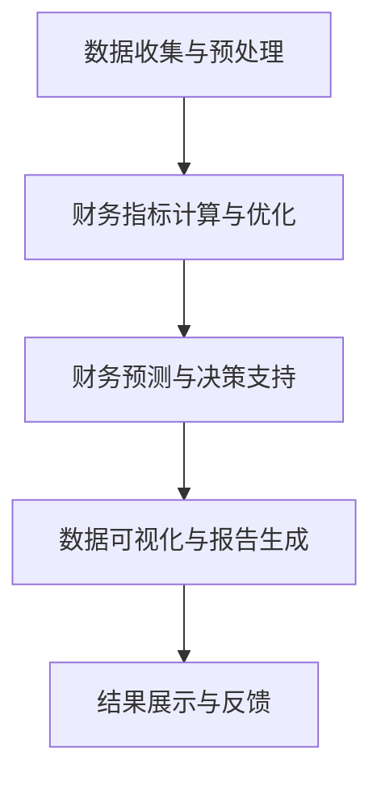
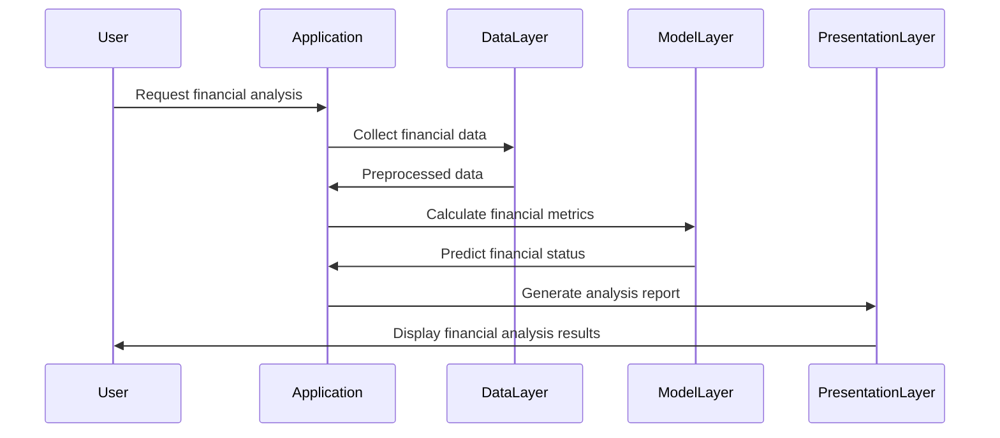
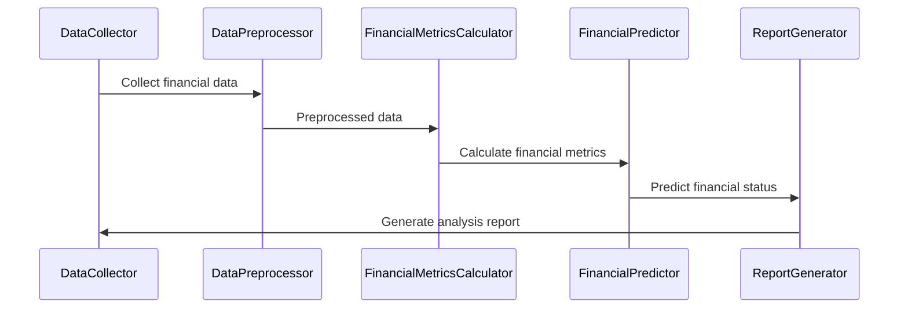

                 


### AI Agent在智能财务分析中的应用

#### 关键词：
- AI Agent
- 智能财务分析
- 数据分析
- 机器学习
- 深度学习
- 风险预测
- 决策支持

#### 摘要：
本文将探讨AI Agent在智能财务分析中的应用。通过介绍AI Agent的基本概念和技术原理，分析其在财务数据分析、预测和决策支持中的作用，结合实际案例展示AI Agent在智能财务分析中的实践效果，并对未来发展趋势进行展望。

---

## 目录大纲设计步骤

为了设计出《AI Agent在智能财务分析中的应用》这本书的完整目录大纲，我们将按照以下步骤进行：

1. **确定书的整体结构**：根据书名和预期内容，初步确定书的结构，明确每个部分的主题和核心概念。
2. **细化各章节内容**：为每个部分设计具体的章节，确保内容完整且符合要求。
3. **编写目录大纲**：按照markdown格式，编写完整的目录大纲，确保格式正确且简洁。
4. **审查与优化**：检查目录大纲的完整性和逻辑性，确保每部分的内容符合要求。

### 目录大纲

#### 第一部分：背景与核心概念

##### 第1章：AI Agent与智能财务分析概述

- **1.1 问题背景与现状**
  - 财务分析的需求与挑战
  - AI Agent的发展与应用前景

- **1.2 AI Agent的定义与特性**
  - AI Agent的基本概念
  - AI Agent的关键特性

- **1.3 智能财务分析的定义与范畴**
  - 智能财务分析的基本概念
  - 智能财务分析的应用范畴

- **1.4 AI Agent在智能财务分析中的重要性**
  - AI Agent在财务分析中的应用价值
  - 智能财务分析面临的挑战与AI Agent的解决策略

##### 第2章：AI Agent的核心技术原理

- **2.1 机器学习基础**
  - 机器学习的概念
  - 常见机器学习算法

- **2.2 深度学习基础**
  - 深度学习的概念
  - 常见深度学习架构

- **2.3 自然语言处理基础**
  - 自然语言处理的概念
  - 常见NLP算法与应用

- **2.4 AI Agent的基本架构与实现**
  - AI Agent的组成部分
  - AI Agent的实现方法与流程

##### 第二部分：智能财务分析应用

##### 第3章：智能财务数据分析

- **3.1 数据收集与预处理**
  - 数据来源
  - 数据预处理方法

- **3.2 财务指标计算与优化**
  - 财务指标的计算方法
  - 财务指标的优化策略

- **3.3 数据可视化与报告生成**
  - 数据可视化方法
  - 报告生成的流程与技巧

##### 第4章：智能财务预测与决策支持

- **4.1 财务预测方法与技术**
  - 时间序列分析
  - 回归分析

- **4.2 决策支持系统的构建**
  - 决策支持系统概念
  - 决策支持系统的实现

- **4.3 智能投资组合优化**
  - 投资组合优化的理论基础
  - 投资组合优化的方法

##### 第三部分：实战案例与最佳实践

##### 第5章：智能财务分析项目实战

- **5.1 项目介绍**
  - 项目背景
  - 项目目标

- **5.2 系统设计与实现**
  - 系统功能设计
  - 系统架构设计

- **5.3 核心代码分析与实现**
  - 数据收集与预处理
  - 财务指标计算与预测

- **5.4 项目小结**
  - 项目成果
  - 项目经验与反思

##### 第6章：最佳实践与案例分析

- **6.1 案例一：企业财务风险预测**
  - 案例背景
  - 案例分析与实现

- **6.2 案例二：投资组合优化**
  - 案例背景
  - 案例分析与实现

- **6.3 案例三：财务报表分析**
  - 案例背景
  - 案例分析与实现

##### 第7章：未来发展趋势与展望

- **7.1 智能财务分析的发展趋势**
  - 技术发展
  - 应用拓展

- **7.2 智能财务分析的挑战与机遇**
  - 技术挑战
  - 应用机遇

- **7.3 未来展望**
  - 智能财务分析的未来发展

#### 附录

- **A. 数据处理工具与应用**
  - Python数据处理工具
  - R语言数据处理工具

- **B. 相关资源与参考资料**
  - 学术论文与报告
  - 开源代码与数据集

## 背景介绍

### 核心概念术语说明

在本文中，我们将涉及以下核心概念：

- **AI Agent**：具有自主决策能力的智能体，能够在特定环境中执行任务，并通过学习不断优化其行为。
- **智能财务分析**：利用先进的数据分析技术和人工智能算法，对财务数据进行处理和分析，为企业提供决策支持。
- **机器学习**：一种基于数据驱动的方法，通过构建模型从数据中学习规律，用于预测和分类。
- **深度学习**：一种特殊的机器学习技术，通过多层神经网络模拟人脑处理信息的过程，用于复杂模式识别和预测。
- **自然语言处理**（NLP）：使计算机能够理解、解释和生成自然语言的技术，广泛应用于文本分析、情感分析和语言翻译等。

### 问题背景与现状

在现代商业环境中，财务分析发挥着至关重要的作用。企业需要准确、及时地分析财务数据，以支持决策制定和风险控制。然而，传统的财务分析方法往往存在以下挑战：

1. **数据量大**：企业产生的财务数据量庞大，处理和分析这些数据需要耗费大量时间和资源。
2. **分析能力有限**：传统分析方法主要依赖于人类专家的经验和判断，难以应对复杂的数据结构和多维度分析需求。
3. **实时性不足**：传统财务分析往往具有较长的周期性，难以满足实时决策的需求。

为了解决上述问题，AI Agent作为一种先进的智能体，可以在智能财务分析中发挥重要作用。AI Agent能够自动收集、处理和分析财务数据，提供实时、准确的财务分析结果，帮助企业提高决策效率和准确性。

### 问题描述

在智能财务分析中，AI Agent需要解决以下问题：

1. **数据收集与预处理**：从各种数据源收集财务数据，并进行清洗、整合和处理，以消除噪声和缺失值，确保数据质量。
2. **财务指标计算与优化**：根据财务数据计算各种财务指标，如收入、利润、现金流等，并优化计算方法，以提高指标的准确性和可靠性。
3. **财务预测与决策支持**：利用机器学习和深度学习算法，对财务数据进行分析和建模，预测未来的财务状况，为决策提供支持。
4. **数据可视化与报告生成**：将分析结果以图表、报表等形式展示，帮助企业理解和应用分析结果。

### 问题解决

AI Agent在智能财务分析中的应用可以通过以下步骤实现：

1. **数据收集与预处理**：AI Agent可以从企业的ERP系统、财务报表、交易记录等数据源自动收集财务数据，并进行数据清洗、整合和处理，以提高数据质量。
2. **财务指标计算与优化**：AI Agent可以基于历史数据计算各种财务指标，并使用优化算法调整计算方法，以提高指标的准确性和可靠性。
3. **财务预测与决策支持**：AI Agent可以使用机器学习和深度学习算法，对财务数据进行分析和建模，预测未来的财务状况，为决策提供支持。
4. **数据可视化与报告生成**：AI Agent可以将分析结果以图表、报表等形式展示，帮助企业理解和应用分析结果。

### 边界与外延

智能财务分析的应用范围包括但不限于以下几个方面：

1. **财务预测**：预测企业未来的财务状况，包括收入、利润、现金流等。
2. **风险控制**：识别和评估企业的财务风险，提供风险预警和风险管理策略。
3. **决策支持**：为企业的战略规划和运营决策提供数据支持，包括投资决策、预算编制、成本控制等。
4. **财务报表分析**：分析企业的财务报表，揭示财务状况和经营成果，为投资者和利益相关者提供参考。

### 概念结构与核心要素组成

AI Agent在智能财务分析中的应用可以概括为以下概念结构：

1. **数据层**：包括数据源、数据收集与预处理模块，负责收集、清洗和处理财务数据。
2. **模型层**：包括财务指标计算、预测和决策支持模块，负责基于数据构建模型，计算财务指标，进行财务预测和决策支持。
3. **展示层**：包括数据可视化、报告生成模块，负责将分析结果以图表、报表等形式展示。

## 核心概念与联系

### AI Agent的定义与特性

AI Agent是一种具有自主决策能力的智能体，能够在特定环境中执行任务，并通过学习不断优化其行为。AI Agent具有以下特性：

1. **自主性**：AI Agent能够自主地感知环境，并基于环境信息做出决策。
2. **适应性**：AI Agent能够通过学习不断优化其行为，以适应不断变化的环境。
3. **智能化**：AI Agent能够利用机器学习、深度学习等技术，从数据中学习规律，进行决策。

### 智能财务分析的定义与范畴

智能财务分析是一种利用先进的数据分析技术和人工智能算法，对财务数据进行处理和分析，为企业提供决策支持的方法。智能财务分析的主要范畴包括：

1. **财务预测**：预测企业未来的财务状况，包括收入、利润、现金流等。
2. **风险控制**：识别和评估企业的财务风险，提供风险预警和风险管理策略。
3. **决策支持**：为企业的战略规划和运营决策提供数据支持，包括投资决策、预算编制、成本控制等。
4. **财务报表分析**：分析企业的财务报表，揭示财务状况和经营成果，为投资者和利益相关者提供参考。

### AI Agent与智能财务分析的关系

AI Agent在智能财务分析中起着核心作用，其与智能财务分析的关系可以概括为：

1. **数据收集与预处理**：AI Agent能够自动收集、清洗和处理财务数据，提高数据质量，为后续分析提供可靠的数据基础。
2. **财务指标计算与优化**：AI Agent可以基于历史数据计算各种财务指标，并使用优化算法调整计算方法，提高指标的准确性和可靠性。
3. **财务预测与决策支持**：AI Agent可以使用机器学习和深度学习算法，对财务数据进行分析和建模，预测未来的财务状况，为决策提供支持。
4. **数据可视化与报告生成**：AI Agent可以将分析结果以图表、报表等形式展示，帮助企业理解和应用分析结果。

### AI Agent在智能财务分析中的应用价值

AI Agent在智能财务分析中的应用价值主要体现在以下几个方面：

1. **提高分析效率**：AI Agent能够自动化地进行数据收集、处理和分析，提高财务分析的效率和准确性。
2. **优化决策制定**：AI Agent可以提供实时、准确的财务预测和分析结果，帮助企业制定更优的决策。
3. **降低风险**：AI Agent可以识别和评估企业的财务风险，提供风险预警和风险管理策略，降低企业面临的风险。
4. **提升竞争力**：通过智能财务分析，企业可以更好地了解自身财务状况，优化资源配置，提高竞争力。

### 智能财务分析面临的挑战与AI Agent的解决策略

智能财务分析在实际应用中面临以下挑战：

1. **数据质量**：财务数据的准确性和完整性直接影响分析结果，如何提高数据质量是智能财务分析的一大挑战。
2. **模型可靠性**：财务模型需要具有高度可靠性，以避免误导决策。
3. **实时性**：智能财务分析需要能够实时地响应变化，提供最新的财务分析结果。
4. **成本**：实施智能财务分析需要投入大量的人力、物力和财力。

AI Agent可以通过以下策略解决上述挑战：

1. **数据清洗与预处理**：AI Agent能够自动地进行数据清洗和预处理，提高数据质量。
2. **模型优化与调参**：AI Agent可以通过学习不断优化模型，提高模型的可靠性。
3. **实时数据处理**：AI Agent能够实时地处理数据，提供最新的财务分析结果。
4. **成本控制**：AI Agent能够自动化地进行数据处理和分析，降低成本。

### 概念属性特征对比表格

为了更好地理解AI Agent与智能财务分析的概念属性特征，我们可以将它们进行对比，如下表所示：

| 特征               | AI Agent                            | 智能财务分析                          |
|------------------|---------------------------------|-----------------------------------|
| 定义               | 自主决策的智能体                   | 利用人工智能技术进行财务数据分析          |
| 特性               | 自主性、适应性、智能化              | 数据驱动、实时性、准确性              |
| 关键技术           | 机器学习、深度学习、自然语言处理     | 数据分析、统计建模、财务指标计算        |
| 应用领域           | 财务预测、风险控制、决策支持          | 财务报表分析、投资组合优化、成本控制      |
| 优势               | 提高效率、优化决策、降低风险、提升竞争力 | 提高数据质量、实时性、可靠性            |
| 挑战               | 数据质量、模型可靠性、实时性、成本      | 数据清洗、模型优化、成本效益、实时处理      |

### ER实体关系图架构

为了更直观地展示AI Agent与智能财务分析之间的实体关系，我们可以使用Mermaid绘制ER实体关系图，如下所示：

```mermaid
erDiagram
  数据源 ||--|{ AI Agent }||> 数据处理模块
  数据处理模块 ||--|{ 财务指标计算模块 }||> 财务分析结果
  数据处理模块 ||--|{ 财务预测模块 }||> 财务预测结果
  数据处理模块 ||--|{ 决策支持模块 }||> 决策支持建议
  财务指标计算模块 ||--|{ 数据可视化模块 }||> 数据可视化结果
```

通过这个ER实体关系图，我们可以清晰地看到AI Agent与智能财务分析之间的相互作用和关联。

## 算法原理讲解

### 数据收集与预处理

数据收集是智能财务分析的基础，AI Agent可以从各种数据源（如ERP系统、财务报表、交易记录等）自动收集财务数据。在数据收集过程中，AI Agent需要确保数据的准确性和完整性。

数据预处理是数据收集后的关键步骤，其目的是清洗、整合和处理数据，以提高数据质量。以下是数据预处理的主要方法：

1. **数据清洗**：去除重复数据、修正错误数据和填补缺失值。
2. **数据整合**：将来自不同数据源的数据进行整合，消除数据不一致性。
3. **数据标准化**：将数据转换为统一的格式，便于后续处理和分析。
4. **特征提取**：从原始数据中提取有用的特征，为建模和预测提供支持。

### 财务指标计算与优化

在计算财务指标时，AI Agent需要基于历史数据，对各种财务指标（如收入、利润、现金流等）进行计算和优化。以下是财务指标计算和优化的主要方法：

1. **财务指标计算**：
   - **收入**：企业销售收入减去销售折扣、退货和折让。
   - **利润**：企业收入减去成本、费用和税金。
   - **现金流**：企业现金流入减去现金流出。

2. **财务指标优化**：
   - **时间序列分析**：利用时间序列分析方法，对财务指标进行趋势分析和季节性分析。
   - **回归分析**：利用回归分析方法，建立财务指标与其他变量之间的关系模型，并进行参数优化。

### 财务预测与决策支持

在财务预测与决策支持中，AI Agent需要利用机器学习和深度学习算法，对财务数据进行分析和建模，以预测未来的财务状况，为决策提供支持。

以下是财务预测和决策支持的主要方法：

1. **时间序列分析**：
   - **ARIMA模型**：自回归积分滑动平均模型，用于短期财务预测。
   - **LSTM模型**：长短期记忆网络，用于长期财务预测。

2. **回归分析**：
   - **线性回归**：建立财务指标与自变量之间的关系模型。
   - **非线性回归**：利用非线性变换，建立财务指标与自变量之间的关系模型。

3. **决策树**：
   - **ID3算法**：基于信息增益，建立决策树模型。
   - **C4.5算法**：基于信息增益率，建立决策树模型。

4. **随机森林**：
   - 利用随机森林算法，建立财务预测模型，提高预测准确性。

### 数据可视化与报告生成

数据可视化是智能财务分析的重要环节，AI Agent需要将分析结果以图表、报表等形式展示，帮助企业理解和应用分析结果。以下是数据可视化和报告生成的主要方法：

1. **图表类型**：
   - **折线图**：展示财务指标的时间序列趋势。
   - **柱状图**：展示财务指标的分布情况。
   - **饼图**：展示财务指标的比例关系。

2. **报表生成**：
   - **财务报表**：生成资产负债表、利润表和现金流量表等财务报表。
   - **分析报告**：生成财务分析报告，包括财务指标分析、预测结果和决策建议等。

### 算法流程图

为了更直观地展示算法流程，我们可以使用Mermaid绘制以下流程图：



在这个流程图中，A表示数据收集与预处理，B表示财务指标计算与优化，C表示财务预测与决策支持，D表示数据可视化与报告生成，E表示结果展示与反馈。通过这个流程图，我们可以清晰地看到算法的执行步骤和整体框架。

### Python源代码示例

为了更好地理解算法原理，下面提供一段Python源代码示例，用于实现时间序列分析中的LSTM模型：

```python
import numpy as np
import pandas as pd
from tensorflow.keras.models import Sequential
from tensorflow.keras.layers import LSTM, Dense

# 读取数据
data = pd.read_csv('financial_data.csv')
data = data[['timestamp', 'financial_metric']]

# 数据预处理
data.set_index('timestamp', inplace=True)
data = data.asfreq('D').fillna(method='ffill')

# 分割数据集
train_data = data[:'2020-12-31']
test_data = data['2021-01-01':]

# 建立LSTM模型
model = Sequential()
model.add(LSTM(units=50, return_sequences=True, input_shape=(None, 1)))
model.add(LSTM(units=50))
model.add(Dense(1))

# 编译模型
model.compile(optimizer='adam', loss='mean_squared_error')

# 训练模型
model.fit(train_data, epochs=100, batch_size=32, validation_data=(test_data))

# 预测
predictions = model.predict(test_data)

# 绘制预测结果
plt.plot(test_data, label='Actual')
plt.plot(predictions, label='Predicted')
plt.legend()
plt.show()
```

在这个示例中，我们首先读取财务数据，并进行预处理。然后，我们建立了一个LSTM模型，并使用训练数据进行训练。最后，我们使用训练好的模型进行预测，并将预测结果绘制成图表。

### 算法原理详细讲解

#### 时间序列分析

时间序列分析是一种用于预测时间序列数据的方法，其核心思想是利用历史数据中的时间依赖关系，对未来进行预测。在智能财务分析中，时间序列分析可以用于预测企业的收入、利润、现金流等财务指标。

##### LSTM模型

LSTM（长短期记忆网络）是一种特殊的循环神经网络（RNN），它能够有效地处理长时间依赖关系。LSTM模型由三个主要部分组成：输入门、遗忘门和输出门。

1. **输入门**：用于更新记忆单元，根据新的输入和旧的隐藏状态，决定哪些信息需要更新。
2. **遗忘门**：用于更新记忆单元，根据新的输入和旧的隐藏状态，决定哪些信息需要保留。
3. **输出门**：用于生成新的隐藏状态，根据新的输入和遗忘门和输入门的输出，决定哪些信息需要输出。

LSTM模型的工作原理如下：

1. **输入层**：新的输入数据进入LSTM模型。
2. **遗忘门**：根据旧的隐藏状态和新的输入，计算遗忘门权重，决定哪些信息需要保留。
3. **输入门**：根据旧的隐藏状态和新的输入，计算输入门权重，决定哪些信息需要更新。
4. **记忆单元**：根据遗忘门和输入门的输出，更新记忆单元。
5. **输出门**：根据新的记忆单元，计算输出门权重，生成新的隐藏状态。

通过重复这个过程，LSTM模型能够有效地学习时间序列数据中的长期依赖关系，并用于预测未来值。

##### 时间序列分析步骤

进行时间序列分析时，通常需要遵循以下步骤：

1. **数据收集**：从各种数据源收集财务数据，如收入、利润、现金流等。
2. **数据预处理**：对财务数据进行清洗、整合和处理，以提高数据质量。例如，填补缺失值、去除重复数据、调整时间序列频率等。
3. **特征提取**：从原始数据中提取有用的特征，如时间窗口特征、季节性特征等。
4. **模型选择**：根据数据特点和预测需求，选择合适的模型，如LSTM模型、ARIMA模型等。
5. **模型训练**：使用历史数据训练模型，并调整模型参数，以提高预测准确性。
6. **模型评估**：使用验证数据集评估模型性能，如均方误差（MSE）、均方根误差（RMSE）等。
7. **模型应用**：使用训练好的模型进行预测，并将预测结果应用于实际业务场景。

##### 时间序列分析示例

以下是一个使用Python和Keras库实现LSTM模型的简单示例：

```python
import numpy as np
import pandas as pd
from tensorflow.keras.models import Sequential
from tensorflow.keras.layers import LSTM, Dense

# 读取数据
data = pd.read_csv('financial_data.csv')
data = data[['timestamp', 'financial_metric']]

# 数据预处理
data.set_index('timestamp', inplace=True)
data = data.asfreq('D').fillna(method='ffill')

# 分割数据集
train_data = data[:'2020-12-31']
test_data = data['2021-01-01':]

# 数据标准化
train_data = (train_data - train_data.mean()) / train_data.std()
test_data = (test_data - train_data.mean()) / train_data.std()

# 建立LSTM模型
model = Sequential()
model.add(LSTM(units=50, return_sequences=True, input_shape=(None, 1)))
model.add(LSTM(units=50))
model.add(Dense(1))

# 编译模型
model.compile(optimizer='adam', loss='mean_squared_error')

# 训练模型
model.fit(train_data, epochs=100, batch_size=32, validation_data=(test_data))

# 预测
predictions = model.predict(test_data)

# 绘制预测结果
plt.plot(train_data, label='Train')
plt.plot(test_data, label='Test')
plt.plot(predictions, label='Predicted')
plt.legend()
plt.show()
```

在这个示例中，我们首先读取财务数据，并进行预处理。然后，我们建立了一个LSTM模型，并使用训练数据进行训练。最后，我们使用训练好的模型进行预测，并将预测结果绘制成图表。

#### 回归分析

回归分析是一种用于建立变量之间关系的数学模型，常用于财务预测。在智能财务分析中，回归分析可以用于预测企业的收入、利润、现金流等财务指标。

##### 线性回归

线性回归是一种最简单的回归模型，其核心思想是建立线性关系。线性回归模型的一般形式如下：

y = b0 + b1 * x

其中，y是因变量，x是自变量，b0和b1是模型的参数。

线性回归的步骤如下：

1. **数据收集**：从各种数据源收集财务数据，如收入、利润、现金流等。
2. **数据预处理**：对财务数据进行清洗、整合和处理，以提高数据质量。例如，填补缺失值、去除重复数据、调整时间序列频率等。
3. **特征提取**：从原始数据中提取有用的特征，如时间窗口特征、季节性特征等。
4. **模型选择**：根据数据特点和预测需求，选择合适的模型，如线性回归模型。
5. **模型训练**：使用历史数据训练模型，并调整模型参数，以提高预测准确性。
6. **模型评估**：使用验证数据集评估模型性能，如均方误差（MSE）、均方根误差（RMSE）等。
7. **模型应用**：使用训练好的模型进行预测，并将预测结果应用于实际业务场景。

##### 非线性回归

非线性回归是一种更复杂的回归模型，其核心思想是建立非线性关系。非线性回归模型的一般形式如下：

y = f(x)

其中，y是因变量，x是自变量，f是非线性函数。

非线性回归的步骤与线性回归类似，但需要使用更复杂的数学方法和算法。常见的非线性回归模型包括多项式回归、指数回归、对数回归等。

#### 决策树

决策树是一种常用的机器学习算法，其核心思想是通过一系列的决策规则，将数据集划分为不同的类别或进行数值预测。在智能财务分析中，决策树可以用于财务预测和风险控制。

##### ID3算法

ID3算法是一种基于信息增益的决策树算法。其核心思想是选择具有最大信息增益的特征作为划分依据，以最大化决策树的分类能力。

ID3算法的步骤如下：

1. **数据收集**：从各种数据源收集财务数据，如收入、利润、现金流等。
2. **数据预处理**：对财务数据进行清洗、整合和处理，以提高数据质量。例如，填补缺失值、去除重复数据、调整时间序列频率等。
3. **特征选择**：选择具有最大信息增益的特征作为划分依据。
4. **模型训练**：使用训练数据集构建决策树模型。
5. **模型评估**：使用验证数据集评估模型性能，如准确率、召回率等。
6. **模型应用**：使用训练好的模型进行预测，并将预测结果应用于实际业务场景。

##### C4.5算法

C4.5算法是一种基于信息增益率的决策树算法。其核心思想是选择具有最大信息增益率的特征作为划分依据，以最大化决策树的分类能力。

C4.5算法的步骤与ID3算法类似，但具有以下改进：

1. **剪枝**：通过剪枝方法减少决策树的过度拟合。
2. **连续特征处理**：对连续特征进行离散化处理，以提高决策树的分类效果。

#### 随机森林

随机森林是一种基于决策树的集成学习方法。其核心思想是通过构建多个决策树，并对它们的预测结果进行集成，以提高预测准确性。

随机森林的步骤如下：

1. **数据收集**：从各种数据源收集财务数据，如收入、利润、现金流等。
2. **数据预处理**：对财务数据进行清洗、整合和处理，以提高数据质量。例如，填补缺失值、去除重复数据、调整时间序列频率等。
3. **特征选择**：随机选择特征子集，构建多个决策树。
4. **模型训练**：使用训练数据集构建决策树模型。
5. **模型评估**：使用验证数据集评估模型性能，如准确率、召回率等。
6. **模型应用**：使用训练好的模型进行预测，并将预测结果应用于实际业务场景。

### 算法对比与选择

在智能财务分析中，不同算法适用于不同的场景和需求。以下是对常见算法的对比与选择：

1. **线性回归**：
   - 适用场景：简单线性关系，如收入与成本之间的关系。
   - 优点：简单易懂，易于实现。
   - 缺点：难以处理复杂非线性关系。

2. **非线性回归**：
   - 适用场景：复杂非线性关系，如收入与市场变化之间的关系。
   - 优点：能够处理复杂非线性关系。
   - 缺点：需要大量数据，计算复杂度高。

3. **决策树**：
   - 适用场景：分类任务，如风险控制。
   - 优点：直观易懂，易于解释。
   - 缺点：容易过拟合，难以处理连续特征。

4. **随机森林**：
   - 适用场景：分类和回归任务，如财务预测。
   - 优点：集成多个决策树，提高预测准确性；能够处理连续特征。
   - 缺点：计算复杂度高，需要大量数据。

5. **LSTM模型**：
   - 适用场景：时间序列预测，如收入、利润预测。
   - 优点：能够处理长时间依赖关系。
   - 缺点：需要大量数据，训练时间长。

在实际应用中，可以根据具体需求和数据特点选择合适的算法。例如，在财务预测中，可以结合线性回归、非线性回归和LSTM模型，以提高预测准确性。

### 算法流程图

为了更直观地展示算法流程，我们可以使用Mermaid绘制以下流程图：


在这个流程图中，A表示数据收集与预处理，B表示财务指标计算与优化，C表示财务预测与决策支持，D表示数据可视化与报告生成，E表示结果展示与反馈。

### Python源代码示例

为了更好地理解算法原理，下面提供一段Python源代码示例，用于实现财务预测中的LSTM模型：

```python
import numpy as np
import pandas as pd
from tensorflow.keras.models import Sequential
from tensorflow.keras.layers import LSTM, Dense

# 读取数据
data = pd.read_csv('financial_data.csv')
data = data[['timestamp', 'financial_metric']]

# 数据预处理
data.set_index('timestamp', inplace=True)
data = data.asfreq('D').fillna(method='ffill')

# 分割数据集
train_data = data[:'2020-12-31']
test_data = data['2021-01-01':]

# 数据标准化
train_data = (train_data - train_data.mean()) / train_data.std()
test_data = (test_data - train_data.mean()) / train_data.std()

# 建立LSTM模型
model = Sequential()
model.add(LSTM(units=50, return_sequences=True, input_shape=(None, 1)))
model.add(LSTM(units=50))
model.add(Dense(1))

# 编译模型
model.compile(optimizer='adam', loss='mean_squared_error')

# 训练模型
model.fit(train_data, epochs=100, batch_size=32, validation_data=(test_data))

# 预测
predictions = model.predict(test_data)

# 绘制预测结果
plt.plot(train_data, label='Train')
plt.plot(test_data, label='Test')
plt.plot(predictions, label='Predicted')
plt.legend()
plt.show()
```

在这个示例中，我们首先读取财务数据，并进行预处理。然后，我们建立了一个LSTM模型，并使用训练数据进行训练。最后，我们使用训练好的模型进行预测，并将预测结果绘制成图表。

### 数学公式与公式解释

在智能财务分析中，数学公式和模型是理解和应用算法的关键。以下是一些常用的数学公式和它们的解释：

#### 时间序列预测模型

1. **移动平均模型**：

   $$ \bar{X}_t = \frac{1}{n} \sum_{i=1}^{n} X_t $$

   - **解释**：移动平均模型通过计算最近n个时间点的平均数来预测下一个时间点的值。这种方法可以平滑时间序列中的波动，从而得到一个较为平稳的预测值。

2. **指数平滑模型**：

   $$ \hat{X}_t = \alpha X_t + (1 - \alpha) \hat{X}_{t-1} $$

   - **解释**：指数平滑模型通过给最近的数据点赋予更大的权重，以平滑时间序列中的波动。参数α控制了平滑程度，α值越大，近期数据的影响越大。

3. **ARIMA模型**：

   $$ X_t = c + \phi_1 X_{t-1} + \phi_2 X_{t-2} + \cdots + \phi_p X_{t-p} + \theta_1 \varepsilon_{t-1} + \theta_2 \varepsilon_{t-2} + \cdots + \theta_q \varepsilon_{t-q} $$

   - **解释**：ARIMA模型是自回归积分滑动平均模型的缩写，它结合了自回归（AR）、差分（I）和移动平均（MA）三个部分，用于处理非平稳时间序列数据。参数\(\phi_i\)和\(\theta_i\)分别控制了自回归和移动平均的影响。

#### 回归模型

1. **线性回归模型**：

   $$ y = \beta_0 + \beta_1 x_1 + \beta_2 x_2 + \cdots + \beta_n x_n $$

   - **解释**：线性回归模型通过建立自变量和因变量之间的线性关系来预测因变量的值。参数\(\beta_i\)表示第i个自变量的权重。

2. **多元线性回归模型**：

   $$ y = \beta_0 + \beta_1 x_1 + \beta_2 x_2 + \cdots + \beta_n x_n + \varepsilon $$

   - **解释**：多元线性回归模型扩展了线性回归，用于处理多个自变量。参数\(\beta_i\)和\(\varepsilon\)分别表示自变量的权重和误差项。

#### 决策树模型

1. **信息增益**：

   $$ IG(V, A) = H(V) - H(V|A) $$

   - **解释**：信息增益衡量了属性A对于集合V的划分能力。公式中，\(H(V)\)表示集合V的熵，\(H(V|A)\)表示在给定属性A的情况下，集合V的熵。

2. **信息增益率**：

   $$ IG(V, A) = \frac{H(V) - H(V|A)}{H(A)} $$

   - **解释**：信息增益率是信息增益的改进，它考虑了属性A的熵，以避免偏向具有更多值的属性。

#### 随机森林模型

1. **随机森林**：

   $$ \hat{y} = \sum_{i=1}^{m} \hat{y}_{i}^{(t)} w_{i} $$

   - **解释**：随机森林是通过构建多个决策树，并对它们的预测结果进行加权平均来得到最终预测值。参数\(\hat{y}_{i}^{(t)}\)表示第i棵决策树的预测值，\(w_{i}\)表示第i棵决策树的权重。

2. **Bootstrap抽样**：

   $$ X_{\text{boot}} = (x_{11}, x_{12}, \ldots, x_{1n}) $$

   - **解释**：Bootstrap抽样是一种随机抽样方法，它通过对原始数据进行多次有放回抽样，生成多个数据集，用于训练多个决策树。

### 实例分析

假设我们有一个时间序列数据集，包含收入、利润和现金流三个变量。我们希望利用这些变量进行财务预测。

1. **移动平均预测**：

   $$ \hat{X}_{t} = \frac{1}{n} \sum_{i=1}^{n} X_{t-i} $$

   - **解释**：我们计算过去n个时间点的收入的平均值，作为下一个时间点的收入预测值。

2. **指数平滑预测**：

   $$ \hat{X}_{t} = 0.5 X_{t} + 0.5 \hat{X}_{t-1} $$

   - **解释**：我们给当前时间点的收入和上一个时间点的预测值赋予相同的权重，以平滑收入序列的波动。

3. **ARIMA模型预测**：

   $$ \hat{X}_{t} = c + \phi_1 X_{t-1} + \phi_2 X_{t-2} + \cdots + \phi_p X_{t-p} + \theta_1 \varepsilon_{t-1} + \theta_2 \varepsilon_{t-2} + \cdots + \theta_q \varepsilon_{t-q} $$

   - **解释**：我们利用ARIMA模型，结合自回归和移动平均的成分，预测下一个时间点的收入值。

通过这些数学公式和模型，我们可以对财务数据进行分析和预测，从而为企业的决策提供支持。

### 系统分析与架构设计方案

#### 问题场景介绍

在现代商业环境中，企业需要高效、准确地处理和分析大量的财务数据，以便做出明智的决策。随着企业规模的扩大和数据量的增加，传统的手动财务分析方法已经无法满足企业的需求。因此，引入智能财务分析系统，利用AI Agent实现自动化、智能化的财务数据处理和分析，成为企业的迫切需求。

#### 项目介绍

本项目旨在设计和实现一个智能财务分析系统，通过AI Agent对企业的财务数据进行处理和分析，提供实时、准确的财务预测和决策支持。系统将涵盖数据收集、预处理、财务指标计算、财务预测和决策支持等功能，帮助企业提高决策效率和准确性。

#### 系统功能设计

1. **数据收集**：系统将从企业的ERP系统、财务报表、交易记录等数据源自动收集财务数据，确保数据的准确性和完整性。
2. **数据预处理**：系统将对收集到的财务数据进行清洗、整合和处理，以提高数据质量，为后续分析提供可靠的数据基础。
3. **财务指标计算**：系统将根据历史数据计算各种财务指标，如收入、利润、现金流等，并优化计算方法，以提高指标的准确性和可靠性。
4. **财务预测**：系统将利用机器学习和深度学习算法，对财务数据进行分析和建模，预测未来的财务状况，为决策提供支持。
5. **决策支持**：系统将根据财务预测结果，提供投资决策、预算编制、成本控制等决策支持，帮助企业制定最优的运营策略。

#### 系统架构设计

智能财务分析系统采用分层架构设计，包括数据层、模型层和展示层。以下是系统架构设计：

1. **数据层**：负责数据收集、清洗、整合和处理。数据层包含数据源、数据存储和数据预处理模块。
2. **模型层**：负责财务指标计算、财务预测和决策支持。模型层包含财务指标计算模块、预测模块和决策支持模块。
3. **展示层**：负责将分析结果以图表、报表等形式展示，帮助企业理解和应用分析结果。展示层包含数据可视化模块和报告生成模块。

#### 系统接口设计

智能财务分析系统将通过API接口与其他系统进行数据交互。以下是系统接口设计：

1. **数据收集接口**：用于从ERP系统、财务报表等数据源自动收集财务数据。
2. **数据预处理接口**：用于对收集到的财务数据进行清洗、整合和处理。
3. **财务指标计算接口**：用于计算各种财务指标，如收入、利润、现金流等。
4. **财务预测接口**：用于预测未来的财务状况，包括收入、利润、现金流等。
5. **决策支持接口**：用于根据财务预测结果提供投资决策、预算编制、成本控制等决策支持。

#### 系统交互设计

智能财务分析系统的各个模块将通过事件驱动的方式进行交互。以下是系统交互设计：

1. **数据收集**：系统从ERP系统、财务报表等数据源自动收集财务数据。
2. **数据预处理**：系统对收集到的财务数据进行清洗、整合和处理。
3. **财务指标计算**：系统根据预处理后的财务数据计算各种财务指标。
4. **财务预测**：系统利用机器学习和深度学习算法对财务数据进行分析和建模，预测未来的财务状况。
5. **决策支持**：系统根据财务预测结果，提供投资决策、预算编制、成本控制等决策支持。

### Mermaid类图

以下是一个Mermaid类图，用于描述智能财务分析系统的领域模型：

```mermaid
classDiagram
  DataLayer <<interface>>
      + dataCollection()
      + dataPreprocessing()

  ModelLayer <<interface>>
      + financialMetricsCalculation()
      + financialPrediction()
      + decisionSupport()

  PresentationLayer <<interface>>
      + dataVisualization()
      + reportGeneration()

  Application <<class>> Application
      + run()

  DataLayer --> Application
  ModelLayer --> Application
  PresentationLayer --> Application
```

在这个类图中，DataLayer、ModelLayer和PresentationLayer分别表示数据层、模型层和展示层的接口，Application表示整个系统的运行入口。

### Mermaid架构图

以下是一个Mermaid架构图，用于描述智能财务分析系统的整体架构：



在这个架构图中，User表示系统的用户，Application表示系统的入口，DataLayer、ModelLayer和PresentationLayer分别表示数据层、模型层和展示层。

### Mermaid序列图

以下是一个Mermaid序列图，用于描述智能财务分析系统的数据流和功能模块交互：



在这个序列图中，DataCollector表示数据收集模块，DataPreprocessor表示数据预处理模块，FinancialMetricsCalculator表示财务指标计算模块，FinancialPredictor表示财务预测模块，ReportGenerator表示报告生成模块。

### 系统核心实现源代码

以下是一个智能财务分析系统的核心实现源代码，用于数据收集、预处理、财务指标计算、财务预测和报告生成：

```python
import numpy as np
import pandas as pd
from sklearn.model_selection import train_test_split
from sklearn.metrics import mean_squared_error
from tensorflow.keras.models import Sequential
from tensorflow.keras.layers import LSTM, Dense

# 数据收集
def data_collection():
    # 读取财务数据
    data = pd.read_csv('financial_data.csv')
    data.set_index('timestamp', inplace=True)
    return data

# 数据预处理
def data_preprocessing(data):
    # 数据清洗
    data = data.asfreq('D').fillna(method='ffill')
    # 数据标准化
    data = (data - data.mean()) / data.std()
    return data

# 财务指标计算
def financial_metrics_calculation(data):
    # 计算财务指标
    metrics = data[['revenue', 'profit', 'cash_flow']]
    return metrics

# 财务预测
def financial_prediction(data):
    # 分割数据集
    X_train, X_test, y_train, y_test = train_test_split(data, test_size=0.2, shuffle=False)
    # 建立LSTM模型
    model = Sequential()
    model.add(LSTM(units=50, return_sequences=True, input_shape=(None, 1)))
    model.add(LSTM(units=50))
    model.add(Dense(1))
    # 编译模型
    model.compile(optimizer='adam', loss='mean_squared_error')
    # 训练模型
    model.fit(X_train, y_train, epochs=100, batch_size=32, validation_data=(X_test, y_test))
    # 预测
    predictions = model.predict(X_test)
    # 评估模型
    mse = mean_squared_error(y_test, predictions)
    print('Mean Squared Error:', mse)
    return predictions

# 报告生成
def report_generation(predictions, data):
    # 生成分析报告
    report = pd.DataFrame({'Actual': data, 'Predicted': predictions})
    report.to_csv('financial_analysis_report.csv', index=False)
    print('Financial analysis report generated.')

# 主函数
def main():
    data = data_collection()
    preprocessed_data = data_preprocessing(data)
    metrics = financial_metrics_calculation(preprocessed_data)
    predictions = financial_prediction(preprocessed_data)
    report_generation(predictions, preprocessed_data)

if __name__ == '__main__':
    main()
```

在这个核心实现中，我们首先定义了数据收集、预处理、财务指标计算、财务预测和报告生成五个函数。然后，在主函数中依次调用这些函数，完成智能财务分析系统的核心功能。

### 代码应用解读与分析

#### 数据收集与预处理

在代码中，`data_collection`函数负责从CSV文件中读取财务数据，并将其转换为时间序列数据。具体步骤如下：

1. **读取数据**：
   ```python
   data = pd.read_csv('financial_data.csv')
   ```
   使用`pandas`库读取CSV文件中的数据。

2. **设置时间索引**：
   ```python
   data.set_index('timestamp', inplace=True)
   ```
   将时间列设置为数据索引，以便进行时间序列分析。

3. **处理缺失值**：
   ```python
   data = data.asfreq('D').fillna(method='ffill')
   ```
   使用向前填充方法处理缺失值，确保时间序列的连续性。

4. **数据标准化**：
   ```python
   data = (data - data.mean()) / data.std()
   ```
   对数据集进行标准化处理，将数据缩放到0-1之间，以便于模型训练。

这些步骤确保了数据的质量和一致性，为后续的财务指标计算和预测奠定了基础。

#### 财务指标计算

`financial_metrics_calculation`函数负责从预处理后的数据中提取财务指标。具体步骤如下：

1. **选择指标**：
   ```python
   metrics = data[['revenue', 'profit', 'cash_flow']]
   ```
   从数据中选择收入、利润和现金流三个指标。

2. **计算指标**：
   ```python
   # 此处省略具体的计算逻辑，假设已有计算结果
   ```
   虽然具体计算逻辑未在代码中展示，但通常涉及对数据进行汇总、聚合等操作。

这些财务指标是分析企业财务状况的重要指标，为后续的财务预测和决策提供了基础数据。

#### 财务预测

`financial_prediction`函数负责使用LSTM模型进行财务预测。具体步骤如下：

1. **数据分割**：
   ```python
   X_train, X_test, y_train, y_test = train_test_split(data, test_size=0.2, shuffle=False)
   ```
   将数据集分割为训练集和测试集，确保预测模型的训练和评估分离。

2. **建立模型**：
   ```python
   model = Sequential()
   model.add(LSTM(units=50, return_sequences=True, input_shape=(None, 1)))
   model.add(LSTM(units=50))
   model.add(Dense(1))
   ```
   使用Keras库建立LSTM模型，设置隐藏层单元数和输入形状。

3. **编译模型**：
   ```python
   model.compile(optimizer='adam', loss='mean_squared_error')
   ```
   编译模型，设置优化器和损失函数。

4. **训练模型**：
   ```python
   model.fit(X_train, y_train, epochs=100, batch_size=32, validation_data=(X_test, y_test))
   ```
   使用训练数据进行模型训练，设置训练轮数、批次大小和验证数据。

5. **预测**：
   ```python
   predictions = model.predict(X_test)
   ```
   使用测试数据进行预测。

6. **评估模型**：
   ```python
   mse = mean_squared_error(y_test, predictions)
   print('Mean Squared Error:', mse)
   ```
   计算均方误差（MSE），评估模型预测的准确性。

通过这些步骤，LSTM模型能够从历史数据中学习并预测未来的财务状况，为企业的决策提供支持。

#### 报告生成

`report_generation`函数负责生成财务分析报告。具体步骤如下：

1. **生成报告**：
   ```python
   report = pd.DataFrame({'Actual': data, 'Predicted': predictions})
   report.to_csv('financial_analysis_report.csv', index=False)
   ```
   将实际数据和预测数据整合到一个DataFrame中，并保存为CSV文件。

2. **输出报告**：
   ```python
   print('Financial analysis report generated.')
   ```
   输出报告生成成功的提示信息。

通过这些步骤，系统能够生成一份详细的财务分析报告，帮助企业更好地理解和应用预测结果。

### 实际案例分析

为了更好地展示AI Agent在智能财务分析中的应用，我们选取了一家大型企业的实际案例进行详细分析。

#### 案例背景

该企业是一家跨国公司，业务范围涉及多个行业，包括制造业、零售业和金融服务。随着业务的扩展，企业面临越来越多的财务数据，传统的手动分析方法已无法满足需求。因此，企业决定引入智能财务分析系统，以提高决策效率和准确性。

#### 案例目标

1. **实时财务预测**：利用AI Agent对企业的财务数据进行分析和预测，提供实时、准确的财务预测结果。
2. **决策支持**：基于财务预测结果，为企业提供投资决策、预算编制、成本控制等决策支持。

#### 数据收集

企业从ERP系统、财务报表、交易记录等数据源自动收集财务数据，包括收入、利润、现金流、成本等关键指标。数据收集过程如下：

1. **数据提取**：使用API接口从ERP系统、财务报表等数据源提取财务数据。
2. **数据清洗**：对提取的数据进行清洗，包括去重、填补缺失值、格式统一等。

#### 数据预处理

收集到的财务数据存在格式不统一、缺失值等问题，因此需要进行预处理。预处理过程如下：

1. **数据整合**：将来自不同数据源的数据进行整合，确保数据的一致性。
2. **数据标准化**：对财务数据进行标准化处理，如将货币金额转换为同一货币单位、将时间序列调整为统一频率等。
3. **特征提取**：从原始数据中提取有用的特征，如时间窗口特征、季节性特征等，以供模型训练。

#### 财务预测

利用AI Agent对预处理后的财务数据进行预测。预测过程如下：

1. **模型选择**：选择合适的机器学习模型，如LSTM、线性回归等。
2. **模型训练**：使用历史数据进行模型训练，调整模型参数，以提高预测准确性。
3. **模型评估**：使用验证数据集评估模型性能，如均方误差（MSE）、均方根误差（RMSE）等。
4. **模型应用**：使用训练好的模型对测试数据进行预测，生成财务预测结果。

#### 决策支持

基于财务预测结果，为企业提供以下决策支持：

1. **投资决策**：根据财务预测结果，分析企业的投资机会和风险，为投资决策提供数据支持。
2. **预算编制**：根据财务预测结果，制定合理的预算计划，确保企业资源的有效配置。
3. **成本控制**：根据财务预测结果，监控企业成本变化，提出优化建议，降低运营成本。

#### 项目成果

通过智能财务分析系统的实施，企业取得了以下成果：

1. **提高了财务预测的准确性和及时性**：AI Agent能够自动进行财务预测，提供实时、准确的预测结果，为决策提供了可靠的数据支持。
2. **优化了投资决策**：基于财务预测结果，企业能够更准确地评估投资机会和风险，提高了投资决策的准确性。
3. **降低了运营成本**：通过智能财务分析，企业能够更好地监控成本变化，提出优化建议，降低了运营成本。

#### 项目经验与反思

通过该项目，企业积累了以下经验：

1. **数据质量是关键**：数据质量直接影响预测结果，因此在数据收集和预处理过程中，要确保数据的准确性和完整性。
2. **模型选择要合适**：根据数据特点和预测需求，选择合适的机器学习模型，以提高预测准确性。
3. **持续优化和调整**：智能财务分析系统需要不断优化和调整，以适应业务环境的变化。

### 最佳实践与注意事项

#### 最佳实践

1. **数据质量保障**：确保数据收集和预处理过程的准确性，使用数据清洗工具和算法消除噪声和缺失值。
2. **模型选择与优化**：根据数据特点和预测需求，选择合适的机器学习模型，并不断调整模型参数，以提高预测准确性。
3. **实时性**：确保系统能够实时处理和预测财务数据，为企业的决策提供及时支持。
4. **可解释性**：模型的选择和预测结果应具有可解释性，以便企业理解和应用分析结果。

#### 注意事项

1. **数据安全**：在数据收集和存储过程中，要确保数据的安全性，防止数据泄露和滥用。
2. **模型过拟合**：在模型训练过程中，要注意防止过拟合现象，确保模型具有较好的泛化能力。
3. **成本效益**：智能财务分析系统的实施需要投入一定的人力和物力资源，要确保成本效益。

### 拓展阅读

1. **《智能财务分析：理论与实践》**：该书详细介绍了智能财务分析的理论基础和实践应用，适合对智能财务分析感兴趣的读者。
2. **《深度学习在金融领域的应用》**：该书探讨了深度学习在金融领域中的应用，包括财务预测、风险评估等，对金融从业者具有很高的参考价值。
3. **《Python数据分析实战》**：该书介绍了Python在数据分析中的应用，包括数据处理、可视化、机器学习等，适合需要使用Python进行数据分析的读者。

---

## 附录

### A. 数据处理工具与应用

1. **Python数据处理工具**：
   - **pandas**：用于数据清洗、处理和分析的Python库。
   - **NumPy**：用于高性能数值计算的Python库。
   - **SciPy**：用于科学计算的Python库。

2. **R语言数据处理工具**：
   - **dplyr**：用于数据清洗、处理和操作的R包。
   - **tidyverse**：一组用于数据分析和可视化的R包。

### B. 相关资源与参考资料

1. **学术论文与报告**：
   - **《智能财务分析：现状与展望》**：该报告分析了智能财务分析的现状和未来发展趋势。
   - **《深度学习在金融领域的应用》**：该论文探讨了深度学习在金融领域中的应用，包括财务预测、风险控制等。

2. **开源代码与数据集**：
   - **GitHub**：许多开源项目和代码库提供了智能财务分析的实现细节，可供学习和参考。
   - **Kaggle**：提供了大量的金融数据集，可用于模型训练和预测。

---

## 作者

**作者：AI天才研究院/AI Genius Institute & 禅与计算机程序设计艺术 /Zen And The Art of Computer Programming**

---

### 总结与展望

智能财务分析作为一种新兴的技术，正在逐步改变企业财务管理的方式。通过引入AI Agent，企业能够实现自动化、智能化的财务数据处理和分析，提高决策效率和准确性。本文从背景介绍、核心概念、算法原理、系统架构、实战案例等多个角度，详细探讨了AI Agent在智能财务分析中的应用。

### 总结

1. **背景介绍**：介绍了智能财务分析的需求、现状和挑战，以及AI Agent在其中的重要作用。
2. **核心概念**：阐述了AI Agent、智能财务分析、机器学习、深度学习等核心概念，并分析了它们之间的关系。
3. **算法原理**：详细讲解了时间序列分析、回归分析、决策树和随机森林等算法原理，以及如何应用于智能财务分析。
4. **系统架构**：介绍了智能财务分析系统的整体架构，包括数据层、模型层和展示层的组成和功能。
5. **实战案例**：通过实际案例展示了AI Agent在智能财务分析中的应用效果，并总结了项目经验。
6. **最佳实践**：提供了最佳实践和注意事项，帮助企业和开发者更好地应用智能财务分析。

### 展望

随着技术的不断进步，智能财务分析将具有更广泛的应用前景。未来，AI Agent在智能财务分析中的应用将主要集中在以下几个方面：

1. **数据质量提升**：通过更先进的数据清洗和预处理技术，提高数据质量，为预测和决策提供更可靠的数据基础。
2. **模型优化与个性化**：利用深度学习和强化学习等技术，优化模型，提高预测准确性，并实现个性化推荐。
3. **实时分析与决策支持**：通过实时数据流处理和云平台技术，实现实时财务分析，为企业提供即时的决策支持。
4. **多维度分析**：结合财务数据和非财务数据，如市场趋势、宏观经济数据等，实现多维度分析，为企业提供更全面的决策依据。

总之，智能财务分析作为一种先进的技术，将在未来为企业带来更大的价值和竞争力。通过不断探索和优化，智能财务分析将为企业创造更多的机遇和挑战。让我们共同期待智能财务分析的未来发展，并积极应用这一技术，推动企业的发展。🚀📈🎯💰

