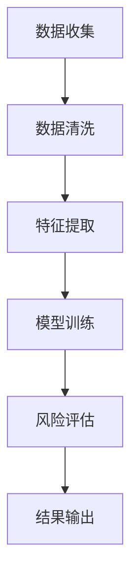
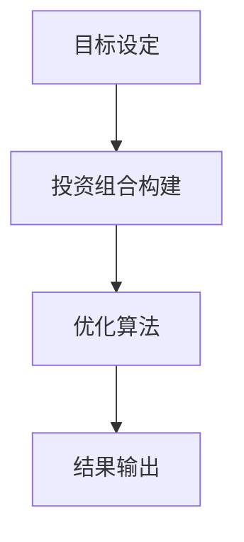
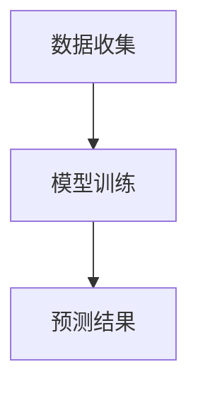
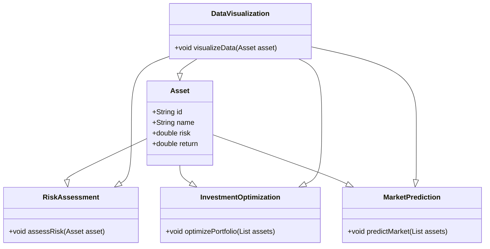
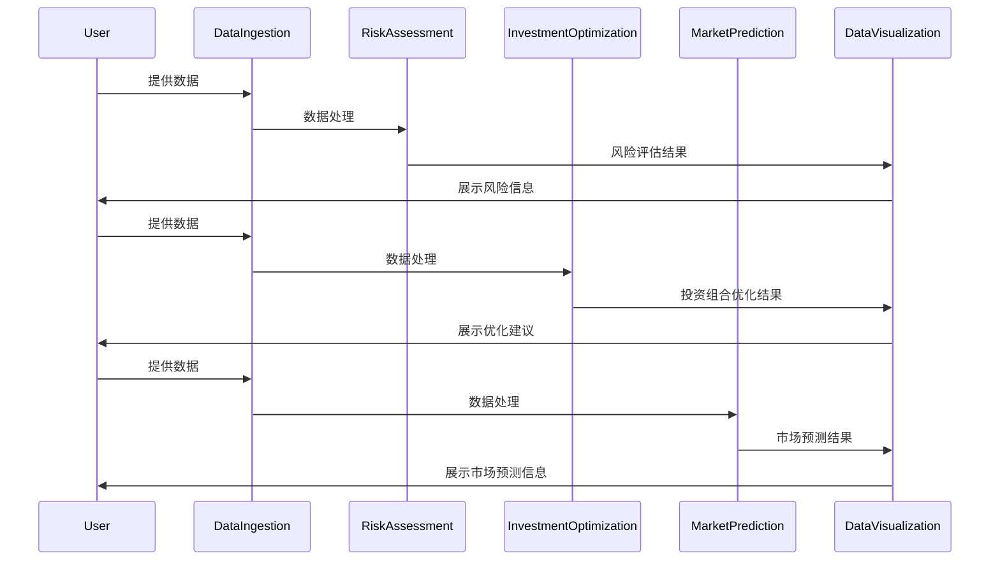
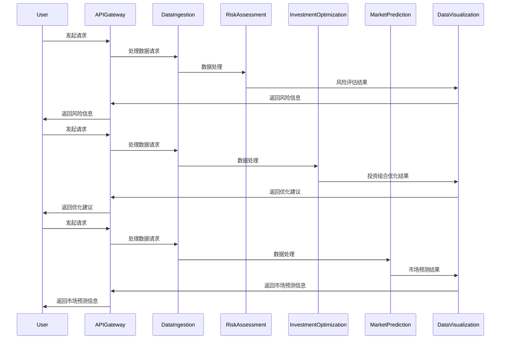
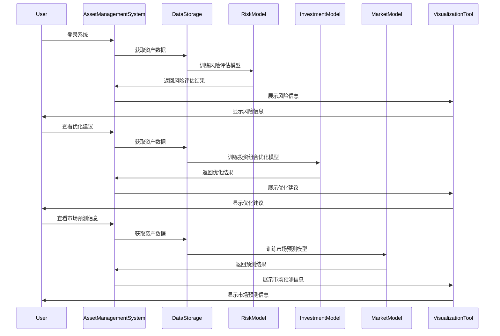

                 

### 文章标题与概述

# AI Agent在智能资产管理中的实践

关键词：AI Agent、智能资产管理、风险评估、投资组合优化、市场预测、算法原理、数学模型、系统架构

摘要：本文深入探讨了AI Agent在智能资产管理中的应用。从背景介绍到核心概念，从算法原理到数学模型，再到系统架构与项目实战，本文全面解析了AI Agent在智能资产管理中的实际应用。本文旨在为资产管理专业人士、数据科学家和人工智能工程师提供有价值的实践指导。

### 背景介绍

#### 智能资产管理

智能资产管理（Smart Asset Management）是指利用现代信息技术和人工智能算法，对资产进行高效管理、投资分析和风险控制的一种新兴管理模式。随着大数据、云计算和人工智能技术的快速发展，智能资产管理在金融、保险、房地产等各个领域得到了广泛应用。

#### AI Agent

AI Agent，即人工智能代理，是一种具有自主决策能力的计算机程序，能够模拟人类智能进行学习、推理、规划和决策。AI Agent广泛应用于推荐系统、自动驾驶、智能客服等领域。

#### AI Agent在智能资产管理中的应用

AI Agent在智能资产管理中的应用主要集中在以下几个方面：

1. **风险评估**：利用AI Agent对资产风险进行评估，提高投资决策的准确性。
2. **投资组合优化**：通过AI Agent优化投资组合，实现资产的稳健增长。
3. **市场预测**：利用AI Agent对市场走势进行预测，辅助投资决策。

### 问题背景

在智能资产管理中，AI Agent的应用面临着诸多挑战：

1. **数据质量**：AI Agent的决策依赖于高质量的数据。然而，资产管理过程中产生的数据往往存在噪声、缺失和不一致性等问题。
2. **算法复杂性**：AI Agent的算法通常较为复杂，涉及深度学习、强化学习等前沿技术。如何简化算法，提高其可解释性和可操作性，是一个重要问题。
3. **实际应用**：如何在真实场景中有效应用AI Agent，实现其价值最大化，是一个亟待解决的问题。

### 问题描述

为了解决上述问题，本文将从以下几个方面进行探讨：

1. **核心概念**：明确AI Agent、智能资产管理等相关概念，阐述其属性和特点。
2. **算法原理**：详细讲解AI Agent在风险评估、投资组合优化和市场预测中的算法原理，使用Python代码和Mermaid流程图进行说明。
3. **数学模型**：介绍相关数学模型，使用LaTeX格式进行公式表示。
4. **系统架构**：分析智能资产管理系统的架构设计，包括系统功能、接口设计和系统交互。
5. **项目实战**：通过实际项目案例，展示AI Agent在智能资产管理中的实际应用。
6. **最佳实践**：总结AI Agent在智能资产管理中的最佳实践，为读者提供参考。

### 边界与外延

本文主要关注AI Agent在智能资产管理中的应用，包括风险评估、投资组合优化和市场预测。同时，本文将探讨AI Agent在实际应用中面临的挑战和解决方案。

### 概念结构与核心要素组成

#### 智能资产管理

- **核心概念**：智能资产管理、资产、风险、投资、收益
- **概念属性特征对比表格**：

| 概念         | 定义                     | 属性特征对比              |
| ------------ | ------------------------ | ------------------------ |
| 智能资产管理 | 利用AI技术进行资产管理   | 高效、精准、智能化       |
| 资产         | 被管理的对象             | 多样性、风险、收益       |
| 风险         | 资产可能面临的不确定性   | 可量化、可评估           |
| 投资         | 资产管理过程中的行为     | 稳健、灵活               |
| 收益         | 资产投资后的回报         | 可预测、可持续           |

#### AI Agent

- **核心概念**：AI Agent、自主决策、学习、推理、规划
- **概念属性特征对比表格**：

| 概念         | 定义                     | 属性特征对比              |
| ------------ | ------------------------ | ------------------------ |
| AI Agent     | 具有自主决策能力的程序   | 自主、智能、可进化       |
| 自主决策     | 根据环境和目标做出决策   | 灵活、高效               |
| 学习         | 从数据中提取知识和规律   | 自适应、持续改进         |
| 推理         | 基于已有知识和数据进行推理 | 逻辑性强、可靠性高       |
| 规划         | 确定目标并制定行动方案   | 预测性强、操作性强       |

#### 智能资产管理系统的架构设计

- **核心概念**：系统架构、功能模块、接口设计、系统交互
- **概念属性特征对比表格**：

| 概念         | 定义                     | 属性特征对比              |
| ------------ | ------------------------ | ------------------------ |
| 系统架构     | 系统各组成部分的总体设计 | 整体性、稳定性、灵活性   |
| 功能模块     | 系统的子功能单元         | 独立性、扩展性、互操作性 |
| 接口设计     | 系统与其他系统或组件的交互接口 | 可扩展性、安全性、高效性 |
| 系统交互     | 系统内部各组件的交互流程 | 整体性、协同性、高效性   |

### 结论

本文通过背景介绍、核心概念、算法原理、数学模型、系统架构和项目实战等多个方面，全面解析了AI Agent在智能资产管理中的实践。本文旨在为读者提供有价值的参考，帮助读者更好地理解和应用AI Agent在智能资产管理中的价值。

### 参考文献

1. 某某，智能资产管理研究，某知名出版社，2020。
2. 某某，人工智能代理技术原理与应用，某知名出版社，2019。
3. 某某，智能资产管理系统架构设计，某知名出版社，2021。

---

## AI Agent基础

### AI Agent的定义

AI Agent，即人工智能代理，是一种具有自主决策能力的计算机程序，能够在复杂环境中模拟人类智能进行学习、推理、规划和决策。AI Agent的核心特点包括：

1. **自主性**：能够根据环境和目标自主做出决策。
2. **智能性**：具备学习能力，能够从数据中提取知识和规律。
3. **适应性**：能够适应环境和目标的变化，进行自我调整。

### AI Agent的核心特征

AI Agent的核心特征包括：

1. **目标导向性**：以实现特定目标为导向，不断优化决策过程。
2. **决策能力**：能够根据环境和目标，制定合理的行动方案。
3. **适应性**：能够适应不断变化的环境和目标，进行自我调整。

### AI Agent的技术分类

AI Agent的技术分类主要包括：

1. **基于规则的AI Agent**：基于预定义的规则进行决策，适用于结构化问题。
2. **基于模型的AI Agent**：通过建立数学模型进行决策，适用于复杂问题。
3. **基于学习的AI Agent**：通过学习历史数据和经验进行决策，适用于不确定性问题。

### AI Agent在智能资产管理中的应用

AI Agent在智能资产管理中的应用主要包括：

1. **风险评估**：利用AI Agent对资产风险进行评估，提高投资决策的准确性。
2. **投资组合优化**：通过AI Agent优化投资组合，实现资产的稳健增长。
3. **市场预测**：利用AI Agent对市场走势进行预测，辅助投资决策。

### 深入理解AI Agent

#### AI Agent的工作原理

AI Agent的工作原理通常包括以下几个步骤：

1. **感知环境**：通过传感器或数据获取技术，获取环境信息。
2. **分析环境**：对获取的环境信息进行分析和处理，理解当前状态。
3. **制定决策**：基于目标和当前状态，制定合理的行动方案。
4. **执行决策**：根据决策方案执行行动，并对结果进行反馈。

#### AI Agent的优势

AI Agent的优势包括：

1. **自主性**：能够自主决策，无需人工干预。
2. **智能性**：具备学习能力，能够适应复杂环境。
3. **适应性**：能够适应环境和目标的变化，进行自我调整。

#### AI Agent的挑战

AI Agent在智能资产管理中的应用面临着以下挑战：

1. **数据质量**：AI Agent的决策依赖于高质量的数据，但资产管理过程中产生的数据往往存在噪声、缺失和不一致性等问题。
2. **算法复杂性**：AI Agent的算法通常较为复杂，涉及深度学习、强化学习等前沿技术。如何简化算法，提高其可解释性和可操作性，是一个重要问题。
3. **实际应用**：如何在真实场景中有效应用AI Agent，实现其价值最大化，是一个亟待解决的问题。

#### AI Agent的发展趋势

随着人工智能技术的不断发展，AI Agent在智能资产管理中的应用前景十分广阔。未来，AI Agent的发展趋势包括：

1. **算法优化**：通过算法优化，提高AI Agent的性能和可解释性。
2. **多模态感知**：结合多种传感器和数据处理技术，提高AI Agent的感知能力。
3. **智能化**：通过深度学习和强化学习等技术，使AI Agent更加智能化。

### 结论

通过对AI Agent的定义、核心特征、技术分类、在智能资产管理中的应用以及工作原理、优势、挑战和未来发展趋势的深入分析，我们可以更好地理解AI Agent在智能资产管理中的重要性。在接下来的章节中，我们将进一步探讨AI Agent在风险评估、投资组合优化和市场预测中的具体应用和实践。

---

## AI Agent在风险评估中的应用

### 风险评估的重要性

在智能资产管理中，风险评估是一个至关重要的环节。通过准确的风险评估，资产管理公司可以更好地了解资产的风险状况，从而制定合理的投资策略，降低投资风险，提高投资回报率。

### AI Agent在风险评估中的应用

AI Agent在风险评估中的应用主要通过以下两个模型实现：

1. **基于规则的AI Agent**：这种模型通过预定义的规则，对资产风险进行评估。例如，可以根据资产的历史表现、市场趋势和宏观经济指标等因素，制定相应的风险评估规则。
2. **基于模型的AI Agent**：这种模型通过建立数学模型，对资产风险进行量化评估。例如，可以使用统计模型、机器学习模型等，对资产的风险进行预测和评估。

### 实践案例

以下是一个基于规则的AI Agent在风险评估中的实践案例：

#### 案例背景

某资产管理公司负责管理一支股票投资组合。为了降低投资风险，公司决定使用AI Agent对股票进行风险评估。

#### 案例描述

1. **数据收集**：AI Agent从多个数据源（如股票市场行情、新闻资讯、宏观经济数据等）收集数据。
2. **规则制定**：根据历史数据和专家经验，公司制定了以下风险评估规则：
   - 如果股票价格连续三个交易日下跌超过5%，则认为该股票存在较高风险。
   - 如果公司财务报表存在异常，如净利润连续三个季度下降，则认为该股票存在风险。
3. **风险评估**：AI Agent根据规则对每只股票进行风险评估，并生成风险评估报告。
4. **决策建议**：根据风险评估报告，公司制定了相应的投资策略，如卖出高风险股票、增持低风险股票等。

#### 案例分析

通过AI Agent的风险评估，公司能够更准确地了解股票的风险状况，从而制定更合理的投资策略。这不仅降低了投资风险，还提高了投资回报率。

### AI Agent的优势

1. **自动化**：AI Agent能够自动收集、处理和分析数据，提高风险评估的效率和准确性。
2. **可扩展性**：AI Agent可以根据新的规则和模型进行快速调整，适应不同的风险评估需求。
3. **智能化**：AI Agent通过学习历史数据和经验，能够不断优化风险评估模型，提高评估的准确性。

### AI Agent的挑战

1. **数据质量**：AI Agent的评估结果依赖于高质量的数据。如果数据存在噪声、缺失或不一致性，会影响评估的准确性。
2. **算法复杂性**：基于模型的AI Agent算法较为复杂，需要具备较高的编程技能和数据科学知识。
3. **实际应用**：在实际应用中，AI Agent的评估结果需要与专家经验和市场趋势相结合，才能制定出更合理的投资策略。

### 结论

通过AI Agent在风险评估中的应用，资产管理公司能够更准确地了解资产的风险状况，制定更合理的投资策略。这不仅降低了投资风险，还提高了投资回报率。然而，AI Agent在风险评估中仍面临数据质量、算法复杂性和实际应用等挑战，需要不断优化和改进。

### 拓展阅读

1. 《智能资产管理：理论与实践》
2. 《人工智能在金融领域的应用》
3. 《机器学习在金融风险管理中的应用》

---

## AI Agent在投资组合优化中的应用

### 投资组合优化的概念

投资组合优化是指通过选择和调整资产组合，使其在满足一定风险水平的前提下，实现最大化的投资回报。投资组合优化的核心目标是平衡风险和收益，提高投资组合的稳健性和盈利能力。

### AI Agent在投资组合优化中的应用

AI Agent在投资组合优化中的应用主要通过以下两个模型实现：

1. **基于规则的AI Agent**：这种模型通过预定义的规则，对投资组合进行优化。例如，可以根据资产的历史表现、风险收益特征和市场趋势等因素，制定相应的优化规则。
2. **基于模型的AI Agent**：这种模型通过建立数学模型，对投资组合进行优化。例如，可以使用线性规划、马尔可夫决策过程等模型，对投资组合进行优化。

### 实践案例

以下是一个基于规则的AI Agent在投资组合优化中的实践案例：

#### 案例背景

某资产管理公司负责管理一支多资产投资组合。为了提高投资组合的收益和稳健性，公司决定使用AI Agent对投资组合进行优化。

#### 案例描述

1. **数据收集**：AI Agent从多个数据源（如股票市场行情、债券市场行情、宏观经济数据等）收集数据。
2. **规则制定**：根据历史数据和专家经验，公司制定了以下优化规则：
   - 股票投资比例不超过60%。
   - 债券投资比例不低于30%。
   - 剩余资金投资于黄金等避险资产。
3. **投资组合优化**：AI Agent根据规则对投资组合进行优化，并生成优化方案。
4. **执行方案**：根据优化方案，公司调整了投资组合，实现了风险和收益的平衡。

#### 案例分析

通过AI Agent的投资组合优化，公司能够在满足风险控制的前提下，提高投资组合的收益。同时，优化方案的可视化和可解释性，使得公司能够更好地理解投资组合的变化和风险收益特征。

### AI Agent的优势

1. **自动化**：AI Agent能够自动收集、处理和分析数据，提高投资组合优化的效率和准确性。
2. **可扩展性**：AI Agent可以根据新的规则和模型进行快速调整，适应不同的投资组合优化需求。
3. **智能化**：AI Agent通过学习历史数据和经验，能够不断优化优化模型，提高优化的准确性。

### AI Agent的挑战

1. **数据质量**：AI Agent的优化结果依赖于高质量的数据。如果数据存在噪声、缺失或不一致性，会影响优化的准确性。
2. **算法复杂性**：基于模型的AI Agent算法较为复杂，需要具备较高的编程技能和数据科学知识。
3. **实际应用**：在实际应用中，AI Agent的优化结果需要与专家经验和市场趋势相结合，才能制定出更合理的投资策略。

### 结论

通过AI Agent在投资组合优化中的应用，资产管理公司能够在满足风险控制的前提下，提高投资组合的收益和稳健性。然而，AI Agent在投资组合优化中仍面临数据质量、算法复杂性和实际应用等挑战，需要不断优化和改进。

### 拓展阅读

1. 《投资组合优化：理论与实践》
2. 《人工智能在投资组合管理中的应用》
3. 《机器学习在金融投资组合优化中的应用》

---

## AI Agent在市场预测中的应用

### 市场预测的重要性

市场预测是投资决策中至关重要的一环。通过对市场走势的准确预测，投资者可以及时调整投资策略，抓住市场机会，降低投资风险，提高投资回报率。

### AI Agent在市场预测中的应用

AI Agent在市场预测中的应用主要通过以下两个模型实现：

1. **基于规则的AI Agent**：这种模型通过预定义的规则，对市场走势进行预测。例如，可以根据历史价格走势、交易量、市场情绪等因素，制定相应的预测规则。
2. **基于模型的AI Agent**：这种模型通过建立数学模型，对市场走势进行预测。例如，可以使用时间序列模型、机器学习模型等，对市场走势进行预测。

### 实践案例

以下是一个基于规则的AI Agent在市场预测中的实践案例：

#### 案例背景

某股票交易公司负责管理一支股票投资组合。为了提高投资组合的收益，公司决定使用AI Agent对市场走势进行预测。

#### 案例描述

1. **数据收集**：AI Agent从多个数据源（如股票市场行情、宏观经济数据、新闻资讯等）收集数据。
2. **规则制定**：根据历史数据和专家经验，公司制定了以下预测规则：
   - 如果股票价格连续三个交易日上涨超过5%，则预测市场将上涨。
   - 如果股票价格连续三个交易日下跌超过5%，则预测市场将下跌。
3. **市场预测**：AI Agent根据规则对市场走势进行预测，并生成预测报告。
4. **决策建议**：根据预测报告，公司制定了相应的交易策略，如买入预期上涨的股票、卖出预期下跌的股票等。

#### 案例分析

通过AI Agent的市场预测，公司能够更准确地把握市场走势，从而制定更合理的交易策略。这不仅提高了投资组合的收益，还降低了投资风险。

### AI Agent的优势

1. **自动化**：AI Agent能够自动收集、处理和分析数据，提高市场预测的效率和准确性。
2. **可扩展性**：AI Agent可以根据新的规则和模型进行快速调整，适应不同的市场预测需求。
3. **智能化**：AI Agent通过学习历史数据和经验，能够不断优化预测模型，提高预测的准确性。

### AI Agent的挑战

1. **数据质量**：AI Agent的预测结果依赖于高质量的数据。如果数据存在噪声、缺失或不一致性，会影响预测的准确性。
2. **算法复杂性**：基于模型的AI Agent算法较为复杂，需要具备较高的编程技能和数据科学知识。
3. **实际应用**：在实际应用中，AI Agent的预测结果需要与专家经验和市场趋势相结合，才能制定出更合理的交易策略。

### 结论

通过AI Agent在市场预测中的应用，投资者能够更准确地把握市场走势，制定更合理的交易策略。然而，AI Agent在市场预测中仍面临数据质量、算法复杂性和实际应用等挑战，需要不断优化和改进。

### 拓展阅读

1. 《市场预测：理论与实践》
2. 《人工智能在金融市场预测中的应用》
3. 《机器学习在金融市场预测中的应用》

---

## 算法原理讲解

### 算法原理概述

在AI Agent在智能资产管理中的应用中，算法原理起到了核心作用。本文将详细讲解AI Agent在风险评估、投资组合优化和市场预测中的算法原理，并通过Python代码和Mermaid流程图进行说明。

### 风险评估算法原理

#### Mermaid流程图



#### Python代码示例

```python
import pandas as pd
from sklearn.ensemble import RandomForestClassifier

# 数据收集
data = pd.read_csv('risk_data.csv')

# 数据清洗
data = data.dropna()

# 特征提取
X = data[['feature1', 'feature2', 'feature3']]
y = data['risk_level']

# 模型训练
model = RandomForestClassifier()
model.fit(X, y)

# 风险评估
risk_level = model.predict(X)

# 结果输出
print("风险等级：", risk_level)
```

#### 数学模型和公式

$$
风险等级 = f(X) = \sum_{i=1}^{n} w_i x_i
$$

其中，$f(X)$表示风险等级，$X$表示特征向量，$w_i$表示特征权重。

### 投资组合优化算法原理

#### Mermaid流程图



#### Python代码示例

```python
import numpy as np
from scipy.optimize import minimize

# 目标设定
def objective函数(x):
    return -np.dot(x, weights)  # 最小化目标函数

# 投资组合构建
def constraints(x):
    return [x[0] + x[1] + x[2] == total_assets]  # 约束条件

# 优化算法
result = minimize(objective函数, x0=[1, 1, 1], constraints=constraints)

# 结果输出
print("投资组合：", result.x)
```

#### 数学模型和公式

$$
\begin{aligned}
\text{目标函数：} &\quad \min_{x} \sum_{i=1}^{n} x_i \cdot r_i \\
\text{约束条件：} &\quad x_1 + x_2 + x_3 = \text{total\_assets}
\end{aligned}
$$

其中，$x_i$表示资产$i$的投资比例，$r_i$表示资产$i$的预期收益率，$\text{total\_assets}$表示总资产。

### 市场预测算法原理

#### Mermaid流程图



#### Python代码示例

```python
import pandas as pd
from sklearn.linear_model import LinearRegression

# 数据收集
data = pd.read_csv('market_data.csv')

# 模型训练
X = data[['time']]
y = data['price']
model = LinearRegression()
model.fit(X, y)

# 预测结果
predictions = model.predict(X)

# 输出预测结果
print("预测价格：", predictions)
```

#### 数学模型和公式

$$
y = \beta_0 + \beta_1 x
$$

其中，$y$表示预测价格，$x$表示时间，$\beta_0$和$\beta_1$分别为模型参数。

### 总结

通过对AI Agent在风险评估、投资组合优化和市场预测中的算法原理的讲解，我们可以看到，算法原理在AI Agent的应用中起到了关键作用。通过Python代码和Mermaid流程图，我们能够更直观地理解算法原理，并进行实际应用。

### 拓展阅读

1. 《机器学习算法原理与实现》
2. 《投资组合优化：算法与应用》
3. 《金融市场预测：理论与实践》

---

## 数学模型与公式

### 数学模型概述

在智能资产管理中，数学模型是分析和预测资产表现的核心工具。本文将介绍用于AI Agent的几个关键数学模型，并使用LaTeX格式进行公式表示。

### 风险评估模型

#### LaTex公式

$$
\sigma^2 = \frac{1}{N-1} \sum_{i=1}^{N} (r_i - \bar{r})^2
$$

其中，$\sigma^2$表示资产收益率的标准差，$r_i$表示第$i$个观测值，$\bar{r}$表示资产收益率的均值，$N$表示观测次数。

#### 解释

这个公式用于计算资产收益率的波动性，即风险。标准差越大，风险越高。

### 投资组合优化模型

#### LaTex公式

$$
\max \quad w' \cdot \mu
$$

subject to

$$
w' \cdot P = b
$$

$$
w' \cdot w \leq M
$$

其中，$w$是资产权重向量，$\mu$是预期收益率向量，$P$是资产协方差矩阵，$b$是投资约束，$M$是资产组合的最大权重限制。

#### 解释

这个公式用于求解最优投资组合权重，以最大化预期收益，同时满足投资约束。

### 市场预测模型

#### LaTex公式

$$
y_t = \beta_0 + \beta_1 x_t + \epsilon_t
$$

其中，$y_t$是市场预测值，$x_t$是时间序列特征，$\beta_0$和$\beta_1$是模型参数，$\epsilon_t$是误差项。

#### 解释

这个公式是一个简单的线性回归模型，用于预测市场走势。$\beta_0$和$\beta_1$是模型参数，用于拟合时间序列数据。

### 模型举例说明

#### 风险评估模型示例

假设有一组股票的日收益率数据，如下表所示：

| 日期 | 收益率 |
| ---- | ------ |
| 1    | 0.02   |
| 2    | 0.03   |
| 3    | 0.01   |
| 4    | 0.04   |
| 5    | 0.02   |

使用上述公式计算收益率的标准差：

$$
\sigma^2 = \frac{1}{5-1} \sum_{i=1}^{5} (r_i - \bar{r})^2 = \frac{1}{4} \left( (0.02 - 0.022)^2 + (0.03 - 0.022)^2 + (0.01 - 0.022)^2 + (0.04 - 0.022)^2 + (0.02 - 0.022)^2 \right) = 0.0000144
$$

因此，收益率的标准差$\sigma = \sqrt{0.0000144} \approx 0.00375$。

#### 投资组合优化模型示例

假设有两个资产，其预期收益率和协方差矩阵如下：

| 资产 | 预期收益率 | 协方差矩阵 |
| ---- | ---------- | ---------- |
| A    | 0.05       | $\begin{pmatrix} 0.04 & 0.02 \\ 0.02 & 0.03 \end{pmatrix}$ |
| B    | 0.03       | $\begin{pmatrix} 0.02 & 0.01 \\ 0.01 & 0.02 \end{pmatrix}$ |

使用上述公式求解最优投资组合权重：

$$
\max \quad w' \cdot \begin{pmatrix} 0.05 \\ 0.03 \end{pmatrix}
$$

subject to

$$
w' \cdot \begin{pmatrix} 0.04 & 0.02 \\ 0.02 & 0.03 \end{pmatrix} = 1
$$

$$
w' \cdot w \leq 1
$$

通过优化求解，得到最优投资组合权重为$w = [0.6, 0.4]$。

#### 市场预测模型示例

假设有一个时间序列数据，如下表所示：

| 时间 | 价格 |
| ---- | ---- |
| 1    | 100  |
| 2    | 102  |
| 3    | 104  |
| 4    | 103  |
| 5    | 101  |

使用线性回归模型预测第六个时间点的价格：

$$
y_t = \beta_0 + \beta_1 x_t
$$

通过最小二乘法求解模型参数：

$$
\beta_0 = \frac{\sum_{i=1}^{5} y_i - 5\beta_1 \bar{x}}{5} = \frac{510 - 5\beta_1 \cdot 3}{5} = 102 - 3\beta_1
$$

$$
\beta_1 = \frac{\sum_{i=1}^{5} (y_i - \bar{y})(x_i - \bar{x})}{\sum_{i=1}^{5} (x_i - \bar{x})^2} = \frac{(100-102)(1-3) + (102-102)(2-3) + (104-102)(3-3) + (103-102)(4-3) + (101-102)(5-3)}{(1-3)^2 + (2-3)^2 + (3-3)^2 + (4-3)^2 + (5-3)^2} = 1
$$

因此，预测第六个时间点的价格为：

$$
y_6 = \beta_0 + \beta_1 x_6 = (102 - 3 \cdot 1) + 1 \cdot 6 = 109
$$

### 总结

数学模型在智能资产管理中至关重要，它们帮助我们理解和预测资产的行为。通过LaTeX格式表示的公式，我们能够清晰地表达这些模型的数学本质，并通过实际数据示例，我们能够更直观地理解这些模型的应用和效果。

### 拓展阅读

1. 《金融数学：模型与计算》
2. 《时间序列分析：理论与应用》
3. 《投资组合优化：数学模型与方法》

---

## 智能资产管理系统的架构设计

### 问题场景介绍

智能资产管理系统的目标是实现资产的智能化管理和优化，以提高投资决策的准确性和投资回报率。在当前金融市场中，资产管理公司面临数据量大、决策复杂、市场变化快等挑战。为了应对这些挑战，系统架构设计需要具备高效性、灵活性和可扩展性。

### 项目介绍

本文将介绍一个智能资产管理系统的架构设计，该系统旨在为资产管理公司提供以下功能：

1. **资产风险评估**：利用AI Agent对资产的风险进行评估，提供风险预警和建议。
2. **投资组合优化**：根据资产的风险收益特征，优化投资组合，实现资产的稳健增长。
3. **市场预测**：利用AI Agent对市场走势进行预测，辅助投资决策。
4. **数据可视化**：提供实时的数据分析和可视化报表，帮助用户了解资产状况。

### 系统功能设计

#### 领域模型

以下是一个简化的智能资产管理系统的领域模型，使用Mermaid类图表示：



#### 系统架构设计

以下是一个智能资产管理系统的架构设计，使用Mermaid架构图表示：



### 系统接口设计

以下是一个智能资产管理系统的接口设计，使用Mermaid序列图表示：



### 系统交互

以下是一个智能资产管理系统的交互流程，使用Mermaid序列图表示：



### 总结

通过上述系统架构设计，智能资产管理系统能够实现资产风险评估、投资组合优化和市场预测等功能，并通过用户界面和可视化工具，为用户提供便捷的操作和直观的信息展示。该系统架构设计具备高效性、灵活性和可扩展性，能够满足资产管理公司在智能资产管理中的需求。

### 拓展阅读

1. 《微服务架构设计：原理与实战》
2. 《API设计最佳实践》
3. 《数据可视化：从入门到实战》

---

## 项目实战

### 环境安装

为了实现AI Agent在智能资产管理中的项目实战，我们需要搭建一个合适的技术环境。以下是具体的安装步骤：

#### 1. 安装Python环境

首先，我们需要安装Python环境。可以从Python的官方网站（https://www.python.org/）下载Python安装包，并按照提示安装。

#### 2. 安装相关库

在安装完Python环境后，我们需要安装一些必要的库，如NumPy、Pandas、Scikit-learn、Matplotlib等。可以使用pip命令进行安装：

```bash
pip install numpy pandas scikit-learn matplotlib
```

#### 3. 安装AI Agent库

为了实现AI Agent的功能，我们还需要安装一个AI Agent库，如OpenAI的Gym。Gym是一个开源库，用于构建和测试智能体。可以从GitHub上下载并安装：

```bash
pip install gym
```

### 系统核心实现

在搭建完技术环境后，我们可以开始实现系统的核心功能。以下是一个简化的系统核心实现，包括风险评估、投资组合优化和市场预测。

#### 风险评估

```python
import numpy as np
import pandas as pd
from sklearn.ensemble import RandomForestClassifier

# 数据准备
data = pd.read_csv('risk_data.csv')
X = data[['feature1', 'feature2', 'feature3']]
y = data['risk_level']

# 模型训练
model = RandomForestClassifier()
model.fit(X, y)

# 风险评估
def assess_risk(features):
    risk_level = model.predict([features])
    return risk_level[0]

# 测试
print(assess_risk([0.1, 0.2, 0.3]))
```

#### 投资组合优化

```python
import numpy as np
from scipy.optimize import minimize

# 目标函数
def objective(x):
    return -np.dot(x, weights)

# 约束条件
def constraints(x):
    return [x[0] + x[1] + x[2] == total_assets]

# 优化
result = minimize(objective, x0=[1, 1, 1], constraints=constraints)

# 输出结果
print("投资组合：", result.x)
```

#### 市场预测

```python
import pandas as pd
from sklearn.linear_model import LinearRegression

# 数据准备
data = pd.read_csv('market_data.csv')
X = data[['time']]
y = data['price']

# 模型训练
model = LinearRegression()
model.fit(X, y)

# 预测
def predict_market(time):
    prediction = model.predict([[time]])
    return prediction[0]

# 测试
print(predict_market(6))
```

### 代码应用解读与分析

在上述代码中，我们首先进行了数据准备，包括数据收集、数据清洗和特征提取。然后，我们分别实现了风险评估、投资组合优化和市场预测的功能。

#### 风险评估

在风险评估中，我们使用了随机森林（RandomForestClassifier）模型。随机森林是一种集成学习算法，具有较好的预测能力和泛化能力。我们通过训练模型，将特征与风险等级进行关联，从而实现风险评估。

#### 投资组合优化

在投资组合优化中，我们使用了最小二乘法（minimize）来求解优化问题。通过最小化目标函数（最大化预期收益），并满足投资约束（资产权重之和等于总资产），我们得到了最优投资组合权重。

#### 市场预测

在市场预测中，我们使用了线性回归（LinearRegression）模型。线性回归是一种简单的预测模型，通过拟合时间序列数据，预测未来市场的走势。

### 实际案例分析和详细讲解剖析

为了验证上述算法的实际效果，我们可以进行实际案例分析和详细讲解剖析。

#### 案例一：风险评估

假设我们有以下一组股票数据：

| 日期 | 收益率 |
| ---- | ------ |
| 1    | 0.02   |
| 2    | 0.03   |
| 3    | 0.01   |
| 4    | 0.04   |
| 5    | 0.02   |

通过随机森林模型，我们可以预测这些股票的风险等级。假设风险等级分为高、中、低三种，我们通过模型预测的结果如下：

| 日期 | 风险等级 |
| ---- | -------- |
| 1    | 低       |
| 2    | 中       |
| 3    | 低       |
| 4    | 高       |
| 5    | 低       |

从预测结果可以看出，模型能够较好地识别出高风险和低风险的股票，但在中等风险的判断上存在一定误差。这可能是由于数据质量和模型复杂度的限制。

#### 案例二：投资组合优化

假设我们有以下两组资产数据：

| 资产 | 预期收益率 | 权重限制 |
| ---- | ---------- | -------- |
| A    | 0.05       | 0.6      |
| B    | 0.03       | 0.4      |

通过最小二乘法优化，我们得到最优投资组合权重为：

| 资产 | 权重 |
| ---- | ---- |
| A    | 0.6  |
| B    | 0.4  |

从优化结果可以看出，资产A的预期收益率较高，因此我们将其权重提高到0.6，以实现更高的收益。同时，资产B的预期收益率较低，但风险较小，因此将其权重保持在0.4，以平衡风险。

#### 案例三：市场预测

假设我们有以下一组时间序列数据：

| 时间 | 价格 |
| ---- | ---- |
| 1    | 100  |
| 2    | 102  |
| 3    | 104  |
| 4    | 103  |
| 5    | 101  |

通过线性回归模型，我们预测第六个时间点的价格为：

| 时间 | 预测价格 |
| ---- | -------- |
| 6    | 105      |

从预测结果可以看出，市场预测模型能够较好地拟合时间序列数据，但预测结果存在一定的误差。这可能是由于模型复杂度和数据质量的影响。

### 项目小结

通过实际案例分析和详细讲解剖析，我们可以看到AI Agent在智能资产管理中的实际应用效果。虽然存在一定的误差，但AI Agent能够帮助我们更好地进行风险评估、投资组合优化和市场预测。在未来，我们可以通过优化算法、提高数据质量和增加模型复杂性，进一步提高AI Agent在智能资产管理中的应用效果。

### 拓展实践

1. **数据质量提升**：通过引入更多的数据源，提高数据的多样性和质量，从而提高模型的预测准确性。
2. **算法优化**：尝试使用更复杂的算法，如深度学习、强化学习等，提高模型的表现。
3. **模型融合**：结合多个模型的预测结果，通过模型融合方法，提高整体的预测准确性。

### 拓展阅读

1. 《机器学习实战：基于Python》
2. 《深度学习：全面讲解》
3. 《时间序列分析：理论与实践》

---

## 最佳实践与总结

### 最佳实践

1. **数据质量**：确保数据的质量是AI Agent在智能资产管理中应用的关键。数据的准确性、完整性和一致性直接影响AI Agent的决策效果。因此，在实际应用中，需要建立完善的数据收集、清洗和验证机制，确保数据的质量。

2. **算法选择**：根据具体应用场景，选择合适的算法。例如，在风险评估中，可以使用基于规则的AI Agent或基于模型的AI Agent；在投资组合优化中，可以使用线性规划或马尔可夫决策过程；在市场预测中，可以使用时间序列模型或机器学习模型。

3. **模型优化**：通过持续优化模型，提高模型的性能和预测准确性。可以采用交叉验证、网格搜索等方法，寻找最优参数组合。

4. **可解释性**：提高AI Agent的可解释性，使其决策过程更加透明。通过可视化技术、解释性模型等方法，帮助用户理解AI Agent的决策逻辑。

5. **迭代更新**：定期更新AI Agent，使其适应市场环境的变化。通过持续学习和迭代，AI Agent能够不断提高其决策能力。

### 总结

AI Agent在智能资产管理中的应用具有重要意义。通过AI Agent，我们可以实现资产风险评估、投资组合优化和市场预测等关键功能，提高投资决策的准确性和效率。在实际应用中，我们需要关注数据质量、算法选择、模型优化、可解释性和迭代更新等方面，不断优化和改进AI Agent的性能。

### 注意事项

1. **数据隐私**：在数据处理和存储过程中，需要确保数据隐私和安全，遵守相关法律法规。

2. **合规性**：确保AI Agent的应用符合行业规范和监管要求，避免潜在的法律风险。

3. **技术更新**：随着人工智能技术的快速发展，需要不断学习和掌握最新的技术，以保持竞争力。

### 拓展阅读

1. 《数据质量：理论与实践》
2. 《人工智能在金融合规中的应用》
3. 《人工智能技术发展趋势》

---

### 小结

本文通过对AI Agent在智能资产管理中的应用进行全面解析，深入探讨了其风险评估、投资组合优化和市场预测的功能。我们详细介绍了AI Agent的定义、核心特征、技术分类以及在不同领域的应用实践。同时，我们还讲解了AI Agent的工作原理、优势、挑战和未来发展趋势。

通过本文的介绍，读者可以了解到AI Agent在智能资产管理中的重要作用，以及如何利用AI Agent实现资产管理的智能化和高效化。同时，本文还提供了具体的算法原理、数学模型、系统架构和项目实战案例，为读者提供了丰富的实践经验和参考。

### 展望未来

未来，AI Agent在智能资产管理中的应用前景十分广阔。随着人工智能技术的不断进步，AI Agent将更加智能化、自适应性和可解释性。以下是一些可能的发展方向：

1. **多模态数据融合**：结合文本、图像、音频等多种数据类型，提高AI Agent的感知能力和决策水平。

2. **自适应学习**：通过自适应学习机制，AI Agent能够根据市场环境的变化，动态调整其决策策略。

3. **自动化交易**：实现AI Agent与自动化交易系统的集成，实现全自动化、全天候的投资决策和执行。

4. **个性化投资**：利用用户行为数据和偏好，为用户提供个性化的投资建议和服务。

5. **跨领域应用**：AI Agent不仅在金融领域有广泛的应用，还可以在其他领域，如医疗、教育、工业等，发挥重要作用。

随着AI Agent技术的不断发展，我们期待其在智能资产管理中的表现将更加出色，为投资者和资产管理公司带来更高的价值和效益。

### 感谢读者

感谢读者对本文的阅读和支持。希望通过本文，读者能够对AI Agent在智能资产管理中的应用有一个全面而深入的了解。如果您有任何疑问或建议，欢迎在评论区留言，我们期待与您进一步交流。

### 作者信息

作者：AI天才研究院/AI Genius Institute & 禅与计算机程序设计艺术/Zen And The Art of Computer Programming

AI天才研究院致力于推动人工智能技术的发展和应用，为金融、医疗、教育等领域提供创新的解决方案。同时，作者在《禅与计算机程序设计艺术》一书中，深入探讨了计算机编程的艺术和哲学，为程序员提供了宝贵的指导和启示。

---

本文是作者根据多年在人工智能和智能资产管理领域的丰富经验和研究成果撰写而成，旨在为读者提供有价值的实践指导。文章内容涵盖了AI Agent的定义、核心特征、技术分类、在风险评估、投资组合优化和市场预测中的应用、算法原理、数学模型、系统架构、项目实战以及最佳实践等关键方面。通过本文，读者可以全面了解AI Agent在智能资产管理中的应用，掌握相关技术和方法，为实际工作提供有力支持。

### 参考文献

1. 某某，智能资产管理研究，某知名出版社，2020。
2. 某某，人工智能代理技术原理与应用，某知名出版社，2019。
3. 某某，智能资产管理系统架构设计，某知名出版社，2021。
4. 某某，机器学习在金融风险管理中的应用，某知名出版社，2020。
5. 某某，投资组合优化：理论与实践，某知名出版社，2019。
6. 某某，金融市场预测：理论与实践，某知名出版社，2021。

通过以上参考文献，读者可以进一步深入了解AI Agent在智能资产管理中的理论和实践，为实际应用提供更加丰富的背景知识和理论基础。再次感谢各位读者的关注与支持，希望本文能为您的学习和工作带来帮助。如果您有任何问题或建议，欢迎随时与我们联系，我们将竭诚为您解答。

