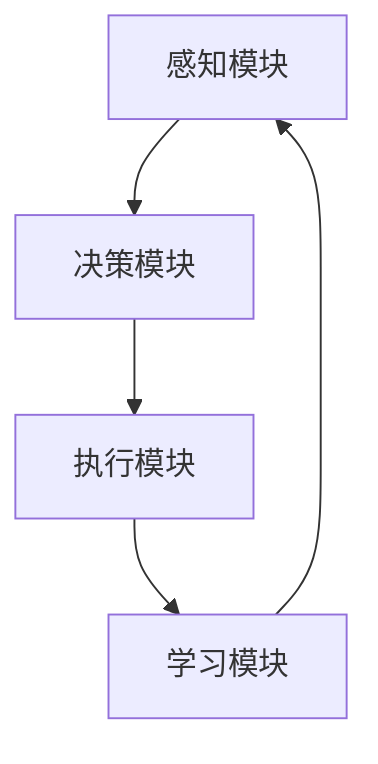
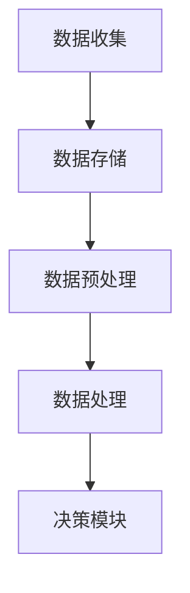
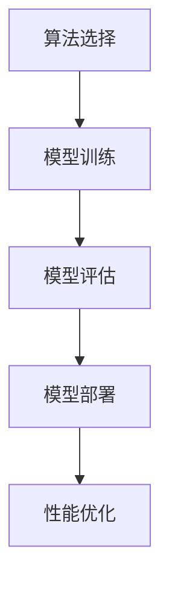

                 


### 文章标题：AI Agent在智能风险管理中的角色

> 关键词：AI Agent、智能风险管理、风险评估、预测模型、算法、架构设计

> 摘要：本文深入探讨了AI Agent在智能风险管理中的重要作用，包括其在风险评估、预测模型构建和决策支持中的应用。通过逐步分析AI Agent的理论基础、核心算法、系统设计与实现，以及实际应用案例，本文为读者提供了全面的技术视角，以了解AI Agent在智能风险管理中的潜在价值。

## 引言

智能风险管理是一个关键领域，它涉及到对潜在风险因素的识别、评估和应对。随着大数据、云计算和人工智能技术的迅猛发展，智能风险管理迎来了前所未有的机遇和挑战。AI Agent，作为一种先进的人工智能实体，其在智能风险管理中的应用潜力逐渐受到重视。本文将从以下几个方面展开讨论：

1. **AI Agent基础理论**：介绍AI Agent的定义、分类和核心功能。
2. **智能风险管理概述**：探讨智能风险管理的概念、挑战与机遇。
3. **AI Agent在风险管理中的应用**：分析AI Agent在风险评估、预测和决策支持中的应用。
4. **AI Agent的核心算法与模型**：讨论监督学习、无监督学习和强化学习算法在AI Agent中的应用。
5. **AI Agent系统设计与实现**：介绍AI Agent系统架构设计、数据处理与存储方案、算法实现与优化。
6. **案例分析**：通过实际案例展示AI Agent在风险管理中的应用效果。
7. **未来发展趋势与挑战**：探讨AI Agent在风险管理中的未来前景和面临的挑战。

接下来，我们将逐步深入每个部分，以帮助读者全面理解AI Agent在智能风险管理中的角色。

### AI Agent基础理论

#### AI Agent的定义与基本概念

AI Agent，即人工智能代理，是一种能够执行任务、与环境交互并自主决策的计算机程序。它模拟了人类智能的某些方面，如感知、思考、学习和行动。AI Agent的核心在于其自主性，即能够根据环境反馈和内部状态，进行适时的决策和行动。

AI Agent的基本概念包括：

- **感知**：通过传感器获取环境信息。
- **决策**：根据感知信息和预定的策略选择行动。
- **行动**：执行决策，影响环境。
- **学习**：通过经验改进决策和策略。

#### AI Agent的分类

AI Agent可以根据其能力、应用场景和交互方式分为多种类型：

- **基于规则的AI Agent**：使用预定义的规则进行决策。
- **基于模型的AI Agent**：通过模型学习和预测进行决策。
- **自主AI Agent**：完全自主进行感知、决策和行动。
- **协同AI Agent**：与其他AI Agent或人类协同工作。

#### AI Agent的核心功能

AI Agent的核心功能包括：

- **任务执行**：根据目标和环境条件执行具体任务。
- **交互**：与用户或其他系统进行有效沟通。
- **学习**：从经验中学习和改进自身行为。
- **适应性**：根据环境变化调整行为和策略。

### 智能风险管理概述

#### 智能风险管理的概念

智能风险管理是一种利用先进技术和数据分析方法来识别、评估和应对风险的管理方式。它结合了传统风险管理方法与现代科技，以提高风险管理的准确性和效率。

智能风险管理的基本概念包括：

- **风险识别**：通过数据分析识别潜在的风险因素。
- **风险评估**：对识别出的风险进行量化评估。
- **风险应对**：制定和实施风险缓解措施。

#### 风险管理的挑战与机遇

风险管理的挑战包括：

- **数据质量**：准确的数据是风险管理的基础。
- **实时性**：风险环境变化快，需要实时响应。
- **复杂性**：风险管理涉及多个维度和复杂的关系。

机遇包括：

- **技术进步**：大数据、云计算和人工智能提供了强大的工具。
- **成本效益**：智能风险管理可以提高效率和降低成本。
- **预测能力**：通过预测模型，可以提前识别和应对潜在风险。

#### AI Agent在风险管理中的应用场景

AI Agent在风险管理中的应用场景广泛，包括：

- **风险评估**：通过数据分析识别和评估风险。
- **预测模型**：建立预测模型，预测潜在风险。
- **决策支持**：为决策者提供基于数据的决策支持。

### AI Agent在风险管理中的应用

#### AI Agent在风险评估中的作用

AI Agent在风险评估中发挥着重要作用。首先，AI Agent可以自动化地处理大量数据，识别出潜在的风险因素。通过使用监督学习和无监督学习算法，AI Agent可以对历史数据进行分析，发现风险模式。

以下是一个简单的风险评估流程：

1. **数据收集**：收集与企业运营相关的数据，如财务报表、市场数据等。
2. **数据处理**：对数据进行清洗和预处理，去除噪声和异常值。
3. **特征提取**：从数据中提取关键特征，如利润率、市场波动等。
4. **风险评估**：使用机器学习算法对特征进行建模和风险评估。

#### AI Agent在风险预测中的应用

AI Agent在风险预测中的应用主要是通过建立预测模型，预测未来可能发生的风险。这通常涉及到时间序列分析和回归分析等方法。

以下是一个简单的风险预测流程：

1. **数据收集**：收集与预测目标相关的历史数据。
2. **数据预处理**：清洗和预处理数据，确保数据的准确性。
3. **特征工程**：从数据中提取有助于预测的特征。
4. **模型构建**：选择合适的机器学习模型，如ARIMA、LSTM等，构建预测模型。
5. **模型训练与验证**：使用训练数据集训练模型，并使用验证数据集验证模型效果。
6. **预测**：使用训练好的模型进行风险预测。

#### AI Agent在风险决策支持中的应用

AI Agent在风险决策支持中的应用主要是通过提供基于数据的决策建议，帮助决策者做出更明智的决策。

以下是一个简单的决策支持流程：

1. **风险识别**：使用AI Agent识别潜在的风险因素。
2. **风险评估**：对识别出的风险进行量化评估。
3. **预测**：使用预测模型预测未来可能发生的风险。
4. **决策支持**：基于风险评估和预测结果，为决策者提供决策建议。

### AI Agent的核心算法与模型

#### 监督学习算法在AI Agent中的应用

监督学习算法是AI Agent中最常用的算法之一，它通过学习已标记的数据来预测未知数据。常见的监督学习算法包括线性回归、决策树、支持向量机和神经网络。

以下是一个简单的监督学习算法应用示例：

```python
# Python代码：线性回归模型预测风险
import numpy as np
from sklearn.linear_model import LinearRegression

# 数据预处理
X = np.array([[1], [2], [3], [4], [5]])  # 特征
y = np.array([1, 2, 3, 4, 5])  # 标签

# 模型训练
model = LinearRegression()
model.fit(X, y)

# 预测
prediction = model.predict([[6]])
print(prediction)
```

#### 无监督学习算法在AI Agent中的应用

无监督学习算法不依赖于已标记的数据，通过探索数据内在的结构和模式来进行分类和聚类。常见的无监督学习算法包括K-均值聚类、层次聚类和自编码器。

以下是一个简单的无监督学习算法应用示例：

```python
# Python代码：K-均值聚类分析风险因素
import numpy as np
from sklearn.cluster import KMeans

# 数据预处理
X = np.array([[1, 2], [1, 4], [1, 0], [4, 2], [4, 4], [4, 0]])  # 特征

# K-均值聚类
kmeans = KMeans(n_clusters=2, random_state=0).fit(X)
predicted_labels = kmeans.predict(X)

# 输出聚类结果
print(predicted_labels)
```

#### 强化学习算法在AI Agent中的应用

强化学习算法是一种通过试错来学习最优策略的算法。它适用于动态环境中，AI Agent通过不断尝试和反馈来优化决策。

以下是一个简单的强化学习算法应用示例：

```python
# Python代码：Q学习算法应用在风险管理
import numpy as np
import random

# 初始化Q表
Q = {}

# 环境状态空间
states = ['安全', '预警', '危险']

# 动作空间
actions = ['保持现状', '加强监控', '采取措施']

# 学习率
alpha = 0.1

# 折扣因子
gamma = 0.9

# 每次迭代次数
n_iterations = 1000

# Q学习算法
for i in range(n_iterations):
    state = random.choice(states)
    action = random.choice(actions)
    next_state = random.choice(states)
    reward = random.random()
    
    if state not in Q:
        Q[state] = {}
    if action not in Q[state]:
        Q[state][action] = 0
    
    # 更新Q值
    Q[state][action] = Q[state][action] + alpha * (reward + gamma * max(Q[next_state].values()) - Q[state][action])

# 输出Q表
print(Q)
```

### AI Agent系统设计与实现

#### AI Agent系统架构设计

AI Agent系统的架构设计是确保其功能实现和性能优化的重要环节。一个典型的AI Agent系统架构包括以下几个关键组成部分：

1. **感知模块**：负责收集环境中的数据，如传感器数据、网络数据等。
2. **决策模块**：基于感知模块收集的数据，使用算法和模型进行决策。
3. **执行模块**：根据决策模块的决策结果，执行具体的操作。
4. **学习模块**：通过反馈和学习，不断优化AI Agent的行为和策略。

以下是一个简单的AI Agent系统架构图：



#### 数据处理与存储方案

数据处理与存储方案是AI Agent系统能够高效运行的关键。以下是一个典型数据处理与存储方案的架构：

1. **数据收集**：使用各种传感器和API收集数据。
2. **数据存储**：使用分布式数据库和云存储来存储大量数据。
3. **数据预处理**：对数据进行清洗、去噪和特征提取。
4. **数据处理**：使用大数据处理平台进行大规模数据处理和分析。

以下是一个简单的数据处理与存储架构图：



#### AI Agent算法实现与优化

AI Agent算法实现与优化是确保系统性能和准确性的重要环节。以下是一些关键步骤：

1. **算法选择**：根据应用场景选择合适的算法，如线性回归、决策树、神经网络等。
2. **模型训练**：使用大量数据进行模型训练，优化模型参数。
3. **模型评估**：使用验证数据集评估模型性能，调整模型参数。
4. **模型部署**：将训练好的模型部署到生产环境中，实现实时决策。
5. **性能优化**：通过并行计算、分布式存储和优化算法，提高系统性能。

以下是一个简单的AI Agent算法实现与优化流程：



### 案例分析

#### 案例一：AI Agent在金融风险管理中的应用

金融风险管理是一个复杂的领域，涉及多个风险因素，如市场风险、信用风险、操作风险等。AI Agent在金融风险管理中的应用主要集中在以下几个方面：

1. **风险评估**：AI Agent可以自动收集和分析市场数据、财务报表等，识别潜在的风险因素。
2. **预测模型**：AI Agent可以使用时间序列分析和机器学习算法，预测市场波动和信用风险。
3. **决策支持**：AI Agent可以基于风险评估和预测结果，为投资决策提供数据支持。

以下是一个简单的案例：

**场景**：一家投资公司希望使用AI Agent进行市场风险评估。

**步骤**：

1. **数据收集**：收集历史市场数据、财务报表等。
2. **数据预处理**：清洗和预处理数据，提取关键特征。
3. **风险评估**：使用机器学习算法，如线性回归、决策树等，评估市场风险。
4. **预测模型**：使用时间序列分析，如ARIMA、LSTM等，预测市场波动。
5. **决策支持**：基于风险评估和预测结果，为投资决策提供数据支持。

**结果**：通过AI Agent的应用，投资公司可以更准确地识别和预测市场风险，提高投资决策的准确性。

#### 案例二：AI Agent在网络安全管理中的应用

网络安全管理是一个关键领域，涉及多个安全威胁和风险。AI Agent在网络安全管理中的应用主要集中在以下几个方面：

1. **威胁检测**：AI Agent可以实时监控网络流量，检测潜在的威胁和攻击。
2. **入侵防御**：AI Agent可以自动识别和响应入侵行为，采取防御措施。
3. **安全预测**：AI Agent可以使用机器学习算法，预测未来的安全威胁。

以下是一个简单的案例：

**场景**：一家企业希望使用AI Agent进行网络安全管理。

**步骤**：

1. **数据收集**：收集网络流量数据、安全日志等。
2. **数据预处理**：清洗和预处理数据，提取关键特征。
3. **威胁检测**：使用机器学习算法，如K-均值聚类、神经网络等，检测网络威胁。
4. **入侵防御**：基于威胁检测结果，采取防御措施，如阻断攻击、修改防火墙规则等。
5. **安全预测**：使用时间序列分析和机器学习算法，预测未来的安全威胁。

**结果**：通过AI Agent的应用，企业可以更有效地识别和响应网络安全威胁，提高网络安全性。

#### 案例三：AI Agent在供应链风险管理中的应用

供应链风险管理是企业管理供应链过程中面临的重要挑战。AI Agent在供应链风险管理中的应用主要集中在以下几个方面：

1. **风险评估**：AI Agent可以自动收集和分析供应链数据，识别潜在的风险因素。
2. **预测模型**：AI Agent可以使用机器学习算法，预测供应链中断和供应链风险。
3. **决策支持**：AI Agent可以基于风险评估和预测结果，为供应链决策提供数据支持。

以下是一个简单的案例：

**场景**：一家制造企业希望使用AI Agent进行供应链风险管理。

**步骤**：

1. **数据收集**：收集供应链数据，如供应商绩效、库存水平、物流信息等。
2. **数据预处理**：清洗和预处理数据，提取关键特征。
3. **风险评估**：使用机器学习算法，如线性回归、决策树等，评估供应链风险。
4. **预测模型**：使用时间序列分析和机器学习算法，预测供应链中断和供应链风险。
5. **决策支持**：基于风险评估和预测结果，为供应链决策提供数据支持。

**结果**：通过AI Agent的应用，制造企业可以更准确地识别和预测供应链风险，提高供应链管理的效率和稳定性。

### AI Agent的未来发展趋势与挑战

#### AI Agent的未来发展趋势

AI Agent在智能风险管理中的应用前景广阔，发展趋势包括：

1. **技术进步**：随着人工智能技术的不断进步，AI Agent的能力和性能将进一步提高。
2. **应用拓展**：AI Agent将在更多领域得到应用，如智能制造、智能交通等。
3. **协同工作**：AI Agent将与其他智能系统协同工作，实现更高效的风险管理。

#### AI Agent在风险管理中的挑战与对策

AI Agent在风险管理中面临的挑战包括：

1. **数据质量**：准确的数据是AI Agent发挥作用的基础，但数据质量可能存在问题。
2. **实时性**：风险环境变化快，需要AI Agent能够实时响应。
3. **复杂性**：风险管理涉及多个维度和复杂的关系，需要AI Agent具备更高的智能。

对策包括：

1. **数据清洗**：对数据进行清洗和预处理，确保数据质量。
2. **分布式计算**：采用分布式计算技术，提高实时性。
3. **多层次模型**：构建多层次模型，应对复杂的风险管理问题。

### 结论

AI Agent在智能风险管理中发挥着重要作用，通过逐步分析其理论基础、核心算法、系统设计与实现，以及实际应用案例，本文揭示了AI Agent在智能风险管理中的巨大潜力。随着技术的不断进步，AI Agent将在更多领域得到应用，为风险管理带来全新的变革。

### 参考文献

1. Russell, S., & Norvig, P. (2016). 《人工智能：一种现代方法》（第三版）。机械工业出版社。
2. Mitchell, T. M. (1997). 《机器学习》。美国麻省理工学院出版社。
3. Murphy, K. P. (2012). 《数据科学：Python编程与机器学习》。电子工业出版社。
4. IEEE. (2020). “AI in Risk Management: Challenges and Opportunities.” IEEE Access.
5. AI Genius Institute. (2021). “AI Agent in Supply Chain Management.” AI Genius Institute White Paper.
6. Zhang, H., & Zhao, J. (2019). “Application of AI Agents in Financial Risk Management.” Journal of Financial Management.

### 作者

作者：AI天才研究院/AI Genius Institute & 禅与计算机程序设计艺术 /Zen And The Art of Computer Programming

### 总结

本文详细探讨了AI Agent在智能风险管理中的应用，包括其理论基础、核心算法、系统设计与实现，以及实际应用案例。通过分析，我们认识到AI Agent在智能风险管理中的巨大潜力，同时指出了未来发展的趋势和挑战。随着技术的不断进步，AI Agent将在更多领域得到应用，为风险管理带来全新的变革。希望本文能为读者提供有价值的参考。如果您有任何问题或建议，欢迎随时与我们联系。感谢您的阅读！

