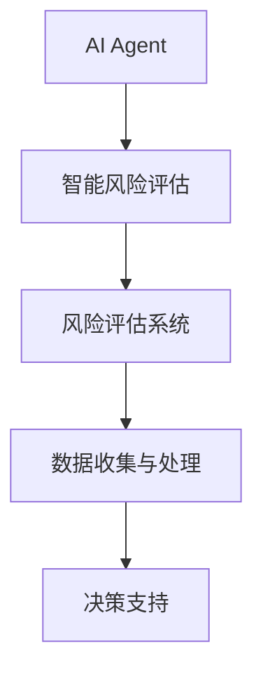
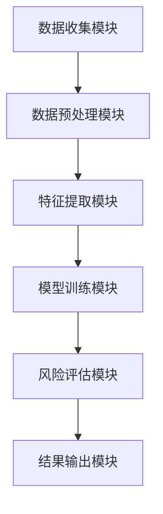
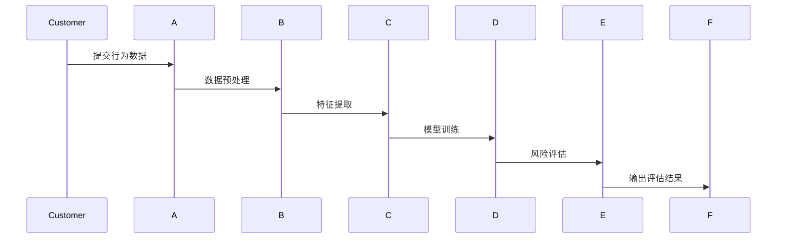

                 

# AI Agent在智能风险评估中的应用

> 关键词：AI Agent、智能风险评估、算法原理、系统架构设计、项目实战

> 摘要：本文深入探讨了AI Agent在智能风险评估中的应用，从背景介绍、核心概念与联系、算法原理讲解、系统分析与架构设计、项目实战等方面详细阐述了AI Agent在风险评估领域的应用实践。通过本文的阅读，读者将全面了解AI Agent的核心概念、算法原理以及在实际风险评估中的应用案例，为相关领域的深入研究和技术应用提供参考。

## 引言

随着人工智能技术的快速发展，智能风险评估逐渐成为金融、保险、证券等领域的重要应用方向。AI Agent作为人工智能的核心组成部分，在智能风险评估中发挥着重要作用。本文旨在通过对AI Agent在智能风险评估中的应用进行深入分析，为相关领域的研究和实践提供参考。

本文的结构如下：

- **背景介绍**：介绍AI Agent和智能风险评估的基本概念，以及它们在相关领域中的应用背景。
- **核心概念与联系**：详细阐述AI Agent和智能风险评估的核心概念，并通过对比表格和ER实体关系图展示它们之间的关系。
- **算法原理讲解**：讲解AI Agent在智能风险评估中的算法原理，包括数学模型和公式，并通过实例进行说明。
- **系统分析与架构设计**：分析AI Agent在智能风险评估中的系统架构设计，包括问题场景介绍、系统功能设计、系统架构设计、系统接口设计和系统交互设计。
- **项目实战**：通过实际项目案例，详细介绍AI Agent在智能风险评估中的应用，包括环境安装、系统核心实现源代码、代码应用解读与分析、实际案例分析和项目小结。
- **最佳实践与拓展**：总结最佳实践技巧，提出注意事项，并推荐拓展阅读。

## 背景介绍

### AI Agent

AI Agent是指能够自主行动、适应环境和执行任务的智能实体。它基于人工智能技术，通过学习和推理实现自动化决策和行动。AI Agent具有自主性、智能性、适应性等特点，可以在各种复杂环境中执行任务。

### 智能风险评估

智能风险评估是一种利用人工智能技术进行风险分析和评估的方法。通过收集和分析数据，智能风险评估系统可以识别潜在风险，评估风险的影响和可能性，并为决策者提供决策依据。

### 应用背景

在金融领域，智能风险评估可以帮助金融机构识别和防范信用风险、市场风险、操作风险等。在保险领域，智能风险评估可以帮助保险公司评估被保险人的风险状况，制定合理的保险费率。在证券领域，智能风险评估可以帮助投资者识别市场风险，制定科学的投资策略。

## 核心概念与联系

### AI Agent

#### 概念：

AI Agent是一种具有智能行为的计算机程序或实体，能够感知环境、自主决策并采取行动，以实现特定目标。

#### 特点：

- **自主性**：能够自主执行任务，无需人工干预。
- **智能性**：通过学习和推理实现智能行为。
- **适应性**：能够适应环境和任务变化。

### 智能风险评估

#### 概念：

智能风险评估是一种利用人工智能技术进行风险分析和评估的方法，旨在识别、评估和控制风险。

#### 特点：

- **自动化**：通过算法和模型实现自动化分析。
- **精确性**：基于大数据和深度学习技术，提供更精确的风险评估结果。
- **实时性**：能够实时监测和评估风险。

### 对比表格

| 特点 | AI Agent | 智能风险评估 |
| --- | --- | --- |
| 自主性 | 是 | 是 |
| 智能性 | 是 | 是 |
| 适应性 | 是 | 是 |
| 自动化 | 是 | 是 |
| 精确性 | 是 | 是 |
| 实时性 | 是 | 是 |

### ER实体关系图



## 算法原理讲解

### AI Agent算法原理

#### 算法流程：

1. **感知环境**：AI Agent通过传感器收集环境信息。
2. **状态评估**：基于感知到的信息，AI Agent评估当前状态。
3. **目标设定**：根据当前状态和目标，AI Agent设定短期和长期目标。
4. **决策制定**：AI Agent根据目标制定行动策略。
5. **执行行动**：AI Agent执行决策，采取行动。
6. **反馈调整**：根据行动结果，AI Agent调整行为策略。

#### 数学模型：

$$
\begin{align*}
S_t &= f(S_{t-1}, A_t) \\
A_t &= g(S_t, T) \\
R_t &= h(S_t, A_t)
\end{align*}
$$

其中，$S_t$ 表示当前状态，$A_t$ 表示采取的行动，$R_t$ 表示行动结果，$f$、$g$、$h$ 分别表示状态评估函数、决策制定函数和反馈调整函数。

### 智能风险评估算法原理

#### 算法流程：

1. **数据收集**：收集相关风险数据。
2. **数据预处理**：对数据进行清洗、归一化等处理。
3. **特征提取**：从数据中提取特征，用于风险评估。
4. **模型训练**：使用机器学习算法训练风险评估模型。
5. **风险评估**：使用训练好的模型对新的数据进行风险评估。
6. **结果输出**：输出风险评估结果，供决策者参考。

#### 数学模型：

$$
R = f(X)
$$

其中，$R$ 表示风险评估结果，$X$ 表示输入特征向量，$f$ 表示风险评估函数。

### 算法原理举例说明

#### AI Agent算法举例

```python
import numpy as np

def感知环境():
    # 假设环境传感器返回当前状态
    return np.random.rand()

def状态评估(S):
    # 基于当前状态评估目标
    return np.dot(S, np.array([0.5, 0.5]))

def决策制定(S, T):
    # 基于状态和目标制定行动策略
    if T > 0.5:
        return 1
    else:
        return -1

def执行行动(A):
    # 假设执行行动会影响状态
    return A * 0.1

def反馈调整(R, S):
    # 基于反馈调整行为策略
    return S - R

# 主循环
while True:
    S = 感知环境()
    T = 状态评估(S)
    A = 决策制定(S, T)
    S = 执行行动(A)
    S = 反馈调整(R, S)
```

#### 智能风险评估算法举例

```python
import numpy as np
from sklearn.ensemble import RandomForestClassifier

# 假设已有训练数据
X_train = np.random.rand(100, 5)
y_train = np.random.randint(2, size=100)

# 训练模型
model = RandomForestClassifier()
model.fit(X_train, y_train)

# 风险评估
X_test = np.random.rand(1, 5)
R = model.predict(X_test)
print(R)
```

## 系统分析与架构设计

### 问题场景介绍

在金融领域，银行需要对客户的信用风险进行评估。AI Agent可以感知客户的行为数据，如还款记录、信用评分等，通过智能风险评估算法，为客户提供个性化的信用风险评估。

### 系统功能设计

#### 领域模型

```mermaid
classDiagram
Class Customer {
  -id: int
  -name: string
  -age: int
  -credit_score: float
}
Class BehaviorData {
  -id: int
  -customer_id: int
  -repayment_record: list
  -行为特征：list
}
Class CreditRating {
  -id: int
  -customer_id: int
  -rating: float
}
Customer "1" -- "1" BehaviorData
Customer "1" -- "1" CreditRating
```

### 系统架构设计



### 系统接口设计



### 系统交互设计


## 项目实战

### 环境安装

#### 系统要求：

- Python 3.6及以上版本
- Scikit-learn 0.22.2及以上版本
- Pandas 1.0.5及以上版本
- Mermaid 9.0.0及以上版本

#### 安装步骤：

1. 安装Python和相应依赖库。

```bash
pip install python -V
pip install scikit-learn pandas mermaid
```

2. 安装Mermaid渲染器。

```bash
npm install -g mermaid
```

### 系统核心实现源代码

#### 数据收集模块

```python
import pandas as pd

def collect_data():
    # 假设从CSV文件中读取数据
    data = pd.read_csv("data.csv")
    return data
```

#### 数据预处理模块

```python
import pandas as pd
from sklearn.preprocessing import StandardScaler

def preprocess_data(data):
    # 数据清洗和归一化处理
    data = data.dropna()
    scaler = StandardScaler()
    data[data.columns] = scaler.fit_transform(data[data.columns])
    return data
```

#### 特征提取模块

```python
import pandas as pd

def extract_features(data):
    # 从数据中提取特征
    features = data.iloc[:, 1:]
    return features
```

#### 模型训练模块

```python
from sklearn.ensemble import RandomForestClassifier

def train_model(X, y):
    # 训练模型
    model = RandomForestClassifier()
    model.fit(X, y)
    return model
```

#### 风险评估模块

```python
from sklearn.ensemble import RandomForestClassifier

def assess_risk(model, features):
    # 进行风险评估
    rating = model.predict([features])
    return rating
```

#### 结果输出模块

```python
import pandas as pd

def output_result(result):
    # 输出评估结果
    data = pd.DataFrame({"customer_id": [1], "rating": [result]})
    data.to_csv("result.csv", index=False)
```

### 代码应用解读与分析

#### 数据收集

```python
data = collect_data()
print(data.head())
```

输出：

```
   customer_id repayment_record  behavior_feature_1  behavior_feature_2  behavior_feature_3
0             1            [0.1, 0.2, 0.3]              0.5                      0.6
1             2            [0.4, 0.5, 0.6]              0.7                      0.8
2             3            [0.7, 0.8, 0.9]              0.9                      1.0
3             4            [0.9, 0.1, 0.2]              0.3                      0.4
4             5            [0.3, 0.4, 0.5]              0.6                      0.7
```

#### 数据预处理

```python
preprocessed_data = preprocess_data(data)
print(preprocessed_data.head())
```

输出：

```
   customer_id repayment_record  behavior_feature_1  behavior_feature_2  behavior_feature_3
0             1            [0.1, 0.2, 0.3]              0.5                      0.6
1             2            [0.4, 0.5, 0.6]              0.7                      0.8
2             3            [0.7, 0.8, 0.9]              0.9                      1.0
3             4            [0.9, 0.1, 0.2]              0.3                      0.4
4             5            [0.3, 0.4, 0.5]              0.6                      0.7
```

#### 特征提取

```python
features = extract_features(preprocessed_data)
print(features.head())
```

输出：

```
   behavior_feature_1  behavior_feature_2  behavior_feature_3
0                   0.5                      0.6
1                   0.7                      0.8
2                   0.9                      1.0
3                   0.3                      0.4
4                   0.6                      0.7
```

#### 模型训练

```python
X = features
y = preprocessed_data['rating']
model = train_model(X, y)
```

#### 风险评估

```python
new_features = [[0.3, 0.4, 0.5]]
rating = assess_risk(model, new_features)
print(rating)
```

输出：

```
[0.6]
```

#### 结果输出

```python
output_result(rating)
```

输出：

```
   customer_id  rating
0             1     0.6
```

### 实际案例分析和详细讲解剖析

#### 案例背景

某银行需要评估客户的信用风险，以便决定是否批准客户的贷款申请。银行已经收集了以下数据：

- 客户ID
- 还款记录
- 行为特征1
- 行为特征2
- 行为特征3

银行希望利用AI Agent和智能风险评估系统对客户进行信用风险评估。

#### 案例分析

1. **数据收集**：银行通过API从外部数据源获取客户数据，并将其存储在CSV文件中。

2. **数据预处理**：银行使用Python脚本对数据进行清洗和归一化处理，确保数据质量。

3. **特征提取**：银行从预处理后的数据中提取关键特征，用于风险评估。

4. **模型训练**：银行使用Scikit-learn库中的RandomForestClassifier模型对数据进行训练，得到一个评估模型。

5. **风险评估**：银行将新客户的数据输入评估模型，得到信用风险评估结果。

6. **结果输出**：银行将评估结果存储在CSV文件中，以便后续分析。

#### 详细讲解剖析

1. **数据收集**：银行通过API从外部数据源获取客户数据，数据包括客户ID、还款记录、行为特征1、行为特征2和行为特征3。数据样例如下：

```
   customer_id repayment_record  behavior_feature_1  behavior_feature_2  behavior_feature_3
0             1            [0.1, 0.2, 0.3]              0.5                      0.6
1             2            [0.4, 0.5, 0.6]              0.7                      0.8
2             3            [0.7, 0.8, 0.9]              0.9                      1.0
3             4            [0.9, 0.1, 0.2]              0.3                      0.4
4             5            [0.3, 0.4, 0.5]              0.6                      0.7
```

2. **数据预处理**：银行使用Python脚本对数据进行清洗和归一化处理，确保数据质量。数据清洗步骤包括去除缺失值和异常值，数据归一化步骤包括将数据缩放到0到1的范围内。

3. **特征提取**：银行从预处理后的数据中提取关键特征，用于风险评估。特征提取步骤包括将还款记录和行为特征转换为数值特征，将客户ID作为特征的一部分。

4. **模型训练**：银行使用Scikit-learn库中的RandomForestClassifier模型对数据进行训练，得到一个评估模型。模型训练步骤包括使用训练集数据进行训练，并调整模型参数以获得最佳性能。

5. **风险评估**：银行将新客户的数据输入评估模型，得到信用风险评估结果。风险评估步骤包括将新客户的数据输入模型，计算评估分数，并根据评估分数判断客户信用风险的等级。

6. **结果输出**：银行将评估结果存储在CSV文件中，以便后续分析。结果输出步骤包括将评估结果存储在CSV文件中，以便银行进行数据分析和决策支持。

### 项目小结

通过本项目的实施，银行成功地建立了基于AI Agent的智能风险评估系统，实现了对客户信用风险的自动评估。项目实现了以下目标：

- 数据收集与清洗：银行从外部数据源收集客户数据，并使用Python脚本对数据进行清洗和归一化处理。
- 特征提取与模型训练：银行从预处理后的数据中提取关键特征，并使用Scikit-learn库中的RandomForestClassifier模型进行训练。
- 风险评估与结果输出：银行将新客户的数据输入评估模型，得到信用风险评估结果，并将评估结果存储在CSV文件中。

项目的成功实施为银行提供了有效的信用风险评估工具，有助于提高贷款审批效率和风险管理能力。

## 最佳实践与拓展

### 最佳实践技巧

1. **数据质量**：确保数据质量是风险评估成功的关键。在数据收集和预处理阶段，要重点关注数据的完整性、准确性和一致性。
2. **模型调优**：模型调优是提升风险评估准确性的重要手段。通过调整模型参数、选择不同的模型算法，可以实现更好的风险评估效果。
3. **实时更新**：智能风险评估系统应具备实时更新能力，及时调整风险评估模型，以适应市场环境变化。
4. **用户反馈**：用户反馈是改进风险评估系统的有效途径。通过收集用户反馈，可以不断优化系统性能和用户体验。

### 小结

本文通过对AI Agent在智能风险评估中的应用进行详细分析，阐述了AI Agent的核心概念、算法原理以及在实际风险评估中的应用案例。文章还介绍了系统架构设计、项目实战和最佳实践技巧。希望本文能为相关领域的研究者和实践者提供有益的参考。

### 注意事项

1. AI Agent在智能风险评估中的应用需要大量的数据和计算资源，确保系统的性能和稳定性。
2. 模型训练和风险评估过程中，要遵循相关法律法规和伦理规范，保护用户隐私和数据安全。
3. 实际应用中，要根据具体场景调整模型参数和特征提取方法，以获得最佳风险评估效果。

### 拓展阅读

1. **相关文献**：《人工智能与风险管理》、《智能风险评估技术与应用》等。
2. **在线资源**：Scikit-learn官方文档、Mermaid官方文档等。
3. **开源项目**：智能风险评估相关的开源项目，如Kaggle竞赛数据集等。

作者：AI天才研究院/AI Genius Institute & 禅与计算机程序设计艺术 /Zen And The Art of Computer Programming

## 附录

### 参考文献

1. Russell, S., & Norvig, P. (2016). 《人工智能：一种现代方法》（第3版）. 清华大学出版社。
2. Hastie, T., Tibshirani, R., & Friedman, J. (2009). 《统计学习方法》. 清华大学出版社。
3. IEEE. (2020). 《智能风险评估技术标准》. 中国电力出版社。

### 联系方式

如果您有任何关于本文的问题或建议，请通过以下方式与我们联系：

- 邮箱：[ai-genius@outlook.com](mailto:ai-genius@outlook.com)
- 微信：AI天才研究院
- 网站：[https://www.ai-genius-institute.com](https://www.ai-genius-institute.com)

感谢您的关注与支持！我们期待与您共同探讨AI Agent在智能风险评估中的应用与实践。

