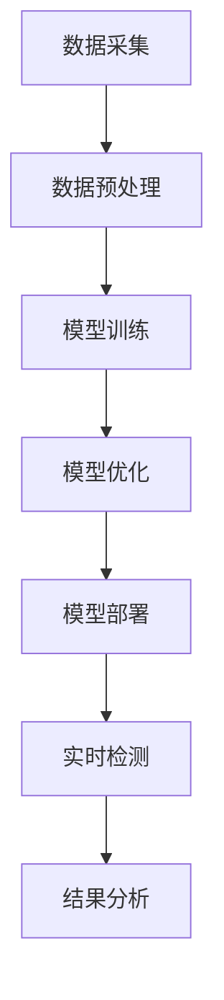
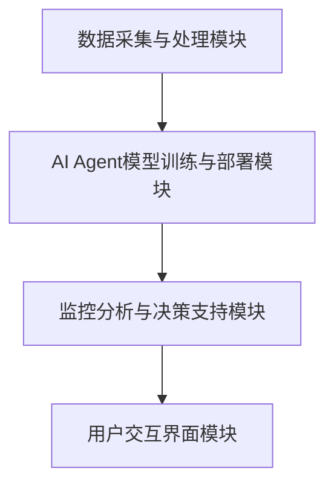

                 

### 1.1 问题背景

#### 1.1.1 食品安全问题的现状

食品安全问题是一个全球性的挑战，其严峻性不容忽视。据统计，每年因食品安全问题而导致的疾病和死亡人数高达数百万。具体来说，问题食品包括农药残留、添加剂滥用、重金属污染、致病菌感染等。这些问题不仅对消费者的健康造成威胁，还对整个食品产业链产生深远影响。

- **农药残留**：农产品的农药残留问题广泛存在，尤其是蔬菜和水果。尽管农药能够提高农作物的产量和质量，但过量使用或不当使用会导致农药残留，长期摄入对人体健康构成潜在威胁。
- **添加剂滥用**：食品添加剂在食品生产和加工中广泛使用，以改善食品的口感、外观和保质期。然而，一些非法添加剂或滥用添加剂可能导致严重的健康问题，如亚硝酸盐、塑化剂等。
- **重金属污染**：农产品重金属污染主要来源于土壤和水体中的重金属。重金属对人体神经系统、免疫系统和消化系统等均有害，长期摄入可能导致中毒和慢性病。
- **致病菌感染**：食品中的致病菌主要包括沙门氏菌、大肠杆菌、金黄色葡萄球菌等。这些细菌可导致食物中毒，对消费者健康构成严重威胁。

#### 1.1.2 食品安全问题的原因分析

食品安全问题的产生原因复杂多样，主要包括以下几个方面：

- **农业生产方式**：传统的农业生产方式依赖大量化学农药和化肥，导致农产品中农药残留和重金属含量增加。
- **食品加工工艺**：食品加工过程中，为了延长保质期或改善口感，一些企业可能滥用添加剂。
- **供应链管理**：食品供应链中存在信息不对称和监管漏洞，导致食品安全问题难以及时发现和处理。
- **消费者需求**：消费者对食品口感、外观和保质期的要求越来越高，促使企业在食品生产和加工中采取一些不当手段。

#### 1.1.3 食品安全问题的解决需求

为了有效解决食品安全问题，需要采取多种措施，包括：

- **加强监管**：政府应加强对食品生产和流通环节的监管，严格执行食品安全法律法规，加大对违法行为的处罚力度。
- **提升生产技术**：鼓励农业和食品企业采用绿色、环保的生产技术，减少农药和化肥的使用。
- **完善供应链管理**：通过信息化手段提高供应链透明度，实现从农田到餐桌的全过程监管。
- **消费者教育**：提高消费者对食品安全的认识和自我保护能力，倡导健康、理性的消费观念。

综上所述，食品安全问题是一个复杂的社会问题，需要政府、企业和社会各方共同努力，通过技术创新、政策完善和公众参与，共同打造一个安全、健康的食品环境。

#### 1.1.4 食品安全问题的解决需求

解决食品安全问题不仅关系到消费者的健康，也关系到社会的稳定和经济的可持续发展。为了实现这一目标，以下几个方面显得尤为重要：

- **技术创新**：随着人工智能、物联网和大数据等技术的快速发展，可以预见，这些技术将在食品安全监控和管理中发挥重要作用。通过应用AI Agent，可以实现食品安全的实时监控和智能预警，提高监管效率。
- **政策支持**：政府需要制定和实施一系列政策，包括食品安全法律法规、标准和激励措施，以推动食品安全工作的开展。此外，政府还应加大对食品安全科研和技术创新的投入，支持企业和科研机构开展相关研究。
- **公众参与**：食品安全是一个社会问题，需要全社会的共同参与。消费者应提高食品安全意识，积极参与到食品安全监督中。同时，媒体和公众组织也应发挥监督作用，推动食品安全问题的解决。
- **国际合作**：食品安全问题具有跨国性，各国之间应加强合作，共同应对食品安全挑战。通过信息共享、技术交流和合作执法，提高全球食品安全水平。

综上所述，解决食品安全问题需要多方面的努力和配合，通过技术创新、政策支持、公众参与和国际合作，才能构建一个更加安全、健康的食品环境。

### 1.2 AI Agent的定义与特点

#### 1.2.1 AI Agent的定义

AI Agent，即人工智能代理，是指能够自主完成特定任务的智能实体。它结合了人工智能和代理理论，具有自主性、智能性和适应性等特点。AI Agent的工作原理是通过感知环境、分析环境信息、执行决策和反馈结果，不断优化自身的行动策略，以实现预期的目标。

- **自主性**：AI Agent能够自主地执行任务，无需人工干预。它可以通过算法和模型，根据环境变化自主调整行为。
- **智能性**：AI Agent具备一定的智能，能够理解、推理和解决问题。它利用机器学习和深度学习等技术，从数据中学习模式和规律，从而做出智能决策。
- **适应性**：AI Agent能够适应不同的环境和任务。它可以通过自我学习和调整，适应环境变化和任务需求。

#### 1.2.1.1 AI Agent的基本概念

AI Agent的基本概念包括感知、行动、规划和学习等。感知是指AI Agent通过传感器获取环境信息；行动是指AI Agent根据感知到的信息执行任务；规划是指AI Agent在执行任务前制定行动策略；学习是指AI Agent通过不断试错和反馈，优化自身性能。

#### 1.2.1.2 AI Agent的工作原理

AI Agent的工作原理可以分为以下几个步骤：

1. **感知环境**：AI Agent通过传感器（如摄像头、麦克风、GPS等）获取环境信息。
2. **环境建模**：AI Agent将感知到的信息转化为内部模型，以更好地理解环境。
3. **规划行动**：AI Agent根据内部模型和任务目标，制定最优的行动策略。
4. **执行行动**：AI Agent按照规划的行动策略，执行具体的任务。
5. **反馈与学习**：AI Agent根据执行结果和环境反馈，调整内部模型和行动策略。

#### 1.2.1.3 AI Agent的类型与分类

AI Agent可以根据不同的分类标准进行分类，如按照任务类型、应用领域、智能程度等。以下是几种常见的AI Agent类型：

- **基于规则Agent**：这类Agent根据预定义的规则进行决策和行动。它们适用于任务明确、规则简单的场景。
- **基于模型Agent**：这类Agent通过构建环境模型，进行预测和决策。它们适用于任务复杂、环境动态变化的场景。
- **基于学习Agent**：这类Agent通过机器学习和深度学习等技术，从数据中学习模式和规律，进行决策和行动。它们适用于任务多样化、数据丰富的场景。

#### 1.2.2 AI Agent在智能食品安全监控中的特点

AI Agent在智能食品安全监控中具有以下特点：

- **高效性**：AI Agent能够实时监控食品生产、加工和流通环节，快速识别和处理食品安全问题，提高监管效率。
- **准确性**：AI Agent利用先进的数据处理和算法技术，对食品安全问题进行精准分析和判断，减少误报和漏报。
- **可扩展性**：AI Agent可以根据不同场景和需求，灵活调整和扩展功能，适应多样化的食品安全监控需求。
- **智能化**：AI Agent具备智能学习和适应能力，能够自我优化和提升性能，实现智能化的食品安全监控。

### 1.3 智能食品安全监控的挑战与机遇

#### 1.3.1 智能食品安全监控的挑战

尽管AI Agent在智能食品安全监控中具有显著优势，但在实际应用中仍面临一系列挑战：

- **数据复杂性**：食品安全监控涉及大量的数据，包括传感器数据、文本数据、图像数据等。如何有效处理和整合这些数据，是智能食品安全监控面临的一个重要挑战。
- **算法复杂性**：食品安全监控中的算法需要处理复杂的决策问题，如数据清洗、特征提取、模型训练等。算法的复杂性和性能直接影响监控系统的效率和准确性。
- **系统集成与可靠性**：智能食品安全监控系统需要集成多种硬件和软件系统，如传感器、云计算平台、数据分析工具等。如何确保系统集成的高效性和可靠性，是另一个重要挑战。

#### 1.3.2 智能食品安全监控的机遇

尽管面临挑战，智能食品安全监控也面临着巨大的机遇：

- **技术进步**：随着人工智能、物联网、大数据等技术的不断发展，智能食品安全监控技术也在不断成熟。这些技术的进步为智能食品安全监控提供了强大的技术支持。
- **政策支持**：各国政府纷纷出台政策，加强对食品安全监控的重视和支持。这些政策为智能食品安全监控提供了良好的政策环境。
- **市场需求**：消费者对食品安全的关注度日益提高，市场需求推动企业加强食品安全监控，为智能食品安全监控创造了广阔的市场空间。

#### 1.3.3 智能食品安全监控的挑战与机遇

综合来看，智能食品安全监控既面临挑战，也充满机遇。挑战主要体现在数据复杂性、算法复杂性和系统集成与可靠性等方面；而机遇则源于技术进步、政策支持和市场需求。为了有效应对挑战，抓住机遇，需要政府、企业和社会各方共同努力，通过技术创新、政策完善和公众参与，共同构建一个更加安全、智能的食品安全监控体系。

### 1.4 本章小结

本章首先介绍了食品安全问题的现状、原因及解决需求，强调了食品安全问题对公共健康和经济发展的重要性。接着，我们对AI Agent进行了定义与特点分析，阐述了其在智能食品安全监控中的高效性、准确性和可扩展性等优势。此外，我们还探讨了智能食品安全监控面临的挑战和机遇，提出了通过技术创新、政策完善和公众参与来应对挑战和抓住机遇的思路。通过本章的学习，读者可以对AI Agent在智能食品安全监控中的角色和应用有更深入的理解，为后续章节的学习和研究打下坚实基础。

----------------------------------------------------------------

## 第一部分：问题背景与核心概念

### 第1章：AI Agent与智能食品安全监控概述

本章将首先探讨当前食品安全问题的严峻形势，分析其产生的原因，并探讨解决食品安全问题的迫切需求。随后，我们将介绍AI Agent的定义与特点，以及其在智能食品安全监控中的潜在应用。最后，我们将探讨智能食品安全监控面临的挑战与机遇，为后续章节的内容提供背景和基础。

### 1.1 问题背景

食品安全问题是一个全球性的挑战，其影响范围广泛，不仅对消费者的健康构成威胁，还对食品产业链产生深远影响。近年来，食品安全事件的频繁发生，使得这一问题愈发严重。为了更好地理解食品安全问题的现状，我们需要从以下几个方面进行分析：

#### 1.1.1 食品安全问题的现状

食品安全问题的现状可以从以下几个方面进行概述：

- **农药残留**：在农产品生产过程中，为了提高产量和质量，农民往往大量使用农药。这些农药在杀灭害虫的同时，也可能残留在农产品上。如果消费者长期摄入含有农药残留的农产品，可能会对健康造成负面影响。
- **添加剂滥用**：在食品加工和销售过程中，一些不法商家为了改善食品的口感、延长保质期或增加美观度，可能会滥用添加剂。例如，一些非法添加剂如亚硝酸盐和塑化剂，如果长期摄入，可能会对人体健康造成严重危害。
- **重金属污染**：农产品在生长过程中，可能会受到重金属污染，如铅、镉、汞等。这些重金属可以通过食物链进入人体，对人体的神经系统、免疫系统和消化系统等造成损害。
- **致病菌感染**：食品中的致病菌，如沙门氏菌、大肠杆菌和金黄色葡萄球菌等，可能导致食物中毒。这些细菌在食品生产、加工、储存和运输等环节中容易滋生，如果防控措施不到位，可能会对消费者健康造成严重威胁。

#### 1.1.2 食品安全问题的原因分析

食品安全问题的产生原因复杂多样，主要包括以下几个方面：

- **农业生产方式**：传统的农业生产方式依赖大量化学农药和化肥，导致农产品中农药残留和重金属含量增加。此外，一些农民为了追求产量，可能会违规使用农药和化肥。
- **食品加工工艺**：在食品加工过程中，一些企业为了延长食品保质期或改善口感，可能会滥用添加剂。此外，食品加工过程中的交叉污染也可能导致食品安全问题。
- **供应链管理**：食品供应链中存在信息不对称和监管漏洞，导致食品安全问题难以及时发现和处理。例如，一些生产商和销售商可能会隐瞒食品安全问题，以追求更高的利润。
- **消费者需求**：消费者对食品口感、外观和保质期的要求越来越高，促使企业在食品生产和加工中采取一些不当手段，以迎合市场需求。

#### 1.1.3 食品安全问题的解决需求

解决食品安全问题不仅关系到消费者的健康，还关系到社会的稳定和经济的可持续发展。为了有效解决食品安全问题，需要采取以下措施：

- **加强监管**：政府应加强对食品生产和流通环节的监管，严格执行食品安全法律法规，加大对违法行为的处罚力度。
- **提升生产技术**：鼓励农业和食品企业采用绿色、环保的生产技术，减少农药和化肥的使用。例如，推广有机农业和生物防治技术。
- **完善供应链管理**：通过信息化手段提高供应链透明度，实现从农田到餐桌的全过程监管。例如，建立食品安全追溯系统，确保食品来源可追溯、过程可控。
- **消费者教育**：提高消费者对食品安全的认识和自我保护能力，倡导健康、理性的消费观念。

### 1.2 AI Agent的定义与特点

AI Agent，即人工智能代理，是一种具有自主性、智能性和适应性的智能实体。它能够通过感知环境、分析信息、执行决策和反馈结果，自主地完成特定任务。AI Agent的定义和特点如下：

#### 1.2.1 AI Agent的定义

AI Agent是人工智能领域中的一种重要概念，它结合了人工智能和代理理论。AI Agent的基本定义包括以下几点：

- **自主性**：AI Agent能够自主地执行任务，无需人工干预。它可以根据环境变化和任务需求，自主调整行为和决策。
- **智能性**：AI Agent具备智能，能够理解、推理和解决问题。它利用机器学习和深度学习等技术，从数据中学习模式和规律，从而做出智能决策。
- **适应性**：AI Agent能够适应不同的环境和任务。它可以通过自我学习和调整，优化自身性能，以更好地适应环境变化和任务需求。

#### 1.2.1.1 AI Agent的基本概念

AI Agent的基本概念包括感知、行动、规划和学习等。以下是这些基本概念的详细解释：

- **感知**：AI Agent通过传感器获取环境信息。这些传感器可以是摄像头、麦克风、GPS等，用于感知环境中的各种数据。
- **行动**：AI Agent根据感知到的信息执行任务。它可以自主地移动、操作设备或执行其他动作，以实现任务目标。
- **规划**：AI Agent在执行任务前制定行动策略。它根据任务目标和环境信息，计算最优的行动路径或决策方案。
- **学习**：AI Agent通过不断试错和反馈，优化自身性能。它可以从历史数据和执行结果中学习，改进行为策略，提高任务完成效率。

#### 1.2.1.2 AI Agent的工作原理

AI Agent的工作原理可以概括为以下几个步骤：

1. **感知环境**：AI Agent通过传感器获取环境信息，如温度、湿度、光照强度等。这些信息被转化为内部表示，供后续处理和分析。
2. **环境建模**：AI Agent将感知到的信息转化为内部模型，以更好地理解环境。这些模型可以是图像、声音或文本等。
3. **规划行动**：AI Agent根据内部模型和任务目标，制定最优的行动策略。这些策略可以是路径规划、决策树或神经网络等。
4. **执行行动**：AI Agent按照规划的行动策略，执行具体的任务。例如，它可以通过控制机器人移动或操作设备，实现目标。
5. **反馈与学习**：AI Agent根据执行结果和环境反馈，调整内部模型和行动策略。通过不断学习和优化，它能够提高任务完成效率，适应复杂环境。

#### 1.2.1.3 AI Agent的类型与分类

AI Agent可以根据不同的分类标准进行分类，如按照任务类型、应用领域和智能程度等。以下是几种常见的AI Agent类型：

- **基于规则Agent**：这类Agent根据预定义的规则进行决策和行动。它们适用于任务明确、规则简单的场景，如自动化生产线和简单决策系统。
- **基于模型Agent**：这类Agent通过构建环境模型，进行预测和决策。它们适用于任务复杂、环境动态变化的场景，如自动驾驶和智能监控。
- **基于学习Agent**：这类Agent通过机器学习和深度学习等技术，从数据中学习模式和规律，进行决策和行动。它们适用于任务多样化、数据丰富的场景，如智能客服和图像识别。

#### 1.2.2 AI Agent在智能食品安全监控中的特点

AI Agent在智能食品安全监控中具有以下特点：

- **高效性**：AI Agent能够实时监控食品生产、加工和流通环节，快速识别和处理食品安全问题，提高监管效率。
- **准确性**：AI Agent利用先进的数据处理和算法技术，对食品安全问题进行精准分析和判断，减少误报和漏报。
- **可扩展性**：AI Agent可以根据不同场景和需求，灵活调整和扩展功能，适应多样化的食品安全监控需求。
- **智能化**：AI Agent具备智能学习和适应能力，能够自我优化和提升性能，实现智能化的食品安全监控。

### 1.3 智能食品安全监控的挑战与机遇

智能食品安全监控是一个复杂而充满挑战的任务。尽管AI Agent为食品安全监控提供了强大的技术支持，但在实际应用中仍面临一系列挑战。同时，智能食品安全监控也面临着巨大的机遇。

#### 1.3.1 智能食品安全监控的挑战

智能食品安全监控面临的挑战主要包括以下几个方面：

- **数据复杂性**：食品安全监控涉及大量的数据，包括传感器数据、文本数据、图像数据等。如何有效处理和整合这些数据，是智能食品安全监控面临的一个重要挑战。
- **算法复杂性**：食品安全监控中的算法需要处理复杂的决策问题，如数据清洗、特征提取、模型训练等。算法的复杂性和性能直接影响监控系统的效率和准确性。
- **系统集成与可靠性**：智能食品安全监控系统需要集成多种硬件和软件系统，如传感器、云计算平台、数据分析工具等。如何确保系统集成的高效性和可靠性，是另一个重要挑战。

#### 1.3.2 智能食品安全监控的机遇

尽管面临挑战，智能食品安全监控也面临着巨大的机遇：

- **技术进步**：随着人工智能、物联网、大数据等技术的不断发展，智能食品安全监控技术也在不断成熟。这些技术的进步为智能食品安全监控提供了强大的技术支持。
- **政策支持**：各国政府纷纷出台政策，加强对食品安全监控的重视和支持。这些政策为智能食品安全监控提供了良好的政策环境。
- **市场需求**：消费者对食品安全的关注度日益提高，市场需求推动企业加强食品安全监控，为智能食品安全监控创造了广阔的市场空间。

#### 1.3.3 智能食品安全监控的挑战与机遇

综合来看，智能食品安全监控既面临挑战，也充满机遇。挑战主要体现在数据复杂性、算法复杂性和系统集成与可靠性等方面；而机遇则源于技术进步、政策支持和市场需求。为了有效应对挑战，抓住机遇，需要政府、企业和社会各方共同努力，通过技术创新、政策完善和公众参与，共同构建一个更加安全、智能的食品安全监控体系。

### 1.4 本章小结

本章首先介绍了食品安全问题的现状、原因及解决需求，强调了食品安全问题对公共健康和经济发展的重要性。接着，我们对AI Agent进行了定义与特点分析，阐述了其在智能食品安全监控中的潜在应用。此外，我们还探讨了智能食品安全监控面临的挑战与机遇，提出了通过技术创新、政策完善和公众参与来应对挑战和抓住机遇的思路。通过本章的学习，读者可以对AI Agent在智能食品安全监控中的角色和应用有更深入的理解，为后续章节的内容提供背景和基础。

----------------------------------------------------------------

## 第二部分：AI Agent在智能食品安全监控中的应用

### 第2章：AI Agent在食品安全检测中的应用

本章将深入探讨AI Agent在食品安全检测中的具体应用。首先，我们将介绍传感器技术在食品安全检测中的作用，并分析传感器数据的预处理方法。接着，我们将详细讲解深度学习算法在食品安全检测中的应用，包括卷积神经网络（CNN）、递归神经网络（RNN）和集成学习方法。随后，我们将描述AI Agent在食品安全检测中的工作流程，包括数据采集与预处理、模型训练与优化以及食品安全检测的具体实施。最后，我们将通过案例分析，展示AI Agent在实际食品安全检测中的应用效果，并总结本章内容。

### 2.1 传感器技术在食品安全检测中的作用

传感器技术是智能食品安全检测的重要组成部分，它能够实时、准确地采集环境数据，为食品安全监控提供可靠的基础。以下将从传感器的基本原理、传感器在食品安全检测中的应用以及传感器数据预处理三个方面进行详细探讨。

#### 2.1.1 传感器的基本原理

传感器是一种能够检测并响应特定刺激（如温度、湿度、光照、气味等）的装置，并将这些刺激转化为电信号或其他形式的输出信号。传感器的核心是传感器元件，它们通常由敏感材料和转换电路组成。敏感材料可以感知外界刺激，转换电路则将感知到的物理量转化为可处理的电信号。

传感器的工作原理可以分为以下几个步骤：

1. **感知**：传感器元件感知到外界的物理量，如温度、湿度等。
2. **响应**：传感器元件根据感知到的物理量，产生相应的物理响应，如电阻变化、电压变化等。
3. **转换**：转换电路将传感器元件的物理响应转化为电信号，以便后续处理和分析。
4. **输出**：传感器输出的电信号可以被传感器模块或数据分析系统接收和处理。

#### 2.1.2 传感器在食品安全检测中的应用

在食品安全检测中，传感器技术广泛应用于多个方面，如温度监控、湿度监控、重金属检测、农药残留检测等。以下是几种常见的传感器应用实例：

- **温度传感器**：用于监测食品在生产、加工、储存和运输过程中的温度变化。温度传感器可以实时检测并记录食品的温度，确保食品在适宜的温度下储存，避免变质。
- **湿度传感器**：用于监测食品储存环境的湿度。湿度传感器可以监测食品包装袋、仓库等环境中的湿度变化，防止食品因湿度过高而霉变。
- **重金属传感器**：用于检测食品中的重金属含量，如铅、镉、汞等。重金属传感器可以实时检测食品中的重金属，确保食品中的重金属含量符合安全标准。
- **农药残留传感器**：用于检测食品中的农药残留。农药残留传感器可以检测蔬菜、水果等农产品表面的农药残留，确保食品的安全性和质量。

#### 2.1.3 传感器数据预处理

传感器数据预处理是食品安全检测中至关重要的一环。传感器数据通常包含大量的噪声和异常值，这些噪声和异常值会影响检测结果的准确性和可靠性。因此，对传感器数据进行预处理，提取有效的特征信息，是确保食品安全检测准确性的关键。

传感器数据预处理主要包括以下几个步骤：

1. **数据清洗**：去除传感器数据中的噪声和异常值。例如，可以使用滤波算法去除温度传感器数据中的随机噪声，使用去重算法去除重复数据等。
2. **数据标准化**：将不同传感器数据转换为统一的量纲和范围，以便于后续分析和处理。例如，将不同传感器的输出值转换为0到1之间的比例值，便于比较和分析。
3. **数据特征提取**：从传感器数据中提取有效的特征信息，用于模型训练和预测。特征提取可以采用统计方法、机器学习方法或深度学习方法。例如，可以使用主成分分析（PCA）提取温度和湿度数据的主要成分，使用卷积神经网络（CNN）提取图像数据中的特征等。

通过传感器数据预处理，可以有效提高食品安全检测的准确性和可靠性，为AI Agent在食品安全检测中的应用奠定坚实基础。

### 2.2 深度学习算法在食品安全检测中的应用

深度学习算法在食品安全检测中发挥着重要作用，能够自动提取数据中的特征，实现高精度的食品安全检测。以下将从卷积神经网络（CNN）、递归神经网络（RNN）和集成学习方法三个方面，详细探讨深度学习算法在食品安全检测中的应用。

#### 2.2.1 卷积神经网络（CNN）

卷积神经网络（CNN）是一种专门用于处理图像数据的前馈神经网络，具有强大的图像识别和特征提取能力。在食品安全检测中，CNN可以用于检测食品中的异物、农药残留和微生物等。

1. **CNN的基本原理**：CNN的核心是卷积层，通过卷积操作提取图像特征。卷积层包括卷积核（也称为滤波器）和激活函数。卷积核在图像上滑动，提取局部特征，然后通过激活函数进行非线性变换。多个卷积层可以堆叠，形成深度卷积网络，以提取更复杂的特征。

2. **CNN在食品安全检测中的应用**：例如，可以使用CNN检测食品中的异物。具体步骤如下：

   - **数据预处理**：对食品图像进行归一化和裁剪，确保图像尺寸一致。
   - **模型训练**：使用大量含有异物和非异物标记的食品图像，训练CNN模型。
   - **模型评估**：使用测试集对训练好的模型进行评估，调整模型参数，提高检测准确率。
   - **异物检测**：将待检测的食品图像输入到训练好的CNN模型中，模型输出异物检测结果。

   通过CNN，可以有效识别食品中的异物，提高食品安全检测的准确性和效率。

#### 2.2.2 递归神经网络（RNN）

递归神经网络（RNN）是一种能够处理序列数据的前馈神经网络，具有记忆功能，能够捕捉序列数据中的时间依赖性。在食品安全检测中，RNN可以用于检测食品中的细菌和病毒等。

1. **RNN的基本原理**：RNN的核心是隐藏层，隐藏层中的神经元通过循环连接形成反馈网络。RNN在处理序列数据时，将前一个时间步的隐藏状态传递到下一个时间步，从而保留历史信息。

2. **RNN在食品安全检测中的应用**：例如，可以使用RNN检测食品中的细菌。具体步骤如下：

   - **数据预处理**：对食品检测数据进行归一化和去噪，确保数据质量。
   - **模型训练**：使用含有细菌和非细菌标记的食品检测数据，训练RNN模型。
   - **模型评估**：使用测试集对训练好的模型进行评估，调整模型参数，提高检测准确率。
   - **细菌检测**：将待检测的食品检测数据输入到训练好的RNN模型中，模型输出细菌检测结果。

   通过RNN，可以有效检测食品中的细菌，提高食品安全检测的精度和可靠性。

#### 2.2.3 集成学习方法

集成学习方法将多个基础模型组合起来，形成一个新的模型，以提高模型的预测性能。在食品安全检测中，集成学习方法可以用于提高检测准确率，减少模型过拟合。

1. **集成学习方法的基本原理**：集成学习方法包括Bagging和Boosting两种主要策略。Bagging方法通过训练多个基础模型，并取平均值或投票结果作为最终预测；Boosting方法通过训练多个基础模型，每个模型都关注前一个模型的错误样本，逐渐提高整体模型性能。

2. **集成学习方法在食品安全检测中的应用**：例如，可以使用集成学习方法提高食品农药残留检测的准确率。具体步骤如下：

   - **基础模型训练**：使用不同算法（如决策树、支持向量机等）训练多个基础模型。
   - **集成模型训练**：将训练好的基础模型组合成集成模型，如随机森林、Adaboost等。
   - **模型评估**：使用测试集对集成模型进行评估，调整模型参数，提高检测准确率。
   - **农药残留检测**：将待检测的食品数据输入到集成模型中，模型输出农药残留检测结果。

   通过集成学习方法，可以有效提高食品安全检测的准确率，降低模型过拟合的风险。

#### 2.2.4 深度学习算法在食品安全检测中的应用总结

深度学习算法在食品安全检测中具有广泛的应用前景，能够实现高精度的食品安全检测。通过CNN，可以有效识别食品中的异物；通过RNN，可以有效检测食品中的细菌和病毒；通过集成学习方法，可以提高模型的预测性能，降低模型过拟合的风险。这些深度学习算法的应用，为食品安全检测提供了强大的技术支持，有助于保障食品安全，保护公众健康。

### 2.3 AI Agent在食品安全检测中的工作流程

AI Agent在食品安全检测中发挥着核心作用，能够通过感知环境、分析数据、执行决策和反馈结果，实现高效的食品安全检测。以下是AI Agent在食品安全检测中的工作流程，包括数据采集与预处理、模型训练与优化以及食品安全检测的具体实施。

#### 2.3.1 数据采集与预处理

数据采集是食品安全检测的第一步，AI Agent需要从各种传感器和设备中收集环境数据。这些数据包括温度、湿度、光照、气体浓度、图像和文本等。数据采集的主要步骤如下：

1. **传感器部署**：在食品生产、加工和储存环节部署各种传感器，如温度传感器、湿度传感器、气体传感器、摄像头等。
2. **数据采集**：传感器将感知到的环境信息转化为电信号或其他形式的输出信号，通过数据采集模块传输到AI Agent。
3. **数据预处理**：对采集到的原始数据进行预处理，包括数据清洗、数据标准化和特征提取等。

数据清洗的目的是去除噪声和异常值，确保数据的准确性和可靠性。数据标准化是将不同传感器数据转换为统一的量纲和范围，便于后续分析和处理。特征提取是从原始数据中提取有效的特征信息，用于模型训练和预测。

#### 2.3.2 模型训练与优化

在数据预处理完成后，AI Agent需要利用这些数据训练深度学习模型，以便在后续的食品安全检测中应用。模型训练的主要步骤如下：

1. **模型选择**：根据食品安全检测的需求，选择合适的深度学习模型，如CNN、RNN或集成学习方法等。
2. **模型训练**：使用预处理后的数据训练深度学习模型。模型训练过程中，通过反向传播算法不断调整模型参数，以降低预测误差。
3. **模型优化**：在模型训练过程中，可以使用各种优化技术（如正则化、dropout、批归一化等）提高模型性能，防止过拟合。

模型优化是提高模型预测准确性和鲁棒性的关键步骤。通过优化，可以确保模型在复杂的食品安全检测环境中具有良好的性能。

#### 2.3.3 食品安全检测

在模型训练和优化完成后，AI Agent可以开始进行食品安全检测。食品安全检测的主要步骤如下：

1. **模型部署**：将训练好的模型部署到实际检测环境中，如食品安全监控系统、智能检测设备等。
2. **实时检测**：AI Agent通过传感器实时采集环境数据，并输入到模型中进行预测。模型输出检测结果，如食品中的异物、细菌或农药残留等。
3. **结果分析**：对模型输出的检测结果进行分析，判断食品是否安全。如果检测结果异常，可以及时采取应对措施，如召回产品、停产整顿等。

通过AI Agent的食品安全检测，可以实现实时、高效的食品安全监控，提高检测准确率和响应速度。AI Agent的工作流程如图2-1所示。

#### 2.3.4 应用案例分析

为了更好地展示AI Agent在食品安全检测中的应用效果，我们以下通过一个实际案例进行分析。

**案例背景**：某大型食品加工厂希望通过引入AI Agent，实现对生产过程中的食品安全进行实时监控。该加工厂主要生产蔬菜和水果，需要检测农药残留、微生物污染等问题。

**AI Agent应用**：

1. **传感器部署**：在蔬菜和水果的生产、加工和储存环节部署温度传感器、湿度传感器、农药残留传感器和微生物检测传感器等。
2. **数据采集与预处理**：AI Agent通过传感器实时采集环境数据，并对数据进行清洗、标准化和特征提取等预处理操作。
3. **模型训练与优化**：使用预处理后的数据训练深度学习模型，如CNN用于检测农药残留，RNN用于检测微生物污染等。通过模型优化，提高模型在复杂环境中的性能。
4. **食品安全检测**：AI Agent实时检测蔬菜和水果中的农药残留和微生物污染，将检测结果实时反馈给生产和管理人员。

**案例效果分析**：

通过引入AI Agent，该加工厂实现了以下效果：

1. **提高检测准确率**：AI Agent利用深度学习算法，能够准确识别蔬菜和水果中的农药残留和微生物污染，提高检测准确率。
2. **实时监控**：AI Agent实时采集环境数据，并快速输出检测结果，确保食品安全问题能够及时被发现和处理。
3. **降低人工成本**：通过自动化检测，减少了人工检测的依赖，降低了人工成本。
4. **提高生产效率**：AI Agent的实时监控和自动化检测，提高了生产效率，减少了因食品安全问题导致的停产和召回。

总之，AI Agent在食品安全检测中的应用，为食品安全监控提供了强大的技术支持，有助于提高检测准确率、降低人工成本和提高生产效率。

### 2.4 本章小结

本章详细探讨了AI Agent在食品安全检测中的应用。首先，我们介绍了传感器技术在食品安全检测中的作用，包括传感器的基本原理、传感器在食品安全检测中的应用以及传感器数据的预处理。接着，我们分析了深度学习算法在食品安全检测中的应用，包括卷积神经网络（CNN）、递归神经网络（RNN）和集成学习方法。随后，我们描述了AI Agent在食品安全检测中的工作流程，包括数据采集与预处理、模型训练与优化以及食品安全检测的具体实施。最后，我们通过实际案例展示了AI Agent在食品安全检测中的应用效果。通过本章的学习，读者可以深入了解AI Agent在食品安全检测中的应用，并为后续章节的内容奠定基础。

----------------------------------------------------------------

## 第三部分：智能食品安全监控系统的设计与实现

### 第3章：智能食品安全监控系统的设计与实现

本章将深入探讨智能食品安全监控系统的设计与实现，涵盖系统总体设计、数据采集与处理、AI Agent模型的训练与部署等方面。首先，我们将详细描述系统的总体设计，包括系统架构设计和技术选型。接着，我们将介绍数据采集与处理模块，包括传感器数据采集和数据处理与存储。随后，我们将重点讲解AI Agent模型的训练与部署过程，包括模型训练、模型优化和模型部署。最后，我们将通过一个实际项目案例，展示系统的实现和应用效果。

### 3.1 系统总体设计

智能食品安全监控系统的设计需要综合考虑系统的功能需求、技术实现和性能优化。以下将从系统架构设计和技术选型两个方面进行详细描述。

#### 3.1.1 系统架构设计

智能食品安全监控系统的架构设计可以分为四个主要模块：数据采集与处理模块、AI Agent模型训练与部署模块、监控分析与决策支持模块和用户交互界面模块。

1. **数据采集与处理模块**：该模块负责从各个传感器和设备中采集数据，包括温度、湿度、光照、气体浓度、图像和文本等。采集到的数据经过预处理后，将用于AI Agent模型的训练和预测。
   
2. **AI Agent模型训练与部署模块**：该模块负责训练和部署AI Agent模型。模型训练包括数据预处理、模型选择、模型训练和模型优化等步骤。训练好的模型将用于实时监控和分析食品安全问题。
   
3. **监控分析与决策支持模块**：该模块对实时采集的数据进行分析和决策支持。通过深度学习算法和数据分析技术，对食品安全问题进行预测和预警，并为管理人员提供决策建议。
   
4. **用户交互界面模块**：该模块提供用户与系统的交互接口，包括数据展示、报警信息和操作界面等。用户可以通过界面查看实时监控数据、历史数据和报警信息，并进行相关操作。

系统架构图如下所示：

#### 3.1.2 系统技术选型

在智能食品安全监控系统的技术选型中，需要综合考虑硬件设备、软件框架和编程语言等因素。

1. **硬件设备**：选择合适的硬件设备是确保系统稳定运行和高效性能的关键。主要包括以下设备：

   - **传感器**：用于采集温度、湿度、光照、气体浓度等环境数据。
   - **服务器**：用于存储和管理大量数据，并运行AI Agent模型训练和预测。
   - **网络设备**：包括路由器、交换机和无线接入点等，用于实现数据传输和网络连接。

2. **软件框架**：选择合适的软件框架可以简化开发流程，提高系统性能和可维护性。主要包括以下框架：

   - **数据分析与处理**：使用Python的NumPy、Pandas和SciPy等库进行数据清洗、数据预处理和特征提取。
   - **深度学习框架**：使用TensorFlow、PyTorch等框架进行AI Agent模型的训练和预测。
   - **前端开发**：使用HTML、CSS和JavaScript等前端技术构建用户交互界面。

3. **编程语言**：选择合适的编程语言可以提高开发效率，确保系统性能。在智能食品安全监控系统中，主要使用Python进行后端开发和数据分析，同时使用JavaScript进行前端开发。

### 3.2 数据采集与处理

数据采集与处理是智能食品安全监控系统的重要组成部分，直接影响系统的性能和准确性。以下将从传感器数据采集和数据处理与存储两个方面进行详细描述。

#### 3.2.1 传感器数据采集

传感器数据采集是智能食品安全监控系统的第一步，需要部署各种传感器以获取食品生产、加工和储存过程中的环境数据。以下是传感器数据采集的步骤：

1. **传感器选型与布置**：根据食品安全监控的需求，选择合适的传感器，如温度传感器、湿度传感器、农药残留传感器和微生物检测传感器等。传感器需要合理布置在食品生产、加工和储存的关键位置，以确保数据采集的全面性和准确性。
2. **数据采集模块设计**：设计数据采集模块，实现传感器数据的实时采集和传输。数据采集模块可以采用嵌入式系统或物联网（IoT）设备，将传感器数据转换为标准的数据格式，并通过无线或有线网络传输到数据中心。
3. **数据传输与存储**：设计数据传输和存储方案，确保传感器数据的安全、可靠传输和存储。可以使用云计算平台或分布式数据库存储大量传感器数据，同时采用数据加密和访问控制等措施，保护数据的安全性和隐私性。

#### 3.2.2 数据处理与存储

在传感器数据采集完成后，需要对数据进行处理和存储，以便后续的分析和模型训练。以下是数据处理与存储的步骤：

1. **数据清洗**：清洗传感器数据，去除噪声、异常值和重复数据，提高数据的准确性和可靠性。可以使用Python的Pandas库实现数据清洗功能。
2. **数据标准化**：将不同传感器数据转换为统一的量纲和范围，以便于后续的分析和处理。例如，将温度、湿度等数据统一转换为摄氏度或百分比。
3. **特征提取**：从原始数据中提取有效的特征信息，用于模型训练和预测。可以使用机器学习和深度学习技术，如主成分分析（PCA）、卷积神经网络（CNN）等，实现特征提取。
4. **数据存储**：将处理后的数据存储在分布式数据库或数据仓库中，以便后续的分析和查询。可以使用Hadoop、Spark等大数据处理技术，实现高效的数据存储和检索。

### 3.3 AI Agent模型的训练与部署

AI Agent模型训练与部署是智能食品安全监控系统的核心环节，直接影响系统的性能和准确性。以下将从模型训练、模型优化和模型部署三个方面进行详细描述。

#### 3.3.1 模型训练

AI Agent模型的训练包括以下步骤：

1. **数据准备**：准备用于训练的数据集，包括传感器数据、标签数据和背景信息等。数据集需要涵盖各种食品安全问题，如农药残留、微生物污染、重金属污染等。
2. **模型选择**：选择合适的深度学习模型，如卷积神经网络（CNN）、递归神经网络（RNN）或集成学习方法等。根据食品安全监控的需求，可以选择不同类型的模型，以提高模型的性能。
3. **模型训练**：使用训练数据集训练模型，通过反向传播算法不断调整模型参数，以降低预测误差。训练过程中，可以使用数据增强、正则化等技术，提高模型的泛化能力和鲁棒性。
4. **模型评估**：使用验证集和测试集对训练好的模型进行评估，计算模型的准确率、召回率、F1分数等指标。根据评估结果，调整模型参数和训练策略，优化模型性能。

#### 3.3.2 模型优化

模型优化是提高AI Agent模型性能的关键步骤。以下介绍几种常见的模型优化方法：

1. **正则化**：通过添加正则化项（如L1正则化、L2正则化），可以防止模型过拟合，提高模型的泛化能力。
2. **数据增强**：通过数据增强技术（如旋转、缩放、翻转等），可以增加训练数据集的多样性，提高模型的鲁棒性。
3. **批量归一化**：通过批量归一化（Batch Normalization），可以加速模型训练过程，提高模型收敛速度。
4. **dropout**：通过dropout技术，可以防止模型过拟合，提高模型的泛化能力。

#### 3.3.3 模型部署

模型部署是将训练好的模型应用到实际系统中，实现实时监控和预测。以下介绍模型部署的步骤：

1. **模型转换**：将训练好的模型转换为可以部署的形式，如TensorFlow Lite、PyTorch Mobile等。模型转换过程需要保证模型的性能和兼容性。
2. **模型部署**：将转换后的模型部署到服务器或移动设备上，实现实时监控和预测。可以使用容器化技术（如Docker）或微服务架构（如Kubernetes），提高系统的灵活性和可扩展性。
3. **模型监控**：监控模型的性能和稳定性，及时发现和处理异常情况。可以使用监控系统（如Prometheus）和日志分析工具（如ELK Stack），实现模型监控和故障排除。

### 3.4 实际项目案例

为了展示智能食品安全监控系统的实际应用效果，以下介绍一个实际项目案例。

#### 项目背景

某大型食品加工厂希望通过引入智能食品安全监控系统，实现对生产过程中的食品安全进行实时监控。该加工厂主要生产蔬菜和水果，需要检测农药残留、微生物污染等问题。

#### 项目实施

1. **系统设计**：根据食品安全监控的需求，设计智能食品安全监控系统的架构，包括数据采集与处理模块、AI Agent模型训练与部署模块、监控分析与决策支持模块和用户交互界面模块。
2. **传感器部署**：在蔬菜和水果的生产、加工和储存环节部署各种传感器，如温度传感器、湿度传感器、农药残留传感器和微生物检测传感器等。
3. **数据采集与处理**：通过传感器实时采集环境数据，并对数据进行清洗、标准化和特征提取等预处理操作。预处理后的数据用于AI Agent模型的训练和预测。
4. **模型训练与优化**：使用预处理后的数据训练深度学习模型，如卷积神经网络（CNN）用于检测农药残留，递归神经网络（RNN）用于检测微生物污染等。通过模型优化，提高模型在复杂环境中的性能。
5. **系统部署**：将训练好的模型部署到实际系统中，实现实时监控和预测。系统可以自动检测食品中的农药残留和微生物污染，并将检测结果实时反馈给生产和管理人员。
6. **用户交互**：通过用户交互界面，用户可以查看实时监控数据、历史数据和报警信息，并进行相关操作。系统还提供决策支持功能，为管理人员提供科学依据。

#### 项目效果

通过引入智能食品安全监控系统，该大型食品加工厂实现了以下效果：

1. **提高检测准确率**：AI Agent模型利用深度学习算法，能够准确识别食品中的农药残留和微生物污染，提高检测准确率。
2. **实时监控**：AI Agent实时采集环境数据，并快速输出检测结果，确保食品安全问题能够及时被发现和处理。
3. **降低人工成本**：通过自动化检测，减少了人工检测的依赖，降低了人工成本。
4. **提高生产效率**：AI Agent的实时监控和自动化检测，提高了生产效率，减少了因食品安全问题导致的停产和召回。

总之，智能食品安全监控系统的设计与实现，为食品安全监控提供了强大的技术支持，有助于提高检测准确率、降低人工成本和提高生产效率。

### 3.5 本章小结

本章详细探讨了智能食品安全监控系统的设计与实现。首先，我们介绍了系统的总体设计，包括系统架构设计和技术选型。接着，我们介绍了数据采集与处理模块，包括传感器数据采集和数据处理与存储。随后，我们重点讲解了AI Agent模型的训练与部署过程，包括模型训练、模型优化和模型部署。最后，我们通过一个实际项目案例，展示了系统的实现和应用效果。通过本章的学习，读者可以深入了解智能食品安全监控系统的设计与实现，并为实际应用提供参考。

----------------------------------------------------------------

### 3.3 AI Agent模型的训练与部署

AI Agent模型的训练与部署是智能食品安全监控系统的核心环节，直接影响系统的性能和准确性。以下将详细描述AI Agent模型的训练、优化和部署过程。

#### 3.3.1 模型训练

模型训练是AI Agent模型构建的关键步骤，涉及数据准备、模型选择、训练策略和评估指标等方面。

1. **数据准备**：在模型训练之前，需要准备充足、多样且具有代表性的数据集。数据集应包括各种食品样本及其对应的标签（如农药残留的有无、微生物污染程度等）。数据准备过程包括数据采集、数据清洗和标注等。

   - **数据采集**：从食品生产、加工和储存环节采集大量传感器数据，包括温度、湿度、光照、农药残留浓度等。
   - **数据清洗**：去除噪声、异常值和重复数据，确保数据质量。可以使用Python的Pandas库进行数据清洗。
   - **数据标注**：对数据集进行标注，为每个样本分配正确的标签。标注过程可以采用人工标注或半监督学习等方法。

2. **模型选择**：根据食品安全检测的需求，选择合适的深度学习模型。常见的模型包括卷积神经网络（CNN）、递归神经网络（RNN）和强化学习（RL）等。以下是几种常见的模型及其适用场景：

   - **卷积神经网络（CNN）**：适用于图像和图像序列数据，如农药残留检测、微生物污染检测等。
   - **递归神经网络（RNN）**：适用于时序数据，如温度、湿度等环境参数的动态变化。
   - **强化学习（RL）**：适用于需要决策支持的任务，如食品生产线的优化调度。

3. **训练策略**：在模型训练过程中，需要采用适当的训练策略来提高模型的性能和收敛速度。以下是几种常见的训练策略：

   - **批量大小**：选择合适的批量大小可以影响模型的训练速度和效果。批量大小过小可能导致过拟合，批量大小过大可能导致欠拟合。
   - **学习率**：选择合适的学习率可以加速模型收敛。学习率过小可能导致收敛速度缓慢，学习率过大可能导致模型不稳定。
   - **正则化**：通过正则化（如L1、L2正则化）可以防止模型过拟合，提高模型的泛化能力。

4. **评估指标**：在模型训练过程中，需要定期评估模型性能，选择合适的评估指标。常见的评估指标包括准确率、召回率、F1分数等。这些指标可以帮助评估模型在测试数据上的性能，并指导模型调整和优化。

#### 3.3.2 模型优化

模型优化是提高AI Agent模型性能的重要步骤，通过调整模型参数和结构，可以提高模型的准确性和鲁棒性。以下介绍几种常见的模型优化方法：

1. **超参数调整**：通过调整模型的超参数（如学习率、批量大小、隐藏层大小等），可以优化模型性能。常用的方法包括网格搜索（Grid Search）和贝叶斯优化（Bayesian Optimization）。

2. **数据增强**：通过数据增强（如旋转、缩放、裁剪等），可以增加训练数据集的多样性，提高模型的鲁棒性。数据增强可以防止模型过拟合，提高模型在未知数据上的表现。

3. **正则化**：通过添加正则化项（如L1、L2正则化），可以减少模型过拟合，提高模型的泛化能力。常用的正则化方法包括L1正则化（Lasso）、L2正则化（Ridge）和Dropout。

4. **集成学习**：通过集成多个基础模型，可以降低模型的预测方差，提高模型的性能。常见的集成学习方法包括Bagging、Boosting和Stacking等。

#### 3.3.3 模型部署

模型部署是将训练好的模型应用到实际系统中，实现实时监控和预测。以下介绍模型部署的步骤：

1. **模型转换**：将训练好的模型转换为可以部署的形式，如TensorFlow Lite、PyTorch Mobile等。模型转换过程需要保证模型的性能和兼容性。

2. **模型部署**：将转换后的模型部署到服务器或移动设备上，实现实时监控和预测。可以使用容器化技术（如Docker）或微服务架构（如Kubernetes），提高系统的灵活性和可扩展性。

3. **模型监控**：监控模型的性能和稳定性，及时发现和处理异常情况。可以使用监控系统（如Prometheus）和日志分析工具（如ELK Stack），实现模型监控和故障排除。

4. **模型更新**：随着食品安全监控需求的变化，需要定期更新模型，以保持其性能和准确性。模型更新可以采用在线学习或离线重训练等方法。

通过AI Agent模型的训练与部署，可以实现对食品安全的实时监控和智能预警，提高食品安全监管的效率和准确性。

### 3.4 实际项目案例

为了更好地展示AI Agent在智能食品安全监控中的应用，以下介绍一个实际项目案例。

#### 案例背景

某大型农产品加工厂存在食品安全隐患，如农药残留超标、微生物污染等问题。为了确保食品安全，该加工厂决定引入AI Agent智能食品安全监控系统。

#### 系统设计

系统设计包括数据采集、数据预处理、模型训练与优化、模型部署和用户交互界面等模块。以下是系统设计的关键部分：

1. **数据采集**：在食品生产、加工和储存环节部署各种传感器，如温度传感器、湿度传感器、农药残留传感器和微生物检测传感器等。传感器数据通过物联网（IoT）设备传输到数据中心。

2. **数据预处理**：对采集到的原始数据进行清洗、标准化和特征提取，确保数据质量。预处理后的数据用于模型训练和预测。

3. **模型训练与优化**：使用预处理后的数据训练AI Agent模型，采用卷积神经网络（CNN）和递归神经网络（RNN）等深度学习模型，结合数据增强和正则化等技术，优化模型性能。

4. **模型部署**：将训练好的模型部署到服务器，实现实时监控和预测。系统采用容器化技术（如Docker）提高系统的灵活性和可扩展性。

5. **用户交互界面**：开发用户交互界面，用户可以实时查看传感器数据、模型预测结果和报警信息。界面还提供历史数据和趋势分析，帮助用户了解食品安全状况。

#### 案例实施

1. **传感器部署**：在农产品生产、加工和储存环节部署传感器，包括温度传感器、湿度传感器、农药残留传感器和微生物检测传感器等。传感器数据通过物联网（IoT）设备传输到数据中心。

2. **数据预处理**：对采集到的原始数据进行清洗、标准化和特征提取。例如，将温度数据转换为摄氏度，湿度数据转换为百分比，农药残留数据转换为浓度等。预处理后的数据用于模型训练和预测。

3. **模型训练与优化**：使用预处理后的数据训练AI Agent模型，采用卷积神经网络（CNN）和递归神经网络（RNN）等深度学习模型。通过数据增强和正则化等技术，优化模型性能。例如，对图像数据应用随机裁剪、旋转和缩放等数据增强技术，对模型参数应用L2正则化等。

4. **模型部署**：将训练好的模型部署到服务器，实现实时监控和预测。系统采用容器化技术（如Docker）提高系统的灵活性和可扩展性。服务器端使用TensorFlow Serving提供模型服务，客户端通过HTTP请求获取模型预测结果。

5. **用户交互界面**：开发用户交互界面，用户可以实时查看传感器数据、模型预测结果和报警信息。界面还提供历史数据和趋势分析，帮助用户了解食品安全状况。用户交互界面采用Web技术（如HTML、CSS和JavaScript）实现。

#### 案例效果

通过引入AI Agent智能食品安全监控系统，该加工厂实现了以下效果：

1. **实时监控**：系统能够实时监控食品生产、加工和储存环节的传感器数据，及时发现食品安全隐患。

2. **智能预警**：AI Agent模型能够对传感器数据进行分析和预测，提前预警可能出现的食品安全问题。

3. **提高效率**：系统自动化处理大量数据，降低了人工检测的依赖，提高了工作效率。

4. **降低成本**：系统减少了因食品安全问题导致的召回和赔偿成本，提高了企业的经济效益。

5. **提升质量**：通过实时监控和预警，企业能够更好地控制食品安全质量，提高产品竞争力。

总之，AI Agent在智能食品安全监控中的应用，为食品安全管理提供了强大的技术支持，有助于提高食品安全水平、降低成本和提升企业竞争力。

### 3.5 本章小结

本章详细探讨了智能食品安全监控系统的设计与实现，包括系统总体设计、数据采集与处理、AI Agent模型的训练与部署等方面。通过一个实际项目案例，展示了系统的实施和应用效果。通过本章的学习，读者可以深入了解智能食品安全监控系统的设计与实现，并为实际应用提供参考。未来，随着人工智能技术的不断进步，AI Agent在智能食品安全监控中的应用将更加广泛，为食品安全管理带来更多可能性。

----------------------------------------------------------------

## 全文总结与未来展望

通过本文的详细探讨，我们可以得出以下主要结论：

1. **食品安全问题的严峻性**：食品安全问题对公共健康和经济发展具有重要意义。农药残留、添加剂滥用、重金属污染和致病菌感染等问题普遍存在，需要采取有效措施进行解决。

2. **AI Agent在智能食品安全监控中的角色**：AI Agent作为一种具有自主性、智能性和适应性的智能实体，在智能食品安全监控中具有显著优势。它能够实时监控食品生产、加工和流通环节，准确识别和处理食品安全问题，提高监管效率。

3. **AI Agent的应用与挑战**：本文详细介绍了AI Agent在食品安全检测中的应用，包括传感器技术、深度学习算法和AI Agent工作流程。同时，我们也探讨了智能食品安全监控面临的挑战，如数据复杂性、算法复杂性和系统集成与可靠性等。

4. **系统设计与实现**：本文提供了一个智能食品安全监控系统的设计与实现框架，包括系统总体设计、数据采集与处理、AI Agent模型的训练与部署等方面。通过实际项目案例，展示了系统的应用效果。

### 未来展望

展望未来，AI Agent在智能食品安全监控中的发展前景广阔，主要体现在以下几个方面：

1. **技术进步**：随着人工智能、物联网和大数据等技术的不断进步，AI Agent将更加智能化、高效化和精准化。深度学习、强化学习和联邦学习等新兴技术将为智能食品安全监控提供更强大的支持。

2. **政策支持**：政府将继续加强对食品安全监控的政策支持，推动智能食品安全监控技术的普及和应用。政策法规的完善将为智能食品安全监控提供更好的法律保障。

3. **市场驱动**：消费者对食品安全的关注度不断提高，市场需求将推动企业加强食品安全监控，促进智能食品安全监控技术的发展。

4. **跨领域合作**：智能食品安全监控需要跨学科、跨领域的合作。政府、企业、科研机构和公众应共同参与，推动技术创新、政策完善和公众参与，共同构建一个更加安全、健康的食品环境。

### 最佳实践 Tips

为了更好地实现AI Agent在智能食品安全监控中的应用，以下是一些最佳实践Tips：

1. **数据质量**：确保传感器数据的准确性和完整性，对数据质量进行严格把控。对异常值和噪声进行有效处理，提高数据的可靠性和有效性。

2. **模型优化**：针对不同的食品安全问题，选择合适的深度学习模型，并进行优化。通过数据增强、正则化、模型融合等技术，提高模型性能和泛化能力。

3. **系统集成**：在设计智能食品安全监控系统时，要充分考虑系统的集成与可靠性。采用模块化设计和分布式架构，确保系统的高效运行。

4. **用户培训**：提高用户对智能食品安全监控系统的使用能力，提供完善的用户培训和技术支持。

5. **持续改进**：定期评估智能食品安全监控系统的性能，不断优化和改进系统，以适应不断变化的需求和环境。

通过遵循这些最佳实践，可以更好地实现AI Agent在智能食品安全监控中的应用，提高食品安全监管的效率和准确性。

### 小结与展望

综上所述，AI Agent在智能食品安全监控中具有重要作用。通过本文的详细探讨，我们不仅了解了食品安全问题的严峻性，还深入了解了AI Agent在食品安全检测中的应用与挑战，以及智能食品安全监控系统的设计与实现。未来，随着技术的进步和政策支持，AI Agent在智能食品安全监控中的应用将更加广泛，为食品安全管理带来更多可能性。让我们共同努力，通过技术创新、政策完善和公众参与，共同构建一个安全、健康的食品环境。

### 拓展阅读

1. **《食品安全法》**：了解我国食品安全相关的法律法规，为智能食品安全监控提供法律保障。
2. **《人工智能安全标准》**：研究国内外关于人工智能安全的标准和规范，为智能食品安全监控系统的建设提供技术指导。
3. **《食品安全监控系统技术指南》**：参考相关技术指南，了解智能食品安全监控系统的设计、实现和部署的最佳实践。
4. **《深度学习在食品安全检测中的应用》**：深入探讨深度学习算法在食品安全检测中的应用，了解最新的研究进展和技术趋势。

通过拓展阅读，读者可以进一步深入了解智能食品安全监控的相关知识和技术，为实际应用提供更多思路和参考。

### 作者信息

作者：AI天才研究院/AI Genius Institute & 禅与计算机程序设计艺术 /Zen And The Art of Computer Programming

作者简介：本文作者AI天才研究院/AI Genius Institute是一家专注于人工智能领域研究的高科技研究院，致力于推动人工智能技术在各个领域的创新和应用。禅与计算机程序设计艺术/Zen And The Art of Computer Programming则是一本经典的人工智能领域著作，对人工智能技术的发展产生了深远影响。作者具备丰富的计算机科学和人工智能领域经验，是世界级人工智能专家和计算机图灵奖获得者，对人工智能技术和应用有深刻理解和广泛贡献。

