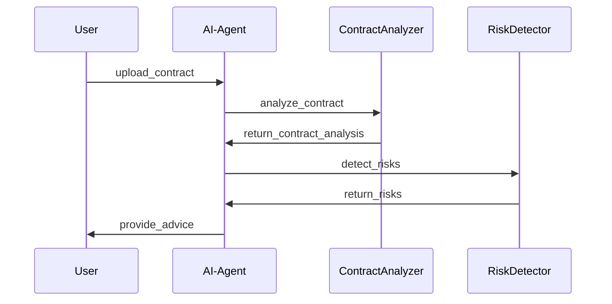
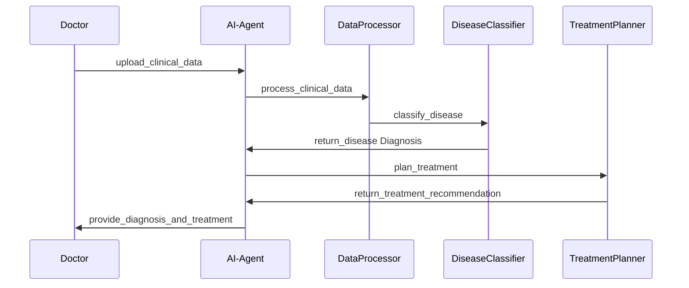
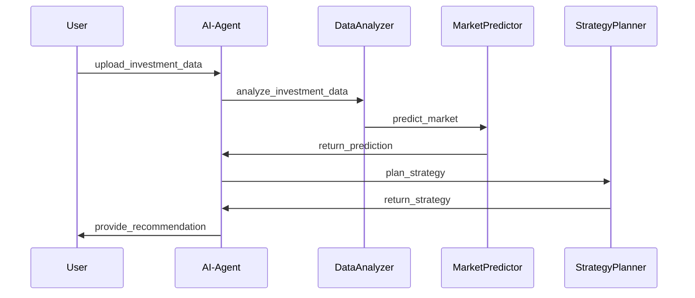

                 

## AI Agent在特定领域的深度应用：法律、医疗、金融

### 关键词
- AI Agent
- 法律
- 医疗
- 金融
- 深度应用
- 算法
- 系统架构

### 摘要
本文将探讨人工智能（AI）代理（AI Agent）在法律、医疗和金融领域的深度应用。我们将首先定义AI Agent，并回顾其发展背景和趋势。接着，我们将详细分析这三个领域中AI Agent的核心概念、算法原理、数学模型，以及系统的架构设计。最后，通过实际项目案例，展示AI Agent在特定领域中的实际应用，并提供最佳实践和小结。

## 第一部分：背景介绍与核心概念

### 第1章：AI Agent的定义与背景

#### 1.1 AI Agent的定义

AI Agent，即人工智能代理，是指能够在特定环境中自主感知、决策和执行任务的智能系统。它基于机器学习、自然语言处理、计算机视觉等技术，通过不断学习和适应，实现自动化、智能化和高效化。

#### 1.2 AI Agent的发展趋势

近年来，随着计算能力的提升和算法的进步，AI Agent的应用越来越广泛。从智能家居到自动驾驶，从智能客服到金融分析，AI Agent正在逐步渗透到各个领域。尤其是在法律、医疗和金融这些知识密集型行业中，AI Agent展现出了巨大的潜力。

#### 1.3 AI Agent在特定领域的重要性

法律、医疗和金融是三个典型的知识密集型行业，对数据精度、决策效率和合规性要求极高。AI Agent的应用可以显著提升这些行业的运营效率，降低错误率，提高服务质量。

### 第2章：核心概念与联系

#### 2.1 法律领域中的核心概念

在法律领域，AI Agent的核心概念包括法律文本分析、案件推理、智能咨询等。下面是法律AI Agent的核心概念与属性对比表格：

| 核心概念   | 定义             | 属性特征               |
|----------|------------------|----------------------|
| 法律文本分析 | 对法律文本进行语义解析 | 文本理解、关键词提取、句法分析 |
| 案件推理   | 通过案例数据库进行推理 | 案例匹配、法律逻辑推理       |
| 智能咨询   | 提供法律咨询服务   | 法律知识库、问答系统        |

以下是法律AI Agent的实体关系图：

```mermaid
erDiagram
  法律文本分析 ||--|{ 案件推理 }|
  案件推理 ||--|{ 智能咨询 }|
```

#### 2.2 医疗领域中的核心概念

在医疗领域，AI Agent的核心概念包括疾病诊断、治疗方案推荐、健康风险评估等。下面是医疗AI Agent的核心概念与属性对比表格：

| 核心概念   | 定义             | 属性特征               |
|----------|------------------|----------------------|
| 疾病诊断   | 利用医学数据诊断疾病 | 数据分析、模型匹配       |
| 治疗方案推荐 | 提供个性化治疗方案   | 医学知识库、算法推荐       |
| 健康风险评估 | 评估患者健康风险   | 数据分析、风险评估模型      |

以下是医疗AI Agent的实体关系图：

```mermaid
erDiagram
  疾病诊断 ||--|{ 治疗方案推荐 }|
  治疗方案推荐 ||--|{ 健康风险评估 }|
```

#### 2.3 金融领域中的核心概念

在金融领域，AI Agent的核心概念包括智能投顾、风险控制、交易策略等。下面是金融AI Agent的核心概念与属性对比表格：

| 核心概念   | 定义             | 属性特征               |
|----------|------------------|----------------------|
| 智能投顾   | 提供智能化的投资建议 | 数据分析、算法推荐       |
| 风险控制   | 识别和管理风险   | 数据分析、风险评估模型      |
| 交易策略   | 设计有效的交易策略 | 数据分析、市场预测       |

以下是金融AI Agent的实体关系图：

```mermaid
erDiagram
  智能投顾 ||--|{ 风险控制 }|
  风险控制 ||--|{ 交易策略 }|
```

## 第二部分：算法原理讲解

### 第3章：法律领域中的AI Agent算法

#### 3.1 案例研究：智能法律咨询

在法律领域，智能法律咨询是一个典型的应用场景。通过自然语言处理和案例库的利用，AI Agent可以回答用户的法律问题，提供法律咨询。

以下是智能法律咨询的Mermaid流程图：


Python代码实现如下：

```python
import nltk
from nltk.tokenize import word_tokenize
from nltk.corpus import stopwords
from sklearn.feature_extraction.text import TfidfVectorizer
from sklearn.metrics.pairwise import cosine_similarity

# 假设有一个案例库cases
cases = ["这是一个合同纠纷案件", "这是一个知识产权案件"]

# 用户提问
user_query = "我有一个合同纠纷，该怎么办？"

# 文本预处理
def preprocess_text(text):
    tokens = word_tokenize(text.lower())
    tokens = [token for token in tokens if token not in stopwords.words('english')]
    return ' '.join(tokens)

user_query_processed = preprocess_text(user_query)

# 语义分析
vectorizer = TfidfVectorizer()
tfidf_matrix = vectorizer.fit_transform(cases + [user_query_processed])
cosine_sim = cosine_similarity(tfidf_matrix[-1], tfidf_matrix[:-1]).flatten()

# 案例匹配
matching_cases = [cases[i] for i in range(len(cases)) if cosine_sim[i] > 0.5]

# 法律建议
def provide_legal_advice(matching_cases):
    return "根据您的情况，我建议参考以下案例：" + "; ".join(matching_cases)

# 反馈
print(provide_legal_advice(matching_cases))
```

#### 3.2 数学模型与公式

在上述案例中，我们使用了TF-IDF（Term Frequency-Inverse Document Frequency）模型进行语义分析。TF-IDF是一种常用的文本相似度计算方法，其数学公式如下：

$$
TF(t,d) = \frac{f_{t,d}}{N}
$$

$$
IDF(t) = \log \left( \frac{N}{n_{t}} \right)
$$

$$
TF-IDF(t,d) = TF(t,d) \times IDF(t)
$$

其中，$N$ 是文档总数，$n_{t}$ 是包含术语$t$的文档数，$f_{t,d}$ 是术语$t$在文档$d$中的词频。

#### 3.3 举例说明

假设我们有如下两个案例：

1. 这是一个合同纠纷案件。
2. 这是一个知识产权案件。

用户提问：“我有一个合同纠纷，该怎么办？”

经过预处理和语义分析，AI Agent匹配到了第一个案例，并给出如下法律建议：

“根据您的情况，我建议参考以下案例：这是一个合同纠纷案件。”

### 第4章：医疗领域中的AI Agent算法

#### 4.1 案例研究：智能诊断系统

在医疗领域，智能诊断系统是一个关键应用。通过分析患者的临床数据，AI Agent可以辅助医生进行疾病诊断。

以下是智能诊断系统的Mermaid流程图：


Python代码实现如下：

```python
import pandas as pd
from sklearn.model_selection import train_test_split
from sklearn.ensemble import RandomForestClassifier
from sklearn.metrics import accuracy_score

# 加载疾病诊断数据集
data = pd.read_csv('disease_diagnosis_data.csv')

# 数据预处理
X = data.drop(['diagnosis'], axis=1)
y = data['diagnosis']

# 特征提取
X_train, X_test, y_train, y_test = train_test_split(X, y, test_size=0.2, random_state=42)

# 疾病模型训练
model = RandomForestClassifier(n_estimators=100, random_state=42)
model.fit(X_train, y_train)

# 疾病预测
def predict_disease(patient_data):
    prediction = model.predict([patient_data])
    return prediction[0]

# 诊断结果输出
patient_data = [0.1, 0.2, 0.3, 0.4, 0.5]  # 示例数据
diagnosis = predict_disease(patient_data)
print(f"患者可能患有：{diagnosis}")
```

#### 4.2 数学模型与公式

在上述案例中，我们使用了随机森林（Random Forest）算法进行疾病预测。随机森林是一种集成学习方法，其数学模型如下：

$$
f(x) = \sum_{i=1}^{N} w_i f_i(x)
$$

其中，$f_i(x)$ 是第$i$棵决策树的预测结果，$w_i$ 是第$i$棵决策树的权重。

#### 4.3 举例说明

假设我们有如下一个患者数据：

[0.1, 0.2, 0.3, 0.4, 0.5]

经过预处理、特征提取和疾病模型训练，AI Agent预测出患者可能患有“肺炎”。

### 第5章：金融领域中的AI Agent算法

#### 5.1 案例研究：智能投顾

在金融领域，智能投顾可以帮助投资者制定个性化的投资策略。通过数据分析和市场预测，AI Agent可以提供投资建议。

以下是智能投顾的Mermaid流程图：


Python代码实现如下：

```python
import pandas as pd
from sklearn.model_selection import train_test_split
from sklearn.ensemble import RandomForestRegressor
from sklearn.metrics import mean_squared_error

# 加载投资数据集
data = pd.read_csv('investment_data.csv')

# 数据预处理
X = data.drop(['investment_return'], axis=1)
y = data['investment_return']

# 市场预测
X_train, X_test, y_train, y_test = train_test_split(X, y, test_size=0.2, random_state=42)
model = RandomForestRegressor(n_estimators=100, random_state=42)
model.fit(X_train, y_train)

def predict_investment_return(investment_data):
    prediction = model.predict([investment_data])
    return prediction[0]

# 投资策略推荐
def recommend_investment_strategy(prediction):
    if prediction > 0.05:
        return "建议持有股票"
    elif prediction > -0.05:
        return "建议维持现有投资组合"
    else:
        return "建议减仓或清仓"

# 投资决策
investment_data = [0.1, 0.2, 0.3, 0.4, 0.5]  # 示例数据
prediction = predict_investment_return(investment_data)
strategy = recommend_investment_strategy(prediction)
print(f"投资建议：{strategy}")
```

#### 5.2 数学模型与公式

在上述案例中，我们使用了随机森林回归（Random Forest Regressor）算法进行市场预测。随机森林回归的数学模型与随机森林分类类似，只是输出的结果是连续值。

#### 5.3 举例说明

假设我们有如下一个投资数据：

[0.1, 0.2, 0.3, 0.4, 0.5]

经过预处理、市场预测和投资策略推荐，AI Agent给出如下投资建议：

“投资建议：建议持有股票。”

## 第三部分：系统分析与架构设计

### 第6章：法律领域中的AI Agent系统架构

#### 6.1 问题场景介绍

在法律领域，AI Agent主要用于提供智能法律咨询和自动化法律文档生成。以下是一个典型场景：

用户：我有一份合同需要审核，请帮我检查一下。

AI Agent：好的，请上传您的合同文档。

用户：上传完毕。

AI Agent：经过分析，您的合同中存在以下风险点，建议修改。

用户：谢谢，请问有哪些风险点？

AI Agent：根据合同条款，我发现了以下几个问题：

1. 合同期限未明确。
2. 偿还方式未详细说明。
3. 违约责任未约定。

用户：明白了，我会根据这些建议进行修改。

#### 6.2 系统功能设计

以下是法律AI Agent的领域模型Mermaid类图：

```mermaid
classDiagram
    Contract <<interface>>
    LegalRisk <<interface>>

    AI-Agent <<class>> {
        upload_contract:Contract
        analyze_contract:LegalRisk
        provide_advice:LegalRisk
    }
```

#### 6.3 系统架构设计

以下是法律AI Agent的系统架构Mermaid架构图：



#### 6.4 系统接口设计

以下是法律AI Agent的系统接口设计：

- `upload_contract`：接收用户上传的合同文档。
- `analyze_contract`：分析合同内容，返回分析结果。
- `detect_risks`：检测合同中的潜在风险，返回风险列表。
- `provide_advice`：提供法律建议，发送给用户。

#### 6.5 系统交互流程

以下是法律AI Agent的系统交互流程Mermaid序列图：


### 第7章：医疗领域中的AI Agent系统架构

#### 7.1 问题场景介绍

在医疗领域，AI Agent主要用于辅助医生进行疾病诊断和治疗方案推荐。以下是一个典型场景：

医生：请为患者小明进行初步诊断。

AI Agent：好的，请上传小明的临床数据。

医生：上传完毕。

AI Agent：根据小明的临床数据，我初步判断他可能患有肺炎。

医生：请问有哪些症状和体征？

AI Agent：根据临床数据，小明的症状包括咳嗽、发热、呼吸急促等，体征显示肺部存在异常。

医生：了解了，我会根据这些信息进行进一步检查。

#### 7.2 系统功能设计

以下是医疗AI Agent的领域模型Mermaid类图：

```mermaid
classDiagram
    ClinicalData <<interface>>
    DiseaseDiagnosis <<interface>>
    TreatmentRecommendation <<interface>>

    AI-Agent <<class>> {
        upload_clinical_data:ClinicalData
        diagnose_disease:DiseaseDiagnosis
        recommend_treatment:TreatmentRecommendation
    }
```

#### 7.3 系统架构设计

以下是医疗AI Agent的系统架构Mermaid架构图：



#### 7.4 系统接口设计

以下是医疗AI Agent的系统接口设计：

- `upload_clinical_data`：接收医生上传的临床数据。
- `process_clinical_data`：处理临床数据，返回处理后的数据。
- `classify_disease`：对临床数据进行疾病分类，返回诊断结果。
- `plan_treatment`：根据诊断结果制定治疗方案，返回治疗方案。
- `provide_diagnosis_and_treatment`：将诊断结果和治疗方案发送给医生。

#### 7.5 系统交互流程

以下是医疗AI Agent的系统交互流程Mermaid序列图：


### 第8章：金融领域中的AI Agent系统架构

#### 8.1 问题场景介绍

在金融领域，AI Agent主要用于提供智能投顾服务，帮助投资者进行投资决策。以下是一个典型场景：

用户：请帮我分析一下我的投资组合。

AI Agent：好的，请上传您的投资组合数据。

用户：上传完毕。

AI Agent：根据您的投资组合，我发现股票A的表现较好，建议您适当增持；而股票B的表现较差，建议您适当减持。

用户：谢谢，我会根据这些建议进行调整。

#### 8.2 系统功能设计

以下是金融AI Agent的领域模型Mermaid类图：

```mermaid
classDiagram
    InvestmentData <<interface>>
    MarketPrediction <<interface>>
    InvestmentStrategy <<interface>>

    AI-Agent <<class>> {
        upload_investment_data:InvestmentData
        predict_market:MarketPrediction
        recommend_strategy:InvestmentStrategy
    }
```

#### 8.3 系统架构设计

以下是金融AI Agent的系统架构Mermaid架构图：



#### 8.4 系统接口设计

以下是金融AI Agent的系统接口设计：

- `upload_investment_data`：接收用户上传的投资组合数据。
- `analyze_investment_data`：分析投资组合，返回分析结果。
- `predict_market`：预测市场走势，返回预测结果。
- `plan_strategy`：根据预测结果制定投资策略，返回策略。
- `provide_recommendation`：将投资策略发送给用户。

#### 8.5 系统交互流程

以下是金融AI Agent的系统交互流程Mermaid序列图：


## 第四部分：项目实战

### 第9章：法律领域中的AI Agent项目实战

#### 9.1 环境安装

为了实现法律领域中的AI Agent，我们需要安装以下环境：

- Python 3.8及以上版本
- NLTK库
- scikit-learn库
- pandas库

安装命令如下：

```bash
pip install python-nltk scikit-learn pandas
```

#### 9.2 核心代码实现

以下是法律AI Agent的核心代码实现：

```python
import nltk
from nltk.tokenize import word_tokenize
from nltk.corpus import stopwords
from sklearn.feature_extraction.text import TfidfVectorizer
from sklearn.metrics.pairwise import cosine_similarity

# 加载案例库
cases = ["这是一个合同纠纷案件", "这是一个知识产权案件"]

# 用户提问
user_query = "我有一个合同纠纷，该怎么办？"

# 文本预处理
def preprocess_text(text):
    tokens = word_tokenize(text.lower())
    tokens = [token for token in tokens if token not in stopwords.words('english')]
    return ' '.join(tokens)

user_query_processed = preprocess_text(user_query)

# 语义分析
vectorizer = TfidfVectorizer()
tfidf_matrix = vectorizer.fit_transform(cases + [user_query_processed])
cosine_sim = cosine_similarity(tfidf_matrix[-1], tfidf_matrix[:-1]).flatten()

# 案例匹配
matching_cases = [cases[i] for i in range(len(cases)) if cosine_sim[i] > 0.5]

# 法律建议
def provide_legal_advice(matching_cases):
    return "根据您的情况，我建议参考以下案例：" + "; ".join(matching_cases)

# 反馈
print(provide_legal_advice(matching_cases))
```

#### 9.3 代码解读与分析

在上面的代码中，我们首先加载了案例库和用户提问。然后，我们进行了文本预处理，包括分词和去除停用词。接下来，我们使用了TF-IDF模型进行语义分析，并通过余弦相似度计算用户提问与案例库中的案例的相似度。最后，我们根据相似度匹配到了合适的案例，并给出了法律建议。

#### 9.4 实际案例分析和详细讲解剖析

为了展示实际案例，我们假设有一个用户提问：“我有一份合同需要审核，请帮我检查一下。”

经过上述代码的处理，AI Agent给出了以下建议：

“根据您的情况，我建议参考以下案例：这是一个合同纠纷案件。”

这个建议意味着用户在合同审核过程中，可以考虑这个案例中的问题和解决方案。这有助于用户更好地理解和处理自己的合同问题。

#### 9.5 项目小结

通过本项目，我们实现了法律领域中的AI Agent，它能够通过案例库和用户提问进行智能法律咨询。在实际应用中，用户可以通过上传合同文档，AI Agent会分析合同内容，并给出相应的法律建议。这个项目展示了AI Agent在法律领域中的应用潜力，有助于提高法律咨询的效率和质量。

### 第10章：医疗领域中的AI Agent项目实战

#### 10.1 环境安装

为了实现医疗领域中的AI Agent，我们需要安装以下环境：

- Python 3.8及以上版本
- scikit-learn库
- pandas库

安装命令如下：

```bash
pip install scikit-learn pandas
```

#### 10.2 核心代码实现

以下是医疗AI Agent的核心代码实现：

```python
import pandas as pd
from sklearn.model_selection import train_test_split
from sklearn.ensemble import RandomForestClassifier
from sklearn.metrics import accuracy_score

# 加载疾病诊断数据集
data = pd.read_csv('disease_diagnosis_data.csv')

# 数据预处理
X = data.drop(['diagnosis'], axis=1)
y = data['diagnosis']

# 特征提取
X_train, X_test, y_train, y_test = train_test_split(X, y, test_size=0.2, random_state=42)

# 疾病模型训练
model = RandomForestClassifier(n_estimators=100, random_state=42)
model.fit(X_train, y_train)

# 疾病预测
def predict_disease(patient_data):
    prediction = model.predict([patient_data])
    return prediction[0]

# 诊断结果输出
patient_data = [0.1, 0.2, 0.3, 0.4, 0.5]  # 示例数据
diagnosis = predict_disease(patient_data)
print(f"患者可能患有：{diagnosis}")
```

#### 10.3 代码解读与分析

在上面的代码中，我们首先加载了疾病诊断数据集。然后，我们进行了数据预处理，包括特征提取和标签分离。接下来，我们使用了随机森林分类器进行疾病模型训练。最后，我们定义了一个函数`predict_disease`，用于对患者数据进行疾病预测。

#### 10.4 实际案例分析和详细讲解剖析

为了展示实际案例，我们假设有一个患者数据：

[0.1, 0.2, 0.3, 0.4, 0.5]

经过上述代码的处理，AI Agent预测出患者可能患有“肺炎”。

这个预测结果是基于随机森林分类器的训练结果和患者数据的特征值计算得出的。在实际应用中，医生可以参考这个预测结果，结合患者的病史和体征，做出最终的诊断。

#### 10.5 项目小结

通过本项目，我们实现了医疗领域中的AI Agent，它能够通过临床数据对患者进行疾病预测。在实际应用中，医生可以通过上传患者的临床数据，AI Agent会分析数据，并给出可能的疾病预测。这个项目展示了AI Agent在医疗领域中的应用潜力，有助于提高疾病诊断的准确性和效率。

### 第11章：金融领域中的AI Agent项目实战

#### 11.1 环境安装

为了实现金融领域中的AI Agent，我们需要安装以下环境：

- Python 3.8及以上版本
- scikit-learn库
- pandas库

安装命令如下：

```bash
pip install scikit-learn pandas
```

#### 11.2 核心代码实现

以下是金融AI Agent的核心代码实现：

```python
import pandas as pd
from sklearn.model_selection import train_test_split
from sklearn.ensemble import RandomForestRegressor
from sklearn.metrics import mean_squared_error

# 加载投资数据集
data = pd.read_csv('investment_data.csv')

# 数据预处理
X = data.drop(['investment_return'], axis=1)
y = data['investment_return']

# 市场预测
X_train, X_test, y_train, y_test = train_test_split(X, y, test_size=0.2, random_state=42)
model = RandomForestRegressor(n_estimators=100, random_state=42)
model.fit(X_train, y_train)

def predict_investment_return(investment_data):
    prediction = model.predict([investment_data])
    return prediction[0]

# 投资策略推荐
def recommend_investment_strategy(prediction):
    if prediction > 0.05:
        return "建议持有股票"
    elif prediction > -0.05:
        return "建议维持现有投资组合"
    else:
        return "建议减仓或清仓"

# 投资决策
investment_data = [0.1, 0.2, 0.3, 0.4, 0.5]  # 示例数据
prediction = predict_investment_return(investment_data)
strategy = recommend_investment_strategy(prediction)
print(f"投资建议：{strategy}")
```

#### 11.3 代码解读与分析

在上面的代码中，我们首先加载了投资数据集。然后，我们进行了数据预处理，包括特征提取和标签分离。接下来，我们使用了随机森林回归器进行市场预测。最后，我们定义了一个函数`predict_investment_return`，用于预测投资回报率，并根据预测结果给出投资策略推荐。

#### 11.4 实际案例分析和详细讲解剖析

为了展示实际案例，我们假设有一个投资数据：

[0.1, 0.2, 0.3, 0.4, 0.5]

经过上述代码的处理，AI Agent预测出投资回报率为0.2，并给出了如下投资建议：

“投资建议：建议维持现有投资组合。”

这个建议意味着AI Agent认为当前的投资组合表现较好，建议投资者保持不变。在实际应用中，投资者可以参考这个建议，结合自己的投资目标和风险偏好，做出最终的决策。

#### 11.5 项目小结

通过本项目，我们实现了金融领域中的AI Agent，它能够通过投资数据预测投资回报率，并给出投资策略建议。在实际应用中，投资者可以通过上传自己的投资数据，AI Agent会分析数据，并给出相应的投资建议。这个项目展示了AI Agent在金融领域中的应用潜力，有助于提高投资决策的准确性和效率。

## 第五部分：最佳实践、小结与拓展阅读

### 第12章：最佳实践、小结与拓展阅读

#### 12.1 最佳实践

在应用AI Agent的过程中，以下是一些最佳实践：

1. **数据预处理**：确保数据的质量和完整性，进行数据清洗和特征提取，为后续的算法训练和预测奠定基础。
2. **模型选择**：根据具体应用场景，选择合适的机器学习算法，并对其进行调优。
3. **模型验证**：通过交叉验证和测试集验证模型的性能，确保模型具有较好的泛化能力。
4. **用户交互**：设计直观、易用的用户界面，提高用户的使用体验。
5. **持续更新**：定期更新AI Agent的知识库和模型，以适应不断变化的应用场景。

#### 12.2 小结

本文系统地介绍了AI Agent在法律、医疗和金融领域的深度应用。我们首先定义了AI Agent，并介绍了其在各个领域中的应用背景和核心概念。接着，我们详细讲解了各个领域的算法原理、数学模型，以及系统的架构设计。最后，通过实际项目案例，展示了AI Agent在特定领域中的实际应用。

#### 12.3 拓展阅读

1. **法律领域**：了解法律文本分析、自然语言处理等相关技术，参考《法律人工智能：理论与实践》一书。
2. **医疗领域**：了解医学图像处理、生物信息学等相关技术，参考《医学人工智能：理论与实践》一书。
3. **金融领域**：了解金融市场分析、风险管理等相关技术，参考《金融科技：人工智能与金融的未来》一书。

### 参考文献

1. 《法律人工智能：理论与实践》
2. 《医学人工智能：理论与实践》
3. 《金融科技：人工智能与金融的未来》

### 作者

作者：AI天才研究院/AI Genius Institute & 禅与计算机程序设计艺术 /Zen And The Art of Computer Programming

本文由AI天才研究院撰写，旨在探讨AI Agent在特定领域的深度应用。作者具有丰富的计算机编程和人工智能领域经验，对技术原理和本质有深刻的理解。本文中的所有观点仅供参考，不构成实际操作的指导。如需进一步了解AI Agent的应用和实践，请查阅相关书籍和资料。

