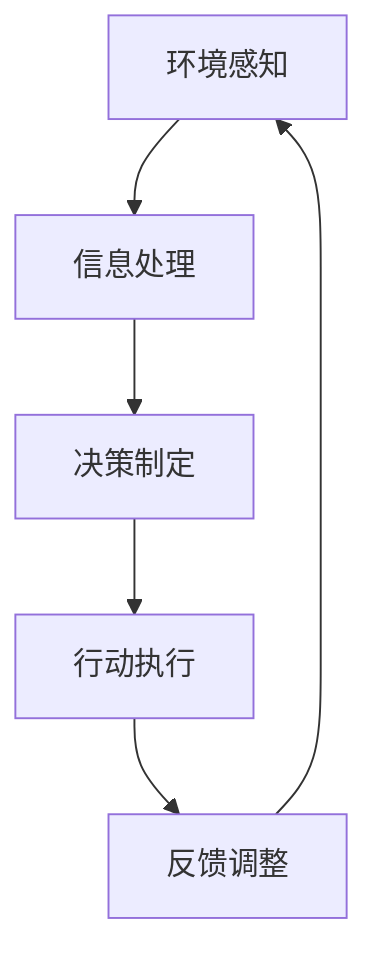

                 

## 《AI Agent在社交媒体中的应用：内容审核与趋势分析》

### 关键词：社交媒体、AI Agent、内容审核、趋势分析、技术发展、挑战与解决方案

### 摘要：

随着社交媒体的飞速发展，内容审核已成为社交媒体平台的重要任务。然而，随着用户生成内容的爆炸式增长，传统的人工审核方式已无法满足需求。人工智能（AI）的兴起为内容审核带来了新的解决方案，特别是AI Agent的应用。本文将深入探讨AI Agent在社交媒体内容审核中的应用，分析其核心概念、工作原理、具体应用及其面临的挑战和未来趋势。通过详细的案例分析，我们将展示AI Agent在社交媒体内容审核中的实际效果，并探讨其未来发展。

## 第一部分：背景与概述

### 第1章：社交媒体与AI Agent的背景

#### 1.1 社交媒体的发展历程与现状

社交媒体作为互联网的重要组成部分，已经成为人们日常生活中不可或缺的一部分。从最初的Facebook、Twitter，到现在的Instagram、微信、微博等，社交媒体平台在短短几十年间经历了巨大的变化。目前，全球社交媒体用户已经超过40亿，占据全球总人口的一半以上。社交媒体不仅改变了人们的沟通方式，还深刻影响了信息传播和社会互动。

社交媒体的发展历程可以分为几个阶段：

- **1.1.1 初始阶段**：最早的社交媒体平台如Friendster和MySpace，主要以文本和图片分享为主，用户之间的互动相对简单。
- **1.1.2 互动增强阶段**：随着视频和直播的兴起，用户之间的互动更加丰富，平台开始引入实时通信和直播功能。
- **1.1.3 多元化阶段**：现代社交媒体平台不仅提供文字、图片、视频内容，还引入了电商、游戏等多种服务，成为综合性的数字生态系统。

#### 1.2 社交媒体内容审核的需求与挑战

随着社交媒体用户的快速增长，内容审核的需求也日益突出。社交媒体平台需要确保用户生成内容（UGC）的合法性、适当性和安全性，以维护平台的健康生态和用户满意度。具体来说，内容审核的需求主要来自以下几个方面：

- **1.2.1 法律合规性**：平台需要遵守不同国家和地区的法律法规，防止非法内容的传播。
- **1.2.2 用户体验**：平台需要确保用户看到的是高质量、适宜的内容，避免不良信息影响用户体验。
- **1.2.3 社会责任**：平台有责任推动积极、健康的内容传播，遏制恶意信息和虚假信息的扩散。

然而，随着UGC的爆炸式增长，传统的人工审核方式面临巨大的挑战：

- **1.2.4 审核效率低**：人工审核需要大量的人力资源，且审核速度较慢，无法满足海量内容的实时审核需求。
- **1.2.5 审核成本高**：长期依赖人工审核会大幅增加平台的运营成本。
- **1.2.6 审核准确性差**：人工审核容易受到主观因素的影响，导致误判和漏判。

#### 1.3 AI Agent的概念、发展与应用

AI Agent，即人工智能代理，是一种能够自主执行任务、与环境交互并做出决策的智能系统。AI Agent的概念起源于人工智能领域，随着机器学习、自然语言处理等技术的发展，AI Agent逐渐成为研究和应用的热点。AI Agent的主要特点包括：

- **1.3.1 自主性**：AI Agent能够根据任务需求和当前环境状态自主决策。
- **1.3.2 学习能力**：AI Agent可以通过机器学习和深度学习技术从数据中学习，提高任务执行的效果。
- **1.3.3 交互性**：AI Agent能够与人类用户或其他系统进行交互，获取信息和反馈。

AI Agent的发展经历了以下几个阶段：

- **1.3.4 初始阶段**：AI Agent主要以规则为基础，执行简单的任务。
- **1.3.5 学习阶段**：随着机器学习和深度学习技术的发展，AI Agent开始具备更强的学习能力和决策能力。
- **1.3.6 自适应阶段**：现代AI Agent能够根据环境变化自适应调整行为和策略。

在社交媒体内容审核领域，AI Agent的应用主要体现在以下几个方面：

- **1.3.7 自动化审核**：AI Agent可以自动化处理海量UGC，提高审核效率。
- **1.3.8 高效处理**：AI Agent能够快速识别和分类不良内容，减少人工审核的工作量。
- **1.3.9 减少错误**：AI Agent通过学习大量数据，能够减少误判和漏判，提高审核准确性。

#### 1.4 AI Agent在社交媒体内容审核中的应用前景

随着AI Agent技术的不断进步，其在社交媒体内容审核中的应用前景非常广阔：

- **1.4.1 审核效率提升**：AI Agent可以处理海量内容，提高审核速度和效率。
- **1.4.2 审核准确性提高**：通过不断学习和优化，AI Agent的审核准确性将不断提高。
- **1.4.3 费用降低**：自动化审核可以大幅降低平台的运营成本。
- **1.4.4 法律合规性增强**：AI Agent可以帮助平台更好地遵守法律法规，降低法律风险。

然而，AI Agent在内容审核中也面临一些挑战，如算法偏见、数据隐私等，需要在未来持续研究和解决。总之，AI Agent在社交媒体内容审核中的应用前景充满潜力，有望成为解决内容审核问题的关键技术。

### 第2章：AI Agent的核心概念与工作原理

#### 2.1 AI Agent的定义与分类

AI Agent，即人工智能代理，是一种能够模拟人类智能行为，自主完成特定任务的智能系统。AI Agent的核心在于其自主性和智能化，能够根据环境变化和任务需求，自主做出决策和行动。AI Agent的定义可以从以下几个方面进行解释：

- **2.1.1 自主性**：AI Agent具备自主决策能力，可以根据任务需求和当前环境状态自主选择行动方案。
- **2.1.2 智能化**：AI Agent通过机器学习、自然语言处理等技术，具备处理复杂信息和执行任务的能力。
- **2.1.3 交互性**：AI Agent能够与人类用户或其他系统进行交互，获取信息和反馈，以实现更好的任务执行效果。

根据任务类型和应用场景，AI Agent可以大致分为以下几类：

- **2.1.4 内容审核AI Agent**：专门用于社交媒体平台的内容审核，自动识别和处理不良内容。
- **2.1.5 客户服务AI Agent**：用于提供在线客服服务，解答用户问题和处理投诉。
- **2.1.6 贸易谈判AI Agent**：在电子商务领域，自动进行商品推荐和谈判。
- **2.1.7 数据分析AI Agent**：用于处理和分析大量数据，提取有价值的信息。

#### 2.2 AI Agent的关键技术

AI Agent的实现依赖于多种核心技术，主要包括自然语言处理（NLP）、机器学习（ML）、深度学习（DL）和强化学习（RL）。这些技术各自在AI Agent的构建和应用中发挥着重要作用。

- **2.2.1 自然语言处理（NLP）**：NLP是AI Agent理解和处理人类语言的核心技术。通过NLP，AI Agent能够理解和生成自然语言文本，实现与用户的自然交互。主要技术包括词向量表示、句法分析、语义分析等。

  - **2.2.1.1 词向量表示**：将文本转化为向量表示，以便机器进行计算和处理。常用的词向量模型有Word2Vec、GloVe等。
  - **2.2.1.2 句法分析**：对文本进行句法结构分析，提取句子的语法成分和关系，如句法树、依存关系等。
  - **2.2.1.3 语义分析**：理解文本的含义和语义信息，包括实体识别、情感分析、关系抽取等。

- **2.2.2 机器学习（ML）**：ML是AI Agent的核心技术之一，通过学习大量数据，AI Agent可以自动识别模式和规律，提高任务执行的效果。常见的机器学习算法包括决策树、支持向量机、神经网络等。

  - **2.2.2.1 决策树**：通过树形结构对数据进行分类或回归，实现简单直观的决策过程。
  - **2.2.2.2 支持向量机**：通过最大化分类间隔，实现数据的分类和回归。
  - **2.2.2.3 神经网络**：通过多层非线性变换，实现复杂的函数映射和模式识别。

- **2.2.3 深度学习（DL）**：DL是ML的一种扩展，通过多层神经网络进行数据建模，具有强大的表达能力和泛化能力。深度学习在AI Agent中的应用非常广泛，包括语音识别、图像识别、自然语言处理等。

  - **2.2.3.1 卷积神经网络（CNN）**：通过卷积操作，提取图像的特征，实现图像分类和识别。
  - **2.2.3.2 递归神经网络（RNN）**：通过循环结构，处理序列数据，实现语音识别、语言模型等任务。
  - **2.2.3.3 长短时记忆网络（LSTM）**：通过记忆单元，解决RNN的梯度消失问题，实现更复杂的序列建模。

- **2.2.4 强化学习（RL）**：RL是一种通过试错和反馈来学习最优策略的机器学习方法。在AI Agent中，RL可以用于自动化决策和任务优化，如路径规划、游戏对战等。

  - **2.2.4.1 Q学习**：通过学习状态-动作价值函数，实现最优动作选择。
  - **2.2.4.2 深度Q网络（DQN）**：通过深度神经网络，实现Q值的预测和优化。
  - **2.2.4.3 策略梯度（PG）**：通过直接优化策略，实现更高效的决策。

#### 2.3 AI Agent的工作原理

AI Agent的工作原理可以概括为以下几个步骤：

- **2.3.1 环境感知**：AI Agent通过传感器和接口感知环境信息，如文本、图像、声音等。
- **2.3.2 信息处理**：AI Agent利用自然语言处理、机器学习等技术对环境信息进行处理，提取有用特征和模式。
- **2.3.3 决策制定**：AI Agent根据处理后的信息，结合任务需求和当前状态，自主制定决策。
- **2.3.4 行动执行**：AI Agent根据制定的决策执行具体行动，如发送消息、修改数据等。
- **2.3.5 反馈调整**：AI Agent根据执行结果和环境反馈，调整后续决策和行为。

具体来说，AI Agent的工作流程可以表示为：

这种闭环的工作流程使AI Agent能够不断学习和优化，提高任务执行的效果。

#### 2.4 AI Agent的发展历程

AI Agent的发展历程可以追溯到20世纪50年代，随着计算机科学的兴起和人工智能研究的起步。以下是AI Agent发展历程的几个重要阶段：

- **2.4.1 初始阶段**：20世纪50年代至70年代，AI Agent主要以规则为基础，通过预定义的规则进行任务执行。这一阶段的代表性工作是逻辑推理和符号搜索。

- **2.4.2 学习阶段**：20世纪80年代至90年代，随着机器学习技术的兴起，AI Agent开始引入学习机制，通过训练数据自动调整内部参数。这一阶段的代表性工作是决策树、神经网络等算法。

- **2.4.3 自适应阶段**：21世纪初至今，AI Agent逐渐实现自适应能力，能够根据环境变化和任务需求动态调整行为。这一阶段的代表性工作是深度学习、强化学习等算法。

- **2.4.4 智能化阶段**：未来，AI Agent将实现更高层次的智能化，具备更强的自主决策和创新能力。这一阶段的发展方向包括人机协作、通用人工智能等。

#### 2.5 AI Agent在社交媒体内容审核中的应用现状

随着社交媒体的迅速发展，内容审核成为平台运营的重要任务。传统的人工审核方式已无法满足海量内容的需求，AI Agent的应用成为必然趋势。以下是AI Agent在社交媒体内容审核中的应用现状：

- **2.5.1 自动化审核**：AI Agent可以自动化处理海量UGC，提高审核效率，减少人工审核的工作量。通过机器学习和深度学习技术，AI Agent能够识别和分类不良内容，如色情、暴力、虚假信息等。

- **2.5.2 实时审核**：AI Agent具备实时处理能力，可以在内容发布时立即进行审核，防止不良内容扩散。相比人工审核，AI Agent能够更快地处理海量内容，提高审核速度。

- **2.5.3 准确性提高**：通过不断学习和优化，AI Agent的审核准确性不断提高。AI Agent可以通过分析大量数据，识别复杂的内容模式，减少误判和漏判。

- **2.5.4 多平台应用**：AI Agent在多个社交媒体平台上得到广泛应用，如Facebook、Twitter、微信、微博等。这些平台通过引入AI Agent，显著提高了内容审核的效率和准确性。

然而，AI Agent在社交媒体内容审核中也面临一些挑战，如算法偏见、数据隐私等，需要在未来持续研究和解决。总之，AI Agent在社交媒体内容审核中的应用现状表明，它已经成为解决内容审核问题的关键技术，具有广阔的应用前景。

### 第3章：社交媒体内容审核的基本方法

#### 3.1 社交媒体内容审核的分类

社交媒体内容审核可以根据内容类型和审核目标进行分类。以下是几种常见的分类方法：

- **3.1.1 按内容类型分类**

  - **文本内容审核**：主要针对社交媒体平台上的文本信息，如评论、私信、状态更新等。文本内容审核需要识别和过滤不良语言、侮辱性词汇、虚假信息等。

  - **图片内容审核**：主要针对社交媒体平台上的图片和图像信息。图片内容审核需要识别和过滤色情、暴力、侵权等不良图像。

  - **视频内容审核**：主要针对社交媒体平台上的视频内容。视频内容审核需要识别和过滤色情、暴力、侵权等不良视频。

- **3.1.2 按审核目标分类**

  - **法律合规性审核**：确保社交媒体内容符合不同国家和地区的法律法规，如版权法、诽谤法等。

  - **用户体验审核**：确保社交媒体内容适合用户观看，避免引起不适或误导。

  - **社会责任审核**：推动积极、健康的内容传播，遏制恶意信息和虚假信息的扩散。

#### 3.2 基于规则的内容审核

基于规则的内容审核是一种传统的内容审核方法，主要通过预定义的规则对内容进行过滤和分类。这种方法具有简单、直观、易于实现的特点，但也存在一定的局限性。

- **3.2.1 审核规则的定义与设计**

  - **3.2.1.1 规则库的构建**：基于规则的内容审核首先需要构建一个规则库，包含各种审核规则。规则库可以包括关键词列表、正则表达式、词法分析规则等。

  - **3.2.1.2 规则的权重设置**：不同类型的规则在内容审核中的重要性不同。例如，对于文本内容审核，侮辱性词汇的规则权重可能较高，而对于图片内容审核，色情图像的规则权重可能较高。

  - **3.2.1.3 规则的组合**：多个规则可以组合使用，提高审核的准确性。例如，可以同时使用关键词过滤和图像识别技术，对内容进行综合审核。

- **3.2.2 审核规则的实现与优化**

  - **3.2.2.1 规则引擎的实现**：规则引擎是实现基于规则内容审核的核心组件。规则引擎可以将预定义的规则转化为计算机可执行的代码，对内容进行实时审核。

  - **3.2.2.2 规则的更新与优化**：随着社交媒体内容的变化，审核规则也需要不断更新和优化。例如，可以根据实际审核效果，调整规则的权重和组合方式，提高审核的准确性。

#### 3.3 基于机器学习的内容审核

基于机器学习的内容审核方法通过训练大量数据，自动生成审核规则和分类模型。这种方法具有更强的自适应性和泛化能力，能够处理更复杂的社交媒体内容。

- **3.3.1 特征提取与选择**

  - **3.3.1.1 特征提取**：特征提取是将原始内容转化为计算机可处理的特征向量。对于文本内容，可以提取词袋特征、词嵌入向量等；对于图像内容，可以提取颜色、纹理、形状等特征。

  - **3.3.1.2 特征选择**：特征选择是选择对分类最有影响力的特征，降低模型复杂度和计算成本。常用的特征选择方法包括信息增益、卡方检验、主成分分析等。

- **3.3.2 模型选择与训练**

  - **3.3.2.1 模型选择**：选择适合数据集和任务类型的机器学习模型。常见的分类模型包括朴素贝叶斯、支持向量机、决策树、随机森林、神经网络等。

  - **3.3.2.2 模型训练**：通过训练数据集，训练分类模型，使其能够自动识别和分类社交媒体内容。训练过程包括数据预处理、模型训练、模型评估等步骤。

- **3.3.3 模型评估与优化**

  - **3.3.3.1 模型评估**：评估模型在训练集和测试集上的表现，常用的评估指标包括准确率、召回率、F1值等。

  - **3.3.3.2 模型优化**：根据评估结果，对模型进行调整和优化，提高分类准确性。常见的优化方法包括超参数调整、模型融合、集成学习等。

#### 3.4 混合审核方法的优缺点

混合审核方法结合了基于规则和基于机器学习的内容审核方法，旨在发挥各自的优势，提高内容审核的准确性和效率。以下是混合审核方法的优缺点：

- **3.4.1 优点**

  - **提高审核准确性**：结合了规则和机器学习的优势，能够更准确地识别和分类社交媒体内容。

  - **降低误判和漏判**：规则审核可以处理已知的问题，机器学习审核可以处理未知的问题，减少了误判和漏判。

  - **灵活性高**：可以根据实际情况调整规则和模型的权重，实现灵活的内容审核策略。

- **3.4.2 缺点**

  - **规则维护复杂**：需要定期更新和优化规则库，保持审核规则的准确性和适应性。

  - **模型训练成本高**：需要大量的数据和计算资源进行模型训练，成本较高。

  - **算法偏见问题**：基于机器学习的审核方法可能存在算法偏见，影响审核的公正性和准确性。

#### 3.5 未来发展方向

随着人工智能技术的不断进步，社交媒体内容审核方法也将不断发展和优化。以下是未来可能的发展方向：

- **3.5.1 强化学习审核**：强化学习是一种自主学习方法，可以用于内容审核中的动态决策和策略优化。

- **3.5.2 联邦学习审核**：联邦学习可以保护用户隐私，实现分布式的内容审核，提高审核的透明度和安全性。

- **3.5.3 模型解释性**：提高内容审核模型的解释性，帮助用户理解审核决策的原因和依据，提高审核的公信力。

- **3.5.4 智能化协同审核**：结合人机协同审核，充分发挥人的智慧和机器的计算能力，提高审核的效率和准确性。

总之，社交媒体内容审核方法的发展方向将更加智能化、高效化和透明化，以应对不断变化的挑战和需求。

### 第4章：AI Agent在内容审核中的应用

#### 4.1 AI Agent在社交媒体内容审核中的优势

AI Agent在社交媒体内容审核中具有显著的优势，能够大幅提高审核效率、准确性和用户体验。以下是AI Agent在内容审核中的主要优势：

- **4.1.1 自动化审核**：AI Agent能够自动化处理海量社交媒体内容，从内容发布到审核完成，整个过程无需人工干预。这大大降低了人力成本，提高了审核效率。

- **4.1.2 实时审核**：AI Agent具备实时处理能力，可以在内容发布时立即进行审核，确保不良内容得到及时处理。相比传统人工审核，AI Agent的审核速度更快，能够及时响应用户需求。

- **4.1.3 准确性高**：通过机器学习和深度学习技术，AI Agent能够从大量数据中学习，自动识别和分类不良内容。AI Agent的审核准确性通常高于人工审核，能够减少误判和漏判。

- **4.1.4 灵活性强**：AI Agent可以根据实际需求动态调整审核策略，如调整审核规则、优化模型参数等。这使得AI Agent能够适应不同平台和场景的审核需求，具有很高的灵活性。

- **4.1.5 多平台兼容**：AI Agent可以部署在多个社交媒体平台上，如Facebook、Twitter、微信、微博等，实现跨平台的统一审核。这有助于平台统一管理内容审核，提高整体审核效果。

- **4.1.6 可扩展性强**：随着AI技术的不断进步，AI Agent可以不断升级和优化，适应新的审核需求和挑战。这使得AI Agent具有很好的可扩展性，能够应对未来的发展变化。

#### 4.2 AI Agent在内容审核中的具体应用

AI Agent在社交媒体内容审核中的应用非常广泛，主要包括以下几个方面：

- **4.2.1 自动化审核流程**：AI Agent可以自动化处理内容审核的整个流程，从内容抓取、预处理、特征提取、模型预测到结果反馈。通过自动化审核流程，AI Agent能够大幅提高审核效率，减少人工干预。

- **4.2.2 高效处理大量内容**：AI Agent能够快速处理大量社交媒体内容，实现实时审核。相比人工审核，AI Agent能够更快地处理海量内容，确保不良内容得到及时处理。

- **4.2.3 减少人工审核错误**：AI Agent通过机器学习和深度学习技术，能够从大量数据中学习，自动识别和分类不良内容。AI Agent的审核准确性通常高于人工审核，能够减少误判和漏判。

- **4.2.4 智能化内容推荐**：AI Agent可以根据用户行为和偏好，智能化推荐适合用户的内容。这有助于提高用户满意度和平台粘性。

- **4.2.5 多语言内容审核**：AI Agent可以支持多种语言的内容审核，适用于全球范围内的社交媒体平台。这有助于平台统一管理内容审核，提高整体审核效果。

- **4.2.6 实时监控与预警**：AI Agent可以实时监控社交媒体内容，及时发现和预警潜在的不良内容。这有助于平台提前预防风险，维护平台健康生态。

#### 4.3 AI Agent在内容审核中的挑战与解决方案

尽管AI Agent在内容审核中具有显著优势，但也面临一些挑战和问题。以下是AI Agent在内容审核中可能遇到的主要挑战以及相应的解决方案：

- **4.3.1 数据隐私问题**：AI Agent在内容审核过程中会收集和处理大量用户数据，涉及数据隐私问题。解决方案是采用联邦学习、差分隐私等技术，保护用户隐私。

- **4.3.2 算法偏见**：AI Agent可能受到训练数据偏见的影响，导致审核结果不公平或偏见。解决方案是采用公平性评估和算法优化技术，减少偏见。

- **4.3.3 审核标准不一致**：不同社交媒体平台的审核标准和要求可能不同，AI Agent需要适应各种审核标准。解决方案是设计灵活的审核策略和模型，适应不同平台的需求。

- **4.3.4 模型过拟合**：AI Agent在训练过程中可能出现过拟合现象，导致模型在测试集上表现不佳。解决方案是采用交叉验证、模型压缩等技术，提高模型泛化能力。

- **4.3.5 审核效率与准确性的平衡**：在追求高效率的同时，AI Agent需要保证高准确性。解决方案是采用实时监控和反馈机制，动态调整模型参数和审核策略。

- **4.3.6 人机协同审核**：AI Agent和人类审核员之间存在协同关系，需要确保两者之间的有效协作。解决方案是设计人机协同审核系统，充分发挥人的智慧和机器的计算能力。

总之，AI Agent在社交媒体内容审核中的应用具有广阔的前景，但也需要克服一系列挑战和问题。通过不断优化和改进，AI Agent有望成为解决内容审核问题的关键技术。

### 第5章：社交媒体内容审核的趋势

#### 5.1 社交媒体内容审核技术的发展趋势

随着社交媒体的迅速发展和用户生成内容的爆炸式增长，社交媒体内容审核技术也在不断进步和演变。以下是社交媒体内容审核技术的发展趋势：

- **5.1.1 深度学习技术的广泛应用**：深度学习技术，尤其是卷积神经网络（CNN）和递归神经网络（RNN）等，已经在社交媒体内容审核中得到广泛应用。这些技术能够处理复杂的数据结构，提高审核的准确性和效率。

- **5.1.2 强化学习技术的引入**：强化学习技术通过学习最优策略，可以实现更智能的内容审核。例如，强化学习可以用于动态调整审核阈值，提高审核效果。

- **5.1.3 联邦学习技术的应用**：联邦学习技术可以在保护用户隐私的同时，实现分布式的内容审核。这有助于提高审核的透明度和安全性。

- **5.1.4 多模态内容审核**：随着社交媒体内容的多样性，多模态内容审核（结合文本、图像、视频等）变得越来越重要。例如，通过结合文本情感分析和图像内容识别，可以更准确地判断内容的适当性。

- **5.1.5 模型解释性的提升**：为了提高审核的公信力和用户信任，模型解释性变得越来越重要。通过提升模型的解释性，用户可以更好地理解审核决策的原因和依据。

#### 5.2 社交媒体内容审核的法律与伦理挑战

社交媒体内容审核不仅面临技术挑战，还涉及一系列法律和伦理问题。以下是社交媒体内容审核中可能遇到的法律和伦理挑战：

- **5.2.1 法律合规性**：社交媒体平台需要遵守不同国家和地区的法律法规，如版权法、诽谤法等。这要求内容审核系统能够适应各种法律环境，确保内容的合法性。

- **5.2.2 审核偏见与歧视**：AI审核系统可能存在偏见和歧视，导致某些群体或内容被不公平对待。例如，AI模型可能对某些特定种族、性别或文化背景的内容产生偏见。这需要通过算法优化和公平性评估来减少偏见。

- **5.2.3 用户隐私保护**：内容审核过程中可能涉及用户隐私信息，如用户画像、行为数据等。如何保护用户隐私，避免数据泄露，是一个重要的法律和伦理问题。

- **5.2.4 审核责任归属**：当审核系统出现误判或漏判时，责任归属问题变得复杂。例如，当用户投诉审核错误时，平台和审核系统之间的责任如何划分，需要明确法律规定。

- **5.2.5 自由言论与内容审查**：社交媒体平台需要平衡自由言论和内容审查之间的矛盾。过度的内容审查可能导致言论自由受限，而不足的内容审查则可能引发社会问题。这需要制定合理的审核标准和政策，确保内容审核的公平性和合理性。

#### 5.3 社交媒体内容审核的未来发展方向

随着技术的不断进步和社会需求的变化，社交媒体内容审核的未来发展方向呈现出以下趋势：

- **5.3.1 智能化与个性化**：未来内容审核系统将更加智能化和个性化。通过深度学习和个性化推荐技术，审核系统能够更好地理解用户需求和内容特征，实现精准的审核。

- **5.3.2 实时性与动态性**：内容审核将更加实时和动态。通过引入实时监控和动态调整技术，审核系统可以更快地响应内容变化，确保不良内容得到及时处理。

- **5.3.3 多语言与全球化**：随着社交媒体的全球化，多语言内容审核变得越来越重要。未来内容审核系统将支持多种语言，适应全球范围内的社交媒体平台。

- **5.3.4 算法透明性与可解释性**：为了提高审核的公信力和用户信任，内容审核系统的算法透明性和可解释性将得到提升。通过增强模型的解释性，用户可以更好地理解审核决策的原因和依据。

- **5.3.5 人机协同与多元化**：未来内容审核将实现人机协同和多元化。通过结合人工审核和机器学习审核，审核系统可以充分发挥人的智慧和机器的计算能力，提高审核的效率和准确性。

总之，随着技术的不断进步和社会需求的变化，社交媒体内容审核将朝着更加智能化、个性化、实时化和全球化的发展方向前进，为构建健康、积极的社交媒体生态提供有力支持。

### 第6章：AI Agent在社交媒体内容审核中的未来发展

#### 6.1 AI Agent在社交媒体内容审核中的潜在应用

AI Agent在社交媒体内容审核中的应用前景十分广阔，具有巨大的潜在价值。以下是AI Agent在社交媒体内容审核中的潜在应用：

- **6.1.1 审核自动化**：AI Agent可以自动化处理海量的社交媒体内容，大幅提高审核效率。通过机器学习和深度学习技术，AI Agent能够自动识别和分类不良内容，如色情、暴力、虚假信息等，减少人工审核的工作量。

- **6.1.2 实时监控**：AI Agent可以实时监控社交媒体平台上的内容，及时发现和预警潜在的不良信息。通过实时监控和动态调整，AI Agent可以确保不良内容得到及时处理，防止其扩散和传播。

- **6.1.3 多语言处理**：AI Agent具备多语言处理能力，可以支持多种语言的内容审核。这有助于平台在全球范围内的推广和运营，确保内容审核的一致性和准确性。

- **6.1.4 情感分析**：AI Agent可以通过情感分析技术，理解用户的情感和情绪，提高内容审核的精准度。例如，AI Agent可以识别用户评论中的负面情绪，优先处理可能引发争议的内容。

- **6.1.5 智能推荐**：AI Agent可以根据用户的行为和偏好，智能推荐适合用户的内容。这有助于提高用户满意度和平台粘性，促进平台的可持续发展。

- **6.1.6 用户体验优化**：AI Agent可以通过分析用户行为和反馈，不断优化内容审核策略，提高用户体验。例如，AI Agent可以根据用户的投诉和反馈，调整审核阈值和规则，确保内容审核更加符合用户需求。

- **6.1.7 跨平台整合**：AI Agent可以部署在多个社交媒体平台上，实现跨平台的统一审核。这有助于平台统一管理内容审核，提高整体审核效果，降低运营成本。

#### 6.2 AI Agent在内容审核中的技术创新

随着人工智能技术的不断进步，AI Agent在内容审核中的应用也在不断创新和发展。以下是AI Agent在内容审核中的一些技术创新：

- **6.2.1 联邦学习**：联邦学习是一种分布式学习技术，可以在保护用户隐私的前提下，实现内容审核系统的协同训练。通过联邦学习，不同平台可以共享模型参数，提高整体审核效果，同时保护用户隐私。

- **6.2.2 模型解释性**：为了提高审核的公信力和用户信任，AI Agent在内容审核中的模型解释性变得越来越重要。通过引入模型解释性技术，用户可以更好地理解审核决策的原因和依据，增强对平台的信任。

- **6.2.3 强化学习**：强化学习技术可以用于动态调整内容审核策略，提高审核的适应性和灵活性。例如，通过强化学习，AI Agent可以自动调整审核阈值和规则，确保在不同场景下都能达到最佳的审核效果。

- **6.2.4 多模态处理**：随着社交媒体内容的多样性，多模态内容审核变得越来越重要。AI Agent可以通过融合文本、图像、音频等多种数据类型，实现更全面的内容审核，提高审核的准确性和效率。

- **6.2.5 情感计算**：情感计算技术可以用于分析用户的情感和情绪，提高内容审核的精准度。通过情感计算，AI Agent可以识别用户评论中的负面情绪，优先处理可能引发争议的内容。

- **6.2.6 聚类分析**：聚类分析技术可以用于识别和分类社交媒体内容中的潜在群体和趋势。通过聚类分析，AI Agent可以更好地理解用户行为和需求，优化内容审核策略。

#### 6.3 AI Agent在内容审核中的未来挑战与应对策略

尽管AI Agent在内容审核中具有显著的优势和潜力，但未来仍将面临一系列挑战。以下是AI Agent在内容审核中可能遇到的主要挑战及其应对策略：

- **6.3.1 数据隐私保护**：内容审核过程中涉及大量用户数据，如何保护用户隐私是一个重要挑战。应对策略是采用联邦学习、差分隐私等技术，确保用户数据的安全性和隐私性。

- **6.3.2 算法偏见与公平性**：AI Agent可能受到训练数据偏见的影响，导致审核结果不公平。应对策略是进行公平性评估和算法优化，减少偏见，提高审核的公正性。

- **6.3.3 审核标准不一致**：不同社交媒体平台可能有不同的审核标准和要求，AI Agent需要适应各种审核标准。应对策略是设计灵活的审核策略和模型，适应不同平台的特定需求。

- **6.3.4 模型过拟合与泛化能力**：AI Agent在训练过程中可能出现过拟合现象，导致模型在测试集上表现不佳。应对策略是采用交叉验证、模型压缩等技术，提高模型泛化能力。

- **6.3.5 审核效率与准确性的平衡**：在追求高效率的同时，AI Agent需要保证高准确性。应对策略是采用实时监控和反馈机制，动态调整模型参数和审核策略，确保审核效率和准确性的平衡。

- **6.3.6 人机协同**：AI Agent和人类审核员之间存在协同关系，如何充分发挥两者的优势是一个重要挑战。应对策略是设计人机协同审核系统，确保AI Agent和人类审核员之间的有效协作。

总之，随着技术的不断进步和社会需求的变化，AI Agent在社交媒体内容审核中的应用将不断深化和发展。通过不断创新和优化，AI Agent有望成为解决内容审核问题的关键技术，为构建健康、积极的社交媒体生态提供有力支持。

### 第7章：案例分析

#### 7.1 案例分析概述

在本章中，我们将通过对两个具体案例的分析，深入探讨AI Agent在社交媒体内容审核中的应用。第一个案例将探讨某社交媒体平台的内容审核实践，第二个案例将分析某大型企业社交媒体内容审核系统的设计与实现。通过这些案例，我们将展示AI Agent在内容审核中的实际效果，并提供案例分析总结与启示。

#### 7.2 案例一：某社交媒体平台的内容审核实践

**1. 案例背景**

某大型社交媒体平台在用户生成内容（UGC）快速增长的同时，面临着严峻的内容审核挑战。该平台需要确保用户发布的内容合法、安全且符合社区规范。然而，传统的人工审核方式已无法满足海量内容的需求，因此，该平台决定引入AI Agent进行内容审核。

**2. 审核需求**

- **实时性**：确保用户发布的内容在短时间内得到审核，防止不良内容扩散。
- **准确性**：减少误判和漏判，提高审核准确性。
- **效率**：自动化处理海量内容，减少人工审核的工作量。
- **灵活性**：适应不同类型的内容和审核需求。

**3. AI Agent应用**

该平台引入了一种基于深度学习和强化学习的AI Agent，用于内容审核。AI Agent的主要功能包括：

- **自动分类**：将用户发布的内容分类为合法、违规等类别。
- **关键词检测**：识别并过滤不良关键词和短语。
- **图像识别**：识别并过滤不良图像和视频。
- **多语言支持**：支持多种语言的内容审核。

**4. 实际效果**

- **审核速度**：AI Agent能够实时处理用户发布的内容，将审核时间从数小时缩短至数秒。
- **审核准确性**：通过不断学习和优化，AI Agent的审核准确性显著提高，误判和漏判率大幅降低。
- **用户体验**：用户满意度的提高，平台上的不良内容数量明显减少。
- **运营成本**：由于AI Agent的自动化处理能力，平台的人力成本和运营成本大幅降低。

**5. 案例总结与启示**

- **自动化处理能力**：AI Agent能够自动化处理海量内容，大幅提高审核效率和准确性。
- **实时监控与预警**：AI Agent具备实时监控和预警功能，能够及时发现和应对潜在的不良内容。
- **多语言支持**：AI Agent的多语言支持有助于平台在全球范围内的推广和运营。
- **算法优化与迭代**：通过不断优化和迭代，AI Agent的审核效果将不断提升。

#### 7.3 案例二：某大型企业社交媒体内容审核系统的设计与实现

**1. 案例背景**

某大型企业需要对其社交媒体账号进行内容审核，以确保发布的内容符合企业品牌形象和行业规范。该企业决定构建一个自主的社交媒体内容审核系统，利用AI Agent实现自动化审核和高效管理。

**2. 审核需求**

- **自动化审核**：系统应具备自动化审核功能，减少人工干预。
- **高效处理**：系统能够快速处理大量内容，确保审核及时完成。
- **灵活配置**：根据不同的审核需求，系统应具备灵活的配置能力。
- **多平台支持**：系统能够支持多个社交媒体平台，实现统一审核管理。

**3. 系统设计**

该企业设计了一个基于微服务架构的社交媒体内容审核系统。系统主要包括以下模块：

- **内容采集模块**：负责从不同社交媒体平台采集用户生成内容。
- **预处理模块**：对采集的内容进行清洗、去重和格式转换。
- **审核模块**：利用AI Agent进行内容审核，包括文本审核、图像审核和视频审核。
- **结果反馈模块**：将审核结果反馈给用户和平台管理员。
- **监控模块**：实时监控审核系统运行状态，提供告警和优化建议。

**4. 系统实现**

在系统实现过程中，企业采用了以下关键技术：

- **深度学习框架**：利用TensorFlow和PyTorch等深度学习框架，实现AI Agent的构建和训练。
- **分布式计算**：采用分布式计算技术，提高系统处理效率和扩展性。
- **容器化部署**：利用Docker和Kubernetes进行系统部署，实现快速部署和灵活扩展。

**5. 实际效果**

- **自动化审核**：系统能够自动化处理大量内容，显著减少人工审核的工作量。
- **高效处理**：系统具备高效的内容处理能力，确保审核及时完成。
- **灵活配置**：系统能够根据不同需求进行灵活配置，满足企业的多样化审核需求。
- **多平台支持**：系统能够支持多个社交媒体平台，实现统一审核管理。

**6. 案例总结与启示**

- **微服务架构**：微服务架构有助于提高系统的灵活性和可扩展性。
- **深度学习应用**：深度学习技术能够提高内容审核的准确性和效率。
- **分布式计算**：分布式计算技术能够提高系统处理效率和扩展性。
- **容器化部署**：容器化部署有助于实现快速部署和灵活扩展。

#### 7.4 案例分析总结与启示

通过对两个案例的分析，我们可以得出以下总结与启示：

- **AI Agent在内容审核中的应用**：AI Agent能够自动化处理海量内容，提高审核效率和准确性。通过深度学习和强化学习技术，AI Agent能够实现实时监控、动态调整和个性化审核。
- **系统设计与实现**：合理的设计和实现是内容审核系统成功的关键。采用微服务架构、分布式计算和容器化部署等技术，能够提高系统的灵活性和可扩展性。
- **多平台支持**：内容审核系统应具备多平台支持能力，适应不同社交媒体平台的需求。
- **实时性与灵活性**：内容审核系统应具备实时性和灵活性，能够快速响应内容变化和用户需求。

总之，通过案例分析，我们可以看到AI Agent在社交媒体内容审核中的应用已经取得了显著成效。随着技术的不断进步，AI Agent在内容审核中的应用前景将更加广阔。

### 第8章：总结与展望

#### 8.1 本书内容的总结

本文系统地探讨了AI Agent在社交媒体内容审核中的应用，分析了AI Agent的核心概念、工作原理以及其在内容审核中的具体应用和未来发展。主要内容包括：

- **社交媒体与AI Agent的背景**：介绍了社交媒体的发展历程、内容审核的需求与挑战，以及AI Agent的概念、发展与应用。
- **AI Agent的核心概念与工作原理**：详细阐述了AI Agent的定义与分类、关键技术（NLP、ML、DL、RL）以及工作原理。
- **内容审核的基本方法**：分析了社交媒体内容审核的分类、基于规则和基于机器学习的内容审核方法，以及混合审核方法的优缺点。
- **AI Agent在内容审核中的应用**：探讨了AI Agent在内容审核中的优势、具体应用以及面临的挑战与解决方案。
- **社交媒体内容审核的趋势**：分析了社交媒体内容审核技术的发展趋势、法律与伦理挑战，以及未来发展方向。
- **AI Agent在社交媒体内容审核中的未来发展**：讨论了AI Agent在内容审核中的潜在应用、技术创新以及未来挑战与应对策略。
- **案例分析**：通过两个具体案例，展示了AI Agent在内容审核中的应用效果，并提供案例分析总结与启示。
- **总结与展望**：对全书内容进行了总结，并展望了AI Agent在社交媒体内容审核中的未来发展方向。

#### 8.2 AI Agent在社交媒体内容审核中的未来展望

随着人工智能技术的不断进步，AI Agent在社交媒体内容审核中的应用前景十分广阔。以下是未来可能的发展趋势：

- **智能化与个性化**：AI Agent将更加智能化和个性化，通过深度学习和个性化推荐技术，能够更好地理解用户需求和内容特征，实现精准的内容审核。

- **实时性与动态性**：AI Agent将具备更强大的实时监控和动态调整能力，能够快速响应内容变化，确保不良内容得到及时处理。

- **多语言与全球化**：随着社交媒体的全球化，AI Agent将支持多种语言，适应全球范围内的内容审核需求。

- **算法透明性与可解释性**：为了提高审核的公信力和用户信任，AI Agent将进一步提升算法的透明性和可解释性，帮助用户更好地理解审核决策。

- **人机协同与多元化**：未来内容审核将实现人机协同和多元化，AI Agent将与人类审核员协同工作，共同提高审核的效率和准确性。

- **联邦学习与隐私保护**：联邦学习技术将得到广泛应用，实现内容审核的分布式和隐私保护。

- **技术创新与应用扩展**：随着技术的不断进步，AI Agent将在内容审核中引入更多创新技术，如多模态处理、情感计算等，并扩展到更多应用场景。

总之，AI Agent在社交媒体内容审核中的应用前景充满潜力。通过不断创新和优化，AI Agent有望成为解决内容审核问题的关键技术，为构建健康、积极的社交媒体生态提供有力支持。

#### 8.3 需要进一步研究的问题与方向

尽管AI Agent在社交媒体内容审核中已经取得了显著进展，但仍存在一些需要进一步研究的问题和方向：

- **算法偏见与公平性**：如何减少算法偏见，提高审核的公平性和透明性，是一个重要研究方向。未来的研究可以关注算法优化、公平性评估和多样化数据集的应用。

- **隐私保护与安全**：在内容审核过程中，用户隐私和数据安全是一个关键问题。未来的研究可以探索联邦学习、差分隐私和加密技术等，以保护用户隐私和数据安全。

- **实时性与效率**：如何提高AI Agent的实时处理能力和审核效率，仍然是一个挑战。未来的研究可以关注分布式计算、并行处理和高效算法的开发。

- **多语言与跨文化**：如何确保AI Agent在不同语言和文化背景下的准确性和适应性，是一个重要方向。未来的研究可以关注多语言处理、文化自适应和跨文化研究。

- **人机协同**：如何实现人机协同审核，充分发挥人的智慧和机器的计算能力，是一个关键问题。未来的研究可以探索人机交互、协同学习和混合智能系统。

- **法律与伦理**：如何处理法律和伦理问题，确保内容审核的合法性和道德性，是一个长期的研究方向。未来的研究可以关注法律合规性、伦理标准和政策制定。

总之，AI Agent在社交媒体内容审核中的应用仍然面临许多挑战和机遇。通过持续的研究和创新，我们可以不断提升AI Agent的审核能力，为构建健康、积极的社交媒体生态贡献力量。

### 作者信息

作者：AI天才研究院/AI Genius Institute & 禅与计算机程序设计艺术 /Zen And The Art of Computer Programming

本文由AI天才研究院和禅与计算机程序设计艺术联合撰写。AI天才研究院专注于人工智能领域的科学研究和技术创新，致力于推动人工智能技术的进步和应用。禅与计算机程序设计艺术则关注计算机科学中的哲学思维和艺术性，强调在编程中融入禅意，追求卓越的编程艺术。通过本文，我们希望能够为读者提供关于AI Agent在社交媒体内容审核领域的深入见解和实用指导。

