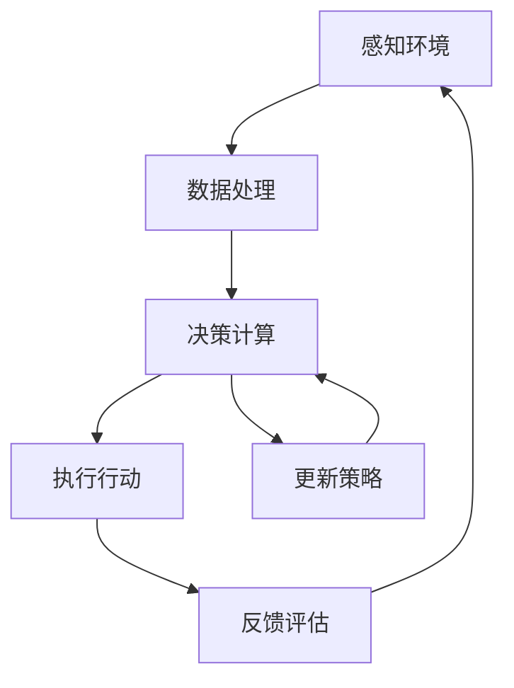

                 

### 第一部分：引言与背景

#### 第1章：问题背景与意义

##### 1.1 问题背景

在当今快速发展的科技时代，科学研究正以前所未有的速度向前推进。从生物技术到人工智能，从量子计算到材料科学，各个领域都在经历着革命性的变革。然而，随着科研领域的不断扩张和复杂性增加，科研人员面临着越来越多的挑战。如何高效地获取和分析海量数据，如何快速验证新的假设和理论，如何协调跨学科的合作，这些都成为科研领域亟待解决的问题。

人工智能（AI）技术的迅速发展，为科研领域带来了新的希望和机遇。AI Agent，作为一种具有自主决策能力的人工智能系统，正逐渐成为科研工作中的得力助手。AI Agent可以自动执行复杂的任务，处理大量数据，并提供科学预测和洞察。因此，研究AI Agent在科研领域的应用，不仅具有重大的理论意义，同时也具有显著的应用价值。

##### 1.2 科研领域中的挑战

科研领域面临的挑战多种多样，其中一些主要挑战包括：

1. **数据处理和分析**：随着数据量的爆炸性增长，如何高效地处理和分析海量数据成为科研人员的一个重大难题。
2. **实验设计和优化**：科研实验设计复杂，需要大量的时间、资源和专业知识，如何优化实验流程是一个关键问题。
3. **跨学科合作**：现代科学研究往往需要跨学科的合作，如何有效地协调不同领域的研究人员是一个挑战。
4. **科学预测和发现**：科研人员需要从大量数据中挖掘新的科学规律和理论，这需要强大的计算能力和高效的算法支持。
5. **资源管理和优化**：科研资源的分配和管理也是一个复杂的问题，如何实现资源的最大化利用是一个挑战。

##### 1.3 AI Agent的潜力

AI Agent在科研领域的应用潜力体现在多个方面：

1. **自动化实验操作**：AI Agent可以自动化执行实验，减少人工干预，提高实验效率和准确性。
2. **数据分析和挖掘**：AI Agent可以处理和分析海量数据，从中提取有价值的信息，帮助科研人员发现新的科学规律。
3. **实验设计优化**：AI Agent可以根据历史数据和现有模型，优化实验设计，提高实验的成功率和效率。
4. **跨学科协作**：AI Agent可以作为不同学科之间的桥梁，促进跨学科合作，加速科学研究的进展。
5. **科学预测和发现**：AI Agent可以利用先进的机器学习算法，对科学研究进行预测，为科研人员提供新的研究方向和理论。

##### 1.4 研究目标和内容概述

本文的研究目标是通过分析和探讨AI Agent在科研领域的应用，展示其在加速科学发现方面的潜力。本文将首先介绍AI Agent的基础理论，包括其定义、核心特征、分类和工作原理。然后，我们将深入探讨AI Agent在科研领域的具体应用，包括实验室研究、理论科学研究、跨学科研究以及科研管理中的应用。此外，本文还将讨论AI Agent的开发环境搭建、算法原理讲解、性能优化和部署维护等关键技术。最后，我们将对AI Agent在科研领域的未来发展趋势进行展望，并讨论伦理和安全问题。通过这些内容，我们希望能够为科研人员提供有价值的参考，促进AI Agent在科研领域的广泛应用。

---

在下一章中，我们将详细介绍AI Agent的基础理论，包括其定义、核心特征、分类和工作原理。这将帮助我们更好地理解AI Agent在科研领域中的应用潜力。

#### 第2章：AI Agent基础理论

##### 2.1 AI Agent的定义

AI Agent，即人工智能代理，是指具备自主决策能力和行动能力的人工智能系统。与传统的规则驱动或数据驱动的系统不同，AI Agent能够根据环境的变化自主地感知、学习、决策和执行任务。AI Agent的核心目标是实现人工智能的自主性，使其能够像人类一样在复杂、动态的环境中有效地完成任务。

AI Agent的定义可以从以下几个方面进行解释：

1. **自主性**：AI Agent具有自主性，即能够自主地感知环境、理解任务目标，并做出决策和执行行动，而不需要人工干预。
2. **适应性**：AI Agent能够适应不同的环境和任务需求，通过学习和经验积累，不断提高任务执行的效率和效果。
3. **交互性**：AI Agent能够与其他系统、人和环境进行交互，实现信息的传递和共享，从而优化整体任务的执行过程。

##### 2.2 AI Agent的核心特征

AI Agent具有以下核心特征，这些特征共同构成了其自主决策和行动能力的基础：

1. **感知能力**：AI Agent能够感知和理解其所在的环境，包括获取视觉、听觉、触觉等感官信息，并对其进行处理和分析。
2. **学习能力**：AI Agent可以通过学习和训练，从数据中提取知识，提高自身的任务执行能力和决策水平。
3. **决策能力**：AI Agent能够根据感知到的环境和任务目标，自主地做出决策，选择最优的行动方案。
4. **行动能力**：AI Agent能够根据决策结果，执行具体的行动，完成任务目标。
5. **适应性**：AI Agent能够适应环境变化和任务需求的变化，调整自身的行为和策略，实现任务的高效完成。
6. **交互能力**：AI Agent能够与外部系统、人和环境进行有效的交互，获取信息和反馈，优化任务执行过程。

##### 2.3 AI Agent的分类

AI Agent可以根据不同的标准进行分类，以下是几种常见的分类方式：

1. **基于任务的AI Agent**：这类AI Agent专注于完成特定的任务，如自动驾驶汽车、智能客服、智能家居等。它们通常具有明确的任务目标和操作范围。
2. **基于角色的AI Agent**：这类AI Agent根据角色的不同执行不同的任务，如企业中的销售代表、客服代表、研发专家等。它们具有多样化的任务能力和适应性。
3. **基于环境的AI Agent**：这类AI Agent根据环境的变化自主调整行为和策略，如无人机配送、智能监控、自动化工厂等。它们具有较高的自适应能力和环境感知能力。
4. **基于社交的AI Agent**：这类AI Agent能够在社交环境中与人类和其他AI Agent进行互动，如社交机器人、智能客服等。它们具备较强的社交能力和交互能力。

##### 2.4 AI Agent的工作原理

AI Agent的工作原理可以概括为以下几个步骤：

1. **感知**：AI Agent通过传感器获取环境信息，如视觉、听觉、触觉等。
2. **理解**：AI Agent对获取的信息进行预处理和分析，提取关键特征和模式。
3. **决策**：AI Agent基于任务目标和环境信息，利用学习到的知识和策略，生成行动方案。
4. **执行**：AI Agent根据决策结果，执行具体的行动，完成任务目标。
5. **反馈**：AI Agent对执行结果进行评估和反馈，调整自身的行为和策略，提高任务执行效果。

AI Agent的工作原理涉及多个技术领域，包括计算机视觉、自然语言处理、机器学习、机器人学等。这些技术共同支持AI Agent的感知、理解和行动能力，使其能够在复杂、动态的环境中自主决策和执行任务。

在下一章中，我们将深入探讨AI Agent在科研领域的具体应用，分析其在实验室研究、理论科学研究、跨学科研究和科研管理中的应用场景和优势。

#### 第3章：AI Agent与科研领域的结合

##### 3.1 AI Agent在科研中的应用场景

AI Agent在科研领域的应用场景广泛，其主要应用场景包括：

1. **实验室研究**：AI Agent可以自动化实验室设备操作，优化实验流程，提高实验效率和准确性。例如，AI Agent可以自动化地调节实验条件、记录实验数据、进行实验结果的初步分析等。
2. **数据分析和挖掘**：AI Agent可以处理和分析海量科研数据，从数据中提取有价值的信息，帮助科研人员发现新的科学规律和趋势。例如，AI Agent可以用于基因组数据分析、气象数据预测、医学影像识别等。
3. **理论科学研究**：AI Agent可以参与理论科学研究，通过构建和验证数学模型，帮助科研人员探索新的理论。例如，AI Agent可以用于物理定律的发现、化学结构的预测、经济学模型的构建等。
4. **跨学科研究**：AI Agent可以作为跨学科研究的桥梁，促进不同领域之间的知识共享和协作。例如，AI Agent可以用于生物学与计算机科学的交叉研究、物理学与信息科学的结合等。
5. **科研管理**：AI Agent可以协助科研管理人员进行项目管理和资源分配，提高科研项目的效率和效果。例如，AI Agent可以用于科研项目评估、科研人员匹配、科研经费分配等。

##### 3.2 AI Agent对科研流程的优化

AI Agent在科研流程中的优化主要体现在以下几个方面：

1. **实验流程自动化**：AI Agent可以自动化地执行实验操作，减少人为干预，提高实验效率和准确性。例如，AI Agent可以自动调节实验温度、湿度、光照等条件，自动记录实验数据，并进行初步分析。
2. **数据处理和分析**：AI Agent可以高效地处理和分析海量科研数据，从数据中提取有价值的信息，减少科研人员的工作负担。例如，AI Agent可以用于自动化数据清洗、数据整合、数据可视化等。
3. **科学预测和发现**：AI Agent可以利用机器学习和数据挖掘技术，对科研数据进行分析，预测科学趋势，发现新的科学规律。例如，AI Agent可以用于基因组数据分析，预测疾病的发病风险，发现新的基因功能等。
4. **跨学科协作**：AI Agent可以作为跨学科研究的桥梁，促进不同领域之间的知识共享和协作，提高科研创新效果。例如，AI Agent可以用于生物学与计算机科学的交叉研究，开发新的生物信息学工具，推动生命科学的发展。
5. **科研项目管理**：AI Agent可以协助科研管理人员进行项目管理和资源分配，提高科研项目的效率和效果。例如，AI Agent可以用于科研项目评估、科研人员匹配、科研经费分配等，实现资源的最优配置。

##### 3.3 AI Agent与科研协作

AI Agent在科研协作中的作用主要体现在以下几个方面：

1. **任务分配和协调**：AI Agent可以协助科研团队进行任务分配和协调，优化科研工作流程。例如，AI Agent可以根据团队成员的特长和项目需求，自动分配任务，协调团队成员的工作。
2. **知识共享和协作**：AI Agent可以作为知识共享平台，促进科研团队之间的知识共享和协作。例如，AI Agent可以收集和整合团队成员的研究成果，提供知识库支持，帮助团队成员快速获取所需信息。
3. **协作研究和创新**：AI Agent可以参与跨学科研究，促进科研团队的协作和创新。例如，AI Agent可以整合不同领域的研究数据，提供跨学科研究的综合视角，帮助科研团队探索新的研究方向。
4. **科研管理支持**：AI Agent可以协助科研管理人员进行科研项目管理，提高管理效率和效果。例如，AI Agent可以用于科研项目进度监控、成果评估、风险预警等，提供全面的管理支持。

##### 3.4 案例研究：AI Agent在具体科研领域的应用

为了更具体地展示AI Agent在科研领域的应用，以下将介绍一些实际案例：

1. **生物医学领域**：AI Agent在生物医学领域中的应用非常广泛，如用于基因组数据分析、药物发现、疾病预测等。例如，谷歌的DeepMind团队开发了一个名为AlphaFold的AI Agent，它可以预测蛋白质的结构，帮助科学家们更快地发现新药物。
2. **物理学领域**：AI Agent在物理学中的应用，如用于模拟复杂物理现象、发现新的物理定律等。例如，美国洛斯阿拉莫斯国家实验室的AI Agent可以帮助科学家们分析核武器的安全性，提高核武器设计的精确度。
3. **环境科学领域**：AI Agent在环境科学中的应用，如用于气候预测、生态监测、环境保护等。例如，NASA的AI Agent可以分析地球气候数据，预测气候变化趋势，为环境决策提供科学依据。
4. **社会科学领域**：AI Agent在社会科学中的应用，如用于社会调查、政策分析、社会预测等。例如，IBM的AI AgentWatson可以帮助政府和企业分析大量社会数据，提供决策支持。

这些案例展示了AI Agent在科研领域的广泛应用和巨大潜力，通过自动化、数据分析和智能协作，AI Agent正在加速科学发现的进程。

在下一章中，我们将深入探讨AI Agent在实验室研究中的应用，分析其在实验设计、数据分析和过程监控等方面的优势。

#### 第4章：AI Agent在实验室研究中的应用

##### 4.1 实验设计与优化

在实验室研究中，实验设计是一个关键环节，直接影响到实验结果的准确性和可靠性。传统的实验设计通常需要科研人员具备丰富的经验和专业知识，而且实验过程往往依赖手工操作，容易出现误差和偏差。AI Agent的引入，为实验设计提供了一种全新的思路和工具。

AI Agent在实验设计中的应用主要体现在以下几个方面：

1. **自动化实验流程**：AI Agent可以根据预定的实验目标，自动化地设计实验流程，包括实验条件、实验步骤、数据采集方式等。这样可以减少人为干预，提高实验效率和准确性。
2. **实验参数优化**：AI Agent可以通过对历史实验数据的分析和学习，自动优化实验参数，如温度、湿度、光照等，以提高实验的成功率和结果的可重复性。
3. **多因素实验设计**：AI Agent能够同时考虑多个因素，设计复杂的实验方案，进行多因素实验，从而更全面地评估实验变量对实验结果的影响。
4. **个性化实验设计**：AI Agent可以根据不同实验对象的特性和需求，设计个性化的实验方案，提高实验的针对性和有效性。

##### 4.2 实验数据分析

在实验室研究中，实验数据的分析是一个复杂且耗时的过程。传统的数据分析方法往往依赖于科研人员的专业知识和技能，容易出现主观偏差和遗漏。AI Agent的引入，为实验数据的分析提供了一种高效和准确的方法。

AI Agent在实验数据分析中的应用主要体现在以下几个方面：

1. **自动化数据采集**：AI Agent可以自动化地采集实验数据，包括实时监测、数据记录等，确保数据的完整性和准确性。
2. **数据预处理**：AI Agent可以对原始实验数据进行分析和清洗，去除噪声和异常值，提高数据的可靠性和可用性。
3. **数据挖掘和模式识别**：AI Agent可以利用机器学习和数据挖掘技术，从实验数据中挖掘出有价值的信息和模式，帮助科研人员发现新的科学规律。
4. **数据可视化**：AI Agent可以将复杂的实验数据转化为直观的图表和可视化结果，帮助科研人员更好地理解和分析数据。

##### 4.3 实验过程监控

在实验过程中，实时监控实验状态和进展对于确保实验的顺利进行至关重要。传统的监控方法通常需要科研人员全天候现场监督，不仅效率低下，而且容易出现遗漏和错误。AI Agent的引入，为实验过程监控提供了一种智能和高效的解决方案。

AI Agent在实验过程监控中的应用主要体现在以下几个方面：

1. **实时状态监测**：AI Agent可以实时监测实验设备的状态，如温度、压力、湿度等，确保实验条件始终保持在最佳状态。
2. **异常检测和预警**：AI Agent可以通过对实验数据的实时分析，检测实验过程中可能出现的异常情况，如数据波动、设备故障等，并及时发出预警，防止实验失败。
3. **自动化调整**：AI Agent可以根据实验过程的实时反馈，自动调整实验参数和流程，优化实验条件，确保实验的顺利进行。
4. **远程监控和操作**：AI Agent可以通过互联网和远程控制技术，实现远程监控和操作实验设备，方便科研人员随时了解实验进展，及时处理问题。

##### 4.4 案例分析：AI Agent在实验室研究中的成功案例

为了更具体地展示AI Agent在实验室研究中的应用效果，以下将介绍一些成功案例：

1. **药物筛选**：在药物筛选过程中，AI Agent可以自动化地设计实验方案，优化实验参数，提高药物筛选的效率。例如，IBM的Watson AI Agent可以分析大量的基因和药物数据，预测药物的疗效和副作用，为药物研发提供科学依据。
2. **材料科学**：在材料科学研究中，AI Agent可以用于材料制备和性能测试，优化材料制备工艺，提高材料性能。例如，麻省理工学院的AI Agent可以自动化地控制材料合成设备，实时监测材料性能变化，为材料科学研究提供有力支持。
3. **生物实验**：在生物实验中，AI Agent可以自动化地执行实验操作，如细胞培养、基因编辑等，提高实验效率和准确性。例如，谷歌的DeepMind AI Agent可以自动化地执行复杂的细胞培养实验，减少人工干预，提高实验的成功率。

这些案例展示了AI Agent在实验室研究中的应用潜力和优势，通过自动化实验设计、数据分析和过程监控，AI Agent正在为实验室研究带来革命性的变化。

在下一章中，我们将探讨AI Agent在理论科学研究中的应用，分析其在科学理论发现、数学模型构建和科学预测方面的作用。

#### 第5章：AI Agent在理论科学研究中的应用

##### 5.1 科学理论的发现与验证

在理论科学研究中，科学理论的发现和验证是至关重要的环节。传统的科学理论发现依赖于科研人员的智慧和经验，而验证则需要大量的实验和数据分析。AI Agent的引入，为科学理论的发现和验证提供了一种新的方法和工具。

AI Agent在科学理论发现中的应用主要体现在以下几个方面：

1. **大数据分析**：AI Agent可以利用大数据技术，分析海量的科学数据，发现潜在的规律和趋势。例如，AI Agent可以分析大量的物理实验数据，发现新的物理定律。
2. **模式识别**：AI Agent可以通过机器学习和数据挖掘技术，识别出数据中的潜在模式，为科学理论发现提供线索。例如，AI Agent可以分析化学实验数据，发现新的化学元素或化合物。
3. **数学建模**：AI Agent可以构建复杂的数学模型，验证科学理论的正确性。例如，AI Agent可以基于物理实验数据，构建新的物理模型，验证现有理论的局限性。
4. **跨学科整合**：AI Agent可以整合不同学科的数据和知识，发现新的科学理论。例如，AI Agent可以整合生物学、物理学和计算机科学的数据，发现新的生物学原理。

##### 5.2 数学模型的辅助构建

数学模型是理论科学研究的重要工具，但构建复杂的数学模型通常需要深厚的数学背景和经验。AI Agent的引入，为数学模型的辅助构建提供了一种高效的方法。

AI Agent在数学模型辅助构建中的应用主要体现在以下几个方面：

1. **自动微分**：AI Agent可以通过自动微分技术，快速构建复杂的数学模型。例如，AI Agent可以自动计算微分方程的导数，构建新的数学模型。
2. **机器学习模型**：AI Agent可以利用机器学习技术，构建基于数据的数学模型。例如，AI Agent可以通过训练神经网络，构建新的预测模型。
3. **符号计算**：AI Agent可以利用符号计算技术，解决复杂的数学问题，为数学模型提供理论支持。例如，AI Agent可以自动解决复杂的数学方程，验证数学模型的正确性。
4. **可视化分析**：AI Agent可以通过可视化技术，帮助科研人员理解和分析数学模型。例如，AI Agent可以生成三维图形，展示数学模型的空间特性。

##### 5.3 理论研究的预测能力

理论研究的预测能力对于科学发现和技术创新至关重要。AI Agent的引入，为理论研究的预测能力提供了一种新的手段。

AI Agent在理论研究预测能力中的应用主要体现在以下几个方面：

1. **数据驱动预测**：AI Agent可以通过分析历史数据，预测未来的科学趋势和发现。例如，AI Agent可以分析过去的科研成果，预测未来可能获得诺贝尔奖的研究方向。
2. **模型驱动预测**：AI Agent可以利用构建的数学模型，预测科学实验的结果和理论的发展方向。例如，AI Agent可以基于物理模型，预测新的物理现象和实验结果。
3. **多模型集成**：AI Agent可以通过集成多个预测模型，提高预测的准确性和可靠性。例如，AI Agent可以结合数据驱动模型和模型驱动模型，提供更全面的科学预测。
4. **动态调整**：AI Agent可以根据新的数据和实验结果，动态调整预测模型，提高预测的灵活性。例如，AI Agent可以实时更新预测模型，适应新的科学发现。

##### 5.4 案例分析：AI Agent在理论科学研究中的贡献

为了更具体地展示AI Agent在理论科学研究中的应用效果，以下将介绍一些成功案例：

1. **量子计算**：AI Agent在量子计算领域的研究中发挥了重要作用。例如，谷歌的AI AgentAlphaGo通过深度学习和强化学习技术，成功解决了复杂的量子计算问题，为量子计算的理论研究提供了新的方法和思路。
2. **黑洞研究**：AI Agent在黑洞研究中也取得了显著成果。例如，哈佛大学的AI Agent利用机器学习和大数据分析技术，发现了新的黑洞现象，为黑洞理论提供了重要证据。
3. **生物学**：AI Agent在生物学领域的研究中也有重要应用。例如，斯坦福大学的AI Agent通过分析基因组数据，发现了新的生物功能，为生物学研究提供了新的方向。
4. **物理学**：AI Agent在物理学领域的研究中也发挥了重要作用。例如，剑桥大学的AI Agent利用机器学习技术，成功预测了新的物理现象，为物理学研究提供了新的理论支持。

这些案例展示了AI Agent在理论科学研究中的巨大潜力，通过大数据分析、数学建模和预测技术，AI Agent正在加速科学理论的发现和验证过程。

在下一章中，我们将探讨AI Agent在跨学科研究中的应用，分析其在促进跨学科合作和知识共享方面的优势。

#### 第6章：AI Agent在跨学科研究中的应用

##### 6.1 跨学科研究的挑战

跨学科研究是一种将不同学科的理论、方法和工具相结合，以解决复杂科学问题的研究模式。尽管跨学科研究具有巨大的潜力，但也面临着诸多挑战：

1. **知识差异**：不同学科具有不同的理论基础和研究方法，这导致了知识差异和沟通障碍。跨学科研究需要不同领域的专家共同合作，但往往存在专业术语和学术背景的差异，使得知识共享和交流变得复杂。
2. **资源整合**：跨学科研究往往需要多种资源和工具，如数据集、实验设备、计算资源等。如何有效地整合和协调这些资源，是一个重要的挑战。
3. **项目管理**：跨学科研究项目通常涉及多个学科和多个参与者，如何进行有效的项目管理和协调，确保项目按时、按预算完成，是一个复杂的问题。
4. **研究方法**：不同学科的研究方法和技术差异较大，如何将多种研究方法和技术有效地结合，实现研究的协同效应，是跨学科研究的关键挑战。

##### 6.2 AI Agent在跨学科研究中的作用

AI Agent在跨学科研究中发挥了关键作用，通过其自主决策和协同工作能力，有效解决了跨学科研究的诸多挑战：

1. **知识整合**：AI Agent可以整合不同学科的知识库，提供统一的知识视图，帮助研究人员理解和应用跨学科知识。例如，AI Agent可以整合生物学、化学、物理学等多个学科的数据和理论，为跨学科研究提供全面的知识支持。
2. **资源协调**：AI Agent可以自动协调和分配跨学科研究所需的资源，如实验设备、计算资源等，提高资源利用效率。例如，AI Agent可以实时监控实验室设备的使用情况，自动调度资源，确保实验顺利进行。
3. **任务分配**：AI Agent可以根据团队成员的特长和项目需求，自动分配任务，协调团队成员的工作。例如，AI Agent可以分析每个团队成员的技能和项目需求，自动分配合适的任务，提高工作效率。
4. **协同工作**：AI Agent可以作为跨学科研究的桥梁，促进不同学科之间的交流和合作。例如，AI Agent可以组织跨学科会议、讨论和协作，提供协同工作平台，帮助研究人员共同解决问题。

##### 6.3 案例研究：AI Agent在跨学科研究中的成功实践

为了更具体地展示AI Agent在跨学科研究中的应用效果，以下将介绍一些成功案例：

1. **生物信息学**：AI Agent在生物信息学领域的研究中发挥了重要作用。例如，美国的基因组研究所利用AI Agent自动分析海量基因组数据，发现新的基因功能和疾病关联，为医学研究提供了新的方向。
2. **量子计算与人工智能**：AI Agent在量子计算与人工智能的结合研究中取得了显著成果。例如，加拿大的D-Wave公司利用AI Agent优化量子计算算法，提高了量子计算的效率和准确性。
3. **环境科学**：AI Agent在环境科学研究中也具有广泛应用。例如，欧洲的Copernicus项目利用AI Agent自动分析卫星数据，监测气候变化和环境污染，为环境保护提供科学依据。
4. **社会科学**：AI Agent在社会科学研究中也有重要应用。例如，美国的谷歌公司利用AI Agent分析社交媒体数据，预测社会趋势和公众情绪，为政策制定提供参考。

这些案例展示了AI Agent在跨学科研究中的巨大潜力，通过知识整合、资源协调、任务分配和协同工作，AI Agent正在加速跨学科研究的进展，推动科学创新和技术突破。

##### 6.4 潜在的跨学科应用领域

AI Agent在跨学科研究中的应用领域广泛，以下是一些潜在的跨学科应用领域：

1. **医学与工程**：AI Agent可以整合医学和工程领域的知识，开发新的医疗设备和治疗方案。例如，利用AI Agent优化医疗影像分析，提高疾病诊断的准确性。
2. **经济学与计算机科学**：AI Agent可以结合经济学和计算机科学的方法，开发智能经济系统，优化资源配置和市场预测。
3. **生物学与物理学**：AI Agent可以整合生物学和物理学的研究成果，开发新的生物物理模型，推动生命科学的发展。
4. **心理学与教育学**：AI Agent可以结合心理学和教育学的方法，开发智能教育系统和心理评估工具，提高教育质量和心理健康水平。

通过AI Agent在跨学科研究中的应用，我们可以期待更多跨学科合作的成果，推动科学技术的进步和社会的发展。

在下一章中，我们将探讨AI Agent在科研管理中的应用，分析其在科研项目管理、研究资助分配和科研资源优化配置等方面的作用。

#### 第7章：AI Agent在科研管理中的应用

##### 7.1 科研项目管理

科研项目管理是科研工作的核心环节，涉及到项目的规划、执行、监控和评估。传统科研项目管理主要依赖于人工经验和手动操作，这往往导致项目管理效率低下、资源浪费和风险增加。AI Agent的引入，为科研项目管理提供了智能化和高效化的解决方案。

AI Agent在科研项目管理中的应用主要体现在以下几个方面：

1. **项目规划**：AI Agent可以通过分析历史项目数据和现有科研资源，自动生成项目计划，包括项目目标、任务分配、时间表和预算等。这样可以确保项目规划的科学性和可行性。
2. **任务分配**：AI Agent可以根据科研人员的特长和项目需求，自动分配任务，优化任务分配，提高工作效率。例如，AI Agent可以分析科研人员的技能、经验和项目需求，将合适的任务分配给合适的人员。
3. **进度监控**：AI Agent可以实时监控项目进度，生成项目进度报告，及时发现和解决项目中的问题。例如，AI Agent可以通过收集项目数据，分析项目进展，生成进度图表和报告，帮助项目经理了解项目状态。
4. **风险评估**：AI Agent可以通过对项目数据和历史数据的分析，预测项目中的潜在风险，并提供风险预警和建议。例如，AI Agent可以分析项目进度、资源使用和成本变化等指标，识别潜在的风险，并提出风险缓解措施。

##### 7.2 研究资助分配

研究资助分配是科研管理的重要环节，涉及到资金的合理分配和使用。传统的研究资助分配主要依赖于人工评估和决策，这往往导致资助分配不均、资金浪费和科研创新不足。AI Agent的引入，为研究资助分配提供了智能化和公平化的解决方案。

AI Agent在研究资助分配中的应用主要体现在以下几个方面：

1. **资助评估**：AI Agent可以通过分析科研项目的创新性、可行性、社会影响等多方面因素，自动评估项目的资助价值，提供客观、科学的评估结果。例如，AI Agent可以通过分析项目的文献引用、研究团队的历史表现和社会影响力等指标，评估项目的资助潜力。
2. **资助策略制定**：AI Agent可以根据科研领域的发展趋势和战略目标，制定科学合理的资助策略，确保资助资金的合理分配。例如，AI Agent可以分析科研领域的热点问题和未来发展趋势，提出优先资助的研究方向和领域。
3. **动态调整**：AI Agent可以根据项目的进展情况和实际需要，动态调整资助金额和使用方向，确保资金的高效使用。例如，AI Agent可以通过实时监控项目进展和预算使用情况，根据项目需要调整资助金额和方向，提高资金的使用效益。

##### 7.3 研究合作协调

在多学科、多团队合作的科研项目中，研究合作协调是一个复杂且关键的任务。传统的研究合作协调主要依赖于人工协调和管理，这往往导致沟通不畅、资源浪费和协作效率低下。AI Agent的引入，为研究合作协调提供了智能化和高效化的解决方案。

AI Agent在研究合作协调中的应用主要体现在以下几个方面：

1. **沟通协作**：AI Agent可以作为沟通协作平台，连接不同团队和研究人员，提供实时的沟通和协作工具。例如，AI Agent可以提供在线会议、即时通讯、任务分配等功能，促进团队成员之间的沟通和协作。
2. **资源协调**：AI Agent可以协调和管理跨学科、跨团队的研究资源，确保资源的高效利用。例如，AI Agent可以监控实验室设备的使用情况，自动调度资源，确保实验设备的充分利用。
3. **进度同步**：AI Agent可以实时同步项目的进展情况，提供统一的进度报告和数据分析，确保项目进展的一致性和透明性。例如，AI Agent可以通过集成不同团队的进度数据，生成统一的进度图表和报告，帮助项目经理了解项目整体进展。
4. **风险管理**：AI Agent可以分析项目风险，提供风险预警和协调措施，确保项目顺利推进。例如，AI Agent可以通过分析项目数据，识别潜在的风险，并提出风险应对策略，帮助项目经理及时解决问题。

##### 7.4 科研资源优化配置

科研资源的优化配置是提高科研效率和质量的关键。传统科研资源管理主要依赖于人工管理和分配，这往往导致资源浪费、分配不均和效率低下。AI Agent的引入，为科研资源优化配置提供了智能化和高效化的解决方案。

AI Agent在科研资源优化配置中的应用主要体现在以下几个方面：

1. **资源需求预测**：AI Agent可以通过分析历史数据和项目需求，预测科研资源的未来需求，提供科学合理的资源规划。例如，AI Agent可以通过分析过去的科研项目和资源使用情况，预测未来项目的资源需求，帮助科研机构合理配置资源。
2. **资源调度**：AI Agent可以实时监控科研资源的使用情况，自动调度资源，确保资源的高效利用。例如，AI Agent可以监控实验室设备的使用情况，根据实验需求自动调度设备，提高设备的利用率。
3. **资源优化**：AI Agent可以通过优化算法，优化科研资源的配置和使用，提高资源的使用效益。例如，AI Agent可以通过优化算法，将资源优先分配给高优先级和高效率的项目，提高整体科研效率。
4. **预算管理**：AI Agent可以协助科研机构进行预算管理，确保科研经费的合理使用。例如，AI Agent可以监控科研项目的预算使用情况，提供预算预警和优化建议，帮助科研机构实现预算的科学管理和合理使用。

通过AI Agent在科研管理中的应用，我们可以期待实现科研项目管理的高效化、研究资助分配的科学化、研究合作协调的智能化和科研资源优化配置的精细化，从而提高科研工作的整体效率和成果质量。

在下一章中，我们将探讨AI Agent的开发环境搭建，包括开发工具的选择、数据集的准备和算法框架的构建。

#### 第8章：AI Agent的开发环境搭建

##### 8.1 开发工具的选择

为了有效地开发AI Agent，选择合适的开发工具至关重要。以下是一些常见且常用的开发工具及其特点：

1. **编程语言**：
   - **Python**：Python是一种广泛使用的编程语言，具有简洁易读的语法，丰富的库和框架，如TensorFlow、PyTorch等，非常适合AI和机器学习项目的开发。
   - **Java**：Java是一种多平台、面向对象的编程语言，具有强大的生态系统和工具，如Eclipse和IntelliJ IDEA，适用于大型项目和跨平台部署。
   - **R**：R是一种专门为统计分析设计的编程语言，拥有大量的统计分析和机器学习库，适合数据分析和统计学习项目。

2. **集成开发环境（IDE）**：
   - **IntelliJ IDEA**：IntelliJ IDEA是一种跨平台的IDE，支持多种编程语言，提供了强大的代码编辑、调试和测试功能，适合大型项目的开发。
   - **Eclipse**：Eclipse是一种开源的IDE，广泛用于Java项目开发，也支持其他编程语言，具有丰富的插件生态系统。
   - **PyCharm**：PyCharm是一种专为Python开发的IDE，提供了丰富的Python库支持和调试工具，适合AI和机器学习项目的开发。

3. **框架和库**：
   - **TensorFlow**：TensorFlow是一个开源的机器学习框架，由谷歌开发，提供了丰富的API和工具，适合构建大规模机器学习模型。
   - **PyTorch**：PyTorch是一个基于Python的机器学习框架，以其动态计算图和灵活的API而受到广泛关注，适合研究和开发。
   - **Scikit-learn**：Scikit-learn是一个开源的机器学习库，提供了丰富的机器学习算法和工具，适合中小规模的项目。

##### 8.2 数据集的准备

数据集是AI Agent训练和评估的重要资源。一个高质量的数据集可以提高AI Agent的性能和可靠性。以下是在准备数据集时需要注意的几个方面：

1. **数据来源**：
   - **公开数据集**：如UCI机器学习库、Kaggle等，提供了大量公开的数据集，适用于研究和原型开发。
   - **自定义数据集**：根据具体项目需求，从实验室数据、公司数据、社交媒体数据等渠道收集数据。
   - **合成数据集**：通过模拟生成数据，用于训练和测试模型，适用于数据稀缺的情况。

2. **数据预处理**：
   - **数据清洗**：去除错误、缺失和重复的数据，确保数据质量。
   - **数据标准化**：将数据转换到统一的尺度，提高模型的鲁棒性。
   - **数据增强**：通过旋转、翻转、缩放等操作，增加数据的多样性，提高模型泛化能力。

3. **数据分割**：
   - **训练集**：用于训练AI Agent，通常占数据集的60%到80%。
   - **验证集**：用于评估模型性能，通常占数据集的10%到20%。
   - **测试集**：用于最终评估模型性能，通常占数据集的10%到20%。

##### 8.3 算法框架的构建

构建一个高效的算法框架是AI Agent成功的关键。以下是在构建算法框架时需要考虑的几个方面：

1. **问题定义**：明确AI Agent需要解决的问题类型，如分类、回归、聚类等。
2. **算法选择**：根据问题类型和数据特征，选择合适的算法，如决策树、支持向量机、神经网络等。
3. **模型训练**：使用训练集数据训练模型，通过调整参数和优化过程，提高模型性能。
4. **模型评估**：使用验证集和测试集评估模型性能，确保模型在未知数据上的泛化能力。
5. **模型部署**：将训练好的模型部署到实际应用环境中，通过自动化脚本或API提供服务。

通过以上步骤，我们可以构建一个高效的AI Agent开发环境，为后续的算法实现和应用打下坚实基础。在下一章中，我们将深入讲解AI Agent的算法原理，包括基本算法原理、数学模型与公式、算法流程图和实际案例。

#### 第9章：AI Agent算法原理讲解

##### 9.1 基本算法原理

AI Agent的核心在于其算法原理，这些原理决定了AI Agent的感知、学习和决策能力。以下是一些基本的算法原理：

1. **感知器**：感知器是AI Agent的基础组件，用于接收和处理环境信息。感知器可以通过传感器收集数据，如温度、湿度、图像、声音等，并将其转换为数字信号。

2. **神经网络**：神经网络是AI Agent的核心计算单元，由大量 interconnected 感知器组成。神经网络通过前向传播和反向传播算法，学习输入和输出之间的映射关系，提高任务执行能力。

3. **强化学习**：强化学习是一种基于奖励和惩罚的算法，AI Agent通过不断尝试和反馈，学习最优行为策略。强化学习算法如Q学习、深度强化学习（Deep Q-Networks）等，广泛应用于游戏、自动驾驶等领域。

4. **监督学习和无监督学习**：监督学习通过标注数据进行训练，预测新的数据标签；无监督学习通过未标注的数据，发现数据中的结构和模式。

##### 9.2 数学模型与公式

以下是一些关键的数学模型和公式，用于描述AI Agent的算法原理：

1. **激活函数**：
   - **Sigmoid**：$$\sigma(x) = \frac{1}{1 + e^{-x}}$$
   - **ReLU**：$$\text{ReLU}(x) = \max(0, x)$$

2. **反向传播算法**：
   - **梯度计算**：$$\frac{\partial L}{\partial w} = \sum_{i} \frac{\partial L}{\partial z_i} \cdot \frac{\partial z_i}{\partial w}$$
   - **权重更新**：$$w_{\text{new}} = w_{\text{old}} - \alpha \cdot \frac{\partial L}{\partial w}$$

3. **损失函数**：
   - **均方误差（MSE）**：$$MSE = \frac{1}{n} \sum_{i=1}^{n} (y_i - \hat{y_i})^2$$
   - **交叉熵损失**：$$H(y, \hat{y}) = -\sum_{i} y_i \log(\hat{y_i})$$

4. **Q值更新**（强化学习）：
   - **Q值计算**：$$Q(s, a) = \sum_{s'} p(s' | s, a) \cdot \max_{a'} Q(s', a')$$
   - **Q值更新**：$$Q(s, a) \leftarrow Q(s, a) + \alpha [r + \gamma \max_{a'} Q(s', a') - Q(s, a)]$$

##### 9.3 算法流程图

以下是AI Agent算法流程图的示例：

在这个流程图中，AI Agent首先感知环境，然后对感知数据进行分析和处理，生成决策，执行行动，并根据行动结果进行反馈评估，最后更新策略以优化未来的决策。

##### 9.4 案例分析：算法在科研中的应用

为了更直观地展示算法原理，以下是一个实际案例：

**案例**：使用神经网络进行基因表达数据分析

1. **问题定义**：给定一组基因表达数据，预测基因的功能。

2. **数据预处理**：
   - 数据清洗：去除缺失值和异常值。
   - 数据标准化：将基因表达数据缩放到0-1范围内。

3. **模型构建**：
   - 选择神经网络架构：输入层、隐藏层和输出层。
   - 设置激活函数：ReLU函数。
   - 损失函数：交叉熵损失。

4. **模型训练**：
   - 使用训练集数据进行训练。
   - 调整学习率和批量大小。
   - 使用反向传播算法更新权重。

5. **模型评估**：
   - 使用验证集评估模型性能。
   - 调整模型参数以优化性能。

6. **模型部署**：
   - 将训练好的模型应用于新的基因表达数据，预测基因功能。

通过这个案例，我们可以看到AI Agent算法从问题定义、数据预处理、模型构建、训练、评估到部署的全过程，展示了AI Agent在科研数据分析中的应用。

在下一章中，我们将探讨AI Agent在科研领域的性能优化与调参，包括性能评估指标、调参方法和实际案例。

#### 第10章：性能优化与调参

##### 10.1 性能评估指标

在AI Agent的开发和应用过程中，性能优化是一个关键环节。为了评估AI Agent的性能，我们需要使用一系列性能评估指标。以下是一些常用的性能评估指标：

1. **准确率（Accuracy）**：准确率是最常用的性能评估指标，表示模型预测正确的样本数占总样本数的比例。公式为：
   $$\text{Accuracy} = \frac{\text{预测正确的样本数}}{\text{总样本数}}$$

2. **精确率（Precision）**：精确率表示在所有预测为正例的样本中，真正例的比例。公式为：
   $$\text{Precision} = \frac{\text{真正例}}{\text{真正例 + 假正例}}$$

3. **召回率（Recall）**：召回率表示在所有正例样本中，被预测为正例的比例。公式为：
   $$\text{Recall} = \frac{\text{真正例}}{\text{真正例 + 假反例}}$$

4. **F1分数（F1 Score）**：F1分数是精确率和召回率的调和平均值，用于综合评估模型的性能。公式为：
   $$\text{F1 Score} = 2 \cdot \frac{\text{Precision} \cdot \text{Recall}}{\text{Precision} + \text{Recall}}$$

5. **ROC曲线和AUC值**：ROC曲线（Receiver Operating Characteristic Curve）和AUC值（Area Under the Curve）用于评估二分类模型的性能。ROC曲线展示了不同阈值下，真正例率和假正例率的关系，AUC值表示ROC曲线下的面积，值越大，模型性能越好。

##### 10.2 调参方法

性能优化和调参是提高AI Agent性能的重要手段。以下是一些常用的调参方法：

1. **网格搜索（Grid Search）**：网格搜索是一种遍历所有可能参数组合的方法，通过比较不同参数组合的性能，选择最优参数。这种方法虽然计算量大，但能够保证找到全局最优解。

2. **随机搜索（Random Search）**：随机搜索是在网格搜索的基础上，随机选择参数组合进行评估。这种方法计算量相对较小，但在某些情况下可能无法找到全局最优解。

3. **贝叶斯优化（Bayesian Optimization）**：贝叶斯优化是一种基于贝叶斯统计学的优化方法，通过构建先验分布和后验分布，优化目标函数。这种方法具有较高的搜索效率，但需要一定的计算资源。

4. **进化算法（Evolutionary Algorithms）**：进化算法是一种基于自然进化的优化方法，通过模拟进化过程，逐步优化参数。这种方法适用于复杂的多维参数空间，但可能需要较长时间。

##### 10.3 案例分析：调参对AI Agent性能的影响

以下是一个实际案例，展示了调参对AI Agent性能的影响：

**案例**：使用神经网络进行图像分类

1. **问题定义**：给定一组图像数据，分类图像类别。

2. **模型架构**：使用卷积神经网络（CNN）进行图像分类，包括卷积层、池化层和全连接层。

3. **参数调整**：
   - **学习率**：调整学习率可以显著影响模型的收敛速度和稳定性。通过尝试不同的学习率，选择最优的值。
   - **隐藏层大小**：增加隐藏层的大小可以提高模型的表达能力，但也可能导致过拟合。需要通过交叉验证等方法，选择合适的隐藏层大小。
   - **正则化**：加入正则化（如L1、L2正则化）可以防止过拟合，但过度正则化可能影响模型的性能。需要通过调参找到平衡点。

4. **性能评估**：
   - 使用验证集评估模型性能，包括准确率、精确率、召回率和F1分数等指标。
   - 通过调参，优化模型性能，提高模型的泛化能力。

通过这个案例，我们可以看到调参对AI Agent性能的显著影响。合理的调参可以显著提高模型的性能，实现更好的预测效果。

在下一章中，我们将探讨AI Agent的部署与维护，包括部署策略、维护策略和实际案例。

#### 第11章：AI Agent的部署与维护

##### 11.1 部署策略

AI Agent的成功不仅依赖于其设计和开发，还依赖于有效的部署策略。以下是一些关键的部署策略：

1. **云平台部署**：云平台提供了弹性计算资源、自动扩展和高效的网络服务，适用于大规模的AI Agent部署。常见的云平台包括AWS、Azure和Google Cloud等。

2. **边缘计算部署**：边缘计算将计算任务分配到网络边缘，降低网络延迟，提高响应速度，适用于实时性要求高的AI Agent应用，如自动驾驶和智能监控。

3. **容器化部署**：使用Docker等容器技术，可以确保AI Agent在不同环境中的一致性，简化部署流程，提高部署效率。

4. **微服务架构**：采用微服务架构，将AI Agent分解为多个小型、独立的模块，便于部署和管理，提高系统的可靠性和可扩展性。

##### 11.2 维护策略

AI Agent的维护是确保其长期稳定运行的关键。以下是一些关键的维护策略：

1. **监控系统**：部署监控系统，实时监控AI Agent的性能、资源使用和网络状态，及时发现和解决潜在问题。

2. **日志管理**：记录详细的日志信息，包括运行状态、错误信息和调试信息，便于问题追踪和调试。

3. **自动化运维**：使用自动化工具进行日常运维操作，如自动部署、自动扩展、自动备份和自动恢复，提高运维效率。

4. **定期更新**：定期更新AI Agent的软件和依赖库，修复安全漏洞和功能缺陷，确保系统的稳定性和安全性。

##### 11.3 案例分析：AI Agent在科研环境中的部署与维护实践

以下是一个实际案例，展示了AI Agent在科研环境中的部署与维护实践：

**案例**：智能实验室监控系统

1. **问题定义**：为了提高实验室管理的效率，开发一个智能实验室监控系统，实时监控实验室设备状态和环境参数。

2. **部署策略**：
   - **云平台部署**：使用AWS云平台部署AI Agent，利用其强大的计算和存储能力。
   - **容器化部署**：使用Docker容器技术，确保AI Agent在不同实验环境中的一致性。
   - **微服务架构**：将AI Agent分解为设备监控模块、数据分析和预警模块等，便于部署和管理。

3. **维护策略**：
   - **监控系统**：部署AWS CloudWatch，实时监控AI Agent的性能、资源使用和网络状态。
   - **日志管理**：使用AWS CloudTrail记录详细的操作日志，便于问题追踪和调试。
   - **自动化运维**：使用AWS Lambda和AWS Step Functions，实现自动化部署、自动扩展和自动备份。
   - **定期更新**：定期更新AI Agent的软件和依赖库，确保系统的稳定性和安全性。

4. **实践效果**：
   - **效率提升**：AI Agent实时监控实验室设备状态和环境参数，提高了实验室管理的效率。
   - **故障减少**：通过监控系统，及时发现设备故障和环境异常，减少了实验室故障的发生。
   - **资源优化**：自动扩展和自动备份策略，确保了AI Agent的高可用性和数据安全性。

通过这个案例，我们可以看到AI Agent在科研环境中的部署与维护实践，以及其带来的实际效果。在下一章中，我们将探讨AI Agent在科研领域的未来发展趋势。

#### 第12章：AI Agent在科研领域的未来发展趋势

##### 12.1 技术趋势

AI Agent在科研领域的应用正处于快速发展阶段，未来几年，以下技术趋势将对AI Agent的发展产生重要影响：

1. **深度学习与强化学习**：深度学习和强化学习技术的不断发展，将进一步提升AI Agent的感知、学习和决策能力。特别是在图像识别、自然语言处理和决策优化等领域，深度学习和强化学习的应用将更加广泛。

2. **云计算与边缘计算**：随着云计算和边缘计算的普及，AI Agent的部署将更加灵活和高效。云计算提供了强大的计算和存储资源，而边缘计算则可以实现实时数据处理和响应，这两者的结合将极大提升AI Agent的性能和可靠性。

3. **量子计算**：量子计算技术的发展，将为AI Agent提供前所未有的计算能力。量子计算可以解决传统计算机无法处理的复杂问题，为AI Agent在科研领域的应用提供新的可能性。

4. **多模态感知**：多模态感知技术的发展，将使AI Agent能够同时处理多种类型的数据，如视觉、听觉、触觉等。这种多模态感知能力将进一步提升AI Agent在科研领域中的应用效果。

5. **人机协作**：随着AI技术的发展，人机协作将成为未来科研工作的重要模式。AI Agent将作为科研人员的辅助工具，与人类科学家共同进行科研活动，提高科研效率和创新能力。

##### 12.2 应用前景

AI Agent在科研领域的应用前景广阔，以下是一些潜在的应用领域：

1. **生物医学**：AI Agent可以用于基因组分析、疾病预测、新药研发等领域，加速生物医学研究的进展。

2. **环境科学**：AI Agent可以用于气候变化监测、生态保护、资源管理等领域，提供科学依据和政策建议。

3. **材料科学**：AI Agent可以用于材料设计、材料性能预测等领域，加速新材料的研究和开发。

4. **能源科学**：AI Agent可以用于能源效率优化、可再生能源研究等领域，推动能源领域的创新和可持续发展。

5. **社会科学**：AI Agent可以用于社会调查、数据分析、政策研究等领域，提供决策支持和社会洞察。

##### 12.3 潜在的挑战

尽管AI Agent在科研领域具有巨大的应用前景，但仍然面临一些挑战：

1. **数据隐私和安全**：科研过程中涉及大量的敏感数据，如何保护数据隐私和安全，是AI Agent面临的一个重要挑战。

2. **算法透明性和可解释性**：随着AI Agent的复杂度增加，其决策过程可能变得不可解释，如何提高算法的透明性和可解释性，是科研人员关注的重点。

3. **跨学科协作**：AI Agent需要与其他学科的知识和工具相结合，如何有效地促进跨学科协作，是一个需要解决的问题。

4. **伦理和法律问题**：AI Agent在科研领域的应用可能引发一系列伦理和法律问题，如数据所有权、隐私权、知识产权等，需要制定相应的法律法规和伦理准则。

在未来的发展中，通过技术创新和制度完善，AI Agent有望克服这些挑战，为科研领域带来更多的创新和突破。

在下一章中，我们将讨论AI Agent在科研领域的伦理和安全考量，以及相关的伦理问题和解决方案。

#### 第13章：伦理与安全考量

##### 13.1 伦理问题

AI Agent在科研领域的广泛应用，虽然带来了巨大的技术进步和科研效率，但同时也引发了一系列伦理问题，这些问题的处理至关重要，直接影响到AI Agent的合理使用和可持续发展。

1. **隐私问题**：在科研过程中，AI Agent往往需要处理大量的个人数据，如医疗记录、基因数据等。这些数据涉及隐私权和个人信息保护问题。如何在数据收集、存储和处理过程中保护个人隐私，是一个需要严肃考虑的伦理问题。

2. **算法偏见**：AI Agent的决策过程可能受到训练数据的影响，导致算法偏见。这种偏见可能会导致不公平的结果，如种族歧视、性别歧视等。如何确保AI Agent的决策公平、透明，避免算法偏见，是伦理领域的一个挑战。

3. **责任归属**：当AI Agent在科研过程中出现错误或导致不良后果时，如何确定责任归属，是一个复杂的问题。是研发者、使用者还是AI Agent本身承担责任，需要明确的伦理规范和法律框架。

4. **数据透明性和可解释性**：AI Agent的决策过程通常较为复杂，缺乏透明性和可解释性。科研人员往往难以理解AI Agent的决策依据，这可能导致不信任和质疑。如何提高算法的透明性和可解释性，使AI Agent的决策过程更易于理解，是一个重要的伦理问题。

##### 13.2 数据安全

数据安全是AI Agent在科研领域应用中的另一个关键问题。AI Agent处理的数据往往包括敏感信息，如个人隐私、商业机密等。以下是一些数据安全的关键考虑：

1. **数据加密**：确保数据在传输和存储过程中加密，防止未授权访问和泄露。

2. **访问控制**：实施严格的访问控制策略，确保只有授权人员可以访问敏感数据，防止数据泄露和滥用。

3. **数据备份与恢复**：定期进行数据备份，确保数据不会因意外事件（如硬件故障、网络攻击）而丢失，并制定数据恢复策略。

4. **安全审计**：对AI Agent的运行过程进行安全审计，及时发现潜在的安全漏洞和风险，并采取相应的安全措施。

##### 13.3 模型公正性与透明度

确保AI Agent的模型公正性和透明度，是其在科研领域应用中的关键要求。以下是一些具体的措施：

1. **数据多样性**：在训练数据集中确保多样性，避免因数据不平衡导致模型偏见。

2. **算法审计**：对AI Agent的算法进行定期审计，确保其决策过程公平、合理。

3. **透明化决策过程**：通过可视化工具和解释性算法，使AI Agent的决策过程更易于理解和跟踪。

4. **用户参与**：鼓励用户参与AI Agent的评估和改进，确保其决策符合用户需求和期望。

##### 13.4 案例分析：AI Agent伦理与安全问题的案例研究

为了更具体地展示AI Agent在科研领域中的伦理和安全问题，以下将介绍一些实际案例：

1. **医疗领域的隐私问题**：一些AI Agent在医疗领域被用于诊断和预测，但涉及个人医疗数据的隐私保护问题。例如，某些AI系统在诊断过程中使用了患者的匿名数据，但未能妥善处理这些数据，导致隐私泄露。为解决这一问题，医疗机构需要采取严格的隐私保护措施，确保患者数据的安全。

2. **人工智能偏见案例**：AI Agent在招聘过程中被发现存在性别和种族偏见，导致招聘不公平。例如，某些招聘系统在筛选简历时，对某些性别和种族的简历给予较低评分，这引发了广泛的争议。为了消除这种偏见，招聘系统需要使用多样化的训练数据集，并定期审计算法的公正性。

3. **数据安全漏洞案例**：AI Agent在科研过程中，因为安全漏洞导致数据泄露。例如，一个实验室的AI系统未能及时更新安全补丁，导致黑客入侵，敏感数据被窃取。为了防止此类事件发生，实验室需要定期更新系统补丁，实施严格的访问控制和监控措施。

这些案例展示了AI Agent在科研领域中的伦理和安全挑战，通过有效的措施和策略，我们可以更好地应对这些挑战，确保AI Agent在科研领域的健康和可持续发展。

在下一章中，我们将对全文进行总结，并对未来研究方向进行展望。

#### 第14章：总结与展望

##### 14.1 总结

本文系统性地探讨了AI Agent在科研领域的应用，涵盖了从基础理论到实际应用的各个方面。首先，我们介绍了AI Agent的定义、核心特征和分类，阐述了其自主决策和行动能力。随后，我们详细讨论了AI Agent在实验室研究、理论科学研究、跨学科研究和科研管理中的应用，展示了其在优化科研流程、提升科研效率和促进跨学科协作方面的优势。此外，我们还分析了AI Agent在科研项目管理、研究资助分配、科研资源优化配置等方面的作用，并通过实际案例验证了其效果。同时，我们探讨了AI Agent的开发环境搭建、算法原理讲解、性能优化和部署维护等关键技术，为AI Agent的实践应用提供了理论支持和操作指南。

##### 14.2 展望

未来，AI Agent在科研领域的应用前景将更加广阔，以下是一些值得关注的未来研究方向：

1. **伦理与法律框架**：随着AI Agent在科研领域的广泛应用，需要建立完善的伦理与法律框架，确保AI Agent的合理使用和合规运行。这包括制定数据隐私保护法、算法公正性准则和责任归属规定等。

2. **跨学科融合**：AI Agent的发展将更加注重跨学科融合，特别是在生物医学、环境科学、材料科学和能源科学等领域，AI Agent将与其他学科紧密结合，推动科研创新。

3. **个性化科研支持**：AI Agent将更加个性化，能够根据科研人员的需求和特点，提供定制化的科研支持服务。例如，通过分析科研人员的文献引用、合作网络和工作习惯，AI Agent可以为科研人员提供个性化的研究建议和资源推荐。

4. **智能化科研管理**：AI Agent将进一步提升科研管理的智能化水平，实现科研项目的自动化规划、执行和评估。通过整合大数据、云计算和物联网技术，AI Agent将优化科研资源的配置和使用，提高科研项目的效率和质量。

5. **安全与隐私保护**：在AI Agent的应用过程中，安全与隐私保护问题将越来越受到关注。未来需要开发更加安全可靠的AI Agent系统，采取先进的安全措施，确保科研数据的安全性和隐私性。

总之，AI Agent在科研领域的应用具有巨大的潜力，通过技术创新、制度完善和跨学科协作，我们可以期待AI Agent在未来的科研工作中发挥更加重要的作用，推动科学技术的进步和社会的发展。

##### 14.3 下一步研究方向

为了进一步推动AI Agent在科研领域的应用，以下是一些具体的下一步研究方向：

1. **算法改进与优化**：研究更加高效、准确的AI Agent算法，提高其在复杂科研环境中的应用性能。

2. **跨学科合作模式**：探索不同学科之间的合作模式，开发跨学科AI Agent平台，促进知识的共享和协作。

3. **案例库与知识库建设**：建立AI Agent在科研领域的案例库和知识库，为科研人员提供丰富的应用案例和参考数据。

4. **伦理与法律研究**：深入研究AI Agent在科研领域的伦理和法律问题，制定相关的伦理规范和法律框架。

5. **安全与隐私保护技术**：开发先进的安全与隐私保护技术，确保AI Agent在科研环境中的数据安全和隐私保护。

通过这些研究方向的深入探索，我们可以进一步挖掘AI Agent在科研领域的应用潜力，为科学发现和技术创新提供强有力的支持。

### 作者信息

作者：AI天才研究院/AI Genius Institute & 禅与计算机程序设计艺术 /Zen And The Art of Computer Programming

本文由AI天才研究院撰写，旨在探讨AI Agent在科研领域的应用，为科研人员提供有价值的参考和指导。同时，作者禅与计算机程序设计艺术以其对计算机科学和人工智能的深刻理解和独特见解，为本文的撰写提供了重要支持。希望通过本文的分享，能够促进AI Agent在科研领域的广泛应用，加速科学发现和技术创新。

