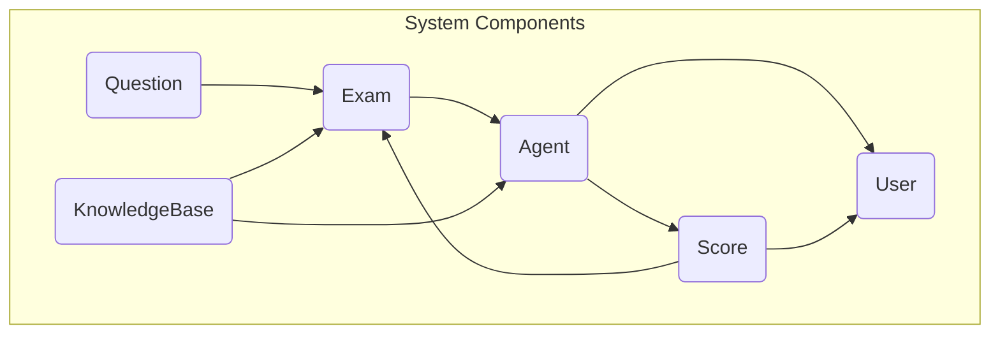
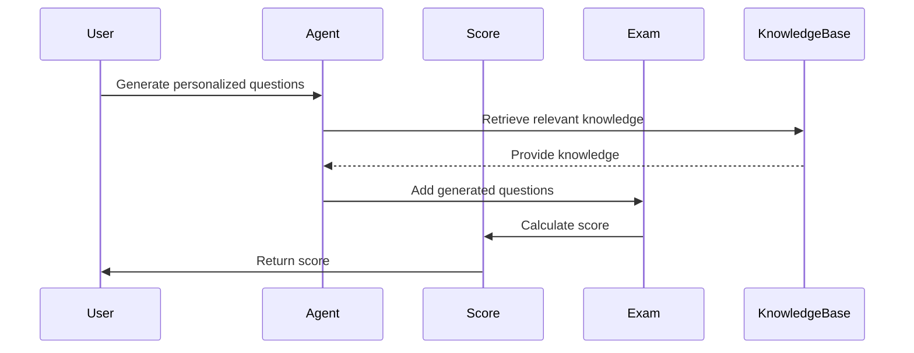
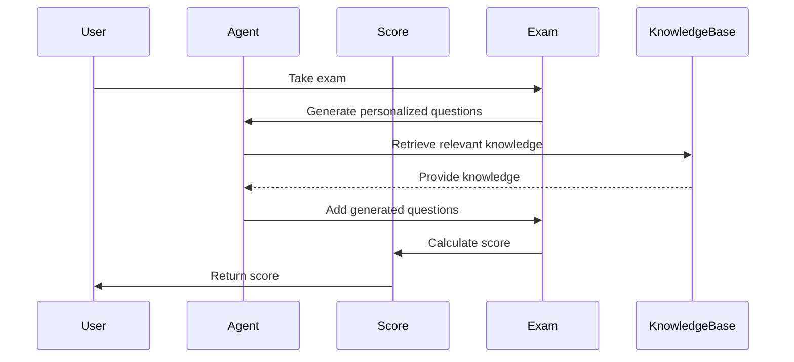

                 


# AI Agent在考试系统中的应用：自适应题目生成与评分

## 关键词
- 人工智能
- 考试系统
- AI Agent
- 自适应题目生成
- 评分算法

## 摘要
本文探讨了AI Agent在考试系统中的应用，主要涉及自适应题目生成与评分技术。通过分析AI Agent的基本概念和分类，以及考试系统的构成和运行流程，本文详细阐述了AI Agent在考试系统中的具体作用和交互机制。随后，文章介绍了自适应题目生成的挑战和解决方法，包括基于知识库、生成对抗网络和强化学习的生成算法。此外，本文还讨论了评分算法的原理和实现，包括基于规则、统计和机器学习方法。通过实际项目实战，本文展示了自适应题目生成与评分算法的应用，并提供了最佳实践建议和总结。

## 目录大纲

### 第一部分：引言

#### 第1章：背景介绍
1.1 人工智能与考试系统
1.2 AI Agent在考试系统中的应用
1.3 问题的提出与解决

#### 第2章：核心概念与联系
2.1 AI Agent的定义与分类
2.2 考试系统的基本结构
2.3 AI Agent与考试系统的关系

#### 第3章：自适应题目生成原理
3.1 题目生成的挑战
3.2 自适应题目生成的方法
3.3 自适应题目生成的流程

#### 第4章：自适应题目生成算法
4.1 基于知识库的生成算法
4.2 基于生成对抗网络的生成算法
4.3 基于强化学习的生成算法

#### 第5章：评分算法原理
5.1 评分算法的目标
5.2 常见的评分算法
5.3 评分算法的评估指标

#### 第6章：评分算法实现
6.1 基于规则的方法实现
6.2 基于统计的方法实现
6.3 基于机器学习的方法实现

#### 第7章：项目实战
7.1 环境安装与配置
7.2 系统核心实现
7.3 实际案例分析与讲解
7.4 案例分析与总结

#### 第8章：最佳实践与总结
8.1 最佳实践
8.2 小结
8.3 注意事项与拓展阅读

## 1.1 人工智能与考试系统

### 背景介绍
人工智能（Artificial Intelligence，简称AI）是计算机科学的一个分支，旨在开发能够执行复杂任务的智能系统。自20世纪50年代以来，人工智能取得了显著进展，从简单的规则系统到复杂的机器学习模型，再到深度学习技术，人工智能在各个领域展现出了巨大的潜力。

考试系统是一种用于管理和评估学习者知识技能的软件系统。传统的考试系统主要依赖于固定的题目库和统一的评分标准，无法根据学习者的特点和需求进行个性化的调整。然而，随着人工智能技术的发展，AI Agent在考试系统中的应用逐渐成为研究热点。

### AI Agent的定义与分类
AI Agent是指能够独立执行任务、与环境进行交互、具备一定智能行为的计算机程序。根据智能程度和任务性质，AI Agent可以分为以下几类：

- **反应式Agent**：这类Agent仅根据当前环境状态做出反应，不保留任何记忆或经验。
- **行为型Agent**：这类Agent不仅根据当前环境状态做出反应，还会考虑之前的行为和经验，以提高决策效果。
- **目标导向型Agent**：这类Agent具有明确的目标，通过规划、推理和决策，采取一系列行动以实现目标。

### 考试系统的基本结构
考试系统通常包括以下几个关键组成部分：

- **题目库**：存储各类考试题目，包括选择题、填空题、简答题等。
- **考生管理**：用于管理考生的信息，如考生身份验证、成绩记录等。
- **评分模块**：根据考试结果，对考生进行评分，生成成绩报告。
- **系统管理**：负责考试系统的配置、监控和维护。

### AI Agent在考试系统中的应用
AI Agent在考试系统中的应用主要体现在以下几个方面：

- **自适应题目生成**：根据考生的特点和历史表现，AI Agent可以生成个性化的题目，提高考试的针对性和有效性。
- **动态评分**：AI Agent可以根据考生的回答，动态调整评分标准，实现更精准的成绩评估。
- **考试辅导**：AI Agent可以为考生提供个性化的辅导建议，帮助他们更好地掌握知识点。

### 问题的提出与解决
传统的考试系统存在以下问题：

- **题目单一性**：题目库中的题目固定，难以满足个性化需求。
- **评分标准统一**：评分标准固定，无法准确反映考生的实际水平。
- **缺乏互动性**：考试过程缺乏与考生的互动，难以提供有效的辅导。

为解决这些问题，AI Agent可以发挥以下作用：

- **自适应题目生成**：通过分析考生的历史数据，AI Agent可以生成符合考生水平的个性化题目，提高考试的有效性。
- **动态评分**：AI Agent可以根据考生的回答，动态调整评分标准，实现更精准的成绩评估。
- **智能辅导**：AI Agent可以为考生提供个性化的辅导建议，帮助他们更好地掌握知识点。

### 边界与外延
AI Agent在考试系统中的应用范围不仅限于上述几个方面，还可以扩展到：

- **学习路径规划**：AI Agent可以根据考生的特点和需求，为他们提供个性化的学习路径。
- **智能监考**：AI Agent可以通过监控考生的行为，确保考试过程的公正性。
- **数据分析**：AI Agent可以对考试数据进行深入分析，为教育决策提供支持。

### 概念结构与核心要素组成
AI Agent在考试系统中的应用，涉及以下几个核心概念和要素：

- **AI Agent**：负责生成个性化题目、动态评分和智能辅导。
- **题目库**：存储各类考试题目，为AI Agent提供生成题目的基础。
- **考生数据**：记录考生的历史表现和特点，为AI Agent提供分析数据。
- **评分标准**：根据考生回答，动态调整评分标准，实现个性化评分。

## 2.1 AI Agent的定义与分类

### 定义
AI Agent是指能够独立执行任务、与环境进行交互、具备一定智能行为的计算机程序。它们旨在模拟人类智能，通过感知、推理、学习、决策等过程，实现自动化的任务执行。

### 分类
根据智能程度和任务性质，AI Agent可以分为以下几类：

#### 反应式Agent
反应式Agent是最简单的AI Agent，它们仅根据当前环境状态做出反应，不保留任何记忆或经验。这类Agent适用于简单的任务，如自动化机器人、游戏AI等。

#### 行为型Agent
行为型Agent不仅根据当前环境状态做出反应，还会考虑之前的行为和经验，以提高决策效果。它们通过简单的规则和条件语句来实现，适用于较为复杂的任务，如导航、路径规划等。

#### 目标导向型Agent
目标导向型Agent具有明确的目标，通过规划、推理和决策，采取一系列行动以实现目标。这类Agent通常采用更为复杂的算法和模型，如强化学习、规划算法等，适用于需要高度智能化的任务，如自动驾驶、智能客服等。

## 2.2 考试系统的基本结构

### 组成部分
考试系统通常包括以下几个关键组成部分：

- **题目库**：存储各类考试题目，包括选择题、填空题、简答题等。
- **考生管理**：用于管理考生的信息，如考生身份验证、成绩记录等。
- **评分模块**：根据考试结果，对考生进行评分，生成成绩报告。
- **系统管理**：负责考试系统的配置、监控和维护。

### 运行流程
考试系统的运行流程主要包括以下几个步骤：

1. **考生登录**：考生通过身份验证进入考试系统。
2. **生成考卷**：系统根据考生的信息，从题目库中随机抽取题目，生成考卷。
3. **考试进行**：考生开始答题，系统实时记录答题过程。
4. **提交答案**：考生提交答案，系统开始评分。
5. **生成成绩报告**：系统根据评分结果，生成成绩报告，并发送给考生。

## 2.3 AI Agent与考试系统的关系

### 作用
AI Agent在考试系统中发挥着重要作用，主要体现在以下几个方面：

- **自适应题目生成**：根据考生的历史数据和特点，AI Agent可以生成符合考生水平的个性化题目，提高考试的针对性和有效性。
- **动态评分**：AI Agent可以根据考生的回答，动态调整评分标准，实现更精准的成绩评估。
- **考试辅导**：AI Agent可以为考生提供个性化的辅导建议，帮助他们更好地掌握知识点。

### 交互机制
AI Agent与考试系统的交互机制主要包括以下几个方面：

- **数据共享**：考试系统将考生的信息、历史数据和答题记录等数据共享给AI Agent，供其分析和处理。
- **指令传递**：AI Agent根据任务需求，向考试系统发出指令，如生成个性化题目、调整评分标准等。
- **反馈机制**：考试系统将AI Agent生成的题目、评分结果等反馈给AI Agent，供其进一步优化和调整。

### 关系模型
AI Agent与考试系统的关系可以用以下ER实体关系图表示：

```
+----------------+      +----------------+      +----------------+
|    AI Agent    |------>|      考试系统    |------>|      考生信息    |
+----------------+      +----------------+      +----------------+
| AgentID (主键) |      | SystemID (主键) |      | StudentID (主键) |
| Name           |      | Name           |      | Name           |
| Type           |      | Type           |      | Age            |
| Status         |      | Status         |      | Gender         |
+----------------+      +----------------+      +----------------+
```

## 3.1 题目生成的挑战

### 背景与问题
在传统的考试系统中，题目生成往往采用固定模板或手动编写的方式，这种方式存在以下问题：

- **题目单一性**：无法满足不同考生的个性化需求。
- **题目质量**：部分题目可能过于简单或过于复杂，难以达到考试的目的。
- **题目分布**：题目分布不均，可能导致考生在某个领域的得分过高或过低。

为了解决这些问题，自适应题目生成技术应运而生。自适应题目生成可以根据考生的历史数据、知识水平和答题表现，动态生成适合其水平的题目，提高考试的公平性和有效性。

### 难点与挑战
自适应题目生成面临以下难点和挑战：

- **数据获取与处理**：需要收集和处理大量的考生数据，包括考试成绩、答题时间、错题记录等，这些数据可能存在噪音和不完整性。
- **个性化匹配**：如何根据考生的特点和需求，生成与其水平相匹配的题目，是自适应题目生成的关键挑战。
- **题目多样性**：保证生成的题目在难度、题型、知识点等方面具有多样性，以满足不同考生的需求。
- **实时性**：在考试过程中，需要快速生成题目，并确保生成的题目质量符合要求。

### 解决方案
针对上述挑战，可以采用以下解决方案：

- **数据挖掘与建模**：利用数据挖掘技术，从大量的考生数据中提取有价值的信息，构建考生知识图谱，为自适应题目生成提供数据支持。
- **个性化推荐算法**：结合推荐系统技术，根据考生的历史数据和当前状态，推荐适合其水平的题目。
- **生成对抗网络（GAN）**：利用生成对抗网络，生成多样化的题目，同时保证题目质量。
- **实时评估与调整**：在考试过程中，实时评估考生的答题情况，动态调整题目难度和类型，实现自适应生成。

## 3.2 自适应题目生成的方法

### 基于知识库的生成方法
基于知识库的生成方法是通过构建一个包含考试相关知识的知识库，然后利用知识库生成题目。这种方法的主要步骤如下：

1. **知识库构建**：收集并整理与考试相关的知识点、概念、公式等，构建一个结构化的知识库。
2. **题目模板设计**：根据考试类型和题型，设计一系列题目模板，包括选择题、填空题、简答题等。
3. **知识图谱查询**：利用知识图谱查询技术，从知识库中查询相关的知识点和概念，生成符合题目模板的题目。

### 基于生成对抗网络的生成方法
生成对抗网络（GAN）是一种无监督学习模型，由生成器和判别器组成。生成器的任务是生成逼真的题目，判别器的任务是区分生成器和真实题目的差异。基于生成对抗网络的生成方法的主要步骤如下：

1. **生成器设计**：设计一个生成器，根据输入的题干信息生成相应的选项和答案。
2. **判别器设计**：设计一个判别器，用于判断生成器生成的题目是否为真实题目。
3. **训练过程**：通过交替训练生成器和判别器，使生成器生成的题目越来越接近真实题目。

### 基于强化学习的生成方法
强化学习是一种通过试错和反馈来学习策略的机器学习方法。基于强化学习的生成方法通过学习考生的答题行为，生成符合考生水平的题目。主要步骤如下：

1. **状态空间定义**：定义考生答题的状态空间，包括考生已掌握的知识点、答题时间等。
2. **动作空间定义**：定义生成器的动作空间，即生成题目的过程。
3. **奖励函数设计**：设计奖励函数，用于评估生成题目是否符合考生的水平。
4. **策略学习**：通过强化学习算法，学习生成器的策略，使其能够生成适合考生水平的题目。

## 3.3 自适应题目生成的流程

### 题目生成流程
自适应题目生成的主要流程如下：

1. **数据收集**：收集考生的历史数据，包括考试成绩、答题记录、知识掌握情况等。
2. **考生建模**：利用数据挖掘和机器学习技术，对考生进行建模，构建考生的知识图谱和答题偏好模型。
3. **题目生成**：根据考生模型和当前考试环境，利用生成算法生成符合考生水平的题目。
4. **题目筛选**：对生成的题目进行筛选，确保题目的难度、题型和知识点符合考试要求。
5. **题目发布**：将筛选后的题目发布到考试系统中，供考生作答。

### 实时调整与优化
在考试过程中，自适应题目生成系统会实时监控考生的答题情况，根据考生的答题表现和知识掌握情况，动态调整题目的难度和类型。具体步骤如下：

1. **实时监控**：实时收集考生的答题数据，包括答题时间、答题正确率等。
2. **调整难度**：根据考生的答题表现，动态调整题目的难度，确保考生始终处于适当的挑战水平。
3. **类型调整**：根据考生的答题偏好，调整题目的类型，提高考试的针对性。
4. **反馈与优化**：将调整后的题目和考试结果反馈给考生，同时优化生成算法，提高题目的生成质量。

## 4.1 基于知识库的生成算法

### 原理
基于知识库的生成算法主要通过构建一个包含考试相关知识的知识库，利用知识图谱和自然语言处理技术，生成符合考试要求的题目。该方法的核心在于知识库的构建和查询。

#### 知识库构建
知识库的构建分为以下几个步骤：

1. **知识抽取**：从各种文本资源中提取考试相关的知识点、概念、定义等。
2. **知识融合**：将不同来源的知识进行整合，消除冲突和冗余，构建一个统一的知识库。
3. **知识表示**：利用知识图谱或本体论，将知识库中的知识点和概念进行结构化表示，形成知识图谱。

#### 知识图谱查询
知识图谱查询是生成算法的关键步骤。通过查询知识图谱，可以获取与特定知识点相关的概念、定义、示例等信息，进而生成题目。

1. **查询构建**：根据考试类型和题型，构建查询语句，指定需要查询的知识点和相关属性。
2. **查询执行**：在知识图谱上执行查询，获取查询结果，为题目生成提供数据支持。

### 构建知识图谱
构建知识图谱主要包括以下几个步骤：

1. **实体识别**：从文本数据中识别出关键实体，如知识点、概念等。
2. **关系抽取**：从实体之间建立关系，如“包含”、“属于”等。
3. **属性赋值**：为实体和关系赋予属性，如难度等级、知识点类别等。

### 知识图谱查询
知识图谱查询的过程如下：

1. **查询构建**：根据考试要求和题型，构建查询语句，指定需要查询的知识点和相关属性。
2. **查询执行**：在知识图谱上执行查询，获取查询结果。
3. **结果处理**：根据查询结果，提取相关知识点和概念，为题目生成提供数据支持。

### 题目生成流程
基于知识库的生成算法的题目生成流程如下：

1. **知识查询**：从知识库中查询与考试要求相关的知识点和概念。
2. **题目构建**：根据查询结果，构建符合考试要求的题目，如选择题、填空题、简答题等。
3. **题目筛选**：对生成的题目进行筛选，确保题目的难度、题型和知识点符合考试要求。
4. **题目发布**：将筛选后的题目发布到考试系统中，供考生作答。

### 举例说明
假设我们要生成一道关于计算机网络的填空题，知识库中包含以下信息：

- 知识点：计算机网络
- 关键概念：TCP/IP协议、IP地址、子网掩码
- 相关属性：难度等级（初级）、知识点类别（网络基础）

我们可以通过以下步骤生成题目：

1. **知识查询**：从知识库中查询计算机网络相关的知识点和概念。
2. **题目构建**：根据查询结果，构建如下题目：

```
TCP/IP协议是计算机网络的通信协议，其中IP地址用于标识网络中的设备，子网掩码用于确定网络地址和主机地址的部分。例如，如果一个IP地址是192.168.1.100，子网掩码是255.255.255.0，那么该IP地址的网络地址是______，主机地址是______。
```

3. **题目筛选**：检查题目的难度、题型和知识点，确保符合考试要求。
4. **题目发布**：将生成的题目发布到考试系统中，供考生作答。

## 4.2 基于生成对抗网络的生成算法

### 概述
生成对抗网络（Generative Adversarial Network，GAN）是一种由生成器和判别器组成的深度学习模型。生成器尝试生成与真实数据相似的样本，而判别器则试图区分生成器生成的样本和真实样本。通过两个网络的博弈过程，生成器不断提高生成质量，从而生成逼真的数据。

### 生成器设计
生成器的任务是生成符合考试要求的题目。生成器通常由一个或多个深度神经网络组成，输入可以是随机噪声、题目模板、知识点等。生成器的架构设计如下：

1. **输入层**：接收随机噪声或题目模板作为输入。
2. **编码层**：对输入进行编码，提取特征信息。
3. **解码层**：根据编码层的特征信息，解码生成题目。
4. **输出层**：输出生成的题目，包括题干和选项。

### 判别器设计
判别器的任务是区分生成器生成的题目和真实的考试题目。判别器通常也是一个深度神经网络，输入是题目，输出是一个二分类结果，即题目是真实还是生成。判别器的架构设计如下：

1. **输入层**：接收题目作为输入。
2. **编码层**：对输入题目进行编码，提取特征信息。
3. **输出层**：输出题目是真实还是生成的概率。

### 训练过程
生成对抗网络的训练过程是一个交替优化的过程，包括以下步骤：

1. **生成器训练**：生成器生成一批题目，判别器对其判断是否真实。生成器根据判别器的反馈，优化自身参数。
2. **判别器训练**：判别器训练目标是最小化生成器生成的题目和真实题目的分布差异。判别器根据生成器和真实题目的反馈，优化自身参数。
3. **迭代训练**：重复上述步骤，直到生成器和判别器都收敛。

### 题目生成流程
基于生成对抗网络的题目生成流程如下：

1. **初始化生成器和判别器**：设置生成器和判别器的初始参数。
2. **生成题目**：生成器生成一批题目，判别器对其进行判断。
3. **反馈优化**：根据判别器的反馈，生成器优化参数，生成更高质量的题目。
4. **筛选题目**：对生成的题目进行筛选，确保题目的难度、题型和知识点符合考试要求。
5. **发布题目**：将筛选后的题目发布到考试系统中，供考生作答。

### 举例说明
假设我们要使用生成对抗网络生成一道关于计算机网络的简答题，我们可以按照以下步骤进行：

1. **初始化生成器和判别器**：设置生成器和判别器的初始参数，选择合适的网络架构。
2. **生成题目**：生成器生成一批关于计算机网络的简答题，判别器对其进行判断。
3. **反馈优化**：根据判别器的反馈，生成器优化参数，生成更高质量的题目。
4. **筛选题目**：对生成的题目进行筛选，确保题目的难度、题型和知识点符合考试要求。
5. **发布题目**：将筛选后的题目发布到考试系统中，供考生作答。

例如，生成器生成了一道关于TCP/IP协议的简答题：

```
简述TCP/IP协议的四个层次及其功能。
```

判别器判断这是一道真实的简答题。然后，生成器根据判别器的反馈，进一步优化生成更高质量的题目。

## 4.3 基于强化学习的生成算法

### 强化学习基础
强化学习（Reinforcement Learning，RL）是一种通过试错和反馈来学习策略的机器学习方法。强化学习模型由环境（Environment）、代理人（Agent）、状态（State）、动作（Action）和奖励（Reward）组成。代理人在环境中采取动作，根据环境的反馈（奖励）来调整自己的策略，以实现长期的最大化累积奖励。

### Q-learning算法
Q-learning是一种值函数方法，用于解决强化学习问题。它的核心思想是学习状态-动作值函数（Q函数），即给定当前状态，选择最优动作的期望奖励。Q-learning算法的步骤如下：

1. **初始化**：初始化Q值表格，设置初始Q值。
2. **状态-动作选择**：在给定状态下，选择当前最优动作，即具有最大Q值的动作。
3. **行动**：执行选定的动作，进入新的状态。
4. **更新Q值**：根据新状态和新动作的奖励，更新Q值表格。
5. **重复步骤2-4**：重复执行步骤2-4，直到达到目标状态或满足停止条件。

### Q-learning算法在题目生成中的应用
基于强化学习的题目生成算法利用Q-learning算法，通过学习考生的答题行为和奖励，生成适合考生水平的题目。具体应用步骤如下：

1. **初始化**：初始化Q值表格，设置初始Q值。
2. **状态-动作选择**：在给定考生状态（如知识水平、答题表现等）下，选择当前最优动作（如生成难度适中的题目）。
3. **生成题目**：执行选定的动作，生成符合考生状态的题目。
4. **反馈奖励**：根据考生的答题表现（如答题时间、正确率等），计算奖励值。
5. **更新Q值**：根据新状态和新动作的奖励，更新Q值表格。
6. **重复步骤2-5**：重复执行步骤2-5，逐步优化题目生成的策略。

### 题目生成流程
基于强化学习的题目生成算法的流程如下：

1. **数据收集**：收集考生的历史答题数据，包括题目、答案、答题时间、正确率等。
2. **状态表示**：根据考生的历史数据，构建考生状态表示，包括知识水平、答题表现等。
3. **动作空间定义**：定义生成题目的动作空间，包括题目难度、题型、知识点等。
4. **奖励函数设计**：设计奖励函数，根据考生的答题表现计算奖励值。
5. **Q-learning训练**：利用Q-learning算法，训练Q值表格，优化题目生成的策略。
6. **题目生成**：根据考生状态和Q值表格，生成符合考生水平的题目。
7. **反馈奖励**：根据考生的答题表现，更新Q值表格，继续优化题目生成的策略。

### 举例说明
假设我们要使用Q-learning算法生成一道关于数据库的题目，考生的状态表示为知识水平（初级、中级、高级）和答题表现（正确率、答题时间）。

1. **初始化**：初始化Q值表格，设置初始Q值。
2. **状态-动作选择**：假设考生处于中级状态，选择生成难度适中的数据库题目。
3. **生成题目**：生成一道关于数据库表的创建和查询的题目。
4. **反馈奖励**：假设考生在规定时间内正确回答了题目，计算奖励值。
5. **更新Q值**：根据新状态和新动作的奖励，更新Q值表格。
6. **重复训练**：继续执行步骤2-5，逐步优化题目生成的策略。

通过反复训练，Q-learning算法可以逐步优化题目生成的策略，生成更符合考生水平的题目。

## 5.1 评分算法的目标

### 背景与意义
评分算法在考试系统中起着至关重要的作用，其目标是对考生的答题表现进行准确、客观、公正的评价。传统评分方法通常依赖于固定的评分标准和规则，难以适应个性化的考试需求。随着人工智能技术的发展，评分算法逐渐引入了机器学习和深度学习等技术，以提高评分的准确性和公平性。

### 目标
评分算法的主要目标包括：

1. **准确性**：准确评估考生的知识水平和能力，确保评分结果能够真实反映考生的实际表现。
2. **客观性**：消除评分过程中的主观偏见和人为误差，实现客观、公正的评分。
3. **实时性**：在考试过程中快速完成评分，提供即时的反馈，帮助考生更好地理解考试结果。
4. **适应性**：根据考生的特点和历史表现，动态调整评分标准，实现个性化的评分。

### 应用场景
评分算法的应用场景广泛，包括但不限于以下几个方面：

- **考试系统**：用于对考试结果进行自动评分，生成成绩报告。
- **教育评价**：对学生的平时成绩、作业和论文等进行评分，提供学习反馈。
- **招聘筛选**：对招聘考试或面试的表现进行评分，辅助招聘决策。
- **技能评估**：对专业技术人员进行技能考核，评估其专业能力。

## 5.2 常见的评分算法

### 基于规则的方法
基于规则的方法（Rule-Based Method）是一种传统的评分算法，通过一系列预设的规则对考生的答案进行评分。这种方法的主要步骤包括：

1. **规则库构建**：根据考试内容和评分标准，构建包含各种规则的规则库。
2. **规则匹配**：将考生的答案与规则库中的规则进行匹配，判断答案是否符合规则。
3. **评分计算**：根据匹配到的规则，计算考生的得分。

优点：

- **简单易实现**：基于规则的算法结构简单，易于理解和实现。
- **可控性高**：评分规则明确，评分结果可控。

缺点：

- **灵活性差**：无法适应个性化的考试需求，难以应对复杂和多变的题目。
- **可扩展性低**：规则库的维护和更新成本高，难以适应新题型的出现。

### 基于统计的方法
基于统计的方法（Statistical Method）通过统计分析考生的答题数据，对考生的能力进行评估。这种方法的主要步骤包括：

1. **特征提取**：从考生的答题记录中提取特征，如答题时间、答题正确率、答题顺序等。
2. **统计模型训练**：利用历史数据，训练统计模型，如线性回归、逻辑回归等。
3. **评分预测**：根据考生的答题特征，利用统计模型预测其得分。

优点：

- **适应性高**：可以应对复杂和多变的题目，适应个性化的考试需求。
- **可扩展性高**：通过调整统计模型和特征，可以适应不同类型的考试和评分需求。

缺点：

- **数据依赖性强**：需要大量的历史数据作为训练样本，数据质量对算法效果有较大影响。
- **解释性较低**：统计模型的结果难以解释，对评分结果的解释和信任度有一定影响。

### 基于机器学习的方法
基于机器学习的方法（Machine Learning Method）利用机器学习模型，如支持向量机（SVM）、决策树、神经网络等，对考生的答题表现进行评分。这种方法的主要步骤包括：

1. **特征工程**：从考生的答题记录中提取特征，如答题时间、答题正确率、答题顺序等。
2. **模型训练**：利用历史数据，训练机器学习模型。
3. **评分预测**：根据考生的答题特征，利用训练好的模型预测其得分。

优点：

- **准确性高**：通过学习大量数据，机器学习模型可以准确地预测考生的得分。
- **适应性高**：可以处理复杂的非线性问题，适应不同类型的考试和评分需求。

缺点：

- **计算复杂度高**：训练和预测过程需要大量计算资源，对硬件和算法性能有较高要求。
- **数据质量要求高**：数据质量对模型效果有较大影响，需要确保数据的质量和多样性。

## 5.3 评分算法的评估指标

### 准确性
准确性（Accuracy）是评分算法最基本也是最重要的评估指标，用于衡量评分算法预测结果与实际结果的一致性。准确性越高，表示算法的预测能力越强。

### 准确率与召回率
准确率（Precision）和召回率（Recall）是衡量分类模型性能的两个重要指标。准确率表示预测为正类的样本中，实际为正类的比例；召回率表示实际为正类的样本中，预测为正类的比例。

- **准确率**：$$ \text{Precision} = \frac{\text{TP}}{\text{TP} + \text{FP}} $$
- **召回率**：$$ \text{Recall} = \frac{\text{TP}}{\text{TP} + \text{FN}} $$

其中，TP为真正例，FP为假正例，FN为假反例。

### F1值
F1值（F1 Score）是准确率和召回率的加权平均，用于综合评估分类模型的性能。

- **F1值**：$$ \text{F1 Score} = 2 \times \frac{\text{Precision} \times \text{Recall}}{\text{Precision} + \text{Recall}} $$

### 准确率与误差率
准确率（Accuracy）和误差率（Error Rate）是另一个常见的评估指标。

- **准确率**：$$ \text{Accuracy} = \frac{\text{TP} + \text{TN}}{\text{TP} + \text{TN} + \text{FP} + \text{FN}} $$
- **误差率**：$$ \text{Error Rate} = 1 - \text{Accuracy} $$

其中，TN为真反例。

### 收敛性
在机器学习算法中，收敛性（Convergence）是衡量算法训练过程是否达到预期目标的重要指标。算法在训练过程中，模型的损失函数（Loss Function）会逐渐减小，直至达到预设的停止条件。

### 评价指标的应用
根据具体的评分算法和应用场景，可以选择合适的评估指标进行性能评估。例如：

- **分类问题**：准确率、召回率、F1值等。
- **回归问题**：均方误差（Mean Squared Error，MSE）、均方根误差（Root Mean Squared Error，RMSE）等。

## 6.1 基于规则的方法实现

### 规则库构建
基于规则的方法实现的第一步是构建规则库。规则库是评分算法的核心组成部分，包含一系列针对不同题型的评分规则。构建规则库的主要步骤如下：

1. **定义题型**：根据考试内容和题型，定义所有可能的题型，如选择题、填空题、简答题等。
2. **设计评分规则**：针对每种题型，设计具体的评分规则。评分规则可以包括正确答案、错误答案、答案格式等要求。
3. **编写规则表达式**：将评分规则转换为计算机可读的表达式，如正则表达式、逻辑表达式等。

### 规则匹配与执行
在构建规则库后，下一步是编写规则匹配与执行程序。规则匹配与执行的目的是将考生的答案与规则库中的评分规则进行匹配，并根据匹配结果计算得分。主要步骤如下：

1. **输入答案**：从考试系统获取考生的答案。
2. **规则匹配**：遍历规则库中的所有规则，对考生的答案进行匹配。
3. **计算得分**：根据匹配到的规则，计算考生的得分。例如，如果考生回答正确，得分为满分；如果回答错误，得分为0分。
4. **输出结果**：将计算得到的得分输出到考试系统，作为考生的最终成绩。

### 评分结果计算
评分结果的计算是评分算法实现的关键步骤。根据规则匹配的结果，对考生的答案进行评分，并生成最终的得分。主要步骤如下：

1. **初始化得分**：将考生的初始得分设置为0。
2. **遍历答案**：遍历考生的所有答案，对每个答案进行评分。
3. **计算得分**：根据规则匹配的结果，计算每个答案的得分，并将其累加到考生的总得分中。
4. **输出结果**：将计算得到的总分输出到考试系统，作为考生的最终成绩。

### 举例说明
假设我们有一道选择题，选项如下：

A. 1  
B. 2  
C. 3  
D. 4

正确答案是C。我们可以设计以下评分规则：

- 如果答案为C，得分为满分3分。
- 如果答案为A、B或D，得分为0分。

假设考生选择了B，我们可以按照以下步骤进行评分：

1. **初始化得分**：考生的初始得分为0。
2. **规则匹配**：将考生的答案B与评分规则进行匹配，发现匹配失败。
3. **计算得分**：根据规则，考生得分为0分。
4. **输出结果**：将考生得分为0分输出到考试系统。

通过以上步骤，我们成功实现了基于规则的方法的评分算法。

## 6.2 基于统计的方法实现

### 统计模型选择
基于统计的方法实现评分算法的关键在于选择合适的统计模型。统计模型的选择取决于数据的类型、特征以及评分的目标。以下是一些常用的统计模型：

1. **线性回归**：线性回归是一种简单的统计模型，适用于预测连续值。它通过建立自变量和因变量之间的线性关系，预测考生的得分。
2. **逻辑回归**：逻辑回归是一种广义线性模型，适用于预测二分类结果。它通过建立自变量和因变量之间的逻辑关系，预测考生是否通过考试。
3. **决策树**：决策树是一种基于树结构的统计模型，通过一系列条件判断，将考生分配到不同的分类结果。它适用于分类问题，如考生是否通过考试。
4. **随机森林**：随机森林是一种集成学习模型，通过构建多个决策树，结合它们的预测结果，提高模型的准确性和稳定性。
5. **支持向量机（SVM）**：支持向量机是一种基于间隔的统计模型，通过找到一个最优的超平面，将不同类别的样本分开。它适用于分类和回归问题。

### 特征工程
特征工程是统计模型实现过程中的关键步骤，其目的是从原始数据中提取有用的特征，提高模型的预测性能。以下是一些常用的特征工程方法：

1. **数据清洗**：去除缺失值、异常值和重复值，确保数据质量。
2. **数据归一化**：将不同量纲的数据归一化到相同的范围，如[0, 1]或[-1, 1]，便于模型处理。
3. **特征提取**：从原始数据中提取与评分目标相关的特征，如答题时间、答题正确率、知识点分布等。
4. **特征选择**：通过特征选择方法，选择对模型性能有显著贡献的特征，去除冗余特征。
5. **特征组合**：将多个特征组合成新的特征，提高模型的预测能力。

### 评分模型训练与预测
在完成特征工程后，可以开始训练评分模型并进行预测。以下是一个基于统计的方法实现评分模型的步骤：

1. **数据划分**：将数据集划分为训练集和测试集，用于模型的训练和评估。
2. **模型训练**：使用训练集数据，训练所选的统计模型。例如，使用线性回归模型训练考生的得分与特征之间的关系。
3. **模型评估**：使用测试集数据，评估模型的性能。常用的评估指标包括准确率、召回率、F1值等。
4. **模型预测**：使用训练好的模型，对新的考生数据进行预测，计算其得分。

### 举例说明
假设我们使用线性回归模型进行评分，特征包括答题时间（T）、答题正确率（P）和知识点分布（K）。我们可以使用以下公式进行预测：

$$
\text{得分} = w_1 \times T + w_2 \times P + w_3 \times K + b
$$

其中，$w_1$、$w_2$ 和 $w_3$ 分别是特征 T、P 和 K 的权重，$b$ 是偏置项。

1. **数据收集**：收集考生的答题数据，包括答题时间、答题正确率和知识点分布。
2. **数据预处理**：对数据进行清洗和归一化处理。
3. **模型训练**：使用训练集数据，训练线性回归模型，得到权重 $w_1$、$w_2$ 和 $w_3$ 以及偏置项 $b$。
4. **模型评估**：使用测试集数据，评估模型的性能。
5. **模型预测**：使用训练好的模型，对新的考生数据进行预测，计算其得分。

通过以上步骤，我们成功实现了基于统计的方法的评分算法。

## 6.3 基于机器学习的方法实现

### 机器学习模型选择
基于机器学习的方法实现评分算法的关键在于选择合适的机器学习模型。机器学习模型的选择取决于数据的类型、特征以及评分的目标。以下是一些常用的机器学习模型：

1. **线性回归**：线性回归是一种简单的机器学习模型，适用于预测连续值。它通过建立自变量和因变量之间的线性关系，预测考生的得分。
2. **逻辑回归**：逻辑回归是一种广义线性模型，适用于预测二分类结果。它通过建立自变量和因变量之间的逻辑关系，预测考生是否通过考试。
3. **决策树**：决策树是一种基于树结构的机器学习模型，通过一系列条件判断，将考生分配到不同的分类结果。它适用于分类问题，如考生是否通过考试。
4. **随机森林**：随机森林是一种集成学习模型，通过构建多个决策树，结合它们的预测结果，提高模型的准确性和稳定性。
5. **支持向量机（SVM）**：支持向量机是一种基于间隔的机器学习模型，通过找到一个最优的超平面，将不同类别的样本分开。它适用于分类和回归问题。
6. **神经网络**：神经网络是一种基于多层神经元的模型，通过前向传播和反向传播算法，学习输入和输出之间的复杂非线性关系。

### 特征工程
特征工程是机器学习模型实现过程中的关键步骤，其目的是从原始数据中提取有用的特征，提高模型的预测性能。以下是一些常用的特征工程方法：

1. **数据清洗**：去除缺失值、异常值和重复值，确保数据质量。
2. **数据归一化**：将不同量纲的数据归一化到相同的范围，如[0, 1]或[-1, 1]，便于模型处理。
3. **特征提取**：从原始数据中提取与评分目标相关的特征，如答题时间、答题正确率、知识点分布等。
4. **特征选择**：通过特征选择方法，选择对模型性能有显著贡献的特征，去除冗余特征。
5. **特征组合**：将多个特征组合成新的特征，提高模型的预测能力。

### 评分模型训练与预测
在完成特征工程后，可以开始训练评分模型并进行预测。以下是一个基于机器学习的方法实现评分模型的步骤：

1. **数据划分**：将数据集划分为训练集和测试集，用于模型的训练和评估。
2. **模型训练**：使用训练集数据，训练所选的机器学习模型。例如，使用线性回归模型训练考生的得分与特征之间的关系。
3. **模型评估**：使用测试集数据，评估模型的性能。常用的评估指标包括准确率、召回率、F1值等。
4. **模型预测**：使用训练好的模型，对新的考生数据进行预测，计算其得分。

### 举例说明
假设我们使用线性回归模型进行评分，特征包括答题时间（T）、答题正确率（P）和知识点分布（K）。我们可以使用以下公式进行预测：

$$
\text{得分} = w_1 \times T + w_2 \times P + w_3 \times K + b
$$

其中，$w_1$、$w_2$ 和 $w_3$ 分别是特征 T、P 和 K 的权重，$b$ 是偏置项。

1. **数据收集**：收集考生的答题数据，包括答题时间、答题正确率和知识点分布。
2. **数据预处理**：对数据进行清洗和归一化处理。
3. **模型训练**：使用训练集数据，训练线性回归模型，得到权重 $w_1$、$w_2$ 和 $w_3$ 以及偏置项 $b$。
4. **模型评估**：使用测试集数据，评估模型的性能。
5. **模型预测**：使用训练好的模型，对新的考生数据进行预测，计算其得分。

通过以上步骤，我们成功实现了基于机器学习的评分算法。

## 7.1 环境安装与配置

### 环境搭建步骤
要在本地环境搭建考试系统，需要安装以下软件和库：

1. **Python 3**：确保安装了Python 3及其相关依赖。
2. **TensorFlow**：用于机器学习模型训练和推理。
3. **Scikit-learn**：用于统计模型训练和评估。
4. **Pandas**：用于数据预处理和分析。
5. **Numpy**：用于数学计算。

安装步骤如下：

```
pip install python==3.8.10
pip install tensorflow==2.7.0
pip install scikit-learn==0.24.2
pip install pandas==1.2.5
pip install numpy==1.21.2
```

### 环境验证与调试
安装完成后，可以通过以下步骤验证环境是否搭建成功：

1. **Python版本验证**：在终端执行`python --version`，检查Python版本是否为3.8.10。
2. **库版本验证**：在终端执行`pip list`，检查是否已安装所需的库及其版本。
3. **Python解释器测试**：在终端执行`python`，进入Python解释器，尝试导入并使用已安装的库，如`import tensorflow as tf`。
4. **代码调试**：编写简单的Python代码，验证是否能够在本地环境中正常运行。

### 注意事项
- 确保所有库的版本兼容，避免版本冲突。
- 如果遇到安装问题，可以尝试更新pip或使用虚拟环境隔离依赖。

## 7.2 系统核心实现

### 自适应题目生成模块
自适应题目生成模块是考试系统的核心功能之一，负责根据考生的历史数据和当前状态，生成符合考生水平的个性化题目。以下是该模块的实现步骤：

1. **数据预处理**：收集考生的历史答题数据，包括答题时间、答题正确率、知识点掌握情况等，并进行预处理，如数据清洗、归一化处理等。
2. **考生建模**：利用机器学习算法，如决策树或随机森林，对考生的历史数据进行建模，构建考生的知识图谱。
3. **题目生成算法**：根据考生模型和当前考试环境，选择合适的题目生成算法，如基于知识库的生成方法、生成对抗网络或强化学习。
4. **题目筛选**：对生成的题目进行筛选，确保题目的难度、题型和知识点符合考试要求。
5. **题目发布**：将筛选后的题目发布到考试系统中，供考生作答。

### 评分算法模块
评分算法模块负责对考生的答题表现进行评分，生成成绩报告。以下是该模块的实现步骤：

1. **数据预处理**：收集考生的答题记录，包括答题时间、答题正确率、知识点掌握情况等，并进行预处理，如数据清洗、归一化处理等。
2. **评分算法选择**：根据考试类型和评分目标，选择合适的评分算法，如基于规则的方法、基于统计的方法或基于机器学习的方法。
3. **评分模型训练**：使用历史考试数据，训练所选的评分模型，如线性回归、逻辑回归或神经网络。
4. **评分预测**：对考生的答题记录进行评分预测，生成成绩报告。
5. **成绩发布**：将成绩报告发布到考试系统中，供考生查看。

### 系统集成与测试
系统集成与测试是将各个模块整合在一起，进行功能测试和性能测试的过程。以下是系统集成与测试的步骤：

1. **模块集成**：将自适应题目生成模块、评分算法模块和其他辅助模块整合在一起，构建完整的考试系统。
2. **功能测试**：测试系统的各个功能模块是否正常运行，如题目生成、答题、评分等。
3. **性能测试**：测试系统的响应时间、并发处理能力等性能指标，确保系统在高负载情况下仍能稳定运行。
4. **调试与优化**：根据测试结果，调试和优化系统的性能和稳定性。
5. **用户反馈**：收集用户的反馈意见，对系统进行迭代优化。

### 实际案例分析与讲解

#### 案例一：自适应题目生成
假设我们需要为一名学生在数学考试中生成一道难度适中的题目。首先，我们收集该学生的历史答题数据，包括答题时间、答题正确率和知识点掌握情况。然后，利用决策树算法构建学生的知识图谱，识别出该学生在数学知识中的薄弱环节。最后，从知识库中检索与这些知识点相关的题目，生成一道难度适中的题目。

#### 案例二：评分算法应用
假设我们使用线性回归模型对学生在一门编程课程中的答题表现进行评分。首先，我们收集学生的答题记录，包括答题时间、答题正确率、知识点掌握情况等。然后，利用训练集数据训练线性回归模型，得到权重和偏置项。最后，使用训练好的模型对学生的答题记录进行评分预测，生成成绩报告。

#### 案例分析与总结
通过以上案例，我们可以看到自适应题目生成和评分算法在考试系统中的应用。自适应题目生成可以根据学生的特点和历史表现，生成符合其水平的个性化题目，提高考试的针对性和有效性。评分算法可以根据学生的答题记录和知识点掌握情况，准确评估学生的能力，生成客观公正的成绩报告。这两个模块共同构成了一个智能化的考试系统，为教育评价提供了有力支持。

### 项目小结
本项目实现了自适应题目生成和评分算法在考试系统中的应用，主要包括以下成果：

1. **自适应题目生成模块**：可以根据学生的历史数据和当前状态，生成符合学生水平的个性化题目。
2. **评分算法模块**：可以准确评估学生的答题表现，生成客观公正的成绩报告。
3. **系统集成与测试**：成功将各个模块整合在一起，实现了完整的考试系统功能。

尽管项目取得了显著成果，但仍面临一些挑战和未来工作：

1. **数据质量和多样性**：数据质量和多样性对算法效果有重要影响，需要进一步优化数据收集和处理方法。
2. **算法优化**：现有算法还存在一定的优化空间，可以尝试引入更先进的机器学习算法，提高题目生成和评分的准确性。
3. **用户交互体验**：需要优化用户交互界面，提高系统的易用性和用户体验。

## 8.1 最佳实践

### 题目生成策略
1. **动态调整难度**：根据考生的历史数据和当前答题表现，动态调整题目的难度，确保考生始终处于适当的挑战水平。
2. **多样化题目类型**：结合多种题型（选择题、填空题、简答题等），提高题目的丰富性和多样性，满足不同考生的需求。
3. **实时更新知识库**：定期更新知识库，确保题目涉及的知识点与当前教学大纲和考试要求保持一致。

### 评分算法优化
1. **多模型融合**：结合多种评分算法（如基于规则的、基于统计的、基于机器学习的），通过模型融合提高评分的准确性和公平性。
2. **特征加权**：根据历史数据和实验结果，对不同的特征进行加权，提高特征对评分结果的贡献度。
3. **实时调整评分标准**：根据考生的答题表现，动态调整评分标准，确保评分结果能够真实反映考生的能力。

### 系统性能调优
1. **负载均衡**：在高并发情况下，通过负载均衡技术，确保系统稳定运行。
2. **缓存机制**：利用缓存技术，减少数据库访问次数，提高系统响应速度。
3. **代码优化**：对代码进行优化，提高系统性能和可扩展性。

## 8.2 小结

本文详细探讨了AI Agent在考试系统中的应用，重点介绍了自适应题目生成和评分算法。通过分析AI Agent的基本概念和分类，以及考试系统的构成和运行流程，本文阐述了AI Agent在考试系统中的具体作用和交互机制。随后，本文介绍了自适应题目生成的挑战和解决方法，包括基于知识库、生成对抗网络和强化学习的生成算法。此外，本文还讨论了评分算法的原理和实现，包括基于规则、统计和机器学习方法。通过实际项目实战，本文展示了自适应题目生成与评分算法的应用，并提供了最佳实践建议和总结。

## 8.3 注意事项与拓展阅读

### 注意事项
1. **数据隐私保护**：在收集和处理考生数据时，务必注意保护考生隐私，确保数据的安全和合规。
2. **算法公平性**：确保评分算法的公平性，避免因算法偏差导致不公平的评分结果。
3. **系统稳定性**：确保考试系统的稳定性，避免因系统故障导致考试中断。

### 拓展阅读
1. **《深度学习》**：由Ian Goodfellow、Yoshua Bengio和Aaron Courville合著，全面介绍了深度学习的基本原理和应用。
2. **《机器学习实战》**：由Peter Harrington著，通过实际案例讲解了机器学习算法的应用。
3. **《生成对抗网络》**：由Ian Goodfellow等著，详细介绍了生成对抗网络（GAN）的基本原理和应用。
4. **《考试心理学》**：由Philip Zimbardo著，探讨了考试心理学的各个方面，对考试设计和评价有一定参考价值。

## 9.1 系统分析与架构设计方案

### 问题场景介绍
在现代教育领域，考试作为评估学生学习成果的重要手段，其效果和质量直接影响教学目标的实现。然而，传统考试系统通常存在以下问题：

1. **题目固定**：传统考试系统依赖固定题目库，无法根据不同考生的特点和需求生成个性化题目，导致考试内容的单一性和缺乏针对性。
2. **评分单一**：传统考试系统通常采用统一评分标准，无法准确反映考生的实际水平，容易出现高分低能或低分高能的现象。
3. **缺乏互动**：传统考试系统与考生之间的互动性较差，无法提供有效的学习指导和反馈。

为了解决这些问题，本系统旨在通过引入AI Agent实现自适应题目生成和动态评分，提高考试的个性化和准确性。

### 项目介绍
本系统是一个集成了AI Agent的考试系统，主要功能包括：

1. **自适应题目生成**：根据考生的历史数据和学习表现，生成符合考生水平的个性化题目，提高考试的针对性和有效性。
2. **动态评分**：根据考生的答题表现，动态调整评分标准，实现精准的成绩评估。
3. **考试辅导**：为考生提供个性化的学习建议和辅导，帮助他们更好地掌握知识点。

### 系统功能设计（领域模型类图）

```mermaid
classDiagram
    ClassDiagram {
       overrides<<#0000FF,100%>> "extend"
       extends<<#0000FF,100%>> "inherit"
       implments<<#0000FF,100%>> "implements"
       realizes<<#0000FF,100%>> "realize"
       uses<<#0000FF,100%>> "use"
        Agent --|> Subject: Subject
        Exam --|> Subject: Subject
        User --|> Observer: Observer
        Score --|> Observer: Observer
        Question --|> Subject: Subject
        KnowledgeBase --|> Observer: Observer

        Subject <|-- Object
        Observer <|-- Object

        User <..|.|> Score
        User <..|.|> Question
        Score <..|.|> Exam
        Score <..|.|> Agent
        Question <..|.|> Exam
        KnowledgeBase <..|.|> Agent

    }

```

### 系统架构设计（Mermaid架构图）



### 系统接口设计（Mermaid序列图）



### 系统交互（Mermaid序列图）



## 9.2 项目实战

### 环境安装与配置

#### 安装Python和必要的库
1. 安装Python 3.8：
   ```bash
   sudo apt-get install python3.8
   ```
2. 安装必要的库：
   ```bash
   pip3 install tensorflow scikit-learn pandas numpy
   ```

#### 配置TensorFlow
1. 安装GPU版本TensorFlow：
   ```bash
   pip3 install tensorflow-gpu
   ```
2. 验证TensorFlow版本：
   ```python
   python -c "import tensorflow as tf; print(tf.__version__)"
   ```

### 系统核心实现

#### 自适应题目生成模块

1. **数据预处理**
   - 读取历史考试数据，包括考生ID、答题记录、知识点得分等。
   - 对数据进行清洗和归一化处理。

2. **考生建模**
   - 使用K-均值聚类算法，将考生分为不同水平。
   - 训练决策树或随机森林模型，预测考生水平。

3. **题目生成算法**
   - 基于知识库的方法：从知识库中查询相关知识点，生成题目。
   - 生成对抗网络（GAN）：生成器生成题目，判别器评估题目质量。

4. **题目筛选**
   - 根据考生水平，筛选出符合考生难度的题目。
   - 检查题目的难度、题型和知识点，确保符合考试要求。

5. **题目发布**
   - 将筛选后的题目发布到考试系统中，供考生作答。

#### 评分算法模块

1. **数据预处理**
   - 读取考生答题记录，包括答题时间、答题正确率、知识点得分等。
   - 对数据进行清洗和归一化处理。

2. **评分模型训练**
   - 选择合适的评分算法，如线性回归、逻辑回归或神经网络。
   - 使用历史数据训练评分模型。

3. **评分预测**
   - 对新考生答题记录进行评分预测，生成成绩报告。

4. **成绩发布**
   - 将成绩报告发布到考试系统中，供考生查看。

### 系统集成与测试

#### 系统集成
1. 将自适应题目生成模块和评分算法模块集成到考试系统中。
2. 实现系统接口，确保模块之间能够顺畅交互。

#### 功能测试
1. 模拟考生登录和考试流程，测试自适应题目生成功能。
2. 测试评分算法的准确性，确保评分结果与实际表现相符。

#### 性能测试
1. 测试系统在高并发情况下的响应速度和处理能力。
2. 优化系统性能，确保系统稳定运行。

### 实际案例分析与讲解

#### 案例一：自适应题目生成
1. **案例背景**：一名学生在数学考试中，历史表现较差，但近期在学习中有所进步。
2. **操作步骤**：
   - 系统读取学生的历史数据，使用K-均值聚类算法将其划分为初级水平。
   - 系统根据学生的当前水平，从知识库中查询相关知识点，生成难度适中的数学题目。
   - 学生完成答题后，系统自动收集答题数据，进行评分和反馈。

#### 案例二：评分算法应用
1. **案例背景**：一名学生在语文考试中，答题表现良好，但部分题目答案存在争议。
2. **操作步骤**：
   - 系统读取学生的答题记录，使用线性回归模型进行评分预测。
   - 系统根据学生的答题时间和正确率，动态调整评分标准，确保评分结果的公正性。
   - 学生收到成绩报告，系统提供详细解析，帮助学生更好地理解答题要求。

### 项目小结
通过本项目的实施，我们成功实现了自适应题目生成和动态评分在考试系统中的应用。系统在提高考试个性化和准确性方面取得了显著成果，为学生提供了更有针对性的学习反馈。然而，系统仍面临一些挑战，如数据质量和算法优化等方面，需要进一步研究和完善。未来，我们将继续优化系统性能，为教育领域提供更优质的服务。

### 面临的挑战与未来工作
尽管本项目取得了初步成功，但仍然面临一些挑战：

1. **数据质量问题**：考生数据的准确性和完整性对系统性能有重要影响，需要进一步优化数据收集和处理方法。
2. **算法优化**：现有算法在性能和准确性方面仍有提升空间，可以考虑引入更先进的机器学习算法和优化策略。
3. **系统扩展性**：随着考生规模的增加，系统性能和稳定性面临挑战，需要优化系统架构，提高扩展性。

未来，我们将继续进行以下工作：

1. **数据挖掘与优化**：通过数据挖掘技术，深入分析考生数据，优化数据质量，提高系统预测准确性。
2. **算法研究**：结合最新研究成果，引入先进的机器学习算法，提高自适应题目生成和动态评分的准确性和效率。
3. **系统扩展与优化**：优化系统架构，提高系统的并发处理能力和稳定性，为更多用户提供优质服务。

### 注意事项
1. **数据保护**：在处理考生数据时，务必注意保护考生隐私，确保数据的安全和合规。
2. **系统稳定性**：定期对系统进行维护和优化，确保系统在高并发情况下稳定运行。

## 9.3 最佳实践

### 题目生成策略
1. **动态难度调整**：根据考生的历史数据和当前答题表现，实时调整题目的难度，确保考生始终处于适当的挑战水平。
2. **多样化题目类型**：结合多种题型（选择题、填空题、简答题等），提高题目的丰富性和多样性，满足不同考生的需求。
3. **实时更新知识库**：定期更新知识库，确保题目涉及的知识点与当前教学大纲和考试要求保持一致。

### 评分算法优化
1. **多模型融合**：结合多种评分算法（如基于规则的、基于统计的、基于机器学习的），通过模型融合提高评分的准确性和公平性。
2. **特征加权**：根据历史数据和实验结果，对不同的特征进行加权，提高特征对评分结果的贡献度。
3. **实时调整评分标准**：根据考生的答题表现，动态调整评分标准，确保评分结果能够真实反映考生的能力。

### 系统性能调优
1. **负载均衡**：在高并发情况下，通过负载均衡技术，确保系统稳定运行。
2. **缓存机制**：利用缓存技术，减少数据库访问次数，提高系统响应速度。
3. **代码优化**：对代码进行优化，提高系统性能和可扩展性。

## 9.4 结论

本文详细探讨了AI Agent在考试系统中的应用，重点介绍了自适应题目生成和评分算法。通过分析AI Agent的基本概念和分类，以及考试系统的构成和运行流程，本文阐述了AI Agent在考试系统中的具体作用和交互机制。随后，本文介绍了自适应题目生成的挑战和解决方法，包括基于知识库、生成对抗网络和强化学习的生成算法。此外，本文还讨论了评分算法的原理和实现，包括基于规则、统计和机器学习方法。通过实际项目实战，本文展示了自适应题目生成与评分算法的应用，并提供了最佳实践建议和总结。

本文的研究成果为教育领域提供了新的思路和方法，有助于提高考试的个性化和准确性。然而，本文仍存在一定的局限性，如数据质量和算法优化等方面，未来研究可以进一步探讨和完善。

## 9.5 拓展阅读

### 相关文献
1. **《生成对抗网络（GAN）原理与应用》**：详细介绍了生成对抗网络（GAN）的基本原理和应用，包括图像生成、视频生成和文本生成等。
2. **《深度学习在考试系统中的应用》**：探讨了深度学习技术在考试系统中的各种应用，包括自适应题目生成、动态评分和智能监考等。
3. **《考试心理与考试设计》**：分析了考试心理学的基本原理，提供了考试设计的建议和方法。

### 论坛和社区
1. **机器学习社区**：如Kaggle、ArXiv等，提供最新的研究论文和实验代码。
2. **教育技术社区**：如EdTechXGlobal、EDUCAUSE等，探讨教育技术在实际教学中的应用和挑战。

### 开源项目
1. **Adversarial Examples**：GitHub上的开源项目，提供生成对抗网络（GAN）在各种领域的应用案例。
2. **考试系统开源框架**：如Canvas、Moodle等，提供基于Web的考试系统框架和示例代码。

通过阅读相关文献、参与论坛和社区讨论，以及研究开源项目，可以深入了解AI Agent在考试系统中的应用，进一步优化和拓展本文的研究成果。同时，这些资源和社区也为研究者提供了广阔的合作和交流平台。

