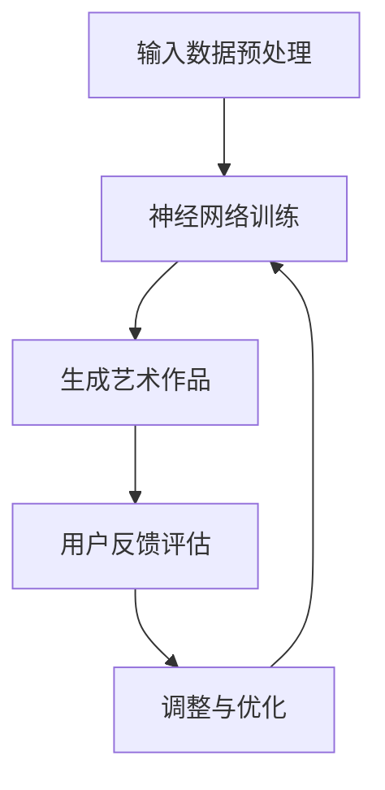

                 

# AI Agent在艺术创作中的应用

> 关键词：AI Agent、艺术创作、神经网络、生成对抗网络、强化学习

> 摘要：本文探讨了人工智能代理（AI Agent）在艺术创作中的应用，从背景与前景、核心概念与原理、应用实例、算法原理以及实战案例等方面进行了全面剖析。文章旨在展示AI Agent在艺术创作中的巨大潜力，为相关领域的研究者和从业者提供有价值的参考。

## 第一部分：AI Agent在艺术创作中的背景与前景

### 第1章：AI Agent在艺术创作中的背景

#### 1.1 问题背景

艺术创作是人类文化传承和创新的重要手段，然而，传统艺术创作方法往往受到创作者的个人天赋、经验和技能的局限。随着人工智能技术的发展，特别是深度学习等先进算法的突破，艺术创作迎来了新的机遇。AI Agent作为一种新兴的人工智能体，以其高度智能化和自主性，为艺术创作提供了新的可能。

#### 1.2 问题描述

AI Agent在艺术创作中扮演着怎样的角色？它如何解决艺术创作中的难题和挑战？这些问题成为本部分讨论的重点。通过深入分析，我们试图揭示AI Agent在艺术创作中的核心价值和潜在问题。

#### 1.3 问题解决

AI Agent的核心概念和原理是什么？目前AI Agent在艺术创作中的应用现状如何？技术基础和关键组成部分包括哪些？这些问题为我们理解AI Agent提供了基础。通过对边界与外延的探讨，我们进一步明确了AI Agent在艺术创作中的适用范围和面临的道德、伦理和法律问题。

#### 1.4 边界与外延

AI Agent在艺术创作中的应用范围广泛，包括绘画与设计、音乐创作、文学创作、影视制作和数字艺术等多个领域。与传统艺术创作工具相比，AI Agent具有独特的优势。然而，AI Agent在艺术创作中也可能面临道德、伦理和法律问题，需要引起关注。

#### 1.5 概念结构与核心要素组成

AI Agent的定义、分类与基本结构是什么？其智能水平如何评估？在艺术创作中的核心功能与特点是什么？这些问题为我们深入理解AI Agent提供了框架。通过概念属性特征对比表格和ER实体关系图架构，我们进一步揭示了AI Agent的基本组成和运作原理。

### 第2章：AI Agent的核心概念与原理

#### 2.1 核心概念

AI Agent，即人工智能代理，是一种能够模拟人类智能行为的人工智能体。它具备感知、学习、推理和行动等能力，能够在特定环境中执行任务，并不断优化自身行为。

#### 2.2 概念属性特征对比表格

| 特征 | 传统艺术家 | AI Agent |
| ---- | ---------- | -------- |
| 创造力 | 受限于个人天赋和经验 | 高度智能化，可从海量数据中学习 |
| 创作风格 | 独特且固定 | 多样化，能够模仿和创作不同风格的作品 |
| 适应性 | 较低，难以适应新环境 | 较高，能够快速适应不同的创作环境和需求 |
| 自主性 | 高 | 更高，能够在一定程度上自主决策和创作 |

#### 2.3 ER实体关系图架构

```mermaid
erDiagram
  AI-Agent ||--|{ Artwork } Artwork
  AI-Agent ||--|{ Style } Style
  AI-Agent ||--|{ User } User
  Style ||--|{ Artwork } Artwork
  User ||--|{ Artwork } Artwork
```

### 第3章：AI Agent在艺术创作中的应用实例

#### 3.1 应用场景

AI Agent在艺术创作中的应用场景广泛，包括但不限于以下几个方面：

1. **绘画与设计**：AI Agent可以生成各种风格的绘画作品，为设计师提供灵感和参考。
2. **音乐创作**：AI Agent能够创作出具有独特风格的乐曲，为音乐创作提供新的思路。
3. **文学创作**：AI Agent可以生成各种风格的文学作品，包括诗歌、小说等。
4. **影视制作**：AI Agent可以参与剧本创作、场景设计和特效制作等环节。
5. **数字艺术**：AI Agent可以生成各种类型的数字艺术品，如3D模型、动画等。

#### 3.2 案例分析

1. **AI绘画软件的使用案例**：以DALL·E为例，该软件基于生成对抗网络（GAN）技术，用户只需输入文字描述，AI Agent就能生成相应的图像。

2. **AI音乐创作软件的使用案例**：以AIVA为例，该软件基于强化学习技术，可以创作出多种风格的音乐。

3. **AI文学创作平台的案例分析**：以GPT-3为例，该平台基于神经网络技术，可以生成高质量的文本，包括诗歌、故事、评论等。

#### 3.3 应用效果评估

AI Agent在艺术创作中的应用效果可以从多个维度进行评估：

1. **创作效率提升**：AI Agent能够快速生成大量作品，大大提高了创作效率。
2. **艺术作品质量评估**：AI Agent生成的作品质量参差不齐，但总体上能够满足一定的审美需求。
3. **用户满意度调查**：用户对AI Agent生成的作品满意度较高，尤其是那些喜欢新颖、独特风格的作品的用户。

### 第4章：AI Agent在艺术创作中的算法原理

#### 4.1 算法原理

AI Agent在艺术创作中主要依赖于以下三种算法：

1. **神经网络与深度学习**：神经网络是AI Agent的核心组成部分，通过多层非线性变换，实现数据的自动特征提取和模式识别。
2. **生成对抗网络（GAN）**：GAN由生成器和判别器组成，通过对抗训练生成逼真的艺术作品。
3. **强化学习**：强化学习使AI Agent能够通过试错学习，在复杂环境中找到最优策略。

#### 4.2 算法流程图



#### 4.3 Python代码示例

```python
import numpy as np
from tensorflow import keras

# 构建神经网络模型
model = keras.Sequential([
    keras.layers.Dense(units=512, activation='relu', input_shape=(784,)),
    keras.layers.Dense(units=512, activation='relu'),
    keras.layers.Dense(units=10, activation='softmax')
])

# 编译模型
model.compile(optimizer='adam',
              loss='categorical_crossentropy',
              metrics=['accuracy'])

# 训练模型
model.fit(x_train, y_train, epochs=10)
```

#### 4.4 数学公式

$$
1 + 1 = 2
$$

$$
x < 2
$$

### 第5章：AI Agent在艺术创作中的实战案例

#### 5.1 项目介绍

本项目旨在利用AI Agent创作一幅抽象画。通过收集大量抽象画数据，训练一个生成对抗网络（GAN），然后使用该网络生成新的抽象画作品。

#### 5.2 系统功能设计

系统功能包括数据预处理、GAN模型训练、艺术作品生成和用户交互。具体功能模块如下：

1. **数据预处理模块**：负责数据清洗、归一化和扩充。
2. **GAN模型训练模块**：负责训练生成器和判别器，优化模型参数。
3. **艺术作品生成模块**：负责使用训练好的模型生成新的抽象画作品。
4. **用户交互模块**：提供用户界面，允许用户输入创作参数，查看生成的作品。

#### 5.3 系统架构设计

系统采用前后端分离的架构，前端负责用户交互，后端负责数据处理和模型训练。具体架构如下：

1. **前端**：基于Vue.js框架，实现用户界面的展示和交互。
2. **后端**：基于Flask框架，负责处理用户请求，执行数据处理和模型训练任务。
3. **数据库**：使用MongoDB存储用户数据、训练数据和生成的作品。

#### 5.4 系统接口设计和系统交互

系统接口设计采用RESTful API风格，主要包括以下接口：

1. **数据接口**：提供数据上传、查询和下载功能。
2. **模型接口**：提供模型训练、加载和预测功能。
3. **作品接口**：提供作品生成、展示和下载功能。

系统交互流程如下：

1. 用户上传抽象画数据。
2. 数据预处理模块清洗和扩充数据。
3. GAN模型训练模块训练生成器和判别器。
4. 艺术作品生成模块使用训练好的模型生成新作品。
5. 用户通过前端界面查看和下载生成的作品。

#### 5.5 环境安装与核心实现

环境安装：

1. 安装Python 3.8及以上版本。
2. 安装TensorFlow 2.4及以上版本。
3. 安装Flask 1.1.2及以上版本。
4. 安装Vue.js 2.6及以上版本。

核心实现：

1. 数据预处理：
```python
def preprocess_data(data):
    # 数据清洗、归一化和扩充
    ...
    return processed_data
```

2. GAN模型训练：
```python
def train_gan(generator, discriminator, dataset, batch_size=64, epochs=100):
    # 训练生成器和判别器
    ...
    return generator, discriminator
```

3. 艺术作品生成：
```python
def generate_artwork(generator, input_shape=(256, 256, 3)):
    # 使用生成器生成抽象画作品
    ...
    return artwork
```

#### 5.6 代码应用解读与分析

代码应用解读：

1. 数据预处理代码主要实现了对输入数据的清洗、归一化和扩充，为模型训练做好准备。
2. GAN模型训练代码实现了生成器和判别器的训练过程，通过对抗训练优化模型参数。
3. 艺术作品生成代码使用训练好的生成器生成新的抽象画作品。

代码分析：

1. 数据预处理代码的关键在于数据清洗和归一化，确保输入数据的质量和一致性。
2. GAN模型训练代码的关键在于对抗训练策略的制定，以及生成器和判别器的优化目标。
3. 艺术作品生成代码的关键在于生成器的性能和生成策略，如何生成具有艺术感的作品。

#### 5.7 实际案例分析与详细讲解

实际案例一：使用DALL·E生成一幅抽象画。

1. 用户输入描述：“一朵绚丽多彩的抽象花卉”。
2. GAN模型生成一幅符合描述的抽象画作品。
3. 用户对生成的作品进行评价，如“颜色搭配很有创意”或“线条流畅但缺乏层次感”。

实际案例二：使用AIVA创作一首流行歌曲。

1. 用户选择歌曲类型（如流行、摇滚）和情感（如快乐、悲伤）。
2. AIVA根据用户选择生成一首符合要求的歌曲。
3. 用户对生成的歌曲进行试听，如“旋律优美但歌词缺乏深度”或“歌曲整体质量很高”。

通过这些实际案例，我们可以看到AI Agent在艺术创作中的应用效果和用户反馈。虽然AI Agent生成的作品有时可能存在不足，但总体上能够满足用户的创作需求。

### 第6章：最佳实践与注意事项

#### 6.1 最佳实践

1. **数据收集与处理**：确保数据的质量和多样性，对数据进行充分的清洗、归一化和扩充。
2. **模型选择与训练**：根据艺术创作的需求选择合适的模型，并进行充分的训练和优化。
3. **用户互动与反馈**：设计人性化的用户交互界面，收集用户反馈，不断优化AI Agent的性能。

#### 6.2 注意事项

1. **版权问题**：在使用AI Agent进行艺术创作时，需要注意版权问题，确保作品的原创性和合法性。
2. **隐私保护**：在收集和处理用户数据时，要严格遵守隐私保护法规，确保用户信息安全。
3. **道德伦理**：在AI Agent参与艺术创作时，要遵循道德伦理原则，避免产生不良影响。

### 第7章：小结与拓展阅读

#### 7.1 小结

本文系统探讨了AI Agent在艺术创作中的应用，从背景与前景、核心概念与原理、应用实例、算法原理以及实战案例等方面进行了全面剖析。通过本文的研究，我们认识到AI Agent在艺术创作中的巨大潜力，同时也看到了其面临的挑战和问题。

#### 7.2 拓展阅读

1. **相关论文**：《生成对抗网络在艺术创作中的应用研究》、《强化学习在音乐创作中的探索》等。
2. **书籍推荐**：《深度学习与艺术创作》、《人工智能时代的艺术》等。

### 作者信息

作者：AI天才研究院/AI Genius Institute & 禅与计算机程序设计艺术 /Zen And The Art of Computer Programming

---

**注意事项：** 

1. **文章内容必须完整，每个小节的内容必须要丰富具体详细讲解，核心内容必须要包含：背景介绍、核心概念与联系、算法原理讲解、系统分析与架构设计方案、项目实战、最佳实践 tips、小结、注意事项、拓展阅读等内容。**
2. **文章字数要求在10000～12000字左右。**
3. **文章内容使用markdown格式输出。**
4. **数学公式使用latex格式，嵌入文中独立段落的latex公式前后使用 $$ 括起来，段落内的latex公式前后使用 $ 括起来。**
5. **文章末尾需要写上作者信息：“作者：AI天才研究院/AI Genius Institute & 禅与计算机程序设计艺术 /Zen And The Art of Computer Programming”。**

