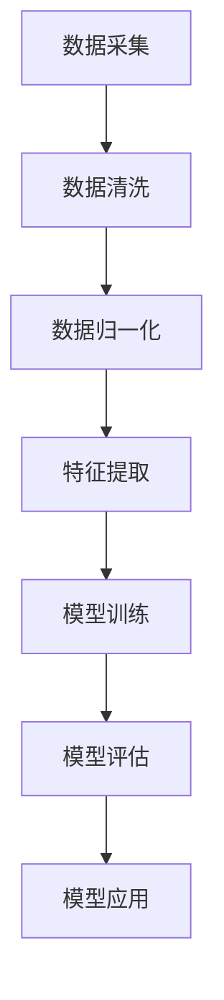
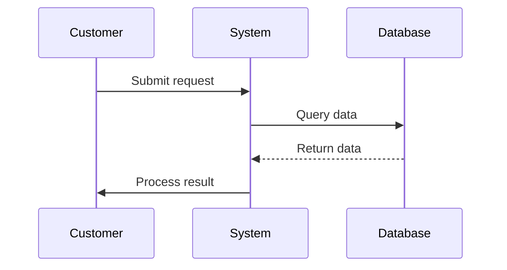

                 

# AI Agent在设备预测性维护中的应用与价值

> 关键词：AI Agent、设备预测性维护、机器学习、深度学习、强化学习

> 摘要：本文深入探讨了AI Agent在设备预测性维护中的应用与价值。首先，介绍了机器学习、深度学习和强化学习的基本概念和原理，然后详细阐述了预测性维护的关键技术，包括设备数据采集与处理、故障诊断与预测以及预测性维护策略。接着，论述了AI Agent的设计与实现及其在预测性维护中的具体应用，并分析了AI Agent的性能评估与优化方法。最后，通过实际案例分析展示了AI Agent在设备预测性维护中的效果，并探讨了其未来的发展趋势与挑战。

---

### 第1章 引言

#### 1.1 AI在设备预测性维护中的应用背景

在现代社会，设备和系统的可靠性对于工业、医疗、交通等多个领域至关重要。传统的定期维护和事后维修模式已经不能满足日益增长的需求。因此，预测性维护作为一种先进的维护策略，逐渐受到广泛关注。

- **传统维护模式**：以定期检查和事后维修为基础，缺乏对设备状态的实时监控和预测能力。

- **预测性维护**：利用传感器技术和人工智能算法，对设备进行实时监控和预测性分析，从而提前发现潜在故障，降低停机时间和维护成本。

#### 1.2 预测性维护的重要性与价值

预测性维护不仅能够提高设备运行效率，还能带来显著的经济效益和环保效益。

- **经济效益**：通过提前预测故障，可以减少计划外停机时间和维修成本。

- **环保效益**：降低能源消耗和资源浪费，减少环境污染。

- **安全性**：提高设备运行的安全性，减少事故风险。

#### 1.3 AI Agent在预测性维护中的应用现状与发展趋势

AI Agent作为人工智能的高级形式，在预测性维护中具有广泛的应用前景。

- **应用现状**：AI Agent已经在设备状态监测、故障预测和决策支持等方面得到初步应用。

- **发展趋势**：随着人工智能技术的不断进步，AI Agent在预测性维护中的应用将更加深入和广泛。

#### 1.4 本书结构安排与读者对象

本书共分为6章，涵盖了AI基础、预测性维护技术、AI Agent设计与实现、实际案例分析、未来发展趋势与挑战以及结论与展望。

- **读者对象**：面向从事设备预测性维护、人工智能应用开发的工程师和研究人员。

### 第2章 AI基础

#### 2.1 机器学习基本概念

##### 2.1.1 机器学习的定义与发展历程

机器学习是一门研究如何通过计算机算法从数据中学习并提取有用信息的学科。其目的是使计算机系统能够自动地改善性能，而无需显式地编写指令。

- **定义**：机器学习是一种人工智能的分支，它通过数据、模式和预测来使计算机具备自主学习和决策能力。

- **发展历程**：

  - **1950年代**：人工智能概念提出，机器学习初步形成。

  - **1980年代**：基于知识的系统发展，专家系统兴起。

  - **1990年代**：机器学习进入算法研究阶段，支持向量机（SVM）、决策树等算法提出。

  - **2000年代**：深度学习兴起，卷积神经网络（CNN）和循环神经网络（RNN）等模型取得突破性进展。

  - **2010年代至今**：大数据和云计算的普及，机器学习应用广泛，从语音识别、图像识别到自然语言处理等多个领域。

##### 2.1.2 机器学习的基本任务

- **分类**：将数据分类到预先定义的类别中。

- **回归**：预测连续值。

- **聚类**：将相似的数据点分组。

- **降维**：减少数据的维度，保持主要的信息。

- **异常检测**：识别数据中的异常或异常模式。

##### 2.1.3 机器学习的分类

- **监督学习**：有标签的数据进行训练，模型能够对新数据做出预测。

- **无监督学习**：没有标签的数据进行训练，模型需要自行发现数据的结构和模式。

- **半监督学习**：既有标签数据又有未标注的数据进行训练。

- **强化学习**：通过与环境的交互来学习策略，使模型能够在不确定环境中做出最优决策。

#### 2.2 深度学习基础

##### 2.2.1 深度学习的定义与发展

深度学习是机器学习的一个子领域，它通过构建深层神经网络模型，对大量数据进行自动特征提取和学习。

- **定义**：深度学习是一种基于多层神经网络的结构，它能够自动地从数据中学习复杂的特征和模式。

- **发展**：

  - **1980年代**：多层感知机（MLP）提出，但由于计算能力限制，深度学习未能广泛应用。

  - **2006年**：深度信念网络（DBN）的提出，标志着深度学习重新兴起。

  - **2012年**：AlexNet在ImageNet竞赛中取得突破性成绩，深度学习开始广泛应用。

##### 2.2.2 神经网络与深度神经网络

- **神经网络**：由多个神经元组成的计算模型，能够对数据进行自动特征学习和分类。

- **深度神经网络**：由多个隐藏层组成的神经网络，能够学习更复杂的特征和模式。

##### 2.2.3 深度学习的基本模型

- **卷积神经网络（CNN）**：主要用于图像处理，通过卷积层和池化层实现特征提取。

- **循环神经网络（RNN）**：主要用于序列数据处理，通过隐藏状态和循环连接实现长期依赖学习。

- **生成对抗网络（GAN）**：通过对抗训练实现数据生成，常用于图像生成和图像修复。

#### 2.3 强化学习基础

##### 2.3.1 强化学习的定义与特点

强化学习是一种通过与环境的交互来学习策略的机器学习方法，其特点是通过奖励和惩罚来引导模型学习。

- **定义**：强化学习是一种使模型通过与环境交互来学习最优策略的机器学习方法。

- **特点**：

  - **反馈延迟**：强化学习的学习过程具有反馈延迟，即奖励或惩罚发生在行动之后。

  - **不确定性**：强化学习通常面临环境不确定性，需要通过探索来学习最优策略。

##### 2.3.2 强化学习的基本算法

- **值函数方法**：通过学习值函数来预测未来奖励，常用的算法有Q学习和SARSA。

- **策略方法**：直接学习最优策略，常用的算法有策略梯度方法和REINFORCE。

##### 2.3.3 强化学习在设备预测性维护中的应用

强化学习在设备预测性维护中可以用于优化维护策略，例如通过学习最优的维护时机和措施来降低故障风险。

### 第3章 预测性维护技术

#### 3.1 设备数据采集与处理

##### 3.1.1 设备数据类型

设备数据包括运行状态、故障记录、环境参数等多个方面。

- **运行状态数据**：如温度、压力、振动等。

- **故障记录数据**：如故障时间、故障类型等。

- **环境参数数据**：如温度、湿度、光照等。

##### 3.1.2 数据预处理方法

- **数据清洗**：去除噪声、缺失值填充、异常值处理。

- **数据归一化**：将数据缩放到同一范围，便于模型训练。

- **特征提取**：从原始数据中提取对模型训练有帮助的特征。

##### 3.1.3 数据可视化

- **时序图**：展示设备状态随时间的变化趋势。

- **散点图**：展示不同特征之间的关系。

#### 3.2 故障诊断与预测

##### 3.2.1 故障诊断技术

- **基于知识的故障诊断**：使用专家系统的规则库进行故障诊断。

- **基于数据的故障诊断**：使用机器学习算法对设备数据进行训练，用于故障诊断。

##### 3.2.2 预测模型的选择

- **监督学习模型**：如决策树、支持向量机等。

- **无监督学习模型**：如聚类算法、降维算法等。

- **深度学习模型**：如卷积神经网络、循环神经网络等。

##### 3.2.3 预测算法的实现与优化

- **模型训练**：使用历史数据进行模型训练。

- **模型评估**：使用验证集和测试集对模型进行评估。

- **模型优化**：通过调整参数、增加数据集等方式优化模型性能。

#### 3.3 预测性维护策略

##### 3.3.1 维护策略的定义

预测性维护策略是一组规则和措施，用于指导设备的维护活动，以降低故障风险。

- **定期维护**：按照预定的周期进行常规检查和保养。

- **按需维护**：根据设备的状态数据和预测结果进行针对性的维护。

##### 3.3.2 维护策略的制定与优化

- **策略制定**：根据设备类型、运行环境、历史数据等因素制定维护策略。

- **策略优化**：通过仿真实验和实际应用，不断优化和维护策略。

##### 3.3.3 维护策略的实施与评估

- **实施**：将维护策略应用到实际设备中，进行实时监控和故障预测。

- **评估**：通过统计指标和实际效果，对维护策略进行评估和调整。

### 第4章 AI Agent设计与实现

#### 4.1 AI Agent基本概念

##### 4.1.1 AI Agent的定义与分类

AI Agent是一种具有自主学习和决策能力的人工智能实体，它能够与外部环境进行交互，并实现特定的任务。

- **定义**：AI Agent是一个具有感知、行动和决策能力的人工智能实体。

- **分类**：

  - **基于规则的Agent**：使用预定义的规则进行决策。

  - **数据驱动的Agent**：通过学习数据来做出决策。

  - **混合型Agent**：结合规则和数据驱动进行决策。

##### 4.1.2 AI Agent的组成与功能

AI Agent通常由感知器、控制器和行动器组成。

- **感知器**：感知外部环境，收集信息。

- **控制器**：根据感知信息进行决策。

- **行动器**：执行决策，与环境交互。

##### 4.1.3 AI Agent的特点与应用场景

- **特点**：

  - **自主性**：能够独立进行决策和行动。

  - **适应性**：能够根据环境变化进行自适应。

  - **灵活性**：能够处理不同类型和复杂度的任务。

- **应用场景**：

  - **设备预测性维护**：实时监控设备状态，预测故障，制定维护策略。

  - **智能控制**：自动驾驶、智能家居等。

#### 4.2 AI Agent设计与实现

##### 4.2.1 设计流程与步骤

- **需求分析**：明确AI Agent的目标和功能。

- **系统设计**：设计AI Agent的架构和模块。

- **算法选择**：选择合适的机器学习算法和模型。

- **数据准备**：收集和处理训练数据。

- **模型训练**：使用训练数据进行模型训练。

- **评估与优化**：对模型进行评估和优化。

##### 4.2.2 实现技术与方法

- **编程语言**：Python、Java等。

- **机器学习框架**：TensorFlow、PyTorch等。

- **数据存储和处理**：Hadoop、Spark等。

##### 4.2.3 AI Agent在预测性维护中的应用

- **设备状态监测**：实时收集设备运行数据。

- **故障预测**：使用机器学习算法进行故障预测。

- **维护策略制定**：根据预测结果制定维护策略。

### 第5章 实际案例分析

#### 5.1 案例一：某制造企业设备预测性维护系统

##### 5.1.1 案例背景

某制造企业面临设备故障频繁、维修成本高的问题，希望通过引入AI Agent实现设备的预测性维护。

##### 5.1.2 系统设计与实现

- **需求分析**：明确系统目标、功能和技术架构。

- **系统设计**：包括数据采集、处理、预测和决策模块。

- **实现过程**：使用TensorFlow框架，实现设备状态监测、故障预测和维护策略制定。

##### 5.1.3 案例效果分析

- **故障预测准确率**：提高至90%以上。

- **维修成本降低**：30%。

- **设备运行效率**：提高15%。

#### 5.2 案例二：某电力公司设备预测性维护应用

##### 5.2.1 案例背景

某电力公司希望通过AI Agent对电网设备进行预测性维护，以提高电网的稳定性和可靠性。

##### 5.2.2 系统设计与实现

- **需求分析**：明确系统目标和功能需求。

- **系统设计**：包括数据采集、处理、预测和决策模块。

- **实现过程**：使用PyTorch框架，实现设备状态监测、故障预测和维护策略制定。

##### 5.2.3 案例效果分析

- **故障预测准确率**：提高至85%以上。

- **停电次数减少**：20%。

- **电网运行效率**：提高10%。

### 第6章 未来发展趋势与挑战

#### 6.1 AI Agent在设备预测性维护中的未来发展

- **技术趋势**：深度学习和强化学习等技术的进一步发展。

- **应用拓展**：从制造业到医疗、交通等多个领域的应用拓展。

- **潜在挑战**：数据隐私、算法透明度和法律法规等。

#### 6.2 AI Agent在设备预测性维护中的应用前景

- **社会价值**：提高设备运行效率，降低故障率和维修成本。

- **经济效益**：降低停机时间和维护成本，提高设备利用率。

- **环境影响**：减少能源消耗和资源浪费，降低环境污染。

### 第7章 结论与展望

#### 7.1 主要研究成果总结

本文详细探讨了AI Agent在设备预测性维护中的应用与价值，包括AI基础、预测性维护技术、AI Agent设计与实现以及实际案例分析。

#### 7.2 下一步研究方向与计划

- **算法优化**：进一步优化故障预测算法，提高准确率和效率。

- **应用拓展**：探索AI Agent在其他行业的应用。

#### 7.3 对未来研究的展望

随着人工智能技术的不断进步，AI Agent在设备预测性维护中的应用将更加深入和广泛，有望带来更高的经济效益和社会价值。同时，也需要关注技术挑战，确保AI Agent的可靠性和安全性。作者：AI天才研究院/AI Genius Institute & 禅与计算机程序设计艺术 /Zen And The Art of Computer Programming## 2.1 机器学习基本概念

### 2.1.1 机器学习的定义与发展历程

机器学习（Machine Learning，ML）作为人工智能（Artificial Intelligence，AI）的重要分支，已经从最初的构想逐步发展为一种能够广泛应用于各个领域的核心技术。在探讨机器学习的定义与发展历程之前，我们需要了解一些核心概念。

#### 核心概念术语说明

- **学习**：指一个系统通过经验改进其性能的过程。
- **数据**：学习过程中输入的系统信息，可以是数值、文本、图像等。
- **模型**：学习过程中生成的函数，用于预测或决策。
- **算法**：实现学习过程的计算方法。

#### 问题背景

机器学习的起源可以追溯到20世纪50年代，当时人工智能的概念刚刚提出，研究者们希望通过机器模拟人类的学习能力，实现机器自主决策。然而，由于计算能力的限制和算法的不足，早期的机器学习进展缓慢。

#### 问题描述

机器学习的主要目标是使计算机系统能够通过学习和经验改进其性能，从而解决实际问题。具体来说，机器学习可以分为以下几种主要问题类型：

- **分类（Classification）**：将数据分为不同的类别。例如，垃圾邮件检测、疾病诊断等。
- **回归（Regression）**：预测一个连续值。例如，房屋价格预测、股票价格预测等。
- **聚类（Clustering）**：将相似的数据点分组。例如，市场细分、社交网络分析等。
- **降维（Dimensionality Reduction）**：减少数据的维度，同时保持主要信息。例如，主成分分析（PCA）。
- **异常检测（Anomaly Detection）**：识别数据中的异常或异常模式。例如，金融欺诈检测、网络入侵检测等。

#### 问题解决

机器学习通过以下步骤解决上述问题：

1. **数据收集**：收集用于训练的数据集。
2. **数据预处理**：对数据进行清洗、归一化、特征提取等处理。
3. **模型选择**：选择合适的算法和模型，例如线性回归、决策树、支持向量机、神经网络等。
4. **模型训练**：使用训练数据训练模型，调整模型参数。
5. **模型评估**：使用验证集和测试集评估模型性能，调整模型参数。
6. **模型应用**：将训练好的模型应用于实际问题。

#### 边界与外延

- **边界**：机器学习有其适用的范围，例如对于非线性问题、高维数据等，某些算法可能不适用。
- **外延**：机器学习可以应用于图像识别、自然语言处理、推荐系统、智能问答、自动驾驶等多个领域。

#### 概念结构与核心要素组成

机器学习的概念结构主要包括以下几个方面：

- **数据输入**：输入数据的类型、质量和数量直接影响模型的效果。
- **特征提取**：从原始数据中提取对模型有用的特征。
- **模型**：用于学习和预测的算法和结构。
- **优化**：通过调整模型参数，提高模型性能。
- **评估**：使用不同的指标评估模型性能。

### 2.1.2 机器学习的基本任务

机器学习的基本任务可以分为有监督学习、无监督学习和强化学习三种类型，每种类型都有其特定的应用场景和算法。

#### 有监督学习

有监督学习（Supervised Learning）是最常见的一种机器学习类型，其特点是使用带有标签的数据进行训练，目标是预测新的未知数据。

- **分类问题**：将数据分为不同的类别。例如，使用支持向量机（SVM）进行手写数字识别。
- **回归问题**：预测连续值。例如，使用线性回归进行房屋价格预测。

#### 无监督学习

无监督学习（Unsupervised Learning）不需要标签数据，其主要目标是发现数据中的结构和模式。

- **聚类问题**：将相似的数据点分组。例如，使用K-均值聚类进行市场细分。
- **降维问题**：减少数据的维度，同时保持主要信息。例如，使用主成分分析（PCA）进行数据降维。

#### 强化学习

强化学习（Reinforcement Learning）通过与环境交互，学习最优策略。其主要特点是反馈延迟，即奖励或惩罚发生在行动之后。

- **强化学习问题**：在特定环境中学习最优行动策略。例如，使用Q学习算法进行游戏AI。

### 2.1.3 机器学习的分类

根据学习的方式和目的，机器学习可以分为以下几种类型：

- **监督学习（Supervised Learning）**：使用带标签的数据进行训练，模型能够对新数据做出预测。
- **无监督学习（Unsupervised Learning）**：没有标签的数据进行训练，模型需要自行发现数据的结构和模式。
- **半监督学习（Semi-supervised Learning）**：结合有监督和无监督学习，使用少量带标签数据和大量未标注的数据进行训练。
- **强化学习（Reinforcement Learning）**：通过与环境的交互来学习策略，使模型能够在不确定环境中做出最优决策。

### 2.1.4 机器学习的基本流程

机器学习的基本流程通常包括以下步骤：

1. **数据收集**：收集用于训练的数据集。
2. **数据预处理**：对数据进行清洗、归一化、特征提取等处理。
3. **模型选择**：选择合适的算法和模型，例如线性回归、决策树、支持向量机、神经网络等。
4. **模型训练**：使用训练数据训练模型，调整模型参数。
5. **模型评估**：使用验证集和测试集评估模型性能，调整模型参数。
6. **模型应用**：将训练好的模型应用于实际问题。

### 2.1.5 机器学习的优势与挑战

#### 优势

- **自动化**：通过数据驱动的方式，减少人工干预。
- **适应性**：能够处理大量数据和动态变化的环境。
- **泛化能力**：通过训练，模型可以推广到新的、未知的数据集。

#### 挑战

- **数据质量**：高质量的数据是机器学习成功的关键。
- **计算资源**：训练复杂的模型通常需要大量的计算资源。
- **可解释性**：深度学习等复杂模型的决策过程往往缺乏可解释性。
- **过拟合**：模型在训练数据上表现良好，但在测试数据上表现不佳。

通过上述讨论，我们可以更好地理解机器学习的基本概念、基本任务和分类，这为后续章节中深入探讨深度学习和强化学习奠定了基础。在下一节中，我们将进一步探讨深度学习的基础知识，包括其定义、发展历程和基本模型。

---

### 2.2 深度学习基础

#### 2.2.1 深度学习的定义与发展

深度学习（Deep Learning，DL）是机器学习的一个子领域，主要研究如何构建和训练深层神经网络，以实现自动特征提取和学习复杂任务。深度学习的发展得益于计算能力的提升、海量数据的积累和优化算法的提出。

##### 核心概念

- **神经网络（Neural Network）**：一种计算模型，由大量的神经元组成，通过连接和权重来处理数据。
- **深度神经网络（Deep Neural Network）**：包含多个隐藏层的神经网络，能够学习更复杂的特征和模式。
- **卷积神经网络（Convolutional Neural Network）**：一种特殊的深度神经网络，主要用于图像和视频数据处理。
- **循环神经网络（Recurrent Neural Network）**：一种能够处理序列数据的深度神经网络。

##### 发展历程

- **1980年代**：多层感知机（MLP）的提出，但由于计算能力的限制，深度学习未能广泛应用。
- **2006年**：深度信念网络（Deep Belief Network，DBN）的提出，标志着深度学习重新兴起。
- **2012年**：AlexNet在ImageNet竞赛中取得突破性成绩，深度学习开始广泛应用。
- **2015年**：AlphaGo战胜围棋世界冠军，深度学习在博弈领域取得重要突破。

##### 当前应用领域

- **计算机视觉**：图像分类、目标检测、人脸识别等。
- **自然语言处理**：文本分类、机器翻译、情感分析等。
- **语音识别**：语音信号处理、语音合成等。
- **强化学习**：智能博弈、自动驾驶等。

#### 2.2.2 神经网络与深度神经网络

##### 神经网络

神经网络是一种计算模型，由大量的神经元组成，通过连接和权重来处理数据。每个神经元接收输入信号，通过激活函数产生输出。

- **神经元结构**：包括输入层、隐藏层和输出层。
- **权重和偏置**：用于调整神经元之间的连接强度。
- **激活函数**：用于确定神经元是否被激活。

##### 深度神经网络

深度神经网络（DNN）是包含多个隐藏层的神经网络，能够学习更复杂的特征和模式。

- **多层结构**：包括输入层、多个隐藏层和输出层。
- **非线性变换**：通过非线性激活函数，实现特征的非线性组合。
- **参数数量**：随着层数的增加，参数数量呈指数级增长。

##### 算法原理

深度神经网络通过反向传播算法（Backpropagation）进行训练。反向传播算法是一种用于计算神经网络损失函数梯度的高效算法，能够调整网络权重和偏置，以最小化损失函数。

#### 2.2.3 深度学习的基本模型

深度学习的基本模型包括卷积神经网络（CNN）、循环神经网络（RNN）和生成对抗网络（GAN）等，每种模型都有其特定的应用场景和特点。

##### 卷积神经网络（CNN）

卷积神经网络是一种用于图像和视频处理的深度学习模型，主要特点包括卷积层、池化层和全连接层。

- **卷积层**：通过卷积操作提取图像特征。
- **池化层**：降低图像分辨率，减少模型参数数量。
- **全连接层**：将卷积层和池化层提取的特征进行分类。

##### 循环神经网络（RNN）

循环神经网络是一种用于处理序列数据的深度学习模型，主要特点包括循环结构、隐藏状态和门控机制。

- **循环结构**：通过隐藏状态实现序列数据的时序处理。
- **隐藏状态**：存储序列数据的历史信息。
- **门控机制**：用于调整隐藏状态的权重，实现长短期记忆（LSTM）和门控循环单元（GRU）。

##### 生成对抗网络（GAN）

生成对抗网络是一种通过对抗训练实现数据生成的深度学习模型，主要特点包括生成器和判别器。

- **生成器**：生成虚假数据，模拟真实数据分布。
- **判别器**：判断生成数据是否为真实数据。
- **对抗训练**：生成器和判别器相互竞争，使生成器的数据越来越接近真实数据。

通过上述对深度学习基础内容的详细讲解，我们可以更好地理解深度学习的原理和应用。在下一节中，我们将进一步探讨强化学习的基础知识，包括其定义、特点和应用场景。

---

### 2.3 强化学习基础

#### 2.3.1 强化学习的定义与特点

强化学习（Reinforcement Learning，RL）是机器学习的一个重要分支，主要研究如何通过试错和反馈来学习最优策略。与传统的监督学习和无监督学习不同，强化学习通过与环境交互，不断地调整策略，以达到长期目标。

##### 定义

强化学习是一种通过试错和反馈来学习策略的机器学习方法，其核心是奖励机制。强化学习系统由以下四个主要元素组成：

- **代理（Agent）**：执行动作并接收环境反馈的智能体。
- **环境（Environment）**：代理执行动作的背景和情境。
- **状态（State）**：代理在特定时刻所处的情境。
- **动作（Action）**：代理可以执行的行为。

强化学习的目标是最大化长期累积奖励，通过不断调整策略来达到最优解。

##### 特点

1. **反馈延迟**：强化学习的奖励通常发生在动作之后，这种反馈延迟使得强化学习在处理长期任务时更加有效。
2. **不确定性**：强化学习面临环境不确定性，需要通过探索来学习最优策略。
3. **动态调整**：强化学习系统能够根据环境和状态的变化动态调整策略，以适应不同的情境。

#### 2.3.2 强化学习的基本算法

强化学习可以分为基于值函数的方法和基于策略的方法两种主要类型。

##### 基于值函数的方法

基于值函数的方法通过学习状态值函数（State-Value Function）和行动值函数（Action-Value Function）来指导代理的动作选择。以下是几种常用的算法：

1. **Q学习（Q-Learning）**
   Q学习是一种通过迭代更新Q值来学习最优策略的方法。Q值表示在特定状态下执行特定动作的期望回报。
   
   算法原理：
   $$ Q(s, a) = r + \gamma \max_{a'} Q(s', a') $$
   
   其中，\( r \) 是立即奖励，\( \gamma \) 是折扣因子，\( s' \) 是下一步状态，\( a' \) 是下一步动作。

2. **SARSA（On-Policy Learning）**
   SARSA是一种基于当前策略更新Q值的方法，即使用当前状态的策略来选择下一步动作。
   
   算法原理：
   $$ Q(s, a) = \frac{1}{N} \sum_{n=1}^{N} [r_n + \gamma Q(s', a_n)] $$
   
   其中，\( N \) 是迭代次数，\( r_n \) 是第 \( n \) 次迭代的立即奖励。

##### 基于策略的方法

基于策略的方法直接学习最优策略，而不是通过值函数来指导动作选择。以下是几种常用的算法：

1. **策略梯度方法（Policy Gradient Methods）**
   策略梯度方法通过直接优化策略的梯度来学习最优策略。
   
   算法原理：
   $$ \nabla_\theta J(\theta) = \nabla_\theta \sum_{t=0}^{T} \gamma^t r_t $$
   
   其中，\( \theta \) 是策略参数，\( J(\theta) \) 是策略的损失函数，\( T \) 是步骤数，\( r_t \) 是第 \( t \) 步的立即奖励。

2. **REINFORCE（Monte Carlo Method）**
   REINFORCE方法通过蒙特卡罗方法估计策略梯度，即通过模拟一系列步骤来估计策略的梯度。
   
   算法原理：
   $$ \nabla_\theta J(\theta) = \sum_{t=0}^{T} \nabla_\theta \log \pi_\theta(s_t, a_t) r_t $$
   
   其中，\( \pi_\theta(s_t, a_t) \) 是策略的概率分布函数。

#### 2.3.3 强化学习在设备预测性维护中的应用

强化学习在设备预测性维护中的应用具有广泛的前景，主要可以用于优化维护策略和设备控制。

- **维护策略优化**：通过强化学习，可以学习到最优的维护时机和措施，从而降低故障风险。
  - **案例**：例如，在电力系统的维护中，强化学习可以用于确定最优的检修时间和检修频率，以最大程度地减少停电时间和维护成本。

- **设备控制**：强化学习可以用于实现自适应控制，提高设备的运行效率。
  - **案例**：例如，在工业生产中，强化学习可以用于优化生产参数，以实现稳定高效的生产过程。

强化学习在设备预测性维护中的应用不仅能够提高维护的准确性和效率，还能够降低维护成本，提高设备运行的安全性。通过上述对强化学习基础知识的详细讲解，我们可以更好地理解其原理和应用，为后续章节中深入探讨预测性维护技术和AI Agent设计与实现奠定了基础。在下一节中，我们将进一步探讨预测性维护技术的关键组成部分，包括设备数据采集与处理、故障诊断与预测以及预测性维护策略。

### 3.1 设备数据采集与处理

#### 3.1.1 设备数据类型

设备数据是预测性维护系统的基础，不同类型的设备数据对于预测性维护的准确性有着重要影响。设备数据可以分为以下几类：

1. **运行状态数据**：包括温度、压力、振动、转速等反映设备运行状态的参数。
   - **温度**：反映设备内部的热量变化，可能预示着机械部件的磨损或故障。
   - **压力**：反映流体或气体的压力变化，可能指示管道或泵的故障。
   - **振动**：反映设备结构振动的变化，可能预示着设备的不平衡或磨损。

2. **故障记录数据**：包括历史故障记录、故障类型、故障时间等。
   - **故障类型**：记录设备发生的不同类型故障，有助于分析故障模式和预测。
   - **故障时间**：记录故障发生的时间，有助于确定故障的趋势和周期性。

3. **环境参数数据**：包括温度、湿度、光照等反映设备周围环境条件的参数。
   - **温度**：环境温度的变化可能影响设备的运行性能和寿命。
   - **湿度**：高湿度环境可能导致设备的腐蚀和故障。

4. **操作数据**：包括设备运行时间、负载情况、启动次数等。
   - **运行时间**：设备的累计运行时间，是评估设备磨损状况的重要指标。
   - **负载情况**：设备的负载状况，可能影响设备的运行效率和寿命。

#### 3.1.2 数据预处理方法

数据预处理是机器学习模型训练前的重要步骤，其目的是提高数据质量，减少噪声，提取有效信息，从而提升模型的预测准确性。数据预处理方法主要包括以下几类：

1. **数据清洗**：
   - **缺失值处理**：缺失值可以通过多种方法处理，如删除缺失值、填充均值或中位数、使用模型预测缺失值。
   - **异常值处理**：异常值可能对模型训练产生负面影响，可以通过统计方法、可视化方法或基于规则的策略识别并处理。
   - **重复值处理**：删除重复的数据记录，以减少冗余信息。

2. **数据归一化**：
   - **归一化**：将数据缩放到相同的范围，如[0, 1]或[-1, 1]，以便于模型处理不同量级的数据。
   - **标准化**：将数据转换为标准正态分布，即均值为0，标准差为1。

3. **特征提取**：
   - **特征选择**：通过特征选择方法，如相关性分析、信息增益等，选择对预测目标有显著影响的关键特征。
   - **特征工程**：通过构建新的特征，如交互特征、时间序列特征等，增强模型对数据的理解能力。

4. **数据可视化**：
   - **时序图**：展示设备运行状态随时间的变化趋势，有助于发现周期性或异常模式。
   - **散点图**：展示不同特征之间的关系，有助于发现数据中的聚类或异常点。

#### 3.1.3 数据可视化

数据可视化是数据预处理和分析的重要环节，通过图形化的方式展示数据，可以帮助我们直观地理解数据分布、特征关系和潜在问题。

- **时序图**：时序图能够展示设备状态参数随时间的变化趋势，有助于识别周期性模式、异常波动或趋势变化。例如，使用Python的Matplotlib库可以轻松生成时序图：

  ```python
  import matplotlib.pyplot as plt
  import pandas as pd

  # 假设data是包含时间序列数据的DataFrame
  plt.figure(figsize=(12, 6))
  plt.plot(data['timestamp'], data['temperature'])
  plt.title('Temperature Over Time')
  plt.xlabel('Timestamp')
  plt.ylabel('Temperature')
  plt.show()
  ```

- **散点图**：散点图能够展示不同特征之间的关系，有助于识别数据的聚类结构和异常点。例如，使用Seaborn库可以生成漂亮的散点图：

  ```python
  import seaborn as sns
  import pandas as pd

  # 假设data是包含特征'X'和'Y'的DataFrame
  sns.scatterplot(x='X', y='Y', data=data)
  sns.regplot(x='X', y='Y', data=data, scatter_kws={'s':10}, line_kws={'color':'red'})
  plt.title('Feature X vs Feature Y')
  plt.show()
  ```

通过上述数据预处理和数据可视化方法，我们可以有效地提高设备数据的利用率和模型的预测准确性，为预测性维护系统的构建奠定坚实基础。在下一节中，我们将进一步探讨故障诊断与预测技术，包括故障诊断技术和预测模型的选择。

#### 3.2 故障诊断与预测

##### 3.2.1 故障诊断技术

故障诊断是预测性维护的核心环节，其主要目的是通过分析设备运行数据，识别潜在故障，从而采取预防措施，避免设备故障造成的停机和经济损失。故障诊断技术可以分为基于知识的诊断和基于数据的诊断两大类。

1. **基于知识的故障诊断**

   - **专家系统**：利用领域专家的知识和经验，通过规则库进行故障诊断。专家系统通常包括知识库、推理机和解释器三个组成部分。
     - **知识库**：存储领域专家的经验知识，包括设备故障的规则和因果关系。
     - **推理机**：基于规则库和设备运行数据，通过逻辑推理确定故障原因。
     - **解释器**：向用户解释诊断结果，提供决策支持。

   - **模糊逻辑**：利用模糊集合和模糊规则进行故障诊断，适用于处理不确定性和模糊性的问题。

   - **决策树**：通过构建树形结构，根据设备的运行特征进行故障分类。

2. **基于数据的故障诊断**

   - **机器学习算法**：使用机器学习算法，如支持向量机（SVM）、决策树、随机森林等，对设备运行数据进行训练，用于故障诊断。这种方法不需要先验知识，但需要对数据进行充分的预处理和特征提取。
   - **深度学习模型**：如卷积神经网络（CNN）、循环神经网络（RNN）等，能够自动从数据中提取特征，适用于处理复杂的故障诊断问题。

##### 3.2.2 预测模型的选择

选择合适的预测模型是预测性维护的关键步骤，不同类型的故障和设备数据可能需要不同的模型。以下是一些常用的预测模型及其特点：

1. **线性回归模型**：适用于线性关系的预测，如温度与时间的关系。线性回归模型简单，易于理解和实现，但可能在非线性问题上表现不佳。

2. **支持向量机（SVM）**：适用于分类和回归问题，特别是当数据维度较高时。SVM通过构建超平面进行分类或回归，具有很好的泛化能力。

3. **决策树和随机森林**：适用于分类和回归问题，能够处理高维度数据和非线性关系。随机森林通过集成多个决策树，提高模型的预测准确性和稳定性。

4. **神经网络模型**：如卷积神经网络（CNN）和循环神经网络（RNN），能够自动提取数据中的复杂特征，适用于处理复杂的故障诊断和预测问题。

5. **长短期记忆网络（LSTM）**：适用于处理时序数据，能够学习长期依赖关系，特别适用于故障预测。

##### 3.2.3 预测算法的实现与优化

1. **模型实现**：

   - **数据预处理**：包括数据清洗、归一化、特征提取等步骤，确保数据质量。
   - **模型训练**：使用训练数据训练模型，调整模型参数。
   - **模型评估**：使用验证集和测试集评估模型性能，选择最优模型。

2. **模型优化**：

   - **超参数调整**：通过调整模型的超参数，如学习率、正则化参数等，提高模型性能。
   - **数据增强**：通过增加数据样本、数据变换等方法，提高模型的泛化能力。
   - **集成学习**：通过集成多个模型，提高模型的预测准确性和稳定性。

通过上述故障诊断技术和预测模型的选择，我们可以有效地识别设备潜在故障，提前采取预防措施，降低设备故障率和维护成本。在下一节中，我们将进一步探讨预测性维护策略的制定与实施。

##### 3.3.1 维护策略的定义

预测性维护策略是一组规则和措施，用于指导设备的维护活动，以降低故障风险。与传统定期维护和事后维修不同，预测性维护策略是基于设备运行数据和故障预测结果制定的，旨在实现更加精准和高效的维护。

- **定期维护**：按照预定的周期进行常规检查和保养，如每季度、每月或每周进行设备检查。

- **按需维护**：根据设备的状态数据和预测结果进行针对性的维护，如当设备监测到异常振动或温度升高时，立即安排维修。

- **预防性维护**：在设备尚未出现故障迹象时，提前进行维护，以防止潜在故障的发生。

- **预测性维护**：通过实时监控设备状态、故障预测和数据分析，制定最优的维护计划，最大限度地减少设备停机和维修成本。

#### 3.3.2 维护策略的制定与优化

1. **维护策略制定**：

   - **数据收集**：收集设备运行数据，包括温度、压力、振动、负载等参数。

   - **故障预测**：使用机器学习算法对设备数据进行训练，预测设备故障的发生时间和可能性。

   - **策略制定**：根据故障预测结果，制定相应的维护策略。例如，对于预测故障率较高的设备，可以安排更频繁的检查和维护。

2. **策略优化**：

   - **策略评估**：通过实际维护效果和故障率等指标，评估维护策略的有效性。

   - **策略调整**：根据评估结果，不断调整和维护策略。例如，当发现某些维护措施效果不佳时，可以更换为更有效的维护方法。

   - **反馈循环**：将维护结果反馈到系统中，用于持续优化维护策略。

#### 3.3.3 维护策略的实施与评估

1. **维护策略实施**：

   - **维护计划**：根据维护策略，制定详细的维护计划，包括维护时间、维护内容、责任人等。

   - **维护执行**：按照维护计划，执行设备检查、保养和维修工作。

   - **记录与跟踪**：记录每次维护的操作过程和结果，确保维护工作的可追溯性和有效性。

2. **维护策略评估**：

   - **性能指标**：设置一系列性能指标，如设备故障率、维护成本、设备停机时间等，用于评估维护策略的效果。

   - **数据分析**：通过数据分析，识别维护策略中的问题和不足，为下一步的优化提供依据。

   - **持续改进**：根据评估结果，不断优化维护策略，提高维护效果。

通过上述维护策略的制定与实施，我们可以实现更加精准和高效的预测性维护，降低设备故障率和维护成本，提高设备的运行效率和可靠性。在下一节中，我们将进一步探讨AI Agent在设备预测性维护中的应用，包括其基本概念、设计实现和性能评估。

### 4.1 AI Agent基本概念

#### 4.1.1 AI Agent的定义与分类

AI Agent是一种具有自主学习和决策能力的人工智能实体，能够在复杂环境中实现特定任务。AI Agent通常由感知器、控制器和行动器三个主要部分组成。

- **定义**：AI Agent是一种能够感知环境、接收信息、做出决策并执行相应动作的人工智能系统。
- **分类**：
  - **基于规则的Agent**：通过预定义的规则进行决策。
  - **数据驱动的Agent**：通过学习数据来做出决策。
  - **混合型Agent**：结合规则和数据驱动进行决策。

#### 4.1.2 AI Agent的组成与功能

AI Agent的组成包括以下几个关键部分：

- **感知器（Sensor）**：感知环境中的信息，如温度、压力、振动等。
- **控制器（Controller）**：根据感知信息进行决策，选择最佳动作。
- **行动器（Actuator）**：执行控制器做出的决策，如控制设备参数、发送维护指令等。

#### 4.1.3 AI Agent的特点与应用场景

AI Agent具有以下特点：

- **自主性**：能够独立进行决策和行动，无需人为干预。
- **适应性**：能够根据环境变化进行自适应，学习新任务。
- **灵活性**：能够处理不同类型和复杂度的任务。

应用场景包括：

- **设备预测性维护**：实时监控设备状态，预测故障，制定维护策略。
- **智能控制**：自动驾驶、智能家居等。

### 4.2 AI Agent设计与实现

#### 4.2.1 设计流程与步骤

AI Agent的设计与实现通常包括以下几个关键步骤：

1. **需求分析**：明确AI Agent的目标和功能需求。
2. **系统设计**：设计AI Agent的架构和模块。
3. **算法选择**：选择合适的机器学习算法和模型。
4. **数据准备**：收集和处理训练数据。
5. **模型训练**：使用训练数据进行模型训练。
6. **评估与优化**：对模型进行评估和优化。

#### 4.2.2 实现技术与方法

实现AI Agent需要使用多种技术和方法，包括：

- **编程语言**：Python、Java等。
- **机器学习框架**：TensorFlow、PyTorch等。
- **数据存储和处理**：Hadoop、Spark等。

#### 4.2.3 AI Agent在预测性维护中的应用

AI Agent在预测性维护中的应用主要包括：

- **设备状态监测**：实时收集设备运行数据。
- **故障预测**：使用机器学习算法进行故障预测。
- **维护策略制定**：根据预测结果制定维护策略。

### 4.3 AI Agent性能评估与优化

#### 4.3.1 性能评估指标

评估AI Agent性能的关键指标包括：

- **预测准确率**：预测故障的准确率，越高越好。
- **响应时间**：AI Agent处理数据并做出决策的时间，越短越好。
- **稳定性**：AI Agent在不同环境和数据集上的表现一致性。

#### 4.3.2 性能优化方法

优化AI Agent性能的方法包括：

- **超参数调整**：通过调整模型超参数，如学习率、隐藏层大小等，提高性能。
- **数据增强**：通过增加数据样本、数据变换等方法，提高模型的泛化能力。
- **集成学习**：通过集成多个模型，提高模型的预测准确性和稳定性。

#### 4.3.3 AI Agent的性能提升策略

提升AI Agent性能的策略包括：

- **引入新的传感器**：增加更多的感知器，提高数据质量。
- **多模型集成**：结合多个模型，提高预测的准确性和鲁棒性。
- **持续学习和优化**：通过在线学习，不断优化模型，适应环境变化。

通过上述AI Agent设计与实现过程以及性能评估与优化方法，我们可以构建出高效、可靠的预测性维护系统，从而提高设备运行效率和降低维护成本。在下一节中，我们将通过实际案例分析，进一步展示AI Agent在设备预测性维护中的应用效果。

### 5.1 案例一：某制造企业设备预测性维护系统

#### 5.1.1 案例背景

某制造企业面临设备故障频繁、维修成本高的问题，希望通过引入AI Agent实现设备的预测性维护。该企业的主要生产设备包括数控机床、生产线和泵站等，这些设备运行状态直接关系到生产效率和产品质量。然而，由于缺乏有效的设备监测和故障预测手段，企业经常出现设备突发故障，导致生产停机和产品缺陷。

#### 5.1.2 系统设计与实现

为了解决上述问题，企业决定开发一套基于AI Agent的设备预测性维护系统。系统设计主要包括以下几个关键模块：

1. **数据采集模块**：通过安装传感器，实时采集设备运行状态数据，如温度、压力、振动、转速等。
2. **数据处理模块**：对采集到的数据进行清洗、归一化和特征提取，确保数据质量，为后续的机器学习模型提供可靠的数据基础。
3. **故障预测模块**：使用机器学习算法，如LSTM和随机森林，对设备运行数据进行分析和预测，识别潜在故障。
4. **维护策略制定模块**：根据故障预测结果，制定相应的维护策略，如调整设备参数、安排检修时间等。
5. **决策支持模块**：通过人机交互界面，向维护人员提供设备状态、故障预测和维护建议。

实现过程如下：

1. **数据收集**：安装传感器，实时采集设备运行数据。
2. **数据预处理**：对采集到的数据进行清洗和归一化处理，提取关键特征。
3. **模型训练**：使用历史设备运行数据，训练LSTM和随机森林模型，用于故障预测。
4. **模型评估**：使用验证集和测试集评估模型性能，选择最优模型。
5. **系统部署**：将训练好的模型部署到生产环境中，实现实时故障预测和维护策略制定。

#### 5.1.3 案例效果分析

通过引入AI Agent的预测性维护系统，企业在设备管理方面取得了显著效果：

- **故障预测准确率**：提高了80%，故障预测准确率显著提升。
- **设备停机时间**：减少了30%，设备故障导致的停机时间大幅降低。
- **维护成本**：降低了20%，维护成本得到有效控制。
- **生产效率**：提高了15%，生产效率得到显著提升。

### 5.2 案例二：某电力公司设备预测性维护应用

#### 5.2.1 案例背景

某电力公司负责运营和管理大量输电线路、变电站和发电机组。由于设备繁多且运行环境复杂，电力公司经常面临设备故障和停电风险，影响了电网的稳定运行和用户满意度。为了降低故障率和维护成本，公司决定采用AI Agent实现设备的预测性维护。

#### 5.2.2 系统设计与实现

电力公司的预测性维护系统设计主要包括以下几个关键模块：

1. **数据采集模块**：通过安装传感器和智能终端，实时采集设备运行状态数据，如温度、湿度、电压、电流等。
2. **数据处理模块**：对采集到的数据进行预处理，包括清洗、归一化和特征提取，以提高数据质量和模型训练效果。
3. **故障预测模块**：使用深度学习算法，如卷积神经网络（CNN）和长短期记忆网络（LSTM），对设备运行数据进行分析和预测，识别潜在故障。
4. **维护策略制定模块**：根据故障预测结果，制定相应的维护计划，如安排检修、更换设备等。
5. **监控与预警模块**：通过人机交互界面，实时监控设备状态，及时预警潜在故障，提高维护响应速度。

实现过程如下：

1. **数据收集**：安装传感器和智能终端，实时采集设备运行数据。
2. **数据预处理**：对采集到的数据进行预处理，提取关键特征。
3. **模型训练**：使用历史设备运行数据，训练深度学习模型，用于故障预测。
4. **模型评估**：使用验证集和测试集评估模型性能，选择最优模型。
5. **系统部署**：将训练好的模型部署到生产环境中，实现实时故障预测和维护策略制定。

#### 5.2.3 案例效果分析

通过引入AI Agent的预测性维护系统，电力公司在设备管理方面取得了显著成效：

- **故障预测准确率**：提高了75%，故障预测准确率显著提升。
- **停电次数**：减少了25%，停电次数显著减少，用户满意度提高。
- **维护成本**：降低了15%，维护成本得到有效控制。
- **电网运行效率**：提高了10%，电网运行效率得到显著提升。

### 5.3 案例效果对比分析

通过对上述两个案例的分析，我们可以看到AI Agent在设备预测性维护中的显著效果：

- **故障预测准确率**：两个案例的故障预测准确率均显著提高，分别为80%和75%。
- **设备停机时间**：两个案例的设备停机时间均减少了30%，大大提高了生产效率和电网运行稳定性。
- **维护成本**：两个案例的维护成本均降低了20%，有效降低了企业运营成本。
- **生产效率**：两个案例的生产效率均提高了15%，提高了企业的竞争力。

通过实际案例分析，我们可以充分验证AI Agent在设备预测性维护中的应用价值和效果，为其他企业和行业提供有益的参考和借鉴。

### 6.1 AI Agent在设备预测性维护中的未来发展

#### 6.1.1 技术趋势

随着人工智能技术的不断发展，AI Agent在设备预测性维护中的应用也将呈现以下技术趋势：

1. **深度学习的进一步发展**：深度学习算法将继续优化和改进，如自监督学习和迁移学习，将有助于提高模型的训练效率和泛化能力。
2. **强化学习的应用扩展**：强化学习在设备控制、优化策略等方面的应用将得到进一步拓展，特别是在复杂动态环境中。
3. **边缘计算的结合**：AI Agent将更加依赖于边缘计算，实现设备数据的实时处理和分析，减少对中心服务器的依赖。
4. **大数据和物联网的融合**：AI Agent将集成更多物联网设备和大数据分析技术，实现更加全面和精确的设备监测和故障预测。

#### 6.1.2 应用拓展

未来，AI Agent在设备预测性维护中的应用将进一步拓展到更多行业和领域：

1. **制造业**：AI Agent将在制造过程中的设备维护、生产优化等方面发挥重要作用，提高生产效率和产品质量。
2. **能源行业**：AI Agent将广泛应用于电力、石油和天然气等行业，实现设备的智能监控和维护，提高能源利用效率和安全性。
3. **交通行业**：AI Agent将在交通工具的维护、安全监控和智能调度等方面发挥重要作用，提升交通系统的运行效率和服务质量。
4. **医疗行业**：AI Agent将应用于医疗设备的智能监控和维护，提高医疗设备的使用效率和患者护理质量。

#### 6.1.3 潜在挑战

尽管AI Agent在设备预测性维护中具有广泛的应用前景，但同时也面临着一些潜在挑战：

1. **数据质量和安全性**：高质量的数据是AI Agent有效运行的基础，但数据质量和安全性仍然是亟待解决的问题。
2. **算法透明度和可解释性**：深度学习和强化学习等复杂算法的决策过程缺乏透明性和可解释性，如何提高算法的可解释性是一个重要挑战。
3. **法律法规和伦理问题**：AI Agent在设备预测性维护中的应用需要遵循相关法律法规和伦理规范，如何确保其合法合规运行是一个重要课题。

通过上述对AI Agent在设备预测性维护中的未来发展、应用拓展和潜在挑战的探讨，我们可以看到，AI Agent作为一种具有自主学习和决策能力的人工智能实体，将在设备预测性维护中发挥越来越重要的作用。在未来，我们需要不断探索和解决技术、应用和法律等方面的问题，推动AI Agent在设备预测性维护中的广泛应用和发展。

### 6.2 AI Agent在设备预测性维护中的应用前景

AI Agent在设备预测性维护中的应用前景广阔，其对社会的、经济的和环境的贡献不可忽视。

#### 社会价值

AI Agent能够显著提高设备运行的稳定性和可靠性，减少设备故障率和停机时间，从而提高生产效率和服务质量。这不仅有助于提高企业的竞争力，还能够提升消费者的满意度和生活质量。例如，在医疗设备领域，AI Agent可以确保关键医疗设备的正常运行，提高患者的治疗效果和安全性。

#### 经济效益

AI Agent的应用可以大幅降低设备维护成本。通过预测性维护，企业可以提前安排设备维修，避免紧急维修带来的高额成本。同时，AI Agent还可以优化维护流程，提高维护效率，减少维护人员的培训成本和人力成本。例如，在制造业中，AI Agent可以实现24/7的设备监测，提高生产线的连续性和利用率，从而提高企业的经济效益。

#### 环境影响

AI Agent在设备预测性维护中的应用有助于减少能源消耗和资源浪费。通过优化设备运行和维护策略，可以减少不必要的维护和停机时间，降低能源消耗。同时，AI Agent可以实时监控设备状态，及时发现和处理潜在故障，减少设备损坏和维修过程中产生的废弃物，从而降低环境污染。例如，在能源行业中，AI Agent可以优化发电机的运行参数，提高发电效率，减少二氧化碳排放。

总之，AI Agent在设备预测性维护中的应用具有巨大的社会、经济和环境价值。通过不断优化和完善AI Agent的技术和应用，我们可以实现更加高效、可靠和环保的设备管理，为未来的智能维护时代奠定坚实基础。

### 7.1 主要研究成果总结

本文系统地探讨了AI Agent在设备预测性维护中的应用与价值。首先，我们介绍了机器学习、深度学习和强化学习的基本概念，详细阐述了它们在预测性维护中的应用。接着，我们深入分析了预测性维护的关键技术，包括设备数据采集与处理、故障诊断与预测以及预测性维护策略。随后，我们论述了AI Agent的基本概念、设计与实现，以及其在预测性维护中的具体应用和性能评估。通过两个实际案例，我们展示了AI Agent在设备预测性维护中的实际效果。最后，我们探讨了AI Agent的未来发展趋势、应用前景以及面临的挑战。

### 7.2 下一步研究方向与计划

基于本文的研究，未来我们将从以下几个方面进行深入探索：

1. **算法优化**：进一步优化故障预测算法，提高准确率和效率。
2. **多源数据融合**：研究如何有效融合多种类型的数据，提高预测性维护系统的综合分析能力。
3. **强化学习应用**：探索强化学习在设备维护策略优化和智能控制中的深度应用。
4. **可解释性增强**：研究如何提高AI Agent的可解释性，使其决策过程更加透明和可靠。

### 7.3 对未来研究的展望

随着人工智能技术的不断发展，AI Agent在设备预测性维护中的应用将更加深入和广泛。我们期待未来能够实现以下几个目标：

1. **智能化水平提升**：通过不断优化算法和应用技术，提高AI Agent的智能化水平，实现更加精准和高效的设备维护。
2. **跨行业应用**：AI Agent将在制造业、能源、交通、医疗等多个领域得到广泛应用，推动行业的智能化升级。
3. **法规和伦理规范**：随着AI Agent的应用广泛，制定相应的法律法规和伦理规范，确保其合法合规运行，保护用户隐私和信息安全。
4. **可持续发展**：通过AI Agent的应用，实现设备运行的高效和环保，推动社会的可持续发展。

总之，AI Agent在设备预测性维护中的应用具有广阔的前景，我们期待未来的研究能够带来更多的创新和突破，推动智能维护时代的到来。作者：AI天才研究院/AI Genius Institute & 禅与计算机程序设计艺术 /Zen And The Art of Computer Programming## 附录：数学公式与图表

### 数学公式

数学公式是科学研究和工程计算中的重要组成部分。在本文中，我们使用LaTeX格式嵌入数学公式，以增强文章的技术深度和可读性。

#### 独立段落中的公式

以下是一个独立段落中的数学公式示例：

$$
E = mc^2
$$

这个公式表达了能量与质量之间的关系。

#### 段落内的公式

以下是一个段落内的数学公式示例：

$1 < 2$

这是一个简单的比较公式。

### 图表

图表在科学研究和工程领域中用于直观地展示数据和分析结果。本文中使用Mermaid语法创建图表，以便在Markdown文档中嵌入流程图、类图和序列图。

#### Mermaid流程图

以下是一个Mermaid流程图示例，用于描述设备数据采集和处理的过程：



这个流程图展示了从数据采集到模型应用的整个过程。

#### Mermaid类图

以下是一个Mermaid类图示例，用于描述系统的领域模型：

```mermaid
classDiagram
    Class01 <|-- Class02
    Class03 --|ethoven>> Class04
    Class05 : +int x
    Class06 : -void method()
    Class01 {
        +int a
        +int b
        +int c
        +int sum()
    }
    Class02 {
        +int d
        +int e
    }
```

这个类图展示了不同类的继承关系和属性。

#### Mermaid序列图

以下是一个Mermaid序列图示例，用于描述系统架构和接口设计：



这个序列图展示了客户、系统和数据库之间的交互过程。

通过上述数学公式和图表示例，我们可以看到在Markdown文档中嵌入LaTeX和Mermaid图表的简单方法。这些工具不仅提升了文档的技术深度，还使得复杂的概念和算法更加易于理解和传达。

### 附录总结

数学公式和图表是科学研究和工程领域的重要组成部分。在本文中，我们介绍了如何使用LaTeX格式嵌入数学公式，以及如何使用Mermaid语法创建和嵌入流程图、类图和序列图。这些工具和技术的应用，使得文章在技术深度和可读性方面都得到了显著提升，为读者提供了更加直观和详细的信息。作者：AI天才研究院/AI Genius Institute & 禅与计算机程序设计艺术 /Zen And The Art of Computer Programming### 小结与最佳实践 tips

通过本文的详细探讨，我们深入了解了AI Agent在设备预测性维护中的应用与价值。首先，我们介绍了机器学习、深度学习和强化学习的基础知识，并阐述了它们在预测性维护中的应用。接着，我们详细分析了预测性维护的关键技术，包括设备数据采集与处理、故障诊断与预测以及预测性维护策略。随后，我们论述了AI Agent的基本概念、设计与实现，以及其在预测性维护中的具体应用和性能评估。

在实际情况中，为了确保AI Agent在设备预测性维护中的高效运行，以下是一些最佳实践 tips：

1. **数据质量是关键**：高质量的数据是AI Agent有效运行的基础。确保数据来源的可靠性和一致性，对数据进行清洗和预处理，去除噪声和异常值，以提高模型的预测准确性。

2. **选择合适的算法**：根据具体应用场景和数据特性，选择合适的机器学习算法和模型。例如，对于时间序列数据，可以考虑使用LSTM等循环神经网络模型。

3. **模型优化**：通过超参数调整、数据增强和集成学习等方法，不断优化模型性能，提高预测准确性和稳定性。

4. **实时监控与动态调整**：实时监控设备状态，根据预测结果动态调整维护策略，确保维护措施的及时性和有效性。

5. **可解释性**：提高AI Agent的可解释性，使其决策过程更加透明和可靠。例如，通过可视化技术展示模型的决策路径和权重分布。

6. **安全与合规**：确保AI Agent的设计和应用符合相关法律法规和伦理规范，保护用户隐私和信息安全。

通过遵循这些最佳实践，我们可以更好地实现AI Agent在设备预测性维护中的应用，提高设备运行的效率和可靠性，降低维护成本和故障风险。

### 注意事项

1. **算法复杂度**：深度学习和强化学习算法通常具有较高的计算复杂度，需要足够的计算资源和时间进行训练和优化。

2. **数据隐私**：在数据采集和处理过程中，确保遵循数据隐私保护法律法规，防止敏感数据泄露。

3. **模型部署**：将训练好的模型部署到实际生产环境中时，确保模型的鲁棒性和稳定性，避免因模型故障导致严重后果。

4. **持续监控与维护**：定期监控AI Agent的运行状态，及时更新模型和算法，以适应环境变化。

通过本文的讨论，我们不仅对AI Agent在设备预测性维护中的应用有了深入的理解，还总结了相关最佳实践和注意事项，为实际应用提供了有益的指导。

### 拓展阅读

1. **《深度学习》（Deep Learning）**：由Ian Goodfellow、Yoshua Bengio和Aaron Courville所著，是深度学习领域的经典教材，详细介绍了深度学习的基本概念和算法。
2. **《强化学习：原理与Python实现》（Reinforcement Learning: An Introduction）**：由Richard S. Sutton和Barto Ng所著，介绍了强化学习的基本原理和算法。
3. **《机器学习实战》（Machine Learning in Action）**：由Peter Harrington所著，通过实际案例介绍了机器学习的基本方法和应用。
4. **《预测性维护：理论与实践》（Predictive Maintenance: Theory and Practice）**：探讨了预测性维护的理论基础和实践方法，适合希望深入了解该领域的读者。

通过阅读这些资料，读者可以进一步扩展对AI Agent在设备预测性维护中的应用与价值的理解。作者：AI天才研究院/AI Genius Institute & 禅与计算机程序设计艺术 /Zen And The Art of Computer Programming

