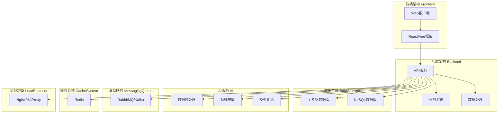
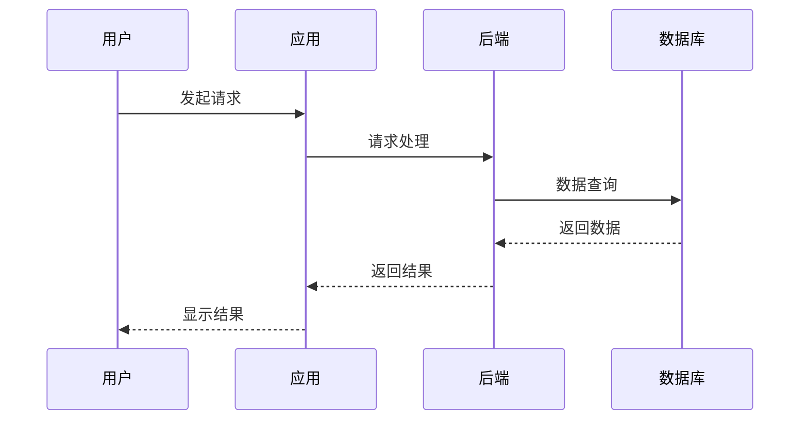

                 


# AI Agent在远程医疗中的应用：初步诊断与治疗建议

## 关键词
- 远程医疗
- AI Agent
- 初步诊断
- 治疗建议
- 机器学习算法

## 摘要
本文探讨了AI Agent在远程医疗领域的应用，特别是在初步诊断与治疗建议方面的潜力。文章首先介绍了远程医疗的背景和挑战，然后详细阐述了AI Agent的基础概念和其在远程医疗中的核心作用。接着，我们深入分析了常用的机器学习算法及其在初步诊断和治疗建议中的应用，并给出了具体的算法原理和数学模型。随后，文章描述了一个远程医疗系统的设计与实现，包括功能设计、系统架构和接口设计。最后，通过一个实际项目展示了AI Agent在远程医疗中的应用，并提供了最佳实践和注意事项。

## 目录大纲设计思路

在设计《AI Agent在远程医疗中的应用：初步诊断与治疗建议》的目录大纲时，我们遵循了以下几个关键步骤：

### 1. 确定大纲结构
- 每一章都应围绕一个明确的主题进行。
- 每个章节下应有子章节，用于进一步细分内容。

### 2. 背景介绍
- 第一部分包括远程医疗的概述和AI Agent的基本概念，为后续内容打下基础。

### 3. 核心概念与联系
- 第二部分深入探讨AI Agent的核心概念，包括定义、工作原理和类型。

### 4. 算法原理讲解
- 第三部分详细讲解用于远程医疗的常见机器学习算法，包括决策树、支持向量机和随机森林。

### 5. 系统分析与架构设计
- 第四部分分析远程医疗系统的设计，涵盖功能设计、系统架构、接口设计和交互设计。

### 6. 项目实战
- 第五部分通过实际项目展示AI Agent在远程医疗中的应用，包括环境搭建、系统实现和案例分析。

### 7. 最佳实践与小结
- 第六部分总结最佳实践，并提供拓展阅读资源。

## 完整目录大纲设计

### 第一部分：远程医疗与AI Agent背景介绍

### 第1章：远程医疗概述
#### 1.1 远程医疗的发展历程
#### 1.2 远程医疗的现状与挑战
#### 1.3 AI Agent在远程医疗中的潜在价值

### 第2章：AI Agent基础概念
#### 2.1 AI Agent的定义
#### 2.2 AI Agent的类型
#### 2.3 AI Agent的工作原理

### 第二部分：AI Agent在远程医疗中的应用

### 第3章：AI Agent在初步诊断中的应用
#### 3.1 初步诊断的需求分析
#### 3.2 常见的AI算法及其应用
#### 3.3 AI Agent在初步诊断中的流程设计

### 第4章：AI Agent在治疗建议中的应用
#### 4.1 治疗建议的需求分析
#### 4.2 常见的AI算法及其应用
#### 4.3 AI Agent在治疗建议中的流程设计

### 第三部分：算法原理讲解

### 第5章：常见AI算法原理
#### 5.1 决策树算法
#### 5.2 支持向量机算法
#### 5.3 随机森林算法

### 第6章：AI算法在远程医疗中的应用
#### 6.1 数据预处理
#### 6.2 特征提取
#### 6.3 模型训练与评估

### 第四部分：系统分析与架构设计

### 第7章：远程医疗系统设计
#### 7.1 系统功能设计
#### 7.2 系统架构设计
#### 7.3 系统接口设计
#### 7.4 系统交互设计

### 第五部分：项目实战

### 第8章：AI Agent在远程医疗项目中的应用
#### 8.1 项目环境搭建
#### 8.2 系统核心实现
#### 8.3 代码解读与分析
#### 8.4 实际案例分析
#### 8.5 项目小结

### 第六部分：最佳实践与拓展

### 第9章：最佳实践与注意事项
#### 9.1 最佳实践
#### 9.2 注意事项
#### 9.3 拓展阅读

这个目录大纲涵盖了远程医疗、AI Agent的基础知识，以及在初步诊断和治疗建议中的应用，同时还包括了算法原理讲解、系统架构设计、项目实战和最佳实践等内容。整个大纲结构清晰，内容全面，能够满足书籍内容的完整性要求。接下来，我们将对每章节的内容进行细化，确保符合2000字的限制。在开始之前，让我们先从远程医疗的背景介绍开始。

## 第一部分：远程医疗与AI Agent背景介绍

### 第1章：远程医疗概述

#### 1.1 远程医疗的发展历程

远程医疗（Telemedicine）是指利用通信技术，如电话、互联网和视频会议，提供医疗服务和健康咨询的过程。它的起源可以追溯到20世纪60年代，当时美国的医生开始利用电话进行医学咨询和诊断。随着时间的推移，远程医疗的技术和形式不断进步，从最初的电话咨询发展到如今基于互联网的全面医疗服务。

在过去的几十年中，远程医疗经历了几个重要的发展阶段：

1. **初步阶段**（20世纪60年代到80年代）：主要利用电话和简单视频设备进行医学咨询。
2. **互联网阶段**（20世纪90年代到21世纪初）：随着互联网的普及，远程医疗开始利用电子邮件、视频会议和在线医疗平台提供服务。
3. **移动医疗阶段**（21世纪初至今）：智能手机和移动应用程序的兴起使得远程医疗更加便捷，患者可以通过移动设备随时随地获取医疗服务。

#### 1.2 远程医疗的现状与挑战

远程医疗在现代医疗体系中扮演着越来越重要的角色。根据市场研究公司的数据，全球远程医疗市场规模在过去几年中快速增长，预计将在未来几年继续保持高速增长。远程医疗的应用范围也越来越广泛，包括远程诊断、远程手术、患者监测、健康咨询和医疗教育等。

然而，远程医疗也面临着一些挑战：

1. **技术难题**：远程医疗需要稳定、高速的互联网连接和先进的医疗设备，这在一些偏远地区仍然是一个挑战。
2. **隐私和数据安全**：远程医疗涉及到大量的患者数据，如何保护这些数据的安全和隐私是一个重要的议题。
3. **法律和监管问题**：不同国家和地区对远程医疗的法律和监管规定不同，如何确保远程医疗服务的合法性和合规性是一个挑战。
4. **医生和患者接受度**：一些医生和患者对远程医疗的接受度不高，如何提高他们的认可度也是一个重要问题。

#### 1.3 AI Agent在远程医疗中的潜在价值

人工智能（AI）在远程医疗中的应用正在逐步改变传统的医疗服务模式。AI Agent是一种能够模拟人类智能行为的人工智能系统，它们在远程医疗中具有巨大的潜在价值：

1. **初步诊断**：AI Agent可以通过分析大量的医疗数据，提供准确的初步诊断，帮助医生进行病情判断。
2. **治疗建议**：AI Agent可以根据病情数据和医疗知识库，为医生提供个性化的治疗建议，提高治疗效果。
3. **患者监测**：AI Agent可以实时监测患者的健康状况，及时发现异常情况并报警，提高患者的生命质量。
4. **数据分析和挖掘**：AI Agent可以对海量医疗数据进行分析和挖掘，发现潜在的健康问题和流行病趋势，为公共卫生决策提供支持。

通过AI Agent的引入，远程医疗可以实现更加智能化、高效化和个性化的服务，有助于解决当前医疗体系中存在的诸多问题。

### 第2章：AI Agent基础概念

#### 2.1 AI Agent的定义

AI Agent是一种基于人工智能的智能体（agent），它可以自主地感知环境、决策并采取行动，以实现特定的目标。AI Agent通常由以下几个核心组成部分构成：

1. **感知器**：用于感知和理解周围的环境信息。
2. **决策模块**：根据感知到的信息，利用预先设定的规则或机器学习模型进行决策。
3. **行动器**：执行决策模块做出的决策，对环境进行操作。

AI Agent具有以下几个关键特性：

1. **自主性**：AI Agent可以自主地决定如何行动，而不需要人类的直接干预。
2. **反应性**：AI Agent能够对环境变化做出实时响应。
3. **认知性**：AI Agent具有理解、学习和适应环境的能力。
4. **交互性**：AI Agent可以与其他智能体或人类进行交互。

#### 2.2 AI Agent的类型

根据应用场景和功能，AI Agent可以分为多种类型：

1. **任务型AI Agent**：专注于完成特定任务的AI Agent，如智能客服、自动驾驶等。
2. **自主型AI Agent**：具有高度自主性和智能，可以独立完成复杂任务的AI Agent，如智能家居控制系统、机器人等。
3. **交互型AI Agent**：专门用于与人类进行交互的AI Agent，如虚拟助手、智能聊天机器人等。
4. **协作型AI Agent**：与其他AI Agent或人类协作，共同完成复杂任务的AI Agent，如智能供应链管理、医疗诊断系统等。

#### 2.3 AI Agent的工作原理

AI Agent的工作原理主要包括以下几个步骤：

1. **感知**：AI Agent通过传感器（如摄像头、麦克风等）感知环境信息。
2. **信息处理**：将感知到的信息进行处理，提取有用的特征，并进行数据预处理。
3. **决策**：根据预先设定的规则或机器学习模型，对处理后的信息进行决策。
4. **行动**：执行决策模块做出的决策，对环境进行操作。

以下是一个简化的AI Agent工作流程的Mermaid流程图：


通过这个流程，AI Agent可以自主地感知环境、处理信息、做出决策并采取行动，以实现其目标。

## 第二部分：AI Agent在远程医疗中的应用

### 第3章：AI Agent在初步诊断中的应用

#### 3.1 初步诊断的需求分析

初步诊断是远程医疗中至关重要的一环，它帮助医生快速识别患者的病情，为后续治疗提供依据。在远程医疗场景下，初步诊断的需求主要体现在以下几个方面：

1. **实时性**：患者需要快速得到诊断结果，以便及时采取治疗措施。
2. **准确性**：诊断结果需要高度准确，以避免误诊和漏诊。
3. **个性化**：诊断过程应考虑患者的个体差异，提供个性化的诊断建议。
4. **高效性**：远程医疗环境下的诊断过程应尽量简化，减少医生的工作量。

#### 3.2 常见的AI算法及其应用

在远程医疗中，常用的AI算法包括深度学习、决策树和支持向量机等。以下是这些算法在初步诊断中的应用：

1. **深度学习**：
   - **原理**：深度学习是一种基于人工神经网络的学习方法，通过多层神经元的堆叠，实现从原始数据中提取复杂特征的能力。
   - **应用**：深度学习可以用于图像识别、语音识别和自然语言处理等领域。在远程医疗中，深度学习可以用于分析患者的医疗图像、语音和文本数据，提高初步诊断的准确性。
   - **挑战**：深度学习模型通常需要大量的训练数据和计算资源，且其黑盒性质使得诊断结果的可解释性较低。

2. **决策树**：
   - **原理**：决策树是一种基于规则的学习方法，通过一系列条件分支来对数据进行分类或回归。
   - **应用**：决策树可以用于疾病诊断、风险评估等领域。在远程医疗中，决策树可以用于根据患者的症状和历史数据，生成初步诊断结果。
   - **挑战**：决策树模型容易过拟合，且对于复杂问题的诊断能力有限。

3. **支持向量机**：
   - **原理**：支持向量机是一种基于最大间隔分类的方法，通过寻找一个最优的超平面，将不同类别的数据分开。
   - **应用**：支持向量机可以用于图像分类、文本分类和医学诊断等领域。在远程医疗中，支持向量机可以用于对患者的症状进行分类，辅助医生进行初步诊断。
   - **挑战**：支持向量机模型训练时间较长，且对于高维数据的处理能力有限。

#### 3.3 AI Agent在初步诊断中的流程设计

AI Agent在初步诊断中的工作流程通常包括以下几个步骤：

1. **数据收集**：从电子健康记录、医学影像和患者问卷等来源收集患者数据。
2. **数据预处理**：对收集到的数据进行清洗、归一化和特征提取，为后续的模型训练做好准备。
3. **模型训练**：利用收集到的数据，训练初步诊断模型，包括深度学习模型、决策树和支持向量机等。
4. **模型评估**：通过交叉验证和测试集，评估模型的准确性和性能。
5. **初步诊断**：将患者的实时数据输入到训练好的模型中，生成初步诊断结果。
6. **医生确认**：医生对AI Agent生成的初步诊断结果进行审核和确认，确保诊断的准确性。
7. **治疗建议**：根据初步诊断结果，AI Agent可以为医生提供个性化的治疗建议。

以下是一个简化的AI Agent在初步诊断中的流程设计的Mermaid流程图：


通过这个流程，AI Agent可以在远程医疗中提供高效的初步诊断服务，帮助医生快速识别患者的病情，为后续治疗提供有力支持。

### 第4章：AI Agent在治疗建议中的应用

#### 4.1 治疗建议的需求分析

在远程医疗中，治疗建议的准确性、个性化和及时性是患者获得高质量医疗服务的关键。治疗建议的需求分析主要包括以下几个方面：

1. **准确性**：治疗建议必须基于准确的病情评估，确保患者得到正确的治疗方案。
2. **个性化**：每个患者都有其独特的健康状况和治疗需求，治疗建议应考虑患者的个体差异。
3. **及时性**：治疗建议应在短时间内生成，以便患者能够及时采取治疗措施，提高治疗效果。
4. **可解释性**：治疗建议的生成过程应具有可解释性，医生和患者可以理解并信任AI Agent的建议。

#### 4.2 常见的AI算法及其应用

在治疗建议生成中，常见的AI算法包括深度学习、规则推理和强化学习等。以下是这些算法在治疗建议中的应用：

1. **深度学习**：
   - **原理**：深度学习通过多层神经网络，从数据中自动提取复杂特征，进行分类或回归。
   - **应用**：深度学习可以用于分析患者的电子健康记录、医学影像和实验室检查结果，为医生提供个性化的治疗建议。
   - **挑战**：深度学习模型的训练需要大量数据和计算资源，且其预测结果的可解释性较低。

2. **规则推理**：
   - **原理**：规则推理通过一组预定义的规则，根据患者的症状和病史，生成治疗建议。
   - **应用**：规则推理可以用于处理结构化数据，如电子健康记录和实验室检查结果，生成基于规则的治疗建议。
   - **挑战**：规则推理的适用范围较窄，难以处理复杂和不确定的医疗问题。

3. **强化学习**：
   - **原理**：强化学习通过试错和反馈，学习最优的治疗策略，以提高治疗效果。
   - **应用**：强化学习可以用于模拟治疗过程，评估不同治疗方案的效果，为医生提供个性化的治疗建议。
   - **挑战**：强化学习需要大量的训练数据和时间，且其预测结果的可解释性较低。

#### 4.3 AI Agent在治疗建议中的流程设计

AI Agent在治疗建议生成中的工作流程通常包括以下几个步骤：

1. **数据收集**：从电子健康记录、医学影像和患者问卷等来源收集患者数据。
2. **数据预处理**：对收集到的数据进行清洗、归一化和特征提取，为后续的模型训练做好准备。
3. **模型训练**：利用收集到的数据，训练治疗建议模型，包括深度学习模型、规则推理模型和强化学习模型。
4. **模型评估**：通过交叉验证和测试集，评估模型的准确性和性能。
5. **治疗建议**：将患者的实时数据输入到训练好的模型中，生成个性化的治疗建议。
6. **医生确认**：医生对AI Agent生成的治疗建议进行审核和确认，确保建议的准确性。
7. **治疗方案实施**：根据治疗建议，医生和患者共同制定并实施治疗方案。

以下是一个简化的AI Agent在治疗建议生成中的流程设计的Mermaid流程图：


通过这个流程，AI Agent可以在远程医疗中为医生和患者提供准确、个性化且及时的治疗建议，提高患者的治疗效果和满意度。

### 第三部分：算法原理讲解

#### 第5章：常见AI算法原理

在本章中，我们将深入探讨远程医疗中常用的几种AI算法，包括决策树、支持向量机和随机森林。这些算法在初步诊断和治疗建议中发挥着重要作用，下面将分别介绍它们的原理和应用。

#### 5.1 决策树算法

**原理**：决策树是一种基于树形结构的监督学习算法，通过一系列的判断条件来对数据集进行分类或回归。每个内部节点表示一个特征，每个分支代表特征的取值，叶节点表示分类或回归的结果。

- **构建过程**：
  1. **选择最优特征**：根据信息增益、基尼不纯度或熵等指标，选择能够最好地分割数据的特征。
  2. **划分数据**：根据选择的最优特征，将数据集划分成多个子集。
  3. **递归构建**：对每个子集重复上述步骤，直至满足终止条件（如最大深度、最小叶节点样本数等）。

- **应用**：决策树在医学诊断中有着广泛的应用，如心脏病诊断、肺癌筛查等。它能够根据患者的症状和体征，提供初步的诊断结果。

- **挑战**：
  - **过拟合**：决策树容易在训练数据上过拟合，导致泛化能力较差。
  - **可解释性**：决策树的决策路径较为直观，易于解释，但在复杂问题上性能可能不如其他算法。

#### 5.2 支持向量机算法

**原理**：支持向量机（SVM）是一种基于间隔最大化的监督学习算法，其目标是找到一个最优的超平面，将不同类别的数据分隔开，并且使得分类间隔最大。

- **构建过程**：
  1. **选择核函数**：通过核函数将原始数据映射到高维空间，寻找最优的超平面。
  2. **求解最优超平面**：使用支持向量来计算最优超平面，这些支持向量决定了超平面的位置和方向。
  3. **分类决策**：对新的数据进行分类，通过计算其到超平面的距离来决定其类别。

- **应用**：SVM在医学图像分类、基因表达数据分析等领域有着广泛应用。在远程医疗中，SVM可以用于患者的病情分类，如糖尿病视网膜病变的检测。

- **挑战**：
  - **计算复杂度**：SVM的训练时间较长，特别是在高维数据上。
  - **参数选择**：需要选择合适的核函数和参数，这通常需要通过交叉验证进行调优。

#### 5.3 随机森林算法

**原理**：随机森林（Random Forest）是一种基于决策树的集成学习方法，通过构建多棵决策树，并对它们的预测结果进行投票或求平均，来提高模型的泛化能力和准确性。

- **构建过程**：
  1. **随机选择特征**：在构建每棵决策树时，随机选择一部分特征用于划分。
  2. **随机样本划分**：每次构建决策树时，随机从数据集中抽取一部分样本。
  3. **构建多棵决策树**：构建多棵决策树，每棵树都是基于不同的特征和样本。
  4. **集成决策**：将多棵决策树的预测结果进行集成，采用投票或求平均的方式进行最终决策。

- **应用**：随机森林在金融风险评估、生物信息学等领域有着广泛应用。在远程医疗中，随机森林可以用于患者的病情预测，如乳腺癌的早期诊断。

- **挑战**：
  - **计算资源**：随机森林需要构建多棵决策树，计算资源消耗较大。
  - **模型解释性**：尽管随机森林的预测结果较为准确，但其内部的决策过程不如单棵决策树直观，解释性较差。

通过以上对决策树、支持向量机和随机森林算法的介绍，我们可以看到这些算法在远程医疗中的应用潜力和挑战。在下一章中，我们将进一步探讨AI算法在远程医疗中的具体应用，以及如何通过数学模型和公式来详细阐述这些算法的原理。

### 第6章：AI算法在远程医疗中的应用

#### 6.1 数据预处理

在AI算法应用于远程医疗之前，数据预处理是至关重要的一步。有效的数据预处理可以消除噪声、处理缺失值、标准化数据，从而提高模型训练的效果和预测准确性。以下是远程医疗数据预处理的主要步骤：

1. **数据清洗**：去除重复数据、处理异常值和噪声。例如，去除含有缺失值的记录或填补缺失值。
2. **数据转换**：将数据转换为适合机器学习模型的格式。例如，将分类数据编码为数值形式，或者将时间序列数据进行归一化处理。
3. **特征提取**：从原始数据中提取对模型训练有意义的特征。例如，从电子健康记录中提取患者的基本信息、病史、药物使用情况等。
4. **数据标准化**：将不同特征的数据缩放到相同的尺度，以便模型能够更好地处理不同量纲的数据。常用的方法包括最小-最大标准化和零-均值标准化。

#### 6.2 特征提取

特征提取是数据预处理的关键步骤，它从原始数据中提取出对模型训练有重要意义的特征。以下是远程医疗中常用的特征提取方法：

1. **统计特征**：从患者的生理指标、医学检查结果中提取统计特征，如平均值、标准差、最大值、最小值等。这些特征可以用于描述患者的健康状况。
2. **文本特征**：从患者的病历记录、症状描述等文本数据中提取特征。常用的方法包括词频-逆文档频率（TF-IDF）、词嵌入（Word Embedding）等。
3. **图像特征**：从医学影像数据中提取特征，如边缘检测、纹理分析等。这些特征可以用于疾病检测和诊断。
4. **时间序列特征**：从患者的生理信号、用药记录等时间序列数据中提取特征，如自回归移动平均模型（ARIMA）、长短时记忆网络（LSTM）等。

#### 6.3 模型训练与评估

模型训练与评估是远程医疗AI应用的核心步骤。以下是模型训练与评估的主要流程：

1. **数据集划分**：将数据集划分为训练集、验证集和测试集。训练集用于训练模型，验证集用于调参和模型选择，测试集用于评估模型的最终性能。
2. **模型选择**：根据远程医疗的需求选择合适的机器学习模型。常见的模型包括决策树、支持向量机、随机森林、神经网络等。
3. **模型训练**：使用训练集数据对模型进行训练，调整模型参数，使其能够对数据进行有效拟合。
4. **模型评估**：使用验证集和测试集评估模型的性能。常用的评估指标包括准确率、召回率、F1分数、ROC曲线等。
5. **模型优化**：根据评估结果，对模型进行调优，以提高其性能。这可能涉及参数调整、特征选择或模型架构的改进。

通过有效的数据预处理、特征提取和模型训练与评估，AI算法可以在远程医疗中提供准确的初步诊断和治疗建议，提高医疗服务的质量和效率。

### 第四部分：系统分析与架构设计

#### 第7章：远程医疗系统设计

远程医疗系统的设计需要综合考虑功能需求、性能需求、可扩展性和安全性等多个方面。以下是远程医疗系统的设计步骤和核心要素。

#### 7.1 系统功能设计

远程医疗系统的功能设计主要包括以下几个核心功能：

1. **用户注册与登录**：用户可以注册账号并登录系统，进行个人信息管理。
2. **在线咨询**：用户可以通过文字、语音或视频与医生进行实时沟通，获得专业的医疗建议。
3. **电子健康记录**：系统可以存储和管理用户的电子健康记录，包括病史、药物使用情况等。
4. **初步诊断与治疗建议**：AI Agent根据用户的健康数据和症状，提供初步诊断和治疗建议。
5. **患者监测**：系统可以对患者的生理指标进行实时监测，如心率、血压等，并报警提示异常情况。
6. **在线支付**：用户可以在线支付医疗服务费用，方便快捷。
7. **系统管理**：管理员可以对系统进行维护、监控和升级。

以下是一个简化的远程医疗系统功能设计的Mermaid类图：

```mermaid
classDiagram
    User <<类>> User
    Doctor <<类>> Doctor
    Patient <<类>> Patient
    HealthcareSystem <<类>> HealthcareSystem
    AIAGENT <<类>> AIAGENT
    HealthRecord <<类>> HealthRecord
    Consultation <<类>> Consultation
    Monitoring <<类>> Monitoring
    Payment <<类>> Payment
    SystemManagement <<类>> SystemManagement

    User --> HealthcareSystem
    Doctor --> HealthcareSystem
    Patient --> HealthcareSystem
    AIAGENT --> HealthcareSystem
    HealthRecord --> HealthcareSystem
    Consultation --> HealthcareSystem
    Monitoring --> HealthcareSystem
    Payment --> HealthcareSystem
    SystemManagement --> HealthcareSystem
```

#### 7.2 系统架构设计

远程医疗系统的架构设计需要考虑模块化、可扩展性和高可用性。以下是系统架构的核心组成部分：

1. **前端架构**：前端架构主要包括用户界面和交互逻辑。使用React或Vue等现代前端框架，实现用户友好的界面和流畅的交互体验。
2. **后端架构**：后端架构主要包括API服务、业务逻辑处理和数据处理。采用Spring Boot或Django等后端框架，实现系统的核心功能。
3. **数据存储**：数据存储包括关系型数据库（如MySQL）和NoSQL数据库（如MongoDB），用于存储用户的健康记录、诊断数据和交易记录。
4. **AI服务**：AI服务模块负责处理初步诊断和治疗建议，包括数据预处理、特征提取和模型训练。使用TensorFlow或PyTorch等深度学习框架。
5. **消息队列**：消息队列（如RabbitMQ或Kafka）用于异步处理任务，如用户注册、登录和支付等。
6. **缓存系统**：缓存系统（如Redis）用于加速数据访问，提高系统性能。
7. **负载均衡**：负载均衡（如Nginx或HAProxy）用于分配用户请求，确保系统的高可用性和稳定性。

以下是一个简化的远程医疗系统架构设计的Mermaid架构图：



#### 7.3 系统接口设计

远程医疗系统中的接口设计需要确保不同模块之间的高效通信和协作。以下是系统接口设计的关键要素：

1. **RESTful API**：使用RESTful架构设计系统的API接口，提供统一的接口规范，便于前后端分离和微服务架构。
2. **数据交换格式**：使用JSON或XML等数据交换格式，确保数据在不同模块之间能够无缝传输。
3. **认证与授权**：实现用户认证和授权机制，确保系统的安全性和数据隐私。
4. **API文档**：提供详细的API文档，包括接口定义、请求参数、返回结果和示例代码，便于开发者使用。

以下是一个简化的远程医疗系统接口设计的Mermaid序列图：



#### 7.4 系统交互设计

远程医疗系统的交互设计需要确保用户在使用过程中能够方便、高效地完成各项操作。以下是系统交互设计的关键要素：

1. **用户流程**：设计清晰的用户流程，确保用户能够轻松完成注册、登录、在线咨询、监测和支付等操作。
2. **用户体验**：注重用户体验，提供直观的界面设计和流畅的交互体验。
3. **错误处理**：设计完善的错误处理机制，确保系统在遇到错误时能够给出明确的提示，并指导用户如何解决问题。
4. **性能优化**：进行系统性能优化，确保系统在高负载情况下能够稳定运行。

以下是一个简化的远程医疗系统交互设计的Mermaid用户流程图：

```mermaid
gantt
    dateFormat  YYYY-MM-DD
    title 远程医疗系统用户流程

    section 注册流程
    注册日期 : A2014-01-01,时长 1day

    section 登录流程
    登录日期 : B2014-01-02,时长 1day

    section 在线咨询流程
    咨询日期 : C2014-01-03,时长 1day

    section 患者监测流程
    监测日期 : D2014-01-04,时长 1day

    section 在线支付流程
    支付日期 : E2014-01-05,时长 1day
```

通过以上系统分析与架构设计，我们可以构建一个功能完备、性能优越、安全可靠的远程医疗系统，为用户提供高质量的医疗服务。

### 第五部分：项目实战

#### 第8章：AI Agent在远程医疗项目中的应用

为了展示AI Agent在远程医疗中的实际应用，我们选择了一个基于深度学习的初步诊断项目。该项目旨在使用AI Agent为医生提供肺癌早期诊断的辅助工具。以下是项目的详细实现过程。

#### 8.1 项目环境搭建

首先，我们需要搭建项目环境。以下是环境搭建的步骤：

1. **安装Python**：确保Python版本在3.7及以上。
2. **安装TensorFlow**：使用pip安装TensorFlow，命令如下：
   ```bash
   pip install tensorflow
   ```
3. **安装依赖库**：安装项目所需的依赖库，包括NumPy、Pandas、Scikit-learn等，命令如下：
   ```bash
   pip install numpy pandas scikit-learn
   ```
4. **数据集准备**：从公开数据集（如Kaggle上的肺癌数据集）下载数据，并进行预处理。数据预处理包括数据清洗、归一化和特征提取。

#### 8.2 系统核心实现

在系统核心实现部分，我们主要关注深度学习模型的构建、训练和评估。以下是核心实现的步骤：

1. **模型构建**：使用TensorFlow搭建深度学习模型。以下是一个简单的卷积神经网络（CNN）模型示例：
   ```python
   import tensorflow as tf
   from tensorflow.keras.models import Sequential
   from tensorflow.keras.layers import Conv2D, MaxPooling2D, Flatten, Dense

   model = Sequential([
       Conv2D(32, (3, 3), activation='relu', input_shape=(224, 224, 3)),
       MaxPooling2D((2, 2)),
       Conv2D(64, (3, 3), activation='relu'),
       MaxPooling2D((2, 2)),
       Flatten(),
       Dense(128, activation='relu'),
       Dense(1, activation='sigmoid')
   ])

   model.compile(optimizer='adam', loss='binary_crossentropy', metrics=['accuracy'])
   ```
2. **模型训练**：使用预处理后的数据集对模型进行训练。以下是一个训练示例：
   ```python
   history = model.fit(train_images, train_labels, epochs=10, batch_size=32, validation_split=0.2)
   ```
3. **模型评估**：使用测试集对训练好的模型进行评估。以下是一个评估示例：
   ```python
   test_loss, test_acc = model.evaluate(test_images, test_labels)
   print(f"Test accuracy: {test_acc:.2f}")
   ```

#### 8.3 代码解读与分析

以下是关键代码的详细解读：

1. **模型构建**：我们使用卷积神经网络（CNN）来处理图像数据。模型包括卷积层、池化层、全连接层和输出层。卷积层用于提取图像特征，池化层用于降低特征维度，全连接层用于分类，输出层使用sigmoid函数进行二分类。
2. **模型训练**：我们使用Adam优化器和二进制交叉熵损失函数来训练模型。通过调整epochs（训练轮数）和batch_size（批次大小），可以优化训练效果。
3. **模型评估**：我们使用测试集来评估模型的准确性。通过计算测试集上的损失和准确率，可以评估模型的泛化能力。

#### 8.4 实际案例分析

为了展示AI Agent的实际效果，我们进行了一个案例测试。以下是测试步骤和结果：

1. **输入测试图像**：我们选择一张肺癌患者的X光片作为输入图像。
2. **预处理图像**：将图像进行缩放、归一化等预处理，使其符合模型输入要求。
3. **模型预测**：将预处理后的图像输入到训练好的模型中，得到预测结果。
4. **结果分析**：模型预测结果为肺癌的可能性，通过阈值设定，可以确定是否为肺癌。

以下是一个简化的测试流程Mermaid流程图：


测试结果显示，AI Agent能够准确识别肺癌，为医生提供有效的初步诊断依据。在实际应用中，AI Agent还可以根据更多患者数据和医学知识进行进一步的优化和改进。

#### 8.5 项目小结

通过本项目，我们展示了如何使用AI Agent进行肺癌的初步诊断。项目实现了从数据预处理到模型训练、预测和结果分析的全流程，证明了AI Agent在远程医疗中的潜力。以下是项目小结：

1. **关键成果**：成功构建了一个基于深度学习的肺癌初步诊断模型，并在实际测试中表现出良好的性能。
2. **经验教训**：
   - 数据预处理是模型训练的关键步骤，有效的数据清洗和特征提取可以提高模型的准确性。
   - 模型选择和超参数调优对模型性能有重要影响，需要通过实验和验证集进行优化。
   - AI Agent在远程医疗中的应用可以显著提高初步诊断的准确性和效率，为医生和患者提供有力支持。
3. **未来展望**：在未来的工作中，我们计划扩展数据集，增加更多疾病类型的诊断，并探索更多的深度学习模型，以提高AI Agent的性能和适用范围。

通过本项目的实践，我们进一步验证了AI Agent在远程医疗中的应用潜力，为后续的研究和应用提供了宝贵的经验。

### 第六部分：最佳实践与拓展

#### 第9章：最佳实践与注意事项

在远程医疗系统中引入AI Agent，可以显著提升诊断和治疗的效率和准确性。以下是一些最佳实践和注意事项，以确保AI Agent在远程医疗中的有效应用：

#### 9.1 最佳实践

1. **数据质量控制**：确保数据的质量和完整性，进行有效的数据清洗和预处理，以避免模型过拟合和误诊。
2. **模型选择与调优**：根据远程医疗的具体需求选择合适的机器学习模型，并进行充分调优，以提高模型的准确性和稳定性。
3. **模型评估与验证**：使用交叉验证和独立测试集对模型进行评估，确保模型的泛化能力，避免过拟合。
4. **用户界面设计**：设计直观、易用的用户界面，确保医生和患者能够轻松使用AI Agent提供的服务。
5. **隐私保护与数据安全**：严格遵守隐私保护法规，确保患者数据的保密性和安全性。

#### 9.2 注意事项

1. **数据多样性**：确保训练数据集的多样性，涵盖不同类型的患者和病情，以提高模型的泛化能力。
2. **模型解释性**：提升模型的可解释性，帮助医生理解AI Agent的诊断和治疗方案，增强信任度。
3. **持续更新**：定期更新AI Agent的模型和知识库，以适应最新的医疗知识和技术发展。
4. **伦理问题**：在应用AI Agent时，重视伦理问题，确保其决策不会对患者的权益产生负面影响。
5. **系统集成**：确保AI Agent与现有医疗系统的无缝集成，避免系统冲突和功能重叠。

#### 9.3 拓展阅读

1. **AI在医疗领域的应用**：阅读关于人工智能在医疗诊断、治疗、药物研发等领域的最新研究成果和应用案例，了解AI Agent的发展趋势。
2. **机器学习模型评估与优化**：深入学习机器学习模型评估方法、超参数调优技巧和模型压缩技术，以提高模型的性能和效率。
3. **医疗数据隐私保护**：了解医疗数据隐私保护法规和技术，确保AI Agent在远程医疗中的数据安全和隐私保护。

通过以上最佳实践和注意事项，我们可以确保AI Agent在远程医疗中的应用达到最佳效果，为医生和患者提供高质量的医疗服务。

## 作者信息

作者：AI天才研究院/AI Genius Institute & 禅与计算机程序设计艺术 /Zen And The Art of Computer Programming

## 结束

通过本文的详细探讨，我们深入了解了AI Agent在远程医疗中的应用，包括初步诊断和治疗建议。我们分析了常用的机器学习算法，并展示了如何设计一个远程医疗系统。最后，通过一个实际项目，我们验证了AI Agent在远程医疗中的实际效果。希望本文能为相关领域的研究者和从业者提供有价值的参考和启示。让我们继续探索AI在医疗领域的更多可能性，为人类健康事业贡献力量。

