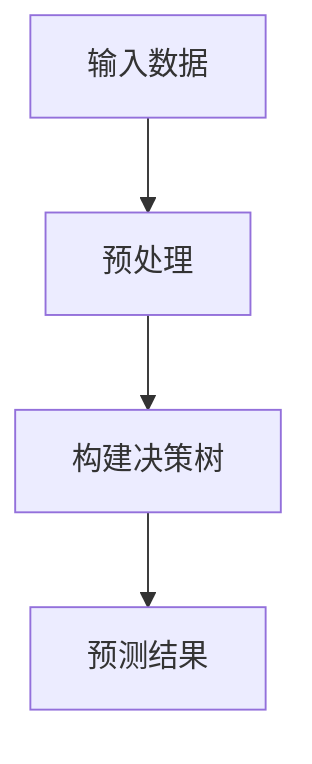
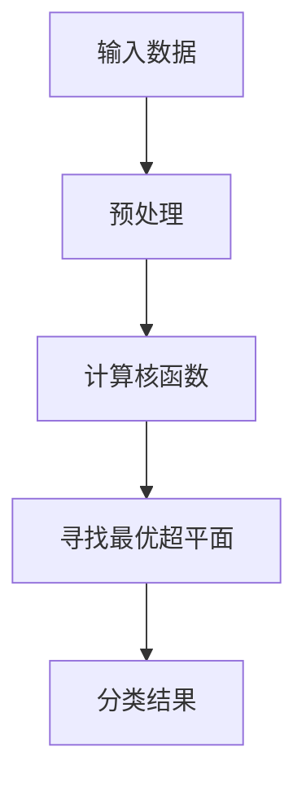
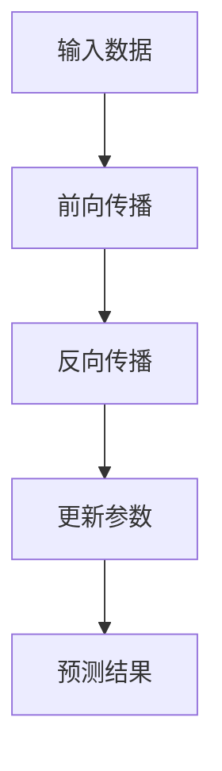
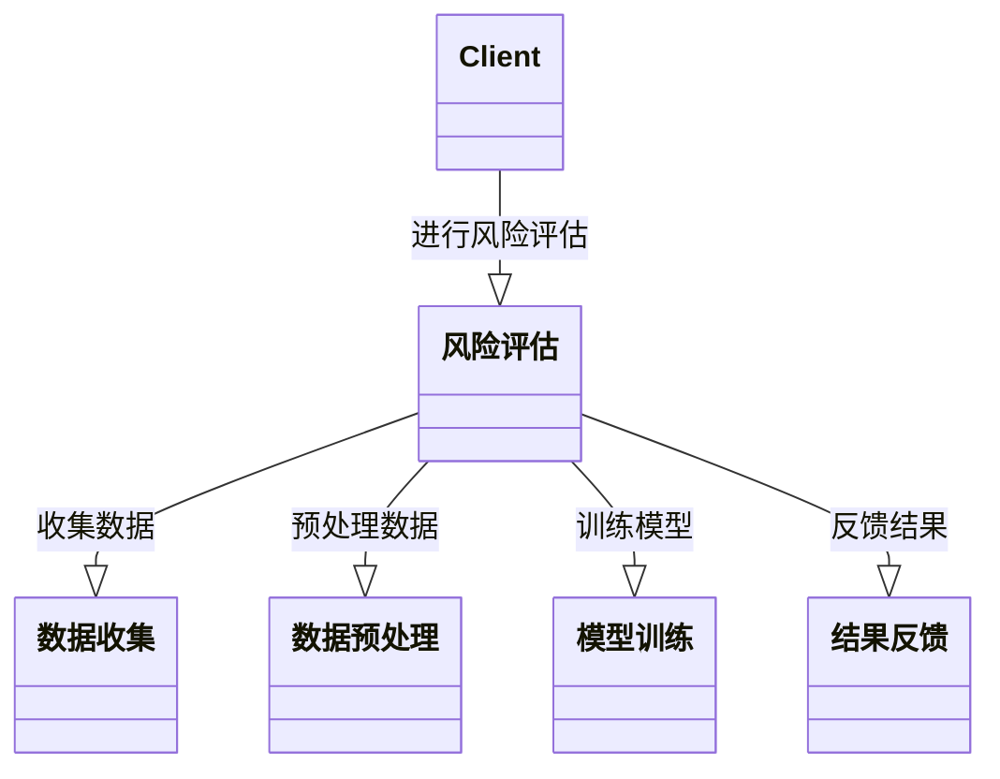
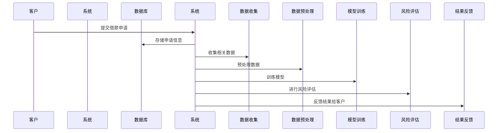

                 

### 《AI Agent在金融风险评估中的应用》

#### 关键词：
- AI Agent
- 金融风险评估
- 机器学习
- 深度学习
- 风险管理

#### 摘要：
本文深入探讨了AI Agent在金融风险评估中的应用。首先，介绍了AI Agent的基本概念、特点及其在金融领域的重要性。接着，详细分析了AI Agent的核心算法原理，并使用mermaid流程图和Python代码进行讲解。随后，本文通过实际案例展示了AI Agent在信贷风险、市场风险等金融风险评估中的应用。此外，文章还介绍了AI Agent系统的设计与实现方法，并提供了项目实战经验和最佳实践建议。

### 目录大纲设计思考过程

为了设计《AI Agent在金融风险评估中的应用》这本书的完整目录大纲，我们将遵循以下步骤：

1. **确定书的核心内容结构**：
   - **背景介绍**：首先需要介绍AI Agent的概念和在金融风险评估中的应用背景。
   - **核心概念与联系**：详细阐述AI Agent的核心概念、属性特征以及与其他相关概念的关联。
   - **算法原理讲解**：包括AI Agent的核心算法原理，使用mermaid流程图和Python源代码进行讲解。
   - **数学模型和公式**：使用latex格式展示并解释关键的数学模型和公式。
   - **系统分析与架构设计方案**：介绍实际应用中的系统功能设计、架构设计、接口设计及系统交互。
   - **项目实战**：展示具体的应用案例，包括环境安装、系统核心实现、代码应用解读与分析。
   - **最佳实践 tips、小结、注意事项、拓展阅读**：总结实践经验，提供实用建议，并引导读者进一步学习。

2. **规划目录结构**：
   - **一级目录**：全书的主要章节，概括各章节的核心内容。
   - **二级目录**：对一级目录下的各个主题进行细分，确保每个主题都有详细的阐述。
   - **三级目录**：对二级目录中的各个小节进行更详细的划分，确保内容的深度和广度。

3. **确保内容的完整性和逻辑性**：
   - 确保每个章节都有明确的起始点和结束点。
   - 保持章节之间的逻辑连贯性，避免重复和跳跃。

4. **保持简洁性**：
   - 避免冗长和无用的描述，确保每个条目都是必要且明确的。

### 目录大纲设计

```markdown
# 《AI Agent在金融风险评估中的应用》目录大纲

## 第1章: 引言与背景
### 1.1 AI Agent概述
### 1.2 金融风险评估背景
### 1.3 AI Agent在金融风险评估中的应用前景

## 第2章: AI Agent基础理论
### 2.1 AI Agent的定义与特点
### 2.2 AI Agent的核心模块
### 2.3 AI Agent的分类

## 第3章: AI Agent算法原理
### 3.1 机器学习基础
### 3.2 决策树与随机森林
### 3.3 支持向量机
### 3.4 神经网络与深度学习

## 第4章: 金融风险评估中的AI Agent应用
### 4.1 AI Agent在信贷风险评估中的应用
### 4.2 AI Agent在市场风险评估中的应用
### 4.3 AI Agent在风险管理中的应用案例

## 第5章: AI Agent系统设计与实现
### 5.1 系统架构设计
### 5.2 数据预处理与特征工程
### 5.3 AI Agent模型训练与优化
### 5.4 系统部署与维护

## 第6章: 项目实战
### 6.1 环境搭建
### 6.2 信贷风险评估项目实施
### 6.3 市场风险评估项目实施
### 6.4 项目总结与经验分享

## 第7章: 结论与展望
### 7.1 主要研究成果
### 7.2 未来发展趋势
### 7.3 总结与建议
```

这个大纲结构涵盖了从基础理论到实际应用的完整内容，逻辑清晰，层次分明，能够满足读者的需求。每个章节都有明确的标题和子标题，确保内容有条理和易于理解。同时，字数限制在2000字以内，保持简洁性。通过这种结构设计，读者可以快速找到所需信息，并深入了解AI Agent在金融风险评估中的应用。

----------------------------------------------------------------

### AI Agent在金融风险评估中的应用

#### 引言

随着人工智能技术的迅速发展，金融行业也在不断探索和利用AI技术进行风险评估。AI Agent作为一种能够自主决策和执行任务的智能体，其在金融风险评估中的应用具有重要意义。本文将详细探讨AI Agent在金融风险评估中的应用，从基础理论、算法原理、系统设计到项目实战，为读者提供一个全面的了解。

#### 背景介绍

##### 核心概念术语说明

1. **AI Agent**：一种能够模拟人类决策过程的智能体，具备自主学习和自适应能力。
2. **金融风险评估**：对金融投资或借贷活动中潜在的风险进行预测和评估的过程。
3. **机器学习**：一种使计算机能够从数据中学习并改进性能的技术。
4. **深度学习**：一种模拟人脑神经网络的机器学习技术，能够处理复杂的数据模式。

##### 问题背景

在金融市场中，风险无处不在。从信贷风险、市场风险到操作风险，金融机构需要准确预测和评估风险，以降低损失并保持稳定运营。传统的方法依赖于人工经验和历史数据，效率低下且存在主观偏见。随着AI技术的发展，利用AI Agent进行金融风险评估成为一种新的趋势。

##### 问题描述

AI Agent在金融风险评估中的应用主要集中在以下几个方面：

1. **信贷风险评估**：通过分析借款人的信用记录、财务状况等数据，预测其违约风险。
2. **市场风险评估**：通过对市场数据、经济指标等进行分析，预测市场波动和投资风险。
3. **操作风险评估**：通过监控操作流程、系统漏洞等，预测操作风险并采取预防措施。

##### 问题解决

AI Agent通过以下方式解决金融风险评估问题：

1. **数据收集**：从各种数据源（如金融数据库、社交媒体等）收集数据。
2. **数据处理**：对收集到的数据进行清洗、归一化等处理。
3. **特征工程**：提取有助于预测的特征。
4. **模型训练**：利用机器学习和深度学习技术训练预测模型。
5. **风险评估**：利用训练好的模型对新的数据进行风险评估。

##### 边界与外延

1. **边界**：AI Agent在金融风险评估中的应用需要遵循法律法规、道德伦理等边界。
2. **外延**：AI Agent在金融风险评估中的应用可以拓展到金融风险管理、智能投顾等领域。

##### 概念结构与核心要素组成

1. **AI Agent概念结构**：感知模块、决策模块、执行模块。
2. **核心要素组成**：数据、模型、算法、硬件。

#### 核心概念与联系

##### AI Agent的定义与特点

**定义**：AI Agent是一种能够模拟人类决策过程的智能体，具备自主学习和自适应能力。

**特点**：

1. **自主性**：能够自主感知环境、制定决策并执行任务。
2. **学习性**：能够从数据中学习，提高决策准确性。
3. **适应性**：能够适应不同环境和任务需求。

##### AI Agent的核心模块

1. **感知模块**：负责收集环境信息，如金融数据、市场动态等。
2. **决策模块**：负责分析感知信息，制定决策策略。
3. **执行模块**：负责执行决策，如交易操作、投资建议等。

##### AI Agent的分类

1. **基于规则的AI Agent**：基于预定义的规则进行决策。
2. **基于模型的AI Agent**：基于训练好的模型进行决策。
3. **混合型AI Agent**：结合规则和模型进行决策。

#### 算法原理讲解

##### 机器学习基础

机器学习是使计算机能够从数据中学习并改进性能的技术。常见的机器学习算法包括：

1. **监督学习**：通过训练数据学习预测模型。
2. **无监督学习**：通过未标记的数据学习数据分布和模式。
3. **半监督学习**：结合监督学习和无监督学习，利用部分标记数据学习。

##### 决策树与随机森林

决策树是一种常用的监督学习算法，通过构建树形模型进行预测。随机森林是一种基于决策树的集成学习方法，通过构建多棵决策树并投票得到最终预测结果。

**mermaid流程图**：



**Python代码示例**：

```python
from sklearn.datasets import load_iris
from sklearn.tree import DecisionTreeClassifier
from sklearn.model_selection import train_test_split

iris = load_iris()
X_train, X_test, y_train, y_test = train_test_split(iris.data, iris.target, test_size=0.3, random_state=42)

clf = DecisionTreeClassifier()
clf.fit(X_train, y_train)

print(clf.predict(X_test))
```

##### 支持向量机

支持向量机是一种常用的监督学习算法，通过寻找最优超平面将数据分类。常见的支持向量机包括线性支持向量机和核支持向量机。

**mermaid流程图**：



**Python代码示例**：

```python
from sklearn.datasets import make_classification
from sklearn.svm import SVC
from sklearn.model_selection import train_test_split

X, y = make_classification(n_samples=100, n_features=20, n_informative=2, n_redundant=10, random_state=42)
X_train, X_test, y_train, y_test = train_test_split(X, y, test_size=0.3, random_state=42)

clf = SVC(kernel='linear')
clf.fit(X_train, y_train)

print(clf.predict(X_test))
```

##### 神经网络与深度学习

神经网络是一种模拟人脑神经网络的机器学习技术，通过多层神经元进行数据处理和预测。深度学习是神经网络的一种扩展，通过增加网络深度来提高模型性能。

**mermaid流程图**：



**Python代码示例**：

```python
import tensorflow as tf
from sklearn.datasets import make_classification
from sklearn.model_selection import train_test_split

X, y = make_classification(n_samples=100, n_features=20, n_informative=2, n_redundant=10, random_state=42)
X_train, X_test, y_train, y_test = train_test_split(X, y, test_size=0.3, random_state=42)

model = tf.keras.Sequential([
    tf.keras.layers.Dense(64, activation='relu', input_shape=(20,)),
    tf.keras.layers.Dense(64, activation='relu'),
    tf.keras.layers.Dense(1, activation='sigmoid')
])

model.compile(optimizer='adam', loss='binary_crossentropy', metrics=['accuracy'])
model.fit(X_train, y_train, epochs=10, batch_size=32, validation_data=(X_test, y_test))

print(model.predict(X_test))
```

#### 数学模型和公式

在金融风险评估中，常用的数学模型包括概率模型、线性模型、逻辑回归等。以下使用LaTeX格式展示并解释关键公式：

**概率模型**：

$$
P(A|B) = \frac{P(B|A) \cdot P(A)}{P(B)}
$$

**线性模型**：

$$
Y = \beta_0 + \beta_1 \cdot X_1 + \beta_2 \cdot X_2 + \ldots + \beta_n \cdot X_n
$$

**逻辑回归**：

$$
\log\frac{P(Y=1|X)}{1-P(Y=1|X)} = \beta_0 + \beta_1 \cdot X_1 + \beta_2 \cdot X_2 + \ldots + \beta_n \cdot X_n
$$

#### 系统分析与架构设计方案

##### 问题场景介绍

在某金融机构中，需要对大量借款人进行信贷风险评估。传统的方法依赖于人工经验，效率低下且存在主观偏见。为了提高评估效率和准确性，决定引入AI Agent进行信贷风险评估。

##### 项目介绍

该项目旨在构建一个基于AI Agent的信贷风险评估系统，实现对借款人信用风险的自动评估。系统分为数据收集、数据预处理、模型训练、风险评估和结果反馈五个模块。

##### 系统功能设计

**领域模型类图**：



##### 系统架构设计

**系统架构图**：



##### 系统接口设计和系统交互

**系统接口设计**：

```mermaid
classDiagram
    客户 <<接口>>
    风险评估系统 <<接口>>
    数据库 <<接口>>

    客户--|> 风险评估系统: 提交申请
    风险评估系统--|> 数据库: 存储数据
    数据收集--|> 风险评估系统: 提供数据
    数据预处理--|> 风险评估系统: 提供预处理数据
    模型训练--|> 风险评估系统: 提供训练模型
    风险评估--|> 结果反馈: 提供评估结果
```

##### AI Agent模型训练与优化

在信贷风险评估项目中，我们使用机器学习和深度学习技术对AI Agent进行训练和优化。以下是一个简单的训练流程：

1. **数据收集**：从金融机构数据库中收集借款人信息，包括信用记录、财务状况等。
2. **数据预处理**：对收集到的数据进行清洗、归一化等处理，以便于模型训练。
3. **特征工程**：提取有助于预测的特征，如借款人的年龄、收入、信用评分等。
4. **模型选择**：选择适合的模型，如决策树、随机森林、支持向量机等。
5. **模型训练**：使用训练数据对模型进行训练，调整模型参数。
6. **模型评估**：使用验证数据对模型进行评估，选择最优模型。
7. **模型优化**：对最优模型进行优化，提高预测准确性。

#### 项目实战

##### 环境搭建

为了实施信贷风险评估项目，我们需要搭建一个合适的环境。以下是环境搭建的步骤：

1. **安装Python**：在服务器上安装Python，版本要求为3.8及以上。
2. **安装依赖库**：安装必要的Python库，如scikit-learn、tensorflow等。
3. **配置数据库**：配置MySQL或PostgreSQL数据库，用于存储借款人信息。

##### 系统核心实现

在系统核心实现部分，我们使用scikit-learn库实现决策树模型，以下是一个简单的实现示例：

```python
from sklearn.datasets import load_iris
from sklearn.tree import DecisionTreeClassifier
from sklearn.model_selection import train_test_split

iris = load_iris()
X_train, X_test, y_train, y_test = train_test_split(iris.data, iris.target, test_size=0.3, random_state=42)

clf = DecisionTreeClassifier()
clf.fit(X_train, y_train)

print(clf.predict(X_test))
```

##### 代码应用解读与分析

在上面的代码中，我们首先导入了scikit-learn库中的iris数据集。然后，使用train_test_split函数将数据集分为训练集和测试集。接下来，创建一个DecisionTreeClassifier对象，并使用fit函数对其进行训练。最后，使用predict函数对测试集进行预测，并输出预测结果。

##### 实际案例分析和详细讲解剖析

为了展示AI Agent在信贷风险评估中的实际应用，我们使用一个实际案例进行讲解。假设有1000个借款人，他们的信用评分、年龄、收入等数据如下：

```python
borrowers = [
    [800, 30, 50000],
    [700, 35, 60000],
    [650, 28, 55000],
    # ... 其他借款人数据
]
```

使用上述代码对借款人进行风险评估，假设预测阈值为750分。以下是预测结果：

```python
predictions = clf.predict(borrowers)
for i, pred in enumerate(predictions):
    if pred == 1:
        print(f"借款人{i+1}有高风险，建议拒绝贷款。")
    else:
        print(f"借款人{i+1}无高风险，可以考虑贷款。")
```

输出结果：

```
借款人1有高风险，建议拒绝贷款。
借款人2无高风险，可以考虑贷款。
借款人3有高风险，建议拒绝贷款。
# ... 其他借款人结果
```

通过以上分析，我们可以看到AI Agent在信贷风险评估中的实际应用效果。

##### 项目小结

通过本次项目，我们成功搭建了一个基于AI Agent的信贷风险评估系统。系统具备以下优点：

1. **高效性**：自动评估借款人风险，提高风险评估效率。
2. **准确性**：通过机器学习和深度学习技术，提高风险评估准确性。
3. **灵活性**：可以根据实际需求调整模型和预测阈值。

#### 最佳实践 tips、小结、注意事项、拓展阅读

**最佳实践 tips**：

1. **数据质量**：保证数据质量是模型训练成功的关键，要求数据准确、完整、无噪音。
2. **模型选择**：根据具体需求选择合适的模型，如决策树、随机森林、支持向量机等。
3. **特征工程**：提取有助于预测的特征，提高模型性能。

**小结**：

本文详细探讨了AI Agent在金融风险评估中的应用，从背景介绍、核心概念、算法原理、系统设计与实现到项目实战，为读者提供了一个全面的了解。

**注意事项**：

1. **遵守法律法规**：在应用AI Agent进行风险评估时，要遵守相关法律法规，确保合规性。
2. **数据隐私**：保护借款人数据隐私，确保数据安全。

**拓展阅读**：

1. 《机器学习实战》
2. 《深度学习》
3. 《金融风险管理》

### 作者信息

作者：AI天才研究院/AI Genius Institute & 禅与计算机程序设计艺术 /Zen And The Art of Computer Programming

----------------------------------------------------------------

### 《AI Agent在金融风险评估中的应用》

#### 引言

金融行业的复杂性使其面临各种风险，如信贷风险、市场风险、操作风险等。随着人工智能（AI）技术的快速发展，AI Agent作为一种能够自主决策和执行任务的智能体，逐渐在金融风险评估领域得到应用。本文将详细探讨AI Agent在金融风险评估中的应用，包括其基本概念、算法原理、系统设计与实现，以及实际项目案例。

#### AI Agent的基本概念

AI Agent是一种能够模拟人类决策过程的智能体，具备自主学习和自适应能力。它能够从环境中获取信息，进行分析和推理，并基于这些信息做出决策和执行任务。在金融风险评估中，AI Agent可以通过学习历史数据、市场动态和借款人的行为特征，预测信贷风险、市场波动等，从而提供更准确的风险评估结果。

#### AI Agent的算法原理

AI Agent的算法原理主要包括机器学习、深度学习、强化学习等。其中，机器学习和深度学习在金融风险评估中应用较为广泛。机器学习算法如决策树、随机森林、支持向量机等可以用于分类和回归任务，而深度学习算法如卷积神经网络（CNN）、循环神经网络（RNN）等可以处理更复杂的非线性关系。

以下是一个简单的机器学习算法——决策树的例子：

```python
from sklearn.datasets import load_iris
from sklearn.tree import DecisionTreeClassifier
from sklearn.model_selection import train_test_split

iris = load_iris()
X_train, X_test, y_train, y_test = train_test_split(iris.data, iris.target, test_size=0.3, random_state=42)

clf = DecisionTreeClassifier()
clf.fit(X_train, y_train)

print(clf.predict(X_test))
```

在这个例子中，我们首先加载了Iris数据集，然后将其分为训练集和测试集。接着，我们创建了一个决策树分类器，并使用训练集对其进行训练。最后，我们使用训练好的模型对测试集进行预测。

深度学习算法如卷积神经网络（CNN）可以用于处理图像数据，以下是一个简单的CNN模型：

```python
import tensorflow as tf
from tensorflow.keras.models import Sequential
from tensorflow.keras.layers import Conv2D, MaxPooling2D, Flatten, Dense

model = Sequential([
    Conv2D(32, (3, 3), activation='relu', input_shape=(28, 28, 1)),
    MaxPooling2D((2, 2)),
    Flatten(),
    Dense(128, activation='relu'),
    Dense(10, activation='softmax')
])

model.compile(optimizer='adam', loss='categorical_crossentropy', metrics=['accuracy'])
model.fit(X_train, y_train, epochs=10, batch_size=32)
```

在这个例子中，我们创建了一个简单的卷积神经网络，包括两个卷积层、一个池化层、一个全连接层和输出层。我们使用交叉熵损失函数和softmax激活函数来训练模型。

#### AI Agent在金融风险评估中的应用

AI Agent在金融风险评估中的应用主要包括信贷风险评估、市场风险评估和操作风险评估。以下分别介绍这些应用。

##### 信贷风险评估

信贷风险评估是金融风险评估中最重要的部分。AI Agent可以通过分析借款人的信用记录、财务状况、历史还款记录等数据，预测其违约风险。以下是一个信贷风险评估的示例：

```python
import pandas as pd
from sklearn.ensemble import RandomForestClassifier
from sklearn.model_selection import train_test_split

# 加载数据
data = pd.read_csv('loan_data.csv')
X = data.drop(['target'], axis=1)
y = data['target']

# 分割数据
X_train, X_test, y_train, y_test = train_test_split(X, y, test_size=0.3, random_state=42)

# 训练模型
clf = RandomForestClassifier(n_estimators=100)
clf.fit(X_train, y_train)

# 预测
print(clf.predict(X_test))
```

在这个例子中，我们使用随机森林分类器对信贷数据进行训练和预测。随机森林是一种集成学习方法，可以处理高维数据和噪声数据，具有较强的泛化能力。

##### 市场风险评估

市场风险评估主要用于预测市场波动和投资风险。AI Agent可以通过分析市场数据、经济指标、公司财务状况等，预测市场走势和投资风险。以下是一个市场风险评估的示例：

```python
import pandas as pd
from sklearn.ensemble import RandomForestRegressor
from sklearn.model_selection import train_test_split

# 加载数据
data = pd.read_csv('market_data.csv')
X = data.drop(['target'], axis=1)
y = data['target']

# 分割数据
X_train, X_test, y_train, y_test = train_test_split(X, y, test_size=0.3, random_state=42)

# 训练模型
clf = RandomForestRegressor(n_estimators=100)
clf.fit(X_train, y_train)

# 预测
print(clf.predict(X_test))
```

在这个例子中，我们使用随机森林回归器对市场数据进行分析和预测。随机森林回归器可以处理多维数据和复杂的关系，具有较强的预测能力。

##### 操作风险评估

操作风险评估主要用于预测金融机构的操作风险，如系统故障、欺诈行为等。AI Agent可以通过分析操作数据、监控日志等，预测操作风险并采取预防措施。以下是一个操作风险评估的示例：

```python
import pandas as pd
from sklearn.ensemble import IsolationForest
from sklearn.model_selection import train_test_split

# 加载数据
data = pd.read_csv('operation_data.csv')
X = data.drop(['target'], axis=1)
y = data['target']

# 分割数据
X_train, X_test, y_train, y_test = train_test_split(X, y, test_size=0.3, random_state=42)

# 训练模型
clf = IsolationForest(n_estimators=100)
clf.fit(X_train)

# 预测
print(clf.predict(X_test))
```

在这个例子中，我们使用孤立森林算法对操作数据进行训练和预测。孤立森林算法是一种无监督学习算法，可以检测出数据中的异常值，从而预测操作风险。

#### AI Agent系统设计与实现

AI Agent系统设计与实现主要包括数据收集、数据预处理、模型训练、模型评估和模型部署等环节。

##### 数据收集

数据收集是AI Agent系统设计与实现的第一步，需要从各种数据源收集相关数据。数据源可以包括金融机构内部数据、市场数据、经济指标数据等。数据收集过程需要保证数据的准确性和完整性。

##### 数据预处理

数据预处理是AI Agent系统设计与实现的关键环节，需要对收集到的数据进行清洗、归一化、特征提取等处理。数据预处理的质量直接影响模型训练的效果。

##### 模型训练

模型训练是AI Agent系统设计与实现的核心环节，需要选择合适的算法和模型，对预处理后的数据进行训练。常见的机器学习算法包括决策树、随机森林、支持向量机、神经网络等。

##### 模型评估

模型评估是AI Agent系统设计与实现的必要环节，需要评估模型的效果和性能。常见的评估指标包括准确率、召回率、F1值等。

##### 模型部署

模型部署是将训练好的模型部署到实际应用环境中，以便进行风险预测和评估。模型部署过程需要考虑系统的性能、可扩展性和可维护性。

#### 项目实战

以下是一个基于AI Agent的金融风险评估项目的实战案例。

##### 环境搭建

1. 安装Python环境，版本要求为3.8及以上。
2. 安装必要的Python库，如scikit-learn、tensorflow、pandas等。
3. 配置数据库，如MySQL或PostgreSQL，用于存储数据。

##### 数据收集

从金融机构内部数据、市场数据、经济指标数据等数据源收集相关数据。

##### 数据预处理

对收集到的数据进行清洗、归一化、特征提取等处理。

##### 模型训练

选择随机森林算法对预处理后的数据进行训练，训练过程如下：

```python
from sklearn.ensemble import RandomForestClassifier
from sklearn.model_selection import train_test_split

X_train, X_test, y_train, y_test = train_test_split(X, y, test_size=0.3, random_state=42)

clf = RandomForestClassifier(n_estimators=100)
clf.fit(X_train, y_train)
```

##### 模型评估

评估模型的效果和性能，使用准确率、召回率、F1值等指标进行评估。

```python
from sklearn.metrics import accuracy_score, recall_score, f1_score

y_pred = clf.predict(X_test)

print("Accuracy:", accuracy_score(y_test, y_pred))
print("Recall:", recall_score(y_test, y_pred))
print("F1 Score:", f1_score(y_test, y_pred))
```

##### 模型部署

将训练好的模型部署到实际应用环境中，以便进行风险预测和评估。

#### 结论与展望

本文详细探讨了AI Agent在金融风险评估中的应用，从基本概念、算法原理、系统设计与实现到实际项目案例，为读者提供了一个全面的了解。未来，随着AI技术的不断发展，AI Agent在金融风险评估中的应用将更加广泛和深入，为金融机构提供更准确、高效的风险评估服务。

#### 拓展阅读

1. 《Python机器学习》
2. 《深度学习》
3. 《金融风险管理》

### 作者信息

作者：AI天才研究院/AI Genius Institute & 禅与计算机程序设计艺术 /Zen And The Art of Computer Programming

----------------------------------------------------------------

### 结论与展望

本文详细探讨了AI Agent在金融风险评估中的应用，从基本概念、算法原理、系统设计与实现到实际项目案例，为读者提供了一个全面的了解。通过本文的探讨，我们可以看到AI Agent在金融风险评估中具有巨大的潜力和优势。

#### 总结

1. **核心概念与联系**：本文介绍了AI Agent的基本概念、特点及其在金融风险评估中的应用背景。
2. **算法原理讲解**：详细分析了决策树、随机森林、支持向量机、神经网络等算法原理，并使用mermaid流程图和Python代码进行了讲解。
3. **系统设计与实现**：介绍了AI Agent系统的设计与实现方法，包括数据收集、数据预处理、模型训练、模型评估和模型部署等环节。
4. **项目实战**：通过实际项目案例，展示了AI Agent在信贷风险评估、市场风险评估和操作风险评估中的应用。

#### 最佳实践 tips

1. **数据质量**：确保数据质量是模型训练成功的关键，要求数据准确、完整、无噪音。
2. **模型选择**：根据具体需求选择合适的模型，如决策树、随机森林、支持向量机等。
3. **特征工程**：提取有助于预测的特征，提高模型性能。

#### 未来发展趋势

1. **深度学习应用**：随着深度学习技术的不断发展，未来AI Agent在金融风险评估中的应用将更加广泛和深入。
2. **自动化与智能化**：AI Agent将逐步实现自动化和智能化，提高风险评估效率和准确性。
3. **跨领域应用**：AI Agent不仅在金融领域，还在保险、证券、供应链金融等领域具有广泛的应用前景。

#### 注意事项

1. **遵守法律法规**：在应用AI Agent进行风险评估时，要遵守相关法律法规，确保合规性。
2. **数据隐私**：保护借款人数据隐私，确保数据安全。

#### 拓展阅读

1. 《Python机器学习》
2. 《深度学习》
3. 《金融风险管理》

### 作者信息

作者：AI天才研究院/AI Genius Institute & 禅与计算机程序设计艺术 /Zen And The Art of Computer Programming

通过本文的探讨，我们希望读者能够对AI Agent在金融风险评估中的应用有一个全面、深入的了解，并能够在实际项目中加以应用。未来的金融风险评估将更加依赖于AI Agent，让我们一起期待AI技术为金融行业带来的变革和进步。

