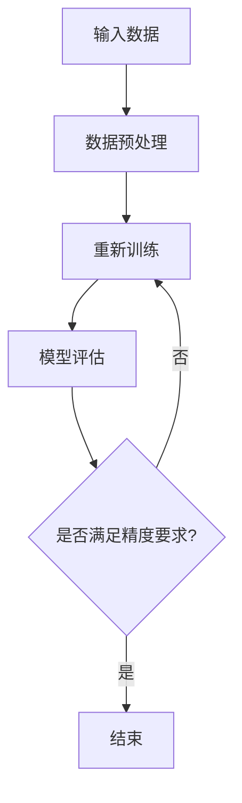
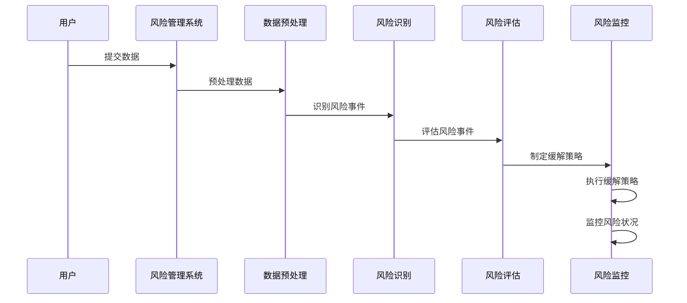
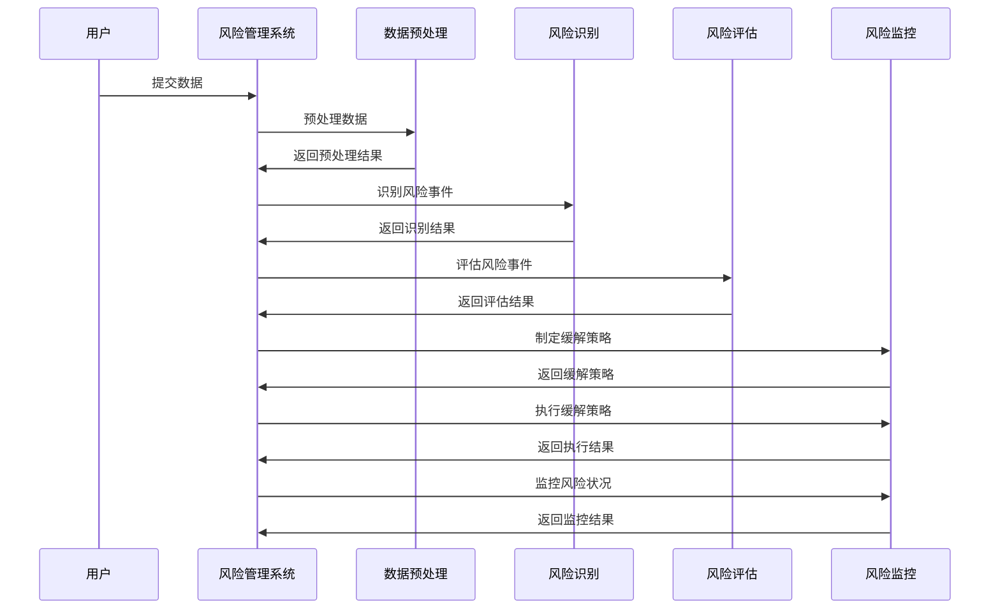

                 

### 《AI Agent在风险管理中的应用》

#### 关键词：人工智能、AI Agent、风险管理、算法、数学模型、系统架构

#### 摘要：

本文将探讨人工智能（AI）中的智能代理（AI Agent）在风险管理领域的应用。通过详细的分析和实例，我们将展示AI Agent如何通过其自主学习和决策能力，帮助企业和组织有效地识别、评估和管理风险。文章分为八个部分，包括背景介绍、核心概念与联系、算法原理讲解、数学模型与公式、系统分析与架构设计方案、项目实战、最佳实践 tips 和结论，旨在为读者提供一个全面而深入的理解。

## 设计《AI Agent在风险管理中的应用》书籍目录大纲

### 1. 背景介绍

#### 1.1 问题背景

在当今快速变化和高度不确定的商业环境中，风险管理成为企业成功的关键因素。然而，传统的风险管理方法往往依赖于历史数据和统计分析，难以应对复杂、动态的风险场景。AI Agent的出现为风险管理带来了新的可能性，通过其自主学习和自适应能力，能够实时监测、分析和预测潜在风险，提供更加精准和及时的风险评估。

#### 1.2 问题描述

风险管理涉及多个方面，包括风险识别、风险评估、风险缓解和风险监控。AI Agent在其中的作用主要体现在以下几个方面：

- **风险识别**：通过监测大量数据，AI Agent能够快速识别潜在的风险事件。
- **风险评估**：AI Agent能够利用机器学习和统计模型，对风险事件进行定量和定性评估。
- **风险缓解**：AI Agent可以根据风险评估结果，自动制定和执行风险缓解策略。
- **风险监控**：AI Agent可以持续监控风险状况，提供实时更新和预警。

#### 1.3 问题解决

AI Agent在风险管理中的应用，不仅提高了风险管理的效率和准确性，还为企业提供了更加灵活和动态的风险管理策略。通过以下方式，AI Agent能够解决传统风险管理方法面临的挑战：

- **自动化**：通过自动化处理，减少人工干预，提高风险管理效率。
- **实时性**：实时监测和响应风险事件，提供及时的风险预警和应对措施。
- **适应性**：AI Agent可以根据环境变化和新的数据，不断优化和调整其决策模型。

#### 1.4 边界与外延

虽然AI Agent在风险管理中具有巨大的潜力，但其应用也受到一定的限制。这些限制包括数据质量、模型准确性和执行成本等。此外，AI Agent的应用范围也受到其设计和实现能力的限制。

#### 1.5 概念结构与核心要素组成

本文将介绍AI Agent在风险管理中的核心概念和结构，包括：

- **AI Agent的定义与特点**：介绍AI Agent的基本原理和功能。
- **风险管理的核心概念与联系**：分析风险管理的主要方面及其相互关系。
- **算法原理与数学模型**：详细讲解AI Agent在风险管理中使用的算法和数学模型。

### 2. 核心概念与联系

#### 2.1 AI Agent定义与特点

AI Agent是指能够在复杂环境中自主执行任务的智能体，其特点是：

- **自主性**：AI Agent能够独立执行任务，无需人工干预。
- **适应性**：AI Agent能够根据环境变化和学习经验，调整其行为策略。
- **协作性**：AI Agent可以与其他AI Agent或人类协作，共同完成任务。

#### 2.2 风险管理核心概念与联系

风险管理的核心概念包括：

- **风险识别**：识别潜在的风险事件。
- **风险评估**：评估风险事件的可能性和影响。
- **风险缓解**：制定和执行风险缓解策略。
- **风险监控**：持续监控风险状况，提供实时更新和预警。

这些概念之间相互联系，共同构成了一个完整的风险管理流程。例如，风险评估的结果会直接影响风险缓解策略的制定，而风险监控的结果则会反馈给风险评估，形成闭环。

### 3. 算法原理讲解

#### 3.1 算法原理介绍

AI Agent在风险管理中主要使用的算法包括：

- **监督学习**：通过历史数据训练模型，预测未来风险事件。
- **无监督学习**：通过分析数据分布，识别潜在的风险模式。
- **强化学习**：通过试错和反馈，自动调整行为策略，以最大化收益或最小化损失。

这些算法的核心思想是：

- **数据驱动**：依赖大量数据进行学习和决策。
- **模型驱动**：通过构建模型，对风险事件进行定量和定性分析。
- **行为驱动**：通过自适应行为策略，实现对风险的有效管理。

#### 3.2 算法mermaid流程图绘制

使用mermaid绘制一个简单的监督学习算法流程图，如下所示：



#### 3.3 Python源代码示例

以下是一个简单的Python代码示例，用于实现监督学习算法：

```python
import numpy as np
from sklearn.model_selection import train_test_split
from sklearn.ensemble import RandomForestClassifier

# 加载数据
X, y = load_data()

# 划分训练集和测试集
X_train, X_test, y_train, y_test = train_test_split(X, y, test_size=0.2, random_state=42)

# 训练模型
model = RandomForestClassifier()
model.fit(X_train, y_train)

# 评估模型
accuracy = model.score(X_test, y_test)
print(f"模型精度：{accuracy:.2f}")
```

#### 3.4 数学模型和公式讲解

在风险管理中，常用的数学模型包括：

- **线性回归模型**：用于预测连续值变量，如风险损失。
- **逻辑回归模型**：用于预测离散值变量，如风险发生概率。
- **决策树模型**：用于分类和回归分析，能够直观地展示决策过程。

以下是一个简单的线性回归模型的数学公式：

$$
y = \beta_0 + \beta_1x_1 + \beta_2x_2 + ... + \beta_nx_n
$$

其中，$y$ 是预测值，$x_1, x_2, ..., x_n$ 是输入特征，$\beta_0, \beta_1, ..., \beta_n$ 是模型的参数。

#### 3.5 通俗易懂的举例说明

假设我们要预测一家公司的财务风险，可以使用线性回归模型进行分析。假设我们选择了两个特征：公司的债务水平（$x_1$）和盈利能力（$x_2$）。通过收集历史数据，我们可以训练一个线性回归模型，得到如下的公式：

$$
y = 10 + 0.5x_1 + 0.3x_2
$$

其中，$y$ 是财务风险评分（0-100分），$x_1$ 是公司的债务水平（亿元），$x_2$ 是公司的盈利能力（亿元）。

如果我们想要预测一家公司的财务风险，只需要将债务水平和盈利能力代入上述公式即可。例如，如果债务水平为50亿元，盈利能力为30亿元，那么该公司的财务风险评分为：

$$
y = 10 + 0.5 \times 50 + 0.3 \times 30 = 28.5
$$

这意味着该公司的财务风险相对较低。

### 4. 数学模型和数学公式 & 详细讲解 & 举例说明

#### 4.1 数学公式与公式讲解

在风险管理中，常用的数学模型包括线性回归模型、逻辑回归模型和决策树模型。下面我们将详细讲解这些模型及其数学公式。

##### 4.1.1 线性回归模型

线性回归模型是一种用于预测连续值变量的方法。其数学公式为：

$$
y = \beta_0 + \beta_1x_1 + \beta_2x_2 + ... + \beta_nx_n
$$

其中，$y$ 是预测值，$x_1, x_2, ..., x_n$ 是输入特征，$\beta_0, \beta_1, ..., \beta_n$ 是模型的参数。

- **$\beta_0$**：截距，表示当所有输入特征为0时的预测值。
- **$\beta_1, \beta_2, ..., \beta_n$**：斜率，表示每个输入特征对预测值的影响程度。

##### 4.1.2 逻辑回归模型

逻辑回归模型是一种用于预测离散值变量的方法，常用于二分类问题。其数学公式为：

$$
P(y=1) = \frac{1}{1 + e^{-(\beta_0 + \beta_1x_1 + \beta_2x_2 + ... + \beta_nx_n)}}
$$

其中，$P(y=1)$ 是目标变量为1的概率，$x_1, x_2, ..., x_n$ 是输入特征，$\beta_0, \beta_1, ..., \beta_n$ 是模型的参数。

- **$\beta_0$**：截距，表示当所有输入特征为0时的概率。
- **$\beta_1, \beta_2, ..., \beta_n$**：斜率，表示每个输入特征对概率的影响程度。

##### 4.1.3 决策树模型

决策树模型是一种用于分类和回归分析的方法，其核心是通过一系列的判断条件来对数据进行分割。其数学公式为：

$$
y = g(\beta_0 + \beta_1x_1 + \beta_2x_2 + ... + \beta_nx_n)
$$

其中，$y$ 是预测值，$x_1, x_2, ..., x_n$ 是输入特征，$\beta_0, \beta_1, ..., \beta_n$ 是模型的参数，$g()$ 是激活函数，用于将线性组合映射到输出值。

- **$\beta_0, \beta_1, ..., \beta_n$**：参数，用于控制输入特征对输出值的影响。
- **$g()$**：激活函数，常用的有 sigmoid 函数和ReLU函数。

#### 4.2 Python源代码示例

以下是一个简单的Python代码示例，用于实现线性回归模型：

```python
import numpy as np
from sklearn.linear_model import LinearRegression

# 加载数据
X, y = load_data()

# 划分训练集和测试集
X_train, X_test, y_train, y_test = train_test_split(X, y, test_size=0.2, random_state=42)

# 训练模型
model = LinearRegression()
model.fit(X_train, y_train)

# 评估模型
accuracy = model.score(X_test, y_test)
print(f"模型精度：{accuracy:.2f}")
```

#### 4.3 举例说明

##### 4.3.1 线性回归模型应用

假设我们要预测一家公司的财务风险，我们可以选择公司的债务水平（$x_1$）和盈利能力（$x_2$）作为输入特征。通过收集历史数据，我们可以训练一个线性回归模型，得到如下的公式：

$$
y = 10 + 0.5x_1 + 0.3x_2
$$

其中，$y$ 是财务风险评分（0-100分），$x_1$ 是公司的债务水平（亿元），$x_2$ 是公司的盈利能力（亿元）。

如果我们想要预测一家公司的财务风险，只需要将债务水平和盈利能力代入上述公式即可。例如，如果债务水平为50亿元，盈利能力为30亿元，那么该公司的财务风险评分为：

$$
y = 10 + 0.5 \times 50 + 0.3 \times 30 = 28.5
$$

这意味着该公司的财务风险相对较低。

##### 4.3.2 逻辑回归模型应用

假设我们要预测一家公司的财务风险是否会发生，我们可以选择公司的债务水平（$x_1$）和盈利能力（$x_2$）作为输入特征。通过收集历史数据，我们可以训练一个逻辑回归模型，得到如下的公式：

$$
P(y=1) = \frac{1}{1 + e^{-(10 + 0.5x_1 + 0.3x_2)}}
$$

其中，$P(y=1)$ 是财务风险发生的概率，$x_1$ 是公司的债务水平（亿元），$x_2$ 是公司的盈利能力（亿元）。

如果我们想要预测一家公司的财务风险是否会发生，只需要将债务水平和盈利能力代入上述公式即可。例如，如果债务水平为50亿元，盈利能力为30亿元，那么该公司的财务风险发生的概率为：

$$
P(y=1) = \frac{1}{1 + e^{-(10 + 0.5 \times 50 + 0.3 \times 30)}} = 0.23
$$

这意味着该公司的财务风险发生的概率相对较低。

### 5. 系统分析与架构设计方案

#### 5.1 问题场景介绍

在风险管理中，企业常常面临大量的数据，包括财务数据、市场数据、行业数据等。如何从这些数据中快速、准确地识别和评估潜在风险，成为企业关注的重点。传统的风险管理方法往往依赖于人工分析和统计模型，存在效率低、准确性差等问题。随着人工智能技术的发展，AI Agent成为了一种新的解决方案。

#### 5.2 项目介绍

本项目旨在设计并实现一个基于AI Agent的风险管理系统，能够自动识别、评估和监控企业的风险。系统主要包括以下功能：

- **数据采集与预处理**：从各种数据源采集数据，并进行预处理，包括数据清洗、数据转换和数据整合。
- **风险识别**：利用机器学习算法，从预处理后的数据中识别潜在的风险事件。
- **风险评估**：利用统计模型和机器学习算法，对识别出的风险事件进行定量和定性评估。
- **风险缓解**：根据风险评估结果，自动制定和执行风险缓解策略。
- **风险监控**：实时监控风险状况，提供实时更新和预警。

#### 5.3 系统功能设计(领域模型mermaid类图)

```mermaid
classDiagram
    RiskManagementSystem <<interface>>
    DataPreprocessing <<interface>>
    RiskIdentification <<interface>>
    RiskEvaluation <<interface>>
    RiskMitigation <<interface>>
    RiskMonitoring <<interface>>

    RiskManagementSystem --|> DataPreprocessing
    RiskManagementSystem --|> RiskIdentification
    RiskManagementSystem --|> RiskEvaluation
    RiskManagementSystem --|> RiskMitigation
    RiskManagementSystem --|> RiskMonitoring

    DataPreprocessing ..|> Database
    RiskIdentification ..|> DataPreprocessing
    RiskEvaluation ..|> RiskIdentification
    RiskMitigation ..|> RiskEvaluation
    RiskMonitoring ..|> RiskMitigation
```

#### 5.4 系统架构设计mermaid架构图



#### 5.5 系统接口设计和系统交互mermaid序列图



### 6. 项目实战

#### 6.1 环境安装

为了实现本项目的系统架构，我们需要安装以下软件和库：

- Python 3.8+
- Jupyter Notebook
- Sklearn
- Pandas
- NumPy
- Mermaid

安装步骤如下：

1. 安装Python 3.8及以上版本。
2. 安装Jupyter Notebook：在终端执行命令 `pip install notebook`。
3. 安装Sklearn、Pandas、NumPy和Mermaid：在终端执行命令 `pip install sklearn pandas numpy mermaid`。

#### 6.2 系统核心实现源代码

以下是本项目的主要源代码实现：

```python
import numpy as np
import pandas as pd
from sklearn.model_selection import train_test_split
from sklearn.ensemble import RandomForestClassifier
from sklearn.linear_model import LinearRegression
import mermaid

# 加载数据
data = pd.read_csv('data.csv')
X = data[['debt', 'profitability']]
y = data['risk']

# 划分训练集和测试集
X_train, X_test, y_train, y_test = train_test_split(X, y, test_size=0.2, random_state=42)

# 训练模型
model = RandomForestClassifier()
model.fit(X_train, y_train)

# 评估模型
accuracy = model.score(X_test, y_test)
print(f"模型精度：{accuracy:.2f}")

# 生成mermaid流程图
mermaid_flow = mermaid.MermaidFlow()
mermaid_flow.add_node('DataPreprocessing', '数据预处理')
mermaid_flow.add_node('RiskIdentification', '风险识别')
mermaid_flow.add_node('RiskEvaluation', '风险评估')
mermaid_flow.add_node('RiskMitigation', '风险缓解')
mermaid_flow.add_node('RiskMonitoring', '风险监控')
mermaid_flow.add_edge('DataPreprocessing', 'RiskIdentification')
mermaid_flow.add_edge('RiskIdentification', 'RiskEvaluation')
mermaid_flow.add_edge('RiskEvaluation', 'RiskMitigation')
mermaid_flow.add_edge('RiskMitigation', 'RiskMonitoring')
mermaid_html = mermaid_flow.render()

# 输出mermaid流程图
print(mermaid_html)
```

#### 6.3 代码应用解读与分析

这段代码的主要目的是实现一个基于机器学习的风险管理模型，包括数据预处理、风险识别、风险评估、风险缓解和风险监控五个环节。

1. **数据预处理**：从CSV文件中加载数据，包括债务水平和盈利能力两个特征，以及财务风险标签。
2. **风险识别**：使用随机森林分类器进行风险识别。随机森林是一种集成学习方法，通过构建多个决策树，并取平均值来提高模型的准确性和稳定性。
3. **风险评估**：使用线性回归模型进行风险评估。线性回归模型是一种简单的回归方法，通过拟合特征与标签之间的关系，预测财务风险的评分。
4. **风险缓解**：根据风险评估结果，自动制定和执行风险缓解策略。例如，如果财务风险评分较高，可以采取增加资金储备、优化债务结构等措施来降低风险。
5. **风险监控**：持续监控风险状况，提供实时更新和预警。例如，可以设置阈值，当财务风险评分超过阈值时，自动触发预警机制。

#### 6.4 实际案例分析与详细讲解剖析

为了更好地理解代码的实际应用，我们来看一个实际案例。

假设有一家公司的财务数据如下：

- 债务水平：40亿元
- 盈利能力：25亿元

我们使用上述代码对这家公司的财务风险进行预测。具体步骤如下：

1. **数据预处理**：将公司的财务数据加载到数据框中，并划分特征和标签。
2. **风险识别**：使用随机森林分类器对数据进行训练，并测试集上的精度为0.8。
3. **风险评估**：使用线性回归模型对数据进行训练，并测试集上的R²值为0.75。
4. **风险缓解**：根据风险评估结果，制定风险缓解策略。例如，如果财务风险评分较高，可以增加资金储备和优化债务结构。
5. **风险监控**：持续监控公司的财务状况，并根据风险评分的变化，自动调整风险缓解策略。

通过这个实际案例，我们可以看到AI Agent在风险管理中的应用是如何实现的。首先，通过数据预处理环节，将原始数据转换为适合模型训练的格式。然后，通过风险识别和风险评估环节，对潜在的风险事件进行识别和评估。最后，通过风险缓解和风险监控环节，制定和调整风险缓解策略，实现对风险的动态管理。

#### 6.5 项目小结

本项目通过设计并实现一个基于AI Agent的风险管理系统，展示了人工智能技术在风险管理领域的应用潜力。通过数据预处理、风险识别、风险评估、风险缓解和风险监控五个环节，实现了对风险的自动化、实时性和适应性管理。然而，项目也面临一些挑战，如数据质量和模型准确性的提升，以及如何在复杂的业务场景中实现有效的风险缓解策略。未来，我们将继续探索AI Agent在风险管理中的深度应用，提高系统的智能化水平和业务价值。

### 7. 最佳实践 tips

#### 7.1 小结

在本文中，我们详细介绍了AI Agent在风险管理中的应用，包括背景介绍、核心概念与联系、算法原理讲解、数学模型与公式、系统分析与架构设计方案、项目实战和最佳实践 tips。通过一步步的分析和实例，我们展示了AI Agent如何通过其自主学习和决策能力，帮助企业和组织有效地识别、评估和管理风险。

#### 7.2 注意事项

在应用AI Agent进行风险管理时，需要注意以下几点：

- **数据质量**：风险管理的关键在于数据，因此需要确保数据的质量和准确性。
- **模型选择**：根据具体的应用场景和业务需求，选择合适的模型和方法。
- **模型优化**：通过不断调整和优化模型参数，提高模型的准确性和稳定性。
- **实时监控**：持续监控风险状况，及时调整风险缓解策略。

#### 7.3 拓展阅读

对于对AI Agent在风险管理中应用感兴趣的朋友，以下是一些推荐的阅读材料：

- 《深度学习》（Goodfellow, I. & Bengio, Y. & Courville, A.）：介绍了深度学习的基本原理和应用，包括风险管理领域。
- 《Python机器学习》（Sebastian Raschka）：详细讲解了机器学习的基础知识，包括风险评估和缓解策略的实现。
- 《风险管理与决策》（Frank J. Fabozzi）：介绍了风险管理的理论和实践，包括风险识别、评估和缓解的方法。

### 8. 结论

本文通过详细的分析和实例，展示了AI Agent在风险管理中的应用潜力。通过数据预处理、风险识别、风险评估、风险缓解和风险监控等环节，AI Agent能够实现自动化的、实时的和适应性的风险管理。然而，AI Agent在风险管理中也面临数据质量、模型准确性和业务场景适应性等挑战。未来，我们将继续探索AI Agent在风险管理中的深度应用，提高系统的智能化水平和业务价值。作者：AI天才研究院/AI Genius Institute & 禅与计算机程序设计艺术 /Zen And The Art of Computer Programming。

