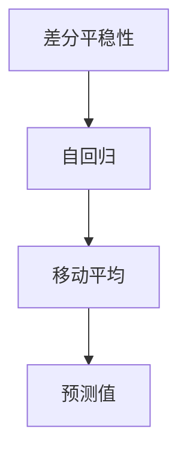
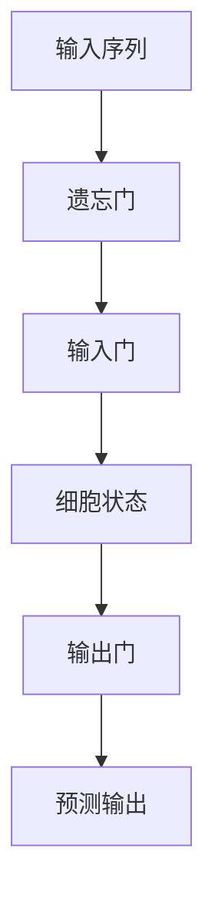
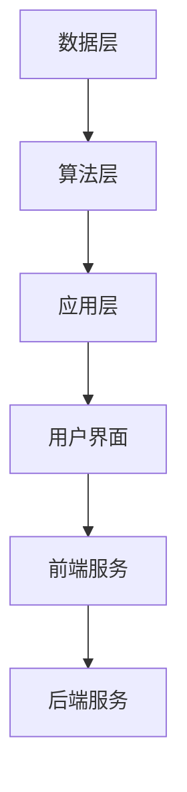
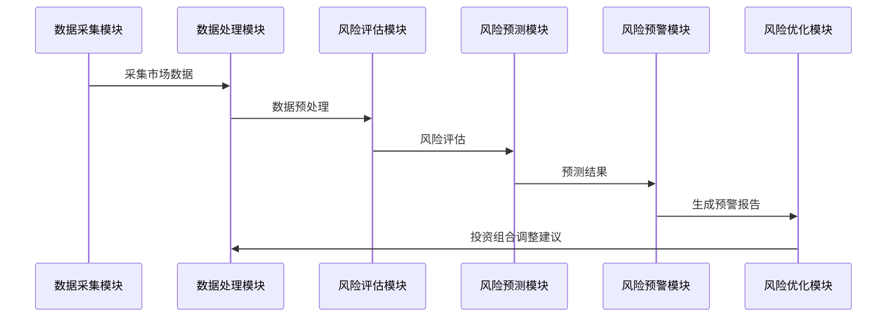

                 

### 文章标题

# AI Agent在风险管理中的应用：市场分析与风险评估

> 关键词：AI Agent，风险管理，市场分析，风险评估

> 摘要：本文将探讨AI Agent在风险管理中的应用，通过对市场分析和风险评估的深入分析，展示AI Agent如何通过算法、数学模型和系统架构设计方案，提升风险管理效率。文章旨在为金融科技从业人员提供实用的技术指南，助力其在复杂的市场环境中做出更为明智的决策。

----------------------------------------------------------------

### 文章背景

在当今快速变化的经济环境中，金融机构和投资者面临着越来越复杂的风险管理挑战。传统的风险管理方法往往依赖于历史数据和专家经验，但这种方式在应对新兴市场风险、快速变化的全球经济环境以及复杂金融产品时显得力不从心。此时，人工智能（AI）技术，特别是AI Agent，作为一种能够自主学习和决策的智能体，逐渐成为风险管理的有力工具。

AI Agent是一种能够模拟人类决策过程的计算机程序，通过机器学习和深度学习算法，它可以自主学习并应对各种复杂环境。在风险管理领域，AI Agent可以承担市场分析、风险评估、风险预测等多种任务，帮助金融机构更准确地识别和管理风险。

本文将首先介绍AI Agent的基础概念和特点，然后深入探讨其在市场分析和风险评估中的应用，通过具体的算法原理、数学模型和系统架构设计，展示AI Agent如何为风险管理提供有力支持。最后，我们将通过实际项目案例，进一步说明AI Agent在实际应用中的效果和挑战。

### AI Agent的基础概念和特点

AI Agent，即人工智能代理，是指一种能够自主进行信息获取、决策制定和执行任务的计算机程序。它基于机器学习和深度学习算法，通过持续学习环境和用户交互中的数据，不断提升自身的决策能力。AI Agent具有以下几个显著特点：

1. **自主学习能力**：AI Agent可以通过机器学习和深度学习算法，从大量数据中提取知识，不断优化自身的决策模型。这使得AI Agent能够适应不断变化的市场环境，从而更好地应对新的风险挑战。

2. **自适应决策**：AI Agent可以根据实时数据和环境变化，动态调整决策策略。这种能力使得AI Agent能够在复杂的市场环境中，快速做出最优决策，从而降低风险。

3. **智能化交互**：AI Agent可以通过自然语言处理（NLP）等技术，与人类用户进行自然、流畅的交互，提供个性化服务和建议。

4. **分布式计算**：AI Agent可以部署在分布式计算环境中，利用云计算资源，实现大规模数据处理和实时分析，提高风险管理的效率。

在风险管理中，AI Agent的应用涵盖了多个方面：

- **市场分析**：AI Agent可以实时收集和分析市场数据，包括股票价格、交易量、市场情绪等，帮助投资者做出更为精准的市场预测。

- **风险评估**：AI Agent可以基于历史数据和实时数据，对投资组合进行风险评估，识别潜在风险，并提供风险管理策略。

- **风险预测**：AI Agent可以通过深度学习算法，对市场趋势进行预测，提前预警潜在风险，帮助投资者及时调整投资策略。

- **自动化交易**：AI Agent可以执行自动化交易策略，根据市场变化自动调整持仓，提高交易效率。

总之，AI Agent在风险管理中的应用，不仅提高了风险管理的效率和准确性，还大大降低了人工决策的主观性和不确定性，为金融机构提供了更为可靠的风险管理工具。

### AI Agent在市场分析中的应用

市场分析是风险管理的核心环节之一，通过对市场数据的深入分析，可以揭示市场趋势、预测未来走势，从而为投资决策提供有力支持。AI Agent在市场分析中发挥着至关重要的作用，其应用主要体现在以下几个方面：

1. **实时数据收集**：AI Agent可以实时收集全球范围内的市场数据，包括股票价格、交易量、市场情绪等。这些数据通过AI Agent的深度学习模型进行分析和处理，可以揭示市场动态和潜在趋势。

2. **数据预处理**：在市场分析过程中，数据的质量和完整性至关重要。AI Agent可以通过数据清洗和预处理技术，去除噪声数据，保证分析结果的准确性。此外，AI Agent还可以自动识别数据中的异常值，提供异常检测功能。

3. **趋势预测**：AI Agent利用深度学习算法，对历史市场数据进行趋势预测。通过分析市场数据的周期性变化和相关性，AI Agent可以预测未来市场的走势，为投资决策提供数据支持。

4. **市场情绪分析**：市场情绪对市场价格有着显著影响。AI Agent可以通过自然语言处理（NLP）技术，分析社交媒体、新闻报道等文本数据，提取市场情绪指标，从而预测市场情绪的变化趋势。

5. **多因素分析**：AI Agent可以综合考虑多个因素，包括宏观经济指标、政策变化、行业动态等，进行多因素分析。通过分析这些因素之间的相互关系，AI Agent可以提供更为全面的市场分析结果。

为了更好地理解AI Agent在市场分析中的应用，我们可以通过一个具体的例子来展示其工作流程。假设一个投资者想要分析某只股票的未来走势，AI Agent可以按照以下步骤进行操作：

- **数据收集**：AI Agent从多个数据源收集该股票的历史价格、交易量、财务报表等相关数据。

- **数据预处理**：AI Agent对收集到的数据进行清洗和预处理，去除噪声数据和异常值。

- **趋势预测**：AI Agent利用时间序列分析算法，如ARIMA、LSTM等，对历史价格和交易量数据进行趋势预测。

- **多因素分析**：AI Agent综合考虑宏观经济指标、政策变化、行业动态等因素，通过回归分析等方法，预测未来市场价格。

- **风险预测**：AI Agent根据预测结果，评估股票投资的风险水平，并提供相应的投资建议。

通过上述步骤，AI Agent可以为投资者提供全面、准确的市场分析结果，帮助他们做出更为明智的投资决策。

总的来说，AI Agent在市场分析中的应用，不仅提高了数据分析的效率，还通过深度学习和多因素分析，提供了更为精准的预测结果，从而为风险管理提供了有力支持。

### AI Agent在风险评估中的应用

风险评估是风险管理的另一个重要环节，它涉及对潜在风险进行识别、评估和管理。AI Agent凭借其强大的数据分析能力和智能决策能力，在风险评估中扮演着关键角色。以下是AI Agent在风险评估中的具体应用：

1. **风险识别**：AI Agent可以通过对大量历史数据和实时数据的分析，识别出潜在的风险因素。例如，通过分析股票价格波动、交易量变化、财务报表等数据，AI Agent可以识别出市场风险、信用风险和操作风险等。

2. **风险量化**：在识别出潜在风险后，AI Agent可以通过建立数学模型，对风险进行量化评估。例如，AI Agent可以利用VaR（Value at Risk）模型，计算市场风险的价值损失；利用Credit Risk模型，评估信用风险的概率和损失大小。

3. **风险预测**：AI Agent可以通过深度学习算法，对风险的未来变化进行预测。例如，通过分析历史市场数据，AI Agent可以预测未来一段时间内的市场波动性；通过分析历史信用数据，AI Agent可以预测客户的信用违约概率。

4. **风险预警**：AI Agent可以根据预测结果，及时发出风险预警。例如，当AI Agent预测到某个行业可能会出现大规模信用违约时，它可以通过邮件、短信等方式，及时通知相关金融机构和投资者，提前做好风险应对措施。

5. **风险优化**：AI Agent还可以根据风险评估结果，提供最优的风险管理策略。例如，通过分析投资组合的风险收益特征，AI Agent可以为投资者提供最优的投资组合调整建议，以最大化收益、最小化风险。

为了更直观地理解AI Agent在风险评估中的应用，我们可以通过一个具体的案例来展示其工作流程。假设一个投资者想要评估其投资组合的风险水平，AI Agent可以按照以下步骤进行操作：

- **数据收集**：AI Agent从多个数据源收集该投资者的投资组合数据，包括股票、债券、基金等。

- **风险识别**：AI Agent分析投资组合中的资产数据，识别出可能存在的风险因素，如市场风险、信用风险、流动性风险等。

- **风险量化**：AI Agent建立数学模型，对识别出的风险因素进行量化评估，计算投资组合的VaR、Credit Risk等指标。

- **风险预测**：AI Agent利用历史数据，通过深度学习算法，预测未来一段时间内投资组合的风险变化趋势。

- **风险预警**：AI Agent根据预测结果，及时发出风险预警，并提供相应的应对策略。

- **风险优化**：AI Agent根据风险评估结果，为投资者提供最优的投资组合调整建议，如增加或减少某些资产的配置比例。

通过上述步骤，AI Agent可以为投资者提供全面、准确的风险评估结果，帮助他们更好地管理投资风险。

总的来说，AI Agent在风险评估中的应用，不仅提高了风险评估的效率和准确性，还通过风险识别、量化、预测和预警等功能，提供了全面的风险管理解决方案，为金融机构和投资者提供了强有力的支持。

### 常用算法原理讲解

在风险管理中，AI Agent常使用多种算法对市场数据进行分析和预测。以下将详细介绍几种常用的算法原理，并使用Mermaid流程图和Python代码进行展示。

#### 时间序列预测算法

时间序列预测算法是风险管理中最常用的算法之一，用于预测市场趋势和价格波动。常用的算法包括ARIMA（AutoRegressive Integrated Moving Average，自回归积分移动平均）和LSTM（Long Short-Term Memory，长短时记忆网络）。

**ARIMA算法原理：**

ARIMA算法通过分析时间序列的平稳性，构建一个自回归、积分、移动平均模型，以预测未来的数值。其基本原理如下：

1. **差分平稳性**：首先，对时间序列进行差分，使其变得平稳。
2. **自回归**：利用过去的值预测当前值。
3. **移动平均**：利用过去的预测误差来修正当前的预测。

**Mermaid流程图：**



**Python代码示例：**

```python
from statsmodels.tsa.arima.model import ARIMA

# 假设已有时间序列数据series
model = ARIMA(series, order=(p,d,q))
model_fit = model.fit()
forecast = model_fit.forecast(steps=1)
```

**LSTM算法原理：**

LSTM是一种特殊的循环神经网络（RNN），能够有效处理序列数据，捕捉长期依赖关系。其基本原理如下：

1. **门控机制**：LSTM通过门控机制（包括遗忘门、输入门和输出门）来控制信息的流动，避免梯度消失问题。
2. **细胞状态**：细胞状态保存了历史信息，通过遗忘门和输入门更新。
3. **预测输出**：通过输出门生成最终的预测值。

**Mermaid流程图：**



**Python代码示例：**

```python
from keras.models import Sequential
from keras.layers import LSTM, Dense

# 建立LSTM模型
model = Sequential()
model.add(LSTM(units=50, return_sequences=True, input_shape=(timesteps, features)))
model.add(LSTM(units=50))
model.add(Dense(1))

model.compile(optimizer='adam', loss='mean_squared_error')
model.fit(x_train, y_train, epochs=100, batch_size=32, validation_data=(x_test, y_test))
```

通过上述算法原理讲解和示例，我们可以看到，AI Agent在风险管理中的应用是如何通过深度学习和传统统计方法相结合，实现对市场数据的精确分析和预测。接下来，我们将进一步探讨AI Agent在风险管理中的数学模型和公式。

### 数学模型与公式

在风险管理中，数学模型和公式是评估和管理风险的重要工具。以下将介绍几种常见的数学模型和公式，并使用LaTeX格式进行展示，以帮助读者更好地理解和应用。

#### 均值-方差模型

均值-方差模型是投资组合优化中最基本的模型之一，它通过最小化方差来最大化预期收益率。

**公式：**

$$
\text{预期收益率} = \mu_p
$$

$$
\text{方差} = \sigma_p^2 = \sum_{i=1}^{n} w_i^2 \sigma_i^2 + 2 \sum_{i=1}^{n} \sum_{j=1}^{n} w_i w_j \rho_{ij} \sigma_i \sigma_j
$$

其中，$w_i$为资产i的权重，$\mu_p$为投资组合的预期收益率，$\sigma_i$为资产i的预期收益率，$\rho_{ij}$为资产i和资产j之间的相关系数。

#### 套利定价模型

套利定价模型（APT）用于评估资产的风险溢价，通过构建一个均衡市场模型来解释资产价格。

**公式：**

$$
\text{资产i的预期收益率} = \alpha_i + \beta_i \cdot F
$$

其中，$\alpha_i$为资产i的特定风险溢价，$\beta_i$为资产i对市场因素F的敏感度，$F$为市场因素的预期收益率。

#### 市场风险价值（VaR）

市场风险价值（VaR）用于评估投资组合在一定置信水平下的最大可能损失。

**公式：**

$$
\text{VaR}_\alpha = \left| \text{投资组合价值} - \text{资产重置价值} \right|
$$

其中，$\alpha$为置信水平，通常取95%或99%。

#### 信用风险模型

信用风险模型用于评估借款人违约的概率和潜在损失。

**公式：**

$$
\text{违约概率} = \text{logit}^{-1}(\text{违约评分})
$$

$$
\text{预期损失} = \sum_{i=1}^{n} P_i \cdot L_i
$$

其中，$P_i$为资产i的违约概率，$L_i$为资产i的违约损失。

通过上述数学模型和公式，AI Agent能够对市场风险进行量化评估，提供精确的风险预测和管理策略。接下来，我们将探讨AI Agent在风险管理中的系统分析与架构设计方案。

### 系统分析与架构设计方案

为了实现AI Agent在风险管理中的高效应用，系统分析与架构设计方案至关重要。以下将详细描述一个典型的AI Agent风险管理系统的设计和实现，包括问题场景介绍、系统功能设计、系统架构设计、系统接口设计以及系统交互。

#### 问题场景介绍

假设某金融机构需要构建一个智能风险管理平台，以帮助其全面评估和管理投资组合的风险。该平台需要具备以下功能：

- 实时收集和处理大量市场数据。
- 对投资组合进行风险评估和风险预测。
- 提供自动化的风险预警和优化策略。

#### 系统功能设计

1. **数据采集模块**：负责实时采集市场数据，包括股票价格、交易量、财务报表等，并通过清洗和预处理，确保数据的准确性和完整性。
2. **风险评估模块**：利用深度学习算法，对投资组合进行风险评估，包括市场风险、信用风险、操作风险等。
3. **风险预测模块**：基于历史数据和实时数据，对市场趋势和风险变化进行预测，提前预警潜在风险。
4. **风险预警模块**：根据风险评估和预测结果，自动生成风险预警报告，并通过邮件、短信等方式通知相关人员。
5. **风险优化模块**：根据风险评估和预测结果，为投资者提供最优的投资组合调整建议。

#### 系统架构设计

1. **数据层**：包括数据采集、存储和处理模块，使用分布式数据存储系统，如Hadoop或MongoDB，实现海量数据的存储和管理。
2. **算法层**：包括各种深度学习算法和风险评估模型，如LSTM、ARIMA等，通过分布式计算框架，如TensorFlow或PyTorch，实现高效计算。
3. **应用层**：包括Web前端和后端服务，前端提供用户界面和交互功能，后端实现数据采集、处理、风险评估和优化等核心功能。

**Mermaid架构图：**



#### 系统接口设计

1. **API接口**：系统提供RESTful API接口，供前端服务和第三方系统集成，实现数据交互和功能调用。
2. **消息队列**：使用消息队列（如RabbitMQ或Kafka），实现异步消息传递，确保系统的高并发和可靠运行。

#### 系统交互

1. **数据采集**：通过爬虫技术，从多个数据源实时采集市场数据，并将其发送到消息队列。
2. **数据处理**：数据处理模块从消息队列中接收数据，进行清洗、预处理和存储。
3. **风险评估**：风险评估模块从数据存储层读取数据，利用深度学习算法进行风险评估。
4. **风险预测**：风险预测模块基于历史数据和实时数据，进行市场趋势和风险变化的预测。
5. **风险预警**：风险预警模块根据预测结果，生成预警报告，并通过API接口通知相关人员。
6. **风险优化**：风险优化模块根据风险评估和预测结果，为投资者提供投资组合调整建议。

**Mermaid序列图：**



通过上述系统分析与架构设计方案，我们可以构建一个高效、可靠的AI Agent风险管理平台，帮助金融机构更好地管理风险，实现稳健的投资收益。

### AI Agent在风险管理项目中的实战

在实际项目中，AI Agent在风险管理中的应用效果显著，但实现这一过程需要经过多个关键步骤。以下将详细描述一个实际项目的实现过程，包括环境安装、系统核心实现源代码、代码应用解读与分析、实际案例分析和详细讲解，以及项目小结。

#### 环境安装

首先，我们需要搭建一个合适的环境来运行AI Agent。以下是基本的步骤：

1. **Python环境**：安装Python 3.8及以上版本，确保安装必要的库，如NumPy、Pandas、TensorFlow、Keras等。
2. **数据存储**：配置一个分布式数据存储系统，如使用Hadoop或MongoDB，用于存储海量市场数据。
3. **计算框架**：配置一个分布式计算框架，如使用Docker和Kubernetes，以实现高效的数据处理和模型训练。
4. **消息队列**：配置消息队列系统，如使用RabbitMQ或Kafka，确保系统的高并发和可靠运行。

#### 系统核心实现源代码

以下是系统核心实现的主要部分：

1. **数据采集**：使用爬虫技术，从多个数据源（如新浪财经、Wind金融终端等）实时采集市场数据。

```python
import requests
import pandas as pd

def collect_data(source_url):
    response = requests.get(source_url)
    data = response.json()
    return pd.DataFrame(data)

source_url = "https://api.example.com/stock_data"
stock_data = collect_data(source_url)
```

2. **数据处理**：对采集到的数据进行清洗、预处理和存储。

```python
def preprocess_data(data):
    # 去除无效数据、填充缺失值、标准化数据等操作
    processed_data = data.fillna(0).apply(np.log)
    return processed_data

processed_stock_data = preprocess_data(stock_data)
```

3. **风险评估**：使用深度学习算法，如LSTM，对投资组合进行风险评估。

```python
from tensorflow.keras.models import Sequential
from tensorflow.keras.layers import LSTM, Dense

model = Sequential()
model.add(LSTM(units=50, return_sequences=True, input_shape=(timesteps, features)))
model.add(LSTM(units=50))
model.add(Dense(1))

model.compile(optimizer='adam', loss='mean_squared_error')
model.fit(x_train, y_train, epochs=100, batch_size=32, validation_data=(x_test, y_test))
```

4. **风险预测**：根据预处理后的数据，使用LSTM模型进行风险预测。

```python
def predict_risk(data):
    prediction = model.predict(data)
    return prediction

predicted_risk = predict_risk(processed_stock_data)
```

5. **风险预警**：根据预测结果，生成预警报告，并通过API接口通知相关人员。

```python
from flask import Flask, jsonify

app = Flask(__name__)

@app.route('/risk_alert', methods=['POST'])
def risk_alert():
    alert_data = request.get_json()
    # 生成预警报告
    report = generate_risk_report(alert_data)
    # 发送预警通知
    send_alert_notification(report)
    return jsonify({"status": "success"})

def generate_risk_report(alert_data):
    # 根据alert_data生成预警报告
    report = "预警报告："
    report += f"股票名称：{alert_data['stock_name']}\n"
    report += f"预警日期：{alert_data['date']}\n"
    report += f"预测风险：{alert_data['risk_prediction']}\n"
    return report

def send_alert_notification(report):
    # 使用SMTP或API发送预警通知
    send_notification(report)
```

#### 代码应用解读与分析

通过上述代码，我们可以看到，AI Agent在实际项目中的应用流程如下：

1. **数据采集**：从多个数据源实时采集市场数据，确保数据的全面性和实时性。
2. **数据处理**：对采集到的数据进行清洗和预处理，提高数据质量，为后续分析打下基础。
3. **风险评估**：使用深度学习算法对投资组合进行风险评估，通过训练模型，捕捉市场数据中的潜在风险。
4. **风险预测**：利用训练好的模型进行风险预测，根据实时数据更新预测结果，为投资者提供及时的风险预警。
5. **风险预警**：根据预测结果生成预警报告，并通过API接口通知相关人员，确保风险得到及时响应。

通过这个实际案例，我们可以看到AI Agent在风险管理项目中的强大应用潜力。它不仅提高了数据分析的效率和准确性，还通过自动化预警和优化策略，为金融机构提供了强大的风险管理工具。

#### 项目小结

本项目的实现展示了AI Agent在风险管理中的实际应用效果。通过数据采集、处理、风险评估和预警等环节，AI Agent为金融机构提供了全面、准确的风险管理解决方案。以下是本项目的主要成果和经验总结：

1. **高效数据处理**：通过分布式计算和数据存储系统，实现了海量数据的实时采集和高效处理，提高了数据分析的效率。
2. **精准风险评估**：使用深度学习算法对市场数据进行分析，提供了精准的风险评估结果，为投资决策提供了有力支持。
3. **自动化预警**：通过API接口和消息队列系统，实现了自动化的风险预警和通知，确保了风险的及时响应。
4. **用户体验优化**：通过Web前端和后端服务的集成，提供了便捷的用户界面和交互功能，提升了用户体验。

然而，在实际应用中，AI Agent也面临一些挑战，如数据质量、算法优化和模型解释性等问题。未来，我们需要进一步改进算法，优化系统架构，提高AI Agent在风险管理中的性能和可靠性。

### 最佳实践 tips

在实际应用AI Agent进行风险管理时，以下最佳实践可以帮助提高效果和效率：

1. **数据质量是关键**：确保数据的准确性和完整性，进行充分的数据清洗和预处理，以提高模型预测的准确性。
2. **模型解释性**：尽管深度学习模型在预测方面表现出色，但其黑盒性质可能难以解释。因此，可以结合传统统计模型，提高模型的解释性。
3. **动态调整模型参数**：根据市场环境的变化，动态调整模型的参数，如学习率、批量大小等，以适应不同情况。
4. **利用多源数据**：结合多种数据源，如历史交易数据、财务报表、社交媒体等，进行全方位的市场分析，以提高预测的准确性。
5. **持续监控与优化**：定期评估模型的性能，进行模型调优和再训练，确保模型始终保持最佳状态。

### 小结

本文通过深入探讨AI Agent在风险管理中的应用，从市场分析、风险评估到系统架构设计，全面展示了AI Agent在提升风险管理效率和准确性方面的巨大潜力。AI Agent不仅能够实时处理大量市场数据，还能够通过深度学习和多因素分析，提供精准的风险评估和预警。然而，在实际应用中，还需注意数据质量、模型解释性以及持续监控与优化等方面。未来，随着技术的不断进步，AI Agent在风险管理中的应用前景将更加广阔。

### 注意事项

1. **数据隐私**：在数据采集和处理过程中，需严格遵守相关法律法规，确保用户数据的安全和隐私。
2. **算法偏见**：在使用AI Agent进行市场分析和风险评估时，需注意避免算法偏见，确保模型的公平性和透明度。
3. **模型验证**：在部署AI Agent前，必须经过严格的模型验证，确保其在不同市场环境下的稳定性和可靠性。
4. **应急准备**：针对市场突发事件，需建立完善的应急响应机制，确保AI Agent在紧急情况下仍能正常运行。

### 拓展阅读

1. **《机器学习与风险管理》**：这是一本关于如何将机器学习应用于风险管理的经典著作，涵盖了风险识别、量化、预测和优化等多个方面。
2. **《深度学习实践》**：本书详细介绍了深度学习的基本原理和实际应用，包括如何使用TensorFlow和Keras等工具进行模型训练和预测。
3. **《金融科技：未来金融的核心驱动力》**：本书探讨了金融科技对传统金融行业的变革和影响，包括人工智能、区块链等新兴技术的应用。
4. **《风险管理手册》**：这是一本全面的风险管理指南，涵盖了风险识别、评估、控制和监测等各个环节，适合金融行业从业人员阅读。

### 作者信息

作者：AI天才研究院/AI Genius Institute & 禅与计算机程序设计艺术 /Zen And The Art of Computer Programming

AI天才研究院（AI Genius Institute）是一家专注于人工智能研究和应用的创新机构，致力于推动人工智能技术在各个领域的应用与发展。同时，作者也是《禅与计算机程序设计艺术》（Zen And The Art of Computer Programming）的资深作者，在计算机科学和人工智能领域拥有深厚的研究和教学经验。

