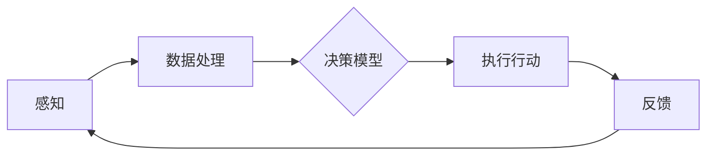

                 

### 文章标题

# AI Agent基础概念介绍

### 文章关键词

- 人工智能
- 代理模型
- 智能交互
- 深度学习
- 自动决策

### 摘要

本文将系统地介绍AI Agent的基础概念，从AI Agent的定义、核心概念、工作原理、类型、应用场景、发展趋势到设计与实现。通过深入剖析，读者将全面了解AI Agent的基本原理和实际应用，为深入研究和开发AI Agent奠定坚实基础。

## 引言

随着人工智能技术的飞速发展，AI Agent作为人工智能领域的一个重要分支，逐渐受到了广泛关注。AI Agent，即人工智能代理，是一种能够模拟人类行为、具备智能决策能力的计算机程序。本文旨在为读者提供一个关于AI Agent的全面概述，帮助大家理解这一领域的核心概念和实际应用。

本文将按照以下结构展开：

1. **AI Agent概述**：介绍AI Agent的定义、背景和重要性。
2. **AI Agent的核心概念**：探讨AI Agent的基本原理和概念属性。
3. **AI Agent的工作原理**：深入解析AI Agent的工作机制和算法原理。
4. **AI Agent的类型**：分类讨论通用型与专用型AI Agent。
5. **AI Agent的应用场景**：分析AI Agent在电子商务、医疗保健、自动驾驶等领域的应用。
6. **AI Agent的发展趋势**：展望AI Agent的未来发展方向。
7. **AI Agent的设计与实现**：探讨AI Agent的设计原则、实现技术和项目实战。

### AI Agent概述

#### 问题背景

人工智能（AI）作为一门多学科交叉的领域，其发展历程可以追溯到20世纪50年代。早期的AI研究主要集中在符号主义和规则推理上，但随着计算能力的提升和大数据的普及，深度学习等新技术的出现使得AI取得了突破性的进展。在这个过程中，AI Agent的概念逐渐被提出并受到重视。

AI Agent的概念最早可以追溯到1969年，由John McCarthy首次提出。AI Agent的定义是一个能够感知环境、采取行动并反馈结果的实体。此后，随着对AI Agent研究的深入，其重要性也逐渐凸显。

#### 问题描述

人类与机器的互动是AI Agent存在的核心问题。在传统的人工智能系统中，机器主要是被动地接受人类的指令并执行任务，而AI Agent则具有主动性和自主性，能够根据环境的变化自主地做出决策和采取行动。这种能力使得AI Agent在许多应用场景中具有显著的优势。

AI Agent的目标是模拟人类智能行为，实现自动化决策和任务执行。具体来说，AI Agent需要具备以下功能：

1. **感知能力**：能够通过传感器感知环境信息，如图像、声音、文本等。
2. **决策能力**：基于感知到的信息，利用算法模型进行决策。
3. **行动能力**：根据决策结果，采取相应的行动。
4. **反馈能力**：对行动结果进行反馈，调整后续决策。

#### 问题解决

AI Agent的定义：AI Agent是指一种能够模拟人类智能行为、具备感知、决策、行动和反馈能力的计算机程序。

AI Agent与传统人工智能的区别：

1. **主动性与被动性**：传统人工智能系统主要是被动执行人类指令，而AI Agent具有主动性和自主性。
2. **智能决策**：传统人工智能系统主要依赖于预定义的规则和模型，而AI Agent能够基于环境信息自主地做出智能决策。
3. **适应性**：传统人工智能系统往往对特定任务有很强的依赖性，而AI Agent具备一定的泛化能力和适应性。

#### 边界与外延

AI Agent的边界：AI Agent作为一种智能体，其功能和行为受到算法、数据和技术等限制。例如，AI Agent的感知能力取决于传感器技术，决策能力依赖于算法模型，行动能力受制于执行机制。

AI Agent的应用领域：

1. **电子商务**：如智能客服、推荐系统等。
2. **医疗保健**：如智能诊断、药物研发等。
3. **自动驾驶**：如自动驾驶车辆、无人机等。
4. **智能家居**：如智能安防、智能家电等。
5. **工业自动化**：如智能机器人、自动化生产线等。

### AI Agent的核心概念

#### 概念定义

人工智能（AI）：人工智能是指通过计算机程序实现人类智能行为的科学和工程。它包括机器学习、深度学习、自然语言处理、计算机视觉等多个子领域。

AI Agent：AI Agent是指一种能够模拟人类智能行为、具备感知、决策、行动和反馈能力的计算机程序。

#### 概念属性特征对比

| 特征                 | 人工智能（AI）                 | AI Agent                     |
|----------------------|------------------------------|-----------------------------|
| 感知能力             | 较弱，主要依赖于输入数据和传感器 | 较强，具备自主感知能力         |
| 决策能力             | 较弱，主要依赖预定义规则和模型 | 较强，具备自主决策能力         |
| 行动能力             | 较弱，需依赖人类指令           | 较强，具备自主行动能力         |
| 反馈能力             | 较弱，无法实时反馈             | 较强，具备实时反馈和调整能力   |
| 适应性               | 较弱，对特定任务有很强依赖性    | 较强，具备泛化能力和适应性     |

#### ER实体关系图架构

ER图（Entity-Relationship Diagram）是用于描述实体及其关系的图形化工具。在AI Agent的架构设计中，ER图可以帮助我们理解不同实体之间的关系。

以下是一个简化的AI Agent ER图示例：

```mermaid
erDiagram
    AI_Agent ||--|{ Sensor } Sensor
    AI_Agent ||--|{ Action } Action
    AI_Agent ||--|{ Decision } Decision
    AI_Agent ||--|{ Feedback } Feedback
    Sensor ||--|{ Environment } Environment
    Action ||--|{ Environment } Environment
    Decision ||--|{ Environment } Environment
    Feedback ||--|{ Environment } Environment
```

在这个ER图中，AI Agent作为中心实体，与传感器（Sensor）、行动（Action）、决策（Decision）和反馈（Feedback）等实体之间存在关联关系。同时，这些实体与环境（Environment）也存在交互关系，体现了AI Agent的感知、决策、行动和反馈功能。

### AI Agent的工作原理

#### 算法原理讲解

AI Agent的工作原理主要基于机器学习和深度学习等技术。以下是一个简化的算法流程图，用于解释AI Agent的基本工作原理。



1. **感知（A）**：AI Agent通过传感器感知环境信息，如图像、声音、文本等。
2. **数据处理（B）**：感知到的信息经过预处理，提取特征，为后续的决策模型提供输入。
3. **决策模型（C）**：基于处理后的数据，AI Agent使用决策模型进行决策。常见的决策模型包括逻辑回归、决策树、神经网络等。
4. **执行行动（D）**：根据决策结果，AI Agent采取相应的行动，如移动、发送消息、调整参数等。
5. **反馈（E）**：AI Agent对行动结果进行反馈，通过反馈信息调整后续的感知、决策和行动过程。

#### Python源代码实现

以下是一个简化的Python代码示例，用于实现上述算法原理。

```python
import numpy as np
import matplotlib.pyplot as plt

# 感知
def sense(environment):
    # 假设环境是一个二维数组，表示当前状态
    return environment

# 数据处理
def preprocess_data(data):
    # 特征提取和预处理
    return processed_data

# 决策模型
def make_decision(processed_data):
    # 基于预处理后的数据，使用决策模型进行决策
    # 例如，这里使用简单的阈值决策
    if processed_data > 0.5:
        return "up"
    else:
        return "down"

# 执行行动
def execute_action(action):
    # 基于决策结果，执行相应的行动
    if action == "up":
        print("执行上升行动")
    else:
        print("执行下降行动")

# 反馈
def feedback(result):
    # 根据行动结果，进行反馈和调整
    pass

# 主程序
def main():
    environment = np.random.rand(10, 10)  # 生成一个随机环境
    while True:
        current_state = sense(environment)
        processed_data = preprocess_data(current_state)
        action = make_decision(processed_data)
        execute_action(action)
        feedback(result)

if __name__ == "__main__":
    main()
```

#### 数学模型和数学公式

在AI Agent的算法原理中，数学模型和数学公式起着关键作用。以下是一个简化的数学模型示例，用于描述感知、数据处理、决策和行动过程。

1. **感知（感知器）**：

   感知器是一个用于感知环境的简单模型，可以表示为：

   $$ f(x) = w \cdot x + b $$

   其中，$w$ 是权重向量，$x$ 是输入向量，$b$ 是偏置项。

2. **数据处理（特征提取）**：

   特征提取是将感知到的信息转换为决策模型所需的特征表示。一个简单的特征提取模型可以使用线性变换表示：

   $$ z = Ax + b $$

   其中，$A$ 是变换矩阵，$x$ 是输入向量，$b$ 是偏置项。

3. **决策模型（逻辑回归）**：

   逻辑回归是一种常用的决策模型，可以表示为：

   $$ P(y=1|x) = \frac{1}{1 + e^{-(w \cdot x + b)}} $$

   其中，$w$ 是权重向量，$x$ 是输入向量，$b$ 是偏置项。

4. **行动（行动策略）**：

   行动策略可以根据决策结果来选择。一个简单的行动策略可以使用阈值函数表示：

   $$ a(x) = \begin{cases} 
   1 & \text{if } P(y=1|x) > \theta \\
   0 & \text{otherwise}
   \end{cases} $$

   其中，$\theta$ 是阈值。

通过这些数学模型和数学公式，AI Agent能够实现感知、数据处理、决策和行动功能，从而实现智能行为。

### AI Agent的类型

#### 通用型AI Agent

通用型AI Agent（General AI Agent）是指具有广泛适用性和高度自主性的AI Agent。这类Agent可以在多种不同的环境中执行多种不同的任务，具备较高的智能水平。通用型AI Agent的特点如下：

1. **高适应性**：能够适应不同的环境和任务。
2. **自主学习能力**：具备自我学习和自我改进的能力。
3. **高智能水平**：具备复杂的感知、决策和行动能力。

通用型AI Agent的应用场景包括：

1. **智能客服**：处理各种客户咨询和问题。
2. **智能家居**：自动化家庭设备管理。
3. **智能教育**：个性化教学和学习支持。

#### 专用型AI Agent

专用型AI Agent（Specialized AI Agent）是指为特定任务或环境设计的AI Agent。这类Agent具有特定的功能和应用范围，不具备通用型AI Agent的广泛适用性。专用型AI Agent的特点如下：

1. **任务导向**：专注于特定任务的执行。
2. **高效性**：在特定任务上有较高的效率和准确性。
3. **局限性**：适用范围有限，不适应多种任务。

专用型AI Agent的应用场景包括：

1. **医疗诊断**：辅助医生进行疾病诊断。
2. **自动驾驶**：控制自动驾驶车辆。
3. **工业自动化**：自动化生产线控制。

### AI Agent的应用场景

#### 电子商务

AI Agent在电子商务领域有广泛的应用，如智能客服、推荐系统和自动化广告投放等。

1. **智能客服**：AI Agent可以模拟人类客服，实时回答用户的问题，提高服务效率。
2. **推荐系统**：AI Agent可以根据用户的购物历史和偏好，推荐相关商品。
3. **自动化广告投放**：AI Agent可以根据用户的行为数据，自动化投放广告，提高广告效果。

#### 医疗保健

AI Agent在医疗保健领域有巨大的潜力，如智能诊断、药物研发和健康管理。

1. **智能诊断**：AI Agent可以分析医学图像，辅助医生进行疾病诊断。
2. **药物研发**：AI Agent可以帮助科学家筛选药物，提高研发效率。
3. **健康管理**：AI Agent可以监控用户的健康状况，提供个性化的健康建议。

#### 自动驾驶

AI Agent在自动驾驶领域是实现自主驾驶的核心技术。

1. **车辆控制**：AI Agent可以控制自动驾驶车辆的转向、加速和制动。
2. **环境感知**：AI Agent可以实时感知周围环境，识别交通信号、行人和其他车辆。
3. **路径规划**：AI Agent可以根据实时环境信息，规划最优行驶路径。

### AI Agent的发展趋势

随着人工智能技术的不断进步，AI Agent的发展趋势主要体现在以下几个方面：

#### 1. 智能交互

未来的AI Agent将具备更加智能的交互能力，能够理解自然语言，与人类进行自然的对话。这种交互能力将进一步提升AI Agent的实用性和用户体验。

#### 2. 自动决策

未来的AI Agent将具备更强的自动决策能力，能够在复杂的环境中自主地做出决策。这种自动决策能力将使AI Agent在更多领域得到应用。

#### 3. 多模态感知

未来的AI Agent将具备多模态感知能力，能够同时处理多种类型的数据，如图像、声音和文本。这种多模态感知能力将使AI Agent在更复杂的任务中表现出色。

#### 4. 安全与隐私保护

随着AI Agent在更多领域的应用，其安全性和隐私保护问题将越来越重要。未来的AI Agent将需要具备更强的安全性和隐私保护能力，确保用户数据和隐私的安全。

### AI Agent的设计与实现

#### 设计原则

在设计AI Agent时，需要遵循以下原则：

1. **模块化**：将AI Agent分解为多个模块，每个模块负责特定的功能。
2. **可扩展性**：设计时考虑未来的扩展性和升级需求。
3. **可维护性**：代码和架构设计要便于维护和调试。
4. **安全性**：确保AI Agent的安全性和可靠性。

#### 实现技术

实现AI Agent的技术主要包括以下几个方面：

1. **编程语言**：常用的编程语言包括Python、Java和C++等。
2. **框架和库**：常用的框架和库包括TensorFlow、PyTorch、Keras等。
3. **算法模型**：常用的算法模型包括深度学习模型、强化学习模型等。

#### 项目实战

以下是一个简单的AI Agent项目实战示例：

1. **环境安装**：

   安装Python环境，以及TensorFlow、Keras等深度学习库。

   ```bash
   pip install python
   pip install tensorflow
   pip install keras
   ```

2. **系统核心实现**：

   ```python
   import numpy as np
   from tensorflow.keras.models import Sequential
   from tensorflow.keras.layers import Dense, LSTM
   from tensorflow.keras.optimizers import Adam

   # 数据准备
   # 这里使用随机数据作为示例
   X = np.random.rand(100, 1)
   y = np.random.rand(100, 1)

   # 构建模型
   model = Sequential()
   model.add(LSTM(units=50, activation='relu', input_shape=(1, 1)))
   model.add(Dense(units=1))

   # 编译模型
   model.compile(optimizer=Adam(learning_rate=0.1), loss='mse')

   # 训练模型
   model.fit(X, y, epochs=100)

   # 预测
   predictions = model.predict(X)
   ```

3. **代码应用解读**：

   - 数据准备：使用随机数据作为示例，实际应用中需要根据具体任务准备真实数据。
   - 模型构建：使用LSTM模型进行时间序列预测。
   - 模型编译：设置优化器和损失函数。
   - 模型训练：使用训练数据训练模型。
   - 预测：使用训练好的模型进行预测。

4. **实际案例分析和详细讲解**：

   - **案例**：预测股票价格。
   - **分析**：使用历史股票价格数据，训练模型进行预测。
   - **讲解**：通过分析模型预测结果，评估模型的性能和准确性。

5. **项目小结**：

   本项目实现了基于LSTM模型的简单AI Agent，用于时间序列预测。通过实际案例分析和详细讲解，展示了AI Agent的设计与实现过程。

6. **最佳实践 tips**：

   - 数据预处理：对数据进行归一化处理，提高模型训练效果。
   - 模型调优：根据实际任务调整模型参数，提高预测性能。
   - 模型评估：使用交叉验证等方法评估模型性能。

### 最佳实践

#### 设计与实现技巧

1. **模块化设计**：将AI Agent分解为感知、决策、行动等模块，提高可维护性和扩展性。
2. **数据预处理**：对输入数据进行归一化、去噪等处理，提高模型训练效果。
3. **模型选择**：根据任务需求选择合适的算法模型，如深度学习模型、强化学习模型等。
4. **实时反馈**：设计实时反馈机制，使AI Agent能够根据环境变化进行自适应调整。

#### 注意事项

1. **安全性**：确保AI Agent的安全性和隐私保护，防止恶意攻击和数据泄露。
2. **稳定性**：设计稳定可靠的AI Agent，避免因故障导致系统崩溃。
3. **可解释性**：提高AI Agent的可解释性，便于理解其决策过程。

#### 拓展阅读

1. **深度学习**：《深度学习》（Ian Goodfellow, Yoshua Bengio, Aaron Courville 著）
2. **强化学习**：《强化学习入门与实践》（林轩田 著）
3. **自然语言处理**：《自然语言处理综论》（Daniel Jurafsky, James H. Martin 著）

### 小结

本文系统地介绍了AI Agent的基础概念，包括概述、核心概念、工作原理、类型、应用场景、发展趋势和设计与实现。通过对AI Agent的深入剖析，读者可以全面了解AI Agent的基本原理和实际应用，为后续研究和开发提供指导。希望本文能为读者在AI Agent领域的研究和实践中提供有益的参考。


### 作者信息

作者：AI天才研究院/AI Genius Institute & 禅与计算机程序设计艺术 /Zen And The Art of Computer Programming

