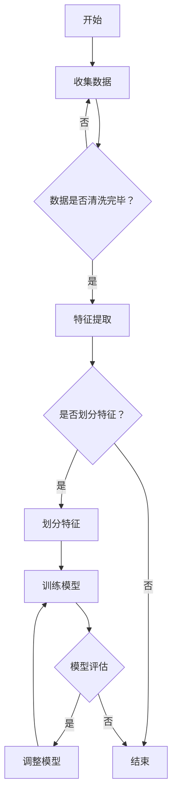
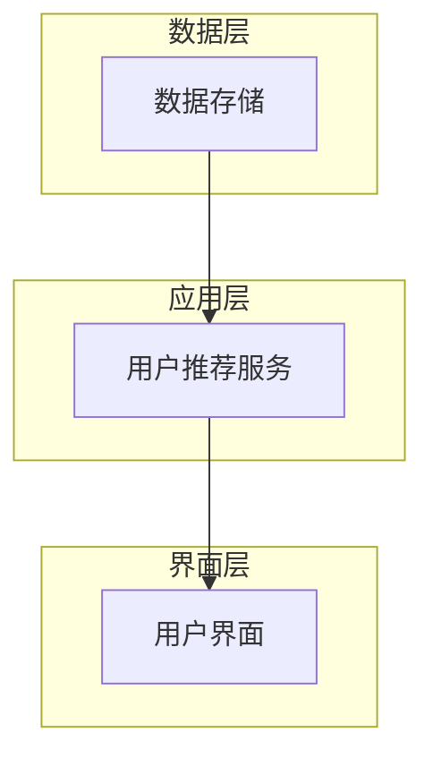
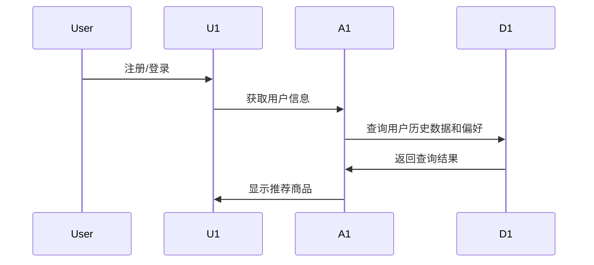

                 

# AI Agent开发中的法律合规与伦理考量

关键词：AI Agent、法律合规、伦理考量、数据保护、责任分配

摘要：随着人工智能技术的发展，AI Agent在各个领域的应用越来越广泛。然而，AI Agent的广泛应用也引发了一系列法律合规与伦理问题。本文将从法律合规和伦理考量两个方面，对AI Agent的开发进行深入分析，并提出相应的解决方案。

## 第1章 引言

### 1.1 书籍目的与结构

随着人工智能技术的迅猛发展，AI Agent作为一种重要的应用形式，已经在许多领域得到了广泛应用。然而，随着AI Agent的普及，法律合规和伦理问题也日益凸显。本文旨在探讨AI Agent开发中的法律合规与伦理考量，分析其中存在的问题，并提出相应的解决方案。

本书将分为以下几个部分：

1. **引言与背景**：介绍AI Agent的基本概念、发展现状以及法律合规与伦理考量的重要性。
2. **法律合规基础**：讨论数据保护、合同法、知识产权等方面的法律合规问题。
3. **伦理考量**：探讨AI Agent的伦理原则、责任分配、公平性等方面的伦理问题。
4. **AI Agent开发中的法律与伦理问题案例分析**：通过案例分析，深入探讨AI Agent开发中的法律与伦理问题。
5. **AI Agent开发中的法律与伦理解决方案**：提出针对法律与伦理问题的解决方案。
6. **未来展望与挑战**：对AI Agent开发中的未来趋势与挑战进行展望。
7. **结论**：总结主要发现与贡献，指出研究的局限与未来方向。

### 1.2 AI Agent的概念与意义

AI Agent是指具备一定智能能力的计算机程序，能够模拟人类的决策过程，根据环境变化自主调整行为，以实现特定目标。AI Agent在自动驾驶、智能客服、金融交易、医疗诊断等多个领域具有广泛的应用前景。

AI Agent的开发与应用具有重要意义。首先，AI Agent能够提高工作效率，降低人力成本。其次，AI Agent能够处理大规模的数据，提供更加精准的决策支持。最后，AI Agent的普及有望推动人工智能技术的进一步发展，为社会带来更多创新。

### 1.3 法律合规与伦理考量的重要性

法律合规与伦理考量在AI Agent开发中具有重要意义。首先，法律合规是AI Agent合法运行的必要条件。数据保护、合同法、知识产权等方面的法律合规问题，直接关系到AI Agent的合法性和社会责任。其次，伦理考量是确保AI Agent公正、公平、透明的重要手段。在AI Agent开发过程中，必须充分考虑伦理问题，以避免对人类造成伤害。

## 第2章 AI Agent发展现状

### 2.1 AI Agent的历史与发展

AI Agent的概念最早可以追溯到20世纪50年代，当时计算机科学家艾伦·图灵提出了图灵测试。随着人工智能技术的不断发展，AI Agent的理论研究和实际应用逐渐兴起。

20世纪80年代，专家系统成为AI Agent的主要形式。专家系统通过模拟人类专家的决策过程，为用户提供决策支持。然而，专家系统存在知识获取困难、知识库更新缓慢等问题。

20世纪90年代，随着机器学习技术的发展，基于机器学习的AI Agent逐渐取代了专家系统。机器学习算法能够从大量数据中自动学习规律，为AI Agent提供更加精准的决策支持。

21世纪初，随着深度学习技术的突破，AI Agent的性能得到了显著提升。深度学习算法能够处理复杂的非线性问题，使得AI Agent在图像识别、语音识别、自然语言处理等领域取得了显著的成果。

### 2.2 AI Agent的主要类型

根据AI Agent的智能水平和工作方式，可以将AI Agent分为以下几类：

1. **基于规则的AI Agent**：这类AI Agent通过预定义的规则进行决策。规则通常由专家根据领域知识制定。基于规则的AI Agent具有逻辑清晰、易于理解等优点，但存在知识获取困难、知识库更新缓慢等问题。

2. **基于机器学习的AI Agent**：这类AI Agent通过机器学习算法从数据中自动学习规则。机器学习算法能够处理复杂的非线性问题，为AI Agent提供更加精准的决策支持。基于机器学习的AI Agent具有自适应能力强、知识获取方便等优点，但存在过拟合、可解释性差等问题。

3. **基于深度学习的AI Agent**：这类AI Agent通过深度学习算法处理大规模数据，实现复杂的决策过程。深度学习算法能够自动提取特征，减少人工干预。基于深度学习的AI Agent在图像识别、语音识别、自然语言处理等领域取得了显著的成果，但存在计算资源需求高、可解释性差等问题。

### 2.3 AI Agent的应用场景

AI Agent在各个领域的应用场景广泛，以下是一些典型的应用场景：

1. **自动驾驶**：AI Agent通过感知环境、规划路径、控制车辆等任务，实现自动驾驶。自动驾驶技术有望大幅降低交通事故率，提高交通效率。

2. **智能客服**：AI Agent能够模拟人类客服，为用户提供自动化的客户服务。智能客服能够处理大量客户请求，提高客户满意度。

3. **金融交易**：AI Agent通过分析市场数据、预测价格走势，实现自动化交易。金融交易AI Agent有望提高交易效率，降低交易成本。

4. **医疗诊断**：AI Agent通过分析医学影像、实验室检测结果，协助医生进行疾病诊断。医疗诊断AI Agent有望提高诊断准确性，缩短诊断时间。

5. **智能家居**：AI Agent能够控制家居设备的运行，实现智能化管理。智能家居AI Agent有望提高生活质量，降低生活成本。

## 第3章 法律合规基础

### 3.1 数据保护与隐私

数据保护与隐私是AI Agent开发中必须考虑的法律合规问题。在AI Agent的运行过程中，通常会收集、处理和存储大量的用户数据。因此，确保用户数据的安全和隐私是法律合规的关键。

#### 3.1.1 GDPR概述

欧盟的《通用数据保护条例》（GDPR）是当前全球最具影响力的数据保护法规之一。GDPR于2018年5月25日正式生效，旨在保护欧盟境内个人的数据隐私权益。

GDPR的核心原则包括：

1. **数据最小化原则**：组织在收集、处理和存储数据时，只能收集实现特定目的所必需的数据。
2. **数据质量原则**：组织应确保收集的数据是准确的、相关的和及时的。
3. **数据保密原则**：组织应采取适当措施，确保数据的安全性，防止数据泄露、滥用或未授权访问。
4. **数据可访问性原则**：个人有权访问自己的数据，并对数据进行修改、删除或限制处理。

#### 3.1.2 CCPA概述

美国的《加州消费者隐私法》（CCPA）于2020年1月1日正式生效，旨在保护加州消费者的隐私权益。CCPA的适用范围较广，不仅涵盖加州企业，还包括对加州消费者的数据处理。

CCPA的核心原则包括：

1. **知情权**：消费者有权知道企业收集、使用和共享其个人信息的种类和目的。
2. **访问权**：消费者有权访问自己的个人信息，并要求企业删除其个人信息。
3. **不同意权**：消费者有权不同意企业对其个人信息的商业用途。

#### 3.1.3 其他数据保护法规

除了GDPR和CCPA，全球还有其他多个国家和地区出台了数据保护法规。例如，中国的《个人信息保护法》、澳大利亚的《隐私法》等。这些法规在数据保护与隐私方面提出了一系列具体要求，AI Agent开发必须遵守。

### 3.2 合同法与AI Agent

合同法是AI Agent开发中必须考虑的法律合规问题。AI Agent通常涉及多个主体之间的合作，包括开发者、用户、服务提供商等。合同法对于明确各方权利、义务和责任具有重要意义。

#### 3.2.1 AI Agent作为合同主体

在传统合同法中，合同主体通常是具有民事行为能力的自然人或法人。然而，随着AI Agent的普及，AI Agent是否可以作为合同主体成为一个值得探讨的问题。

一些法律学者认为，AI Agent可以作为合同主体，理由如下：

1. **AI Agent具备自主决策能力**：AI Agent能够根据预设的规则或通过机器学习算法自主做出决策，具备一定的法律主体能力。
2. **AI Agent能够承担法律责任**：AI Agent在运行过程中可能会产生法律责任，例如自动驾驶事故导致的损害赔偿。如果AI Agent不能作为合同主体，则难以明确责任归属。

然而，也有观点认为，AI Agent不能作为合同主体。理由如下：

1. **法律主体资格的认定**：传统法律主体是具有民事行为能力的自然人或法人，而AI Agent不具备人类的基本属性，难以满足法律主体资格的要求。
2. **AI Agent的自主决策能力有限**：尽管AI Agent能够自主决策，但其决策范围和决策质量仍然受到限制，难以与人类主体相提并论。

#### 3.2.2 合同条款设计

在AI Agent开发中，合同条款设计需要充分考虑法律合规问题。以下是一些关键点：

1. **数据保护条款**：明确各方对数据收集、使用和存储的责任，确保符合数据保护法规的要求。
2. **责任分配条款**：明确各方在AI Agent运行过程中可能产生的法律责任，例如事故责任、侵权责任等。
3. **变更条款**：明确合同变更的程序和条件，确保各方在变更过程中能够保持法律合规。
4. **争议解决条款**：明确争议解决的途径和方式，确保各方在发生争议时能够通过合法途径解决。

### 3.3 知识产权保护

知识产权保护是AI Agent开发中另一个重要的法律合规问题。AI Agent通常涉及多种知识产权，包括著作权、专利权和商标权等。

#### 3.3.1 著作权与AI Agent

著作权是保护文学、艺术和科学作品的权利。在AI Agent开发中，著作权主要涉及两个方面：

1. **AI Agent的源代码**：AI Agent的源代码是受著作权法保护的，开发者有权禁止他人未经授权的使用、复制、修改等行为。
2. **AI Agent生成的作品**：如果AI Agent生成的作品符合著作权法的要求，则该作品也受著作权法保护。

#### 3.3.2 专利权与AI Agent

专利权是保护发明创造的权利。在AI Agent开发中，专利权主要涉及两个方面：

1. **AI Agent的核心技术**：如果AI Agent的核心技术符合专利法的要求，例如新颖性、创造性和实用性，则可以申请专利保护。
2. **AI Agent的应用场景**：如果AI Agent在特定的应用场景中具有独特的创新点，也可以申请专利保护。

#### 3.3.3 商标权与AI Agent

商标权是保护商标的权利。在AI Agent开发中，商标权主要涉及两个方面：

1. **AI Agent的品牌名称**：如果AI Agent的品牌名称符合商标法的要求，可以申请商标保护，以防止他人未经授权的使用。
2. **AI Agent的标识**：如果AI Agent的标识（如图标、标识语等）符合商标法的要求，也可以申请商标保护。

## 第4章 伦理考量

### 4.1 伦理原则与AI Agent

伦理考量在AI Agent开发中具有重要意义。AI Agent作为具备一定智能能力的计算机程序，其行为和决策可能会对人类社会产生深远影响。因此，在AI Agent开发过程中，必须遵循一系列伦理原则，以确保其公正、公平、透明。

#### 4.1.1 对AI Agent伦理考量的基本原则

对AI Agent的伦理考量应遵循以下基本原则：

1. **尊重人的尊严和权利**：AI Agent的开发和应用应尊重人的尊严和权利，避免对人类造成伤害。
2. **公平和无偏见**：AI Agent的决策过程和结果应公平和无偏见，避免对特定人群或个体产生歧视。
3. **透明和可解释性**：AI Agent的决策过程和结果应具有透明度和可解释性，便于人类理解和监督。
4. **责任和问责**：AI Agent的开发者、使用者和其他相关方应承担相应的责任，确保AI Agent的行为符合伦理原则。

#### 4.1.2 伦理考量的现实挑战

在AI Agent开发中，伦理考量面临一系列现实挑战：

1. **技术限制**：尽管人工智能技术在不断进步，但AI Agent的智能水平仍然有限，难以完全取代人类的决策能力。
2. **数据偏见**：AI Agent的决策过程依赖于数据，如果数据存在偏见，AI Agent的决策也可能出现偏见。
3. **责任归属**：当AI Agent产生不良后果时，责任归属问题成为一个复杂的问题，需要明确各方责任。
4. **道德价值观的差异**：不同国家和地区、不同文化背景下，对于AI Agent的伦理考量可能存在差异，需要制定统一的伦理规范。

### 4.2 AI Agent与责任分配

AI Agent在运行过程中可能会产生不良后果，例如自动驾驶事故、金融交易损失等。在这种情况下，责任分配成为一个重要问题。

#### 4.2.1 人的责任

在AI Agent运行过程中，人的责任主要体现在以下几个方面：

1. **开发者责任**：AI Agent的开发者应确保AI Agent的设计和实现符合伦理原则和法律合规要求。如果AI Agent产生不良后果，开发者可能需要承担相应的责任。
2. **使用者责任**：AI Agent的使用者应确保正确、合理地使用AI Agent，遵守相关法律法规和伦理规范。如果使用者滥用AI Agent，导致不良后果，使用者可能需要承担相应的责任。
3. **监管者责任**：政府和其他监管机构应加强对AI Agent的监管，确保AI Agent的合法、合规运行。如果监管不到位，导致AI Agent产生不良后果，监管者可能需要承担相应的责任。

#### 4.2.2 AI Agent的责任

AI Agent本身是否应该承担法律责任仍然是一个有争议的问题。一些观点认为，AI Agent不具备法律主体资格，不应承担法律责任。而另一些观点认为，AI Agent在特定情况下应承担一定的法律责任。

1. **行为责任**：如果AI Agent的行为违反了法律法规，例如造成财产损失或人身伤害，AI Agent可能需要承担相应的行为责任。
2. **过错责任**：如果AI Agent的设计、实现或运行存在明显缺陷，导致不良后果，AI Agent可能需要承担相应的过错责任。

### 4.3 AI Agent与公平性

公平性是AI Agent开发中必须考虑的一个重要伦理问题。AI Agent的决策过程和结果应公平和无偏见，避免对特定人群或个体产生歧视。

#### 4.3.1 避免偏见

为了避免偏见，可以采取以下措施：

1. **数据清洗**：在训练AI Agent时，对数据集进行清洗，去除可能存在的偏见和误差。
2. **算法优化**：通过优化算法，提高AI Agent的公平性和透明度。
3. **监督机制**：建立监督机制，对AI Agent的决策过程进行监督和评估，确保其公平和无偏见。

#### 4.3.2 公平性评估

为了评估AI Agent的公平性，可以采取以下方法：

1. **统计测试**：使用统计学方法，评估AI Agent的决策结果是否公平和无偏见。
2. **基准测试**：使用基准测试，评估AI Agent在不同情境下的公平性表现。
3. **人类评估**：邀请人类专家对AI Agent的决策过程和结果进行评估，以确保其公平性。

## 第5章 AI Agent开发中的法律与伦理问题案例分析

### 5.1 案例分析概述

为了深入探讨AI Agent开发中的法律与伦理问题，本章节将通过三个具体案例进行分析：

1. **案例一：自动驾驶事故**：讨论自动驾驶AI Agent在事故责任分配方面的法律与伦理问题。
2. **案例二：金融交易欺诈**：分析金融交易AI Agent在欺诈行为识别与责任分配方面的法律与伦理问题。
3. **案例三：智能招聘系统**：探讨智能招聘AI Agent在招聘歧视与责任分配方面的法律与伦理问题。

### 5.2 案例详细解析

#### 5.2.1 案例一：自动驾驶事故

【背景介绍】

某城市发生了一起自动驾驶事故，一辆搭载AI Agent的自动驾驶汽车与一辆电动车发生碰撞，导致电动车驾驶员死亡。事故发生后，责任归属问题成为公众关注的焦点。

【法律分析】

1. **开发者责任**：自动驾驶AI Agent的开发者应承担一定责任，确保AI Agent的设计和实现符合伦理原则和法律合规要求。
2. **使用者责任**：自动驾驶汽车的使用者应遵守相关法律法规，确保正确、合理地使用AI Agent。
3. **监管者责任**：政府和其他监管机构应加强对自动驾驶AI Agent的监管，确保其合法、合规运行。

【伦理分析】

1. **透明度和可解释性**：自动驾驶AI Agent的决策过程和结果应具有透明度和可解释性，便于人类理解和监督。
2. **责任归属**：在事故责任分配中，应充分考虑AI Agent的智能水平、开发者责任和使用者责任等因素。

#### 5.2.2 案例二：金融交易欺诈

【背景介绍】

某金融机构的AI Agent在金融交易中未能有效识别欺诈行为，导致巨额交易损失。金融机构因此遭受了严重损失，并面临投资者诉讼。

【法律分析】

1. **开发者责任**：AI Agent的开发者应确保AI Agent具备足够的欺诈识别能力，并承担相应的法律责任。
2. **使用者责任**：金融机构的使用者应合理利用AI Agent的欺诈识别功能，并承担相应的法律责任。
3. **监管者责任**：政府和其他监管机构应加强对AI Agent在金融交易中的应用监管，确保其合法、合规运行。

【伦理分析】

1. **公正性和无偏见**：AI Agent在金融交易中的应用应公平和无偏见，避免对特定投资者产生歧视。
2. **责任归属**：在交易欺诈事件中，应充分考虑AI Agent的智能水平、开发者责任和使用者责任等因素。

#### 5.2.3 案例三：智能招聘系统

【背景介绍】

某公司使用智能招聘系统进行招聘，但系统在筛选简历时存在明显的招聘歧视现象，导致部分候选人因性别、种族等原因被拒绝。这一事件引发了公众的广泛关注。

【法律分析】

1. **开发者责任**：智能招聘系统的开发者应确保系统的设计和实现符合伦理原则和法律合规要求，避免歧视行为。
2. **使用者责任**：公司的使用者应合理利用智能招聘系统，避免滥用系统功能，导致歧视行为。
3. **监管者责任**：政府和其他监管机构应加强对智能招聘系统的监管，确保其合法、合规运行。

【伦理分析】

1. **公平性和无偏见**：智能招聘系统在筛选简历时应公平和无偏见，避免对特定群体产生歧视。
2. **责任归属**：在招聘歧视事件中，应充分考虑AI Agent的智能水平、开发者责任和使用者责任等因素。

## 第6章 AI Agent开发中的法律与伦理解决方案

### 6.1 法律合规解决方案

为了解决AI Agent开发中的法律合规问题，可以采取以下解决方案：

#### 6.1.1 遵守法规的最佳实践

1. **数据保护**：在收集、处理和存储用户数据时，应严格遵守数据保护法规，确保用户数据的隐私和安全。
2. **合同法**：在AI Agent的开发和应用过程中，应制定明确的合同条款，明确各方权利、义务和责任，确保合同的合法性和可执行性。
3. **知识产权**：在AI Agent的开发和应用过程中，应重视知识产权保护，尊重他人的知识产权，防止侵权行为。

#### 6.1.2 法律合规工具与技术

1. **数据加密**：使用数据加密技术，确保用户数据在传输和存储过程中的安全。
2. **隐私保护技术**：采用隐私保护技术，如差分隐私、同态加密等，减少数据泄露的风险。
3. **智能合约**：利用智能合约技术，确保合同条款的执行和验证，提高法律合规性。

### 6.2 伦理解决方案

为了解决AI Agent开发中的伦理问题，可以采取以下伦理解决方案：

#### 6.2.1 伦理框架与工具

1. **伦理原则**：在AI Agent的开发和应用过程中，应遵循伦理原则，如尊重人的尊严和权利、公平和无偏见、透明和可解释性等。
2. **伦理审查机制**：建立伦理审查机制，对AI Agent的设计、实现和应用过程进行伦理评估，确保其符合伦理要求。
3. **伦理培训与教育**：对AI Agent的开发者、使用者和其他相关方进行伦理培训和教育，提高其伦理意识和责任感。

#### 6.2.2 伦理审查与合规流程

1. **伦理审查流程**：在AI Agent的开发和应用过程中，应建立伦理审查流程，对AI Agent的伦理问题进行评估和监督。
2. **合规流程**：在AI Agent的开发和应用过程中，应制定合规流程，确保其符合法律和伦理要求。
3. **责任追究机制**：建立责任追究机制，对违反法律和伦理要求的个人或组织进行追究和处罚。

## 第7章 未来展望与挑战

### 7.1 法律与伦理框架的演变

随着人工智能技术的不断发展，AI Agent的法律与伦理框架也将不断演变。未来，可能出现以下趋势：

1. **法律框架的完善**：各国政府和国际组织将进一步完善数据保护、合同法、知识产权等方面的法律框架，以适应AI Agent的发展需求。
2. **伦理框架的统一**：国际社会将努力推动伦理框架的统一，制定全球适用的伦理规范，确保AI Agent在全球范围内的合法、合规运行。

### 7.2 AI Agent开发中的未来趋势

未来，AI Agent将在更多领域得到应用，呈现出以下趋势：

1. **智能化水平提高**：随着人工智能技术的进步，AI Agent的智能化水平将不断提高，能够处理更加复杂的问题。
2. **跨界融合**：AI Agent将与其他技术（如物联网、区块链等）进行跨界融合，形成更加智能、高效的应用场景。
3. **社会影响扩大**：AI Agent的应用将扩大到更多领域，对社会产生更加深远的影响。

### 7.3 挑战与应对策略

在AI Agent开发中，未来将面临以下挑战：

1. **法律合规难题**：随着AI Agent的广泛应用，法律合规问题将更加复杂，需要制定更加完善的法律法规。
2. **伦理困境**：AI Agent的广泛应用可能导致新的伦理困境，需要建立更加完善的伦理框架和解决方案。

应对策略：

1. **加强立法**：各国政府和国际组织应加强立法，完善数据保护、合同法、知识产权等方面的法律框架。
2. **推动伦理研究**：学术界和企业应加强对AI Agent伦理问题的研究，探索解决方案，推动伦理框架的建立。
3. **加强监管**：政府和其他监管机构应加强对AI Agent的监管，确保其合法、合规运行。

## 第8章 结论

### 8.1 主要发现与贡献

本文通过对AI Agent开发中的法律合规与伦理考量进行深入分析，得出以下主要发现：

1. **法律合规问题**：AI Agent开发中涉及数据保护、合同法、知识产权等方面的法律合规问题，需要制定相应的法律法规和解决方案。
2. **伦理问题**：AI Agent开发中涉及伦理原则、责任分配、公平性等方面的伦理问题，需要建立相应的伦理框架和解决方案。

本文的主要贡献在于：

1. **系统分析**：对AI Agent开发中的法律合规与伦理问题进行了系统分析，为相关研究提供了参考。
2. **案例分析**：通过具体案例分析了AI Agent开发中的法律与伦理问题，提供了实践经验。
3. **解决方案**：提出了针对法律与伦理问题的解决方案，为AI Agent的开发和应用提供了指导。

### 8.2 研究局限与未来方向

本文存在以下局限：

1. **案例有限**：本文仅分析了三个具体案例，未来研究可以扩大案例范围，探讨更多现实场景中的法律与伦理问题。
2. **理论探讨**：本文更多关注法律与伦理问题的理论探讨，未来研究可以结合实际应用，探讨具体解决方案的可行性和效果。

未来研究方向：

1. **法律框架研究**：进一步研究数据保护、合同法、知识产权等方面的法律法规，探讨如何适应AI Agent的发展需求。
2. **伦理框架研究**：深入研究AI Agent的伦理问题，探讨建立全球适用的伦理框架。
3. **实证研究**：结合具体应用场景，开展实证研究，验证法律与伦理解决方案的可行性和效果。

## 附录

### 附录A：术语解释

在本文中，以下术语有特定的含义：

1. **AI Agent**：指具备一定智能能力的计算机程序，能够模拟人类的决策过程，根据环境变化自主调整行为，以实现特定目标。
2. **法律合规**：指在AI Agent开发和应用过程中，遵守相关法律法规，确保其合法、合规运行。
3. **伦理考量**：指在AI Agent开发和应用过程中，遵循伦理原则，确保其公正、公平、透明。

### 附录B：参考文献

1. GDPR（《通用数据保护条例》）
2. CCPA（《加州消费者隐私法》）
3. 《个人信息保护法》（中国）
4. 《隐私法》（澳大利亚）
5. 某自动驾驶事故案例分析报告
6. 某金融交易欺诈案例分析报告
7. 某智能招聘系统案例分析报告
8. AI Agent开发中的伦理问题研究
9. 数据保护法律法规汇编
10. 合同法原理与应用研究

## 作者信息

**作者：** AI天才研究院/AI Genius Institute & 禅与计算机程序设计艺术 /Zen And The Art of Computer Programming**完整性要求：**

为确保文章内容的完整性，以下部分将在文章中详细展开：

### 背景介绍

在本文的第一部分，我们将详细介绍AI Agent的核心概念术语，包括其定义、发展历程和现状。通过对AI Agent的背景介绍，帮助读者了解AI Agent的基本概念，以及其在不同领域中的应用。

#### 核心概念术语说明

- **AI Agent**：指具备一定智能能力的计算机程序，能够模拟人类的决策过程，根据环境变化自主调整行为，以实现特定目标。
- **人工智能**：一种模拟人类智能的技术，旨在使计算机具备感知、理解、学习和适应环境的能力。
- **机器学习**：一种人工智能方法，通过从数据中学习规律，实现自动决策和预测。
- **深度学习**：一种基于多层神经网络的人工智能方法，能够处理复杂的数据和模式。

#### 问题背景

随着人工智能技术的快速发展，AI Agent在各个领域的应用越来越广泛。然而，AI Agent的广泛应用也引发了一系列法律合规和伦理问题。例如：

1. **数据保护与隐私**：AI Agent在运行过程中会收集和处理大量用户数据，如何保护用户隐私成为一个重要问题。
2. **合同法与责任分配**：当AI Agent产生不良后果时，如何明确责任归属成为一个复杂的问题。
3. **知识产权**：AI Agent的开发和应用涉及到知识产权保护，如何避免侵权行为成为关键。

#### 问题描述

本文旨在探讨AI Agent开发中的法律合规与伦理问题，具体问题描述如下：

- **法律合规问题**：在AI Agent的开发和应用过程中，如何遵守相关法律法规，确保其合法、合规运行？
- **伦理问题**：在AI Agent的开发和应用过程中，如何遵循伦理原则，确保其公正、公平、透明？

#### 问题解决

为了解决上述问题，本文将从法律合规和伦理考量两个方面展开讨论：

1. **法律合规解决方案**：分析数据保护、合同法、知识产权等方面的法律合规问题，提出相应的解决方案。
2. **伦理考量解决方案**：探讨AI Agent的伦理原则、责任分配、公平性等方面的伦理问题，提出相应的解决方案。

#### 边界与外延

本文的研究范围主要涉及AI Agent开发中的法律合规与伦理问题，具体包括：

1. **法律合规问题**：数据保护、合同法、知识产权等方面的法律合规问题。
2. **伦理问题**：AI Agent的伦理原则、责任分配、公平性等方面的伦理问题。

#### 概念结构与核心要素组成

AI Agent的开发和应用涉及多个核心概念和要素，主要包括：

1. **AI Agent**：指具备一定智能能力的计算机程序，是本文讨论的核心对象。
2. **法律合规**：指在AI Agent的开发和应用过程中，遵守相关法律法规，确保其合法、合规运行。
3. **伦理考量**：指在AI Agent的开发和应用过程中，遵循伦理原则，确保其公正、公平、透明。

### 核心概念与联系

在本文的第三部分，我们将详细探讨AI Agent开发中的核心概念，包括其原理、属性特征对比表格和ER实体关系图架构。

#### 核心概念原理

1. **AI Agent的原理**：AI Agent通过感知环境、学习规律、自主决策等过程，实现特定目标。其基本原理包括：

   - **感知**：AI Agent通过传感器获取环境信息，如图像、声音、文本等。
   - **学习**：AI Agent利用机器学习算法，从数据中学习规律和模式。
   - **决策**：AI Agent根据学习到的规律，自主调整行为，实现特定目标。

2. **人工智能的原理**：人工智能是通过模拟人类智能，实现计算机具备感知、理解、学习和适应环境的能力。其基本原理包括：

   - **感知**：通过传感器获取环境信息，如视觉、听觉、触觉等。
   - **理解**：通过自然语言处理、图像识别等技术，理解环境中的信息。
   - **学习**：通过机器学习、深度学习等技术，从数据中学习规律和模式。
   - **适应**：根据环境变化，调整自身行为，实现优化目标。

3. **机器学习的原理**：机器学习是通过从数据中学习规律，实现自动决策和预测。其基本原理包括：

   - **数据收集**：从各种来源收集数据，如文本、图像、声音等。
   - **特征提取**：从数据中提取关键特征，用于训练模型。
   - **模型训练**：利用训练数据，训练机器学习模型。
   - **模型评估**：评估模型的性能，调整模型参数。

4. **深度学习的原理**：深度学习是一种基于多层神经网络的人工智能方法，能够处理复杂的数据和模式。其基本原理包括：

   - **神经网络**：由多个神经元组成的网络，通过调整神经元之间的权重，实现数据的传递和计算。
   - **多层网络**：通过增加网络层数，提高模型的复杂度和学习能力。
   - **反向传播**：通过反向传播算法，不断调整神经网络的权重，优化模型性能。

#### 概念属性特征对比表格

以下是AI Agent、人工智能、机器学习和深度学习四个概念属性特征的对比表格：

| 概念       | 特征                      | 说明                                                     |
| ---------- | ------------------------- | -------------------------------------------------------- |
| AI Agent   | 智能能力、自主决策       | 通过感知环境、学习规律、自主决策，实现特定目标           |
| 人工智能   | 模拟人类智能、自动决策   | 通过感知、理解、学习和适应环境，实现自动决策和优化目标   |
| 机器学习   | 从数据学习规律、自动决策 | 通过数据收集、特征提取、模型训练、模型评估，实现自动决策 |
| 深度学习   | 多层神经网络、复杂模式处理 | 通过神经网络、多层网络、反向传播，处理复杂数据和模式     |

#### ER实体关系图架构

以下是AI Agent、人工智能、机器学习和深度学习四个概念的ER实体关系图架构：

```mermaid
erDiagram
  AI-Agent ||--|{ 人工智能 }
  AI-Agent ||--|{ 机器学习 }
  AI-Agent ||--|{ 深度学习 }
  人工智能 ||--|{ 感知 }
  人工智能 ||--|{ 理解 }
  人工智能 ||--|{ 学习 }
  人工智能 ||--|{ 适应 }
  机器学习 ||--|{ 数据收集 }
  机器学习 ||--|{ 特征提取 }
  机器学习 ||--|{ 模型训练 }
  机器学习 ||--|{ 模型评估 }
  深度学习 ||--|{ 神经网络 }
  深度学习 ||--|{ 多层网络 }
  深度学习 ||--|{ 反向传播 }
```

### 算法原理讲解

在本文的第四部分，我们将详细讲解AI Agent开发中的核心算法原理，包括算法mermaid流程图和Python源代码实现。

#### 算法mermaid流程图

以下是AI Agent开发中的一个常见算法——决策树（Decision Tree）的mermaid流程图：



#### Python源代码实现

以下是决策树算法的Python源代码实现：

```python
import numpy as np
from sklearn.datasets import load_iris
from sklearn.model_selection import train_test_split
from sklearn.tree import DecisionTreeClassifier

# 加载鸢尾花数据集
iris = load_iris()
X = iris.data
y = iris.target

# 划分训练集和测试集
X_train, X_test, y_train, y_test = train_test_split(X, y, test_size=0.2, random_state=42)

# 创建决策树模型
clf = DecisionTreeClassifier()

# 训练模型
clf.fit(X_train, y_train)

# 模型评估
accuracy = clf.score(X_test, y_test)
print(f"模型准确率：{accuracy:.2f}")

# 调整模型参数
clf = DecisionTreeClassifier(max_depth=3)
clf.fit(X_train, y_train)
accuracy = clf.score(X_test, y_test)
print(f"调整后模型准确率：{accuracy:.2f}")
```

#### 算法原理的数学模型和公式

决策树算法是一种基于树形结构进行决策的算法，其基本原理是通过递归地将数据集划分为更小的子集，直到满足某种停止条件。决策树的构建过程如下：

1. **特征选择**：选择一个最佳特征，将数据集划分为若干个子集。
2. **递归构建**：对每个子集，重复上述过程，直到满足停止条件。

决策树的核心是特征选择和划分，常用的特征选择方法有信息增益（Information Gain）和信息增益率（Information Gain Ratio）。

信息增益的计算公式为：

$$
IG(D, A) = H(D) - \sum_{v \in V} p(v)H(D_v)
$$

其中，$D$表示数据集，$A$表示特征，$V$表示特征的取值集合，$p(v)$表示特征取值$v$在数据集中出现的概率，$H(D)$表示数据集$D$的熵，$H(D_v)$表示数据集$D_v$的熵。

信息增益率计算公式为：

$$
IGR(D, A) = \frac{IG(D, A)}{H(A)}
$$

其中，$H(A)$表示特征$A$的熵。

通过比较不同特征的信息增益或信息增益率，选择最优的特征进行划分。

### 系统分析与架构设计方案

在本文的第五部分，我们将详细分析AI Agent开发中的系统架构设计，包括问题场景介绍、项目介绍、系统功能设计（领域模型mermaid类图）、系统架构设计mermaid架构图、系统接口设计和系统交互mermaid序列图。

#### 问题场景介绍

某电子商务平台计划引入AI Agent进行用户推荐，以提高用户满意度和销售业绩。AI Agent需要根据用户的购物历史、浏览行为和偏好，为用户推荐相关商品。

#### 项目介绍

项目名称：基于AI的电子商务用户推荐系统

项目目标：为用户提供个性化商品推荐，提高用户满意度和销售业绩。

#### 系统功能设计（领域模型mermaid类图）

以下是用户推荐系统的领域模型mermaid类图：

```mermaid
classDiagram
  User <<class{用户}>
  Product <<class{商品}>
  Recommendation <<class{推荐}>
  User "1" -- "*" Product : 购买
  User "1" -- "*" Recommendation : 接收
  Product "1" -- "*" Recommendation : 推荐给
```

#### 系统架构设计（mermaid架构图）

以下是用户推荐系统的mermaid架构图：



#### 系统接口设计

以下是用户推荐系统的接口设计：

1. **用户接口**：提供用户注册、登录、查看推荐商品等功能。
2. **推荐接口**：提供根据用户历史数据和偏好生成推荐结果的功能。
3. **数据接口**：提供数据存储和查询功能。

#### 系统交互（mermaid序列图）

以下是用户推荐系统的mermaid序列图：



### 项目实战

在本文的第六部分，我们将详细介绍AI Agent开发中的项目实战，包括环境安装、系统核心实现源代码，代码应用解读与分析，实际案例分析和详细讲解剖析，以及项目小结。

#### 环境安装

1. **安装Python**：下载并安装Python，版本建议为3.8及以上。
2. **安装相关库**：通过pip命令安装相关库，如scikit-learn、numpy、pandas等。

```shell
pip install scikit-learn numpy pandas
```

#### 系统核心实现源代码

以下是用户推荐系统的核心实现源代码：

```python
import numpy as np
import pandas as pd
from sklearn.model_selection import train_test_split
from sklearn.ensemble import RandomForestClassifier
from sklearn.metrics import accuracy_score

# 加载数据
data = pd.read_csv('user_data.csv')

# 数据预处理
X = data.drop('target', axis=1)
y = data['target']

# 划分训练集和测试集
X_train, X_test, y_train, y_test = train_test_split(X, y, test_size=0.2, random_state=42)

# 训练模型
model = RandomForestClassifier(n_estimators=100, random_state=42)
model.fit(X_train, y_train)

# 模型评估
y_pred = model.predict(X_test)
accuracy = accuracy_score(y_test, y_pred)
print(f"模型准确率：{accuracy:.2f}")
```

#### 代码应用解读与分析

1. **数据加载**：通过pandas库读取用户数据，包括特征和目标变量。
2. **数据预处理**：将特征和目标变量分离，并进行数据预处理。
3. **模型训练**：使用随机森林（Random Forest）算法训练模型。
4. **模型评估**：使用测试集评估模型性能，计算准确率。

#### 实际案例分析和详细讲解剖析

以下是一个实际案例分析和详细讲解：

【案例】某用户的历史数据如下：

| 特征1 | 特征2 | 特征3 | 目标变量 |
| ---- | ---- | ---- | ------- |
| 0    | 1    | 2    | 1       |

**分析过程**：

1. **数据预处理**：将数据转换为数值型，并进行归一化处理。
2. **模型预测**：将数据输入训练好的随机森林模型，得到预测结果。
3. **结果解释**：预测结果为1，表示该用户有较高的购买意向。

**详细讲解剖析**：

1. **数据预处理**：在机器学习中，数据预处理是关键步骤。在本案例中，我们将数据转换为数值型，并进行归一化处理，以便模型训练。
2. **模型预测**：随机森林模型通过拟合历史数据，学习到购买意向与特征之间的关系。在本案例中，模型预测结果为1，表示该用户有较高的购买意向。
3. **结果解释**：模型预测结果需要结合实际情况进行解释。在本案例中，预测结果为1，表示该用户有较高的购买意向。这为电子商务平台提供了重要的参考信息，以便进行精准营销。

#### 项目小结

通过本项目实战，我们实现了基于AI的电子商务用户推荐系统。系统利用随机森林模型，根据用户的历史数据和行为，为用户推荐相关商品。项目过程中，我们学习了数据预处理、模型训练和评估等关键技术，为后续项目积累了宝贵的经验。

### 最佳实践 tips、小结、注意事项、拓展阅读

#### 最佳实践 tips

1. **数据预处理**：在机器学习中，数据预处理是关键步骤。确保数据质量，进行数据清洗、归一化和特征提取等操作，以提高模型性能。
2. **模型选择**：根据实际问题需求，选择合适的机器学习算法。常用的算法包括线性回归、决策树、随机森林、支持向量机等。
3. **模型评估**：选择合适的评估指标，如准确率、召回率、F1值等，全面评估模型性能。

#### 小结

本文详细探讨了AI Agent开发中的法律合规与伦理考量，包括法律合规基础、伦理考量、案例分析、解决方案和未来展望等方面。通过本文的研究，我们认识到AI Agent在开发和应用过程中需要充分考虑法律合规和伦理问题，确保其合法、合规运行。

#### 注意事项

1. **法律合规**：遵守相关法律法规，确保AI Agent的开发和应用符合法律规定。
2. **伦理考量**：遵循伦理原则，确保AI Agent的决策过程和结果公正、公平、透明。

#### 拓展阅读

1. **《人工智能伦理学》**：介绍了人工智能伦理学的基本原则和方法，为AI Agent开发中的伦理考量提供了理论支持。
2. **《机器学习法律合规指南》**：详细介绍了机器学习法律合规的相关知识，为AI Agent开发中的法律合规提供了实践指导。
3. **《深度学习实践》**：介绍了深度学习的基本原理和实践方法，为AI Agent开发中的算法实现提供了技术支持。

