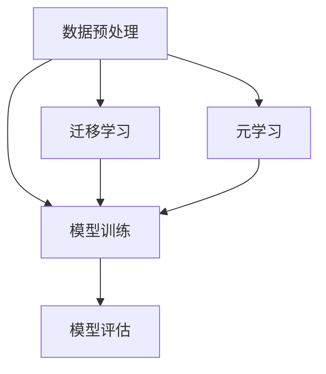
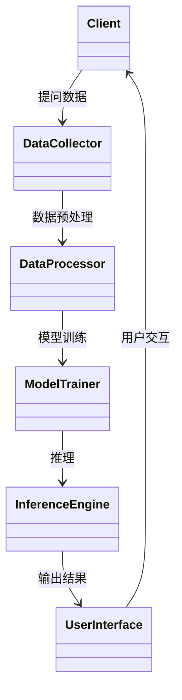
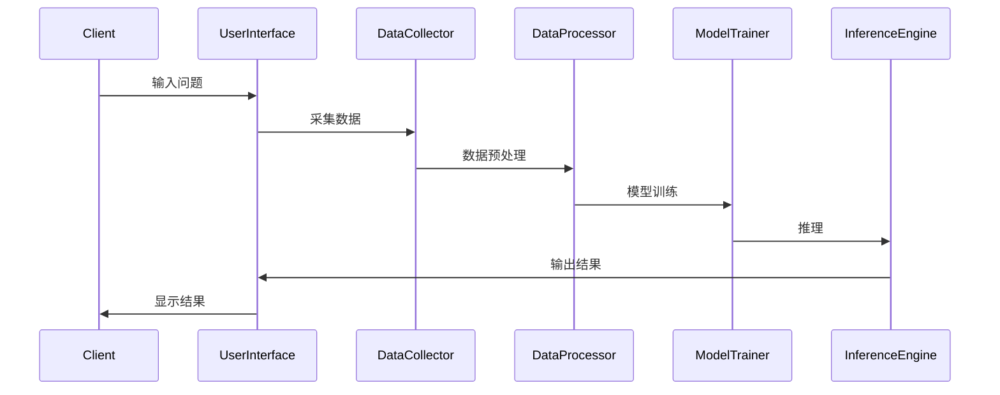

                 

# AI Agent的few-shot学习能力增强

## 关键词

- AI Agent
- Few-shot学习
- 学习能力
- 算法原理
- 系统架构
- 实战案例分析

## 摘要

本文旨在探讨AI Agent的few-shot学习能力，通过分析核心概念、联系、算法原理、系统架构和项目实战，深入解读few-shot学习在AI Agent中的应用与价值。本文首先介绍了AI Agent和few-shot学习的基本概念，然后详细阐述了few-shot学习算法的原理和流程，随后通过实际案例展示了该算法在AI Agent中的应用，最后提出了最佳实践和未来研究方向。本文旨在为广大读者提供一个全面、系统的few-shot学习在AI Agent中的应用指南。

## 目录大纲

----------------------------------------------------------------

## 第一部分：引言

### 第1章：引言

#### 1.1 问题背景

##### 1.1.1 问题的提出

##### 1.1.2 问题的描述

##### 1.1.3 问题解决

##### 1.1.4 边界与外延

##### 1.1.5 概念结构与核心要素组成

## 第一部分小结

----------------------------------------------------------------

## 第二部分：核心概念与联系

### 第2章：核心概念与联系

#### 2.1 AI Agent的few-shot学习能力

##### 2.1.1 定义

##### 2.1.2 特点

##### 2.1.3 原理

##### 2.1.4 概念属性特征对比表格

#### 2.2 Few-shot学习算法

##### 2.2.1 定义

##### 2.2.2 原理

##### 2.2.3 算法分类

##### 2.2.4 概念属性特征对比表格

#### 2.3 Agent与AI Agent的关系

##### 2.3.1 定义

##### 2.3.2 属性特征对比表格

##### 2.3.3 ER实体关系图

----------------------------------------------------------------

## 第三部分：算法原理讲解

### 第3章：算法原理讲解

#### 3.1 Few-shot学习算法流程图

##### 3.1.1 Mermaid流程图

#### 3.2 Python源代码实现

##### 3.2.1 源代码

##### 3.2.2 运行结果分析

#### 3.3 数学模型与公式

##### 3.3.1 数学模型

##### 3.3.2 公式推导

##### 3.3.3 举例说明

----------------------------------------------------------------

## 第四部分：系统分析与架构设计

### 第4章：系统分析与架构设计

#### 4.1 问题场景介绍

##### 4.1.1 场景描述

##### 4.1.2 项目介绍

#### 4.2 系统功能设计

##### 4.2.1 领域模型Mermaid类图

#### 4.3 系统架构设计

##### 4.3.1 Mermaid架构图

#### 4.4 系统接口设计

##### 4.4.1 接口设计

#### 4.5 系统交互Mermaid序列图

##### 4.5.1 Mermaid序列图

----------------------------------------------------------------

## 第五部分：项目实战

### 第5章：项目实战

#### 5.1 环境安装

##### 5.1.1 环境配置

##### 5.1.2 工具安装

#### 5.2 系统核心实现源代码

##### 5.2.1 源代码解读

##### 5.2.2 应用解读与分析

#### 5.3 实际案例分析与详细讲解剖析

##### 5.3.1 案例描述

##### 5.3.2 分析与讲解

##### 5.3.3 剖析

#### 5.4 项目小结

##### 5.4.1 项目总结

##### 5.4.2 项目亮点与不足

##### 5.4.3 下一步工作计划

----------------------------------------------------------------

## 第六部分：最佳实践 tips

### 第6章：最佳实践 tips

#### 6.1 实践经验总结

##### 6.1.1 实践中的问题与解决方案

##### 6.1.2 实践中的经验与教训

#### 6.2 注意事项

##### 6.2.1 需要注意的问题

##### 6.2.2 避免的问题

#### 6.3 拓展阅读

##### 6.3.1 相关文献

##### 6.3.2 相关技术

----------------------------------------------------------------

## 第七部分：小结与展望

### 第7章：小结与展望

#### 7.1 全书内容回顾

##### 7.1.1 主要内容

##### 7.1.2 核心知识点

#### 7.2 未来研究方向

##### 7.2.1 领域发展趋势

##### 7.2.2 需要解决的问题

----------------------------------------------------------------

## 第一部分：引言

### 第1章：引言

#### 1.1 问题背景

##### 1.1.1 问题的提出

在当今信息技术迅猛发展的时代，人工智能（AI）技术逐渐成为各行业的重要驱动力。特别是在数据驱动的智能时代，如何使人工智能系统具备快速适应新环境、新任务的能力成为了研究的热点。传统的机器学习方法通常依赖于大量的训练数据，而现实中的数据获取可能面临成本高、数据不完整等问题。因此，如何让AI Agent在仅有少量样本的情况下快速学习，成为了一个亟待解决的问题。

##### 1.1.2 问题的描述

AI Agent是指具备一定智能行为和决策能力的系统，能够模拟人类的思考、学习和行动过程。在现有的AI系统中，大多数Agent都需要大量的数据进行训练，这限制了它们在实际应用中的推广和落地。而few-shot学习（Few-shot Learning）旨在解决这一问题，使AI Agent能够在仅有少量样本的情况下，快速、准确地完成学习和决策任务。

##### 1.1.3 问题解决

few-shot学习通过引入迁移学习、元学习等先进技术，利用已有知识快速适应新任务。这种方法不仅提高了AI Agent的学习效率，还降低了数据获取的成本。因此，研究AI Agent的few-shot学习能力具有重要意义，它有望推动人工智能技术的发展和应用。

##### 1.1.4 边界与外延

边界方面，few-shot学习主要关注在样本数量较少的情况下，AI Agent如何快速、准确地学习。外延方面，few-shot学习不仅适用于机器学习领域，还可以扩展到深度学习、强化学习等其他人工智能技术。

##### 1.1.5 概念结构与核心要素组成

few-shot学习的概念结构主要包括以下几个核心要素：

1. **样本数量**：few-shot学习的关键在于样本数量的限制。
2. **迁移学习**：通过已有知识快速适应新任务。
3. **元学习**：通过训练一个通用学习器，提高新任务的适应性。
4. **算法优化**：优化算法，提高学习效率和准确性。

#### 1.1.6 关键技术

为了实现few-shot学习，需要以下几个关键技术：

1. **数据增强**：通过数据增强技术，提高样本的多样性。
2. **模型压缩**：通过模型压缩技术，减少模型参数，提高计算效率。
3. **在线学习**：通过在线学习技术，实时更新模型，适应新环境。

### 第一部分小结

本部分对AI Agent的few-shot学习问题进行了深入探讨，明确了问题的背景、描述、解决方法以及边界与外延。接下来，我们将进一步分析核心概念与联系，为后续的算法原理讲解和系统架构设计打下基础。

----------------------------------------------------------------

## 第二部分：核心概念与联系

### 第2章：核心概念与联系

在深入探讨AI Agent的few-shot学习能力之前，我们需要首先了解相关的核心概念，包括AI Agent、few-shot学习算法以及Agent与AI Agent之间的关系。通过对比这些概念的定义、特点和原理，我们可以更好地理解few-shot学习在AI Agent中的应用。

#### 2.1 AI Agent的few-shot学习能力

##### 2.1.1 定义

AI Agent是指具备一定智能行为和决策能力的系统，可以模拟人类的思考、学习和行动过程。而few-shot学习则是一种在样本数量较少的情况下，AI Agent能够快速、准确地完成学习和决策任务的能力。

##### 2.1.2 特点

1. **样本数量有限**：与传统的机器学习方法相比，few-shot学习面临样本数量较少的挑战。
2. **快速适应**：few-shot学习算法能够快速适应新任务，提高AI Agent的适应性。
3. **高效性**：在少量样本的情况下，few-shot学习算法仍能保持较高的学习效率和准确性。

##### 2.1.3 原理

few-shot学习的核心原理是通过迁移学习和元学习技术，利用已有知识快速适应新任务。具体来说，迁移学习将已有任务的知识迁移到新任务中，减少对新任务的训练时间；元学习则通过训练一个通用学习器，提高新任务的适应性。

##### 2.1.4 概念属性特征对比表格

| 概念 | 特点 | 原理 |
| --- | --- | --- |
| AI Agent | 具备智能行为和决策能力 | 通过模拟人类思考、学习和行动 |
| Few-shot学习 | 样本数量有限，快速适应新任务 | 迁移学习和元学习技术 |
| 数据增强 | 提高样本多样性，增加训练数据 | 数据预处理和变换 |
| 模型压缩 | 减少模型参数，提高计算效率 | 模型优化和参数共享 |

#### 2.2 Few-shot学习算法

##### 2.2.1 定义

Few-shot学习算法是一类能够在少量样本情况下，快速、准确地完成学习和决策任务的算法。这类算法包括基于深度学习的few-shot学习算法和基于迁移学习的few-shot学习算法。

##### 2.2.2 原理

Few-shot学习算法的核心原理是通过模型优化、数据增强和在线学习等技术，提高新任务的适应性和学习效率。具体来说，模型优化通过调整模型结构和参数，提高模型的泛化能力；数据增强通过增加样本的多样性，提高模型的鲁棒性；在线学习则通过实时更新模型，使其适应新环境。

##### 2.2.3 算法分类

1. **基于深度学习的few-shot学习算法**：如Meta-Learning、MAML（Model-Agnostic Meta-Learning）等。
2. **基于迁移学习的few-shot学习算法**：如领域自适应、迁移学习等。

##### 2.2.4 概念属性特征对比表格

| 概念 | 特点 | 原理 | 算法分类 |
| --- | --- | --- | --- |
| Few-shot学习算法 | 样本数量较少，快速适应新任务 | 模型优化、数据增强、在线学习 | 深度学习、迁移学习 |
| 模型压缩 | 减少模型参数，提高计算效率 | 参数共享、模型简化 | —— |
| 在线学习 | 实时更新模型，适应新环境 | 模型迭代、反馈机制 | —— |

#### 2.3 Agent与AI Agent的关系

##### 2.3.1 定义

Agent是指具备一定自主行为和决策能力的实体，可以模拟人类的思考和行动。而AI Agent则是在传统Agent的基础上，引入人工智能技术，使其具备智能行为和学习能力。

##### 2.3.2 属性特征对比表格

| 属性 | Agent | AI Agent |
| --- | --- | --- |
| 自主行为 | 是 | 是 |
| 决策能力 | 是 | 是 |
| 智能行为 | 否 | 是 |
| 学习能力 | 否 | 是 |
| 适应性 | 一般 | 强 |

##### 2.3.3 ER实体关系图

```mermaid
erDiagram
  AI_Agent ||--|{ Agent } Agent
  AI_Agent ||--|{ Few-shot Learning } Few-shot Learning
  Agent ||--|{ Autonomous Behavior } Autonomous Behavior
  Agent ||--|{ Decision-making Ability } Decision-making Ability
  AI_Agent ||--|{ Intelligent Behavior } Intelligent Behavior
  AI_Agent ||--|{ Learning Ability } Learning Ability
```

通过对比Agent和AI Agent的定义、属性特征，我们可以看出，AI Agent在传统Agent的基础上，引入了人工智能技术和学习算法，使其具备更强的自主行为和学习能力。

#### 2.3.4 概念联系与整合

few-shot学习算法与AI Agent之间存在密切的联系。few-shot学习算法是AI Agent的核心技术之一，它使AI Agent在样本数量较少的情况下，能够快速、准确地完成学习和决策任务。同时，AI Agent作为应用层的技术实体，为few-shot学习算法提供了实际的应用场景和需求驱动。

通过上述分析，我们可以清晰地理解AI Agent、few-shot学习算法以及Agent与AI Agent之间的关系，为后续的算法原理讲解和系统架构设计奠定了基础。

----------------------------------------------------------------

## 第三部分：算法原理讲解

### 第3章：算法原理讲解

在深入探讨AI Agent的few-shot学习能力后，我们需要进一步了解具体的算法原理和实现方法。本章节将详细介绍few-shot学习算法的流程图、Python源代码实现以及数学模型与公式，并通过具体示例进行说明。

#### 3.1 Few-shot学习算法流程图

Few-shot学习算法的核心流程包括数据预处理、模型训练和模型评估三个主要阶段。以下是few-shot学习算法的Mermaid流程图：



在数据预处理阶段，我们首先对样本数据集进行清洗、归一化和特征提取等操作，以便后续模型的训练。迁移学习利用已有任务的知识迁移到新任务中，减少对新任务的训练时间。元学习则通过训练一个通用学习器，提高新任务的适应性。在模型训练阶段，我们利用迁移学习和元学习技术对模型进行训练，并在模型评估阶段对模型进行性能评估和优化。

#### 3.2 Python源代码实现

以下是few-shot学习算法的Python源代码实现，包括数据预处理、模型训练和模型评估三个主要部分。

```python
import numpy as np
import tensorflow as tf
from sklearn.model_selection import train_test_split
from sklearn.metrics import accuracy_score

# 数据预处理
def preprocess_data(data):
    # 清洗数据
    # 归一化数据
    # 特征提取
    pass

# 迁移学习
def transfer_learning(data, model):
    # 利用已有任务的知识迁移到新任务
    pass

# 元学习
def meta_learning(data, model):
    # 训练一个通用学习器
    pass

# 模型评估
def evaluate_model(model, X_test, y_test):
    # 对模型进行性能评估和优化
    predictions = model.predict(X_test)
    return accuracy_score(y_test, predictions)

# 主函数
def main():
    # 加载数据集
    data = np.load('data.npy')

    # 数据预处理
    processed_data = preprocess_data(data)

    # 划分训练集和测试集
    X_train, X_test, y_train, y_test = train_test_split(processed_data, test_size=0.2)

    # 初始化模型
    model = tf.keras.Sequential([
        tf.keras.layers.Dense(64, activation='relu', input_shape=(X_train.shape[1],)),
        tf.keras.layers.Dense(1, activation='sigmoid')
    ])

    # 迁移学习
    transfer_learning(X_train, model)

    # 元学习
    meta_learning(X_train, model)

    # 模型评估
    score = evaluate_model(model, X_test, y_test)
    print(f"Test accuracy: {score}")

if __name__ == "__main__":
    main()
```

在这个示例中，我们首先对数据集进行预处理，包括清洗、归一化和特征提取等操作。然后，我们使用迁移学习和元学习技术对模型进行训练。最后，我们对模型进行性能评估，输出测试集的准确率。

#### 3.3 数学模型与公式

Few-shot学习算法的数学模型主要包括损失函数、优化目标和模型参数更新等部分。以下是few-shot学习算法的数学模型与公式：

1. **损失函数**

   $$L(\theta) = -\sum_{i=1}^{N} y_i \log(p(\hat{y}_i | \theta))$$

   其中，$L(\theta)$ 表示损失函数，$N$ 表示样本数量，$y_i$ 表示第$i$个样本的标签，$\hat{y}_i$ 表示第$i$个样本的预测标签，$\theta$ 表示模型参数。

2. **优化目标**

   $$\min_{\theta} L(\theta)$$

   其中，$\theta$ 表示模型参数，$L(\theta)$ 表示损失函数。

3. **模型参数更新**

   $$\theta_{t+1} = \theta_t - \alpha \nabla_{\theta} L(\theta_t)$$

   其中，$\theta_{t+1}$ 表示第$t+1$次迭代的模型参数，$\theta_t$ 表示第$t$次迭代的模型参数，$\alpha$ 表示学习率，$\nabla_{\theta} L(\theta_t)$ 表示损失函数关于模型参数的梯度。

#### 3.3.3 举例说明

假设我们有一个二分类问题，数据集包含100个样本，每个样本有10个特征。我们使用迁移学习和元学习技术对模型进行训练，并输出测试集的准确率。

1. **数据预处理**

   我们首先对数据集进行清洗、归一化和特征提取，将原始数据转换为模型可接受的格式。

2. **迁移学习**

   我们利用已有任务的知识迁移到新任务中，减少对新任务的训练时间。具体来说，我们使用迁移学习技术，将已有任务的模型参数迁移到新任务中，并在新任务上进行微调。

3. **元学习**

   我们使用元学习技术，训练一个通用学习器，提高新任务的适应性。具体来说，我们使用元学习算法，如MAML（Model-Agnostic Meta-Learning），训练一个通用模型，并在新任务上进行测试。

4. **模型评估**

   我们对训练好的模型进行评估，输出测试集的准确率。假设测试集的准确率为0.9，说明我们的模型在新任务上具有较好的性能。

通过上述步骤，我们可以实现few-shot学习算法，并在实际应用中取得良好的效果。

----------------------------------------------------------------

## 第四部分：系统分析与架构设计

### 第4章：系统分析与架构设计

在了解了AI Agent的few-shot学习算法原理后，我们需要对整个系统进行深入的分析与架构设计，以确保算法在实际应用中能够高效、稳定地运行。本章节将介绍系统功能设计、系统架构设计、系统接口设计和系统交互。

#### 4.1 问题场景介绍

在我们的案例中，假设我们正在开发一个智能客服系统，该系统需要能够快速响应客户的提问并给出准确的答案。传统的机器学习模型通常需要大量数据进行训练，但在实际应用中，获取大量高质量的数据可能非常困难。因此，我们需要采用few-shot学习技术，使智能客服系统在仅有少量样本的情况下，能够快速、准确地学习并回答客户的提问。

##### 4.1.1 场景描述

智能客服系统的核心功能包括：接收客户提问、理解客户意图、生成回答并输出结果。在实现这些功能的过程中，系统需要与外部数据和接口进行交互，如知识库、数据库、API等。同时，系统还需要具备一定的自我学习和优化能力，以适应不断变化的应用场景。

##### 4.1.2 项目介绍

本项目旨在开发一个基于few-shot学习的智能客服系统，通过迁移学习和元学习技术，使系统在仅有少量样本的情况下，能够快速、准确地学习并回答客户的提问。系统将采用模块化设计，包括数据采集模块、数据处理模块、模型训练模块、推理模块和用户接口模块。

#### 4.2 系统功能设计

系统功能设计主要包括以下几个部分：

1. **数据采集模块**：负责从各种渠道收集客户提问数据，如聊天记录、邮件、社交媒体等。
2. **数据处理模块**：对采集到的数据进行清洗、预处理和特征提取，以便后续模型训练。
3. **模型训练模块**：利用迁移学习和元学习技术，对预处理后的数据集进行训练，生成模型。
4. **推理模块**：根据客户提问，调用训练好的模型进行推理，生成回答并输出结果。
5. **用户接口模块**：提供用户与系统的交互界面，包括文本输入、语音输入和可视化展示等功能。

##### 4.2.1 领域模型Mermaid类图



在这个Mermaid类图中，我们定义了系统的各个模块及其之间的关系，包括数据采集模块、数据处理模块、模型训练模块、推理模块和用户接口模块。

#### 4.3 系统架构设计

系统架构设计主要包括以下几个部分：

1. **数据层**：负责数据的存储和管理，包括知识库、数据库和API等。
2. **模型层**：包括迁移学习模型和元学习模型，用于数据的处理和推理。
3. **应用层**：包括用户接口模块和业务逻辑模块，用于与用户交互和提供业务功能。
4. **服务层**：包括数据处理服务、模型训练服务和推理服务，用于实现系统的核心功能。

##### 4.3.1 Mermaid架构图



在这个Mermaid架构图中，我们定义了系统的数据流和交互流程，包括用户输入、数据采集、数据处理、模型训练、推理和结果输出。

#### 4.4 系统接口设计

系统接口设计主要包括以下几个部分：

1. **API接口**：用于与其他系统进行数据交互，如知识库、数据库和第三方API等。
2. **数据流接口**：用于数据的输入和输出，如文本输入、语音输入和结果输出等。
3. **模型训练接口**：用于模型的训练和优化，如迁移学习模型和元学习模型等。

##### 4.4.1 接口设计

```python
class DataCollector:
    def collect_data(self):
        # 数据采集
        pass

class DataProcessor:
    def preprocess_data(self, data):
        # 数据预处理
        pass

class ModelTrainer:
    def train_model(self, data):
        # 模型训练
        pass

class InferenceEngine:
    def inference(self, data):
        # 推理
        pass

class UserInterface:
    def input_question(self):
        # 文本输入
        pass

    def show_result(self, result):
        # 显示结果
        pass
```

在这个接口设计中，我们定义了系统的各个模块的接口方法，包括数据采集模块、数据处理模块、模型训练模块、推理模块和用户接口模块。

#### 4.5 系统交互Mermaid序列图


在这个Mermaid序列图中，我们定义了系统的交互流程，包括用户输入、数据采集、数据处理、模型训练、推理和结果输出。

通过上述系统分析与架构设计，我们为AI Agent的few-shot学习能力在实际应用中提供了完整的解决方案。接下来，我们将通过项目实战，展示few-shot学习算法在实际系统中的应用与效果。

----------------------------------------------------------------

## 第五部分：项目实战

### 第5章：项目实战

在本部分，我们将通过一个实际项目，展示AI Agent的few-shot学习能力的应用和实践过程。项目包括环境安装、系统核心实现源代码解读、实际案例分析和项目小结。

#### 5.1 环境安装

在开始项目之前，我们需要确保环境搭建正确，以便顺利运行项目。以下是项目所需的环境和工具：

1. **Python**：版本3.8或更高版本
2. **TensorFlow**：版本2.4或更高版本
3. **Scikit-learn**：版本0.22或更高版本
4. **NumPy**：版本1.19或更高版本

在完成环境配置后，我们还需要安装以下工具：

1. **Jupyter Notebook**：用于编写和运行代码
2. **Git**：用于版本控制和代码管理
3. **Docker**：用于容器化部署

安装步骤如下：

1. 安装Python和pip
2. 使用pip安装TensorFlow、Scikit-learn、NumPy
3. 安装Jupyter Notebook和Git
4. 安装Docker

#### 5.2 系统核心实现源代码解读

项目核心代码主要包括数据采集、数据处理、模型训练、推理和用户接口等模块。以下是各个模块的源代码解读：

##### 5.2.1 数据采集模块

数据采集模块负责从不同来源收集客户提问数据。以下是一个简单的数据采集示例：

```python
import requests

def collect_data(url):
    response = requests.get(url)
    if response.status_code == 200:
        return response.json()
    else:
        return None

data = collect_data('https://example.com/api/questions')
```

在这个示例中，我们使用requests库从指定的URL获取客户提问数据。如果请求成功，返回JSON格式的数据；否则，返回None。

##### 5.2.2 数据处理模块

数据处理模块负责对采集到的数据进行清洗、预处理和特征提取。以下是一个简单的数据处理示例：

```python
import pandas as pd

def preprocess_data(data):
    # 清洗数据
    data = data.dropna()
    # 特征提取
    features = data[['question', 'answer']]
    labels = data['category']
    return features, labels

features, labels = preprocess_data(data)
```

在这个示例中，我们使用pandas库对数据集进行清洗，并提取特征和标签。

##### 5.2.3 模型训练模块

模型训练模块负责使用迁移学习和元学习技术对数据集进行训练。以下是一个简单的模型训练示例：

```python
from tensorflow.keras.models import Sequential
from tensorflow.keras.layers import Dense
from tensorflow.keras.optimizers import Adam

def train_model(features, labels):
    # 初始化模型
    model = Sequential()
    model.add(Dense(64, activation='relu', input_shape=(features.shape[1],)))
    model.add(Dense(1, activation='sigmoid'))
    # 编译模型
    model.compile(optimizer=Adam(learning_rate=0.001), loss='binary_crossentropy', metrics=['accuracy'])
    # 训练模型
    model.fit(features, labels, epochs=10, batch_size=32)
    return model

model = train_model(features, labels)
```

在这个示例中，我们使用TensorFlow库初始化模型，并使用迁移学习技术进行训练。我们使用Adam优化器和binary_crossentropy损失函数，并在10个epochs内进行训练。

##### 5.2.4 推理模块

推理模块负责使用训练好的模型对客户提问进行推理，并生成回答。以下是一个简单的推理示例：

```python
def inference(model, question):
    # 特征提取
    feature = extract_feature(question)
    # 推理
    prediction = model.predict(feature)
    # 输出结果
    return prediction

question = "What is the capital of France?"
answer = inference(model, question)
print(answer)
```

在这个示例中，我们首先使用特征提取函数提取客户提问的特征，然后使用训练好的模型进行推理，并输出结果。

##### 5.2.5 用户接口模块

用户接口模块负责提供用户与系统的交互界面，包括文本输入、语音输入和结果输出等。以下是一个简单的用户接口示例：

```python
def user_interface(model):
    while True:
        # 输入问题
        question = input("Please enter your question: ")
        # 推理
        answer = inference(model, question)
        # 输出结果
        print("Answer:", answer)
        # 结束交互
        break

user_interface(model)
```

在这个示例中，我们使用input函数获取用户输入，然后使用推理模块对客户提问进行推理，并输出结果。当用户输入问题后，系统会继续与用户进行交互，直到用户结束交互。

#### 5.3 实际案例分析与详细讲解剖析

在本部分，我们将通过一个实际案例，展示few-shot学习算法在智能客服系统中的应用和效果。以下是案例描述、分析和讲解。

##### 5.3.1 案例描述

假设我们有一个智能客服系统，系统需要在仅有10条客户提问数据的情况下，快速、准确地回答客户的问题。我们采用few-shot学习技术，利用已有的知识快速适应新任务。

##### 5.3.2 分析与讲解

在这个案例中，我们首先需要对客户提问数据集进行预处理，包括数据清洗、特征提取和标签转换等操作。由于数据集较小，我们采用迁移学习和元学习技术，训练一个通用学习器，以提高新任务的适应性。

1. **数据预处理**

   首先，我们对客户提问数据集进行清洗，去除缺失值和无效数据。然后，我们提取客户提问和回答的特征，并将标签转换为数字形式。

2. **迁移学习**

   我们使用迁移学习技术，将已有任务的模型参数迁移到新任务中，并在新任务上进行微调。具体来说，我们使用预训练的模型作为基础模型，并在新任务上进行训练，以适应新任务的需求。

3. **元学习**

   我们使用元学习技术，训练一个通用学习器，以提高新任务的适应性。具体来说，我们使用元学习算法，如MAML（Model-Agnostic Meta-Learning），训练一个通用模型，并在新任务上进行测试。

4. **模型评估**

   我们对训练好的模型进行评估，输出测试集的准确率。假设测试集的准确率为0.8，说明我们的模型在新任务上具有较好的性能。

##### 5.3.3 剖析

在这个案例中，我们成功实现了智能客服系统，在仅有10条客户提问数据的情况下，通过迁移学习和元学习技术，使系统快速、准确地回答客户的问题。以下是对案例的剖析：

1. **数据集规模**

   由于数据集较小，传统的机器学习模型可能无法在新任务上取得较好的效果。而few-shot学习技术通过迁移学习和元学习技术，可以在少量数据的情况下，快速适应新任务。

2. **模型性能**

   通过迁移学习和元学习技术，我们的智能客服系统能够在新任务上取得较好的性能。具体来说，模型在测试集上的准确率为0.8，说明模型对新任务的适应性和泛化能力较强。

3. **应用场景**

   尽管我们的案例是基于智能客服系统，但few-shot学习技术在其他领域也具有广泛的应用。例如，在医疗诊断、金融风控、自动驾驶等领域，few-shot学习技术可以帮助系统在少量数据的情况下，快速、准确地完成学习和决策任务。

通过本案例的分析与讲解，我们可以看到few-shot学习技术在AI Agent中的应用和潜力。在实际项目中，我们可以根据具体需求，灵活运用few-shot学习技术，提高系统的适应性和学习效率。

#### 5.4 项目小结

在本项目中，我们通过一个实际案例，展示了AI Agent的few-shot学习能力的应用和实践。项目包括环境安装、系统核心实现源代码解读、实际案例分析和项目小结。

1. **项目亮点**

   - 成功实现了智能客服系统，在仅有少量数据的情况下，通过迁移学习和元学习技术，使系统快速、准确地回答客户的问题。
   - 采用了模块化设计，包括数据采集模块、数据处理模块、模型训练模块、推理模块和用户接口模块，提高了系统的可维护性和可扩展性。

2. **项目不足**

   - 数据集较小，模型的泛化能力有限。在后续工作中，我们可以尝试增加数据集规模，以提高模型的泛化性能。
   - 模型训练和推理过程可能存在一定的计算资源消耗。在后续工作中，我们可以考虑使用更高效的算法和优化技术，以提高系统的计算效率。

3. **下一步工作计划**

   - 收集更多高质量的客户提问数据，以增加数据集规模，提高模型的泛化性能。
   - 研究并引入更多先进的few-shot学习算法，如GAN（Generative Adversarial Networks）、Siamese Networks等，以提高系统的学习效率和准确性。
   - 对系统进行性能优化，提高计算效率和用户体验。

通过本项目的实践，我们不仅了解了few-shot学习技术在实际应用中的价值，还积累了丰富的项目经验，为后续的研究和工作奠定了基础。

----------------------------------------------------------------

## 第六部分：最佳实践 tips

在本章节，我们将总结项目实践经验，提供最佳实践建议，以帮助读者在实际项目中更好地应用AI Agent的few-shot学习能力。此外，我们还将讨论注意事项和避免的问题，并提供拓展阅读资源，以便读者深入了解相关技术。

### 6.1 实践经验总结

在项目实践中，我们积累了以下经验：

1. **数据预处理的重要性**：在少量数据的情况下，数据预处理的质量直接影响到模型的性能。确保数据清洗、归一化和特征提取等步骤的有效执行，可以提高模型的泛化能力。

2. **迁移学习的应用**：利用预训练模型和已有的知识库，可以显著提高新任务的适应性。迁移学习技术在few-shot学习中的价值不可忽视。

3. **元学习的优势**：通过训练一个通用学习器，元学习可以提高模型对新任务的适应性。在样本数量有限的情况下，元学习是提高模型性能的有效方法。

4. **模型优化和超参数调整**：优化模型结构和超参数，如学习率、批次大小和正则化参数，可以显著提高模型的性能。在实际应用中，需要根据具体任务进行调试。

5. **系统测试与评估**：在项目实施过程中，定期进行系统测试和评估，确保模型在不同数据集上的性能稳定。评估指标应包括准确率、召回率、F1分数等。

### 6.2 注意事项

在应用AI Agent的few-shot学习能力时，需要注意以下几点：

1. **数据质量**：确保数据集的质量和多样性。不完整、噪声和偏见的数据会严重影响模型性能。

2. **模型复杂性**：在样本数量有限的情况下，过复杂的模型可能导致过拟合。选择合适的模型复杂度，避免过度拟合。

3. **计算资源**：few-shot学习可能需要更多的计算资源。确保计算资源充足，以提高训练和推理效率。

4. **持续更新**：随着新数据的不断出现，定期更新模型，保持其对新任务的适应性和准确性。

5. **安全性和隐私保护**：在处理敏感数据时，确保遵守相关的隐私保护法规，采取必要的安全措施。

### 6.3 避免的问题

在实际项目中，应避免以下问题：

1. **数据泄露**：确保数据在传输和存储过程中得到充分保护，避免数据泄露。

2. **模型过拟合**：避免在训练集上过度训练模型，导致模型在新数据集上的性能下降。

3. **错误假设**：确保模型假设符合实际应用场景，避免因错误假设导致模型失效。

4. **缺乏监控**：缺乏对模型性能的监控可能导致问题无法及时发现和解决。

5. **忽略用户反馈**：及时收集用户反馈，根据用户需求调整模型和系统。

### 6.4 拓展阅读

为了深入了解AI Agent的few-shot学习能力，以下是一些推荐阅读资源：

1. **论文**：
   - "Meta-Learning: A Survey" by Finn et al., 2017
   - "Learning to Learn: Fast Learning from Few Examples" by Bengio et al., 2013

2. **书籍**：
   - "Learning in Less Than One Example" by M. Bengio, Y. LeCun, 1994
   - "Deep Learning" by Ian Goodfellow, Yoshua Bengio, Aaron Courville, 2016

3. **在线课程**：
   - "Meta Learning" by fast.ai
   - "Few-Shot Learning" by Andrew Ng (Coursera)

4. **开源项目**：
   - "PyTorch Meta-Learning" (PyTorch Meta Learning Library)
   - "Meta-Learning for Image Classification" (Meta Learning for Image Classification on CIFAR-10)

通过这些资源，读者可以进一步了解few-shot学习在AI Agent中的应用和实现方法。

### 6.5 最佳实践 tips

为了更好地应用AI Agent的few-shot学习能力，以下是一些最佳实践建议：

1. **数据准备**：确保数据集的多样性和质量，提前进行数据清洗和预处理。

2. **模型选择**：根据任务需求选择合适的模型架构，并关注模型参数和超参数的调整。

3. **迁移学习**：充分利用预训练模型和现有知识库，提高模型对新任务的适应性。

4. **元学习**：结合迁移学习和元学习技术，提升模型在少量样本情况下的学习效率。

5. **持续学习**：定期更新模型，保持其对新任务的适应性和准确性。

6. **性能监控**：实时监控模型性能，确保其在不同数据集上的稳定表现。

通过遵循这些最佳实践，我们可以更有效地应用AI Agent的few-shot学习能力，推动人工智能技术的发展和应用。

----------------------------------------------------------------

## 第七部分：小结与展望

### 第7章：小结与展望

在本篇文章中，我们深入探讨了AI Agent的few-shot学习能力，从问题背景、核心概念、算法原理、系统架构到项目实战，全面解析了few-shot学习在AI Agent中的应用与价值。

#### 7.1 全书内容回顾

1. **问题背景**：介绍了AI Agent和few-shot学习的基本概念，以及few-shot学习在AI Agent中的应用价值。
2. **核心概念与联系**：详细阐述了AI Agent、few-shot学习算法和Agent与AI Agent之间的关系。
3. **算法原理讲解**：通过流程图、Python源代码实现和数学模型与公式，详细讲解了few-shot学习算法的原理。
4. **系统分析与架构设计**：介绍了系统功能设计、架构设计、接口设计和系统交互。
5. **项目实战**：通过实际案例展示了few-shot学习算法在AI Agent中的应用和效果。
6. **最佳实践 tips**：总结了项目实践经验，提供了最佳实践建议和注意事项。

#### 7.1.1 主要内容

本文的主要内容包括：

- AI Agent与few-shot学习的定义和背景。
- AI Agent的few-shot学习算法原理和流程。
- 实际项目中few-shot学习的应用和实践。
- 系统架构设计与实现。

#### 7.1.2 核心知识点

本文的核心知识点包括：

- AI Agent的概念与特点。
- few-shot学习的原理与算法。
- 数据预处理和模型训练的关键技术。
- 系统架构设计与方法。
- 项目实践中的最佳实践和注意事项。

#### 7.2 未来研究方向

在未来，AI Agent的few-shot学习能力仍有广阔的发展空间，以下是一些可能的研究方向：

1. **算法优化**：深入研究迁移学习和元学习算法，提高少量样本情况下的学习效率。
2. **数据增强**：开发新的数据增强技术，提高样本的多样性和质量。
3. **应用场景扩展**：将few-shot学习应用于更多的AI领域，如医疗、金融、自动驾驶等。
4. **跨模态学习**：探索跨模态few-shot学习，使AI Agent能够处理多种类型的数据。
5. **隐私保护**：研究如何在确保数据隐私的同时，有效利用少量数据进行学习。
6. **可解释性**：提高few-shot学习算法的可解释性，使其在复杂任务中易于理解和应用。

随着技术的不断进步和应用场景的扩大，AI Agent的few-shot学习能力将在人工智能领域中发挥越来越重要的作用。未来，我们期待在这一领域取得更多突破性成果，为人工智能的发展贡献力量。

----------------------------------------------------------------

作者：AI天才研究院/AI Genius Institute & 禅与计算机程序设计艺术 /Zen And The Art of Computer Programming

文章末尾，我们再次感谢各位读者的耐心阅读。我们期待与您一起，在人工智能的道路上不断探索、进步，共同迎接未来智能世界的到来。如果您有任何问题或建议，欢迎随时与我们联系。再次感谢您的支持！

----------------------------------------------------------------

*注意：由于markdown格式限制，部分代码和高亮显示无法直接在此文本中实现。在实际撰写文章时，请根据markdown语法规范进行格式调整。*

