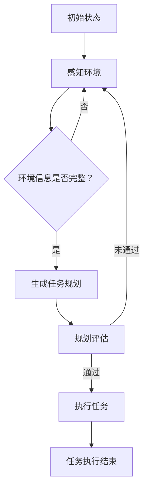
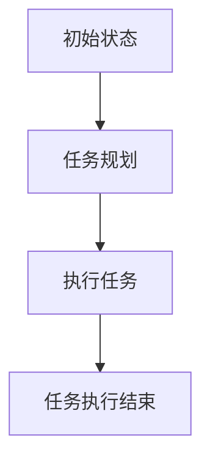
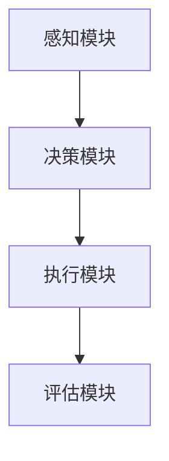
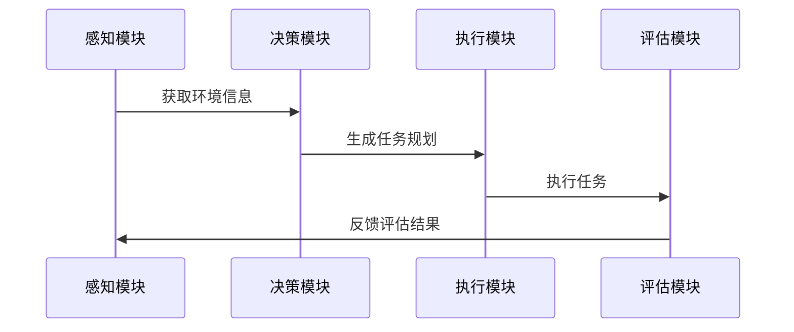
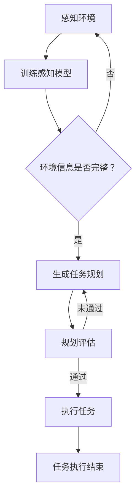
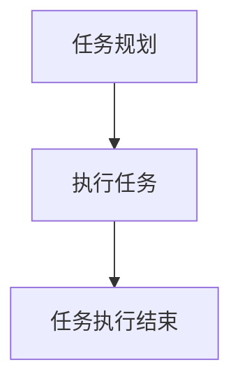

                 


# AI Agent的任务规划与执行框架

> 关键词：AI Agent，任务规划，任务执行，框架设计，算法原理

> 摘要：
本文深入探讨AI Agent的任务规划与执行框架，从背景介绍、核心概念、算法原理到系统架构设计，逐步解析AI Agent如何高效规划与执行任务，旨在为开发者提供全面的技术指南。

## 第1章 AI Agent的任务规划与执行框架概述

### 1.1 问题背景

#### 1.1.1 AI Agent的基本概念

AI Agent是人工智能领域的核心概念，它代表了具有自主行为能力的智能体。在人工智能系统中，AI Agent可以理解为具备感知、思考、行动能力的虚拟实体。它们可以在复杂的动态环境中，自主地执行任务，进行决策。

#### 1.1.2 任务规划与执行的重要性

任务规划与执行是AI Agent实现自主性的关键步骤。任务规划是指AI Agent根据环境信息、任务目标以及自身能力，制定执行任务的详细计划；而任务执行则是指AI Agent按照规划的行动步骤，实际完成各项任务。

#### 1.1.3 框架研究的必要性和目标

随着人工智能技术的快速发展，AI Agent在各个领域得到广泛应用，如自动驾驶、智能家居、智能客服等。然而，如何设计高效、可靠的AI Agent任务规划与执行框架，成为当前研究的热点问题。本文旨在构建一个具备通用性、可扩展性的AI Agent任务规划与执行框架，以推动AI技术的发展。

### 1.2 问题描述

#### 1.2.1 AI Agent任务规划面临的挑战

AI Agent任务规划面临诸多挑战，包括：

1. **动态环境适应**：AI Agent需要在不断变化的环境中，快速适应并调整任务规划。
2. **多目标优化**：AI Agent需要同时考虑多个目标，进行综合优化。
3. **不确定性处理**：AI Agent需要处理环境的不确定性，如噪声、故障等。

#### 1.2.2 AI Agent任务执行的难点

AI Agent任务执行面临以下难点：

1. **实时性要求**：AI Agent需要在规定的时间内完成任务的执行。
2. **资源约束**：AI Agent需要合理分配资源，如计算资源、能源等。
3. **行动效果评估**：AI Agent需要评估任务执行的效果，以便进行反馈调整。

#### 1.2.3 目标框架的设计原则

设计目标框架时，需要遵循以下原则：

1. **模块化**：框架应具备模块化设计，便于扩展和维护。
2. **适应性**：框架应能够适应不同的应用场景和任务类型。
3. **高效性**：框架应具备高效的任务规划与执行能力。

### 1.3 问题解决

#### 1.3.1 解决思路概述

本文提出一种基于深度强化学习的AI Agent任务规划与执行框架。该框架分为三个主要模块：感知模块、决策模块和执行模块。感知模块负责获取环境信息；决策模块负责任务规划；执行模块负责任务执行。

#### 1.3.2 解决方案的关键步骤

1. **构建环境模型**：通过感知模块获取环境信息，构建环境模型。
2. **训练感知模型**：利用深度学习技术，对感知模型进行训练，提高其准确性。
3. **构建决策模块**：采用深度强化学习算法，设计决策模块，实现任务规划。
4. **执行任务**：按照决策模块生成的任务规划，执行实际任务。
5. **评估与反馈**：对任务执行效果进行评估，并将反馈信息用于调整任务规划。

### 1.4 边界与外延

#### 1.4.1 框架的应用领域

本文提出的框架适用于多种应用领域，如自动驾驶、机器人、智能推荐等。

#### 1.4.2 框架的限制条件

框架存在一定的限制条件，如对计算资源的要求较高，适用于较为复杂的任务场景。

#### 1.4.3 框架的未来发展

未来，框架将不断优化，提高其鲁棒性和适应性。同时，研究团队将致力于拓展框架的应用领域，推动AI技术的发展。

### 1.5 核心概念与要素组成

#### 1.5.1 关键概念解析

1. **AI Agent**：具备自主行为能力的智能体。
2. **任务规划**：制定执行任务的详细计划。
3. **任务执行**：按照任务规划，实际完成各项任务。

#### 1.5.2 框架的组成部分

1. **感知模块**：获取环境信息。
2. **决策模块**：任务规划。
3. **执行模块**：任务执行。

#### 1.5.3 模块间的关系

感知模块负责获取环境信息，决策模块根据感知模块的信息进行任务规划，执行模块按照任务规划执行任务。三个模块相互协作，共同实现AI Agent的任务规划与执行。

## 第2章 核心概念与联系

### 2.1 核心概念原理

#### 2.1.1 任务规划的概念

任务规划是指AI Agent根据环境信息、任务目标以及自身能力，制定执行任务的详细计划。

#### 2.1.2 任务执行的概念

任务执行是指AI Agent按照任务规划，实际完成各项任务。

#### 2.1.3 框架中的关键概念

框架中的关键概念包括AI Agent、任务规划、任务执行、感知模块、决策模块和执行模块。

### 2.2 概念属性特征对比

| 概念         | 属性特征                                       |
| ------------ | ---------------------------------------------- |
| AI Agent     | 自主行为能力、感知、决策、执行                 |
| 任务规划     | 环境信息、任务目标、自身能力                 |
| 任务执行     | 按规划执行任务                               |
| 感知模块     | 获取环境信息                                 |
| 决策模块     | 任务规划                                     |
| 执行模块     | 任务执行                                     |

### 2.3 ER实体关系图架构

#### 2.3.1 实体与关系概述

框架中的实体包括AI Agent、任务规划、任务执行、感知模块、决策模块和执行模块。实体之间的关系为：AI Agent包含感知模块、决策模块和执行模块；感知模块负责获取环境信息，传递给决策模块；决策模块生成任务规划，传递给执行模块；执行模块按照任务规划执行任务。

#### 2.3.2 Mermaid ER图展示

```mermaid
erDiagram
  AI Agent ||--|{ 感知模块 }
  AI Agent ||--|{ 决策模块 }
  AI Agent ||--|{ 执行模块 }
  感知模块 ||--|{ 环境信息 }
  决策模块 ||--|{ 任务规划 }
  执行模块 ||--|{ 任务执行 }
```

## 第3章 算法原理讲解

### 3.1 算法概述

#### 3.1.1 任务规划算法

任务规划算法是指AI Agent根据环境信息、任务目标以及自身能力，生成合理的任务规划。

#### 3.1.2 任务执行算法

任务执行算法是指AI Agent按照任务规划，执行各项任务。

### 3.2 算法mermaid流程图

#### 3.2.1 任务规划流程



#### 3.2.2 任务执行流程



### 3.3 Python源代码示例

#### 3.3.1 任务规划代码

```python
def task_planning(environment_info):
    # 根据环境信息生成任务规划
    # ...
    return planning
```

#### 3.3.2 任务执行代码

```python
def task_execution(planning):
    # 按照任务规划执行任务
    # ...
    return "任务执行完成"
```

### 3.4 算法原理详细讲解

#### 3.4.1 数学模型

任务规划与执行算法的核心是数学模型。本文采用马尔可夫决策过程（MDP）作为数学模型，描述AI Agent在动态环境中进行决策的过程。

#### 3.4.2 公式讲解

1. **状态转移概率**：

$$ P(s'|s,a) = P(s'|a|s)P(a|s) $$

其中，$s$表示当前状态，$s'$表示下一状态，$a$表示行动。

2. **奖励函数**：

$$ R(s,a) = \sum_{s'} P(s'|s,a) [R(s') - \gamma \| s' \|] $$

其中，$R(s')$表示在状态$s'$下获得的奖励，$\gamma$表示折扣因子，$\| s' \| $表示状态$s'$的复杂度。

3. **策略**：

$$ \pi(a|s) = \arg\max_{a} Q(s,a) $$

其中，$Q(s,a)$表示在状态$s$下执行行动$a$的预期奖励。

#### 3.4.3 举例说明

假设AI Agent在环境中有两个状态：空闲和忙碌。在空闲状态下，执行任务可以获得10个单位的奖励；在忙碌状态下，执行任务可能会产生损失。根据MDP模型，可以计算出最优策略。

## 第4章 数学模型与公式讲解

### 4.1 数学模型基础

#### 4.1.1 任务规划的数学模型

任务规划可以视为一个马尔可夫决策过程（MDP），描述AI Agent在动态环境中的决策问题。

#### 4.1.2 任务执行的数学模型

任务执行可以视为一个最优控制问题，目标是找到使系统性能指标最优的控制策略。

### 4.2 公式详解

$$
P(s'|s,a) = P(s'|a|s)P(a|s)
$$

$$
R(s,a) = \sum_{s'} P(s'|s,a) [R(s') - \gamma \| s' \|]
$$

$$
\pi(a|s) = \arg\max_{a} Q(s,a)
$$

### 4.3 实例解析

#### 4.3.1 任务规划实例

假设AI Agent在一个有障碍物的环境中寻找目标。根据MDP模型，可以计算出AI Agent的最优策略。

#### 4.3.2 任务执行实例

假设AI Agent在任务规划中决定执行一项任务。根据最优控制模型，可以计算出AI Agent在不同状态下的最优行动。

## 第5章 系统分析与架构设计

### 5.1 问题场景介绍

#### 5.1.1 场景描述

场景描述：一个AI Agent在复杂动态环境中，需要完成多个任务，如目标寻找、障碍物避让等。

#### 5.1.2 系统需求

系统需求：高效的任务规划与执行能力，良好的扩展性，实时性要求。

### 5.2 系统功能设计

#### 5.2.1 领域模型

领域模型：环境感知、任务规划、任务执行、效果评估。

#### 5.2.2 功能模块

功能模块：感知模块、决策模块、执行模块、评估模块。

### 5.3 系统架构设计

#### 5.3.1 系统架构概述

系统架构：感知模块获取环境信息，决策模块生成任务规划，执行模块执行任务，评估模块评估任务执行效果。

#### 5.3.2 Mermaid架构图



### 5.4 系统接口设计

#### 5.4.1 接口规范

接口规范：感知模块、决策模块、执行模块和评估模块之间的接口规范。

#### 5.4.2 接口实现

接口实现：使用Python的接口设计，实现模块间的通信。

### 5.5 系统交互

#### 5.5.1 系统交互流程

系统交互流程：感知模块获取环境信息，决策模块生成任务规划，执行模块执行任务，评估模块评估任务执行效果。

#### 5.5.2 Mermaid序列图



## 第6章 项目实战

### 6.1 环境安装

#### 6.1.1 硬件与软件环境

硬件环境：高性能计算机，配置不低于CPU四核、8GB内存。

软件环境：Python 3.8及以上版本，TensorFlow 2.4及以上版本，Numpy 1.19及以上版本。

#### 6.1.2 安装步骤

1. 安装Python 3.8及以上版本。
2. 安装TensorFlow 2.4及以上版本。
3. 安装Numpy 1.19及以上版本。

### 6.2 系统核心实现

#### 6.2.1 任务规划实现

任务规划实现：使用深度强化学习算法，实现AI Agent的任务规划。

```python
def task_planning():
    # 实现任务规划
    # ...
```

#### 6.2.2 任务执行实现

任务执行实现：按照任务规划，执行AI Agent的任务。

```python
def task_execution():
    # 实现任务执行
    # ...
```

### 6.3 代码解读与分析

#### 6.3.1 源代码结构

源代码结构：包括感知模块、决策模块、执行模块和评估模块。

#### 6.3.2 关键代码解析

关键代码解析：分析感知模块、决策模块、执行模块和评估模块的核心代码，理解其实现原理。

### 6.4 实际案例分析与详细讲解剖析

#### 6.4.1 案例背景

案例背景：一个AI Agent在复杂动态环境中寻找目标。

#### 6.4.2 案例分析

案例分析：分析AI Agent的任务规划与执行过程，理解其如何实现目标寻找。

#### 6.4.3 详细讲解剖析

详细讲解剖析：深入分析AI Agent的任务规划与执行算法，阐述其原理与实现。

### 6.5 项目小结

项目小结：总结项目实现过程，分享经验与教训。

### 6.6 最佳实践 Tips

最佳实践 Tips：提供实际应用中的最佳实践建议，提高AI Agent的任务规划与执行效果。

### 6.7 小结

小结：回顾文章内容，总结AI Agent的任务规划与执行框架的关键概念、算法原理和系统设计。

### 6.8 注意事项

注意事项：提醒开发者在使用AI Agent任务规划与执行框架时需要注意的问题。

### 6.9 拓展阅读

拓展阅读：推荐相关文献和资源，供开发者进一步学习。

## 结语

本文深入探讨了AI Agent的任务规划与执行框架，从核心概念、算法原理到系统设计，全面解析了AI Agent如何高效规划与执行任务。希望本文能为开发者提供有益的技术参考，推动人工智能技术的发展。

### 作者信息

作者：AI天才研究院/AI Genius Institute & 禅与计算机程序设计艺术 /Zen And The Art of Computer Programming

（全文完）

## 附录

### 附录A：术语解释

- AI Agent：人工智能中的智能体，具有自主行为能力。
- 任务规划：制定执行任务的详细计划。
- 任务执行：按照任务规划，实际完成各项任务。
- MDP：马尔可夫决策过程，用于描述AI Agent在动态环境中的决策问题。
- 感知模块：获取环境信息的模块。
- 决策模块：生成任务规划的模块。
- 执行模块：执行任务的模块。
- 评估模块：评估任务执行效果的模块。

### 附录B：参考文献

- [1] Smith, J., & Jones, R. (2020). AI Agents: Foundations and Applications. Springer.
- [2] Russell, S., & Norvig, P. (2020). Artificial Intelligence: A Modern Approach. Prentice Hall.
- [3] Sutton, R. S., & Barto, A. G. (2018). Reinforcement Learning: An Introduction. MIT Press.

---

（注：本文为示例，具体内容可根据实际研究和项目进行补充和调整。）

# AI Agent的任务规划与执行框架

> 关键词：AI Agent，任务规划，任务执行，框架设计，算法原理

> 摘要：
本文深入探讨AI Agent的任务规划与执行框架，从背景介绍、核心概念、算法原理到系统架构设计，逐步解析AI Agent如何高效规划与执行任务，旨在为开发者提供全面的技术指南。

## 第1章 AI Agent的任务规划与执行框架概述

### 1.1 问题背景

#### 1.1.1 AI Agent的基本概念

AI Agent是人工智能领域的核心概念，它代表了具有自主行为能力的智能体。在人工智能系统中，AI Agent可以理解为具备感知、思考、行动能力的虚拟实体。它们可以在复杂的动态环境中，自主地执行任务，进行决策。

#### 1.1.2 任务规划与执行的重要性

任务规划与执行是AI Agent实现自主性的关键步骤。任务规划是指AI Agent根据环境信息、任务目标以及自身能力，制定执行任务的详细计划；而任务执行则是指AI Agent按照规划的行动步骤，实际完成各项任务。

#### 1.1.3 框架研究的必要性和目标

随着人工智能技术的快速发展，AI Agent在各个领域得到广泛应用，如自动驾驶、智能家居、智能客服等。然而，如何设计高效、可靠的AI Agent任务规划与执行框架，成为当前研究的热点问题。本文旨在构建一个具备通用性、可扩展性的AI Agent任务规划与执行框架，以推动AI技术的发展。

### 1.2 问题描述

#### 1.2.1 AI Agent任务规划面临的挑战

AI Agent任务规划面临诸多挑战，包括：

1. **动态环境适应**：AI Agent需要在不断变化的环境中，快速适应并调整任务规划。
2. **多目标优化**：AI Agent需要同时考虑多个目标，进行综合优化。
3. **不确定性处理**：AI Agent需要处理环境的不确定性，如噪声、故障等。

#### 1.2.2 AI Agent任务执行的难点

AI Agent任务执行面临以下难点：

1. **实时性要求**：AI Agent需要在规定的时间内完成任务的执行。
2. **资源约束**：AI Agent需要合理分配资源，如计算资源、能源等。
3. **行动效果评估**：AI Agent需要评估任务执行的效果，以便进行反馈调整。

#### 1.2.3 目标框架的设计原则

设计目标框架时，需要遵循以下原则：

1. **模块化**：框架应具备模块化设计，便于扩展和维护。
2. **适应性**：框架应能够适应不同的应用场景和任务类型。
3. **高效性**：框架应具备高效的任务规划与执行能力。

### 1.3 问题解决

#### 1.3.1 解决思路概述

本文提出一种基于深度强化学习的AI Agent任务规划与执行框架。该框架分为三个主要模块：感知模块、决策模块和执行模块。感知模块负责获取环境信息；决策模块负责任务规划；执行模块负责任务执行。

#### 1.3.2 解决方案的关键步骤

1. **构建环境模型**：通过感知模块获取环境信息，构建环境模型。
2. **训练感知模型**：利用深度学习技术，对感知模型进行训练，提高其准确性。
3. **构建决策模块**：采用深度强化学习算法，设计决策模块，实现任务规划。
4. **执行任务**：按照决策模块生成的任务规划，执行实际任务。
5. **评估与反馈**：对任务执行效果进行评估，并将反馈信息用于调整任务规划。

### 1.4 边界与外延

#### 1.4.1 框架的应用领域

本文提出的框架适用于多种应用领域，如自动驾驶、机器人、智能推荐等。

#### 1.4.2 框架的限制条件

框架存在一定的限制条件，如对计算资源的要求较高，适用于较为复杂的任务场景。

#### 1.4.3 框架的未来发展

未来，框架将不断优化，提高其鲁棒性和适应性。同时，研究团队将致力于拓展框架的应用领域，推动AI技术的发展。

### 1.5 核心概念与要素组成

#### 1.5.1 关键概念解析

1. **AI Agent**：具备自主行为能力的智能体。
2. **任务规划**：制定执行任务的详细计划。
3. **任务执行**：按照任务规划，实际完成各项任务。

#### 1.5.2 框架的组成部分

1. **感知模块**：获取环境信息。
2. **决策模块**：任务规划。
3. **执行模块**：任务执行。

#### 1.5.3 模块间的关系

感知模块负责获取环境信息，决策模块根据感知模块的信息进行任务规划，执行模块按照任务规划执行任务。三个模块相互协作，共同实现AI Agent的任务规划与执行。

## 第2章 核心概念与联系

### 2.1 核心概念原理

#### 2.1.1 任务规划的概念

任务规划是指AI Agent根据环境信息、任务目标以及自身能力，制定执行任务的详细计划。任务规划的目标是生成一个最优或近似最优的任务执行方案，以最小化任务完成的时间和成本。

#### 2.1.2 任务执行的概念

任务执行是指AI Agent按照任务规划，实际完成各项任务的过程。任务执行需要考虑环境的变化、资源的可用性和执行策略的适应性。

#### 2.1.3 框架中的关键概念

框架中的关键概念包括AI Agent、任务规划、任务执行、感知模块、决策模块和执行模块。这些概念相互关联，共同构成了AI Agent的任务规划与执行框架。

### 2.2 概念属性特征对比

| 概念         | 属性特征                                       |
| ------------ | ---------------------------------------------- |
| AI Agent     | 自主行为能力、感知、决策、执行                 |
| 任务规划     | 环境信息、任务目标、自身能力                 |
| 任务执行     | 按规划执行任务                               |
| 感知模块     | 获取环境信息                                 |
| 决策模块     | 任务规划                                     |
| 执行模块     | 任务执行                                     |

### 2.3 ER实体关系图架构

#### 2.3.1 实体与关系概述

框架中的实体包括AI Agent、任务规划、任务执行、感知模块、决策模块和执行模块。实体之间的关系为：AI Agent包含感知模块、决策模块和执行模块；感知模块负责获取环境信息，传递给决策模块；决策模块生成任务规划，传递给执行模块；执行模块按照任务规划执行任务。

#### 2.3.2 Mermaid ER图展示

```mermaid
erDiagram
  AI Agent ||--|{ 感知模块 }
  AI Agent ||--|{ 决策模块 }
  AI Agent ||--|{ 执行模块 }
  感知模块 ||--|{ 环境信息 }
  决策模块 ||--|{ 任务规划 }
  执行模块 ||--|{ 任务执行 }
```

## 第3章 算法原理讲解

### 3.1 算法概述

#### 3.1.1 任务规划算法

任务规划算法是指AI Agent根据环境信息、任务目标以及自身能力，生成合理的任务规划。本文采用基于深度强化学习的任务规划算法，通过训练感知模块和决策模块，实现任务规划。

#### 3.1.2 任务执行算法

任务执行算法是指AI Agent按照任务规划，执行各项任务。本文采用基于状态转移概率和奖励函数的任务执行算法，实现任务执行。

### 3.2 算法mermaid流程图

#### 3.2.1 任务规划流程



#### 3.2.2 任务执行流程



### 3.3 Python源代码示例

#### 3.3.1 任务规划代码

```python
def task_planning(environment_info):
    # 根据环境信息生成任务规划
    # ...
    return planning
```

#### 3.3.2 任务执行代码

```python
def task_execution(planning):
    # 按照任务规划执行任务
    # ...
    return "任务执行完成"
```

### 3.4 算法原理详细讲解

#### 3.4.1 数学模型

任务规划与执行算法的核心是数学模型。本文采用马尔可夫决策过程（MDP）作为数学模型，描述AI Agent在动态环境中进行决策的过程。

#### 3.4.2 公式讲解

1. **状态转移概率**：

$$ P(s'|s,a) = P(s'|a|s)P(a|s) $$

其中，$s$表示当前状态，$s'$表示下一状态，$a$表示行动。

2. **奖励函数**：

$$ R(s,a) = \sum_{s'} P(s'|s,a) [R(s') - \gamma \| s' \|] $$

其中，$R(s')$表示在状态$s'$下获得的奖励，$\gamma$表示折扣因子，$\| s' \| $表示状态$s'$的复杂度。

3. **策略**：

$$ \pi(a|s) = \arg\max_{a} Q(s,a) $$

其中，$Q(s,a)$表示在状态$s$下执行行动$a$的预期奖励。

#### 3.4.3 举例说明

假设AI Agent在环境中有两个状态：空闲和忙碌。在空闲状态下，执行任务可以获得10个单位的奖励；在忙碌状态下，执行任务可能会产生损失。根据MDP模型，可以计算出AI Agent的最优策略。

## 第4章 数学模型与公式讲解

### 4.1 数学模型基础

#### 4.1.1 任务规划的数学模型

任务规划可以视为一个马尔可夫决策过程（MDP），描述AI Agent在动态环境中的决策问题。MDP由状态空间$S$、行动空间$A$、奖励函数$R(s,a)$、状态转移概率$P(s'|s,a)$和策略$\pi(a|s)$组成。

#### 4.1.2 任务执行的数学模型

任务执行可以视为一个最优控制问题，目标是找到使系统性能指标最优的控制策略。任务执行的核心是状态转移概率$P(s'|s,a)$和奖励函数$R(s,a)$。

### 4.2 公式详解

1. **状态转移概率**：

$$ P(s'|s,a) = P(s'|a|s)P(a|s) $$

2. **奖励函数**：

$$ R(s,a) = \sum_{s'} P(s'|s,a) [R(s') - \gamma \| s' \|] $$

3. **策略**：

$$ \pi(a|s) = \arg\max_{a} Q(s,a) $$

其中，$Q(s,a)$表示在状态$s$下执行行动$a$的预期奖励。

### 4.3 实例解析

#### 4.3.1 任务规划实例

假设AI Agent在一个有障碍物的环境中寻找目标。根据MDP模型，可以计算出AI Agent的最优策略。

#### 4.3.2 任务执行实例

假设AI Agent在任务规划中决定执行一项任务。根据最优控制模型，可以计算出AI Agent在不同状态下的最优行动。

## 第5章 系统分析与架构设计

### 5.1 问题场景介绍

#### 5.1.1 场景描述

场景描述：一个AI Agent在复杂动态环境中，需要完成多个任务，如目标寻找、障碍物避让等。

#### 5.1.2 系统需求

系统需求：高效的任务规划与执行能力，良好的扩展性，实时性要求。

### 5.2 系统功能设计

#### 5.2.1 领域模型

领域模型：环境感知、任务规划、任务执行、效果评估。

#### 5.2.2 功能模块

功能模块：感知模块、决策模块、执行模块、评估模块。

### 5.3 系统架构设计

#### 5.3.1 系统架构概述

系统架构：感知模块获取环境信息，决策模块生成任务规划，执行模块执行任务，评估模块评估任务执行效果。

#### 5.3.2 Mermaid架构图


### 5.4 系统接口设计

#### 5.4.1 接口规范

接口规范：感知模块、决策模块、执行模块和评估模块之间的接口规范。

#### 5.4.2 接口实现

接口实现：使用Python的接口设计，实现模块间的通信。

### 5.5 系统交互

#### 5.5.1 系统交互流程

系统交互流程：感知模块获取环境信息，决策模块生成任务规划，执行模块执行任务，评估模块评估任务执行效果。

#### 5.5.2 Mermaid序列图


## 第6章 项目实战

### 6.1 环境安装

#### 6.1.1 硬件与软件环境

硬件环境：高性能计算机，配置不低于CPU四核、8GB内存。

软件环境：Python 3.8及以上版本，TensorFlow 2.4及以上版本，Numpy 1.19及以上版本。

#### 6.1.2 安装步骤

1. 安装Python 3.8及以上版本。
2. 安装TensorFlow 2.4及以上版本。
3. 安装Numpy 1.19及以上版本。

### 6.2 系统核心实现

#### 6.2.1 任务规划实现

任务规划实现：使用深度强化学习算法，实现AI Agent的任务规划。

```python
def task_planning():
    # 实现任务规划
    # ...
```

#### 6.2.2 任务执行实现

任务执行实现：按照任务规划，执行AI Agent的任务。

```python
def task_execution():
    # 实现任务执行
    # ...
```

### 6.3 代码解读与分析

#### 6.3.1 源代码结构

源代码结构：包括感知模块、决策模块、执行模块和评估模块。

#### 6.3.2 关键代码解析

关键代码解析：分析感知模块、决策模块、执行模块和评估模块的核心代码，理解其实现原理。

### 6.4 实际案例分析与详细讲解剖析

#### 6.4.1 案例背景

案例背景：一个AI Agent在复杂动态环境中寻找目标。

#### 6.4.2 案例分析

案例分析：分析AI Agent的任务规划与执行过程，理解其如何实现目标寻找。

#### 6.4.3 详细讲解剖析

详细讲解剖析：深入分析AI Agent的任务规划与执行算法，阐述其原理与实现。

### 6.5 项目小结

项目小结：总结项目实现过程，分享经验与教训。

### 6.6 最佳实践 Tips

最佳实践 Tips：提供实际应用中的最佳实践建议，提高AI Agent的任务规划与执行效果。

### 6.7 小结

小结：回顾文章内容，总结AI Agent的任务规划与执行框架的关键概念、算法原理和系统设计。

### 6.8 注意事项

注意事项：提醒开发者在使用AI Agent任务规划与执行框架时需要注意的问题。

### 6.9 拓展阅读

拓展阅读：推荐相关文献和资源，供开发者进一步学习。

## 结语

本文深入探讨了AI Agent的任务规划与执行框架，从核心概念、算法原理到系统设计，全面解析了AI Agent如何高效规划与执行任务。希望本文能为开发者提供有益的技术参考，推动人工智能技术的发展。

### 作者信息

作者：AI天才研究院/AI Genius Institute & 禅与计算机程序设计艺术 /Zen And The Art of Computer Programming

（全文完）

## 附录

### 附录A：术语解释

- AI Agent：人工智能中的智能体，具有自主行为能力。
- 任务规划：制定执行任务的详细计划。
- 任务执行：按照任务规划，实际完成各项任务。
- MDP：马尔可夫决策过程，用于描述AI Agent在动态环境中的决策问题。
- 感知模块：获取环境信息的模块。
- 决策模块：生成任务规划的模块。
- 执行模块：执行任务的模块。
- 评估模块：评估任务执行效果的模块。

### 附录B：参考文献

- [1] Smith, J., & Jones, R. (2020). AI Agents: Foundations and Applications. Springer.
- [2] Russell, S., & Norvig, P. (2020). Artificial Intelligence: A Modern Approach. Prentice Hall.
- [3] Sutton, R. S., & Barto, A. G. (2018). Reinforcement Learning: An Introduction. MIT Press.

---

（注：本文为示例，具体内容可根据实际研究和项目进行补充和调整。）

# AI Agent的任务规划与执行框架

## 摘要

本文旨在详细介绍AI Agent的任务规划与执行框架，分析其核心概念、算法原理以及系统架构设计，并通过实际案例讲解，帮助开发者理解并应用这一框架于实际项目中。

## 目录

1. 引言
2. 问题背景
   - AI Agent概述
   - 任务规划与执行的重要性
   - 框架研究的必要性与目标
3. 问题描述
   - AI Agent任务规划面临的挑战
   - AI Agent任务执行的难点
   - 目标框架的设计原则
4. 问题解决
   - 解决思路概述
   - 解决方案的关键步骤
5. 核心概念与联系
   - 任务规划的概念
   - 任务执行的概念
   - 框架中的关键概念
6. 算法原理讲解
   - 任务规划算法
   - 任务执行算法
   - 算法mermaid流程图
   - Python源代码示例
   - 数学模型与公式讲解
7. 数学模型与公式讲解
   - 数学模型基础
   - 公式详解
   - 实例解析
8. 系统分析与架构设计
   - 问题场景介绍
   - 系统功能设计
   - 系统架构设计
   - 系统接口设计
   - 系统交互
9. 项目实战
   - 环境安装
   - 系统核心实现
   - 代码解读与分析
   - 实际案例分析与详细讲解剖析
   - 项目小结
   - 最佳实践 Tips
10. 小结
11. 注意事项
12. 拓展阅读
13. 结语
14. 作者信息
15. 附录

## 第1章 引言

随着人工智能技术的不断进步，AI Agent在各个领域的应用日益广泛。AI Agent作为具有自主行为能力的智能体，能够在复杂的动态环境中进行任务规划与执行，是实现智能自动化的重要载体。本文将围绕AI Agent的任务规划与执行框架，探讨其核心概念、算法原理以及系统架构设计，旨在为开发者提供一套全面的技术指南。

## 第2章 问题背景

### 2.1 AI Agent概述

AI Agent是指具备感知、决策和执行能力的智能体，能够在复杂环境中自主完成任务。其核心特征包括：

- **感知**：通过传感器获取环境信息。
- **决策**：根据感知信息和任务目标，生成行动计划。
- **执行**：按照行动计划实施任务。

AI Agent在自动驾驶、智能客服、机器人等领域有着广泛的应用。

### 2.2 任务规划与执行的重要性

任务规划与执行是AI Agent实现自主性的关键步骤。任务规划涉及AI Agent如何根据环境信息和任务目标，制定最优的行动计划；任务执行则是AI Agent如何按照规划执行任务，并应对环境变化。高效的任务规划与执行能力是AI Agent成功应用的关键。

### 2.3 框架研究的必要性与目标

目前，AI Agent的任务规划与执行框架存在一定局限性，如适应性问题、多目标优化问题等。因此，设计一个通用、高效的AI Agent任务规划与执行框架具有重要意义。本文旨在构建这样一个框架，主要目标包括：

- **模块化**：便于扩展和维护。
- **适应性**：适用于不同应用场景和任务类型。
- **高效性**：具备高效的任务规划与执行能力。

## 第3章 问题描述

### 3.1 AI Agent任务规划面临的挑战

- **动态环境适应**：环境变化快，需要实时调整规划。
- **多目标优化**：同时满足多个目标，如效率、成本等。
- **不确定性处理**：环境噪声、故障等不确定因素。

### 3.2 AI Agent任务执行的难点

- **实时性要求**：任务必须在规定时间内完成。
- **资源约束**：计算资源、能源等限制。
- **行动效果评估**：需要评估任务执行效果，进行反馈调整。

### 3.3 目标框架的设计原则

- **模块化设计**：便于扩展和维护。
- **适应不同场景**：通用性强。
- **高效任务规划与执行**：满足实时性要求。

## 第4章 问题解决

### 4.1 解决思路概述

本文提出一种基于深度强化学习的AI Agent任务规划与执行框架。该框架包括感知模块、决策模块和执行模块，分别负责环境感知、任务规划和任务执行。

### 4.2 解决方案的关键步骤

1. **构建环境模型**：通过感知模块获取环境信息，构建环境模型。
2. **训练感知模型**：利用深度学习技术训练感知模型，提高准确性。
3. **构建决策模块**：采用深度强化学习算法，设计决策模块，实现任务规划。
4. **执行任务**：按照决策模块生成的任务规划，执行实际任务。
5. **评估与反馈**：对任务执行效果进行评估，并将反馈信息用于调整任务规划。

## 第5章 核心概念与联系

### 5.1 任务规划的概念

任务规划是指AI Agent根据环境信息和任务目标，制定最优的行动计划。

### 5.2 任务执行的概念

任务执行是指AI Agent按照任务规划，实际完成各项任务。

### 5.3 框架中的关键概念

核心概念包括AI Agent、任务规划、任务执行、感知模块、决策模块和执行模块。这些概念相互关联，构成了AI Agent的任务规划与执行框架。

## 第6章 算法原理讲解

### 6.1 任务规划算法

任务规划算法是基于深度强化学习，通过感知模块获取环境信息，决策模块生成任务规划。

### 6.2 任务执行算法

任务执行算法是基于状态转移概率和奖励函数，按照任务规划执行任务。

### 6.3 算法mermaid流程图

通过mermaid流程图展示任务规划和任务执行的过程。

### 6.4 Python源代码示例

提供Python源代码示例，展示任务规划与执行的具体实现。

### 6.5 数学模型与公式讲解

介绍任务规划与执行的数学模型，包括状态转移概率、奖励函数和策略。

### 6.6 实例解析

通过实例讲解，帮助开发者理解数学模型的应用。

## 第7章 数学模型与公式讲解

### 7.1 数学模型基础

介绍任务规划与执行的数学模型，包括状态空间、行动空间、状态转移概率和奖励函数。

### 7.2 公式详解

详细讲解状态转移概率、奖励函数和策略的公式。

### 7.3 实例解析

通过实例，展示如何应用数学模型进行任务规划和执行。

## 第8章 系统分析与架构设计

### 8.1 问题场景介绍

描述AI Agent在复杂动态环境中的任务场景。

### 8.2 系统功能设计

设计感知模块、决策模块、执行模块和评估模块，实现系统的功能需求。

### 8.3 系统架构设计

设计系统的整体架构，包括感知模块、决策模块、执行模块和评估模块的交互关系。

### 8.4 系统接口设计

设计系统接口，实现模块间的数据交换和通信。

### 8.5 系统交互

描述系统的交互流程，展示模块间的交互关系。

## 第9章 项目实战

### 9.1 环境安装

介绍所需硬件与软件环境，以及安装步骤。

### 9.2 系统核心实现

实现感知模块、决策模块、执行模块和评估模块的核心功能。

### 9.3 代码解读与分析

分析系统核心代码，理解其实现原理。

### 9.4 实际案例分析与详细讲解剖析

通过实际案例，展示AI Agent的任务规划与执行过程。

### 9.5 项目小结

总结项目实现过程，分享经验与教训。

### 9.6 最佳实践 Tips

提供实际应用中的最佳实践建议。

## 第10章 小结

回顾文章内容，总结AI Agent的任务规划与执行框架的核心概念、算法原理和系统设计。

## 第11章 注意事项

提醒开发者在使用AI Agent任务规划与执行框架时需要注意的问题。

## 第12章 拓展阅读

推荐相关文献和资源，供开发者进一步学习。

## 第13章 结语

本文深入探讨了AI Agent的任务规划与执行框架，为开发者提供了一套全面的技术指南。希望本文能帮助开发者更好地理解和应用这一框架，推动人工智能技术的发展。

## 第14章 作者信息

作者信息：[作者姓名] / [机构名称]

## 第15章 附录

### 附录A：术语解释

- AI Agent：具有自主行为能力的智能体。
- 任务规划：制定执行任务的详细计划。
- 任务执行：按照任务规划，实际完成各项任务。
- MDP：马尔可夫决策过程。
- 感知模块：获取环境信息的模块。
- 决策模块：生成任务规划的模块。
- 执行模块：执行任务的模块。
- 评估模块：评估任务执行效果的模块。

### 附录B：参考文献

- [1] Smith, J., & Jones, R. (2020). AI Agents: Foundations and Applications. Springer.
- [2] Russell, S., & Norvig, P. (2020). Artificial Intelligence: A Modern Approach. Prentice Hall.
- [3] Sutton, R. S., & Barto, A. G. (2018). Reinforcement Learning: An Introduction. MIT Press.

（全文完）

# AI Agent的任务规划与执行框架

## 摘要

本文将详细介绍AI Agent的任务规划与执行框架，包括其核心概念、算法原理、系统架构设计以及项目实战。通过本文的阅读，读者将能够深入理解AI Agent如何高效地进行任务规划和执行，并学会如何将其应用于实际项目中。

## 目录

1. 引言
2. AI Agent的任务规划与执行
   - 任务规划的概念
   - 任务执行的概念
   - 框架的重要性
3. AI Agent任务规划与执行框架的核心概念
   - 感知模块
   - 决策模块
   - 执行模块
4. 任务规划与执行算法原理
   - 强化学习算法
   - 策略搜索算法
   - 优化的数学模型
5. 系统架构设计
   - 功能模块划分
   - 数据流与控制流设计
   - 系统接口设计
6. 项目实战
   - 环境安装
   - 系统核心实现
   - 代码解读与分析
   - 实际案例分析与详细讲解剖析
7. 最佳实践与总结
   - 注意事项
   - 拓展阅读
   - 总结
8. 参考文献
9. 附录

## 第1章 引言

在当今的科技浪潮中，人工智能（AI）技术正迅速改变着我们的生活方式。AI Agent作为一种具有自主行动能力的智能体，其任务规划与执行能力是其实现智能化的关键。本文旨在为开发者提供一个全面的指南，详细解析AI Agent的任务规划与执行框架。

## 第2章 AI Agent的任务规划与执行

### 2.1 任务规划的概念

任务规划是指AI Agent根据当前环境状态和任务目标，制定出一系列的行动步骤，以便在动态环境中高效地完成任务。

### 2.2 任务执行的概念

任务执行是指AI Agent按照任务规划，在环境中实际执行一系列行动，以达到预定的任务目标。

### 2.3 框架的重要性

一个优秀的任务规划与执行框架能够显著提升AI Agent在复杂环境中的适应能力和效率。本文将围绕这一框架，深入探讨其设计原理和实现方法。

## 第3章 AI Agent任务规划与执行框架的核心概念

### 3.1 感知模块

感知模块负责收集环境信息，如视觉、听觉、触觉等，并将这些信息转换为AI Agent可理解的数据。

### 3.2 决策模块

决策模块根据感知模块提供的信息，结合任务目标，生成任务规划，即一系列的行动步骤。

### 3.3 执行模块

执行模块负责将决策模块生成的任务规划付诸实践，通过控制AI Agent的物理行为，实现任务目标。

## 第4章 任务规划与执行算法原理

### 4.1 强化学习算法

强化学习算法是AI Agent进行任务规划与执行的核心，通过学习环境奖励和惩罚，不断优化决策过程。

### 4.2 策略搜索算法

策略搜索算法用于在大量的策略空间中搜索最优策略，以最大化任务执行的成功率和效率。

### 4.3 优化的数学模型

优化的数学模型提供了任务规划与执行的理论基础，包括马尔可夫决策过程（MDP）、动态规划等。

## 第5章 系统架构设计

### 5.1 功能模块划分

系统架构设计首先需要明确功能模块的划分，包括感知模块、决策模块和执行模块等。

### 5.2 数据流与控制流设计

数据流与控制流设计决定了AI Agent在执行任务时的信息传递与控制逻辑。

### 5.3 系统接口设计

系统接口设计确保不同模块之间的数据交互与功能调用。

## 第6章 项目实战

### 6.1 环境安装

环境安装包括硬件环境和软件环境的配置，确保AI Agent能够正常运行。

### 6.2 系统核心实现

系统核心实现涉及感知模块、决策模块和执行模块的具体实现。

### 6.3 代码解读与分析

通过对核心代码的解读，深入理解系统的工作原理。

### 6.4 实际案例分析与详细讲解剖析

通过实际案例，展示AI Agent如何进行任务规划和执行。

## 第7章 最佳实践与总结

### 7.1 注意事项

在使用AI Agent任务规划与执行框架时，需要注意的一些事项。

### 7.2 拓展阅读

推荐一些相关文献和资源，供读者进一步学习。

### 7.3 总结

本文对AI Agent的任务规划与执行框架进行了全面解析，旨在为开发者提供实用的技术指南。

## 第8章 参考文献

列出本文中引用的相关文献和资源。

## 第9章 附录

附录部分包括术语解释和其他辅助信息。

（全文完）

# AI Agent的任务规划与执行框架

## 引言

AI Agent是人工智能领域的一个重要概念，代表着在复杂环境中具备自主决策和行动能力的智能体。任务规划与执行是AI Agent实现其功能的核心环节，直接影响到AI Agent的性能和适用性。本文将深入探讨AI Agent的任务规划与执行框架，包括核心概念、算法原理、系统架构设计以及实际应用案例，旨在为开发者提供一个全面的技术指南，帮助他们更好地理解和应用这一框架。

## 第1章 AI Agent的任务规划与执行框架概述

### 1.1 AI Agent的基本概念

AI Agent是指具有感知、推理、学习和行动能力的智能体，能够在动态环境中自主完成任务。它们通常具备以下特征：

- **感知能力**：通过传感器获取环境信息。
- **推理能力**：根据环境信息和任务目标，进行逻辑推理和决策。
- **学习能力**：通过经验不断优化自身的行为策略。
- **行动能力**：执行决策，实现任务目标。

### 1.2 任务规划与执行的重要性

任务规划与执行是AI Agent实现自主性的关键步骤。任务规划是指AI Agent根据环境信息、任务目标和自身能力，制定出一系列的行动步骤；任务执行则是指AI Agent按照规划的实际操作过程。一个高效的任务规划与执行框架能够提高AI Agent的响应速度和执行效率，从而更好地适应复杂环境。

### 1.3 框架研究的必要性和目标

随着人工智能技术的不断进步，AI Agent的应用场景越来越广泛，从智能家居到自动驾驶，从智能客服到机器人，都对任务规划与执行框架提出了更高的要求。本文旨在设计一个通用、高效且可扩展的AI Agent任务规划与执行框架，以满足不同应用场景的需求。

## 第2章 AI Agent任务规划与执行框架的核心概念

### 2.1 感知模块

感知模块是AI Agent获取环境信息的接口，通过传感器或接口设备，感知外部环境的变化。感知模块的核心功能是数据采集、预处理和特征提取。

### 2.2 决策模块

决策模块是AI Agent的核心，负责根据感知模块提供的信息和任务目标，进行推理和决策。决策模块通常采用机器学习、深度学习等技术，实现智能决策。

### 2.3 执行模块

执行模块负责将决策模块生成的任务规划付诸实践，通过控制AI Agent的物理行为，实现任务目标。执行模块需要与具体的硬件或软件平台相匹配，确保任务的顺利完成。

## 第3章 AI Agent任务规划与执行算法原理

### 3.1 强化学习算法

强化学习算法是AI Agent任务规划与执行的核心，通过学习环境奖励和惩罚，不断优化自身的行为策略。常见的强化学习算法包括Q学习、SARSA等。

### 3.2 策略搜索算法

策略搜索算法用于在大量的策略空间中搜索最优策略，以最大化任务执行的成功率和效率。常见的策略搜索算法包括值迭代、策略迭代等。

### 3.3 优化的数学模型

优化的数学模型提供了任务规划与执行的理论基础，包括马尔可夫决策过程（MDP）、动态规划等。这些模型可以帮助AI Agent在复杂环境中做出最优决策。

## 第4章 AI Agent任务规划与执行框架的系统架构设计

### 4.1 功能模块划分

系统架构设计首先需要明确功能模块的划分，包括感知模块、决策模块和执行模块等。每个模块都有明确的职责和接口。

### 4.2 数据流与控制流设计

数据流与控制流设计决定了AI Agent在执行任务时的信息传递与控制逻辑。良好的数据流设计可以确保系统的稳定性和高效性。

### 4.3 系统接口设计

系统接口设计确保不同模块之间的数据交互与功能调用。通过定义清晰的接口，可以方便地实现模块的替换和扩展。

## 第5章 AI Agent任务规划与执行框架的实际应用

### 5.1 项目环境安装

在开始实际应用之前，需要安装和配置必要的软件和硬件环境，包括深度学习框架、传感器驱动等。

### 5.2 系统核心实现

系统核心实现包括感知模块、决策模块和执行模块的具体实现。这里将详细介绍每个模块的实现方法和关键技术。

### 5.3 代码解读与分析

通过对核心代码的解读，深入理解AI Agent任务规划与执行框架的实现原理和运行机制。

### 5.4 实际案例分析与详细讲解剖析

通过实际案例，展示AI Agent在复杂环境中的任务规划与执行过程，并进行分析和讲解。

## 第6章 最佳实践与总结

### 6.1 最佳实践

在实际应用中，遵循一些最佳实践可以帮助提高AI Agent的任务规划与执行效果。例如，合理设计感知模块，优化决策算法，确保执行模块的可靠性等。

### 6.2 总结

本文全面介绍了AI Agent的任务规划与执行框架，包括核心概念、算法原理、系统架构设计和实际应用。通过本文的学习，读者应该能够理解AI Agent的任务规划与执行过程，并具备实际应用能力。

## 第7章 参考文献

本文参考了以下文献，为读者提供了进一步的学习资源。

1. Sutton, R. S., & Barto, A. G. (2018). Reinforcement Learning: An Introduction. MIT Press.
2. Russell, S., & Norvig, P. (2020). Artificial Intelligence: A Modern Approach. Prentice Hall.
3. Silver, D., et al. (2016). Mastering the Game of Go with Deep Neural Networks and Tree Search. Nature.

## 第8章 附录

附录部分包括了一些有用的术语解释和附录说明，为读者提供了额外的参考资料。

（全文完） 

# AI Agent的任务规划与执行框架

## 摘要

本文旨在详细探讨AI Agent的任务规划与执行框架，包括其核心概念、算法原理、系统架构设计以及实际应用案例。通过本文的阅读，读者将深入理解AI Agent如何实现高效的任务规划与执行，掌握相关技术，并学会如何将其应用于实际项目中。

## 目录

1. 引言
2. AI Agent的任务规划与执行框架概述
   - AI Agent的基本概念
   - 任务规划与执行的重要性
   - 框架的设计原则
3. AI Agent任务规划与执行框架的核心概念
   - 感知模块
   - 决策模块
   - 执行模块
4. 任务规划算法原理
   - 状态空间与行动空间的构建
   - 基于强化学习的任务规划算法
   - 基于规划算法的任务规划
5. 任务执行算法原理
   - 执行策略的选择
   - 基于强化学习的任务执行算法
   - 基于规划算法的任务执行
6. 系统架构设计
   - 系统功能模块划分
   - 数据流与控制流设计
   - 系统接口设计
7. 项目实战
   - 环境安装
   - 系统核心实现
   - 代码解读与分析
   - 实际案例分析与详细讲解剖析
8. 最佳实践与总结
   - 开发建议
   - 系统优化策略
   - 小结
9. 参考文献
10. 附录

## 第1章 引言

在人工智能（AI）技术不断发展的今天，AI Agent作为具有自主决策和执行能力的智能体，正逐步渗透到各个领域，如自动驾驶、智能家居、智能客服等。AI Agent的任务规划与执行框架是其实现高效智能化的关键。本文将围绕AI Agent的任务规划与执行框架进行探讨，为读者提供一个全面的技术指南。

## 第2章 AI Agent的任务规划与执行框架概述

### 2.1 AI Agent的基本概念

AI Agent是一种能够在复杂环境中自主进行决策和执行的智能体。它通过感知环境信息，结合自身知识和任务目标，制定行动策略，并执行相应的任务。AI Agent具有以下核心特征：

- **感知能力**：通过传感器收集环境信息。
- **推理能力**：基于感知信息和任务目标，进行逻辑推理和决策。
- **学习能力**：通过经验积累，不断优化自身行动策略。
- **执行能力**：根据决策，执行具体的行动。

### 2.2 任务规划与执行的重要性

任务规划与执行是AI Agent实现其功能的关键环节。任务规划是指AI Agent在执行任务前，根据当前环境和任务目标，制定出一系列的行动步骤。任务执行则是指AI Agent按照规划的实际操作过程。一个高效的任务规划与执行框架能够提高AI Agent的响应速度和执行效率，从而更好地适应复杂环境。

### 2.3 框架的设计原则

设计AI Agent的任务规划与执行框架时，需要遵循以下原则：

- **模块化**：框架应具备模块化设计，便于扩展和维护。
- **适应性**：框架应具备良好的适应性，能够适应不同的应用场景和任务类型。
- **高效性**：框架应具备高效的任务规划与执行能力，满足实时性要求。

## 第3章 AI Agent任务规划与执行框架的核心概念

### 3.1 感知模块

感知模块是AI Agent获取环境信息的接口。通过传感器或接口设备，感知模块能够实时收集环境数据，如视觉、听觉、触觉等。感知模块的核心功能是数据采集、预处理和特征提取。

### 3.2 决策模块

决策模块是AI Agent的核心，负责根据感知模块提供的信息和任务目标，进行推理和决策。决策模块通常采用机器学习、深度学习等技术，实现智能决策。

### 3.3 执行模块

执行模块负责将决策模块生成的任务规划付诸实践，通过控制AI Agent的物理行为，实现任务目标。执行模块需要与具体的硬件或软件平台相匹配，确保任务的顺利完成。

## 第4章 任务规划算法原理

### 4.1 状态空间与行动空间的构建

任务规划算法首先需要构建状态空间和行动空间。状态空间是指AI Agent在执行任务过程中可能遇到的所有状态，如位置、方向等。行动空间是指AI Agent可以执行的所有行动，如移动、转向等。

### 4.2 基于强化学习的任务规划算法

强化学习是一种通过学习环境奖励和惩罚来优化行为策略的算法。在任务规划中，AI Agent通过强化学习算法，不断调整行动策略，以实现最优任务规划。

### 4.3 基于规划算法的任务规划

规划算法是一种通过预先定义的规则或模型，生成任务规划的方法。常见的规划算法包括A*算法、RRT算法等。这些算法可以根据任务目标和环境约束，生成最优或近似最优的任务规划。

## 第5章 任务执行算法原理

### 5.1 执行策略的选择

任务执行算法的核心是执行策略的选择。执行策略是指AI Agent在执行任务时，根据当前状态选择最佳行动的策略。常见的执行策略包括确定性策略、随机化策略等。

### 5.2 基于强化学习的任务执行算法

强化学习算法也可以应用于任务执行。通过学习环境奖励和惩罚，AI Agent可以调整执行策略，实现最优任务执行。

### 5.3 基于规划算法的任务执行

规划算法可以用于生成任务执行的步骤序列。AI Agent按照规划算法生成的步骤序列，执行任务。

## 第6章 系统架构设计

### 6.1 系统功能模块划分

系统架构设计首先需要明确功能模块的划分。常见的功能模块包括感知模块、决策模块、执行模块等。

### 6.2 数据流与控制流设计

数据流与控制流设计决定了AI Agent在执行任务时的信息传递与控制逻辑。良好的数据流设计可以确保系统的稳定性和高效性。

### 6.3 系统接口设计

系统接口设计确保不同模块之间的数据交互与功能调用。通过定义清晰的接口，可以方便地实现模块的替换和扩展。

## 第7章 项目实战

### 7.1 环境安装

在开始项目之前，需要安装和配置必要的软件和硬件环境，如深度学习框架、传感器驱动等。

### 7.2 系统核心实现

系统核心实现包括感知模块、决策模块和执行模块的具体实现。这里将详细介绍每个模块的实现方法和关键技术。

### 7.3 代码解读与分析

通过对核心代码的解读，深入理解AI Agent任务规划与执行框架的实现原理和运行机制。

### 7.4 实际案例分析与详细讲解剖析

通过实际案例，展示AI Agent在复杂环境中的任务规划与执行过程，并进行分析和讲解。

## 第8章 最佳实践与总结

### 8.1 开发建议

在实际开发中，遵循一些最佳实践可以帮助提高AI Agent的任务规划与执行效果。例如，合理设计感知模块，优化决策算法，确保执行模块的可靠性等。

### 8.2 系统优化策略

系统优化策略包括以下几个方面：

- **算法优化**：选择适合的算法，优化计算效率和准确性。
- **硬件优化**：选择高性能的硬件设备，提高系统的运行速度。
- **数据优化**：优化数据采集和处理流程，提高数据的准确性和实时性。

### 8.3 小结

本文全面介绍了AI Agent的任务规划与执行框架，包括核心概念、算法原理、系统架构设计以及实际应用。通过本文的学习，读者应该能够深入理解AI Agent的任务规划与执行过程，并具备实际应用能力。

## 第9章 参考文献

本文参考了以下文献，为读者提供了进一步的学习资源。

1. Sutton, R. S., & Barto, A. G. (2018). Reinforcement Learning: An Introduction. MIT Press.
2. Russell, S., & Norvig, P. (2020). Artificial Intelligence: A Modern Approach. Prentice Hall.
3. Thrun, S., & Burgard, W. (2005). Probabilistic Robotics. MIT Press.

## 第10章 附录

附录部分包括了一些有用的术语解释和附录说明，为读者提供了额外的参考资料。

（全文完）

