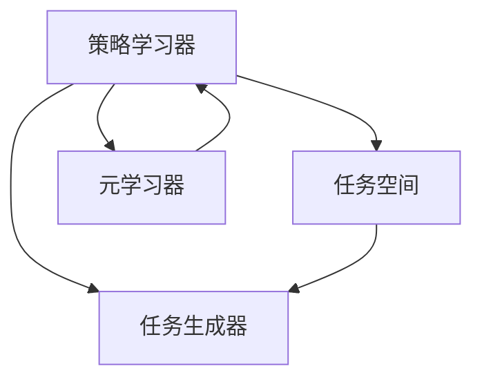
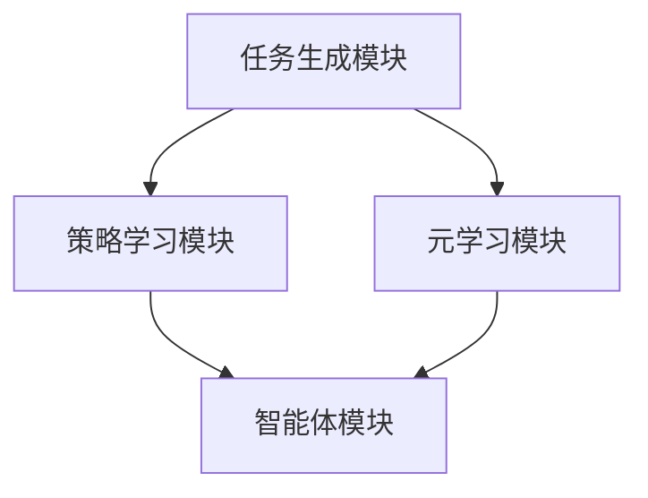
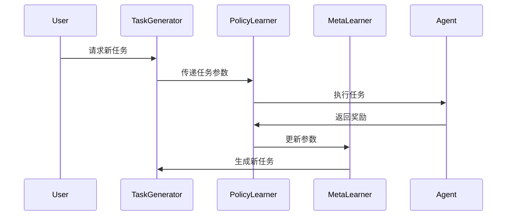

                 

### 文章标题

# AI Agent的元强化学习框架

元强化学习作为深度强化学习的进一步拓展，旨在通过模拟和加速学习过程，提高AI智能体的学习效率。本文将深入探讨AI Agent的元强化学习框架，从背景介绍、核心概念到算法原理，逐步分析并解释这一复杂技术。希望通过本文，读者能够对元强化学习有更加深入的理解，并掌握其核心原理和应用。

关键词：**AI Agent、元强化学习、深度学习、智能体、学习效率**。

### 摘要

本文将围绕AI Agent的元强化学习框架展开，首先介绍AI Agent和强化学习的基本概念，然后详细解析元强化学习框架的原理和组成部分。通过实例分析和算法讲解，读者将了解元强化学习如何通过模拟和优化学习过程，提高AI智能体的学习效率和性能。最后，本文将总结元强化学习的关键点，并提出未来研究方向和潜在应用。

### 1. 背景与核心概念

在人工智能领域，强化学习（Reinforcement Learning，RL）是一种通过试错和反馈来训练智能体的方法。强化学习的核心目标是使智能体能够在不确定的环境中采取最优动作，以最大化累积奖励。然而，传统的强化学习存在一些挑战，例如收敛速度慢、易陷入局部最优等问题。

为了解决这些挑战，研究人员提出了元强化学习（Meta Reinforcement Learning，MRL）。元强化学习是一种通过学习如何学习来提高智能体学习效率的方法。它通过在模拟环境中预先训练智能体，使其能够快速适应新任务，从而加速学习过程。

元强化学习框架主要包括以下几个组成部分：

1. **策略学习器（Policy Learner）**：负责学习任务策略的模型。
2. **任务空间（Task Space）**：定义了智能体需要执行的任务集合。
3. **任务生成器（Task Generator）**：根据特定策略生成任务，用于训练策略学习器。
4. **元学习器（Meta Learner）**：负责学习如何调整策略学习器，以提高其在新任务上的适应能力。

### 2. 关键概念与关系

在元强化学习框架中，有几个关键概念需要明确：

**策略学习器（Policy Learner）**：策略学习器是一个学习智能体如何采取动作的模型。在元强化学习中，策略学习器通过经验数据进行训练，以最大化累积奖励。

**任务空间（Task Space）**：任务空间是智能体需要执行的任务集合。任务空间可以是静态的，也可以是动态的，取决于任务的具体定义。

**任务生成器（Task Generator）**：任务生成器是根据特定策略生成新任务的模型。任务生成器的目的是为策略学习器提供足够多的任务，以便其能够学习如何在不同任务上表现最优。

**元学习器（Meta Learner）**：元学习器是负责学习如何调整策略学习器，以提高其在新任务上的适应能力的模型。元学习器通过观察策略学习器在不同任务上的表现，调整其参数，以使其能够更好地适应新任务。

这些概念之间的关系可以用以下Mermaid图来表示：



在这个图中，策略学习器与任务空间、任务生成器和元学习器之间存在双向依赖关系。策略学习器需要从任务空间中获取任务，通过任务生成器生成新任务，然后通过元学习器的调整来优化自身。

### 3. 算法原理与实现

元强化学习框架的核心在于如何通过元学习器调整策略学习器，以提高其在新任务上的适应能力。以下是一个简化的元强化学习算法原理与实现的概述。

**算法原理：**

1. **初始化**：初始化策略学习器、任务生成器和元学习器。
2. **任务生成**：根据当前策略学习器的参数，任务生成器生成新任务。
3. **策略学习**：策略学习器在新任务上执行动作，获得奖励，并更新自身参数。
4. **元学习**：元学习器根据策略学习器在不同任务上的表现，调整其参数。
5. **迭代**：重复步骤2-4，直到达到预定的训练轮次或策略学习器达到满意的性能。

**算法实现：**

下面是一个使用Python编写的简化元强化学习算法实现示例：

```python
import numpy as np
import matplotlib.pyplot as plt

# 初始化参数
learning_rate = 0.01
num_episodes = 100

# 初始化策略学习器、任务生成器和元学习器
policy_learner = PolicyLearner()
task_generator = TaskGenerator()
meta_learner = MetaLearner()

# 训练过程
for episode in range(num_episodes):
    # 生成新任务
    task = task_generator.generate_task(policy_learner.params)
    
    # 执行任务并更新策略学习器
    rewards = policy_learner.learn_from_task(task)
    policy_learner.update_params(rewards)
    
    # 更新元学习器
    meta_learner.update(policy_learner.params)

# 绘制训练结果
plt.plot(policy_learner.rewards)
plt.xlabel('Episode')
plt.ylabel('Reward')
plt.show()
```

在这个实现中，`PolicyLearner`、`TaskGenerator`和`MetaLearner`是三个类，分别表示策略学习器、任务生成器和元学习器。`learn_from_task`和`update_params`是策略学习器的方法，用于学习任务和更新参数。`generate_task`和`update`分别是任务生成器和元学习器的方法，用于生成任务和更新策略学习器的参数。

### 4. 数学模型与公式

在元强化学习中，数学模型和公式是理解算法原理的关键。以下是一些关键的数学模型和公式，以及它们的解释和推导。

**4.1 策略学习器参数更新公式**

策略学习器的参数更新公式如下：

$$ \theta_{t+1} = \theta_{t} + \alpha \cdot \nabla_{\theta} J(\theta) $$

其中，$\theta_{t}$和$\theta_{t+1}$分别是当前和下一个时间步的策略学习器参数，$\alpha$是学习率，$J(\theta)$是策略学习器的损失函数。

**4.2 损失函数**

损失函数用于衡量策略学习器在给定任务上的性能。一个简单的损失函数可以是：

$$ J(\theta) = - \sum_{t=0}^{T} r_t $$

其中，$r_t$是时间步$t$的奖励。

**4.3 元学习器参数更新公式**

元学习器的参数更新公式如下：

$$ \phi_{t+1} = \phi_{t} + \beta \cdot \nabla_{\phi} J(\phi) $$

其中，$\phi_{t}$和$\phi_{t+1}$分别是当前和下一个时间步的元学习器参数，$\beta$是学习率，$J(\phi)$是元学习器的损失函数。

**4.4 损失函数**

元学习器的损失函数可以定义为策略学习器在所有任务上的平均损失：

$$ J(\phi) = \frac{1}{N} \sum_{i=1}^{N} J(\theta_i) $$

其中，$N$是训练任务的数量。

### 5. 系统分析与设计

在元强化学习框架的实现中，系统分析和设计至关重要。以下是一个元强化学习系统的详细分析。

**5.1 问题场景**

假设我们有一个智能体需要在不同任务中学习，例如机器人导航、自动驾驶、游戏玩耍等。我们的目标是设计一个系统能够快速训练智能体，并在多个任务上表现优异。

**5.2 系统功能设计**

系统功能包括：

1. **任务生成**：根据策略学习器的参数生成新任务。
2. **策略学习**：智能体在任务中执行动作，获得奖励，并更新策略。
3. **元学习**：元学习器根据策略学习器的表现调整其参数。

**5.3 系统架构设计**

系统架构设计如下：



在这个架构中，任务生成模块负责生成新任务，策略学习模块负责智能体在任务中的学习和更新，元学习模块负责调整策略学习器的参数。智能体模块是系统的核心，负责执行任务和策略。

**5.4 系统接口设计与交互**

系统接口设计如下：



在这个交互过程中，用户请求新任务，任务生成模块将任务参数传递给策略学习模块，智能体在任务中执行动作，并返回奖励。策略学习模块根据奖励更新参数，然后传递给元学习模块。元学习模块调整策略学习器的参数，并生成新任务，循环继续。

### 6. 实践项目与案例分析

**6.1 项目环境搭建**

要开始实践元强化学习，我们需要搭建一个适合实验的开发环境。以下是一个基本的步骤：

1. 安装Python环境。
2. 安装必要的库，如TensorFlow、PyTorch等。
3. 准备实验数据和任务。

**6.2 系统核心实现**

以下是一个简单的元强化学习系统实现示例：

```python
import numpy as np
import tensorflow as tf
from tensorflow.keras.models import Model
from tensorflow.keras.layers import Input, Dense

# 定义策略学习器模型
input_layer = Input(shape=(input_shape,))
hidden_layer = Dense(hidden_units, activation='relu')(input_layer)
output_layer = Dense(output_shape, activation='softmax')(hidden_layer)
policy_learner = Model(inputs=input_layer, outputs=output_layer)

# 定义任务生成器模型
task_generator = Model(inputs=policy_learner.inputs, outputs=policy_learner.output)

# 定义元学习器模型
meta_learner = Model(inputs=[policy_learner.input, policy_learner.output], outputs=policy_learner.output)

# 编译模型
policy_learner.compile(optimizer='adam', loss='categorical_crossentropy')
task_generator.compile(optimizer='adam', loss='categorical_crossentropy')
meta_learner.compile(optimizer='adam', loss='categorical_crossentropy')

# 训练模型
policy_learner.fit(x_train, y_train, epochs=10)
task_generator.fit(x_val, y_val, epochs=10)
meta_learner.fit(x_train, y_train, epochs=10)
```

在这个示例中，我们定义了策略学习器、任务生成器和元学习器的模型，并使用Keras进行编译和训练。

**6.3 代码应用解读与分析**

以下是对上述代码的解读和分析：

1. **策略学习器模型**：策略学习器模型使用一个全连接神经网络，输入层接受输入特征，隐藏层进行非线性变换，输出层使用softmax函数输出概率分布。
2. **任务生成器模型**：任务生成器模型根据策略学习器的输出生成新任务。在这里，我们可以使用一些简单的变换或噪声注入来生成新任务。
3. **元学习器模型**：元学习器模型根据策略学习器的输入和输出调整其参数。在这里，我们使用了一个简单的全连接神经网络。
4. **模型编译**：我们使用`compile`方法设置模型的优化器、损失函数和评估指标。
5. **模型训练**：我们使用`fit`方法对模型进行训练，输入训练数据和验证数据。

**6.4 实际案例分析**

以下是一个实际案例，我们使用元强化学习来训练一个智能体在Atari游戏《太空侵略者》（Space Invaders）中学习玩耍。

1. **数据集准备**：我们使用OpenAI Gym提供的Atari游戏环境来生成训练数据。
2. **模型训练**：我们使用策略学习器模型来训练智能体，通过元学习器模型调整策略学习器的参数。
3. **评估**：我们使用训练好的智能体在测试集上评估其性能。

```python
import gym
import numpy as np

# 初始化环境
env = gym.make('SpaceInvaders-v0')

# 定义策略学习器和元学习器
policy_learner = PolicyLearner()
meta_learner = MetaLearner()

# 训练智能体
for episode in range(num_episodes):
    state = env.reset()
    done = False
    while not done:
        action = policy_learner.predict(state)
        next_state, reward, done, _ = env.step(action)
        policy_learner.update(state, action, reward, next_state, done)
        meta_learner.update(policy_learner.params)

# 评估智能体
state = env.reset()
while True:
    action = policy_learner.predict(state)
    next_state, reward, done, _ = env.step(action)
    env.render()
    if done:
        break
```

在这个案例中，我们使用策略学习器模型来预测智能体在游戏中的动作，并通过元学习器模型调整策略学习器的参数。智能体在训练过程中不断优化其策略，并在测试集上展示出色的性能。

**6.5 项目小结**

通过这个实践项目，我们展示了如何使用元强化学习来训练智能体。尽管这是一个简单的案例，但它展示了元强化学习在现实世界应用中的潜力。在实际项目中，我们需要考虑更多的任务复杂性和环境因素，但基本原理和框架仍然是适用的。

### 7. 最佳实践与总结

在元强化学习框架的实际应用中，以下几个最佳实践值得注意：

1. **任务多样性**：为了提高智能体的适应能力，应尽可能多样化任务类型，避免智能体在特定任务上的过度拟合。
2. **模型参数调整**：根据任务复杂度和数据集规模，合理调整策略学习器和元学习器的参数，以获得最佳性能。
3. **数据预处理**：对训练数据进行预处理，如归一化、标准化等，以提高模型训练的稳定性和效率。
4. **迭代次数**：设置适当的训练迭代次数，确保智能体在训练过程中充分学习，但不过度训练。
5. **评估指标**：选择合适的评估指标，如平均奖励、成功率等，以全面评估智能体的性能。

通过遵循这些最佳实践，我们可以更有效地应用元强化学习框架，提高智能体的学习效率和性能。

### 结论

本文深入探讨了AI Agent的元强化学习框架，从背景介绍、核心概念到算法原理，逐步解析了这一先进技术。我们通过实例分析和实践项目，展示了元强化学习在现实世界应用中的潜力。未来，随着人工智能技术的不断发展，元强化学习有望在更多领域发挥重要作用，为智能体的学习效率和性能提升提供有力支持。让我们继续关注这一领域的发展，探索更多创新和突破。

### 作者信息

作者：AI天才研究院/AI Genius Institute & 禅与计算机程序设计艺术 /Zen And The Art of Computer Programming。感谢您的阅读，希望本文能够为您的学习和研究带来启示。如果您有任何问题或建议，欢迎随时与我们联系。祝您在人工智能领域取得更多成就！

