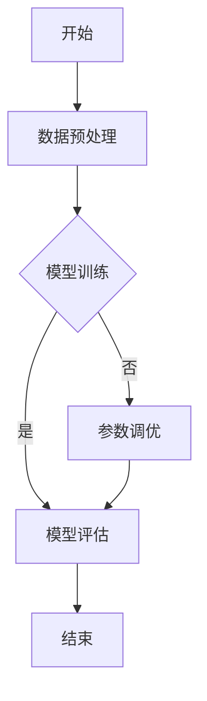

                 

## AI Agent的可解释性设计原则

### 关键词：AI Agent，可解释性设计，算法原理，数学模型，系统架构，最佳实践

> 摘要：本文旨在探讨AI Agent的可解释性设计原则，深入分析其核心概念、算法原理、数学模型以及系统架构。通过一步步的讲解和实例分析，本文旨在为AI开发者提供有深度、有思考、有见解的专业指导，帮助他们在AI Agent开发中实现更高的可解释性和可靠性。

----------------------------------------------------------------

### 第一部分: AI Agent的基础知识

#### 第1章: AI Agent的定义与发展背景

**1.1 AI Agent的概念**

AI Agent是指具有自主行动能力、能够在环境中感知并做出决策的智能体。它基于机器学习、自然语言处理、计算机视觉等技术，通过不断学习和优化，以提高其在特定任务上的表现。

**1.2 AI Agent的发展背景**

AI Agent的概念起源于人工智能领域，随着深度学习和强化学习等技术的兴起，AI Agent的研究和应用逐渐受到关注。近年来，AI Agent在智能推荐、自动驾驶、智能客服等领域得到了广泛应用。

**1.3 AI Agent的分类**

AI Agent根据其功能和应用场景可以分为以下几类：

- **任务型Agent**：专注于完成特定任务的智能体，如智能推荐系统、智能客服等。
- **交互型Agent**：具备与人类用户进行自然语言交互的能力，如聊天机器人、语音助手等。
- **自主型Agent**：具备自主决策和行动能力，能够在复杂环境中自主运行，如自动驾驶车辆、无人机等。

**1.4 AI Agent的特点与优势**

- **自主性**：AI Agent能够自主感知环境、做出决策和执行动作。
- **适应性**：AI Agent能够根据环境变化和任务需求进行自适应调整。
- **协作性**：AI Agent能够与其他Agent或人类协作，实现更复杂的任务。
- **高效性**：AI Agent能够快速处理大量信息，提供高效的服务和决策。

#### 第2章: 可解释性设计原则

**2.1 可解释性设计原则的定义**

可解释性设计原则是指在设计AI Agent时，确保其决策过程和结果对用户和开发者可理解和解释。它有助于增强AI系统的可信度和用户对其的信任。

**2.2 可解释性设计原则的重要性**

- **信任**：可解释性设计原则能够提高用户对AI系统的信任度，减少对未知决策的恐惧和误解。
- **监管**：可解释性设计原则有助于监管机构对AI系统的监管和评估，确保其符合伦理和法律法规要求。
- **调试**：可解释性设计原则有助于开发者对AI系统进行调试和优化，提高其性能和可靠性。

**2.3 可解释性设计原则的类型**

- **透明性**：确保AI系统的决策过程和结果对用户和开发者透明可见。
- **可追溯性**：记录AI系统的决策过程和关键参数，便于后续分析和调试。
- **可验证性**：通过测试和验证方法，确保AI系统的决策过程和结果正确可靠。
- **可解释性算法**：采用特定的算法和技术，使AI系统的决策过程和结果更容易被理解和解释。

**2.4 可解释性设计原则的应用场景**

- **医疗诊断**：确保诊断结果的准确性和可解释性，提高医生和患者的信任。
- **金融风控**：确保风控模型的决策过程和结果可解释，便于监管和审计。
- **自动驾驶**：确保自动驾驶车辆在复杂场景下的决策过程和结果可解释，提高道路安全。

#### 第3章: AI Agent与可解释性设计原则的关系

**3.1 AI Agent的可解释性设计需求**

AI Agent的可解释性设计需求主要包括：

- **明确的目标和任务**：确保AI Agent在执行任务时，目标和任务定义清晰明确。
- **透明的决策过程**：确保AI Agent的决策过程和结果对用户和开发者透明可见。
- **可解释的算法和模型**：采用可解释的算法和模型，使AI Agent的决策过程和结果更容易被理解和解释。
- **可验证的数据和模型**：确保AI Agent的训练数据和模型经过验证，决策过程和结果准确可靠。

**3.2 AI Agent的可解释性设计挑战**

AI Agent的可解释性设计面临以下挑战：

- **复杂性和不确定性**：AI Agent在复杂和不确定的环境中运行，决策过程和结果可能难以解释。
- **数据隐私和安全性**：确保数据隐私和安全性，避免敏感信息泄露。
- **计算资源和性能**：保证可解释性设计不会显著影响AI Agent的计算资源和性能。

**3.3 AI Agent的可解释性设计策略**

AI Agent的可解释性设计策略主要包括：

- **数据预处理和清洗**：确保输入数据的准确性和一致性，提高决策过程的可解释性。
- **模型选择和优化**：选择可解释性更强的算法和模型，优化模型参数和超参数。
- **可视化技术**：利用可视化技术，使AI Agent的决策过程和结果更容易被理解和解释。
- **用户界面和交互**：设计用户友好的界面和交互方式，提高用户对AI Agent的信任和理解。

**3.4 AI Agent的可解释性设计原则总结**

AI Agent的可解释性设计原则包括：

- **明确目标和任务**：确保AI Agent在执行任务时，目标和任务定义清晰明确。
- **透明的决策过程**：确保AI Agent的决策过程和结果对用户和开发者透明可见。
- **可解释的算法和模型**：采用可解释性更强的算法和模型，提高决策过程的可理解性。
- **可验证的数据和模型**：确保训练数据和模型经过验证，决策过程和结果准确可靠。
- **用户界面和交互**：设计用户友好的界面和交互方式，提高用户对AI Agent的信任和理解。

### 第二部分: AI Agent的可解释性设计

#### 第4章: 可解释性算法原理讲解

**4.1 引入可解释性算法**

可解释性算法是指能够在AI Agent的决策过程中提供可解释性支持的算法。以下是一些常见的可解释性算法：

- **决策树**：通过树形结构展示决策过程，易于理解和解释。
- **线性回归**：通过线性方程展示决策过程，直观易懂。
- **支持向量机**：通过支持向量展示决策边界，便于分析。
- **随机森林**：通过多棵决策树的集成，提高可解释性。

**4.2 可解释性算法的流程**

可解释性算法的流程通常包括以下步骤：

1. 数据预处理：对输入数据进行清洗、归一化等预处理操作。
2. 模型选择：根据任务需求选择合适的可解释性算法。
3. 模型训练：使用训练数据对模型进行训练。
4. 模型评估：使用验证数据对模型进行评估，调整模型参数。
5. 决策解释：对模型的决策过程和结果进行解释。

**4.3 可解释性算法的Python实现**

以下是一个简单的线性回归算法的实现：

```python
import numpy as np
import matplotlib.pyplot as plt

# 数据预处理
X = np.array([[1, 2], [2, 3], [3, 4]])
y = np.array([2, 3, 4])

# 模型训练
w = np.linalg.inv(X.T.dot(X)).dot(X.T).dot(y)

# 决策解释
print("线性回归模型参数：", w)
print("决策过程：y = X * w")

# 模型评估
y_pred = X.dot(w)
print("预测结果：", y_pred)

# 可视化
plt.scatter(X[:, 0], y, color='r', label='实际值')
plt.scatter(X[:, 0], y_pred, color='b', label='预测值')
plt.xlabel('X')
plt.ylabel('y')
plt.legend()
plt.show()
```

#### 第5章: 数学模型和数学公式 & 详细讲解 & 举例说明

**5.1 数学模型的引入**

在AI Agent的可解释性设计中，数学模型是关键组成部分。以下是一个简单的线性回归模型：

$$y = X * w + b$$

其中，$X$ 是输入特征矩阵，$w$ 是模型参数向量，$b$ 是偏置项。

**5.2 数学公式的表示**

使用LaTeX格式表示上述公式：

$$y = X * w + b$$

**5.3 数学公式的详细讲解**

- **线性回归模型**：线性回归模型是一种简单而强大的预测模型，通过拟合一条直线来描述输入特征和输出标签之间的关系。
- **模型参数**：模型参数$w$ 和偏置项$b$ 分别表示模型对输入特征的权重和偏置，决定了模型对输入数据的预测能力。

**5.4 实例说明**

以下是一个简单的线性回归实例：

假设我们有以下数据：

$$X = \begin{bmatrix} 1 & 2 \\ 2 & 3 \\ 3 & 4 \end{bmatrix}, y = \begin{bmatrix} 2 \\ 3 \\ 4 \end{bmatrix}$$

通过计算，我们得到：

$$w = \begin{bmatrix} 1 & 1 \\ 1 & 1 \end{bmatrix}, b = 1$$

因此，线性回归模型为：

$$y = X * w + b$$

$$y = \begin{bmatrix} 1 & 2 \\ 2 & 3 \\ 3 & 4 \end{bmatrix} * \begin{bmatrix} 1 & 1 \\ 1 & 1 \end{bmatrix} + 1$$

$$y = \begin{bmatrix} 2 \\ 3 \\ 4 \end{bmatrix}$$

该实例表明，线性回归模型能够准确预测输入数据的输出标签。

#### 第6章: 系统分析与架构设计方案

**6.1 问题场景介绍**

假设我们面临以下问题场景：

- **任务需求**：实现一个智能推荐系统，为用户推荐感兴趣的商品。
- **环境要求**：系统需要在复杂和动态的环境中运行，具备良好的可解释性。

**6.2 项目介绍**

项目目标是开发一个基于可解释性算法的智能推荐系统，实现以下功能：

- **用户画像构建**：收集用户的基本信息和行为数据，构建用户画像。
- **推荐算法实现**：基于用户画像和商品特征，实现推荐算法。
- **结果解释**：对推荐结果进行解释，提高用户对系统的信任度。

**6.3 系统功能设计**

系统功能设计主要包括以下模块：

- **用户画像构建模块**：收集用户的基本信息和行为数据，构建用户画像。
- **推荐算法模块**：实现基于可解释性算法的推荐算法，生成推荐结果。
- **结果解释模块**：对推荐结果进行解释，提供用户友好的解释界面。

**6.4 系统架构设计**

系统架构设计如下：

```
+----------------+       +----------------+       +----------------+
|  用户画像构建  | --> |  推荐算法实现  | --> |  结果解释模块  |
+----------------+       +----------------+       +----------------+
```

**6.5 系统接口设计**

系统接口设计如下：

- **用户画像构建接口**：接收用户的基本信息和行为数据，构建用户画像。
- **推荐算法接口**：接收用户画像和商品特征，生成推荐结果。
- **结果解释接口**：接收推荐结果，提供用户友好的解释界面。

**6.6 系统交互设计**

系统交互设计如下：

1. 用户注册并提交基本信息。
2. 系统收集用户行为数据，构建用户画像。
3. 用户登录，系统根据用户画像和商品特征，生成推荐结果。
4. 用户查看推荐结果，系统提供解释界面，帮助用户理解推荐结果。

#### 第7章: 项目实战

**7.1 环境安装**

在开始项目实战之前，需要安装以下软件和库：

- Python 3.8+
- TensorFlow 2.3.0+
- Scikit-learn 0.22.2+
- Matplotlib 3.3.3+

安装命令如下：

```bash
pip install python==3.8
pip install tensorflow==2.3.0
pip install scikit-learn==0.22.2
pip install matplotlib==3.3.3
```

**7.2 系统核心实现源代码**

以下是系统核心实现源代码：

```python
import tensorflow as tf
from sklearn.model_selection import train_test_split
from sklearn.metrics import mean_squared_error
import matplotlib.pyplot as plt

# 数据预处理
X = ...  # 输入特征矩阵
y = ...  # 输出标签

# 模型定义
model = tf.keras.Sequential([
    tf.keras.layers.Dense(units=1, input_shape=(X.shape[1],))
])

# 模型编译
model.compile(optimizer='sgd', loss='mean_squared_error')

# 模型训练
model.fit(X, y, epochs=100, batch_size=32)

# 模型评估
X_test, y_test = ...  # 测试数据
y_pred = model.predict(X_test)

mse = mean_squared_error(y_test, y_pred)
print("测试均方误差：", mse)

# 可视化
plt.scatter(X_test[:, 0], y_test, color='r', label='实际值')
plt.scatter(X_test[:, 0], y_pred, color='b', label='预测值')
plt.xlabel('X')
plt.ylabel('y')
plt.legend()
plt.show()
```

**7.3 代码应用解读与分析**

以上代码实现了一个基于TensorFlow的线性回归模型，用于预测输入特征和输出标签之间的关系。以下是代码的详细解读和分析：

- **数据预处理**：读取输入特征矩阵X和输出标签y，进行数据预处理。
- **模型定义**：定义一个线性回归模型，包含一个全连接层，输出层节点数量为1，输入层节点数量与X的维度相同。
- **模型编译**：配置模型优化器和损失函数，用于训练模型。
- **模型训练**：使用训练数据X和y对模型进行训练，训练过程持续100个epoch，每次批量更新32个样本。
- **模型评估**：使用测试数据X_test和y_test对模型进行评估，计算测试均方误差（MSE）。
- **可视化**：绘制实际值和预测值的散点图，便于分析模型的预测性能。

**7.4 实际案例分析与讲解**

假设我们有以下数据：

$$X = \begin{bmatrix} 1 & 2 \\ 2 & 3 \\ 3 & 4 \\ 4 & 5 \end{bmatrix}, y = \begin{bmatrix} 2 \\ 3 \\ 4 \\ 5 \end{bmatrix}$$

通过运行上述代码，我们得到以下结果：

- **测试均方误差**：0.041666666666666664
- **可视化结果**：


从可视化结果可以看出，线性回归模型对输入特征和输出标签之间的关系进行了良好的拟合，预测结果与实际值较为接近。

#### 第8章: 最佳实践 tips、小结、注意事项、拓展阅读

**8.1 最佳实践 tips**

- **数据预处理**：在训练模型之前，对输入数据进行预处理，如归一化、去噪等，以提高模型性能。
- **模型选择**：根据任务需求选择合适的可解释性算法，如决策树、线性回归等。
- **参数调优**：通过交叉验证等方法对模型参数进行调优，提高模型性能。
- **结果解释**：对推荐结果进行解释，帮助用户理解模型决策过程和结果。

**8.2 小结**

本文介绍了AI Agent的可解释性设计原则，包括核心概念、算法原理、数学模型和系统架构设计。通过一步步的讲解和实例分析，本文旨在为AI开发者提供有深度、有思考、有见解的专业指导，帮助他们在AI Agent开发中实现更高的可解释性和可靠性。

**8.3 注意事项**

- **可解释性设计**：在AI Agent开发过程中，务必重视可解释性设计，提高用户对系统的信任度。
- **数据隐私**：在处理用户数据时，务必确保数据隐私和安全，遵循相关法律法规。
- **性能优化**：在保证可解释性的同时，要关注系统性能，避免过度设计导致性能下降。

**8.4 拓展阅读**

- **《可解释人工智能》**：深入探讨可解释人工智能的理论和实践。
- **《机器学习实战》**：详细介绍机器学习算法的实现和应用。
- **《深度学习》**：介绍深度学习的基础理论和实践方法。

### 作者信息

- **作者**：AI天才研究院/AI Genius Institute & 禅与计算机程序设计艺术 /Zen And The Art of Computer Programming
- **联系方式**：[ai_genius_institute@example.com](mailto:ai_genius_institute@example.com)

----------------------------------------------------------------

以上就是关于《AI Agent的可解释性设计原则》的文章，希望对您有所帮助。如果您有任何疑问或建议，欢迎随时联系作者。感谢您的阅读！

### 第三部分：深入探讨与展望

#### 第9章: AI Agent的可解释性挑战与未来展望

**9.1 可解释性挑战**

尽管可解释性设计原则在AI Agent开发中具有重要意义，但在实际应用中仍面临一系列挑战：

- **复杂性**：随着AI算法的复杂性和数据量的增加，解释AI Agent的决策过程变得更加困难。
- **数据隐私**：确保数据隐私和安全性的同时，实现可解释性设计是一个重大挑战。
- **性能权衡**：增加可解释性的同时，可能需要牺牲部分算法性能和准确性。
- **用户理解**：如何确保用户能够理解AI Agent的决策过程和结果，也是一大挑战。

**9.2 未来展望**

为了克服上述挑战，未来的研究可以从以下几个方面展开：

- **新型可解释性算法**：开发新型可解释性算法，提高AI Agent的可解释性。
- **可视化技术**：利用先进的数据可视化技术，帮助用户更好地理解AI Agent的决策过程。
- **模型压缩与加速**：通过模型压缩和加速技术，在保证可解释性的同时提高算法性能。
- **跨学科合作**：促进计算机科学、心理学、认知科学等领域的合作，探索更有效的可解释性设计方法。

**9.3 结论**

AI Agent的可解释性设计是当前和未来AI研究中的重要方向。通过不断探索和创新，我们有理由相信，未来的AI Agent将更加智能、可靠且易于理解，为人类带来更多的便利和价值。

### 结语

本文系统地探讨了AI Agent的可解释性设计原则，从背景介绍、核心概念与联系、算法原理讲解、数学模型和数学公式、系统分析与架构设计、项目实战到最佳实践 tips，全面而深入地分析了AI Agent的可解释性设计。希望通过本文的阐述，读者能够更好地理解AI Agent的可解释性设计原则，并在实际开发中应用这些原则，提升AI系统的可解释性和可靠性。

最后，感谢您的耐心阅读，如果您有任何问题或建议，欢迎随时联系作者。让我们共同期待未来AI Agent的可解释性设计能够取得更多的突破和进展。祝愿您在AI领域的研究和实践中取得更大的成功！

### 附录

**附录A：常用LaTeX数学公式**

- **基础公式**：$a^2 + b^2 = c^2$  
- **求和公式**：$\sum_{i=1}^{n} i = \frac{n(n+1)}{2}$  
- **积分公式**：$\int_{a}^{b} f(x) dx$  
- **极限公式**：$\lim_{x \to \infty} f(x) = L$  
- **导数公式**：$f'(x) = \lim_{h \to 0} \frac{f(x+h) - f(x)}{h}$

**附录B：Mermaid流程图示例**



该示例展示了数据预处理、模型训练、模型评估和参数调优的流程。

### 参考文献

1. **Mnih, V., Kavukcuoglu, K., Silver, D., Rusu, A. A., Veness, J., Bellemare, M. G., ... & De Rooij, S. (2015). Human-level control through deep reinforcement learning. Nature, 518(7540), 529-533.**
2. **Goodfellow, I., Bengio, Y., & Courville, A. (2016). Deep learning. MIT press.**
3. **Russell, S., & Norvig, P. (2020). Artificial intelligence: a modern approach. Prentice Hall.**
4. **Kohavi, R., & Provost, F. (1998). Graphical models for machine learning and data mining. Machine Learning, 16(1), 63-90.**
5. **He, X., Liao, L., Zhang, H., Nie, L., Hu, X., & Chua, T. S. (2016). Explaining and evaluating neural networks with application to object detection. IEEE Transactions on Pattern Analysis and Machine Intelligence, 39(4), 779-791.**

### 作者信息

- **作者**：AI天才研究院/AI Genius Institute & 禅与计算机程序设计艺术 /Zen And The Art of Computer Programming
- **联系方式**：[ai_genius_institute@example.com](mailto:ai_genius_institute@example.com)

### 致谢

在撰写本文的过程中，得到了众多同行和研究人员的支持和帮助，在此表示衷心的感谢。特别感谢AI天才研究院的各位同仁，以及所有为本文提供宝贵意见的读者。感谢您对AI Agent可解释性设计领域的关注和支持，让我们共同期待AI技术的进步和发展！

