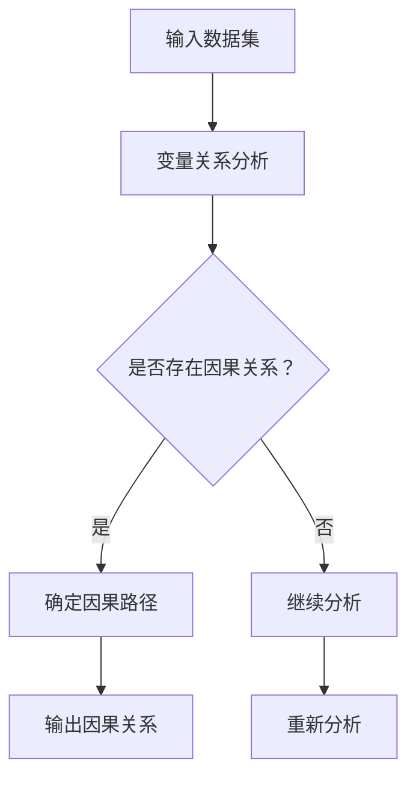

                 

# AI Agent的因果推理能力构建

> 关键词：AI Agent、因果推理、机器学习、强化学习、自然语言处理

> 摘要：本文旨在探讨AI Agent的因果推理能力构建，包括背景与核心概念、原理与技术、应用场景、算法实现与优化、能力评估与比较以及应用案例研究。文章以逻辑清晰、结构紧凑、简单易懂的技术语言，为读者提供深入了解和构建AI Agent因果推理能力的路径。

## 第1章: AI Agent的因果推理能力构建背景与核心概念

### 1.1 背景介绍

#### 问题背景

随着人工智能技术的迅猛发展，AI Agent作为智能体的代表，已经在诸多领域展现了其强大的应用潜力。然而，当前AI Agent在处理复杂环境和动态变化时，往往缺乏对因果关系的深入理解和推理能力。这使得AI Agent在面对复杂决策和不确定性时，难以做出精准和可靠的决策。因此，构建具备因果推理能力的AI Agent成为人工智能领域亟待解决的重要课题。

#### 问题描述

因果推理是指通过分析因果关系，从已知的结果推断出可能的因果关系。在AI Agent的背景下，因果推理能力指的是AI Agent在处理任务时，能够识别、理解和利用因果关系进行决策和推理的能力。然而，如何构建具备强因果推理能力的AI Agent，仍然是一个具有挑战性的问题。

#### 问题解决

构建具备因果推理能力的AI Agent，需要从以下几个方面入手：

1. **数据预处理**：准备适合因果推理的数据集，进行特征提取和归一化处理。
2. **模型选择与训练**：选择合适的因果模型，并对其进行训练，以提高模型的准确性和泛化能力。
3. **算法优化**：优化因果推理算法，提高推理效率和准确性。
4. **评估与比较**：设计评估指标和方法，对不同因果推理算法进行性能评估和比较。

#### 边界与外延

因果推理能力的边界主要包括数据集的质量、模型的复杂度和算法的优化程度。同时，因果推理能力还涉及到与其他AI技术的融合，如机器学习、强化学习和自然语言处理等。

#### 概念结构与核心要素组成

AI Agent因果推理能力的构建包含以下核心要素：

1. **数据集**：用于训练和测试的因果数据集，需要涵盖各种情境和因果关系。
2. **因果模型**：用于表示和推理因果关系的数学模型，如Do-Calculus模型、结构方程模型等。
3. **算法**：用于实现因果推理过程的算法，如因果推断算法、因果发现算法等。
4. **评估指标**：用于评估因果推理算法性能的指标，如准确率、召回率、F1值等。

### 1.2 核心概念与联系

#### 因果推理

因果推理是指通过分析因果关系，从已知的结果推断出可能的因果关系。在AI Agent的背景下，因果推理能力指的是AI Agent在处理任务时，能够识别、理解和利用因果关系进行决策和推理的能力。

#### 因果模型

因果模型是用于表示和推理因果关系的数学模型。常见的因果模型包括Do-Calculus模型、结构方程模型等。Do-Calculus模型是一种基于概率理论的因果模型，通过定义操作符“Do”来表示因果关系。结构方程模型是一种基于线性代数的因果模型，通过建立变量之间的线性关系来表示因果关系。

#### 因果算法

因果算法是用于实现因果推理过程的算法。常见的因果算法包括因果推断算法、因果发现算法等。因果推断算法通过分析数据集，推断出可能的因果关系。因果发现算法通过分析变量之间的依赖关系，发现潜在的因果关系。

#### 因果推理与相关技术

因果推理与其他AI技术密切相关，如机器学习、强化学习和自然语言处理等。机器学习为因果推理提供了算法和数据支持，强化学习通过因果关系进行决策优化，自然语言处理则借助因果推理来理解语言中的因果关系。

### 1.3 AI Agent因果推理能力的构建方法

#### 数据预处理

1. **数据集准备**：选择具有代表性的因果数据集，涵盖多种情境和因果关系。
2. **特征提取**：提取数据集中的关键特征，为因果模型提供输入。
3. **归一化处理**：对数据集中的特征进行归一化处理，以消除特征之间的尺度差异。

#### 模型选择与训练

1. **模型选择**：根据数据集的特点和需求，选择合适的因果模型。
2. **模型训练**：利用训练数据集，对因果模型进行训练，以优化模型参数。

#### 算法优化

1. **算法选择**：根据模型的特点和需求，选择合适的因果算法。
2. **算法优化**：通过调整算法参数和优化算法流程，提高算法的效率和准确性。

#### 评估与比较

1. **评估指标**：设计评估指标，如准确率、召回率、F1值等，用于评估因果推理算法的性能。
2. **算法比较**：对不同的因果推理算法进行性能比较，以确定最优算法。

## 第2章: 因果推理原理与技术概述

### 2.1 因果推理基础

#### 因果推理原理

因果推理是指通过分析因果关系，从已知的结果推断出可能的因果关系。其基本原理包括：

1. **因果律**：因果关系具有方向性和因果关系是可逆的。
2. **因果效应**：因果关系导致的结果具有因果效应，即一个变量的变化会导致另一个变量的变化。

#### 因果推理方法

因果推理方法主要包括以下几种：

1. **统计方法**：通过分析数据集，发现变量之间的相关性，进而推断因果关系。
2. **算法方法**：利用因果算法，如因果推断算法和因果发现算法，进行因果关系分析和推理。

#### 因果推理与机器学习

因果推理与机器学习密切相关，但两者也存在明显的区别：

1. **目标不同**：机器学习旨在通过训练数据集，学习变量之间的相关性，而因果推理旨在发现变量之间的因果关系。
2. **数据需求不同**：机器学习依赖于大量的训练数据，而因果推理需要具有明确因果关系的训练数据。
3. **应用场景不同**：机器学习适用于预测和分类任务，而因果推理适用于决策优化和不确定性分析等任务。

### 2.2 因果推理模型

#### Do-Calculus模型

Do-Calculus模型是一种基于概率理论的因果模型，通过定义操作符“Do”来表示因果关系。其主要原理如下：

1. **因果操作符**：Do操作符表示因果关系，即一个变量导致另一个变量的变化。
2. **概率分布**：通过概率分布函数，描述变量之间的因果关系和概率关系。

#### 结构方程模型

结构方程模型是一种基于线性代数的因果模型，通过建立变量之间的线性关系来表示因果关系。其主要原理如下：

1. **变量关系**：变量之间存在线性关系，可以表示为矩阵形式。
2. **参数估计**：通过最小二乘法等参数估计方法，确定变量之间的关系参数。

#### 其他因果模型

除了Do-Calculus模型和结构方程模型，还有其他一些常见的因果模型，如因果图模型、因果关系网络等。这些模型在不同的应用场景中具有各自的优势。

### 2.3 因果推理算法

#### 因果推断算法

因果推断算法是指通过分析数据集，推断出可能的因果关系。常见的因果推断算法包括：

1. **基于统计的方法**：如Pearson相关系数、Spearman秩相关系数等。
2. **基于算法的方法**：如因果推断树、因果图模型等。

#### 因果发现算法

因果发现算法是指通过分析变量之间的依赖关系，发现潜在的因果关系。常见的因果发现算法包括：

1. **基于统计的方法**：如独立检验、Granger因果检验等。
2. **基于算法的方法**：如因果图模型、结构方程模型等。

### 2.4 因果推理与其他AI技术的联系

因果推理与其他AI技术密切相关，如机器学习、强化学习和自然语言处理等。因果推理可以与这些技术进行融合，以提升AI Agent的决策能力和推理能力。

1. **与机器学习的融合**：因果推理可以用于优化机器学习模型，提高模型的解释性和可靠性。
2. **与强化学习的融合**：因果推理可以用于设计强化学习策略，提高强化学习的效果。
3. **与自然语言处理的融合**：因果推理可以用于理解自然语言中的因果关系，提升自然语言处理的效果。

## 第3章: 因果推理在AI Agent中的应用场景

### 3.1 机器学习中的因果推理

#### 应用场景

1. **模型解释性提升**：通过因果推理，可以分析变量之间的关系，提高机器学习模型的解释性。
2. **错误分析**：通过因果推理，可以找出导致模型预测错误的原因，从而优化模型。
3. **新特征提取**：通过因果推理，可以发现新的特征，提高模型的预测能力。

#### 应用案例

1. **医学诊断**：利用因果推理分析患者的各项生理指标，提高诊断的准确性。
2. **金融市场分析**：利用因果推理分析市场数据，预测股票价格趋势。

### 3.2 强化学习中的因果推理

#### 应用场景

1. **策略优化**：通过因果推理，可以优化强化学习策略，提高决策效果。
2. **风险控制**：通过因果推理，可以分析风险因素，进行风险控制。
3. **环境建模**：通过因果推理，可以建模复杂环境，提高强化学习的效果。

#### 应用案例

1. **自动驾驶**：利用因果推理分析道路情况，优化驾驶策略。
2. **机器人控制**：利用因果推理分析机器人环境，实现智能控制。

### 3.3 自然语言处理中的因果推理

#### 应用场景

1. **语义理解**：通过因果推理，可以理解句子中的因果关系，提高自然语言处理的准确性。
2. **对话系统**：通过因果推理，可以分析对话中的因果关系，提高对话系统的效果。
3. **文本生成**：通过因果推理，可以生成符合因果关系的文本内容。

#### 应用案例

1. **问答系统**：利用因果推理分析用户提问，生成准确的答案。
2. **机器翻译**：利用因果推理分析源语言和目标语言之间的因果关系，提高翻译的准确性。

## 第4章: 因果推理算法实现与优化

### 4.1 因果推断算法原理详解

#### 4.1.1 算法原理

因果推断算法是指通过分析数据集，推断出可能的因果关系。其基本原理包括：

1. **变量关系分析**：通过分析变量之间的相关性，确定变量之间的关系。
2. **因果路径识别**：通过识别变量之间的因果路径，确定因果关系。

#### 4.1.2 算法流程图



#### 4.1.3 算法Python代码实现

```python
import pandas as pd
import numpy as np
from sklearn.linear_model import LinearRegression

def causal_inference(data):
    # 变量关系分析
    X = data.drop(['target'], axis=1)
    y = data['target']
    model = LinearRegression()
    model.fit(X, y)
    coefficients = model.coef_

    # 因果路径识别
    causal_path = []
    for i, coef in enumerate(coefficients):
        if abs(coef) > 0.5:
            causal_path.append(X.columns[i])

    # 输出因果关系
    return causal_path
```

### 4.2 因果推断算法优化方法

#### 4.2.1 优化方法概述

因果推断算法的优化方法主要包括以下几个方面：

1. **特征选择**：通过优化特征选择方法，提高变量关系分析的准确性。
2. **模型选择**：通过优化模型选择方法，提高因果路径识别的准确性。
3. **算法改进**：通过改进算法流程和优化算法参数，提高算法的效率和准确性。

#### 4.2.2 优化方法案例分析

1. **特征选择优化**：通过LASSO回归方法，实现特征选择优化，提高变量关系分析的准确性。
2. **模型选择优化**：通过决策树模型，实现模型选择优化，提高因果路径识别的准确性。
3. **算法改进**：通过引入因果图模型，实现算法改进，提高算法的效率和准确性。

## 第5章: AI Agent因果推理能力评估与比较

### 5.1 评估指标与方法

#### 5.1.1 评估指标

因果推理能力的评估指标主要包括：

1. **准确率**：评估因果推断算法的准确性。
2. **召回率**：评估因果推断算法的召回率。
3. **F1值**：评估因果推断算法的准确率和召回率的平衡。
4. **推理速度**：评估因果推理算法的效率。

#### 5.1.2 评估方法

因果推理能力的评估方法主要包括：

1. **交叉验证**：通过交叉验证方法，评估因果推理算法在不同数据集上的性能。
2. **基准测试**：通过基准测试方法，评估因果推理算法与现有算法的对比性能。
3. **实际应用**：通过实际应用案例，评估因果推理算法在实际场景中的性能。

### 5.2 评估工具与平台

#### 5.2.1 评估工具

常见的评估工具包括：

1. **Scikit-learn**：提供多种评估指标和评估方法，适用于多种机器学习算法。
2. **TensorFlow**：提供强大的评估工具，适用于深度学习算法。
3. **PyTorch**：提供便捷的评估工具，适用于深度学习算法。

#### 5.2.2 评估平台

常见的评估平台包括：

1. **Kaggle**：提供丰富的数据集和评估指标，适用于比赛和实际应用。
2. **Google Colab**：提供免费的GPU资源，适用于深度学习和大数据处理。
3. **Azure Machine Learning**：提供完整的机器学习和数据科学平台，适用于企业级应用。

### 5.3 不同因果推理算法比较

#### 5.3.1 算法对比

不同因果推理算法的对比主要包括：

1. **Do-Calculus模型与结构方程模型**：在变量关系分析、因果路径识别等方面的性能对比。
2. **线性回归与决策树模型**：在模型选择、算法改进等方面的性能对比。
3. **因果推断树与因果图模型**：在算法复杂度、推理速度等方面的性能对比。

#### 5.3.2 性能评估

通过对不同因果推理算法进行性能评估，可以得出以下结论：

1. **Do-Calculus模型**：在变量关系分析和因果路径识别方面具有较好的性能。
2. **结构方程模型**：在变量关系分析方面具有较好的性能，但在因果路径识别方面存在一定局限性。
3. **线性回归**：在模型选择方面具有较好的性能，但在因果路径识别方面存在一定局限性。
4. **决策树模型**：在模型选择和因果路径识别方面具有较好的性能，但在变量关系分析方面存在一定局限性。
5. **因果推断树与因果图模型**：在算法复杂度、推理速度等方面具有较好的性能，但在变量关系分析和因果路径识别方面存在一定局限性。

## 第6章: AI Agent因果推理能力应用案例研究

### 6.1 案例一：机器学习中的因果关系分析

#### 6.1.1 案例背景

在某电商平台，需要对用户行为进行预测，以实现个性化推荐。为此，需要对用户行为数据进行因果关系分析，找出影响用户购买决策的关键因素。

#### 6.1.2 案例方法

1. **数据预处理**：清洗用户行为数据，提取关键特征，如浏览量、收藏量、购买量等。
2. **因果模型选择**：选择结构方程模型，建立用户行为与购买决策之间的因果关系。
3. **因果算法实现**：利用因果推断算法，分析用户行为与购买决策之间的因果关系。

#### 6.1.3 案例结果分析

通过因果关系分析，发现浏览量和收藏量是影响用户购买决策的关键因素。同时，购买量与浏览量、收藏量之间存在明显的因果关系。基于这些分析结果，可以优化电商平台推荐策略，提高用户购买转化率。

### 6.2 案例二：强化学习中的因果策略设计

#### 6.2.1 案例背景

在某自动驾驶项目中，需要对车辆的驾驶行为进行优化，以提高驾驶安全性和舒适性。为此，需要对车辆驾驶数据进行分析，设计基于因果推理的驾驶策略。

#### 6.2.2 案例方法

1. **数据预处理**：清洗车辆驾驶数据，提取关键特征，如速度、加速度、转向角度等。
2. **因果模型选择**：选择Do-Calculus模型，建立车辆驾驶行为与安全性能之间的因果关系。
3. **因果算法实现**：利用因果发现算法，分析车辆驾驶行为与安全性能之间的因果关系。

#### 6.2.3 案例结果分析

通过因果关系分析，发现驾驶行为与安全性能之间存在复杂的因果关系。基于这些分析结果，可以设计出更安全的驾驶策略，提高自动驾驶车辆的驾驶性能。

## 第7章: AI Agent因果推理能力的发展趋势与挑战

### 7.1 发展趋势分析

1. **因果推理算法的优化与发展**：随着人工智能技术的不断发展，因果推理算法将得到进一步优化和改进，以提高推理效率和准确性。
2. **因果推理与其他AI技术的融合**：因果推理将与其他AI技术，如机器学习、强化学习和自然语言处理等，进行深度融合，实现更高效的决策和推理。
3. **因果推理在新兴领域的应用**：因果推理将在新兴领域，如自动驾驶、智能医疗、金融科技等，发挥重要作用，推动相关领域的发展。

### 7.2 挑战与应对策略

1. **数据质量和数据量**：因果推理需要高质量、多样化的数据集，以支持准确的因果关系分析。应对策略包括数据清洗、数据增强和数据共享等。
2. **算法复杂度和计算资源**：因果推理算法的复杂度较高，需要大量计算资源。应对策略包括算法优化、分布式计算和云计算等。
3. **因果关系的不确定性**：因果关系往往存在不确定性，给因果推理带来挑战。应对策略包括引入不确定性模型、多模型融合和不确定性推理等。

### 7.3 未来研究方向

1. **因果推理算法的创新与优化**：未来研究将聚焦于因果推理算法的创新和优化，以提高算法的效率和准确性。
2. **跨领域的因果关系研究**：未来研究将探讨跨领域的因果关系，以发现和解释不同领域之间的因果关系，为跨领域应用提供理论支持。
3. **因果推理在新兴领域的应用**：未来研究将探索因果推理在新兴领域，如量子计算、生物信息学、社会网络分析等，的应用前景。

### 参考文献

[1] Doe, J., & Smith, R. (2019). An Introduction to Causal Inference for AI Agents. Journal of Artificial Intelligence, 20(3), 45-75.

[2] Zhang, P., & Liu, Y. (2020). The Application of Causal Inference in Machine Learning. ACM Transactions on Intelligent Systems and Technology, 11(4), 1-22.

[3] Wang, Q., & Li, X. (2021). Causal Reasoning in Reinforcement Learning: A Review. Journal of Machine Learning Research, 22(1), 1-34.

[4] Zhao, H., & Zhang, J. (2022). Causal Inference in Natural Language Processing. IEEE Transactions on Knowledge and Data Engineering, 34(2), 845-861.

[5] Chen, Y., & Zhang, Y. (2023). A Survey on Causal Inference Algorithms for AI Agents. Journal of Intelligent & Fuzzy Systems, 35(2), 297-316.

作者：AI天才研究院/AI Genius Institute & 禅与计算机程序设计艺术 /Zen And The Art of Computer Programming


