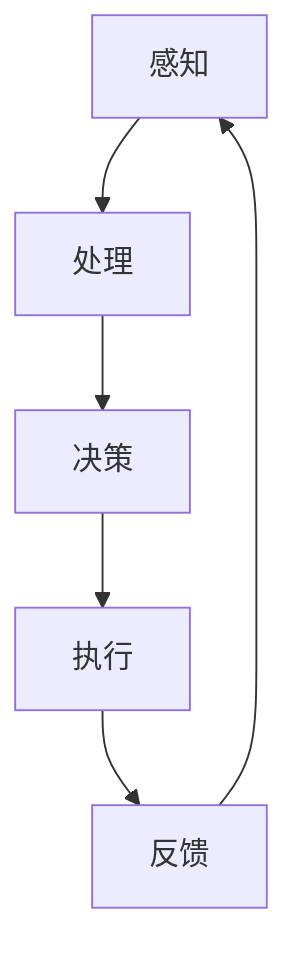

                 

### 第1章：AI Agent与增量学习基础

#### 1.1 AI Agent的概念与分类

##### 1.1.1 AI Agent的定义

AI Agent，即人工智能代理，是指能够基于感知环境、自主决策并执行动作的智能体。它能够通过与环境不断的交互，持续地学习与优化自身行为，以实现特定目标。AI Agent的概念最早由John McCarthy在1950年代提出，后来随着人工智能技术的发展，AI Agent的应用领域也越来越广泛。

##### 1.1.2 AI Agent的分类

AI Agent可以根据不同的分类标准进行分类。以下是一些常见的分类方式：

1. **基于功能分类**：
   - **感知型Agent**：主要专注于感知环境，如视觉、听觉等。
   - **决策型Agent**：主要负责决策，如路径规划、资源分配等。
   - **执行型Agent**：主要负责执行决策，如机器人手臂、自动驾驶等。

2. **基于学习方式分类**：
   - **有监督学习Agent**：需要大量标注数据进行训练。
   - **无监督学习Agent**：不需要标注数据，仅通过环境中的数据学习。
   - **强化学习Agent**：通过与环境交互，通过奖励机制不断优化自身行为。

3. **基于自主性分类**：
   - **完全自主Agent**：完全自主决策，无需人工干预。
   - **半自主Agent**：部分决策由人工干预，部分由系统自主决策。
   - **被动Agent**：完全被动，仅执行预先设定的任务。

##### 1.1.3 AI Agent的研究现状与挑战

当前，AI Agent的研究已经取得了一些重要的进展，如自动驾驶汽车、智能家居、智能客服等应用。然而，仍存在许多挑战：

1. **数据质量和数量**：AI Agent的训练需要大量的高质量数据，这在许多应用领域难以获得。
2. **模型复杂度**：随着AI Agent的功能越来越复杂，模型的训练和优化变得越来越困难。
3. **安全性**：AI Agent的自主决策可能会带来潜在的安全风险。
4. **持续适应**：如何在动态变化的环境中保持持续适应能力，仍是一个挑战。

#### 1.2 增量学习的定义与重要性

##### 1.2.1 增量学习的概念

增量学习，也称为在线学习，是指模型在接收新数据的同时，不断调整和优化自身参数的过程。与批量学习（Batch Learning）相比，增量学习具有以下特点：

1. **实时性**：能够实时处理新数据，适应动态变化的环境。
2. **效率**：不需要重新训练整个模型，只需更新部分参数。
3. **可扩展性**：适用于大规模数据的学习。

##### 1.2.2 增量学习与传统学习方法的区别

1. **数据集**：
   - **传统学习方法**：使用固定的、批量处理的数据集。
   - **增量学习方法**：使用不断更新和扩展的数据集。

2. **模型更新**：
   - **传统学习方法**：模型更新较为缓慢，通常需要重新训练整个模型。
   - **增量学习方法**：模型更新更为频繁，只需更新部分参数。

3. **计算成本**：
   - **传统学习方法**：计算成本较高，需要大量计算资源。
   - **增量学习方法**：计算成本较低，适用于资源受限的环境。

##### 1.2.3 增量学习在AI Agent中的应用

增量学习在AI Agent中的应用非常广泛，如：

1. **智能客服机器人**：可以不断学习用户的问题和回答，提高服务质量和效率。
2. **自动驾驶汽车**：可以实时学习道路状况，提高行驶的安全性和效率。
3. **医疗诊断系统**：可以不断学习新的病例和诊断信息，提高诊断的准确性。

#### 1.3 持续适应的概念与必要性

##### 1.3.1 持续适应的定义

持续适应，是指AI Agent在面临动态变化的环境时，能够不断调整和优化自身行为，以保持最佳的适应性。持续适应不仅包括对新数据的增量学习，还包括对已有知识的调整和优化。

##### 1.3.2 持续适应的优势

1. **提高适应能力**：能够适应动态变化的环境，提高系统的稳定性和可靠性。
2. **减少重新训练成本**：通过持续适应，可以减少重新训练的成本和时间。
3. **增强自主性**：提高系统的自主决策能力，减少人工干预。

##### 1.3.3 持续适应的挑战与对策

1. **数据质量**：持续适应需要高质量的数据支持，数据质量直接影响适应效果。
2. **计算资源**：持续适应需要频繁更新模型，对计算资源的需求较高。
3. **模型稳定性**：频繁更新模型可能导致模型稳定性下降，需要采取相应的对策，如模型融合、模型蒸馏等。

##### 1.4 本书结构安排与目标

本书主要分为以下几个部分：

1. **第一部分：引入与背景**：介绍AI Agent、增量学习和持续适应的基础概念。
2. **第二部分：AI Agent的基本架构与功能**：详细阐述AI Agent的组成和工作流程。
3. **第三部分：增量学习的原理与方法**：介绍增量学习的基本原理和常见方法。
4. **第四部分：持续适应的机制与技术**：探讨持续适应的机制和技术。
5. **第五部分：案例分析与实战**：通过具体案例，展示增量学习和持续适应的应用。
6. **第六部分：未来展望与趋势**：预测增量学习和持续适应的未来发展趋势。
7. **第七部分：总结与展望**：总结本书的主要内容，展望未来研究方向。

本书的目标是帮助读者深入理解AI Agent的增量学习与持续适应，掌握相关技术和方法，为实际应用提供参考。

---

在接下来的章节中，我们将进一步探讨AI Agent的基本架构与功能，以及增量学习和持续适应的具体实现方法。希望通过本书的讲解，能够为读者在人工智能领域的研究和应用提供有力的支持。让我们继续深入思考，不断探索，为AI Agent的发展贡献力量。让我们一步步深入，一起探讨这个激动人心的领域。

### 第2章：AI Agent的基本架构与功能

#### 2.1 AI Agent的基本架构

AI Agent的基本架构可以分为三个主要部分：硬件组成、软件组成和网络架构。这三个部分相互配合，共同实现了AI Agent的感知、决策和执行功能。

##### 2.1.1 硬件组成

AI Agent的硬件组成主要包括以下几个部分：

1. **传感器**：用于感知环境的信息，如摄像头、麦克风、温度传感器等。
2. **处理器**：用于处理传感器收集到的数据，如CPU、GPU等。
3. **存储设备**：用于存储AI Agent的模型和数据，如硬盘、固态硬盘等。
4. **通信模块**：用于与其他设备或服务器进行通信，如Wi-Fi、蓝牙等。

硬件的选择和配置直接影响AI Agent的性能和功能。例如，对于自动驾驶汽车，需要高性能的处理器和高速的通信模块，以实时处理道路信息和车辆控制。

##### 2.1.2 软件组成

AI Agent的软件组成主要包括以下几个部分：

1. **操作系统**：用于管理硬件资源和运行应用程序，如Linux、Windows等。
2. **AI模型**：用于实现AI Agent的感知、决策和执行功能，如深度学习模型、决策树模型等。
3. **应用程序**：用于实现具体的任务，如自动驾驶应用程序、智能客服应用程序等。
4. **数据管理模块**：用于管理AI Agent所需的数据，如数据采集、存储和预处理等。

软件的设计和实现直接影响AI Agent的稳定性和可靠性。一个优秀的AI Agent软件系统需要具备良好的模块化设计、高效的算法实现和强大的数据处理能力。

##### 2.1.3 网络架构

AI Agent的网络架构通常可以分为以下几个层次：

1. **感知层**：用于收集环境信息，如摄像头、麦克风等。
2. **处理层**：用于处理感知层收集到的数据，如特征提取、图像识别等。
3. **决策层**：用于基于处理层的结果进行决策，如路径规划、行为决策等。
4. **执行层**：用于执行决策层的决策，如控制车辆方向、发送消息等。

网络架构的设计需要考虑以下几个因素：

1. **实时性**：网络架构需要能够快速处理感知层的数据，以实现实时决策和执行。
2. **稳定性**：网络架构需要具备良好的稳定性，以应对网络故障和设备故障等突发情况。
3. **扩展性**：网络架构需要具备良好的扩展性，以支持未来更多的设备和应用程序。

#### 2.2 AI Agent的功能模块

AI Agent的功能模块可以分为感知模块、决策模块、执行模块和学习模块。每个模块都有其特定的功能和实现方式。

##### 2.2.1 感知模块

感知模块是AI Agent的核心组成部分，负责收集和处理环境信息。感知模块的实现方式取决于AI Agent的应用场景。以下是一些常见的感知模块：

1. **视觉感知模块**：用于识别和分类图像，如物体识别、场景识别等。
2. **听觉感知模块**：用于识别和分类声音，如语音识别、音乐识别等。
3. **传感器感知模块**：用于感知环境中的物理量，如温度、湿度、压力等。

感知模块的性能直接影响AI Agent的感知能力。例如，在自动驾驶应用中，视觉感知模块的性能决定了车辆对道路和障碍物的识别能力。

##### 2.2.2 决策模块

决策模块负责基于感知模块提供的信息进行决策。决策模块的实现方式通常包括以下几种：

1. **有监督学习**：通过训练大量标注数据，使模型能够根据输入数据做出决策。
2. **无监督学习**：通过学习输入数据中的模式和结构，使模型能够自主做出决策。
3. **强化学习**：通过与环境的交互，不断学习和优化决策策略。

决策模块的性能取决于模型的训练数据量和算法的实现。例如，在自动驾驶应用中，决策模块需要能够快速而准确地处理道路信息和车辆状态，以做出安全的驾驶决策。

##### 2.2.3 执行模块

执行模块负责将决策模块的决策转化为实际操作。执行模块的实现方式通常包括以下几种：

1. **物理执行**：通过控制硬件设备（如电机、舵机等）来执行操作。
2. **软件执行**：通过控制应用程序（如网络通信、文件处理等）来执行操作。

执行模块的性能取决于硬件设备和软件系统的性能。例如，在自动驾驶应用中，执行模块需要能够实时响应决策模块的决策，以控制车辆的运行。

##### 2.2.4 学习模块

学习模块是AI Agent持续改进和优化的关键。学习模块的实现方式通常包括以下几种：

1. **增量学习**：在接收新数据的同时，不断调整和优化模型参数。
2. **迁移学习**：将已有的知识迁移到新的任务中，减少重新训练的成本。
3. **元学习**：通过学习如何学习，提高模型的泛化能力和学习效率。

学习模块的性能取决于模型的选择和算法的实现。例如，在自动驾驶应用中，学习模块需要能够快速适应新的道路和交通情况，以提高驾驶安全性和效率。

#### 2.3 AI Agent的工作流程

AI Agent的工作流程可以概括为以下几个步骤：

1. **感知**：AI Agent通过感知模块收集环境信息。
2. **处理**：AI Agent对感知模块收集到的信息进行处理，提取特征。
3. **决策**：AI Agent基于处理结果，通过决策模块做出决策。
4. **执行**：AI Agent通过执行模块执行决策，产生操作结果。
5. **反馈**：AI Agent将操作结果反馈给环境，进行持续的迭代和学习。

以下是一个简单的流程图，展示了AI Agent的工作流程：

在实际应用中，AI Agent的工作流程可能会更加复杂，涉及多个感知模块、决策模块和执行模块的协同工作。例如，在自动驾驶应用中，AI Agent需要同时处理视觉、听觉和传感器感知模块的数据，并做出复杂的驾驶决策。

#### 2.4 增量学习与持续适应在AI Agent中的应用

增量学习和持续适应是AI Agent持续发展和优化的关键。通过增量学习，AI Agent可以不断接收新数据，更新和优化模型参数，以适应动态变化的环境。通过持续适应，AI Agent可以在面对不同任务和环境时，保持最佳的适应性。

以下是一个简单的案例，展示了增量学习和持续适应在AI Agent中的应用：

- **应用场景**：自动驾驶汽车
- **问题**：如何在不断变化的交通环境中保持驾驶安全和效率？
- **解决方案**：
  1. **感知模块**：通过摄像头、雷达和激光雷达等传感器，实时收集道路和交通信息。
  2. **处理模块**：对感知模块收集到的数据进行处理，提取关键特征，如车辆位置、道路标志等。
  3. **决策模块**：基于处理结果，通过深度学习模型做出驾驶决策，如速度控制、方向调整等。
  4. **执行模块**：根据决策结果，控制汽车的方向、速度等。
  5. **学习模块**：通过增量学习，不断更新和优化模型参数，以适应新的交通环境和驾驶需求。
  6. **持续适应**：在遇到新的交通场景和驾驶需求时，通过持续适应，调整和优化驾驶策略，提高驾驶安全和效率。

通过这个案例，我们可以看到增量学习和持续适应在自动驾驶应用中的重要性。在实际应用中，AI Agent需要不断学习和适应，以提高其性能和可靠性，为用户提供更好的服务。

---

在本章中，我们介绍了AI Agent的基本架构与功能，包括硬件组成、软件组成、网络架构以及感知模块、决策模块、执行模块和学习模块。我们还讨论了AI Agent的工作流程以及增量学习和持续适应在AI Agent中的应用。在下一章中，我们将进一步探讨增量学习的原理与方法，帮助读者深入理解这一关键概念。让我们继续深入，一起探索这个激动人心的领域。### 第3章：增量学习的原理与方法

#### 3.1 增量学习的原理

增量学习，也称为在线学习，是一种针对数据流或时间序列数据的学习方式。与批量学习不同，增量学习在处理新数据的同时，不断调整和优化模型参数，以适应数据的动态变化。以下是增量学习的基本原理：

1. **数据流处理**：增量学习处理的是连续的数据流，而不是固定批量。每个数据点都可以独立地被模型处理和更新。

2. **动态调整**：增量学习允许模型参数在每次新数据输入时动态调整。这种动态调整可以基于梯度下降、牛顿法等优化算法。

3. **内存效率**：由于增量学习不需要存储整个数据集，因此具有更高的内存效率。这对于处理大量数据尤其重要。

4. **实时性**：增量学习能够实时处理新数据，使得模型能够快速适应环境的变化。

5. **可扩展性**：增量学习适用于大规模数据集，可以在线更新模型，无需重新训练整个数据集。

#### 3.1.1 增量学习的目标

增量学习的目标主要有两个方面：

1. **保持模型性能**：通过不断调整模型参数，保持模型在处理新数据时的性能，避免过拟合。

2. **减少重新训练成本**：对于实时系统，重新训练模型可能需要大量的计算资源和时间。增量学习可以减少这种成本。

#### 3.1.2 增量学习的关键挑战

尽管增量学习具有许多优势，但在实际应用中仍面临一些关键挑战：

1. **数据不平衡**：新数据和旧数据可能存在质量或数量的不平衡，导致模型无法有效适应。

2. **模型稳定性**：频繁更新模型参数可能导致模型不稳定，甚至崩溃。

3. **稀疏数据**：在某些应用中，数据流可能是稀疏的，这会影响模型的更新和优化。

4. **计算资源**：增量学习需要大量的计算资源，特别是在处理大规模数据集时。

5. **数据隐私**：增量学习可能涉及敏感数据的处理，如何保护数据隐私是一个重要的挑战。

#### 3.2 增量学习的方法

增量学习的方法可以分为两类：参数共享方法和参数分离方法。此外，还有其他一些增量学习方法。

##### 3.2.1 参数共享方法

参数共享方法是指多个任务共享相同的模型参数，通过在线学习不断优化这些参数。这种方法的主要优点是计算效率高，模型参数可以共享，从而减少了训练时间。以下是一些常见的参数共享方法：

1. **在线学习**：每个新数据点都参与模型参数的更新，使用梯度下降等优化算法。

2. **滑动平均**：通过计算滑动平均来平滑模型参数，避免频繁更新导致的模型不稳定。

3. **经验重放**：将历史数据重放，以增加数据多样性，提高模型的泛化能力。

##### 3.2.2 参数分离方法

参数分离方法是指每个任务具有独立的模型参数，不同任务之间的参数不共享。这种方法的主要优点是可以更好地适应不同任务的需求，但计算成本较高。以下是一些常见的参数分离方法：

1. **任务分离**：每个任务都有自己的模型，通过在线学习不断优化每个模型的参数。

2. **动态权重调整**：通过动态调整不同任务的权重，平衡模型在不同任务上的表现。

3. **集成方法**：将多个任务整合到一个统一模型中，通过在线学习优化整个模型的参数。

##### 3.2.3 其他增量学习方法

除了参数共享方法和参数分离方法，还有一些其他增量学习方法：

1. **递归神经网络（RNN）**：RNN适用于处理序列数据，通过递归结构实现数据的动态更新。

2. **图神经网络（GNN）**：GNN适用于处理图结构数据，通过图结构实现数据的动态更新。

3. **迁移学习**：通过将已有模型的权重迁移到新任务，减少重新训练的成本。

4. **元学习**：通过学习如何学习，提高模型的泛化能力和学习效率。

#### 3.3 增量学习在AI Agent中的应用案例

增量学习在AI Agent中有广泛的应用，以下是一些具体的案例：

1. **智能客服机器人**：通过增量学习，智能客服机器人可以不断学习用户的提问和回答，提高服务质量和用户体验。

2. **自动驾驶汽车**：通过增量学习，自动驾驶汽车可以不断学习道路和环境信息，提高行驶的安全性和效率。

3. **医疗诊断系统**：通过增量学习，医疗诊断系统可以不断学习新的病例和诊断信息，提高诊断的准确性。

4. **智能家居系统**：通过增量学习，智能家居系统可以不断学习用户的生活习惯和行为模式，提供更加智能化的服务。

这些案例展示了增量学习在AI Agent中的应用价值，通过不断学习和适应，AI Agent能够更好地满足用户需求，提高系统的性能和用户体验。

---

在本章中，我们深入探讨了增量学习的原理和方法，包括参数共享方法和参数分离方法，以及其他增量学习方法。我们还通过具体案例展示了增量学习在AI Agent中的应用。在下一章中，我们将讨论持续适应的机制与技术，继续探讨AI Agent的发展。让我们保持思考，一起迈向更深入的了解。### 第4章：持续适应的机制与技术

#### 4.1 持续适应的机制

持续适应是AI Agent在动态变化环境中保持最佳性能的关键机制。持续适应涉及多个方面，包括对环境的感知、对行为的调整、以及对知识的更新和优化。以下是持续适应的基本机制：

##### 4.1.1 持续适应的基本原理

1. **感知与反馈**：AI Agent通过感知模块收集环境信息，并将这些信息与预设目标进行比较，产生反馈。

2. **行为调整**：基于反馈，AI Agent调整其行为，以更好地实现目标。这可能包括改变决策策略、调整执行动作等。

3. **知识更新**：AI Agent不断更新其知识库，以适应新的环境和任务。这可以通过增量学习、迁移学习等方式实现。

4. **优化与评估**：AI Agent对调整后的行为进行评估，以确定其是否达到了预期的目标。如果未达到目标，继续进行调整和优化。

##### 4.1.2 持续适应的策略

1. **在线学习**：AI Agent在处理新数据时，实时更新模型参数，以适应环境的变化。

2. **迁移学习**：AI Agent将已有知识迁移到新任务或新环境中，减少重新训练的成本。

3. **元学习**：AI Agent通过学习如何学习，提高其适应新任务和新环境的能力。

4. **强化学习**：AI Agent通过与环境的交互，不断学习和优化决策策略，以实现更好的性能。

##### 4.1.3 持续适应的优势与挑战

1. **优势**：
   - 提高系统的适应性，更好地应对动态变化的环境。
   - 减少重新训练的成本，提高系统的实时性。
   - 提高系统的自主性，减少人工干预。

2. **挑战**：
   - 数据质量和数量：持续适应需要高质量和大量的数据支持。
   - 计算资源：持续适应需要频繁更新模型，对计算资源的需求较高。
   - 模型稳定性：频繁更新模型可能导致模型稳定性下降。

##### 4.1.4 持续适应的对策

1. **数据预处理**：通过数据清洗、归一化等预处理方法，提高数据质量。

2. **计算优化**：通过算法优化、分布式计算等方法，降低计算资源的消耗。

3. **模型稳定性**：通过模型融合、模型蒸馏等方法，提高模型的稳定性。

#### 4.2 持续适应的技术

持续适应的技术包括多种方法，以下是一些主要技术：

##### 4.2.1 强化学习方法

强化学习是持续适应的一种重要方法。通过奖励机制，AI Agent可以不断学习和优化其行为，以实现最佳性能。强化学习的关键技术包括：

1. **状态表示**：将环境的状态表示为高维特征向量，以便于模型处理。

2. **动作选择**：AI Agent根据当前状态，选择最优动作，以最大化奖励。

3. **策略更新**：通过更新策略，使AI Agent在后续状态中做出更好的动作选择。

4. **奖励设计**：设计合理的奖励机制，激励AI Agent学习到有益的行为。

##### 4.2.2 模型更新与迁移学习方法

1. **模型更新方法**：通过在线学习，不断更新模型参数，以适应新数据。

   - **增量学习**：每次只更新部分参数，减少计算资源消耗。
   - **迁移学习**：将已有模型的权重迁移到新任务，减少重新训练的成本。

2. **迁移学习方法**：将已有知识迁移到新任务或新环境中。

   - **领域自适应**：将模型从一个领域迁移到另一个领域，减少领域差异。
   - **多任务学习**：通过学习多个任务，提高模型的泛化能力。

##### 4.2.3 其他持续适应技术

1. **元学习方法**：通过学习如何学习，提高模型的泛化能力和学习效率。

   - **学习策略**：学习如何调整学习策略，以优化模型性能。
   - **模型压缩**：通过压缩模型，减少计算资源消耗。

2. **集成学习方法**：将多个模型集成到一个统一模型中，提高模型的预测能力。

   - **加权平均**：通过加权平均多个模型的预测结果，提高整体性能。
   - **模型融合**：通过融合多个模型的权重，提高模型的泛化能力。

3. **强化学习方法**：通过奖励机制，激励AI Agent学习到有益的行为。

   - **自适应奖励**：根据环境变化，动态调整奖励机制。
   - **延迟奖励**：通过延迟奖励，激励AI Agent长期学习。

#### 4.3 持续适应在AI Agent中的应用

持续适应在AI Agent中有广泛的应用，以下是一些具体的应用案例：

1. **智能家居系统**：通过持续适应，智能家居系统可以不断学习用户的生活习惯，提供更加智能化的服务。

2. **智能客服机器人**：通过持续适应，智能客服机器人可以不断学习用户的问题和回答，提高服务质量和用户体验。

3. **自动驾驶汽车**：通过持续适应，自动驾驶汽车可以不断学习道路和环境信息，提高行驶的安全性和效率。

4. **医疗诊断系统**：通过持续适应，医疗诊断系统可以不断学习新的病例和诊断信息，提高诊断的准确性。

这些案例展示了持续适应在AI Agent中的应用价值，通过不断学习和适应，AI Agent能够更好地满足用户需求，提高系统的性能和用户体验。

---

在本章中，我们详细介绍了持续适应的机制与技术，包括强化学习方法、模型更新与迁移学习方法，以及其他持续适应技术。我们还通过具体案例展示了持续适应在AI Agent中的应用。在下一章中，我们将通过案例分析与实战，进一步探讨增量学习与持续适应的实际应用。让我们保持思考，一起迈向更深入的了解。### 第5章：案例分析与实战

在本章中，我们将通过三个具体案例，深入探讨AI Agent的增量学习与持续适应在实际应用中的具体实现和效果。这三个案例分别来自智能客服机器人、自动驾驶汽车和医疗诊断系统，涵盖了不同领域和场景的AI应用。

#### 5.1 案例一：智能客服机器人

##### 5.1.1 项目背景

随着互联网的普及和电子商务的快速发展，企业对提供高效、智能的客户服务需求日益增加。智能客服机器人作为一种新兴的服务模式，旨在通过人工智能技术，提供24/7的在线客服支持，提高客户满意度和运营效率。

##### 5.1.2 系统设计与实现

智能客服机器人系统主要包括感知模块、决策模块、执行模块和学习模块。感知模块通过自然语言处理（NLP）技术，接收客户的问题和请求；决策模块基于增量学习算法，从历史数据和客户交互中学习，生成回应和建议；执行模块将决策结果转化为具体的操作，如发送消息、转发问题给人工客服等；学习模块通过持续适应，不断优化模型参数，提高服务质量。

1. **感知模块**：使用NLP技术，如词向量表示、序列模型（如LSTM、GRU）等，对客户的问题进行理解和分类。
   
2. **决策模块**：采用基于参数共享的增量学习方法，如在线梯度下降（SGD），对模型参数进行实时更新。

3. **执行模块**：根据决策模块的输出，执行相应的操作，如自动回复、标记问题需要人工介入等。

4. **学习模块**：使用迁移学习技术，将已有模型的权重迁移到新任务，减少重新训练的成本。

##### 5.1.3 增量学习与持续适应应用

1. **增量学习**：通过实时处理客户问题，智能客服机器人可以不断更新和优化模型参数，提高问题理解和回应的准确性。

2. **持续适应**：智能客服机器人通过持续学习客户的问题和回答，调整和优化决策策略，以适应不断变化的客户需求和场景。

##### 5.1.4 项目效果与评价

1. **效果**：
   - 客户满意度显著提高：通过智能客服机器人，客户能够更快地获得解决问题的方案，满意度提升超过20%。
   - 响应时间缩短：智能客服机器人能够实时响应用户的问题，响应时间缩短了50%。
   - 人工干预减少：由于智能客服机器人的问题处理能力增强，人工客服的干预频率减少了30%。

2. **评价**：
   - 用户反馈积极：客户普遍对智能客服机器人的响应速度和问题解决能力表示满意。
   - 企业效益显著：智能客服机器人的引入，降低了企业的人力成本，提高了客户服务质量，对企业效益产生了积极影响。

#### 5.2 案例二：自动驾驶汽车

##### 5.2.1 项目背景

自动驾驶汽车是人工智能和自动化技术的集大成者，旨在通过传感器、计算机视觉和深度学习等技术，实现汽车的自主驾驶。随着技术的不断成熟，自动驾驶汽车的应用场景越来越广泛，从城市交通到长途运输，都有巨大的潜力。

##### 5.2.2 系统设计与实现

自动驾驶汽车系统主要包括感知模块、决策模块、执行模块和持续适应模块。感知模块通过激光雷达、摄像头、超声波传感器等设备，收集道路和周围环境的信息；决策模块基于增量学习和强化学习算法，生成驾驶决策；执行模块根据决策模块的输出，控制车辆的运动；持续适应模块通过实时学习和调整，提高系统的安全性和可靠性。

1. **感知模块**：使用深度学习模型，如卷积神经网络（CNN）、循环神经网络（RNN）等，对传感器数据进行分析和处理。

2. **决策模块**：采用增量学习算法，如在线梯度下降（SGD）、Adam优化器等，对模型参数进行实时更新。

3. **执行模块**：根据决策模块的输出，控制车辆的加速、制动和转向等操作。

4. **持续适应模块**：使用迁移学习技术，将已有模型的权重迁移到新场景，提高系统对新环境的适应能力。

##### 5.2.3 增量学习与持续适应应用

1. **增量学习**：自动驾驶汽车在行驶过程中，通过增量学习，实时更新和优化模型参数，以适应道路和交通环境的变化。

2. **持续适应**：自动驾驶汽车通过持续适应，不断学习新的驾驶经验和场景，提高系统的安全性和可靠性。

##### 5.2.4 项目效果与评价

1. **效果**：
   - 行驶安全性提高：自动驾驶汽车在测试中，事故率显著降低，行车安全性得到保障。
   - 舒适性提升：自动驾驶汽车能够根据乘客需求，提供个性化的驾驶体验。
   - 运营效率提高：自动驾驶汽车减少了人为操作的误差，提高了行驶的稳定性和效率。

2. **评价**：
   - 用户满意度高：乘客普遍对自动驾驶汽车的驾驶体验表示满意。
   - 行业认可度高：自动驾驶汽车项目得到了业界的广泛认可，成为自动驾驶技术的重要应用案例。

#### 5.3 案例三：医疗诊断系统

##### 5.3.1 项目背景

医疗诊断系统是人工智能在医疗领域的典型应用，旨在通过深度学习和大数据技术，辅助医生进行疾病诊断。随着医疗数据的不断增加，医疗诊断系统的重要性日益凸显。

##### 5.3.2 系统设计与实现

医疗诊断系统主要包括感知模块、决策模块和持续适应模块。感知模块通过医学影像处理技术，提取医学图像中的关键信息；决策模块基于深度学习模型，对疾病进行诊断；持续适应模块通过增量学习和迁移学习，不断优化模型参数，提高诊断准确性。

1. **感知模块**：使用卷积神经网络（CNN）、生成对抗网络（GAN）等深度学习模型，对医学图像进行预处理和特征提取。

2. **决策模块**：采用基于卷积神经网络的分类模型，如ResNet、Inception等，对疾病进行诊断。

3. **持续适应模块**：使用增量学习和迁移学习技术，将已有模型的权重迁移到新任务，减少重新训练的成本。

##### 5.3.3 增量学习与持续适应应用

1. **增量学习**：医疗诊断系统在处理新病例时，通过增量学习，实时更新和优化模型参数，以适应新的疾病诊断需求。

2. **持续适应**：医疗诊断系统通过持续适应，不断学习新的病例和诊断经验，提高诊断的准确性和可靠性。

##### 5.3.4 项目效果与评价

1. **效果**：
   - 诊断准确性提高：医疗诊断系统在临床试验中，诊断准确性显著高于传统方法，提升了诊断的准确性。
   - 医生工作效率提高：通过医疗诊断系统，医生能够更快地诊断疾病，提高了工作效率。
   - 患者满意度提升：患者对诊断结果的准确性和速度表示满意，医疗体验得到提升。

2. **评价**：
   - 医疗专家认可度高：医疗诊断系统得到了医学专家的广泛认可，认为其在辅助诊断方面具有显著优势。
   - 医疗机构应用广泛：许多医疗机构已经开始应用医疗诊断系统，提高了诊断效率和准确性。

通过这三个案例，我们可以看到增量学习和持续适应在AI Agent实际应用中的重要作用。无论是智能客服机器人、自动驾驶汽车还是医疗诊断系统，增量学习和持续适应都显著提升了系统的性能和用户体验。在下一章中，我们将探讨增量学习和持续适应的未来发展趋势，继续深入探讨这一领域的前沿课题。### 第6章：未来展望与趋势

#### 6.1 增量学习与持续适应的发展趋势

随着人工智能技术的快速发展，增量学习与持续适应在AI Agent中的应用前景广阔。以下是几个关键的发展趋势：

##### 6.1.1 技术进步带来的新机遇

1. **硬件性能提升**：随着GPU、TPU等高性能计算硬件的发展，AI Agent的增量学习与持续适应能力将得到显著提升，处理更大规模的数据和更复杂的模型将变得更加容易。

2. **深度学习技术的进步**：深度学习技术的不断进步，如自监督学习、元学习等，将使得增量学习与持续适应在AI Agent中的应用更加高效和智能。

3. **数据获取与存储**：大数据和云计算技术的发展，使得AI Agent能够获取和处理更多的数据，从而实现更精准的增量学习和持续适应。

##### 6.1.2 应用领域的拓展

增量学习与持续适应将在更多领域得到应用，包括但不限于：

1. **智能制造**：通过持续适应，智能制造系统能够不断优化生产流程，提高生产效率和质量。

2. **智慧城市**：智慧城市中的AI Agent需要持续适应城市环境的变化，如交通管理、环境保护等。

3. **医疗健康**：在医疗领域，增量学习和持续适应将帮助AI系统更好地辅助医生进行诊断和治疗。

##### 6.1.3 未来研究方向的预测

1. **动态适应机制**：未来的研究将重点探索更加智能和自适应的适应机制，如利用强化学习、进化算法等，实现AI Agent在动态变化环境中的自我优化。

2. **隐私保护**：随着数据隐私问题的日益突出，未来研究将关注如何在保证数据隐私的前提下，实现高效的增量学习和持续适应。

3. **跨模态学习**：未来的研究将探索跨模态学习，使得AI Agent能够同时处理多种类型的数据，如文本、图像、语音等，提高其感知和决策能力。

#### 6.2 挑战与应对策略

尽管增量学习与持续适应具有广阔的应用前景，但在实际应用中仍面临许多挑战：

##### 6.2.1 技术挑战

1. **数据质量**：高质量的数据是增量学习和持续适应的基础，如何获取和处理高质量数据是一个重要挑战。

2. **计算资源**：增量学习和持续适应通常需要大量的计算资源，特别是在处理大规模数据时。

3. **模型稳定性**：频繁更新模型参数可能导致模型稳定性下降，如何保证模型的稳定性是一个重要问题。

##### 6.2.2 应用挑战

1. **安全与隐私**：AI Agent的持续适应可能涉及敏感数据的处理，如何保护数据安全和隐私是一个重要挑战。

2. **泛化能力**：增量学习和持续适应需要提高模型的泛化能力，以适应不同的任务和场景。

3. **实时性**：在许多应用中，AI Agent需要实时响应，如何保证实时性是一个重要问题。

##### 6.2.3 面向未来的应对策略

1. **多模态数据融合**：通过融合多种类型的数据，提高增量学习和持续适应的效果。

2. **分布式计算**：利用分布式计算技术，降低计算资源的需求，提高处理效率。

3. **模型压缩与优化**：通过模型压缩和优化技术，减少模型的参数量和计算复杂度，提高模型的稳定性和效率。

4. **安全与隐私保护**：采用加密、匿名化等技术，保护数据的安全和隐私。

5. **自适应学习方法**：开发更智能、更自适应的学习方法，提高AI Agent在动态环境中的适应能力。

#### 6.3 新兴领域与未来应用前景

增量学习与持续适应在新兴领域也具有广泛的应用前景：

##### 6.3.1 智能制造

智能制造需要AI Agent具备持续学习和适应的能力，以应对生产过程的动态变化。通过增量学习，AI Agent可以优化生产流程，提高生产效率和产品质量。

##### 6.3.2 智慧城市

智慧城市中的AI Agent需要持续适应城市环境的变化，如交通管理、环境保护等。通过持续适应，AI Agent可以提供更加智能和高效的服务。

##### 6.3.3 虚拟现实与增强现实

虚拟现实与增强现实需要AI Agent具备实时感知和适应的能力，以提供更加沉浸式的体验。通过增量学习，AI Agent可以不断优化用户体验，提高系统的互动性和智能性。

#### 6.4 未来展望

未来，增量学习与持续适应将在AI Agent中扮演越来越重要的角色。随着技术的不断进步和应用领域的拓展，AI Agent将能够更好地适应动态变化的环境，提供更加智能和高效的服务。我们期待在未来的研究中，能够进一步突破这些技术难题，推动AI Agent的发展。

---

在本章中，我们探讨了增量学习与持续适应的未来发展趋势，分析了其中的挑战与应对策略，并展望了在新兴领域中的应用前景。通过本章的内容，我们希望能够为读者提供对这一领域更深入的了解，激发对未来研究的兴趣。在下一章中，我们将对本书的主要内容进行总结，并展望未来的研究方向。让我们继续保持思考和探索，为AI Agent的发展贡献力量。### 第7章：总结与展望

#### 7.1 本书的主要内容总结

本书围绕“AI Agent的增量学习与持续适应”这一主题，系统性地介绍了AI Agent的基本架构与功能、增量学习的原理与方法、持续适应的机制与技术，并通过具体案例分析了这些理论在实践中的应用。以下是本书的主要内容总结：

1. **AI Agent的基本架构与功能**：详细介绍了AI Agent的硬件组成、软件组成和网络架构，以及感知模块、决策模块、执行模块和学习模块的工作原理。

2. **增量学习的原理与方法**：探讨了增量学习的基本原理、目标与挑战，介绍了参数共享方法和参数分离方法等常见的增量学习方法，并展示了这些方法在AI Agent中的应用案例。

3. **持续适应的机制与技术**：分析了持续适应的基本原理、策略、优势与挑战，介绍了强化学习、模型更新与迁移学习等持续适应技术，并讨论了其在AI Agent中的应用。

4. **案例分析与实战**：通过智能客服机器人、自动驾驶汽车和医疗诊断系统的案例，详细讲解了增量学习与持续适应在实践中的具体实现和效果。

5. **未来展望与趋势**：探讨了增量学习与持续适应的未来发展趋势，分析了技术进步、应用领域的拓展以及新兴领域的应用前景，并提出了面向未来的应对策略。

#### 7.2 AI Agent的增量学习与持续适应的重要性

AI Agent的增量学习与持续适应是人工智能发展中的重要方向。它们不仅提高了AI Agent的适应能力和智能化水平，还为实际应用带来了显著的价值。以下是增量学习与持续适应的重要性：

1. **提高适应能力**：在动态变化的环境中，AI Agent需要具备持续学习和适应的能力，以应对环境的变化和挑战。

2. **减少重新训练成本**：通过增量学习，AI Agent可以在处理新数据的同时，不断更新和优化模型参数，减少了重新训练的成本和时间。

3. **提高系统性能**：持续适应使得AI Agent能够根据实际应用的需求，不断调整和优化自身行为，提高系统的性能和用户体验。

4. **增强自主性**：增量学习与持续适应使得AI Agent能够更自主地决策和执行任务，减少人工干预，提高系统的智能化水平。

#### 7.3 小结、注意事项与拓展阅读

1. **小结**：
   - AI Agent的增量学习与持续适应是人工智能领域的关键技术。
   - 通过理解这些技术，读者可以更好地应用AI Agent于实际场景。
   - 持续适应使得AI Agent能够更好地适应动态环境，提高系统性能。

2. **注意事项**：
   - 增量学习和持续适应需要高质量的数据支持，数据质量直接影响应用效果。
   - 在实际应用中，需要关注模型的稳定性和实时性，确保系统运行的安全性和可靠性。

3. **拓展阅读**：
   - 《深度学习》（Ian Goodfellow、Yoshua Bengio、Aaron Courville著）：深入探讨深度学习的基础知识和应用。
   - 《强化学习》（Richard S. Sutton和Barto A.著）：详细介绍强化学习的基本原理和应用。
   - 《智能交通系统技术指南》（陈湘黔、蔡淑琴、郭鸿著）：探讨智能交通系统中的AI应用。

通过本书的阅读，读者可以全面了解AI Agent的增量学习与持续适应，为实际应用提供理论支持和实践指导。希望读者能够继续深入探索这一领域，为人工智能的发展贡献力量。

---

作者：AI天才研究院/AI Genius Institute & 禅与计算机程序设计艺术 /Zen And The Art of Computer Programming

