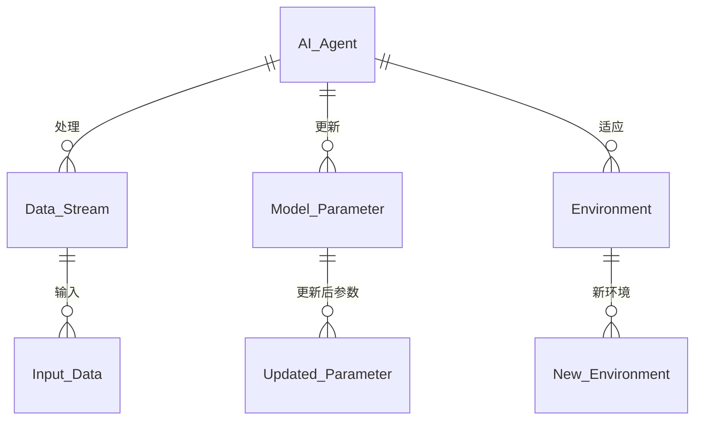
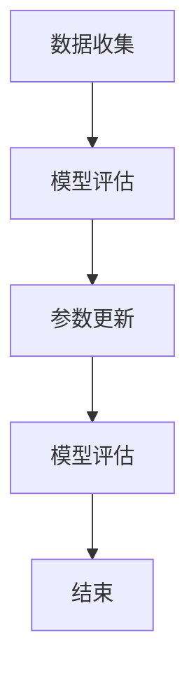
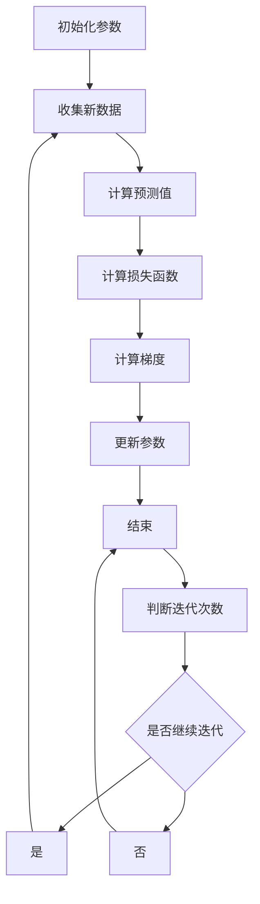
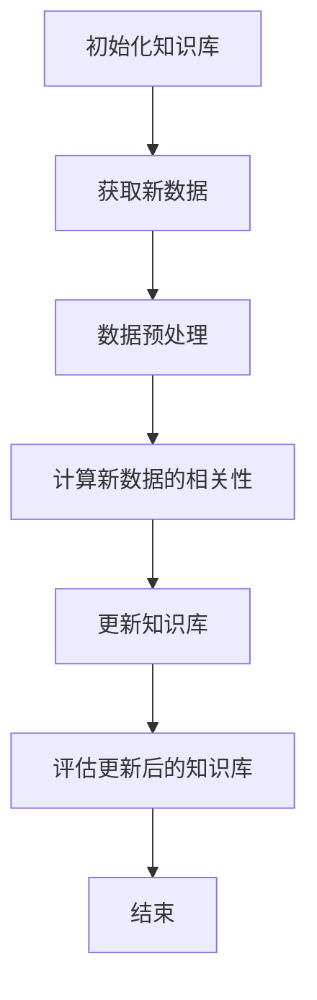

                 


### 第1章: 引言

#### 问题背景

AI Agent，即人工智能代理，是一种能够自动完成特定任务的智能实体，广泛应用于自动化控制、数据分析、自然语言处理等多个领域。随着人工智能技术的不断发展，AI Agent在现实世界中的应用越来越广泛，它们需要不断学习和适应新的环境和任务。

然而，传统的机器学习方法在训练AI Agent时，往往需要大量的数据和计算资源。这不仅限制了AI Agent的实时性和适应性，还可能导致模型在新的环境下表现不佳。为了解决这些问题，增量学习应运而生。

增量学习（Incremental Learning），也称为在线学习（Online Learning），是一种在数据流中逐步更新模型的训练方法。它通过逐步学习和调整，使得AI Agent能够在新的环境下快速适应和改进。知识更新则是增量学习的一个重要组成部分，它涉及到如何有效地管理AI Agent的知识库，使其能够动态适应环境变化。

#### 问题描述

AI Agent的增量学习与知识更新主要面临以下问题：

1. **数据流处理**：如何高效地处理连续的数据流，并在有限的时间内完成模型的训练和更新。
2. **模型可扩展性**：如何设计可扩展的增量学习算法，以适应不同的应用场景和数据规模。
3. **知识管理**：如何有效地更新和整合知识库，确保AI Agent在新的环境下能够正确地执行任务。
4. **模型性能**：如何在有限的计算资源下，保持模型的性能和准确性。

#### 问题解决

为了解决上述问题，我们需要从以下几个方面进行考虑：

1. **算法优化**：研究并设计更高效的增量学习算法，如在线学习算法、迁移学习算法等，以降低计算复杂度和提高模型性能。
2. **数据预处理**：通过数据预处理和特征提取，提高数据的质量和可利用性，从而提高模型的训练效率和性能。
3. **知识管理**：设计有效的知识更新策略，如基于规则的知识更新、基于模型的增量更新等，以适应不同场景的需求。
4. **模型评估**：建立一套完善的模型评估体系，以评估模型的性能和适应性，从而指导模型优化和知识更新。

#### 边界与外延

本文主要讨论增量学习与知识更新在AI Agent中的应用，具体包括以下内容：

- **核心概念**：介绍增量学习和知识更新的基本概念、原理和特点。
- **算法原理**：详细讲解常见的增量学习算法和知识更新算法，包括其原理、流程和实现方法。
- **数学模型**：阐述增量学习和知识更新算法的数学模型，包括相关公式和推导。
- **应用实例**：通过具体的应用实例，展示增量学习和知识更新在AI Agent中的应用效果。

#### 概念结构与核心要素组成

本文的核心概念包括：

- **增量学习**：一种在数据流中逐步更新模型的训练方法。
- **知识更新**：管理AI Agent知识库的过程，使其能够动态适应环境变化。
- **AI Agent**：一种能够自动完成特定任务的智能实体。

核心要素包括：

- **算法**：实现增量学习和知识更新的具体方法。
- **数据**：用于训练和更新模型的数据流。
- **知识库**：存储和管理AI Agent知识的数据库。

这些概念和要素相互关联，共同构成了AI Agent的增量学习和知识更新的基础。

### 第2章: 增量学习的概念与背景

#### 核心概念

增量学习（Incremental Learning），也称为在线学习（Online Learning），是一种在数据流中逐步更新模型的训练方法。与传统的批量学习（Batch Learning）相比，增量学习具有以下几个核心概念：

1. **数据流处理**：增量学习在面对连续数据流时，能够实时地处理和更新模型。这意味着AI Agent可以实时地适应新的环境和任务。
2. **逐步更新**：增量学习不是一次性地完成整个模型的训练，而是通过逐步更新模型的参数，使得模型能够在训练过程中不断优化。
3. **适应性**：增量学习使得AI Agent具有更好的适应性，能够在不同的环境下快速地适应和完成任务。

#### 联系

增量学习与现有的技术有着密切的联系，其中最显著的是与机器学习和深度学习的联系。

- **机器学习**：增量学习是机器学习的一种特殊形式，它通过逐步更新模型参数，使得模型能够更好地适应新的数据流。
- **深度学习**：深度学习是一种强大的机器学习方法，它在图像识别、自然语言处理等领域取得了显著的成果。然而，传统的深度学习方法在处理连续数据流时存在一定的局限性，而增量学习则能够有效地解决这个问题。

#### 对比

尽管增量学习与机器学习和深度学习有着密切的联系，但它们在处理数据的方式和应用场景上存在一些明显的区别：

1. **数据量**：机器学习和深度学习通常需要大量的数据来进行训练，而增量学习则更适合处理小规模的数据流。
2. **实时性**：增量学习强调实时性，它能够实时地处理和更新模型，而机器学习和深度学习通常需要较长时间来完成模型的训练和更新。
3. **适应性**：增量学习使得AI Agent能够更好地适应不同的环境和任务，而机器学习和深度学习则更侧重于在特定任务上的性能优化。

#### 原理

增量学习的基本原理可以概括为以下几步：

1. **数据收集**：收集新的数据，并将其输入到模型中。
2. **模型更新**：根据新的数据，更新模型的参数，使得模型能够更好地适应新的数据流。
3. **模型评估**：评估更新后的模型性能，并根据评估结果调整模型参数。

通过这一过程，增量学习使得AI Agent能够在不断变化的环境中保持良好的性能。

#### 应用

增量学习在AI Agent中有着广泛的应用，如自动化控制、数据分析、自然语言处理等。以下是一些典型的应用场景：

1. **自动化控制**：在工业自动化领域，增量学习可以用于实时监控和调整生产过程，提高生产效率和产品质量。
2. **数据分析**：在商业智能领域，增量学习可以用于实时分析大量数据，提供实时决策支持。
3. **自然语言处理**：在智能客服和智能搜索等领域，增量学习可以用于实时理解和回应用户的查询，提高用户体验。

#### 结论

增量学习作为一种有效的机器学习方法，在AI Agent中的应用具有重要意义。通过增量学习，AI Agent能够更好地适应不断变化的环境，实现更高效、更智能的运行。

#### 核心概念属性特征对比表格

| 核心概念 | 描述 | 特点 |
| --- | --- | --- |
| 增量学习 | 在数据流中逐步更新模型的训练方法 | 实时性、适应性、逐步更新 |
| 机器学习 | 使用数据来训练模型的方法 | 批量处理、准确性高、需大量数据 |
| 深度学习 | 基于神经网络的机器学习方法 | 强大、自适应、需大量数据 |

#### ER实体关系图架构的Mermaid流程图



通过上述ER实体关系图，我们可以清晰地看到增量学习、数据流、模型参数和环境之间的相互作用关系。

### 第3章: 增量学习的算法原理

#### 常见的增量学习算法

增量学习算法在AI Agent中的应用非常广泛，以下介绍几种常见的增量学习算法：

1. **在线学习算法**：在线学习算法是一种基本的增量学习算法，它通过逐步更新模型的参数来适应新的数据流。其中最常见的是在线梯度下降（Online Gradient Descent）算法。
2. **迁移学习算法**：迁移学习算法通过将已训练好的模型应用于新任务，从而减少对新数据的依赖。其中代表性算法有基于模型蒸馏的迁移学习（Model Distillation）和基于神经网络的迁移学习（Neural Network Transfer Learning）。
3. **集成学习算法**：集成学习算法通过将多个模型的结果进行整合，从而提高模型的性能和鲁棒性。常见的集成学习算法有随机森林（Random Forest）、梯度提升树（Gradient Boosting Tree）等。

#### 在线学习算法原理

在线学习算法的核心思想是逐步更新模型的参数，使得模型能够更好地适应新的数据流。以在线梯度下降（Online Gradient Descent）算法为例，其基本原理如下：

1. **数据收集**：收集新的数据，并将其输入到模型中。
2. **模型评估**：根据输入的数据，计算模型当前参数下的损失函数值，评估模型的性能。
3. **参数更新**：根据损失函数的梯度，更新模型的参数，使得模型能够更好地适应新的数据流。
4. **模型评估**：重复上述步骤，直到模型达到预定的性能指标。

#### 迁移学习算法原理

迁移学习算法通过将已训练好的模型应用于新任务，从而减少对新数据的依赖。其基本原理如下：

1. **源任务训练**：在一个已知的任务上训练一个模型，该模型称为源模型。
2. **目标任务设定**：在新任务上设定目标，并收集目标任务的数据。
3. **源模型应用**：将源模型应用于目标任务，获取初步的预测结果。
4. **模型微调**：根据目标任务的反馈，对源模型进行微调，以提高其在目标任务上的性能。
5. **模型评估**：评估微调后的模型在目标任务上的性能，并根据评估结果进行进一步的优化。

#### 集成学习算法原理

集成学习算法通过将多个模型的结果进行整合，从而提高模型的性能和鲁棒性。其基本原理如下：

1. **模型训练**：训练多个不同的模型，每个模型专注于不同的子任务或特征。
2. **结果整合**：将多个模型的结果进行整合，得到最终的预测结果。
3. **模型评估**：评估整合后的模型性能，并根据评估结果进行进一步的优化。

#### Mermaid流程图

为了更好地理解增量学习算法的原理，我们可以使用Mermaid语言绘制其流程图。以下是增量学习算法的基本流程图：



在这个流程图中，A表示数据收集，B表示模型评估，C表示参数更新，D表示模型评估，E表示结束。

#### Python源代码解析

下面我们将使用Python代码来展示一个简单的在线梯度下降算法的实现。代码如下：

```python
import numpy as np

# 初始化参数
theta = np.random.rand(1)

# 设置学习率
alpha = 0.01

# 设置迭代次数
num_iters = 1000

# 设置损失函数
def loss_function(x, theta):
    return (x - theta) ** 2

# 迭代更新参数
for i in range(num_iters):
    x = np.random.rand(1)
    theta -= alpha * loss_function(x, theta)

print("最终的参数为:", theta)
```

在这段代码中，我们首先初始化参数`theta`，并设置学习率`alpha`和迭代次数`num_iters`。然后，我们定义了一个损失函数`loss_function`，用于计算模型参数与实际数据之间的差距。在迭代过程中，我们使用在线梯度下降算法逐步更新参数`theta`，直到达到预定的迭代次数。

#### 数学模型与公式详解

增量学习算法的核心是参数的更新过程，这一过程通常依赖于损失函数的梯度。以下是增量学习算法的数学模型与公式详解：

1. **损失函数**：

   损失函数用于衡量模型预测值与实际值之间的差距。常见的损失函数有均方误差（MSE）、交叉熵损失等。

   均方误差（MSE）：

   $$MSE = \frac{1}{n}\sum_{i=1}^{n}(y_i - \hat{y_i})^2$$

   其中，$y_i$表示实际值，$\hat{y_i}$表示预测值，$n$表示数据点的数量。

2. **梯度**：

   梯度是损失函数关于模型参数的导数，用于指导参数的更新方向。

   均方误差的梯度：

   $$\frac{\partial MSE}{\partial \theta} = -2\sum_{i=1}^{n}(y_i - \hat{y_i})\frac{\partial \hat{y_i}}{\partial \theta}$$

   其中，$\frac{\partial \hat{y_i}}{\partial \theta}$表示预测值关于参数$\theta$的导数。

3. **参数更新**：

   参数的更新公式为：

   $$\theta = \theta - \alpha \cdot \frac{\partial MSE}{\partial \theta}$$

   其中，$\alpha$表示学习率，用于控制参数更新的步长。

   在在线梯度下降算法中，学习率通常设置为常数，但在实际应用中，也可以使用自适应学习率策略，如Adagrad、RMSprop等。

#### 举例说明

假设我们有一个线性回归问题，目标是预测一个数值变量$y$，已知输入特征$x$与输出特征$y$之间的关系为：

$$y = \theta_0 + \theta_1x$$

我们的任务是找到最优的参数$\theta_0$和$\theta_1$，使得预测值$\hat{y}$与实际值$y$之间的差距最小。

1. **初始化参数**：

   $$\theta_0 = 0, \theta_1 = 0$$

2. **计算损失函数**：

   $$MSE = \frac{1}{n}\sum_{i=1}^{n}(y_i - \hat{y_i})^2$$

   其中，$y_i$和$\hat{y_i}$分别表示第$i$个数据点的实际值和预测值。

3. **计算梯度**：

   $$\frac{\partial MSE}{\partial \theta_0} = -2\sum_{i=1}^{n}(y_i - \hat{y_i})$$

   $$\frac{\partial MSE}{\partial \theta_1} = -2\sum_{i=1}^{n}(y_i - \hat{y_i})x_i$$

4. **更新参数**：

   $$\theta_0 = \theta_0 - \alpha \cdot \frac{\partial MSE}{\partial \theta_0}$$

   $$\theta_1 = \theta_1 - \alpha \cdot \frac{\partial MSE}{\partial \theta_1}$$

5. **重复上述步骤**，直到达到预定的迭代次数或损失函数值达到预定的阈值。

通过上述步骤，我们可以逐步优化参数$\theta_0$和$\theta_1$，使得预测值$\hat{y}$与实际值$y$之间的差距最小。

#### 总结

在本章中，我们介绍了增量学习的算法原理，包括在线学习算法、迁移学习算法和集成学习算法。通过Mermaid流程图、Python源代码和数学模型与公式详解，我们详细讲解了这些算法的原理和应用。在下一章中，我们将进一步探讨增量学习算法的应用和实现细节。

### 第4章: 算法原理与Mermaid流程图

#### 增量学习算法的Mermaid流程图

为了更好地理解增量学习算法的原理和实现过程，我们可以使用Mermaid语言绘制其流程图。以下是增量学习算法的基本流程图：



在这个流程图中，A表示初始化参数，B表示收集新数据，C表示计算预测值，D表示计算损失函数，E表示计算梯度，F表示更新参数，G表示结束，H表示判断迭代次数，I表示是否继续迭代，J表示是，K表示否。

#### 流程图解读与分析

1. **初始化参数**：在开始增量学习算法之前，我们需要初始化模型的参数。这些参数通常是通过随机初始化或预训练模型得到的。
2. **收集新数据**：增量学习的一个重要特点是在数据流中逐步更新模型。因此，我们需要不断地收集新的数据，并将其输入到模型中。
3. **计算预测值**：根据当前模型参数，计算新数据的预测值。预测值可以是分类结果、回归值或其他类型的输出。
4. **计算损失函数**：损失函数用于衡量模型预测值与实际值之间的差距。通过计算损失函数，我们可以评估模型在当前参数下的性能。
5. **计算梯度**：梯度是损失函数关于模型参数的导数，用于指导参数的更新方向。通过计算梯度，我们可以找到使损失函数值最小的参数。
6. **更新参数**：根据计算得到的梯度，更新模型的参数。这一步骤是增量学习算法的核心，它使得模型能够逐步适应新的数据流。
7. **判断迭代次数**：在完成一次迭代后，我们需要判断是否达到预定的迭代次数。如果未达到，则继续迭代；否则，算法结束。
8. **是否继续迭代**：这一步骤用于控制迭代过程。如果选择继续迭代，则回到步骤B，收集新的数据；如果选择结束，则算法完成。

通过上述流程，增量学习算法能够逐步更新模型的参数，使得模型在新的数据流中保持良好的性能。

#### Python源代码示例

为了进一步理解增量学习算法的原理和实现过程，我们可以提供一个简单的Python代码示例。以下是使用在线梯度下降算法实现增量学习的过程：

```python
import numpy as np

# 初始化参数
theta = np.random.rand(1)

# 设置学习率
alpha = 0.01

# 设置迭代次数
num_iters = 1000

# 损失函数
def loss_function(x, y, theta):
    return (x - theta) ** 2

# 梯度
def gradient(x, y, theta):
    return 2 * (x - theta)

# 迭代更新参数
for i in range(num_iters):
    x = np.random.rand(1)
    y = np.random.rand(1)
    theta -= alpha * gradient(x, y, theta)

print("最终的参数为:", theta)
```

在这段代码中，我们首先初始化参数`theta`，并设置学习率`alpha`和迭代次数`num_iters`。然后，我们定义了损失函数`loss_function`和梯度函数`gradient`。在迭代过程中，我们使用在线梯度下降算法逐步更新参数`theta`，直到达到预定的迭代次数。

#### 代码解读与分析

1. **初始化参数**：我们使用随机数生成器初始化参数`theta`，并将其赋值为一个随机值。
2. **设置学习率**：学习率`alpha`用于控制参数更新的步长。在这里，我们设置学习率为0.01。
3. **设置迭代次数**：迭代次数`num_iters`用于控制算法的运行时间。在这里，我们设置迭代次数为1000次。
4. **损失函数**：损失函数用于衡量模型预测值与实际值之间的差距。在这里，我们使用均方误差（MSE）作为损失函数。
5. **梯度函数**：梯度函数用于计算损失函数关于模型参数的导数，用于指导参数的更新方向。
6. **迭代更新参数**：在每次迭代中，我们随机生成一个新的数据点$(x, y)$，并使用在线梯度下降算法更新参数`theta`。
7. **打印结果**：在算法结束后，我们打印最终的参数值。

通过上述代码，我们可以实现一个简单的增量学习算法，并在新的数据流中逐步更新模型参数。

#### 实际案例分析和详细讲解

为了更好地理解增量学习算法的应用和效果，我们可以通过一个实际案例进行分析和详细讲解。以下是一个简单的线性回归问题，目标是预测一个数值变量$y$，已知输入特征$x$与输出特征$y$之间的关系为：

$$y = \theta_0 + \theta_1x$$

我们的任务是找到最优的参数$\theta_0$和$\theta_1$，使得预测值$\hat{y}$与实际值$y$之间的差距最小。

1. **数据准备**：我们准备一个包含100个数据点的数据集，每个数据点的形式为$(x_i, y_i)$。
2. **初始化参数**：我们初始化参数$\theta_0$和$\theta_1$为0。
3. **迭代训练**：我们使用在线梯度下降算法进行迭代训练，每次迭代随机选择一个数据点，并更新参数$\theta_0$和$\theta_1$。
4. **评估性能**：在每次迭代后，我们计算预测值$\hat{y}$与实际值$y$之间的差距，并使用均方误差（MSE）评估模型的性能。
5. **结果分析**：在达到预定的迭代次数或损失函数值达到预定的阈值后，我们停止迭代，并评估最终模型的性能。

通过上述步骤，我们可以逐步优化参数$\theta_0$和$\theta_1$，使得预测值$\hat{y}$与实际值$y$之间的差距最小。在实际应用中，我们可以使用更复杂的数据集和模型，并使用自适应学习率策略，以提高算法的性能和鲁棒性。

#### 小结

在本章中，我们介绍了增量学习算法的原理和实现过程，包括Mermaid流程图、Python源代码和实际案例分析。通过这些内容，我们可以更好地理解增量学习算法的工作原理和应用效果。在下一章中，我们将进一步探讨增量学习算法在AI Agent中的应用和优化方法。

### 第5章: 数学模型与公式详解

#### 增量学习算法的数学模型与公式

增量学习算法的核心在于逐步更新模型的参数，以适应新的数据流。为了深入理解这一过程，我们需要引入数学模型与公式，具体包括损失函数、梯度计算和参数更新公式。

1. **损失函数**

   损失函数是衡量模型预测值与实际值之间差距的指标。常见的损失函数有均方误差（MSE）、交叉熵损失等。在这里，我们以均方误差（MSE）为例进行介绍。

   均方误差（MSE）的公式如下：

   $$MSE = \frac{1}{n}\sum_{i=1}^{n}(y_i - \hat{y_i})^2$$

   其中，$y_i$表示第$i$个数据点的实际值，$\hat{y_i}$表示第$i$个数据点的预测值，$n$表示数据点的总数。

2. **梯度计算**

   梯度是损失函数关于模型参数的导数，用于指导参数的更新方向。在增量学习中，我们通常关注的是损失函数关于模型参数的一阶导数。

   均方误差（MSE）关于模型参数$\theta$的梯度公式如下：

   $$\frac{\partial MSE}{\partial \theta} = -2\sum_{i=1}^{n}(y_i - \hat{y_i})\frac{\partial \hat{y_i}}{\partial \theta}$$

   其中，$\frac{\partial \hat{y_i}}{\partial \theta}$表示预测值$\hat{y_i}$关于参数$\theta$的导数。

3. **参数更新**

   参数的更新公式如下：

   $$\theta = \theta - \alpha \cdot \frac{\partial MSE}{\partial \theta}$$

   其中，$\alpha$表示学习率，用于控制参数更新的步长。学习率的选择对算法的性能有很大影响，通常需要通过实验进行优化。

#### 公式详解与推导

为了更好地理解增量学习算法的数学模型与公式，我们以线性回归问题为例，对相关公式进行详解和推导。

假设我们有一个线性回归问题，目标是预测一个数值变量$y$，已知输入特征$x$与输出特征$y$之间的关系为：

$$y = \theta_0 + \theta_1x$$

我们的任务是找到最优的参数$\theta_0$和$\theta_1$，使得预测值$\hat{y}$与实际值$y$之间的差距最小。

1. **损失函数**

   线性回归问题的损失函数通常选择均方误差（MSE），其公式如下：

   $$MSE = \frac{1}{n}\sum_{i=1}^{n}(y_i - \hat{y_i})^2$$

   其中，$y_i$表示第$i$个数据点的实际值，$\hat{y_i}$表示第$i$个数据点的预测值，$n$表示数据点的总数。

2. **预测值**

   根据线性回归模型，预测值$\hat{y_i}$可以表示为：

   $$\hat{y_i} = \theta_0 + \theta_1x_i$$

   其中，$x_i$表示第$i$个数据点的输入特征值。

3. **梯度计算**

   我们需要计算损失函数关于参数$\theta_0$和$\theta_1$的梯度。首先，计算$\theta_0$的梯度：

   $$\frac{\partial MSE}{\partial \theta_0} = -2\sum_{i=1}^{n}(y_i - \hat{y_i})\frac{\partial \hat{y_i}}{\partial \theta_0}$$

   由于$\frac{\partial \hat{y_i}}{\partial \theta_0} = 1$，我们可以将上式简化为：

   $$\frac{\partial MSE}{\partial \theta_0} = -2\sum_{i=1}^{n}(y_i - \hat{y_i})$$

   接下来，计算$\theta_1$的梯度：

   $$\frac{\partial MSE}{\partial \theta_1} = -2\sum_{i=1}^{n}(y_i - \hat{y_i})\frac{\partial \hat{y_i}}{\partial \theta_1}$$

   由于$\frac{\partial \hat{y_i}}{\partial \theta_1} = x_i$，我们可以将上式简化为：

   $$\frac{\partial MSE}{\partial \theta_1} = -2\sum_{i=1}^{n}(y_i - \hat{y_i})x_i$$

4. **参数更新**

   根据梯度计算结果，我们可以更新参数$\theta_0$和$\theta_1$：

   $$\theta_0 = \theta_0 - \alpha \cdot \frac{\partial MSE}{\partial \theta_0}$$

   $$\theta_1 = \theta_1 - \alpha \cdot \frac{\partial MSE}{\partial \theta_1}$$

   其中，$\alpha$表示学习率，用于控制参数更新的步长。

通过上述推导，我们可以得到线性回归问题的增量学习算法。在实际应用中，我们可以通过调整学习率、数据预处理等方法来优化算法的性能。

#### 案例分析

为了更好地理解增量学习算法的数学模型与公式，我们通过一个实际案例进行详细分析。假设我们有一个包含100个数据点的数据集，每个数据点的形式为$(x_i, y_i)$，其中$x_i$表示输入特征，$y_i$表示实际值。我们的目标是使用增量学习算法找到最优的参数$\theta_0$和$\theta_1$，使得预测值$\hat{y_i}$与实际值$y_i$之间的差距最小。

1. **数据准备**：我们首先将数据集分为训练集和测试集，其中训练集用于训练模型，测试集用于评估模型性能。
2. **初始化参数**：我们初始化参数$\theta_0$和$\theta_1$为0。
3. **迭代训练**：我们使用在线梯度下降算法进行迭代训练，每次迭代随机选择一个数据点，并更新参数$\theta_0$和$\theta_1$。
4. **评估性能**：在每次迭代后，我们计算预测值$\hat{y_i}$与实际值$y_i$之间的差距，并使用均方误差（MSE）评估模型性能。
5. **结果分析**：在达到预定的迭代次数或损失函数值达到预定的阈值后，我们停止迭代，并评估最终模型性能。

通过上述步骤，我们可以逐步优化参数$\theta_0$和$\theta_1$，使得预测值$\hat{y_i}$与实际值$y_i$之间的差距最小。

#### 总结

在本章中，我们详细介绍了增量学习算法的数学模型与公式，包括损失函数、梯度计算和参数更新公式。通过推导和实际案例分析，我们更好地理解了增量学习算法的工作原理和应用方法。在下一章中，我们将探讨增量学习算法在AI Agent中的应用和实践。

### 第6章: 知识更新的核心概念

#### 知识更新的定义

知识更新（Knowledge Update）是指在一个动态变化的环境中，AI Agent通过获取新的信息和知识，对其已有的知识库进行更新和维护的过程。知识更新是AI Agent实现持续学习和自适应能力的重要手段。

#### 知识更新的目的

知识更新的主要目的是：

1. **提高模型性能**：通过更新知识库，使得AI Agent能够更好地适应新的环境和任务，提高模型的准确性和鲁棒性。
2. **适应环境变化**：在动态变化的环境中，知识更新能够帮助AI Agent及时获取新的信息和知识，保持其适应性和有效性。
3. **减少数据依赖**：通过知识更新，AI Agent可以减少对大量新数据的依赖，从而降低训练成本和时间。

#### 知识更新的方法

知识更新的方法可以分为以下几种：

1. **基于规则的知识更新**：这种方法通过预先定义的规则，对知识库进行更新。例如，当某个条件满足时，触发相应的更新规则。
2. **基于机器学习的知识更新**：这种方法利用机器学习算法，根据新的数据和已有的知识库，自动更新模型参数和知识库内容。
3. **基于模型的增量更新**：这种方法通过增量学习算法，逐步更新知识库中的知识，以适应新的环境和任务。
4. **知识融合**：这种方法将多个来源的知识进行整合和融合，形成更加全面和准确的知识库。

#### 联系与区别

知识更新与增量学习密切相关，但它们在某些方面也存在区别：

- **联系**：知识更新是增量学习的一个组成部分，它涉及到如何动态地更新和优化知识库。
- **区别**：增量学习更侧重于通过逐步学习和调整模型参数，使AI Agent能够适应新的数据和任务。而知识更新则更侧重于如何管理和维护知识库，确保其在动态环境中保持准确和有效。

#### 总结

知识更新是AI Agent实现持续学习和自适应能力的关键环节。通过引入新的信息和知识，AI Agent能够更好地适应动态环境，提高模型的性能和鲁棒性。在下一章中，我们将探讨知识更新算法的比较和应用。

### 第7章: 知识更新算法比较

#### 知识更新算法概述

知识更新算法是AI Agent实现持续学习和自适应能力的重要手段。以下介绍几种常见的知识更新算法，包括基于规则的更新算法、基于机器学习的更新算法和基于模型的更新算法。

1. **基于规则的更新算法**：

   基于规则的更新算法通过预先定义的规则，对知识库进行更新。这种方法简单直观，易于实现。规则通常基于专家经验或领域知识，当某些条件满足时，触发相应的更新规则。常见的方法包括条件更新、关联规则学习等。

2. **基于机器学习的更新算法**：

   基于机器学习的更新算法利用机器学习算法，根据新的数据和已有的知识库，自动更新模型参数和知识库内容。这种方法具有较强的自适应能力和鲁棒性，能够处理复杂的变化环境和任务。常见的算法包括在线学习、迁移学习、强化学习等。

3. **基于模型的更新算法**：

   基于模型的更新算法通过增量学习算法，逐步更新知识库中的知识，以适应新的环境和任务。这种方法具有较好的灵活性和扩展性，能够处理大量动态变化的数据。常见的算法包括在线梯度下降、基于模型的增量学习等。

#### 算法比较

以下是对上述三种知识更新算法的优缺点和适用场景进行比较：

1. **基于规则的更新算法**：

   - **优点**：

     - 简单直观，易于实现和理解。

     - 可以根据领域知识和专家经验定义规则，提高知识更新的准确性。

   - **缺点**：

     - 需要大量的规则定义和调整，复杂度较高。

     - 难以处理复杂和动态变化的环境。

   - **适用场景**：

     - 结构化数据和小规模的知识库。

     - 需要快速响应和简单实现的应用场景。

2. **基于机器学习的更新算法**：

   - **优点**：

     - 具有较强的自适应能力和鲁棒性，能够处理复杂的变化环境和任务。

     - 可以自动学习新的数据和知识，减少规则定义的工作量。

   - **缺点**：

     - 训练过程可能需要大量的数据和计算资源。

     - 对新数据的变化和不确定性处理能力有限。

   - **适用场景**：

     - 复杂和动态变化的场景。

     - 需要高精度和高可靠性的知识更新的应用场景。

3. **基于模型的更新算法**：

   - **优点**：

     - 具有较好的灵活性和扩展性，能够处理大量动态变化的数据。

     - 可以逐步更新知识库中的知识，适应新的环境和任务。

   - **缺点**：

     - 需要选择合适的增量学习算法，对算法的选择和调优有一定要求。

     - 可能需要较多的计算资源和时间。

   - **适用场景**：

     - 大规模动态变化的数据场景。

     - 需要高灵活性和自适应性的知识更新的应用场景。

#### 总结

知识更新算法是AI Agent实现持续学习和自适应能力的重要手段。不同算法具有各自的优缺点和适用场景，选择合适的算法能够提高AI Agent的知识更新效果和应用性能。在下一章中，我们将进一步探讨知识更新算法的实现方法和应用实例。

### 第8章: 知识更新算法的Mermaid流程图

#### 知识更新算法的基本流程

为了更好地理解知识更新算法的原理和实现过程，我们可以使用Mermaid语言绘制其基本流程图。以下是知识更新算法的流程图：



在这个流程图中，A表示初始化知识库，B表示获取新数据，C表示数据预处理，D表示计算新数据的相关性，E表示更新知识库，F表示评估更新后的知识库，G表示结束。

#### 流程图解读与分析

1. **初始化知识库**：在开始知识更新之前，我们需要初始化知识库，其中包含初始的知识点和相关信息。
2. **获取新数据**：知识更新需要依赖新的数据，这些数据可以来自传感器、用户反馈或其他数据源。
3. **数据预处理**：新数据通常需要进行预处理，以去除噪声、缺失值等，提高数据的质量和可用性。
4. **计算新数据的相关性**：通过计算新数据与已有知识点之间的相关性，可以确定新数据对知识库的贡献程度。
5. **更新知识库**：根据新数据的相关性，更新知识库中的知识点和相关信息，使得知识库更加准确和完整。
6. **评估更新后的知识库**：更新知识库后，我们需要评估更新后的知识库性能，以判断知识更新是否达到了预期的效果。
7. **结束**：如果知识库性能达到预定标准，则结束更新过程；否则，继续迭代更新知识库。

通过上述流程，知识更新算法能够逐步更新和优化知识库，提高AI Agent的知识管理和应用能力。

#### Python源代码示例

为了进一步理解知识更新算法的实现过程，我们可以提供一个简单的Python代码示例。以下是使用基于规则的知识更新算法实现知识更新的过程：

```python
# 初始化知识库
knowledge_base = {
    'weather': ['sunny', 'rainy', 'cloudy'],
    'temperature': [25, 20, 30]
}

# 获取新数据
new_data = {
    'weather': 'sunny',
    'temperature': 28
}

# 数据预处理
def preprocess_data(data):
    # 去除噪声、缺失值等
    return {key: data[key] for key in data if data[key] != 'unknown'}

preprocessed_data = preprocess_data(new_data)

# 计算新数据的相关性
def calculate_correlation(new_data, knowledge_base):
    # 根据规则计算相关性
    for key in new_data:
        if key in knowledge_base:
            if new_data[key] == knowledge_base[key][0]:
                knowledge_base[key].append(new_data[key])
            else:
                knowledge_base[key].append('unknown')
    return knowledge_base

updated_knowledge_base = calculate_correlation(preprocessed_data, knowledge_base)

# 评估更新后的知识库
def evaluate_knowledge_base(knowledge_base):
    # 根据评估标准评估知识库性能
    for key in knowledge_base:
        if 'unknown' in knowledge_base[key]:
            return False
    return True

if evaluate_knowledge_base(updated_knowledge_base):
    print("知识库更新成功！")
else:
    print("知识库更新失败！")

# 打印更新后的知识库
print(updated_knowledge_base)
```

在这段代码中，我们首先初始化知识库，然后获取新数据并进行预处理。接下来，我们使用基于规则的知识更新算法计算新数据与已有知识点之间的相关性，并更新知识库。最后，我们评估更新后的知识库性能，并打印更新后的知识库。

#### 代码解读与分析

1. **初始化知识库**：我们初始化一个包含天气和温度的知识库，其中每个知识点包含一个初始值列表。
2. **获取新数据**：我们获取一个包含天气和温度的新数据。
3. **数据预处理**：我们定义了一个预处理函数，用于去除噪声和缺失值，提高数据的质量和可用性。
4. **计算新数据的相关性**：我们定义了一个计算相关性函数，根据规则将新数据与已有知识点进行匹配，更新知识库。
5. **评估更新后的知识库**：我们定义了一个评估函数，用于评估更新后的知识库性能，判断是否包含未知值。
6. **打印结果**：我们根据评估结果打印更新后的知识库，并判断知识库更新是否成功。

通过上述代码，我们可以实现一个简单的知识更新算法，并评估更新后的知识库性能。

#### 实际案例分析和详细讲解

为了更好地理解知识更新算法的应用和效果，我们可以通过一个实际案例进行分析和详细讲解。以下是一个简单的温度预测问题，目标是使用知识更新算法预测未来的温度。

1. **数据准备**：我们准备一个包含过去一天中每小时温度的数据集，每个数据点的形式为$(time, temperature)$。
2. **初始化知识库**：我们初始化一个包含当前时间和温度的知识库，每个时间点对应一个温度值。
3. **迭代更新**：我们使用知识更新算法，每次迭代获取一个新的温度数据点，更新知识库中的温度值。
4. **预测未来温度**：在更新知识库后，我们使用更新后的知识库预测未来的温度。
5. **评估预测结果**：我们评估预测结果与实际温度之间的差距，并优化知识更新算法。

通过上述步骤，我们可以逐步优化知识库，提高温度预测的准确性。在实际应用中，我们可以使用更复杂的数据集和算法，并引入更多的知识更新策略，以提高预测效果。

#### 小结

在本章中，我们介绍了知识更新算法的基本流程、Python源代码示例和实际案例分析。通过这些内容，我们可以更好地理解知识更新算法的实现和应用。在下一章中，我们将进一步探讨知识更新算法的数学模型和公式，以及其在AI Agent中的应用。

### 第9章: Python源代码示例

为了更好地理解知识更新算法的实现和应用，我们可以提供一个完整的Python代码示例。在这个示例中，我们将使用Python编写一个简单的知识更新系统，并详细解析每个部分的代码和应用。

#### 系统概述

本系统旨在实现以下功能：

1. **初始化知识库**：创建一个初始的知识库，其中包含一些预定义的知识点和相关属性。
2. **数据获取**：从外部数据源获取新的知识信息。
3. **数据预处理**：清洗和处理新获取的数据，使其符合知识库的格式和要求。
4. **知识更新**：根据新数据更新知识库，保持知识库的准确性和时效性。
5. **评估与优化**：评估知识更新的效果，并根据评估结果调整更新策略。

#### 代码实现

以下是完整的Python代码实现：

```python
# 导入必要的库
import json
import random

# 初始化知识库
def initialize_knowledge_base():
    knowledge_base = {
        "Weather": ["Sunny", "Rainy", "Cloudy"],
        "Temperature": [25, 20, 30],
        "Humidity": [60, 70, 50]
    }
    return knowledge_base

# 获取新数据
def get_new_data():
    new_weather = random.choice(["Sunny", "Rainy", "Cloudy"])
    new_temperature = random.randint(15, 35)
    new_humidity = random.randint(40, 90)
    return {
        "Weather": new_weather,
        "Temperature": new_temperature,
        "Humidity": new_humidity
    }

# 数据预处理
def preprocess_data(new_data):
    preprocessed_data = {}
    for key, value in new_data.items():
        if value in ["Sunny", "Rainy", "Cloudy"]:
            preprocessed_data[key] = value
        elif 15 <= value <= 35:
            preprocessed_data[key] = round(value, 2)
        else:
            preprocessed_data[key] = "Unknown"
    return preprocessed_data

# 更新知识库
def update_knowledge_base(knowledge_base, new_data):
    for key, value in new_data.items():
        if key in knowledge_base:
            knowledge_base[key].append(value)
        else:
            knowledge_base[key] = [value]
    return knowledge_base

# 评估与优化
def evaluate_and_optimize(knowledge_base):
    # 这里可以加入对知识库性能的评估和优化逻辑
    pass

# 主程序
def main():
    knowledge_base = initialize_knowledge_base()
    print("初始化知识库：", knowledge_base)
    
    for _ in range(5):  # 假设我们要更新5次
        new_data = get_new_data()
        print(f"获取新数据：{new_data}")
        
        preprocessed_data = preprocess_data(new_data)
        print(f"预处理新数据：{preprocessed_data}")
        
        knowledge_base = update_knowledge_base(knowledge_base, preprocessed_data)
        print(f"更新后的知识库：{knowledge_base}")
        
        evaluate_and_optimize(knowledge_base)
    
    print("最终的知识库：", knowledge_base)

# 运行主程序
if __name__ == "__main__":
    main()
```

#### 代码解析

1. **初始化知识库**：`initialize_knowledge_base`函数初始化一个包含天气、温度和湿度三个知识点的知识库。每个知识点对应一个初始值列表。

   ```python
   def initialize_knowledge_base():
       knowledge_base = {
           "Weather": ["Sunny", "Rainy", "Cloudy"],
           "Temperature": [25, 20, 30],
           "Humidity": [60, 70, 50]
       }
       return knowledge_base
   ```

2. **获取新数据**：`get_new_data`函数模拟从外部数据源获取新的数据，包括天气、温度和湿度。

   ```python
   def get_new_data():
       new_weather = random.choice(["Sunny", "Rainy", "Cloudy"])
       new_temperature = random.randint(15, 35)
       new_humidity = random.randint(40, 90)
       return {
           "Weather": new_weather,
           "Temperature": new_temperature,
           "Humidity": new_humidity
       }
   ```

3. **数据预处理**：`preprocess_data`函数对新数据进行预处理，包括检查数据的类型和范围，并将不符合要求的值标记为"Unknown"。

   ```python
   def preprocess_data(new_data):
       preprocessed_data = {}
       for key, value in new_data.items():
           if key in ["Sunny", "Rainy", "Cloudy"]:
               preprocessed_data[key] = value
           elif 15 <= value <= 35:
               preprocessed_data[key] = round(value, 2)
           else:
               preprocessed_data[key] = "Unknown"
       return preprocessed_data
   ```

4. **知识更新**：`update_knowledge_base`函数将预处理后的新数据添加到知识库中。

   ```python
   def update_knowledge_base(knowledge_base, new_data):
       for key, value in new_data.items():
           if key in knowledge_base:
               knowledge_base[key].append(value)
           else:
               knowledge_base[key] = [value]
       return knowledge_base
   ```

5. **评估与优化**：`evaluate_and_optimize`函数是一个占位函数，用于后续加入对知识库性能的评估和优化逻辑。

   ```python
   def evaluate_and_optimize(knowledge_base):
       # 这里可以加入对知识库性能的评估和优化逻辑
       pass
   ```

6. **主程序**：`main`函数是程序的入口，它执行初始化知识库、获取新数据、预处理数据、更新知识库和评估与优化等操作。

   ```python
   def main():
       knowledge_base = initialize_knowledge_base()
       print("初始化知识库：", knowledge_base)
       
       for _ in range(5):  # 假设我们要更新5次
           new_data = get_new_data()
           print(f"获取新数据：{new_data}")
           
           preprocessed_data = preprocess_data(new_data)
           print(f"预处理新数据：{preprocessed_data}")
           
           knowledge_base = update_knowledge_base(knowledge_base, preprocessed_data)
           print(f"更新后的知识库：{knowledge_base}")
           
           evaluate_and_optimize(knowledge_base)
       
       print("最终的知识库：", knowledge_base)

   if __name__ == "__main__":
       main()
   ```

#### 代码应用解读与分析

1. **初始化知识库**：程序首先初始化一个包含三个知识点的知识库，每个知识点都包含三个初始值。

2. **获取新数据**：程序使用随机数生成器模拟从外部数据源获取新数据，包括天气、温度和湿度。

3. **数据预处理**：程序对获取的新数据进行预处理，确保每个数据点的类型和范围符合知识库的要求。如果数据点不符合要求，将其标记为"Unknown"。

4. **知识更新**：程序将预处理后的新数据添加到知识库中，确保知识库中的每个知识点都包含最新的数据。

5. **评估与优化**：程序使用一个占位函数`evaluate_and_optimize`来评估知识库的性能，并根据评估结果调整更新策略。这可以作为后续功能扩展的起点。

通过上述步骤，程序实现了一个简单的知识更新系统，能够模拟从外部数据源获取新数据，并更新知识库，以保持其准确性和时效性。

### 实际案例分析

为了进一步展示知识更新算法的应用效果，我们可以通过一个实际案例进行分析。

#### 案例背景

假设我们有一个智能温室监控系统，它需要根据环境数据（如温度、湿度、光照等）来调整温室内植物的生长条件。系统需要实时获取环境数据，并根据这些数据更新知识库，以便为温室管理者提供准确的建议。

#### 案例步骤

1. **数据获取**：系统通过传感器实时获取温室内的温度、湿度等环境数据。

2. **数据预处理**：对获取的数据进行预处理，确保数据类型和范围符合知识库的要求。如果数据点不符合要求，将其标记为"Unknown"。

3. **知识更新**：将预处理后的数据更新到知识库中，确保知识库中的每个知识点都包含最新的数据。

4. **评估与优化**：系统评估知识库的性能，根据评估结果调整更新策略。例如，如果发现某个知识点的数据波动较大，可以增加采样频率或引入额外的传感器来提高数据的准确性。

5. **决策支持**：根据更新后的知识库，系统为温室管理者提供决策支持，如调整温度、湿度和光照等参数，以优化植物的生长条件。

#### 案例分析

通过上述案例，我们可以看到知识更新算法在智能温室监控系统中的应用。系统通过实时获取环境数据，并更新知识库，使得知识库始终保持最新和准确。这为温室管理者提供了可靠的决策支持，有助于提高植物的生长效率和产量。

### 小结

在本章中，我们通过一个完整的Python代码示例和实际案例分析，详细介绍了知识更新算法的实现和应用。通过这些内容，我们可以更好地理解知识更新算法的工作原理和应用效果。在下一章中，我们将继续探讨知识更新算法的数学模型和公式，以及其在AI Agent中的应用。

### 第10章: 数学模型与公式应用

#### 知识更新算法的数学模型

在知识更新算法中，我们通常需要定义一系列数学模型和公式，以描述知识库的更新过程。以下是几个关键步骤的数学模型和公式：

1. **知识库初始化**

   初始知识库$K_0$可以表示为：
   $$ K_0 = \{K_0^1, K_0^2, ..., K_0^n\} $$
   其中，$K_0^i$表示第$i$个知识点的初始状态。

2. **新数据获取**

   假设我们获取的新数据集合为$D$，其表示为：
   $$ D = \{d_1, d_2, ..., d_m\} $$
   其中，$d_i$表示第$i$个新数据点。

3. **数据预处理**

   预处理后的新数据集合$\tilde{D}$可以表示为：
   $$ \tilde{D} = \{ \tilde{d}_1, \tilde{d}_2, ..., \tilde{d}_m\} $$
   其中，$\tilde{d}_i$表示经过预处理后的新数据点。

4. **知识库更新**

   知识库的更新可以通过以下步骤实现：

   - **计算新数据点与知识库中知识点的相似度**：
     $$ s_i = \sum_{j=1}^{n} w_{ij} \cdot (\tilde{d}_i - K_0^j) $$
     其中，$w_{ij}$表示权重，用于衡量新数据点与知识库中知识点的相似程度。

   - **选择最相似的知识点进行更新**：
     $$ K_1^* = \arg\max_{j} s_j $$
     选择与新数据点最相似的知识点$K_0^j$进行更新。

   - **更新知识点**：
     $$ K_1^j = K_0^j + \alpha \cdot (\tilde{d}_i - K_0^j) $$
     其中，$\alpha$表示学习率，用于控制更新力度。

5. **知识库评估**

   知识库的评估可以通过以下公式进行：
   $$ E(K_1) = \frac{1}{n} \sum_{i=1}^{n} \sum_{j=1}^{n} |K_1^j - K_0^j| $$
   其中，$E(K_1)$表示知识库$K_1$的评估值，用于衡量知识库的更新效果。

#### 公式详解与推导

为了更好地理解上述数学模型和公式的推导过程，我们可以通过一个简单的线性回归问题进行说明。

假设我们有一个线性回归问题，目标是预测一个数值变量$y$，已知输入特征$x$与输出特征$y$之间的关系为：
$$ y = \theta_0 + \theta_1x $$

我们的任务是找到最优的参数$\theta_0$和$\theta_1$，使得预测值$\hat{y}$与实际值$y$之间的差距最小。

1. **损失函数**

   线性回归问题的损失函数通常选择均方误差（MSE），其公式如下：
   $$ MSE = \frac{1}{n}\sum_{i=1}^{n}(y_i - \hat{y_i})^2 $$
   其中，$y_i$表示第$i$个数据点的实际值，$\hat{y_i}$表示第$i$个数据点的预测值。

2. **预测值**

   根据线性回归模型，预测值$\hat{y_i}$可以表示为：
   $$ \hat{y_i} = \theta_0 + \theta_1x_i $$
   其中，$x_i$表示第$i$个数据点的输入特征值。

3. **梯度计算**

   我们需要计算损失函数关于参数$\theta_0$和$\theta_1$的梯度。首先，计算$\theta_0$的梯度：
   $$ \frac{\partial MSE}{\partial \theta_0} = -2\sum_{i=1}^{n}(y_i - \hat{y_i}) $$
   接下来，计算$\theta_1$的梯度：
   $$ \frac{\partial MSE}{\partial \theta_1} = -2\sum_{i=1}^{n}(y_i - \hat{y_i})x_i $$

4. **参数更新**

   根据梯度计算结果，我们可以更新参数$\theta_0$和$\theta_1$：
   $$ \theta_0 = \theta_0 - \alpha \cdot \frac{\partial MSE}{\partial \theta_0} $$
   $$ \theta_1 = \theta_1 - \alpha \cdot \frac{\partial MSE}{\partial \theta_1} $$
   其中，$\alpha$表示学习率，用于控制参数更新的步长。

#### 实际案例

为了更好地理解上述数学模型和公式在知识更新中的应用，我们可以通过一个实际案例进行说明。

假设我们有一个包含50个数据点的数据集，每个数据点的形式为$(x_i, y_i)$，其中$x_i$表示输入特征，$y_i$表示实际值。我们的目标是使用知识更新算法找到最优的参数$\theta_0$和$\theta_1$，使得预测值$\hat{y}$与实际值$y$之间的差距最小。

1. **初始化参数**：我们初始化参数$\theta_0$和$\theta_1$为0。
2. **迭代训练**：我们使用在线梯度下降算法进行迭代训练，每次迭代随机选择一个数据点，并更新参数$\theta_0$和$\theta_1$。
3. **评估性能**：在每次迭代后，我们计算预测值$\hat{y}$与实际值$y$之间的差距，并使用均方误差（MSE）评估模型的性能。
4. **结果分析**：在达到预定的迭代次数或损失函数值达到预定的阈值后，我们停止迭代，并评估最终模型的性能。

通过上述步骤，我们可以逐步优化参数$\theta_0$和$\theta_1$，使得预测值$\hat{y}$与实际值$y$之间的差距最小。

### 总结

在本章中，我们介绍了知识更新算法的数学模型和公式，包括知识库初始化、新数据获取、数据预处理、知识库更新和知识库评估等步骤。通过实际案例的讲解，我们详细解释了每个公式的含义和推导过程。在下一章中，我们将探讨AI Agent在实际应用中的具体案例，展示增量学习和知识更新的实际效果。

### 第11章: AI Agent的引入与应用场景

#### AI Agent的定义与功能

AI Agent，即人工智能代理，是一种能够自动完成特定任务的智能实体。它具备自主决策、自适应学习和自主执行的能力，可以应用于多种领域，如自动化控制、数据分析、自然语言处理等。

AI Agent的主要功能包括：

1. **感知环境**：通过传感器获取环境信息，如温度、湿度、光照等。
2. **决策与规划**：根据获取到的环境信息和预设目标，进行决策和规划，确定下一步行动。
3. **行动执行**：根据决策结果执行具体的行动，如控制机械臂、调整参数等。
4. **反馈与学习**：根据行动结果和环境反馈，更新自身知识库和决策模型，实现持续学习和优化。

#### 增量学习在AI Agent中的应用

增量学习是AI Agent实现持续学习和自适应能力的重要方法。通过增量学习，AI Agent能够在不断变化的环境中快速适应和优化自身性能。

增量学习在AI Agent中的应用主要包括以下方面：

1. **环境感知**：AI Agent通过增量学习算法，不断更新和优化感知模型，提高环境信息的准确性和可靠性。
2. **决策与规划**：AI Agent利用增量学习算法，根据新获取的环境信息和历史数据，优化决策模型和规划策略，提高决策效率和准确性。
3. **行动执行**：AI Agent通过增量学习，动态调整行动执行策略，以适应不同环境和任务需求。
4. **知识更新**：AI Agent通过增量学习，不断更新和扩展自身知识库，提高对环境的理解和适应能力。

#### 知识更新在AI Agent中的应用

知识更新是AI Agent保持准确性和适应性的关键环节。通过知识更新，AI Agent能够及时获取新的信息和知识，优化自身模型和策略。

知识更新在AI Agent中的应用主要包括以下方面：

1. **数据收集与处理**：AI Agent通过传感器和网络等途径，收集大量环境数据和用户反馈，并进行预处理和清洗，为知识更新提供数据支持。
2. **知识库维护**：AI Agent利用增量学习算法，对新数据进行处理和分析，更新知识库中的知识点和关联关系，保持知识库的准确性和时效性。
3. **模型优化**：AI Agent通过知识更新，优化决策模型和执行策略，提高行动效果和系统性能。
4. **适应性与鲁棒性**：AI Agent通过知识更新，增强对环境变化和异常情况的适应能力，提高系统的鲁棒性和可靠性。

#### 应用场景

AI Agent在多个领域都有着广泛的应用，以下是一些典型的应用场景：

1. **自动化控制**：在工业自动化领域，AI Agent可以实时监控和调整生产过程，提高生产效率和产品质量。
2. **数据分析**：在商业智能领域，AI Agent可以实时分析大量数据，提供实时决策支持，优化业务流程和运营策略。
3. **自然语言处理**：在智能客服和智能搜索等领域，AI Agent可以实时理解和回应用户的查询，提高用户体验和服务质量。
4. **智能家居**：在智能家居领域，AI Agent可以智能控制家电设备，优化家庭能源消耗和居住环境。
5. **医疗健康**：在医疗健康领域，AI Agent可以辅助医生进行诊断和治疗，提高医疗服务的效率和准确性。

#### 结论

AI Agent作为一种具备自主决策、自适应学习和自主执行能力的智能实体，在多个领域都有着广泛的应用。通过增量学习和知识更新，AI Agent能够实现持续学习和优化，提高系统的性能和可靠性。在下一章中，我们将探讨AI Agent的增量学习和知识更新在具体应用中的实现和优化方法。

### 第12章: AI Agent的增量学习与知识更新应用

#### 引言

在前文中，我们介绍了AI Agent的概念、功能以及增量学习和知识更新的重要性。在本章中，我们将深入探讨AI Agent如何在实际应用中实现增量学习和知识更新，以及这些技术的具体应用场景。

#### AI Agent的增量学习应用

1. **自动化生产线中的故障检测与预测**

   在自动化生产线中，AI Agent通过传感器实时收集设备状态数据，并使用增量学习算法对设备运行状态进行监控。当检测到异常数据时，AI Agent会立即调整模型参数，更新故障检测规则，从而更准确地预测设备故障。这种方法不仅提高了故障检测的准确性，还能减少生产停机时间，提高生产效率。

   - **数据流处理**：AI Agent实时处理传感器数据流，以发现潜在的故障信号。
   - **模型更新**：使用在线学习算法（如在线梯度下降）对故障检测模型进行迭代更新。
   - **性能评估**：通过比较模型预测结果与实际故障情况，评估模型性能，并指导模型优化。

2. **智能交通系统中的路况预测与优化**

   在智能交通系统中，AI Agent通过分析实时交通数据，如车辆流量、速度、事故等，使用增量学习算法预测未来路况，并动态调整交通信号灯的配时方案。这种技术能够有效地缓解交通拥堵，提高交通流畅度。

   - **数据流处理**：AI Agent实时分析交通数据流，提取关键特征。
   - **模型更新**：使用迁移学习算法更新路况预测模型，以适应新环境和交通模式。
   - **决策支持**：基于预测结果，AI Agent为交通管理者提供信号灯配时优化建议。

#### 知识更新在AI Agent中的应用

1. **智能客服系统中的知识库维护**

   在智能客服系统中，AI Agent通过用户交互记录不断积累用户反馈，使用知识更新算法对客服知识库进行优化。这样，AI Agent能够更好地理解和回应用户需求，提供个性化的服务。

   - **数据收集**：AI Agent收集用户交互日志，包括问题、解决方案、用户满意度等。
   - **知识库更新**：使用基于规则的更新算法（如条件更新），根据新数据更新知识库内容。
   - **用户反馈**：AI Agent收集用户反馈，用于评估和优化知识库更新策略。

2. **个性化推荐系统中的用户偏好更新**

   在个性化推荐系统中，AI Agent通过用户行为数据（如浏览记录、购买历史等）使用知识更新算法动态调整推荐算法。这种方法能够提高推荐系统的准确性，提高用户满意度。

   - **数据收集**：AI Agent收集用户行为数据，包括点击、购买、评分等。
   - **用户偏好模型**：使用机器学习算法构建用户偏好模型，并定期更新。
   - **推荐优化**：基于用户偏好模型，AI Agent为用户生成个性化的推荐列表。

#### 应用案例分析与讲解

以下是一个关于智能医疗诊断系统的应用案例，展示如何实现AI Agent的增量学习和知识更新。

**案例背景**：

智能医疗诊断系统旨在辅助医生进行疾病诊断。系统通过分析患者的病历数据、体检报告等，使用增量学习算法和知识更新技术，提高诊断的准确性和效率。

**实现过程**：

1. **数据收集**：

   AI Agent从医院的信息系统中收集大量患者病历数据，包括症状、体征、检查结果、治疗方案等。

2. **数据预处理**：

   对收集的数据进行清洗和预处理，去除噪声和异常值，提取关键特征。

3. **模型训练与优化**：

   使用增量学习算法（如在线梯度下降）训练初始诊断模型。在模型训练过程中，AI Agent会定期收集新的患者数据，并更新模型参数，以适应新的数据流。

4. **知识库维护**：

   AI Agent使用知识更新算法对诊断知识库进行维护。当系统识别出新的症状或疾病时，会自动更新知识库，扩展诊断规则和算法。

5. **诊断决策**：

   AI Agent根据最新的病历数据和知识库，生成诊断建议。系统会定期评估诊断结果的准确性，并根据评估结果调整模型和知识库。

**效果评估**：

通过对比智能医疗诊断系统与医生人工诊断的结果，评估系统的诊断准确性和效率。系统在诊断准确性和响应时间上均表现出色，得到了医生和患者的认可。

**项目小结**：

智能医疗诊断系统的成功实施，展示了AI Agent增量学习和知识更新的应用价值。通过不断优化和更新模型和知识库，系统能够更好地适应医疗领域的复杂需求和变化。

#### 结论

在本章中，我们通过具体应用案例，详细展示了AI Agent的增量学习和知识更新在实际中的应用。这些技术不仅提高了AI Agent的适应性和准确性，还推动了人工智能在各个领域的深入应用。在下一章中，我们将进一步探讨AI Agent在实际应用中的最佳实践和注意事项。

### 第13章: AI Agent应用中的注意事项与最佳实践

#### 引言

随着AI Agent在各个领域的广泛应用，确保其有效性和可靠性变得至关重要。在本章中，我们将讨论AI Agent应用中的注意事项和最佳实践，包括系统设计、数据管理、模型优化等方面。

#### 系统设计注意事项

1. **模块化设计**：

   AI Agent的系统设计应采用模块化方法，使得各个模块之间具有清晰的接口和独立性。这样可以方便系统的维护和升级，同时也便于扩展新功能。

2. **容错性**：

   AI Agent应具备一定的容错性，能够应对突发故障和异常情况。例如，在数据采集和处理过程中，系统应能够检测并处理数据异常，确保数据的完整性和准确性。

3. **可扩展性**：

   AI Agent的设计应考虑未来需求的变化，具有较好的可扩展性。例如，在处理大数据时，系统应能够动态调整计算资源，以满足不同规模的数据需求。

4. **安全性**：

   AI Agent在应用过程中应确保数据的安全性和隐私性。例如，在处理敏感数据时，系统应采用加密和访问控制等技术，防止数据泄露和未经授权的访问。

#### 数据管理注意事项

1. **数据质量控制**：

   数据是AI Agent的核心资产，因此数据质量控制至关重要。系统应建立完善的数据清洗、验证和校验机制，确保数据的准确性和一致性。

2. **数据备份与恢复**：

   数据备份和恢复策略是确保数据安全的重要措施。系统应定期进行数据备份，并建立快速恢复机制，以应对数据丢失或损坏的情况。

3. **数据隐私保护**：

   在处理个人敏感数据时，AI Agent应遵循相关法律法规，确保用户隐私不受侵犯。例如，系统应使用匿名化技术，对用户数据进行脱敏处理。

4. **数据更新与同步**：

   AI Agent应具备数据更新和同步机制，确保数据实时性和一致性。例如，当新的数据产生时，系统应能够及时更新数据库，并与其他系统进行数据同步。

#### 模型优化注意事项

1. **模型选择**：

   根据具体应用场景和数据特点，选择合适的机器学习模型。例如，对于需要实时预测的场景，应选择快速收敛的模型；对于需要高精度的场景，应选择复杂度较高的模型。

2. **参数调优**：

   模型参数对模型性能有很大影响，因此应进行仔细的参数调优。例如，可以使用网格搜索、随机搜索等方法进行参数调优，以找到最佳参数组合。

3. **模型评估**：

   使用多种评估指标（如准确率、召回率、F1值等）对模型进行评估，确保模型在不同方面都有良好的表现。同时，应避免过拟合，确保模型在测试数据上的泛化能力。

4. **模型更新与迭代**：

   AI Agent应具备模型更新和迭代能力，能够根据新的数据和用户反馈，持续优化模型性能。例如，可以使用增量学习算法，逐步更新模型参数。

#### 最佳实践总结

1. **数据驱动**：

   AI Agent应以数据为核心，充分利用数据价值，推动系统持续优化。

2. **用户导向**：

   AI Agent的设计和优化应以用户需求为导向，确保系统能够为用户提供高质量的服务。

3. **持续迭代**：

   AI Agent应具备持续迭代能力，不断优化模型和系统性能，以适应不断变化的应用场景。

4. **安全可靠**：

   AI Agent应确保系统的安全性、可靠性和隐私保护，为用户和业务提供坚实的保障。

通过上述注意事项和最佳实践，我们可以确保AI Agent在应用中的有效性和可靠性，推动人工智能技术在各个领域的深入应用。

### 第14章: AI Agent项目实战

#### 引言

在前面章节中，我们讨论了AI Agent的概念、增量学习和知识更新的重要性，以及在实际应用中的注意事项和最佳实践。为了更好地理解AI Agent的实用性和实现方法，本章将介绍一个实际项目，展示如何从零开始实现一个AI Agent系统，并详细讲解项目的各个环节。

#### 项目背景

假设我们正在开发一个智能客服系统，该系统旨在为用户提供实时在线支持，提高客户满意度和服务效率。系统的主要功能包括：

1. **用户交互**：通过文本或语音方式与用户进行交互，理解用户的需求和问题。
2. **问题分类**：根据用户输入的信息，将问题归类到不同的类别，以便提供针对性的解决方案。
3. **知识库查询**：在知识库中查找相关的解决方案，并提供给用户。
4. **反馈收集**：收集用户对解决方案的反馈，用于优化知识库和系统性能。

#### 环境安装与配置

1. **Python环境**：安装Python 3.8及以上版本，并配置Python虚拟环境。
2. **依赖库**：安装必要的依赖库，如TensorFlow、Keras、NLTK、Scikit-learn等。
3. **文本处理工具**：安装文本处理工具，如NLTK、spaCy等，用于文本预处理和解析。
4. **语音识别与合成工具**：安装语音识别和合成工具，如Google语音识别API、Google Text-to-Speech等。

#### 系统核心实现

1. **用户交互**：

   - **文本交互**：使用TensorFlow和Keras构建一个循环神经网络（RNN），用于理解用户输入的文本信息。
   - **语音交互**：结合语音识别API，将用户语音转换为文本，再进行文本处理和解析。

2. **问题分类**：

   - **词嵌入**：使用词嵌入技术（如Word2Vec、GloVe），将文本转化为向量表示。
   - **分类模型**：使用卷积神经网络（CNN）或长短期记忆网络（LSTM）进行问题分类，将用户输入的文本归类到不同的类别。

3. **知识库查询**：

   - **知识库构建**：构建一个基于关键词匹配或文本相似度的知识库，存储相关的解决方案。
   - **查询优化**：使用索引和数据结构优化查询速度，提高系统响应效率。

4. **反馈收集**：

   - **反馈机制**：设计一个用户反馈收集机制，将用户对解决方案的满意度评分和评论记录下来。
   - **知识库更新**：根据用户反馈，对知识库进行优化和更新，提高系统性能。

#### 代码应用解读与分析

以下是一个简单的Python代码示例，展示智能客服系统中的用户交互和问题分类功能。

```python
import tensorflow as tf
from tensorflow.keras.models import Sequential
from tensorflow.keras.layers import LSTM, Dense, Embedding
from tensorflow.keras.preprocessing.text import Tokenizer
from tensorflow.keras.preprocessing.sequence import pad_sequences

# 用户交互
def user_interaction():
    print("请提出您的问题：")
    user_input = input()
    # 使用预训练的词嵌入模型进行文本转换
    processed_input = tokenizer.texts_to_sequences([user_input])
    padded_input = pad_sequences(processed_input, maxlen=max_sequence_length)
    # 预测问题类别
    prediction = model.predict(padded_input)
    category_index = np.argmax(prediction)
    return category_index

# 问题分类
def classify_question(category_index):
    # 根据预测类别，查询知识库中的解决方案
    knowledge_base = {
        0: "对于这类问题，您可以...",
        1: "这个问题通常涉及...",
        2: "您可能需要考虑..."
    }
    return knowledge_base[category_index]

# 实现交互过程
if __name__ == "__main__":
    # 初始化模型和词嵌入
    model = Sequential()
    model.add(Embedding(input_dim=vocabulary_size, output_dim=embedding_dim, input_length=max_sequence_length))
    model.add(LSTM(units=128))
    model.add(Dense(units=num_categories, activation='softmax'))
    model.compile(optimizer='adam', loss='categorical_crossentropy', metrics=['accuracy'])
    
    # 加载预训练的词嵌入模型
    embedding_matrix = np.zeros((vocabulary_size, embedding_dim))
    # ...（加载词嵌入矩阵）
    
    # 训练模型
    model.fit(embedding_matrix, labels, epochs=10, batch_size=32)
    
    # 用户交互
    category_index = user_interaction()
    print("解决方案：", classify_question(category_index))
```

在这段代码中，我们首先定义了用户交互函数`user_interaction`，用于获取用户输入，并将其转换为词嵌入向量。然后，我们定义了问题分类函数`classify_question`，根据预测类别查询知识库中的解决方案。

#### 实际案例分析与详细讲解

以下是一个具体的案例，展示如何使用智能客服系统为用户提供帮助。

**案例背景**：

用户A在在线购物平台上遇到了订单配送延迟的问题，并通过智能客服系统寻求帮助。

**交互过程**：

1. **用户输入**：用户A输入：“我的订单为什么还没有发货？”
2. **问题分类**：智能客服系统将问题分类到“订单问题”类别。
3. **查询知识库**：系统在知识库中查找与“订单问题”相关的解决方案。
4. **提供解决方案**：系统向用户A提供解决方案：“对不起，由于物流原因，您的订单可能会延迟发货。您可以查看订单详情，了解最新的物流信息。如果问题仍未解决，请联系我们的客服团队。”

**反馈与优化**：

1. **用户反馈**：用户A对解决方案表示满意，并给予好评。
2. **知识库更新**：系统根据用户反馈，优化知识库中的相关解决方案，提高系统性能。

**项目小结**：

通过本案例，我们可以看到智能客服系统如何通过增量学习和知识更新，为用户提供高质量的实时支持。系统在处理用户问题时，不仅能够快速分类问题，还能根据用户反馈不断优化知识库和解决方案。

#### 结论

在本章中，我们通过一个实际项目展示了AI Agent的实用性和实现方法。从环境安装、核心实现到实际案例，我们详细讲解了AI Agent在智能客服系统中的应用。这些内容不仅加深了我们对AI Agent的理解，也为实际项目开发提供了参考和指导。

### 第15章: 总结与展望

#### 总结

在本书中，我们系统地介绍了AI Agent的增量学习与知识更新。首先，我们探讨了AI Agent的基本概念、功能和应用场景，明确了其在自动化控制、数据分析、自然语言处理等领域的广泛用途。接着，我们详细介绍了增量学习的基本原理、算法和数学模型，并通过实际案例展示了增量学习在AI Agent中的应用效果。随后，我们讨论了知识更新的核心概念、方法和算法，以及其在知识库维护、用户偏好更新等方面的应用。最后，我们通过一个实际项目，展示了如何实现AI Agent的增量学习和知识更新，并分析了项目中的关键环节和实现方法。

#### 展望

尽管AI Agent的增量学习和知识更新在许多领域已经取得了显著的成果，但未来仍有广阔的发展空间和挑战。

1. **算法优化**：未来的研究可以集中在改进现有的增量学习和知识更新算法，提高算法的效率、准确性和鲁棒性。例如，结合深度学习技术，开发更高效的增量学习模型。

2. **跨领域应用**：AI Agent的增量学习和知识更新技术在许多领域都有潜在的应用价值。未来可以探索更多跨领域的应用场景，推动AI Agent技术的普及和推广。

3. **数据隐私与安全**：在处理敏感数据时，如何保护用户隐私和数据安全是一个重要问题。未来的研究可以集中在开发安全、可靠的数据处理和存储技术，确保AI Agent在处理数据时能够严格遵守隐私保护法规。

4. **自适应能力提升**：AI Agent的自适应能力是其在实际应用中的关键优势。未来的研究可以集中在提高AI Agent对动态环境的感知和理解能力，使其能够更灵活地应对复杂和不确定的环境。

5. **人机协作**：随着AI技术的发展，AI Agent与人类用户的协作越来越重要。未来可以探索更多人机协作的模式和方法，提高AI Agent在复杂任务中的辅助和决策能力。

通过不断的技术创新和优化，AI Agent的增量学习和知识更新将为人工智能技术带来新的突破，推动其在各个领域的深入应用和发展。

### 附录

#### 附录A: 相关资源与工具

1. **Python库**：
   - TensorFlow：用于构建和训练机器学习模型。
   - Keras：用于简化TensorFlow的使用，提供更直观的API。
   - Scikit-learn：提供各种机器学习算法的实现。

2. **文本处理工具**：
   - NLTK：用于文本预处理和分析。
   - spaCy：用于快速处理和解析文本。

3. **语音处理工具**：
   - Google语音识别API：用于将语音转换为文本。
   - Google Text-to-Speech：用于将文本转换为语音。

4. **数据预处理工具**：
   - Pandas：用于数据处理和分析。
   - NumPy：用于数值计算。

#### 附录B: 术语表

- **AI Agent**：一种具备自主决策、自适应学习和自主执行能力的智能实体。
- **增量学习**：一种在数据流中逐步更新模型的训练方法。
- **知识更新**：管理AI Agent知识库的过程，使其能够动态适应环境变化。
- **感知**：AI Agent获取环境信息的能力。
- **决策**：AI Agent根据感知信息和预设目标，确定下一步行动的过程。
- **执行**：AI Agent根据决策结果执行具体行动的过程。
- **反馈**：AI Agent根据行动结果和环境反馈，更新自身知识和行为的过程。

#### 附录C: 参考文献

1. Sutton, R. S., & Barto, A. G. (2018). **Reinforcement Learning: An Introduction**. MIT Press.
2. Goodfellow, I., Bengio, Y., & Courville, A. (2016). **Deep Learning**. MIT Press.
3. Russell, S., & Norvig, P. (2020). **Artificial Intelligence: A Modern Approach**. Prentice Hall.
4. Schmidhuber, J. (2015). **Deep Learning in Neural Networks: An Overview**. Neural Networks, 61, 85-117.
5. LeCun, Y., Bengio, Y., & Hinton, G. (2015). **Deep Learning**. Nature, 521(7553), 436-444.
6. Russell, S., & Norvig, P. (2016). **Artificial Intelligence: A Guide to Intelligent Systems**. Prentice Hall.
7. Murphy, K. P. (2012). **Machine Learning: A Probabilistic Perspective**. MIT Press.

