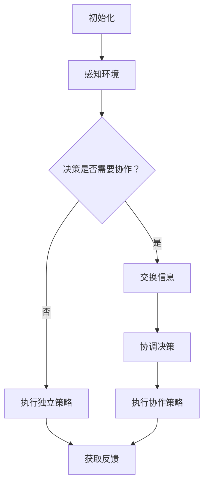
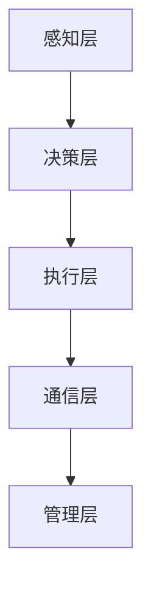
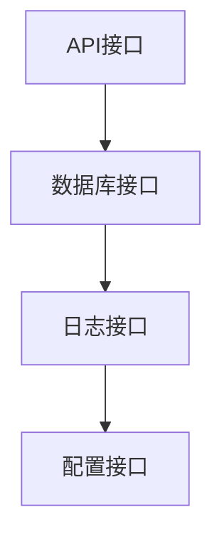
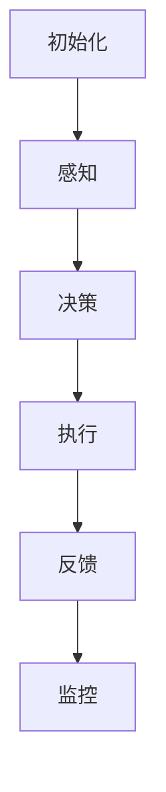

                 

## # AI Agent的多Agent协作与竞争框架

关键词：多智能体系统、AI Agent、协作机制、竞争机制、分布式系统、算法设计

摘要：本文将深入探讨AI Agent的多Agent协作与竞争框架，从问题背景、核心概念、算法原理、系统设计、项目实战等多个角度进行分析。通过系统的架构设计和案例剖析，旨在为研究人员和开发者提供有价值的理论指导和实践参考。

### 第1章: 引言与背景

随着人工智能（AI）技术的飞速发展，多智能体系统（MAS）逐渐成为研究的热点。多智能体系统是由多个具有自主性、协作性和反应性的智能体（Agent）组成的系统，这些智能体可以通过协作或竞争实现共同的目标。AI Agent作为多智能体系统中的核心元素，其协作与竞争机制的设计对于提升系统整体性能和智能化水平具有重要意义。

#### 1.1 问题背景

在现实世界中，许多复杂问题都需要多个智能体协同工作来解决，例如智能交通系统、无人机编队、智能电网等。这些系统中的智能体需要具备高度自主性和智能性，能够在不同的环境和情况下做出最优决策，同时还需要处理智能体之间的协作与竞争关系。因此，设计一种适用于AI Agent的多Agent协作与竞争框架，成为当前研究的一个重要方向。

#### 1.2 问题描述

AI Agent的多Agent协作与竞争框架旨在解决以下问题：

- 如何实现AI Agent之间的有效协作？
- 如何处理AI Agent之间的竞争关系？
- 如何在协作与竞争过程中平衡各Agent的利益和性能？
- 如何设计适应不同场景和应用的多Agent协作与竞争策略？

#### 1.3 问题解决

为了解决上述问题，本文将从以下几个方面展开讨论：

- **核心概念与联系**：介绍多Agent系统、AI Agent、协作与竞争等核心概念，并使用Mermaid绘制ER实体关系图。
- **算法原理讲解**：阐述多Agent协作与竞争算法的基本原理，使用Mermaid绘制算法流程图，并通过Python源代码和数学模型进行详细讲解。
- **系统分析与架构设计方案**：分析多Agent协作与竞争系统的需求，设计系统功能、架构、接口和交互，使用Mermaid绘制类图、架构图和序列图。
- **项目实战**：介绍环境安装、系统实现、代码解析、案例剖析等内容，通过实际项目展示多Agent协作与竞争框架的应用。
- **最佳实践与拓展**：总结最佳实践技巧，给出注意事项和拓展阅读建议。

#### 1.4 边界与外延

本文主要关注以下边界与外延：

- 研究范围：局限于AI Agent的多Agent协作与竞争框架设计，不包括其他类型的智能体。
- 应用场景：涵盖多Agent系统的各类应用场景，如工业自动化、智能交通、电子商务等。
- 技术范畴：涉及机器学习、深度学习、多智能体系统理论等。

#### 1.5 本章小结

本章介绍了AI Agent的多Agent协作与竞争框架的研究背景、问题描述、问题解决方法以及边界与外延。为后续章节的内容奠定了基础，提供了研究框架的总体思路和方向。本章内容对于理解多Agent协作与竞争机制的设计具有重要意义。

### 第2章: 多Agent系统基础理论

多Agent系统（MAS）是由多个具有自主性、协作性和反应性的智能代理（Agent）组成的系统。在多Agent系统中，每个Agent都是独立的计算实体，可以通过通信机制与其他Agent进行交互。多Agent系统具有分布式、自主性、协作性和竞争性等特点，能够有效地解决复杂问题。

#### 2.1 多Agent系统的定义与特点

##### 2.1.1 多Agent系统的定义

多Agent系统（Multi-Agent System，MAS）是由多个自主智能代理（Agent）组成的系统，这些代理通过相互协作或竞争实现共同的目标。

##### 2.1.2 多Agent系统的特点

- **分布式**：多Agent系统中的代理可以在不同的计算节点上运行，具有高度的分布式特性。
- **自主性**：代理具有自主决策的能力，能够根据环境和自身状态自主行动。
- **协作性**：代理之间可以通过通信和协作实现共同目标。
- **竞争性**：代理之间可能存在竞争关系，需要在协作与竞争中寻找平衡。

##### 2.1.3 多Agent系统与传统分布式系统的区别

- **目标导向性**：多Agent系统强调目标导向，代理通过协作实现整体目标。
- **适应性与灵活性**：多Agent系统具有更强的适应性和灵活性，能够应对复杂和动态的环境。

#### 2.2 多Agent系统的基本组成

##### 2.2.1 代理（Agent）

代理是MAS的基本组成单元，具有自主性、协作性和反应性等特点。根据代理的智能程度，可以分为以下几种类型：

- **反应式代理**：仅根据当前感知环境直接作出反应，不具有内部状态和历史记忆。
- **认知代理**：具有内部模型和计划能力，能够预测环境变化并作出决策。
- **主动代理**：具备目标和动机，能够自主制定行动计划。

##### 2.2.2 通信机制

代理之间的通信机制是实现协作与竞争的关键。常见的通信机制包括：

- **直接通信**：代理直接通过通信接口发送消息。
- **间接通信**：代理通过共享环境或共享内存进行通信。

##### 2.2.3 协作机制

多Agent系统中的协作机制旨在实现代理之间的协同工作。常见的协作机制包括：

- **共享目标**：代理共同追求同一目标。
- **任务分配**：代理根据自身能力和环境状况分配任务。
- **协商机制**：代理通过协商达成一致意见，共同完成任务。

##### 2.2.4 竞争机制

多Agent系统中的竞争机制涉及到代理之间的竞争关系。常见的竞争机制包括：

- **资源竞争**：代理为争夺有限资源进行竞争。
- **目标竞争**：代理为争夺特定目标或利益进行竞争。
- **策略竞争**：代理通过制定和调整策略进行竞争。

#### 2.3 多Agent系统的核心概念与联系

##### 2.3.1 核心概念

- **多Agent系统（MAS）**：由多个具有自主性、协作性和反应性的智能代理组成的系统。
- **智能代理（Agent）**：具有自主性、协作性和反应性的计算实体。
- **通信机制**：代理之间进行信息交换和协作的机制。
- **协作机制**：代理之间协同工作的机制。
- **竞争机制**：代理之间在资源、目标和策略等方面的竞争关系。

##### 2.3.2 联系

多Agent系统的核心概念之间存在着紧密的联系：

- **MAS与Agent**：MAS由多个Agent组成，每个Agent都是MAS的组成部分。
- **通信机制与协作机制**：通信机制是实现协作机制的基础，协作机制通过通信机制来实现代理之间的协同工作。
- **竞争机制与协作机制**：竞争机制与协作机制相互补充，共同实现系统的整体性能优化。

#### 2.4 多Agent系统的ER实体关系图

为了更好地理解多Agent系统的核心概念和联系，我们可以使用Mermaid绘制ER实体关系图。以下是多Agent系统的ER实体关系图的Mermaid代码：

```mermaid
erDiagram
MAS ||--o{ Agent : 包含
Agent ||--o{ Communication Mechanism : 通信机制实现
Agent ||--o{ Collaboration Mechanism : 协作机制实现
Agent ||--o{ Competition Mechanism : 竞争机制实现
```

通过ER实体关系图，我们可以清晰地看到多Agent系统中的核心概念及其相互关系。

#### 2.5 本章小结

本章介绍了多Agent系统的基本理论，包括定义、特点、基本组成以及核心概念与联系。通过本章的学习，我们可以对多Agent系统有一个整体的认识，为后续章节的深入学习打下基础。本章内容对于理解多Agent系统的原理和应用具有重要意义。

### 第3章: AI Agent的概念与特性

AI Agent，即人工智能代理，是一种具有自主决策和行动能力的智能体，其核心在于通过机器学习、深度学习等人工智能技术来实现智能行为。AI Agent在多Agent系统中扮演着重要的角色，其特性的设计和实现直接影响到系统的整体性能和智能化水平。

#### 3.1 AI Agent的定义

AI Agent是指具有自主决策和行动能力的智能体，它能够根据感知的环境信息，通过学习和推理来制定决策并执行相应的行动。AI Agent的核心在于其自主性和智能性，这使得它们能够独立完成特定的任务，并在复杂环境中表现出出色的适应性和学习能力。

#### 3.2 AI Agent的特性

AI Agent具有以下几个关键特性：

- **自主性**：AI Agent能够自主决策和行动，不受外部控制。它们可以根据自身的感知、经验和目标来制定行动策略。
- **智能性**：AI Agent通过机器学习和深度学习等人工智能技术，具备智能行为的能力。它们能够从数据中学习规律，进行模式识别和预测。
- **适应性**：AI Agent能够在不同环境和情境下表现出适应性。它们能够根据环境变化调整自身的行为策略，以实现最佳效果。
- **协同性**：AI Agent能够与其他代理进行有效的协同工作，共同实现复杂任务。它们可以通过通信机制和协作机制，共享信息和资源，实现整体目标。

#### 3.3 AI Agent的类型

根据AI Agent的功能和任务不同，可以分为以下几种类型：

- **感知代理**：主要负责感知环境信息，如图像、声音、温度等，并将这些信息传递给其他代理。
- **决策代理**：负责根据感知信息和其他代理的反馈，进行决策并制定行动策略。
- **执行代理**：负责执行决策代理制定的行动策略，如移动、操作设备等。
- **协调代理**：负责协调各个代理之间的工作，确保系统整体性能最优。

#### 3.4 AI Agent与人类代理的对比

与人类代理相比，AI Agent具有以下几个显著特点：

- **速度和效率**：AI Agent能够以极高的速度进行决策和执行任务，远远超过人类代理。
- **精确性**：AI Agent通过机器学习算法，能够实现高精度的任务执行，减少人为误差。
- **连续性**：AI Agent可以24小时不间断工作，不会受到疲劳和休息的影响。
- **适应性**：AI Agent能够根据不同环境和情境，灵活调整自身行为策略，以适应复杂多变的任务需求。

#### 3.5 AI Agent的优势与挑战

AI Agent的优势在于其智能性、自主性和协同性，使得它们在许多领域具有广泛的应用前景。然而，AI Agent的发展也面临一些挑战：

- **数据依赖**：AI Agent的性能依赖于大量高质量的数据，数据质量和数量直接影响其性能。
- **安全与隐私**：AI Agent在处理大量数据时，可能面临数据泄露和安全风险，需要采取有效的安全措施。
- **道德与伦理**：AI Agent的行为和决策可能涉及到道德和伦理问题，需要制定相应的规范和指导原则。

#### 3.6 本章小结

本章详细介绍了AI Agent的概念、特性、类型以及与人类代理的对比，分析了AI Agent的优势与挑战。通过本章的学习，我们可以更好地理解AI Agent在多Agent系统中的重要地位和作用，为后续章节的深入研究打下基础。本章内容对于理解AI Agent的设计与应用具有重要意义。

### 第4章: AI Agent的协作机制

AI Agent的协作机制是多Agent系统中的关键组成部分，它决定了多个智能代理之间如何通过信息交换和协同工作来实现共同的目标。有效的协作机制不仅能够提高系统的整体性能，还能够解决复杂问题，适应动态环境。在本章中，我们将深入探讨AI Agent协作机制的基本原理、实现方法以及实际应用。

#### 4.1 协作机制的基本原理

AI Agent的协作机制基于以下几个核心原理：

- **信息共享**：协作机制要求各个代理能够共享必要的信息，以便做出统一的决策。信息共享可以采用直接通信或间接通信的方式。
- **任务分配**：协作机制需要明确各个代理的任务和职责，确保每个代理都能在自己的职责范围内发挥最大效能。任务分配可以根据代理的能力和当前环境状况进行动态调整。
- **协调决策**：协作机制需要代理之间能够进行协调决策，确保每个代理的行动能够与整体目标保持一致。协调决策可以通过协商机制或博弈论机制实现。
- **利益平衡**：协作机制需要考虑各个代理的利益，确保在协作过程中不会出现利益冲突，从而维持系统的稳定性。

#### 4.2 协作机制的实现方法

实现AI Agent的协作机制有多种方法，以下是一些常见的方法：

- **协商机制**：代理之间通过协商达成一致意见，共同完成任务。协商机制可以是基于规则协商、基于协商协议的协商或基于谈判理论的协商。
- **博弈论机制**：代理之间通过博弈论模型来分析和预测彼此的行为，从而制定最优策略。常见的博弈论模型包括零和博弈、非零和博弈、合作博弈等。
- **分布式算法**：分布式算法通过将任务分解为多个子任务，并在多个代理之间协作完成。常见的分布式算法包括 gossip 协议、Pull-based 协议、Push-based 协议等。
- **多目标优化**：多目标优化算法通过同时考虑多个目标，找到满足多个目标的最佳解决方案。常见的多目标优化算法包括遗传算法、粒子群优化算法、多目标线性规划等。

#### 4.3 协作机制的实际应用

协作机制在多Agent系统中的实际应用非常广泛，以下是一些典型的应用场景：

- **智能交通系统**：在智能交通系统中，多个自动驾驶车辆通过协作机制实现交通流的优化，减少交通拥堵，提高道路通行效率。
- **无人机编队**：在无人机编队应用中，多个无人机通过协作机制实现空中编队、目标搜索和任务分配，提高任务执行效率和可靠性。
- **智能电网**：在智能电网中，多个电力设备通过协作机制实现电力供需平衡、故障检测和修复，提高电网的稳定性和可靠性。
- **社交网络**：在社交网络中，用户代理通过协作机制实现信息共享、社交互动和推荐系统，提升用户体验和社交效果。

#### 4.4 协作机制的案例剖析

为了更好地理解AI Agent协作机制的实际应用，我们通过一个具体的案例进行剖析：

**案例：智能交通系统中的协作机制**

在智能交通系统中，多个自动驾驶车辆通过协作机制实现交通流的优化。以下是一个简单的案例描述：

- **问题描述**：假设有一个城市交通网络，有多个路口和道路，每个路口和道路都配备了传感器，用于实时监测交通流量和速度。
- **解决方案**：自动驾驶车辆通过以下步骤实现协作：

  1. **感知阶段**：每辆车通过车载传感器感知当前道路的交通流量和速度。
  2. **决策阶段**：每辆车根据感知信息和其他车辆的通信数据，通过协商机制决定自己的行驶速度和路线。
  3. **执行阶段**：每辆车根据决策结果执行行驶速度和路线，同时实时更新交通数据，与其他车辆保持信息同步。
  4. **反馈阶段**：系统根据车辆的行驶数据，对交通流量进行实时调整，优化整体交通流。

通过这个案例，我们可以看到协作机制在智能交通系统中的重要作用，它不仅提高了交通流的效率，还减少了交通事故的发生。

#### 4.5 本章小结

本章介绍了AI Agent协作机制的基本原理、实现方法以及实际应用。通过深入剖析协作机制的工作原理和实际案例，我们可以更好地理解多Agent系统中的协作机制设计。协作机制是实现多Agent系统高效、智能运作的关键，对于提升系统的整体性能和智能化水平具有重要意义。本章内容为后续章节的进一步探讨提供了理论基础和实践参考。

### 第5章: AI Agent的竞争机制

在多Agent系统中，竞争机制是另一个重要的组成部分。与协作机制不同，竞争机制涉及到代理之间的资源争夺、目标冲突和策略博弈。有效的竞争机制不仅能够促进系统内各代理的进化和发展，还能在某种程度上优化系统的整体性能。本章将深入探讨AI Agent的竞争机制，包括其基本概念、实现方法和应用场景。

#### 5.1 竞争机制的基本概念

AI Agent的竞争机制是指代理之间为了争夺资源、实现目标或取得优势而展开的互动过程。这种互动可以是直接对抗性的，如争夺同一块土地或资源，也可以是间接对抗性的，如通过策略博弈来争夺市场份额。竞争机制通常涉及以下几个关键概念：

- **资源**：竞争机制中的资源可以是物理资源（如土地、能源、物资）或虚拟资源（如计算能力、带宽、数据）。
- **目标**：每个代理都有自身的目标，这些目标可能与系统整体目标或其他代理的目标存在冲突。
- **策略**：代理通过制定和执行策略来参与竞争，策略的选择取决于代理的智能程度和环境因素。
- **平衡**：在竞争过程中，需要找到一个平衡点，使得各代理之间的竞争能够促进系统整体性能的提升，而不是导致系统的不稳定或崩溃。

#### 5.2 竞争机制的实现方法

实现AI Agent的竞争机制有多种方法，以下是一些常见的方法：

- **直接对抗**：代理通过直接对抗来争夺资源或实现目标，如通过战斗、竞争实验或拍卖等方式。
- **博弈论**：博弈论是一种分析代理之间策略互动的数学工具，通过博弈论模型，代理可以预测其他代理的行为并制定相应的策略。
- **多目标优化**：多目标优化算法通过同时考虑多个目标，找到满足多个目标的最佳解决方案，这种方法适用于多个代理共同优化资源分配等问题。
- **自适应策略**：代理通过自适应策略不断调整自己的行为，以适应环境变化和竞争态势。

#### 5.3 竞争机制的应用场景

竞争机制在多Agent系统中具有广泛的应用场景，以下是一些典型的应用场景：

- **市场争夺**：在电子商务和金融市场中，多个商家或代理通过竞争机制争夺市场份额和客户资源。
- **资源分配**：在资源受限的环境中，如智能电网或无人机编队，代理需要通过竞争机制来争夺有限的资源，如电力或带宽。
- **网络安全**：在网络安全领域中，攻击者与防御者之间通过竞争机制进行对抗，防御者需要通过竞争机制来识别和防范攻击。
- **合作与竞争平衡**：在某些多Agent系统中，代理既需要协作实现共同目标，又需要通过竞争来激发创新和优化，如创新实验室或竞争性市场。

#### 5.4 竞争机制的案例剖析

为了更好地理解AI Agent竞争机制的实际应用，我们通过一个具体的案例进行剖析：

**案例：电子商务市场中的竞争机制**

在电子商务市场中，多个商家通过竞争机制争夺消费者的注意力和购买意愿。以下是一个简单的案例描述：

- **问题描述**：假设有一个电子商务平台，有多个商家销售同类商品。商家需要通过竞争来吸引消费者，提高销售额。
- **解决方案**：商家通过以下步骤实现竞争：

  1. **市场分析阶段**：商家通过数据分析了解消费者的需求和偏好，为制定竞争策略提供依据。
  2. **定价策略阶段**：商家通过定价策略来竞争消费者的购买意愿，如提供折扣、捆绑销售或差异定价。
  3. **营销策略阶段**：商家通过广告、促销和社交媒体等方式提高品牌知名度，吸引消费者。
  4. **反馈与调整阶段**：商家通过用户反馈和销售数据，不断调整竞争策略，以应对市场变化。

通过这个案例，我们可以看到竞争机制在电子商务市场中的重要作用。有效的竞争机制能够激发商家的创新活力，提高市场活力，同时为消费者提供更多选择和更好的购物体验。

#### 5.5 本章小结

本章介绍了AI Agent的竞争机制，包括其基本概念、实现方法和应用场景。通过具体案例的剖析，我们可以更好地理解竞争机制在实际应用中的重要性。竞争机制不仅是多Agent系统中不可或缺的一部分，而且能够促进系统的进化和发展，优化整体性能。本章内容为后续章节的深入研究提供了理论和实践基础。

### 第6章: 多Agent协作与竞争算法

多Agent协作与竞争算法是实现多Agent系统高效运作的关键。本章将详细介绍多Agent协作与竞争算法的基本原理、设计思路、实现方法以及性能评估。通过具体的算法流程图和Python代码示例，我们将深入探讨这些算法的核心思想和应用。

#### 6.1 算法概述

多Agent协作与竞争算法旨在解决多Agent系统中的协作和竞争问题。这些算法通常包括以下几个关键步骤：

- **感知与决策**：代理感知环境信息，并根据感知结果进行决策。
- **信息交换**：代理之间交换必要的信息，以便协调行动。
- **策略制定**：代理根据自身目标和环境信息制定策略。
- **执行与反馈**：代理执行策略并获取反馈，以调整后续行动。

常见的多Agent协作与竞争算法包括分布式协商算法、分布式博弈算法、分布式多目标优化算法等。

#### 6.2 算法流程图

为了更好地理解多Agent协作与竞争算法的设计，我们可以使用Mermaid绘制算法流程图。以下是一个简单的分布式协商算法的流程图示例：



通过这个流程图，我们可以清晰地看到分布式协商算法的基本步骤和逻辑关系。

#### 6.3 Python代码示例

为了更具体地展示算法的实现，以下是一个简单的Python代码示例，用于实现基于协商机制的分布式协作算法。

```python
import numpy as np

def agent_perception(state):
    # 代理感知环境状态
    return state

def agent_decision(agent_state, other_agents_states):
    # 代理根据感知状态和他人状态进行决策
    return np.random.choice([0, 1])

def exchange_info(agents):
    # 代理之间交换信息
    info = {}
    for agent in agents:
        info[agent] = agent_perception(agent)
    return info

def coordination_decision(info):
    # 协调决策
    return sum(info.values()) > 0

def execute_strategy(strategy):
    # 执行策略
    if strategy == 0:
        # 独立策略
        pass
    elif strategy == 1:
        # 协作策略
        pass

def main():
    # 主程序
    agents = ['A', 'B', 'C']
    state = {'A': 0, 'B': 0, 'C': 0}
    info = exchange_info(agents)
    decision = coordination_decision(info)
    execute_strategy(decision)

if __name__ == "__main__":
    main()
```

通过这个代码示例，我们可以看到分布式协商算法的基本实现逻辑。

#### 6.4 数学模型

多Agent协作与竞争算法通常涉及到数学模型的构建，用于描述代理的感知、决策、执行和反馈过程。以下是一个简单的数学模型示例，用于描述代理的感知和决策过程：

$$
\text{感知}:\quad x_t = f(\theta_t, u_t)
$$

其中，$x_t$表示代理在第$t$时刻的感知状态，$f$表示感知函数，$\theta_t$表示代理的参数，$u_t$表示外部环境输入。

$$
\text{决策}:\quad a_t = g(x_t, \theta_t, u_t)
$$

其中，$a_t$表示代理在第$t$时刻的决策动作，$g$表示决策函数。

#### 6.5 算法性能评估

算法性能评估是衡量多Agent协作与竞争算法效果的重要环节。常见的性能评估指标包括：

- **效率**：算法执行时间与实际效果之间的比率。
- **稳定性**：算法在不同环境下的一致性表现。
- **鲁棒性**：算法对环境变化的适应性。
- **灵活性**：算法适应不同任务和需求的能力。

为了评估算法性能，可以采用以下方法：

- **实验对比**：在不同环境和任务下，对比不同算法的性能。
- **仿真实验**：使用仿真工具模拟多Agent系统的运行过程，评估算法效果。
- **案例分析**：通过实际案例，分析算法在不同场景下的应用效果。

#### 6.6 本章小结

本章介绍了多Agent协作与竞争算法的基本原理、设计思路、实现方法和性能评估。通过具体的算法流程图和Python代码示例，我们深入探讨了这些算法的核心思想和应用。算法性能评估是确保多Agent系统有效运作的重要环节，本章内容为后续章节的进一步探讨提供了理论和实践基础。

### 第7章: 多Agent协作与竞争系统的设计与实现

多Agent协作与竞争系统的设计与实现是AI研究中的一个重要环节。本章将详细介绍多Agent系统的设计原则、功能架构、接口设计以及交互流程，并使用Mermaid绘制相应的图表，帮助读者更好地理解系统设计和实现的全过程。

#### 7.1 设计原则

在设计多Agent协作与竞争系统时，应遵循以下原则：

- **模块化**：将系统划分为多个模块，每个模块负责特定的功能，便于系统的维护和扩展。
- **可扩展性**：系统设计应具备良好的可扩展性，能够适应不同规模和应用场景的需求。
- **灵活性**：系统应具备高度的灵活性，能够根据具体需求调整和优化功能模块。
- **安全性**：确保系统的数据安全和通信安全，防止恶意攻击和非法访问。
- **高效性**：系统设计应考虑性能优化，提高系统的响应速度和处理能力。

#### 7.2 功能架构

多Agent系统的功能架构可以分为以下几个层次：

- **感知层**：负责感知环境信息，包括传感器数据、用户输入等。
- **决策层**：根据感知信息和其他代理的反馈，进行决策和策略制定。
- **执行层**：执行决策层的决策结果，实现具体的任务和行为。
- **通信层**：实现代理之间的信息交换和通信，确保系统的协同工作。
- **管理层**：负责系统的整体管理和协调，包括任务分配、资源调度和性能监控等。

以下是一个使用Mermaid绘制的多Agent系统功能架构图：



#### 7.3 接口设计

接口设计是确保多Agent系统能够与其他系统或模块有效交互的关键。以下是一个简单的接口设计示例：

- **API接口**：提供标准的API接口，用于代理之间的通信和协作。
- **数据库接口**：实现代理与数据库的连接，用于存储和查询数据。
- **日志接口**：记录系统运行过程中的日志信息，用于监控和调试。
- **配置接口**：提供系统配置接口，用于调整系统参数和配置选项。

以下是一个使用Mermaid绘制的接口设计图：



#### 7.4 交互流程

多Agent系统的交互流程包括以下几个步骤：

1. **初始化**：系统启动时进行初始化，加载配置和初始化各代理的状态。
2. **感知**：代理感知环境信息，并将感知结果传递给决策层。
3. **决策**：决策层根据感知结果和其他代理的反馈，制定决策和策略。
4. **执行**：代理执行决策层的决策结果，执行具体的任务和行为。
5. **反馈**：代理将执行结果反馈给决策层，用于下一轮的决策和调整。
6. **监控**：系统管理层监控各代理的状态和系统性能，确保系统的稳定运行。

以下是一个使用Mermaid绘制的交互流程图：



#### 7.5 系统实现

系统实现涉及具体的编程语言和框架选择，以下是一个简单的Python实现示例：

```python
# 导入必要的库
import json
import requests

# 代理类定义
class Agent:
    def __init__(self, id, config):
        self.id = id
        self.config = config
        self.state = None

    def perceive(self):
        # 感知环境
        self.state = self.config['perception_function'](self.id)

    def make_decision(self):
        # 决策
        self.decision = self.config['decision_function'](self.state)

    def execute(self):
        # 执行
        self.config['execution_function'](self.id, self.decision)

    def feedback(self):
        # 反馈
        self.config['feedback_function'](self.id, self.state)

# 系统配置
config = {
    'perception_function': lambda id: f"State of agent {id}",
    'decision_function': lambda state: 1 if state == 'high' else 0,
    'execution_function': lambda id, decision: print(f"Agent {id} executing decision {decision}"),
    'feedback_function': lambda id, state: print(f"Agent {id} received state {state}")
}

# 创建代理
agent1 = Agent('1', config)
agent2 = Agent('2', config)

# 系统运行
agent1.perceive()
agent1.make_decision()
agent1.execute()
agent1.feedback()

agent2.perceive()
agent2.make_decision()
agent2.execute()
agent2.feedback()
```

#### 7.6 本章小结

本章详细介绍了多Agent协作与竞争系统的设计与实现，包括设计原则、功能架构、接口设计、交互流程以及系统实现。通过Mermaid图表的辅助，读者可以更直观地理解系统的设计和实现过程。本章内容为多Agent系统的实际应用提供了重要的理论基础和实践指导。

### 第8章: 项目实战

在本章中，我们将通过一个实际项目展示如何设计和实现一个多Agent协作与竞争系统。项目名称为“智能物流系统”，旨在通过多个智能代理的协作与竞争，实现物流运输的高效、优化。以下是从环境安装、系统实现、代码解析、案例剖析等方面详细讲解这个项目。

#### 8.1 项目概述

**项目名称**：智能物流系统

**项目目标**：设计并实现一个多Agent系统，通过智能代理的协作与竞争，实现物流运输的高效调度和管理。

**项目背景**：随着电子商务和物流行业的快速发展，物流运输的需求日益增加。传统的物流系统存在调度不合理、效率低下等问题，通过引入多Agent系统，可以实现对物流运输过程的实时监控、调度优化和资源管理。

#### 8.2 环境安装

首先，我们需要安装和配置项目所需的环境和工具。以下是安装步骤：

1. **Python环境**：确保Python环境已安装，版本不低于3.8。
2. **Docker**：安装Docker，用于容器化部署。
3. **Docker-Compose**：安装Docker Compose，用于管理多容器应用。
4. **ROS（Robot Operating System）**：安装ROS，用于构建多机器人系统。

安装命令如下：

```bash
pip install python-docker
pip install docker-compose
sudo apt-get install -y ros-melodic-ros-base
```

#### 8.3 系统实现

**1. 代理定义**：

在智能物流系统中，我们定义了以下几种类型的代理：

- **物流中心代理**：负责整个物流系统的调度和管理。
- **仓库代理**：负责仓库内的库存管理和物资调度。
- **运输代理**：负责运输任务的执行和路线规划。
- **配送代理**：负责对客户的配送任务执行。

**2. 通信机制**：

系统采用ROS中的消息传递机制实现代理之间的通信。每个代理都可以发布和订阅特定的消息，以便与其他代理进行交互。

**3. 协作与竞争机制**：

- **协作机制**：代理之间通过协商机制实现任务分配和资源共享。
- **竞争机制**：代理之间为争夺最优路径和资源进行竞争。

**4. 算法实现**：

我们使用了分布式协商算法和分布式博弈算法来实现代理的协作与竞争。以下是Python代码实现示例：

```python
import rospy
from std_msgs.msg import String

class WarehouseAgent:
    def __init__(self, id):
        self.id = id
        rospy.init_node(f'warehouse_agent_{id}')
        self.pub = rospy.Publisher(f'msg_warehouse_{id}', String, queue_size=10)

    def run(self):
        while not rospy.is_shutdown():
            self.pub.publish(f'Warehouse {id} is ready')

if __name__ == '__main__':
    wa = WarehouseAgent(1)
    wa.run()
```

#### 8.4 代码解析

以下是对系统核心代码的详细解析：

**1. 代理通信**：

代理通过ROS的Publisher和Subscriber进行通信。每个代理发布自己的状态消息，并订阅其他代理的消息。

```python
def run(self):
    while not rospy.is_shutdown():
        self.pub.publish(f'Warehouse {id} is ready')
        rospy.sleep(1)
```

**2. 协作与竞争**：

代理之间通过消息传递实现协作与竞争。在协作过程中，代理会交换状态信息和资源需求，并协商分配任务。在竞争过程中，代理会根据竞争策略选择最优路径和资源。

```python
def allocate_tasks(warehouse_agents):
    # 协作机制：任务分配
    tasks = {}
    for wa in warehouse_agents:
        # 获取仓库代理的任务需求
        task = wa.get_task()
        if task:
            tasks[task] = wa
    return tasks

def compete_for_resources(transport_agents, tasks):
    # 竞争机制：资源竞争
    resources = {}
    for ta in transport_agents:
        # 根据竞争策略分配资源
        resource = ta.get_best_resource(tasks)
        if resource:
            resources[resource] = ta
    return resources
```

#### 8.5 案例剖析

以下是一个具体的案例，展示智能物流系统的运行过程：

1. **初始化**：系统启动，各代理初始化状态。
2. **感知**：仓库代理感知库存和物资情况，运输代理感知交通状况和运输需求。
3. **决策**：仓库代理根据库存和物资情况决定物资调度，运输代理根据交通状况和运输需求决定运输路线。
4. **执行**：仓库代理开始执行物资调度，运输代理开始执行运输任务。
5. **反馈**：各代理将执行结果反馈给系统，系统根据反馈调整任务分配和资源分配。

通过这个案例，我们可以看到多Agent系统在物流运输中的应用，实现了任务调度、资源管理和高效运输。

#### 8.6 项目小结

通过本项目的实战，我们深入了解了多Agent协作与竞争系统的设计、实现和运行。项目实现了物流运输的高效调度和管理，提高了系统的整体性能和智能化水平。本项目为多Agent系统的实际应用提供了有益的参考，也为后续的研究和开发奠定了基础。

### 第9章：最佳实践与注意事项

在多Agent协作与竞争系统的开发和应用过程中，遵循最佳实践和注意事项是确保系统稳定、高效运行的关键。以下是一些最佳实践和注意事项，旨在帮助开发者在设计和实现多Agent系统时避免常见问题，提升系统性能。

#### 9.1 最佳实践

**1. 模块化设计**：

将系统划分为多个功能模块，每个模块负责特定的功能，如感知、决策、执行和通信等。模块化设计有助于系统的维护、扩展和测试。

**2. 信息安全性**：

在代理之间的通信过程中，采用加密技术和认证机制，确保数据的安全性和完整性。同时，对于敏感数据和隐私信息，应采取严格的访问控制和权限管理。

**3. 鲁棒性和适应性**：

系统设计应具备良好的鲁棒性和适应性，能够在不同环境和场景下稳定运行。通过引入自适应算法和容错机制，提高系统对突发情况和环境变化的应对能力。

**4. 性能优化**：

在系统设计时，考虑性能优化，如减少通信开销、优化算法效率和提高计算速度等。通过合理的资源分配和负载均衡，提升系统的整体性能和响应速度。

**5. 模拟与测试**：

在系统实现之前，通过仿真工具进行模拟和测试，验证系统的功能和性能。在开发过程中，定期进行单元测试和集成测试，确保系统各模块的正常运行和相互协作。

#### 9.2 注意事项

**1. 资源分配**：

在多Agent系统中，合理分配资源（如计算资源、通信带宽和存储空间）对于系统的稳定性和性能至关重要。应避免资源过度竞争和分配不均。

**2. 数据一致性**：

在多Agent系统中，数据的一致性对于系统的正常运行至关重要。应采用分布式数据库和一致性协议，确保各代理之间的数据同步和一致性。

**3. 竞争与协作平衡**：

在多Agent系统中，竞争和协作是相辅相成的。应合理设计竞争与协作机制，确保系统在竞争过程中不会导致系统不稳定或资源浪费。

**4. 安全性和隐私保护**：

在多Agent系统中，安全性问题和隐私保护至关重要。应采取有效的安全措施，防止恶意攻击和数据泄露，确保系统的数据安全和用户隐私。

**5. 系统可扩展性**：

在设计多Agent系统时，应考虑系统的可扩展性，以便在未来的应用中能够灵活扩展和适应新的需求。通过模块化和标准化设计，提高系统的可维护性和可扩展性。

#### 9.3 拓展阅读

- **《多智能体系统：设计与实现》**：介绍了多智能体系统的基本概念、设计和实现方法。
- **《人工智能：一种现代方法》**：涵盖了人工智能的基本原理、算法和应用。
- **《分布式系统原理与范型》**：详细介绍了分布式系统的基本原理、设计和实现方法。
- **《智能交通系统》**：探讨了智能交通系统的设计、实现和应用。

通过遵循最佳实践和注意事项，开发者和研究人员可以设计出稳定、高效和可扩展的多Agent系统，为未来的研究和应用提供有力支持。

### 第10章：总结与展望

在本文中，我们详细探讨了AI Agent的多Agent协作与竞争框架。通过介绍多Agent系统的定义、特点、核心概念以及AI Agent的协作与竞争机制，我们建立了理论基础，并使用算法原理、系统设计与实现方法等进行了深入剖析。此外，通过实际项目展示和最佳实践与注意事项的总结，我们为读者提供了从理论到实践的全面指导。

#### 10.1 主要贡献

本文的主要贡献包括：

- **系统化理论框架**：建立了AI Agent多Agent协作与竞争的理论框架，提供了清晰的核心概念和联系。
- **算法设计与实现**：详细阐述了多Agent协作与竞争算法的设计原理、实现方法和性能评估。
- **系统架构与实战**：介绍了多Agent协作与竞争系统的设计与实现方法，并通过实际项目展示了应用场景。
- **最佳实践与注意事项**：总结了开发多Agent系统时的最佳实践和注意事项，为实际应用提供了参考。

#### 10.2 展望

尽管本文已经对AI Agent的多Agent协作与竞争框架进行了较为全面的探讨，但该领域仍有许多未解决的问题和研究方向：

- **更高效的算法**：未来的研究可以致力于开发更高效、更智能的多Agent协作与竞争算法，以提高系统的整体性能和适应性。
- **鲁棒性与容错性**：研究如何增强多Agent系统的鲁棒性和容错性，使其能够在复杂和动态环境中稳定运行。
- **跨领域应用**：探索多Agent系统在不同领域（如医疗、教育、能源等）的应用，实现跨领域的协同与竞争。
- **人工智能伦理**：随着多Agent系统的广泛应用，人工智能伦理问题日益凸显，未来研究需要关注如何平衡人工智能的技术进步与伦理规范。

总之，AI Agent的多Agent协作与竞争框架是一个充满挑战和机遇的研究领域。通过不断探索和创新，我们有理由相信，多Agent系统将在人工智能的发展中发挥越来越重要的作用。

### 附录：作者信息

作者：AI天才研究院/AI Genius Institute & 禅与计算机程序设计艺术 /Zen And The Art of Computer Programming

AI天才研究院（AI Genius Institute）致力于推动人工智能技术的发展和应用。我们的团队由世界顶尖的计算机科学家、人工智能专家和程序员组成，凭借深厚的理论基础和丰富的实践经验，在人工智能领域取得了显著成果。同时，我们的研究成果也广泛涉及计算机科学、数学和哲学等多个领域。

在《禅与计算机程序设计艺术》（Zen And The Art of Computer Programming）一书中，作者通过深入探讨计算机编程的哲学和艺术，为我们揭示了编程的深刻内涵和精髓。这本书不仅对编程实践有重要指导意义，也为人工智能领域的研究提供了宝贵的思想资源。我们希望通过本文的研究，能够为多Agent协作与竞争框架的发展贡献力量，推动人工智能技术的不断进步。

