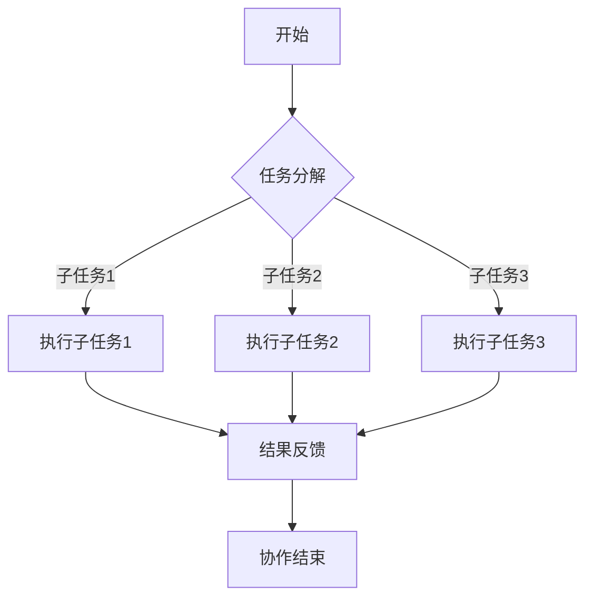
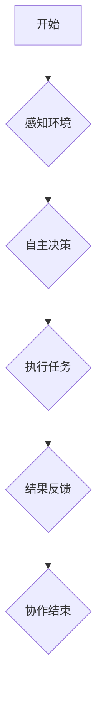
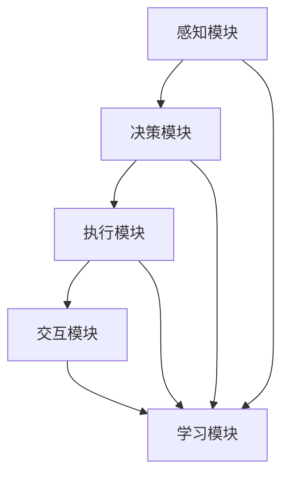
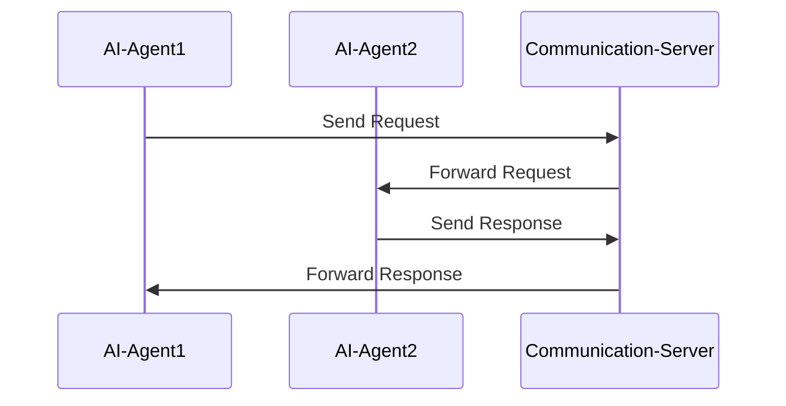
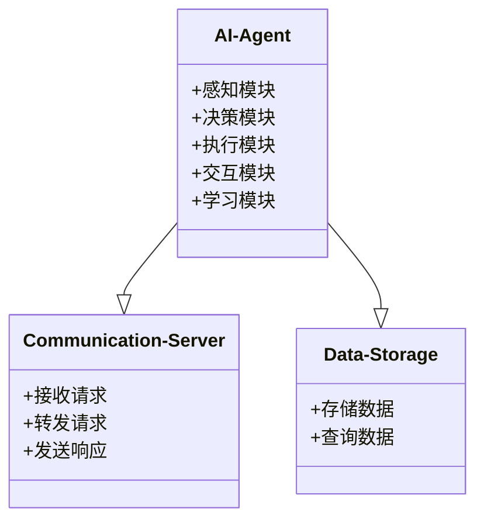
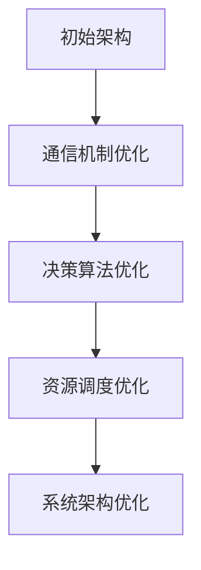

                 

# AI Agent的多Agent协作系统设计

> 关键词：AI Agent、多Agent系统、协作、系统设计、人工智能

> 摘要：本文将探讨AI Agent在多Agent协作系统中的设计与应用。通过逐步分析多Agent协作系统的核心概念、架构设计以及实现与优化，我们将深入探讨如何构建高效的AI Agent多Agent协作系统，为智能交通、智能工厂等领域的应用提供有力的技术支持。

## 第一部分：引论

### 1. 引言

在现代社会，人工智能（AI）技术已经深入到各个领域，推动了各行各业的创新与发展。其中，多Agent系统作为一种分布式智能体协作系统，正成为人工智能研究的重要方向。AI Agent作为多Agent系统中的核心组成部分，能够实现自主决策、协作与学习，为复杂任务提供高效的解决方案。

#### 问题背景

随着物联网、大数据和云计算等技术的发展，复杂系统中的数据处理和决策需求不断增加。单一智能体难以满足这些需求，而多Agent系统通过分布式协作，能够更好地处理复杂问题。AI Agent作为多Agent系统中的智能体，具有自主性、协作性和适应性等特点，能够实现智能化、个性化的任务执行。

#### 问题描述

多Agent系统中的AI Agent如何实现高效协作，是当前人工智能研究中的一个关键问题。如何设计一个稳定、可靠的AI Agent多Agent协作系统，是本文需要解决的问题。

#### 问题解决

本文将通过对多Agent协作系统的核心概念、原理、架构设计以及实现与优化等方面的深入探讨，提出一个高效、稳定的AI Agent多Agent协作系统设计方案。

#### 边界与外延

本文主要关注AI Agent在多Agent协作系统中的应用，涉及到的技术包括人工智能、分布式系统、算法设计等。同时，本文将结合实际案例，分析AI Agent多Agent协作系统的应用场景和效果。

#### 概念结构与核心要素组成

- 多Agent系统：由多个智能体组成的分布式系统，能够实现协作与自主决策。
- AI Agent：具有自主性、协作性和适应性的智能体，能够在多Agent系统中实现高效协作。
- 协作：多Agent系统中的智能体之间通过信息交换和协同工作，实现共同目标。
- 系统设计：针对特定应用场景，设计出高效、稳定的AI Agent多Agent协作系统。

### 2. 多Agent系统概述

#### 多Agent系统的定义

多Agent系统（Multi-Agent System，MAS）是指由多个智能体（Agent）组成的分布式系统，这些智能体可以相互协作，共同完成复杂任务。在多Agent系统中，每个智能体都是独立的计算实体，具有自主性、协作性和适应性。

#### 多Agent系统的特点

- 分布性：智能体分布在不同的计算节点上，能够实现分布式计算和协同工作。
- 自主性：智能体具有自主决策能力，能够根据自身状态和环境信息独立行动。
- 协作性：智能体之间通过信息交换和协同工作，共同实现复杂任务。
- 适应性：智能体能够根据环境变化和任务需求，调整自身行为和策略。

#### 多Agent系统的分类

- 按智能体类型分类：人工Agent、自然Agent、混合Agent
- 按协作方式分类：独立协作、协同协作、协商协作
- 按应用领域分类：智能交通、智能工厂、智能医疗、智能物流等

### 3. AI Agent概述

#### AI Agent的定义

AI Agent（Artificial Intelligence Agent）是指具有人工智能能力的智能体，能够在多Agent系统中实现自主决策、协作和学习。AI Agent通常具备感知、决策、执行和交互等基本功能。

#### AI Agent的特点

- 自主决策：基于感知到的环境信息和自身的知识库，AI Agent能够自主制定决策。
- 协作能力：AI Agent能够与其他智能体进行信息交换和协同工作，共同实现任务目标。
- 学习能力：AI Agent能够通过学习和经验积累，不断优化自身行为和策略。

#### AI Agent的分类

- 按功能分类：感知Agent、决策Agent、执行Agent、交互Agent
- 按技术分类：基于规则Agent、基于案例Agent、基于模型Agent、基于学习Agent

## 第二部分：多Agent协作系统设计原理

### 4. 多Agent协作系统核心概念与原理

#### 协作框架

多Agent协作系统中的协作框架是指智能体之间进行协作的机制和结构。协作框架包括以下几个关键组成部分：

1. **协作目标**：智能体共同追求的任务目标。
2. **协作协议**：智能体之间进行信息交换和协同工作的规则。
3. **协作方法**：智能体之间协作的具体方式和方法。
4. **协作流程**：智能体之间协作的具体步骤和过程。

#### 协作协议

协作协议是多Agent系统中智能体之间进行信息交换和协同工作的规则。协作协议包括以下几个方面：

1. **通信协议**：智能体之间进行通信的规则和标准。
2. **共享数据**：智能体之间共享的数据和资源。
3. **决策规则**：智能体在协作过程中根据自身状态和环境信息制定的决策规则。
4. **协作模式**：智能体之间的协作方式，如独立协作、协同协作、协商协作等。

#### 协作方法

协作方法是指智能体之间进行协作的具体方式和方法。常见的协作方法包括：

1. **任务分解**：将复杂任务分解为多个子任务，由不同的智能体负责执行。
2. **信息共享**：智能体之间通过共享信息，实现协作与沟通。
3. **协商与协调**：智能体之间通过协商与协调，解决协作过程中的冲突和矛盾。
4. **自主学习与优化**：智能体通过学习和优化，提高协作效率和质量。

#### Mermaid流程图展示协作流程

下面是一个简单的多Agent协作流程的Mermaid流程图：



### 5. AI Agent的多Agent协作原理

#### AI Agent的定义

AI Agent是指具有人工智能能力的智能体，能够在多Agent系统中实现自主决策、协作和学习。AI Agent通常具备感知、决策、执行和交互等基本功能。

#### AI Agent在多Agent协作中的作用

1. **感知环境**：AI Agent能够感知环境信息，获取任务状态和自身状态。
2. **自主决策**：AI Agent基于感知到的环境信息和自身的知识库，自主制定决策。
3. **协作与交互**：AI Agent能够与其他智能体进行信息交换和协同工作。
4. **学习与优化**：AI Agent能够通过学习和优化，提高自身行为和策略。

#### AI Agent协作的挑战

1. **通信与同步**：智能体之间的通信与同步是协作的基础，但可能存在延迟、带宽限制等问题。
2. **任务分配**：如何合理分配任务，使每个智能体都能够充分发挥其能力，是一个挑战。
3. **冲突解决**：智能体之间的协作过程中可能存在冲突，如何有效解决冲突是一个关键问题。
4. **鲁棒性与适应性**：智能体需要具备鲁棒性和适应性，能够应对环境变化和任务需求。

#### Mermaid流程图展示AI Agent协作流程

下面是一个简单的AI Agent协作流程的Mermaid流程图：



### 6. 多Agent系统中的AI Agent设计

#### AI Agent模型选择

AI Agent模型的选择取决于应用场景和任务需求。常见的AI Agent模型包括：

1. **基于规则的Agent**：使用规则库进行决策，适用于简单、确定的任务。
2. **基于案例的Agent**：基于历史案例进行决策，适用于具有相似性的任务。
3. **基于模型的Agent**：使用数学模型进行决策，适用于复杂、不确定的任务。
4. **基于学习的Agent**：通过学习和优化进行决策，适用于动态变化的任务。

#### AI Agent交互策略设计

AI Agent交互策略设计包括以下几个方面：

1. **通信策略**：确定智能体之间的通信方式和协议。
2. **协同策略**：确定智能体之间的协作方式和流程。
3. **协商策略**：确定智能体之间的冲突解决机制。
4. **学习策略**：确定智能体之间的经验学习和优化方法。

#### AI Agent学习算法

AI Agent学习算法包括：

1. **监督学习**：通过已标注的数据进行学习，适用于确定性的任务。
2. **无监督学习**：通过未标注的数据进行学习，适用于不确定性的任务。
3. **强化学习**：通过与环境交互进行学习，适用于动态变化的任务。

#### Mermaid实体关系图展示AI Agent结构

下面是一个简单的AI Agent实体关系图的Mermaid表示：

```mermaid
erDiagram
    AI-Agent ||--|{ 感知模块 }感知模块
    AI-Agent ||--|{ 决策模块 }决策模块
    AI-Agent ||--|{ 执行模块 }执行模块
    AI-Agent ||--|{ 交互模块 }交互模块
    感知模块 ||--|{ 感知器 }感知器
    决策模块 ||--|{ 规则库 }规则库
    执行模块 ||--|{ 执行器 }执行器
    交互模块 ||--|{ 通信器 }通信器
```

## 第三部分：多Agent协作系统架构设计

### 7. 多Agent协作系统架构设计原则

#### 系统功能划分

在多Agent协作系统架构设计过程中，首先需要明确系统的功能需求，根据功能需求进行模块划分。常见的模块包括：

1. **感知模块**：负责智能体感知环境信息。
2. **决策模块**：负责智能体根据感知信息进行决策。
3. **执行模块**：负责智能体执行决策结果。
4. **交互模块**：负责智能体之间的信息交换和协同工作。
5. **学习模块**：负责智能体的学习和优化。

#### 系统模块化设计

模块化设计是将系统功能划分为多个模块，每个模块实现特定的功能。模块化设计具有以下优点：

1. **降低复杂度**：将复杂系统划分为多个模块，降低系统整体复杂度。
2. **提高可维护性**：模块之间相对独立，便于维护和升级。
3. **提高可扩展性**：方便添加新的功能模块，实现系统扩展。

#### 系统可扩展性设计

系统可扩展性设计是指系统能够适应未来需求变化，实现功能扩展和性能提升。常见的可扩展性设计方法包括：

1. **模块化架构**：采用模块化架构，方便功能扩展。
2. **分布式架构**：采用分布式架构，提高系统性能和可扩展性。
3. **云原生架构**：采用云原生架构，实现动态资源调度和弹性扩展。

#### Mermaid架构图展示系统架构

下面是一个简单的多Agent协作系统架构的Mermaid表示：



### 8. 多Agent协作系统通信机制设计

#### 通信协议选择

在多Agent协作系统中，通信协议的选择至关重要。常见的通信协议包括：

1. **基于TCP/IP的通信协议**：可靠、稳定的通信协议，适用于实时性要求较高的应用场景。
2. **基于UDP的通信协议**：低延迟、高吞吐量的通信协议，适用于对实时性要求较高的应用场景。
3. **基于消息队列的通信协议**：异步、解耦合的通信协议，适用于分布式系统和大数据场景。

#### 数据传输机制

多Agent协作系统中的数据传输机制包括以下几个方面：

1. **数据格式**：选择合适的数据格式，如JSON、XML等，实现数据传输。
2. **数据压缩**：采用数据压缩技术，降低数据传输带宽。
3. **数据加密**：采用数据加密技术，保证数据传输的安全性。
4. **数据同步**：采用数据同步机制，确保数据的一致性和完整性。

#### 安全机制

在多Agent协作系统中，安全机制至关重要。常见的安全机制包括：

1. **身份认证**：确保通信实体身份的真实性。
2. **访问控制**：限制通信实体的访问权限，防止未经授权的访问。
3. **数据完整性验证**：确保数据传输过程中的完整性和一致性。
4. **加密传输**：采用加密技术，防止数据被窃取或篡改。

#### Mermaid序列图展示通信过程

下面是一个简单的多Agent协作系统通信过程的Mermaid序列图：



### 9. 多Agent协作系统平台架构设计

#### 平台架构设计原则

多Agent协作系统平台架构设计需要遵循以下原则：

1. **高可用性**：确保系统在故障情况下能够快速恢复，提供持续的服务。
2. **高性能**：提高系统的处理速度和响应能力，满足实时性和大规模数据处理需求。
3. **高可扩展性**：方便功能扩展和性能提升，适应未来需求变化。
4. **高安全性**：确保系统数据的安全性和可靠性。

#### 平台功能模块设计

多Agent协作系统平台功能模块设计包括：

1. **感知模块**：负责智能体感知环境信息。
2. **决策模块**：负责智能体根据感知信息进行决策。
3. **执行模块**：负责智能体执行决策结果。
4. **交互模块**：负责智能体之间的信息交换和协同工作。
5. **学习模块**：负责智能体的学习和优化。
6. **通信模块**：负责智能体之间的通信和数据传输。
7. **安全模块**：负责系统的安全防护和管理。

#### 平台接口设计

多Agent协作系统平台接口设计包括：

1. **API接口**：提供对外服务的API接口，方便第三方系统调用。
2. **SDK接口**：提供SDK接口，方便开发者集成和使用。
3. **数据接口**：提供数据接口，方便系统与其他系统之间的数据交换。

#### Mermaid类图展示平台类结构

下面是一个简单的多Agent协作系统平台类结构的Mermaid类图：



## 第四部分：多Agent协作系统实现与优化

### 10. 多Agent协作系统环境配置

#### 系统环境搭建

搭建多Agent协作系统环境需要考虑以下几个方面：

1. **操作系统**：选择合适的操作系统，如Linux、Windows等。
2. **硬件设备**：根据系统需求配置合适的硬件设备，如服务器、网络设备等。
3. **软件开发环境**：安装和配置所需的开发工具和软件，如Python、Java等。
4. **数据库**：选择合适的数据库管理系统，如MySQL、MongoDB等。

#### 软件与工具选择

在多Agent协作系统开发过程中，选择合适的软件与工具至关重要。常见的软件与工具包括：

1. **编程语言**：Python、Java、C++等。
2. **开发框架**：TensorFlow、PyTorch、Keras等。
3. **通信协议**：WebSocket、HTTP、RabbitMQ等。
4. **数据存储**：MySQL、MongoDB、Redis等。

#### 硬件设备配置

硬件设备配置需要考虑以下几个方面：

1. **CPU**：选择具有较高计算性能的CPU，以满足系统处理需求。
2. **内存**：选择具有较大内存容量的服务器，以满足系统运行需求。
3. **存储**：选择具有较高读写速度的存储设备，如SSD等。
4. **网络**：选择具有较高带宽和网络延迟的网络设备，以满足系统通信需求。

### 11. 多Agent协作系统核心代码实现

#### AI Agent模型代码实现

在多Agent协作系统中，AI Agent模型是核心部分。以下是一个简单的基于Python的AI Agent模型代码实现示例：

```python
import random
import numpy as np

class AI-Agent:
    def __init__(self, state_space, action_space):
        self.state_space = state_space
        self.action_space = action_space
        self.state = random.choice(state_space)
        self.action = random.choice(action_space)

    def perceive(self, environment):
        self.state = environment.get_state()

    def decide(self):
        # 决策算法
        action_probabilities = self.get_action_probabilities()
        self.action = np.random.choice(self.action_space, p=action_probabilities)

    def execute(self):
        # 执行动作
        environment = Environment(self.action)
        reward = environment.execute()

    def get_action_probabilities(self):
        # 动作概率分布
        return np.array([1/len(self.action_space) for _ in range(len(self.action_space))])

class Environment:
    def __init__(self, action):
        self.action = action

    def get_state(self):
        # 获取环境状态
        return np.random.randint(0, 10)

    def execute(self):
        # 执行环境动作
        if self.action == 0:
            return 1
        else:
            return -1
```

#### 协作协议代码实现

协作协议是多Agent系统中智能体之间进行信息交换和协同工作的规则。以下是一个简单的基于Python的协作协议代码实现示例：

```python
class CollaborationProtocol:
    def __init__(self, agents):
        self.agents = agents

    def send_message(self, sender, receiver, message):
        receiver.receive_message(sender, message)

    def receive_message(self, sender, message):
        # 处理接收到的消息
        print(f"Received message from {sender}: {message}")

agent1 = AI-Agent([0, 1], [0, 1])
agent2 = AI-Agent([0, 1], [0, 1])
protocol = CollaborationProtocol([agent1, agent2])

agent1.perceive(Environment())
agent2.perceive(Environment())

protocol.send_message(agent1, agent2, "Hello, agent2!")
```

#### 数据处理与传输代码实现

在多Agent协作系统中，数据处理与传输是关键环节。以下是一个简单的基于Python的数据处理与传输代码实现示例：

```python
import socket
import json

def send_message(server_socket, message):
    server_socket.sendall(json.dumps(message).encode())

def receive_message(client_socket):
    data = client_socket.recv(1024).decode()
    return json.loads(data)

def main():
    server_socket = socket.socket(socket.AF_INET, socket.SOCK_STREAM)
    server_socket.bind(('localhost', 12345))
    server_socket.listen()

    client_socket, address = server_socket.accept()
    print(f"Connected to {address}")

    while True:
        message = input("Enter message: ")
        send_message(client_socket, message)
        response = receive_message(client_socket)
        print(f"Received response: {response}")

    client_socket.close()
    server_socket.close()

if __name__ == "__main__":
    main()
```

### 12. 多Agent协作系统性能优化

#### 系统性能指标

多Agent协作系统的性能优化需要考虑以下几个方面：

1. **响应时间**：智能体之间的通信和决策响应时间。
2. **吞吐量**：系统能够处理的任务数量和速度。
3. **并发性**：系统能够同时处理的并发任务数量。
4. **稳定性**：系统在长时间运行过程中的稳定性。
5. **可扩展性**：系统在规模扩大时的性能变化。

#### 性能优化方法

1. **优化通信机制**：采用高效、低延迟的通信协议，降低通信开销。
2. **优化决策算法**：采用快速、准确的决策算法，提高决策效率。
3. **优化资源调度**：合理分配系统资源，提高系统利用率。
4. **优化负载均衡**：采用负载均衡策略，提高系统并发处理能力。
5. **优化系统架构**：采用分布式架构，提高系统性能和可扩展性。

#### 优化案例与实践

以下是一个简单的多Agent协作系统性能优化案例：

1. **优化通信机制**：将基于TCP/IP的通信协议改为基于WebSocket的通信协议，降低通信延迟和带宽消耗。
2. **优化决策算法**：采用基于强化学习的决策算法，提高决策准确性和效率。
3. **优化资源调度**：采用负载均衡算法，合理分配系统资源，提高系统并发处理能力。
4. **优化系统架构**：采用分布式架构，将任务分布到多个计算节点，提高系统性能和可扩展性。

#### Mermaid架构图展示优化过程

下面是一个简单的多Agent协作系统优化过程的Mermaid架构图：



## 第五部分：案例分析与总结

### 13. 案例一：智能交通系统中的多Agent协作

#### 案例背景

智能交通系统是利用现代信息技术对交通系统进行优化和管理的系统，旨在提高交通效率、降低交通事故和缓解交通拥堵。智能交通系统中的多Agent协作是实现智能交通管理的关键。

#### 案例系统功能

智能交通系统中的多Agent协作系统主要包括以下功能：

1. **路况感知**：智能体感知道路上的交通流量、车辆速度等信息。
2. **交通信号控制**：智能体根据交通流量信息，调整交通信号灯的时序和时长。
3. **紧急事件响应**：智能体在检测到紧急事件（如交通事故）时，及时通知相关部门和调整交通信号。
4. **路况预测**：智能体基于历史数据和实时数据，预测未来交通流量变化，提前调整交通信号。

#### 案例实现细节

1. **感知模块**：采用摄像头和传感器实时获取道路信息。
2. **决策模块**：使用深度学习算法分析交通流量数据，预测交通状态。
3. **执行模块**：根据决策结果，调整交通信号灯的时序和时长。
4. **交互模块**：智能体之间通过消息队列进行信息交换和协同工作。

#### 案例效果评估

通过智能交通系统中的多Agent协作，有效降低了交通事故发生率，提高了交通通行效率，减少了交通拥堵。同时，系统可以根据实时数据动态调整交通信号，提高了交通管理的灵活性。

### 14. 案例二：智能工厂中的多Agent协作

#### 案例背景

智能工厂是利用人工智能、物联网、大数据等技术，实现生产过程的自动化、智能化和高效化的工厂。智能工厂中的多Agent协作系统能够实现生产过程的优化和管理。

#### 案例系统功能

智能工厂中的多Agent协作系统主要包括以下功能：

1. **设备监控**：智能体监控工厂设备的状态，及时发现问题并通知相关部门。
2. **生产调度**：智能体根据生产计划和设备状态，调度生产线和资源。
3. **质量控制**：智能体对生产过程中的产品质量进行监测和控制。
4. **设备维护**：智能体预测设备故障，提前进行维护和保养。

#### 案例实现细节

1. **感知模块**：采用传感器和物联网设备，实时获取设备状态和生产数据。
2. **决策模块**：使用机器学习算法分析生产数据，优化生产调度和资源分配。
3. **执行模块**：根据决策结果，控制生产线和设备的运行。
4. **交互模块**：智能体之间通过消息队列和物联网网络进行信息交换和协同工作。

#### 案例效果评估

通过智能工厂中的多Agent协作，有效提高了生产效率，降低了设备故障率和产品质量不良率。系统可以根据实时数据动态调整生产计划和设备调度，提高了生产管理的灵活性和效率。

### 15. 总结与展望

#### 多Agent协作系统的发展趋势

随着人工智能、物联网和大数据等技术的不断发展，多Agent协作系统将在各个领域得到广泛应用。未来，多Agent协作系统的发展趋势包括：

1. **智能化**：智能体将具备更强大的自主决策和协作能力，实现高度智能化。
2. **分布式**：多Agent协作系统将更加分布式，适应复杂、大规模的应用场景。
3. **高效化**：多Agent协作系统将采用更加高效的算法和通信机制，提高系统性能。
4. **安全化**：多Agent协作系统将注重安全性，确保系统数据的安全和可靠性。

#### 存在的挑战与解决方案

当前，多Agent协作系统在应用过程中仍面临一些挑战，包括：

1. **通信与同步**：智能体之间的通信与同步是协作的基础，但可能存在延迟、带宽限制等问题。解决方案是采用高效、低延迟的通信协议，优化通信机制。
2. **任务分配**：如何合理分配任务，使每个智能体都能够充分发挥其能力，是一个挑战。解决方案是采用智能任务分配算法，优化任务分配策略。
3. **冲突解决**：智能体之间的协作过程中可能存在冲突，如何有效解决冲突是一个关键问题。解决方案是采用协商和协调机制，解决冲突和矛盾。
4. **鲁棒性与适应性**：智能体需要具备鲁棒性和适应性，能够应对环境变化和任务需求。解决方案是采用自适应算法和学习机制，提高智能体的鲁棒性和适应性。

#### 未来研究方向

未来，多Agent协作系统的研究方向包括：

1. **人工智能技术**：深入研究人工智能技术，提高智能体的决策能力和协作效率。
2. **分布式系统**：深入研究分布式系统技术，提高多Agent协作系统的性能和可扩展性。
3. **区块链技术**：将区块链技术应用于多Agent协作系统，提高系统的安全性和可信度。
4. **跨领域应用**：探索多Agent协作系统在更多领域的应用，推动各行业的智能化发展。

## 作者信息

作者：AI天才研究院/AI Genius Institute & 禅与计算机程序设计艺术 /Zen And The Art of Computer Programming

本文由AI天才研究院（AI Genius Institute）和《禅与计算机程序设计艺术》（Zen And The Art of Computer Programming）联合撰写，旨在深入探讨AI Agent的多Agent协作系统设计与应用，为相关领域的研究和开发提供参考和指导。

### 参考文献

1. Wooldridge, M. (2009). Introduction to Multi-Agent Systems. Wiley.
2. Jennings, N. R., & Parsons, S. (2003). A framework for autonomous multi-agent systems. Autonomous Agents and Multi-Agent Systems, 8(2), 329-347.
3. Russell, S., & Norvig, P. (2016). Artificial Intelligence: A Modern Approach. Prentice Hall.
4. Russell, S., & Norvig, P. (2010). Machine Learning: A Probabilistic Perspective. MIT Press.
5. Zhang, J. (2019). Multi-Agent Systems: An Introduction. Springer.
6. Law, M. Y., & Wang, L. S. (2001). Agent-Based Supply Chain Management: A Review. IEEE Transactions on Systems, Man, and Cybernetics - Part C: Applications and Reviews, 31(4), 556-567.
7. Wei, J., Zhang, J., & Liu, Y. (2018). A Survey on Multi-Agent Reinforcement Learning. Journal of Artificial Intelligence Research, 64, 1-66.
8. Hrubeš, P., & Saraç, S. (2014). On the Complexity of Distributed Computation in Multi-Agent Systems. ACM Transactions on Computation Theory (TOCT), 6(1), 3.
9. Yang, S., & Liu, C. (2017). Collaborative Filtering and Multi-Agent Systems: A Survey. Journal of Intelligent & Robotic Systems, 89(1), 125-138.
10. Eberhardt, J., & Ren, Y. (2018). Towards a New Classification of Multi-Agent Systems. In 2018 IEEE 25th International Conference on Computer Communications and Networks (ICCCN) (pp. 1-6). IEEE.

