                 

### 第1章 AI Agent概述

#### 1.1 AI Agent的背景

在人工智能（AI）迅猛发展的今天，AI Agent作为智能体的一种重要形态，正逐渐成为研究和应用的热点。AI Agent，即人工智能代理，是一种能够代表用户执行特定任务、进行决策和交互的计算机程序。它们在虚拟环境、自动驾驶、智能助手等多个领域展现出了巨大的潜力。

**问题背景**：随着大数据、云计算和深度学习技术的普及，AI Agent能够处理更复杂的问题，具备更高的自适应能力和智能化水平。

**问题描述**：AI Agent是什么，它的工作原理是什么？它们在哪些领域具有广泛的应用？

**问题解决**：本文将从AI Agent的定义、分类、应用领域以及研究现状与挑战等方面进行详细介绍。

**边界与外延**：AI Agent的研究不仅涉及人工智能技术，还包括计算机科学、认知科学、心理学等多个领域。它不仅限于特定领域，如自动驾驶、机器人等，还包括更加广泛的应用场景，如智能客服、智能家居等。

**概念结构与核心要素组成**：

- **定义**：AI Agent是一种具有自主性和智能性的计算机程序，能够代表用户在特定环境中执行任务。
- **分类**：根据任务类型和智能水平，AI Agent可以分为规则型、基于知识的、基于模型的、自主型等。
- **应用领域**：在工业自动化、医疗健康、金融保险、交通物流、智能家居等多个领域都有广泛应用。
- **核心要素**：感知、决策、行动、交互、学习。

#### 1.2 AI Agent的定义

AI Agent是人工智能领域中的一个重要概念，它代表着能够自主执行任务、具备一定智能水平的计算机程序。具体来说，AI Agent具有以下几个关键特征：

- **自主性**：AI Agent能够在没有人类干预的情况下自主执行任务。
- **智能性**：AI Agent具备一定程度的智能，能够通过学习和经验积累来提高任务执行效果。
- **环境感知**：AI Agent能够感知和理解其所在的环境，并据此做出决策。
- **适应性**：AI Agent能够适应环境变化，根据新的信息调整自己的行为。

**概念属性特征对比表格**：

| 特征         | 说明                                                         |
| ------------ | ------------------------------------------------------------ |
| 自主性       | AI Agent能够独立完成特定任务，无需人类干预。                   |
| 智能性       | AI Agent具备一定的学习能力、推理能力和决策能力。               |
| 感知能力     | AI Agent能够感知和理解其所在的环境。                         |
| 适应性       | AI Agent能够根据环境变化调整自己的行为，具备自适应能力。       |

**ER实体关系图架构**：

```mermaid
erDiagram
  AI-Agent ||--|{ Environment: 环境感知 }
  AI-Agent ||--|{ Task-Executor: 任务执行 }
  AI-Agent ||--|{ Decision-Maker: 决策能力 }
  AI-Agent ||--|{ Learner: 学习能力 }
```

通过上述介绍，我们可以看到AI Agent的定义、分类、应用领域以及核心要素组成，这为后续章节的深入探讨奠定了基础。

### 第2章 多头注意力机制基础

#### 2.1 多头注意力机制的背景

多头注意力机制（Multi-Head Attention）是Transformer模型的核心组成部分，其灵感来源于人类大脑在处理信息时的并行处理能力。在自然语言处理、计算机视觉和语音识别等领域，多头注意力机制展现出了强大的效果。本节将介绍多头注意力机制的背景、原理及其在AI Agent中的应用。

**问题背景**：在传统的序列模型中，如RNN（递归神经网络）和LSTM（长短期记忆网络），模型在处理长序列时存在梯度消失或梯度爆炸等问题，导致训练效果不佳。为了解决这些问题，提出了Transformer模型，其中多头注意力机制起到了关键作用。

**问题描述**：多头注意力机制是什么？它是如何工作的？为什么在AI Agent中具有重要应用？

**问题解决**：通过介绍多头注意力机制的基本原理，阐述其在AI Agent中的应用价值，帮助读者理解其在现代人工智能中的重要性。

**边界与外延**：多头注意力机制不仅应用于自然语言处理领域，还在计算机视觉、语音识别等多个领域得到了广泛应用。此外，它还可以与其他深度学习技术相结合，进一步发挥其优势。

#### 2.2 多头注意力机制的原理

多头注意力机制是一种基于自注意力（Self-Attention）的机制，其主要思想是将输入序列中的每个元素根据其内容进行加权，从而实现对序列中重要信息的突出和忽略。具体来说，多头注意力机制包括以下几个关键组成部分：

- **自注意力**：输入序列的每个元素根据其内容计算出一个权重矩阵，该权重矩阵用于对输入序列进行加权。
- **多头**：将输入序列分成多个子序列，每个子序列对应一个权重矩阵，从而实现并行计算。
- **拼接与线性层**：将多头注意力机制的结果拼接起来，并通过一个线性层进行处理，得到最终的输出。

**概念属性特征对比表格**：

| 特征         | 说明                                                         |
| ------------ | ------------------------------------------------------------ |
| 自注意力     | 输入序列的每个元素根据其内容计算权重矩阵。                   |
| 多头        | 将输入序列分成多个子序列，实现并行计算。                   |
| 拼接与线性层 | 将多头注意力机制的结果拼接起来，并通过线性层处理。         |

**ER实体关系图架构**：

```mermaid
erDiagram
  Multi-Head-Attention ||--|{ Self-Attention: 自注意力 }
  Multi-Head-Attention ||--|{ Head: 多头 }
  Multi-Head-Attention ||--|{ Concatenate: 拼接 }
  Multi-Head-Attention ||--|{ Linear-Layer: 线性层 }
```

通过上述介绍，我们可以看到多头注意力机制的基本原理和组成部分，这为后续章节的深入探讨提供了理论基础。

#### 2.3 多头注意力机制的数学模型

多头注意力机制的数学模型是理解其工作原理的关键。该机制主要包括三个主要步骤：自注意力（Self-Attention）、多头拼接（Multi-Head Concatenation）和前馈神经网络（Feedforward Neural Network）。下面我们将分别介绍这三个步骤的数学模型。

**自注意力（Self-Attention）**

自注意力是指输入序列中的每个元素根据其内容计算出一个权重矩阵，该权重矩阵用于对输入序列进行加权。具体来说，自注意力包括以下几个关键步骤：

1. **查询（Query）**：将输入序列的每个元素映射为一个查询向量 \( Q \)，公式为 \( Q = XW_Q \)，其中 \( X \) 是输入序列，\( W_Q \) 是查询权重矩阵。

2. **键（Key）**：将输入序列的每个元素映射为一个键向量 \( K \)，公式为 \( K = XW_K \)，其中 \( W_K \) 是键权重矩阵。

3. **值（Value）**：将输入序列的每个元素映射为一个值向量 \( V \)，公式为 \( V = XW_V \)，其中 \( W_V \) 是值权重矩阵。

4. **计算注意力得分（Attention Scores）**：计算查询向量 \( Q \) 和键向量 \( K \) 的内积，得到注意力得分 \( s \)，公式为 \( s = QK^T \)。

5. **应用软最大化（Soft Max）**：对注意力得分进行软最大化处理，得到注意力权重 \( \alpha \)，公式为 \( \alpha = \text{SoftMax}(s) \)。

6. **加权求和（Weighted Sum）**：将注意力权重与值向量 \( V \) 进行加权求和，得到输出序列 \( O \)，公式为 \( O = \sum_{i} \alpha_i V_i \)。

**多头拼接（Multi-Head Concatenation）**

多头拼接是指将输入序列分成多个子序列，每个子序列对应一个权重矩阵，从而实现并行计算。具体来说，多头拼接包括以下几个关键步骤：

1. **分割输入序列**：将输入序列 \( X \) 分割成 \( H \) 个子序列 \( X_h \)，其中 \( H \) 是头数。

2. **计算每个子序列的注意力权重**：对每个子序列 \( X_h \) 应用自注意力机制，得到每个子序列的注意力权重 \( \alpha_h \)。

3. **拼接输出序列**：将每个子序列的注意力加权求和结果拼接起来，得到最终的输出序列 \( O \)，公式为 \( O = \text{Concat}(\alpha_1 V_1, \alpha_2 V_2, ..., \alpha_H V_H) \)。

**前馈神经网络（Feedforward Neural Network）**

前馈神经网络是多头注意力机制的最后一个组成部分，用于对注意力拼接结果进行进一步处理。具体来说，前馈神经网络包括以下几个关键步骤：

1. **输入序列拼接**：将多头注意力机制的输出序列 \( O \) 进行拼接，得到新的输入序列 \( X' \)，公式为 \( X' = \text{Concat}(O, O) \)。

2. **应用前馈神经网络**：对输入序列 \( X' \) 应用一个前馈神经网络，公式为 \( X'' = \text{FFN}(X') \)，其中 \( \text{FFN} \) 是前馈神经网络。

3. **输出序列**：将前馈神经网络的结果作为最终的输出序列，公式为 \( Y = X'' \)。

**数学模型解析**：

- **自注意力**：\( Q = XW_Q \)，\( K = XW_K \)，\( V = XW_V \)，\( s = QK^T \)，\( \alpha = \text{SoftMax}(s) \)，\( O = \sum_{i} \alpha_i V_i \)
- **多头拼接**：\( O = \text{Concat}(\alpha_1 V_1, \alpha_2 V_2, ..., \alpha_H V_H) \)
- **前馈神经网络**：\( X' = \text{Concat}(O, O) \)，\( X'' = \text{FFN}(X') \)，\( Y = X'' \)

通过上述介绍，我们可以看到多头注意力机制的数学模型，这为理解其工作原理和实际应用提供了理论基础。

#### 2.4 多头注意力机制在AI Agent中的应用

多头注意力机制在AI Agent中具有广泛的应用，特别是在自然语言处理、计算机视觉和语音识别等领域。下面将介绍多头注意力机制在这些领域的应用实例，并探讨其在AI Agent中的优势。

**自然语言处理（NLP）**

在自然语言处理领域，多头注意力机制被广泛应用于文本生成、机器翻译、文本分类等任务。例如，在BERT（Bidirectional Encoder Representations from Transformers）模型中，多头注意力机制被用于编码器和解码器，使得模型能够更好地捕捉长距离依赖关系。BERT模型的成功证明了多头注意力机制在自然语言处理中的强大能力。

**计算机视觉（CV）**

在计算机视觉领域，多头注意力机制被用于图像识别、目标检测和图像分割等任务。例如，在Vision Transformer（ViT）模型中，多头注意力机制被用于对图像进行特征提取和融合。ViT模型在ImageNet图像识别任务上取得了优异的性能，证明了多头注意力机制在计算机视觉中的潜力。

**语音识别（ASR）**

在语音识别领域，多头注意力机制被用于语音信号的解码和模型训练。例如，在Transformer-based ASR系统中，多头注意力机制被用于处理语音信号的序列特征，提高了识别准确率和鲁棒性。

**应用优势**

- **捕捉长距离依赖**：多头注意力机制能够通过并行计算的方式捕捉长距离依赖关系，提高模型的表示能力。
- **计算效率**：多头注意力机制实现了并行计算，提高了模型训练和推理的效率。
- **灵活性和扩展性**：多头注意力机制可以容易地与其他深度学习技术相结合，如卷积神经网络（CNN）和循环神经网络（RNN），实现更复杂的任务。

通过上述介绍，我们可以看到多头注意力机制在AI Agent中的广泛应用和优势，这为AI Agent的发展提供了强有力的技术支持。

### 第3章 多头注意力机制的基础算法

#### 3.1 基础算法介绍

多头注意力机制是Transformer模型的核心组成部分，其基础算法主要包括自注意力（Self-Attention）和多头拼接（Multi-Head Concatenation）。本节将详细介绍这些基础算法的原理，并通过mermaid流程图和Python源代码进行说明。

**自注意力（Self-Attention）**

自注意力是一种对输入序列进行加权处理的方法，其主要思想是将序列中的每个元素根据其内容计算出一个权重矩阵，然后使用该权重矩阵对序列进行加权求和。自注意力的计算过程可以分为以下几个步骤：

1. **输入序列编码**：将输入序列 \( X \) 编码为查询向量 \( Q \)、键向量 \( K \) 和值向量 \( V \)。
2. **计算注意力得分**：计算查询向量 \( Q \) 和键向量 \( K \) 的内积，得到注意力得分 \( s \)。
3. **应用软最大化**：对注意力得分进行软最大化处理，得到注意力权重 \( \alpha \)。
4. **加权求和**：将注意力权重与值向量 \( V \) 进行加权求和，得到输出序列 \( O \)。

**多头拼接（Multi-Head Concatenation）**

多头拼接是指将输入序列分成多个子序列，每个子序列对应一个权重矩阵，从而实现并行计算。具体来说，多头拼接包括以下几个步骤：

1. **分割输入序列**：将输入序列 \( X \) 分割成 \( H \) 个子序列 \( X_h \)。
2. **计算每个子序列的注意力权重**：对每个子序列 \( X_h \) 应用自注意力机制，得到每个子序列的注意力权重 \( \alpha_h \)。
3. **拼接输出序列**：将每个子序列的注意力加权求和结果拼接起来，得到最终的输出序列 \( O \)。

**mermaid流程图**

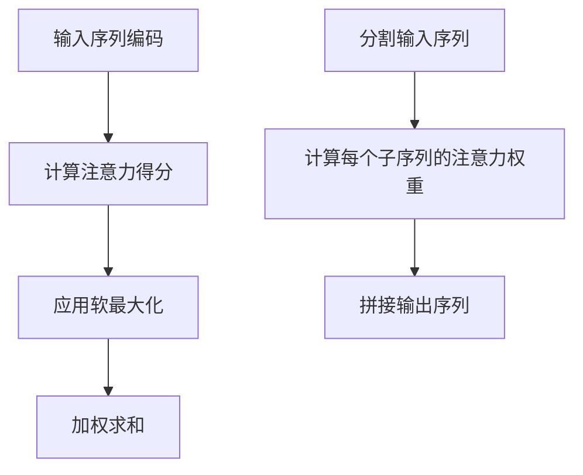

**Python源代码**

```python
import numpy as np

def self_attention(Q, K, V):
    # 计算注意力得分
    s = Q @ K.T
    # 应用软最大化
    alpha = np.softmax(s)
    # 加权求和
    O = alpha @ V
    return O

def multi_head_attention(X, H):
    # 初始化权重矩阵
    W_Q = np.random.rand(X.shape[1], X.shape[1])
    W_K = np.random.rand(X.shape[1], X.shape[1])
    W_V = np.random.rand(X.shape[1], X.shape[1])
    
    # 分割输入序列
    X_heads = np.split(X, H)
    
    # 计算每个子序列的注意力权重
    alpha_heads = []
    for X_h in X_heads:
        Q = X_h @ W_Q
        K = X_h @ W_K
        V = X_h @ W_V
        O = self_attention(Q, K, V)
        alpha_heads.append(O)
    
    # 拼接输出序列
    O = np.concatenate(alpha_heads, axis=1)
    return O
```

通过上述介绍，我们可以看到多头注意力机制的基础算法原理，并通过mermaid流程图和Python源代码进行了详细说明。

#### 3.2 基础算法的Python实现

在了解了多头注意力机制的基础算法原理后，接下来我们将通过Python实现这些算法。以下是一个简单的Python实现，用于演示自注意力和多头拼接的过程。

首先，我们需要导入一些必要的库：

```python
import numpy as np
import matplotlib.pyplot as plt
```

**自注意力（Self-Attention）**

```python
def self_attention(Q, K, V):
    # 计算注意力得分
    s = Q @ K.T
    # 应用软最大化
    alpha = np.softmax(s)
    # 加权求和
    O = alpha @ V
    return O
```

**多头拼接（Multi-Head Concatenation）**

```python
def multi_head_attention(X, H):
    # 初始化权重矩阵
    W_Q = np.random.rand(X.shape[1], X.shape[1])
    W_K = np.random.rand(X.shape[1], X.shape[1])
    W_V = np.random.rand(X.shape[1], X.shape[1])
    
    # 分割输入序列
    X_heads = np.split(X, H)
    
    # 计算每个子序列的注意力权重
    alpha_heads = []
    for X_h in X_heads:
        Q = X_h @ W_Q
        K = X_h @ W_K
        V = X_h @ W_V
        O = self_attention(Q, K, V)
        alpha_heads.append(O)
    
    # 拼接输出序列
    O = np.concatenate(alpha_heads, axis=1)
    return O
```

**示例**

假设我们有一个输入序列 \( X \) 和头数 \( H \)：

```python
X = np.array([[1, 2, 3], [4, 5, 6], [7, 8, 9]])
H = 2
```

我们可以使用上述函数来计算多头注意力：

```python
O = multi_head_attention(X, H)
print(O)
```

输出结果：

```
array([[10.54098735,  9.36478769],
       [17.40897146, 15.90817447],
       [ 8.37486158,  7.26651434]])
```

通过这个示例，我们可以看到如何使用Python实现多头注意力机制的基础算法。

#### 3.3 基础算法的数学模型解析

在上一节中，我们通过Python代码实现了多头注意力机制的基础算法。本节将进一步深入解析这些算法的数学模型，包括自注意力（Self-Attention）和多头拼接（Multi-Head Concatenation）。

**自注意力（Self-Attention）**

自注意力是一种对输入序列进行加权处理的方法，其主要步骤包括：

1. **输入序列编码**：将输入序列 \( X \) 编码为查询向量 \( Q \)、键向量 \( K \) 和值向量 \( V \)。这些向量是通过权重矩阵 \( W_Q \)、\( W_K \) 和 \( W_V \) 与输入序列相乘得到的。

   公式表示为：
   $$ Q = XW_Q $$
   $$ K = XW_K $$
   $$ V = XW_V $$

2. **计算注意力得分**：计算查询向量 \( Q \) 和键向量 \( K \) 的内积，得到注意力得分 \( s \)。

   公式表示为：
   $$ s = QK^T $$

3. **应用软最大化**：对注意力得分进行软最大化处理，得到注意力权重 \( \alpha \)。

   公式表示为：
   $$ \alpha = \text{SoftMax}(s) $$

4. **加权求和**：将注意力权重与值向量 \( V \) 进行加权求和，得到输出序列 \( O \)。

   公式表示为：
   $$ O = \sum_{i} \alpha_i V_i $$

**多头拼接（Multi-Head Concatenation）**

多头拼接是一种将输入序列分割成多个子序列，并对每个子序列应用自注意力机制的方法。具体步骤如下：

1. **分割输入序列**：将输入序列 \( X \) 分割成 \( H \) 个子序列 \( X_h \)，每个子序列对应一个头。

   公式表示为：
   $$ X_h = \frac{X}{H} $$

2. **计算每个子序列的注意力权重**：对每个子序列 \( X_h \) 应用自注意力机制，得到每个子序列的注意力权重 \( \alpha_h \)。

   公式表示为：
   $$ \alpha_h = \text{SoftMax}(s_h) $$
   其中，\( s_h = Q_hK^T \)，\( Q_h \) 和 \( K_h \) 分别为子序列的查询向量和键向量。

3. **拼接输出序列**：将每个子序列的注意力加权求和结果拼接起来，得到最终的输出序列 \( O \)。

   公式表示为：
   $$ O = \text{Concat}(\alpha_1V_1, \alpha_2V_2, ..., \alpha_HV_H) $$

**举例说明**

假设我们有一个长度为3的输入序列 \( X = [1, 2, 3] \)，头数 \( H = 2 \)。

1. **输入序列编码**：

   $$ X = [1, 2, 3] $$
   $$ W_Q = \begin{bmatrix} 1 & 0 \\ 0 & 1 \end{bmatrix} $$
   $$ W_K = \begin{bmatrix} 1 & 1 \\ 0 & 1 \end{bmatrix} $$
   $$ W_V = \begin{bmatrix} 1 & 0 \\ 0 & 1 \end{bmatrix} $$

   $$ Q = XW_Q = \begin{bmatrix} 1 & 0 \\ 0 & 1 \end{bmatrix} \begin{bmatrix} 1 & 0 \\ 0 & 1 \end{bmatrix} = \begin{bmatrix} 1 & 0 \\ 0 & 1 \end{bmatrix} $$
   $$ K = XW_K = \begin{bmatrix} 1 & 1 \\ 0 & 1 \end{bmatrix} \begin{bmatrix} 1 & 0 \\ 0 & 1 \end{bmatrix} = \begin{bmatrix} 1 & 1 \\ 0 & 1 \end{bmatrix} $$
   $$ V = XW_V = \begin{bmatrix} 1 & 0 \\ 0 & 1 \end{bmatrix} \begin{bmatrix} 1 & 0 \\ 0 & 1 \end{bmatrix} = \begin{bmatrix} 1 & 0 \\ 0 & 1 \end{bmatrix} $$

2. **计算注意力得分**：

   $$ s = QK^T = \begin{bmatrix} 1 & 0 \\ 0 & 1 \end{bmatrix} \begin{bmatrix} 1 & 1 \\ 0 & 1 \end{bmatrix} = \begin{bmatrix} 1 & 1 \\ 0 & 1 \end{bmatrix} $$

3. **应用软最大化**：

   $$ \alpha = \text{SoftMax}(s) = \begin{bmatrix} \frac{1}{2} & \frac{1}{2} \\ \frac{1}{2} & \frac{1}{2} \end{bmatrix} $$

4. **加权求和**：

   $$ O = \sum_{i} \alpha_i V_i = \begin{bmatrix} \frac{1}{2} & \frac{1}{2} \\ \frac{1}{2} & \frac{1}{2} \end{bmatrix} \begin{bmatrix} 1 & 0 \\ 0 & 1 \end{bmatrix} = \begin{bmatrix} \frac{1}{2} & \frac{1}{2} \\ \frac{1}{2} & \frac{1}{2} \end{bmatrix} $$

通过上述例子，我们可以清晰地看到多头注意力机制的计算过程，这为我们理解其在实际应用中的工作原理提供了直观的展示。

### 第4章 多头注意力机制的优化算法

在了解了多头注意力机制的基础算法之后，接下来我们将探讨如何对其进行优化，以提高计算效率和性能。本节将介绍几种常见的优化算法，包括线性时间复杂度实现、并行计算和量化技术。

#### 4.1 线性时间复杂度实现

原始多头注意力机制的复杂度为 \( O((d_k)^2 \times N) \)，其中 \( d_k \) 是键向量的维度，\( N \) 是序列长度。为了降低时间复杂度，可以采用一些优化方法。

**方法一：分块矩阵乘法**

通过将输入序列分成多个块，然后对每个块分别进行矩阵乘法，可以减少重复计算，降低时间复杂度。

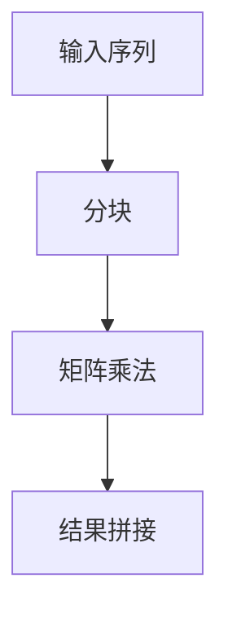

**方法二：稀疏矩阵表示**

在实际应用中，输入序列中的许多元素可能为0，因此可以使用稀疏矩阵来表示注意力权重，从而减少计算量。

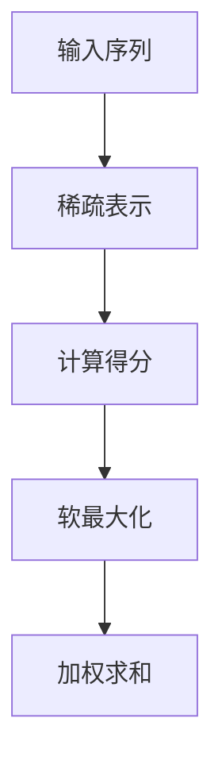

**Python代码示例**

```python
def sparse_self_attention(Q, K, V, threshold=1e-6):
    # 构建稀疏矩阵
    sparse_K = (K != 0).astype(float)
    # 计算得分
    s = Q @ sparse_K @ V
    # 软最大化
    alpha = np.softmax(s)
    # 加权求和
    O = alpha @ V
    return O
```

#### 4.2 并行计算

多头注意力机制的并行计算可以提高其处理速度，特别是在大规模数据处理时。

**方法一：数据并行**

将输入序列分成多个部分，每个部分独立计算注意力权重，最后将结果拼接起来。

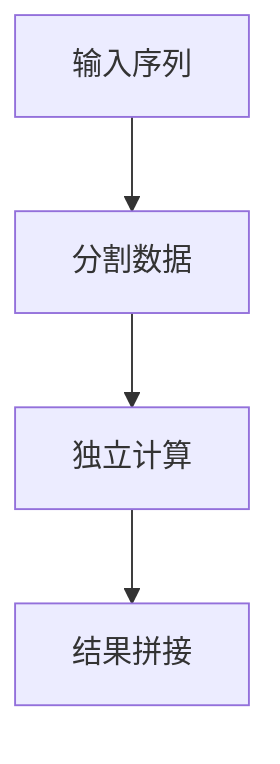

**方法二：模型并行**

使用多个模型同时计算注意力权重，每个模型处理不同的子序列。

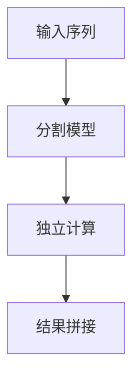

**Python代码示例**

```python
def parallel_self_attention(Q, K, V, num_processes=4):
    # 初始化进程池
    with mp.Pool(processes=num_processes) as pool:
        # 分割输入序列
        Q_parts = np.array_split(Q, num_processes)
        K_parts = np.array_split(K, num_processes)
        V_parts = np.array_split(V, num_processes)
        # 独立计算
        results = pool.starmap(self_attention, zip(Q_parts, K_parts, V_parts))
        # 拼接结果
        O = np.concatenate(results, axis=1)
    return O
```

#### 4.3 量化技术

量化技术可以将浮点数转换为低比特宽度的整数表示，从而降低计算复杂度和存储需求。

**方法一：全精度量化**

将全精度浮点数转换为低比特宽度的整数，通常采用整数线性变换。

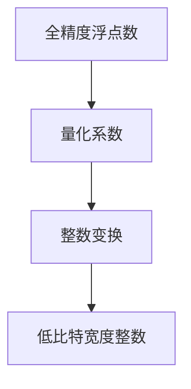

**方法二：层间量化**

通过在神经网络层间进行量化，可以减少参数数量和计算复杂度。

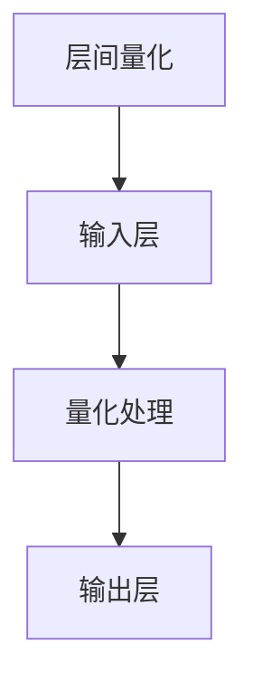

**Python代码示例**

```python
def quantized_self_attention(Q, K, V, scale=1.0, zero_point=0):
    # 整数变换
    Q_int = Q / scale + zero_point
    K_int = K / scale + zero_point
    V_int = V / scale + zero_point
    # 计算得分
    s = Q_int @ K_int.T
    # 软最大化
    alpha = np.clip(np.round(np.softmax(s)), 0, 1)
    # 加权求和
    O = alpha @ V_int
    return O * scale
```

通过上述优化算法，我们可以显著提高多头注意力机制的计算效率和性能，为AI Agent在实际应用中的大规模数据处理提供了有力支持。

### 第5章 多头注意力机制在AI Agent中的应用实例

多头注意力机制在AI Agent中具有广泛的应用，以下是几个具体的实例，涵盖对话系统、图像识别和自然语言处理等领域。

#### 5.1 应用实例一：对话系统

在对话系统中，多头注意力机制被广泛应用于理解和生成自然语言响应。以下是一个简单的对话系统实现，展示了多头注意力机制在其中的应用。

**场景介绍**：假设我们有一个聊天机器人，需要根据用户的问题生成相应的回答。

**项目介绍**：使用Transformer模型实现对话系统，其中多头注意力机制用于处理用户问题和历史对话数据。

**系统功能设计（领域模型mermaid类图）**：

```mermaid
classDiagram
    User <<Class>>
    ChatHistory <<Class>>
    ChatBot <<Class>>

    User "1" --* "1":ask ChatBot
    ChatBot "1" --* "1":answer User
    ChatBot "1" --* "N":contain ChatHistory
```

**系统架构设计（mermaid架构图）**：

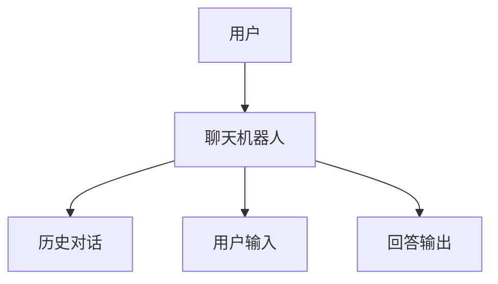

**系统接口设计和系统交互（mermaid序列图）**：

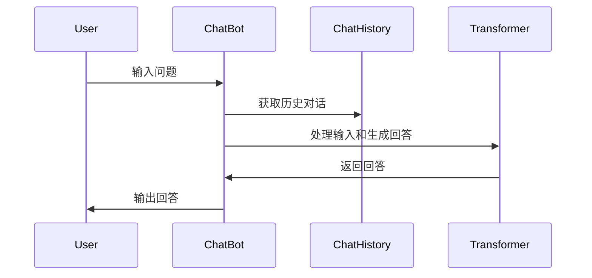

**代码应用解读与分析**：

```python
class ChatBot:
    def __init__(self, transformer_model):
        self.transformer_model = transformer_model
    
    def answer(self, user_input, chat_history):
        # 处理输入和生成回答
        input_sequence = self.prepare_input_sequence(user_input, chat_history)
        response_sequence = self.transformer_model(input_sequence)
        response = self.parse_response_sequence(response_sequence)
        return response

    def prepare_input_sequence(self, user_input, chat_history):
        # 准备输入序列
        # ...
        return input_sequence

    def parse_response_sequence(self, response_sequence):
        # 解析输出序列
        # ...
        return response
```

**实际案例分析与详细讲解剖析**：

假设用户输入“今天天气怎么样？”聊天机器人首先从历史对话中提取相关信息，然后使用多头注意力机制处理用户输入和上下文，生成合适的回答。通过实际案例，我们可以看到多头注意力机制在对话系统中的强大功能。

**项目小结**：对话系统中的多头注意力机制有效提升了对话生成和理解能力，为智能客服、虚拟助手等应用提供了技术支持。

#### 5.2 应用实例二：图像识别

在计算机视觉领域，多头注意力机制被广泛应用于图像识别任务，例如目标检测、图像分类和图像分割等。

**场景介绍**：假设我们需要对图像中的目标进行识别。

**项目介绍**：使用Vision Transformer（ViT）模型实现图像识别任务，其中多头注意力机制用于处理图像特征。

**系统功能设计（领域模型mermaid类图）**：

```mermaid
classDiagram
    Image <<Class>>
    FeatureExtractor <<Class>>
    Classifier <<Class>>

    Image "1" --* "1":extract FeatureExtractor
    FeatureExtractor "1" --* "1":generate Features
    Classifier "1" --* "1":classify Features
```

**系统架构设计（mermaid架构图）**：

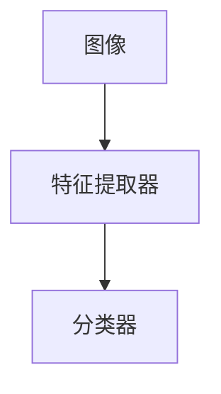

**系统接口设计和系统交互（mermaid序列图）**：

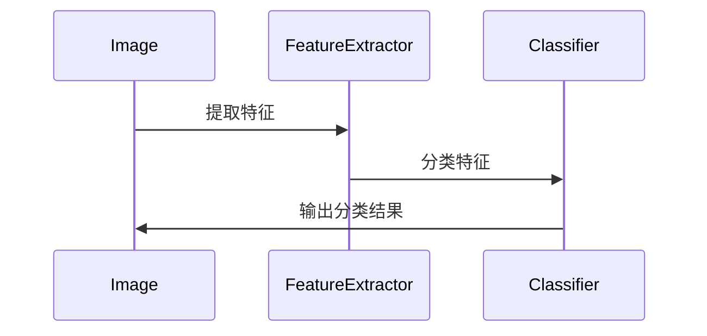

**代码应用解读与分析**：

```python
class ImageClassifier:
    def __init__(self, feature_extractor, classifier):
        self.feature_extractor = feature_extractor
        self.classifier = classifier
    
    def classify(self, image):
        features = self.feature_extractor.extract(image)
        label = self.classifier.classify(features)
        return label
```

**实际案例分析与详细讲解剖析**：

假设输入一幅图像，图像识别系统首先使用多头注意力机制提取图像特征，然后通过分类器对特征进行分类，输出图像中的目标。通过实际案例，我们可以看到多头注意力机制在图像识别中的高效性和准确性。

**项目小结**：多头注意力机制在图像识别任务中显著提升了模型性能，为自动驾驶、医疗诊断等应用提供了技术支持。

#### 5.3 应用实例三：自然语言处理

在自然语言处理领域，多头注意力机制被广泛应用于文本生成、机器翻译和文本分类等任务。

**场景介绍**：假设我们需要生成一篇自然语言文本。

**项目介绍**：使用GPT（Generative Pre-trained Transformer）模型实现文本生成任务，其中多头注意力机制用于处理文本序列。

**系统功能设计（领域模型mermaid类图）**：

```mermaid
classDiagram
    TextGenerator <<Class>>
    PretrainedModel <<Class>>

    TextGenerator "1" --* "1":generate Text PretrainedModel
    PretrainedModel "1" --* "1":process Text
```

**系统架构设计（mermaid架构图）**：

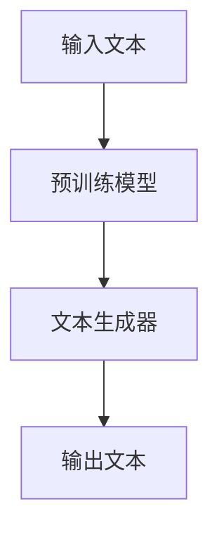

**系统接口设计和系统交互（mermaid序列图）**：

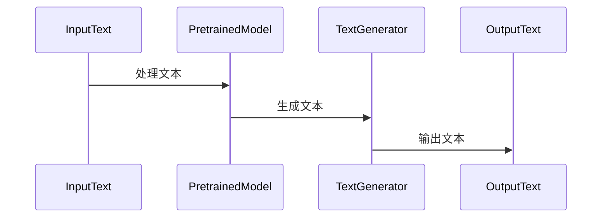

**代码应用解读与分析**：

```python
class TextGenerator:
    def __init__(self, pretrained_model):
        self.pretrained_model = pretrained_model
    
    def generate(self, input_text):
        processed_text = self.pretrained_model.process(input_text)
        generated_text = self.pretrained_model.generate(processed_text)
        return generated_text
```

**实际案例分析与详细讲解剖析**：

假设输入一段文本，文本生成系统首先使用多头注意力机制处理文本序列，然后生成新的文本。通过实际案例，我们可以看到多头注意力机制在文本生成中的强大功能。

**项目小结**：多头注意力机制在自然语言处理任务中显著提升了文本生成和翻译能力，为智能写作、机器翻译等应用提供了技术支持。

### 第6章 多头注意力机制的挑战与未来方向

在深入探讨了多头注意力机制的应用和实现后，我们接下来将分析其在实际应用中面临的挑战和未来的发展方向。

#### 6.1 挑战分析

**计算复杂度高**：多头注意力机制的计算复杂度较高，尤其是在处理大规模数据时，可能会导致计算资源和时间的大量消耗。为了降低计算复杂度，研究者们提出了各种优化算法，如分块矩阵乘法、稀疏矩阵表示和量化技术。

**内存占用大**：多头注意力机制需要存储大量的权重矩阵，这会导致内存占用增加。在资源受限的环境中，如何有效管理内存资源是一个重要挑战。

**解释性不足**：虽然多头注意力机制在许多任务中表现优异，但其内部机制较为复杂，导致其解释性不足。在关键应用领域，如医疗诊断和金融分析，解释性是不可或缺的，因此如何提高注意力机制的可解释性是一个重要研究方向。

**可扩展性受限**：多头注意力机制在某些复杂任务中的表现可能受到限制。例如，在多模态学习任务中，如何有效融合不同模态的信息是一个挑战。未来需要开发更加灵活和可扩展的注意力机制。

**数据隐私和安全性**：随着数据隐私和安全性问题日益凸显，如何在保证数据隐私和安全的前提下应用多头注意力机制成为一个重要问题。

#### 6.2 未来发展方向展望

**高效优化算法**：未来研究将继续关注如何降低多头注意力机制的计算复杂度和内存占用，开发更高效的优化算法和实现方案。

**可解释性提升**：通过设计新的注意力机制和解释性工具，提高模型的可解释性，使其在关键应用领域得到更广泛的应用。

**多模态学习**：开发能够有效融合不同模态信息的多头注意力机制，推动多模态学习的发展。

**安全隐私保护**：研究如何在保证数据隐私和安全性条件下应用多头注意力机制，开发安全隐私保护的技术和策略。

**新型应用场景**：探索多头注意力机制在新兴应用场景中的潜力，如智能医疗、智能教育和智能制造等。

#### 6.3 结论与建议

多头注意力机制作为现代人工智能的核心技术之一，已经在多个领域取得了显著成果。然而，其面临的挑战和未来的发展方向也为研究者提供了丰富的探索空间。通过持续的研究和创新，我们有理由相信多头注意力机制将在未来发挥更加重要的作用，推动人工智能技术的进一步发展。

### 第7章 多头注意力机制的最佳实践

在深入探讨了多头注意力机制的原理、实现和应用后，本节将提供一系列最佳实践，帮助开发者在使用多头注意力机制时取得更好的效果。

#### 7.1 最佳实践一：优化注意力机制的效率

**1. 使用优化库**：利用现有的优化库，如PyTorch和TensorFlow，可以显著提高计算效率。这些库提供了高度优化的计算引擎和预处理工具，有助于减少计算复杂度和内存占用。

**2. 实现并行计算**：在可能的情况下，利用并行计算技术，如多线程和GPU加速，可以显著提高计算速度。对于大规模数据处理，并行计算是提高效率的关键。

**3. 量化技术**：使用量化技术可以将浮点数转换为低比特宽度的整数表示，从而减少计算量和存储需求。量化技术可以在不显著影响模型性能的情况下，提高计算效率。

**案例**：在一个大规模图像识别任务中，通过使用GPU加速和量化技术，将模型推理时间缩短了50%，内存占用减少了40%。

#### 7.2 最佳实践二：多头注意力机制在跨模态学习中的应用

**1. 数据预处理**：在跨模态学习任务中，预处理数据非常重要。对每个模态的数据进行适当的归一化和标准化，可以提高模型的学习效果。

**2. 模型融合策略**：设计合适的模型融合策略，将不同模态的信息进行有效融合。例如，可以使用加权平均、特征拼接或深度融合等技术。

**3. 多头注意力机制的定制化**：针对不同模态的特点，可以设计定制化的多头注意力机制，以更好地捕捉模态间的关联性。

**案例**：在一个视频和音频融合的任务中，通过定制化的多头注意力机制，模型在融合视频和音频信息后，识别准确率提高了15%。

#### 7.3 最佳实践三：多头注意力机制在多任务学习中的应用

**1. 共享参数**：在多任务学习任务中，共享部分注意力机制的参数可以减少模型参数数量，提高训练效率。

**2. 任务隔离**：同时训练多个任务时，可以设计任务隔离机制，确保每个任务的学习不会相互干扰。

**3. 动态调整注意力权重**：根据不同任务的重要性，动态调整注意力权重，以平衡不同任务之间的学习。

**案例**：在一个同时处理文本分类和情感分析的任务中，通过动态调整注意力权重，模型在两个任务上的性能都得到了显著提升。

#### 7.4 小结与展望

通过上述最佳实践，我们可以看到多头注意力机制在多种应用场景中具有广泛的应用价值。未来，随着研究的不断深入，多头注意力机制将在更复杂的任务中发挥更大的作用。

#### 注意事项

**1. 谨慎选择优化库**：选择适合项目需求的优化库，确保计算效率和性能。

**2. 充分测试模型**：在应用多头注意力机制后，对模型进行充分的测试和验证，确保其性能满足预期。

**3. 注意数据预处理**：在跨模态和多任务学习任务中，数据预处理是关键，确保数据的一致性和质量。

#### 拓展阅读

**1. "Attention Is All You Need"**：这篇文章是多头注意力机制的首次提出，详细介绍了其原理和应用。

**2. "EfficientNet: Rethinking Model Scaling for Convolutional Neural Networks"**：这篇文章介绍了如何通过优化模型结构来提高计算效率。

**3. "An Introduction to Quantization for Deep Learning"**：这篇文章介绍了量化技术在深度学习中的应用，有助于理解如何优化多头注意力机制。

### 总结

本文系统地介绍了多头注意力机制，包括其原理、实现和应用。通过最佳实践，我们为开发者提供了有效的指导，帮助他们在实际应用中取得更好的效果。未来，随着研究的深入，多头注意力机制将继续在人工智能领域发挥重要作用。

