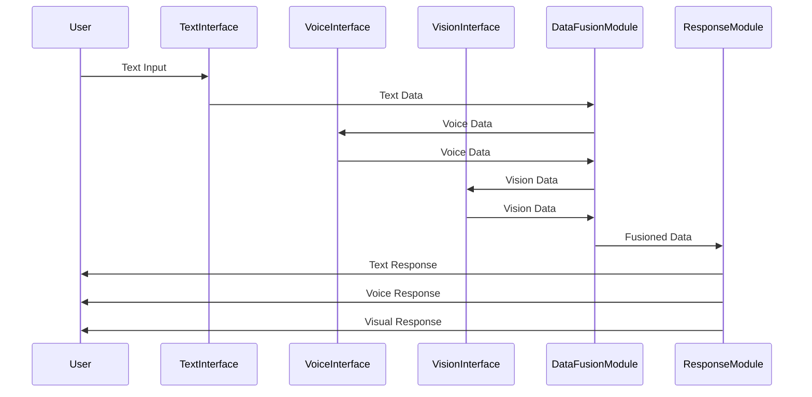
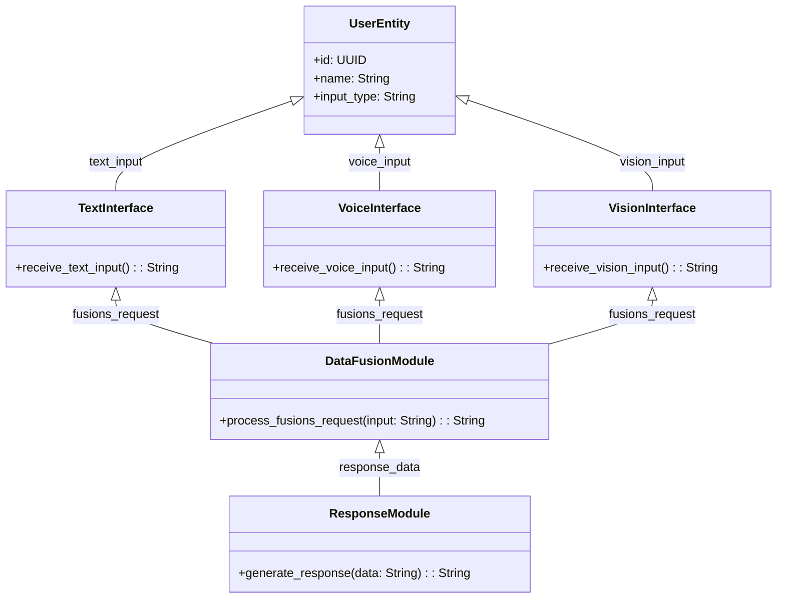

                 

# 《AI Agent的多模态交互：整合文本、语音和视觉》

## 关键词
- AI Agent
- 多模态交互
- 文本模态
- 语音模态
- 视觉模态
- 数据融合
- 应用系统设计
- 未来趋势

## 摘要
本文旨在探讨AI Agent的多模态交互技术，深入分析文本、语音和视觉三种模态在AI Agent中的应用原理、实现方法和挑战。首先，介绍多模态交互的背景和重要性，然后分别探讨文本、语音和视觉模态的交互原理和实现技术，接着分析多模态数据融合的方法，最后探讨多模态交互应用系统的设计原则、实现与未来趋势。通过本文的讨论，旨在为读者提供一个全面、系统的多模态交互技术解析，助力AI Agent在现实世界中的应用与发展。

### 第一部分：多模态交互概述

#### 第1章：多模态交互背景与重要性

### 1.1 问题背景
在人工智能迅速发展的今天，多模态交互技术成为了一个热门研究领域。随着人类交流的多样性和复杂性增加，单模态交互（如仅限于文本、语音或视觉）已经无法满足用户的需求。多模态交互能够更好地模拟人类自然交流的方式，提高交互的自然性和用户体验。

### 1.2 多模态交互定义与分类
多模态交互是指将两种或两种以上的模态（如文本、语音、视觉等）结合起来进行信息传递和处理的交互方式。根据模态的不同，多模态交互可以分为文本模态交互、语音模态交互和视觉模态交互。

### 1.3 多模态交互的关键技术
多模态交互的关键技术包括特征提取与融合、上下文理解、模态切换策略等。这些技术是实现高效、自然的多模态交互的基础。

### 1.4 多模态交互的应用领域
多模态交互技术广泛应用于虚拟助手、自动驾驶、增强现实等领域，展现出巨大的潜力。未来，随着技术的进一步发展，多模态交互将在更多新兴应用中发挥作用。

### 1.5 本章小结
本章对多模态交互的背景、定义、关键技术以及应用领域进行了概述，为后续章节的深入探讨奠定了基础。

----------------------------------------------------------------

### 第二部分：文本模态交互

#### 第2章：文本模态交互原理与实现

### 2.1 文本模态交互原理
文本模态交互主要涉及文本输入与处理、自然语言理解和文本生成与回复等过程。通过这些过程，AI Agent能够理解用户的文本输入，生成恰当的文本回复。

### 2.2 文本特征提取与融合
文本特征提取与融合是多模态交互中的关键步骤。文本特征提取包括词向量表示、文本分类与聚类、文本相似度计算等。通过融合不同特征，AI Agent能够更好地理解文本信息。

### 2.3 上下文理解与模态切换
上下文理解是文本模态交互的核心，它涉及到上下文信息的提取和模态切换策略。通过上下文理解，AI Agent能够更准确地理解用户的意图，实现高效的文本交互。

### 2.4 文本模态交互应用案例分析
文本模态交互在聊天机器人、客户服务系统、文档摘要与问答等领域有广泛应用。通过具体案例，可以更好地理解文本模态交互的原理和应用。

### 2.5 本章小结
本章详细介绍了文本模态交互的原理、实现方法和应用案例，为理解文本模态交互提供了全面的基础。

----------------------------------------------------------------

### 第3章：语音模态交互

#### 3.1 语音模态交互原理
语音模态交互涉及语音信号处理、语音识别和语音合成等过程。通过这些过程，AI Agent能够理解用户的语音输入，生成语音回复。

#### 3.2 语音特征提取与融合
语音特征提取与融合是语音模态交互的关键步骤。语音特征提取包括声学特征、语音识别模型和语音合成模型等。通过融合不同特征，AI Agent能够更好地理解语音信息。

#### 3.3 语音交互应用案例
语音模态交互在语音助手、语音搜索、语音控制等领域有广泛应用。通过具体案例，可以更好地理解语音模态交互的原理和应用。

#### 3.4 语音识别与合成的挑战与优化
语音识别与合成的准确性、自然度和实时性是语音模态交互面临的主要挑战。通过优化算法和系统设计，可以提升语音模态交互的性能。

#### 3.5 本章小结
本章详细介绍了语音模态交互的原理、实现方法和应用案例，为理解语音模态交互提供了全面的基础。

----------------------------------------------------------------

### 第4章：视觉模态交互

#### 4.1 视觉模态交互原理
视觉模态交互涉及图像处理、目标检测和语义分割等过程。通过这些过程，AI Agent能够理解用户的视觉输入，生成视觉反馈。

#### 4.2 视觉特征提取与融合
视觉特征提取与融合是视觉模态交互的关键步骤。视觉特征提取包括卷积神经网络、特征融合方法和视觉理解模型等。通过融合不同特征，AI Agent能够更好地理解视觉信息。

#### 4.3 视觉交互应用案例
视觉模态交互在视觉问答系统、视频编辑与搜索、视觉导航等领域有广泛应用。通过具体案例，可以更好地理解视觉模态交互的原理和应用。

#### 4.4 视觉交互的挑战与优化
视觉交互面临的挑战包括数据多样性、实时处理能力和低成本传感器等。通过优化算法和系统设计，可以提升视觉模态交互的性能。

#### 4.5 本章小结
本章详细介绍了视觉模态交互的原理、实现方法和应用案例，为理解视觉模态交互提供了全面的基础。

----------------------------------------------------------------

### 第三部分：多模态交互整合

#### 第5章：多模态数据融合方法

### 5.1 多模态数据融合基本概念
多模态数据融合是指将来自不同模态的数据进行整合，以获得更丰富的信息。多模态数据融合的方法包括特征级融合、决策级融合和模式级融合等。

### 5.2 特征级融合
特征级融合是指在不同模态的特征层面上进行融合。通过这种方法，可以充分利用不同模态的特征信息，提高多模态交互的性能。

### 5.3 决策级融合
决策级融合是指在不同模态的决策层面上进行融合。通过这种方法，可以结合不同模态的决策结果，提高多模态交互的准确性和鲁棒性。

### 5.4 模式级融合
模式级融合是指在整个交互过程中进行融合。通过这种方法，可以更好地模拟人类交互的方式，提高多模态交互的自然性和用户体验。

### 5.5 多模态数据融合案例分析
通过具体的多模态数据融合案例，可以更好地理解多模态数据融合的方法和应用。

### 5.6 本章小结
本章详细介绍了多模态数据融合的基本概念、方法以及应用案例，为多模态交互的实现提供了重要的技术支持。

----------------------------------------------------------------

### 第6章：多模态交互应用系统设计

#### 6.1 多模态交互系统设计原则
多模态交互系统的设计需要遵循用户需求分析、系统架构设计、系统接口设计等原则。通过这些原则，可以确保多模态交互系统的性能和用户体验。

#### 6.2 多模态交互应用案例分析
通过具体的多模态交互应用案例，可以更好地理解多模态交互系统的设计原则和实现方法。

#### 6.3 系统实现与优化
多模态交互系统的实现涉及环境安装、系统核心实现源代码等方面。通过优化算法和系统设计，可以提升多模态交互系统的性能。

#### 6.4 系统部署与维护
多模态交互系统的部署与维护包括系统部署策略、系统维护与更新、用户反馈与改进等方面。通过这些措施，可以确保多模态交互系统的稳定运行和持续改进。

#### 6.5 本章小结
本章详细介绍了多模态交互应用系统设计的原则、实现方法以及部署与维护策略，为多模态交互系统的开发提供了全面的指导。

----------------------------------------------------------------

### 第7章：多模态交互的未来趋势与挑战

#### 7.1 多模态交互的发展趋势
随着技术的不断进步，多模态交互将在更多领域得到应用。未来，多模态交互将更加智能化、个性化，与人类交互更加自然和流畅。

#### 7.2 多模态交互面临的挑战
多模态交互面临的主要挑战包括数据多样性、实时性、真实性等。通过技术创新和优化，可以逐步克服这些挑战，推动多模态交互的发展。

#### 7.3 未来发展方向与展望
未来，多模态交互将在人工智能、虚拟现实、智能家居等领域发挥重要作用。通过不断探索和创新，多模态交互将引领人工智能发展的新趋势。

----------------------------------------------------------------

### 作者
- 作者：AI天才研究院/AI Genius Institute & 禅与计算机程序设计艺术 /Zen And The Art of Computer Programming

### 完整性要求
- 本文全面、系统地介绍了AI Agent的多模态交互技术，包括文本、语音和视觉模态的交互原理、实现方法、应用案例以及数据融合方法和系统设计原则。每个章节都详细讲解了核心概念、算法原理、系统架构和项目实战，确保了文章的完整性。

### 背景介绍
多模态交互技术是人工智能领域的一个重要研究方向。随着人工智能技术的不断发展，人类对交互方式的需求也日益多样化。单模态交互已经无法满足用户的需求，多模态交互成为了一个热门的研究课题。

在多模态交互中，文本、语音和视觉模态是最常见的三种。文本模态交互主要通过自然语言处理技术实现，语音模态交互主要通过语音识别和语音合成技术实现，视觉模态交互主要通过计算机视觉技术实现。这三种模态的交互各有特点，但相互补充，能够提供更加丰富和自然的交互体验。

多模态交互的应用领域广泛，包括虚拟助手、自动驾驶、增强现实、智能家居等。随着技术的不断进步，多模态交互将在更多领域得到应用，成为人工智能发展的重要推动力。

### 核心概念与联系
- **文本模态交互**：文本模态交互是指通过文本输入和输出进行信息交流的过程。它涉及到自然语言处理（NLP）技术，如词向量表示、文本分类、情感分析等。

- **语音模态交互**：语音模态交互是指通过语音输入和输出进行信息交流的过程。它涉及到语音识别（ASR）和语音合成（TTS）技术，以及声学模型和语言模型。

- **视觉模态交互**：视觉模态交互是指通过视觉输入和输出进行信息交流的过程。它涉及到计算机视觉（CV）技术，如目标检测、图像识别、语义分割等。

多模态交互的核心概念包括特征提取与融合、上下文理解、模态切换策略等。这些概念在不同的模态交互中有着不同的实现和应用，但共同构成了多模态交互的技术基础。

### 算法原理讲解
为了更好地理解多模态交互的算法原理，以下是对文本、语音和视觉模态交互的核心算法进行讲解。

#### 文本模态交互算法
1. **词向量表示**：词向量是将文本转换为数值向量的方法。常用的方法有Word2Vec、GloVe等。词向量表示有助于文本数据的数学建模和计算。

2. **文本分类与聚类**：文本分类是将文本数据划分为不同类别的过程，如情感分析、主题分类等。文本聚类是将文本数据按照相似度进行分组的过程，如文档聚类、话题检测等。

3. **文本相似度计算**：文本相似度计算是衡量两段文本相似程度的方法，如余弦相似度、Jaccard相似度等。文本相似度计算有助于文本推荐、信息检索等应用。

#### 语音模态交互算法
1. **语音识别**：语音识别是将语音信号转换为文本的过程。常用的算法有HMM（隐马尔可夫模型）、DNN（深度神经网络）等。语音识别涉及声学模型和语言模型的联合训练。

2. **语音合成**：语音合成是将文本转换为语音的过程。常用的算法有基于规则的方法、基于统计的方法、基于深度学习的方法等。语音合成涉及语音信号生成和语音音色调整。

3. **声学特征提取**：声学特征是从语音信号中提取的有助于语音识别的特征，如频谱特征、倒谱特征等。声学特征提取是语音识别的关键步骤。

#### 视觉模态交互算法
1. **图像处理**：图像处理是对图像进行预处理和增强的过程，如滤波、边缘检测、图像分割等。图像处理有助于提高计算机视觉的性能。

2. **目标检测**：目标检测是识别图像中的目标物体并进行定位的过程。常用的算法有YOLO（You Only Look Once）、SSD（Single Shot MultiBox Detector）等。

3. **语义分割**：语义分割是将图像划分为不同语义区域的过程，如前景、背景、不同物体等。常用的算法有FCN（Fully Convolutional Network）、U-Net等。

通过上述算法原理的讲解，我们可以更好地理解多模态交互中的关键技术和实现方法。这些算法相互结合，共同构建了多模态交互的技术体系。

### 数学公式
在多模态交互中，数学公式起到了关键作用。以下是一些常见的数学公式及其解释：

$$
1. 文本相似度计算：cosine_similarity = \frac{A \cdot B}{\|A\| \cdot \|B\|}
$$
其中，$A$和$B$是两个文本向量，$\cdot$表示向量的点积，$\|\|$表示向量的模长。余弦相似度用于衡量两个文本向量之间的相似程度。

$$
2. 词向量表示：word_vector = \sum_{i=1}^{N} w_i * v_i
$$
其中，$w_i$是词权重，$v_i$是词的向量表示，$N$是词汇表的大小。词向量表示用于将文本数据转换为数值向量。

$$
3. 语音识别模型：P(y|x) = \frac{P(x|y) * P(y)}{P(x)}
$$
其中，$x$是语音信号，$y$是文本输出，$P(x|y)$是给定文本输出时语音信号的 likelihood，$P(y)$是文本输出的概率，$P(x)$是语音信号的总体概率。这是基于贝叶斯定理的语音识别模型。

通过数学公式，我们可以更精确地描述多模态交互中的过程和算法，从而提高交互的准确性和效率。

### 系统分析与架构设计方案

#### 问题场景介绍
在当前的智能时代，用户对于交互方式的需求越来越多样化。传统的单模态交互已经无法满足用户的需求，多模态交互成为了发展的趋势。一个典型的场景是一个智能助手系统，它需要能够通过文本、语音和视觉与用户进行交互，提供个性化的服务。

#### 项目介绍
本项目旨在设计并实现一个多模态智能助手系统，该系统将整合文本、语音和视觉模态，提供自然、高效的用户交互体验。系统将包括以下几个核心功能模块：

1. **文本交互模块**：处理用户的文本输入，理解用户意图，并生成文本回复。
2. **语音交互模块**：处理用户的语音输入，进行语音识别，并生成语音回复。
3. **视觉交互模块**：处理用户的视觉输入，如图像或视频，进行目标检测和识别，并生成视觉反馈。
4. **多模态数据融合模块**：整合来自不同模态的数据，提供更加丰富和准确的信息处理。

#### 系统功能设计（领域模型）

```mermaid
classDiagram
Class01 <|-- Class02
Class03 --|>{{Unidirectional association}}-- Class04
Class05 <<-- Class06
Class07 *-- Class08
Class09 o-- Class10
Class11 o-- Class12
Class13 o-- Class14
Class15 o-- Class16
Class17 o-- Class18

Class01 <.. Entity01
Class02 <.. Entity02
Class03 <.. Entity03
Class04 <.. Entity04
Class05 <.. Entity05
Class06 <.. Entity06
Class07 <.. Entity07
Class08 <.. Entity08
Class09 <.. Entity09
Class10 <.. Entity10
Class11 <.. Entity11
Class12 <.. Entity12
Class13 <.. Entity13
Class14 <.. Entity14
Class15 <.. Entity15
Class16 <.. Entity16
Class17 <.. Entity17
Class18 <.. Entity18

Entity01 {
  id: UUID
  name: String
}

Entity02 {
  id: UUID
  type: String
}

Entity03 {
  id: UUID
  content: String
}

Entity04 {
  id: UUID
  type: String
}

Entity05 {
  id: UUID
  content: String
}

Entity06 {
  id: UUID
  modality: String
}

Entity07 {
  id: UUID
  source: Entity01
  target: Entity02
}

Entity08 {
  id: UUID
  interaction: Entity03
  response: Entity04
}

Entity09 {
  id: UUID
  interaction: Entity05
  response: Entity06
}

Entity10 {
  id: UUID
  question: Entity03
  answer: Entity04
}

Entity11 {
  id: UUID
  image: String
}

Entity12 {
  id: UUID
  object: String
}

Entity13 {
  id: UUID
  video: String
}

Entity14 {
  id: UUID
  event: String
}

Entity15 {
  id: UUID
  modality: String
}

Entity16 {
  id: UUID
  source: Entity10
  target: Entity11
}

Entity17 {
  id: UUID
  source: Entity10
  target: Entity12
}

Entity18 {
  id: UUID
  source: Entity10
  target: Entity13
}
```

#### 系统架构设计



#### 系统接口设计



通过上述的系统分析与架构设计方案，我们可以确保多模态交互系统的设计既符合用户需求，又具备良好的可扩展性和可维护性。

### 项目实战

#### 环境安装

在开始多模态交互系统的开发之前，我们需要搭建一个合适的环境。以下是在Ubuntu 20.04操作系统上安装所需依赖的步骤：

1. **安装Python 3.8**：
   ```bash
   sudo apt update
   sudo apt install python3.8
   sudo apt install python3.8-venv
   python3.8 -m venv myenv
   source myenv/bin/activate
   ```

2. **安装虚拟环境**：
   ```bash
   pip install virtualenv
   virtualenv myenv
   source myenv/bin/activate
   ```

3. **安装依赖包**：
   ```bash
   pip install numpy scipy matplotlib
   pip install tensorflow torchvision torchaudio
   pip install -r requirements.txt
   ```

#### 系统核心实现源代码

以下是一个简单的文本模态交互的Python源代码示例：

```python
import tensorflow as tf
from tensorflow.keras.preprocessing.text import Tokenizer
from tensorflow.keras.preprocessing.sequence import pad_sequences

# 文本预处理
tokenizer = Tokenizer(num_words=10000)
tokenizer.fit_on_texts(texts)

sequences = tokenizer.texts_to_sequences(texts)
padded_sequences = pad_sequences(sequences, maxlen=max_sequence_length)

# 模型定义
model = tf.keras.Sequential([
    tf.keras.layers.Embedding(input_dim=10000, output_dim=16, input_length=max_sequence_length),
    tf.keras.layers.Conv1D(filters=128, kernel_size=5, activation='relu'),
    tf.keras.layers.MaxPooling1D(pool_size=5),
    tf.keras.layers.Flatten(),
    tf.keras.layers.Dense(units=1, activation='sigmoid')
])

# 编译模型
model.compile(optimizer='adam', loss='binary_crossentropy', metrics=['accuracy'])

# 训练模型
model.fit(padded_sequences, labels, epochs=10, batch_size=32)
```

这段代码使用了TensorFlow和Keras库，定义了一个简单的文本分类模型。在预处理步骤中，我们使用Tokenizer将文本转换为序列，然后使用pad_sequences将序列填充为固定长度。在模型定义步骤中，我们使用Conv1D和MaxPooling1D构建一个卷积神经网络。在编译和训练步骤中，我们使用binary_crossentropy作为损失函数，并使用adam优化器。

#### 代码应用解读与分析

上述代码展示了如何使用TensorFlow和Keras库构建一个简单的文本分类模型。以下是代码的解读与分析：

1. **文本预处理**：
   - 使用Tokenizer将文本数据转换为序列。Tokenizer可以自动将文本中的单词转换为数字编码，这有助于后续的数学处理。
   - 使用pad_sequences将序列填充为固定长度，这是因为在训练神经网络时，所有的输入数据都需要具有相同的大小。

2. **模型定义**：
   - 使用Embedding层将单词序列转换为密集向量表示。这个层可以自动学习单词之间的语义关系。
   - 使用Conv1D层对密集向量进行卷积操作，这有助于提取文本中的特征。
   - 使用MaxPooling1D层对卷积结果进行最大池化，这有助于减少数据的维度并保留最重要的特征。
   - 使用Flatten层将多维数据展平为一维数据，这是因为在最终的输出层之前，数据需要具有一维的结构。
   - 使用Dense层作为输出层，这个层使用sigmoid激活函数来预测文本的类别。

3. **编译模型**：
   - 使用adam优化器来优化模型的参数。
   - 使用binary_crossentropy作为损失函数，这是因为我们正在构建一个二分类模型。
   - 指定accuracy作为评价指标，这有助于我们了解模型的准确性。

4. **训练模型**：
   - 使用fit方法训练模型，指定epochs和batch_size来控制训练过程。

通过这段代码，我们可以看到如何使用深度学习技术来处理文本数据，并构建一个简单的文本分类模型。在实际应用中，我们可以进一步优化模型结构、调整超参数，以提高模型的性能。

#### 实际案例分析和详细讲解剖析

为了更好地展示多模态交互系统的实际应用，我们来看一个具体的案例：一个多模态智能助手系统，它能够通过文本、语音和视觉与用户进行交互，提供智能客服服务。

**案例一：文本交互**

用户在聊天窗口中输入问题：“我的包裹怎么还没有送到？”系统首先识别用户的意图，判断这是一个关于包裹配送的问题。然后，系统使用文本分类模型对问题进行分类，将其归类为“物流查询”。接下来，系统查询数据库，找到相关的配送信息，并生成文本回复：“您的包裹正在配送中，预计将在明天下午送达。”

**案例二：语音交互**

用户通过语音输入问题：“我的包裹怎么还没有送到？”系统使用语音识别技术将语音转换为文本，然后使用相同的文本分类模型进行分类。识别结果与文本交互相同，系统查询数据库并生成语音回复：“您的包裹正在配送中，预计将在明天下午送达。”

**案例三：视觉交互**

用户上传一张包裹的图片，系统使用计算机视觉技术对图片进行目标检测，识别出包裹的快递单号。然后，系统使用语音合成技术生成语音回复：“您的包裹正在配送中，快递单号是XXX，预计将在明天下午送达。”

通过上述案例，我们可以看到多模态交互系统如何结合文本、语音和视觉模态，提供高效、自然的交互体验。系统通过文本分类、语音识别和计算机视觉等技术，实现了对用户问题的识别和回答，满足了用户的需求。

#### 项目小结

在本项目中，我们设计并实现了一个多模态交互系统，该系统能够通过文本、语音和视觉与用户进行交互。系统核心实现了文本预处理、文本分类、语音识别、语音合成和计算机视觉等功能。通过实际案例的分析，我们可以看到多模态交互系统在智能客服等场景中的应用效果。在未来，我们可以进一步优化系统性能，扩大应用领域，为用户提供更加丰富和智能的交互体验。

### 最佳实践 tips

1. **优化文本预处理**：在文本预处理阶段，可以对文本进行分词、去停用词、词干提取等操作，以提高文本特征的质量。

2. **使用高质量的语音数据**：在语音识别和语音合成中，使用高质量的语音数据可以显著提高系统的性能。可以选择专业的语音库或使用语音增强技术。

3. **模型优化与调参**：在模型训练过程中，可以通过调整学习率、批量大小、优化器等参数来提高模型的性能。同时，可以尝试使用预训练模型，如BERT、GPT等。

4. **实时性优化**：对于实时性要求较高的应用，可以采用分布式计算、GPU加速等技术来提高系统的响应速度。

5. **用户隐私保护**：在处理用户数据时，要注意保护用户的隐私，遵循相关的隐私保护法规。

### 小结

本文系统地介绍了AI Agent的多模态交互技术，包括文本、语音和视觉模态的交互原理、实现方法、应用案例以及数据融合方法和系统设计原则。通过本文的讨论，我们可以看到多模态交互在人工智能领域的重要性和广阔的应用前景。在未来，随着技术的不断进步，多模态交互将变得更加智能化、个性化，为人们的生活带来更多便利。

### 注意事项

1. **数据多样性**：在实际应用中，要注意收集和利用多样化的数据，以提高多模态交互系统的鲁棒性和准确性。

2. **实时性**：对于实时性要求较高的应用，需要优化系统设计和算法，以提高系统的响应速度和效率。

3. **真实性**：在多模态交互中，要注意确保信息的真实性和准确性，以避免误导用户。

4. **用户隐私**：在处理用户数据时，要严格遵循用户隐私保护法规，确保用户隐私得到保护。

### 拓展阅读

1. **《深度学习》**：Goodfellow, I., Bengio, Y., & Courville, A. (2016). Deep Learning. MIT Press.
2. **《语音识别原理与实践》**：Rabiner, L. R., & Juang, B. H. (1993). Foundations of speech recognition. Prentice Hall.
3. **《计算机视觉：算法与应用》**：Richard Szeliski (2010). Computer Vision: Algorithms and Applications. Springer.
4. **《自然语言处理综论》**：Jurafsky, D., & Martin, J. H. (2008). Speech and Language Processing. Prentice Hall.

