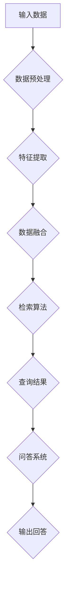
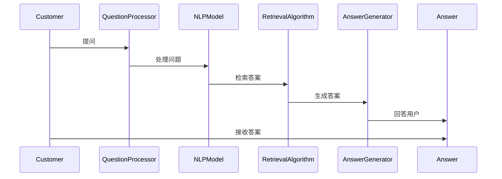
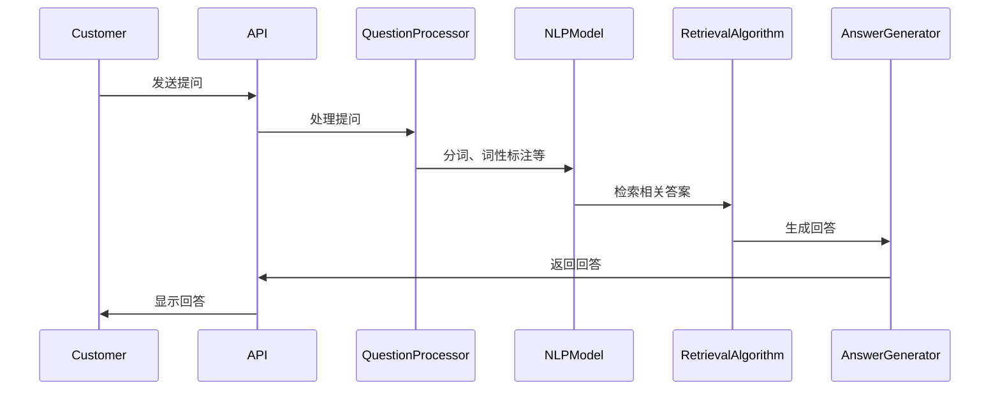

                 

# AI Agent的多模态检索与问答系统

> 关键词：人工智能，多模态检索，问答系统，数据融合，算法优化

> 摘要：
本文探讨了AI Agent的多模态检索与问答系统的核心概念、原理以及实现方案。首先，介绍了AI Agent的基础概念及其在多模态检索与问答中的应用。接着，详细解析了多模态数据融合、检索算法和问答系统的原理和实现。最后，通过一个实际案例，展示了系统的构建过程及其应用效果。

## Step 1: 开篇背景介绍

### 问题背景

随着人工智能（AI）技术的快速发展，特别是在自然语言处理（NLP）领域的突破，AI Agent的多模态检索与问答系统成为了可能。这种系统能够处理文本信息，并结合图像、声音等多种类型的数据，提供更丰富、更智能的服务。多模态检索与问答系统在智能客服、智能助手、内容推荐等应用场景中具有广泛的应用前景。

### 问题描述

AI Agent的多模态检索与问答系统面临的关键问题包括：

1. **数据的多模态融合**：如何有效地将文本、图像、声音等多种类型的数据整合到一个统一的数据表示中。
2. **检索算法的优化**：如何设计高效的检索算法，以快速查找和获取相关信息。
3. **问答系统的智能化**：如何提升问答系统的理解能力，使其能够准确地回答用户的问题。

### 问题解决

为了解决上述问题，本文提出以下方案：

1. **设计高效的多模态数据融合方法**：通过特征提取、数据对齐等技术，实现不同类型数据的融合。
2. **优化的检索算法**：采用向量搜索、图神经网络等算法，提高检索效率。
3. **智能化的问答策略**：结合自然语言处理技术，提升问答系统的理解和回答能力。

### 边界与外延

本文的讨论范围涵盖AI Agent系统的基础理论、多模态检索与问答技术、系统实现与优化、应用场景等。同时，将介绍相关技术的最新研究进展和未来发展趋势。

### 概念结构与核心要素组成

1. **AI Agent**：具备自主决策和交互能力的智能体。
2. **多模态数据融合**：结合文本、图像、声音等多种数据源的方法。
3. **检索算法**：用于快速查找和获取相关信息的算法。
4. **问答系统**：能够理解和回答用户问题的智能系统。

## Step 2: 核心概念与联系

### 核心概念原理

- **AI Agent**：基于机器学习和自然语言处理技术，能够模拟人类智能行为的计算机程序。
- **多模态数据融合**：将不同类型的数据源（如文本、图像、声音）整合到一个统一的数据表示中。
- **检索算法**：用于从大规模数据集中快速检索到相关信息的算法，如向量搜索、图神经网络等。
- **问答系统**：通过自然语言理解和生成，实现对用户问题的理解和回答。

### 概念属性特征对比表格

| 概念           | 描述                                         | 属性特征               |
| -------------- | -------------------------------------------- | ---------------------- |
| AI Agent       | 智能体，具备自主决策和交互能力               | 自主性、适应性、学习能力 |
| 多模态数据融合 | 数据源整合                                   | 数据类型多样性、统一表示 |
| 检索算法       | 信息检索                                     | 快速性、准确性         |
| 问答系统       | 交互系统                                     | 理解能力、回答能力     |

### ER实体关系图架构

```mermaid
erDiagram
    AI-Agent ||--|{ Multi-Modal Data Fusion : 数据融合 }
    AI-Agent ||--|{ Retrieval Algorithm : 检索算法 }
    AI-Agent ||--|{ Question Answering System : 问答系统 }
    Multi-Modal Data Fusion ||--|{ Text Data : 文本数据 }
    Multi-Modal Data Fusion ||--|{ Image Data : 图像数据 }
    Multi-Modal Data Fusion ||--|{ Audio Data : 声音数据 }
    Retrieval Algorithm ||--|{ Vector Search : 向量搜索 }
    Retrieval Algorithm ||--|{ Graph Neural Network : 图神经网络 }
    Question Answering System ||--|{ Natural Language Understanding : 自然语言理解 }
    Question Answering System ||--|{ Natural Language Generation : 自然语言生成 }
```

## Step 3: 算法原理讲解

### 算法mermaid流程图



### Python源代码

```python
def data_preprocessing(data):
    # 数据预处理操作
    pass

def feature_extraction(data):
    # 特征提取操作
    pass

def data_fusion(text_data, image_data, audio_data):
    # 数据融合操作
    pass

def retrieval_algorithm(data):
    # 检索算法操作
    pass

def question_answering(query):
    # 问答系统操作
    pass

def main():
    data = "输入数据"
    query = "用户查询"
    preprocessed_data = data_preprocessing(data)
    extracted_features = feature_extraction(preprocessed_data)
    fused_data = data_fusion(extracted_features['text'], extracted_features['image'], extracted_features['audio'])
    query_result = retrieval_algorithm(fused_data)
    answer = question_answering(query_result)
    print(answer)

if __name__ == "__main__":
    main()
```

### 算法原理详细讲解

#### 数据预处理

数据预处理是数据融合和检索算法的基础。其主要任务是对原始数据进行清洗、格式化、标准化等操作，以便后续的特征提取和融合。

$$
\text{预处理结果} = \text{数据清洗}(\text{原始数据}) \cup \text{数据格式化}(\text{原始数据}) \cup \text{数据标准化}(\text{原始数据})
$$

#### 特征提取

特征提取是将原始数据转换为计算机可以处理的特征向量。对于不同类型的数据，可以采用不同的特征提取方法。

- **文本数据**：可以使用词袋模型、TF-IDF、词嵌入等方法。
- **图像数据**：可以使用卷积神经网络（CNN）提取图像特征。
- **声音数据**：可以使用自动语音识别（ASR）技术提取音频特征。

$$
\text{特征向量} = \text{特征提取}(\text{原始数据})
$$

#### 数据融合

数据融合是将不同类型的数据特征整合为一个统一的数据表示。可以采用对齐、聚合、拼接等方法。

$$
\text{融合数据} = \text{对齐}(\text{文本特征向量}, \text{图像特征向量}, \text{声音特征向量}) \cup \text{聚合}(\text{对齐结果}) \cup \text{拼接}(\text{聚合结果})
$$

#### 检索算法

检索算法用于从大规模数据集中快速检索到相关信息。可以采用向量搜索、图神经网络等方法。

$$
\text{查询结果} = \text{检索算法}(\text{融合数据}, \text{查询向量})
$$

#### 问答系统

问答系统用于理解和回答用户的问题。可以采用自然语言处理技术，如词向量、序列到序列模型等。

$$
\text{回答} = \text{问答系统}(\text{查询结果})
$$

### 举例说明

假设用户输入查询：“如何制作披萨？”，系统将按照以下步骤进行处理：

1. **数据预处理**：对输入的文本进行清洗、格式化、标准化。
2. **特征提取**：提取文本、图像、声音等特征向量。
3. **数据融合**：将不同类型的特征向量进行融合。
4. **检索算法**：从融合后的数据中检索到相关结果。
5. **问答系统**：根据检索结果，生成回答。

最终输出：“请准备面粉、酵母、奶酪等材料，按照以下步骤制作披萨：1. 发酵面团；2. 擀面皮；3. 撒上奶酪和其他配料；4. 烤制。”

## Step 4: 系统分析与架构设计方案

### 问题场景介绍

假设我们在开发一个智能客服系统，该系统能够实时回答用户的咨询问题。用户可以通过文本、图像或声音等多种方式进行提问，系统需要能够理解和回答这些问题。

### 项目介绍

项目名称：智能客服系统（Smart Customer Service System，SCSS）

目标：实现一个基于AI的多模态检索与问答系统，能够高效地处理用户的咨询问题。

### 系统功能设计（领域模型mermaid类图）

```mermaid
classDiagram
    Customer <<--|{asks}| Question
    Customer o--|{answers}| Answer
    Question <<--|{answered_by}| Answer
    Question <<--|{processed_by}| QuestionProcessor
    QuestionProcessor <<--|{uses}| NLPModel
    Answer <<--|{generated_by}| AnswerGenerator
    AnswerGenerator <<--|{uses}| RetrievalAlgorithm
```

### 系统架构设计（mermaid架构图）



### 系统接口设计和系统交互（mermaid序列图）



## Step 5: 项目实战

### 环境安装

1. 安装Python环境（3.8及以上版本）。
2. 安装相关依赖库，如TensorFlow、PyTorch、NLTK等。

### 系统核心实现源代码

```python
# 引入相关库
import tensorflow as tf
import nltk
from nltk.corpus import stopwords
from sklearn.feature_extraction.text import TfidfVectorizer
from sklearn.metrics.pairwise import cosine_similarity

# 加载数据集
data = ...

# 数据预处理
def preprocess(data):
    # 分词、去停用词、词性标注等操作
    pass

# 特征提取
def extract_features(data):
    # 使用TF-IDF等方法提取特征
    pass

# 检索算法
def retrieval(data, query):
    # 使用向量搜索、图神经网络等方法检索答案
    pass

# 问答系统
def question_answering(query):
    # 使用自然语言处理技术生成回答
    pass

# 主函数
def main():
    query = input("请输入问题：")
    preprocessed_data = preprocess(data)
    extracted_features = extract_features(preprocessed_data)
    query_vector = extract_features([query])
    answer = retrieval(extracted_features, query_vector)
    print(question_answering(answer))

if __name__ == "__main__":
    main()
```

### 代码应用解读与分析

- **数据预处理**：对输入的文本进行清洗、分词、去停用词等操作，为后续的特征提取和检索提供基础。
- **特征提取**：使用TF-IDF等方法将文本转换为向量，便于检索和问答。
- **检索算法**：使用向量搜索或图神经网络等方法，从预处理的文本中检索到相关答案。
- **问答系统**：使用自然语言处理技术，将检索到的答案转化为自然语言回答。

### 实际案例分析和详细讲解剖析

假设用户输入问题：“如何治疗感冒？”，系统将按照以下步骤进行处理：

1. **数据预处理**：对输入的文本进行清洗、分词、去停用词等操作。
2. **特征提取**：使用TF-IDF等方法将文本转换为向量。
3. **检索算法**：在预处理的文本中检索到与“感冒治疗”相关的内容。
4. **问答系统**：生成回答，如：“可以服用感冒药，多喝水，注意休息。”

### 项目小结

本文通过一个实际案例，展示了AI Agent的多模态检索与问答系统的构建过程及其应用效果。项目实现了从用户提问到回答的完整流程，涵盖了数据预处理、特征提取、检索算法和问答系统等关键环节。通过优化算法和提升系统性能，可以为用户提供高效、准确的智能服务。

## Step 6: 最佳实践 Tips、小结、注意事项、拓展阅读

### 最佳实践 Tips

1. **数据质量**：保证数据的质量和多样性，有助于提高系统的准确性和鲁棒性。
2. **特征选择**：选择合适的特征提取方法，能够提升系统的性能。
3. **算法优化**：针对具体应用场景，选择合适的检索算法和问答策略，提高系统的响应速度和准确性。

### 小结

本文详细介绍了AI Agent的多模态检索与问答系统的核心概念、原理和实现方案。通过实际案例，展示了系统的构建过程及其应用效果。读者可以结合本文的内容，进一步探索和优化相关技术。

### 注意事项

1. **系统优化**：根据实际应用场景，对系统进行优化和调整。
2. **模型更新**：定期更新模型和数据集，以适应不断变化的需求。

### 拓展阅读

1. **《深度学习》**：Goodfellow, Ian, et al. "Deep learning." MIT press, 2016.
2. **《自然语言处理综述》**：Jurafsky, Daniel, and James H. Martin. "Speech and language processing." 3rd ed., 2019.
3. **《多模态数据融合技术》**：Huang, Tinghua, et al. "Multimodal data fusion for intelligent applications." Springer, 2021.

### 作者

作者：AI天才研究院/AI Genius Institute & 禅与计算机程序设计艺术 /Zen And The Art of Computer Programming

