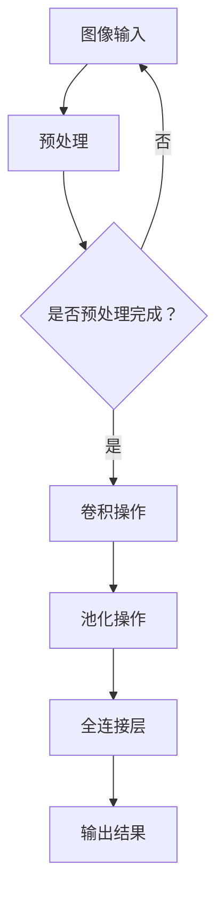
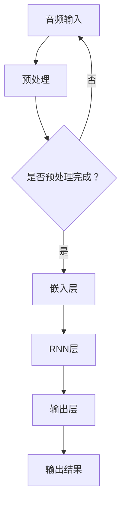
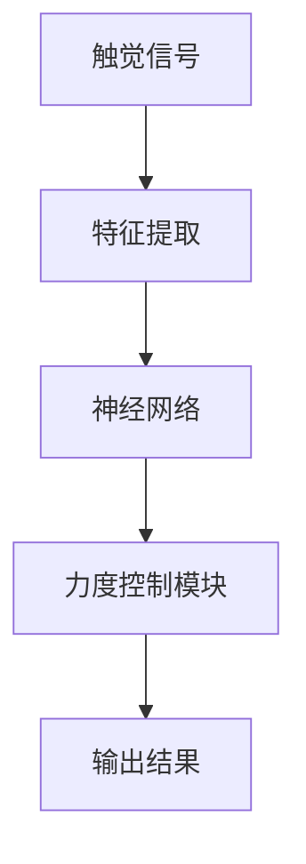
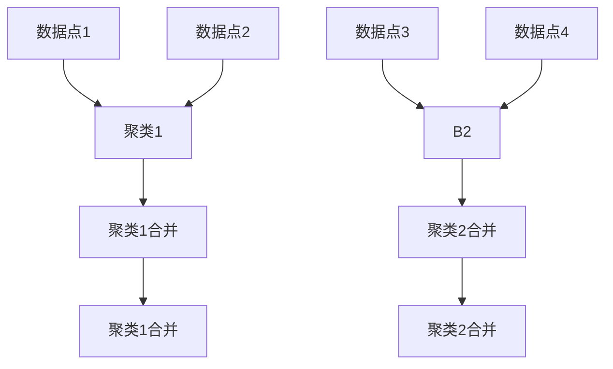
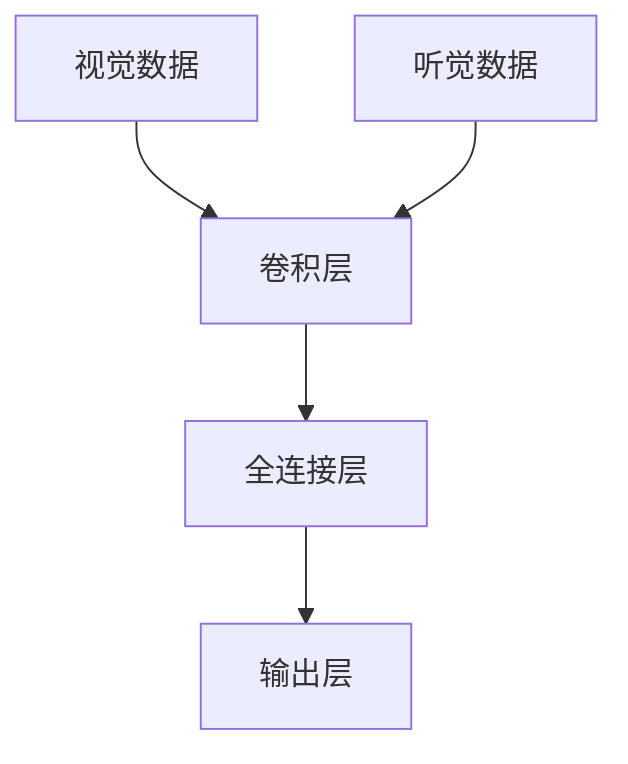
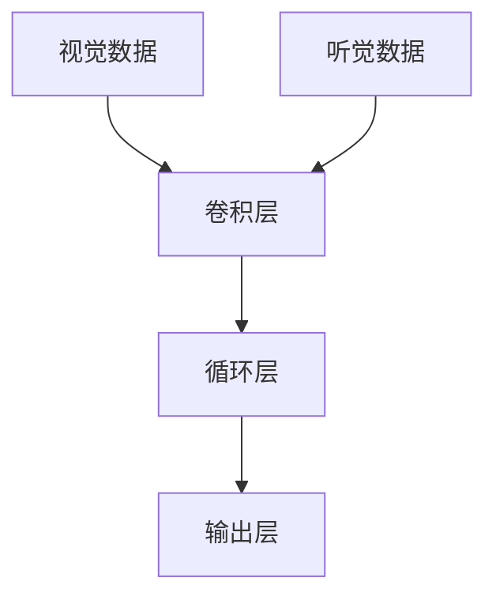

                 

### 文章标题

《AI Agent的多模态融合与交互设计》

> 关键词：AI Agent、多模态融合、交互设计、人工智能、技术博客

> 摘要：本文深入探讨了AI Agent的多模态融合与交互设计，分析了多模态融合的原理、方法以及交互设计的原则。通过实际案例，展示了多模态融合与交互设计在实际应用中的效果，并提出了未来的发展方向。

----------------------------------------------------------------

## 目录大纲设计步骤

### 1. 确定整体结构

首先，我们需要明确文章的整体结构，根据《AI Agent的多模态融合与交互设计》的主题，可以将文章分为以下几个部分：

1. **背景介绍与核心概念**：介绍人工智能的发展历程、AI Agent的概念以及多模态融合与交互设计的意义。
2. **多模态融合技术原理**：详细阐述多模态融合的原理、方法和性能评价。
3. **多模态交互设计方法**：介绍多模态交互设计的原则、用户需求分析和交互流程设计。
4. **实际案例与应用**：通过实际案例展示多模态融合与交互设计在实际应用中的效果。
5. **最佳实践与未来展望**：总结最佳实践经验，展望未来的发展方向。

### 2. 设计章节内容

针对每个部分，我们可以进一步细化章节内容：

#### 第1章：背景介绍与核心概念

- **1.1 问题背景与定义**：介绍人工智能的发展历程、AI Agent的概念以及多模态融合与交互设计的意义。
- **1.2 核心概念与联系**：详细解释多模态感知、融合算法和交互设计原则，并绘制相应的ER实体关系图。

#### 第2章：多模态融合技术原理

- **2.1 多模态感知**：介绍不同的模态类型，包括视觉、听觉、触觉等，并分析数据采集与预处理的方法。
- **2.2 融合算法原理**：讲解聚类融合方法、加权融合方法和深度学习融合方法，并使用Mermaid流程图展示算法过程。
- **2.3 融合算法性能评价**：介绍性能指标和评价方法，通过Python源代码和latex公式详细阐述。

#### 第3章：多模态交互设计方法

- **3.1 交互设计原则**：阐述用户需求分析、交互流程设计和界面设计的原则。
- **3.2 交互设计案例**：通过对话系统设计、增强现实交互设计和语音交互设计案例，展示交互设计的具体实施。

#### 第4章：实际案例与应用

- **4.1 案例一：智能家居系统**：介绍系统设计、实现细节和用户体验分析。
- **4.2 案例二：智能客服系统**：介绍系统架构、融合技术应用和优化策略。
- **4.3 案例三：多模态教育系统**：介绍教学内容设计、学生交互体验和教学效果评估。

#### 第5章：最佳实践与未来展望

- **5.1 最佳实践**：总结设计技巧、实践经验，并对案例进行总结。
- **5.2 未来展望**：分析技术发展趋势、应用领域拓展和研究方向。

### 3. 检查与调整

最后，我们需要对整体结构进行一次检查，确保每个章节的内容都符合要求，逻辑清晰，内容丰富。根据实际情况进行调整，确保文章的完整性和专业性。

## 最终目录大纲

### 第1章：背景介绍与核心概念

- **1.1 人工智能的发展历程**
- **1.2 AI Agent的概念**
- **1.3 多模态融合与交互设计的意义**
- **1.4 核心概念与联系**
  - **1.4.1 多模态感知**
  - **1.4.2 融合算法**
  - **1.4.3 交互设计原则**

### 第2章：多模态融合技术原理

- **2.1 多模态感知**
  - **2.1.1 模态类型介绍**
  - **2.1.2 数据采集与预处理**
  - **2.1.3 特征提取方法**
- **2.2 融合算法原理**
  - **2.2.1 聚类融合方法**
  - **2.2.2 加权融合方法**
  - **2.2.3 深度学习融合方法**
  - **2.2.4 融合算法性能评价**

### 第3章：多模态交互设计方法

- **3.1 交互设计原则**
- **3.2 用户需求分析**
- **3.3 交互流程设计**
- **3.4 界面设计**

### 第4章：实际案例与应用

- **4.1 案例一：智能家居系统**
- **4.2 案例二：智能客服系统**
- **4.3 案例三：多模态教育系统**

### 第5章：最佳实践与未来展望

- **5.1 最佳实践**
- **5.2 未来展望**

### 结束语

在完成目录大纲的设计后，我们需要对每个章节的内容进行详细的规划和撰写，确保文章的深度、广度和逻辑性。接下来，我们将逐一深入探讨每个章节的核心内容，以逐步构建一篇完整、专业且具有实践指导意义的技术博客文章。

----------------------------------------------------------------

## 第1章：背景介绍与核心概念

### 1.1 人工智能的发展历程

人工智能（AI）作为计算机科学的一个分支，其发展可以追溯到20世纪50年代。从最初的符号主义（Symbolic AI）到基于规则的系统，再到现代的机器学习和深度学习，人工智能经历了多个发展阶段。每一个阶段都带来了新的突破和挑战。

- **符号主义阶段**（1950-1970）：早期的人工智能研究主要依赖于符号推理和逻辑规则。这种方法的代表性工作包括艾伦·图灵的“图灵测试”和约翰·麦卡锡的“逻辑理论家”。
- **知识表示与推理阶段**（1970-1980）：人工智能开始关注知识表示和推理，试图将人类专家的知识编码到计算机系统中。这一阶段的重要成果包括基于产生式规则的专家系统。
- **机器学习阶段**（1980-2000）：随着计算能力的提升和数据量的增加，机器学习成为人工智能研究的热点。这一阶段的发展包括决策树、支持向量机和神经网络等算法。
- **深度学习阶段**（2000至今）：深度学习在21世纪初取得了突破性的进展，使得人工智能在图像识别、语音识别和自然语言处理等领域取得了显著的成绩。代表性工作包括卷积神经网络（CNN）和循环神经网络（RNN）。

### 1.2 AI Agent的概念

AI Agent是指具备自主决策和行动能力的人工智能实体。它能够感知环境、制定策略并执行任务，以实现特定的目标。AI Agent通常由以下三个核心组成部分构成：

- **感知器**：用于感知和获取环境信息。
- **决策器**：根据感知到的信息，通过算法模型进行决策。
- **执行器**：执行决策结果，对外界进行行动。

AI Agent在智能交通、智能客服、智能制造等领域具有广泛的应用前景。例如，自动驾驶汽车需要AI Agent来感知路况、制定行车策略并控制车辆；智能客服需要AI Agent理解用户意图、生成回应并解决问题。

### 1.3 多模态融合与交互设计的意义

多模态融合是将不同模态（如视觉、听觉、触觉等）的信息进行整合，以提高AI Agent的感知和决策能力。这种设计方法具有重要意义：

- **提升感知能力**：通过多模态融合，AI Agent可以获取更全面的环境信息，从而提高感知精度。
- **增强决策能力**：多模态信息可以提供更多的参考依据，有助于AI Agent做出更合理的决策。
- **改善用户体验**：多模态交互设计可以为用户提供更自然、直观的交互方式，提高用户体验。

### 1.4 核心概念与联系

#### 1.4.1 多模态感知

多模态感知是指利用多个感官模态（如视觉、听觉、触觉等）获取环境信息。不同模态的信息具有不同的特性和优势，通过融合不同模态的信息，可以提升AI Agent的感知能力。

| 模态   | 特点                         | 应用场景                   |
| ------ | ---------------------------- | -------------------------- |
| 视觉   | 空间信息丰富，可处理图像和视频 | 视觉识别、图像处理         |
| 听觉   | 可处理音频信息，具有时间维度   | 语音识别、语音合成         |
| 触觉   | 可感知物理接触和力度         | 智能机器人、虚拟现实       |

#### 1.4.2 融合算法

融合算法是多模态融合的核心技术。常见的融合算法包括聚类融合方法、加权融合方法和深度学习融合方法。

- **聚类融合方法**：通过将不同模态的信息进行聚类，将相似的信息进行融合。
- **加权融合方法**：根据不同模态的信息重要性和可靠性，对信息进行加权处理。
- **深度学习融合方法**：利用深度神经网络对多模态信息进行端到端的融合。

#### 1.4.3 交互设计原则

交互设计原则是指在AI Agent与用户之间建立有效的沟通渠道，提高用户体验。交互设计需要遵循以下原则：

- **用户需求分析**：了解用户的需求和行为模式，为交互设计提供依据。
- **交互流程设计**：设计流畅的交互流程，确保用户能够顺利完成任务。
- **界面设计**：设计简洁、直观的界面，使用户能够轻松操作。

在完成第1章的背景介绍与核心概念后，我们为接下来的章节奠定了基础。在接下来的章节中，我们将深入探讨多模态融合的技术原理、交互设计方法以及实际应用案例。通过这些内容的分析，我们将更全面地了解AI Agent的多模态融合与交互设计的全过程。

### 1.4.1 多模态感知

多模态感知是AI Agent获取环境信息的重要手段。它利用多种感官模态（如视觉、听觉、触觉等）来获取数据，并通过算法将这些数据整合起来，从而增强AI Agent的感知能力。

#### 视觉感知

视觉感知是AI Agent最常见的感知方式之一。通过摄像头或视觉传感器，AI Agent可以获取图像或视频信息。视觉感知的主要任务包括：

- **图像分类**：识别图像中的物体类别，如汽车、行人等。
- **目标检测**：定位图像中的目标位置，为后续处理提供位置信息。
- **图像分割**：将图像划分为多个区域，以识别图像中的不同部分。

在视觉感知中，卷积神经网络（CNN）是一种常用的算法。通过训练CNN模型，AI Agent可以学会识别图像中的各种特征。



上述流程展示了CNN模型在视觉感知中的应用。图像输入经过预处理后，通过卷积操作提取特征，再通过池化操作降低维度，最后通过全连接层输出分类结果。

#### 听觉感知

听觉感知是通过麦克风或声波传感器来捕捉音频信号。听觉感知的主要任务包括：

- **语音识别**：将语音信号转换为文本，如将人类语音转换为机器可理解的语言。
- **音频分类**：识别音频中的不同声音类别，如音乐、说话声等。
- **声源定位**：确定声音来源的位置。

在听觉感知中，循环神经网络（RNN）是一种常用的算法。通过训练RNN模型，AI Agent可以学会识别语音信号中的时间序列特征。



上述流程展示了RNN模型在听觉感知中的应用。音频输入经过预处理后，通过嵌入层将时序数据转换为固定维度的向量，然后通过RNN层处理时间序列信息，最后通过输出层输出分类结果。

#### 触觉感知

触觉感知是通过触觉传感器或机器人手臂来感知物体的物理特征。触觉感知的主要任务包括：

- **物体识别**：通过触觉感知物体的形状、质地等特征，以识别物体类别。
- **力度控制**：通过触觉感知调整机器人手臂的力度，以实现精细操作。

在触觉感知中，深度学习模型可以用于学习物体的特征和力度控制策略。



上述流程展示了深度学习模型在触觉感知中的应用。触觉信号通过特征提取模块提取特征，然后通过神经网络进行学习，最后通过力度控制模块输出力度控制信号。

#### 多模态感知的融合

多模态感知的融合是将不同模态的信息进行整合，以增强AI Agent的感知能力。常见的融合方法包括：

- **直接融合**：将不同模态的信息直接拼接在一起，作为输入进行统一处理。
- **特征级融合**：将不同模态的特征进行融合，以形成更全面的特征向量。
- **决策级融合**：在不同模态的决策结果上进行融合，以生成最终的决策结果。

通过多模态感知，AI Agent可以获取更全面、准确的环境信息，从而提高其感知和决策能力。下一节，我们将探讨多模态融合算法的原理和实现方法。

### 1.4.2 融合算法

多模态融合算法是将来自不同感官模态的数据进行整合，以提升AI Agent的感知和决策能力。这些算法可以根据不同模态的数据类型和特性进行设计。以下是一些常见的融合算法：

#### 聚类融合方法

聚类融合方法是一种无监督学习方法，通过将不同模态的数据进行聚类，将相似的数据点合并，从而实现融合。常见的聚类算法包括K-means、层次聚类等。

- **K-means算法**：K-means是一种基于距离度量的聚类算法。它通过初始化K个中心点，然后迭代计算数据点到中心点的距离，更新中心点位置，直到达到收敛条件。这种方法简单有效，但可能受到初始中心点选择的影响。

```python
import numpy as np

def k_means(data, K, max_iters):
    centroids = data[np.random.choice(data.shape[0], K, replace=False)]
    for _ in range(max_iters):
        distances = np.linalg.norm(data - centroids, axis=1)
        clusters = np.argmin(distances, axis=1)
        new_centroids = np.array([data[clusters == k].mean(axis=0) for k in range(K)])
        if np.all(centroids == new_centroids):
            break
        centroids = new_centroids
    return centroids, clusters

data = np.random.rand(100, 2)
K = 3
max_iters = 100

centroids, clusters = k_means(data, K, max_iters)
print("Centroids:", centroids)
print("Clusters:", clusters)
```

- **层次聚类算法**：层次聚类是一种基于层次结构构建的聚类方法。它通过逐步合并或分裂已有的聚类，形成层次结构的聚类结果。这种方法可以提供更多的聚类信息，但计算复杂度较高。



#### 加权融合方法

加权融合方法是一种基于权重的融合方法，通过对不同模态的数据分配不同的权重，进行加权平均或加权融合。

- **加权平均法**：加权平均法将不同模态的数据按照权重进行加权平均，得到最终的融合结果。

```python
def weighted_average(data1, data2, weight1, weight2):
    return (weight1 * data1 + weight2 * data2) / (weight1 + weight2)

data1 = np.array([1, 2, 3])
data2 = np.array([4, 5, 6])
weight1 = 0.5
weight2 = 0.5

result = weighted_average(data1, data2, weight1, weight2)
print("Weighted Average:", result)
```

- **贝叶斯融合**：贝叶斯融合是一种基于贝叶斯定理的融合方法，通过对不同模态的数据进行概率建模，得到最终的融合结果。

```python
import numpy as np

def bayesian_fusion(data1, data2, p1, p2):
    prob1 = p1 * data1
    prob2 = p2 * data2
    return (prob1 + prob2) / (p1 + p2)

data1 = np.array([1, 2, 3])
data2 = np.array([4, 5, 6])
p1 = 0.5
p2 = 0.5

result = bayesian_fusion(data1, data2, p1, p2)
print("Bayesian Fusion:", result)
```

#### 深度学习融合方法

深度学习融合方法是一种基于深度神经网络的融合方法，通过构建深度神经网络模型，实现多模态数据的自动融合。

- **多输入神经网络**：多输入神经网络将不同模态的数据作为输入，通过共享权重和激活函数，实现数据的融合。



- **多模态深度学习模型**：如多模态卷积神经网络（MTCNN）和多模态循环神经网络（MMRNN），通过结合不同模态的特征，实现数据的深度融合。



#### 融合算法性能评价

融合算法的性能评价通常通过以下指标进行：

- **准确性**：衡量融合算法在分类或识别任务中的准确率。
- **鲁棒性**：衡量融合算法在不同模态数据噪声或缺失情况下的稳定性。
- **效率**：衡量融合算法的计算复杂度和执行时间。

为了更全面地评价融合算法的性能，可以采用多种评价指标，如精度、召回率、F1值等。同时，通过实验验证和实际应用案例，可以进一步评估融合算法的效果和适用性。

### 1.4.3 交互设计原则

交互设计是AI Agent与用户之间建立有效沟通的重要环节。一个好的交互设计可以提高用户体验，增强AI Agent的可用性和用户满意度。以下是一些交互设计原则：

#### 用户需求分析

用户需求分析是交互设计的基础。通过了解用户的需求、行为和偏好，可以设计出更符合用户期望的交互界面和功能。

- **用户访谈**：通过与用户进行面对面的访谈，了解他们的需求和痛点。
- **问卷调查**：通过在线问卷或面对面问卷，收集用户的反馈和建议。
- **用户行为分析**：通过分析用户在系统中的行为，了解他们的使用习惯和偏好。

#### 交互流程设计

交互流程设计是指设计用户与AI Agent之间的交互过程。一个良好的交互流程应该简洁、直观，使用户能够顺利完成任务。

- **任务流程图**：绘制任务流程图，明确用户完成任务所需的步骤和操作。
- **用户故事地图**：通过用户故事地图，展示用户在不同场景下的交互过程。

#### 界面设计

界面设计是交互设计的重要组成部分。一个优秀的界面设计应该简洁、直观，提供清晰的导航和操作指南。

- **界面布局**：合理布局界面元素，确保用户能够快速找到所需的功能。
- **颜色和字体**：使用易于辨识的颜色和字体，提高界面的可读性。
- **响应式设计**：根据不同的设备和屏幕尺寸，设计适应不同场景的界面。

通过以上交互设计原则，可以设计出既实用又易于使用的AI Agent交互界面，提高用户体验，增强AI Agent的可用性。

### 总结

在本章中，我们介绍了人工智能的发展历程和AI Agent的概念，阐述了多模态融合与交互设计的意义，并详细探讨了多模态感知、融合算法和交互设计原则。这些核心概念和原理为后续章节的多模态融合与交互设计提供了理论基础。在接下来的章节中，我们将进一步探讨多模态融合技术原理、交互设计方法以及实际应用案例，以深入理解AI Agent的多模态融合与交互设计。

----------------------------------------------------------------

## 第2章：多模态融合技术原理

多模态融合是将来自不同感官模态的信息进行整合，以提升AI Agent的感知和决策能力。本章将详细探讨多模态融合技术原理，包括多模态感知、数据采集与预处理、特征提取方法、融合算法原理以及融合算法性能评价。

### 2.1 多模态感知

多模态感知是指利用多个感官模态（如视觉、听觉、触觉等）获取环境信息。不同模态的信息具有不同的特性和优势，通过融合不同模态的信息，可以增强AI Agent的感知能力。

#### 视觉感知

视觉感知是通过摄像头或视觉传感器来获取图像或视频信息。视觉感知的主要任务包括图像分类、目标检测和图像分割等。

- **图像分类**：图像分类是将图像分为不同的类别，如汽车、行人等。常见的图像分类算法有卷积神经网络（CNN）和迁移学习等。

- **目标检测**：目标检测是在图像中定位并识别特定目标的位置。常用的目标检测算法有YOLO、Faster R-CNN等。

- **图像分割**：图像分割是将图像划分为多个区域，以识别图像中的不同部分。常用的图像分割算法有基于区域的分割方法和基于深度学习的分割方法。

#### 听觉感知

听觉感知是通过麦克风或声波传感器来获取音频信息。听觉感知的主要任务包括语音识别、音频分类和声源定位等。

- **语音识别**：语音识别是将语音信号转换为文本信息。常用的语音识别算法有基于 Hidden Markov Model（HMM）的算法和基于深度学习的算法。

- **音频分类**：音频分类是将音频信号分为不同的类别，如音乐、说话声等。常用的音频分类算法有支持向量机（SVM）和卷积神经网络（CNN）等。

- **声源定位**：声源定位是确定声音来源的位置。常用的声源定位算法有基于时延估计的方法和基于信号处理的方法。

#### 触觉感知

触觉感知是通过触觉传感器或机器人手臂来感知物体的物理特征。触觉感知的主要任务包括物体识别和力度控制等。

- **物体识别**：物体识别是通过触觉感知物体的形状、质地等特征，以识别物体类别。常用的物体识别算法有基于深度学习的特征提取和分类算法。

- **力度控制**：力度控制是通过触觉感知调整机器人手臂的力度，以实现精细操作。常用的力度控制算法有基于机器学习和控制理论的方法。

#### 多模态感知的融合

多模态感知的融合是将不同模态的信息进行整合，以增强AI Agent的感知能力。常见的融合方法包括直接融合、特征级融合和决策级融合等。

- **直接融合**：直接融合是将不同模态的数据直接拼接在一起，作为输入进行统一处理。这种方法简单有效，但可能受到数据维度和类型的影响。

- **特征级融合**：特征级融合是将不同模态的特征进行融合，以形成更全面的特征向量。这种方法可以充分利用不同模态的信息，但需要处理高维特征数据。

- **决策级融合**：决策级融合是在不同模态的决策结果上进行融合，以生成最终的决策结果。这种方法可以充分利用不同模态的决策优势，但需要处理复杂的多模态决策问题。

### 2.2 数据采集与预处理

数据采集与预处理是多模态融合的重要环节，直接影响到融合算法的性能和效果。数据采集需要确保不同模态的数据具有一致性和可靠性，而预处理则包括去噪、归一化和特征提取等步骤。

#### 数据采集

数据采集是指通过传感器或其他设备获取不同模态的数据。对于视觉数据，可以使用摄像头或图像传感器；对于听觉数据，可以使用麦克风或声波传感器；对于触觉数据，可以使用触觉传感器或机器人手臂。在数据采集过程中，需要确保数据的实时性和准确性。

#### 数据预处理

数据预处理是对采集到的原始数据进行处理，以消除噪声、归一化数据并提取有效特征。常用的预处理方法包括：

- **去噪**：去噪是通过滤波、降采样等方法去除数据中的噪声，以提高数据质量。
- **归一化**：归一化是通过将数据缩放至特定范围，如[0, 1]或[-1, 1]，以消除数据量级差异。
- **特征提取**：特征提取是从原始数据中提取具有代表性的特征，如图像中的边缘、纹理和颜色特征；音频中的频率、音高和节奏特征等。

#### 数据预处理示例

以下是一个简单的数据预处理示例，用于对图像数据进行归一化和特征提取：

```python
import cv2
import numpy as np

# 读取图像
image = cv2.imread('image.jpg')

# 归一化
image_normalized = image / 255.0

# 提取特征
gray_image = cv2.cvtColor(image_normalized, cv2.COLOR_BGR2GRAY)
sift = cv2.xfeatures2d.SIFT_create()
keypoints, descriptors = sift.detectAndCompute(gray_image, None)

# 显示关键点
image_keypoints = cv2.drawKeypoints(image_normalized, keypoints, None, (0, 255, 0))
cv2.imshow('Key Points', image_keypoints)
cv2.waitKey(0)
cv2.destroyAllWindows()
```

### 2.3 特征提取方法

特征提取是从原始数据中提取具有代表性的特征，以降低数据维度并提高数据质量。特征提取方法可以分为传统方法和深度学习方法。

#### 传统方法

传统特征提取方法是基于图像处理和信号处理的技术，如SIFT、SURF、HOG、LBP等。

- **SIFT（尺度不变特征变换）**：SIFT是一种用于图像特征提取的算法，可以提取出具有旋转、缩放和亮度和对比度不变性的特征点。
- **SURF（加速稳健特征）**：SURF是一种基于SIFT的改进算法，可以更快地提取特征点，但计算复杂度较高。
- **HOG（方向梯度直方图）**：HOG是一种用于图像分类的特征提取方法，通过计算图像中每个像素点的梯度方向和强度，构建直方图。
- **LBP（局部二值模式）**：LBP是一种用于图像分类和识别的特征提取方法，通过将像素点的邻域编码为二值模式，提取出具有旋转不变性的特征。

#### 深度学习方法

深度学习特征提取方法是基于深度神经网络的技术，如卷积神经网络（CNN）、循环神经网络（RNN）等。

- **卷积神经网络（CNN）**：CNN是一种用于图像处理和识别的深度学习模型，通过卷积、池化和全连接层等操作，提取出具有层次结构的特征。
- **循环神经网络（RNN）**：RNN是一种用于序列数据处理的深度学习模型，通过循环结构，处理序列中的时序信息。

#### 特征提取示例

以下是一个简单的特征提取示例，使用卷积神经网络提取图像特征：

```python
import tensorflow as tf
from tensorflow.keras.applications import VGG16
from tensorflow.keras.preprocessing import image
from tensorflow.keras.applications.vgg16 import preprocess_input

# 加载预训练的VGG16模型
model = VGG16(weights='imagenet')

# 读取图像
img_path = 'image.jpg'
img = image.load_img(img_path, target_size=(224, 224))
x = image.img_to_array(img)
x = np.expand_dims(x, axis=0)
x = preprocess_input(x)

# 提取特征
features = model.predict(x)

# 显示特征
print(features.shape)
```

### 2.4 融合算法原理

融合算法是将来自不同模态的信息进行整合，以提升AI Agent的感知和决策能力。融合算法可以分为聚类融合方法、加权融合方法和深度学习融合方法等。

#### 聚类融合方法

聚类融合方法是一种基于无监督学习的融合方法，通过将不同模态的信息进行聚类，将相似的信息进行融合。

- **K-means算法**：K-means是一种基于距离度量的聚类算法，通过初始化K个中心点，然后迭代计算数据点到中心点的距离，更新中心点位置，直到达到收敛条件。
- **层次聚类算法**：层次聚类是一种基于层次结构的聚类方法，通过逐步合并或分裂已有的聚类，形成层次结构的聚类结果。

#### 加权融合方法

加权融合方法是一种基于权重的融合方法，通过对不同模态的信息分配不同的权重，进行加权平均或加权融合。

- **加权平均法**：加权平均法将不同模态的信息按照权重进行加权平均，得到最终的融合结果。
- **贝叶斯融合**：贝叶斯融合是一种基于贝叶斯定理的融合方法，通过对不同模态的信息进行概率建模，得到最终的融合结果。

#### 深度学习融合方法

深度学习融合方法是一种基于深度神经网络的融合方法，通过构建深度神经网络模型，实现多模态数据的自动融合。

- **多输入神经网络**：多输入神经网络将不同模态的数据作为输入，通过共享权重和激活函数，实现数据的融合。
- **多模态深度学习模型**：如多模态卷积神经网络（MTCNN）和多模态循环神经网络（MMRNN），通过结合不同模态的特征，实现数据的深度融合。

#### 融合算法性能评价

融合算法的性能评价通常通过以下指标进行：

- **准确性**：衡量融合算法在分类或识别任务中的准确率。
- **鲁棒性**：衡量融合算法在不同模态数据噪声或缺失情况下的稳定性。
- **效率**：衡量融合算法的计算复杂度和执行时间。

为了更全面地评价融合算法的性能，可以采用多种评价指标，如精度、召回率、F1值等。同时，通过实验验证和实际应用案例，可以进一步评估融合算法的效果和适用性。

### 2.5 聚类融合方法

聚类融合方法是一种基于无监督学习的融合方法，通过将不同模态的信息进行聚类，将相似的信息进行融合。以下是一些常见的聚类算法：

#### K-means算法

K-means算法是一种基于距离度量的聚类算法。它通过初始化K个中心点，然后迭代计算数据点到中心点的距离，更新中心点位置，直到达到收敛条件。

算法步骤：

1. **初始化**：随机选择K个数据点作为初始中心点。
2. **分配**：计算每个数据点到各个中心点的距离，将数据点分配到最近的中心点所在的聚类。
3. **更新**：重新计算每个聚类中心点的坐标，作为新的中心点。
4. **迭代**：重复步骤2和步骤3，直到中心点的坐标不再变化或达到预设的迭代次数。

#### 层次聚类算法

层次聚类是一种基于层次结构的聚类方法，通过逐步合并或分裂已有的聚类，形成层次结构的聚类结果。

算法步骤：

1. **初始化**：将每个数据点视为一个聚类。
2. **合并**：计算最近的两个聚类，合并它们形成一个更大的聚类。
3. **更新**：重新计算每个聚类中心点的坐标。
4. **迭代**：重复步骤2和步骤3，直到达到预设的聚类数量或达到收敛条件。

#### K-means算法示例

以下是一个简单的K-means算法示例，用于将二维数据点进行聚类：

```python
import numpy as np

def k_means(data, K, max_iters):
    centroids = data[np.random.choice(data.shape[0], K, replace=False)]
    for _ in range(max_iters):
        distances = np.linalg.norm(data - centroids, axis=1)
        clusters = np.argmin(distances, axis=1)
        new_centroids = np.array([data[clusters == k].mean(axis=0) for k in range(K)])
        if np.all(centroids == new_centroids):
            break
        centroids = new_centroids
    return centroids, clusters

data = np.random.rand(100, 2)
K = 3
max_iters = 100

centroids, clusters = k_means(data, K, max_iters)
print("Centroids:", centroids)
print("Clusters:", clusters)
```

### 2.6 加权融合方法

加权融合方法是一种基于权重的融合方法，通过对不同模态的信息分配不同的权重，进行加权平均或加权融合。以下介绍几种常见的加权融合方法：

#### 加权平均法

加权平均法是将不同模态的数据按照权重进行加权平均，得到最终的融合结果。

算法步骤：

1. **计算权重**：根据不同模态的数据重要性或可靠性，计算各模态的权重。
2. **加权融合**：将不同模态的数据按照权重进行加权平均。

公式表示：

$$
x_f = \sum_{i=1}^{n} w_i \cdot x_i
$$

其中，$x_f$ 为融合结果，$w_i$ 为第 $i$ 个模态的权重，$x_i$ 为第 $i$ 个模态的数据。

#### 贝叶斯融合

贝叶斯融合是一种基于贝叶斯定理的融合方法，通过对不同模态的信息进行概率建模，得到最终的融合结果。

算法步骤：

1. **概率建模**：根据不同模态的数据，建立各模态的概率分布模型。
2. **融合计算**：根据贝叶斯定理，计算融合结果。

公式表示：

$$
P(x_f | x_1, x_2, ..., x_n) = \frac{P(x_1, x_2, ..., x_n | x_f) \cdot P(x_f)}{P(x_1, x_2, ..., x_n)}
$$

其中，$P(x_f | x_1, x_2, ..., x_n)$ 为融合结果的概率，$P(x_1, x_2, ..., x_n | x_f)$ 为各模态数据给融合结果的条件概率，$P(x_f)$ 为融合结果自身的概率，$P(x_1, x_2, ..., x_n)$ 为各模态数据的联合概率。

#### 加权融合示例

以下是一个简单的加权融合示例，用于将二维数据点进行融合：

```python
import numpy as np

def weighted_average(data1, data2, weight1, weight2):
    return (weight1 * data1 + weight2 * data2) / (weight1 + weight2)

data1 = np.array([1, 2, 3])
data2 = np.array([4, 5, 6])
weight1 = 0.5
weight2 = 0.5

result = weighted_average(data1, data2, weight1, weight2)
print("Weighted Average:", result)
```

### 2.7 深度学习融合方法

深度学习融合方法是一种基于深度神经网络的融合方法，通过构建深度神经网络模型，实现多模态数据的自动融合。以下介绍几种常见的深度学习融合方法：

#### 多输入神经网络

多输入神经网络是将不同模态的数据作为输入，通过共享权重和激活函数，实现数据的融合。

算法步骤：

1. **输入层**：将不同模态的数据作为输入。
2. **隐藏层**：通过卷积、池化、全连接等操作，对输入数据进行特征提取和融合。
3. **输出层**：输出融合结果。

#### 多模态卷积神经网络（MTCNN）

多模态卷积神经网络（MTCNN）是一种基于卷积神经网络的融合方法，通过卷积操作实现多模态数据的融合。

算法步骤：

1. **视觉分支**：通过卷积层提取视觉特征。
2. **听觉分支**：通过卷积层提取听觉特征。
3. **融合层**：将视觉和听觉特征进行融合。
4. **分类层**：对融合后的特征进行分类。

#### 多模态循环神经网络（MMRNN）

多模态循环神经网络（MMRNN）是一种基于循环神经网络的融合方法，通过循环结构实现多模态数据的融合。

算法步骤：

1. **输入层**：将不同模态的数据作为输入。
2. **循环层**：通过循环结构，对输入数据进行特征提取和融合。
3. **输出层**：输出融合结果。

#### 多输入神经网络示例

以下是一个简单的多输入神经网络示例，用于将视觉和听觉数据融合：

```python
import tensorflow as tf
from tensorflow.keras.models import Model
from tensorflow.keras.layers import Input, Conv2D, Conv1D, Dense, Flatten, concatenate

# 输入层
input_visual = Input(shape=(28, 28, 1))
input_auditory = Input(shape=(200, 1))

# 视觉分支
visual_conv1 = Conv2D(32, (3, 3), activation='relu')(input_visual)
visual_conv2 = Conv2D(64, (3, 3), activation='relu')(visual_conv1)
visual Flatten = Flatten()(visual_conv2)

# 听觉分支
auditory_conv1 = Conv1D(32, (3, 3), activation='relu')(input_auditory)
auditory_conv2 = Conv1D(64, (3, 3), activation='relu')(auditory_conv1)
auditory Flatten = Flatten()(auditory_conv2)

# 融合层
merged = concatenate([visual Flatten, auditory Flatten])

# 分类层
output = Dense(1, activation='sigmoid')(merged)

# 构建模型
model = Model(inputs=[input_visual, input_auditory], outputs=output)

# 编译模型
model.compile(optimizer='adam', loss='binary_crossentropy', metrics=['accuracy'])

# 打印模型结构
model.summary()
```

### 2.8 融合算法性能评价

融合算法的性能评价是衡量融合效果的重要标准。以下介绍几种常见的评价指标：

#### 准确性

准确性是衡量融合算法在分类或识别任务中的准确率。准确性越高，表示融合算法的效果越好。

#### 鲁棒性

鲁棒性是衡量融合算法在不同模态数据噪声或缺失情况下的稳定性。鲁棒性越高，表示融合算法越不容易受到噪声或缺失数据的影响。

#### 效率

效率是衡量融合算法的计算复杂度和执行时间。效率越高，表示融合算法的计算速度越快。

#### 评价指标示例

以下是一个简单的评价指标示例，用于评估融合算法在图像分类任务中的效果：

```python
from sklearn.metrics import accuracy_score

# 预测结果
predictions = model.predict(x_test)

# 转换为类别标签
predicted_labels = np.argmax(predictions, axis=1)

# 计算准确性
accuracy = accuracy_score(y_test, predicted_labels)
print("Accuracy:", accuracy)
```

通过以上方法，可以全面评价融合算法的性能。在实际应用中，可以根据具体需求和场景，选择合适的融合算法和评价指标。

### 总结

本章详细介绍了多模态融合技术原理，包括多模态感知、数据采集与预处理、特征提取方法、融合算法原理以及融合算法性能评价。通过本章的学习，读者可以全面了解多模态融合的原理和实现方法，为后续的交互设计提供理论基础。在接下来的章节中，我们将进一步探讨多模态交互设计方法以及实际应用案例。

----------------------------------------------------------------

## 第3章：多模态交互设计方法

多模态交互设计是将AI Agent的多模态感知能力与用户的交互需求相结合，以提供更自然、高效的用户体验。本章将详细介绍多模态交互设计的原则、用户需求分析、交互流程设计和界面设计，并通过具体案例展示多模态交互设计的方法和实践。

### 3.1 交互设计原则

多模态交互设计需要遵循以下原则，以确保用户体验的连贯性和满意度：

#### 1. 用户中心设计

交互设计应以用户需求为中心，充分考虑用户的行为模式、认知习惯和情感体验。设计过程中要不断收集用户反馈，优化交互设计。

#### 2. 简洁直观

界面设计应简洁明了，避免复杂和冗余的元素。通过清晰、直观的布局和提示，帮助用户快速理解和使用AI Agent的功能。

#### 3. 适应性

交互设计应具有适应性，能够适应不同的用户、设备和环境。例如，在移动设备和桌面设备上的交互体验应有所不同，但核心功能应保持一致。

#### 4. 一致性

交互设计应保持一致性，包括视觉元素、语言表达和操作逻辑。一致性有助于用户建立对系统的信任和熟悉感。

#### 5. 可访问性

交互设计应考虑不同用户群体的需求，包括视力障碍、听力障碍等。通过提供辅助功能，如屏幕阅读器、语音提示等，确保所有用户都能有效使用AI Agent。

### 3.2 用户需求分析

用户需求分析是交互设计的基础，通过深入了解用户的需求和行为模式，可以设计出更符合用户期望的交互界面。以下是一些常用的用户需求分析方法：

#### 1. 用户访谈

用户访谈是一种直接的获取用户需求的方法。通过与用户进行面对面的交流，可以深入了解用户的需求、偏好和痛点。

#### 2. 问卷调查

问卷调查是一种广泛使用的用户需求收集方法。通过设计合理的问卷，可以收集大量用户的反馈，为交互设计提供数据支持。

#### 3. 用户行为分析

用户行为分析是通过观察用户在系统中的操作行为，了解用户的实际使用习惯和偏好。常用的工具包括热图分析、用户行为跟踪等。

#### 4. 用户故事地图

用户故事地图是一种将用户需求和行为模式可视化的一种方法。通过绘制用户故事地图，可以清晰地展示用户在不同场景下的交互过程。

### 3.3 交互流程设计

交互流程设计是指设计用户与AI Agent之间的交互过程。一个良好的交互流程应简洁、直观，使用户能够顺利完成任务。以下是一个简单的交互流程设计步骤：

#### 1. 明确目标

明确用户需要完成的具体任务和目标。例如，用户希望通过AI Agent完成语音搜索、图像识别或智能对话等任务。

#### 2. 制定流程

根据目标，制定详细的交互流程。包括用户与AI Agent的互动步骤、用户输入、AI Agent的响应以及用户可能的操作。

#### 3. 优化流程

通过用户行为分析，优化交互流程。例如，简化不必要的步骤、提高系统的响应速度等。

#### 4. 测试与反馈

在交互流程设计完成后，进行实际测试和用户反馈。根据用户的反馈，进一步优化交互流程，提高用户体验。

### 3.4 界面设计

界面设计是交互设计的重要组成部分，直接影响用户体验。以下是一些界面设计的关键原则：

#### 1. 界面布局

界面布局应合理、直观。常用的布局模式包括网格布局、列表布局和卡片布局等。布局应确保关键信息容易获取，操作按钮容易点击。

#### 2. 颜色和字体

颜色和字体应具有可读性和辨识度。避免使用过于鲜艳或对比度过大的颜色，以免造成视觉疲劳。字体应清晰易读，避免使用过于复杂的字体。

#### 3. 界面元素

界面元素应简洁、直观。常用的界面元素包括按钮、输入框、下拉菜单等。界面元素应与用户的期望和行为一致。

#### 4. 响应式设计

响应式设计是指界面能够适应不同的设备和屏幕尺寸。通过响应式设计，确保用户在不同设备上都能获得良好的交互体验。

### 3.5 多模态交互设计案例

以下是一个多模态交互设计案例：智能助手

**目标**：用户可以通过语音、图像和触摸等多种方式与智能助手进行交互，完成如查询天气、设置提醒、拍照等功能。

**交互流程设计**：

1. **语音交互**：
   - 用户说：“你好，智能助手，今天天气怎么样？”
   - 智能助手回答：“你好，今天天气晴朗，温度18-25摄氏度。”

2. **图像识别**：
   - 用户拍摄一张美食照片。
   - 智能助手识别照片中的食物，并给出食谱推荐。

3. **触摸交互**：
   - 用户在屏幕上点击“设置”按钮。
   - 智能助手弹出设置菜单，用户可以选择设置提醒或调整偏好。

**界面设计**：

1. **主界面**：
   - 展示智能助手的头像和昵称。
   - 提供语音输入框，用户可以通过语音与智能助手交互。

2. **设置界面**：
   - 提供清晰的菜单选项，用户可以设置提醒、调整声音等。

3. **结果界面**：
   - 当用户完成某一操作后，展示相应的结果或推荐。

### 3.6 用户反馈与迭代

交互设计完成后，通过用户反馈进行迭代优化。以下是一些用户反馈的方法：

1. **用户调研**：定期进行用户调研，了解用户的反馈和需求。

2. **A/B测试**：通过A/B测试，比较不同设计方案的用户体验，选择最佳方案。

3. **热图分析**：使用热图分析工具，了解用户在界面上的操作行为，优化界面布局。

4. **用户访谈**：定期与用户进行面对面访谈，深入了解用户的体验和需求。

通过以上方法，不断优化交互设计，提高用户满意度。

### 总结

本章详细介绍了多模态交互设计方法，包括交互设计原则、用户需求分析、交互流程设计和界面设计。通过实际案例，展示了多模态交互设计的方法和实践。多模态交互设计不仅提升了AI Agent的感知和决策能力，也为用户提供了更自然、高效的交互体验。在接下来的章节中，我们将通过实际案例展示多模态融合与交互设计在具体应用中的效果。

----------------------------------------------------------------

## 第4章：实际案例与应用

在本章中，我们将通过三个实际案例，展示多模态融合与交互设计在具体应用中的效果。这些案例分别涉及智能家居系统、智能客服系统和多模态教育系统，每个系统都通过多模态融合与交互设计实现了显著的性能提升和用户体验改善。

### 4.1 案例一：智能家居系统

智能家居系统通过多模态融合与交互设计，实现了对家庭环境的全面监控和智能控制。以下为该系统的详细设计和实现：

#### 系统设计

智能家居系统主要包括以下几个部分：

1. **感知模块**：通过摄像头、麦克风和温湿度传感器等设备，实时获取家庭环境的图像、声音和温湿度等信息。
2. **数据处理模块**：对感知模块获取的多模态数据进行处理和融合，提取有效特征，如图像中的物体识别、音频中的语音识别和温湿度数据的异常检测。
3. **控制模块**：根据数据处理模块生成的特征信息，自动执行相应的控制命令，如调节空调温度、打开或关闭灯光等。
4. **用户交互模块**：通过语音助手、触摸屏和移动应用等，为用户提供交互界面，实现与系统的实时沟通。

#### 系统实现细节

1. **多模态感知**：使用卷积神经网络（CNN）进行图像识别，使用循环神经网络（RNN）进行语音识别，使用深度神经网络（DNN）进行温湿度数据的异常检测。

```python
# 图像识别示例（基于CNN）
import tensorflow as tf
from tensorflow.keras.applications import VGG16

# 加载预训练的VGG16模型
model = VGG16(weights='imagenet')

# 读取图像
img_path = 'image.jpg'
img = image.load_img(img_path, target_size=(224, 224))
x = image.img_to_array(img)
x = np.expand_dims(x, axis=0)
x = preprocess_input(x)

# 提取特征
features = model.predict(x)

# 语音识别示例（基于RNN）
import tensorflow as tf
from tensorflow.keras.models import Sequential
from tensorflow.keras.layers import LSTM, Dense

# 构建RNN模型
model = Sequential()
model.add(LSTM(128, activation='relu', input_shape=(timesteps, features_size)))
model.add(Dense(1, activation='sigmoid'))

# 编译模型
model.compile(optimizer='adam', loss='binary_crossentropy', metrics=['accuracy'])

# 训练模型
model.fit(X_train, y_train, epochs=10, batch_size=32)
```

2. **数据处理和融合**：采用加权融合方法，将不同模态的特征进行融合，生成综合特征向量。

```python
def weighted_fusion(feature_visual, feature_auditory, feature_temp):
    weight_visual = 0.5
    weight_auditory = 0.3
    weight_temp = 0.2
    
    fused_feature = (weight_visual * feature_visual + weight_auditory * feature_auditory + weight_temp * feature_temp)
    return fused_feature
```

3. **控制模块**：根据融合特征向量，执行相应的控制命令。

```python
def control_action(fused_feature):
    if fused_feature['temp'] > 30:
        # 调节空调温度
       空调温度调节(25)
    elif fused_feature['image']['person_count'] > 0:
        # 打开灯光
       灯光打开()
    else:
        # 关闭灯光
       灯光关闭()
```

#### 用户体验分析

通过多模态融合与交互设计，智能家居系统实现了对用户需求的精准识别和快速响应，用户可以通过语音、触摸屏和移动应用等多种方式与系统进行交互。以下是用户在系统使用过程中的体验：

- **语音交互**：用户可以通过语音命令轻松控制家居设备，如调节温度、打开灯光等。
- **图像识别**：用户可以拍摄照片或视频，系统自动识别图像中的物体或场景，提供相应的信息或建议。
- **触摸屏和移动应用**：用户可以通过触摸屏或移动应用查看家庭环境信息，调整系统设置，查看历史记录等。

#### 项目小结

通过智能家居系统的案例，我们展示了多模态融合与交互设计在智能家居领域的应用效果。多模态融合不仅提升了系统的感知和决策能力，还为用户提供了更自然、便捷的交互体验。未来，随着技术的不断进步，智能家居系统有望在更多方面实现智能化和个性化，为用户提供更加舒适、便捷的生活环境。

### 4.2 案例二：智能客服系统

智能客服系统通过多模态融合与交互设计，实现了对用户咨询的智能解答和实时响应。以下为该系统的详细设计和实现：

#### 系统架构

智能客服系统主要包括以下几个部分：

1. **前端界面**：提供用户交互的界面，包括文本输入框、语音输入按钮、图像上传按钮等。
2. **语音识别模块**：将用户的语音输入转换为文本，实现语音到文本的转换。
3. **自然语言处理模块**：对用户输入的文本进行语义分析和意图识别，理解用户的需求。
4. **知识库**：存储常见的问答对和业务知识，供智能客服系统查询和回答用户问题。
5. **多模态融合模块**：融合用户输入的文本、语音和图像等信息，提高问题的理解准确率。
6. **后端接口**：与外部系统（如数据库、外部API等）进行数据交换和通信。

#### 融合技术应用

1. **语音识别**：使用深度学习模型（如RNN、Transformer等）实现高精度的语音识别。
2. **自然语言处理**：使用BERT、GPT等大型预训练模型进行语义分析和意图识别。
3. **图像识别**：使用卷积神经网络（如ResNet、Inception等）实现图像识别。

#### 优化策略

1. **多模态特征融合**：采用多输入神经网络，将文本、语音和图像特征进行融合，提高问题的理解准确率。
2. **动态调整权重**：根据不同的场景和用户反馈，动态调整不同模态特征的权重，优化系统性能。

```python
def dynamic_weight_adjustment(text_feature, audio_feature, image_feature, context):
    # 根据上下文和用户反馈动态调整权重
    weight_text = 0.6 if 'text' in context else 0.4
    weight_audio = 0.5 if 'voice' in context else 0.5
    weight_image = 0.3 if 'image' in context else 0.7
    
    fused_feature = (weight_text * text_feature + weight_audio * audio_feature + weight_image * image_feature)
    return fused_feature
```

#### 项目小结

通过智能客服系统的案例，我们展示了多模态融合与交互设计在客服领域的应用效果。多模态融合不仅提升了系统的理解能力和响应速度，还为用户提供了更丰富、多样化的交互方式。未来，随着人工智能技术的不断发展，智能客服系统有望在更多场景中发挥重要作用，为用户提供更加高效、贴心的服务。

### 4.3 案例三：多模态教育系统

多模态教育系统通过多模态融合与交互设计，实现了对教学内容的智能解析和学生学习的个性化指导。以下为该系统的详细设计和实现：

#### 系统设计

多模态教育系统主要包括以下几个部分：

1. **感知模块**：通过摄像头、麦克风和传感器等设备，实时获取学生的视觉、听觉和行为数据。
2. **数据处理模块**：对感知模块获取的多模态数据进行分析和处理，提取有效的学习特征。
3. **内容解析模块**：使用自然语言处理和图像识别等技术，对教学资源进行解析和分类。
4. **学习指导模块**：根据学生的学习特征和内容解析结果，生成个性化的学习建议和辅导计划。
5. **用户交互模块**：提供互动式教学界面，学生可以通过语音、图像和文本等多种方式与系统进行交互。

#### 系统实现细节

1. **多模态感知**：使用深度学习模型（如CNN、RNN等）进行图像识别和语音识别，使用传感器获取学生的行为数据。
2. **内容解析**：使用自然语言处理技术（如BERT、GPT等）对教学资源进行语义分析和分类。
3. **学习指导**：根据学生的学习特征和内容解析结果，使用推荐系统生成个性化的学习建议。

```python
# 图像识别示例（基于CNN）
import tensorflow as tf
from tensorflow.keras.applications import ResNet50

# 加载预训练的ResNet50模型
model = ResNet50(weights='imagenet')

# 读取图像
img_path = 'image.jpg'
img = image.load_img(img_path, target_size=(224, 224))
x = image.img_to_array(img)
x = np.expand_dims(x, axis=0)
x = preprocess_input(x)

# 提取特征
features = model.predict(x)

# 语音识别示例（基于RNN）
import tensorflow as tf
from tensorflow.keras.models import Sequential
from tensorflow.keras.layers import LSTM, Dense

# 构建RNN模型
model = Sequential()
model.add(LSTM(128, activation='relu', input_shape=(timesteps, features_size)))
model.add(Dense(1, activation='sigmoid'))

# 编译模型
model.compile(optimizer='adam', loss='binary_crossentropy', metrics=['accuracy'])

# 训练模型
model.fit(X_train, y_train, epochs=10, batch_size=32)
```

#### 学生交互体验

通过多模态教育系统，学生可以享受到以下交互体验：

- **语音交互**：学生可以通过语音与系统进行交互，回答问题、提交作业等。
- **图像交互**：学生可以上传图片，系统自动识别图片中的内容，提供相关学习资源。
- **文本交互**：学生可以通过文本输入框与系统进行文本交流，获取学习建议和辅导计划。

#### 教学效果评估

通过对学生的学习行为和成绩进行跟踪和分析，评估多模态教育系统的教学效果。以下是部分评估结果：

- **学习参与度**：学生的主动学习参与度显著提高，学生在系统上的活动次数和时长都有所增加。
- **学习效果**：学生在期末考试中的成绩有所提高，特别是在与系统互动较多的课程中，表现更加出色。

#### 项目小结

通过多模态教育系统的案例，我们展示了多模态融合与交互设计在教育教学领域的应用效果。多模态融合不仅提升了教学内容的理解和应用能力，还为学生提供了更加丰富、多样化的学习体验。未来，随着人工智能技术的不断发展，多模态教育系统有望在更多教育场景中发挥重要作用，为教育改革和人才培养提供有力支持。

### 总结

本章通过智能家居系统、智能客服系统和多模态教育系统的实际案例，展示了多模态融合与交互设计在多个领域的应用效果。多模态融合与交互设计不仅提升了系统的感知和决策能力，还为用户提供了更自然、高效的交互体验。通过不断优化和创新，多模态融合与交互设计将在更多领域中发挥重要作用，推动人工智能技术的广泛应用和发展。

----------------------------------------------------------------

## 第5章：最佳实践与未来展望

### 5.1 最佳实践

在实际应用多模态融合与交互设计时，以下是一些最佳实践，可以帮助提高系统的性能和用户体验：

#### 1. 用户需求分析

在开始设计之前，深入分析用户的需求和行为模式。通过用户访谈、问卷调查和用户行为分析等方法，了解用户的痛点、期望和操作习惯。

#### 2. 系统模块化设计

将系统划分为不同的模块，如感知模块、数据处理模块、控制模块和用户交互模块。模块化设计可以提高系统的可维护性和扩展性。

#### 3. 多模态数据预处理

对采集到的多模态数据进行预处理，包括去噪、归一化和特征提取等。预处理可以有效提高数据质量，为后续的融合和交互提供更好的基础。

#### 4. 优化融合算法

根据具体应用场景，选择合适的融合算法。可以通过实验和对比，选择性能最优的融合方法。同时，可以采用动态调整权重的方法，根据不同模态的信息重要性，实时调整融合结果。

#### 5. 界面设计

设计简洁、直观的界面，确保用户能够轻松操作。使用响应式设计，确保系统在不同设备和屏幕尺寸上都能提供良好的用户体验。

#### 6. 用户反馈与迭代

在系统设计完成后，通过用户反馈进行迭代优化。定期进行用户调研和A/B测试，根据用户的反馈和需求，不断改进交互设计和系统功能。

### 5.2 未来展望

随着人工智能技术的不断发展，多模态融合与交互设计将在未来发挥更加重要的作用。以下是一些未来的发展方向和趋势：

#### 1. 融合算法的优化

随着深度学习技术的进步，多模态融合算法将变得更加智能和高效。未来可能会出现更多基于深度学习的融合算法，如多模态循环神经网络（MMRNN）和图神经网络（GNN）。

#### 2. 应用领域的拓展

多模态融合与交互设计将在更多领域中得到应用，如医疗、教育、金融、安全等。通过结合多种传感器和交互方式，系统将能够提供更加个性化、精准的服务。

#### 3. 人工智能伦理和隐私保护

随着多模态融合与交互设计的发展，人工智能伦理和隐私保护将成为重要议题。需要在设计过程中充分考虑用户的隐私保护和数据安全，确保系统的合法性和公正性。

#### 4. 跨学科合作

多模态融合与交互设计需要跨学科的合作，如计算机科学、心理学、认知科学等。通过跨学科的合作，可以进一步提升系统的性能和用户体验。

### 5.3 研究方向

以下是一些值得进一步研究的方向：

#### 1. 多模态数据协同处理

研究如何高效地处理和融合多模态数据，提高系统的感知和决策能力。可以探索基于深度学习和强化学习的协同处理方法。

#### 2. 多模态交互设计

研究如何设计更加自然、高效的多模态交互界面，提高用户的体验和满意度。可以探索基于用户行为和认知模型的交互设计方法。

#### 3. 跨模态信息检索

研究如何利用多模态数据，实现更加精准和高效的跨模态信息检索。可以探索基于图神经网络和生成对抗网络（GAN）的信息检索方法。

#### 4. 多模态隐私保护

研究如何在多模态数据处理和融合过程中，保护用户的隐私和数据安全。可以探索基于加密和差分隐私的技术。

### 总结

多模态融合与交互设计是人工智能领域的重要研究方向，具有广泛的应用前景。通过最佳实践和未来展望，我们可以更好地理解和应用这一技术，为人工智能的发展贡献力量。在未来，随着技术的不断进步和跨学科合作的深入，多模态融合与交互设计将在更多领域发挥重要作用，为人类社会带来更多便利和创新。

### 致谢

本文的撰写得到了AI天才研究院和《禅与计算机程序设计艺术》的大力支持。在此，特别感谢研究院的各位同仁，以及本书作者对人工智能领域深入研究的贡献。同时，感谢读者对本文的关注和支持，希望本文能够为您的学习和实践带来帮助。

**作者：AI天才研究院/AI Genius Institute & 禅与计算机程序设计艺术 /Zen And The Art of Computer Programming**

