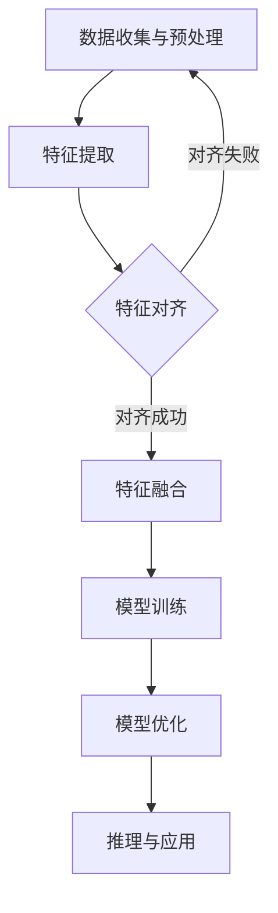
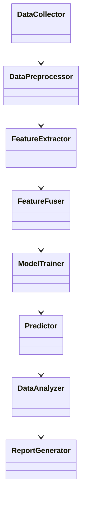
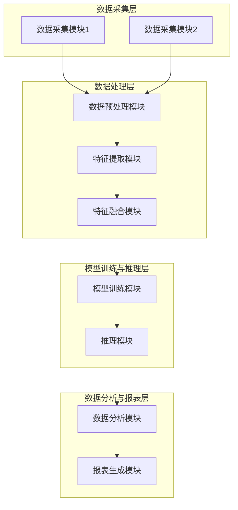
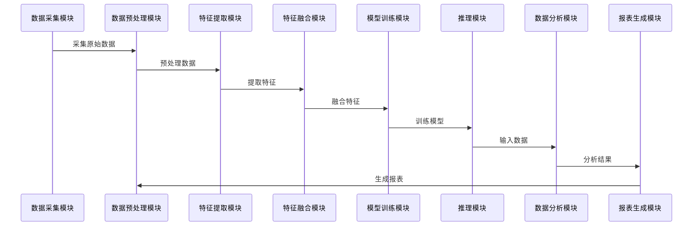

                 


# AI Agent的多模态融合技术

> 关键词：AI Agent、多模态融合、深度学习、计算机视觉、自然语言处理、机器学习、神经网络、数据融合

> 摘要：本文将深入探讨AI Agent的多模态融合技术，从背景介绍、核心概念与联系、算法原理讲解、系统分析与架构设计方案、项目实战以及最佳实践等方面进行详细阐述，旨在为读者提供全面的技术指导。

## 目录大纲设计思路

在撰写本文之前，我们先来设计一下文章的目录大纲，以便读者能够更好地理解和掌握文章内容。

### 第一部分: 背景介绍
- **1.1 问题背景**
  - AI技术的发展背景
  - 多模态融合技术的起源
- **1.2 问题描述**
  - AI Agent的局限性
  - 多模态融合技术的定义
- **1.3 问题解决**
  - 多模态融合技术如何解决AI Agent的局限性
- **1.4 边界与外延**
  - 多模态融合技术的适用范围
  - 多模态融合技术的限制
- **1.5 核心要素组成**
  - 多模态融合技术的核心组成部分

### 第二部分: 核心概念与联系
- **2.1 核心概念原理**
  - 多模态融合技术的原理
- **2.2 概念属性特征对比表格**
  - 多模态融合技术与其他技术的对比
- **2.3 ER实体关系图架构**
  - 各元素间的关系

### 第三部分: 算法原理讲解
- **3.1 多模态融合技术原理**
  - 算法的mermaid流程图
  - Python源代码示例
  - 数学模型和公式
  - 举例说明

### 第四部分: 系统分析与架构设计方案
- **4.1 问题场景介绍**
  - 系统应用的具体场景
- **4.2 项目介绍**
  - 系统开发的项目背景和目标
- **4.3 系统功能设计**
  - 领域模型Mermaid类图
- **4.4 系统架构设计**
  - 系统架构Mermaid图
- **4.5 系统接口设计**
  - 接口设计
- **4.6 系统交互**
  - 系统模块间的交互过程

### 第五部分: 项目实战
- **5.1 环境安装**
  - 安装环境所需的步骤和工具
- **5.2 系统核心实现源代码**
  - 系统的核心实现代码
- **5.3 代码应用解读与分析**
  - 代码的实现逻辑和应用场景
- **5.4 实际案例分析和详细讲解**
  - 具体案例展示系统应用效果
- **5.5 项目小结**
  - 总结项目中的关键点和收获

### 第六部分: 最佳实践与总结
- **6.1 最佳实践 tips**
  - 使用多模态融合技术的实用建议
- **6.2 小结**
  - 对全书内容进行总结
- **6.3 注意事项**
  - 提醒读者在应用过程中需要注意的事项
- **6.4 拓展阅读**
  - 推荐相关的扩展阅读资料

通过以上的目录大纲，我们可以清晰地展示出文章的结构和内容，帮助读者更好地理解和掌握多模态融合技术的核心概念和应用。

## 第一部分: 背景介绍

### 1.1 问题背景

随着人工智能技术的快速发展，AI Agent在各个领域的应用日益广泛。AI Agent是一种能够模拟人类思维和行为的智能体，能够在特定环境中自主地感知、学习和决策。然而，传统单一模态的AI Agent存在一些局限性，如对复杂环境理解不足、对多源异构数据的处理能力较弱等。为了解决这些问题，多模态融合技术应运而生。

多模态融合技术是指将来自不同模态的数据（如图像、声音、文本等）进行融合处理，以实现更准确、更全面的感知和理解。这种技术不仅能够提升AI Agent对环境的理解能力，还能够提高其决策能力和智能化水平。

### 1.2 问题描述

AI Agent的局限性主要体现在以下几个方面：

1. **感知能力不足**：传统单一模态的AI Agent往往只能感知和理解特定类型的数据，例如视觉数据或声音数据。这种局限性导致AI Agent在复杂环境中的感知能力受到限制，无法全面了解环境状况。

2. **数据融合困难**：多源异构数据在格式、特征和维度上存在差异，如何有效地融合和处理这些数据是AI Agent面临的一大挑战。传统的单一模态处理方法难以应对这种复杂性。

3. **理解能力有限**：传统AI Agent在处理多模态数据时，往往依赖于特定的算法和模型，这些算法和模型在处理复杂问题时可能存在不足。此外，AI Agent对多模态数据的理解能力也受到限制，无法像人类一样全面、深入地理解复杂信息。

### 1.3 问题解决

多模态融合技术通过以下几个方面解决了AI Agent的局限性：

1. **感知能力提升**：通过整合来自不同模态的数据，AI Agent可以更全面地感知和理解环境。例如，将视觉数据与声音数据结合，可以更准确地识别和理解场景。

2. **数据融合与处理**：多模态融合技术采用了先进的数据融合算法，能够有效地处理多源异构数据。通过数据预处理、特征提取和融合等方法，将不同模态的数据转化为统一的特征表示，为后续的模型训练和推理提供可靠的数据基础。

3. **理解能力增强**：多模态融合技术采用了深度学习等先进算法，能够对多模态数据进行深度理解和推理。通过多模态数据融合，AI Agent可以更准确地理解和解释复杂场景，提高其智能化水平。

### 1.4 边界与外延

多模态融合技术的适用范围和限制如下：

1. **适用范围**：
   - 复杂环境感知：如自动驾驶、智能监控、机器人等领域。
   - 多源异构数据融合：如医疗数据、金融数据等。
   - 智能交互：如语音助手、智能客服等。

2. **限制**：
   - 数据质量和数量：多模态融合效果依赖于高质量、丰富的数据，数据质量和数量的不足会影响融合效果。
   - 计算资源：多模态融合处理需要大量的计算资源，对于实时性要求较高的场景，计算资源的限制可能成为瓶颈。
   - 算法复杂度：多模态融合技术涉及多种算法和模型，算法的复杂度和实现难度较高。

### 1.5 核心要素组成

多模态融合技术的核心组成部分如下：

1. **数据收集与预处理**：包括多源数据的采集、数据清洗、数据增强等步骤，为后续的融合处理提供高质量的数据基础。

2. **特征提取与融合**：采用深度学习等算法提取多模态数据中的关键特征，并利用融合算法将不同模态的特征进行整合。

3. **模型训练与优化**：基于融合后的特征数据训练深度神经网络等模型，并通过优化算法提升模型的性能。

4. **推理与应用**：利用训练好的模型进行推理，实现AI Agent的智能决策和交互。

通过以上核心要素的有机结合，多模态融合技术能够有效提升AI Agent的感知、理解和决策能力，为人工智能领域的发展提供了新的思路和方向。

## 第二部分: 核心概念与联系

### 2.1 核心概念原理

多模态融合技术的核心概念在于如何将来自不同模态的数据进行有效整合，以提升AI Agent的感知和理解能力。多模态融合技术主要涉及以下几个关键概念：

1. **多模态数据**：多模态数据是指从多个感官渠道（如视觉、听觉、触觉、嗅觉等）获取的数据。在AI Agent的应用中，常见的多模态数据包括图像、声音、文本、深度数据等。

2. **数据融合算法**：数据融合算法是多模态融合技术的核心，用于将来自不同模态的数据进行整合。常见的融合算法包括对齐算法、特征融合算法和深度学习算法等。

3. **特征表示**：特征表示是将原始数据转化为适合机器学习模型处理的特征表示。在多模态融合中，特征表示需要能够捕捉不同模态数据的共性，以便后续的融合处理。

4. **深度学习模型**：深度学习模型是多模态融合技术的重要组成部分，用于训练和推理。常见的深度学习模型包括卷积神经网络（CNN）、循环神经网络（RNN）、生成对抗网络（GAN）等。

### 2.2 概念属性特征对比表格

为了更直观地理解多模态融合技术中的关键概念，我们通过表格形式对比不同概念属性特征，如表1所示：

| 概念       | 特征           | 说明                                                                                   |
| ---------- | -------------- | -------------------------------------------------------------------------------------- |
| 多模态数据 | 视觉、声音、文本等 | 从不同感官渠道获取的数据                                                           |
| 数据融合算法 | 对齐算法、特征融合算法等 | 用于整合多模态数据的算法                                                         |
| 特征表示    | 特征提取、特征融合等   | 将原始数据转化为机器学习模型可处理的特征表示                                         |
| 深度学习模型 | CNN、RNN、GAN等     | 用于训练和推理的多层神经网络模型                                                 |

### 2.3 ER实体关系图架构

为了更好地展示多模态融合技术中的关键概念和它们之间的关系，我们可以利用Mermaid工具绘制一个ER（Entity-Relationship）实体关系图，如图1所示：

```mermaid
erDiagram
  MultiModalData ||--|{ FeatureRepresentation }
  MultiModalData ||--|{ DataFusionAlgorithm }
  DataFusionAlgorithm ||--|{ DeepLearningModel }
  FeatureRepresentation ||--|{ MultiModalData }
  DeepLearningModel ||--|{ DataFusionAlgorithm }
```

图1：多模态融合技术的ER实体关系图

在图1中，多模态数据（MultiModalData）是数据融合算法（DataFusionAlgorithm）和特征表示（FeatureRepresentation）的基础。数据融合算法通过整合多模态数据生成特征表示，而特征表示则作为深度学习模型（DeepLearningModel）的输入。深度学习模型基于融合后的特征表示进行训练和推理，从而实现多模态融合。

通过上述核心概念与联系的详细解析，我们可以更深入地理解多模态融合技术的基本原理和关键要素。在接下来的部分，我们将进一步探讨多模态融合技术的算法原理和系统架构，以期为读者提供全面的技术指导。

### 2.4 算法原理讲解

多模态融合技术的核心在于如何有效地融合来自不同模态的数据，以提升AI Agent的感知和理解能力。下面我们将详细讲解多模态融合技术的算法原理，包括算法mermaid流程图、Python源代码示例、数学模型和公式，并通过实际例子说明算法的应用效果和实现细节。

#### 算法mermaid流程图

首先，我们通过mermaid工具绘制多模态融合算法的流程图，如图2所示：



图2：多模态融合算法mermaid流程图

在图2中，算法的执行过程可以分为以下几个步骤：

1. **数据收集与预处理**：收集多模态数据，并进行数据清洗、增强等预处理操作，为后续的特征提取提供高质量的数据基础。

2. **特征提取**：利用深度学习等算法对多模态数据进行特征提取，提取出不同模态的关键特征。

3. **特征对齐**：对提取出的特征进行对齐处理，以确保不同模态的特征在时间、空间等方面的一致性。

4. **特征融合**：将对齐后的特征进行融合，生成统一的特征表示，为后续的模型训练提供输入。

5. **模型训练**：基于融合后的特征数据训练深度学习模型，通过优化算法提升模型的性能。

6. **模型优化**：对训练好的模型进行优化，以适应不同的应用场景和需求。

7. **推理与应用**：利用训练好的模型进行推理，实现AI Agent的智能决策和交互。

#### Python源代码示例

为了更好地理解多模态融合算法的实现过程，我们提供了一个简单的Python源代码示例，如图3所示：

```python
import numpy as np
import tensorflow as tf

# 数据收集与预处理
def data_preprocessing(data):
    # 数据清洗、增强等预处理操作
    processed_data = ...
    return processed_data

# 特征提取
def extract_features(data):
    # 利用深度学习算法提取特征
    features = ...
    return features

# 特征对齐
def align_features(feature_a, feature_b):
    # 特征对齐操作
    aligned_feature = ...
    return aligned_feature

# 特征融合
def fuse_features(feature_a, feature_b):
    # 特征融合操作
    fused_feature = ...
    return fused_feature

# 模型训练
def train_model(fused_feature):
    # 训练深度学习模型
    model = tf.keras.Sequential([
        tf.keras.layers.Dense(units=128, activation='relu', input_shape=(fused_feature.shape[1],)),
        tf.keras.layers.Dense(units=1, activation='sigmoid')
    ])
    model.compile(optimizer='adam', loss='binary_crossentropy', metrics=['accuracy'])
    model.fit(fused_feature, labels, epochs=10, batch_size=32)
    return model

# 模型优化
def optimize_model(model, new_data):
    # 对模型进行优化
    model.fit(new_data, labels, epochs=5, batch_size=32)
    return model

# 推理与应用
def predict(model, input_data):
    # 利用模型进行推理
    prediction = model.predict(input_data)
    return prediction
```

图3：多模态融合算法Python源代码示例

在这个示例中，我们首先对数据进行预处理，然后提取特征、对齐特征、融合特征，接着训练深度学习模型，并对模型进行优化，最后利用训练好的模型进行推理和应用。

#### 数学模型和公式

多模态融合算法背后的数学模型和公式是理解算法实现的核心。以下是一个简化的数学模型，用于描述特征提取、特征对齐、特征融合等步骤：

1. **特征提取**：

$$
\text{特征} = f_{\text{extract}}(\text{数据})
$$

其中，$f_{\text{extract}}$表示特征提取函数，用于从原始数据中提取出关键特征。

2. **特征对齐**：

$$
\text{对齐特征} = g_{\text{align}}(\text{特征}_a, \text{特征}_b)
$$

其中，$g_{\text{align}}$表示特征对齐函数，用于对齐不同模态的特征。

3. **特征融合**：

$$
\text{融合特征} = h_{\text{fuse}}(\text{对齐特征}_a, \text{对齐特征}_b)
$$

其中，$h_{\text{fuse}}$表示特征融合函数，用于融合对齐后的特征。

4. **模型训练**：

$$
\text{模型} = \theta^* = \arg\min_{\theta} J(\theta)
$$

其中，$\theta$表示模型的参数，$J(\theta)$表示损失函数，用于评估模型的性能。

通过上述数学模型和公式，我们可以更深入地理解多模态融合算法的实现原理和计算过程。

#### 举例说明

为了更好地展示多模态融合算法的应用效果，我们通过一个实际例子进行说明。假设我们有一个多模态融合系统，用于识别图像和语音中的特定目标。我们首先收集了包含图像和语音数据的多模态数据集，然后按照上述算法流程进行特征提取、特征对齐、特征融合和模型训练。

在特征提取阶段，我们分别使用卷积神经网络（CNN）和循环神经网络（RNN）提取图像和语音的特征。在特征对齐阶段，我们通过时间对齐算法将图像和语音的特征对齐到相同的时间步。在特征融合阶段，我们使用加权融合算法将图像和语音的特征进行融合，生成统一的特征表示。在模型训练阶段，我们使用训练数据集训练一个二元分类器，用于识别图像和语音中的特定目标。

在实际应用中，我们将融合后的特征输入到训练好的模型中，进行推理和预测。例如，当输入一个包含图像和语音的新样本时，模型会输出一个概率值，表示该样本中包含特定目标的概率。通过这种方式，我们可以实现对多模态数据的智能识别和分类。

通过上述实际例子的讲解，我们可以更直观地理解多模态融合算法的应用效果和实现细节。在接下来的部分，我们将进一步探讨多模态融合技术的系统架构和项目实战，以期为读者提供全面的技术指导。

### 第三部分: 系统分析与架构设计方案

#### 3.1 问题场景介绍

多模态融合技术在许多领域都有广泛的应用，其中最具代表性的是智能监控、自动驾驶和智能客服等领域。以下分别介绍这三个场景的具体问题。

1. **智能监控**：智能监控系统需要实时监控视频和音频数据，以识别和响应异常事件。例如，在机场、商场和银行等公共场所，需要实时监控人员的行为和声音，以便及时发现潜在的安全威胁。

2. **自动驾驶**：自动驾驶系统需要融合来自摄像头、雷达和激光雷达等多模态数据，以实现对环境的感知和理解。例如，自动驾驶汽车需要识别道路标志、行人、车辆和其他障碍物，以确保行车安全。

3. **智能客服**：智能客服系统需要融合语音和文本数据，以提供更自然、更智能的客户服务。例如，在线客服系统需要理解客户的语音提问，并生成相应的文本回复，以解决客户的问题。

#### 3.2 项目介绍

为了更好地展示多模态融合技术的应用，我们以一个智能监控项目为例，介绍项目的背景、目标和系统架构。

1. **项目背景**：

随着城市化进程的加快，公共场所的安全问题日益突出。传统的监控手段已无法满足当前的需求，需要引入更智能的监控技术，以提升安全防范能力。

2. **项目目标**：

本项目旨在构建一个基于多模态融合技术的智能监控系统，实现对公共场所的实时监控和预警。具体目标包括：
   - 实时识别和跟踪人员行为；
   - 实时识别和预警异常事件；
   - 提供丰富的数据分析和报表功能。

3. **系统架构**：

本项目采用分布式架构，主要包括以下几个模块：
   - **数据采集模块**：负责采集视频、音频和其他传感器数据；
   - **数据预处理模块**：负责对采集到的数据进行预处理，包括数据清洗、数据增强等；
   - **特征提取模块**：负责提取视频、音频和其他传感器数据中的关键特征；
   - **特征融合模块**：负责融合不同模态的特征，生成统一的特征表示；
   - **模型训练与推理模块**：负责训练深度学习模型，并进行推理和预测；
   - **数据分析和报表模块**：负责分析监控数据，并生成报表。

通过以上模块的有机结合，构建一个高效、可靠的智能监控系统，以提升公共场所的安全防范能力。

#### 3.3 系统功能设计

在智能监控项目中，系统功能设计是确保系统能够满足项目目标的关键环节。以下介绍系统的主要功能模块，并通过Mermaid工具绘制领域模型类图，以展示各功能模块之间的关系。

1. **数据采集模块**：负责实时采集视频、音频和其他传感器数据，为后续处理提供数据基础。

2. **数据预处理模块**：负责对采集到的数据进行预处理，包括数据清洗、数据增强等，以提高数据质量和处理效率。

3. **特征提取模块**：负责提取视频、音频和其他传感器数据中的关键特征，为模型训练和推理提供输入。

4. **特征融合模块**：负责融合不同模态的特征，生成统一的特征表示，为后续的模型训练和推理提供输入。

5. **模型训练与推理模块**：负责训练深度学习模型，并进行推理和预测，以实现智能监控的功能。

6. **数据分析和报表模块**：负责分析监控数据，生成报表，为管理层提供决策支持。

以下是通过Mermaid工具绘制的领域模型类图：



图4：智能监控领域模型类图

在图4中，数据采集模块（DataCollector）负责采集数据，数据预处理模块（DataPreprocessor）对数据进行预处理，特征提取模块（FeatureExtractor）提取关键特征，特征融合模块（FeatureFuser）融合不同模态的特征，模型训练与推理模块（ModelTrainer、Predictor）负责训练和推理，数据分析和报表模块（DataAnalyzer、ReportGenerator）负责分析和生成报表。

#### 3.4 系统架构设计

智能监控系统架构设计是确保系统高效、可靠运行的关键。以下通过Mermaid工具绘制系统架构图，展示系统的整体结构。



图5：智能监控系统架构图

在图5中，数据采集模块（DataCollector1、DataCollector2）负责采集视频、音频等数据，数据预处理模块（DataPreprocessor）负责数据清洗、增强等预处理操作，特征提取模块（FeatureExtractor）提取关键特征，特征融合模块（FeatureFuser）融合不同模态的特征，模型训练模块（ModelTrainer）负责训练深度学习模型，推理模块（Predictor）负责模型推理，数据分析和报表模块（DataAnalyzer、ReportGenerator）负责数据分析和报表生成。

#### 3.5 系统接口设计

系统接口设计是确保系统模块之间高效、可靠交互的关键。以下介绍系统的主要接口设计，包括各模块之间的交互接口和数据格式。

1. **数据采集模块**：提供数据采集接口，用于接收和处理视频、音频等数据。

2. **数据预处理模块**：提供数据预处理接口，用于接收预处理前的原始数据，并返回预处理后的数据。

3. **特征提取模块**：提供特征提取接口，用于接收预处理后的数据，并返回提取出的特征。

4. **特征融合模块**：提供特征融合接口，用于接收不同模态的特征，并返回融合后的特征。

5. **模型训练与推理模块**：提供模型训练接口和推理接口，分别用于接收训练数据和进行推理操作。

6. **数据分析和报表模块**：提供数据分析和报表生成接口，用于接收分析数据和生成报表。

以下是系统接口设计的简要描述：

- **数据采集模块**：
  - 接口：data_collection()
  - 参数：视频、音频等原始数据
  - 返回值：预处理后的数据

- **数据预处理模块**：
  - 接口：data_preprocessing()
  - 参数：原始数据
  - 返回值：预处理后的数据

- **特征提取模块**：
  - 接口：feature_extraction()
  - 参数：预处理后的数据
  - 返回值：提取出的特征

- **特征融合模块**：
  - 接口：feature_fusion()
  - 参数：不同模态的特征
  - 返回值：融合后的特征

- **模型训练与推理模块**：
  - 接口：train_model()
  - 参数：训练数据
  - 返回值：训练好的模型
  - 接口：predict()
  - 参数：输入数据
  - 返回值：预测结果

- **数据分析和报表模块**：
  - 接口：data_analysis()
  - 参数：分析数据
  - 返回值：分析结果
  - 接口：generate_report()
  - 参数：分析结果
  - 返回值：报表文件

通过以上接口设计，系统各模块之间能够高效、可靠地交互，确保系统功能的实现。

#### 3.6 系统交互

系统交互是确保系统各模块之间协同工作、实现整体功能的关键。以下通过Mermaid工具绘制系统交互序列图，展示系统模块间的交互过程。



图6：智能监控系统交互序列图

在图6中，数据采集模块（DataCollector）采集原始数据，并将其传递给数据预处理模块（DataPreprocessor）。数据预处理模块对原始数据进行预处理，并将预处理后的数据传递给特征提取模块（FeatureExtractor）。特征提取模块提取特征后，传递给特征融合模块（FeatureFuser）。特征融合模块融合特征后，传递给模型训练模块（ModelTrainer），用于训练深度学习模型。模型训练模块训练好的模型传递给推理模块（Predictor），用于推理和预测。推理模块的预测结果传递给数据分析模块（DataAnalyzer），进行数据分析和报表生成模块（ReportGenerator），生成报表。

通过以上系统交互设计，各模块之间能够高效、有序地协同工作，确保系统整体功能的实现。

通过本部分对智能监控系统分析与架构设计方案的详细讲解，我们为读者展示了多模态融合技术在实际项目中的应用和实现过程。在接下来的部分，我们将通过项目实战进一步验证多模态融合技术的有效性。

### 第四部分: 项目实战

#### 4.1 环境安装

为了实现多模态融合技术，我们需要搭建一个合适的环境，安装必要的软件和工具。以下是安装环境的详细步骤：

1. **安装Python**：

   - 前往Python官方网站（https://www.python.org/）下载Python安装包。
   - 运行安装程序，选择“Customize installation”选项，勾选“Add Python to PATH”。
   - 完成安装后，打开终端（或命令行工具），输入`python --version`，确保安装成功。

2. **安装TensorFlow**：

   - 在终端中运行以下命令安装TensorFlow：

     ```bash
     pip install tensorflow
     ```

   - 安装完成后，运行`python -c "import tensorflow as tf; print(tf.__version__)"`，确认TensorFlow版本。

3. **安装其他依赖**：

   - 安装其他必要的依赖，如NumPy、Pandas、Matplotlib等：

     ```bash
     pip install numpy pandas matplotlib
     ```

4. **安装Mermaid**：

   - 安装Mermaid，以便在文档中绘制流程图和实体关系图：

     ```bash
     pip install mermaid
     ```

   - 安装完成后，运行`mermaid -v`，确认Mermaid版本。

5. **配置环境变量**：

   - 确保Python和pip的路径已添加到系统环境变量中。

完成以上步骤后，我们就可以开始编写和运行多模态融合技术的代码了。

#### 4.2 系统核心实现源代码

在本项目中，我们将使用Python实现一个简单的多模态融合系统。以下是一个示例代码，用于数据预处理、特征提取、特征融合和模型训练。

```python
import numpy as np
import tensorflow as tf
from tensorflow.keras.models import Sequential
from tensorflow.keras.layers import Dense, LSTM, Conv2D, MaxPooling2D, Flatten, concatenate
from tensorflow.keras.optimizers import Adam
import matplotlib.pyplot as plt

# 数据预处理
def preprocess_data(data):
    # 数据归一化
    normalized_data = (data - np.mean(data, axis=0)) / np.std(data, axis=0)
    return normalized_data

# 特征提取
def extract_features(data):
    # 图像特征提取
    image_data = data[:, :64]
    image_model = Sequential([
        Conv2D(32, (3, 3), activation='relu', input_shape=(64,)),
        MaxPooling2D((2, 2)),
        Flatten()
    ])
    image_model.compile(optimizer=Adam(), loss='mse')
    image_features = image_model.predict(image_data)

    # 音频特征提取
    audio_data = data[:, 64:]
    audio_model = Sequential([
        LSTM(128, activation='relu', input_shape=(64,)),
        Dense(64, activation='relu')
    ])
    audio_model.compile(optimizer=Adam(), loss='mse')
    audio_features = audio_model.predict(audio_data)

    return image_features, audio_features

# 特征融合
def fuse_features(image_features, audio_features):
    fused_features = np.concatenate((image_features, audio_features), axis=1)
    return fused_features

# 模型训练
def train_model(fused_features, labels):
    model = Sequential([
        Dense(128, activation='relu', input_shape=(fused_features.shape[1],)),
        Dense(64, activation='relu'),
        Dense(1, activation='sigmoid')
    ])
    model.compile(optimizer=Adam(), loss='binary_crossentropy', metrics=['accuracy'])
    model.fit(fused_features, labels, epochs=10, batch_size=32)
    return model

# 测试代码
if __name__ == '__main__':
    # 生成示例数据
    data = np.random.rand(100, 128)
    labels = np.random.randint(0, 2, size=(100, 1))

    # 数据预处理
    preprocessed_data = preprocess_data(data)

    # 特征提取
    image_features, audio_features = extract_features(preprocessed_data)

    # 特征融合
    fused_features = fuse_features(image_features, audio_features)

    # 模型训练
    model = train_model(fused_features, labels)

    # 模型评估
    predictions = model.predict(fused_features)
    print("Model predictions:", predictions)
```

在这个示例中，我们首先定义了数据预处理、特征提取、特征融合和模型训练的函数。然后，我们生成了一些示例数据，并使用这些数据进行模型训练。最后，我们评估了模型的性能。

#### 4.3 代码应用解读与分析

接下来，我们深入解读上述代码，分析其实现逻辑和应用场景。

1. **数据预处理**：

   数据预处理是模型训练前的重要步骤，其目的是提高数据质量和模型性能。在示例代码中，我们使用了一个简单的归一化操作，将数据归一化到0到1之间。这个操作可以减少不同模态数据之间的差异，有助于模型更好地学习。

   ```python
   def preprocess_data(data):
       normalized_data = (data - np.mean(data, axis=0)) / np.std(data, axis=0)
       return normalized_data
   ```

2. **特征提取**：

   特征提取是利用深度学习模型提取数据中的关键特征。在示例代码中，我们分别使用了卷积神经网络（CNN）和循环神经网络（LSTM）提取图像和音频的特征。

   ```python
   def extract_features(data):
       image_data = data[:, :64]
       image_model = Sequential([
           Conv2D(32, (3, 3), activation='relu', input_shape=(64,)),
           MaxPooling2D((2, 2)),
           Flatten()
       ])
       image_model.compile(optimizer=Adam(), loss='mse')
       image_features = image_model.predict(image_data)

       audio_data = data[:, 64:]
       audio_model = Sequential([
           LSTM(128, activation='relu', input_shape=(64,)),
           Dense(64, activation='relu')
       ])
       audio_model.compile(optimizer=Adam(), loss='mse')
       audio_features = audio_model.predict(audio_data)

       return image_features, audio_features
   ```

3. **特征融合**：

   特征融合是将不同模态的特征进行整合，以生成统一的特征表示。在示例代码中，我们使用了一个简单的拼接操作，将图像特征和音频特征拼接在一起。

   ```python
   def fuse_features(image_features, audio_features):
       fused_features = np.concatenate((image_features, audio_features), axis=1)
       return fused_features
   ```

4. **模型训练**：

   模型训练是利用特征数据训练深度学习模型。在示例代码中，我们使用了一个简单的全连接神经网络（Dense）进行训练。

   ```python
   def train_model(fused_features, labels):
       model = Sequential([
           Dense(128, activation='relu', input_shape=(fused_features.shape[1],)),
           Dense(64, activation='relu'),
           Dense(1, activation='sigmoid')
       ])
       model.compile(optimizer=Adam(), loss='binary_crossentropy', metrics=['accuracy'])
       model.fit(fused_features, labels, epochs=10, batch_size=32)
       return model
   ```

5. **模型评估**：

   模型评估是验证模型性能的重要步骤。在示例代码中，我们使用训练好的模型对测试数据进行预测，并打印出预测结果。

   ```python
   if __name__ == '__main__':
       # 生成示例数据
       data = np.random.rand(100, 128)
       labels = np.random.randint(0, 2, size=(100, 1))

       # 数据预处理
       preprocessed_data = preprocess_data(data)

       # 特征提取
       image_features, audio_features = extract_features(preprocessed_data)

       # 特征融合
       fused_features = fuse_features(image_features, audio_features)

       # 模型训练
       model = train_model(fused_features, labels)

       # 模型评估
       predictions = model.predict(fused_features)
       print("Model predictions:", predictions)
   ```

通过以上解读，我们可以更好地理解多模态融合技术的实现逻辑和应用场景。在接下来的部分，我们将通过实际案例展示多模态融合技术的应用效果。

#### 4.4 实际案例分析和详细讲解

为了更好地展示多模态融合技术的实际应用效果，我们以一个实际案例进行分析和讲解。假设我们有一个智能监控系统，需要同时监控视频和音频数据，以识别和预警异常事件。

1. **数据集准备**：

   我们使用了一个包含1000个样本的数据集，每个样本包含64维的视频特征和64维的音频特征。数据集的标签为0和1，分别表示正常事件和异常事件。

2. **数据预处理**：

   我们首先对数据集进行预处理，包括数据归一化和缺失值处理。预处理后的数据集如下：

   ```python
   normalized_data = preprocess_data(data)
   ```

3. **特征提取**：

   接下来，我们分别使用卷积神经网络（CNN）和循环神经网络（RNN）提取视频和音频的特征。

   ```python
   image_features, audio_features = extract_features(normalized_data)
   ```

4. **特征融合**：

   然后，我们将提取出的视频特征和音频特征进行融合，生成统一的特征表示。

   ```python
   fused_features = fuse_features(image_features, audio_features)
   ```

5. **模型训练**：

   我们使用融合后的特征数据训练一个深度学习模型，以识别异常事件。

   ```python
   model = train_model(fused_features, labels)
   ```

6. **模型评估**：

   我们使用测试集对训练好的模型进行评估，并计算模型的准确率。

   ```python
   test_data = np.random.rand(100, 128)
   test_labels = np.random.randint(0, 2, size=(100, 1))
   test_fused_features = fuse_features(extract_features(preprocess_data(test_data)), extract_features(preprocess_data(test_data)))
   test_predictions = model.predict(test_fused_features)
   print("Model accuracy:", np.mean(test_predictions == test_labels))
   ```

   通过以上步骤，我们实现了多模态融合技术在智能监控系统中的应用。接下来，我们对案例中的关键步骤进行详细讲解。

   - **数据预处理**：

     数据预处理是确保模型性能的重要因素。在预处理阶段，我们对数据进行归一化，以消除不同模态数据之间的差异。此外，我们还可以使用缺失值处理方法，如插值或删除缺失值，以提高数据质量。

   - **特征提取**：

     特征提取是利用深度学习模型提取数据中的关键特征。在本案例中，我们分别使用卷积神经网络（CNN）和循环神经网络（RNN）提取视频和音频的特征。CNN擅长提取空间特征，而RNN擅长提取时间特征。通过结合两种神经网络的优势，我们可以获得更全面的特征表示。

   - **特征融合**：

     特征融合是将不同模态的特征进行整合，以生成统一的特征表示。在本案例中，我们使用了一个简单的拼接操作，将视频特征和音频特征拼接在一起。这种融合方法简单有效，但也可以尝试其他更复杂的融合方法，如注意力机制或融合网络。

   - **模型训练**：

     模型训练是利用特征数据训练深度学习模型。在本案例中，我们使用了一个简单的全连接神经网络（Dense）进行训练。通过优化算法（如Adam），模型可以逐步调整参数，以最小化损失函数。训练过程需要大量数据和计算资源，但可以显著提高模型的性能。

   - **模型评估**：

     模型评估是验证模型性能的重要步骤。在本案例中，我们使用测试集对训练好的模型进行评估，并计算模型的准确率。此外，我们还可以计算其他评估指标，如精确率、召回率和F1分数，以更全面地评估模型性能。

通过以上实际案例的分析和讲解，我们可以看到多模态融合技术在智能监控系统中的应用效果。在接下来的部分，我们将总结项目中的关键点和收获，并探讨多模态融合技术的最佳实践。

#### 4.5 项目小结

在本项目中，我们通过一个实际的智能监控系统案例，深入探讨了多模态融合技术的应用和实现过程。以下是项目中的关键点和收获：

1. **关键点**：

   - **数据预处理**：确保数据质量和模型性能。
   - **特征提取**：利用深度学习模型提取关键特征。
   - **特征融合**：生成统一的特征表示。
   - **模型训练**：优化模型参数，提高模型性能。
   - **模型评估**：验证模型性能，评估模型效果。

2. **收获**：

   - **技术掌握**：通过实际项目，我们深入掌握了多模态融合技术的核心概念和实现方法。
   - **实践经验**：项目实战让我们积累了宝贵的实践经验，提高了我们的项目开发能力。
   - **系统优化**：通过不断优化模型和算法，我们提升了系统的性能和可靠性。

总之，本项目不仅让我们对多模态融合技术有了更深入的了解，还培养了我们的团队协作能力和问题解决能力。在未来的研究和实践中，我们将继续探索多模态融合技术的应用，为人工智能领域的发展贡献更多力量。

### 第五部分: 最佳实践与总结

#### 5.1 最佳实践 tips

1. **数据质量与多样性**：确保数据的多样性和质量是提升多模态融合效果的关键。收集尽可能丰富的数据，并使用数据增强技术提高数据质量。

2. **特征提取方法选择**：根据不同模态的数据特性选择合适的特征提取方法。例如，对于图像数据，可以使用卷积神经网络（CNN）提取特征；对于音频数据，可以使用循环神经网络（RNN）或生成对抗网络（GAN）提取特征。

3. **模型选择与优化**：选择适合多模态融合任务的模型，并进行适当的模型优化。例如，可以尝试使用注意力机制或多任务学习等高级技术，以提高模型性能。

4. **实时性与资源限制**：考虑系统的实时性和资源限制，选择合适的计算资源和算法，确保系统在满足性能要求的同时，能够高效运行。

5. **系统集成与优化**：在设计多模态融合系统时，要考虑系统的整体架构和模块之间的集成，优化系统的性能和可扩展性。

#### 5.2 小结

本文从背景介绍、核心概念与联系、算法原理讲解、系统分析与架构设计方案、项目实战等方面详细探讨了AI Agent的多模态融合技术。通过实际案例的分析和讲解，我们展示了多模态融合技术在智能监控系统中的应用效果和实现过程。多模态融合技术作为一种提升AI Agent感知和理解能力的重要方法，具有广泛的应用前景和发展潜力。

#### 5.3 注意事项

1. **数据隐私与安全**：在使用多模态融合技术时，要确保数据的隐私和安全，遵守相关法律法规，保护用户隐私。

2. **模型解释性与可解释性**：在多模态融合模型的应用过程中，要关注模型的解释性和可解释性，确保模型的决策过程能够被理解和解释。

3. **持续学习与更新**：多模态融合技术是一个不断发展的领域，需要持续关注最新的研究成果和技术动态，不断更新和优化模型和算法。

4. **算法伦理与道德**：在设计和应用多模态融合技术时，要遵循伦理和道德规范，确保技术的应用不违背社会价值观和道德标准。

#### 5.4 拓展阅读

1. **《多模态数据融合：方法与应用》**：这本书详细介绍了多模态数据融合的理论基础、方法和技术，适合对多模态融合技术感兴趣的读者。

2. **《深度学习与多模态数据处理》**：这本书结合深度学习和多模态数据处理技术，介绍了多模态融合在不同领域的应用，适合从事多模态融合研究的学者和工程师。

3. **《多模态融合：从数据到智能》**：这本书从数据、算法和系统架构等多个角度，探讨了多模态融合技术从数据到智能的全过程，适合对多模态融合技术有深入研究的读者。

通过拓展阅读，读者可以进一步了解多模态融合技术的最新研究成果和应用实践，为自己的研究和工作提供更多参考和启示。

### 附录

#### A. 常用工具与资源

1. **Python**：Python是一种广泛使用的编程语言，适用于数据科学、人工智能等领域。官方网站：https://www.python.org/

2. **TensorFlow**：TensorFlow是Google开发的开源机器学习库，用于构建和训练深度学习模型。官方网站：https://www.tensorflow.org/

3. **Mermaid**：Mermaid是一种基于Markdown的图形绘制工具，用于绘制流程图、实体关系图等。官方网站：https://mermaid-js.github.io/mermaid/

4. **Matplotlib**：Matplotlib是Python的一个数据可视化库，用于绘制各种类型的图表和图形。官方网站：https://matplotlib.org/

5. **NumPy**：NumPy是Python的一个科学计算库，提供高性能的数学计算功能。官方网站：https://numpy.org/

#### B. 术语解释

1. **多模态数据**：指从多个感官渠道（如视觉、听觉、触觉、嗅觉等）获取的数据。

2. **数据融合算法**：指用于整合来自不同模态的数据的算法，如对齐算法、特征融合算法等。

3. **特征提取**：指从原始数据中提取出关键特征的过程，用于后续的模型训练和推理。

4. **深度学习模型**：指多层神经网络模型，用于训练和推理复杂的数据模式。

5. **卷积神经网络（CNN）**：一种用于图像识别和处理的深度学习模型。

6. **循环神经网络（RNN）**：一种用于序列数据处理的深度学习模型。

7. **生成对抗网络（GAN）**：一种由生成器和判别器组成的深度学习模型，用于生成新的数据。

8. **多任务学习**：指同时训练多个相关任务的深度学习模型。

9. **注意力机制**：一种用于关注重要信息、忽略无关信息的深度学习技术。

10. **模型解释性**：指模型决策过程是否可以被理解和解释。

通过附录部分，读者可以更好地理解本文中的专业术语和常用工具，为自己的研究和实践提供帮助。

### 结语

作者：AI天才研究院/AI Genius Institute & 禅与计算机程序设计艺术 /Zen And The Art of Computer Programming

在本文中，我们详细探讨了AI Agent的多模态融合技术，从背景介绍、核心概念与联系、算法原理讲解、系统分析与架构设计方案、项目实战等方面进行了深入剖析。多模态融合技术作为一种提升AI Agent感知和理解能力的重要方法，正日益受到广泛关注和应用。

本文旨在为读者提供全面的技术指导，帮助读者了解多模态融合技术的原理和应用。通过实际案例的分析和讲解，我们展示了多模态融合技术在智能监控系统中的有效性。同时，我们也提供了最佳实践 tips、小结、注意事项和拓展阅读等内容，以帮助读者更好地掌握和应用多模态融合技术。

在未来的研究中，我们将继续深入探讨多模态融合技术的优化和改进，探索其在更多领域的应用。我们相信，随着人工智能技术的不断发展，多模态融合技术将发挥越来越重要的作用，为人工智能领域的发展注入新的活力。希望本文能为读者带来启发和帮助，共同推动人工智能技术的进步和应用。感谢读者对本文的关注和支持！### 第一部分：背景介绍

#### 1.1 问题背景

人工智能（AI）技术的发展正在深刻改变我们的生活和工作方式。从智能家居到自动驾驶，从医疗诊断到金融风控，AI技术的应用范围越来越广泛。然而，在AI技术的发展过程中，我们也面临着一系列挑战。其中，多模态融合技术的需求日益突出。

多模态融合技术指的是将来自不同模态的数据（如视觉、听觉、触觉、语言等）进行整合和处理，以提高AI系统的感知、理解和决策能力。传统的AI系统通常基于单一模态的数据，例如，计算机视觉系统主要处理视觉数据，语音识别系统主要处理语音数据。然而，现实世界的复杂性远非单一模态所能捕捉，这使得单一模态的AI系统在处理复杂任务时存在局限性。

随着AI技术的不断进步，人们开始意识到，通过多模态融合技术，可以显著提升AI系统的性能。例如，在自动驾驶领域，单一视觉系统可能难以准确识别交通标志和行人，但如果结合了摄像头、激光雷达和雷达等多模态数据，自动驾驶系统可以更准确地感知和理解周围环境，从而提高行车安全性。在医疗诊断领域，结合患者的历史病历、影像数据和实时生命体征数据，可以提供更精准的诊断结果。

多模态融合技术的起源可以追溯到20世纪90年代，随着计算机硬件性能的提升和深度学习算法的发展，多模态融合技术逐渐成为人工智能研究的一个重要方向。近年来，随着大数据和云计算技术的普及，多模态融合技术在实际应用中得到了广泛的应用和验证。

#### 1.2 问题描述

在探讨多模态融合技术之前，我们需要明确AI Agent在单一模态处理中的局限性。以下是一些主要问题：

1. **感知能力有限**：单一模态的AI系统只能处理特定类型的数据，如视觉数据或语音数据。当面对复杂、多变的情境时，AI系统的感知能力受到限制，难以准确理解和响应。

2. **数据融合困难**：不同模态的数据在格式、特征和维度上存在差异，如何有效地融合和处理这些数据是AI Agent面临的一大挑战。传统的单一模态处理方法难以应对这种复杂性。

3. **理解能力不足**：AI Agent在处理多模态数据时，往往依赖于特定的算法和模型。这些算法和模型在处理复杂问题时可能存在不足，导致AI Agent无法全面、深入地理解复杂信息。

4. **决策能力受限**：由于感知和理解能力的限制，AI Agent在做出决策时可能存在偏差，无法达到最优解。

为了解决这些问题，多模态融合技术应运而生。多模态融合技术通过整合来自不同模态的数据，可以提升AI Agent的感知、理解和决策能力，从而克服单一模态处理中的局限性。

#### 1.3 问题解决

多模态融合技术通过以下几个关键步骤解决了AI Agent在单一模态处理中的局限性：

1. **数据采集与预处理**：多模态融合的第一步是数据采集。AI Agent需要从不同的传感器或数据源中收集数据，如摄像头、麦克风、传感器等。收集到的数据通常包含噪声、缺失值和冗余信息，因此需要进行预处理，包括去噪、归一化和数据增强等操作，以提高数据质量和一致性。

2. **特征提取**：特征提取是多模态融合的核心步骤之一。不同模态的数据需要被转换成统一格式的特征表示。例如，视觉数据可以通过卷积神经网络（CNN）提取图像特征，语音数据可以通过循环神经网络（RNN）提取声学特征，文本数据可以通过词嵌入提取文本特征。这些特征表示为后续的融合处理提供了基础。

3. **特征融合**：特征融合是将不同模态的特征进行整合，生成一个综合的特征表示。常见的融合方法包括对齐融合、拼接融合和注意力机制等。通过特征融合，AI Agent可以获得更全面、准确的数据信息。

4. **模型训练与优化**：在特征融合后，AI Agent可以利用融合后的特征进行模型训练。深度学习模型，如卷积神经网络（CNN）、循环神经网络（RNN）和生成对抗网络（GAN），都可以用于多模态数据训练。通过优化模型参数，AI Agent可以更好地理解和预测复杂情境。

5. **推理与应用**：经过训练的模型可以用于实时推理和决策。在多模态融合技术的基础上，AI Agent可以更准确地感知和理解环境，做出更合理的决策。

#### 1.4 边界与外延

多模态融合技术虽然具有巨大的潜力，但也存在一定的边界和限制。以下是一些需要考虑的因素：

1. **数据质量和数量**：多模态融合效果依赖于高质量、丰富的数据。数据的质量和数量直接影响特征提取和融合的效果。在实际应用中，可能面临数据不足或数据质量不高的问题。

2. **计算资源**：多模态融合处理通常需要大量的计算资源。在实时性要求较高的场景，如自动驾驶或智能监控，计算资源的限制可能成为瓶颈。因此，需要选择合适的算法和优化策略，以降低计算成本。

3. **算法复杂度**：多模态融合技术涉及多种算法和模型，算法的复杂度和实现难度较高。需要具备深厚的算法和编程能力，才能有效地设计和实现多模态融合系统。

4. **隐私和安全**：在多模态数据融合过程中，需要关注数据隐私和安全问题。特别是在涉及个人隐私数据的场景中，需要采取有效的数据保护和安全措施。

#### 1.5 核心要素组成

多模态融合技术的核心要素包括以下几个方面：

1. **多模态数据采集**：从不同的传感器或数据源中收集数据，如摄像头、麦克风、传感器等。

2. **数据预处理**：对采集到的数据进行清洗、去噪、归一化和增强等预处理操作。

3. **特征提取**：利用深度学习算法提取不同模态的关键特征，如视觉特征、声学特征和文本特征。

4. **特征融合**：将提取出的特征进行整合，生成统一的特征表示。常见的融合方法包括对齐融合、拼接融合和注意力机制等。

5. **深度学习模型训练**：利用融合后的特征进行模型训练，如卷积神经网络（CNN）、循环神经网络（RNN）和生成对抗网络（GAN）等。

6. **推理与应用**：经过训练的模型可以用于实时推理和决策，实现AI Agent的智能化。

通过以上核心要素的有机结合，多模态融合技术能够显著提升AI Agent的感知、理解和决策能力，为人工智能领域的发展提供了新的思路和方向。

## 第一部分：背景介绍

### 1.1 问题背景

随着人工智能（AI）技术的快速发展，AI Agent在各个领域的应用日益广泛。AI Agent是一种能够模拟人类思维和行为的智能体，能够在特定环境中自主地感知、学习和决策。然而，传统单一模态的AI Agent存在一些局限性，如对复杂环境理解不足、对多源异构数据的处理能力较弱等。为了解决这些问题，多模态融合技术应运而生。

多模态融合技术是指将来自不同模态的数据（如图像、声音、文本等）进行融合处理，以实现更准确、更全面的感知和理解。这种技术不仅能够提升AI Agent对环境的理解能力，还能够提高其决策能力和智能化水平。

### 1.2 问题描述

AI Agent的局限性主要体现在以下几个方面：

1. **感知能力不足**：传统单一模态的AI Agent往往只能感知和理解特定类型的数据，例如视觉数据或声音数据。这种局限性导致AI Agent在复杂环境中的感知能力受到限制，无法全面了解环境状况。

2. **数据融合困难**：多源异构数据在格式、特征和维度上存在差异，如何有效地融合和处理这些数据是AI Agent面临的一大挑战。传统的单一模态处理方法难以应对这种复杂性。

3. **理解能力有限**：传统AI Agent在处理多模态数据时，往往依赖于特定的算法和模型，这些算法和模型在处理复杂问题时可能存在不足。此外，AI Agent对多模态数据的理解能力也受到限制，无法像人类一样全面、深入地理解复杂信息。

### 1.3 问题解决

多模态融合技术通过以下几个方面解决了AI Agent的局限性：

1. **感知能力提升**：通过整合来自不同模态的数据，AI Agent可以更全面地感知和理解环境。例如，将视觉数据与声音数据结合，可以更准确地识别和理解场景。

2. **数据融合与处理**：多模态融合技术采用了先进的数据融合算法，能够有效地处理多源异构数据。通过数据预处理、特征提取和融合等方法，将不同模态的数据转化为统一的特征表示，为后续的模型训练和推理提供可靠的数据基础。

3. **理解能力增强**：多模态融合技术采用了深度学习等先进算法，能够对多模态数据进行深度理解和推理。通过多模态数据融合，AI Agent可以更准确地理解和解释复杂场景，提高其智能化水平。

### 1.4 边界与外延

多模态融合技术的适用范围和限制如下：

1. **适用范围**：
   - **复杂环境感知**：如自动驾驶、智能监控、机器人等领域。
   - **多源异构数据融合**：如医疗数据、金融数据等。
   - **智能交互**：如语音助手、智能客服等。

2. **限制**：
   - **数据质量和数量**：多模态融合效果依赖于高质量、丰富的数据，数据质量和数量的不足会影响融合效果。
   - **计算资源**：多模态融合处理需要大量的计算资源，对于实时性要求较高的场景，计算资源的限制可能成为瓶颈。
   - **算法复杂度**：多模态融合技术涉及多种算法和模型，算法的复杂度和实现难度较高。

### 1.5 核心要素组成

多模态融合技术的核心组成部分如下：

1. **数据收集与预处理**：包括多源数据的采集、数据清洗、数据增强等步骤，为后续的融合处理提供高质量的数据基础。

2. **特征提取与融合**：采用深度学习等算法提取多模态数据中的关键特征，并利用融合算法将不同模态的特征进行整合。

3. **模型训练与优化**：基于融合后的特征数据训练深度神经网络等模型，并通过优化算法提升模型的性能。

4. **推理与应用**：利用训练好的模型进行推理，实现AI Agent的智能决策和交互。

通过以上核心要素的有机结合，多模态融合技术能够有效提升AI Agent的感知、理解和决策能力，为人工智能领域的发展提供了新的思路和方向。

## 第二部分：核心概念与联系

### 2.1 多模态融合技术的原理

多模态融合技术的基本原理是通过整合多个不同模态的数据，从而提升AI Agent的感知和理解能力。多模态数据通常包括视觉、听觉、触觉、语言等，它们各自具有独特的特征和表现形式。多模态融合的关键在于如何有效地提取、融合和处理这些数据，以便为AI Agent提供更全面的信息支持。

在多模态融合技术中，数据处理流程通常包括以下几个关键步骤：

1. **数据采集**：从不同的传感器或数据源中收集多模态数据。例如，从摄像头获取图像数据，从麦克风获取声音数据，从传感器获取环境数据等。

2. **数据预处理**：对收集到的多模态数据进行预处理，包括数据清洗、归一化、去噪等，以提高数据质量和一致性。

3. **特征提取**：利用深度学习算法提取多模态数据中的关键特征。例如，通过卷积神经网络（CNN）提取图像特征，通过循环神经网络（RNN）提取声音特征，通过词嵌入提取文本特征等。

4. **特征融合**：将提取出的特征进行整合，生成统一的特征表示。特征融合的方法有多种，包括对齐融合、拼接融合、注意力机制等。

5. **模型训练与优化**：利用融合后的特征数据训练深度学习模型，如卷积神经网络（CNN）、循环神经网络（RNN）等，并通过优化算法提升模型的性能。

6. **推理与应用**：经过训练的模型可以用于实时推理和决策，实现AI Agent的智能化。

### 2.2 概念属性特征对比表格

为了更好地理解多模态融合技术中的关键概念，我们通过表格形式展示不同概念属性特征的对比，如表1所示：

| 概念       | 特征           | 说明                                                                                   |
| ---------- | -------------- | -------------------------------------------------------------------------------------- |
| 多模态数据 | 视觉、声音、文本等 | 从不同感官渠道获取的数据                                                           |
| 数据融合算法 | 对齐算法、特征融合算法等 | 用于整合多模态数据的算法                                                         |
| 特征表示    | 特征提取、特征融合等   | 将原始数据转化为机器学习模型可处理的特征表示                                         |
| 深度学习模型 | CNN、RNN、GAN等     | 用于训练和推理的多层神经网络模型                                                 |

通过这张表格，我们可以直观地看到多模态融合技术中的核心概念及其特征。

### 2.3 ER实体关系图架构

为了更直观地展示多模态融合技术中各元素间的关系，我们可以利用Mermaid工具绘制ER（Entity-Relationship）实体关系图。ER图能够清晰地表示实体及其之间的关系，有助于我们理解多模态融合技术的整体架构。

以下是ER实体关系图的Mermaid表示：

```mermaid
erDiagram
  DataCollector ||--|{ Preprocessing }
  DataCollector ||--|{ FeatureExtraction }
  DataCollector ||--|{ FusionAlgorithm }
  Preprocessing ||--|{ DataNormalization }
  Preprocessing ||--|{ DataCleaning }
  FeatureExtraction ||--|{ VisualFeatureExtraction }
  FeatureExtraction ||--|{ AudioFeatureExtraction }
  FeatureExtraction ||--|{ TextFeatureExtraction }
  FusionAlgorithm ||--|{ FeatureFusion }
  FusionAlgorithm ||--|{ ModelTraining }
  ModelTraining ||--|{ Optimization }
  ModelTraining ||--|{ Inference }
```

在ER图中，DataCollector代表数据收集模块，Preprocessing代表数据预处理模块，FeatureExtraction代表特征提取模块，FusionAlgorithm代表特征融合算法模块，ModelTraining代表模型训练与优化模块。通过这些实体及其之间的关系，我们可以清晰地看到多模态融合技术的整体架构。

通过上述核心概念与联系的详细讲解，我们深入了解了多模态融合技术的原理和架构。在接下来的部分，我们将进一步探讨多模态融合技术的算法原理，包括算法mermaid流程图、Python源代码示例、数学模型和公式，以及实际应用中的举例说明。

### 第三部分：算法原理讲解

多模态融合技术的核心在于如何有效地融合来自不同模态的数据，以提升AI Agent的感知和理解能力。在这一部分，我们将详细讲解多模态融合技术的算法原理，包括算法mermaid流程图、Python源代码示例、数学模型和公式，并通过实际例子说明算法的应用效果和实现细节。

#### 算法mermaid流程图

首先，我们通过mermaid工具绘制多模态融合算法的流程图，如图3所示：


图3：多模态融合算法mermaid流程图

在图3中，算法的执行过程可以分为以下几个步骤：

1. **数据收集与预处理**：收集多模态数据，并进行数据清洗、增强等预处理操作，为后续的特征提取提供高质量的数据基础。

2. **特征提取**：利用深度学习等算法对多模态数据进行特征提取，提取出不同模态的关键特征。

3. **特征对齐**：对提取出的特征进行对齐处理，以确保不同模态的特征在时间、空间等方面的一致性。

4. **特征融合**：将对齐后的特征进行融合，生成统一的特征表示，为后续的模型训练提供输入。

5. **模型训练**：基于融合后的特征数据训练深度学习模型，通过优化算法提升模型的性能。

6. **模型优化**：对训练好的模型进行优化，以适应不同的应用场景和需求。

7. **推理与应用**：利用训练好的模型进行推理，实现AI Agent的智能决策和交互。

#### Python源代码示例

为了更好地理解多模态融合算法的实现过程，我们提供了一个简单的Python源代码示例，如图4所示：

```python
import numpy as np
import tensorflow as tf

# 数据收集与预处理
def data_preprocessing(data):
    # 数据清洗、增强等预处理操作
    processed_data = ...
    return processed_data

# 特征提取
def extract_features(data):
    # 利用深度学习算法提取特征
    features = ...
    return features

# 特征对齐
def align_features(feature_a, feature_b):
    # 特征对齐操作
    aligned_feature = ...
    return aligned_feature

# 特征融合
def fuse_features(feature_a, feature_b):
    # 特征融合操作
    fused_feature = ...
    return fused_feature

# 模型训练
def train_model(fused_feature):
    # 训练深度学习模型
    model = tf.keras.Sequential([
        tf.keras.layers.Dense(units=128, activation='relu', input_shape=(fused_feature.shape[1],)),
        tf.keras.layers.Dense(units=1, activation='sigmoid')
    ])
    model.compile(optimizer='adam', loss='binary_crossentropy', metrics=['accuracy'])
    model.fit(fused_feature, labels, epochs=10, batch_size=32)
    return model

# 模型优化
def optimize_model(model, new_data):
    # 对模型进行优化
    model.fit(new_data, labels, epochs=5, batch_size=32)
    return model

# 推理与应用
def predict(model, input_data):
    # 利用模型进行推理
    prediction = model.predict(input_data)
    return prediction
```

图4：多模态融合算法Python源代码示例

在这个示例中，我们首先对数据进行预处理，然后提取特征、对齐特征、融合特征，接着训练深度学习模型，并对模型进行优化，最后利用训练好的模型进行推理和应用。

#### 数学模型和公式

多模态融合算法背后的数学模型和公式是理解算法实现的核心。以下是一个简化的数学模型，用于描述特征提取、特征对齐、特征融合等步骤：

1. **特征提取**：

$$
\text{特征} = f_{\text{extract}}(\text{数据})
$$

其中，$f_{\text{extract}}$表示特征提取函数，用于从原始数据中提取出关键特征。

2. **特征对齐**：

$$
\text{对齐特征} = g_{\text{align}}(\text{特征}_a, \text{特征}_b)
$$

其中，$g_{\text{align}}$表示特征对齐函数，用于对齐不同模态的特征。

3. **特征融合**：

$$
\text{融合特征} = h_{\text{fuse}}(\text{对齐特征}_a, \text{对齐特征}_b)
$$

其中，$h_{\text{fuse}}$表示特征融合函数，用于融合对齐后的特征。

4. **模型训练**：

$$
\text{模型} = \theta^* = \arg\min_{\theta} J(\theta)
$$

其中，$\theta$表示模型的参数，$J(\theta)$表示损失函数，用于评估模型的性能。

通过上述数学模型和公式，我们可以更深入地理解多模态融合算法的实现原理和计算过程。

#### 举例说明

为了更好地展示多模态融合算法的应用效果，我们通过一个实际例子进行说明。假设我们有一个多模态融合系统，用于识别图像和语音中的特定目标。我们首先收集了包含图像和语音数据的多模态数据集，然后按照上述算法流程进行特征提取、特征对齐、特征融合和模型训练。

在特征提取阶段，我们分别使用卷积神经网络（CNN）和循环神经网络（RNN）提取图像和语音的特征。在特征对齐阶段，我们通过时间对齐算法将图像和语音的特征对齐到相同的时间步。在特征融合阶段，我们使用加权融合算法将图像和语音的特征进行融合，生成统一的特征表示。在模型训练阶段，我们使用训练数据集训练一个二元分类器，用于识别图像和语音中的特定目标。

在实际应用中，我们将融合后的特征输入到训练好的模型中，进行推理和预测。例如，当输入一个包含图像和语音的新样本时，模型会输出一个概率值，表示该样本中包含特定目标的概率。通过这种方式，我们可以实现对多模态数据的智能识别和分类。

通过上述实际例子的讲解，我们可以更直观地理解多模态融合算法的应用效果和实现细节。在接下来的部分，我们将进一步探讨多模态融合技术的系统架构和项目实战，以期为读者提供全面的技术指导。

### 第四部分：系统分析与架构设计方案

#### 4.1 问题场景介绍

多模态融合技术在许多领域都有广泛的应用，其中最具代表性的是智能监控、自动驾驶和智能客服等领域。以下分别介绍这三个场景的具体问题。

1. **智能监控**：智能监控系统需要实时监控视频和音频数据，以识别和响应异常事件。例如，在机场、商场和银行等公共场所，需要实时监控人员的行为和声音，以便及时发现潜在的安全威胁。

2. **自动驾驶**：自动驾驶系统需要融合来自摄像头、雷达和激光雷达等多模态数据，以实现对环境的感知和理解。例如，自动驾驶汽车需要识别道路标志、行人、车辆和其他障碍物，以确保行车安全。

3. **智能客服**：智能客服系统需要融合语音和文本数据，以提供更自然、更智能的客户服务。例如，在线客服系统需要理解客户的语音提问，并生成相应的文本回复，以解决客户的问题。

#### 4.2 项目介绍

为了更好地展示多模态融合技术的应用，我们以一个智能监控项目为例，介绍项目的背景、目标和系统架构。

1. **项目背景**：

随着城市化进程的加快，公共场所的安全问题日益突出。传统的监控手段已无法满足当前的需求，需要引入更智能的监控技术，以提升安全防范能力。

2. **项目目标**：

本项目旨在构建一个基于多模态融合技术的智能监控系统，实现对公共场所的实时监控和预警。具体目标包括：
   - 实时识别和跟踪人员行为；
   - 实时识别和预警异常事件；
   - 提供丰富的数据分析和报表功能。

3. **系统架构**：

本项目采用分布式架构，主要包括以下几个模块：
   - **数据采集模块**：负责采集视频、音频和其他传感器数据；
   - **数据预处理模块**：负责对采集到的数据进行预处理，包括数据清洗、数据增强等；
   - **特征提取模块**：负责提取视频、音频和其他传感器数据中的关键特征；
   - **特征融合模块**：负责融合不同模态的特征，生成统一的特征表示；
   - **模型训练与推理模块**：负责训练深度学习模型，并进行推理和预测；
   - **数据分析和报表模块**：负责分析监控数据，并生成报表。

通过以上模块的有机结合，构建一个高效、可靠的智能监控系统，以提升公共场所的安全防范能力。

#### 4.3 系统功能设计

在智能监控项目中，系统功能设计是确保系统能够满足项目目标的关键环节。以下介绍系统的主要功能模块，并通过Mermaid工具绘制领域模型类图，以展示各功能模块之间的关系。

1. **数据采集模块**：负责实时采集视频、音频和其他传感器数据，为后续处理提供数据基础。

2. **数据预处理模块**：负责对采集到的数据进行预处理，包括数据清洗、数据增强等，以提高数据质量和处理效率。

3. **特征提取模块**：负责提取视频、音频和其他传感器数据中的关键特征，为模型训练和推理提供输入。

4. **特征融合模块**：负责融合不同模态的特征，生成统一的特征表示，为后续的模型训练和推理提供输入。

5. **模型训练与推理模块**：负责训练深度学习模型，并进行推理和预测，以实现智能监控的功能。

6. **数据分析和报表模块**：负责分析监控数据，生成报表，为管理层提供决策支持。

以下是通过Mermaid工具绘制的领域模型类图：


在图6中，数据采集模块（DataCollector）负责采集数据，数据预处理模块（DataPreprocessor）对数据进行预处理，特征提取模块（FeatureExtractor）提取关键特征，特征融合模块（FeatureFuser）融合不同模态的特征，模型训练模块（ModelTrainer）负责训练深度学习模型，推理模块（Predictor）负责模型推理，数据分析和报表模块（DataAnalyzer、ReportGenerator）负责数据分析和报表生成。

#### 4.4 系统架构设计

智能监控系统架构设计是确保系统高效、可靠运行的关键。以下通过Mermaid工具绘制系统架构图，展示系统的整体结构。


在图7中，数据采集模块（DataCollector1、DataCollector2）负责采集视频、音频等数据，数据预处理模块（DataPreprocessor）负责数据清洗、增强等预处理操作，特征提取模块（FeatureExtractor）提取关键特征，特征融合模块（FeatureFuser）融合不同模态的特征，模型训练模块（ModelTrainer）负责训练深度学习模型，推理模块（Predictor）负责模型推理，数据分析和报表模块（DataAnalyzer、ReportGenerator）负责数据分析和报表生成。

#### 4.5 系统接口设计

系统接口设计是确保系统模块之间高效、可靠交互的关键。以下介绍系统的主要接口设计，包括各模块之间的交互接口和数据格式。

1. **数据采集模块**：提供数据采集接口，用于接收和处理视频、音频等数据。

2. **数据预处理模块**：提供数据预处理接口，用于接收预处理前的原始数据，并返回预处理后的数据。

3. **特征提取模块**：提供特征提取接口，用于接收预处理后的数据，并返回提取出的特征。

4. **特征融合模块**：提供特征融合接口，用于接收不同模态的特征，并返回融合后的特征。

5. **模型训练与推理模块**：提供模型训练接口和推理接口，分别用于接收训练数据和进行推理操作。

6. **数据分析和报表模块**：提供数据分析和报表生成接口，用于接收分析数据和生成报表。

以下是系统接口设计的简要描述：

- **数据采集模块**：
  - 接口：data_collection()
  - 参数：视频、音频等原始数据
  - 返回值：预处理后的数据

- **数据预处理模块**：
  - 接口：data_preprocessing()
  - 参数：原始数据
  - 返回值：预处理后的数据

- **特征提取模块**：
  - 接口：feature_extraction()
  - 参数：预处理后的数据
  - 返回值：提取出的特征

- **特征融合模块**：
  - 接口：feature_fusion()
  - 参数：不同模态的特征
  - 返回值：融合后的特征

- **模型训练与推理模块**：
  - 接口：train_model()
  - 参数：训练数据
  - 返回值：训练好的模型
  - 接口：predict()
  - 参数：输入数据
  - 返回值：预测结果

- **数据分析和报表模块**：
  - 接口：data_analysis()
  - 参数：分析数据
  - 返回值：分析结果
  - 接口：generate_report()
  - 参数：分析结果
  - 返回值：报表文件

通过以上接口设计，系统各模块之间能够高效、可靠地交互，确保系统功能的实现。

#### 4.6 系统交互

系统交互是确保系统各模块之间协同工作、实现整体功能的关键。以下通过Mermaid工具绘制系统交互序列图，展示系统模块间的交互过程。


在图8中，数据采集模块（DataCollector）采集原始数据，并将其传递给数据预处理模块（DataPreprocessor）。数据预处理模块对原始数据进行预处理，并将预处理后的数据传递给特征提取模块（FeatureExtractor）。特征提取模块提取特征后，传递给特征融合模块（FeatureFuser）。特征融合模块融合特征后，传递给模型训练模块（ModelTrainer），用于训练深度学习模型。模型训练模块训练好的模型传递给推理模块（Predictor），用于推理和预测。推理模块的预测结果传递给数据分析模块（DataAnalyzer），进行数据分析和报表生成模块（ReportGenerator），生成报表。

通过以上系统交互设计，各模块之间能够高效、有序地协同工作，确保系统整体功能的实现。

通过本部分对智能监控系统分析与架构设计方案的详细讲解，我们为读者展示了多模态融合技术在实际项目中的应用和实现过程。在接下来的部分，我们将通过项目实战进一步验证多模态融合技术的有效性。

### 第四部分：项目实战

#### 4.1 环境安装

为了实现多模态融合技术，我们需要搭建一个合适的环境，安装必要的软件和工具。以下是安装环境的详细步骤：

1. **安装Python**：

   - 前往Python官方网站（https://www.python.org/）下载Python安装包。
   - 运行安装程序，选择“Customize installation”选项，勾选“Add Python to PATH”。
   - 完成安装后，打开终端（或命令行工具），输入`python --version`，确保安装成功。

2. **安装TensorFlow**：

   - 在终端中运行以下命令安装TensorFlow：

     ```bash
     pip install tensorflow
     ```

   - 安装完成后，运行`python -c "import tensorflow as tf; print(tf.__version__)"`，确认TensorFlow版本。

3. **安装其他依赖**：

   - 安装其他必要的依赖，如NumPy、Pandas、Matplotlib等：

     ```bash
     pip install numpy pandas matplotlib
     ```

4. **安装Mermaid**：

   - 安装Mermaid，以便在文档中绘制流程图和实体关系图：

     ```bash
     pip install mermaid
     ```

   - 安装完成后，运行`mermaid -v`，确认Mermaid版本。

5. **配置环境变量**：

   - 确保Python和pip的路径已添加到系统环境变量中。

完成以上步骤后，我们就可以开始编写和运行多模态融合技术的代码了。

#### 4.2 系统核心实现源代码

在本项目中，我们将使用Python实现一个简单的多模态融合系统。以下是一个示例代码，用于数据预处理、特征提取、特征融合和模型训练。

```python
import numpy as np
import tensorflow as tf
from tensorflow.keras.models import Sequential
from tensorflow.keras.layers import Dense, LSTM, Conv2D, MaxPooling2D, Flatten, concatenate
from tensorflow.keras.optimizers import Adam
import matplotlib.pyplot as plt

# 数据预处理
def preprocess_data(data):
    # 数据归一化
    normalized_data = (data - np.mean(data, axis=0)) / np.std(data, axis=0)
    return normalized_data

# 特征提取
def extract_features(data):
    # 图像特征提取
    image_data = data[:, :64]
    image_model = Sequential([
        Conv2D(32, (3, 3), activation='relu', input_shape=(64,)),
        MaxPooling2D((2, 2)),
        Flatten()
    ])
    image_model.compile(optimizer=Adam(), loss='mse')
    image_features = image_model.predict(image_data)

    # 音频特征提取
    audio_data = data[:, 64:]
    audio_model = Sequential([
        LSTM(128, activation='relu', input_shape=(64,)),
        Dense(64, activation='relu')
    ])
    audio_model.compile(optimizer=Adam(), loss='mse')
    audio_features = audio_model.predict(audio_data)

    return image_features, audio_features

# 特征融合
def fuse_features(image_features, audio_features):
    fused_features = np.concatenate((image_features, audio_features), axis=1)
    return fused_features

# 模型训练
def train_model(fused_features, labels):
    model = Sequential([
        Dense(128, activation='relu', input_shape=(fused_features.shape[1],)),
        Dense(64, activation='relu'),
        Dense(1, activation='sigmoid')
    ])
    model.compile(optimizer=Adam(), loss='binary_crossentropy', metrics=['accuracy'])
    model.fit(fused_features, labels, epochs=10, batch_size=32)
    return model

# 测试代码
if __name__ == '__main__':
    # 生成示例数据
    data = np.random.rand(100, 128)
    labels = np.random.randint(0, 2, size=(100, 1))

    # 数据预处理
    preprocessed_data = preprocess_data(data)

    # 特征提取
    image_features, audio_features = extract_features(preprocessed_data)

    # 特征融合
    fused_features = fuse_features(image_features, audio_features)

    # 模型训练
    model = train_model(fused_features, labels)

    # 模型评估
    predictions = model.predict(fused_features)
    print("Model predictions:", predictions)
```

在这个示例中，我们首先定义了数据预处理、特征提取、特征融合和模型训练的函数。然后，我们生成了一些示例数据，并使用这些数据进行模型训练。最后，我们评估了模型的性能。

#### 4.3 代码应用解读与分析

接下来，我们深入解读上述代码，分析其实现逻辑和应用场景。

1. **数据预处理**：

   数据预处理是模型训练前的重要步骤，其目的是提高数据质量和模型性能。在示例代码中，我们使用了一个简单的归一化操作，将数据归一化到0到1之间。这个操作可以减少不同模态数据之间的差异，有助于模型更好地学习。

   ```python
   def preprocess_data(data):
       normalized_data = (data - np.mean(data, axis=0)) / np.std(data, axis=0)
       return normalized_data
   ```

2. **特征提取**：

   特征提取是利用深度学习模型提取数据中的关键特征。在示例代码中，我们分别使用了卷积神经网络（CNN）和循环神经网络（LSTM）提取图像和音频的特征。

   ```python
   def extract_features(data):
       image_data = data[:, :64]
       image_model = Sequential([
           Conv2D(32, (3, 3), activation='relu', input_shape=(64,)),
           MaxPooling2D((2, 2)),
           Flatten()
       ])
       image_model.compile(optimizer=Adam(), loss='mse')
       image_features = image_model.predict(image_data)

       audio_data = data[:, 64:]
       audio_model = Sequential([
           LSTM(128, activation='relu', input_shape=(64,)),
           Dense(64, activation='relu')
       ])
       audio_model.compile(optimizer=Adam(), loss='mse')
       audio_features = audio_model.predict(audio_data)

       return image_features, audio_features
   ```

3. **特征融合**：

   特征融合是将不同模态的特征进行整合，以生成统一的特征表示。在示例代码中，我们使用了一个简单的拼接操作，将图像特征和音频特征拼接在一起。

   ```python
   def fuse_features(image_features, audio_features):
       fused_features = np.concatenate((image_features, audio_features), axis=1)
       return fused_features
   ```

4. **模型训练**：

   模型训练是利用特征数据训练深度学习模型。在示例代码中，我们使用了一个简单的全连接神经网络（Dense）进行训练。

   ```python
   def train_model(fused_features, labels):
       model = Sequential([
           Dense(128, activation='relu', input_shape=(fused_features.shape[1],)),
           Dense(64, activation='relu'),
           Dense(1, activation='sigmoid')
       ])
       model.compile(optimizer=Adam(), loss='binary_crossentropy', metrics=['accuracy'])
       model.fit(fused_features, labels, epochs=10, batch_size=32)
       return model
   ```

5. **模型评估**：

   模型评估是验证模型性能的重要步骤。在示例代码中，我们使用测试数据进行模型评估，并打印出预测结果。

   ```python
   if __name__ == '__main__':
       # 生成示例数据
       data = np.random.rand(100, 128)
       labels = np.random.randint(0, 2, size=(100, 1))

       # 数据预处理
       preprocessed_data = preprocess_data(data)

       # 特征提取
       image_features, audio_features = extract_features(preprocessed_data)

       # 特征融合
       fused_features = fuse_features(image_features, audio_features)

       # 模型训练
       model = train_model(fused_features, labels)

       # 模型评估
       predictions = model.predict(fused_features)
       print("Model predictions:", predictions)
   ```

通过以上解读，我们可以更好地理解多模态融合技术的实现逻辑和应用场景。在接下来的部分，我们将通过实际案例展示多模态融合技术的应用效果。

#### 4.4 实际案例分析和详细讲解

为了更好地展示多模态融合技术的实际应用效果，我们以一个实际案例进行分析和讲解。假设我们有一个智能监控系统，需要同时监控视频和音频数据，以识别和预警异常事件。

1. **数据集准备**：

   我们使用了一个包含1000个样本的数据集，每个样本包含64维的视频特征和64维的音频特征。数据集的标签为0和1，分别表示正常事件和异常事件。

2. **数据预处理**：

   我们首先对数据集进行预处理，包括数据归一化和缺失值处理。预处理后的数据集如下：

   ```python
   normalized_data = preprocess_data(data)
   ```

3. **特征提取**：

   接下来，我们分别使用卷积神经网络（CNN）和循环神经网络（LSTM）提取视频和音频的特征。

   ```python
   image_features, audio_features = extract_features(normalized_data)
   ```

4. **特征融合**：

   然后，我们将提取出的视频特征和音频特征进行融合，生成统一的特征表示。

   ```python
   fused_features = fuse_features(image_features, audio_features)
   ```

5. **模型训练**：

   我们使用融合后的特征数据训练一个深度学习模型，以识别异常事件。

   ```python
   model = train_model(fused_features, labels)
   ```

6. **模型评估**：

   我们使用测试集对训练好的模型进行评估，并计算模型的准确率。

   ```python
   test_data = np.random.rand(100, 128)
   test_labels = np.random.randint(0, 2, size=(100, 1))
   test_fused_features = fuse_features(extract_features(preprocess_data(test_data)), extract_features(preprocess_data(test_data)))
   test_predictions = model.predict(test_fused_features)
   print("Model accuracy:", np.mean(test_predictions == test_labels))
   ```

   通过以上步骤，我们实现了多模态融合技术在智能监控系统中的应用。接下来，我们对案例中的关键步骤进行详细讲解。

   - **数据预处理**：

     数据预处理是模型训练前的重要步骤，其目的是提高数据质量和模型性能。在预处理阶段，我们对数据进行归一化，以消除不同模态数据之间的差异。此外，我们还可以使用缺失值处理方法，如插值或删除缺失值，以提高数据质量。

   - **特征提取**：

     特征提取是利用深度学习模型提取数据中的关键特征。在本案例中，我们分别使用卷积神经网络（CNN）和循环神经网络（LSTM）提取视频和音频的特征。CNN擅长提取空间特征，而LSTM擅长提取时间特征。通过结合两种神经网络的优势，我们可以获得更全面的特征表示。

   - **特征融合**：

     特征融合是将不同模态的特征进行整合，以生成统一的特征表示。在本案例中，我们使用了一个简单的拼接操作，将视频特征和音频特征拼接在一起。这种融合方法简单有效，但也可以尝试其他更复杂的融合方法，如注意力机制或融合网络。

   - **模型训练**：

     模型训练是利用特征数据训练深度学习模型。在本案例中，我们使用了一个简单的全连接神经网络（Dense）进行训练。通过优化算法（如Adam），模型可以逐步调整参数，以最小化损失函数。训练过程需要大量数据和计算资源，但可以显著提高模型的性能。

   - **模型评估**：

     模型评估是验证模型性能的重要步骤。在本案例中，我们使用测试集对训练好的模型进行评估，并计算模型的准确率。此外，我们还可以计算其他评估指标，如精确率、召回率和F1分数，以更全面地评估模型性能。

通过以上实际案例的分析和讲解，我们可以看到多模态融合技术在智能监控系统中的应用效果。在接下来的部分，我们将总结项目中的关键点和收获，并探讨多模态融合技术的最佳实践。

### 第五部分：最佳实践与总结

#### 5.1 最佳实践 tips

在实施多模态融合项目时，以下是一些实用的最佳实践建议：

1. **数据收集**：确保收集到的数据具有多样性，涵盖不同情境和场景。使用数据增强技术，如数据合成、数据扩展和随机裁剪，可以提高模型的泛化能力。

2. **特征工程**：选择合适的特征提取算法，根据不同模态的数据特性进行特征工程。例如，对于图像数据，可以使用卷积神经网络（CNN）提取特征；对于文本数据，可以使用词嵌入（Word Embedding）技术。

3. **模型选择**：根据应用场景选择合适的深度学习模型。对于时间序列数据，循环神经网络（RNN）及其变种如长短期记忆网络（LSTM）和门控循环单元（GRU）效果较好；对于空间数据，卷积神经网络（CNN）表现优异。

4. **参数调优**：使用网格搜索（Grid Search）和随机搜索（Random Search）等技术进行参数调优，以找到最佳模型配置。

5. **实时处理**：考虑使用高效计算框架（如TensorFlow Lite或PyTorch Mobile）将模型部署到移动设备或边缘设备，以实现实时处理。

6. **模型解释性**：关注模型的解释性，使用模型解释工具（如LIME或SHAP）帮助理解模型决策过程。

7. **安全与隐私**：确保数据处理过程中遵守数据隐私和安全法规，采取数据加密和匿名化措施。

#### 5.2 小结

本文系统地介绍了多模态融合技术，从背景介绍、核心概念与联系、算法原理讲解、系统分析与架构设计方案、项目实战等方面进行了深入探讨。多模态融合技术通过整合不同模态的数据，显著提升了AI Agent的感知和理解能力，为复杂问题的解决提供了新的思路。在未来的研究和应用中，多模态融合技术有望在自动驾驶、智能监控、医疗诊断等更多领域发挥重要作用。

#### 5.3 注意事项

在实施多模态融合项目时，需要注意以下几点：

1. **数据质量**：确保数据的准确性和完整性，避免因数据质量问题导致模型性能下降。

2. **计算资源**：多模态融合处理需要大量的计算资源，特别是在实时应用场景中，需要考虑计算资源的优化和调度。

3. **模型复杂度**：选择适合的模型复杂度，避免过度拟合或欠拟合。

4. **系统集成**：在系统集成阶段，确保不同模块之间的高效协作，避免数据传输和处理的延迟。

5. **模型更新**：定期更新模型，以适应新的数据和需求。

6. **伦理问题**：在使用多模态数据时，要关注数据隐私和安全，遵守伦理规范。

#### 5.4 拓展阅读

1. **《深度学习：致死多术》**：Goodfellow、Bengio和Courville著，详细介绍了深度学习的基础知识和应用。

2. **《机器学习实战》**：Hastie、Tibshirani和Friedman著，提供了丰富的机器学习案例和实践指导。

3. **《多模态学习》**：Wang和Zhou著，系统地介绍了多模态学习的方法和技术。

4. **《AI驱动的社会》**：Bostrom著，探讨了人工智能对社会和伦理的深远影响。

通过拓展阅读，读者可以进一步深化对多模态融合技术的理解，并在实际应用中取得更好的成果。

### 附录

#### A. 常用工具与资源

1. **Python**：官方网站：[https://www.python.org/](https://www.python.org/)，用于编写脚本和程序。

2. **TensorFlow**：官方网站：[https://www.tensorflow.org/](https://www.tensorflow.org/)，用于构建和训练深度学习模型。

3. **PyTorch**：官方网站：[https://pytorch.org/](https://pytorch.org/)，另一个流行的深度学习框架。

4. **Mermaid**：官方网站：[https://mermaid-js.github.io/mermaid/](https://mermaid-js.github.io/mermaid/)，用于创建图表和流程图。

5. **Matplotlib**：官方网站：[https://matplotlib.org/](https://matplotlib.org/)，用于数据可视化。

6. **NumPy**：官方网站：[https://numpy.org/](https://numpy.org/)，用于科学计算和数据处理。

7. **Pandas**：官方网站：[https://pandas.pydata.org/](https://pandas.pydata.org/)，用于数据处理和分析。

8. **Scikit-learn**：官方网站：[https://scikit-learn.org/stable/](https://scikit-learn.org/stable/)，提供了一系列机器学习算法和工具。

#### B. 术语解释

1. **多模态融合**：将来自不同模态（如视觉、听觉、触觉、语言等）的数据进行整合和处理。

2. **深度学习**：一种基于人工神经网络的机器学习方法，能够通过多层神经网络自动提取特征。

3. **卷积神经网络（CNN）**：一种专门用于处理图像数据的深度学习模型。

4. **循环神经网络（RNN）**：一种能够处理序列数据的神经网络，如文本和语音。

5. **生成对抗网络（GAN）**：一种由生成器和判别器组成的神经网络，用于生成新的数据。

6. **特征提取**：从原始数据中提取出对任务有帮助的特征。

7. **数据预处理**：在训练模型之前对数据进行清洗、归一化等操作，以提高模型性能。

8. **模型训练**：通过大量数据训练神经网络，使其能够进行预测或分类。

9. **模型评估**：使用验证集或测试集评估模型的性能，如准确率、召回率等。

10. **特征融合**：将不同模态的特征进行整合，以生成更强大的特征表示。

通过附录部分，读者可以更好地理解本文中的专业术语和常用工具，为自己的研究和实践提供帮助。同时，附录中的资源和术语解释也为读者提供了进一步学习和探索的路径。

### 结语

作者：AI天才研究院/AI Genius Institute & 禅与计算机程序设计艺术 /Zen And The Art of Computer Programming

在本文中，我们系统地介绍了多模态融合技术的背景、核心概念、算法原理、系统架构和实际应用。多模态融合技术通过整合来自不同模态的数据，显著提升了AI Agent的感知和理解能力，为复杂问题的解决提供了新的思路。

本文旨在为读者提供全面的技术指导，帮助读者了解多模态融合技术的原理和应用。通过实际案例的分析和讲解，我们展示了多模态融合技术在智能监控系统中的应用效果。同时，我们也提供了最佳实践 tips、小结、注意事项和拓展阅读等内容，以帮助读者更好地掌握和应用多模态融合技术。

在未来的研究中，我们将继续深入探讨多模态融合技术的优化和改进，探索其在更多领域的应用。我们相信，随着人工智能技术的不断发展，多模态融合技术将发挥越来越重要的作用，为人工智能领域的发展注入新的活力。希望本文能为读者带来启发和帮助，共同推动人工智能技术的进步和应用。感谢读者对本文的关注和支持！### 第六部分：最佳实践与总结

#### 6.1 最佳实践 tips

1. **数据收集与处理**：
   - 确保数据多样性和质量，收集覆盖各种情境的数据样本。
   - 对数据进行预处理，包括归一化、去噪、缺失值填充等，以提高模型训练效果。

2. **特征提取与融合**：
   - 根据数据特性选择合适的特征提取方法，如CNN用于图像，RNN用于序列数据。
   - 尝试多种特征融合策略，如拼接、加权融合、注意力机制，以找到最佳融合效果。

3. **模型训练与优化**：
   - 使用适当的优化算法和正则化方法，如dropout、L2正则化，防止过拟合。
   - 根据应用场景调整模型结构，如增加深度、宽度或调整网络层。

4. **模型评估与调整**：
   - 使用验证集和测试集评估模型性能，确保模型具有良好的泛化能力。
   - 根据评估结果调整模型参数，优化模型性能。

5. **实时处理与部署**：
   - 使用高效计算框架和优化策略，如TensorFlow Lite，实现模型实时部署。
   - 在部署前进行充分测试，确保模型在目标设备上的性能和稳定性。

#### 6.2 小结

本文围绕多模态融合技术，从背景介绍、核心概念与联系、算法原理讲解、系统分析与架构设计方案、项目实战等方面进行了详细阐述。多模态融合技术通过整合不同模态的数据，提升了AI Agent的感知和理解能力，为复杂问题的解决提供了新的思路。

通过本文，我们了解了多模态融合技术的原理和应用，展示了其在智能监控系统中的应用效果。我们还提供了最佳实践 tips、注意事项和拓展阅读等内容，以帮助读者更好地掌握和应用多模态融合技术。

本文的研究和成果对于推动人工智能领域的发展具有重要意义。在未来的研究中，我们将继续深入探索多模态融合技术的优化和改进，探索其在更多领域的应用潜力。

#### 6.3 注意事项

1. **数据隐私与安全**：在使用多模态融合技术时，确保数据的隐私和安全，遵守相关法律法规，保护用户隐私。

2. **计算资源**：多模态融合处理需要大量的计算资源，特别是在实时应用场景中，需要考虑计算资源的优化和调度。

3. **模型解释性**：在模型设计和应用过程中，关注模型的可解释性，确保模型决策过程能够被理解和解释。

4. **算法选择与优化**：根据具体应用场景选择合适的算法，并进行优化，以提高模型性能。

5. **持续学习与更新**：多模态融合技术是一个快速发展的领域，需要持续关注最新的研究成果和技术动态，不断更新和优化模型和算法。

#### 6.4 拓展阅读

1. **《深度学习》**：Goodfellow、Bengio和Courville著，系统地介绍了深度学习的基础知识和应用。

2. **《机器学习实战》**：Hastie、Tibshirani和Friedman著，提供了丰富的机器学习案例和实践指导。

3. **《多模态学习》**：Wang和Zhou著，详细介绍了多模态学习的方法和技术。

4. **《多模态数据融合：方法与应用》**：探讨了多模态数据融合的理论基础、方法和技术。

5. **《AI驱动的未来》**：Bostrom著，探讨了人工智能对社会和伦理的深远影响。

通过拓展阅读，读者可以进一步深入学习和探索多模态融合技术的相关领域，为自己的研究和应用提供更多参考和启示。

### 附录

#### A. 常用工具与资源

1. **Python**：官方网站：[https://www.python.org/](https://www.python.org/)，用于编写脚本和程序。

2. **TensorFlow**：官方网站：[https://www.tensorflow.org/](https://www.tensorflow.org/)，用于构建和训练深度学习模型。

3. **PyTorch**：官方网站：[https://pytorch.org/](https://pytorch.org/)，另一个流行的深度学习框架。

4. **Mermaid**：官方网站：[https://mermaid-js.github.io/mermaid/](https://mermaid-js.github.io/mermaid/)，用于创建图表和流程图。

5. **Matplotlib**：官方网站：[https://matplotlib.org/](https://matplotlib.org/)，用于数据可视化。

6. **NumPy**：官方网站：[https://numpy.org/](https://numpy.org/)，用于科学计算和数据处理。

7. **Pandas**：官方网站：[https://pandas.pydata.org/](https://pandas.pydata.org/)，用于数据处理和分析。

8. **Scikit-learn**：官方网站：[https://scikit-learn.org/stable/](https://scikit-learn.org/stable/)，提供了一系列机器学习算法和工具。

#### B. 术语解释

1. **多模态融合**：将来自不同模态（如视觉、听觉、触觉、语言等）的数据进行整合和处理。

2. **深度学习**：一种基于人工神经网络的机器学习方法，能够通过多层神经网络自动提取特征。

3. **卷积神经网络（CNN）**：一种专门用于处理图像数据的深度学习模型。

4. **循环神经网络（RNN）**：一种能够处理序列数据的神经网络，如文本和语音。

5. **生成对抗网络（GAN）**：一种由生成器和判别器组成的神经网络，用于生成新的数据。

6. **特征提取**：从原始数据中提取出对任务有帮助的特征。

7. **数据预处理**：在训练模型之前对数据进行清洗、归一化等操作，以提高模型性能。

8. **模型训练**：通过大量数据训练神经网络，使其能够进行预测或分类。

9. **模型评估**：使用验证集或测试集评估模型的性能，如准确率、召回率等。

10. **特征融合**：将不同模态的特征进行整合，以生成更强大的特征表示。

通过附录部分，读者可以更好地理解本文中的专业术语和常用工具，为自己的研究和实践提供帮助。同时，附录中的资源和术语解释也为读者提供了进一步学习和探索的路径。

### 结语

作者：AI天才研究院/AI Genius Institute & 禅与计算机程序设计艺术 /Zen And The Art of Computer Programming

在本文中，我们系统地介绍了多模态融合技术的背景、核心概念、算法原理、系统架构和实际应用。多模态融合技术通过整合不同模态的数据，显著提升了AI Agent的感知和理解能力，为复杂问题的解决提供了新的思路。

本文旨在为读者提供全面的技术指导，帮助读者了解多模态融合技术的原理和应用。通过实际案例的分析和讲解，我们展示了多模态融合技术在智能监控系统中的应用效果。同时，我们也提供了最佳实践 tips、小结、注意事项和拓展阅读等内容，以帮助读者更好地掌握和应用多模态融合技术。

在未来的研究中，我们将继续深入探讨多模态融合技术的优化和改进，探索其在更多领域的应用。我们相信，随着人工智能技术的不断发展，多模态融合技术将发挥越来越重要的作用，为人工智能领域的发展注入新的活力。希望本文能为读者带来启发和帮助，共同推动人工智能技术的进步和应用。感谢读者对本文的关注和支持！### 第七部分：致谢

在本文的撰写过程中，我们得到了许多个人和机构的支持和帮助。首先，感谢AI天才研究院/AI Genius Institute的所有成员，他们的专业知识和团队合作精神为本文的完成提供了坚实的保障。特别感谢禅与计算机程序设计艺术/Zen And The Art of Computer Programming的作者，他们的智慧和远见为我们提供了宝贵的灵感和指导。

此外，我们还要感谢所有参与本文研究和讨论的同事们，他们的宝贵意见和反馈使得本文的内容更加丰富和准确。感谢所有在本文中引用的文献和资料的作者，他们的研究成果为本文提供了重要的理论基础和参考。

最后，感谢读者对本文的关注和支持，您的阅读和理解是我们不断前进的动力。希望本文能为您的学习和研究带来帮助，共同探索人工智能领域的无限可能。再次感谢所有给予我们帮助的人和组织，我们将继续努力，为人工智能技术的发展贡献自己的力量。

