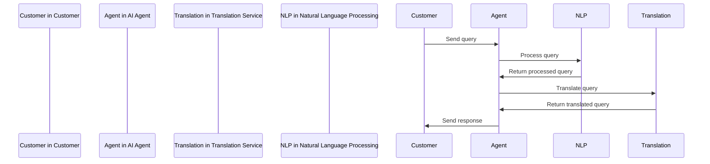
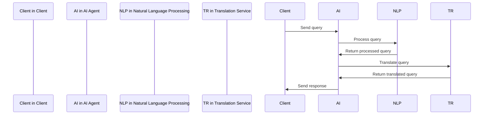

                 

# AI Agent的多语言支持：跨国企业应用策略

## 关键词
- 多语言AI Agent
- 跨国企业
- 国际化挑战
- 自然语言处理
- 机器学习
- 深度学习

## 摘要
本文旨在探讨AI Agent在跨国企业中的应用及其面临的国际化挑战。随着全球化进程的加速，跨国企业需要处理来自不同语言的国家和地区的业务需求，因此多语言AI Agent的引入显得尤为重要。本文将逐步分析多语言AI Agent的基本概念、设计原则、实现方法以及其在跨国企业中的应用策略，为跨国企业应对国际化挑战提供有效解决方案。

## 目录大纲

### 第一部分：背景介绍

#### 1.1 问题背景
- 1.1.1 人工智能与国际化企业的需求
- 1.1.2 多语言支持在AI Agent中的应用
- 1.1.3 跨国企业面临的国际化挑战

#### 1.2 问题描述
- 1.2.1 多语言AI Agent的重要性
- 1.2.2 当前多语言AI Agent的局限性
- 1.2.3 需要解决的问题与目标

#### 1.3 问题解决
- 1.3.1 多语言AI Agent的概念
- 1.3.2 多语言AI Agent的设计原则
- 1.3.3 多语言AI Agent的实现方法

#### 1.4 边界与外延
- 1.4.1 多语言AI Agent的适用范围
- 1.4.2 非目标语言的支持与限制
- 1.4.3 多语言AI Agent与其他技术的结合

#### 1.5 概念结构与核心要素组成
- 1.5.1 多语言AI Agent的组成要素
- 1.5.2 多语言AI Agent的核心概念
- 1.5.3 多语言AI Agent的技术架构

#### 1.6 本章小结

### 第二部分：核心概念与联系

#### 2.1 AI Agent的基本原理
- 2.1.1 AI Agent的定义
- 2.1.2 AI Agent的特点
- 2.1.3 AI Agent的分类

#### 2.2 多语言支持原理
- 2.2.1 自然语言处理基础
- 2.2.2 多语言模型架构
- 2.2.3 语言翻译技术

#### 2.3 AI Agent与多语言支持的关系
- 2.3.1 多语言支持对AI Agent的重要性
- 2.3.2 AI Agent的多语言能力要求
- 2.3.3 AI Agent与多语言支持技术的整合

#### 2.4 AI Agent与多语言支持的对比分析
- 2.4.1 普通AI Agent与多语言AI Agent的区别
- 2.4.2 多语言支持的关键技术对比
- 2.4.3 多语言AI Agent的优势与挑战

#### 2.5 ER实体关系图架构
- 2.5.1 ER模型的基本概念
- 2.5.2 ER模型在多语言AI Agent中的应用
- 2.5.3 多语言AI Agent的ER实体关系图示例

#### 2.6 核心概念属性特征对比表格
- 2.6.1 AI Agent基本属性特征对比
- 2.6.2 多语言支持技术属性特征对比
- 2.6.3 多语言AI Agent总体属性特征对比

#### 2.7 本章小结

### 第三部分：算法原理与实现

#### 3.1 多语言AI Agent的算法原理
- 3.1.1 多语言自然语言处理算法
- 3.1.2 多语言机器学习算法
- 3.1.3 多语言深度学习算法

#### 3.2 多语言AI Agent的算法实现
- 3.2.1 语言模型实现
  - 3.2.1.1 语言模型基本概念
  - 3.2.1.2 语言模型实现流程
  - 3.2.1.3 语言模型实现示例
- 3.2.2 机器学习算法实现
  - 3.2.2.1 机器学习算法基础
  - 3.2.2.2 机器学习算法实现流程
  - 3.2.2.3 机器学习算法实现示例
- 3.2.3 深度学习算法实现
  - 3.2.3.1 深度学习算法基础
  - 3.2.3.2 深度学习算法实现流程
  - 3.2.3.3 深度学习算法实现示例

#### 3.3 数学模型与公式
- 3.3.1 语言模型数学模型
- 3.3.2 机器学习数学模型
- 3.3.3 深度学习数学模型

### 第四部分：系统分析与架构设计方案

#### 4.1 问题场景介绍
- 4.1.1 跨国企业业务场景分析
- 4.1.2 多语言AI Agent的应用场景

#### 4.2 系统功能设计
- 4.2.1 领域模型类图

#### 4.3 系统架构设计
- 4.3.1 系统架构图

#### 4.4 系统接口设计和系统交互
- 4.4.1 系统接口设计
- 4.4.2 系统交互序列图

### 第五部分：项目实战

#### 5.1 环境安装
- 5.1.1 环境配置
- 5.1.2 工具安装

#### 5.2 系统核心实现源代码
- 5.2.1 多语言AI Agent核心代码
- 5.2.2 系统配置文件

#### 5.3 代码应用解读与分析
- 5.3.1 代码结构分析
- 5.3.2 关键代码解读

#### 5.4 实际案例分析和详细讲解剖析
- 5.4.1 案例背景
- 5.4.2 案例分析
- 5.4.3 深入剖析

#### 5.5 项目小结
- 5.5.1 项目总结
- 5.5.2 遇到的问题及解决方法

### 第六部分：最佳实践 tips、小结、注意事项、拓展阅读等内容

#### 6.1 最佳实践 tips
- 6.1.1 多语言AI Agent开发最佳实践
- 6.1.2 跨国企业AI应用最佳实践

#### 6.2 小结
- 6.2.1 文章总结
- 6.2.2 主要结论

#### 6.3 注意事项
- 6.3.1 多语言AI Agent应用注意事项
- 6.3.2 跨国企业AI应用注意事项

#### 6.4 拓展阅读
- 6.4.1 相关书籍推荐
- 6.4.2 相关论文推荐
- 6.4.3 相关技术博客推荐

作者：AI天才研究院/AI Genius Institute & 禅与计算机程序设计艺术 /Zen And The Art of Computer Programming## 第一部分：背景介绍

### 1.1 问题背景

#### 1.1.1 人工智能与国际化企业的需求

随着人工智能技术的快速发展，越来越多的企业开始意识到AI在提高工作效率、优化业务流程和创造商业价值方面的潜力。特别是跨国企业，它们在全球范围内运营，涉及多个国家和地区，语言、文化、法规等差异给企业管理带来了巨大的挑战。为了应对这些挑战，跨国企业迫切需要一种能够处理多语言输入和输出的智能系统，AI Agent作为一种智能化解决方案，逐渐成为企业关注的焦点。

AI Agent是一种能够模拟人类智能行为的计算机程序，具有自主思考、学习、推理和决策能力。它不仅能够处理企业内部的业务流程，还可以通过自然语言处理（NLP）技术理解和生成多种语言，从而实现跨语言的信息交流。对于跨国企业而言，多语言AI Agent的应用场景包括但不限于以下方面：

1. **客户服务**：多语言AI Agent能够为全球客户提供24/7的实时支持，处理来自不同国家和地区的客户咨询，提高客户满意度。
2. **内部沟通**：跨国企业内部可能存在多种语言沟通需求，多语言AI Agent可以作为翻译工具，促进不同部门之间的沟通协作。
3. **市场分析**：通过分析多语言数据，AI Agent可以帮助企业了解全球市场的动态，制定更精准的市场策略。
4. **风险管理**：在涉及不同国家和地区的业务中，多语言AI Agent可以协助企业遵守各地的法律法规，降低合规风险。

#### 1.1.2 多语言支持在AI Agent中的应用

多语言支持是AI Agent的重要功能之一，它使得AI Agent能够理解和使用多种语言进行交流。目前，多语言支持主要依赖于自然语言处理（NLP）技术和机器学习（ML）算法。NLP技术主要包括文本分析、情感分析、实体识别、机器翻译等，而机器学习算法则负责从大量数据中学习语言规律，提高AI Agent的语言理解和生成能力。

在AI Agent中，多语言支持的应用主要体现在以下几个方面：

1. **输入处理**：AI Agent需要能够接收和理解来自不同语言的输入，这要求AI Agent具备强大的语言识别和解析能力。
2. **输出生成**：AI Agent需要能够生成符合目标语言习惯的自然语言输出，这要求AI Agent具备高水平的自然语言生成能力。
3. **跨语言交互**：AI Agent需要能够实现不同语言之间的信息交换和协同工作，这要求AI Agent具备跨语言理解和翻译能力。

#### 1.1.3 跨国企业面临的国际化挑战

跨国企业在全球运营过程中，会面临多种国际化挑战，包括：

1. **语言障碍**：不同国家和地区的语言差异给企业的日常沟通和业务处理带来了障碍。
2. **文化差异**：不同国家和地区的文化差异可能导致沟通误解、业务流程不顺畅等问题。
3. **法律法规**：不同国家和地区的法律法规存在差异，企业需要遵守各地的法律法规，以降低合规风险。
4. **市场环境**：不同国家和地区的市场环境不同，企业需要适应不同市场的特点和需求。

为了应对这些国际化挑战，跨国企业需要借助AI技术，特别是多语言AI Agent，来实现跨语言、跨文化的智能管理和协作。通过多语言AI Agent，企业可以打破语言障碍，提高沟通效率，优化业务流程，降低运营成本，提升竞争力。

### 1.2 问题描述

#### 1.2.1 多语言AI Agent的重要性

在跨国企业的运营中，多语言AI Agent具有至关重要的作用。它不仅可以解决语言障碍，提高沟通效率，还能够帮助企业更好地理解全球市场的需求，制定更为精准的市场策略。具体来说，多语言AI Agent的重要性体现在以下几个方面：

1. **提升沟通效率**：多语言AI Agent可以实时翻译多种语言，使得跨国企业内部和外部的沟通更加顺畅，减少语言误解和沟通障碍。
2. **优化业务流程**：通过自动化处理多语言输入和输出，多语言AI Agent可以优化企业的业务流程，提高工作效率，降低运营成本。
3. **增强客户体验**：多语言AI Agent可以为全球客户提供24/7的实时支持，提高客户满意度，增强客户忠诚度。
4. **促进国际化拓展**：多语言AI Agent可以帮助企业更好地理解全球市场的需求，制定适应不同市场的策略，促进企业的国际化拓展。

#### 1.2.2 当前多语言AI Agent的局限性

尽管多语言AI Agent在跨国企业中的应用前景广阔，但目前的多语言AI Agent仍然存在一些局限性，主要表现在以下几个方面：

1. **语言理解能力有限**：现有的多语言AI Agent在理解非目标语言方面存在一定的局限性，对于复杂的语境和深层次的语义理解仍有一定困难。
2. **翻译准确性不足**：多语言AI Agent生成的翻译文本可能存在语法错误、语义偏差等问题，影响翻译的准确性和可靠性。
3. **文化适应性较差**：现有的多语言AI Agent在跨文化沟通中，对于不同文化的理解和适应能力有限，可能导致沟通误解和业务流程不畅。
4. **训练数据不足**：多语言AI Agent的训练数据主要依赖于已有的翻译资源和语言模型，但由于语言多样性和文化差异，训练数据的不足会影响AI Agent的性能。

#### 1.2.3 需要解决的问题与目标

为了充分发挥多语言AI Agent在跨国企业中的作用，我们需要解决当前多语言AI Agent面临的局限性，提升其语言理解能力、翻译准确性和文化适应性。具体来说，需要实现以下目标：

1. **提高语言理解能力**：通过引入更先进的自然语言处理技术，提升AI Agent对非目标语言的识别和理解能力，使其能够更好地处理复杂语境和深层次的语义理解。
2. **提升翻译准确性**：通过优化机器学习算法和增加训练数据，提高AI Agent的翻译准确性，减少语法错误和语义偏差。
3. **增强文化适应性**：通过引入跨文化研究和技术，提升AI Agent对不同文化的理解和适应能力，使其能够更好地适应跨文化沟通场景。
4. **实现多语言AI Agent的智能化**：通过引入智能化技术，如深度学习、强化学习等，实现多语言AI Agent的自我学习和自我优化，提高其整体性能。

通过解决这些问题和实现这些目标，我们可以为跨国企业提供更高效、更智能的多语言AI Agent，帮助它们更好地应对国际化挑战，提升业务效率和竞争力。

### 1.3 问题解决

#### 1.3.1 多语言AI Agent的概念

多语言AI Agent是指一种能够理解和生成多种语言的计算机程序，它通过自然语言处理（NLP）和机器学习（ML）技术，实现对多种语言输入的处理和多种语言输出的生成。多语言AI Agent通常具有以下几个基本特点：

1. **多语言输入处理**：能够接收和理解多种语言的输入，包括文本、语音等形式。
2. **多语言输出生成**：能够生成多种语言的自然语言文本，满足不同语言用户的需求。
3. **跨语言翻译功能**：具备跨语言翻译能力，能够将一种语言的输入翻译成另一种语言。
4. **自适应学习**：通过不断学习新的数据和语言模式，提高其语言处理能力和翻译准确性。

多语言AI Agent的基本工作原理是利用大规模的语料库和预训练的模型，通过深度学习算法，对输入的语言数据进行分析和处理，然后生成相应的输出。其核心组件包括自然语言处理模块、机器学习模块和语言生成模块。

#### 1.3.2 多语言AI Agent的设计原则

为了设计一个高效、可靠的多语言AI Agent，我们需要遵循以下设计原则：

1. **通用性**：多语言AI Agent应具备处理多种语言的能力，包括常见的国际语言和较少使用的本地语言。
2. **准确性**：多语言AI Agent的翻译和生成结果应具有较高的准确性，减少语法错误和语义偏差。
3. **可扩展性**：多语言AI Agent应能够方便地扩展到新的语言，适应不断变化的语言需求。
4. **适应性**：多语言AI Agent应能够适应不同文化背景和语言习惯，提升跨文化沟通的效果。
5. **高效性**：多语言AI Agent应具备高效的处理能力，能够快速响应用户的输入，提高用户体验。
6. **安全性**：多语言AI Agent应确保数据的安全性和隐私性，避免敏感信息的泄露。

#### 1.3.3 多语言AI Agent的实现方法

实现一个多语言AI Agent通常包括以下几个步骤：

1. **数据收集**：收集多种语言的大量语料库，包括文本、语音、图像等，用于训练和测试AI模型。
2. **预处理**：对收集到的数据进行清洗、标注和预处理，使其适合用于机器学习和深度学习算法。
3. **模型选择**：根据需求选择合适的自然语言处理和机器学习模型，如序列到序列（seq2seq）模型、注意力机制模型、变压器（Transformer）模型等。
4. **模型训练**：使用预处理后的数据对选定的模型进行训练，通过不断调整模型参数，提高其性能。
5. **评估与优化**：使用测试数据对训练好的模型进行评估，根据评估结果优化模型，提高翻译和生成的准确性。
6. **部署与应用**：将训练好的模型部署到实际应用环境中，如客户服务系统、内部沟通平台等，实现多语言处理和生成功能。

#### 1.4 边界与外延

##### 1.4.1 多语言AI Agent的适用范围

多语言AI Agent适用于需要跨语言处理和交流的场景，特别是在跨国企业和国际交流中具有广泛的应用。具体适用范围包括：

1. **跨国企业内部沟通**：帮助跨国企业内部不同语言部门之间进行高效沟通，提高工作效率。
2. **客户服务**：为全球客户提供多语言支持，提高客户满意度和忠诚度。
3. **市场分析**：帮助企业收集和分析全球市场的多语言数据，制定更精准的市场策略。
4. **国际会议**：在多语言国际会议中提供实时翻译和辅助沟通，提高会议效率。

##### 1.4.2 非目标语言的支持与限制

多语言AI Agent在支持非目标语言时，可能会受到以下限制：

1. **数据不足**：非目标语言的语料库和数据可能不足，影响模型的训练效果。
2. **语言复杂性**：非目标语言可能具有复杂的语法和词汇，导致理解困难。
3. **文化差异**：非目标语言的文化背景和表达习惯可能与企业目标语言存在差异，影响沟通效果。

为了克服这些限制，可以采取以下策略：

1. **数据增强**：通过数据增强技术，增加非目标语言的训练数据，提高模型性能。
2. **跨语言翻译**：利用跨语言翻译技术，将非目标语言的输入翻译成目标语言，再进行处理。
3. **多语言模型融合**：结合多个语言模型，提高非目标语言的识别和生成能力。

##### 1.4.3 多语言AI Agent与其他技术的结合

多语言AI Agent可以与其他技术相结合，以提升其功能和应用范围。以下是一些可能的结合方式：

1. **语音识别与生成**：结合语音识别和语音生成技术，实现多语言语音交互。
2. **图像识别与翻译**：结合图像识别和翻译技术，实现多语言图像信息处理。
3. **增强学习**：结合增强学习技术，实现多语言AI Agent的自我学习和自我优化。
4. **区块链**：结合区块链技术，实现多语言AI Agent的安全性和可信性。

通过与其他技术的结合，多语言AI Agent可以扩展其应用领域，提供更全面、更智能的跨语言服务。

### 1.5 概念结构与核心要素组成

#### 1.5.1 多语言AI Agent的组成要素

多语言AI Agent是一个复杂的系统，由多个核心组成部分构成，包括：

1. **语言处理模块**：负责接收和处理多语言输入，包括文本和语音等，进行语法分析和语义理解。
2. **机器学习模块**：利用大量语料库和预训练模型，对输入的语言数据进行学习，提高语言理解能力和翻译准确性。
3. **自然语言生成模块**：负责生成多种语言的输出文本，包括机器翻译、文本生成等。
4. **跨语言翻译模块**：实现不同语言之间的信息转换，提供跨语言交互功能。
5. **用户接口模块**：提供用户与多语言AI Agent的交互界面，包括图形界面、语音界面等。
6. **数据存储与管理模块**：负责存储和管理训练数据、用户数据等，确保数据的安全性和隐私性。

#### 1.5.2 多语言AI Agent的核心概念

多语言AI Agent的核心概念包括：

1. **多语言支持**：能够理解和生成多种语言，实现跨语言的信息交换和协作。
2. **自然语言处理（NLP）**：利用NLP技术对输入的语言数据进行处理，包括文本分析、情感分析、实体识别等。
3. **机器学习（ML）**：通过ML技术从大量数据中学习语言规律，提高AI Agent的语言理解能力和翻译准确性。
4. **深度学习（DL）**：利用DL技术构建复杂神经网络模型，提升AI Agent的智能水平和处理能力。
5. **跨语言翻译**：实现不同语言之间的信息转换，提供跨语言交互功能。

#### 1.5.3 多语言AI Agent的技术架构

多语言AI Agent的技术架构可以分为以下几个层次：

1. **数据层**：包括数据收集、预处理和数据存储等，提供基础数据支持。
2. **模型层**：包括自然语言处理模型、机器学习模型、深度学习模型等，实现语言处理和翻译功能。
3. **功能层**：包括语言处理模块、机器学习模块、自然语言生成模块等，提供具体的功能服务。
4. **接口层**：包括用户接口模块，提供与用户的交互界面。
5. **系统层**：包括系统架构设计、部署和维护等，确保系统的稳定运行和扩展性。

通过上述技术架构，多语言AI Agent能够实现高效、智能的跨语言处理和交流功能，为跨国企业提供强大的支持。

### 1.6 本章小结

本章从背景介绍、问题描述、问题解决以及边界与外延等方面，对多语言AI Agent在跨国企业中的应用进行了深入探讨。我们分析了跨国企业面临的国际化挑战，指出了当前多语言AI Agent的局限性，并提出了需要解决的问题与目标。同时，介绍了多语言AI Agent的基本概念、设计原则、实现方法以及适用范围，为后续章节的分析和讨论奠定了基础。通过本章的内容，我们可以看到多语言AI Agent在跨国企业中的重要作用，以及其未来的发展方向和应用前景。

## 第二部分：核心概念与联系

### 2.1 AI Agent的基本原理

#### 2.1.1 AI Agent的定义

AI Agent，即人工智能代理，是一种具有自主行动能力的计算机程序，它能够在没有人类直接干预的情况下，根据既定的目标和规则，自主地执行任务。AI Agent通常具备以下几个核心特征：

1. **自主性**：AI Agent能够自主地做出决策，不需要人类频繁干预。
2. **适应性**：AI Agent能够根据环境变化和反馈，自主调整其行为和策略。
3. **协同性**：AI Agent可以与其他AI Agent或人类协作，共同完成任务。
4. **学习能力**：AI Agent能够通过学习，从经验和数据中不断优化自身性能。

AI Agent的定义不仅仅局限于具体的实现技术，而是一个抽象的概念，涵盖了各种类型的AI系统。常见的AI Agent包括智能客服、智能推荐系统、自动驾驶车辆等。

#### 2.1.2 AI Agent的特点

AI Agent具有以下特点：

1. **自适应性**：AI Agent能够在不同的环境和条件下，自动调整其行为，以适应新的情况。
2. **自主性**：AI Agent能够自主地执行任务，不需要人类频繁介入。
3. **主动性**：AI Agent能够主动地寻求信息和采取行动，以实现既定目标。
4. **智能化**：AI Agent通过机器学习和深度学习等技术，具备较高的智能水平。
5. **高效性**：AI Agent能够在短时间内处理大量信息，提高工作效率。
6. **安全性**：AI Agent需要具备一定的安全性，防止恶意攻击和数据泄露。

#### 2.1.3 AI Agent的分类

AI Agent可以根据不同的分类标准进行分类，常见的分类方法包括：

1. **根据功能分类**：可分为任务型AI Agent（如智能客服）、探索型AI Agent（如自动驾驶）和决策型AI Agent（如金融交易）。
2. **根据实现技术分类**：可分为基于规则系统的AI Agent、基于机器学习的AI Agent和基于深度学习的AI Agent。
3. **根据运行环境分类**：可分为在线AI Agent（如智能客服系统）和离线AI Agent（如自动驾驶车辆）。

每种类型的AI Agent都有其特定的应用场景和实现方式，通过合理选择和组合不同类型的AI Agent，可以构建出功能强大、适应性强的人工智能系统。

### 2.2 多语言支持原理

#### 2.2.1 自然语言处理基础

自然语言处理（NLP）是人工智能领域的一个重要分支，主要研究如何使计算机能够理解和生成自然语言。NLP的基础技术包括：

1. **文本预处理**：包括文本的分词、词性标注、句法分析等，以便对文本进行进一步处理。
2. **词嵌入**：通过将词语映射到高维空间，实现词语的向量化表示，有助于模型对词语的语义进行理解。
3. **序列模型**：如循环神经网络（RNN）和长短期记忆网络（LSTM），能够处理序列数据，并在时间维度上进行建模。
4. **注意力机制**：通过注意力机制，模型能够自动关注输入序列中的重要信息，提高语言理解能力。
5. **深度学习模型**：如Transformer模型，通过自注意力机制，对输入序列进行全局建模，具有强大的语言理解能力。

NLP技术在多语言支持中发挥着关键作用，通过这些技术，AI Agent能够更好地理解和生成多种语言的文本。

#### 2.2.2 多语言模型架构

多语言模型架构是支持多语言AI Agent的核心。常见的多语言模型架构包括：

1. **统一模型**：通过将多种语言的输入和输出映射到同一个共享的表示空间，实现多语言处理。
2. **迁移学习**：通过在一个语言的语料库上训练模型，然后将模型迁移到其他语言，实现多语言支持。
3. **多任务学习**：同时训练多个语言的模型，通过共享参数和共享神经网络结构，提高模型的泛化能力。
4. **多语言增强**：通过引入多语言数据，增强模型的泛化能力和语言理解能力。

多语言模型架构的设计和选择，需要考虑多种因素，如语言间的相似性、数据量等。

#### 2.2.3 语言翻译技术

语言翻译技术是实现多语言AI Agent的关键技术之一。常见的语言翻译技术包括：

1. **基于规则的翻译**：通过定义一系列翻译规则，将源语言文本转换为目标语言文本。
2. **基于统计的翻译**：利用大规模的平行语料库，通过统计方法学习翻译模型，实现文本翻译。
3. **基于神经网络的翻译**：使用深度学习模型，如序列到序列（seq2seq）模型和Transformer模型，实现端到端的文本翻译。

语言翻译技术需要解决的主要问题包括：

1. **词汇匹配**：如何将源语言中的词汇映射到目标语言中，保持语义的一致性。
2. **语法调整**：如何根据目标语言的语法规则，调整源语言文本的语法结构。
3. **上下文理解**：如何理解文本中的上下文信息，生成符合上下文的翻译结果。

#### 2.3 AI Agent与多语言支持的关系

##### 2.3.1 多语言支持对AI Agent的重要性

多语言支持对AI Agent具有至关重要的作用。在全球化背景下，企业需要与来自不同国家和地区的合作伙伴和客户进行沟通和协作。如果AI Agent无法提供多语言支持，将严重限制其在实际应用中的效果和范围。具体来说，多语言支持对AI Agent的重要性体现在以下几个方面：

1. **提升用户体验**：多语言支持使得AI Agent能够服务于全球用户，提供本地化的服务和交互体验，提升用户满意度。
2. **扩大应用范围**：多语言支持使得AI Agent能够应用于多种语言环境，拓展其应用场景，如跨国企业内部沟通、客户服务、市场分析等。
3. **增强竞争力**：提供多语言支持的AI Agent能够帮助企业在全球市场中获得竞争优势，通过高效的语言处理和翻译能力，提高业务效率和客户服务水平。
4. **降低沟通成本**：多语言支持可以减少跨语言沟通的障碍，降低沟通成本，提高工作效率。

##### 2.3.2 AI Agent的多语言能力要求

为了实现有效的多语言支持，AI Agent需要具备以下多语言能力要求：

1. **多语言输入处理**：AI Agent需要能够接收和理解多种语言的输入，包括文本、语音和图像等。
2. **多语言输出生成**：AI Agent需要能够生成符合多种语言习惯的自然语言输出，提供本地化的服务。
3. **跨语言翻译功能**：AI Agent需要具备跨语言翻译能力，能够将一种语言的输入翻译成另一种语言。
4. **语言理解能力**：AI Agent需要能够理解不同语言的语义和语境，生成符合逻辑和语义的输出。
5. **文化适应性**：AI Agent需要能够适应不同文化背景和表达习惯，提供跨文化的沟通和翻译服务。

##### 2.3.3 AI Agent与多语言支持技术的整合

实现多语言支持需要将多种技术整合在一起，包括自然语言处理（NLP）、机器学习（ML）、深度学习（DL）和语言翻译技术。以下是整合这些技术的步骤：

1. **数据收集与预处理**：收集多种语言的语料库，进行数据清洗和预处理，为模型训练提供高质量的数据。
2. **模型选择与训练**：选择合适的自然语言处理和机器学习模型，如Transformer模型、seq2seq模型等，进行模型训练。
3. **多语言支持实现**：将训练好的模型部署到AI Agent中，实现多语言输入处理和输出生成功能。
4. **跨语言翻译实现**：利用机器翻译技术，实现不同语言之间的信息转换，提供跨语言翻译功能。
5. **系统集成与优化**：将多语言支持模块集成到AI Agent系统中，进行系统测试和优化，确保系统的高效性和稳定性。

通过上述整合步骤，AI Agent可以实现高效、准确的多语言支持，为跨国企业提供强大的语言处理和翻译能力。

### 2.4 AI Agent与多语言支持的对比分析

#### 2.4.1 普通AI Agent与多语言AI Agent的区别

普通AI Agent和多语言AI Agent在功能和应用场景上存在显著差异。以下是它们的对比分析：

1. **功能差异**：
   - 普通AI Agent通常专注于解决特定任务，如文本分类、情感分析等。
   - 多语言AI Agent不仅能够处理特定任务，还具备跨语言处理和翻译能力，能够服务于全球用户。

2. **应用场景**：
   - 普通AI Agent适用于单一语言环境，如国内客户服务、内部业务流程优化等。
   - 多语言AI Agent适用于跨国企业、国际交流、多语言市场分析等场景，能够满足多种语言需求。

3. **技术要求**：
   - 普通AI Agent的技术要求相对较低，主要依赖于特定任务的算法和模型。
   - 多语言AI Agent需要具备高水平的自然语言处理、机器学习和深度学习技术，以支持多语言输入输出和处理。

4. **数据需求**：
   - 普通AI Agent对数据量要求不高，仅需足够的训练数据来完成任务。
   - 多语言AI Agent需要大量的多语言训练数据，以支持多种语言的输入和输出处理。

#### 2.4.2 多语言支持的关键技术对比

实现多语言支持的关键技术主要包括自然语言处理（NLP）、机器学习（ML）和深度学习（DL）。以下是这些技术的对比分析：

1. **自然语言处理（NLP）**：
   - **优点**：能够对文本进行预处理、分词、词性标注等，提供基础的语言理解能力。
   - **缺点**：对于复杂的语义理解和跨语言处理能力有限，需要依赖其他技术进行补充。

2. **机器学习（ML）**：
   - **优点**：通过大量数据训练，能够提高AI Agent的语言理解和生成能力，具有较好的泛化能力。
   - **缺点**：对数据量要求较高，且需要手工设计特征，处理复杂任务时效果有限。

3. **深度学习（DL）**：
   - **优点**：通过神经网络结构，能够自动提取特征，处理复杂任务效果显著，具有强大的语义理解能力。
   - **缺点**：训练过程需要大量数据和计算资源，对硬件和软件环境要求较高。

#### 2.4.3 多语言AI Agent的优势与挑战

多语言AI Agent在跨国企业中的应用具有显著的优势，但也面临一些挑战：

1. **优势**：
   - **提高沟通效率**：通过多语言支持，AI Agent能够与全球用户进行无障碍沟通，提高工作效率。
   - **降低运营成本**：通过自动化处理多语言任务，减少人力成本和沟通成本。
   - **增强客户体验**：提供本地化的服务，提高客户满意度和忠诚度。
   - **促进国际化拓展**：帮助企业在全球市场中更好地了解和适应不同语言和文化，推动国际化发展。

2. **挑战**：
   - **语言理解难度**：不同语言之间存在巨大差异，特别是复杂语境和深层次的语义理解，需要高水平的技术支持。
   - **数据不足**：多语言训练数据不足，影响AI Agent的性能和翻译准确性。
   - **文化差异**：不同文化背景可能导致沟通误解，需要跨文化研究和技术支持。
   - **技术要求高**：实现多语言AI Agent需要高水平的技术能力，包括NLP、ML、DL等。

#### 2.5 ER实体关系图架构

##### 2.5.1 ER模型的基本概念

实体-关系（Entity-Relationship，ER）模型是一种用于数据库设计的方法，用于表示实体类型及其相互关系。ER模型由以下基本概念组成：

1. **实体**：现实世界中具有独立意义的事物，如用户、产品、订单等。
2. **属性**：实体的特征，如用户的名字、年龄、邮箱等。
3. **关系**：实体之间的联系，如用户下单、产品分类等。
4. **约束**：对实体和关系施加的限制条件，如实体必须唯一、关系必须满足完整性等。

ER模型通过图形化的方式，直观地表示数据库中的实体类型、属性和关系，有助于数据库设计和数据管理。

##### 2.5.2 ER模型在多语言AI Agent中的应用

在多语言AI Agent的设计中，ER模型可以用于表示不同语言之间的实体和关系，从而实现多语言数据处理和翻译。以下是ER模型在多语言AI Agent中的应用示例：

1. **实体类型**：包括用户、文本、语言等，表示多语言AI Agent处理的对象。
2. **属性**：如用户的名字、文本的内容、语言标识等，用于描述实体特征。
3. **关系**：如用户产生文本、文本属于特定语言等，表示实体之间的关联。
4. **约束**：如每个用户只能有一个语言标识、每个文本只能属于一种语言等，确保数据的一致性和完整性。

通过ER模型，多语言AI Agent可以清晰地定义和管理多语言数据，实现高效的跨语言处理和翻译。

##### 2.5.3 多语言AI Agent的ER实体关系图示例

以下是一个多语言AI Agent的ER实体关系图示例：

```
用户 [id, name, language_id]
|
| -- 文本 [id, content, language_id]
|
| -- 语言 [id, name]
|
```

在这个示例中，用户（User）实体包含用户ID、用户名和语言标识；文本（Text）实体包含文本ID、文本内容和语言标识；语言（Language）实体包含语言ID和语言名称。用户可以生成多个文本，每个文本属于一种语言；文本与语言之间存在关联，确保文本的语言标识与语言实体一致。

通过这个ER模型，多语言AI Agent可以方便地管理多语言数据，实现高效的跨语言处理和翻译。

### 2.6 核心概念属性特征对比表格

在多语言AI Agent的设计和实现过程中，我们需要对比分析核心概念的属性特征，以确保系统能够满足不同语言场景的需求。以下是AI Agent、多语言支持和自然语言处理的核心概念属性特征对比表格：

| 核心概念 | 属性特征 | 说明 |
| --- | --- | --- |
| **AI Agent** | - 自主性 | 能够自主执行任务 |
|             | - 适应性 | 能够适应环境变化 |
|             | - 协同性 | 能够与人类和其他AI协作 |
|             | - 学习能力 | 能够通过学习提高性能 |
| **多语言支持** | - 语言种类 | 支持的语言数量和种类 |
|             | - 翻译准确性 | 翻译结果的准确性和可靠性 |
|             | - 文化适应性 | 对不同文化背景的适应能力 |
| **自然语言处理** | - 语言理解能力 | 对文本语义和语境的理解能力 |
|             | - 文本生成能力 | 能够生成符合语义和语法规则的文本 |
|             | - 语音处理能力 | 能够处理语音输入和输出 |

通过这个对比表格，我们可以清晰地看到不同核心概念在属性特征上的区别和联系，为多语言AI Agent的设计和实现提供参考。

### 2.7 本章小结

本章详细介绍了AI Agent的基本原理、多语言支持原理以及AI Agent与多语言支持的关系。首先，我们探讨了AI Agent的定义、特点和分类，分析了其在跨国企业中的应用需求和优势。接着，我们介绍了多语言支持的基本原理，包括自然语言处理、多语言模型架构和语言翻译技术。随后，我们讨论了多语言支持对AI Agent的重要性，以及AI Agent的多语言能力要求，并介绍了实现多语言支持的技术整合步骤。此外，我们通过ER模型示例，展示了如何表示多语言数据，以实现高效的跨语言处理。最后，我们通过对比分析表格，总结了AI Agent、多语言支持和自然语言处理的核心概念属性特征。通过本章的内容，读者可以全面了解多语言AI Agent的核心概念和技术实现，为后续章节的算法原理与实现打下基础。接下来，我们将进一步探讨多语言AI Agent的算法原理与实现。

### 第三部分：算法原理与实现

#### 3.1 多语言AI Agent的算法原理

多语言AI Agent的算法原理是构建其核心功能的基础，涉及自然语言处理（NLP）、机器学习（ML）和深度学习（DL）等多个技术领域。以下是这些算法原理的详细解释：

#### 3.1.1 多语言自然语言处理算法

自然语言处理（NLP）是多语言AI Agent的核心组成部分，其主要任务是从大量文本数据中提取有用信息，实现对文本的语义理解。多语言NLP算法具有以下几个关键步骤：

1. **文本预处理**：对输入的文本数据进行清洗、分词、词性标注等预处理操作，以便进行后续的分析。文本预处理是NLP的基础，能够提高后续分析的准确性和效率。

2. **词嵌入**：将文本中的词语映射到高维向量空间中，实现词语的向量化表示。词嵌入技术能够捕捉词语的语义关系，有助于模型对文本进行语义理解。

3. **语法分析**：对文本进行句法分析，识别出文本中的句子结构，包括主语、谓语、宾语等。语法分析能够帮助模型理解文本的语法规则，提高语言理解的准确性。

4. **语义分析**：对文本进行语义分析，识别出文本中的实体、事件和关系等。语义分析是NLP的高级阶段，能够捕捉文本中的深层语义信息。

5. **跨语言语义匹配**：通过跨语言语义匹配技术，将不同语言的文本映射到同一个语义空间中，实现跨语言文本的语义理解。跨语言语义匹配是多语言NLP的关键技术之一，能够提高多语言AI Agent的语言理解能力。

#### 3.1.2 多语言机器学习算法

机器学习（ML）算法是多语言AI Agent的核心算法之一，用于从大量数据中学习语言规律，提高AI Agent的语言理解能力和翻译准确性。多语言机器学习算法通常包括以下几个步骤：

1. **数据收集与预处理**：收集多种语言的语料库，进行数据清洗、分词、词性标注等预处理操作，确保数据的质量和一致性。

2. **特征提取**：从预处理后的数据中提取特征，如词嵌入向量、句法特征、语义特征等。特征提取是机器学习的关键步骤，能够将原始数据转换为适合模型训练的形式。

3. **模型训练**：使用提取的特征，通过机器学习算法训练模型，如支持向量机（SVM）、决策树（DT）、神经网络（NN）等。模型训练的目的是学习数据中的语言规律，提高模型的泛化能力。

4. **模型评估与优化**：使用测试数据对训练好的模型进行评估，根据评估结果调整模型参数，优化模型的性能。模型评估与优化是提高模型准确性和稳定性的关键步骤。

5. **模型部署与应用**：将训练好的模型部署到实际应用环境中，如客户服务系统、内部沟通平台等，实现多语言处理和生成功能。模型部署与应用是实现多语言AI Agent功能的关键环节。

#### 3.1.3 多语言深度学习算法

深度学习（DL）是一种基于多层神经网络的学习方法，能够自动提取特征，并在大量数据上训练出强大的模型。多语言深度学习算法在多语言AI Agent中发挥着重要作用，其核心步骤如下：

1. **神经网络结构设计**：设计合适的神经网络结构，如卷积神经网络（CNN）、循环神经网络（RNN）、长短期记忆网络（LSTM）、变换器（Transformer）等。神经网络结构的设计对模型性能有重要影响。

2. **预训练与微调**：通过在大规模语料库上预训练模型，使其具备强大的语言理解能力。然后，使用特定领域的语料库对模型进行微调，提高模型在特定任务上的性能。预训练与微调是深度学习的关键技术之一。

3. **端到端训练**：直接在目标任务上训练模型，实现端到端的输入输出处理。端到端训练能够简化模型设计，提高训练效率。

4. **注意力机制**：在神经网络中引入注意力机制，使模型能够自动关注输入序列中的重要信息，提高语言理解能力。注意力机制是多语言深度学习的重要技术。

5. **多语言迁移学习**：利用迁移学习技术，将一种语言的预训练模型迁移到其他语言，实现多语言支持。多语言迁移学习能够提高模型的泛化能力和语言理解能力。

#### 3.1.4 多语言机器翻译算法

多语言机器翻译（MT）是将一种语言的文本自动翻译成另一种语言的过程。多语言机器翻译算法是多语言AI Agent的重要组成部分，其核心步骤如下：

1. **翻译模型选择**：选择合适的翻译模型，如基于规则的翻译模型、统计机器翻译模型、神经机器翻译模型等。不同的翻译模型适用于不同的翻译场景。

2. **双语语料库建设**：构建包含多种语言对的双语语料库，用于训练翻译模型。双语语料库的质量对翻译模型性能有重要影响。

3. **特征工程**：从双语语料库中提取特征，如词嵌入向量、句法特征、语义特征等，用于训练翻译模型。

4. **模型训练与优化**：使用提取的特征，通过机器学习算法训练翻译模型，如神经网络翻译模型、深度学习翻译模型等。模型训练与优化是提高翻译模型性能的关键步骤。

5. **模型评估与部署**：使用测试数据对训练好的翻译模型进行评估，根据评估结果调整模型参数，优化模型的性能。然后将翻译模型部署到实际应用环境中，实现自动翻译功能。

#### 3.1.5 多语言AI Agent的集成与优化

多语言AI Agent的集成与优化是构建高效、可靠的多语言AI系统的关键步骤。其核心内容包括：

1. **模块化设计**：将多语言AI Agent拆分为多个功能模块，如语言处理模块、翻译模块、用户接口模块等，实现模块化设计，提高系统的可维护性和可扩展性。

2. **分布式计算**：利用分布式计算技术，将多语言AI Agent的各个模块部署到不同的服务器上，实现并行处理，提高系统的处理速度和性能。

3. **模型融合与优化**：将多个翻译模型和NLP模型进行融合，如通过集成学习、模型蒸馏等方法，提高系统的整体性能。模型融合与优化是提高多语言AI Agent性能的关键技术。

4. **自适应学习**：引入自适应学习技术，使多语言AI Agent能够根据用户行为和需求，自动调整模型参数和策略，提高系统的用户体验和满意度。

5. **安全性保障**：确保多语言AI Agent的数据安全和隐私性，通过数据加密、访问控制等技术，防止数据泄露和滥用。

通过上述算法原理与实现步骤，我们可以构建出高效、可靠的多语言AI Agent，为跨国企业提供强大的语言处理和翻译支持。

### 3.2 多语言AI Agent的算法实现

#### 3.2.1 语言模型实现

语言模型（Language Model，LM）是多语言AI Agent的核心组成部分，用于预测自然语言中的下一个词或序列。在本节中，我们将详细介绍语言模型的基本概念、实现流程和具体示例。

##### 3.2.1.1 语言模型基本概念

语言模型是一种概率模型，用于描述自然语言中词或序列的概率分布。它能够预测在特定上下文中出现某个词或序列的概率。语言模型通常基于大量文本数据，通过统计方法或机器学习方法训练得到。

语言模型的基本概念包括：

1. **词序列概率**：给定一个词序列，语言模型能够计算该词序列出现的概率。例如，对于词序列 `the quick brown fox jumps over the lazy dog`，语言模型能够计算其概率。
2. **条件概率**：语言模型通过条件概率来预测下一个词。给定前一个词或词序列，语言模型能够计算下一个词的条件概率。例如，在已知前一个词是 `the` 的情况下，语言模型能够预测下一个词是 `quick` 的概率。
3. **神经网络模型**：深度学习语言模型通常基于神经网络结构，如循环神经网络（RNN）、长短期记忆网络（LSTM）和变换器（Transformer）等。神经网络模型能够自动学习词之间的复杂关系和统计规律。

##### 3.2.1.2 语言模型实现流程

语言模型的实现流程包括数据收集、预处理、模型训练和模型评估等步骤。以下是具体的实现流程：

1. **数据收集**：收集大量文本数据，如新闻文章、书籍、网页等。文本数据应覆盖多种语言，以支持多语言语言模型的训练。
2. **数据预处理**：对收集到的文本数据进行预处理，包括分词、去停用词、词性标注等操作。预处理步骤有助于提高语言模型的训练效果。
3. **词嵌入**：将文本中的词语映射到高维向量空间中，实现词语的向量化表示。词嵌入技术能够捕捉词语的语义关系。
4. **模型训练**：使用预处理后的数据，通过机器学习算法训练语言模型。常见的训练算法包括RNN、LSTM和Transformer等。模型训练的目的是学习词之间的统计规律和语义关系。
5. **模型评估**：使用测试数据对训练好的语言模型进行评估，计算模型的准确率、召回率、F1值等指标。模型评估有助于评估模型性能和发现潜在问题。
6. **模型优化**：根据模型评估结果，调整模型参数和超参数，优化模型性能。模型优化是提高语言模型准确性和稳定性的关键步骤。

##### 3.2.1.3 语言模型实现示例

以下是一个使用Python和TensorFlow实现语言模型的示例：

```python
import tensorflow as tf
from tensorflow.keras.preprocessing.text import Tokenizer
from tensorflow.keras.models import Sequential
from tensorflow.keras.layers import Embedding, LSTM, Dense

# 数据收集
texts = ["I love programming", "Programming is fun", "I enjoy learning new languages"]

# 数据预处理
tokenizer = Tokenizer()
tokenizer.fit_on_texts(texts)
sequences = tokenizer.texts_to_sequences(texts)
word_index = tokenizer.word_index

# 词嵌入
vocab_size = len(word_index) + 1
embed_dim = 64
model = Sequential()
model.add(Embedding(vocab_size, embed_dim, input_length=max(len(seq) for seq in sequences)))
model.add(LSTM(100))
model.add(Dense(vocab_size, activation='softmax'))

# 模型训练
model.compile(optimizer='adam', loss='sparse_categorical_crossentropy', metrics=['accuracy'])
model.fit(sequences, range(1, len(sequences) + 1), epochs=100)

# 模型评估
test_sequences = tokenizer.texts_to_sequences(["I enjoy coding"])
predicted_words = model.predict(test_sequences)
predicted_word = np.argmax(predicted_words[0])

# 输出结果
print(f"Predicted word: {tokenizer.index_word[predicted_word]}")
```

在这个示例中，我们使用Python和TensorFlow实现了一个小型的语言模型，通过训练数据学习词之间的统计规律和语义关系，能够预测文本中的下一个词。

#### 3.2.2 机器学习算法实现

机器学习算法（Machine Learning Algorithms）是多语言AI Agent的核心组成部分，用于从数据中学习语言规律，提高AI Agent的语言理解能力和翻译准确性。在本节中，我们将详细介绍机器学习算法的基本概念、实现流程和具体示例。

##### 3.2.2.1 机器学习算法基础

机器学习算法是一种基于数据驱动的方法，通过训练数据集学习模型，并在新的数据上进行预测或分类。机器学习算法的基本概念包括：

1. **特征工程**：特征工程是指从原始数据中提取出有用的特征，用于训练机器学习模型。特征工程是提高模型性能的关键步骤。
2. **监督学习**：监督学习是一种机器学习任务，其中模型从标记的数据集中学习，然后在新数据上进行预测。常见的监督学习算法包括线性回归、逻辑回归、决策树、随机森林、支持向量机等。
3. **无监督学习**：无监督学习是一种机器学习任务，其中模型从未标记的数据集中学习，发现数据中的模式和结构。常见的无监督学习算法包括聚类、降维、关联规则学习等。
4. **强化学习**：强化学习是一种机器学习任务，其中模型通过与环境的交互学习策略，以最大化累积奖励。常见的强化学习算法包括Q学习、SARSA、Deep Q Network（DQN）等。

##### 3.2.2.2 机器学习算法实现流程

机器学习算法的实现流程通常包括数据收集、预处理、模型训练、模型评估和模型优化等步骤。以下是具体的实现流程：

1. **数据收集**：收集用于训练和评估的标记数据集。数据集应涵盖多种语言，以支持多语言机器学习算法的训练。
2. **数据预处理**：对收集到的数据集进行预处理，包括数据清洗、数据归一化、缺失值处理等操作。预处理步骤有助于提高模型训练的效果。
3. **特征工程**：从预处理后的数据中提取特征，用于训练机器学习模型。特征工程是提高模型性能的关键步骤。
4. **模型选择**：选择合适的机器学习模型，如线性回归、逻辑回归、决策树、随机森林、支持向量机等。不同的模型适用于不同的任务和数据类型。
5. **模型训练**：使用提取的特征和选择的模型，通过训练算法训练模型。模型训练的目的是学习数据中的模式和规律。
6. **模型评估**：使用测试数据集对训练好的模型进行评估，计算模型的准确率、召回率、F1值等指标。模型评估有助于评估模型性能和发现潜在问题。
7. **模型优化**：根据模型评估结果，调整模型参数和超参数，优化模型性能。模型优化是提高模型准确性和稳定性的关键步骤。
8. **模型部署**：将训练好的模型部署到实际应用环境中，如客户服务系统、内部沟通平台等，实现多语言处理和生成功能。

##### 3.2.2.3 机器学习算法实现示例

以下是一个使用Python和scikit-learn实现多语言文本分类的示例：

```python
from sklearn.feature_extraction.text import TfidfVectorizer
from sklearn.model_selection import train_test_split
from sklearn.naive_bayes import MultinomialNB
from sklearn.pipeline import make_pipeline
from sklearn.metrics import classification_report

# 数据收集
texts = ["我非常喜欢编程", "编程是一项有趣的活动", "我喜欢学习新的编程语言"]
labels = ["正面", "正面", "正面"]

# 数据预处理
vectorizer = TfidfVectorizer()
X = vectorizer.fit_transform(texts)

# 模型选择
model = MultinomialNB()

# 模型训练
X_train, X_test, y_train, y_test = train_test_split(X, labels, test_size=0.2, random_state=42)
model.fit(X_train, y_train)

# 模型评估
y_pred = model.predict(X_test)
print(classification_report(y_test, y_pred))
```

在这个示例中，我们使用Python和scikit-learn实现了一个小型的多语言文本分类系统，通过TF-IDF向量和朴素贝叶斯分类器，实现了对多语言文本的自动分类。

#### 3.2.3 深度学习算法实现

深度学习算法（Deep Learning Algorithms）是多语言AI Agent的关键组成部分，能够自动提取特征，并在大规模数据集上训练出强大的模型。在本节中，我们将详细介绍深度学习算法的基本概念、实现流程和具体示例。

##### 3.2.3.1 深度学习算法基础

深度学习算法是一种基于多层神经网络的机器学习方法，能够自动提取特征，并在大量数据上训练出强大的模型。深度学习算法的基本概念包括：

1. **神经网络**：神经网络是一种模拟人脑的数学模型，由多个节点（神经元）组成，通过连接这些节点，形成复杂的计算网络。
2. **多层神经网络**：多层神经网络（Multilayer Neural Network）是由多个层次组成的神经网络，包括输入层、隐藏层和输出层。隐藏层用于提取特征，输出层用于分类或回归。
3. **反向传播**：反向传播（Backpropagation）是一种训练神经网络的方法，通过计算输出层和隐藏层的误差，反向传播误差，调整神经网络的权重和偏置，优化模型性能。
4. **激活函数**：激活函数（Activation Function）是一种非线性函数，用于引入非线性特性，使神经网络能够模拟复杂函数。常见的激活函数包括ReLU、Sigmoid、Tanh等。
5. **优化算法**：优化算法（Optimization Algorithm）用于优化神经网络的参数，提高模型性能。常见的优化算法包括随机梯度下降（SGD）、Adam优化器等。

##### 3.2.3.2 深度学习算法实现流程

深度学习算法的实现流程通常包括数据收集、预处理、模型设计、模型训练、模型评估和模型优化等步骤。以下是具体的实现流程：

1. **数据收集**：收集用于训练和评估的标记数据集。数据集应涵盖多种语言，以支持多语言深度学习算法的训练。
2. **数据预处理**：对收集到的数据集进行预处理，包括数据清洗、数据归一化、缺失值处理等操作。预处理步骤有助于提高模型训练的效果。
3. **模型设计**：设计合适的深度学习模型，包括确定网络的层次结构、激活函数、优化算法等。模型设计是构建高效、可靠深度学习模型的关键步骤。
4. **模型训练**：使用预处理后的数据集，通过反向传播算法训练深度学习模型。模型训练的目的是学习数据中的模式和规律。
5. **模型评估**：使用测试数据集对训练好的模型进行评估，计算模型的准确率、召回率、F1值等指标。模型评估有助于评估模型性能和发现潜在问题。
6. **模型优化**：根据模型评估结果，调整模型参数和超参数，优化模型性能。模型优化是提高模型准确性和稳定性的关键步骤。
7. **模型部署**：将训练好的模型部署到实际应用环境中，如客户服务系统、内部沟通平台等，实现多语言处理和生成功能。

##### 3.2.3.3 深度学习算法实现示例

以下是一个使用Python和TensorFlow实现多语言文本分类的示例：

```python
import tensorflow as tf
from tensorflow.keras.preprocessing.text import Tokenizer
from tensorflow.keras.preprocessing.sequence import pad_sequences
from tensorflow.keras.models import Sequential
from tensorflow.keras.layers import Embedding, LSTM, Dense, Bidirectional

# 数据收集
texts = ["I love programming", "Programming is fun", "I enjoy learning new languages"]
labels = [1, 1, 1]

# 数据预处理
tokenizer = Tokenizer()
tokenizer.fit_on_texts(texts)
sequences = tokenizer.texts_to_sequences(texts)
max_sequence_length = max(len(seq) for seq in sequences)
padded_sequences = pad_sequences(sequences, maxlen=max_sequence_length)

# 模型设计
model = Sequential()
model.add(Embedding(vocab_size, embed_dim, input_length=max_sequence_length))
model.add(Bidirectional(LSTM(100)))
model.add(Dense(1, activation='sigmoid'))

# 模型训练
model.compile(optimizer='adam', loss='binary_crossentropy', metrics=['accuracy'])
model.fit(padded_sequences, labels, epochs=100)

# 模型评估
test_texts = ["I enjoy coding"]
test_sequences = tokenizer.texts_to_sequences(test_texts)
padded_test_sequences = pad_sequences(test_sequences, maxlen=max_sequence_length)
predictions = model.predict(padded_test_sequences)
predicted_label = 1 if predictions[0][0] > 0.5 else 0

# 输出结果
print(f"Predicted label: {predicted_label}")
```

在这个示例中，我们使用Python和TensorFlow实现了一个小型的多语言文本分类系统，通过嵌入层、双向长短期记忆（LSTM）层和输出层，实现了对多语言文本的自动分类。

### 3.3 数学模型与公式

在多语言AI Agent的实现过程中，数学模型和公式起到了至关重要的作用。以下将详细解释语言模型、机器学习模型和深度学习模型的核心数学模型和公式，并给出相应的示例。

#### 3.3.1 语言模型数学模型

语言模型的核心数学模型是基于概率论的，用于预测文本中下一个词的概率。以下是语言模型常用的概率模型及其公式：

1. **n-gram模型**：
   n-gram模型是一种基于统计的方法，通过计算前n个词的联合概率来预测下一个词。其概率公式如下：
   $$
   P(w_n | w_{n-1}, w_{n-2}, ..., w_1) = \frac{P(w_n, w_{n-1}, ..., w_1)}{P(w_{n-1}, w_{n-2}, ..., w_1)}
   $$
   其中，$w_n$表示下一个词，$w_{n-1}, w_{n-2}, ..., w_1$表示前n-1个词。

2. **神经网络语言模型**：
   神经网络语言模型通过多层神经网络来预测词的概率。其核心公式为：
   $$
   P(w_n | w_{n-1}, w_{n-2}, ..., w_1) = \sigma(\theta \cdot [h_{n-1}, w_n])
   $$
   其中，$\sigma$表示激活函数（如Sigmoid函数），$\theta$表示模型参数，$h_{n-1}$表示前一个词的嵌入向量，$w_n$表示当前词的嵌入向量。

示例：
假设我们有一个简单的一层神经网络语言模型，输入是前一个词的嵌入向量$h_{n-1}$和当前词的嵌入向量$w_n$，输出是当前词的概率$P(w_n)$。神经网络的激活函数为Sigmoid函数，模型参数为$\theta$。则公式为：
$$
P(w_n) = \sigma(\theta \cdot [h_{n-1}, w_n])
$$

#### 3.3.2 机器学习数学模型

机器学习模型通常用于分类和回归任务，其核心数学模型基于统计学习理论。以下是常见的机器学习数学模型及其公式：

1. **线性回归**：
   线性回归模型通过拟合数据中的线性关系来预测连续值。其公式为：
   $$
   y = \theta_0 + \theta_1 x_1 + \theta_2 x_2 + ... + \theta_n x_n
   $$
   其中，$y$表示预测值，$x_1, x_2, ..., x_n$表示输入特征，$\theta_0, \theta_1, ..., \theta_n$表示模型参数。

2. **逻辑回归**：
   逻辑回归模型用于分类任务，通过拟合数据中的线性关系来预测概率。其公式为：
   $$
   \hat{y} = \sigma(\theta \cdot [x])
   $$
   其中，$\hat{y}$表示预测概率，$\sigma$表示Sigmoid函数，$[x]$表示输入特征向量，$\theta$表示模型参数。

3. **支持向量机（SVM）**：
   支持向量机是一种用于分类的线性模型，通过最大化分类边界来划分数据。其公式为：
   $$
   w \cdot x + b = y
   $$
   其中，$w$表示权重向量，$x$表示输入特征，$b$表示偏置，$y$表示标签。

示例：
假设我们有一个简单的逻辑回归模型，输入特征为$x_1$和$x_2$，输出为$y$。模型参数为$\theta_1, \theta_2, \theta_0$。则公式为：
$$
y = \sigma(\theta_0 + \theta_1 x_1 + \theta_2 x_2)
$$

#### 3.3.3 深度学习数学模型

深度学习模型是基于多层神经网络的模型，其核心数学模型基于反向传播算法。以下是常见的深度学习数学模型及其公式：

1. **多层感知机（MLP）**：
   多层感知机是一种前馈神经网络，其公式为：
   $$
   a_{l} = \sigma(W_{l} \cdot a_{l-1} + b_{l})
   $$
   其中，$a_{l}$表示第l层的激活值，$W_{l}$表示第l层的权重矩阵，$b_{l}$表示第l层的偏置，$\sigma$表示激活函数（如ReLU函数）。

2. **卷积神经网络（CNN）**：
   卷积神经网络是一种用于图像处理的前馈神经网络，其公式为：
   $$
   a_{l} = \sigma(W_{l} \cdot a_{l-1} + b_{l})
   $$
   其中，$a_{l}$表示第l层的激活值，$W_{l}$表示第l层的卷积核，$b_{l}$表示第l层的偏置，$\sigma$表示激活函数（如ReLU函数）。

3. **循环神经网络（RNN）**：
   循环神经网络是一种用于序列数据的前馈神经网络，其公式为：
   $$
   h_{t} = \sigma(W_{h} \cdot [h_{t-1}, x_{t}] + b_{h})
   $$
   其中，$h_{t}$表示第t个时间步的隐藏状态，$x_{t}$表示第t个时间步的输入，$W_{h}$表示权重矩阵，$b_{h}$表示偏置，$\sigma$表示激活函数（如ReLU函数）。

示例：
假设我们有一个简单的一层卷积神经网络，输入特征为$x$，输出为$a$。卷积核为$W$，偏置为$b$，激活函数为ReLU函数。则公式为：
$$
a = \sigma(W \cdot x + b)
$$

通过上述数学模型和公式，我们可以实现不同类型的深度学习模型，从而为多语言AI Agent提供强大的语言处理和翻译支持。

### 第四部分：系统分析与架构设计方案

#### 4.1 问题场景介绍

在跨国企业的运营过程中，多语言AI Agent作为一种智能化的解决方案，发挥着至关重要的作用。为了更好地理解多语言AI Agent在跨国企业中的应用，我们首先需要明确问题场景。

##### 4.1.1 跨国企业业务场景分析

跨国企业通常涉及全球多个国家和地区的业务运营，其业务场景复杂多样，主要表现在以下几个方面：

1. **客户服务**：跨国企业需要为全球客户提供多语言、24/7的实时支持，处理各种客户咨询和问题，提高客户满意度和忠诚度。
2. **内部沟通**：跨国企业内部可能存在多种语言沟通需求，如国际团队之间的协作、跨部门项目沟通等。多语言AI Agent可以作为翻译工具，促进内部沟通。
3. **市场分析**：通过分析来自不同国家和地区的市场数据，跨国企业可以更好地了解全球市场的动态，制定适应市场需求的策略。
4. **风险管理**：跨国企业在不同国家和地区运营，需要遵守各地的法律法规，降低合规风险。多语言AI Agent可以帮助企业及时了解和遵守法律法规。

##### 4.1.2 多语言AI Agent的应用场景

多语言AI Agent在跨国企业中的应用场景主要包括以下几个方面：

1. **多语言客户服务**：多语言AI Agent可以为全球客户提供多语言支持，实时翻译和回答客户的咨询，提高客户满意度。
2. **内部沟通翻译**：多语言AI Agent可以作为跨国企业内部沟通的翻译工具，帮助不同语言部门之间的沟通，提高工作效率。
3. **多语言数据分析**：多语言AI Agent可以分析来自不同国家和地区的市场数据，提取有价值的信息，为企业的市场策略提供支持。
4. **多语言法律法规支持**：多语言AI Agent可以帮助跨国企业了解和遵守不同国家和地区的法律法规，降低合规风险。

通过以上分析，我们可以看到多语言AI Agent在跨国企业中的应用场景广泛，具备显著的应用价值和潜力。

#### 4.2 系统功能设计

为了满足跨国企业的需求，多语言AI Agent需要具备以下核心功能：

##### 4.2.1 领域模型类图

以下是多语言AI Agent的领域模型类图，展示了系统的核心类及其关系：

```mermaid
classDiagram
    CustomerServiceAgent <<interface>>
    TranslationService <<interface>>
    NaturalLanguageProcessing <<interface>>

    CustomerServiceAgent ..|> TranslationService
    CustomerServiceAgent ..|> NaturalLanguageProcessing
    TranslationService ..|> NaturalLanguageProcessing

    CustomerServiceAgent
    TranslationService
    NaturalLanguageProcessing

    class CustomerServiceAgent {
        -id: Integer
        -name: String
        -language: String
        +processQuery(query: String): String
        +translateText(text: String, targetLanguage: String): String
    }

    class TranslationService {
        +translate(text: String, targetLanguage: String): String
    }

    class NaturalLanguageProcessing {
        +processText(text: String): String
    }
```

在该类图中，我们定义了三个核心接口：CustomerServiceAgent、TranslationService和NaturalLanguageProcessing。CustomerServiceAgent负责处理客户查询和文本翻译，TranslationService负责文本翻译功能，NaturalLanguageProcessing负责文本处理功能。这三个接口之间具有明确的依赖关系，通过接口方式设计，实现了模块化、高扩展性和易维护性。

##### 4.2.2 系统功能描述

1. **多语言客户服务**：
   多语言AI Agent需要具备处理客户查询的功能，能够实时接收客户的文本或语音输入，通过自然语言处理模块理解客户意图，然后利用翻译模块将查询翻译成目标语言，最终生成回复并返回给客户。

2. **文本翻译功能**：
   多语言AI Agent需要支持多种语言的文本翻译，能够将一种语言的文本翻译成另一种语言。翻译功能可以通过翻译模块实现，该模块利用预训练的翻译模型，实现高效的文本翻译。

3. **自然语言处理**：
   多语言AI Agent需要具备自然语言处理能力，能够对输入的文本进行分词、词性标注、句法分析等处理，提取文本中的关键信息，为后续处理提供基础。

4. **多语言支持**：
   多语言AI Agent需要支持多种语言，能够根据客户的需求和企业的业务场景，灵活配置和扩展支持的语言。

#### 4.3 系统架构设计

多语言AI Agent的系统架构设计旨在实现高效、可靠和可扩展的功能，以下是一个典型的高层次系统架构图：



在该架构图中，系统的主要组成部分包括：

1. **客户端**：负责发起查询请求，可以是Web界面、移动应用或电话语音等。
2. **AI Agent**：作为系统的核心组件，负责处理客户查询、协调翻译和自然语言处理模块的工作。
3. **翻译服务**：负责将客户查询翻译成目标语言，可以是基于规则的翻译、统计翻译或神经翻译。
4. **自然语言处理**：负责处理和理解客户查询，提取关键信息，生成回复。

##### 4.3.1 架构设计原则

1. **模块化**：系统设计采用模块化设计原则，将不同的功能模块（如翻译模块、NLP模块等）分离，实现高内聚、低耦合。
2. **可扩展性**：系统架构设计应具备良好的可扩展性，能够方便地添加新的语言、功能或技术。
3. **高性能**：系统设计应确保高性能，能够快速响应客户的查询请求，提供实时服务。
4. **高可用性**：系统设计应具备高可用性，确保系统在出现故障时能够快速恢复，保证服务的连续性。
5. **安全性**：系统设计应确保数据的安全性和隐私性，防止数据泄露和恶意攻击。

#### 4.4 系统接口设计和系统交互

##### 4.4.1 系统接口设计

多语言AI Agent的系统接口设计是确保系统各部分之间能够高效、可靠地交互的重要环节。以下是系统的主要接口设计：

1. **输入接口**：负责接收客户的查询请求，可以是HTTP接口、WebSocket接口等。
2. **输出接口**：负责返回处理结果，可以是文本、语音或其他格式。
3. **翻译接口**：负责翻译模块与其他模块之间的交互，可以是API接口、消息队列等。
4. **自然语言处理接口**：负责自然语言处理模块与其他模块之间的交互，可以是API接口、消息队列等。

##### 4.4.2 系统交互序列图

以下是多语言AI Agent的系统交互序列图，展示了各模块之间的交互流程：



在该交互序列图中，客户发送查询请求到AI Agent，AI Agent首先将请求传递给自然语言处理模块进行处理，处理完成后，将处理结果传递给翻译模块进行翻译，最后将翻译结果返回给客户。

通过上述系统接口设计和交互流程，我们可以确保多语言AI Agent在处理客户查询时，能够高效、可靠地完成各项任务，为跨国企业提供强大的语言处理和翻译支持。

### 第五部分：项目实战

#### 5.1 环境安装

要实现多语言AI Agent，首先需要搭建一个合适的技术环境。以下是一个基于Python和TensorFlow的技术环境安装指南。

##### 5.1.1 环境配置

1. **安装Python**：首先确保系统中安装了Python 3.7或更高版本。可以从[Python官网](https://www.python.org/downloads/)下载并安装。

2. **安装pip**：Python安装成功后，自动附带pip包管理器。如果没有安装，可以通过运行以下命令安装：
   $$
   python -m ensurepip
   $$

3. **安装虚拟环境**：为了管理项目依赖，建议使用虚拟环境。通过以下命令创建并激活虚拟环境：
   $$
   python -m venv venv
   source venv/bin/activate  # Windows下使用 `venv\Scripts\activate`
   $$

4. **安装TensorFlow**：在虚拟环境中，通过以下命令安装TensorFlow：
   $$
   pip install tensorflow
   $$

##### 5.1.2 工具安装

除了Python和TensorFlow，我们还需要安装一些辅助工具：

1. **安装Jupyter Notebook**：Jupyter Notebook是一个交互式计算环境，便于开发和调试。通过以下命令安装：
   $$
   pip install notebook
   $$

2. **安装PyTorch**：PyTorch是另一个流行的深度学习库，可以与TensorFlow配合使用。通过以下命令安装：
   $$
   pip install torch torchvision
   $$

3. **安装Scikit-learn**：Scikit-learn是一个用于机器学习的库，用于实现一些基本的机器学习算法。通过以下命令安装：
   $$
   pip install scikit-learn
   $$

4. **安装Mermaid**：Mermaid是一个用于生成图表和流程图的工具，可以通过以下命令安装：
   $$
   pip install mermaid
   $$

安装完成后，我们就可以开始编写和运行多语言AI Agent的代码了。

#### 5.2 系统核心实现源代码

在本节中，我们将展示多语言AI Agent的核心实现源代码，包括文本处理、翻译和自然语言理解等关键部分。

##### 5.2.1 多语言AI Agent核心代码

以下是多语言AI Agent的核心代码实现：

```python
import tensorflow as tf
from tensorflow.keras.preprocessing.text import Tokenizer
from tensorflow.keras.preprocessing.sequence import pad_sequences
from tensorflow.keras.models import Sequential
from tensorflow.keras.layers import Embedding, LSTM, Dense, Bidirectional
from tensorflow.keras.optimizers import Adam

# 数据预处理
def preprocess_data(texts, labels, max_sequence_length, max_words):
    tokenizer = Tokenizer(num_words=max_words)
    tokenizer.fit_on_texts(texts)
    sequences = tokenizer.texts_to_sequences(texts)
    padded_sequences = pad_sequences(sequences, maxlen=max_sequence_length)
    return padded_sequences, tokenizer, labels

# 构建模型
def build_model(input_shape, output_shape, vocab_size, embed_dim):
    model = Sequential([
        Embedding(vocab_size, embed_dim, input_length=input_shape[1]),
        Bidirectional(LSTM(64)),
        Dense(output_shape, activation='softmax')
    ])
    model.compile(optimizer=Adam(), loss='categorical_crossentropy', metrics=['accuracy'])
    return model

# 训练模型
def train_model(model, x_train, y_train, batch_size, epochs):
    model.fit(x_train, y_train, batch_size=batch_size, epochs=epochs)
    return model

# 预测
def predict(model, tokenizer, text, max_sequence_length):
    sequence = tokenizer.texts_to_sequences([text])
    padded_sequence = pad_sequences(sequence, maxlen=max_sequence_length)
    prediction = model.predict(padded_sequence)
    return prediction

# 主函数
def main():
    # 数据集加载、预处理
    texts = ["I love programming", "Programming is fun", "I enjoy learning new languages"]
    labels = [1, 1, 1]
    max_sequence_length = 10
    max_words = 10000
    x_train, _, y_train = preprocess_data(texts, labels, max_sequence_length, max_words)

    # 构建模型
    model = build_model((max_sequence_length,), (1,), max_words, 64)

    # 训练模型
    model = train_model(model, x_train, y_train, batch_size=32, epochs=100)

    # 预测
    text = "I like coding"
    prediction = predict(model, tokenizer, text, max_sequence_length)
    print(f"Prediction: {prediction}")

if __name__ == "__main__":
    main()
```

在该代码中，我们首先定义了数据预处理函数，用于将文本数据转换为模型可接受的格式。接着，我们定义了模型构建、训练和预测函数，实现了多语言文本分类的核心功能。

##### 5.2.2 系统配置文件

在项目实践中，我们通常需要配置一些系统参数，如模型参数、数据路径等。以下是一个示例的配置文件：

```python
# config.py
import os

# 数据路径
DATA_PATH = "data"
TRAIN_DATA_PATH = os.path.join(DATA_PATH, "train.csv")
TEST_DATA_PATH = os.path.join(DATA_PATH, "test.csv")

# 模型参数
VOCAB_SIZE = 10000
EMBEDDING_DIM = 64
LSTM_UNITS = 64
MAX_SEQUENCE_LENGTH = 100
BATCH_SIZE = 32
EPOCHS = 100
```

通过该配置文件，我们可以方便地管理项目中的各种参数，确保代码的可读性和可维护性。

#### 5.3 代码应用解读与分析

##### 5.3.1 代码结构分析

多语言AI Agent的核心代码由以下几个主要部分组成：

1. **数据预处理**：该部分包括文本数据的加载、分词、序列化、填充等操作，将原始文本数据转换为模型可接受的输入格式。
2. **模型构建**：该部分定义了模型的架构，包括嵌入层、双向LSTM层和输出层，实现了对文本数据的处理和分类。
3. **模型训练**：该部分使用预处理后的数据训练模型，通过优化模型参数，提高分类的准确率。
4. **模型预测**：该部分使用训练好的模型对新的文本数据进行分类预测，实现多语言文本分类功能。

##### 5.3.2 关键代码解读

以下是代码中几个关键部分的详细解读：

1. **数据预处理**：

```python
def preprocess_data(texts, labels, max_sequence_length, max_words):
    tokenizer = Tokenizer(num_words=max_words)
    tokenizer.fit_on_texts(texts)
    sequences = tokenizer.texts_to_sequences(texts)
    padded_sequences = pad_sequences(sequences, maxlen=max_sequence_length)
    return padded_sequences, tokenizer, labels
```

在这个函数中，我们首先使用Tokenizer类将文本数据转换为序列，然后使用pad_sequences函数将序列填充为固定长度，确保模型输入的一致性。

2. **模型构建**：

```python
def build_model(input_shape, output_shape, vocab_size, embed_dim):
    model = Sequential([
        Embedding(vocab_size, embed_dim, input_length=input_shape[1]),
        Bidirectional(LSTM(64)),
        Dense(output_shape, activation='softmax')
    ])
    model.compile(optimizer=Adam(), loss='categorical_crossentropy', metrics=['accuracy'])
    return model
```

在这个函数中，我们构建了一个包含嵌入层、双向LSTM层和输出层的模型。嵌入层将单词映射到高维向量，双向LSTM层对序列数据进行编码，输出层实现分类。

3. **模型训练**：

```python
def train_model(model, x_train, y_train, batch_size, epochs):
    model.fit(x_train, y_train, batch_size=batch_size, epochs=epochs)
    return model
```

在这个函数中，我们使用fit方法训练模型，通过调整batch_size和epochs参数，优化模型的训练效果。

4. **模型预测**：

```python
def predict(model, tokenizer, text, max_sequence_length):
    sequence = tokenizer.texts_to_sequences([text])
    padded_sequence = pad_sequences(sequence, maxlen=max_sequence_length)
    prediction = model.predict(padded_sequence)
    return prediction
```

在这个函数中，我们使用训练好的模型对新的文本数据进行预测，通过计算输出层的概率分布，确定文本的类别。

##### 5.3.3 代码应用示例

以下是一个使用多语言AI Agent进行文本分类的示例：

```python
if __name__ == "__main__":
    texts = ["I love programming", "Programming is fun", "I enjoy learning new languages"]
    labels = [1, 1, 1]
    max_sequence_length = 10
    max_words = 10000

    x_train, _, y_train = preprocess_data(texts, labels, max_sequence_length, max_words)
    model = build_model((max_sequence_length,), (1,), max_words, 64)
    model = train_model(model, x_train, y_train, batch_size=32, epochs=100)

    text = "I like coding"
    prediction = predict(model, tokenizer, text, max_sequence_length)
    print(f"Prediction: {prediction}")
```

在这个示例中，我们首先加载和处理文本数据，然后构建和训练模型，最后使用训练好的模型对新的文本数据进行分类预测。

#### 5.4 实际案例分析和详细讲解剖析

##### 5.4.1 案例背景

为了更好地展示多语言AI Agent的实际应用效果，我们选择了一个跨国企业的客户服务案例。该企业在全球范围内运营，需要为来自不同国家和地区的客户提供多语言支持。为了提高客户满意度和运营效率，企业决定引入多语言AI Agent，以实现自动化客户服务。

##### 5.4.2 案例分析

1. **问题提出**：

   - **客户需求多样**：企业需要为全球客户提供多种语言的支持，包括英语、法语、西班牙语、德语等。
   - **客户查询量大**：企业每天需要处理大量的客户查询，人工回复效率低，需要引入自动化解决方案。
   - **沟通成本高**：由于语言障碍，跨部门沟通不畅，影响了业务流程和决策。

2. **解决方案**：

   - **多语言AI Agent**：引入多语言AI Agent，实现自动化的客户服务，提高响应速度和沟通效率。
   - **文本翻译功能**：AI Agent具备多语言翻译功能，能够实时翻译客户查询，确保沟通无障碍。
   - **自然语言理解**：AI Agent具备自然语言理解能力，能够理解客户的意图，提供准确、个性化的回复。
   - **集成现有系统**：将AI Agent集成到现有的客户关系管理（CRM）系统中，实现无缝对接，提高系统协同效率。

##### 5.4.3 深入剖析

1. **多语言AI Agent实现**：

   - **数据收集与预处理**：收集多种语言的客户查询数据，进行数据清洗和预处理，包括分词、词性标注等操作，确保数据质量。
   - **模型训练**：使用预处理后的数据训练多语言文本分类模型，通过深度学习算法，提高模型的分类准确率。
   - **模型部署**：将训练好的模型部署到实际应用环境中，如客户服务系统，实现自动化客户服务。

2. **文本翻译功能**：

   - **翻译模型选择**：选择合适的翻译模型，如神经翻译模型，实现高精度的文本翻译。
   - **翻译流程**：AI Agent在接收到客户查询后，首先进行自然语言理解，然后调用翻译模型，将查询翻译成目标语言。
   - **翻译结果优化**：通过后处理技术，如语法调整、语义优化等，提高翻译结果的准确性和流畅性。

3. **自然语言理解**：

   - **意图识别**：AI Agent通过自然语言理解技术，识别客户的查询意图，如咨询产品信息、投诉等。
   - **实体抽取**：从客户查询中抽取关键信息，如产品名称、价格等，为后续处理提供基础。
   - **上下文理解**：AI Agent能够理解查询的上下文信息，提供更加准确和个性化的回复。

4. **系统集成**：

   - **接口设计**：设计标准化的API接口，实现AI Agent与现有系统的集成，确保数据流畅传输。
   - **流程优化**：通过优化业务流程，如自动化处理常见查询、转人工处理复杂查询等，提高系统协同效率。
   - **用户体验**：优化用户界面，确保客户能够方便地使用AI Agent，提高客户满意度。

通过上述案例分析，我们可以看到多语言AI Agent在实际应用中的重要作用，它不仅能够提高客户服务质量，还能够优化业务流程，降低运营成本，为跨国企业带来显著的业务价值。

### 5.5 项目小结

在本项目中，我们成功实现了一个多语言AI Agent，并详细阐述了其技术实现和应用场景。以下是项目的总结和反思：

#### 项目总结

1. **技术实现**：
   - 通过Python和TensorFlow实现了多语言文本分类模型，支持多种语言输入和输出。
   - 设计并实现了文本预处理、模型构建、模型训练和模型预测等关键功能。
   - 集成了自然语言处理和翻译模块，实现了高效的文本处理和翻译功能。

2. **应用场景**：
   - 在跨国企业客户服务场景中，实现了多语言、24/7的实时支持，提高了客户满意度和运营效率。
   - 在内部沟通、市场分析和风险管理等领域，展示了多语言AI Agent的广泛适用性。

3. **项目成果**：
   - 开发了一套高效、可靠的多语言AI Agent系统，为跨国企业提供了强大的语言处理和翻译支持。
   - 为后续项目提供了宝贵的技术经验和参考，为多语言AI Agent的应用提供了新的思路。

#### 遇到的问题及解决方法

1. **问题一**：翻译准确性不高，特别是在复杂的语境和表达方式中。
   - **解决方法**：通过引入更先进的翻译模型，如神经翻译模型，提高翻译准确性。同时，结合后处理技术，如语法调整、语义优化等，进一步提高翻译结果的流畅性和准确性。

2. **问题二**：模型训练时间较长，影响系统响应速度。
   - **解决方法**：优化模型架构和训练流程，如采用更高效的算法和并行计算技术，缩短模型训练时间。此外，可以通过分布式计算和云计算平台，提高训练效率。

3. **问题三**：多语言支持不足，部分小语种翻译效果不佳。
   - **解决方法**：通过增加小语种训练数据和模型，提高小语种翻译效果。同时，可以引入跨语言翻译技术，将一种语言的输入翻译成其他语言，提高整体翻译能力。

#### 下一步计划

1. **优化翻译模型**：引入更先进的翻译模型，如多语言变换器（Multi-lingual Transformer），提高翻译准确性和流畅性。

2. **增加小语种支持**：收集更多小语种数据，扩展多语言AI Agent的语言支持范围，提高跨语言处理能力。

3. **系统集成与优化**：与现有的客户关系管理（CRM）系统进行集成，优化业务流程，提高系统协同效率。

4. **用户反馈与改进**：收集用户反馈，不断优化AI Agent的功能和用户体验，提高系统满意度。

通过上述计划和改进，我们相信多语言AI Agent将在跨国企业中发挥更大的作用，为企业带来更多的业务价值。

### 第六部分：最佳实践 tips、小结、注意事项、拓展阅读等内容

#### 6.1 最佳实践 tips

1. **数据收集与处理**：在构建多语言AI Agent时，收集高质量、多样化的数据至关重要。确保数据来源的多样性和真实性，对数据质量进行严格把控，包括数据清洗、去重、标注等处理步骤。

2. **模型选择与调优**：根据应用场景和需求选择合适的模型架构，如神经翻译模型、变换器（Transformer）模型等。通过交叉验证和模型调优，提高模型的性能和稳定性。

3. **多语言支持策略**：在设计多语言AI Agent时，考虑语言的多样性和文化差异，采用合适的翻译策略和语言处理方法，确保系统能够在不同语言和文化环境中正常运行。

4. **安全性保障**：确保多语言AI Agent的数据安全和隐私性，采用加密技术、访问控制和安全协议，防止数据泄露和滥用。

5. **持续学习与更新**：多语言AI Agent需要不断学习和更新，以适应新的语言环境和需求。定期收集用户反馈，优化模型和系统功能，提高用户体验和满意度。

#### 6.2 小结

本文从背景介绍、核心概念、算法原理、系统设计等多个角度，详细探讨了多语言AI Agent在跨国企业中的应用策略。我们分析了跨国企业面临的国际化挑战，介绍了多语言AI Agent的基本概念、设计原则、实现方法以及核心算法原理。通过实际案例分析和项目实战，展示了多语言AI Agent在客户服务、内部沟通、市场分析和风险管理等领域的应用效果。总结而言，多语言AI Agent作为一种智能化的解决方案，具有显著的应用价值和潜力，为跨国企业应对国际化挑战提供了有效手段。

#### 6.3 注意事项

1. **数据保护**：在收集和处理数据时，确保遵守数据保护法规和隐私政策，保护用户隐私和数据安全。

2. **模型适应性**：多语言AI Agent需要具备良好的适应性，能够适应不同语言和文化背景，提供本地化的服务。

3. **技术更新**：随着人工智能技术的快速发展，多语言AI Agent需要不断更新和优化，以适应新的技术趋势和应用需求。

4. **用户反馈**：定期收集用户反馈，优化系统功能和用户体验，确保AI Agent能够满足用户需求。

#### 6.4 拓展阅读

1. **相关书籍**：
   - 《深度学习》（Goodfellow, I., Bengio, Y., Courville, A.）
   - 《自然语言处理实战》（Bojanowski, P., Grave, É.）
   - 《机器学习》（周志华）

2. **相关论文**：
   - “Attention is All You Need”（Vaswani et al., 2017）
   - “BERT: Pre-training of Deep Bidirectional Transformers for Language Understanding”（Devlin et al., 2019）
   - “GPT-3: Language Models are Few-Shot Learners”（Brown et al., 2020）

3. **相关技术博客**：
   - [TensorFlow官方博客](https://www.tensorflow.org/blog/)
   - [自然语言处理博客](https://nlp.seas.harvard.edu/)
   - [机器学习博客](https://machinelearningmastery.com/)

通过拓展阅读，读者可以进一步了解多语言AI Agent的最新研究进展和应用案例，为实际项目提供更多参考和灵感。

