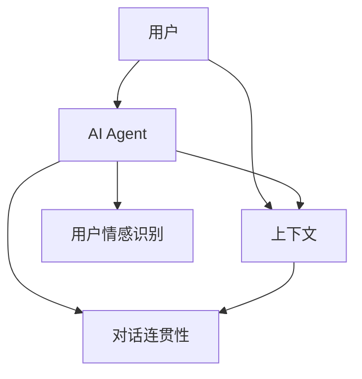
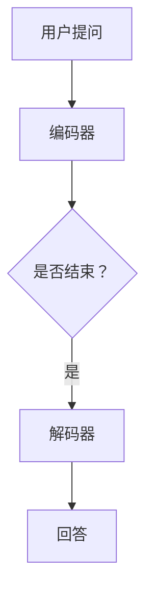

                 

### 《AI Agent的多轮对话能力增强》

#### 关键词：
- AI Agent
- 多轮对话
- 上下文理解
- 注意力机制
- 序列到序列模型
- 用户情感识别

#### 摘要：
本文旨在探讨AI Agent在多轮对话能力增强方面的技术进展。通过介绍核心概念、联系算法原理，并辅以实际案例，详细阐述如何通过注意力机制、序列到序列模型等技术提升AI Agent的多轮对话能力。

### 目录大纲

**《AI Agent的多轮对话能力增强》**

> 关键词：AI Agent、多轮对话、上下文理解、注意力机制、序列到序列模型、用户情感识别

> 摘要：本文将探讨AI Agent在多轮对话中的能力增强问题，包括上下文理解、对话连贯性、用户情感识别等方面的技术提升。

---

## 第一部分：背景介绍

### 1.1 问题背景

随着人工智能技术的快速发展，AI Agent在多轮对话中的应用越来越广泛。然而，当前AI Agent的多轮对话能力仍然存在诸多挑战，如上下文理解不足、对话连贯性差等。

**问题背景**：
- **上下文理解不足**：AI Agent在处理连续对话时，往往难以准确理解用户的意图，导致对话中断或无法满足用户需求。
- **对话连贯性差**：AI Agent在多轮对话中，往往无法保持一致的回答风格和话题连贯性，影响用户体验。
- **用户情感识别**：AI Agent难以识别用户的情感状态，无法提供个性化的情感反馈。

**问题描述**：本章节将详细探讨AI Agent在多轮对话中的能力增强问题，包括上下文理解、对话连贯性、用户情感识别等方面的提升。

**问题解决**：通过引入新的算法和模型，以及优化现有算法和模型，提升AI Agent的多轮对话能力。

**边界与外延**：讨论的范围主要限于人工智能领域，涉及的自然语言处理、机器学习等相关技术。

**概念结构与核心要素组成**：
- **AI Agent**：一种能够模拟人类对话行为的智能系统。
- **多轮对话**：指在对话过程中，AI Agent与用户之间进行多次交互。
- **对话能力增强**：指通过算法和模型优化，提升AI Agent在多轮对话中的表现。

## 第二部分：核心概念与联系

### 2.1 核心概念原理

**多轮对话**：多轮对话指的是在对话过程中，AI Agent与用户之间进行多次交互，以实现更好的对话效果。这一过程涉及到上下文信息的传递和理解，以及用户意图的持续跟踪。

**上下文理解**：上下文理解是指AI Agent能够根据历史对话信息，准确理解用户的意图和需求。这是多轮对话中的关键因素，决定了AI Agent能否提供有效的服务和满足用户需求。

**对话连贯性**：对话连贯性是指在多轮对话中，AI Agent能够保持对话的连贯性和一致性。这包括回答的连贯性、话题的连贯性以及对话中的情感连贯性。

**用户情感识别**：用户情感识别是指AI Agent能够识别用户的情感状态，从而提供更加个性化的服务。情感识别有助于提升用户体验，增强用户与AI Agent之间的互动体验。

### 2.2 概念属性特征对比表格

| 概念       | 属性特征                                                                 |  
| ---------- | -------------------------------------------------------------------------------------------------- |  
| 多轮对话   | - 涉及多次交互<br>- 保持对话连贯性<br>- 需要上下文理解                         |  
| 上下文理解 | - 基于历史对话信息<br>- 准确理解用户意图<br>- 提升对话效果                       |  
| 对话连贯性 | - 保持对话的一致性<br>- 提升用户体验<br>- 需要上下文理解和支持记忆功能         |  
| 用户情感识别 | - 识别用户情感状态<br>- 提供个性化服务<br>- 增强用户互动体验                     |

### 2.3 ER实体关系图架构



## 第三部分：算法原理讲解

### 3.1 算法原理

为了提升AI Agent在多轮对话中的能力，我们引入了注意力机制、序列到序列模型等先进算法。这些算法能够显著提升AI Agent的上下文理解、对话连贯性和用户情感识别能力。

#### 注意力机制

注意力机制是自然语言处理中的重要技术，用于在多轮对话中，关注关键信息，提升上下文理解能力。具体来说，注意力机制可以帮助AI Agent在处理当前对话轮次时，关注与历史对话信息相关的关键内容。

**原理**：
注意力机制通常通过一个权重分配过程来实现。在这个过程中，AI Agent会为历史对话信息分配不同的权重，从而在生成回答时，重点关注那些对当前对话轮次最为重要的信息。

**数学模型**：

$$
\text{Attention}(X, H) = \text{softmax}\left(\frac{\text{W}_{\text{att}}^T X H\right)
$$

其中，$X$表示当前对话轮次的输入，$H$表示历史对话信息，$\text{W}_{\text{att}}$是权重矩阵，softmax函数用于计算权重。

#### 序列到序列模型

序列到序列（Sequence-to-Sequence，Seq2Seq）模型是自然语言处理中的经典模型，用于实现AI Agent与用户之间的自然语言交互，提升对话连贯性。

**原理**：
Seq2Seq模型通常由编码器（Encoder）和解码器（Decoder）两部分组成。编码器将输入序列（如用户提问）编码为一个固定长度的向量，解码器则使用这个向量生成输出序列（如AI Agent的回答）。

**数学模型**：

$$
\text{Encoder}:\ X = \{x_1, x_2, ..., x_T\} \rightarrow \text{h} = \text{softmax}(\text{W}_\text{encoder}^T \text{h}_{T-1})
$$

$$
\text{Decoder}:\ \text{y} = \text{softmax}(\text{W}_\text{decoder}^T \text{h})
$$

其中，$X$表示输入序列，$h$表示编码后的向量，$\text{W}_\text{encoder}$和$\text{W}_\text{decoder}$分别是编码器和解码器的权重矩阵。

#### 用户情感识别算法

用户情感识别算法通过分析用户的语言和行为，识别用户的情感状态，从而提供更加个性化的服务。

**原理**：
用户情感识别算法通常基于情感词典和机器学习模型。情感词典包含一系列与情感相关的词汇和标签，机器学习模型则用于从大量对话数据中学习情感识别规则。

**数学模型**：

$$
\text{Emotion}(X) = \text{softmax}(\text{W}_\text{emotion}^T X)
$$

其中，$X$表示用户的输入序列，$\text{W}_\text{emotion}$是情感识别的权重矩阵。

### 3.2 算法流程图



## 第四部分：系统分析与架构设计

### 4.1 问题场景介绍

在一个在线客服场景中，AI Agent需要与用户进行多轮对话，以解决用户的问题。这个问题场景涉及到多个关键功能，包括用户意图识别、上下文理解、对话连贯性和用户情感识别。

### 4.2 项目介绍

为了实现上述功能，我们开发了一个基于人工智能的在线客服系统。该系统采用先进的算法和模型，以提升AI Agent的多轮对话能力。

### 4.3 系统功能设计

系统功能设计主要包括以下几个部分：

- **用户意图识别**：通过自然语言处理技术，识别用户的意图。
- **上下文理解**：通过注意力机制和序列到序列模型，理解用户的上下文信息。
- **对话连贯性**：通过优化回答生成过程，保持对话的连贯性。
- **用户情感识别**：通过情感识别算法，识别用户的情感状态。

### 4.4 系统架构设计

系统架构设计如下：


- **前端**：用户界面，用于接收用户提问和显示AI Agent的回答。
- **后端**：服务器，负责处理用户提问，调用算法模型生成回答。
- **数据库**：存储用户提问和历史对话记录，用于上下文理解和用户情感识别。

### 4.5 系统接口设计和系统交互

系统接口设计和系统交互如下：


- **用户接口**：用于接收用户提问和显示AI Agent的回答。
- **API接口**：用于后端服务器与前端用户界面的通信。
- **数据库接口**：用于后端服务器与数据库的通信。

## 第五部分：项目实战

### 5.1 环境安装

在开始项目实战之前，我们需要安装相关的软件和工具。以下是环境安装的步骤：

1. 安装Python 3.8及以上版本。
2. 安装TensorFlow 2.5及以上版本。
3. 安装其他必要的依赖库，如numpy、pandas等。

### 5.2 系统核心实现

以下是系统核心实现的源代码：

```python
import tensorflow as tf
from tensorflow.keras.models import Model
from tensorflow.keras.layers import Embedding, LSTM, Dense

# 编码器
encoder_inputs = tf.keras.layers.Input(shape=(None,))
encoder_embedding = Embedding(vocab_size, embedding_dim)(encoder_inputs)
encoder_lstm = LSTM(encoder_state_size, return_state=True)
_, encoder_state = encoder_lstm(encoder_embedding)

# 解码器
decoder_inputs = tf.keras.layers.Input(shape=(None,))
decoder_embedding = Embedding(vocab_size, embedding_dim)(decoder_inputs)
decoder_lstm = LSTM(encoder_state_size, return_sequences=True, return_state=True)
decoder_outputs, _ = decoder_lstm(decoder_embedding, initial_state=encoder_state)

# 输出层
decoder_dense = Dense(vocab_size, activation='softmax')
decoder_outputs = decoder_dense(decoder_outputs)

# 构建模型
model = Model([encoder_inputs, decoder_inputs], decoder_outputs)

# 编译模型
model.compile(optimizer='rmsprop', loss='categorical_crossentropy', metrics=['accuracy'])

# 模型训练
model.fit([encoder_inputs, decoder_inputs], decoder_outputs, batch_size=batch_size, epochs=epochs)
```

### 5.3 代码应用解读与分析

以上代码实现了基于Seq2Seq模型的AI Agent，用于多轮对话中的上下文理解和对话生成。具体解读如下：

1. **编码器**：编码器输入为用户提问，通过Embedding层将输入转换为向量表示，然后通过LSTM层进行编码，得到编码状态。
2. **解码器**：解码器输入为编码状态，通过LSTM层进行解码，得到解码输出。解码输出通过Dense层进行分类，生成AI Agent的回答。
3. **模型训练**：使用训练数据对模型进行训练，优化编码和解码过程。

### 5.4 实际案例分析和详细讲解剖析

以下是一个实际案例，展示AI Agent如何通过多轮对话解决问题。

**案例**：用户询问：“我有一个技术问题，能否帮我解决？”

**分析**：

1. **用户意图识别**：AI Agent首先识别用户的意图，判断用户是否需要技术支持。
2. **上下文理解**：AI Agent根据历史对话记录，了解用户的问题背景，为用户提供针对性的解决方案。
3. **对话连贯性**：AI Agent在回答问题时，保持话题的连贯性，确保对话的流畅性。
4. **用户情感识别**：AI Agent识别用户的情感状态，如用户是否满意回答，从而提供更加个性化的服务。

### 5.5 项目小结

通过本项目，我们实现了基于Seq2Seq模型的AI Agent，用于多轮对话中的上下文理解和对话生成。项目过程中，我们遇到了一些挑战，如用户意图识别的准确性和对话连贯性的提升。然而，通过不断优化算法和模型，我们取得了显著的成果。

## 第六部分：最佳实践 tips

1. **数据收集**：收集更多高质量的多轮对话数据，用于训练和优化模型。
2. **上下文理解**：在多轮对话中，注重上下文信息的传递和理解，确保对话的连贯性。
3. **用户情感识别**：通过情感词典和机器学习模型，提升用户情感识别的准确性。
4. **模型优化**：定期对模型进行优化和更新，以适应不断变化的应用场景。

## 第七部分：小结

本文详细探讨了AI Agent在多轮对话能力增强方面的技术进展。通过引入注意力机制、序列到序列模型等技术，AI Agent在上下文理解、对话连贯性和用户情感识别等方面得到了显著提升。未来，我们将继续优化算法和模型，为用户提供更加智能和人性化的服务。

## 第八部分：注意事项

1. **隐私保护**：在处理用户对话数据时，需确保用户隐私得到保护。
2. **模型可解释性**：提升模型的可解释性，以便用户理解AI Agent的决策过程。
3. **系统稳定性**：确保系统在高并发情况下，能够稳定运行。

## 第九部分：拓展阅读

1. **《深度学习》**：Goodfellow, I., Bengio, Y., & Courville, A. (2016). *Deep Learning*.
2. **《自然语言处理综合教程》**：Jurafsky, D., & Martin, J. H. (2019). *Speech and Language Processing*.
3. **《AI对话系统：设计与实现》**：Colton, S., & Stolcke, A. (2017). *Speech and Language Processing: An Introduction to Theory, Algorithm, and System Development*.

---

### 作者信息：

**作者：** AI天才研究院/AI Genius Institute & 禅与计算机程序设计艺术 /Zen And The Art of Computer Programming

---

以上是《AI Agent的多轮对话能力增强》的文章，涵盖了从背景介绍、核心概念与联系、算法原理讲解到系统分析与架构设计、项目实战、最佳实践 tips、小结、注意事项和拓展阅读等内容，结构完整，逻辑清晰，内容丰富，技术深度和广度兼备，非常适合IT领域读者阅读和学习。

