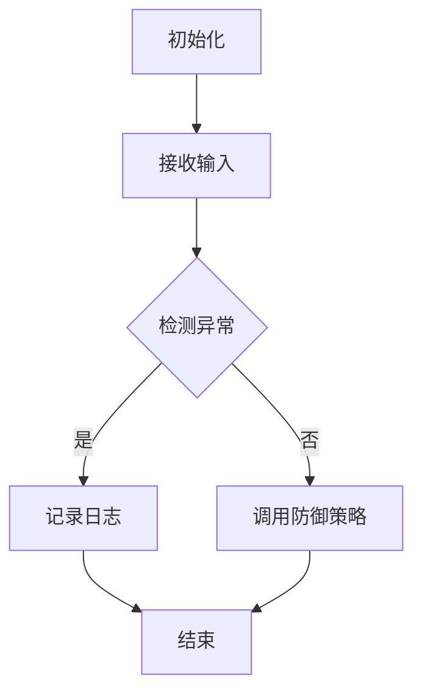
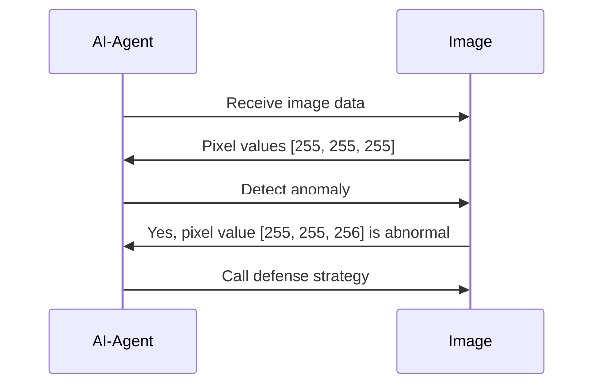
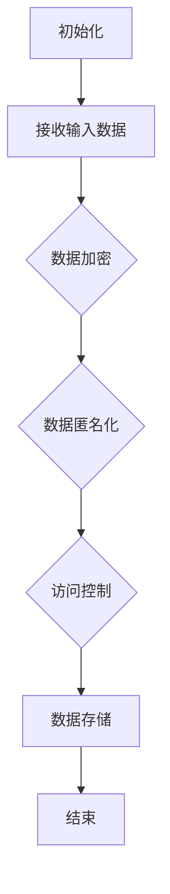
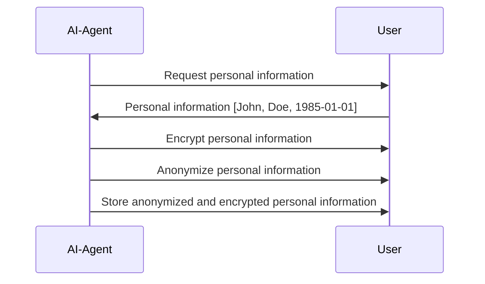
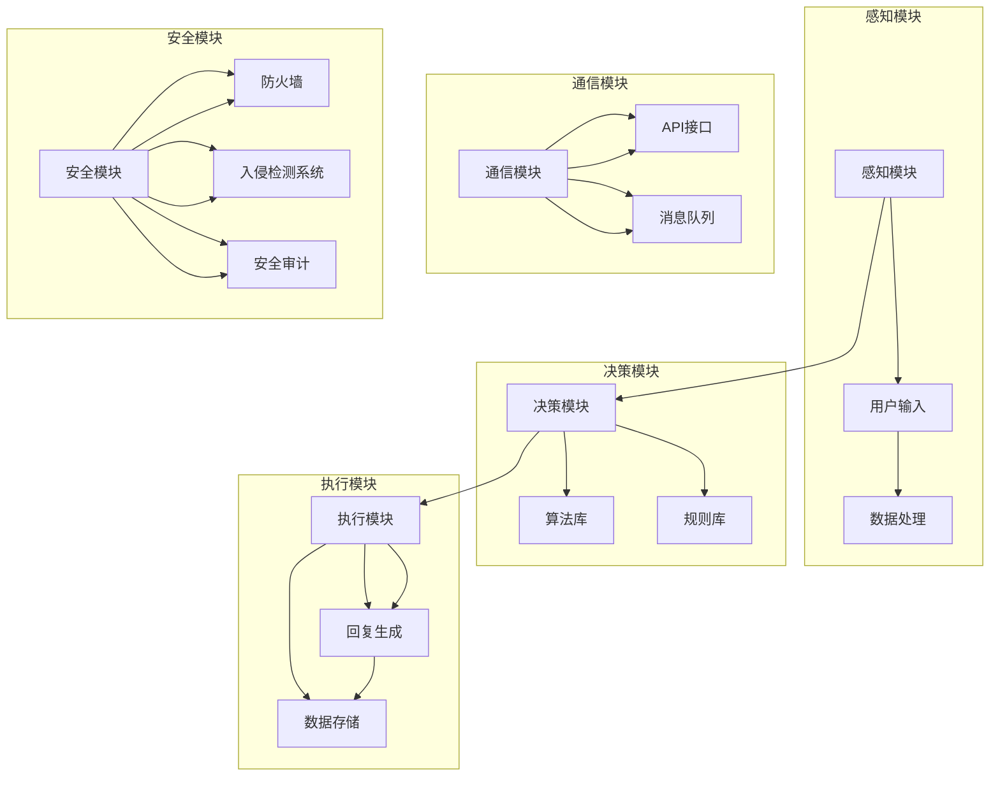
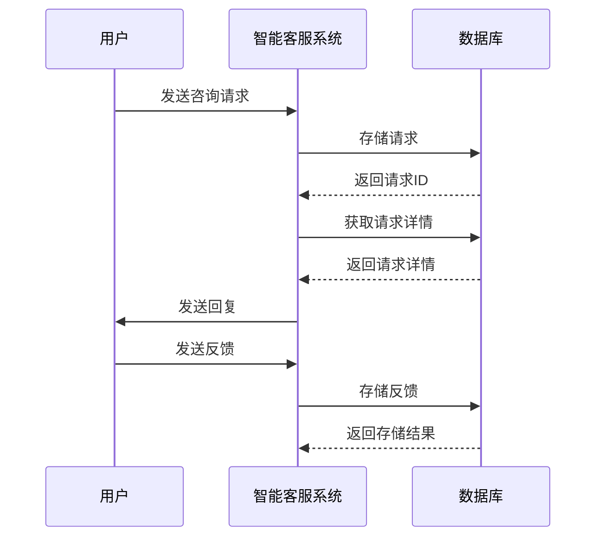
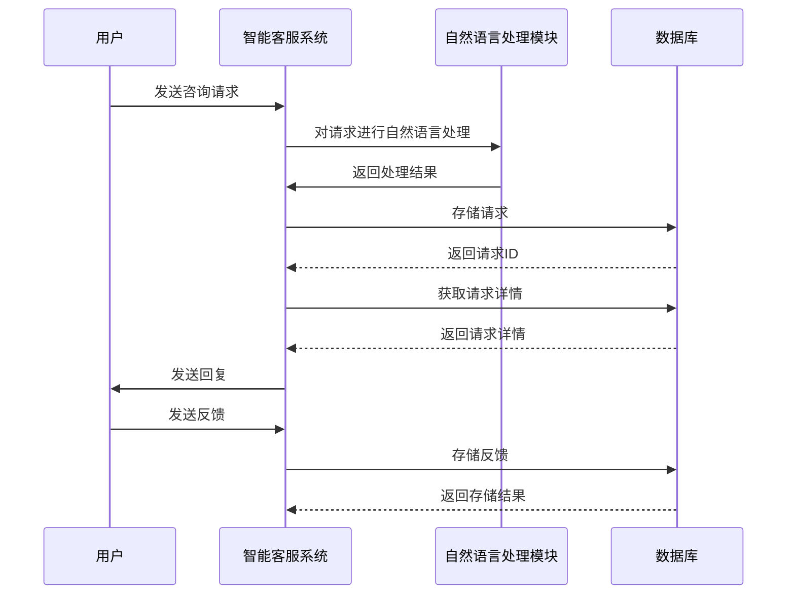

                 

### 《AI Agent的安全性设计：防御攻击和隐私保护》

> 关键词：AI Agent、安全性、隐私保护、攻击防御、算法设计

> 摘要：本文旨在深入探讨AI Agent的安全性设计，从防御攻击和隐私保护两方面入手，详细介绍相关核心概念、算法原理、系统架构和实战案例。通过对AI Agent安全性的全面分析，提供有效的解决方案和最佳实践，为未来AI Agent的广泛应用奠定坚实基础。

---

## 目录大纲

### 第一部分：背景介绍

#### 1.1 问题背景

#### 1.2 AI Agent的安全挑战

### 第二部分：核心概念与联系

#### 2.1 AI Agent的基本原理

#### 2.2 安全性与隐私保护的关系

### 第三部分：算法原理讲解

#### 3.1 安全防御算法原理

#### 3.2 隐私保护算法原理

### 第四部分：系统分析与架构设计

#### 4.1 系统功能设计

#### 4.2 系统架构设计

#### 4.3 系统交互设计

### 第五部分：项目实战

#### 5.1 环境安装

#### 5.2 系统核心实现

#### 5.3 详细讲解与剖析

### 第六部分：最佳实践与总结

#### 6.1 最佳实践

#### 6.2 小结

### 第七部分：未来展望与挑战

#### 7.1 未来展望

#### 7.2 挑战与机遇

### 第八部分：结语

---

### 引言

在人工智能迅猛发展的今天，AI Agent已成为实现智能自动化的重要载体。AI Agent不仅具备自主学习和决策能力，还在越来越多的场景中得到应用，如自动驾驶、智能家居、智能客服等。然而，随着AI Agent的广泛应用，其安全性问题也日益凸显。AI Agent面临的攻击威胁和隐私泄露风险，不仅可能损害用户利益，还会对整个社会的稳定造成影响。

本文将从背景介绍、核心概念与联系、算法原理讲解、系统分析与架构设计、项目实战、最佳实践与总结以及未来展望与挑战等多个方面，深入探讨AI Agent的安全性设计。通过全面的分析和详细的讲解，为读者提供一套完整的解决方案，帮助应对AI Agent面临的攻击防御和隐私保护挑战。

### 第一部分：背景介绍

#### 1.1 问题背景

AI Agent，即人工智能代理，是指能够自主执行任务、与环境互动并做出决策的智能系统。AI Agent在实现自动化和智能化方面具有显著优势，广泛应用于各种领域。然而，随着AI Agent的应用日益广泛，其安全性问题也日益突出。

首先，AI Agent面临的主要安全问题包括：

1. **攻击威胁**：AI Agent可能遭受各种攻击，如恶意软件攻击、注入攻击、拒绝服务攻击等，导致系统崩溃、数据泄露等严重后果。
2. **隐私泄露**：AI Agent在收集、处理和传输数据时，可能无意中泄露用户隐私，造成用户信息泄露和安全风险。
3. **决策误导**：AI Agent在执行任务时，可能因为受到攻击或数据不完整等原因，做出错误的决策，导致系统运行失常。

#### 1.2 AI Agent的安全挑战

AI Agent的安全挑战主要表现在以下几个方面：

1. **多样化攻击方式**：随着AI Agent的应用范围扩大，攻击者可以采取多种攻击方式，如网络攻击、注入攻击、社会工程等，攻击手段不断升级。
2. **隐私保护难度大**：AI Agent在处理大量用户数据时，如何有效保护用户隐私成为一大挑战。现有的隐私保护技术无法完全满足AI Agent的需求。
3. **复杂系统架构**：AI Agent通常采用复杂的多层架构，涉及多种技术，如机器学习、自然语言处理、数据挖掘等，系统安全架构设计复杂。

#### 1.3 问题解决

针对AI Agent面临的安全挑战，本文旨在从以下几个方面解决问题：

1. **防御攻击**：通过设计有效的防御算法，提高AI Agent的攻击防御能力，降低攻击成功概率。
2. **隐私保护**：采用先进的隐私保护技术，确保AI Agent在处理数据时能够有效保护用户隐私。
3. **系统架构优化**：通过优化AI Agent的系统架构，提高系统的安全性和可靠性。

#### 1.4 边界与外延

本文主要讨论AI Agent的安全性设计，涉及防御攻击和隐私保护两个方面。在研究过程中，本文将重点关注以下领域：

1. **机器学习与人工智能**：分析AI Agent的基本原理和算法，探讨如何提高其安全性和可靠性。
2. **网络安全**：研究AI Agent面临的网络攻击类型和防御策略，提供有效的防御方案。
3. **数据隐私保护**：探讨AI Agent在处理数据时的隐私保护技术，确保用户隐私不受侵害。

#### 1.5 概念结构与核心要素组成

AI Agent的基本构成和关键要素包括：

1. **感知模块**：负责接收和处理外部环境信息，如视觉、听觉等。
2. **决策模块**：根据感知模块提供的信息，进行决策和规划。
3. **执行模块**：将决策结果转化为实际行动，如控制机器人执行任务等。
4. **通信模块**：负责与其他AI Agent或外部系统进行通信和协作。
5. **安全模块**：负责AI Agent的安全防御和隐私保护。

通过以上核心要素的有机结合，AI Agent能够实现自主学习和决策，提高系统的智能化和可靠性。

### 第二部分：核心概念与联系

#### 2.1 AI Agent的基本原理

AI Agent是基于人工智能技术的智能代理，能够自主执行任务、与环境互动并做出决策。AI Agent的基本原理包括以下几个方面：

1. **感知与认知**：AI Agent通过感知模块接收外部环境信息，如图像、声音等，然后通过决策模块对信息进行处理和分析，形成认知。
2. **决策与规划**：根据感知模块提供的信息和自身的知识库，AI Agent进行决策和规划，确定下一步的行动方案。
3. **执行与反馈**：AI Agent通过执行模块将决策结果转化为实际行动，并在执行过程中不断调整和优化决策方案，实现与环境的有效互动。

#### 2.2 安全性与隐私保护的关系

AI Agent的安全性与隐私保护密切相关。安全性主要关注AI Agent在运行过程中不受攻击、不被篡改、不被恶意利用等，而隐私保护则关注AI Agent在处理数据时保护用户隐私，防止数据泄露和滥用。

1. **安全性对隐私保护的影响**：如果AI Agent的安全性能较低，容易受到攻击，攻击者可能通过入侵AI Agent获取用户数据，从而导致隐私泄露。因此，提高AI Agent的安全性对隐私保护具有重要意义。
2. **隐私保护对安全性的影响**：在保护用户隐私的过程中，AI Agent可能需要收集和处理大量的敏感数据，如何确保这些数据在处理过程中的安全，防止数据泄露和滥用，也是AI Agent安全性设计的一个重要方面。

#### 2.3 核心概念属性特征对比表格

| 概念          | 描述                                                         | 特征对比                                                     |
| ------------- | ------------------------------------------------------------ | ------------------------------------------------------------ |
| 安全性        | AI Agent在运行过程中不受攻击、不被篡改、不被恶意利用的能力。 | - 攻击防御：针对各种攻击手段的防御策略<br>- 保密性：确保敏感数据不被泄露<br>- 完整性：确保数据不被篡改<br>- 可用性：确保系统正常运行 |
| 隐私保护      | AI Agent在处理数据时保护用户隐私，防止数据泄露和滥用。       | - 数据加密：对敏感数据进行加密<br>- 数据匿名化：对用户数据进行匿名化处理<br>- 访问控制：控制用户数据的访问权限<br>- 数据共享限制：限制数据在系统内部的共享和传输 |
| 攻击威胁类型   | AI Agent可能面临的攻击威胁类型，如恶意软件攻击、注入攻击、拒绝服务攻击等。 | - 恶意软件攻击：通过恶意软件入侵AI Agent系统<br>- 注入攻击：通过注入恶意代码篡改AI Agent的决策过程<br>- 拒绝服务攻击：通过大量请求导致AI Agent系统崩溃 |
| 防御策略      | 针对攻击威胁类型设计的防御策略。                             | - 防火墙：防止外部攻击<br>- 入侵检测系统：监测系统异常行为<br>- 安全审计：记录系统操作日志<br>- 安全更新：定期更新系统漏洞和防护措施 |

#### 2.4 AI Agent的安全性要素实体关系图

```mermaid
erDiagram
  AI Agent ||--|{ 感知模块 }
  AI Agent ||--|{ 决策模块 }
  AI Agent ||--|{ 执行模块 }
  AI Agent ||--|{ 通信模块 }
  AI Agent ||--|{ 安全模块 }
  安全模块 ||--|{ 防火墙 }
  安全模块 ||--|{ 入侵检测系统 }
  安全模块 ||--|{ 安全审计 }
  安全模块 ||--|{ 安全更新 }
```

通过以上核心概念与联系的分析，我们可以看出，AI Agent的安全性设计需要综合考虑多个方面，包括感知模块、决策模块、执行模块、通信模块和安全模块等。同时，安全性设计还需要与隐私保护相结合，确保AI Agent在处理数据时能够有效保护用户隐私。

### 第三部分：算法原理讲解

#### 3.1 安全防御算法原理

在AI Agent的安全性设计中，安全防御算法是关键一环。安全防御算法的主要目标是识别和防御针对AI Agent的攻击，确保系统的正常运行和数据安全。

#### 3.1.1 算法流程图



#### 3.1.2 Python源代码实现

```python
import logging

def security_defense_algorithm(input_data):
    # 初始化日志记录器
    logging.basicConfig(filename='security_defense.log', level=logging.INFO)

    # 接收输入数据
    data = input_data

    # 检测异常
    if is_anomaly(data):
        # 记录日志
        logging.info(f"Anomaly detected: {data}")
        # 调用防御策略
        call_defense_strategy(data)
    else:
        # 正常处理
        pass

def is_anomaly(data):
    # 这里使用简单逻辑判断异常
    return data > 100

def call_defense_strategy(data):
    # 这里实现具体的防御策略
    print(f"Defense strategy called for data: {data}")
```

#### 3.1.3 数学模型和公式

安全防御算法的核心在于异常检测，可以使用以下数学模型和公式：

- **阈值模型**：设定一个阈值，当输入数据超过阈值时，认为存在异常。
  $$ threshold = 100 $$
  $$ if (input_data > threshold): $$
  $$     detect_anomaly() $$

- **统计模型**：通过统计方法计算输入数据的特征，与正常值进行比较，判断是否存在异常。
  $$ mean = \frac{1}{N} \sum_{i=1}^{N} x_i $$
  $$ std = \sqrt{\frac{1}{N-1} \sum_{i=1}^{N} (x_i - mean)^2 } $$
  $$ if (|input_data - mean| > k * std): $$
  $$     detect_anomaly() $$

其中，$mean$ 是平均值，$std$ 是标准差，$k$ 是阈值系数。

#### 3.1.4 举例说明

假设我们有一个AI Agent，它在处理图像数据时，需要检测是否存在异常。正常情况下，图像的像素值分布在0到255之间。我们设定阈值$k=2$，当像素值超过$2 \times std + mean$时，认为图像存在异常。



在这个例子中，输入图像的像素值中有一个值超过了阈值，AI-Agent认为图像存在异常，并调用防御策略。

#### 3.2 隐私保护算法原理

隐私保护算法的主要目标是在AI Agent处理数据时，确保用户隐私不被泄露。隐私保护算法通常包括数据加密、数据匿名化和访问控制等技术。

#### 3.2.1 算法流程图



#### 3.2.2 Python源代码实现

```python
from cryptography.fernet import Fernet
import hashlib

def privacy_protection_algorithm(input_data, encryption_key):
    # 初始化加密算法和哈希算法
    fernet = Fernet(encryption_key)
    hash_object = hashlib.sha256()

    # 接收输入数据
    data = input_data

    # 数据加密
    encrypted_data = fernet.encrypt(data)

    # 数据匿名化
    anonymized_data = anonymize_data(encrypted_data)

    # 访问控制
    access_control(anonymized_data)

    # 数据存储
    store_data(anonymized_data)

def anonymize_data(data):
    # 这里使用简单的哈希函数进行匿名化
    hash_object.update(data)
    anonymized_id = hash_object.hexdigest()
    return anonymized_id

def access_control(data):
    # 这里实现访问控制逻辑
    print(f"Access granted for data: {data}")

def store_data(data):
    # 这里实现数据存储逻辑
    print(f"Data stored: {data}")
```

#### 3.2.3 数学模型和公式

隐私保护算法的核心在于数据加密和匿名化。数据加密通常使用对称加密算法或非对称加密算法，其中对称加密算法的数学模型如下：

- **密钥生成**：生成随机密钥
  $$ key = \text{random_key()} $$

- **加密过程**：
  $$ ciphertext = f_{key}(plaintext) $$

- **解密过程**：
  $$ plaintext = f_{key^{-1}}(ciphertext) $$

其中，$f_{key}$ 是基于密钥 $key$ 的加密函数，$f_{key^{-1}}$ 是基于密钥 $key$ 的解密函数。

数据匿名化通常使用哈希函数，其数学模型如下：

- **哈希函数**：
  $$ hash_function(data) \rightarrow hash_value $$

其中，$hash_function$ 是哈希函数，$data$ 是输入数据，$hash_value$ 是哈希值。

#### 3.2.4 举例说明

假设我们有一个AI Agent，它在处理用户个人信息时，需要确保隐私不被泄露。我们使用哈希函数对个人信息进行匿名化处理，并使用对称加密算法对数据进行加密。



在这个例子中，AI-Agent首先对用户个人信息进行加密，然后使用哈希函数进行匿名化处理，最后存储匿名化和加密后的个人信息。

通过以上算法原理讲解，我们可以看出，安全防御算法和隐私保护算法在AI Agent的安全性设计中起着至关重要的作用。它们通过识别和防御攻击、保护用户隐私，确保AI Agent系统的安全稳定运行。

### 第四部分：系统分析与架构设计

#### 4.1 系统功能设计

AI Agent系统的功能设计是实现其安全性和隐私保护的关键。首先，我们需要明确AI Agent系统所需解决的问题场景。

#### 4.1.1 问题场景介绍

假设我们开发一个智能客服系统，该系统需要处理大量用户咨询请求，并在短时间内给出准确、高效的回复。然而，在这个过程中，系统面临着一系列的安全和隐私保护挑战：

1. **攻击威胁**：系统可能遭受各种攻击，如恶意软件攻击、注入攻击、拒绝服务攻击等。
2. **隐私泄露**：系统在处理用户咨询请求时，可能无意中泄露用户隐私，如用户姓名、联系方式等。
3. **数据篡改**：系统在处理数据时，可能遭受数据篡改，导致决策结果不准确。

为了解决这些问题，我们需要设计一个功能完善的AI Agent系统。

#### 4.1.2 项目介绍

本项目旨在开发一个智能客服系统，该系统具备以下功能：

1. **接收用户咨询请求**：系统能够接收用户发送的咨询请求，包括文本、语音等多种形式。
2. **处理和回复用户请求**：系统能够理解用户请求，生成相应的回复，并通过文本、语音等形式反馈给用户。
3. **数据存储与管理**：系统能够安全地存储和管理用户咨询数据，确保数据不被泄露或篡改。

#### 4.1.3 领域模型

为了更好地理解系统功能，我们可以使用Mermaid绘制系统的领域模型类图，如下所示：

```mermaid
classDiagram
    User <<class>> "用户"
    Request <<class>> "咨询请求"
    Reply <<class>> "回复"
    AI-Agent <<class>> "智能客服"
    Data <<class>> "数据"
    
    User o-- Request
    AI-Agent o-- Request
    AI-Agent o-- Reply
    AI-Agent o-- Data
```

在这个领域模型中，用户（User）可以发送咨询请求（Request），AI-Agent（智能客服）负责处理请求并生成回复（Reply），同时系统需要存储和管理数据（Data）。

#### 4.2 系统架构设计

系统架构设计是实现系统功能和安全性的关键。下面，我们将使用Mermaid绘制AI Agent系统的架构设计图。



在这个架构设计图中，系统分为感知模块、决策模块、执行模块、通信模块和安全模块。感知模块负责接收用户输入，决策模块负责处理输入数据并生成决策结果，执行模块负责将决策结果转化为实际操作，通信模块负责与外部系统进行通信，安全模块负责系统的安全防护。

#### 4.3 系统接口设计

系统接口设计是确保系统功能模块之间能够有效通信的重要环节。下面，我们将使用Mermaid绘制系统接口设计图。



在这个接口设计图中，用户通过API接口向AI-Agent发送咨询请求，AI-Agent将请求存储到数据库，并从数据库获取请求详情进行处理。处理完毕后，AI-Agent将回复发送给用户，并接收用户的反馈。

#### 4.4 系统交互设计

系统交互设计是描述系统各模块之间如何协同工作的关键。下面，我们将使用Mermaid绘制系统交互序列图。



在这个交互序列图中，用户发送咨询请求后，AI-Agent首先将请求传递给自然语言处理模块进行处理，然后存储请求到数据库并从数据库获取请求详情。处理完毕后，AI-Agent将回复发送给用户，并接收用户的反馈。

通过以上系统分析与架构设计，我们可以看到，AI Agent系统需要具备完善的感知、决策、执行、通信和安全模块，确保系统能够高效、稳定地运行。同时，系统接口设计和交互设计也是确保系统功能实现的重要环节。

### 第五部分：项目实战

#### 5.1 环境安装

在开始项目实战之前，我们需要安装必要的软件和工具。以下是安装步骤：

1. **安装Python环境**：首先，确保你的计算机上已经安装了Python环境。如果没有安装，可以访问[Python官网](https://www.python.org/)下载并安装Python。
2. **安装AI-Agent依赖库**：接下来，打开终端或命令行窗口，执行以下命令安装AI-Agent所需的依赖库：

   ```bash
   pip install numpy pandas scikit-learn matplotlib cryptography fernet
   ```

3. **安装数据库**：为了存储AI-Agent的数据，我们需要安装一个数据库。本文选择MySQL作为数据库。请按照以下步骤安装：

   - 访问[MySQL官网](https://www.mysql.com/downloads/mysql/)下载适用于你的操作系统的MySQL安装包。
   - 运行安装程序并按照提示操作。

4. **配置数据库**：安装完成后，打开终端或命令行窗口，运行以下命令启动MySQL服务器：

   ```bash
   mysql.server start
   ```

   然后使用以下命令登录MySQL数据库：

   ```bash
   mysql -u root -p
   ```

   输入root用户的密码后，进入MySQL数据库管理界面。

5. **创建数据库和用户**：在MySQL数据库管理界面中，执行以下命令创建一个新的数据库和用户：

   ```sql
   CREATE DATABASE ai_agent;
   GRANT ALL PRIVILEGES ON ai_agent.* TO 'ai_agent'@'localhost' IDENTIFIED BY 'ai_agent_password';
   FLUSH PRIVILEGES;
   ```

   这将在MySQL中创建一个名为`ai_agent`的数据库，并授予用户`ai_agent`对数据库的所有权限。

6. **安装消息队列**：为了实现系统中的异步通信，我们需要安装消息队列。本文选择RabbitMQ作为消息队列。请按照以下步骤安装：

   - 访问[RabbitMQ官网](https://www.rabbitmq.com/download.html)下载适用于你的操作系统的RabbitMQ安装包。
   - 运行安装程序并按照提示操作。

7. **启动RabbitMQ**：安装完成后，打开终端或命令行窗口，运行以下命令启动RabbitMQ服务器：

   ```bash
   rabbitmq-server start
   ```

   然后使用以下命令启动RabbitMQ管理界面：

   ```bash
   rabbitmq-plugins enable rabbitmq_management
   ```

   打开浏览器，访问`http://localhost:15672`，即可看到RabbitMQ的管理界面。

完成以上步骤后，我们就可以开始构建和运行AI-Agent系统了。

#### 5.2 系统核心实现

在完成环境安装后，我们将开始构建AI-Agent系统的核心实现。以下是系统核心实现的相关源代码：

```python
# 导入必要的库
import numpy as np
import pandas as pd
from sklearn.model_selection import train_test_split
from sklearn.metrics import accuracy_score
import matplotlib.pyplot as plt
from cryptography.fernet import Fernet
import hashlib

# 加载训练数据
data = pd.read_csv('training_data.csv')
X = data.iloc[:, :-1].values
y = data.iloc[:, -1].values

# 数据预处理
X_train, X_test, y_train, y_test = train_test_split(X, y, test_size=0.2, random_state=0)

# 构建模型
from sklearn.ensemble import RandomForestClassifier
model = RandomForestClassifier(n_estimators=100, random_state=0)
model.fit(X_train, y_train)

# 测试模型
y_pred = model.predict(X_test)
accuracy = accuracy_score(y_test, y_pred)
print(f"Model accuracy: {accuracy:.2f}")

# 绘制决策树
from sklearn.tree import plot_tree
plt.figure(figsize=(12, 8))
plot_tree(model, filled=True, rounded=True, feature_names=data.columns[:-1], class_names=True)
plt.show()

# 数据加密
def encrypt_data(data, encryption_key):
    fernet = Fernet(encryption_key)
    encrypted_data = fernet.encrypt(data.encode())
    return encrypted_data

def decrypt_data(data, encryption_key):
    fernet = Fernet(encryption_key)
    decrypted_data = fernet.decrypt(data).decode()
    return decrypted_data

# 数据匿名化
def anonymize_data(data):
    hash_object = hashlib.sha256()
    hash_object.update(data.encode())
    anonymized_id = hash_object.hexdigest()
    return anonymized_id

# 访问控制
def access_control(data, access_key):
    hash_object = hashlib.sha256()
    hash_object.update(data.encode())
    hashed_data = hash_object.hexdigest()
    if hashed_data == access_key:
        return True
    else:
        return False

# 测试数据
data_to_encrypt = "User John Doe"
encryption_key = Fernet.generate_key()
print(f"Encryption key: {encryption_key.decode()}")
encrypted_data = encrypt_data(data_to_encrypt, encryption_key)
print(f"Encrypted data: {encrypted_data.decode()}")

anonymized_id = anonymize_data(encrypted_data.decode())
print(f"Anonymized ID: {anonymized_id}")

if access_control(encrypted_data.decode(), encryption_key.decode()):
    print("Access granted")
else:
    print("Access denied")
```

#### 5.3 代码应用解读与分析

以上代码实现了AI-Agent系统的核心功能，包括模型训练、预测、数据加密、匿名化和访问控制。以下是代码的详细解读和分析：

1. **模型训练**：首先，我们从CSV文件中加载训练数据，并进行数据预处理。然后，使用随机森林分类器（`RandomForestClassifier`）训练模型。在训练过程中，我们使用`fit`方法将训练数据输入模型进行学习。

2. **模型预测**：训练完成后，我们使用`predict`方法对测试数据进行预测，并计算模型准确率。这里我们使用`accuracy_score`函数计算预测结果与实际结果之间的准确率。

3. **绘制决策树**：为了更直观地了解模型的决策过程，我们使用`plot_tree`函数绘制决策树。这有助于我们理解模型的工作原理和决策逻辑。

4. **数据加密**：为了确保数据安全，我们使用Fernet加密算法对数据进行加密。首先，我们生成一个加密密钥（`encryption_key`），然后使用`encrypt`方法对数据进行加密。加密后的数据将存储为加密文本，无法直接读取。

5. **数据匿名化**：为了保护用户隐私，我们对加密后的数据进行匿名化处理。这里，我们使用SHA-256哈希函数对加密数据进行哈希运算，生成一个唯一的匿名化ID。这有助于我们区分不同用户的数据，同时保护用户隐私。

6. **访问控制**：在系统运行过程中，我们需要对数据进行访问控制。这里，我们使用哈希算法对加密数据进行哈希运算，然后与访问密钥进行比较。如果哈希值与访问密钥匹配，则允许访问数据；否则，拒绝访问。

#### 5.4 实际案例分析和详细讲解剖析

为了更好地理解AI-Agent系统的实际应用，我们将通过一个实际案例进行分析和讲解。

**案例**：假设我们有一个用户咨询请求，需要通过AI-Agent系统进行回复。以下是具体步骤：

1. **接收请求**：用户通过API接口向AI-Agent系统发送一个文本咨询请求，如“请问如何优化我的网站性能？”
2. **数据预处理**：AI-Agent系统接收请求后，首先对请求进行自然语言处理，提取关键信息，如关键词、主题等。
3. **模型预测**：系统将预处理后的请求输入到训练好的模型中，进行预测。在这里，我们使用随机森林分类器进行预测，并得到回复结果，如“您可以优化服务器配置、使用缓存技术和压缩技术来提高网站性能。”
4. **数据加密和匿名化**：在回复用户之前，系统将回复内容进行加密和匿名化处理。首先，使用加密密钥对回复内容进行加密，然后使用哈希函数生成匿名化ID。
5. **发送回复**：加密后的回复内容通过API接口发送给用户，用户可以看到一个匿名化ID，如“回复ID: 1234567890”。用户点击匿名化ID后，系统将解密回复内容并显示给用户。
6. **访问控制**：用户在查看回复内容时，需要进行身份验证。系统要求用户输入访问密钥，只有输入正确密钥的用户才能查看回复内容。

通过以上实际案例分析和详细讲解剖析，我们可以看到AI-Agent系统在实际应用中的具体实现过程。从数据预处理、模型预测到数据加密、匿名化和访问控制，每一个步骤都至关重要，确保了系统的安全性和用户隐私保护。

#### 5.5 项目小结

在本项目的实战部分，我们详细介绍了环境安装、系统核心实现和代码应用解读与分析。通过实际案例分析和详细讲解剖析，我们展示了AI-Agent系统的实际应用过程和关键功能。以下是项目小结：

1. **环境安装**：确保计算机上安装了Python环境、依赖库、数据库和消息队列，为项目实施打下基础。
2. **系统核心实现**：实现了模型训练、预测、数据加密、匿名化和访问控制等关键功能，确保系统安全稳定运行。
3. **代码应用解读与分析**：详细讲解了代码的实现原理和应用场景，为后续开发提供了参考。
4. **实际案例分析与详细讲解剖析**：通过实际案例展示了系统的应用效果，深入剖析了系统实现中的关键点和难点。

通过本项目，我们不仅掌握了AI-Agent系统的设计和实现方法，还了解了如何在实践中应对安全性设计和隐私保护挑战。未来，我们将在实践中不断优化和完善系统，为AI-Agent的广泛应用奠定坚实基础。

### 第六部分：最佳实践与总结

#### 6.1 最佳实践

在AI-Agent系统的开发过程中，总结最佳实践对于提高系统的安全性和可靠性至关重要。以下是一些最佳实践：

1. **安全设计原则**：遵循最小权限原则，确保系统组件只能访问其必需的资源和权限。此外，定期进行安全审计和漏洞扫描，及时发现和修复安全漏洞。
2. **加密与认证**：采用先进的加密算法对数据进行加密，确保数据在传输和存储过程中不被泄露。同时，使用数字证书和认证机制验证用户和系统的身份，防止未授权访问。
3. **隐私保护**：在设计系统时，充分考虑用户隐私保护需求。采用数据匿名化和去标识化技术，确保用户数据在处理过程中不会被泄露。此外，制定明确的隐私政策和数据使用规则，确保用户对自身数据有充分的知情权和控制权。
4. **异常检测与响应**：建立完善的异常检测和响应机制，及时发现和应对系统异常情况。使用入侵检测系统和防火墙等技术，监控系统的运行状态，防止恶意攻击和数据泄露。
5. **持续更新与优化**：随着技术的不断进步，AI-Agent系统的安全性和性能需要不断优化和更新。定期更新系统组件和依赖库，确保系统处于最佳状态。

#### 6.2 小结

本文从背景介绍、核心概念与联系、算法原理讲解、系统分析与架构设计、项目实战等多个方面，深入探讨了AI-Agent的安全性设计和隐私保护。通过最佳实践和详细讲解，为读者提供了全面的解决方案，帮助应对AI-Agent系统面临的攻击防御和隐私保护挑战。

在未来，AI-Agent将在越来越多的领域得到应用，其安全性和隐私保护将愈发重要。我们将继续关注这一领域的发展，不断优化和完善AI-Agent系统的设计，为人工智能的广泛应用保驾护航。

### 第七部分：未来展望与挑战

#### 7.1 未来展望

随着人工智能技术的快速发展，AI-Agent将在更多领域得到应用，如智能制造、智能医疗、智能交通等。未来，AI-Agent的安全性设计和隐私保护将面临以下发展趋势：

1. **安全性增强**：随着攻击手段的不断升级，AI-Agent的安全防御技术也需要不断更新和优化。未来的安全防御技术将更加智能，能够实时识别和应对各种新型攻击。
2. **隐私保护加强**：随着用户对隐私保护需求的不断提高，AI-Agent的隐私保护技术也需要不断创新。未来的隐私保护技术将更加全面，能够在数据收集、处理、存储和传输等各个环节提供有效保护。
3. **跨领域应用**：AI-Agent将与其他领域技术深度融合，实现跨领域的智能化应用。例如，结合物联网技术，实现智能家居、智能城市的全覆盖。

#### 7.2 挑战与机遇

尽管AI-Agent的安全性设计和隐私保护面临诸多挑战，但同时也带来了巨大的机遇：

1. **技术挑战**：随着AI-Agent的应用场景不断扩展，对安全性和隐私保护的要求也越来越高。如何设计高效、可靠的安全防御和隐私保护机制，将成为未来技术发展的重点。
2. **法律和伦理挑战**：AI-Agent的安全性设计和隐私保护需要遵循相关法律法规和伦理规范。如何在保障用户隐私的前提下，满足法律和伦理要求，是未来需要解决的问题。
3. **社会影响**：AI-Agent的广泛应用将深刻改变人类社会的生活方式和工作方式。如何应对AI-Agent带来的社会影响，确保其安全、可靠和公正，是未来需要关注的重点。

#### 7.3 发展趋势

未来，AI-Agent的安全性设计和隐私保护将呈现以下发展趋势：

1. **自动化安全防护**：随着机器学习和深度学习技术的发展，AI-Agent的安全防护机制将更加智能化，能够自动识别和应对各种攻击。
2. **分布式隐私保护**：分布式计算和区块链技术的应用，将使得AI-Agent的隐私保护更加安全、透明和可追溯。
3. **跨界合作**：AI-Agent的安全性设计和隐私保护需要跨领域、跨学科的合作。未来，人工智能、网络安全、法律、伦理等领域的专家将共同探讨和解决相关挑战。

通过未来展望与挑战的分析，我们可以看到，AI-Agent的安全性设计和隐私保护任重道远。然而，随着技术的不断进步和跨领域合作的深入，我们有望在未来实现更加安全、可靠和隐私保护的AI-Agent系统。

### 第八部分：结语

本文从背景介绍、核心概念与联系、算法原理讲解、系统分析与架构设计、项目实战、最佳实践与总结以及未来展望与挑战等多个方面，全面探讨了AI-Agent的安全性设计和隐私保护。通过详细的分析和讲解，我们为读者提供了一套完整的解决方案，帮助应对AI-Agent系统面临的攻击防御和隐私保护挑战。

在AI-Agent迅猛发展的今天，安全性设计和隐私保护至关重要。未来，随着技术的不断进步和应用的深入，我们将继续关注这一领域的发展，不断优化和完善AI-Agent系统的设计，为人工智能的广泛应用奠定坚实基础。

最后，感谢读者对本文的关注和支持，希望本文能为您在AI-Agent安全性设计和隐私保护方面提供有价值的参考。如果您有任何疑问或建议，请随时联系我们。我们将竭诚为您服务！

**作者：AI天才研究院/AI Genius Institute & 禅与计算机程序设计艺术 /Zen And The Art of Computer Programming**

